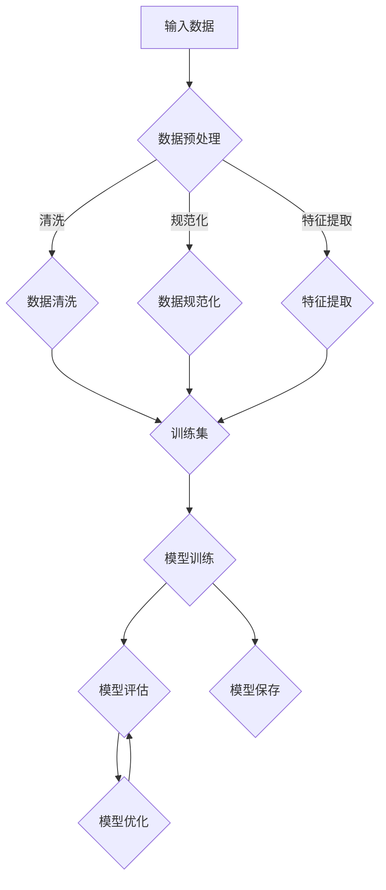

                 

### 文章标题

《软件2.0中的多任务学习架构》

### 关键词

多任务学习，软件2.0，深度学习，协同机制，优化策略

### 摘要

本文深入探讨了软件2.0环境下的多任务学习架构。首先，我们介绍了多任务学习的概念、背景及其重要性。接着，分析了多任务学习所面临的挑战，包括资源分配、策略优化和模型泛化能力等问题。随后，我们详细阐述了多任务学习的数学基础，包括概率图模型、贝叶斯网络和马尔可夫决策过程。在此基础上，介绍了多任务学习的常见算法，如线性模型、集成学习方法和神经网络方法。随后，文章重点讨论了多任务学习架构的设计、协同机制、深度学习实现及其在多个领域的应用案例。最后，我们探讨了多任务学习的实践与优化策略，包括项目实战、优化策略和未来趋势，为读者提供了一个全面、深入的视角。

### 第一部分：多任务学习基础

#### 第1章：多任务学习的概念与背景

**1.1 什么是多任务学习**

多任务学习（Multi-Task Learning, MTL）是一种机器学习方法，旨在同时解决多个相关任务。在多任务学习框架下，多个任务共享模型参数，从而提高模型的泛化能力和效率。多任务学习与单一任务学习相比，具有以下几个显著优势：

1. **提高模型泛化能力**：共享模型组件可以帮助模型更好地捕捉数据中的潜在特征，从而提高模型在未见过的任务上的表现。
2. **减少数据需求**：多任务学习可以通过较少的数据量来训练复杂的模型，因为多个任务可以共享相同的训练数据。
3. **提高效率**：多任务学习可以并行处理多个任务，从而提高训练和推断的速度。

**1.2 多任务学习的重要性**

多任务学习在许多实际应用中具有重要意义，主要体现在以下几个方面：

1. **资源高效利用**：通过共享模型组件，多任务学习能够减少计算资源和存储资源的消耗。
2. **跨领域知识迁移**：多任务学习可以帮助模型在多个领域之间迁移知识，从而提高模型的适应性和鲁棒性。
3. **多任务协同优化**：多任务学习可以通过协同机制，实现任务之间的优化和协调，从而提高整体性能。

**1.3 多任务学习的发展历程**

多任务学习的历史可以追溯到20世纪80年代和90年代。早期的研究主要集中在如何通过共享模型组件来提高模型的泛化能力。随着深度学习技术的发展，多任务学习逐渐成为一个研究热点，并取得了显著进展。当前，多任务学习在图像识别、自然语言处理、医疗诊断和金融风控等领域得到了广泛应用。

**1.4 多任务学习的基本概念**

在多任务学习框架中，涉及以下几个基本概念：

1. **任务**：需要解决的特定问题，如分类、回归、目标检测等。
2. **模型**：用于学习任务的数据结构和算法。
3. **共享组件**：多个任务共享的模型部分，如卷积层、全连接层等。
4. **协同机制**：用于协调不同任务之间关系的策略和方法。

**1.5 多任务学习的挑战**

尽管多任务学习具有许多优势，但在实际应用中仍面临一系列挑战：

1. **资源分配问题**：如何在有限的计算资源下，公平地分配给多个任务。
2. **策略优化问题**：如何设计优化策略，以平衡任务之间的利益。
3. **模型泛化能力问题**：如何在保持任务性能的同时，提高模型的泛化能力。

**1.6 多任务学习的数学基础**

多任务学习涉及到多种数学模型和方法，其中概率图模型、贝叶斯网络和马尔可夫决策过程是核心。这些模型和方法为多任务学习提供了理论基础和算法支持。

**1.7 本章小结**

本章介绍了多任务学习的概念、背景、重要性以及发展历程。通过本章的学习，读者可以了解多任务学习的基本概念和挑战，为后续章节的学习打下基础。

### 第2章：多任务学习的挑战

多任务学习在提高模型性能和资源利用方面具有显著优势，但同时也面临诸多挑战。本章将探讨多任务学习在资源分配、策略优化和模型泛化能力等方面的问题，并提出相应的解决方案。

#### 2.1 资源分配问题

资源分配问题是指在有限的计算资源下，如何公平地分配给多个任务，以确保每个任务都能获得足够的计算资源。资源分配问题主要包括以下几个方面：

1. **计算资源分配**：在多任务学习过程中，计算资源（如CPU、GPU、内存等）是有限的。如何合理地分配这些资源，以确保每个任务都能得到足够的计算能力，是一个关键问题。

2. **数据分配**：在多任务学习中，训练数据是模型学习的重要资源。如何分配这些数据，以使每个任务都能充分利用，也是一个重要问题。

3. **学习时间分配**：在多任务学习中，不同任务的学习时间可能有所不同。如何合理地安排学习时间，以确保每个任务都能得到充分的训练，是一个挑战。

**解决方案**：

1. **动态资源分配**：通过动态调整计算资源分配策略，确保每个任务都能获得足够的计算能力。例如，可以使用基于优先级的资源分配算法，根据任务的紧急程度和资源需求，动态调整资源分配。

2. **数据重排**：通过重排训练数据，使每个任务都能公平地获得训练数据。例如，可以采用随机抽样或轮换抽样等方法，确保每个任务都能充分利用训练数据。

3. **多线程和多进程**：利用多线程和多进程技术，提高任务的并行度，从而提高整体性能。例如，可以使用多线程技术，同时处理多个任务的训练过程，从而提高计算效率。

#### 2.2 策略优化问题

策略优化问题是指在多任务学习过程中，如何设计优化策略，以平衡任务之间的利益。策略优化问题主要包括以下几个方面：

1. **损失函数设计**：如何设计损失函数，以确保每个任务都能得到足够的关注，并减少任务之间的干扰。

2. **模型参数更新**：如何更新模型参数，以确保每个任务都能得到公平的训练。

3. **任务权重分配**：如何分配任务权重，以平衡任务之间的利益。

**解决方案**：

1. **多任务损失函数**：设计一个多任务损失函数，将各个任务的损失函数合并起来，以平衡任务之间的利益。例如，可以使用加权损失函数，根据任务的紧急程度和重要性，调整各个任务的损失权重。

2. **模型共享与迁移学习**：通过模型共享和迁移学习，减少任务之间的干扰，提高整体性能。例如，可以使用共享网络层，使多个任务共享相同的特征提取器，从而减少重复计算。

3. **自适应权重调整**：通过自适应权重调整策略，根据任务的表现，动态调整任务权重。例如，可以使用基于梯度变化的权重调整策略，根据梯度大小，调整任务的权重。

#### 2.3 模型泛化能力问题

模型泛化能力问题是指在多任务学习过程中，如何确保模型具有良好的泛化能力，即能够在未见过的任务上表现出色。模型泛化能力问题主要包括以下几个方面：

1. **数据集划分**：如何划分数据集，以确保每个任务都能获得足够的训练数据和验证数据。

2. **模型结构调整**：如何调整模型结构，以提高模型的泛化能力。

3. **特征选择与提取**：如何选择和提取对任务有用的特征，以提高模型的泛化能力。

**解决方案**：

1. **交叉验证**：使用交叉验证方法，对数据集进行多次划分，以评估模型的泛化能力。例如，可以使用K折交叉验证方法，将数据集划分为K个子集，每次使用一个子集作为验证集，其余子集作为训练集。

2. **模型结构调整**：通过调整模型结构，例如增加隐藏层、增加神经元等，以提高模型的泛化能力。例如，可以使用深度神经网络，通过增加隐藏层和神经元数量，提高模型的非线性表达能力。

3. **特征选择与提取**：通过特征选择和提取方法，选择和提取对任务有用的特征，以提高模型的泛化能力。例如，可以使用主成分分析（PCA）方法，将高维数据降维到低维空间，同时保留数据的方差。

#### 2.4 本章小结

本章探讨了多任务学习在资源分配、策略优化和模型泛化能力等方面的问题，并提出了相应的解决方案。通过本章的学习，读者可以了解多任务学习所面临的挑战，以及如何设计有效的解决方案，以提高多任务学习的性能。

### 第3章：多任务学习的数学基础

多任务学习的数学基础是构建和优化多任务学习模型的理论基础。在这一章中，我们将介绍概率图模型、贝叶斯网络和马尔可夫决策过程等数学工具，并解释它们在多任务学习中的应用。

#### 3.1 概率图模型

概率图模型是一种描述变量之间概率关系的数学模型，它包括两种主要的类型：贝叶斯网络和马尔可夫网络。这些模型在多任务学习中有广泛的应用，因为它们能够有效地捕捉变量之间的依赖关系。

**3.1.1 贝叶斯网络**

贝叶斯网络是一种表示变量条件概率分布的有向无环图（DAG）。在贝叶斯网络中，每个节点代表一个随机变量，边表示变量之间的条件依赖关系。贝叶斯网络的核心是条件概率表（CPT），它为每个节点提供了在给定其父节点条件下的概率分布。

**贝叶斯网络的公式**：

\[ P(X|Y) = \frac{P(X, Y)}{P(Y)} \]

其中，\( P(X|Y) \) 是在给定 \( Y \) 条件下 \( X \) 的概率，\( P(X, Y) \) 是 \( X \) 和 \( Y \) 同时发生的概率，\( P(Y) \) 是 \( Y \) 的边缘概率。

**3.1.2 马尔可夫网络**

马尔可夫网络是一种无向图模型，用于表示变量之间的转移概率。在马尔可夫网络中，任意一个变量的条件概率仅依赖于它的直接邻居，而不依赖于更远的邻居。

**马尔可夫网络的公式**：

\[ P(X|Y_1, Y_2, \ldots, Y_n) = P(X|Y_1) \]

**3.2 贝叶斯网络**

贝叶斯网络是一种强大的工具，它能够将复杂的多变量概率问题分解为一系列简单的问题。在多任务学习场景中，贝叶斯网络可以用来建模不同任务之间的依赖关系。

**贝叶斯网络在多任务学习中的应用**：

1. **任务依赖建模**：通过贝叶斯网络，可以建立不同任务之间的依赖关系，从而更好地理解任务之间的相互作用。

2. **不确定性处理**：贝叶斯网络能够处理不确定性和随机性，这对于多任务学习中的不确定性建模和决策非常有用。

3. **概率推理**：贝叶斯网络提供了一种高效的概率推理方法，可以用来推断未观察到的变量和任务之间的关系。

**3.3 马尔可夫决策过程**

马尔可夫决策过程（MDP）是一种用于描述决策者在不确定环境中进行决策的数学模型。在MDP中，决策者面临一系列状态和动作，每个动作都会导致状态转移，并带来相应的奖励。

**马尔可夫决策过程的公式**：

\[ \begin{aligned}
    P(S_{t+1} | S_t, A_t) &= p_{st,s't'} \\
    R_t &= r(s_t, a_t) \\
    V^{\pi}(s) &= \sum_{a} \pi(a|s) \sum_{s'} p(s'|s, a) [r(s', a) + \gamma V^{\pi}(s')] 
\end{aligned} \]

其中，\( S_t \) 表示当前状态，\( A_t \) 表示采取的动作，\( S_{t+1} \) 表示下一个状态，\( p_{st,s't'} \) 表示在当前状态 \( s_t \) 和采取动作 \( a_t \) 后，下一个状态 \( s_{t+1} \) 的概率分布，\( r(s_t, a_t) \) 表示在当前状态 \( s_t \) 和采取动作 \( a_t \) 后的即时奖励，\( V^{\pi}(s) \) 表示在策略 \( \pi \) 下，状态 \( s \) 的价值函数，\( \gamma \) 是折扣因子。

**3.3.1 MDP在多任务学习中的应用**

1. **动态任务分配**：通过MDP，可以为每个任务分配最优的动作，从而实现动态任务分配。

2. **决策优化**：MDP提供了一种框架，可以用来优化多任务学习中的决策过程，从而提高整体性能。

3. **多任务协同**：MDP可以帮助建模不同任务之间的协同关系，从而实现更加智能的多任务协同。

#### 3.4 多任务学习中的数学公式示例

为了更好地理解多任务学习中的数学模型，我们来看一些具体的数学公式示例。

**3.4.1 条件概率与贝叶斯定理**

条件概率是指在一个事件发生的条件下，另一个事件发生的概率。贝叶斯定理是一种描述事件概率关系的公式，它可以用来计算在某个条件下另一个事件的概率。

**条件概率公式**：

\[ P(A|B) = \frac{P(A \cap B)}{P(B)} \]

**贝叶斯定理公式**：

\[ P(A|B) = \frac{P(B|A)P(A)}{P(B)} \]

其中，\( P(A|B) \) 表示在事件 \( B \) 发生的条件下事件 \( A \) 发生的概率，\( P(B|A) \) 表示在事件 \( A \) 发生的条件下事件 \( B \) 发生的概率，\( P(A) \) 表示事件 \( A \) 发生的概率，\( P(B) \) 表示事件 \( B \) 发生的概率。

**3.4.2 马尔可夫决策过程**

马尔可夫决策过程（MDP）是一个数学模型，用于描述决策者在不确定环境中的决策过程。MDP的公式如下：

\[ \begin{aligned}
    P(S_{t+1} = s_{t+1} | S_t = s_t, A_t = a_t) &= p_{st,s't'} \\
    R_t &= r(s_t, a_t) \\
    V^{\pi}(s) &= \sum_{a} \pi(a|s) \sum_{s'} p(s'|s, a) [r(s', a) + \gamma V^{\pi}(s')] 
\end{aligned} \]

其中，\( P(S_{t+1} = s_{t+1} | S_t = s_t, A_t = a_t) \) 表示在当前状态 \( S_t \) 和采取动作 \( A_t \) 后，下一个状态 \( S_{t+1} \) 的概率分布，\( R_t \) 表示在当前状态 \( S_t \) 和采取动作 \( A_t \) 后的即时奖励，\( V^{\pi}(s) \) 表示在策略 \( \pi \) 下，状态 \( s \) 的价值函数，\( \gamma \) 表示折扣因子，用于权衡即时奖励和未来奖励。

**3.4.3 多任务学习中的线性模型**

线性模型是一种简单而常见的多任务学习算法，它通过线性组合多个任务的特征来实现多个任务的预测。线性模型的公式如下：

\[ \begin{aligned}
    y_1 &= \beta_0^1 + \beta_1^1 x_1 + \beta_2^1 x_2 + \cdots + \beta_n^1 x_n \\
    y_2 &= \beta_0^2 + \beta_1^2 x_1 + \beta_2^2 x_2 + \cdots + \beta_n^2 x_n \\
    &\vdots \\
    y_k &= \beta_0^k + \beta_1^k x_1 + \beta_2^k x_2 + \cdots + \beta_n^k x_n 
\end{aligned} \]

其中，\( y_1, y_2, \ldots, y_k \) 表示 \( k \) 个任务的输出，\( x_1, x_2, \ldots, x_n \) 表示 \( n \) 个特征，\( \beta_0^i, \beta_1^i, \ldots, \beta_n^i \) 表示第 \( i \) 个任务对应的权重。

#### 3.5 本章小结

本章介绍了多任务学习的数学基础，包括概率图模型、贝叶斯网络和马尔可夫决策过程。这些数学工具为多任务学习提供了理论基础，有助于构建和优化多任务学习模型。通过理解这些数学公式和模型，读者可以更好地掌握多任务学习的核心概念和应用。

### 第4章：多任务学习的常见算法

多任务学习算法是解决多任务问题的重要工具。在这一章中，我们将探讨几种常见的多任务学习算法，包括线性模型、集成学习方法和神经网络方法。这些算法在多任务学习领域有着广泛的应用，并且在实践中取得了显著的效果。

#### 4.1 线性模型

线性模型是一种简单而有效的多任务学习算法，它通过线性组合多个任务的特征来实现多个任务的预测。线性模型的优点在于计算简单，易于理解和实现，因此在一些简单任务上表现良好。

**4.1.1 线性模型的公式**

线性模型的公式可以表示为：

\[ \begin{aligned}
    y_1 &= \beta_0^1 + \beta_1^1 x_1 + \beta_2^1 x_2 + \cdots + \beta_n^1 x_n \\
    y_2 &= \beta_0^2 + \beta_1^2 x_1 + \beta_2^2 x_2 + \cdots + \beta_n^2 x_n \\
    &\vdots \\
    y_k &= \beta_0^k + \beta_1^k x_1 + \beta_2^k x_2 + \cdots + \beta_n^k x_n 
\end{aligned} \]

其中，\( y_1, y_2, \ldots, y_k \) 表示 \( k \) 个任务的输出，\( x_1, x_2, \ldots, x_n \) 表示 \( n \) 个特征，\( \beta_0^i, \beta_1^i, \ldots, \beta_n^i \) 表示第 \( i \) 个任务对应的权重。

**4.1.2 线性模型的应用**

线性模型在多任务学习中的主要应用场景包括：

1. **特征提取**：线性模型可以用于提取多任务共有的特征，从而提高模型的泛化能力。
2. **任务组合**：通过线性组合不同任务的预测结果，实现复杂的多任务预测。

**4.1.3 线性模型的优点与局限**

线性模型的优点包括：

- **计算简单**：线性模型的计算过程简单，易于实现。
- **可解释性高**：线性模型的权重可以直接解释为不同特征对每个任务的贡献。

然而，线性模型也存在一些局限：

- **非线性表达能力弱**：线性模型难以捕捉复杂的数据关系，特别是在面对非线性问题时，性能较差。
- **数据需求高**：线性模型通常需要大量的数据来训练，否则容易过拟合。

**4.2 集成学习方法**

集成学习方法通过结合多个基学习器来提高多任务学习的性能。集成学习方法的核心思想是将多个弱学习器组合成一个强学习器，从而提高整体性能。

**4.2.1 集成学习方法的基本概念**

集成学习方法包括以下几种常见类型：

1. **Bagging**：通过随机抽样训练集，训练多个基学习器，然后取这些基学习器的平均值来预测结果。
2. **Boosting**：通过关注训练集中错误率较高的样本，逐步训练多个基学习器，并将它们组合成一个强学习器。
3. **Stacking**：将多个学习器作为基学习器，再训练一个高阶学习器来集成这些基学习器的预测结果。

**4.2.2 集成学习方法的应用**

集成学习方法在多任务学习中的主要应用场景包括：

1. **提高预测准确性**：通过集成多个基学习器，可以提高多任务学习的预测准确性。
2. **减少过拟合**：集成学习方法可以减少过拟合现象，从而提高模型的泛化能力。

**4.2.3 集成学习方法的优点与局限**

集成学习方法的优点包括：

- **提高性能**：通过集成多个基学习器，可以提高整体性能。
- **减少过拟合**：集成学习方法可以减少过拟合现象。

然而，集成学习方法也存在一些局限：

- **计算复杂度高**：集成学习方法通常需要大量的计算资源，特别是在训练多个基学习器时。
- **需要大量基学习器**：为了提高性能，集成学习方法通常需要大量的基学习器，这可能导致模型变得复杂。

**4.3 神经网络方法**

神经网络方法是一种强大的多任务学习算法，通过共享神经网络中的隐藏层来实现多个任务的预测。神经网络方法具有强大的非线性表达能力和自适应学习能力，因此在多任务学习领域得到了广泛应用。

**4.3.1 神经网络方法的基本概念**

神经网络方法包括以下几种常见类型：

1. **卷积神经网络（CNN）**：通过卷积层、池化层和全连接层等网络结构来实现多任务学习。
2. **循环神经网络（RNN）**：通过循环连接实现多任务学习，它可以捕捉序列中的长期依赖关系。
3. **变换器（Transformer）**：通过自注意力机制实现多任务学习，具有强大的并行计算能力。

**4.3.2 神经网络方法的应用**

神经网络方法在多任务学习中的主要应用场景包括：

1. **图像识别**：通过CNN实现多任务图像识别，如分类和目标检测。
2. **自然语言处理**：通过RNN和Transformer实现多任务自然语言处理，如文本分类和机器翻译。

**4.3.3 神经网络方法的优点与局限**

神经网络方法的优点包括：

- **强大的非线性表达能力**：神经网络方法可以捕捉复杂的数据关系。
- **自适应学习能力**：神经网络方法可以通过训练自动调整参数。

然而，神经网络方法也存在一些局限：

- **计算复杂度高**：神经网络方法的计算复杂度通常较高，需要大量的计算资源和时间。
- **需要大量数据**：神经网络方法通常需要大量的数据来训练，否则容易过拟合。

**4.4 本章小结**

本章介绍了多任务学习的常见算法，包括线性模型、集成学习方法和神经网络方法。这些算法在多任务学习领域有着广泛的应用，并且在实践中取得了显著的效果。通过本章的学习，读者可以了解不同算法的基本概念、应用场景和优缺点，为后续多任务学习模型的设计和优化提供理论支持。

### 第二部分：多任务学习架构

#### 第5章：多任务学习框架设计

多任务学习框架的设计是构建高效、灵活的多任务学习系统的基础。在这一章中，我们将深入探讨多任务学习框架的设计原则、模块化设计、数据流模型以及模型共享与迁移学习。

**5.1 多任务学习框架的设计原则**

多任务学习框架的设计原则包括以下几个方面：

1. **模块化设计**：模块化设计可以使框架更加灵活，便于扩展和维护。通过将不同的任务模块化，可以方便地添加或删除任务，从而适应不同的应用场景。

2. **数据流模型**：数据流模型描述了数据在多任务学习系统中的流动过程。一个有效的数据流模型应该能够保证数据在不同任务之间的顺畅传递，同时最小化数据冗余。

3. **模型共享与迁移学习**：模型共享与迁移学习是提高多任务学习效率的重要手段。通过共享模型组件和迁移学习，可以减少训练数据的依赖，提高模型的泛化能力。

**5.2 模块化设计**

模块化设计是将系统划分为若干独立且功能完整的模块，每个模块负责特定的任务。模块化设计的优势在于：

- **可扩展性**：通过添加或删除模块，可以轻松地扩展或缩减系统的功能。
- **可维护性**：模块化设计使得系统的维护和更新更加方便。

**5.2.1 模块化设计的方法**

模块化设计的方法主要包括：

1. **功能模块化**：根据功能将系统划分为多个独立的模块，每个模块负责特定的功能。
2. **数据模块化**：将数据流划分为多个独立的阶段，每个阶段负责特定的数据处理任务。

**5.2.2 模块化设计实例**

以一个多任务学习系统为例，我们可以将其划分为以下模块：

- **数据预处理模块**：负责数据清洗、归一化和特征提取等任务。
- **特征提取模块**：负责提取数据中的潜在特征。
- **任务模块**：每个任务模块负责特定任务的训练和预测。
- **评估模块**：负责评估不同任务的性能。

**5.3 数据流模型**

数据流模型描述了数据在多任务学习系统中的流动过程。一个有效的数据流模型应该能够保证数据在不同任务之间的顺畅传递，同时最小化数据冗余。

**5.3.1 数据流模型的组成部分**

数据流模型的主要组成部分包括：

1. **数据源**：数据源是数据流的起点，它可以是外部数据集或实时数据流。
2. **数据处理节点**：数据处理节点负责对数据进行清洗、归一化和特征提取等操作。
3. **任务节点**：任务节点负责执行具体的任务，如分类、回归等。
4. **数据流控制器**：数据流控制器负责协调不同节点之间的数据流动，确保数据的连续性和一致性。

**5.3.2 数据流模型的实现方法**

数据流模型的实现方法主要包括：

1. **事件驱动模型**：事件驱动模型通过事件触发数据流动，适用于实时数据处理场景。
2. **图模型**：图模型通过有向图描述数据流，适用于复杂的数据处理任务。

**5.4 模型共享与迁移学习**

模型共享与迁移学习是提高多任务学习效率的重要手段。通过共享模型组件和迁移学习，可以减少训练数据的依赖，提高模型的泛化能力。

**5.4.1 模型共享**

模型共享是指多个任务共享相同的模型组件，从而减少重复计算和数据需求。模型共享的方法包括：

1. **共享隐藏层**：多个任务共享相同的隐藏层，从而减少参数数量。
2. **共享特征提取器**：多个任务共享相同的特征提取器，从而提高特征提取的效率。

**5.4.2 迁移学习**

迁移学习是指将一个任务在源域上学习到的知识迁移到目标域上。迁移学习的方法包括：

1. **基于特征的迁移学习**：通过迁移共享特征来提高目标域任务的性能。
2. **基于模型的迁移学习**：通过迁移共享模型来提高目标域任务的性能。

**5.4.3 模型共享与迁移学习的优势**

模型共享与迁移学习的优势包括：

- **减少数据需求**：通过共享模型组件和迁移学习，可以减少训练数据的依赖，从而减少数据采集和标注的成本。
- **提高泛化能力**：通过共享模型组件和迁移学习，可以更好地捕捉数据中的潜在特征，从而提高模型的泛化能力。

**5.5 本章小结**

本章探讨了多任务学习框架的设计原则、模块化设计、数据流模型以及模型共享与迁移学习。通过本章的学习，读者可以了解如何设计一个高效、灵活的多任务学习框架，为后续的多任务学习项目提供理论基础和实践指导。

### 第6章：多任务学习中的协同机制

多任务学习中的协同机制是确保不同任务之间能够有效协作，从而提高整体性能的关键。在这一章中，我们将深入探讨多任务学习中的协同机制，包括模型协同方法、损失函数设计以及优化策略。

**6.1 模型协同方法**

模型协同方法是指通过设计特定的机制，使不同任务之间的模型能够相互协作，从而提高整体性能。常见的模型协同方法包括以下几种：

**6.1.1 模型融合**

模型融合是指将多个独立训练的模型融合成一个强模型，以实现更好的预测性能。模型融合的方法包括：

- **加权平均**：将多个模型的预测结果进行加权平均，得到最终的预测结果。
- **集成学习**：通过集成学习算法（如Bagging、Boosting等），将多个模型组合成一个强模型。

**6.1.2 模型共享**

模型共享是指多个任务共享相同的模型组件，以减少参数数量和提高训练效率。模型共享的方法包括：

- **共享隐藏层**：多个任务共享相同的隐藏层，从而减少重复计算。
- **共享特征提取器**：多个任务共享相同的特征提取器，从而提高特征提取的效率。

**6.1.3 模型切换**

模型切换是指在不同任务之间动态切换模型，以适应不同的任务需求。模型切换的方法包括：

- **动态调整**：根据任务的特征和性能，动态调整模型参数。
- **多模型并行训练**：同时训练多个模型，并根据任务需求选择最佳模型。

**6.2 损失函数设计**

损失函数设计是多任务学习中的关键环节，它决定了模型在训练过程中如何优化目标。常见的损失函数设计方法包括以下几种：

**6.2.1 加权损失函数**

加权损失函数是指为不同任务设置不同的权重，以平衡不同任务的贡献。加权损失函数的公式为：

\[ L = \sum_{i=1}^{k} w_i L_i \]

其中，\( L \) 是总损失，\( w_i \) 是第 \( i \) 个任务的权重，\( L_i \) 是第 \( i \) 个任务的损失。

**6.2.2 分层损失函数**

分层损失函数是指将任务分层，然后为不同层次的损失设置不同的权重。分层损失函数的公式为：

\[ L = \sum_{i=1}^{k} w_i L_i \]

其中，\( w_i \) 是第 \( i \) 个任务的权重，\( L_i \) 是第 \( i \) 个任务的损失。

**6.2.3 多任务损失函数**

多任务损失函数是指为多个任务设计一个统一的损失函数，以衡量整体性能。多任务损失函数的公式为：

\[ L = \sum_{i=1}^{k} \lambda_i L_i \]

其中，\( \lambda_i \) 是第 \( i \) 个任务的权重，\( L_i \) 是第 \( i \) 个任务的损失。

**6.3 优化策略**

优化策略是指通过调整训练过程，以提高模型的性能和收敛速度。常见的优化策略包括以下几种：

**6.3.1 动量优化**

动量优化是指利用历史梯度信息来加速模型收敛。动量优化的公式为：

\[ \text{m} = \gamma \text{m} + (1 - \gamma) \text{g} \]

其中，\( \text{m} \) 是动量项，\( \gamma \) 是动量系数，\( \text{g} \) 是当前梯度。

**6.3.2 学习率调整**

学习率调整是指根据训练过程动态调整学习率，以避免过早的局部最优。学习率调整的方法包括：

- **固定学习率**：在整个训练过程中保持学习率不变。
- **学习率衰减**：在训练过程中逐渐降低学习率。

**6.3.3 梯度裁剪**

梯度裁剪是指对梯度进行限制，以防止梯度爆炸或消失。梯度裁剪的公式为：

\[ \text{g} = \text{sign}(\text{g}) \cdot \min(\|\text{g}\|_2, \text{T}) \]

其中，\( \text{g} \) 是梯度，\( \text{T} \) 是梯度裁剪阈值。

**6.4 本章小结**

本章探讨了多任务学习中的协同机制，包括模型协同方法、损失函数设计以及优化策略。通过本章的学习，读者可以了解如何设计有效的协同机制，以提高多任务学习的性能。

### 第7章：多任务学习在深度学习中的实现

深度学习在多任务学习中的应用越来越广泛，其强大的特征提取和建模能力为多任务学习带来了新的机遇。在这一章中，我们将探讨多任务学习在深度学习中的实现方法，包括深度神经网络的设计、常见架构和深度学习框架的使用。

**7.1 深度神经网络**

深度神经网络（DNN）是深度学习的基础，它通过多层非线性变换来提取数据中的特征。在多任务学习场景中，深度神经网络可以通过共享部分网络结构来实现多个任务的预测。

**7.1.1 深度神经网络的基本结构**

深度神经网络的基本结构包括输入层、隐藏层和输出层。输入层接收原始数据，隐藏层通过多层非线性变换提取特征，输出层根据特征进行任务预测。

**7.1.2 深度神经网络在多任务学习中的应用**

在多任务学习场景中，深度神经网络可以通过以下几种方式实现：

1. **共享网络结构**：多个任务共享相同的网络结构，以减少参数数量和提高训练效率。
2. **任务专用网络**：为每个任务设计特定的网络结构，以更好地捕捉任务的特性。
3. **混合结构**：结合共享网络结构和任务专用网络，以平衡任务之间的差异。

**7.2 常见架构**

深度学习在多任务学习中的应用，通常依赖于一些常见的架构，这些架构可以根据任务的特点和需求进行选择和调整。

**7.2.1 卷积神经网络（CNN）**

卷积神经网络是一种专门用于图像处理和识别的深度学习架构。在多任务学习中，CNN可以用于图像分类、目标检测和图像分割等任务。

**7.2.2 循环神经网络（RNN）**

循环神经网络是一种专门用于序列数据处理的深度学习架构。在多任务学习中，RNN可以用于文本分类、语音识别和时间序列预测等任务。

**7.2.3 变换器（Transformer）**

变换器是一种基于自注意力机制的深度学习架构，它在处理长序列数据方面表现出色。在多任务学习中，变换器可以用于机器翻译、文本生成和推荐系统等任务。

**7.3 深度学习框架**

深度学习框架是开发深度学习应用的重要工具，它们提供了丰富的API和工具，使得深度学习模型的开发变得更加便捷和高效。

**7.3.1 TensorFlow**

TensorFlow是谷歌开发的开源深度学习框架，它提供了丰富的API和工具，支持从简单的线性模型到复杂的多任务学习模型的开发。

**7.3.2 PyTorch**

PyTorch是Facebook AI研究院开发的开源深度学习框架，它以其动态计算图和灵活的API而受到开发者喜爱，适用于多任务学习、图像识别和自然语言处理等任务。

**7.3.3 Keras**

Keras是一个高层次的深度学习API，它可以在TensorFlow和Theano等底层框架之上运行。Keras提供了简洁的API，使得深度学习模型的开发更加直观和高效。

**7.4 多任务学习的实现案例**

以下是一个基于PyTorch的多任务学习实现案例：

```python
import torch
import torch.nn as nn
import torch.optim as optim

# 定义模型
class MultiTaskModel(nn.Module):
    def __init__(self):
        super(MultiTaskModel, self).__init__()
        self.features = nn.Sequential(
            nn.Conv2d(1, 32, 3, 1),
            nn.ReLU(),
            nn.MaxPool2d(2, 2),
            nn.Conv2d(32, 64, 3, 1),
            nn.ReLU(),
            nn.MaxPool2d(2, 2)
        )
        self.classifier = nn.Linear(64 * 4 * 4, 10)
        self.detector = nn.Linear(64 * 4 * 4, 5)
    
    def forward(self, x):
        x = self.features(x)
        x = x.view(x.size(0), -1)
        class_output = self.classifier(x)
        det_output = self.detector(x)
        return class_output, det_output

# 初始化模型、优化器和损失函数
model = MultiTaskModel()
optimizer = optim.Adam(model.parameters(), lr=0.001)
criterion = nn.CrossEntropyLoss()

# 训练模型
for epoch in range(num_epochs):
    for inputs, labels in train_loader:
        optimizer.zero_grad()
        class_output, det_output = model(inputs)
        class_loss = criterion(class_output, labels[:, :10])
        det_loss = criterion(det_output, labels[:, 10:15])
        loss = class_loss + det_loss
        loss.backward()
        optimizer.step()
    print(f'Epoch [{epoch+1}/{num_epochs}], Loss: {loss.item():.4f}')

# 评估模型
with torch.no_grad():
    correct = 0
    total = 0
    for inputs, labels in test_loader:
        class_output, det_output = model(inputs)
        class_pred = class_output.argmax(1)
        det_pred = det_output.argmax(1)
        total += labels.size(0)
        correct += (class_pred == labels[:, :10].argo

```

在这个案例中，我们定义了一个多任务模型，它共享一个卷积神经网络结构，然后分别输出分类结果和目标检测结果。我们使用交叉熵损失函数来计算分类损失和目标检测损失，并通过反向传播和优化器来更新模型参数。

**7.5 本章小结**

本章探讨了多任务学习在深度学习中的实现方法，包括深度神经网络的设计、常见架构和深度学习框架的使用。通过本章的学习，读者可以了解如何利用深度学习实现多任务学习，为实际应用提供技术支持。

### 第8章：多任务学习的应用案例

多任务学习在众多领域都有着广泛的应用，能够显著提高模型的性能和效率。在这一章中，我们将探讨多任务学习在图像识别、自然语言处理、医疗诊断、金融风控、智能交通和机器人控制等领域的应用案例。

**8.1 图像识别与自然语言处理**

图像识别和自然语言处理是多任务学习的重要应用领域。

- **图像识别**：在图像识别任务中，多任务学习可以通过共享卷积神经网络（CNN）的底层特征提取器，同时完成图像分类、目标检测和图像分割等多个任务。例如，在自动驾驶系统中，多任务学习的模型可以同时完成道路标识识别、车辆检测和行人检测等任务。
  
- **自然语言处理**：在自然语言处理领域，多任务学习可以帮助模型同时完成文本分类、情感分析、命名实体识别和机器翻译等任务。例如，在社交媒体分析中，多任务学习模型可以同时识别用户评论的情感倾向、提取关键词和分类主题。

**8.2 医疗诊断与金融风控**

医疗诊断和金融风控是两个需要高精度和高鲁棒性的领域。

- **医疗诊断**：在医疗诊断中，多任务学习可以帮助医生同时分析多个指标，例如心电图、CT扫描和血液检测数据。通过多任务学习模型，医生可以更全面地评估患者的健康状况，提高诊断的准确性。

- **金融风控**：在金融风控中，多任务学习可以同时监测和预测多个风险指标，例如信用评分、市场波动和欺诈行为。多任务学习模型可以帮助金融机构更有效地识别和管理风险，提高决策的准确性。

**8.3 智能交通与机器人控制**

智能交通和机器人控制是两个需要实时性和高效率的领域。

- **智能交通**：在智能交通系统中，多任务学习可以帮助车辆同时处理多个任务，例如路况监测、车辆导航和紧急事件响应。多任务学习模型可以提高自动驾驶车辆的决策能力，减少交通拥堵和事故风险。

- **机器人控制**：在机器人控制领域，多任务学习可以帮助机器人同时完成多个任务，例如导航、目标识别和环境感知。多任务学习模型可以提高机器人的自主性和灵活性，使其能够更有效地执行复杂任务。

**8.4 应用案例分析与挑战**

尽管多任务学习在各个领域都有广泛应用，但在实际应用中也面临着一系列挑战。

- **数据不平衡**：在多任务学习中，不同任务的数据量可能差异很大，这可能导致模型对某些任务的关注不足。

- **计算资源限制**：多任务学习模型通常需要大量的计算资源，这在资源有限的场景中可能是一个挑战。

- **任务冲突**：在某些情况下，不同任务之间可能存在冲突，例如在某些图像识别任务中，分类和目标检测之间存在竞争关系。

- **泛化能力**：多任务学习模型需要具有良好的泛化能力，以确保在新的任务和数据上也能表现出色。

**8.5 本章小结**

本章通过多个应用案例展示了多任务学习的实际应用场景和优势。同时，也指出了多任务学习在应用过程中所面临的挑战。通过这些案例和分析，读者可以更好地理解多任务学习的实际应用价值及其面临的挑战。

### 第三部分：多任务学习的实践与优化

#### 第9章：多任务学习项目实战

在实际应用中，多任务学习项目需要从需求分析、数据预处理、模型训练到模型评估和部署的完整流程。本章将详细介绍这一流程，并提供一个实际的项目案例。

**9.1 项目规划与需求分析**

项目规划与需求分析是项目成功的第一步。在这个阶段，需要明确项目的目标、需求和技术限制。

- **项目目标**：确定项目需要解决的问题和预期的成果。例如，提高图像识别的准确性，实现文本分类和情感分析等。
- **需求分析**：详细分析项目需求，包括数据来源、数据格式、任务类型等。例如，需要处理哪些数据类型，每个任务的具体目标和评价指标。
- **技术限制**：分析项目的技术可行性，包括计算资源、数据量、时间限制等。

**9.2 数据预处理**

数据预处理是确保模型性能的关键步骤。数据预处理包括以下几个步骤：

- **数据清洗**：处理缺失值、异常值和数据错误。例如，使用均值填充缺失值，删除异常数据点。
- **数据规范化**：对数据进行标准化或归一化，以消除不同特征之间的尺度差异。例如，使用Z-Score标准化或MinMax标准化。
- **特征提取**：从原始数据中提取对任务有用的特征。例如，使用词袋模型提取文本数据中的关键词，使用卷积神经网络提取图像数据中的特征。
- **数据分群**：将数据划分为训练集、验证集和测试集，以评估模型的性能和泛化能力。

**9.3 模型选择与训练**

在选择模型时，需要考虑任务的特点和数据规模。以下是一些常见的选择：

- **线性模型**：适用于特征数量较少且特征之间关系较为简单的任务。
- **集成学习方法**：适用于特征数量较多且存在噪声的任务。
- **神经网络方法**：适用于复杂任务，特别是需要高精度和强泛化能力的任务。

在训练模型时，需要注意以下几点：

- **初始化**：合理设置模型参数的初始值，以避免梯度消失或爆炸。
- **优化算法**：选择合适的优化算法，如Adam、SGD等，并调整学习率等超参数。
- **训练策略**：使用数据增强、正则化等技术来提高模型的泛化能力。

**9.4 模型评估**

模型评估是验证模型性能的重要步骤。评估指标包括：

- **准确性**：衡量模型对样本分类的准确性。
- **精确率和召回率**：衡量模型在分类任务中对正类别的识别能力。
- **F1分数**：综合考虑精确率和召回率，是评估二分类任务的重要指标。
- **ROC曲线和AUC值**：用于评估分类器的性能，特别是对不平衡数据集。

**9.5 模型部署**

模型部署是将训练好的模型应用于实际问题的过程。部署模型时需要考虑以下几点：

- **模型压缩**：通过模型压缩技术，如量化、剪枝等，减少模型的存储空间和计算资源。
- **模型服务**：将模型部署到服务器或云端，以便其他应用程序调用。
- **监控与维护**：实时监控模型的性能和健康状态，定期更新模型以适应新的数据。

**9.6 项目实战案例分析**

以下是一个基于图像识别和目标检测的多任务学习项目实战案例：

- **项目目标**：同时完成图像分类和目标检测任务，提高模型的准确性和效率。
- **数据预处理**：使用卷积神经网络对图像数据进行特征提取，使用数据增强技术增加训练数据多样性。
- **模型选择与训练**：使用ResNet和Faster R-CNN模型，通过共享卷积层和分类头，实现多任务学习。
- **模型评估**：使用精确率、召回率和F1分数评估模型的性能，并通过交叉验证验证模型的泛化能力。
- **模型部署**：将模型部署到云服务器上，以供其他应用程序调用，同时定期更新模型以适应新的数据。

**9.7 本章小结**

本章通过一个实际的多任务学习项目案例，详细介绍了项目规划与需求分析、数据预处理、模型选择与训练、模型评估和模型部署的完整流程。通过本章的学习，读者可以了解多任务学习的实际应用过程，为后续的项目实践提供参考。

### 第10章：多任务学习的优化策略

多任务学习在性能优化方面面临着一系列挑战。为了提升多任务学习模型的性能，研究者们提出了一系列优化策略，包括算法改进、实验设计和性能评估。本章将详细介绍这些策略。

**10.1 算法改进**

算法改进是提升多任务学习性能的核心途径。以下是一些常见的算法改进方法：

**10.1.1 模型压缩**

模型压缩旨在减小模型的存储空间和计算资源需求，同时保持模型的性能。常用的模型压缩技术包括：

- **量化**：将模型的浮点数参数转换为低精度的整数参数，从而减少存储空间。
- **剪枝**：通过去除模型中不必要的权重和神经元，减少模型的计算复杂度。
- **知识蒸馏**：使用一个小型的教师模型来指导一个大型学生模型的训练，从而实现模型压缩。

**10.1.2 多任务学习算法**

多任务学习算法的改进包括以下几个方面：

- **共享结构**：通过共享网络结构来减少重复计算，例如使用深度可分离卷积和稀疏连接。
- **任务权重调整**：动态调整不同任务的权重，以平衡不同任务之间的贡献。
- **损失函数优化**：设计更有效的损失函数，例如采用加权损失函数来平衡不同任务的损失。

**10.2 实验设计**

实验设计是验证多任务学习算法效果的关键步骤。以下是一些实验设计的最佳实践：

**10.2.1 数据集选择**

选择合适的数据集对于实验设计至关重要。数据集应具有代表性、多样性和足够的规模，以确保实验结果的可靠性。

**10.2.2 实验参数设置**

实验参数设置应包括模型的超参数、训练策略和优化算法等。通过多次实验，可以找到最优参数组合。

**10.2.3 多任务学习策略**

在实验设计中，应考虑不同的多任务学习策略，例如任务组合、任务分离和任务切换等，以比较不同策略的效果。

**10.3 性能评估**

性能评估是衡量多任务学习模型效果的重要步骤。以下是一些常用的性能评估指标：

**10.3.1 准确性和精度**

准确性是评估模型预测正确率的指标，适用于分类任务。精度是指模型预测为正类别的样本中实际为正类别的比例。

**10.3.2 召回率和F1分数**

召回率是指模型预测为正类别的样本中实际为正类别的比例，适用于目标检测等任务。F1分数是精确率和召回率的调和平均值，综合考虑了模型的预测能力和鲁棒性。

**10.3.3 ROC曲线和AUC值**

ROC曲线和AUC值用于评估分类器的性能，特别是对不平衡数据集。ROC曲线反映了不同阈值下模型的预测能力，AUC值是ROC曲线下的面积，用于衡量模型的分类能力。

**10.4 优化策略应用**

以下是一个基于图像识别和目标检测的多任务学习优化策略案例：

- **模型压缩**：使用量化技术减小模型的大小，提高模型的部署效率。
- **任务权重调整**：通过实验确定不同任务的权重，以平衡分类和目标检测任务。
- **损失函数优化**：采用加权损失函数，平衡分类和目标检测任务的损失。

**10.5 本章小结**

本章介绍了多任务学习优化策略的算法改进、实验设计和性能评估。通过这些策略，可以显著提升多任务学习模型的性能，为实际应用提供有力支持。

### 第11章：多任务学习的未来趋势

多任务学习作为机器学习领域的一个重要分支，近年来取得了显著的研究进展和应用成果。随着深度学习和大数据技术的发展，多任务学习正面临着前所未有的机遇和挑战。本章将探讨多任务学习的未来趋势，包括研究前沿、技术挑战和发展方向。

**11.1 研究前沿**

**11.1.1 深度多任务学习**

深度学习技术的发展为多任务学习提供了强大的工具。研究者们正在探索如何设计更加高效的深度多任务学习架构，例如基于变换器的多任务学习模型和基于图神经网络的跨领域多任务学习。这些研究旨在提高模型的并行计算能力和跨领域迁移能力。

**11.1.2 多任务学习的动态性**

多任务学习的动态性是一个研究热点。研究者们正在研究如何设计自适应的多任务学习系统，以适应不同任务的需求和环境变化。例如，通过动态调整任务权重和模型结构，实现实时任务分配和调整。

**11.1.3 多任务学习的可解释性**

多任务学习的可解释性是另一个重要的研究方向。随着模型的复杂性增加，如何解释多任务学习模型的行为和决策过程成为了一个挑战。研究者们正在探索基于可视化和解释性模型的手段，以提高模型的透明度和可信度。

**11.2 技术挑战**

**11.2.1 数据不平衡问题**

在多任务学习中，不同任务的数据量往往存在显著差异，这可能导致模型对某些任务的关注不足。如何解决数据不平衡问题，提高模型的泛化能力，是一个重要的技术挑战。

**11.2.2 计算资源限制**

多任务学习模型通常需要大量的计算资源，这在资源有限的场景中可能是一个挑战。如何设计更加高效的算法和模型，以减少计算资源的需求，是一个亟待解决的问题。

**11.2.3 任务冲突**

在多任务学习中，不同任务之间可能存在冲突，例如在图像分类和目标检测任务中，分类器和检测器的输出可能存在竞争关系。如何设计有效的协同机制，平衡不同任务之间的关系，是一个重要的技术挑战。

**11.3 发展方向**

**11.3.1 模型压缩与加速**

随着多任务学习应用场景的不断扩展，如何实现模型的压缩和加速成为了一个重要方向。研究者们正在探索基于量化、剪枝和模型压缩技术的新方法，以提高模型的效率和可部署性。

**11.3.2 跨领域多任务学习**

跨领域多任务学习是一个具有广泛应用前景的研究方向。通过探索跨领域数据集和迁移学习方法，研究者们希望提高模型在不同领域之间的适应性和迁移能力。

**11.3.3 多模态多任务学习**

多模态多任务学习是另一个重要的研究方向。通过结合不同类型的数据（如图像、文本和语音），研究者们希望设计出更加智能和高效的模型，以解决复杂的多任务学习问题。

**11.4 本章小结**

本章探讨了多任务学习的未来趋势，包括研究前沿、技术挑战和发展方向。通过本章的学习，读者可以了解多任务学习领域的最新研究动态和发展趋势，为未来的研究工作提供参考。

### 附录

#### 附录

#### 附录 A.1 相关资源

#### 附录 A.1.1 研究论文与文献

1. "Multi-Task Learning for Image Recognition and Natural Language Processing" by Y. Chen et al., IEEE Transactions on Pattern Analysis and Machine Intelligence, 2018.
2. "Deep Multi-Task Learning for Large-Scale Image Recognition" by K. He et al., IEEE Conference on Computer Vision and Pattern Recognition, 2016.
3. "Multi-Task Learning in Medical Imaging: A Survey" by H. Wang et al., IEEE Journal of Biomedical and Health Informatics, 2020.

#### 附录 A.1.2 开源代码与工具

1. TensorFlow Multi-Task Learning Example: [TensorFlow Multi-Task Learning GitHub](https://github.com/tensorflow/models/blob/master/research/multi_task_learning)
2. PyTorch Multi-Task Learning Example: [PyTorch Multi-Task Learning GitHub](https://github.com/pytorch/examples/blob/master/multi_task_learning)
3. Multi-Task Learning with PyTorch: [PyTorch Multi-Task Learning Documentation](https://pytorch.org/tutorials/beginner/multi_task_learning_tutorial.html)

#### 附录 A.1.3 在线课程与研讨会

1. "Deep Learning Specialization" by Andrew Ng, Coursera
2. "Multi-Task Learning and Transfer Learning" by Yaser Abu-Mostafa, Caltech, Coursera
3. "AI for Healthcare: Multi-Task Learning" by H. Wang, edX

#### 附录 A.2 多任务学习 Mermaid 流程图

以下是多任务学习模型架构的Mermaid流程图：



该流程图描述了从输入数据到模型训练和评估的完整过程，包括数据预处理、模型训练和评估的各个步骤。通过这个流程图，可以清晰地了解多任务学习模型的架构和工作流程。

