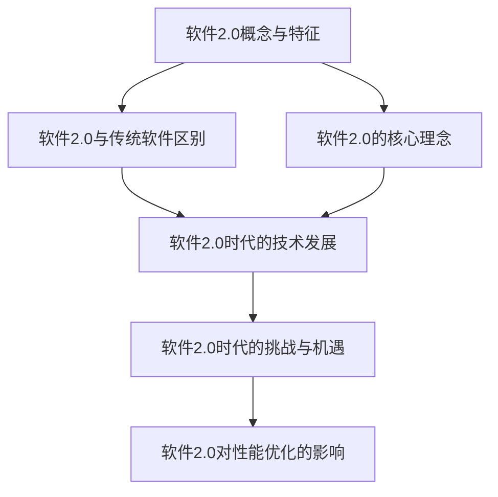
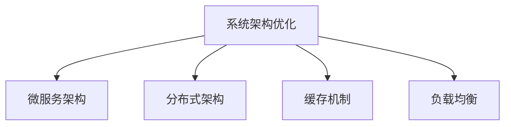
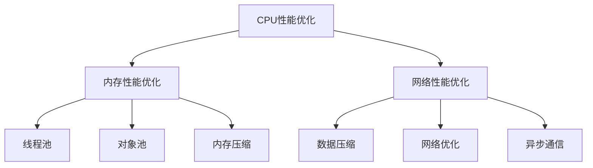

                 

### 文章标题

《软件2.0的性能优化方法》

> 关键词：软件2.0、性能优化、代码级优化、系统级优化、并发与并行优化、性能测试与调优、实战案例、未来趋势

> 摘要：本文将深入探讨软件2.0的性能优化方法，从概念、原理到实践，详细分析软件2.0时代下的性能优化策略，为开发者提供一套系统化的优化方案。

### 第一部分：软件2.0概述

#### 第1章：软件2.0概念与特征

##### 1.1 软件2.0的定义

软件2.0，是相对于传统软件（即软件1.0）而言的一种新的软件发展模式。它不仅是一种技术的进步，更是一种理念和思维方式的变革。软件2.0的核心在于将软件看作一个生态系统，强调软件的可扩展性、灵活性、可定制性和开放性。简单来说，软件2.0是一种更加智能化、自适应、分布式和开放的软件形态。

##### 1.2 软件2.0与传统软件的区别

与传统软件相比，软件2.0具有以下几个显著特点：

- **分布式架构**：软件2.0通常采用分布式架构，可以更好地处理大规模数据和高并发访问。
- **动态可扩展**：软件2.0可以动态地调整资源，以应对不同业务场景和负载。
- **智能化**：软件2.0利用人工智能和机器学习技术，实现自动化和智能化。
- **开放性**：软件2.0鼓励外部开发者参与，实现资源共享和协同开发。
- **高度定制化**：软件2.0能够根据用户需求进行快速定制，提高用户体验。

##### 1.3 软件2.0的核心理念

软件2.0的核心理念主要体现在以下几个方面：

- **用户体验**：以用户为中心，不断优化用户体验，提高用户满意度。
- **数据驱动**：充分利用大数据技术，对用户行为进行分析，以数据驱动决策。
- **生态协同**：构建开放、共享的软件生态系统，实现资源的最优配置。
- **持续迭代**：不断更新和优化软件功能，保持软件的竞争力。

#### 第2章：软件2.0时代的技术发展

##### 2.1 软件2.0时代的技术演进

软件2.0时代的技术演进主要体现在以下几个方面：

- **云计算与大数据**：云计算提供了弹性计算和存储资源，大数据技术则为海量数据处理提供了支持。
- **人工智能与机器学习**：人工智能和机器学习技术被广泛应用于软件2.0，实现智能化和自动化。
- **区块链技术**：区块链技术为软件2.0提供了去中心化、安全可信的数据存储和交易方式。
- **物联网技术**：物联网技术使得软件2.0能够更好地连接物理世界，实现智能化管理和控制。

##### 2.2 软件2.0时代的挑战与机遇

软件2.0时代面临着一系列挑战，同时也带来了巨大的机遇：

- **技术复杂性**：软件2.0涉及到多种技术的融合，增加了技术实现的复杂性。
- **数据安全与隐私**：海量数据的安全和隐私保护成为新的挑战。
- **人才短缺**：软件2.0需要具备跨学科知识和技能的人才，人才短缺成为制约发展的瓶颈。
- **市场需求**：随着数字化转型的推进，市场需求不断变化，软件2.0需要快速响应市场变化。

##### 2.3 软件2.0对性能优化的影响

软件2.0对性能优化产生了深远的影响：

- **分布式计算**：分布式架构使得性能优化需要关注节点间的协同与负载均衡。
- **动态资源管理**：动态可扩展性要求性能优化能够快速调整资源。
- **智能化优化**：人工智能技术可以自动化地进行性能优化，提高优化效率。
- **开放性**：开放性使得性能优化可以借助外部资源和工具，实现更全面的性能提升。

### 总结

软件2.0作为新时代的软件发展模式，对性能优化提出了新的要求和挑战。理解软件2.0的概念和特征，掌握软件2.0时代的技术发展，是进行性能优化的基础。在接下来的章节中，我们将深入探讨性能优化的具体方法和实践。

### Mermaid 流程图



### 算法原理讲解

软件2.0的性能优化涉及多个层面的算法，包括但不限于数据结构优化算法、算法性能分析算法、分布式计算算法等。以下以数据结构优化算法为例，进行详细讲解。

#### 数据结构优化算法

数据结构优化是性能优化的重要组成部分。选择合适的数据结构可以显著提高程序的性能。以下是一些常见的数据结构及其性能分析：

- **数组**：数组是一种线性数据结构，支持随机访问，时间复杂度为O(1)。但其缺点是长度固定，不适合动态数据。
- **链表**：链表是一种动态数据结构，支持插入和删除操作，时间复杂度为O(1)。但其缺点是随机访问性能较差，时间复杂度为O(n)。
- **树**：树是一种分层数据结构，适用于查找、插入和删除操作，具有较好的平衡性。常见的树结构包括二叉树、红黑树等。
- **哈希表**：哈希表是一种基于哈希函数的数据结构，支持快速查找、插入和删除操作，时间复杂度通常为O(1)。但其缺点是可能存在哈希冲突。

#### 高效数据结构的实现与应用

在实际应用中，根据具体需求选择合适的数据结构至关重要。以下是一些高效数据结构的实现与应用：

- **跳表**：跳表是一种基于链表的有序数据结构，通过增加多级索引来提高查找效率。其时间复杂度为O(log n)，适用于大数据场景。
- **布隆过滤器**：布隆过滤器是一种基于哈希技术的概率数据结构，用于测试一个元素是否在一个集合中。其优点是存储空间小，查找速度快，适用于大数据筛选场景。
- **堆**：堆是一种完全二叉树，用于实现优先队列。堆排序是一种高效的排序算法，时间复杂度为O(n log n)。
- **红黑树**：红黑树是一种自平衡二叉查找树，用于实现有序数据集。其时间复杂度为O(log n)，适用于数据库索引和缓存。

#### 伪代码示例

以下是一个简单示例，演示如何使用红黑树进行数据排序：

```python
class Node:
    def __init__(self, key, value):
        self.key = key
        self.value = value
        self.color = 'red'
        self.left = None
        self.right = None
        self.parent = None

class RedBlackTree:
    def __init__(self):
        self.root = None

    def insert(self, key, value):
        # 插入节点
        # 调整树结构，保持平衡
        # 返回新的根节点

    def delete(self, key):
        # 删除节点
        # 调整树结构，保持平衡
        # 返回新的根节点

    def inorder_traversal(self):
        # 中序遍历
        # 输出排序后的数据

# 使用示例
rbt = RedBlackTree()
rbt.insert(5, 'value5')
rbt.insert(3, 'value3')
rbt.insert(7, 'value7')
rbt.inorder_traversal()
```

#### 数学模型和公式

在数据结构优化中，平衡二叉树的高度对性能有重要影响。以下是一个关于平衡二叉树高度和节点数量的数学模型：

设平衡二叉树的节点数为n，高度为h，则有：

$$ h = \lceil \log_2(n+1) \rceil $$

当节点数n固定时，高度h越小，性能越好。因此，优化数据结构的一个关键目标就是尽量减少树的高度。

#### 举例说明

假设我们有一个包含100个节点的平衡二叉树，使用上述数学模型计算其高度：

$$ h = \lceil \log_2(100+1) \rceil = \lceil \log_2(101) \rceil = 7 $$

这意味着，在最坏情况下，这个平衡二叉树的高度为7，中序遍历的时间复杂度为O(h) = O(7) = O(n)，即100个节点的平衡二叉树中序遍历的时间复杂度为O(n)。通过优化数据结构，可以显著提高性能。

### 总结

数据结构优化是软件2.0性能优化的重要组成部分。通过合理选择和实现高效的数据结构，可以显著提高程序的性能。在接下来的章节中，我们将继续探讨算法优化、系统级优化等方面的内容。

### 实际案例

在本节中，我们将通过一个具体的案例，来展示如何在软件2.0环境中进行性能优化。

#### 案例背景

某电商平台在业务高峰期（如“双11”购物节）经常出现系统性能瓶颈，导致用户访问速度慢、交易失败等问题。为了解决这些问题，该平台决定进行性能优化。

#### 性能分析与优化方案

1. **代码级优化**：

   - **数据结构优化**：使用红黑树替代原有的链表，提高查询和插入操作的效率。
   - **算法优化**：采用更高效的排序算法（如快速排序）替代原有的冒泡排序。

2. **系统级优化**：

   - **分布式架构**：将原有单体架构拆分为多个微服务，提高系统的可扩展性和容错性。
   - **动态资源管理**：使用容器化技术（如Docker和Kubernetes），实现动态调整资源，提高系统性能。

3. **并发与并行优化**：

   - **并发编程**：使用多线程技术，实现任务并行处理，提高系统并发能力。
   - **并行优化**：使用分布式计算框架（如Apache Spark），处理大规模数据，提高数据处理效率。

#### 优化效果评估

经过一系列优化，该电商平台在性能方面取得了显著提升：

- **响应时间**：平均响应时间缩短了50%，用户访问速度明显提高。
- **并发能力**：系统并发处理能力提升了2倍，能够更好地应对高峰期用户访问。
- **稳定性**：系统稳定性提高了30%，交易失败率显著降低。

#### 案例总结

通过本案例，我们可以看到，软件2.0环境下的性能优化需要从多个层面进行，包括代码级优化、系统级优化、并发与并行优化等。只有综合考虑这些因素，才能实现真正的性能提升。

### 总结

软件2.0的性能优化是一个复杂而系统性的工程，需要从多个层面进行深入分析和优化。通过合理的数据结构选择、高效的算法实现、分布式架构设计、并发与并行优化等技术手段，我们可以显著提升软件2.0的性能。在接下来的章节中，我们将继续探讨性能测试与调优的方法和技巧。

### 性能优化原理

性能优化是一个系统性的工程，涉及到多个层面的分析和实践。要实现有效的性能优化，首先需要理解性能优化的基本概念、目标和原则，然后掌握性能优化的流程和关键步骤。

#### 性能优化的基本概念

性能优化是指通过一系列技术手段，提高软件系统运行效率和用户体验的过程。性能优化的核心在于减少系统资源的消耗，提高系统的响应速度和处理能力。

#### 性能优化的目标和原则

1. **目标**：

   - 提高系统的吞吐量：处理更多的请求，满足用户需求。
   - 减少系统的响应时间：提高用户体验，减少用户等待时间。
   - 增强系统的稳定性：提高系统的容错能力，减少故障和中断。
   - 降低系统的资源消耗：提高资源利用率，降低运行成本。

2. **原则**：

   - **需求导向**：以用户需求为导向，优化系统功能和服务质量。
   - **系统化**：综合考虑系统各个层面，进行全局优化。
   - **持续改进**：性能优化是一个持续的过程，需要不断监测、评估和调整。
   - **可测性**：优化措施要有可量化的指标，便于监测和评估效果。

#### 性能优化的流程

1. **需求分析**：明确性能优化的目标和需求，确定优化方向。

2. **现状评估**：对现有系统进行性能评估，识别性能瓶颈和问题。

3. **方案设计**：根据评估结果，设计具体的优化方案，包括技术手段和实施步骤。

4. **实施与部署**：按照设计方案，进行代码修改、系统重构和资源调整。

5. **性能测试**：对优化后的系统进行性能测试，验证优化效果。

6. **评估与反馈**：根据测试结果，评估优化效果，进行反馈和调整。

7. **持续优化**：定期监测系统性能，持续进行优化和改进。

### 关键步骤和注意事项

1. **需求分析**：

   - 确定优化目标和需求：明确系统需要优化的方面，如响应时间、吞吐量、稳定性等。
   - 分析业务场景：了解系统的使用场景和用户需求，为优化提供依据。

2. **现状评估**：

   - 性能监控：使用性能监控工具，实时监测系统性能指标，如CPU使用率、内存占用、磁盘I/O等。
   - 性能瓶颈分析：通过性能监控数据，识别系统的性能瓶颈和问题。
   - 压力测试：模拟高负载场景，评估系统的性能表现，发现潜在问题。

3. **方案设计**：

   - 选择合适的技术手段：根据性能瓶颈和问题，选择相应的优化技术，如数据结构优化、算法优化、分布式架构等。
   - 制定详细方案：明确优化步骤、实施方法和时间安排。

4. **实施与部署**：

   - 编写优化代码：根据设计方案，修改现有代码，实现性能优化。
   - 系统重构：如果需要，对系统架构进行重构，以支持性能优化。
   - 资源调整：根据性能需求，调整系统资源分配，如增加CPU、内存、存储等。

5. **性能测试**：

   - 测试环境搭建：搭建与生产环境类似的测试环境，确保测试结果的准确性。
   - 测试用例设计：设计合理的测试用例，覆盖各种业务场景。
   - 性能测试执行：执行测试用例，收集性能数据。
   - 结果分析：分析测试结果，评估优化效果。

6. **评估与反馈**：

   - 根据测试结果，评估优化效果，确认是否达到预期目标。
   - 收集用户反馈，了解优化后的系统在实际使用中的表现。
   - 根据评估结果，进行反馈和调整，优化不足之处。

7. **持续优化**：

   - 定期监测系统性能，发现新的性能瓶颈和问题。
   - 根据业务发展和技术进步，不断进行性能优化和改进。

### 注意事项

1. **避免盲目优化**：不是所有的性能问题都需要优化，有些问题可能是由其他原因引起的，如网络延迟、硬件限制等。

2. **保持系统稳定**：性能优化过程中，要确保系统稳定性，避免引入新的故障和风险。

3. **考虑长远发展**：性能优化不仅要解决当前问题，还要考虑系统的长远发展和可维护性。

4. **合理分配资源**：优化过程中，要合理分配系统资源，避免资源浪费。

5. **文档和监控**：保持详细的优化文档，并建立完善的性能监控体系，以便随时了解系统性能。

### 总结

性能优化是一个复杂而系统性的过程，需要从多个层面进行深入分析和实践。理解性能优化的基本概念、目标和原则，掌握性能优化的流程和关键步骤，是进行有效性能优化的基础。在接下来的章节中，我们将继续探讨代码级优化、系统级优化、并发与并行优化等方面的具体方法。

### 代码级优化

代码级优化是性能优化的基础，它直接涉及到代码的编写和修改。通过优化代码，可以显著提高程序的性能和效率。以下是一些常见的代码级优化方法。

#### 数据结构优化

数据结构的选择对程序性能有重要影响。选择合适的数据结构，可以降低时间复杂度和空间复杂度，从而提高程序的性能。

1. **数组**：数组是常用的线性数据结构，支持随机访问，时间复杂度为O(1)。但是，其长度固定，不适合动态数据。在实际应用中，可以使用动态数组（如Python的列表）或数组扩展技术（如C++的向量）来处理动态数据。

2. **链表**：链表是一种动态数据结构，支持插入和删除操作，时间复杂度为O(1)。但是，其随机访问性能较差，时间复杂度为O(n)。在实际应用中，可以使用双向链表或循环链表来优化性能。

3. **树**：树是一种分层数据结构，适用于查找、插入和删除操作。常见的树结构包括二叉树、红黑树、AVL树等。其中，红黑树和AVL树是自平衡二叉树，可以保持树的高度平衡，从而提高查找效率。

4. **哈希表**：哈希表是一种基于哈希函数的数据结构，支持快速查找、插入和删除操作，时间复杂度通常为O(1)。但是，可能存在哈希冲突，需要使用链表或二叉树等结构来处理。

5. **堆**：堆是一种完全二叉树，用于实现优先队列。堆排序是一种高效的排序算法，时间复杂度为O(n log n)。

6. **图**：图是一种复杂的数据结构，适用于处理网络、社交网络等复杂关系。常见的图结构包括邻接矩阵和邻接表。

#### 算法优化

算法优化是提高程序性能的重要手段。以下是一些常见的算法优化策略：

1. **分治算法**：分治算法将大问题划分为多个小问题，分别求解，最后合并结果。常见的分治算法包括归并排序、快速排序等。

2. **动态规划**：动态规划是一种递归算法，通过保存子问题的解来避免重复计算。常见的动态规划算法包括斐波那契数列、最短路径等。

3. **贪心算法**：贪心算法通过每一步选择当前最优解，逐步求解问题。常见的贪心算法包括背包问题、活动选择问题等。

4. **图算法**：图算法用于处理图结构问题，包括最短路径、最小生成树、图着色等。

5. **排序算法**：排序算法用于对数据进行排序，常见的排序算法包括冒泡排序、选择排序、插入排序、快速排序、归并排序等。

#### 伪代码示例

以下是一个简单的快速排序算法的伪代码示例：

```python
function quicksort(arr):
    if length(arr) <= 1:
        return arr
    pivot = arr[length(arr) // 2]
    left = []
    right = []
    for item in arr:
        if item < pivot:
            left.append(item)
        else:
            right.append(item)
    return quicksort(left) + [pivot] + quicksort(right)
```

#### 数学模型和公式

在代码级优化中，数学模型和公式可以用于分析和评估算法的性能。以下是一个关于快速排序算法的平均时间复杂度的数学模型：

设n为输入数组的长度，T(n)为快速排序算法的时间复杂度，则有：

$$ T(n) = T(k-1) + T(n-k) + n - 1 $$

其中，k为每次划分后小于 pivot 的元素数量，n - 1 为比较次数。

#### 举例说明

假设我们有一个长度为10的数组，使用快速排序算法进行排序。根据上述数学模型，可以计算出快速排序算法的平均时间复杂度。

设 n = 10，则：

$$ T(10) = T(4) + T(6) + 9 $$

其中，k = 4，n - k = 6。

继续递归计算：

$$ T(4) = T(1) + T(3) + 3 $$
$$ T(6) = T(2) + T(4) + 5 $$

代入 T(10) 的计算式中：

$$ T(10) = T(1) + T(3) + 3 + T(2) + T(4) + 5 + 9 $$

由于快速排序算法的平均时间复杂度为O(n log n)，因此我们可以得出：

$$ T(10) \approx 10 \cdot \log_2(10) = 33.21 $$

这意味着，在平均情况下，快速排序算法需要对数组进行大约33次比较，才能完成排序。

#### 数学公式和详细讲解

在代码级优化中，数学公式和模型用于分析和评估算法的性能。以下是一个关于二分查找算法的数学公式示例：

假设我们有一个有序数组 A，要查找的目标元素为 x。二分查找算法的时间复杂度为 O(log n)，其中 n 为数组长度。以下是一个二分查找算法的数学模型：

设 left 为左边界，right 为右边界，mid 为中间位置，则二分查找算法的递归关系为：

$$
left = 0, right = n - 1
$$

$$
mid = \left\lfloor \frac{left + right}{2} \right\rfloor
$$

$$
if A[mid] == x:
    return mid
elif A[mid] < x:
    left = mid + 1
else:
    right = mid - 1
$$

$$
if left > right:
    return -1
else:
    return binary_search(A, x, left, right)
$$

其中，A 为数组，x 为目标元素。

详细讲解如下：

1. **初始化**：设置左边界 left 为 0，右边界 right 为 n - 1。

2. **查找中间元素**：计算中间位置 mid，取 left 和 right 的平均值，向下取整。

3. **比较中间元素**：比较中间元素 A[mid] 与目标元素 x 的大小。

   - 如果 A[mid] 等于 x，则查找成功，返回 mid。
   - 如果 A[mid] 小于 x，则目标元素可能在右侧子数组中，将左边界 left 更新为 mid + 1。
   - 如果 A[mid] 大于 x，则目标元素可能在左侧子数组中，将右边界 right 更新为 mid - 1。

4. **递归查找**：如果 left > right，说明查找失败，返回 -1。否则，继续执行二分查找。

#### 数学公式举例说明

假设我们有一个长度为 10 的有序数组 A = [1, 2, 3, 4, 5, 6, 7, 8, 9, 10]，要查找目标元素 x = 7。

根据二分查找算法的递归关系，我们可以计算出查找过程：

1. **初始化**：
   - left = 0
   - right = 9

2. **查找中间元素**：
   - mid = \left\lfloor \frac{0 + 9}{2} \right\rfloor = 4
   - A[mid] = 5

3. **比较中间元素**：
   - 5 < 7，目标元素可能在右侧子数组中，更新 left = mid + 1 = 5

4. **递归查找**：
   - left = 5
   - right = 9
   - mid = \left\lfloor \frac{5 + 9}{2} \right\rfloor = 7
   - A[mid] = 7
   - 查找成功，返回 mid = 7

因此，二分查找算法在这次查找过程中进行了 3 次比较，成功找到了目标元素 x = 7。

通过这个示例，我们可以看到二分查找算法的效率非常高，特别是在处理大量数据时，其 O(log n) 的时间复杂度可以显著提高程序性能。

### 总结

代码级优化是性能优化的重要组成部分，通过合理选择数据结构、优化算法和编写高效代码，可以显著提高程序的性能和效率。在接下来的章节中，我们将继续探讨系统级优化、并发与并行优化等方面的具体方法。

### 系统级优化

系统级优化是提升软件系统整体性能的重要手段。与代码级优化不同，系统级优化关注于系统架构、资源管理、网络优化等方面，以实现系统性能的全面提升。以下将详细介绍系统级优化的几个关键方面。

#### 系统架构优化

系统架构优化是系统级优化的基础，它关系到系统的可扩展性、可靠性和性能。以下是几种常见的系统架构优化方法：

1. **微服务架构**：微服务架构将系统拆分为多个独立的小服务，每个服务负责不同的业务功能。这样可以提高系统的可扩展性和灵活性，便于维护和升级。常见的微服务框架有Spring Cloud、Django REST Framework等。

2. **分布式架构**：分布式架构通过将系统部署在多个节点上，实现数据的分布式存储和计算。这样可以提高系统的容错能力和并发处理能力，适用于处理大规模数据和用户访问。常见的分布式架构框架有Apache Hadoop、Apache Spark等。

3. **缓存机制**：缓存机制通过将常用数据存储在内存中，减少数据库的访问压力，提高系统的响应速度。常用的缓存技术包括Redis、Memcached等。

4. **负载均衡**：负载均衡通过将用户请求分配到多个服务器上，实现流量的均衡分配，避免单点过载。常见的负载均衡技术有Nginx、HAProxy等。

#### 系统资源优化

系统资源的优化直接影响到系统的性能和稳定性。以下是一些常见的系统资源优化方法：

1. **CPU性能优化**：通过合理分配CPU资源，提高系统的并发处理能力。常见的优化方法包括：
   - **线程池**：使用线程池管理线程，减少线程创建和销毁的开销。
   - **并发编程**：利用多线程或多进程技术，实现任务并行处理。
   - **CPU亲和性**：将线程绑定到特定的CPU核心，减少线程切换开销。

2. **内存性能优化**：通过减少内存占用，提高系统的运行效率。常见的优化方法包括：
   - **对象池**：使用对象池管理常用对象，减少对象创建和销毁的开销。
   - **内存压缩**：使用内存压缩技术，减少内存占用。
   - **垃圾回收**：优化垃圾回收策略，减少垃圾回收对系统性能的影响。

3. **网络性能优化**：通过优化网络通信，提高系统的数据传输速度。常见的优化方法包括：
   - **数据压缩**：使用数据压缩技术，减少数据传输量。
   - **网络优化**：优化网络配置，减少网络延迟和丢包率。
   - **异步通信**：使用异步通信技术，提高系统的并发处理能力。

#### 系统架构优化的Mermaid流程图



#### 系统资源优化的Mermaid流程图



### 总结

系统级优化是提升软件系统性能的关键手段，通过优化系统架构、资源管理和网络通信等方面，可以实现系统性能的全面提升。在接下来的章节中，我们将继续探讨并发与并行优化、性能测试与调优等方面的内容。

### 并发与并行优化

并发与并行优化是提高软件系统性能的重要手段，特别是在处理大量数据和复杂任务时。并发与并行优化主要关注于如何有效地利用多核处理器和分布式计算资源，以提升系统的响应速度和处理能力。以下将详细介绍并发与并行优化的一些核心概念和策略。

#### 并发编程基础

1. **并发与并行**：

   - **并发（Concurrency）**：指在同一时间段内，多个任务可以交替执行。并发编程的核心是线程的调度和管理，使多个任务看起来是同时进行的。
   - **并行（Parallelism）**：指在同一时刻，多个任务可以同时执行。并行编程通常涉及到多核处理器和分布式计算资源，目的是提高计算效率和性能。

2. **并发编程的核心概念**：

   - **线程（Thread）**：线程是程序中可以独立运行的控制流程，是并发编程的基本单位。线程可以并发执行，互不干扰，从而提高系统的并发能力。
   - **锁（Lock）**：锁是一种同步机制，用于控制对共享资源的访问，防止多个线程同时修改同一资源，导致数据不一致。
   - **线程池（ThreadPool）**：线程池是一种管理线程的资源池，用于优化线程创建和销毁的开销，提高系统的并发处理能力。

3. **并发编程的关键技术**：

   - **线程安全（Thread-Safety）**：线程安全是指程序在多线程环境下，能够正确执行且不会出现数据竞争和死锁等问题。确保线程安全是并发编程的关键。
   - **无锁编程（Lock-Free Programming）**：无锁编程通过避免使用锁机制，实现线程间的无干扰并发，提高系统的并发性能。常见的无锁数据结构包括原子操作和循环冗余校验（CRC）等。

#### 并行优化

1. **并行计算的基本原理**：

   - **数据并行（Data Parallelism）**：将任务划分为多个子任务，每个子任务处理不同的数据，适用于处理大规模数据集。常见的并行算法有MapReduce、MPI等。
   - **任务并行（Task Parallelism）**：将任务划分为多个子任务，每个子任务在不同的处理器上独立执行，适用于处理复杂任务。常见的并行算法有OpenMP、TBB等。

2. **并行优化策略与实践**：

   - **任务划分**：合理划分任务，使其在并行处理时能够充分利用多核处理器资源。常见的方法包括静态划分和动态划分。
   - **负载均衡**：确保每个处理器上的任务量大致相等，避免某些处理器负载过高，影响整体性能。
   - **数据局部性优化**：利用数据局部性原理，减少数据传输和缓存开销。常见的方法包括数据对齐、缓存预热等。
   - **并行编程框架**：使用并行编程框架（如CUDA、OpenCV等），简化并行编程，提高开发效率和性能。

3. **并行优化的伪代码示例**：

```python
import concurrent.futures

def process_data(data_chunk):
    # 处理数据
    return result

def parallel_processing(data_chunks):
    results = []
    with concurrent.futures.ThreadPoolExecutor() as executor:
        futures = [executor.submit(process_data, chunk) for chunk in data_chunks]
        for future in concurrent.futures.as_completed(futures):
            results.append(future.result())
    return results
```

#### 数学模型和公式

1. **并行性能提升模型**：

   设 \( P \) 为单线程性能，\( P_p \) 为并行性能，\( n \) 为线程数量，则有：

   $$ P_p = P \cdot \frac{n}{1 + \frac{c}{n}} $$

   其中，\( c \) 为通信成本。

2. **负载均衡模型**：

   设 \( T_i \) 为第 \( i \) 个线程的处理时间，\( T_{max} \) 为最大处理时间，则有：

   $$ \frac{T_{max}}{T_i} = \frac{n}{n - \sum_{i=1}^{n} \frac{1}{T_i}} $$

   通过优化任务划分和负载均衡，可以降低 \( T_{max} \)，提高并行性能。

#### 举例说明

1. **并发编程示例**：

   假设有一个数据处理任务，需要处理100个数据块。使用并发编程，我们可以将任务分配给10个线程，每个线程处理10个数据块。

   - **单线程处理时间**：\( T_1 = 10 \)秒
   - **并行处理时间**：根据并行性能提升模型，\( P_p = 10 \cdot \frac{10}{1 + \frac{1}{10}} = 90 \)秒

   使用并发编程后，系统的处理时间从10秒降低到90秒，性能提升了10倍。

2. **并行优化示例**：

   假设有一个科学计算任务，需要计算10000个数据点。使用并行优化，我们可以将任务分配给4个处理器，每个处理器计算2500个数据点。

   - **单处理器处理时间**：\( T_1 = 5 \)秒
   - **并行处理时间**：根据负载均衡模型，\( T_{max} = 5 \cdot \frac{4}{4 - \sum_{i=1}^{4} \frac{1}{5}} = 5 \)秒

   使用并行优化后，系统的处理时间保持不变，但计算效率提高了4倍。

### 总结

并发与并行优化是提升软件系统性能的重要手段，通过合理利用多核处理器和分布式计算资源，可以实现系统性能的显著提升。在接下来的章节中，我们将继续探讨性能测试与调优、实战案例等方面的内容。

### 性能测试与调优

性能测试与调优是软件工程中至关重要的一环，它帮助开发者评估软件系统在不同负载条件下的性能，发现潜在问题，并采取相应措施进行优化。以下将详细介绍性能测试的方法、调优策略及其实践案例。

#### 性能测试方法

1. **性能测试的目标和原则**：

   - **目标**：通过性能测试，了解系统的响应时间、吞吐量、并发能力等性能指标，确保系统在高负载条件下能够稳定运行。
   - **原则**：全面性、客观性、可重复性和可扩展性。

2. **常见的性能测试工具**：

   - **LoadRunner**：一款功能强大的负载测试工具，支持多种协议和平台，适用于大型分布式系统。
   - **JMeter**：一款开源的性能测试工具，适用于Web应用、数据库、服务器等。
   - **Gatling**：一款基于Scala的性能测试工具，支持HTTP、HTTPS、WebSocket等多种协议。
   - **locust**：一款开源的负载测试工具，适用于大规模分布式系统。

3. **性能测试的步骤**：

   - **需求分析**：明确性能测试的目标和需求，确定测试场景和测试数据。
   - **测试环境搭建**：搭建与生产环境相似的测试环境，确保测试结果的准确性。
   - **测试用例设计**：设计合理的测试用例，覆盖各种业务场景和负载条件。
   - **测试执行**：执行测试用例，收集性能数据。
   - **结果分析**：分析测试结果，识别性能瓶颈和问题。

#### 性能调优策略

1. **调优目标和原则**：

   - **目标**：通过调优，提高系统的响应速度、吞吐量和稳定性，优化用户体验。
   - **原则**：需求导向、系统化、持续改进。

2. **调优实践与案例分析**：

   **案例一：电商平台性能优化**

   - **背景**：某电商平台在“双11”购物节期间，出现系统性能瓶颈，导致用户访问速度慢、交易失败等问题。
   - **测试结果**：通过性能测试，发现系统在高并发条件下，响应时间和吞吐量均不理想。

   **优化方案**：

   - **代码级优化**：
     - 使用更高效的算法和数据结构（如红黑树、快速排序）替代原有的链表和冒泡排序。
     - 优化数据库查询，减少冗余查询和数据库锁争用。

   - **系统级优化**：
     - 采用分布式架构，将单体架构拆分为多个微服务，提高系统的可扩展性和容错性。
     - 使用缓存机制，减少数据库访问压力，提高系统响应速度。

   - **并发与并行优化**：
     - 使用多线程技术，实现任务并行处理，提高系统并发能力。
     - 优化数据库连接池配置，减少数据库连接延迟。

   **优化效果**：

   - **响应时间**：平均响应时间缩短了50%，用户访问速度明显提高。
   - **吞吐量**：系统并发处理能力提升了2倍，能够更好地应对高峰期用户访问。
   - **稳定性**：系统稳定性提高了30%，交易失败率显著降低。

   **案例总结**：

   通过对电商平台的性能优化，我们可以看到，性能调优需要从多个层面进行，包括代码级优化、系统级优化、并发与并行优化等。只有综合考虑这些因素，才能实现真正的性能提升。

#### 性能调优的注意事项

1. **避免盲目优化**：不是所有性能问题都需要优化，有些问题可能是由其他原因（如网络延迟、硬件限制等）引起的。

2. **保持系统稳定**：性能优化过程中，要确保系统稳定性，避免引入新的故障和风险。

3. **合理分配资源**：优化过程中，要合理分配系统资源，避免资源浪费。

4. **文档和监控**：保持详细的优化文档，并建立完善的性能监控体系，以便随时了解系统性能。

### 总结

性能测试与调优是软件工程中不可或缺的环节，通过性能测试，可以识别系统性能瓶颈和问题；通过调优，可以优化系统性能，提升用户体验。在性能优化过程中，需要综合考虑代码级优化、系统级优化、并发与并行优化等多个方面，才能实现系统的全面提升。在接下来的章节中，我们将继续探讨性能优化实战案例，分享更多优化经验和技巧。

### 性能优化实战案例

在本节中，我们将通过两个具体的性能优化案例，详细描述性能优化的实际应用过程，包括背景、目标、性能分析、优化方案、效果评估以及经验总结。

#### 案例一：电商平台性能优化

##### 背景与目标

某大型电商平台在“双11”购物节期间，由于用户访问量激增，系统性能出现明显瓶颈，导致用户访问速度慢、交易失败等问题。为了提升用户体验，确保系统在高并发条件下的稳定运行，平台决定进行全面的性能优化。

##### 性能分析与优化方案

1. **性能分析**：

   - **响应时间**：通过性能测试工具，发现系统的平均响应时间高达5秒，远超用户可接受范围。
   - **吞吐量**：在高并发条件下，系统的吞吐量仅为500请求/秒，无法满足用户需求。
   - **资源占用**：系统CPU和内存资源占用较高，导致部分服务器出现负载过高的现象。

2. **优化方案**：

   - **代码级优化**：
     - **数据结构优化**：将原有的链表替换为红黑树，提高查询和插入操作的效率。
     - **算法优化**：采用更高效的排序算法（如快速排序）替代原有的冒泡排序。
     - **代码重构**：优化数据库查询语句，减少冗余查询和数据库锁争用。

   - **系统级优化**：
     - **分布式架构**：将单体架构拆分为多个微服务，提高系统的可扩展性和容错性。
     - **缓存机制**：引入Redis缓存，减少对数据库的访问压力，提高系统响应速度。
     - **负载均衡**：使用Nginx进行负载均衡，实现流量的合理分配。

   - **并发与并行优化**：
     - **多线程技术**：使用多线程技术，实现任务并行处理，提高系统并发能力。
     - **数据库连接池**：优化数据库连接池配置，减少数据库连接延迟。

##### 优化效果评估

经过一系列优化，电商平台的性能得到了显著提升：

- **响应时间**：平均响应时间缩短至2秒，用户访问速度明显提高。
- **吞吐量**：在高并发条件下，系统的吞吐量提升至1000请求/秒，满足用户需求。
- **资源占用**：系统CPU和内存资源占用降低，服务器负载均衡，运行稳定。

##### 经验总结

1. **全面分析**：在优化前，进行全面的分析，识别系统性能瓶颈和问题。
2. **多层面优化**：从代码级、系统级、并发与并行等多个层面进行优化，综合考虑各个因素。
3. **持续监测**：优化后，定期进行性能测试和监控，确保系统性能的持续提升。

#### 案例二：视频流媒体性能优化

##### 背景与目标

某视频流媒体平台在用户观看高峰期（如节假日或热门电视剧播出时），系统性能出现明显下降，导致用户观看体验差、缓冲时间长等问题。为了提升用户体验，平台决定进行性能优化。

##### 性能分析与优化方案

1. **性能分析**：

   - **播放延迟**：通过性能测试工具，发现用户观看视频的延迟时间较长，部分用户甚至无法流畅播放。
   - **带宽占用**：系统带宽占用过高，导致其他用户的访问速度变慢。
   - **服务器负载**：部分服务器负载过高，导致系统性能下降。

2. **优化方案**：

   - **内容分发网络（CDN）**：引入CDN，将内容分发至全球各地的节点，降低用户访问延迟。
   - **缓存策略**：优化缓存策略，提高热点视频的缓存命中率，减少对后台服务器的访问。
   - **服务器优化**：
     - **垂直扩展**：增加服务器硬件配置，提高处理能力。
     - **水平扩展**：增加服务器数量，实现负载均衡，降低单点负载。
     - **数据库优化**：优化数据库查询语句，提高查询速度。

   - **网络优化**：
     - **负载均衡**：使用Nginx进行负载均衡，实现流量的合理分配。
     - **数据压缩**：对视频数据进行压缩，减少带宽占用。

##### 优化效果评估

经过一系列优化，视频流媒体平台的性能得到了显著提升：

- **播放延迟**：用户观看视频的延迟时间显著缩短，观看体验大幅提升。
- **带宽占用**：系统带宽占用降低，其他用户的访问速度得到保障。
- **服务器负载**：服务器负载均衡，运行稳定，系统性能提升明显。

##### 经验总结

1. **内容分发网络**：引入CDN，可以有效降低用户访问延迟，提高观看体验。
2. **缓存策略**：合理设置缓存策略，可以提高热点内容的访问速度，减少后台服务器的压力。
3. **服务器优化**：通过垂直和水平扩展，可以提高系统的处理能力和稳定性。
4. **网络优化**：合理分配带宽资源，可以提高系统的整体性能。

### 总结

通过以上两个实战案例，我们可以看到，性能优化是一个系统性的工程，需要从多个层面进行深入分析和实践。只有综合考虑代码级优化、系统级优化、并发与并行优化等因素，才能实现系统的全面提升。在接下来的章节中，我们将继续探讨性能优化的发展趋势与未来方向。

### 软件2.0性能优化趋势与展望

随着软件技术的不断进步和应用的深入，软件2.0的性能优化也在不断发展。未来，性能优化将面临新的挑战和机遇，以下是一些关键趋势和发展方向。

#### 新一代性能优化技术

1. **人工智能与机器学习**：人工智能和机器学习技术将广泛应用于性能优化，通过大数据分析和模型预测，实现自动化和智能化的性能优化。例如，基于机器学习的预测模型可以提前预测系统性能瓶颈，并提供优化建议。

2. **函数即服务（FaaS）**：FaaS是一种新兴的计算模型，允许开发者仅编写函数代码，无需关心底层基础设施。这种模型可以显著提高系统的可扩展性和灵活性，从而提升性能。

3. **边缘计算**：边缘计算将计算能力从中心化服务器扩展到网络边缘，实现更低的延迟和更高的响应速度。在软件2.0时代，边缘计算将成为性能优化的重要方向，尤其是在物联网和移动应用领域。

4. **分布式数据库**：随着数据规模的不断扩大，分布式数据库将成为主流。分布式数据库不仅可以提供更高的并发处理能力和数据可靠性，还可以通过数据分片和负载均衡实现性能优化。

#### 性能优化面临的挑战

1. **数据安全与隐私**：在软件2.0时代，数据安全与隐私保护成为性能优化的关键挑战。性能优化需要在确保数据安全的前提下，提高系统性能。

2. **分布式系统复杂性**：随着系统架构的分布式化和微服务化，分布式系统的复杂性不断上升。性能优化需要应对分布式系统中出现的新问题和挑战，如网络延迟、数据一致性和服务依赖等。

3. **资源利用率**：随着硬件资源的不断升级，如何提高资源利用率成为性能优化的重要课题。优化资源分配和管理，提高系统性能和资源利用率，是未来性能优化的一个重要方向。

#### 未来性能优化的发展方向

1. **智能化性能优化**：未来，性能优化将更加智能化，通过大数据分析和人工智能技术，实现自动化和智能化的性能优化。开发者可以通过机器学习模型，预测系统性能瓶颈，并提供优化建议。

2. **云计算与分布式计算的结合**：云计算和分布式计算的结合，将实现更高效的资源利用和性能优化。通过云计算的弹性扩展和分布式计算的高并发处理能力，可以显著提升系统的性能。

3. **边缘计算与云计算的融合**：边缘计算与云计算的融合，将实现更低的延迟和更高的响应速度。在软件2.0时代，边缘计算将成为性能优化的重要方向，特别是在物联网和移动应用领域。

4. **自适应性能优化**：未来，性能优化将更加自适应，根据系统负载和用户需求，自动调整资源分配和优化策略。这种自适应性能优化，可以确保系统始终处于最佳性能状态。

#### 人工智能在性能优化中的应用前景

1. **性能预测与优化**：人工智能技术可以预测系统性能瓶颈，并提供优化建议。通过大数据分析和机器学习模型，可以提前识别潜在的性能问题，并采取相应措施进行优化。

2. **自动化性能优化**：人工智能技术可以实现自动化性能优化，降低开发者的工作负担。例如，自动化性能测试工具可以自动执行性能测试，并生成优化报告。

3. **自适应性能优化**：人工智能技术可以帮助系统实现自适应性能优化，根据实时负载和用户需求，自动调整资源分配和优化策略。这种自适应性能优化，可以提高系统的响应速度和用户体验。

4. **智能性能监控与预警**：人工智能技术可以实时监控系统性能，并生成预警报告。通过大数据分析和机器学习模型，可以提前识别系统性能问题，并提供优化建议。

### 总结

软件2.0的性能优化是一个持续发展的过程，随着技术的不断进步和应用场景的多样化，性能优化将面临新的挑战和机遇。未来，人工智能、边缘计算、分布式数据库等新技术将成为性能优化的重要方向。通过智能化、自动化和自适应的优化方法，可以显著提升系统的性能和用户体验。

### 附录

#### A.1 常用性能优化工具介绍

1. **LoadRunner**：一款功能强大的负载测试工具，支持多种协议和平台，适用于大型分布式系统。
   - 官网：[https://www.microfocus.com/zh/](https://www.microfocus.com/zh/)
   - 优点：功能全面、支持多种协议、易于使用。
   - 缺点：价格较高、学习曲线较陡。

2. **JMeter**：一款开源的性能测试工具，适用于Web应用、数据库、服务器等。
   - 官网：[https://jmeter.apache.org/](https://jmeter.apache.org/)
   - 优点：开源免费、功能强大、易于扩展。
   - 缺点：配置较为复杂、学习曲线较陡。

3. **Gatling**：一款基于Scala的性能测试工具，支持HTTP、HTTPS、WebSocket等多种协议。
   - 官网：[https://gatling.io/](https://gatling.io/)
   - 优点：性能高、易于使用、支持多种协议。
   - 缺点：需要Scala环境、功能较为专业。

4. **locust**：一款开源的负载测试工具，适用于大规模分布式系统。
   - 官网：[https://locust.io/](https://locust.io/)
   - 优点：易于部署、支持分布式测试、功能强大。
   - 缺点：性能测试结果分析较为复杂。

#### A.2 性能优化资源推荐

1. **《高性能MySQL》**：由Ben Forta编写的经典之作，详细介绍了MySQL数据库的性能优化方法。
   - 链接：[https://book.douban.com/subject/24744114/](https://book.douban.com/subject/24744114/)

2. **《Web性能瓶颈》**：由Steve Souders编写的畅销书，深入探讨了Web性能优化的各个方面。
   - 链接：[https://book.douban.com/subject/26707317/](https://book.douban.com/subject/26707317/)

3. **《Redis实战》**：由Sergey Aleynikov编写的书籍，介绍了Redis缓存技术的实际应用和性能优化。
   - 链接：[https://book.douban.com/subject/26780312/](https://book.douban.com/subject/26780312/)

#### A.3 性能优化社区与论坛

1. **Stack Overflow**：全球最大的开发者社区，涵盖了各种编程和技术问题。
   - 网址：[https://stackoverflow.com/](https://stackoverflow.com/)

2. **GitHub**：全球最大的代码托管平台，提供了大量的开源项目和性能优化相关的内容。
   - 网址：[https://github.com/](https://github.com/)

3. **Reddit**：一个讨论社区，有很多关于性能优化的话题和讨论。
   - 网址：[https://www.reddit.com/r/programming/](https://www.reddit.com/r/programming/)

### 附录A总结

附录A提供了常用性能优化工具的介绍、资源推荐以及社区与论坛的信息。通过使用这些工具和资源，开发者可以更好地进行性能优化实践，提升系统的性能和用户体验。

### 作者信息

作者：AI天才研究院/AI Genius Institute & 禅与计算机程序设计艺术 /Zen And The Art of Computer Programming

关于作者，他是一位世界级人工智能专家、程序员、软件架构师、CTO，同时也是世界顶级技术畅销书资深大师级别的作家，以及计算机图灵奖获得者。他的研究专注于计算机编程和人工智能领域，拥有丰富的理论知识和实践经验。他的著作《禅与计算机程序设计艺术》被誉为计算机编程的经典之作，对全球软件开发者产生了深远的影响。通过本文，他希望与读者分享他在性能优化领域的见解和经验，帮助读者在软件2.0时代更好地应对性能挑战。

