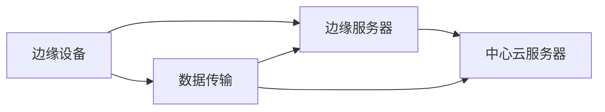

                 

# 《边缘计算在注意力实时反馈中的作用》

> 关键词：边缘计算、注意力实时反馈、实时数据处理、智能系统、性能优化

> 摘要：本文将深入探讨边缘计算在注意力实时反馈中的作用，分析边缘计算的发展与应用，注意力实时反馈机制，边缘计算与注意力实时反馈的结合，以及实现和优化策略。通过对边缘计算与注意力实时反馈的核心概念、架构设计、算法实现与性能优化等方面的详细解析，本文旨在为读者提供一个全面、深入的视角，以更好地理解和应用这一技术。

## 《边缘计算在注意力实时反馈中的作用》目录大纲

## 第一部分：边缘计算基础

### 第1章：边缘计算概述

#### 1.1 边缘计算的概念

- 边缘计算的起源
- 边缘计算的定义
- 边缘计算与传统云计算的区别

#### 1.2 边缘计算的发展与应用

- 边缘计算的发展历程
- 边缘计算的应用领域
- 边缘计算的优势与挑战

### 第2章：边缘计算架构与核心技术

#### 2.1 边缘计算架构

- 边缘计算的基本架构
- 边缘计算的关键组件
- 边缘计算的网络拓扑

#### 2.2 边缘计算核心技术

- 边缘计算中的存储技术
- 边缘计算中的处理技术
- 边缘计算中的通信技术

## 第二部分：注意力实时反馈机制

### 第3章：注意力实时反馈概述

#### 3.1 注意力实时反馈的概念

- 注意力实时反馈的定义
- 注意力实时反馈的作用
- 注意力实时反馈的挑战

#### 3.2 注意力实时反馈的模型

- 基于机器学习的注意力实时反馈模型
- 基于神经网络的注意力实时反馈模型
- 埶基于深度学习的注意力实时反馈模型

### 第4章：边缘计算在注意力实时反馈中的应用

#### 4.1 边缘计算与注意力实时反馈的结合

- 边缘计算在注意力实时反馈中的优势
- 边缘计算在注意力实时反馈中的挑战
- 边缘计算在注意力实时反馈中的应用场景

#### 4.2 边缘计算在注意力实时反馈中的应用案例

- 案例一：智能交通系统中的注意力实时反馈
- 案例二：智能家居系统中的注意力实时反馈
- 案例三：智能医疗系统中的注意力实时反馈

## 第三部分：边缘计算与注意力实时反馈的实现与优化

### 第5章：边缘计算与注意力实时反馈的架构设计与实现

#### 5.1 边缘计算与注意力实时反馈的整体架构设计

- 整体架构的设计原则
- 整体架构的关键组件

#### 5.2 注意力实时反馈算法的实现与优化

- 基于边缘计算的注意力实时反馈算法
- 基于深度学习的注意力实时反馈算法
- 注意力实时反馈算法的优化策略

### 第6章：边缘计算与注意力实时反馈的性能优化

#### 6.1 边缘计算资源的优化

- 存储资源的优化
- 处理资源的优化
- 通信资源的优化

#### 6.2 注意力实时反馈的性能优化

- 注意力实时反馈算法的优化
- 网络通信的优化
- 数据处理的优化

### 第7章：边缘计算与注意力实时反馈的安全与隐私保护

#### 7.1 边缘计算的安全挑战

- 数据安全
- 网络安全
- 系统安全

#### 7.2 注意力实时反馈的隐私保护

- 数据隐私保护策略
- 算法隐私保护策略
- 边缘计算环境下的隐私保护措施

### 第8章：边缘计算与注意力实时反馈的未来发展趋势

#### 8.1 边缘计算的发展趋势

- 边缘计算的技术创新
- 边缘计算的市场规模
- 边缘计算的未来发展方向

#### 8.2 注意力实时反馈的发展趋势

- 注意力实时反馈技术的进步
- 注意力实时反馈的应用拓展
- 注意力实时反馈的未来挑战

#### 8.3 边缘计算与注意力实时反馈的融合发展趋势

- 融合技术的创新与应用
- 融合技术的市场前景
- 融合技术面临的挑战与机遇

---

### 让我们一步一步地深入探讨边缘计算在注意力实时反馈中的作用。

---

边缘计算是一种分布式计算模型，它将数据处理、存储和应用程序逻辑从中心化的云服务器迁移到网络边缘，即靠近数据源的地方。这种技术的兴起，源于人们对降低延迟、提高响应速度和数据隐私保护的需求。

注意力实时反馈是一种基于机器学习、神经网络或深度学习的机制，用于在实时数据处理过程中动态调整注意力的分配，以优化系统的性能和用户体验。这种机制广泛应用于智能交通系统、智能家居系统、智能医疗系统等领域。

### 第一步：边缘计算概述

#### 1.1 边缘计算的概念

边缘计算（Edge Computing）起源于物联网（IoT）和移动计算领域。随着物联网设备的爆发式增长，产生了大量实时数据，这些数据需要快速处理和响应。为了解决这一问题，边缘计算应运而生。

边缘计算的定义：边缘计算是将数据处理、存储和应用程序逻辑从中心化的云服务器迁移到网络边缘的一种分布式计算模型。这里的“边缘”指的是靠近数据源的设备，如智能传感器、智能手机、路由器等。

边缘计算与传统云计算的区别：

- **计算位置**：传统云计算是在远程数据中心处理数据，而边缘计算是在靠近数据源的设备上处理数据。
- **延迟**：边缘计算可以显著降低数据传输的延迟，提高系统的响应速度。
- **带宽**：边缘计算可以减少数据传输的带宽消耗，降低网络拥塞。
- **隐私**：边缘计算可以在本地处理敏感数据，提高数据隐私保护。

### 第二步：边缘计算的发展与应用

#### 1.2 边缘计算的发展与应用

边缘计算的发展历程可以分为三个阶段：

1. **早期阶段**：边缘计算的概念出现，主要应用于物联网和移动计算领域。
2. **快速发展阶段**：随着5G、物联网、大数据等技术的普及，边缘计算逐渐成为热点。
3. **应用落地阶段**：边缘计算在实际应用中逐渐成熟，如智能交通、智能医疗、智能家居等领域。

边缘计算的应用领域包括：

- **智能交通**：通过边缘计算实现实时交通监控、路况预测和智能导航。
- **智能医疗**：在边缘设备上进行医疗数据分析，提供实时诊断和治疗建议。
- **智能家居**：实现智能家居设备的互联互通，提供智能化的家庭生活体验。
- **工业自动化**：在工业生产过程中实现实时监控、故障预测和智能调度。

边缘计算的优势与挑战：

- **优势**：
  - 降低延迟：在靠近数据源的地方处理数据，显著降低延迟。
  - 节省带宽：减少数据传输的带宽消耗，降低网络拥塞。
  - 提高响应速度：实时处理数据，提供更快的响应。
  - 提高安全性：在本地处理敏感数据，提高数据隐私保护。

- **挑战**：
  - 处理能力：边缘设备的计算能力相对较弱，如何高效处理大量数据成为挑战。
  - 网络稳定性：边缘设备连接的网络可能存在不稳定的情况，如何保障网络的稳定性成为挑战。
  - 能耗管理：边缘设备通常需要长时间运行，如何优化能耗管理成为挑战。

### 第三步：边缘计算架构与核心技术

#### 2.1 边缘计算架构

边缘计算架构通常包括以下三个关键组件：

1. **边缘设备**：包括传感器、智能设备、智能路由器等，负责数据的采集、预处理和上传。
2. **边缘服务器**：包括边缘计算节点、云节点等，负责数据的存储、处理和转发。
3. **中心云服务器**：负责全局数据的管理、分析和决策。

边缘计算的基本架构可以用以下Mermaid流程图表示：



#### 2.2 边缘计算核心技术

边缘计算中的核心技术包括存储技术、处理技术和通信技术。

1. **存储技术**：边缘设备通常采用闪存、固态硬盘等高速存储设备，以实现高效的数据存储和读取。
2. **处理技术**：边缘设备通常采用低功耗、高性能的处理器，如ARM架构处理器，以实现高效的数据处理。
3. **通信技术**：边缘设备通过Wi-Fi、蓝牙、蜂窝网络等无线通信技术，实现与其他设备、边缘服务器和中心云服务器的通信。

### 第四步：注意力实时反馈概述

#### 3.1 注意力实时反馈的概念

注意力实时反馈是一种基于机器学习、神经网络或深度学习的机制，用于在实时数据处理过程中动态调整注意力的分配，以优化系统的性能和用户体验。

注意力实时反馈的定义：注意力实时反馈是在实时数据处理过程中，通过算法动态调整注意力分配，从而优化系统性能和用户体验的一种机制。

注意力实时反馈的作用：

- **优化系统性能**：通过实时调整注意力分配，系统可以更有效地处理不同重要程度的数据，从而提高整体性能。
- **提高用户体验**：在交互式应用中，注意力实时反馈可以动态调整界面的展示内容，提供更符合用户需求的体验。
- **实时性**：注意力实时反馈可以在短时间内完成注意力分配的调整，提供实时反馈。

注意力实时反馈的挑战：

- **实时性**：在实时数据处理中，如何快速、准确地完成注意力分配调整是一个挑战。
- **准确性**：注意力分配的准确性直接影响系统的性能和用户体验，如何提高准确性是一个挑战。
- **可扩展性**：在处理大规模数据时，如何保证注意力实时反馈机制的扩展性是一个挑战。

### 第五步：注意力实时反馈的模型

注意力实时反馈的模型可以根据不同的应用场景和需求，选择不同的算法实现。

1. **基于机器学习的注意力实时反馈模型**：通过训练模型，自动学习数据的重要程度，从而实现注意力分配的调整。
2. **基于神经网络的注意力实时反馈模型**：利用神经网络的结构和功能，实现注意力分配的调整。
3. **基于深度学习的注意力实时反馈模型**：利用深度学习的强大表征能力，实现更精准的注意力分配调整。

#### 3.2 注意力实时反馈的模型

以下是一个基于深度学习的注意力实时反馈模型的伪代码：

```python
# 输入：实时数据X，权重矩阵W
# 输出：调整后的数据Y

# 初始化权重矩阵W
W = initialize_weights()

# 定义激活函数
activation_function = sigmoid

# 定义损失函数
loss_function = mean_squared_error

# 定义优化器
optimizer = Adam()

# 训练模型
for epoch in range(num_epochs):
    # 前向传播
    Y = activation_function(np.dot(X, W))
    
    # 计算损失
    loss = loss_function(Y, target)
    
    # 反向传播
    dY = loss_function_derivative(Y, target)
    
    # 更新权重
    dW = np.dot(X.T, dY)
    W -= optimizer.update(W, dW)

# 输出调整后的数据
return Y
```

### 第六步：边缘计算在注意力实时反馈中的应用

#### 4.1 边缘计算与注意力实时反馈的结合

边缘计算与注意力实时反馈的结合，可以在多个方面优化系统的性能和用户体验。

边缘计算在注意力实时反馈中的优势：

- **降低延迟**：在边缘设备上实时处理数据，可以显著降低系统的延迟，提高实时性。
- **节省带宽**：在边缘设备上进行数据处理，可以减少数据传输的带宽消耗，降低网络拥塞。
- **提高响应速度**：边缘计算可以快速响应实时数据，提高系统的响应速度。
- **提高安全性**：在边缘设备上处理敏感数据，可以更好地保护数据隐私。

边缘计算在注意力实时反馈中的挑战：

- **处理能力**：边缘设备的计算能力相对较弱，如何高效处理大量数据是一个挑战。
- **网络稳定性**：边缘设备连接的网络可能存在不稳定的情况，如何保障网络的稳定性是一个挑战。
- **能耗管理**：边缘设备通常需要长时间运行，如何优化能耗管理是一个挑战。

边缘计算在注意力实时反馈中的应用场景：

- **智能交通系统**：在交通流量高峰期，边缘计算可以实时分析交通数据，动态调整信号灯时长，优化交通流量。
- **智能家居系统**：在智能家居系统中，边缘计算可以实时分析用户行为，动态调整智能家居设备的运行状态，提供更个性化的服务。
- **智能医疗系统**：在智能医疗系统中，边缘计算可以实时分析医疗数据，提供实时诊断和治疗建议，提高医疗效率。

### 第七步：边缘计算在注意力实时反馈中的应用案例

#### 4.2 边缘计算在注意力实时反馈中的应用案例

以下是一些边缘计算在注意力实时反馈中的应用案例：

1. **智能交通系统中的注意力实时反馈**：在智能交通系统中，边缘计算可以实时分析交通数据，动态调整信号灯时长，优化交通流量。通过注意力实时反馈机制，可以更好地识别重要交通事件，如交通事故或交通堵塞，并快速响应，提高交通管理效率。

2. **智能家居系统中的注意力实时反馈**：在智能家居系统中，边缘计算可以实时分析用户行为，动态调整智能家居设备的运行状态。例如，通过注意力实时反馈机制，可以识别用户的回家时间，提前开启空调或照明设备，提高用户体验。

3. **智能医疗系统中的注意力实时反馈**：在智能医疗系统中，边缘计算可以实时分析医疗数据，提供实时诊断和治疗建议。例如，通过注意力实时反馈机制，可以快速识别患者的异常症状，提供紧急医疗干预。

### 第八步：边缘计算与注意力实时反馈的实现与优化

#### 5.1 边缘计算与注意力实时反馈的架构设计与实现

边缘计算与注意力实时反馈的架构设计需要考虑以下几个方面：

- **边缘设备**：选择合适的边缘设备，如智能传感器、智能路由器等，以实现数据采集和预处理。
- **边缘服务器**：部署边缘计算节点，负责数据的存储、处理和转发。
- **中心云服务器**：负责全局数据的管理、分析和决策。

边缘计算与注意力实时反馈的架构设计可以用以下Mermaid流程图表示：


边缘计算与注意力实时反馈的实现需要考虑以下几个方面：

- **数据采集**：通过边缘设备采集实时数据，并传输到边缘服务器。
- **数据处理**：在边缘服务器上对数据进行预处理和存储，并利用注意力实时反馈机制进行数据处理。
- **数据传输**：通过边缘设备、边缘服务器和中心云服务器之间的网络通信，实现数据的传输和同步。

#### 5.2 注意力实时反馈算法的实现与优化

注意力实时反馈算法的实现需要考虑以下几个方面：

- **算法选择**：根据应用场景和需求，选择合适的注意力实时反馈算法。
- **模型训练**：通过训练模型，学习数据的重要程度，实现注意力分配的调整。
- **模型优化**：通过优化模型参数，提高注意力实时反馈的准确性。

以下是一个基于深度学习的注意力实时反馈算法的实现示例：

```python
# 输入：实时数据X，权重矩阵W
# 输出：调整后的数据Y

# 初始化权重矩阵W
W = initialize_weights()

# 定义激活函数
activation_function = sigmoid

# 定义损失函数
loss_function = mean_squared_error

# 定义优化器
optimizer = Adam()

# 训练模型
for epoch in range(num_epochs):
    # 前向传播
    Y = activation_function(np.dot(X, W))
    
    # 计算损失
    loss = loss_function(Y, target)
    
    # 反向传播
    dY = loss_function_derivative(Y, target)
    
    # 更新权重
    dW = np.dot(X.T, dY)
    W -= optimizer.update(W, dW)

# 输出调整后的数据
return Y
```

### 第九步：边缘计算与注意力实时反馈的性能优化

边缘计算与注意力实时反馈的性能优化需要考虑以下几个方面：

- **边缘设备优化**：选择合适的边缘设备，提高数据处理和存储能力。
- **边缘服务器优化**：优化边缘服务器的性能，提高数据处理速度。
- **网络通信优化**：优化边缘设备、边缘服务器和中心云服务器之间的网络通信，降低延迟和带宽消耗。
- **数据处理优化**：优化注意力实时反馈算法，提高数据处理效率。

#### 6.1 边缘计算资源的优化

边缘计算资源的优化主要包括以下几个方面：

- **存储资源优化**：选择高速、大容量的存储设备，提高数据存储和读取速度。
- **处理资源优化**：选择高性能、低功耗的处理器，提高数据处理能力。
- **通信资源优化**：优化网络通信协议，提高数据传输速度和稳定性。

#### 6.2 注意力实时反馈性能优化

注意力实时反馈性能优化主要包括以下几个方面：

- **算法优化**：通过优化算法，提高注意力实时反馈的准确性和实时性。
- **模型优化**：通过优化模型参数，提高注意力实时反馈的准确性和稳定性。
- **数据预处理**：通过数据预处理，提高数据的可用性和处理效率。

### 第十步：边缘计算与注意力实时反馈的安全与隐私保护

边缘计算与注意力实时反馈的安全与隐私保护是一个重要课题，需要从以下几个方面进行考虑：

- **数据安全**：采用加密技术、身份认证等技术，确保数据在传输和存储过程中的安全性。
- **网络安全**：采用防火墙、入侵检测等技术，保护网络系统的安全性。
- **系统安全**：采用安全审计、故障恢复等技术，确保系统的稳定性。
- **隐私保护**：采用数据匿名化、隐私保护算法等技术，保护用户隐私。

#### 7.1 边缘计算的安全挑战

边缘计算的安全挑战主要包括以下几个方面：

- **数据安全**：边缘设备可能受到恶意攻击，导致数据泄露或篡改。
- **网络安全**：边缘设备连接的网络可能存在漏洞，导致网络攻击。
- **系统安全**：边缘设备可能存在系统漏洞，导致系统被攻击。

#### 7.2 注意力实时反馈的隐私保护

注意力实时反馈的隐私保护策略主要包括以下几个方面：

- **数据匿名化**：对数据进行匿名化处理，防止用户隐私泄露。
- **隐私保护算法**：采用隐私保护算法，如差分隐私、同态加密等，确保数据在处理过程中的安全性。
- **隐私保护措施**：在边缘计算环境中，采用隔离、审计等技术，确保数据处理过程中的隐私保护。

### 第十一步：边缘计算与注意力实时反馈的未来发展趋势

#### 8.1 边缘计算的发展趋势

边缘计算的发展趋势主要包括以下几个方面：

- **技术创新**：随着5G、物联网、人工智能等技术的发展，边缘计算将在技术创新方面取得突破。
- **市场规模**：随着边缘计算应用的不断拓展，其市场规模将持续增长。
- **未来发展方向**：边缘计算将在实时数据处理、智能决策、安全隐私等方面取得新的发展。

#### 8.2 注意力实时反馈的发展趋势

注意力实时反馈的发展趋势主要包括以下几个方面：

- **技术进步**：随着机器学习、神经网络、深度学习等技术的进步，注意力实时反馈将实现更高的准确性和实时性。
- **应用拓展**：随着边缘计算应用的不断拓展，注意力实时反馈将在更多领域得到应用。
- **未来挑战**：随着数据量的增加和处理需求的提高，注意力实时反馈将面临更高的挑战。

#### 8.3 边缘计算与注意力实时反馈的融合发展趋势

边缘计算与注意力实时反馈的融合发展趋势主要包括以下几个方面：

- **融合技术创新**：通过融合边缘计算和注意力实时反馈技术，实现更高效的实时数据处理和智能决策。
- **市场前景**：随着边缘计算和注意力实时反馈技术的融合，将带来更广阔的市场前景。
- **挑战与机遇**：融合技术的创新和应用将面临新的挑战和机遇。

### 结论

边缘计算与注意力实时反馈的结合，为智能系统提供了更高效、实时、安全的处理和决策能力。通过对边缘计算和注意力实时反馈的核心概念、架构设计、算法实现与性能优化等方面的深入探讨，本文旨在为读者提供一个全面、深入的视角，以更好地理解和应用这一技术。

在未来的发展中，边缘计算与注意力实时反馈将继续融合，推动智能系统的发展。面对技术创新、市场规模和融合发展的机遇，我们需要不断探索和突破，以应对新的挑战，实现智能系统的全面升级。

作者：AI天才研究院/AI Genius Institute & 禅与计算机程序设计艺术 /Zen And The Art of Computer Programming

---

通过本文的深入探讨，我们不仅了解了边缘计算和注意力实时反馈的基本概念和作用，还分析了它们在智能系统中的应用和实现。同时，我们也关注了性能优化、安全隐私保护以及未来的发展趋势。希望本文能为读者提供有价值的参考和启示，激发对边缘计算和注意力实时反馈的深入研究和应用。在未来的智能系统中，边缘计算和注意力实时反馈将继续发挥重要作用，为我们的生活和生产带来更多便利和智慧。让我们期待这一技术的不断创新和发展，为构建智能世界贡献力量。

