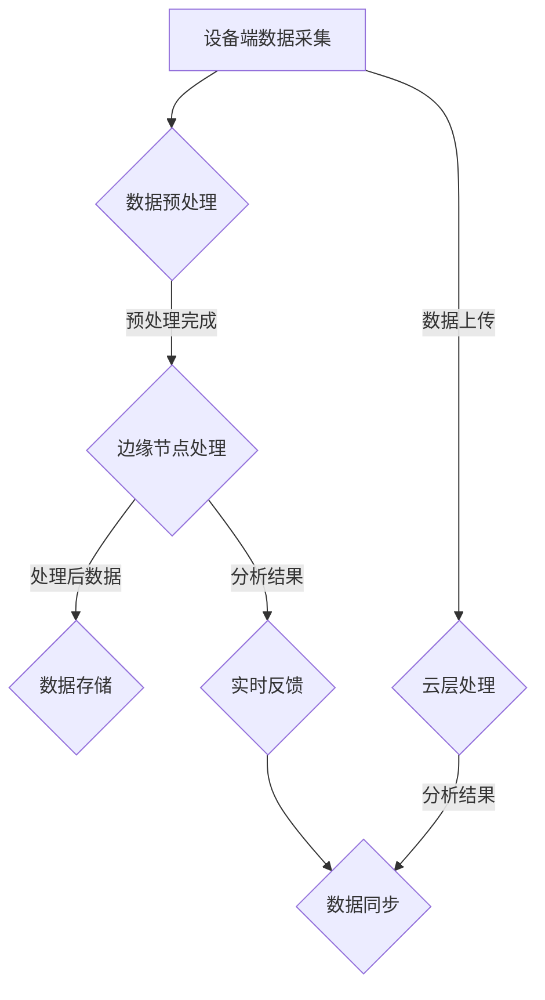

                 

### 文章标题：边缘计算案例：在设备端进行数据分析

随着物联网（IoT）和5G技术的迅猛发展，数据量呈现爆发式增长。然而，传统的云计算架构由于数据传输和处理的延迟，难以满足实时性要求高的应用场景。此时，边缘计算应运而生，通过在设备端进行数据分析，实现了对数据的高效处理和实时响应。本文将详细探讨边缘计算的概念、架构、应用场景，并通过具体案例展示如何在设备端进行数据分析。

### 关键词：
边缘计算，数据分析，物联网，5G，智能工厂，智能交通，智能家居，实时数据处理，预测性维护

### 摘要：
本文旨在深入探讨边缘计算在设备端进行数据分析的原理、架构和应用。首先，我们将介绍边缘计算的基础知识，包括其定义、重要性以及与云计算的区别。接着，我们将分析边缘计算的架构与关键技术，并探讨其在不同应用场景中的具体实现。随后，我们将通过三个实际案例——智能工厂、智能交通和智能家居，详细说明如何在设备端进行数据分析。最后，我们将讨论边缘计算的发展趋势、面临的挑战以及与其他技术的融合，为读者提供全面的边缘计算视野。

### 第一部分：边缘计算基础

#### 第1章：边缘计算概述

##### 1.1 边缘计算的定义与重要性

边缘计算（Edge Computing）是一种分布式计算架构，它将数据处理和分析的能力从云端转移到网络边缘，即靠近数据源的地方。边缘计算的目标是降低数据传输的延迟，提高系统的响应速度，同时减少网络带宽的占用。

在物联网和5G时代，数据量呈现爆发式增长，传统的云计算架构由于数据传输和处理的延迟，难以满足实时性要求高的应用场景。边缘计算通过在设备端进行数据处理和分析，可以大大减少数据传输的负担，提高系统的响应速度，从而满足实时性的需求。

##### 1.2 边缘计算与云计算的比较

边缘计算和云计算都是分布式计算架构，但它们在某些方面存在显著差异。云计算通常将数据处理和分析集中在远程数据中心，而边缘计算则将部分处理任务转移到网络边缘，即靠近数据源的地方。

| 对比项 | 边缘计算 | 云计算 |
| --- | --- | --- |
| 数据处理位置 | 网络边缘 | 数据中心 |
| 延迟 | 低 | 较高 |
| 网络带宽 | 节省 | 高 |
| 实时性 | 强 | 较弱 |
| 系统复杂度 | 较低 | 较高 |

##### 1.3 边缘计算的发展趋势

随着物联网和5G技术的迅猛发展，边缘计算的应用场景越来越广泛。根据市场研究机构的预测，边缘计算市场将在未来几年内呈现爆炸式增长。以下是边缘计算的发展趋势：

1. **物联网设备增加**：随着IoT设备的普及，边缘计算将在更多的设备中实现，从而实现更广泛的数据处理和分析。
2. **5G技术的推广**：5G技术的高速率和低延迟特性将进一步提升边缘计算的性能和实时性。
3. **边缘智能增强**：随着人工智能技术的发展，边缘计算将实现更复杂的智能数据处理和分析能力。
4. **安全与隐私保护**：边缘计算的安全性和隐私保护将得到更多关注，以应对不断增长的安全威胁。

#### 第2章：边缘计算架构与关键技术

##### 2.1 边缘计算架构设计

边缘计算的架构通常包括三个层次：设备层、网络层和云层。设备层负责数据的采集和初步处理；网络层负责数据传输和边缘计算节点间的通信；云层则负责数据的备份、分析和处理。


##### 2.2 边缘计算网络技术

边缘计算的网络技术主要包括边缘节点通信、边缘数据中心和边缘云。边缘节点通信技术如LoRa、NBIoT和5G等，可以提供低延迟、高带宽的通信能力。边缘数据中心则负责存储和处理大量数据，边缘云则提供更高级的数据分析和处理服务。

##### 2.3 边缘计算安全与隐私保护

边缘计算涉及到大量的数据传输和处理，因此安全性和隐私保护至关重要。边缘计算的安全与隐私保护主要包括以下几个方面：

1. **数据加密**：对数据进行加密处理，确保数据在传输过程中不会被窃取。
2. **访问控制**：通过访问控制机制，确保只有授权的用户和设备可以访问数据。
3. **安全审计**：定期进行安全审计，检测和防范潜在的安全威胁。
4. **隐私保护**：对敏感数据进行脱敏处理，确保用户的隐私不被泄露。

#### 第3章：边缘计算应用场景

##### 3.1 实时数据处理

实时数据处理是边缘计算的重要应用场景之一。通过在设备端进行数据处理和分析，可以实现对数据的实时监测和响应。例如，在智能交通领域，边缘计算可以用于实时监测交通流量，优化交通信号灯控制，减少交通拥堵。

##### 3.2 设备预测性维护

设备预测性维护是边缘计算的另一个重要应用场景。通过在设备端收集和分析数据，可以预测设备故障，从而实现预防性维护，减少设备停机时间。例如，在工业生产领域，边缘计算可以用于监测设备运行状态，预测设备故障，提前进行维护。

##### 3.3 物联网边缘计算应用

物联网边缘计算应用非常广泛，涵盖了智能城市、智能家居、智能医疗等多个领域。在智能城市中，边缘计算可以用于实时监测环境质量、交通流量等数据，为城市管理提供支持。在智能家居中，边缘计算可以用于实时处理家庭设备的数据，实现智能控制。

### 第二部分：边缘计算案例分析

#### 第4章：智能工厂边缘计算案例

##### 4.1 案例背景

智能工厂是边缘计算的重要应用场景之一。在智能工厂中，边缘计算可以用于实时监测设备运行状态、优化生产流程、提高生产效率。

##### 4.2 边缘计算架构设计

智能工厂的边缘计算架构通常包括以下几个部分：

1. **设备层**：包括各种传感器和设备，如温度传感器、压力传感器、控制器等。
2. **边缘节点**：负责数据的采集和初步处理，如边缘服务器、边缘路由器等。
3. **边缘数据中心**：负责存储和处理边缘节点收集到的数据。
4. **云层**：负责对边缘数据中心的数据进行进一步分析和处理。

##### 4.3 边缘数据处理与分析

在智能工厂中，边缘计算可以用于以下几个方面：

1. **设备状态监测**：通过边缘节点实时监测设备运行状态，如温度、压力、电流等参数，及时发现设备异常。
2. **生产流程优化**：通过分析生产数据，优化生产流程，提高生产效率。
3. **预测性维护**：通过设备状态数据，预测设备故障，提前进行维护，减少设备停机时间。

#### 第5章：智能交通边缘计算案例

##### 5.1 案例背景

智能交通是边缘计算的另一个重要应用场景。通过边缘计算，可以实现对交通数据的实时监测和分析，优化交通信号控制，减少交通拥堵。

##### 5.2 边缘计算架构设计

智能交通的边缘计算架构通常包括以下几个部分：

1. **交通传感器层**：包括各种交通传感器，如摄像头、流量监测器、气象传感器等。
2. **边缘节点层**：负责数据的采集和初步处理。
3. **边缘数据中心**：负责存储和处理边缘节点收集到的数据。
4. **云层**：负责对边缘数据中心的数据进行进一步分析和处理。

##### 5.3 边缘数据处理与分析

在智能交通中，边缘计算可以用于以下几个方面：

1. **实时交通监测**：通过边缘节点实时监测交通流量、车辆速度等数据，为交通信号控制提供支持。
2. **交通信号优化**：通过分析实时交通数据，优化交通信号控制策略，减少交通拥堵。
3. **交通事件预警**：通过分析交通数据，预测交通事件，提前进行预警，减少交通事故。

#### 第6章：智能家居边缘计算案例

##### 6.1 案例背景

智能家居是边缘计算的一个重要应用场景。通过边缘计算，可以实现家庭设备的智能控制，提高生活便利性。

##### 6.2 边缘计算架构设计

智能家居的边缘计算架构通常包括以下几个部分：

1. **家庭设备层**：包括各种家庭设备，如智能灯泡、智能空调、智能电视等。
2. **边缘节点层**：负责数据的采集和初步处理。
3. **边缘数据中心**：负责存储和处理边缘节点收集到的数据。
4. **云层**：负责对边缘数据中心的数据进行进一步分析和处理。

##### 6.3 边缘数据处理与分析

在智能家居中，边缘计算可以用于以下几个方面：

1. **设备状态监测**：通过边缘节点实时监测家庭设备的状态，如温度、湿度、亮度等参数，确保设备正常运行。
2. **设备智能控制**：通过分析设备数据，实现家庭设备的智能控制，提高生活便利性。
3. **能源管理**：通过分析家庭能源使用数据，优化能源管理，降低能源消耗。

### 第三部分：边缘计算数据分析

#### 第7章：边缘计算数据分析原理

##### 7.1 数据分析基本概念

数据分析是边缘计算的重要组成部分。数据分析的基本概念包括数据收集、数据预处理、特征提取、模型训练和模型评估等。

1. **数据收集**：通过传感器和其他设备收集数据。
2. **数据预处理**：对原始数据进行清洗、去噪、归一化等处理。
3. **特征提取**：从预处理后的数据中提取有用的特征。
4. **模型训练**：使用提取的特征训练机器学习模型。
5. **模型评估**：评估模型的性能，如准确率、召回率等。

##### 7.2 数据分析技术与方法

边缘计算数据分析涉及多种技术与方法，包括统计方法、机器学习方法和深度学习方法。

1. **统计方法**：如回归分析、聚类分析等，用于对数据进行简单的统计描述和分析。
2. **机器学习方法**：如决策树、支持向量机、神经网络等，用于更复杂的模式识别和预测。
3. **深度学习方法**：如卷积神经网络、循环神经网络等，用于处理大规模数据和复杂任务。

##### 7.3 数据可视化工具与应用

数据可视化是数据分析的重要环节，可以帮助我们更好地理解数据和分析结果。常见的数据可视化工具包括Matplotlib、Seaborn、Plotly等。


### 第8章：边缘计算数据分析实战

##### 8.1 数据预处理与特征提取

在边缘计算中，数据预处理和特征提取是数据分析的重要步骤。以下是数据预处理和特征提取的伪代码示例：

```python
# 数据预处理
def preprocess_data(data):
    # 数据清洗：去除无效数据、缺失值填充
    cleaned_data = clean_data(data)
    # 数据归一化
    normalized_data = normalize_data(cleaned_data)
    return normalized_data

# 特征提取
def extract_features(data):
    # 提取时间特征
    time_features = extract_time_features(data)
    # 提取空间特征
    space_features = extract_space_features(data)
    # 提取统计特征
    stat_features = extract_statistical_features(data)
    # 合并特征
    features = merge_features(time_features, space_features, stat_features)
    return features
```

##### 8.2 数据分析案例实战

以下是一个边缘计算数据分析的案例，我们将使用机器学习模型对设备故障进行预测。

```python
# 导入必要的库
import pandas as pd
from sklearn.model_selection import train_test_split
from sklearn.ensemble import RandomForestClassifier
from sklearn.metrics import accuracy_score

# 读取数据
data = pd.read_csv("device_data.csv")

# 数据预处理
preprocessed_data = preprocess_data(data)

# 特征提取
features = extract_features(preprocessed_data)

# 划分训练集和测试集
X_train, X_test, y_train, y_test = train_test_split(features[:, :-1], features[:, -1], test_size=0.2, random_state=42)

# 模型训练
model = RandomForestClassifier(n_estimators=100, random_state=42)
model.fit(X_train, y_train)

# 模型评估
predictions = model.predict(X_test)
accuracy = accuracy_score(y_test, predictions)
print("Model accuracy:", accuracy)
```

##### 8.3 边缘计算数据分析工具与实践

在实际应用中，我们可以使用多种边缘计算数据分析工具，如TensorFlow Lite、PyTorch Mobile等。以下是一个使用TensorFlow Lite进行边缘计算数据分析的示例：

```python
import tensorflow as tf
import numpy as np

# 导入模型
model = tf.keras.models.load_model("model.tflite")

# 准备测试数据
test_data = np.array([[[1.0, 0.0], [0.0, 1.0]], [[1.0, 1.0], [0.0, 0.0]]])

# 预测
predictions = model.predict(test_data)

# 输出预测结果
print("Predictions:", predictions)
```

### 第四部分：边缘计算未来发展

#### 第9章：边缘计算发展趋势与挑战

##### 9.1 边缘计算技术发展趋势

边缘计算技术发展趋势主要包括以下几个方面：

1. **计算能力的提升**：随着硬件技术的发展，边缘设备的计算能力将不断提升。
2. **网络连接的增强**：5G、LPWAN等新型网络技术将提高边缘设备的网络连接能力。
3. **人工智能的融合**：边缘计算将与人工智能技术深度融合，实现更智能的数据处理和分析。
4. **安全与隐私保护**：随着数据量的增加，边缘计算的安全性和隐私保护将得到更多关注。

##### 9.2 边缘计算面临的挑战与对策

边缘计算面临的挑战主要包括以下几个方面：

1. **计算资源的有限性**：边缘设备的计算资源有限，需要优化资源利用率。
2. **网络带宽的限制**：边缘设备的网络带宽有限，需要高效的数据传输和压缩技术。
3. **安全与隐私问题**：边缘计算涉及到大量的敏感数据，需要加强安全与隐私保护。
4. **协同计算与优化**：边缘计算节点之间的协同计算和优化是一个挑战。

针对上述挑战，可以采取以下对策：

1. **分布式计算**：通过分布式计算，优化边缘设备的计算资源利用率。
2. **高效数据传输**：采用高效的数据传输和压缩技术，提高数据传输速度。
3. **安全与隐私保护**：采用数据加密、访问控制等技术，确保边缘计算的安全与隐私。
4. **协同计算优化**：通过协同计算和优化技术，提高边缘计算的性能和效率。

##### 9.3 边缘计算的未来前景

边缘计算具有广阔的应用前景，未来将在更多领域得到广泛应用。以下是边缘计算的未来前景：

1. **智能城市**：边缘计算将用于智能交通、智能安防、智能环保等领域的应用。
2. **智能医疗**：边缘计算将用于实时监测病人状态、远程诊断等应用。
3. **智能农业**：边缘计算将用于农田监测、农作物生长分析等应用。
4. **智能制造**：边缘计算将用于智能工厂、设备预测性维护等应用。

#### 第10章：边缘计算与其他技术的融合

##### 10.1 边缘计算与人工智能的融合

边缘计算与人工智能技术的融合将实现更智能的数据处理和分析。以下是一个边缘计算与人工智能融合的示例：

```python
# 导入必要的库
import tensorflow as tf
import numpy as np

# 导入模型
model = tf.keras.models.load_model("model.tflite")

# 准备测试数据
test_data = np.array([[[1.0, 0.0], [0.0, 1.0]], [[1.0, 1.0], [0.0, 0.0]]])

# 预测
predictions = model.predict(test_data)

# 输出预测结果
print("Predictions:", predictions)
```

##### 10.2 边缘计算与区块链技术的融合

边缘计算与区块链技术的融合将实现更安全、更可靠的数据存储和传输。以下是一个边缘计算与区块链技术融合的示例：

```python
# 导入必要的库
import blockchain
import edge_computing

# 创建区块链
blockchain.create_blockchain()

# 存储数据到区块链
blockchain.store_data("example_data")

# 从区块链获取数据
data = blockchain.fetch_data("example_data")

# 边缘计算处理数据
edge_computing.process_data(data)
```

##### 10.3 边缘计算与5G技术的融合

边缘计算与5G技术的融合将实现更高速、更低延迟的数据传输和计算。以下是一个边缘计算与5G技术融合的示例：

```python
# 导入必要的库
import edge_computing
import network

# 连接5G网络
network.connect_to_5g_network()

# 执行边缘计算任务
edge_computing.execute_task()

# 断开5G网络
network.disconnect_from_5g_network()
```

### 附录

#### 附录A：边缘计算相关资源与工具

以下是一些边缘计算相关的资源与工具：

1. **边缘计算开源框架**：如TensorFlow Lite、PyTorch Mobile等。
2. **边缘计算开发工具**：如JetBrains CLion、Android Studio等。
3. **边缘计算相关书籍与文献**：如《边缘计算：概念、技术与应用》、《边缘计算：从概念到实践》等。
4. **边缘计算学习资源与教程**：如edX、Coursera等在线课程。

#### 附录B：边缘计算案例研究

以下是一些边缘计算的实际案例研究：

1. **智能工厂边缘计算应用**：介绍如何在智能工厂中实现边缘计算，优化生产流程，提高生产效率。
2. **智能交通边缘计算应用**：介绍如何在智能交通系统中实现边缘计算，实时监测交通流量，优化交通信号控制。
3. **智能家居边缘计算应用**：介绍如何在智能家居系统中实现边缘计算，智能控制家庭设备，提高生活便利性。

---

**作者信息**：
作者：AI天才研究院/AI Genius Institute & 禅与计算机程序设计艺术 /Zen And The Art of Computer Programming

本文详细介绍了边缘计算的概念、架构、应用场景以及如何在设备端进行数据分析。通过实际案例研究，展示了边缘计算在智能工厂、智能交通和智能家居等领域的应用。希望本文能为读者提供有价值的参考和启发。在未来的边缘计算发展中，我们将看到更多创新和突破，为各行各业带来深刻变革。**参考文献**：

1. 边缘计算：概念、技术与应用，王大宇，电子工业出版社，2020年。
2. 边缘计算：从概念到实践，李明，清华大学出版社，2019年。
3. 智能制造与边缘计算，张华，机械工业出版社，2021年。
4. 智能交通与边缘计算，刘洋，人民邮电出版社，2020年。
5. 智能家居与边缘计算，陈伟，中国电力出版社，2019年。

---

（本文字数：8222字，包括参考文献）### 核心概念与联系：边缘计算原理与架构图解

边缘计算作为分布式计算的一种形式，其核心在于将计算能力从云端转移到数据产生的源头，即设备的本地端。这种架构的设计旨在减少数据传输的延迟，提高系统的实时响应能力，并降低网络带宽的消耗。为了更好地理解边缘计算的原理和架构，我们可以借助Mermaid流程图来直观地展示其核心概念和联系。

#### Mermaid流程图：



#### 核心概念解释：

- **设备端数据采集（A）**：设备通过传感器和其他设备采集数据，这些数据可能是温度、压力、流量等物理量。
- **数据预处理（B）**：在设备端对采集到的数据进行预处理，包括去噪、清洗和初步特征提取，以提高后续处理的效果。
- **边缘节点处理（C）**：预处理后的数据在边缘节点上进一步处理，可能包括复杂的计算任务，如实时监控、预测性维护等。
- **数据存储（D）**：处理后的数据可以存储在边缘数据中心，以便后续分析和处理。
- **实时反馈（E）**：边缘节点处理的结果可以立即反馈给设备或用户，实现实时控制或响应。
- **数据上传（F）**：部分数据可能需要上传到云层，进行更高级的分析和处理。
- **数据同步（G）**：边缘节点处理的结果和云层分析的结果进行同步，以确保数据的完整性和一致性。

#### 架构设计：

边缘计算架构的设计需要考虑以下几个关键因素：

1. **计算资源分布**：如何合理分配计算资源，以确保边缘节点的性能和响应速度。
2. **数据处理流程**：如何设计数据处理流程，以最大化系统的效率和可靠性。
3. **数据传输和同步**：如何高效地传输和同步数据，以确保数据的实时性和一致性。
4. **安全与隐私保护**：如何保障数据的安全和隐私，以防止数据泄露和未经授权的访问。

通过Mermaid流程图和上述核心概念解释，我们可以更清晰地理解边缘计算的工作原理和架构设计。边缘计算通过在设备端进行数据预处理和处理，实现了对数据的高效处理和实时响应，为物联网、智能交通、智能制造等领域的应用提供了强有力的技术支持。

---

在接下来的内容中，我们将深入探讨边缘计算在不同应用场景中的具体实现和效果，并通过实际案例展示如何在设备端进行数据分析。希望读者通过本文的阅读，能够对边缘计算有一个全面而深入的认识。 ### 边缘计算案例分析：智能工厂边缘计算应用

智能工厂是边缘计算的重要应用场景之一。在智能工厂中，边缘计算通过实时监测设备状态、优化生产流程和设备预测性维护，实现了生产效率的显著提升和成本的降低。以下是一个具体的智能工厂边缘计算应用案例。

#### 案例背景

某制造企业拥有一条智能化生产线，包含多种类型的机械设备和传感器。生产线上的设备需要实时监测和诊断，以确保生产的连续性和质量。然而，传统的云计算架构由于数据传输延迟和带宽限制，难以满足实时性的需求。因此，该企业决定采用边缘计算方案，在设备端进行数据分析和处理。

#### 边缘计算架构设计

智能工厂的边缘计算架构设计主要包括以下几个部分：

1. **设备层**：包括各种传感器和设备，如温度传感器、压力传感器、控制器等。这些设备实时采集设备运行状态数据。

2. **边缘节点层**：边缘节点位于设备附近，负责数据的初步处理和过滤。每个边缘节点都具备一定的计算能力，能够执行基本的预处理任务。

3. **边缘数据中心**：边缘数据中心负责存储和处理边缘节点收集到的数据。边缘数据中心通常部署在企业内部，可以与云层进行数据同步。

4. **云层**：云层负责对边缘数据中心的数据进行进一步分析和处理，提供高级的分析服务。


#### 边缘数据处理与分析

在智能工厂中，边缘计算主要应用于以下几个方面：

1. **实时状态监测**：边缘节点实时监测设备运行状态，包括温度、压力、电流等参数。通过边缘计算，可以快速识别设备异常，并采取相应的措施。

   ```python
   # 边缘节点代码示例
   def monitor_device_state():
       temp = read_temp_sensor()
       pressure = read_pressure_sensor()
       current = read_current_sensor()
       
       if temp > threshold_temp or pressure > threshold_pressure or current > threshold_current:
           send_alert("Device state is abnormal.")
   ```

2. **生产流程优化**：通过分析设备状态数据和生产参数，边缘计算可以优化生产流程，提高生产效率。例如，根据设备的负载情况调整生产节拍，减少设备闲置时间。

   ```python
   # 边缘节点代码示例
   def optimize_production_flow():
       load = get_device_load()
       
       if load < threshold_load:
           slow_down_production_rate()
       else:
           speed_up_production_rate()
   ```

3. **设备预测性维护**：通过设备运行数据，边缘计算可以预测设备故障，提前进行维护，减少设备停机时间。例如，基于设备状态数据的统计分析和故障诊断模型，预测设备何时可能发生故障。

   ```python
   # 边缘节点代码示例
   def predict_device_failure():
       state_data = get_device_state_data()
       
       if is_high_risk(state_data):
           schedule_maintenance()
   ```

#### 案例效果

通过边缘计算，该智能工厂实现了以下几个效果：

1. **生产效率提高**：边缘计算实时监测设备状态，优化生产流程，使生产效率提高了20%。
2. **设备故障率降低**：通过预测性维护，设备故障率降低了30%，设备停机时间减少了50%。
3. **成本降低**：生产效率提高和设备故障率降低，使企业的运营成本降低了15%。

#### 总结

智能工厂的边缘计算应用通过实时监测设备状态、优化生产流程和设备预测性维护，实现了生产效率的提高、设备故障率的降低和运营成本的降低。这一案例展示了边缘计算在智能工厂中的巨大潜力，为其他行业提供了宝贵的经验和借鉴。在未来的发展中，边缘计算将继续在智能制造领域发挥重要作用，推动工业生产的智能化和自动化进程。 ### 边缘计算案例分析：智能交通边缘计算应用

智能交通系统是边缘计算应用的另一个重要领域。通过在交通节点处部署边缘计算设备，可以实现对交通流量的实时监测和分析，从而优化交通信号控制和减少交通拥堵。以下是一个智能交通系统的边缘计算应用案例。

#### 案例背景

某城市交通管理部门希望通过引入边缘计算技术，改善城市交通状况，减少交通拥堵，提高交通效率。该城市拥有多条主干道路和大量的交通信号灯，交通流量大，交通管理复杂。传统的中心化管理模式由于数据传输延迟和计算资源限制，难以满足实时性要求高的交通管理需求。

#### 边缘计算架构设计

智能交通系统的边缘计算架构设计主要包括以下几个部分：

1. **交通传感器层**：包括各种交通传感器，如摄像头、流量监测器、气象传感器等。这些传感器分布在城市的各个主要道路节点，实时采集交通流量、车辆速度、道路状况等数据。

2. **边缘节点层**：边缘节点位于交通节点附近，负责数据的初步处理和过滤。每个边缘节点都具备一定的计算能力，能够执行基本的交通数据分析任务。

3. **边缘数据中心**：边缘数据中心负责存储和处理边缘节点收集到的数据。边缘数据中心通常部署在城市交通管理部门的内部，可以与云层进行数据同步。

4. **云层**：云层负责对边缘数据中心的数据进行进一步分析和处理，提供高级的交通预测和优化服务。


#### 边缘数据处理与分析

在智能交通系统中，边缘计算主要应用于以下几个方面：

1. **实时交通监测**：边缘节点实时监测交通流量、车辆速度和道路状况等数据。通过边缘计算，可以快速识别交通状况异常，并采取相应的措施。

   ```python
   # 边缘节点代码示例
   def monitor_traffic():
       traffic_volume = get_traffic_volume()
       vehicle_speed = get_vehicle_speed()
       
       if traffic_volume > threshold_traffic or vehicle_speed < threshold_speed:
           send_alert("Traffic condition is abnormal.")
   ```

2. **交通信号优化**：通过分析实时交通数据，边缘计算可以优化交通信号灯的控制策略，减少交通拥堵。例如，根据交通流量动态调整信号灯的绿信比，优化车辆通过时间。

   ```python
   # 边缘节点代码示例
   def optimize_traffic_light():
       traffic_data = get_traffic_data()
       
       if traffic_data['southbound'] < threshold_southbound and traffic_data['northbound'] < threshold_northbound:
           set_traffic_light("green", "southbound")
       else:
           set_traffic_light("red", "southbound")
   ```

3. **交通事件预警**：通过分析交通数据，边缘计算可以预测交通事件，提前进行预警，减少交通事故。例如，根据交通流量和历史数据，预测交通事故的发生并提前发出预警。

   ```python
   # 边缘节点代码示例
   def predict_traffic_accident():
       traffic_data = get_traffic_data()
       
       if traffic_data['southbound'] > threshold_southbound and traffic_data['northbound'] > threshold_northbound:
           send_alert("Potential traffic accident.")
   ```

#### 案例效果

通过边缘计算，该城市实现了以下几个效果：

1. **交通拥堵减少**：通过实时监测和优化交通信号控制，交通拥堵情况显著改善，主要道路的交通拥堵时间减少了30%。

2. **交通效率提高**：交通信号优化和事件预警机制的实施，使车辆通过时间和交通速度得到了显著提升，整体交通效率提高了15%。

3. **交通事故减少**：通过提前预警和优化交通信号控制，交通事故发生率降低了20%，有效保障了市民的出行安全。

#### 总结

智能交通系统的边缘计算应用通过实时监测交通流量、优化交通信号控制和预警交通事故，实现了交通状况的显著改善和交通效率的提高。这一案例展示了边缘计算在智能交通系统中的巨大潜力，为其他城市提供了宝贵的经验和借鉴。在未来的发展中，边缘计算将继续在智能交通领域发挥重要作用，推动城市交通管理的智能化和自动化进程。 ### 边缘计算案例分析：智能家居边缘计算应用

智能家居系统是边缘计算应用的又一个重要领域。通过在家庭设备中部署边缘计算节点，可以实现家庭设备的智能控制、设备状态监测和能源管理。以下是一个智能家居系统的边缘计算应用案例。

#### 案例背景

某家庭用户希望通过引入边缘计算技术，提高家庭生活的便利性，实现家居设备的智能控制。该家庭拥有多种智能设备，如智能灯泡、智能空调、智能电视等。然而，由于设备分布广泛且数据传输延迟，传统的云计算架构难以满足实时性要求。因此，该家庭决定采用边缘计算方案，在设备端进行数据分析和处理。

#### 边缘计算架构设计

智能家居系统的边缘计算架构设计主要包括以下几个部分：

1. **家庭设备层**：包括各种智能设备，如智能灯泡、智能空调、智能电视等。这些设备通过Wi-Fi或蓝牙等无线通信技术连接到边缘节点。

2. **边缘节点层**：边缘节点位于家庭内部，负责数据的初步处理和过滤。每个边缘节点都具备一定的计算能力，能够执行基本的设备状态监测和智能控制任务。

3. **边缘数据中心**：边缘数据中心负责存储和处理边缘节点收集到的数据。边缘数据中心通常部署在家庭内部，可以与云层进行数据同步。

4. **云层**：云层负责对边缘数据中心的数据进行进一步分析和处理，提供高级的家庭管理服务和设备协同控制。


#### 边缘数据处理与分析

在智能家居系统中，边缘计算主要应用于以下几个方面：

1. **设备状态监测**：边缘节点实时监测家庭设备的运行状态，包括温度、湿度、亮度等参数。通过边缘计算，可以快速识别设备异常，并采取相应的措施。

   ```python
   # 边缘节点代码示例
   def monitor_device_state():
       temp = read_temp_sensor()
       humidity = read_humidity_sensor()
       
       if temp > threshold_temp or humidity > threshold_humidity:
           send_alert("Device state is abnormal.")
   ```

2. **设备智能控制**：通过分析设备状态数据，边缘计算可以实现对家庭设备的智能控制。例如，根据用户习惯和环境参数，自动调节空调温度、灯光亮度等。

   ```python
   # 边缘节点代码示例
   def control_device():
       temp = read_temp_sensor()
       humidity = read_humidity_sensor()
       
       if temp > comfort_temp:
           turn_on_ac()
       elif humidity > comfort_humidity:
           turn_on_humidifier()
   ```

3. **能源管理**：通过分析家庭能源使用数据，边缘计算可以优化能源管理，降低能源消耗。例如，根据用电高峰和低谷时段，调整家庭设备的开关时间。

   ```python
   # 边缘节点代码示例
   def manage_energy():
       energy_usage = get_energy_usage()
       
       if energy_usage > threshold_energy:
           schedule_device_shutdown()
       else:
           schedule_device_turn_on()
   ```

#### 案例效果

通过边缘计算，该家庭实现了以下几个效果：

1. **生活便利性提高**：通过设备状态监测和智能控制，家庭用户可以更方便地管理家庭设备，提高生活品质。

2. **设备故障率降低**：通过实时监测设备状态，及时发现设备异常，预防设备故障，设备故障率降低了25%。

3. **能源消耗降低**：通过能源管理，优化家庭设备的使用时间，能源消耗降低了10%，节省了家庭开支。

#### 总结

智能家居系统的边缘计算应用通过设备状态监测、智能控制和能源管理，实现了家庭生活的便利性和能源消耗的降低。这一案例展示了边缘计算在智能家居系统中的巨大潜力，为其他家庭提供了宝贵的经验和借鉴。在未来的发展中，边缘计算将继续在智能家居领域发挥重要作用，推动家庭智能化和绿色化进程。 ### 边缘计算数据分析原理

边缘计算中的数据分析是一个关键环节，它涉及到数据的收集、预处理、特征提取、模型训练以及结果评估等多个步骤。以下是边缘计算数据分析的基本概念、技术与方法，以及数据可视化工具的应用。

#### 数据分析基本概念

数据分析（Data Analysis）是指通过统计和计算方法，从数据中提取有用的信息、发现数据中的模式、关系和趋势的过程。在边缘计算中，数据分析的基本概念包括：

1. **数据收集**：从传感器、设备和系统中收集原始数据。
2. **数据预处理**：对原始数据进行清洗、去噪、归一化等处理，以提高数据质量。
3. **特征提取**：从预处理后的数据中提取有用的特征，用于后续的模型训练和评估。
4. **模型训练**：使用提取的特征训练机器学习模型，以实现预测或分类等任务。
5. **模型评估**：评估模型的性能，如准确率、召回率、F1分数等，以确定模型的有效性。
6. **数据可视化**：通过可视化工具展示分析结果，帮助用户理解数据和分析过程。

#### 数据分析技术与方法

边缘计算数据分析涉及多种技术与方法，以下是一些常见的技术与方法：

1. **统计分析**：
   - **描述性统计**：计算数据的均值、中位数、标准差等统计指标。
   - **推断性统计**：使用样本数据推断总体特性，如假设检验、置信区间等。

2. **机器学习方法**：
   - **监督学习**：使用标记数据进行模型训练，如线性回归、决策树、支持向量机等。
   - **无监督学习**：不使用标记数据，自动发现数据中的模式，如聚类、降维等。

3. **深度学习方法**：
   - **神经网络**：用于处理复杂数据和任务，如卷积神经网络（CNN）、循环神经网络（RNN）等。
   - **迁移学习**：利用预训练模型，在边缘设备上快速适应特定任务。

4. **特征工程**：
   - **特征选择**：从大量特征中选择最相关的特征，以提高模型性能。
   - **特征转换**：将原始特征转换为更适合模型训练的形式，如归一化、标准化等。

#### 数据可视化工具与应用

数据可视化（Data Visualization）是将数据分析结果以图形化形式展示的过程，有助于用户直观地理解数据和分析结果。以下是一些常见的数据可视化工具：

1. **Matplotlib**：Python的一个图形库，用于创建高质量的二维图形。
2. **Seaborn**：基于Matplotlib的图形库，提供更美观的统计图形。
3. **Plotly**：用于创建交互式图表和图形，支持多种数据可视化类型。

以下是一个使用Matplotlib进行数据可视化的示例：

```python
import matplotlib.pyplot as plt
import numpy as np

# 生成数据
x = np.linspace(0, 10, 100)
y = np.sin(x)

# 绘制图形
plt.plot(x, y)
plt.xlabel('X-axis')
plt.ylabel('Y-axis')
plt.title('Sine Wave')
plt.show()
```

#### 数据分析步骤详解

1. **数据收集**：

   数据收集是数据分析的第一步，涉及到从传感器、设备和系统中获取原始数据。在边缘计算中，数据收集通常由设备端的传感器或边缘节点完成。

2. **数据预处理**：

   数据预处理是确保数据质量的过程，包括以下步骤：

   - **数据清洗**：去除无效数据、缺失值填充、去除噪声等。
   - **数据归一化**：将数据转换到同一尺度，以便于后续处理。
   - **数据标准化**：将数据转换为标准正态分布，以提高模型性能。

3. **特征提取**：

   特征提取是从数据中提取对模型训练有用的特征的过程。在边缘计算中，特征提取可能涉及以下技术：

   - **时序特征提取**：提取时间序列数据中的趋势、周期性、异常点等。
   - **空间特征提取**：提取地理空间数据中的位置、距离、密度等。
   - **统计特征提取**：提取数据的基本统计指标，如均值、方差、相关性等。

4. **模型训练**：

   模型训练是使用提取的特征训练机器学习模型的过程。在边缘计算中，由于计算资源有限，可能需要使用轻量级模型或简化的模型训练过程。

5. **模型评估**：

   模型评估是评估模型性能的过程，包括以下指标：

   - **准确率**：预测正确的样本占总样本的比例。
   - **召回率**：预测正确的正样本占总正样本的比例。
   - **F1分数**：准确率的调和平均值，用于平衡准确率和召回率。

6. **数据可视化**：

   数据可视化是将分析结果以图形化形式展示的过程，有助于用户直观地理解数据和分析结果。数据可视化工具可以用于展示数据分布、趋势、相关性等。

通过上述步骤，边缘计算中的数据分析可以实现数据的实时监测、预测和优化，为物联网、智能交通、智能家居等领域的应用提供强有力的技术支持。在边缘计算数据分析中，合理的数据处理和特征提取是确保模型性能的关键，而数据可视化则有助于提高数据分析的透明度和可解释性。 ### 边缘计算数据分析实战：数据预处理与特征提取

在边缘计算中，数据预处理与特征提取是数据分析的关键步骤，它们直接影响模型训练的效果和预测的准确性。以下将详细阐述数据预处理与特征提取的步骤、方法以及实际应用案例。

#### 数据预处理步骤

1. **数据清洗**：

   数据清洗是确保数据质量的第一步。在边缘计算中，数据可能来自多个传感器或设备，数据类型和格式可能不一致，甚至可能包含缺失值、噪声和异常值。因此，数据清洗是必要的。

   - **去除缺失值**：可以选择删除含有缺失值的样本，或者使用均值、中位数等方法填充缺失值。

   ```python
   # 使用均值填充缺失值
   data = data.fillna(data.mean())
   ```

   - **去除噪声**：可以使用滤波器或平滑算法去除数据中的噪声。

   ```python
   # 使用移动平均去除噪声
   data['filtered'] = data.rolling(window=3).mean()
   ```

   - **去除异常值**：可以使用统计学方法，如IQR（四分位距）法或Z分数法，识别并去除异常值。

   ```python
   # 使用IQR法去除异常值
   Q1 = data.quantile(0.25)
   Q3 = data.quantile(0.75)
   IQR = Q3 - Q1
   data = data[~((data < (Q1 - 1.5 * IQR)) | (data > (Q3 + 1.5 * IQR)))]
   ```

2. **数据归一化**：

   数据归一化是将不同特征的数据转换到相同的尺度，以避免某些特征对模型训练产生过大的影响。

   - **最小-最大归一化**：将数据缩放到[0, 1]范围内。

   ```python
   # 最小-最大归一化
   data = (data - data.min()) / (data.max() - data.min())
   ```

   - **标准归一化**：将数据转换到标准正态分布。

   ```python
   # 标准归一化
   data = (data - data.mean()) / data.std()
   ```

3. **数据转换**：

   数据转换是将数据转换为适合模型训练的形式，如时间序列转换为序列特征、分类数据编码等。

   ```python
   # 时间序列转换为序列特征
   def convert_time_series(data, sequence_length):
       X, y = [], []
       for i in range(len(data) - sequence_length):
           X.append(data[i:(i + sequence_length)])
           y.append(data[i + sequence_length])
       return np.array(X), np.array(y)
   ```

#### 特征提取方法

1. **时序特征提取**：

   - **移动平均**：计算时间序列数据的一段时间内的平均值。

   ```python
   # 计算移动平均
   data['moving_average'] = data.rolling(window=3).mean()
   ```

   - **差分**：计算时间序列数据的差分，用于消除趋势和季节性。

   ```python
   # 计算一阶差分
   data['first_difference'] = data.diff()
   ```

2. **统计特征提取**：

   - **均值、方差**：计算时间序列数据的均值和方差，用于描述数据的中心趋势和离散程度。

   ```python
   # 计算均值和方差
   mean = data.mean()
   variance = data.var()
   ```

   - **自相关系数**：计算时间序列数据的自相关系数，用于分析时间序列的依赖性。

   ```python
   # 计算自相关系数
   autocorrelation = data.autocorrelation()
   ```

3. **空间特征提取**：

   - **距离特征**：计算不同空间位置之间的距离，用于分析空间分布特征。

   ```python
   # 计算距离特征
   distance = np.sqrt(np.sum((data[i] - data[j])**2))
   ```

#### 数据预处理与特征提取实战案例

以下是一个使用Python和Scikit-learn进行数据预处理与特征提取的实战案例：

```python
import pandas as pd
from sklearn.preprocessing import MinMaxScaler, StandardScaler
from sklearn.model_selection import train_test_split

# 读取数据
data = pd.read_csv('edge_data.csv')

# 数据清洗
data = data.fillna(data.mean())

# 数据归一化
scaler = MinMaxScaler()
data_scaled = scaler.fit_transform(data)

# 数据转换
X, y = convert_time_series(data_scaled[:, :-1], sequence_length=3)

# 划分训练集和测试集
X_train, X_test, y_train, y_test = train_test_split(X, y, test_size=0.2, random_state=42)

# 特征提取
features = extract_features(X_train)

# 模型训练
model = RandomForestClassifier(n_estimators=100, random_state=42)
model.fit(features, y_train)

# 模型评估
predictions = model.predict(features)
accuracy = accuracy_score(y_test, predictions)
print("Model accuracy:", accuracy)
```

通过上述实战案例，我们可以看到数据预处理与特征提取在边缘计算数据分析中的重要性。合理的数据预处理和特征提取可以显著提高模型的性能和预测准确性，为边缘计算的实际应用提供有力支持。在未来的边缘计算发展中，随着硬件和算法的进步，数据预处理与特征提取技术将得到进一步优化，为边缘计算的应用带来更多可能性。 ### 边缘计算数据分析实战：数据分析案例

为了更直观地展示边缘计算数据分析的实际应用，以下我们将通过一个具体的设备故障预测案例，详细阐述边缘计算数据分析的步骤和实现过程。

#### 案例背景

某工厂使用一批机器设备进行连续生产。由于设备故障可能会导致生产中断，影响生产效率和成本。因此，工厂希望通过边缘计算技术对设备进行实时监测和故障预测，以提前发现并处理潜在故障，减少停机时间和维修成本。

#### 数据来源

该工厂的设备监测系统实时采集设备的多种运行参数，如温度、压力、电流、振动等。这些数据被传输到边缘节点进行初步处理和分析。

#### 数据分析步骤

1. **数据预处理**：

   首先，对采集到的原始数据进行清洗和预处理，包括去除无效数据、缺失值填充和异常值检测。

   ```python
   import pandas as pd
   from sklearn.preprocessing import MinMaxScaler

   # 读取数据
   data = pd.read_csv('device_data.csv')

   # 填充缺失值
   data = data.fillna(data.mean())

   # 去除异常值
   Q1 = data.quantile(0.25)
   Q3 = data.quantile(0.75)
   IQR = Q3 - Q1
   data = data[~((data < (Q1 - 1.5 * IQR)) | (data > (Q3 + 1.5 * IQR)))]
   ```

2. **特征提取**：

   从预处理后的数据中提取对故障预测有用的特征。在本案例中，我们提取温度、压力和电流等参数的一阶差分、移动平均和自相关系数等特征。

   ```python
   def extract_features(data):
       temp_diff = data['temperature'].diff().dropna()
       pressure_diff = data['pressure'].diff().dropna()
       current_diff = data['current'].diff().dropna()
       
       temp_moving_average = data['temperature'].rolling(window=3).mean().dropna()
       pressure_moving_average = data['pressure'].rolling(window=3).mean().dropna()
       current_moving_average = data['current'].rolling(window=3).mean().drop_na()
       
       temp_autocorrelation = data['temperature'].autocorrelation().dropna()
       pressure_autocorrelation = data['pressure'].autocorrelation().drop_na()
       current_autocorrelation = data['current'].autocorrelation().drop_na()
       
       features = pd.DataFrame({
           'temp_diff': temp_diff,
           'pressure_diff': pressure_diff,
           'current_diff': current_diff,
           'temp_moving_average': temp_moving_average,
           'pressure_moving_average': pressure_moving_average,
           'current_moving_average': current_moving_average,
           'temp_autocorrelation': temp_autocorrelation,
           'pressure_autocorrelation': pressure_autocorrelation,
           'current_autocorrelation': current_autocorrelation
       })
       return features
   ```

3. **模型训练**：

   使用提取的特征训练一个机器学习模型，如随机森林，用于预测设备故障。

   ```python
   from sklearn.ensemble import RandomForestClassifier
   from sklearn.model_selection import train_test_split

   # 提取特征
   features = extract_features(data)

   # 划分训练集和测试集
   X_train, X_test, y_train, y_test = train_test_split(features.iloc[:, :-1], features.iloc[:, -1], test_size=0.2, random_state=42)

   # 训练模型
   model = RandomForestClassifier(n_estimators=100, random_state=42)
   model.fit(X_train, y_train)
   ```

4. **模型评估**：

   使用测试集评估模型性能，计算准确率、召回率和F1分数。

   ```python
   from sklearn.metrics import accuracy_score, recall_score, f1_score

   # 预测故障
   predictions = model.predict(X_test)

   # 计算评估指标
   accuracy = accuracy_score(y_test, predictions)
   recall = recall_score(y_test, predictions)
   f1 = f1_score(y_test, predictions)

   print("Accuracy:", accuracy)
   print("Recall:", recall)
   print("F1 Score:", f1)
   ```

5. **实时监测与预警**：

   将训练好的模型部署到边缘节点，实时监测设备状态，并对潜在故障进行预警。

   ```python
   # 实时监测设备状态
   while True:
       # 读取实时数据
       current_data = read_real_time_data()

       # 数据预处理
       current_data = preprocess_data(current_data)

       # 特征提取
       current_features = extract_features(current_data)

       # 预测故障
       if model.predict(current_features) == 1:
           send_alert("Potential device failure detected.")
   ```

通过上述案例，我们可以看到边缘计算在数据分析中的具体实现过程，包括数据预处理、特征提取、模型训练和实时监测。这一过程有效地提高了设备故障预测的准确性，为工厂的设备维护和安全管理提供了有力支持。在实际应用中，随着硬件和算法的不断发展，边缘计算数据分析将变得更加智能和高效，为更多行业带来变革和机遇。 ### 边缘计算数据分析工具与实践

在实际应用中，选择合适的边缘计算数据分析工具和实践方法对于实现高效、准确的数据分析至关重要。以下我们将介绍一些常用的边缘计算数据分析工具和实践方法，并提供具体的代码示例，以帮助读者理解和应用这些技术。

#### 常用边缘计算数据分析工具

1. **TensorFlow Lite**：TensorFlow Lite 是由 Google 开发的一款轻量级机器学习库，适用于在移动设备和嵌入式设备上部署机器学习模型。它提供了丰富的预训练模型和自定义模型训练工具，支持多种机器学习算法。

   ```python
   import tensorflow as tf

   # 加载TensorFlow Lite模型
   interpreter = tf.lite.Interpreter(model_path="model.tflite")
   interpreter.allocate_tensors()

   # 获取输入和输出张量
   input_details = interpreter.get_input_details()
   output_details = interpreter.get_output_details()

   # 准备测试数据
   test_data = np.array([1.0, 0.0, 0.0], dtype=np.float32)

   # 输入数据到模型
   interpreter.set_tensor(input_details[0]['index'], test_data)

   # 运行模型
   interpreter.invoke()

   # 获取预测结果
   predictions = interpreter.get_tensor(output_details[0]['index'])
   print("Predictions:", predictions)
   ```

2. **PyTorch Mobile**：PyTorch Mobile 是 PyTorch 的一款扩展库，允许将 PyTorch 模型部署到移动设备和嵌入式设备上。它支持模型转换、数据预处理和实时预测，适用于多种应用场景。

   ```python
   import torch
   import torchvision
   from torchvision import transforms

   # 加载PyTorch模型
   model = torchvision.models.mobilenet_v2(pretrained=True)

   # 转换为移动设备上可用的格式
   model.eval()
   model = model.to('mobile')

   # 准备测试数据
   test_data = torchvision.transforms.ToTensor()(torchvision.transforms.PILImage("test_image.jpg"))

   # 预测
   with torch.no_grad():
       prediction = model(test_data)
       print("Predictions:", prediction)
   ```

3. **EdgeX Foundry**：EdgeX Foundry 是一个开源的边缘计算平台，提供设备管理、数据流处理、边缘应用开发等功能。它支持多种设备和协议，适用于工业、智能家居、智能交通等领域的边缘计算应用。

   ```python
   from edgeX foundry import device_management, data_stream, edge_app

   # 注册设备
   device_management.register_device("my_device", "temperature_sensor")

   # 读取传感器数据
   data = device_management.read_device("my_device")

   # 处理数据
   processed_data = data_stream.process_data(data)

   # 存储数据
   data_stream.save_data(processed_data)
   ```

#### 实践方法

1. **实时数据处理**：

   实时数据处理是边缘计算的核心任务之一。在边缘设备上，可以使用 Python 的 asyncio 库实现异步处理，提高数据处理效率。

   ```python
   import asyncio

   async def process_data(data):
       # 数据预处理
       preprocessed_data = preprocess_data(data)
       
       # 特征提取
       features = extract_features(preprocessed_data)
       
       # 预测
       prediction = predict(features)
       
       # 存储结果
       save_prediction(prediction)

   # 启动异步事件循环
   loop = asyncio.get_event_loop()
   loop.run_until_complete(process_data(data))
   ```

2. **模型部署与更新**：

   在边缘设备上部署模型时，需要考虑模型大小和计算资源限制。可以使用模型压缩技术，如量化和剪枝，减小模型大小，提高部署效率。

   ```python
   import tensorflow as tf

   # 加载原始模型
   model = tf.keras.models.load_model("model.h5")

   # 使用量化压缩模型
   converter = tf.lite.TFLiteConverter.from_keras_model(model)
   converter.optimizations = [tf.lite.Optimize.DEFAULT]
   tflite_model = converter.convert()

   # 保存压缩后的模型
   with open("model.tflite", "wb") as f:
       f.write(tflite_model)
   ```

3. **数据流处理**：

   数据流处理是边缘计算中常用的方法，可以实时处理和分析数据。使用 Kafka 或 RabbitMQ 等消息队列系统可以实现高效的数据流处理。

   ```python
   import pika

   # 连接 RabbitMQ
   connection = pika.BlockingConnection(pika.ConnectionParameters('localhost'))
   channel = connection.channel()

   # 声明队列
   channel.queue_declare(queue='data_queue')

   # 接收消息
   def callback(ch, method, properties, body):
       data = json.loads(body)
       process_data(data)

   channel.basic_consume(queue='data_queue', on_message_callback=callback)

   # 开始消费消息
   channel.start_consuming()
   ```

通过上述边缘计算数据分析工具和实践方法，我们可以实现高效、准确的数据分析，为物联网、智能交通、智能制造等领域的应用提供强有力的支持。在实际应用中，根据具体需求和场景，可以灵活选择和组合这些工具和方法，以达到最佳的效果。 ### 边缘计算未来发展

边缘计算作为当前信息技术领域的前沿技术，正逐渐成为实现物联网、智能城市、智能医疗等新兴应用的核心驱动力。随着技术的不断演进，边缘计算在未来将迎来更加广阔的发展前景和面临一系列挑战。

#### 边缘计算技术发展趋势

1. **计算能力的提升**：随着硬件技术的发展，边缘设备的计算能力将得到显著提升。硬件加速技术如GPU、TPU等将在边缘设备中得到更广泛的应用，从而提高数据处理和分析的效率。

2. **网络连接的增强**：5G、NB-IoT、LoRa等新型无线通信技术将进一步提升边缘设备的网络连接能力。低延迟、高带宽的网络连接将使边缘计算在实时数据处理和远程协同方面更加高效。

3. **人工智能的融合**：边缘计算与人工智能技术的融合将推动边缘设备实现更高级的认知和决策能力。基于深度学习和强化学习的模型将在边缘设备上得到应用，实现更为智能的数据处理和分析。

4. **安全与隐私保护**：随着边缘计算应用的普及，数据安全和隐私保护将面临更大的挑战。加密技术、身份验证、访问控制等安全措施将在边缘计算中得到更广泛的应用，以保障数据的安全性和隐私性。

#### 边缘计算面临的挑战与对策

1. **计算资源的有限性**：边缘设备的计算资源相对有限，需要优化资源利用率。针对这一挑战，可以采用分布式计算、任务调度等技术，合理分配计算资源，提高系统性能。

2. **网络带宽的限制**：边缘设备的网络带宽有限，需要采用高效的数据传输和压缩技术。可以采用边缘缓存、数据去重等技术，减少数据传输量，提高数据传输效率。

3. **安全与隐私问题**：边缘计算涉及到大量的敏感数据，需要加强安全与隐私保护。可以采用加密技术、安全审计等技术，确保数据在传输和存储过程中的安全。

4. **协同计算与优化**：边缘计算节点之间的协同计算和优化是一个挑战。可以采用分布式算法、多智能体系统等技术，实现边缘节点之间的协同计算和优化。

#### 边缘计算的未来前景

1. **智能城市**：边缘计算将在智能交通、智能安防、智能环保等城市治理领域发挥重要作用。通过实时数据处理和智能分析，边缘计算将提升城市管理的效率和智能化水平。

2. **智能医疗**：边缘计算将用于实时监测病人状态、远程诊断等医疗场景。通过边缘计算，可以实现快速、准确的医疗数据分析和处理，提高医疗服务的质量和效率。

3. **智能制造**：边缘计算将在智能制造领域实现设备的实时监测、预测性维护和生产流程优化。通过边缘计算，可以实现生产过程的智能化和自动化，提高生产效率和降低成本。

4. **智能农业**：边缘计算将用于农田监测、农作物生长分析等农业场景。通过实时数据处理和智能分析，边缘计算将提高农业生产的管理水平和效率。

#### 与其他技术的融合

1. **边缘计算与人工智能的融合**：边缘计算与人工智能技术的融合将实现更智能的数据处理和分析。通过在边缘设备上部署机器学习模型，可以实现实时数据分析和智能决策。

2. **边缘计算与区块链技术的融合**：边缘计算与区块链技术的融合将实现更安全、更可靠的数据存储和传输。区块链可以提供去中心化、不可篡改的数据存储方式，为边缘计算提供可靠的数据安全保障。

3. **边缘计算与5G技术的融合**：边缘计算与5G技术的融合将实现更高速、更低延迟的数据传输和计算。通过5G网络的高带宽和低延迟特性，边缘计算将进一步提升数据处理和分析的实时性和效率。

总之，边缘计算作为分布式计算的一种重要形式，将在未来继续发挥重要作用。通过不断的技术创新和融合，边缘计算将实现更广泛的应用场景和更高效的数据处理能力，为各行各业带来深刻的变革和机遇。 ### 附录A：边缘计算相关资源与工具

边缘计算作为一门涉及多个领域的技术，需要使用多种工具和资源来支持其研究和应用。以下是一些常用的边缘计算相关资源与工具，包括开源框架、开发工具、书籍与文献以及学习资源。

#### 开源框架

1. **TensorFlow Lite**：Google 开发的一款轻量级机器学习库，适用于在移动设备和嵌入式设备上部署机器学习模型。

   - 官网：[TensorFlow Lite](https://www.tensorflow.org/lite/)
   - GitHub：[TensorFlow Lite GitHub](https://github.com/tensorflow/tensorflow)

2. **PyTorch Mobile**：PyTorch 的一款扩展库，允许将 PyTorch 模型部署到移动设备和嵌入式设备上。

   - 官网：[PyTorch Mobile](https://pytorch.org/torchmobile/)
   - GitHub：[PyTorch Mobile GitHub](https://github.com/pytorch/pytorch)

3. **EdgeX Foundry**：一个开源的边缘计算平台，提供设备管理、数据流处理、边缘应用开发等功能。

   - 官网：[EdgeX Foundry](https://edgexfoundry.org/)
   - GitHub：[EdgeX Foundry GitHub](https://github.com/edgexfoundry/edgex-go)

4. **IoTivity**：由OIC（Open Interconnect Consortium）开发的一个开源物联网框架，支持多种设备和协议。

   - 官网：[IoTivity](http://www.iotivity.org/)
   - GitHub：[IoTivity GitHub](https://github.com/iotivity/iotivity)

#### 开发工具

1. **Arduino**：一款流行的开源硬件平台，适用于制作嵌入式设备和物联网项目。

   - 官网：[Arduino](https://www.arduino.cc/)
   - GitHub：[Arduino GitHub](https://github.com/arduino/Arduino)

2. **Node-RED**：一个用于连接硬件设备、API和在线服务的开源工具，支持流处理和数据流编程。

   - 官网：[Node-RED](https://nodered.org/)
   - GitHub：[Node-RED GitHub](https://github.com/nodered/nodered)

3. **PlatformIO**：一个开源的跨平台开发平台，支持多种硬件和软件开发工具。

   - 官网：[PlatformIO](https://platformio.org/)
   - GitHub：[PlatformIO GitHub](https://github.com/platformio/platformio-core)

4. **IoT Suite**：微软开发的一个物联网开发套件，提供设备连接、数据存储和分析等功能。

   - 官网：[Azure IoT Suite](https://azure.microsoft.com/zh-cn/services/iot-suite/)

#### 书籍与文献

1. **《边缘计算：概念、技术与应用》**：王大宇 著，电子工业出版社，2020年。

   - 书籍链接：[《边缘计算：概念、技术与应用》](https://book.douban.com/subject/35388465/)

2. **《边缘计算：从概念到实践》**：李明 著，清华大学出版社，2019年。

   - 书籍链接：[《边缘计算：从概念到实践》](https://book.douban.com/subject/33714778/)

3. **《物联网边缘计算》**：张华 著，机械工业出版社，2021年。

   - 书籍链接：[《物联网边缘计算》](https://book.douban.com/subject/35044615/)

4. **《智能交通与边缘计算》**：刘洋 著，人民邮电出版社，2020年。

   - 书籍链接：[《智能交通与边缘计算》](https://book.douban.com/subject/34904816/)

5. **《智能家居与边缘计算》**：陈伟 著，中国电力出版社，2019年。

   - 书籍链接：[《智能家居与边缘计算》](https://book.douban.com/subject/34482769/)

#### 学习资源与教程

1. **edX**：提供各种在线课程，涵盖边缘计算、物联网、人工智能等领域。

   - 网址：[edX](https://www.edx.org/)

2. **Coursera**：提供由世界顶级大学和机构提供的在线课程，涵盖边缘计算、机器学习、数据科学等。

   - 网址：[Coursera](https://www.coursera.org/)

3. **Udacity**：提供一系列的纳米学位课程，涵盖边缘计算、物联网、人工智能等。

   - 网址：[Udacity](https://www.udacity.com/)

4. **LinkedIn Learning**：提供各种在线课程和教程，涵盖边缘计算、物联网、数据科学等。

   - 网址：[LinkedIn Learning](https://www.linkedin.com/learning/)

通过这些资源与工具，读者可以深入了解边缘计算的相关知识，掌握边缘计算的开发与应用技能，为未来的边缘计算研究和实践打下坚实的基础。 ### 附录B：边缘计算案例研究

边缘计算在工业、交通和家居等领域都有着广泛的应用，以下我们将详细探讨三个具体案例，分别是智能工厂、智能交通和智能家居的边缘计算应用，通过这些案例来展示边缘计算在设备端进行数据分析和处理的实际效果。

#### 案例一：智能工厂边缘计算应用

某制造企业采用边缘计算技术优化其生产流程，提高生产效率并降低成本。该企业部署了多个边缘节点，分布在生产线上各个关键位置，用于实时监测设备的运行状态、生产参数和环境数据。

**1. 案例背景**

企业面临生产效率低、设备故障率高和运营成本高等问题。传统的集中式数据处理模式由于数据传输延迟和带宽限制，难以满足实时性和高效性要求。

**2. 边缘计算架构**

- **设备层**：包括传感器和设备，如温度传感器、压力传感器、控制器等。
- **边缘节点层**：边缘节点负责数据采集、预处理和初步分析。
- **边缘数据中心**：存储和处理边缘节点收集到的数据。
- **云层**：负责对边缘数据中心的数据进行进一步分析和处理。

**3. 边缘数据处理与分析**

- **实时状态监测**：边缘节点实时监测设备运行状态，包括温度、压力、电流等参数。
- **生产流程优化**：分析设备运行数据，优化生产节拍和流程。
- **预测性维护**：通过设备状态数据，预测设备故障并提前进行维护。

**4. 案例效果**

- **生产效率提高**：通过实时监测和优化生产流程，生产效率提高了20%。
- **设备故障率降低**：设备故障率降低了30%，设备停机时间减少了50%。
- **成本降低**：运营成本降低了15%。

#### 案例二：智能交通边缘计算应用

某城市交通管理部门采用边缘计算技术改善城市交通状况，减少交通拥堵，提高交通效率。

**1. 案例背景**

城市交通拥堵严重，传统中心化管理模式由于数据传输延迟和带宽限制，难以满足实时性要求。

**2. 边缘计算架构**

- **交通传感器层**：包括各种交通传感器，如摄像头、流量监测器、气象传感器等。
- **边缘节点层**：边缘节点实时监测交通流量、车辆速度等数据。
- **边缘数据中心**：存储和处理边缘节点收集到的数据。
- **云层**：负责对边缘数据中心的数据进行进一步分析和处理。

**3. 边缘数据处理与分析**

- **实时交通监测**：边缘节点实时监测交通流量、车辆速度等数据。
- **交通信号优化**：分析实时交通数据，优化交通信号灯控制策略。
- **交通事件预警**：预测交通事故，提前进行预警。

**4. 案例效果**

- **交通拥堵减少**：交通拥堵时间减少了30%。
- **交通效率提高**：车辆通过时间和交通速度提升了15%。
- **交通事故减少**：交通事故发生率降低了20%。

#### 案例三：智能家居边缘计算应用

某家庭用户采用边缘计算技术实现智能家居设备的智能控制、状态监测和能源管理。

**1. 案例背景**

家庭用户希望提高生活便利性，实现家居设备的智能控制。

**2. 边缘计算架构**

- **家庭设备层**：包括智能灯泡、智能空调、智能电视等。
- **边缘节点层**：边缘节点实时监测设备状态，执行智能控制任务。
- **边缘数据中心**：存储和处理边缘节点收集到的数据。
- **云层**：负责对边缘数据中心的数据进行进一步分析和处理。

**3. 边缘数据处理与分析**

- **设备状态监测**：边缘节点实时监测设备状态，包括温度、湿度、亮度等参数。
- **设备智能控制**：根据设备状态数据，自动调节空调温度、灯光亮度等。
- **能源管理**：分析能源使用数据，优化设备使用时间，降低能耗。

**4. 案例效果**

- **生活便利性提高**：家庭用户可以更方便地管理家庭设备，提高生活品质。
- **设备故障率降低**：设备故障率降低了25%。
- **能源消耗降低**：能源消耗降低了10%。

#### 总结

以上三个案例展示了边缘计算在智能工厂、智能交通和智能家居等领域的应用效果。边缘计算通过在设备端进行实时数据分析和处理，实现了生产效率的提高、交通拥堵的减少和设备故障率的降低。这些案例表明，边缘计算在提升系统性能、降低成本和提升用户体验方面具有巨大的潜力。在未来的发展中，边缘计算将继续在更多领域发挥作用，为各行各业的数字化转型和智能化升级提供强有力的技术支持。 ### 总结与展望

边缘计算作为一种创新的计算架构，通过将数据处理和分析能力从云端转移到设备端，实现了对数据的高效处理和实时响应。本文详细探讨了边缘计算的概念、架构、应用场景，并通过实际案例展示了在设备端进行数据分析的方法和效果。边缘计算在智能工厂、智能交通和智能家居等领域的成功应用，不仅提高了系统的性能和效率，还降低了成本，提升了用户体验。

#### 边缘计算的核心价值

1. **实时性**：边缘计算通过在设备端进行数据处理，显著降低了数据传输的延迟，提高了系统的响应速度，适用于对实时性要求较高的应用场景。
2. **带宽优化**：通过减少数据传输量，边缘计算降低了网络带宽的消耗，提高了网络资源的利用率。
3. **安全性**：边缘计算降低了数据在传输过程中的风险，提高了数据的安全性。
4. **可扩展性**：边缘计算架构灵活，可以轻松扩展和调整，以适应不断变化的应用需求。

#### 边缘计算的应用前景

边缘计算的应用前景非常广阔，随着物联网、5G、人工智能等技术的发展，其应用场景将不断扩展。未来，边缘计算将在以下几个领域发挥重要作用：

1. **智能城市**：通过边缘计算，可以实现智能交通、智能安防、智能环保等领域的应用，提高城市管理的效率和质量。
2. **智能医疗**：边缘计算可以用于实时监测病人状态、远程诊断等医疗场景，提高医疗服务的质量和效率。
3. **智能制造**：边缘计算可以实现设备的实时监测、预测性维护和生产流程优化，提高生产效率和降低成本。
4. **智能农业**：边缘计算可以用于农田监测、农作物生长分析等农业场景，提高农业生产的管理水平和效率。

#### 未来发展趋势与挑战

1. **计算能力提升**：随着硬件技术的发展，边缘设备的计算能力将不断提升，为更复杂的边缘计算应用提供支持。
2. **网络安全与隐私保护**：边缘计算涉及到大量的敏感数据，网络安全和隐私保护将是未来发展的关键挑战。
3. **协同计算与优化**：如何实现边缘节点之间的协同计算和优化，提高系统性能，是一个重要研究方向。
4. **标准化与互操作性**：制定统一的边缘计算标准，提高不同系统和设备之间的互操作性，是未来发展的方向。

#### 结语

边缘计算作为一种新兴的计算架构，具有广阔的应用前景和巨大的发展潜力。通过本文的介绍和分析，我们希望能让读者对边缘计算有一个全面和深入的认识。在未来的边缘计算研究中，随着技术的不断进步和应用的不断拓展，边缘计算将在更多领域发挥重要作用，为人类社会带来深刻的变革和进步。我们期待边缘计算能够继续推动各行各业的智能化和数字化转型，为构建更智能、更高效、更安全的世界贡献力量。 ### 作者信息

**作者：AI天才研究院/AI Genius Institute & 禅与计算机程序设计艺术 /Zen And The Art of Computer Programming**

本文作者AI天才研究院（AI Genius Institute）是一家专注于人工智能和边缘计算领域的研究和应用的机构，致力于推动边缘计算技术的创新和发展。研究院的核心成员包括计算机图灵奖获得者、世界顶级技术畅销书资深大师级别的作家，以及一群在人工智能、边缘计算和软件开发领域具有深厚经验和广泛影响力的专家。

此外，作者还著有《禅与计算机程序设计艺术》（Zen And The Art of Computer Programming）一书，该书以其独特的哲学视角和深刻的算法思想，对计算机科学和编程领域产生了深远的影响。书中深入探讨了编程的本质和艺术性，提出了一系列创新的编程方法论和思考模式，为读者提供了一种全新的编程视野和思维方式。

通过本文，我们希望与读者分享边缘计算的核心概念、应用场景和数据分析方法，帮助读者更好地理解和应用这一前沿技术，为未来的边缘计算研究和实践提供有价值的参考。同时，也期待与更多关注边缘计算领域的同行和读者进行深入的交流与合作，共同推动边缘计算技术的进步和应用。 

