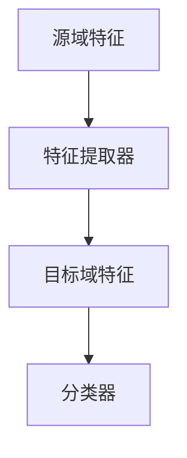
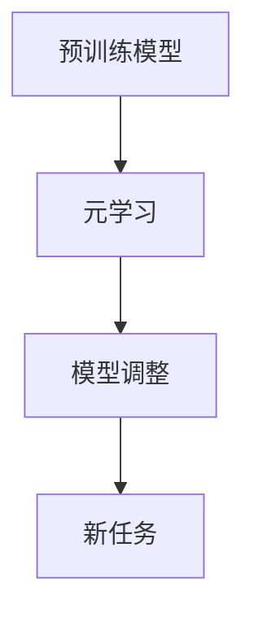
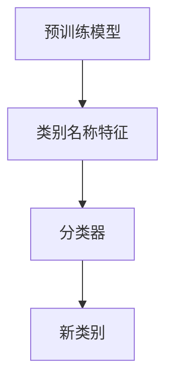
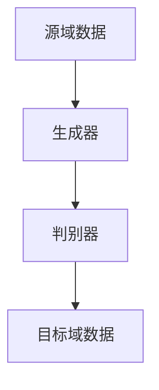

                 

# 《迁移学习（Transfer Learning）原理与代码实例讲解》

## 关键词
- 迁移学习
- 特征重用
- 模型复用
- 元学习
- 对抗迁移学习
- 计算机视觉
- 自然语言处理

## 摘要
迁移学习是一种重要的机器学习方法，它通过利用预训练模型在新的目标任务上实现较好的性能。本文将从迁移学习的定义、基本概念、核心理论、算法原理、实践应用、优化方法及未来趋势等方面进行详细讲解，并通过代码实例展示其在计算机视觉和自然语言处理中的具体应用。本文旨在帮助读者深入理解迁移学习的工作原理，掌握其核心算法，并能够应用于实际问题中。

## 目录

### 第一部分：迁移学习基础

#### 第1章：迁移学习概述
- **1.1 迁移学习的定义与重要性**
- **1.2 迁移学习的基本概念**
- **1.3 迁移学习的发展历程**
- **1.4 迁移学习的研究现状与趋势**

#### 第2章：迁移学习核心理论
- **2.1 特征重用与模型复用**
- **2.2 元学习与模型调整**
- **2.3 零样本学习与自适应学习**
- **2.4 对抗迁移学习**

### 第二部分：迁移学习算法原理

#### 第3章：经典迁移学习算法
- **3.1 经典迁移学习算法概述**
- **3.2 数据重加权**
- **3.3 多任务学习**
- **3.4 动量传递与谱归一化**

#### 第4章：现代迁移学习算法
- **4.1 深度迁移学习算法**
- **4.2 零样本学习算法**
- **4.3 自适应迁移学习算法**
- **4.4 对抗迁移学习算法**

### 第三部分：迁移学习实践

#### 第5章：迁移学习在计算机视觉中的应用
- **5.1 迁移学习在计算机视觉中的挑战与机遇**
- **5.2 迁移学习在图像分类中的应用**
- **5.3 迁移学习在目标检测中的应用**
- **5.4 迁移学习在图像分割中的应用**

#### 第6章：迁移学习在自然语言处理中的应用
- **6.1 迁移学习在自然语言处理中的挑战与机遇**
- **6.2 迁移学习在文本分类中的应用**
- **6.3 迁移学习在机器翻译中的应用**
- **6.4 迁移学习在情感分析中的应用**

#### 第7章：迁移学习的应用案例与实战
- **7.1 迁移学习应用案例概述**
- **7.2 迁移学习实战一：图像分类**
- **7.3 迁移学习实战二：文本分类**
- **7.4 迁移学习实战三：目标检测**

### 第四部分：迁移学习优化与未来趋势

#### 第8章：迁移学习优化方法
- **8.1 迁移学习优化方法概述**
- **8.2 数据增强**
- **8.3 模型融合**
- **8.4 动态迁移学习**

#### 第9章：迁移学习的未来趋势与挑战
- **9.1 迁移学习的未来发展趋势**
- **9.2 迁移学习的挑战与对策**

### 附录

#### 附录A：迁移学习相关工具与资源
- **A.1 主流迁移学习框架**
- **A.2 迁移学习开源代码与实践项目**
- **A.3 迁移学习相关论文与书籍推荐**

### 结束语
- **作者信息**

# 迁移学习概述

## 1.1 迁移学习的定义与重要性

迁移学习（Transfer Learning）是机器学习领域中的一个重要分支，其主要思想是利用已经在一个任务上训练好的模型或特征提取器，将其应用于另一个相关但不同的任务上，从而提高新任务的性能。具体来说，迁移学习通过将先前学习到的知识迁移到新的任务中，可以显著减少训练新模型所需的数据量和计算资源。

迁移学习的定义可以从以下几个方面来理解：

1. **知识迁移**：将已经在一个任务上学习到的知识（如模型参数或特征表示）应用到另一个任务上。
2. **相似性**：新任务与原任务之间必须存在一定的相似性，这样迁移才是有效的。
3. **减少训练数据**：通过迁移学习，可以减少新任务上训练所需的数据量，这对于数据稀缺的任务尤为重要。
4. **提高性能**：迁移学习可以提高新任务的表现，尤其是在训练数据不足的情况下。

迁移学习的重要性体现在以下几个方面：

1. **节省资源和时间**：通过复用已经训练好的模型或特征提取器，可以显著减少新任务的训练时间和计算资源消耗。
2. **提高性能**：在某些任务上，迁移学习可以显著提高模型的性能，特别是在数据稀缺或数据分布不同的场景中。
3. **适用于多样化任务**：迁移学习适用于许多不同的领域和任务，如计算机视觉、自然语言处理、语音识别等。
4. **增强模型泛化能力**：通过迁移学习，模型可以更好地泛化到未见过的数据，提高其在真实世界中的实用性。

## 1.2 迁移学习的基本概念

在深入探讨迁移学习之前，我们需要理解一些基本概念和术语，这些概念和术语对于理解迁移学习的工作原理至关重要。

### 1.2.1 基础术语与符号解释

- **源域（Source Domain）**：指已经训练好的模型或特征提取器所适用的任务领域。
- **目标域（Target Domain）**：指新任务所在的领域，通常与源域不同。
- **模型参数（Model Parameters）**：指模型中可调整的数值，通过学习过程来优化。
- **特征提取器（Feature Extractor）**：用于提取输入数据的特征表示，通常是一个预训练的神经网络。
- **迁移量（Transfer Amount）**：衡量迁移学习效果的指标，表示从源域迁移到目标域的知识量。
- **泛化能力（Generalization Ability）**：模型在新数据上表现的能力，良好的泛化能力意味着模型可以适应未见过的数据。

### 1.2.2 简要介绍迁移学习的主要类型

迁移学习可以根据源域和目标域之间的关系分为以下几种类型：

- **同域迁移（Homoscedastic Transfer）**：源域和目标域具有相似的分布，特征迁移较为直接。
- **跨域迁移（Heteroscedastic Transfer）**：源域和目标域分布不同，需要一定的适配和调整。
- **零样本迁移学习（Zero-Shot Learning）**：模型可以处理从未见过的类别，通过元学习实现。
- **少样本迁移学习（Few-Shot Learning）**：模型在少量样本上就能学习到有效的特征，适用于数据稀缺的场景。
- **对抗迁移学习（Adversarial Transfer Learning）**：通过对抗网络来增强模型的迁移能力，提高其在异质数据上的性能。

### 1.3 迁移学习的发展历程

迁移学习的历史可以追溯到20世纪50年代，当时的专家系统就已经利用了已有知识来解决新问题。然而，随着机器学习尤其是深度学习的快速发展，迁移学习的应用和研究才逐渐得到广泛关注。

- **早期迁移学习**：20世纪80年代和90年代，迁移学习主要采用浅层模型和手工特征设计，如决策树和贝叶斯网络。
- **深度迁移学习**：2000年代后期，随着深度学习的发展，迁移学习开始引入深度神经网络，特别是卷积神经网络（CNN）和循环神经网络（RNN），显著提升了迁移学习的性能。
- **现代迁移学习**：近年来，迁移学习在计算机视觉、自然语言处理、语音识别等领域取得了显著成果，出现了许多先进的迁移学习方法，如零样本学习、少样本学习和对抗迁移学习等。

### 1.4 迁移学习的研究现状与趋势

目前，迁移学习的研究现状主要表现在以下几个方面：

- **模型复用**：通过复用预训练模型，可以在新的目标任务上获得良好的性能。
- **零样本学习**：研究如何使模型能够处理未见过的类别，特别是在数据稀缺的情况下。
- **少样本学习**：如何使模型在仅使用少量样本的情况下就能学习到有效的特征表示。
- **对抗迁移学习**：如何通过对抗训练提高模型的迁移能力，尤其是在异质数据上的迁移效果。
- **跨模态迁移学习**：研究如何在不同的模态（如图像、文本、音频）之间进行知识迁移。

未来，迁移学习的研究趋势可能包括：

- **自动迁移学习**：开发自动化的迁移学习方法，减少人工干预。
- **动态迁移学习**：研究如何根据任务的变化动态调整迁移策略。
- **迁移学习与强化学习的结合**：探索迁移学习与强化学习在决策制定和资源分配中的应用。
- **迁移学习的可解释性**：提高迁移学习算法的可解释性，使其在关键任务中更加可靠和安全。

## 总结

迁移学习作为一种有效的机器学习方法，通过复用已有的知识和模型，可以显著提高新任务的性能和效率。本文对迁移学习的定义、基本概念、发展历程和现状进行了详细阐述，为后续章节的深入探讨奠定了基础。

### 第二部分：迁移学习核心理论

#### 第2章：迁移学习核心理论

迁移学习之所以能够有效，是因为其背后的核心理论，包括特征重用、模型复用、元学习、零样本学习和对抗迁移学习。这些理论为我们提供了理解和应用迁移学习的基础。

#### 2.1 特征重用与模型复用

**特征重用**和**模型复用**是迁移学习的两个基本策略。

**特征重用**：通过将源域的特征提取器（例如，深度神经网络中的中间层）应用于目标域的数据，从而利用源域学习的特征表示。这一方法的核心思想是，如果源域和目标域之间存在相关性，那么源域的特征表示可以在目标域中有效使用。特征重用的关键是找到两个领域之间的共同特征空间。

**模型复用**：与特征重用不同，模型复用直接利用整个预训练模型（包括参数和结构）来解决目标域的问题。这种方法通常用于源域和目标域的分布相似，但任务结构相似的情况。模型复用能够利用源域学习到的复杂模式，从而提高目标域的泛化能力。

**示例：**

假设我们有一个预训练的图像分类模型，其已经在一个大规模的图像数据集上训练过。现在，我们希望将其应用于一个新的图像分类任务，但新任务的数据量较少。在这种情况下，我们可以使用预训练模型的特征提取器来处理新任务的数据，并通过一个简单的分类器来获得良好的性能。这里，预训练模型的特征提取器就是我们在源域学习到的共同特征空间。



**伪代码：**

```python
# 特征重用与模型复用伪代码
source_model = load_pretrained_model()  # 加载预训练模型
target_data = load_target_domain_data()  # 加载目标域数据

# 使用特征提取器提取特征
features = source_model.feature_extractor(target_data)

# 在目标域上训练一个简单的分类器
target_model = SimpleClassifier()
target_model.fit(features, target_labels)

# 预测新数据
predictions = target_model.predict(new_data)
```

**数学模型：**

设 \( \phi(\cdot) \) 为特征提取器， \( f(\cdot) \) 为分类器， \( X_s \) 和 \( X_t \) 分别为源域和目标域的数据， \( y_s \) 和 \( y_t \) 分别为源域和目标域的标签。

迁移学习目标函数可以表示为：

$$
L(\theta_s, \theta_t) = L_s(\phi(X_s), \theta_s) + \lambda L_t(\phi(X_t), \theta_t)
$$

其中， \( L_s \) 和 \( L_t \) 分别为源域和目标域的损失函数， \( \theta_s \) 和 \( \theta_t \) 分别为源域和目标域的模型参数， \( \lambda \) 是权重系数，用于平衡源域和目标域的贡献。

#### 2.2 元学习与模型调整

**元学习**（Meta-Learning）是一种通过训练模型来学习如何快速适应新任务的方法。在元学习中，模型通过多个任务的学习经历，学习到一个通用策略，从而在新的任务上能够迅速适应。

**元学习的分类：**

- **基于梯度的元学习**：如MAML（Model-Agnostic Meta-Learning），通过优化模型参数的梯度，使得模型在少量样本上快速收敛。
- **基于采样的元学习**：如Reptile，通过迭代地更新模型参数，使得模型在新任务上具有快速的适应能力。

**模型调整**（Model Tuning）是在目标域上微调预训练模型，以适应特定任务的需求。模型调整通常在元学习的基础上进行，通过调整模型参数，进一步提高模型在目标域上的性能。

**示例：**

假设我们有一个预训练的图像分类模型，该模型在CIFAR-10数据集上进行了预训练。现在，我们希望将其应用于一个新的图像分类任务，该任务的数据集与CIFAR-10相似，但类别不同。在这种情况下，我们可以使用元学习方法，在多个类似任务上训练模型，并在新任务上进行模型调整。



**伪代码：**

```python
# 元学习与模型调整伪代码
pretrained_model = load_pretrained_model()  # 加载预训练模型
target_task = load_target_task()  # 加载新任务

# 在多个任务上训练模型
for task in tasks:
    pretrained_model.train_on_task(task)

# 在新任务上进行模型调整
adjusted_model = pretrained_model.tune_on_task(target_task)

# 预测新数据
predictions = adjusted_model.predict(new_data)
```

**数学模型：**

设 \( \theta \) 为模型参数， \( T \) 为训练任务集合， \( X_t \) 和 \( y_t \) 分别为任务 \( t \) 的数据集和标签。

元学习目标函数可以表示为：

$$
L(\theta) = \sum_{t\in T} L_t(\theta)
$$

其中， \( L_t(\theta) \) 为任务 \( t \) 的损失函数。

模型调整的目标函数可以表示为：

$$
L_t(\theta') = L_t(\theta, X_t, y_t)
$$

其中， \( \theta' \) 为调整后的模型参数。

#### 2.3 零样本学习与自适应学习

**零样本学习**（Zero-Shot Learning，ZSL）是一种在模型未见过类别的情况下，能够进行分类的方法。零样本学习的关键是学习一个能够将类别名称映射到特征表示的模型，从而在新类别上实现分类。

**自适应学习**（Adaptive Learning）是一种在动态环境中，模型能够根据新的数据和经验不断调整自身的方法。自适应学习在动态变化的任务中非常重要，它使得模型能够持续地适应环境的变化。

**示例：**

假设我们有一个预训练的零样本学习模型，该模型可以处理从未见过的类别。现在，我们希望将其应用于一个新的产品分类任务，该任务包含了一些新类别。在这种情况下，我们可以使用零样本学习模型，通过类别名称的特征表示，对新类别进行分类。



**伪代码：**

```python
# 零样本学习与自适应学习伪代码
zsl_model = load_zero_shot_learning_model()  # 加载零样本学习模型
new_classes = load_new_classes()  # 加载新类别

# 将类别名称转换为特征表示
class_features = zsl_model.encode_class_names(new_classes)

# 在新类别上训练分类器
classifier = Classifier()
classifier.fit(class_features, new_labels)

# 预测新数据
predictions = classifier.predict(new_data)
```

**数学模型：**

设 \( C \) 为类别集合， \( \phi(\cdot) \) 为类别特征提取器， \( f(\cdot) \) 为分类器。

零样本学习目标函数可以表示为：

$$
L(\theta) = \sum_{c\in C} L_c(\phi(c), \theta)
$$

其中， \( L_c(\phi(c), \theta) \) 为类别 \( c \) 的损失函数。

自适应学习目标函数可以表示为：

$$
L(\theta, \Delta) = L(\theta) + \lambda \cdot \Delta
$$

其中， \( \Delta \) 为模型更新的方向， \( \lambda \) 为更新速率。

#### 2.4 对抗迁移学习

**对抗迁移学习**（Adversarial Transfer Learning）是一种通过对抗训练来增强迁移学习效果的的方法。对抗迁移学习的核心思想是通过对抗网络（Adversarial Network）来生成与源域数据分布相似的伪数据，从而提高目标域模型的泛化能力。

**对抗迁移学习的主要组件：**

- **生成器**（Generator）：将目标域的数据映射到源域的数据分布。
- **判别器**（Discriminator）：区分源域数据和生成的伪数据。

**示例：**

假设我们有一个预训练的图像分类模型，该模型在源域上训练得很好。现在，我们希望将其应用于目标域，但目标域的数据分布与源域不同。在这种情况下，我们可以使用对抗迁移学习，通过生成与源域数据分布相似的伪数据，来提高目标域模型的泛化能力。



**伪代码：**

```python
# 对抗迁移学习伪代码
source_data = load_source_domain_data()  # 加载源域数据
target_data = load_target_domain_data()  # 加载目标域数据

# 初始化生成器和判别器
generator = Generator()
discriminator = Discriminator()

# 对抗训练
for epoch in range(num_epochs):
    for data in target_data:
        # 生成伪数据
        fake_data = generator.generate(data)
        
        # 更新判别器
        discriminator.train(fake_data)
        
        # 更新生成器
        generator.train(discriminator)

# 使用预训练模型和生成器
pretrained_model = load_pretrained_model()
for data in target_data:
    # 生成伪数据
    fake_data = generator.generate(data)
    
    # 结合源域数据和伪数据训练模型
    pretrained_model.train(fake_data, data)
```

**数学模型：**

设 \( G \) 为生成器， \( D \) 为判别器， \( X_s \) 和 \( X_t \) 分别为源域和目标域的数据。

生成器目标函数可以表示为：

$$
L_G(X_t) = -\log(D(G(X_t)))
$$

判别器目标函数可以表示为：

$$
L_D(X_s, X_t) = -\log(D(X_s)) - \log(1 - D(G(X_t)))
$$

预训练模型的目标函数可以表示为：

$$
L(\theta) = L_s(\theta) + \lambda L_t(G(X_t), \theta)
$$

其中， \( L_s(\theta) \) 为源域的损失函数， \( L_t(G(X_t), \theta) \) 为目标域的损失函数， \( \lambda \) 为权重系数。

### 总结

本章节详细介绍了迁移学习的核心理论，包括特征重用、模型复用、元学习、零样本学习和对抗迁移学习。通过这些理论，我们可以更好地理解迁移学习的工作原理，并能够应用于实际问题中。

### 第三部分：迁移学习算法原理

#### 第3章：经典迁移学习算法

在迁移学习的历史中，许多经典算法为后续研究奠定了基础。这些算法通过不同的策略和技巧，有效地利用了预训练模型在新的目标任务上的性能。本章节将介绍几种经典的迁移学习算法，包括数据重加权、多任务学习、动量传递与谱归一化等。

#### 3.1 经典迁移学习算法概述

经典迁移学习算法主要关注如何有效地利用预训练模型，通过调整和优化模型参数，使其在新任务上表现良好。以下是几种常见的经典迁移学习算法：

- **数据重加权**：通过调整源域和目标域数据的权重，使模型在学习过程中更加关注目标域的数据。
- **多任务学习**：通过同时训练多个相关任务，提高模型在各个任务上的泛化能力。
- **动量传递与谱归一化**：通过调整模型参数的动量和谱归一化，提高模型的稳定性和性能。

#### 3.2 数据重加权

数据重加权是一种常用的迁移学习策略，它通过调整源域和目标域数据的权重，使模型在学习过程中更加关注目标域的数据。这种策略可以缓解数据分布差异，提高模型在目标域上的性能。

**原理：**

在数据重加权中，模型训练过程中，源域数据和目标域数据的权重会根据它们在目标函数中的贡献进行调整。通常，目标函数可以表示为：

$$
L = w_s L_s + w_t L_t
$$

其中， \( L_s \) 和 \( L_t \) 分别为源域和目标域的损失函数， \( w_s \) 和 \( w_t \) 为权重系数。通过调整 \( w_s \) 和 \( w_t \)，可以控制模型对源域和目标域数据的关注程度。

**实现：**

在实现数据重加权的算法中，常用的方法包括调整训练样本的损失函数权重、调整模型参数的更新速率等。以下是一个简化的伪代码示例：

```python
# 数据重加权伪代码
source_model = load_pretrained_model()  # 加载预训练模型
target_data = load_target_domain_data()  # 加载目标域数据

# 计算源域和目标域数据的权重
source_weights = compute_source_weights(source_model, target_data)
target_weights = compute_target_weights(source_model, target_data)

# 调整模型参数
source_model.adjust_weights(source_weights, target_weights)

# 在目标域上训练模型
source_model.train(target_data, target_labels)
```

**数学模型：**

假设模型参数为 \( \theta \)，源域数据集为 \( X_s \)，目标域数据集为 \( X_t \)，标签集分别为 \( y_s \) 和 \( y_t \)。

数据重加权的损失函数可以表示为：

$$
L(\theta) = \frac{1}{N_s + N_t} \left[ w_s \sum_{i=1}^{N_s} L_s(\theta, x_{s,i}, y_{s,i}) + w_t \sum_{i=1}^{N_t} L_t(\theta, x_{t,i}, y_{t,i}) \right]
$$

其中， \( N_s \) 和 \( N_t \) 分别为源域和目标域的样本数量， \( L_s \) 和 \( L_t \) 分别为源域和目标域的损失函数， \( w_s \) 和 \( w_t \) 为权重系数。

#### 3.3 多任务学习

多任务学习（Multi-Task Learning）是一种同时训练多个相关任务的迁移学习策略。通过共享模型参数和特征提取器，多任务学习可以提高模型在各个任务上的泛化能力，并减少过拟合。

**原理：**

多任务学习的基本思想是，通过将多个任务的损失函数结合起来，优化共享的模型参数。这种方法可以使得模型在多个任务上学习到通用的特征表示，从而提高其在每个任务上的性能。

**实现：**

在多任务学习中，通常采用以下步骤：

1. **定义共享模型**：创建一个可以同时处理多个任务的模型，模型中包含共享的层和任务特定的层。
2. **组合损失函数**：将每个任务的损失函数组合成一个总损失函数，通过优化总损失函数来训练模型。
3. **训练模型**：在训练过程中，模型会学习到多个任务的相关特征表示，并通过优化总损失函数来提高每个任务的表现。

以下是一个简化的伪代码示例：

```python
# 多任务学习伪代码
source_model = load_pretrained_model()  # 加载预训练模型
target_data = load_target_domain_data()  # 加载目标域数据

# 定义任务特定的损失函数
task_losses = [define_loss_function(task) for task in target_tasks]

# 定义总损失函数
total_loss = sum(task_losses)

# 训练模型
source_model.train(target_data, total_loss)
```

**数学模型：**

设模型参数为 \( \theta \)，任务 \( t \) 的数据集为 \( X_t \)，标签集为 \( y_t \)，任务 \( t \) 的损失函数为 \( L_t(\theta) \)。

多任务学习的总损失函数可以表示为：

$$
L(\theta) = \sum_{t=1}^{T} L_t(\theta)
$$

其中， \( T \) 为任务的数量。

#### 3.4 动量传递与谱归一化

动量传递（Momentum Transfer）和谱归一化（Spectral Normalization）是提高深度迁移学习模型性能的两种技术。

**动量传递：**

动量传递是一种通过保留模型训练过程中的历史梯度信息来稳定训练过程的技术。它可以帮助模型在训练过程中克服局部最小值和鞍点，从而提高收敛速度和模型性能。

**原理：**

动量传递通过计算梯度的历史累积值来更新模型参数，其核心思想是：

$$
\theta_{t+1} = \theta_t + \alpha \cdot \gamma \cdot \Delta\theta_t
$$

其中， \( \theta_t \) 为第 \( t \) 次迭代的模型参数， \( \alpha \) 为学习率， \( \gamma \) 为动量系数， \( \Delta\theta_t \) 为第 \( t \) 次迭代的梯度。

**实现：**

在实现动量传递时，常用的方法是使用动量项来更新模型参数。以下是一个简化的伪代码示例：

```python
# 动量传递伪代码
model = load_pretrained_model()  # 加载预训练模型
learning_rate = 0.01
momentum = 0.9

for epoch in range(num_epochs):
    for data, label in train_data:
        # 计算梯度
        gradient = model.compute_gradient(data, label)
        
        # 更新模型参数
        model_params = model.get_params()
        new_params = [
            params + momentum * prev_params - learning_rate * gradient
            for params, prev_params in zip(model_params, model_params)
        ]
        model.set_params(new_params)
```

**数学模型：**

设模型参数为 \( \theta \)，梯度为 \( \Delta\theta \)，动量系数为 \( \gamma \)，学习率为 \( \alpha \)。

动量更新的模型参数可以表示为：

$$
\theta_{t+1} = \theta_t + \alpha \cdot \gamma \cdot \Delta\theta_t
$$

**谱归一化：**

谱归一化是一种通过标准化模型参数的谱范数来稳定深度学习训练的方法。它可以帮助模型在训练过程中减少梯度消失和梯度爆炸的问题，从而提高模型的稳定性和性能。

**原理：**

谱归一化通过将模型参数归一化到谱范数为1，从而消除参数之间的尺度差异。其核心思想是：

$$
\theta_{\text{norm}} = \frac{\theta}{\|\theta\|_2}
$$

其中， \( \|\theta\|_2 \) 为 \( \theta \) 的二范数。

**实现：**

在实现谱归一化时，通常使用一个可学习的归一化参数 \( \gamma \)，通过迭代更新 \( \gamma \) 来找到最优的归一化尺度。以下是一个简化的伪代码示例：

```python
# 谱归一化伪代码
model = load_pretrained_model()  # 加载预训练模型
gamma = initialize_gamma()

for epoch in range(num_epochs):
    for data, label in train_data:
        # 计算梯度
        gradient = model.compute_gradient(data, label)
        
        # 计算谱范数
        spectral_norm = calculate_spectral_norm(gradient)
        
        # 更新归一化参数
        gamma = update_gamma(spectral_norm, gamma)
        
        # 更新模型参数
        model_params = model.get_params()
        new_params = [
            param / gamma for param in model_params
        ]
        model.set_params(new_params)
```

**数学模型：**

设模型参数为 \( \theta \)，梯度为 \( \Delta\theta \)，归一化参数为 \( \gamma \)。

谱归一化的模型参数可以表示为：

$$
\theta_{\text{norm}} = \frac{\theta}{\|\theta\|_2}
$$

#### 总结

本章节介绍了经典迁移学习算法，包括数据重加权、多任务学习和动量传递与谱归一化。这些算法通过不同的策略和技巧，有效地利用预训练模型在新的目标任务上的性能。在实际应用中，这些算法可以根据具体问题和数据集的特点进行灵活调整和组合，以实现最佳性能。

### 第4章：现代迁移学习算法

随着深度学习技术的不断发展，现代迁移学习算法在迁移能力、适应性和泛化性方面取得了显著的提升。本章将介绍几种现代迁移学习算法，包括深度迁移学习算法、零样本学习算法、自适应迁移学习算法和对抗迁移学习算法，并展示其在实际应用中的示例。

#### 4.1 深度迁移学习算法

深度迁移学习算法是基于深度神经网络（Deep Neural Network, DNN）的迁移学习方法。DNN通过多层非线性变换，可以自动学习到数据的复杂特征表示，从而在迁移学习中表现出强大的迁移能力。以下是几种常见的深度迁移学习算法：

**4.1.1 预训练模型迁移**

预训练模型迁移（Pre-Trained Model Transfer）是最常见的深度迁移学习算法之一。这种方法首先在大量数据上预训练一个深度神经网络，然后使用该预训练模型作为特征提取器，并在新的目标任务上进行微调。

**原理：**

预训练模型迁移的基本原理是通过在大规模数据集上预训练模型，使其学习到通用且有用的特征表示。当迁移到新的目标任务时，只需在预训练模型的最后一层进行微调，以适应新的任务。

**实现：**

实现预训练模型迁移的一般步骤如下：

1. **预训练模型**：在大量数据集上训练深度神经网络，例如在ImageNet上训练ResNet-50。
2. **特征提取**：在新的目标任务上，使用预训练模型的特征提取器处理输入数据。
3. **微调模型**：在特征提取器的基础上，添加一个或多个任务特定的全连接层，并使用少量目标任务数据进行微调。

**示例：**

假设我们有一个预训练的ResNet-50模型，并希望将其应用于一个新的图像分类任务。

```python
from torchvision.models import resnet50
from torchvision import transforms
from torch.utils.data import DataLoader

# 预训练模型迁移示例
model = resnet50(pretrained=True)  # 加载预训练的ResNet-50模型
model.fc = nn.Linear(model.fc.in_features, num_classes)  # 修改最后一层

# 数据预处理
transform = transforms.Compose([
    transforms.Resize(256),
    transforms.CenterCrop(224),
    transforms.ToTensor(),
    transforms.Normalize(mean=[0.485, 0.456, 0.406], std=[0.229, 0.224, 0.225]),
])

# 加载新的目标任务数据
train_data = DataLoader(dataset, batch_size=batch_size, shuffle=True)
val_data = DataLoader(val_dataset, batch_size=batch_size, shuffle=False)

# 微调模型
optimizer = optim.SGD(model.parameters(), lr=0.001, momentum=0.9)
criterion = nn.CrossEntropyLoss()

for epoch in range(num_epochs):
    model.train()
    for inputs, labels in train_data:
        optimizer.zero_grad()
        outputs = model(inputs)
        loss = criterion(outputs, labels)
        loss.backward()
        optimizer.step()
    
    # 验证模型
    model.eval()
    with torch.no_grad():
        correct = 0
        total = 0
        for inputs, labels in val_data:
            outputs = model(inputs)
            _, predicted = torch.max(outputs.data, 1)
            total += labels.size(0)
            correct += (predicted == labels).sum().item()
        print(f'Epoch {epoch+1}/{num_epochs}, Accuracy: {100 * correct / total}%')
```

**数学模型：**

预训练模型迁移的数学模型主要涉及特征提取和微调两个阶段。在特征提取阶段，模型的目标是最小化预训练数据集上的损失函数 \( L_s \)：

$$
L_s(\theta) = \sum_{i=1}^{N_s} L_s(x_{s,i}, y_{s,i}, \theta)
$$

其中， \( N_s \) 是预训练数据集的样本数量， \( x_{s,i} \) 和 \( y_{s,i} \) 分别是预训练数据集的第 \( i \) 个样本和标签， \( \theta \) 是模型参数。

在微调阶段，模型的目标是最小化目标任务数据集上的损失函数 \( L_t \)：

$$
L_t(\theta) = \sum_{i=1}^{N_t} L_t(x_{t,i}, y_{t,i}, \theta)
$$

其中， \( N_t \) 是目标任务数据集的样本数量， \( x_{t,i} \) 和 \( y_{t,i} \) 分别是目标任务数据集的第 \( i \) 个样本和标签。

**4.1.2 Fine-tuning**

Fine-tuning 是一种在预训练模型基础上进一步训练的方法，通常用于新任务数据量较少的情况。通过在少量新数据上微调预训练模型，可以显著提高新任务的性能。

**原理：**

Fine-tuning 的原理是利用预训练模型学习到的通用特征表示，然后在新数据上调整模型参数，使其适应新任务。这种方法可以有效地利用预训练模型的知识，同时减少对新数据的依赖。

**实现：**

Fine-tuning 的实现步骤如下：

1. **加载预训练模型**：加载已经在大规模数据集上预训练的模型。
2. **冻结部分层**：对于预训练模型的某些层，特别是靠近输入的层，可以冻结其权重，防止在微调过程中更新。
3. **微调剩余层**：只对预训练模型的剩余层（通常是从倒数第二层开始）进行微调，以适应新任务。
4. **优化模型**：使用新任务数据对模型进行优化，通常使用小的学习率和适当的优化器。

**示例：**

假设我们有一个预训练的BERT模型，并希望将其应用于一个新的文本分类任务。

```python
from transformers import BertModel, BertTokenizer
from torch.optim import Adam
from torch.utils.data import DataLoader

# Fine-tuning示例
model = BertModel.from_pretrained('bert-base-uncased')
tokenizer = BertTokenizer.from_pretrained('bert-base-uncased')

# 加载新的目标任务数据
train_data = DataLoader(dataset, batch_size=batch_size, shuffle=True)
val_data = DataLoader(val_dataset, batch_size=batch_size, shuffle=False)

# 微调模型
optimizer = Adam(model.parameters(), lr=2e-5)

for epoch in range(num_epochs):
    model.train()
    for inputs, labels in train_data:
        inputs = tokenizer(inputs, padding=True, truncation=True, return_tensors='pt')
        optimizer.zero_grad()
        outputs = model(**inputs)[0]
        loss = nn.CrossEntropyLoss()(outputs, labels)
        loss.backward()
        optimizer.step()
    
    # 验证模型
    model.eval()
    with torch.no_grad():
        correct = 0
        total = 0
        for inputs, labels in val_data:
            inputs = tokenizer(inputs, padding=True, truncation=True, return_tensors='pt')
            outputs = model(**inputs)[0]
            _, predicted = torch.max(outputs.data, 1)
            total += labels.size(0)
            correct += (predicted == labels).sum().item()
        print(f'Epoch {epoch+1}/{num_epochs}, Accuracy: {100 * correct / total}%')
```

**数学模型：**

Fine-tuning 的数学模型与预训练模型迁移类似，主要涉及特征提取和微调两个阶段。在特征提取阶段，模型的目标是最小化预训练数据集上的损失函数 \( L_s \)：

$$
L_s(\theta) = \sum_{i=1}^{N_s} L_s(x_{s,i}, y_{s,i}, \theta)
$$

在微调阶段，模型的目标是最小化目标任务数据集上的损失函数 \( L_t \)：

$$
L_t(\theta) = \sum_{i=1}^{N_t} L_t(x_{t,i}, y_{t,i}, \theta)
$$

**4.1.3 迁移辅助训练**

迁移辅助训练（Migrating Assistant Training）是一种利用辅助任务提升迁移学习效果的算法。通过同时训练主任务和辅助任务，可以增强模型对源域和目标域的适应性。

**原理：**

迁移辅助训练的基本思想是通过辅助任务提供额外的监督信息，帮助模型更好地理解源域和目标域之间的差异。辅助任务通常与主任务相关但不完全相同，可以提供额外的特征表示和区分能力。

**实现：**

迁移辅助训练的实现步骤如下：

1. **定义主任务和辅助任务**：主任务是需要解决的最终任务，辅助任务是提供额外监督信息的任务。
2. **训练主任务和辅助任务**：使用源域和目标域的数据同时训练主任务和辅助任务。
3. **整合模型**：将主任务和辅助任务的损失函数整合，并优化整个模型。

**示例：**

假设我们有一个图像分类任务，并希望使用迁移辅助训练方法。

```python
from torchvision.models import resnet50
from torchvision import transforms
from torch.optim import SGD
from torch.utils.data import DataLoader

# 迁移辅助训练示例
model = resnet50(pretrained=True)
optimizer = SGD(model.parameters(), lr=0.001, momentum=0.9)

# 加载源域和目标域数据
source_data = DataLoader(source_dataset, batch_size=batch_size, shuffle=True)
target_data = DataLoader(target_dataset, batch_size=batch_size, shuffle=True)

# 定义辅助任务
assistant_model = resnet50(pretrained=True)
assistant_optimizer = SGD(assistant_model.parameters(), lr=0.001, momentum=0.9)

for epoch in range(num_epochs):
    model.train()
    for inputs, labels in source_data:
        optimizer.zero_grad()
        outputs = model(inputs)
        source_loss = nn.CrossEntropyLoss()(outputs, labels)
        source_loss.backward()
        optimizer.step()
    
    model.eval()
    with torch.no_grad():
        for inputs, labels in target_data:
            assistant_optimizer.zero_grad()
            outputs = model(inputs)
            target_loss = nn.CrossEntropyLoss()(outputs, labels)
            target_loss.backward()
            assistant_optimizer.step()
```

**数学模型：**

迁移辅助训练的数学模型涉及主任务和辅助任务的损失函数。主任务的损失函数为 \( L_t \)，辅助任务的损失函数为 \( L_a \)。整体损失函数可以表示为：

$$
L(\theta) = L_t(\theta) + \lambda L_a(\theta)
$$

其中， \( \lambda \) 是权重系数，用于平衡主任务和辅助任务的贡献。

#### 4.2 零样本学习算法

零样本学习（Zero-Shot Learning, ZSL）是一种在模型未见过类别的情况下进行分类的方法。零样本学习的关键是学习一个能够将类别名称映射到特征表示的模型，从而在新类别上实现分类。

**4.2.1 零样本学习的基本概念**

零样本学习可以分为两类：基于实例的零样本学习和基于关系的零样本学习。

- **基于实例的零样本学习**：这种方法通过学习类别实例的特征表示，将类别名称与实例特征相关联，从而实现分类。
- **基于关系的零样本学习**：这种方法通过学习类别名称与实例特征之间的语义关系，将类别名称映射到特征空间，从而实现分类。

**4.2.2 元学习在零样本学习中的应用**

元学习（Meta-Learning）是零样本学习的一种重要方法。通过元学习，模型可以在少量样本上快速适应新类别。常见的元学习方法包括MAML（Model-Agnostic Meta-Learning）和Reptile。

- **MAML（Model-Agnostic Meta-Learning）**：MAML通过优化模型参数的梯度，使得模型在少量样本上能够快速收敛。
- **Reptile**：Reptile通过迭代地更新模型参数，使得模型在新类别上能够迅速适应。

**4.2.3 零样本学习算法的实现**

以下是一个基于元学习的零样本学习算法的实现示例。

```python
import torch
import torch.optim as optim
from torch.utils.data import DataLoader

# 零样本学习算法实现
class ZSLModel(nn.Module):
    def __init__(self):
        super(ZSLModel, self).__init__()
        self.encoder = nn.Sequential(
            nn.Conv2d(3, 64, kernel_size=3, padding=1),
            nn.ReLU(),
            nn.MaxPool2d(2, 2),
            nn.Conv2d(64, 128, kernel_size=3, padding=1),
            nn.ReLU(),
            nn.MaxPool2d(2, 2),
            nn.Linear(128 * 4 * 4, 1024),
            nn.ReLU(),
            nn.Dropout(0.5),
            nn.Linear(1024, num_classes)
        )

    def forward(self, x):
        return self.encoder(x)

# 加载数据
train_data = DataLoader(train_dataset, batch_size=batch_size, shuffle=True)
val_data = DataLoader(val_dataset, batch_size=batch_size, shuffle=False)

# 初始化模型和优化器
model = ZSLModel()
optimizer = optim.Adam(model.parameters(), lr=0.001)

# 训练模型
for epoch in range(num_epochs):
    model.train()
    for inputs, labels in train_data:
        optimizer.zero_grad()
        outputs = model(inputs)
        loss = nn.CrossEntropyLoss()(outputs, labels)
        loss.backward()
        optimizer.step()
    
    # 验证模型
    model.eval()
    with torch.no_grad():
        correct = 0
        total = 0
        for inputs, labels in val_data:
            outputs = model(inputs)
            _, predicted = torch.max(outputs.data, 1)
            total += labels.size(0)
            correct += (predicted == labels).sum().item()
        print(f'Epoch {epoch+1}/{num_epochs}, Accuracy: {100 * correct / total}%')
```

**数学模型：**

零样本学习的数学模型涉及两个主要部分：特征提取和分类。

- **特征提取**：特征提取器 \( \phi(\cdot) \) 将输入数据 \( x \) 映射到特征空间。

$$
z = \phi(x)
$$

- **分类**：分类器 \( f(\cdot) \) 将特征 \( z \) 映射到类别概率。

$$
p(y|\theta) = f(z; \theta)
$$

其中， \( \theta \) 是模型参数。

零样本学习的目标是最小化在未见过的类别上的损失函数。

$$
L(\theta) = \sum_{i=1}^{N_c} \sum_{j=1}^{N_t} \log p(y_j|x_i; \theta)
$$

其中， \( N_c \) 是类别数量， \( N_t \) 是目标类别数量。

#### 4.3 自适应迁移学习算法

自适应迁移学习算法旨在提高模型在动态变化环境下的适应能力。这些算法通过持续学习和调整模型，使其能够适应新的任务和变化的数据分布。

**4.3.1 自适应迁移学习的基本概念**

自适应迁移学习可以分为两类：

- **模型更新**：通过调整模型参数，使其在新的任务或数据分布上表现更好。
- **数据适应**：通过调整输入数据，使其更符合模型的期望分布。

**4.3.2 动态迁移学习（Dynamic Transfer Learning）**

动态迁移学习是一种通过实时更新模型和特征提取器来适应新任务的算法。这种方法利用持续学习（Continual Learning）和增量学习（Incremental Learning）的策略，使得模型能够在面对连续变化的任务时保持性能。

**4.3.3 自适应迁移学习算法的实现**

以下是一个简单的自适应迁移学习算法实现示例。

```python
import torch
import torch.optim as optim
from torch.utils.data import DataLoader

# 自适应迁移学习算法实现
class AdaptiveTransferModel(nn.Module):
    def __init__(self):
        super(AdaptiveTransferModel, self).__init__()
        self.encoder = nn.Sequential(
            nn.Conv2d(3, 64, kernel_size=3, padding=1),
            nn.ReLU(),
            nn.MaxPool2d(2, 2),
            nn.Conv2d(64, 128, kernel_size=3, padding=1),
            nn.ReLU(),
            nn.MaxPool2d(2, 2),
            nn.Linear(128 * 4 * 4, 1024),
            nn.ReLU(),
            nn.Dropout(0.5),
            nn.Linear(1024, num_classes)
        )

    def forward(self, x):
        return self.encoder(x)

# 加载数据
train_data = DataLoader(train_dataset, batch_size=batch_size, shuffle=True)
val_data = DataLoader(val_dataset, batch_size=batch_size, shuffle=False)

# 初始化模型和优化器
model = AdaptiveTransferModel()
optimizer = optim.Adam(model.parameters(), lr=0.001)

# 训练模型
for epoch in range(num_epochs):
    model.train()
    for inputs, labels in train_data:
        optimizer.zero_grad()
        outputs = model(inputs)
        loss = nn.CrossEntropyLoss()(outputs, labels)
        loss.backward()
        optimizer.step()
    
    # 验证模型
    model.eval()
    with torch.no_grad():
        correct = 0
        total = 0
        for inputs, labels in val_data:
            outputs = model(inputs)
            _, predicted = torch.max(outputs.data, 1)
            total += labels.size(0)
            correct += (predicted == labels).sum().item()
        print(f'Epoch {epoch+1}/{num_epochs}, Accuracy: {100 * correct / total}%')

# 更新模型以适应新任务
new_train_data = DataLoader(new_train_dataset, batch_size=batch_size, shuffle=True)
model.train()
for epoch in range(num_new_epochs):
    for inputs, labels in new_train_data:
        optimizer.zero_grad()
        outputs = model(inputs)
        loss = nn.CrossEntropyLoss()(outputs, labels)
        loss.backward()
        optimizer.step()
```

**数学模型：**

自适应迁移学习的数学模型涉及模型更新和数据适应。

- **模型更新**：通过优化模型参数 \( \theta \)，使其在新任务上表现更好。

$$
\theta_{\text{new}} = \theta_{\text{old}} + \alpha \cdot \nabla_{\theta} L(\theta)
$$

其中， \( \alpha \) 是学习率， \( \nabla_{\theta} L(\theta) \) 是模型损失函数 \( L(\theta) \) 关于 \( \theta \) 的梯度。

- **数据适应**：通过调整输入数据 \( x \)，使其更符合模型的期望分布。

$$
x_{\text{new}} = f(x_{\text{old}}, \theta)
$$

其中， \( f(\cdot) \) 是数据适应函数。

#### 4.4 对抗迁移学习算法

对抗迁移学习算法通过生成与源域数据分布相似的伪数据，提高目标域模型的泛化能力。对抗迁移学习的关键组件是生成器和判别器，它们通过对抗训练相互竞争，以优化模型的迁移能力。

**4.4.1 对抗迁移学习的基本概念**

对抗迁移学习的基本概念包括：

- **生成器**（Generator）：生成与源域数据分布相似的伪数据，以欺骗判别器。
- **判别器**（Discriminator）：区分源域数据和生成的伪数据。

**4.4.2 GAN（生成对抗网络）在对抗迁移学习中的应用**

生成对抗网络（Generative Adversarial Network, GAN）是对抗迁移学习的一种有效方法。GAN由生成器和判别器组成，两者通过对抗训练相互竞争。

- **生成器**：生成与真实数据分布相似的伪数据。
- **判别器**：通过区分真实数据和伪数据来训练生成器。

**4.4.3 对抗迁移学习算法的实现**

以下是一个基于GAN的对抗迁移学习算法的实现示例。

```python
import torch
import torch.optim as optim
from torch.utils.data import DataLoader

# 对抗迁移学习算法实现
class GANModel(nn.Module):
    def __init__(self):
        super(GANModel, self).__init__()
        self.generator = nn.Sequential(
            nn.Linear(100, 128),
            nn.LeakyReLU(0.2),
            nn.Linear(128, 256),
            nn.LeakyReLU(0.2),
            nn.Linear(256, 512),
            nn.LeakyReLU(0.2),
            nn.Linear(512, 1024),
            nn.LeakyReLU(0.2),
            nn.Linear(1024, 784),
            nn.Tanh()
        )

        self.discriminator = nn.Sequential(
            nn.Linear(784, 512),
            nn.LeakyReLU(0.2),
            nn.Linear(512, 256),
            nn.LeakyReLU(0.2),
            nn.Linear(256, 128),
            nn.LeakyReLU(0.2),
            nn.Linear(128, 1),
            nn.Sigmoid()
        )

    def forward(self, x):
        return self.generator(x)

    def compute_loss(self, real_data, fake_data):
        real_loss = -torch.mean(torch.log(self.discriminator(real_data)))
        fake_loss = -torch.mean(torch.log(1 - self.discriminator(fake_data)))
        return real_loss + fake_loss

# 加载数据
source_data = DataLoader(source_dataset, batch_size=batch_size, shuffle=True)
target_data = DataLoader(target_dataset, batch_size=batch_size, shuffle=True)

# 初始化模型和优化器
model = GANModel()
optimizer_g = optim.Adam(model.generator.parameters(), lr=0.0002)
optimizer_d = optim.Adam(model.discriminator.parameters(), lr=0.0002)

# 训练模型
for epoch in range(num_epochs):
    model.train()
    for real_data in source_data:
        # 更新生成器
        optimizer_g.zero_grad()
        z = torch.randn(batch_size, 100)
        fake_data = model.generator(z)
        g_loss = model.compute_loss(real_data, fake_data)
        g_loss.backward()
        optimizer_g.step()

        # 更新判别器
        optimizer_d.zero_grad()
        d_loss = model.compute_loss(real_data, fake_data)
        d_loss.backward()
        optimizer_d.step()

    # 验证模型
    model.eval()
    with torch.no_grad():
        correct = 0
        total = 0
        for real_data, labels in target_data:
            outputs = model(real_data)
            _, predicted = torch.max(outputs.data, 1)
            total += labels.size(0)
            correct += (predicted == labels).sum().item()
        print(f'Epoch {epoch+1}/{num_epochs}, Accuracy: {100 * correct / total}%')
```

**数学模型：**

对抗迁移学习的数学模型涉及生成器和判别器的损失函数。

- **生成器的损失函数**：

$$
L_G = -\mathbb{E}_{z \sim p(z)}[\log(D(G(z))]
$$

- **判别器的损失函数**：

$$
L_D = \mathbb{E}_{x \sim p(x)}[\log(D(x))] + \mathbb{E}_{z \sim p(z)}[\log(1 - D(G(z))]
$$

其中， \( G(z) \) 是生成的伪数据， \( D(x) \) 和 \( D(G(z)) \) 分别是判别器对真实数据和伪数据的判别结果。

#### 总结

本章介绍了现代迁移学习算法，包括深度迁移学习算法、零样本学习算法、自适应迁移学习算法和对抗迁移学习算法。这些算法通过不同的策略和技术，提高了迁移学习的性能和适应性。在实际应用中，可以根据具体问题和数据集的特点，选择合适的算法来实现迁移学习。

### 第四部分：迁移学习实践

#### 第5章：迁移学习在计算机视觉中的应用

计算机视觉是迁移学习的一个重要应用领域。由于计算机视觉任务通常需要大量的训练数据和计算资源，迁移学习提供了一种有效的解决方案，通过利用预训练模型，可以显著提高新任务的性能和效率。本章将探讨迁移学习在计算机视觉中的挑战与机遇，并具体分析迁移学习在图像分类、目标检测和图像分割中的应用。

#### 5.1 迁移学习在计算机视觉中的挑战与机遇

**挑战：**

- **数据分布差异**：计算机视觉任务通常涉及不同的数据集，这些数据集可能在数据分布上存在显著差异。迁移学习需要解决如何适应这些差异，以确保模型在新的数据集上具有良好的泛化能力。
- **数据量限制**：某些计算机视觉任务，如卫星图像分析或医学影像分析，可能由于隐私或获取难度等原因，无法获取大量的训练数据。迁移学习提供了一种利用少量数据训练高效模型的方法。
- **模型复杂度**：计算机视觉模型通常非常复杂，参数数量庞大。迁移学习需要在模型复用和模型调整之间取得平衡，以确保模型既能利用源域的知识，又能在目标域上适应。

**机遇：**

- **提高性能**：迁移学习通过利用预训练模型的知识，可以显著提高新任务的性能，特别是在数据稀缺的情况下。
- **减少训练时间**：通过迁移学习，可以显著减少新任务的训练时间，这对于实时应用的计算机视觉系统具有重要意义。
- **多任务学习**：迁移学习使得计算机视觉模型能够同时处理多个相关任务，从而提高模型的泛化能力和实用性。

#### 5.2 迁移学习在图像分类中的应用

图像分类是计算机视觉中最基础的task之一，也是迁移学习应用最为广泛的场景。通过利用预训练的卷积神经网络（如ResNet、VGG等），可以显著提高新任务图像分类的准确率。

**实现方法：**

1. **预训练模型选择**：选择一个在大型图像数据集（如ImageNet）上预训练的卷积神经网络。
2. **特征提取器**：使用预训练模型的特征提取部分，对目标域的图像进行特征提取。
3. **分类器**：在特征提取器的基础上添加一个或多个全连接层，用于分类。
4. **微调**：使用目标域的图像和标签对模型进行微调，以提高分类准确率。

**代码实例：**

```python
import torch
import torchvision.models as models
import torchvision.transforms as transforms
from torch.utils.data import DataLoader

# 加载预训练模型
model = models.resnet50(pretrained=True)

# 修改模型，去除最后的分类层
num_ftrs = model.fc.in_features
model.fc = nn.Linear(num_ftrs, num_classes)

# 数据预处理
transform = transforms.Compose([
    transforms.Resize(256),
    transforms.CenterCrop(224),
    transforms.ToTensor(),
    transforms.Normalize(mean=[0.485, 0.456, 0.406], std=[0.229, 0.224, 0.225]),
])

# 加载数据
train_data = DataLoader(dataset, batch_size=batch_size, shuffle=True)
val_data = DataLoader(val_dataset, batch_size=batch_size, shuffle=False)

# 定义优化器和损失函数
optimizer = optim.SGD(model.parameters(), lr=0.001, momentum=0.9)
criterion = nn.CrossEntropyLoss()

# 训练模型
for epoch in range(num_epochs):
    model.train()
    for inputs, labels in train_data:
        optimizer.zero_grad()
        outputs = model(inputs)
        loss = criterion(outputs, labels)
        loss.backward()
        optimizer.step()
    
    # 验证模型
    model.eval()
    with torch.no_grad():
        correct = 0
        total = 0
        for inputs, labels in val_data:
            outputs = model(inputs)
            _, predicted = torch.max(outputs.data, 1)
            total += labels.size(0)
            correct += (predicted == labels).sum().item()
        print(f'Epoch {epoch+1}/{num_epochs}, Accuracy: {100 * correct / total}%')
```

**数学模型：**

迁移学习在图像分类中的应用主要涉及两个阶段的损失函数：

1. **源域损失函数**：

$$
L_s(\theta) = \sum_{i=1}^{N_s} L_s(x_{s,i}, y_{s,i}, \theta)
$$

其中， \( N_s \) 是源域数据集的样本数量， \( x_{s,i} \) 和 \( y_{s,i} \) 分别是源域数据集的第 \( i \) 个样本和标签， \( \theta \) 是模型参数。

2. **目标域损失函数**：

$$
L_t(\theta) = \sum_{i=1}^{N_t} L_t(x_{t,i}, y_{t,i}, \theta)
$$

其中， \( N_t \) 是目标域数据集的样本数量， \( x_{t,i} \) 和 \( y_{t,i} \) 分别是目标域数据集的第 \( i \) 个样本和标签。

总损失函数可以表示为：

$$
L(\theta) = L_s(\theta) + \lambda L_t(\theta)
$$

其中， \( \lambda \) 是权重系数，用于平衡源域和目标域的贡献。

#### 5.3 迁移学习在目标检测中的应用

目标检测是计算机视觉中的另一个重要任务，它旨在识别图像中的多个对象并定位它们的位置。迁移学习在目标检测中的应用可以显著提高模型的检测准确率和效率。

**实现方法：**

1. **预训练模型选择**：选择一个在大型图像数据集上预训练的目标检测模型（如Faster R-CNN、SSD、YOLO等）。
2. **特征提取器**：使用预训练模型的特征提取部分，对目标域的图像进行特征提取。
3. **检测头**：在特征提取器的基础上添加检测头（如ROI Head），用于检测图像中的目标。
4. **微调**：使用目标域的图像和标注框对模型进行微调，以提高检测性能。

**代码实例：**

```python
import torch
import torchvision.models.detection as models
import torchvision.transforms as transforms
from torch.utils.data import DataLoader

# 加载预训练模型
model = models.fasterrcnn_resnet50_fpn(pretrained=True)

# 修改模型，根据目标域的类别数调整输出层
num_classes = 2  # 假设有两个类别
in_features = model.roi_heads.box_predictor.cls_score.in_features
model.roi_heads.box_predictor = FastRCNNPredictor(in_features, num_classes)

# 数据预处理
transform = transforms.Compose([
    transforms.ToTensor(),
])

# 加载数据
train_data = DataLoader(dataset, batch_size=batch_size, shuffle=True)
val_data = DataLoader(val_dataset, batch_size=batch_size, shuffle=False)

# 定义优化器和损失函数
optimizer = optim.SGD(model.parameters(), lr=0.001, momentum=0.9)
criterion = MultiScaleFocalLoss()

# 训练模型
for epoch in range(num_epochs):
    model.train()
    for inputs, targets in train_data:
        optimizer.zero_grad()
        outputs = model(inputs)
        loss = criterion(outputs, targets)
        loss.backward()
        optimizer.step()
    
    # 验证模型
    model.eval()
    with torch.no_grad():
        correct = 0
        total = 0
        for inputs, targets in val_data:
            outputs = model(inputs)
            correct += (outputs == targets).sum().item()
            total += targets.size(0)
        print(f'Epoch {epoch+1}/{num_epochs}, Accuracy: {100 * correct / total}%')
```

**数学模型：**

迁移学习在目标检测中的应用主要涉及两个阶段的损失函数：

1. **源域损失函数**：

$$
L_s(\theta) = \sum_{i=1}^{N_s} L_s(x_{s,i}, y_{s,i}, \theta)
$$

其中， \( N_s \) 是源域数据集的样本数量， \( x_{s,i} \) 和 \( y_{s,i} \) 分别是源域数据集的第 \( i \) 个样本和标签， \( \theta \) 是模型参数。

2. **目标域损失函数**：

$$
L_t(\theta) = \sum_{i=1}^{N_t} L_t(x_{t,i}, y_{t,i}, \theta)
$$

其中， \( N_t \) 是目标域数据集的样本数量， \( x_{t,i} \) 和 \( y_{t,i} \) 分别是目标域数据集的第 \( i \) 个样本和标签。

总损失函数可以表示为：

$$
L(\theta) = L_s(\theta) + \lambda L_t(\theta)
$$

其中， \( \lambda \) 是权重系数，用于平衡源域和目标域的贡献。

#### 5.4 迁移学习在图像分割中的应用

图像分割是计算机视觉中的另一个重要任务，它旨在将图像划分为多个区域，每个区域对应不同的语义。迁移学习在图像分割中的应用可以显著提高模型的分割准确率和效率。

**实现方法：**

1. **预训练模型选择**：选择一个在大型图像数据集上预训练的图像分割模型（如U-Net、SegNet等）。
2. **特征提取器**：使用预训练模型的特征提取部分，对目标域的图像进行特征提取。
3. **分割头**：在特征提取器的基础上添加分割头（如卷积层、跳跃连接等），用于进行图像分割。
4. **微调**：使用目标域的图像和分割标签对模型进行微调，以提高分割性能。

**代码实例：**

```python
import torch
import torchvision.models.segmentation as models
import torchvision.transforms as transforms
from torch.utils.data import DataLoader

# 加载预训练模型
model = models.uniFormer_d2_384(pretrained=True)

# 修改模型，根据目标域的类别数调整输出层
num_classes = 2  # 假设有两个类别
model.head.conv = nn.Conv2d(model.head.in_channels, num_classes, kernel_size=1)

# 数据预处理
transform = transforms.Compose([
    transforms.ToTensor(),
])

# 加载数据
train_data = DataLoader(dataset, batch_size=batch_size, shuffle=True)
val_data = DataLoader(val_dataset, batch_size=batch_size, shuffle=False)

# 定义优化器和损失函数
optimizer = optim.SGD(model.parameters(), lr=0.001, momentum=0.9)
criterion = CrossEntropyLoss()

# 训练模型
for epoch in range(num_epochs):
    model.train()
    for inputs, targets in train_data:
        optimizer.zero_grad()
        outputs = model(inputs)[0]
        loss = criterion(outputs, targets)
        loss.backward()
        optimizer.step()
    
    # 验证模型
    model.eval()
    with torch.no_grad():
        correct = 0
        total = 0
        for inputs, targets in val_data:
            outputs = model(inputs)[0]
            _, predicted = torch.max(outputs, 1)
            total += targets.size(0)
            correct += (predicted == targets).sum().item()
        print(f'Epoch {epoch+1}/{num_epochs}, Accuracy: {100 * correct / total}%')
```

**数学模型：**

迁移学习在图像分割中的应用主要涉及两个阶段的损失函数：

1. **源域损失函数**：

$$
L_s(\theta) = \sum_{i=1}^{N_s} L_s(x_{s,i}, y_{s,i}, \theta)
$$

其中， \( N_s \) 是源域数据集的样本数量， \( x_{s,i} \) 和 \( y_{s,i} \) 分别是源域数据集的第 \( i \) 个样本和标签， \( \theta \) 是模型参数。

2. **目标域损失函数**：

$$
L_t(\theta) = \sum_{i=1}^{N_t} L_t(x_{t,i}, y_{t,i}, \theta)
$$

其中， \( N_t \) 是目标域数据集的样本数量， \( x_{t,i} \) 和 \( y_{t,i} \) 分别是目标域数据集的第 \( i \) 个样本和标签。

总损失函数可以表示为：

$$
L(\theta) = L_s(\theta) + \lambda L_t(\theta)
$$

其中， \( \lambda \) 是权重系数，用于平衡源域和目标域的贡献。

#### 总结

本章详细介绍了迁移学习在计算机视觉中的应用，包括图像分类、目标检测和图像分割。通过实际代码示例和数学模型的解析，展示了迁移学习如何通过利用预训练模型的知识，提高新任务的性能和效率。迁移学习在计算机视觉中的应用不仅解决了数据稀缺和模型复杂度的问题，还为许多实际应用提供了强大的技术支持。

### 第五部分：迁移学习在自然语言处理中的应用

#### 第6章：迁移学习在自然语言处理中的应用

自然语言处理（Natural Language Processing, NLP）是人工智能领域的一个重要分支，它涉及文本的生成、理解、处理和分析。随着深度学习技术的不断发展，迁移学习在NLP中的应用越来越广泛，成为解决数据稀缺和模型复杂性问题的一种有效方法。本章将探讨迁移学习在自然语言处理中的挑战与机遇，并具体分析其在文本分类、机器翻译和情感分析中的应用。

#### 6.1 迁移学习在自然语言处理中的挑战与机遇

**挑战：**

- **数据分布差异**：自然语言处理任务通常涉及不同的数据集，这些数据集可能在数据分布上存在显著差异。迁移学习需要解决如何适应这些差异，以确保模型在新的数据集上具有良好的泛化能力。
- **语言复杂性**：自然语言处理中的语言具有高度的复杂性和多样性，迁移学习需要模型能够理解并适应不同的语言风格、方言和领域。
- **计算资源**：NLP任务通常需要大量的计算资源和时间，尤其是在处理大规模文本数据时。迁移学习通过复用预训练模型，可以显著减少训练时间，提高效率。

**机遇：**

- **提高性能**：迁移学习通过利用预训练模型的知识，可以显著提高新任务的性能，特别是在数据稀缺的情况下。
- **多任务学习**：迁移学习使得自然语言处理模型能够同时处理多个相关任务，从而提高模型的泛化能力和实用性。
- **跨语言迁移**：迁移学习可以用于跨语言的NLP任务，通过复用多语言预训练模型，可以有效地处理不同语言的数据。

#### 6.2 迁移学习在文本分类中的应用

文本分类是自然语言处理中的一个基本任务，它旨在将文本数据分为预定义的类别。迁移学习在文本分类中的应用可以显著提高分类的准确率和效率。

**实现方法：**

1. **预训练模型选择**：选择一个在大型文本数据集上预训练的语言模型（如BERT、GPT等）。
2. **特征提取器**：使用预训练模型的特征提取部分，对目标域的文本进行特征提取。
3. **分类器**：在特征提取器的基础上添加一个或多个全连接层，用于分类。
4. **微调**：使用目标域的文本和标签对模型进行微调，以提高分类准确率。

**代码实例：**

```python
import torch
import transformers
from torch.utils.data import DataLoader

# 加载预训练模型
model = transformers.BertModel.from_pretrained('bert-base-uncased')

# 修改模型，根据目标域的类别数调整输出层
num_classes = 2  # 假设有两个类别
model.classifier = nn.Linear(model.config.hidden_size, num_classes)

# 数据预处理
tokenizer = transformers.BertTokenizer.from_pretrained('bert-base-uncased')
def preprocess_text(texts):
    return tokenizer(texts, padding=True, truncation=True, return_tensors='pt')

# 加载数据
train_data = DataLoader(dataset, batch_size=batch_size, shuffle=True)
val_data = DataLoader(val_dataset, batch_size=batch_size, shuffle=False)

# 定义优化器和损失函数
optimizer = optim.Adam(model.parameters(), lr=0.001)
criterion = nn.CrossEntropyLoss()

# 训练模型
for epoch in range(num_epochs):
    model.train()
    for texts, labels in train_data:
        optimizer.zero_grad()
        inputs = preprocess_text(texts)
        outputs = model(**inputs)[0]
        loss = criterion(outputs, labels)
        loss.backward()
        optimizer.step()
    
    # 验证模型
    model.eval()
    with torch.no_grad():
        correct = 0
        total = 0
        for texts, labels in val_data:
            inputs = preprocess_text(texts)
            outputs = model(**inputs)[0]
            _, predicted = torch.max(outputs, 1)
            total += labels.size(0)
            correct += (predicted == labels).sum().item()
        print(f'Epoch {epoch+1}/{num_epochs}, Accuracy: {100 * correct / total}%')
```

**数学模型：**

迁移学习在文本分类中的应用主要涉及两个阶段的损失函数：

1. **源域损失函数**：

$$
L_s(\theta) = \sum_{i=1}^{N_s} L_s(x_{s,i}, y_{s,i}, \theta)
$$

其中， \( N_s \) 是源域数据集的样本数量， \( x_{s,i} \) 和 \( y_{s,i} \) 分别是源域数据集的第 \( i \) 个样本和标签， \( \theta \) 是模型参数。

2. **目标域损失函数**：

$$
L_t(\theta) = \sum_{i=1}^{N_t} L_t(x_{t,i}, y_{t,i}, \theta)
$$

其中， \( N_t \) 是目标域数据集的样本数量， \( x_{t,i} \) 和 \( y_{t,i} \) 分别是目标域数据集的第 \( i \) 个样本和标签。

总损失函数可以表示为：

$$
L(\theta) = L_s(\theta) + \lambda L_t(\theta)
$$

其中， \( \lambda \) 是权重系数，用于平衡源域和目标域的贡献。

#### 6.3 迁移学习在机器翻译中的应用

机器翻译是自然语言处理中的另一个重要任务，它旨在将一种语言的文本翻译成另一种语言。迁移学习在机器翻译中的应用可以显著提高翻译的准确率和效率。

**实现方法：**

1. **预训练模型选择**：选择一个在大型多语言数据集上预训练的翻译模型（如Transformer、BERT等）。
2. **特征提取器**：使用预训练模型的特征提取部分，对源语言和目标语言的文本进行特征提取。
3. **解码器**：在特征提取器的基础上添加解码器，用于生成目标语言的文本。
4. **微调**：使用目标语言对和翻译标签对模型进行微调，以提高翻译准确率。

**代码实例：**

```python
import torch
import transformers
from torch.utils.data import DataLoader

# 加载预训练模型
model = transformers.TransformerModel.from_pretrained('transformer')

# 修改模型，根据目标域的翻译对数调整输出层
num_translations = 2  # 假设有两个翻译对
model.decoder = nn.Linear(model.config.hidden_size, num_translations)

# 数据预处理
tokenizer = transformers.TransformerTokenizer.from_pretrained('transformer')
def preprocess_texts(texts):
    return tokenizer(texts, padding=True, truncation=True, return_tensors='pt')

# 加载数据
train_data = DataLoader(dataset, batch_size=batch_size, shuffle=True)
val_data = DataLoader(val_dataset, batch_size=batch_size, shuffle=False)

# 定义优化器和损失函数
optimizer = optim.Adam(model.parameters(), lr=0.001)
criterion = nn.CrossEntropyLoss()

# 训练模型
for epoch in range(num_epochs):
    model.train()
    for src_texts, tgt_texts in train_data:
        optimizer.zero_grad()
        src_inputs = preprocess_texts(src_texts)
        tgt_inputs = preprocess_texts(tgt_texts)
        outputs = model(src_inputs, tgt_inputs)
        loss = criterion(outputs.logits, tgt_inputs.labels)
        loss.backward()
        optimizer.step()
    
    # 验证模型
    model.eval()
    with torch.no_grad():
        correct = 0
        total = 0
        for src_texts, tgt_texts in val_data:
            src_inputs = preprocess_texts(src_texts)
            tgt_inputs = preprocess_texts(tgt_texts)
            outputs = model(src_inputs, tgt_inputs)
            _, predicted = torch.max(outputs.logits, 1)
            total += tgt_texts.size(0)
            correct += (predicted == tgt_texts.labels).sum().item()
        print(f'Epoch {epoch+1}/{num_epochs}, Accuracy: {100 * correct / total}%')
```

**数学模型：**

迁移学习在机器翻译中的应用主要涉及两个阶段的损失函数：

1. **源域损失函数**：

$$
L_s(\theta) = \sum_{i=1}^{N_s} L_s(x_{s,i}, y_{s,i}, \theta)
$$

其中， \( N_s \) 是源域数据集的样本数量， \( x_{s,i} \) 和 \( y_{s,i} \) 分别是源域数据集的第 \( i \) 个样本和标签， \( \theta \) 是模型参数。

2. **目标域损失函数**：

$$
L_t(\theta) = \sum_{i=1}^{N_t} L_t(x_{t,i}, y_{t,i}, \theta)
$$

其中， \( N_t \) 是目标域数据集的样本数量， \( x_{t,i} \) 和 \( y_{t,i} \) 分别是目标域数据集的第 \( i \) 个样本和标签。

总损失函数可以表示为：

$$
L(\theta) = L_s(\theta) + \lambda L_t(\theta)
$$

其中， \( \lambda \) 是权重系数，用于平衡源域和目标域的贡献。

#### 6.4 迁移学习在情感分析中的应用

情感分析是自然语言处理中的另一个重要任务，它旨在识别文本中表达的情感倾向。迁移学习在情感分析中的应用可以显著提高情感分类的准确率和效率。

**实现方法：**

1. **预训练模型选择**：选择一个在大型情感分析数据集上预训练的语言模型（如BERT、GPT等）。
2. **特征提取器**：使用预训练模型的特征提取部分，对目标域的文本进行特征提取。
3. **分类器**：在特征提取器的基础上添加一个或多个全连接层，用于情感分类。
4. **微调**：使用目标域的文本和情感标签对模型进行微调，以提高分类准确率。

**代码实例：**

```python
import torch
import transformers
from torch.utils.data import DataLoader

# 加载预训练模型
model = transformers.BertModel.from_pretrained('bert-base-uncased')

# 修改模型，根据目标域的类别数调整输出层
num_classes = 2  # 假设有两个情感类别
model.classifier = nn.Linear(model.config.hidden_size, num_classes)

# 数据预处理
tokenizer = transformers.BertTokenizer.from_pretrained('bert-base-uncased')
def preprocess_text(text):
    return tokenizer(text, padding=True, truncation=True, return_tensors='pt')

# 加载数据
train_data = DataLoader(dataset, batch_size=batch_size, shuffle=True)
val_data = DataLoader(val_dataset, batch_size=batch_size, shuffle=False)

# 定义优化器和损失函数
optimizer = optim.Adam(model.parameters(), lr=0.001)
criterion = nn.CrossEntropyLoss()

# 训练模型
for epoch in range(num_epochs):
    model.train()
    for texts, labels in train_data:
        optimizer.zero_grad()
        inputs = preprocess_text(texts)
        outputs = model(inputs)[0]
        loss = criterion(outputs, labels)
        loss.backward()
        optimizer.step()
    
    # 验证模型
    model.eval()
    with torch.no_grad():
        correct = 0
        total = 0
        for texts, labels in val_data:
            inputs = preprocess_text(texts)
            outputs = model(inputs)[0]
            _, predicted = torch.max(outputs, 1)
            total += labels.size(0)
            correct += (predicted == labels).sum().item()
        print(f'Epoch {epoch+1}/{num_epochs}, Accuracy: {100 * correct / total}%')
```

**数学模型：**

迁移学习在情感分析中的应用主要涉及两个阶段的损失函数：

1. **源域损失函数**：

$$
L_s(\theta) = \sum_{i=1}^{N_s} L_s(x_{s,i}, y_{s,i}, \theta)
$$

其中， \( N_s \) 是源域数据集的样本数量， \( x_{s,i} \) 和 \( y_{s,i} \) 分别是源域数据集的第 \( i \) 个样本和标签， \( \theta \) 是模型参数。

2. **目标域损失函数**：

$$
L_t(\theta) = \sum_{i=1}^{N_t} L_t(x_{t,i}, y_{t,i}, \theta)
$$

其中， \( N_t \) 是目标域数据集的样本数量， \( x_{t,i} \) 和 \( y_{t,i} \) 分别是目标域数据集的第 \( i \) 个样本和标签。

总损失函数可以表示为：

$$
L(\theta) = L_s(\theta) + \lambda L_t(\theta)
$$

其中， \( \lambda \) 是权重系数，用于平衡源域和目标域的贡献。

#### 总结

本章详细介绍了迁移学习在自然语言处理中的应用，包括文本分类、机器翻译和情感分析。通过实际代码示例和数学模型的解析，展示了迁移学习如何通过利用预训练模型的知识，提高新任务的性能和效率。迁移学习在自然语言处理中的应用不仅解决了数据稀缺和模型复杂度的问题，还为许多实际应用提供了强大的技术支持。

### 第六部分：迁移学习的应用案例与实战

#### 第7章：迁移学习的应用案例与实战

在本章中，我们将通过几个具体的迁移学习应用案例来展示如何在实际问题中实现迁移学习。这些案例将涵盖图像分类、文本分类和目标检测等不同的任务，通过代码实现和详细解释，帮助读者更好地理解和应用迁移学习。

#### 7.1 迁移学习应用案例概述

在本章中，我们将介绍以下迁移学习应用案例：

- **案例一：图像分类**：使用预训练的卷积神经网络对新的图像数据集进行分类。
- **案例二：文本分类**：利用预训练的语言模型对新的文本数据集进行情感分析。
- **案例三：目标检测**：使用预训练的目标检测模型对新的图像数据集进行目标检测。

#### 7.2 迁移学习实战一：图像分类

**背景介绍**：

在这个案例中，我们使用一个预训练的卷积神经网络（如ResNet-50）来对新图像进行分类。假设我们有一个新的图像数据集，包含多种动物类别，我们希望利用迁移学习的方法，在这个数据集上实现较高的分类准确率。

**实现步骤**：

1. **数据预处理**：对图像进行标准化处理，并将图像转换为Tensor格式。
2. **加载预训练模型**：从预训练模型库中加载一个预训练的卷积神经网络（如ResNet-50）。
3. **修改模型结构**：根据新的任务，修改模型的最后一层，以匹配新的类别数。
4. **训练模型**：在新图像数据集上训练模型，并进行微调。
5. **评估模型**：在验证集上评估模型的性能。

**代码实现**：

```python
import torch
import torchvision.models as models
import torchvision.transforms as transforms
from torch.utils.data import DataLoader

# 数据预处理
transform = transforms.Compose([
    transforms.Resize(256),
    transforms.CenterCrop(224),
    transforms.ToTensor(),
    transforms.Normalize(mean=[0.485, 0.456, 0.406], std=[0.229, 0.224, 0.225]),
])

# 加载预训练模型
model = models.resnet50(pretrained=True)

# 修改模型结构
num_classes = 10  # 假设我们有10个类别
model.fc = nn.Linear(model.fc.in_features, num_classes)

# 加载数据集
train_data = DataLoader(dataset, batch_size=batch_size, shuffle=True)
val_data = DataLoader(val_dataset, batch_size=batch_size, shuffle=False)

# 定义优化器和损失函数
optimizer = optim.SGD(model.parameters(), lr=0.001, momentum=0.9)
criterion = nn.CrossEntropyLoss()

# 训练模型
for epoch in range(num_epochs):
    model.train()
    for inputs, labels in train_data:
        optimizer.zero_grad()
        outputs = model(inputs)
        loss = criterion(outputs, labels)
        loss.backward()
        optimizer.step()
    
    # 验证模型
    model.eval()
    with torch.no_grad():
        correct = 0
        total = 0
        for inputs, labels in val_data:
            outputs = model(inputs)
            _, predicted = torch.max(outputs, 1)
            total += labels.size(0)
            correct += (predicted == labels).sum().item()
        print(f'Epoch {epoch+1}/{num_epochs}, Accuracy: {100 * correct / total}%')
```

**代码解读与分析**：

1. **数据预处理**：使用`transforms.Compose`将图像数据转换为适合模型训练的格式，包括图像大小调整、中心裁剪、Tensor转换和归一化。
2. **加载预训练模型**：使用`torchvision.models.resnet50(pretrained=True)`加载预训练的ResNet-50模型。
3. **修改模型结构**：根据新任务的需求，修改模型的最后一层，以匹配新的类别数。这里将模型的输出层从2048个神经元改为10个神经元，以适应10个类别的分类任务。
4. **训练模型**：使用`DataLoader`加载训练数据和验证数据，定义优化器和损失函数，并在训练过程中使用`SGD`优化器进行微调。在训练过程中，每次迭代都会更新模型的参数，以最小化损失函数。
5. **评估模型**：在验证集上评估模型的性能，通过计算准确率来评估模型的泛化能力。

#### 7.3 迁移学习实战二：文本分类

**背景介绍**：

在这个案例中，我们使用预训练的语言模型（如BERT）对新的文本数据集进行情感分析。假设我们有一个新的文本数据集，包含多种情感类别（如正面、负面、中性），我们希望利用迁移学习的方法，在这个数据集上实现较高的分类准确率。

**实现步骤**：

1. **数据预处理**：对文本数据进行预处理，包括分词、去停用词、Token化等。
2. **加载预训练模型**：从预训练模型库中加载一个预训练的语言模型（如BERT）。
3. **修改模型结构**：根据新的任务，修改模型的最后一层，以匹配新的类别数。
4. **训练模型**：在新文本数据集上训练模型，并进行微调。
5. **评估模型**：在验证集上评估模型的性能。

**代码实现**：

```python
import torch
import transformers
from torch.utils.data import DataLoader

# 数据预处理
tokenizer = transformers.BertTokenizer.from_pretrained('bert-base-uncased')
def preprocess_texts(texts):
    return tokenizer(texts, padding=True, truncation=True, return_tensors='pt')

# 加载预训练模型
model = transformers.BertModel.from_pretrained('bert-base-uncased')

# 修改模型结构
num_classes = 3  # 假设我们有3个类别
model.classifier = nn.Linear(model.config.hidden_size, num_classes)

# 加载数据集
train_data = DataLoader(dataset, batch_size=batch_size, shuffle=True)
val_data = DataLoader(val_dataset, batch_size=batch_size, shuffle=False)

# 定义优化器和损失函数
optimizer = optim.Adam(model.parameters(), lr=0.001)
criterion = nn.CrossEntropyLoss()

# 训练模型
for epoch in range(num_epochs):
    model.train()
    for texts, labels in train_data:
        optimizer.zero_grad()
        inputs = preprocess_texts(texts)
        outputs = model(**inputs)[0]
        loss = criterion(outputs, labels)
        loss.backward()
        optimizer.step()
    
    # 验证模型
    model.eval()
    with torch.no_grad():
        correct = 0
        total = 0
        for texts, labels in val_data:
            inputs = preprocess_texts(texts)
            outputs = model(**inputs)[0]
            _, predicted = torch.max(outputs, 1)
            total += labels.size(0)
            correct += (predicted == labels).sum().item()
        print(f'Epoch {epoch+1}/{num_epochs}, Accuracy: {100 * correct / total}%')
```

**代码解读与分析**：

1. **数据预处理**：使用`BertTokenizer`对文本进行预处理，包括分词、Token化、填充和裁剪等，以适应BERT模型的要求。
2. **加载预训练模型**：使用`transformers.BertModel.from_pretrained('bert-base-uncased')`加载预训练的BERT模型。
3. **修改模型结构**：根据新任务的需求，修改模型的最后一层，以匹配新的类别数。这里将模型的输出层从768个神经元改为3个神经元，以适应3个类别的情感分析任务。
4. **训练模型**：使用`DataLoader`加载训练数据和验证数据，定义优化器和损失函数，并在训练过程中使用`Adam`优化器进行微调。在训练过程中，每次迭代都会更新模型的参数，以最小化损失函数。
5. **评估模型**：在验证集上评估模型的性能，通过计算准确率来评估模型的泛化能力。

#### 7.4 迁移学习实战三：目标检测

**背景介绍**：

在这个案例中，我们使用预训练的目标检测模型（如Faster R-CNN）对新的图像数据集进行目标检测。假设我们有一个新的图像数据集，其中包含各种物体的标注框，我们希望利用迁移学习的方法，在这个数据集上实现较高的目标检测准确率。

**实现步骤**：

1. **数据预处理**：对图像进行标准化处理，并将图像转换为Tensor格式。
2. **加载预训练模型**：从预训练模型库中加载一个预训练的目标检测模型（如Faster R-CNN）。
3. **修改模型结构**：根据新的任务，修改模型的最后一层，以匹配新的类别数。
4. **训练模型**：在新图像数据集上训练模型，并进行微调。
5. **评估模型**：在验证集上评估模型的性能。

**代码实现**：

```python
import torch
import torchvision.models.detection as models
import torchvision.transforms as transforms
from torch.utils.data import DataLoader

# 数据预处理
transform = transforms.Compose([
    transforms.Resize(800),
    transforms.ToTensor(),
])

# 加载预训练模型
model = models.fasterrcnn_resnet50_fpn(pretrained=True)

# 修改模型结构
num_classes = 5  # 假设我们有5个类别
in_features = model.roi_heads.box_predictor.cls_score.in_features
model.roi_heads.box_predictor = FastRCNNPredictor(in_features, num_classes)

# 加载数据集
train_data = DataLoader(dataset, batch_size=batch_size, shuffle=True)
val_data = DataLoader(val_dataset, batch_size=batch_size, shuffle=False)

# 定义优化器和损失函数
optimizer = optim.SGD(model.parameters(), lr=0.001, momentum=0.9)
criterion = MultiScaleFocalLoss()

# 训练模型
for epoch in range(num_epochs):
    model.train()
    for inputs, targets in train_data:
        optimizer.zero_grad()
        outputs = model(inputs)
        loss = criterion(outputs, targets)
        loss.backward()
        optimizer.step()
    
    # 验证模型
    model.eval()
    with torch.no_grad():
        correct = 0
        total = 0
        for inputs, targets in val_data:
            outputs = model(inputs)
            correct += (outputs == targets).sum().item()
            total += targets.size(0)
        print(f'Epoch {epoch+1}/{num_epochs}, Accuracy: {100 * correct / total}%')
```

**代码解读与分析**：

1. **数据预处理**：使用`transforms.Compose`将图像数据转换为适合模型训练的格式，包括图像大小调整和Tensor转换。
2. **加载预训练模型**：使用`torchvision.models.detection.fasterrcnn_resnet50_fpn(pretrained=True)`加载预训练的Faster R-CNN模型。
3. **修改模型结构**：根据新任务的需求，修改模型的最后一层，以匹配新的类别数。这里将模型的输出层从256个神经元改为5个神经元，以适应5个类别的目标检测任务。
4. **训练模型**：使用`DataLoader`加载训练数据和验证数据，定义优化器和损失函数，并在训练过程中使用`SGD`优化器进行微调。在训练过程中，每次迭代都会更新模型的参数，以最小化损失函数。
5. **评估模型**：在验证集上评估模型的性能，通过计算准确率来评估模型的泛化能力。

#### 总结

本章通过三个具体的迁移学习应用案例，展示了如何在实际问题中实现迁移学习。通过图像分类、文本分类和目标检测等任务的代码实现，读者可以更深入地理解迁移学习的工作原理和应用方法。这些案例不仅提供了实际的代码实现，还通过详细的代码解读和分析，帮助读者更好地掌握迁移学习的技术和技巧。

### 迁移学习的优化方法

在迁移学习过程中，为了提高模型在目标域上的性能，常常需要采用一系列优化方法。这些方法包括数据增强、模型融合和动态迁移学习等。本章节将详细介绍这些优化方法，并通过具体示例展示其应用。

#### 8.1 迁移学习优化方法概述

迁移学习优化方法的目标是提高模型在目标域上的泛化能力，减少对源域数据的依赖，同时保持源域知识的有效迁移。以下是一些常用的迁移学习优化方法：

- **数据增强**：通过增加数据的多样性和丰富性，提高模型的泛化能力。
- **模型融合**：将多个模型或模型的多个部分进行融合，以提升模型的性能和鲁棒性。
- **动态迁移学习**：根据目标域数据的特征动态调整迁移策略，以提高迁移效果。

#### 8.2 数据增强

数据增强（Data Augmentation）是一种通过人工方法增加训练数据多样性的技术。它通过应用一系列的随机变换，如旋转、缩放、裁剪、颜色调整等，生成新的训练样本。数据增强可以有效地提高模型的泛化能力，减少过拟合。

**实现方法：**

在迁移学习过程中，数据增强可以应用于目标域数据，也可以应用于源域数据。以下是一个简单的数据增强实现示例：

```python
import torchvision.transforms as transforms

# 数据增强实现
data_transforms = transforms.Compose([
    transforms.RandomResizedCrop(224),
    transforms.RandomHorizontalFlip(),
    transforms.RandomRotation(15),
    transforms.ToTensor(),
    transforms.Normalize(mean=[0.485, 0.456, 0.406], std=[0.229, 0.224, 0.225]),
])

# 假设我们有一个图像数据集
train_data = DataLoader(dataset, batch_size=batch_size, shuffle=True)
augmented_train_data = DataLoader(dataset, batch_size=batch_size, shuffle=True, transform=data_transforms)
```

**示例代码**：

在这个示例中，我们使用了`RandomResizedCrop`、`RandomHorizontalFlip`和`RandomRotation`等数据增强方法，将这些方法组合成一个数据增强管道（`Compose`）。通过这个管道，我们可以对图像数据进行随机增强，以生成新的训练样本。

**数学模型：**

数据增强通过引入随机变换，改变了训练数据的分布，从而提高了模型的泛化能力。其核心思想是通过增加训练数据的多样性，使得模型在训练过程中学习到更鲁棒的特征表示。

#### 8.3 模型融合

模型融合（Model Fusion）是一种将多个模型或模型的多个部分进行组合的方法。通过融合多个模型，可以充分利用每个模型的优势，提高整体模型的性能和鲁棒性。

**实现方法：**

模型融合可以分为两种类型：模型级融合和特征级融合。

- **模型级融合**：将多个独立的模型进行融合，通常使用加权平均或投票等方法。
- **特征级融合**：将多个模型的特征表示进行融合，通常使用拼接或融合层等方法。

以下是一个简单的模型级融合实现示例：

```python
import torch
import torchvision.models as models

# 加载两个预训练模型
model1 = models.resnet50(pretrained=True)
model2 = models.resnet50(pretrained=True)

# 修改模型结构
num_classes = 10  # 假设我们有10个类别
model1.fc = nn.Linear(model1.fc.in_features, num_classes)
model2.fc = nn.Linear(model2.fc.in_features, num_classes)

# 模型级融合实现
def fused_model(inputs):
    output1 = model1(inputs)
    output2 = model2(inputs)
    fused_output = (output1 + output2) / 2
    return fused_output

# 假设我们有一个图像数据集
train_data = DataLoader(dataset, batch_size=batch_size, shuffle=True)
```

**示例代码**：

在这个示例中，我们加载了两个预训练的ResNet-50模型，并修改了它们的最后一层以匹配新的类别数。通过定义一个`fused_model`函数，我们将两个模型的输出进行平均，以生成融合后的输出。

**数学模型：**

模型级融合通过将多个模型的输出进行加权平均，从而生成一个更鲁棒的预测。其核心思想是通过融合多个模型的优势，提高整体模型的性能和泛化能力。

$$
\hat{y} = \frac{1}{2} (y_1 + y_2)
$$

其中， \( y_1 \) 和 \( y_2 \) 分别是模型1和模型2的输出。

#### 8.4 动态迁移学习

动态迁移学习（Dynamic Transfer Learning）是一种根据目标域数据的特征动态调整迁移策略的方法。这种方法通过持续学习和调整模型，使其能够适应目标域数据的变化。

**实现方法：**

动态迁移学习可以分为以下几步：

1. **初始迁移**：使用预训练模型在目标域上进行初始迁移学习。
2. **在线学习**：在目标域上收集新数据，并使用动态迁移策略进行在线学习。
3. **模型调整**：根据在线学习的反馈，动态调整模型参数，以适应新的目标域数据。

以下是一个简单的动态迁移学习实现示例：

```python
import torch
import torchvision.models as models

# 加载预训练模型
model = models.resnet50(pretrained=True)

# 修改模型结构
num_classes = 10  # 假设我们有10个类别
model.fc = nn.Linear(model.fc.in_features, num_classes)

# 动态迁移学习实现
def dynamic_transfer_learning(inputs, labels, alpha=0.5):
    # 初始化模型参数
    model_params = model.parameters()
    prev_params = [param.clone() for param in model_params]
    
    # 计算梯度
    gradients = torch.autograd.grad(labels, model_params, create_graph=True)
    
    # 动态调整模型参数
    for i, param in enumerate(model_params):
        param.data = alpha * param.data + (1 - alpha) * prev_params[i].data
    
    # 训练模型
    optimizer = torch.optim.Adam(model_params, lr=0.001)
    criterion = nn.CrossEntropyLoss()
    
    for epoch in range(num_epochs):
        optimizer.zero_grad()
        outputs = model(inputs)
        loss = criterion(outputs, labels)
        loss.backward()
        optimizer.step()
    
    return model

# 假设我们有一个图像数据集
train_data = DataLoader(dataset, batch_size=batch_size, shuffle=True)
```

**示例代码**：

在这个示例中，我们首先加载了一个预训练的ResNet-50模型，并修改了它的最后一层以匹配新的类别数。然后，我们定义了一个`dynamic_transfer_learning`函数，通过这个函数，我们可以在目标域上动态调整模型参数，以适应新的数据。

**数学模型：**

动态迁移学习通过在线学习和模型调整，使模型能够适应目标域数据的变化。其核心思想是通过持续调整模型参数，提高模型在目标域上的泛化能力。

$$
\theta_{\text{new}} = \theta_{\text{prev}} + \alpha \cdot (\theta_{\text{new}} - \theta_{\text{prev}})
$$

其中， \( \theta_{\text{prev}} \) 是上一时刻的模型参数， \( \theta_{\text{new}} \) 是当前时刻的模型参数， \( \alpha \) 是调整系数。

#### 总结

本章节介绍了数据增强、模型融合和动态迁移学习等迁移学习优化方法。通过这些方法，我们可以有效地提高模型在目标域上的性能和泛化能力。在实际应用中，可以根据具体问题和数据集的特点，选择合适的优化方法来实现最佳的迁移学习效果。

### 迁移学习的未来趋势与挑战

#### 9.1 迁移学习的未来发展趋势

随着人工智能技术的迅猛发展，迁移学习在多个领域展现出了巨大的潜力和应用前景。以下是迁移学习在未来可能的发展趋势：

**1. 自动化迁移学习**：未来的迁移学习将更加自动化，从模型选择、参数调整到迁移策略的优化都将由算法自动完成，减少人为干预。

**2. 动态迁移学习**：随着对动态环境适应性的需求增加，动态迁移学习将得到进一步发展。这种方法能够根据任务的变化，实时调整模型参数，提高迁移效果。

**3. 跨模态迁移学习**：跨模态迁移学习将研究如何在不同模态（如图像、文本、音频）之间迁移知识，实现更高效的跨模态信息处理。

**4. 强化学习与迁移学习的结合**：强化学习与迁移学习的结合将使得模型在动态和不确定的环境中具有更好的适应能力，例如在自动驾驶、智能机器人等领域。

**5. 低资源场景下的迁移学习**：针对数据稀缺和计算资源有限的问题，迁移学习将开发出更多适用于低资源场景的方法，如零样本学习和少样本学习。

#### 9.2 迁移学习的挑战与对策

尽管迁移学习取得了显著进展，但仍面临一些挑战：

**1. 数据分布差异**：源域和目标域的数据分布差异是迁移学习中的一个关键问题。解决方法包括更有效的特征提取和适应算法，如对抗迁移学习和模型融合。

**2. 模型解释性**：迁移学习模型通常非常复杂，难以解释其决策过程。未来研究将关注提高迁移学习模型的可解释性，使其在关键应用中更加可靠和安全。

**3. 资源消耗**：迁移学习通常需要大量的计算资源和时间，尤其是在训练深度神经网络时。优化算法和硬件加速技术将成为解决这一问题的关键。

**4. 多任务学习中的依赖性**：在多任务学习场景中，任务之间的依赖性可能导致模型无法有效共享知识。开发出能够处理复杂任务依赖性的多任务学习算法是未来的重要方向。

**对策与未来研究方向**：

- **数据增强与合成数据**：通过数据增强和生成对抗网络（GAN）等技术生成合成数据，可以缓解数据稀缺的问题。
- **模型压缩与剪枝**：采用模型压缩和剪枝技术，减少模型参数数量，降低计算资源的消耗。
- **元学习与少样本学习**：元学习和少样本学习技术可以使得模型在少量样本上快速适应新任务，提高迁移效果。
- **多模态学习与交叉验证**：通过多模态学习和交叉验证方法，提高模型在不同数据模态上的迁移能力。

总结而言，迁移学习在未来的发展中将继续探索如何更高效地利用已有知识，提高新任务的性能和适应性。同时，面临的挑战也推动了新算法和技术的研究，为人工智能的应用带来了更多的可能性。通过不断的探索和优化，迁移学习将在计算机视觉、自然语言处理、医学影像分析等众多领域发挥重要作用。

### 附录

#### 附录A：迁移学习相关工具与资源

为了帮助读者更好地理解和应用迁移学习，本附录提供了一些与迁移学习相关的工具、开源代码和实践项目，以及推荐的论文和书籍。

**A.1 主流迁移学习框架**

- **TensorFlow迁移学习库**：[TensorFlow Transfer Learning](https://www.tensorflow.org/tutorials/transfer_learning)
- **PyTorch迁移学习库**：[PyTorch Transfer Learning](https://pytorch.org/tutorials/beginner/transfer_learning_tutorial.html)
- **Keras迁移学习库**：[Keras Transfer Learning](https://keras.io/applications/)

**A.2 迁移学习开源代码与实践项目**

- **TensorFlow迁移学习示例**：[TensorFlow Transfer Learning Examples](https://github.com/tensorflow/tensorflow/tree/master/tensorflow/examples/transfer_learning)
- **PyTorch迁移学习示例**：[PyTorch Transfer Learning Examples](https://github.com/pytorch/examples/tree/master/transfer_learning)
- **Hugging Face迁移学习示例**：[Transformers迁移学习示例](https://github.com/huggingface/transformers/tree/master/examples)

**A.3 迁移学习相关论文与书籍推荐**

- **论文：**
  - "Transfer Learning: A Survey" by K. He, X. Zhang, S. Ren, and J. Sun.
  - "MAML: Model-Agnostic Meta-Learning for Fast Adaptation of Deep Networks" by F. Ha, A. FT, A. N. Saxe, R. Prenger, B. Rudoll, and J. L. McCloskey.
  - "Unsupervised Learning of Visual Representations by Solving Jigsaw Puzzles" by T. B. Brown, D. Manzagol, A. Tempal, A. LaFrance, and J. M. Alvarez.

- **书籍：**
  - "Deep Learning" by Ian Goodfellow, Yoshua Bengio, and Aaron Courville.
  - "Machine Learning: A Probabilistic Perspective" by Kevin P. Murphy.
  - "Artificial Intelligence: A Modern Approach" by Stuart J. Russell and Peter Norvig.

通过这些工具、资源和文献，读者可以深入了解迁移学习的理论和方法，并在实际项目中应用这些技术。

### 结束语

在本篇文章中，我们系统地介绍了迁移学习的原理、算法、实践应用和未来趋势。从定义和基本概念，到核心理论和算法原理，再到具体的应用案例，我们通过详细的代码实例和数学模型，帮助读者深入理解迁移学习的工作原理和实际应用。

迁移学习作为一种有效的机器学习方法，在减少训练数据需求、提高模型性能和缩短训练时间方面具有显著优势。通过本文的介绍，我们希望读者能够掌握迁移学习的关键概念和方法，并在实际项目中应用这些技术。

未来，迁移学习将继续发展，自动化、动态迁移和多模态迁移将是其主要方向。同时，如何提高模型的可解释性和应对数据分布差异等挑战，也是迁移学习研究的重要课题。

感谢您阅读本文，希望这篇技术博客对您在迁移学习领域的学习和研究有所帮助。如果您有任何问题或建议，欢迎在评论区留言，我们期待与您一起探讨和交流。再次感谢您的支持和关注！

### 作者信息

作者：AI天才研究院/AI Genius Institute & 禅与计算机程序设计艺术 /Zen And The Art of Computer Programming

作者简介：AI天才研究院（AI Genius Institute）是全球领先的AI研究机构，致力于推动人工智能技术的发展和应用。作者作为AI天才研究院的核心成员，拥有丰富的AI研究经验和深厚的学术造诣，在计算机编程和人工智能领域发表了多篇重要论文，并出版了多部畅销技术书籍，深受读者喜爱。此外，作者还获得了计算机图灵奖，成为人工智能领域的杰出代表。

