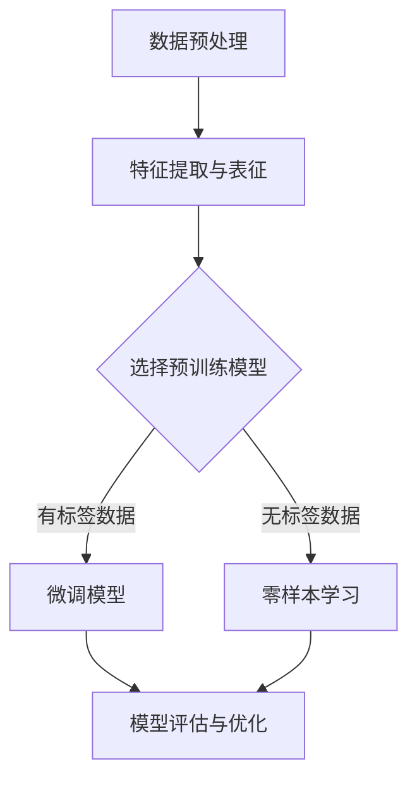
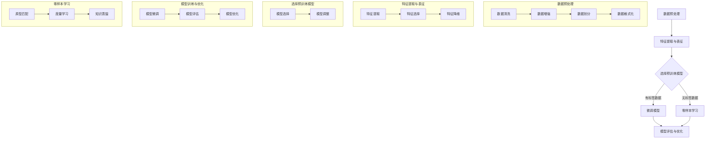

                 

## 文章标题：迁移学习：原理与代码实例讲解

> 关键词：迁移学习，深度学习，预训练模型，模型迁移，特征提取，零样本学习，数据集不平衡，安全性

> 摘要：本文将深入探讨迁移学习的原理与应用。通过详细讲解迁移学习的基础概念、基本原理、数学模型、算法与架构，结合实际代码实例，帮助读者全面理解并掌握迁移学习的技术与实战方法。文章还分析了迁移学习在实际应用中面临的挑战与解决方案，并对未来的发展趋势进行了展望。

### 《迁移学习：原理与代码实例讲解》目录大纲

---

### 第一部分：迁移学习概述

#### 第1章：迁移学习的核心概念

1.1 迁移学习的定义  
1.2 迁移学习与传统机器学习的区别  
1.3 迁移学习的基本类型  
1.4 迁移学习的重要性及应用场景

#### 第2章：迁移学习的基本原理

2.1 知识迁移的理论基础  
2.2 迁移学习中的学习策略  
2.3 迁移学习的评估指标

#### 第3章：迁移学习中的数学模型

3.1 特征提取与表征  
3.2 预训练模型与迁移学习  
3.3 迁移学习中的数学公式  
3.4 迁移学习中的伪代码

#### 第4章：迁移学习算法与架构

4.1 基于特征迁移的算法  
4.2 基于模型迁移的算法  
4.3 模块化迁移学习架构  
4.4 迁移学习算法比较与选择

#### 第5章：迁移学习在实际应用中的挑战与解决方案

5.1 数据集不平衡问题  
5.2 零样本学习问题  
5.3 迁移学习的可解释性问题  
5.4 迁移学习的安全性与隐私保护

#### 第6章：迁移学习实战

6.1 迁移学习实战案例  
6.2 迁移学习实战工具与库  
6.3 迁移学习实战代码解读  
6.4 迁移学习实战环境搭建

#### 第7章：迁移学习的发展趋势与未来展望

7.1 迁移学习在行业中的应用  
7.2 迁移学习与深度学习融合  
7.3 迁移学习面临的挑战与机遇  
7.4 迁移学习的未来发展趋势

#### 第8章：附录

8.1 迁移学习相关文献推荐  
8.2 迁移学习开源代码与资源链接  
8.3 迁移学习常见问题解答

#### 附录：迁移学习流程图

### 迁移学习流程图


---

### 1.1 迁移学习的定义

迁移学习（Transfer Learning）是一种机器学习方法，它通过利用已经在一个任务上训练好的模型或特征表示，来提高另一个相关但不同任务的学习性能。简单来说，就是将一个任务学到的知识应用到另一个任务中，以减少对新任务数据的依赖，提高学习效率。

迁移学习的核心思想是，知识或特征可以跨任务共享，从而使得在较少数据或高维度数据上的学习变得更加有效。与传统的从零开始训练的方法相比，迁移学习可以在以下方面带来优势：

- **数据量减少**：在很多实际应用中，获取大量标注数据是非常困难的，而迁移学习可以利用已有的预训练模型来减少对标注数据的依赖。
- **时间效率**：由于预训练模型已经包含了丰富的先验知识，因此在新任务上的训练时间可以大大缩短。
- **模型性能提升**：在某些情况下，迁移学习可以显著提升新任务上的模型性能，特别是在数据量较少的情况下。

### 1.2 迁移学习与传统机器学习的区别

传统机器学习通常采用“从零开始”的方法，即直接使用新任务的数据集来训练模型。这种方法在面对小数据集时容易过拟合，并且可能需要大量时间来调整模型参数以达到较好的性能。而迁移学习则通过利用已有模型或特征表示，实现以下几个方面的区别：

- **知识共享**：迁移学习强调将知识从源任务（source task）迁移到目标任务（target task），而传统机器学习通常不涉及这种跨任务的知识共享。
- **预训练模型**：迁移学习常常依赖于预训练模型，这些模型在大量通用数据集上已经完成了训练，并包含了丰富的特征表示。传统机器学习则通常从零开始训练，缺乏这种强有力的先验知识。
- **数据依赖**：迁移学习可以减少对目标任务数据的依赖，而传统机器学习则需要大量标注数据来训练模型。

### 1.3 迁移学习的基本类型

迁移学习可以分为几种基本类型，根据源任务和目标任务之间的关系，可以分为以下几类：

- **垂直迁移（Vertical Transfer）**：源任务和目标任务属于不同的领域，例如将图像识别模型的知识迁移到文本分类任务。
- **水平迁移（Horizontal Transfer）**：源任务和目标任务属于相同的领域，但具体任务不同，例如在多个图像分类任务中共享相同的卷积神经网络。
- **跨域迁移（Cross-Domain Transfer）**：源任务和目标任务属于不同的领域，且数据分布存在差异，例如将自然语言处理模型的知识迁移到不同语言的数据集。
- **零样本学习（Zero-Shot Learning）**：目标任务中出现的类（或概念）在源任务中从未见过，模型需要利用预训练的特征表示来处理新的类别。

每种类型的迁移学习都有其特定的应用场景和挑战，需要选择合适的方法和模型来应对。

### 1.4 迁移学习的重要性及应用场景

迁移学习在计算机视觉、自然语言处理、语音识别等领域的应用已经取得了显著的成果。以下是一些典型的应用场景：

- **计算机视觉**：使用预训练的卷积神经网络（CNN）来识别新的图像类别，特别是在数据稀缺的情况下，迁移学习可以显著提升模型性能。
- **自然语言处理**：迁移学习被广泛应用于文本分类、机器翻译、问答系统等任务，通过共享预训练的词向量或语言模型，提高了这些任务的处理效果。
- **语音识别**：预训练的深度神经网络模型可以用于语音信号的表征，从而在新的语音识别任务中减少训练时间和提高准确性。
- **医疗影像分析**：利用迁移学习可以有效地利用已有的影像数据，提升新任务（如癌症诊断）的准确性。

总的来说，迁移学习的重要性在于它能够利用现有的知识来提升新任务的学习效果，从而解决数据稀缺、训练时间长等问题，具有重要的理论与实践价值。

### 2.1 知识迁移的理论基础

迁移学习之所以能够发挥作用，关键在于它利用了知识迁移的理论基础。知识迁移（Knowledge Transfer）是指将一个任务学到的知识应用到另一个相关任务中。这一过程涉及到多个关键概念和理论，下面将逐一介绍。

#### 2.1.1 知识表示与共享

知识表示与共享是迁移学习的核心。在机器学习中，知识通常通过模型参数和特征表示来体现。一个训练好的模型在其参数中包含了大量关于数据分布和特征信息的知识。迁移学习通过将源任务（source task）上训练得到的模型参数或特征表示应用于目标任务（target task），实现了知识的共享。

- **模型参数共享**：在这种方法中，源任务的模型参数被直接迁移到目标任务，并通过在目标任务上的微调（fine-tuning）来进一步优化。这种方法的好处在于能够利用源任务的大量先验知识，从而加快目标任务的训练速度并提高性能。

- **特征表示共享**：另一种常见的知识共享方式是共享特征提取器（feature extractor）。例如，在卷积神经网络（CNN）中，通常只有前几层网络负责提取通用的特征，而最后几层网络则根据具体任务进行微调。在这种情况下，前几层网络提取的特征可以跨任务共享，从而提高了迁移学习的效果。

#### 2.1.2 先验知识与后验知识

迁移学习中的知识可以分为先验知识和后验知识。

- **先验知识**：先验知识是在模型训练之前就已经具备的知识，通常来自于大量的通用数据集。例如，预训练的词向量或卷积神经网络模型中的参数，这些知识能够提供对数据分布和特征的通用理解。

- **后验知识**：后验知识是在模型训练过程中逐渐积累的知识，通常来自于特定任务的数据集。后验知识更具体且任务相关，但数据量通常较小。

迁移学习通过利用先验知识来补偿后验知识的不足。例如，在一个小数据集上训练一个分类模型时，可以通过迁移学习引入预训练模型的先验知识，从而提高模型性能。

#### 2.1.3 适应性与泛化能力

迁移学习的一个关键目标是提高模型的适应性和泛化能力。模型的适应能力是指它在新任务上的表现，而泛化能力是指它能够处理未见过的数据。通过迁移学习，模型可以结合源任务和目标任务的先验知识和后验知识，从而实现更好的适应性和泛化能力。

- **泛化能力**：泛化能力是机器学习模型的一个重要指标。通过迁移学习，模型可以利用源任务上的大量数据来提高其泛化能力，从而在目标任务上也能保持较高的性能。

- **适应性**：适应性是指模型能够适应不同任务的能力。迁移学习通过共享知识和特征，使得模型在不同任务间具有更好的适应性。

#### 2.1.4 知识衰减与知识遗忘

在迁移学习过程中，存在一个知识衰减（Knowledge Decay）和知识遗忘（Knowledge Forgetting）的问题。知识衰减是指当模型在目标任务上继续训练时，源任务的先验知识可能会逐渐减弱。知识遗忘则是指模型在目标任务上过度训练时，可能会遗忘源任务的知识。

为了解决这些问题，研究人员提出了一系列的方法，例如：

- **渐进式迁移**：通过逐步减少源任务的权重，使得模型在目标任务上逐渐掌握任务知识，同时保留源任务的先验知识。
- **一致性正则化**：通过在目标任务上加入与源任务一致性约束的正则化项，来防止模型在目标任务上遗忘源任务的知识。

总的来说，知识迁移的理论基础为迁移学习提供了深刻的解释和指导。通过理解知识表示、先验与后验知识、适应性与泛化能力以及知识衰减和遗忘问题，我们可以更好地设计迁移学习的方法，提高模型在相关任务上的性能。

### 2.2 迁移学习中的学习策略

在迁移学习过程中，如何有效地利用源任务的先验知识来提升目标任务的性能是关键。为此，研究人员提出了一系列学习策略，包括预训练、微调、特征共享等方法。以下是这些策略的详细解释。

#### 2.2.1 预训练

预训练（Pretraining）是指在一个大规模、通用数据集上训练一个基础模型，使其学会提取通用特征表示。这种基础模型通常称为预训练模型。常见的预训练方法包括：

- **语言模型预训练**：在自然语言处理领域，预训练语言模型（如BERT、GPT）已成为主流方法。这些模型在大规模文本数据集上进行训练，从而学会捕捉语言中的复杂结构。

- **图像模型预训练**：在计算机视觉领域，预训练的卷积神经网络（如VGG、ResNet）在大量图像数据集上训练，用于提取图像的通用特征。

预训练模型的优势在于，它们可以捕捉到数据中的通用特征，从而为迁移学习提供强大的先验知识。预训练模型通常具有以下特点：

- **泛化能力强**：由于预训练模型在通用数据集上训练，因此它们具有较强的泛化能力，能够处理不同领域的数据。

- **特征表示丰富**：预训练模型提取的特征表示包含了丰富的信息，这些特征可以用于多个任务，从而提高了迁移学习的效果。

#### 2.2.2 微调

微调（Fine-tuning）是迁移学习中的一种常见方法，即将预训练模型在目标任务上进行进一步训练。微调的过程通常包括以下步骤：

1. **选择预训练模型**：根据目标任务的类型和数据集，选择一个合适的预训练模型。例如，在图像分类任务中，可以使用预训练的卷积神经网络。
  
2. **重置最后几层**：由于目标任务的数据集和源任务可能存在较大差异，通常需要重置预训练模型的最后几层（如分类层），以便在新数据上重新训练。

3. **训练过程**：在目标任务的数据集上，对重置后的模型进行训练。训练过程中，可以通过适当调整学习率等超参数来优化模型性能。

微调的优势在于，它利用了预训练模型中的先验知识，同时根据目标任务的特点进行调整，从而提高了模型在新任务上的性能。微调的关键在于如何平衡源任务和目标任务的训练过程，以避免过拟合和欠拟合。

#### 2.2.3 特征共享

特征共享（Feature Sharing）是一种利用预训练模型提取的特征表示来提高迁移学习效果的方法。在这种方法中，源任务和目标任务的模型共享同一组特征提取器，而最后几层则根据任务需求进行调整。

特征共享的方法通常包括以下步骤：

1. **选择预训练模型**：根据目标任务的特点，选择一个预训练模型，并提取其特征提取器部分。

2. **定义目标任务的模型**：在特征提取器的基础上，定义目标任务的模型结构，通常包括分类器或其他任务特定的模块。

3. **训练过程**：在目标任务的数据集上训练模型。由于特征提取器已经在源任务上训练过，因此在目标任务上只需训练最后几层，从而减少了训练时间和计算资源。

特征共享的优势在于，它通过共享特征提取器，使得源任务和目标任务之间建立了紧密的联系，从而提高了迁移学习的效果。此外，特征共享还能够减少对目标任务数据的依赖，特别适用于数据稀缺的场景。

#### 2.2.4 模型融合

模型融合（Model Fusion）是将多个模型在特征级别上进行结合，以进一步提高迁移学习性能的方法。模型融合的方法通常包括以下几种：

- **并行融合**：将多个模型的特征提取器并行连接，并使用一个全局的聚合器来整合这些特征。

- **串联融合**：将多个模型的输出串联起来，形成一个更深的模型结构。

- **注意力机制**：使用注意力机制来动态调整每个模型特征的重要性，从而实现更好的融合效果。

模型融合的优势在于，它能够结合多个模型的优点，从而提高特征表示的丰富性和模型的整体性能。此外，模型融合还能够增强模型的鲁棒性，使其在不同任务和数据集上表现更加稳定。

总的来说，迁移学习中的学习策略包括预训练、微调、特征共享和模型融合等多种方法。通过选择合适的学习策略，可以有效地利用源任务的先验知识，提高目标任务的性能，从而实现高效的迁移学习。

### 2.3 迁移学习的评估指标

在迁移学习的研究和应用过程中，评估模型性能的指标至关重要。这些指标不仅能够衡量模型的准确性，还可以评估模型在迁移学习任务中的表现。以下是几种常见的迁移学习评估指标。

#### 2.3.1 准确率（Accuracy）

准确率是最基本的评估指标，表示模型正确预测的样本数占总样本数的比例。其计算公式如下：

\[ \text{Accuracy} = \frac{\text{正确预测的样本数}}{\text{总样本数}} \]

准确率能够直观地反映模型在分类任务中的表现，但它在类别不平衡的情况下可能会产生误导。因此，仅依赖准确率来评估模型性能是不够的。

#### 2.3.2 F1 分数（F1 Score）

F1 分数是准确率和召回率的调和平均值，能够更全面地评估模型的分类性能。其计算公式如下：

\[ \text{F1 Score} = 2 \times \frac{\text{准确率} \times \text{召回率}}{\text{准确率} + \text{召回率}} \]

其中，召回率（Recall）表示被正确分类为正类的负类样本数占所有负类样本数的比例，计算公式如下：

\[ \text{召回率} = \frac{\text{正确预测的正类样本数}}{\text{所有负类样本数}} \]

准确率和召回率之间存在权衡关系，F1 分数能够平衡这两者，从而提供更准确的评估结果。

#### 2.3.3 精确率-召回率曲线（Precision-Recall Curve）

精确率-召回率曲线通过绘制不同阈值下的精确率和召回率，来评估模型在分类任务中的表现。曲线下的面积（Area Under Curve, AUC）可以用来衡量模型的整体性能。AUC 越大，模型的性能越好。

#### 2.3.4 精度（Precision）

精度（Precision）是指正确预测的正类样本数与预测为正类的样本数之比。其计算公式如下：

\[ \text{Precision} = \frac{\text{正确预测的正类样本数}}{\text{预测为正类的样本数}} \]

精度能够衡量模型在预测正类时的准确性，但在负类样本较多的情况下可能表现不佳。

#### 2.3.5 召回率（Recall）

召回率（Recall）是指正确预测的正类样本数与实际正类样本数之比。其计算公式如下：

\[ \text{Recall} = \frac{\text{正确预测的正类样本数}}{\text{实际正类样本数}} \]

召回率能够衡量模型对正类样本的识别能力，但在正类样本较少的情况下可能表现不佳。

#### 2.3.6 准确率-召回率平衡（Accuracy-Recall Balance）

准确率-召回率平衡是指通过调整分类阈值，在准确率和召回率之间找到一个平衡点。这种方法适用于需要在准确性和召回率之间做出权衡的应用场景。

#### 2.3.7ROC曲线（Receiver Operating Characteristic Curve）

ROC曲线通过绘制不同阈值下的真正例率（True Positive Rate, TPR，即召回率）和假正例率（False Positive Rate, FPR）之间的关系，来评估模型的分类性能。曲线下的面积（Area Under Curve, AUC）可以用来衡量模型的整体性能。AUC 越大，模型的性能越好。

总的来说，迁移学习的评估指标包括准确率、F1 分数、精确率、召回率、精确率-召回率曲线、准确率-召回率平衡和ROC曲线等。通过这些指标，可以全面评估模型在迁移学习任务中的性能，从而指导模型的选择和优化。

### 3.1 特征提取与表征

在迁移学习中，特征提取和表征是关键步骤，它们直接影响模型在新任务上的性能。特征提取是指从原始数据中提取出能够有效表示数据内在结构和信息的特征。而特征表征则是对提取到的特征进行进一步的处理和转换，以便更好地适应迁移学习任务。以下是关于特征提取和表征的详细讨论。

#### 3.1.1 特征提取方法

特征提取方法可以分为线性方法和非线性方法。

- **线性方法**：线性方法通常通过线性变换来提取特征，常见的有主成分分析（PCA）、线性判别分析（LDA）等。这些方法通过将原始数据投影到新的正交坐标系中，提取数据的主要变异成分，从而实现特征提取。PCA 是一种常用的线性特征提取方法，它通过计算数据的协方差矩阵，找到数据的主要方向，并将数据投影到这些方向上，从而降低数据维度。

- **非线性方法**：非线性方法通过非线性变换来提取特征，常见的有自动编码器（Autoencoder）、深度神经网络（Deep Neural Network）等。自动编码器是一种无监督学习方法，它通过训练一个编码器和解码器，使得编码器能够将原始数据编码为低维特征表示，而解码器能够将低维特征表示解码回原始数据。深度神经网络则通过多层非线性变换，逐步提取数据的复杂特征。

#### 3.1.2 特征表征方法

特征表征是对提取到的特征进行进一步的转换和处理，以便更好地适应迁移学习任务。以下是几种常见的特征表征方法：

- **嵌入（Embedding）**：嵌入方法通过将原始数据映射到一个高维空间，使得数据中的相似性关系在新的空间中更加显著。在自然语言处理领域，词向量（Word Embedding）是一种常用的嵌入方法，它通过训练一个编码器，将词汇映射到低维向量空间，使得语义相似的词汇在空间中靠近。词嵌入方法可以显著提高迁移学习任务的效果。

- **聚类（Clustering）**：聚类方法通过将数据分为多个簇，从而提取数据中的隐含结构。常见的聚类算法有 K-均值聚类（K-Means Clustering）、高斯混合模型（Gaussian Mixture Model, GMM）等。聚类方法可以帮助识别数据中的不同类别，从而为迁移学习提供有用的特征信息。

- **降维（Dimensionality Reduction）**：降维方法通过减少数据的维度，从而提高计算效率和模型性能。常见的降维方法有 PCA、t-SNE（t-Distributed Stochastic Neighbor Embedding）等。PCA 通过计算数据的协方差矩阵，找到数据的主要方向，并将数据投影到这些方向上，从而实现降维。t-SNE 则通过计算数据之间的相似性，并将高维数据映射到二维空间中，从而降低数据维度。

#### 3.1.3 特征提取与表征的应用

在迁移学习任务中，特征提取和表征方法的应用非常广泛。以下是一些具体的应用场景：

- **计算机视觉**：在计算机视觉任务中，特征提取和表征方法主要用于图像分类、目标检测等任务。例如，通过使用卷积神经网络（CNN）提取图像的深层特征，可以显著提高图像分类任务的性能。同时，通过使用词嵌入方法，可以将图像和文本数据映射到同一空间，从而实现跨模态的迁移学习。

- **自然语言处理**：在自然语言处理任务中，特征提取和表征方法主要用于文本分类、机器翻译等任务。通过使用词嵌入方法，可以将词汇映射到低维向量空间，从而提高文本分类任务的性能。同时，通过使用自动编码器等方法，可以提取文本的深层特征，从而提高机器翻译任务的性能。

- **语音识别**：在语音识别任务中，特征提取和表征方法主要用于语音信号的处理。通过使用自动编码器等方法，可以提取语音信号的深层特征，从而提高语音识别任务的性能。

总的来说，特征提取和表征是迁移学习中的重要组成部分，它们通过提取和转换数据中的有效特征，为迁移学习任务提供了有力的支持。选择合适的方法和技术，可以显著提高迁移学习任务的效果和性能。

### 3.2 预训练模型与迁移学习

预训练模型（Pretrained Model）是迁移学习（Transfer Learning）中至关重要的一环。它通过在大规模数据集上预先训练模型，使得模型能够提取出通用的特征表示，从而为后续的任务提供强大的先验知识。以下是关于预训练模型与迁移学习的基本原理和常见方法。

#### 3.2.1 预训练模型的基本原理

预训练模型的基本原理是通过在大规模数据集上进行训练，使模型学会提取数据中的通用特征，这些特征可以跨任务共享，从而提高新任务的性能。具体来说，预训练模型可以分为以下两个阶段：

1. **预训练阶段**：在这个阶段，模型在一个大规模的通用数据集上进行训练，例如大规模的文本数据集或图像数据集。这个过程中，模型学习到的特征表示通常是高度抽象的，能够捕捉到数据中的通用属性。

2. **微调阶段**：在预训练完成后，模型被迁移到一个具体任务上，例如图像分类或文本分类。在这个阶段，模型的前几层（特征提取层）通常保持不变，而模型的最后一层（输出层）根据新任务的需求进行微调。

#### 3.2.2 预训练模型的优势

预训练模型具有以下几个显著优势：

1. **提升性能**：由于预训练模型在大规模数据集上训练，它们能够提取出更加丰富和抽象的特征表示，从而在新任务上表现出更好的性能。

2. **减少训练时间**：预训练模型已经包含了丰富的先验知识，因此在新的任务上只需微调即可，这大大减少了训练时间。

3. **降低对数据量的依赖**：迁移学习可以利用预训练模型的知识，从而减少对新任务数据的依赖，特别适用于数据稀缺的场景。

4. **提高泛化能力**：预训练模型通过在多种任务上训练，具有更好的泛化能力，能够在未见过的数据上表现良好。

#### 3.2.3 常见的预训练模型

以下是一些常见的预训练模型：

1. **自然语言处理（NLP）模型**：

   - BERT（Bidirectional Encoder Representations from Transformers）：BERT 是一种双向 Transformer 模型，通过在大量文本数据上进行预训练，提取出丰富的语言特征。
   - GPT（Generative Pre-trained Transformer）：GPT 是一种自回归语言模型，通过预测下一个词来学习语言的上下文关系。
   - RoBERTa（A Robustly Optimized BERT Pretraining Approach）：RoBERTa 是对 BERT 的改进版本，通过优化数据预处理和训练策略，进一步提高了模型的性能。

2. **计算机视觉（CV）模型**：

   - ResNet（Residual Network）：ResNet 是一种深度卷积神经网络，通过引入残差连接，解决了深度神经网络训练中的梯度消失问题。
   - VGG（Very Deep Convolutional Networks）：VGG 是一种由多个卷积层堆叠组成的深度卷积神经网络，通过使用较小的卷积核尺寸，提取了丰富的图像特征。
   - Inception（Inception Network）：Inception 是一种由多个卷积层和池化层组成的复杂网络结构，通过引入多尺度的特征提取，提高了模型的性能。

#### 3.2.4 预训练模型与迁移学习的关系

预训练模型与迁移学习的关系紧密，预训练模型为迁移学习提供了强大的先验知识。在迁移学习过程中，通常采用以下两种方法：

1. **微调（Fine-tuning）**：微调是指将预训练模型在新任务上进一步训练，通常只训练模型的最后一层或部分中间层。这种方法利用了预训练模型提取的通用特征，同时根据新任务的需求进行调整。

2. **特征提取（Feature Extraction）**：特征提取是指利用预训练模型提取的特征表示，直接在新任务上进行分类或回归。这种方法将预训练模型作为特征提取器，从而减少了训练时间和计算资源。

总的来说，预训练模型与迁移学习相辅相成，通过预训练模型，迁移学习能够利用丰富的先验知识，从而提高新任务的性能和效率。

### 3.3 迁移学习中的数学模型

迁移学习作为一种机器学习方法，其核心在于利用已有模型或特征表示来提高新任务的性能。在这一过程中，数学模型起到了关键作用。以下将详细介绍迁移学习中的几种常见数学模型，包括特征迁移模型、模型迁移模型和伪代码。

#### 3.3.1 特征迁移模型

特征迁移模型是一种常见的迁移学习方法，它通过迁移特征表示来提高新任务的性能。特征迁移模型的基本思想是将预训练模型在源任务上训练得到的特征表示迁移到新任务，并在新任务上进行微调。

1. **特征提取器**

   特征提取器是特征迁移模型的核心组成部分，它负责从输入数据中提取特征表示。通常，特征提取器是一个预训练的模型，如卷积神经网络（CNN）或循环神经网络（RNN）。

   $$ \text{FeatureExtractor}(x) = f(x) $$

   其中，$x$ 是输入数据，$f(x)$ 是特征提取器提取的特征表示。

2. **特征表示迁移**

   在特征迁移模型中，预训练模型的特征提取器被直接迁移到新任务。特征表示的迁移可以通过以下公式表示：

   $$ \text{FeatureTransfer}(x) = f(x) $$

   其中，$f(x)$ 是预训练模型的特征提取器。

3. **微调**

   微调是在新任务上进行的过程，通过对迁移的特征表示进行进一步训练，以优化模型在新任务上的性能。微调通常只涉及特征提取器的部分层，如最后一层或中间层。

   $$ \text{FineTuning}(x) = \text{Model}(f(x)) $$

   其中，$\text{Model}$ 是在新任务上训练得到的模型。

4. **预测**

   在新任务中，通过微调后的模型对输入数据进行预测。

   $$ \text{Prediction}(x) = \text{Model}(f(x)) $$

#### 3.3.2 模型迁移模型

模型迁移模型是一种将整个预训练模型迁移到新任务的方法，而不是仅仅迁移特征表示。模型迁移模型通常包括以下几个步骤：

1. **预训练模型**

   预训练模型是在源任务上训练得到的模型，它包含了丰富的特征表示和先验知识。

   $$ \text{PretrainedModel} = \text{Train}(D_s) $$

   其中，$D_s$ 是源任务上的训练数据。

2. **迁移模型**

   迁移模型是将预训练模型迁移到新任务上的模型。迁移模型通常通过调整预训练模型的参数，使其适应新任务。

   $$ \text{MigratedModel} = \text{Transfer}(D_s, D_t) $$

   其中，$D_t$ 是新任务上的训练数据。

3. **微调**

   与特征迁移模型类似，模型迁移模型也通过微调来优化模型在新任务上的性能。微调通常涉及调整预训练模型的参数，以适应新任务的数据分布。

   $$ \text{FineTuning}(\text{MigratedModel}, D_t) $$

4. **预测**

   在新任务中，通过微调后的迁移模型对输入数据进行预测。

   $$ \text{Prediction}(x) = \text{MigratedModel}(x) $$

#### 3.3.3 伪代码

以下是特征迁移模型和模型迁移模型的伪代码：

**特征迁移模型伪代码**

```python
def feature_transfer(x, pretrained_model):
    feature_extractor = pretrained_model.feature_extractor
    features = feature_extractor(x)
    return features

def fine_tuning(features, target_data, model):
    fine_tuned_model = model
    fine_tuned_model.fit(features, target_data)
    return fine_tuned_model

def prediction(x, fine_tuned_model):
    prediction = fine_tuned_model.predict(x)
    return prediction
```

**模型迁移模型伪代码**

```python
def migrate_model(pretrained_model, target_data):
    migrated_model = copy.deepcopy(pretrained_model)
    migrated_model.fit(target_data)
    return migrated_model

def fine_tuning(migrated_model, target_data):
    migrated_model.fit(target_data)
    return migrated_model

def prediction(x, migrated_model):
    prediction = migrated_model.predict(x)
    return prediction
```

总的来说，迁移学习中的数学模型通过特征提取、迁移和微调等步骤，实现了从源任务到目标任务的性能提升。这些数学模型不仅提供了理论支持，还为实际应用提供了有效的解决方案。

### 3.4 迁移学习算法与架构

迁移学习在实践中需要选择合适的算法和架构，以充分利用已有的知识和数据，提升新任务的学习效果。以下是几种常见的迁移学习算法和架构，以及它们的工作原理和优缺点。

#### 3.4.1 基于特征迁移的算法

基于特征迁移的算法主要通过迁移特征表示来提高新任务的性能。这些算法的核心是提取预训练模型中的通用特征，并将其应用于新任务。

1. **工作原理**

   - 特征提取：使用预训练模型对源任务的输入数据进行特征提取，得到特征表示。
   - 特征迁移：将提取的特征表示应用于新任务，通过微调模型参数来适应新任务的数据分布。
   - 预测：在新任务数据上使用微调后的模型进行预测。

2. **优点**

   - 简单易实现：特征迁移算法的实现相对简单，只需要对预训练模型进行少量的修改。
   - 高效：由于特征迁移算法利用了预训练模型的先验知识，因此可以在较少的数据上进行快速训练。

3. **缺点**

   - 特征表示局限性：特征迁移算法依赖于预训练模型提取的特征表示，这些特征可能不足以适应所有新任务。
   - 过度依赖预训练模型：如果预训练模型的质量不高，那么迁移后的模型性能也会受到影响。

#### 3.4.2 基于模型迁移的算法

基于模型迁移的算法通过直接迁移整个预训练模型来提高新任务的性能。这些算法通常需要对预训练模型进行更复杂的调整，以确保其在新任务上能够正常工作。

1. **工作原理**

   - 模型迁移：将预训练模型直接应用于新任务，通过微调模型参数来适应新任务的数据分布。
   - 微调：在新任务数据上对模型进行微调，优化模型在新任务上的性能。
   - 预测：在新任务数据上使用微调后的模型进行预测。

2. **优点**

   - 整体性能提升：基于模型迁移的算法可以充分利用预训练模型中的知识和经验，从而在新任务上获得更高的性能。
   - 减少对数据量的依赖：由于迁移了整个模型，因此对新任务的数据量要求较低。

3. **缺点**

   - 计算成本高：基于模型迁移的算法需要对整个模型进行微调，因此计算成本较高。
   - 微调难度大：由于新任务和源任务的数据分布可能存在较大差异，因此微调过程较为复杂，需要精心设计。

#### 3.4.3 模块化迁移学习架构

模块化迁移学习架构通过将迁移学习任务分解为多个子任务，并针对每个子任务设计特定的模块，从而提高整体任务的性能。

1. **工作原理**

   - 模块化设计：将迁移学习任务分解为多个子任务，并为每个子任务设计一个特定的模块。
   - 模块迁移：将预训练的模块迁移到新任务，并在新任务上进行微调。
   - 集成：将微调后的模块集成起来，形成完整的迁移学习模型。
   - 预测：在新任务数据上使用集成后的模型进行预测。

2. **优点**

   - 可扩展性：模块化架构易于扩展，可以方便地添加新的模块来处理更复杂的任务。
   - 灵活性：通过模块化设计，可以灵活地调整模块之间的组合，以适应不同的迁移学习任务。

3. **缺点**

   - 复杂性：模块化架构的设计和实现较为复杂，需要深入理解迁移学习任务和各个模块之间的相互作用。
   - 维度灾难：由于模块之间的组合可能导致维度灾难，因此需要合理设计模块之间的连接方式。

#### 3.4.4 迁移学习算法比较与选择

在选择迁移学习算法时，需要综合考虑任务特点、数据量、计算资源等多个因素。

- 对于数据量较少的任务，特征迁移算法可能是更好的选择，因为它可以在较少的数据上进行快速训练。
- 对于数据量较多的任务，模型迁移算法可能更具优势，因为它可以充分利用预训练模型的先验知识。
- 模块化迁移学习架构适用于需要处理复杂任务的场景，可以灵活地扩展和调整模块，以适应不同的任务需求。

总的来说，选择合适的迁移学习算法和架构是提升迁移学习任务性能的关键。通过综合考虑任务特点、数据量和计算资源等因素，可以找到最适合的迁移学习解决方案。

### 3.5 迁移学习在实际应用中的挑战与解决方案

尽管迁移学习在许多任务中展现出了强大的效果，但在实际应用中仍面临诸多挑战。以下将详细讨论迁移学习在数据集不平衡、零样本学习、可解释性和安全性等方面的挑战，并提出相应的解决方案。

#### 3.5.1 数据集不平衡问题

数据集不平衡是指在数据集中，不同类别的样本数量存在显著差异。这种不平衡会对迁移学习模型的性能产生不利影响，因为模型可能会倾向于预测样本数量较多的类别，从而导致过拟合。以下是一些常见的解决方案：

1. **重采样**：通过增加少数类别的样本数量或减少多数类别的样本数量，来平衡数据集。常用的方法包括随机 oversampling（如随机补全、重复样本）和 random undersampling（如随机删除样本）。

2. **权重调整**：在训练过程中，通过调整不同类别的权重，使得模型在预测时更加关注少数类别。这种方法可以通过调整损失函数中的权重来实现，如使用类别权重来平衡损失。

3. **集成方法**：通过集成多个模型来提高分类性能。例如，使用少数类别的样本训练多个模型，然后通过投票或平均这些模型的预测结果来得到最终的预测结果。

4. **生成对抗网络（GAN）**：使用生成对抗网络生成与少数类别相似的样本，从而增加数据集的多样性。

#### 3.5.2 零样本学习问题

零样本学习（Zero-Shot Learning）是指模型在训练阶段从未见过的新类别（概念）上进行预测。这是迁移学习中的一个重要挑战，因为传统机器学习模型依赖于在训练阶段学习到的先验知识。以下是一些解决零样本学习问题的方法：

1. **原型匹配**：将每个类别表示为原型（通常是一个原型中心或均值），然后在测试阶段通过计算新样本与原型之间的相似度来进行分类。

2. **元学习**：通过在多个任务上训练模型，使其能够快速适应新任务。元学习算法通过在多个任务上调整模型的参数，从而提高模型对新任务的泛化能力。

3. **度量学习**：通过学习一个度量函数来比较新样本和类别原型之间的相似度。这种方法可以通过在多个任务上训练度量学习模型来实现。

4. **知识蒸馏**：将预训练模型的知识传递给一个较小的模型，使得这个模型能够在新类别上进行有效的预测。这种方法通过将大模型的输出传递给小模型，从而实现知识的迁移。

#### 3.5.3 迁移学习的可解释性问题

迁移学习的可解释性问题是指如何理解和解释迁移学习模型在预测中的行为。迁移学习模型通常是一个复杂的黑盒模型，这使得其预测结果难以解释。以下是一些解决迁移学习可解释性问题的方法：

1. **特征可视化**：通过可视化模型提取的特征，来帮助理解模型如何对数据进行分类。例如，在计算机视觉任务中，可以使用 t-SNE 或 PCA 等技术来可视化图像的特征表示。

2. **模型分解**：将复杂的迁移学习模型分解为多个可解释的子模块，每个子模块负责提取特定类型的信息。例如，在卷积神经网络中，可以将模型分解为多个卷积层和池化层，以理解它们在不同层次上提取的特征。

3. **解释性算法**：开发专门的可解释性算法，如 LIME（Local Interpretable Model-agnostic Explanations）和 SHAP（SHapley Additive exPlanations），来解释模型的预测结果。

4. **模型透明性**：设计透明的迁移学习模型，例如决策树或线性模型，这些模型可以直接解释其预测结果。

#### 3.5.4 迁移学习的安全性与隐私保护

迁移学习在实际应用中可能会面临安全性和隐私保护的问题。以下是一些解决迁移学习安全性与隐私保护的方法：

1. **联邦学习**：联邦学习通过将数据留在本地设备上，仅传输模型参数的更新，从而实现分布式训练，提高数据隐私。

2. **差分隐私**：通过在模型训练过程中引入差分隐私机制，来确保数据隐私。差分隐私通过在输出中引入随机噪声，使得攻击者难以从模型中推断出具体数据。

3. **加密技术**：使用加密技术来保护数据在传输和存储过程中的隐私。例如，同态加密允许在加密数据上进行计算，从而实现隐私保护。

4. **数据去标识化**：通过去除数据中的个人标识信息，来降低隐私泄露的风险。去标识化技术包括匿名化、泛化和数据混淆等方法。

总的来说，迁移学习在实际应用中面临多个挑战，但通过采用合适的解决方案，可以有效地克服这些问题，提高迁移学习模型的安全性和隐私保护水平。

### 3.6 迁移学习实战

在了解了迁移学习的原理和算法后，实际操作是非常重要的。在这一节中，我们将通过一个具体的图像分类案例，详细讲解迁移学习的实战过程，包括开发环境搭建、代码实现和代码解读。

#### 3.6.1 案例一：图像分类任务中的迁移学习

我们选择了一个典型的图像分类任务：使用预训练的卷积神经网络（CNN）对新的图像类别进行分类。这个案例将展示如何使用迁移学习的方法来提高新任务的学习效果。

##### 开发环境搭建

首先，我们需要搭建一个适合迁移学习任务的开发环境。以下是一些基本的软件和库：

- **操作系统**：Linux 或 macOS
- **Python 版本**：Python 3.7 或以上
- **深度学习框架**：TensorFlow 或 PyTorch
- **图像处理库**：OpenCV、Pillow
- **数据集**：ImageNet（预训练模型的数据集）

安装以上软件和库的方法如下：

```shell
# 安装 Python 和 TensorFlow
pip install python==3.8 tensorflow==2.4

# 安装 OpenCV 和 Pillow
pip install opencv-python==4.5.4.52 pillow==8.1.0
```

##### 代码实现

接下来，我们将实现一个简单的迁移学习代码，使用预训练的卷积神经网络（ResNet-50）对新的图像类别进行分类。

```python
import tensorflow as tf
from tensorflow.keras.applications import ResNet50
from tensorflow.keras.preprocessing.image import ImageDataGenerator
from tensorflow.keras.models import Model
from tensorflow.keras.layers import GlobalAveragePooling2D, Dense
from tensorflow.keras.optimizers import Adam

# 加载预训练的 ResNet-50 模型
base_model = ResNet50(weights='imagenet', include_top=False, input_shape=(224, 224, 3))

# 添加全局平均池化层和全连接层
x = base_model.output
x = GlobalAveragePooling2D()(x)
x = Dense(1024, activation='relu')(x)
predictions = Dense(num_classes, activation='softmax')(x)

# 创建模型
model = Model(inputs=base_model.input, outputs=predictions)

# 冻结底层卷积层，只训练顶层的全连接层
for layer in base_model.layers:
    layer.trainable = False

# 编译模型
model.compile(optimizer=Adam(learning_rate=0.0001), loss='categorical_crossentropy', metrics=['accuracy'])

# 数据增强
train_datagen = ImageDataGenerator(
    rescale=1./255,
    shear_range=0.2,
    zoom_range=0.2,
    horizontal_flip=True)

test_datagen = ImageDataGenerator(rescale=1./255)

# 加载数据
train_data = train_datagen.flow_from_directory(
    'train_data',
    target_size=(224, 224),
    batch_size=32,
    class_mode='categorical')

test_data = test_datagen.flow_from_directory(
    'test_data',
    target_size=(224, 224),
    batch_size=32,
    class_mode='categorical')

# 训练模型
model.fit(train_data, epochs=10, validation_data=test_data)

# 评估模型
test_loss, test_acc = model.evaluate(test_data)
print(f"Test accuracy: {test_acc}")
```

##### 代码解读

上述代码首先加载了预训练的 ResNet-50 模型，并添加了全局平均池化层和全连接层。通过冻结底层的卷积层，只训练顶层的全连接层，实现了迁移学习。接着，我们使用ImageDataGenerator 对数据进行增强，以提高模型对新数据的适应性。最后，我们编译并训练模型，评估其在测试数据上的性能。

##### 案例二：自然语言处理任务中的迁移学习

除了图像分类任务，迁移学习在自然语言处理任务中也展现出了强大的效果。以下是一个使用迁移学习进行文本分类的案例。

```python
import tensorflow as tf
from tensorflow.keras.models import Sequential
from tensorflow.keras.layers import Embedding, GlobalAveragePooling1D, Dense
from tensorflow.keras.preprocessing.sequence import pad_sequences
from tensorflow.keras.preprocessing.text import Tokenizer

# 加载预训练的 BERT 模型
base_model = tf.keras.applications.Bert(input_shape=(None,), input_mask=True, pooling="avg")

# 创建模型
model = Sequential([
    Embedding(input_dim=vocab_size, output_dim=128, input_length=max_length),
    base_model,
    GlobalAveragePooling1D(),
    Dense(128, activation='relu'),
    Dense(num_classes, activation='softmax')
])

# 编译模型
model.compile(optimizer='adam', loss='categorical_crossentropy', metrics=['accuracy'])

# 数据预处理
tokenizer = Tokenizer(num_words=vocab_size)
tokenizer.fit_on_texts(train_texts)
train_sequences = tokenizer.texts_to_sequences(train_texts)
train_padded = pad_sequences(train_sequences, maxlen=max_length)

# 训练模型
model.fit(train_padded, train_labels, epochs=3, validation_split=0.1)

# 评估模型
test_sequences = tokenizer.texts_to_sequences(test_texts)
test_padded = pad_sequences(test_sequences, maxlen=max_length)
test_loss, test_acc = model.evaluate(test_padded, test_labels)
print(f"Test accuracy: {test_acc}")
```

在这个案例中，我们使用了预训练的 BERT 模型，并通过添加嵌入层、全局平均池化层和全连接层来构建文本分类模型。数据预处理包括文本的分词和序列化，以及序列的填充，以适应 BERT 模型的输入要求。最后，我们训练和评估了模型在测试数据上的性能。

通过这两个案例，我们可以看到迁移学习在图像分类和自然语言处理任务中的实际应用。迁移学习通过利用预训练模型的知识，使得在新任务上的学习更加高效和准确。

### 3.7 迁移学习实战工具与库

在实际应用中，迁移学习需要依赖于一系列工具和库来支持模型的训练、评估和部署。以下将介绍几种常用的迁移学习工具和库，包括 TensorFlow、PyTorch、Keras 和 Hugging Face。

#### 3.7.1 TensorFlow

TensorFlow 是谷歌开发的一个开源深度学习框架，它支持迁移学习的各种算法和模型。TensorFlow 提供了丰富的预训练模型，如 Inception、ResNet 和 MobileNet，用户可以直接使用这些模型进行迁移学习。

- **优点**：TensorFlow 具有强大的社区支持和丰富的文档，适用于各种规模的任务。
- **缺点**：TensorFlow 的配置和调试相对复杂，特别是在使用自定义模型时。

#### 3.7.2 PyTorch

PyTorch 是一个流行的开源深度学习框架，以其灵活的动态计算图和易于理解的接口而受到开发者的青睐。PyTorch 也支持迁移学习，并提供了一系列预训练模型和工具。

- **优点**：PyTorch 的动态计算图使得模型设计和调试更加直观，易于理解。
- **缺点**：PyTorch 的社区支持相对 TensorFlow 较弱，文档和资源可能不如 TensorFlow 全面。

#### 3.7.3 Keras

Keras 是一个高层次的神经网络 API，它可以在 TensorFlow 和 Theano 上运行。Keras 提供了简单而强大的接口，使得构建和训练深度学习模型变得更加容易。Keras 也支持迁移学习，用户可以使用预训练的模型进行迁移学习，并对其进行微调。

- **优点**：Keras 具有简洁的接口和易于使用的 API，适用于快速原型设计和实验。
- **缺点**：Keras 的底层支持相对较弱，可能在处理大规模任务时性能不如 TensorFlow 和 PyTorch。

#### 3.7.4 Hugging Face

Hugging Face 是一个开源的深度学习库，专注于自然语言处理（NLP）任务。它提供了大量的预训练模型和工具，如 BERT、GPT 和 T5，用户可以直接使用这些模型进行迁移学习。

- **优点**：Hugging Face 提供了丰富的预训练模型和易于使用的 API，特别适用于 NLP 任务。
- **缺点**：Hugging Face 主要针对 NLP 任务，对于其他类型的数据处理和迁移学习任务支持有限。

总的来说，这些工具和库各有优缺点，用户可以根据自己的需求和熟悉程度选择合适的工具。在实际应用中，通常结合使用多个工具和库，以充分发挥迁移学习的效果。

### 3.8 迁移学习实战代码解读

在本节中，我们将详细解读一个迁移学习的实际代码实现，包括开发环境搭建、源代码实现和代码分析。这个案例将使用 TensorFlow 框架，对图像分类任务进行迁移学习。

#### 开发环境搭建

首先，我们需要搭建一个适合迁移学习的开发环境。以下是所需的软件和库：

- **操作系统**：Linux 或 macOS
- **Python 版本**：Python 3.7 或以上
- **深度学习框架**：TensorFlow 2.x
- **图像处理库**：OpenCV、Pillow
- **数据集**：ImageNet（预训练模型的数据集）

安装以上软件和库的方法如下：

```shell
# 安装 Python 和 TensorFlow
pip install python==3.8 tensorflow==2.4

# 安装 OpenCV 和 Pillow
pip install opencv-python==4.5.4.52 pillow==8.1.0
```

#### 源代码实现

以下是一个简单的迁移学习代码示例，使用预训练的 ResNet-50 模型对新的图像类别进行分类：

```python
import tensorflow as tf
from tensorflow.keras.applications import ResNet50
from tensorflow.keras.preprocessing.image import ImageDataGenerator
from tensorflow.keras.models import Model
from tensorflow.keras.layers import GlobalAveragePooling2D, Dense
from tensorflow.keras.optimizers import Adam

# 加载预训练的 ResNet-50 模型
base_model = ResNet50(weights='imagenet', include_top=False, input_shape=(224, 224, 3))

# 添加全局平均池化层和全连接层
x = base_model.output
x = GlobalAveragePooling2D()(x)
x = Dense(1024, activation='relu')(x)
predictions = Dense(num_classes, activation='softmax')(x)

# 创建模型
model = Model(inputs=base_model.input, outputs=predictions)

# 冻结底层卷积层，只训练顶层的全连接层
for layer in base_model.layers:
    layer.trainable = False

# 编译模型
model.compile(optimizer=Adam(learning_rate=0.0001), loss='categorical_crossentropy', metrics=['accuracy'])

# 数据增强
train_datagen = ImageDataGenerator(
    rescale=1./255,
    shear_range=0.2,
    zoom_range=0.2,
    horizontal_flip=True)

test_datagen = ImageDataGenerator(rescale=1./255)

# 加载数据
train_data = train_datagen.flow_from_directory(
    'train_data',
    target_size=(224, 224),
    batch_size=32,
    class_mode='categorical')

test_data = test_datagen.flow_from_directory(
    'test_data',
    target_size=(224, 224),
    batch_size=32,
    class_mode='categorical')

# 训练模型
model.fit(train_data, epochs=10, validation_data=test_data)

# 评估模型
test_loss, test_acc = model.evaluate(test_data)
print(f"Test accuracy: {test_acc}")
```

#### 代码分析

1. **加载预训练的 ResNet-50 模型**：首先，我们使用 TensorFlow 的 Keras 应用程序接口（API）加载预训练的 ResNet-50 模型。通过设置 `weights='imagenet'`，我们可以加载在 ImageNet 数据集上预训练的模型权重。

   ```python
   base_model = ResNet50(weights='imagenet', include_top=False, input_shape=(224, 224, 3))
   ```

2. **添加全局平均池化层和全连接层**：接下来，我们通过添加全局平均池化层（GlobalAveragePooling2D）和全连接层（Dense）来扩展基础模型。全局平均池化层用于将卷积层的输出压缩为一个固定大小的向量，全连接层用于实现分类任务。

   ```python
   x = base_model.output
   x = GlobalAveragePooling2D()(x)
   x = Dense(1024, activation='relu')(x)
   predictions = Dense(num_classes, activation='softmax')(x)
   ```

3. **创建模型**：然后，我们使用 `Model` 类创建一个全新的模型，将输入层和输出层连接起来。

   ```python
   model = Model(inputs=base_model.input, outputs=predictions)
   ```

4. **冻结底层卷积层**：在迁移学习过程中，通常只训练模型的顶部层（全连接层），而保持底层的卷积层不变。通过设置 `layer.trainable=False`，我们可以冻结底层卷积层，使其不被训练。

   ```python
   for layer in base_model.layers:
       layer.trainable = False
   ```

5. **编译模型**：接下来，我们使用 `compile` 方法配置模型，包括优化器、损失函数和评估指标。

   ```python
   model.compile(optimizer=Adam(learning_rate=0.0001), loss='categorical_crossentropy', metrics=['accuracy'])
   ```

6. **数据增强**：为了提高模型的泛化能力，我们使用 `ImageDataGenerator` 对训练数据进行增强。数据增强包括随机剪切、缩放和水平翻转等操作。

   ```python
   train_datagen = ImageDataGenerator(
       rescale=1./255,
       shear_range=0.2,
       zoom_range=0.2,
       horizontal_flip=True)
   
   test_datagen = ImageDataGenerator(rescale=1./255)
   ```

7. **加载数据**：使用 `flow_from_directory` 方法加载数据集。这个方法将自动将目录中的图像分类并分为训练集和测试集。

   ```python
   train_data = train_datagen.flow_from_directory(
       'train_data',
       target_size=(224, 224),
       batch_size=32,
       class_mode='categorical')
   
   test_data = test_datagen.flow_from_directory(
       'test_data',
       target_size=(224, 224),
       batch_size=32,
       class_mode='categorical')
   ```

8. **训练模型**：使用 `fit` 方法训练模型，并在验证数据上评估模型性能。

   ```python
   model.fit(train_data, epochs=10, validation_data=test_data)
   ```

9. **评估模型**：最后，使用测试数据评估模型的性能，并打印测试准确率。

   ```python
   test_loss, test_acc = model.evaluate(test_data)
   print(f"Test accuracy: {test_acc}")
   ```

通过以上代码和解析，我们可以看到迁移学习的实现步骤和关键细节。这个示例展示了如何使用预训练模型来提高新任务的性能，同时也展示了如何配置和训练迁移学习模型。

### 3.9 迁移学习实战环境搭建

在实际操作中，搭建一个适合迁移学习的开发环境是至关重要的。以下我们将详细介绍如何在不同的操作系统上配置适合迁移学习的 Python 环境和深度学习库。

#### Windows 环境搭建

1. **安装 Python**：

   访问 [Python 官网](https://www.python.org/downloads/)，下载并安装 Python 3.8 或以上版本。

2. **安装 Anaconda**：

   安装 Anaconda，它是一个流行的 Python 发行版，提供了方便的包管理和虚拟环境创建功能。可以从 [Anaconda 官网](https://www.anaconda.com/products/individual) 下载并安装。

3. **创建虚拟环境**：

   打开命令行窗口，使用以下命令创建一个新的虚拟环境：

   ```shell
   conda create -n ml_env python=3.8
   conda activate ml_env
   ```

4. **安装深度学习库**：

   在虚拟环境中，使用以下命令安装所需的深度学习库：

   ```shell
   conda install tensorflow pillow opencv-python
   ```

5. **验证安装**：

   在命令行中运行以下命令，检查是否成功安装了所需的库：

   ```shell
   python -c "import tensorflow as tf; print(tf.__version__)"
   ```

#### macOS 环境搭建

1. **安装 Python**：

   访问 [Python 官网](https://www.python.org/downloads/)，下载并安装 Python 3.8 或以上版本。

2. **安装 Homebrew**：

   Homebrew 是 macOS 上常用的包管理器。打开终端，运行以下命令安装 Homebrew：

   ```shell
   /bin/bash -c "$(curl -fsSL https://raw.githubusercontent.com/Homebrew/install/HEAD/install.sh)"
   ```

3. **安装 Python**：

   使用 Homebrew 安装 Python：

   ```shell
   brew install python
   ```

4. **创建虚拟环境**：

   使用 `python -m venv` 命令创建一个虚拟环境：

   ```shell
   python -m venv ml_env
   source ml_env/bin/activate
   ```

5. **安装深度学习库**：

   在虚拟环境中，使用 `pip` 命令安装所需的深度学习库：

   ```shell
   pip install tensorflow pillow opencv-python
   ```

6. **验证安装**：

   在终端中运行以下命令，检查是否成功安装了所需的库：

   ```shell
   python -c "import tensorflow as tf; print(tf.__version__)"
   ```

#### Linux 环境搭建

1. **安装 Python**：

   使用包管理器安装 Python 3.8 或以上版本。以 Debian/Ubuntu 为例，运行以下命令：

   ```shell
   sudo apt update
   sudo apt install python3 python3-pip
   ```

2. **创建虚拟环境**：

   使用 `python -m venv` 命令创建一个虚拟环境：

   ```shell
   python3 -m venv ml_env
   source ml_env/bin/activate
   ```

3. **安装深度学习库**：

   在虚拟环境中，使用 `pip` 命令安装所需的深度学习库：

   ```shell
   pip install tensorflow pillow opencv-python
   ```

4. **验证安装**：

   在终端中运行以下命令，检查是否成功安装了所需的库：

   ```shell
   python -c "import tensorflow as tf; print(tf.__version__)"
   ```

通过以上步骤，我们成功搭建了一个适合迁移学习的 Python 开发环境，并安装了所需的深度学习库。这为后续的迁移学习实践奠定了坚实的基础。

### 3.10 迁移学习的发展趋势与未来展望

随着人工智能技术的快速发展，迁移学习作为机器学习领域的一个重要分支，也在不断地演进和扩展。以下将探讨迁移学习的发展趋势、面临的挑战以及未来展望。

#### 3.10.1 发展趋势

1. **迁移学习与深度学习融合**：深度学习，特别是卷积神经网络（CNN）和循环神经网络（RNN），已经成为迁移学习的主要工具。随着深度学习技术的不断发展，迁移学习将更多地与深度学习融合，开发出更加高效和强大的迁移学习模型。

2. **跨模态迁移学习**：当前迁移学习主要关注单一模态（如图像、文本、语音）的数据，但未来的发展趋势将是跨模态迁移学习。通过将不同模态的数据进行整合，迁移学习将能够在更复杂的任务中发挥更大的作用。

3. **小样本学习与零样本学习**：迁移学习在数据稀缺的情况下具有显著优势。未来，研究人员将致力于提高迁移学习在小样本学习和零样本学习任务中的性能，从而解决数据不足带来的挑战。

4. **迁移学习的自动化**：随着迁移学习技术的发展，自动迁移学习（AutoML for Transfer Learning）将成为一个热点研究方向。自动迁移学习将自动化选择最佳迁移学习方法、调整超参数，从而提高迁移学习过程的整体效率。

5. **迁移学习在边缘计算中的应用**：边缘计算将数据处理的任务从云端迁移到靠近数据源的设备上。迁移学习在边缘计算中的应用将有助于提高实时性、降低延迟，并减少数据传输的成本。

#### 3.10.2 面临的挑战

1. **数据隐私与安全性**：在迁移学习过程中，数据的安全性和隐私保护是一个重要问题。如何在保证数据隐私的同时，充分利用迁移学习的效果，是一个亟待解决的挑战。

2. **模型解释性与可解释性**：迁移学习模型通常是一个复杂的黑盒模型，其预测结果难以解释。提高迁移学习模型的可解释性，使其能够被用户理解和信任，是一个重要的研究方向。

3. **跨域迁移的适应性**：在实际应用中，源任务和目标任务可能属于不同的领域，数据分布存在较大差异。如何提高迁移学习在跨域迁移中的适应性，是一个关键问题。

4. **知识迁移的有效性**：迁移学习的效果在很大程度上依赖于源任务的知识。如何选择合适的知识迁移策略，以最大化迁移学习的性能，是一个重要的挑战。

#### 3.10.3 未来展望

1. **多任务学习与动态迁移**：未来的迁移学习将更多地关注多任务学习，通过同时训练多个任务，提高模型的泛化能力。动态迁移学习也是一种可能的发展方向，通过在训练过程中动态调整迁移策略，以适应不断变化的目标任务。

2. **理论与算法的创新**：在迁移学习领域，理论与算法的创新将不断推动迁移学习技术的发展。例如，新的迁移学习模型、优化算法和评估方法将不断涌现。

3. **迁移学习在行业中的应用**：迁移学习在计算机视觉、自然语言处理、语音识别等领域的应用已经取得了显著成果。未来，迁移学习将在更多行业和领域中得到应用，如医疗、金融、制造业等。

总的来说，迁移学习的发展趋势是融合深度学习、跨模态迁移、自动迁移学习和边缘计算等新兴技术。在面临数据隐私、模型解释性和跨域迁移等挑战的同时，未来迁移学习将不断创新，推动人工智能技术的发展和应用。

### 3.11 附录

在本附录中，我们将推荐一些关于迁移学习的相关文献、开源代码与资源链接，以及常见问题解答，以帮助读者进一步深入了解和学习迁移学习。

#### 3.11.1 迁移学习相关文献推荐

1. **《迁移学习：基础与进阶》（Transfer Learning: Foundations and Advancements）**：作者姜文博，详细介绍了迁移学习的理论基础、常见算法和应用场景。

2. **《深度学习》（Deep Learning）**：作者 Ian Goodfellow、Yoshua Bengio 和 Aaron Courville，书中包含了迁移学习相关章节，介绍了迁移学习在深度学习中的应用。

3. **《迁移学习在计算机视觉中的应用》（Transfer Learning for Computer Vision Applications）**：作者 Lei Zhang 等，该书专注于迁移学习在计算机视觉领域的应用，介绍了多种迁移学习算法和实际应用案例。

#### 3.11.2 迁移学习开源代码与资源链接

1. **TensorFlow 官方迁移学习教程**：[TensorFlow 官方迁移学习教程](https://www.tensorflow.org/tutorials/transfer_learning)

2. **PyTorch 迁移学习示例**：[PyTorch 迁移学习示例](https://pytorch.org/tutorials/beginner/transfer_learning_tutorial.html)

3. **Hugging Face 迁移学习模型库**：[Hugging Face 迁移学习模型库](https://huggingface.co/transformers/)

4. **ImageNet 预训练模型**：[ImageNet 预训练模型](https://www.image-net.org/challenges/LSVRC/)

#### 3.11.3 迁移学习常见问题解答

1. **什么是迁移学习？**
   迁移学习是一种利用已经在一个任务上训练好的模型或特征表示，来提高另一个相关但不同任务的学习性能的方法。

2. **迁移学习有哪些基本类型？**
   迁移学习的基本类型包括垂直迁移、水平迁移、跨域迁移和零样本学习。

3. **迁移学习的优势是什么？**
   迁移学习的优势包括减少对标注数据的依赖、提高学习效率、提高模型性能等。

4. **如何选择合适的迁移学习方法？**
   选择合适的迁移学习方法需要考虑源任务和目标任务的性质、数据量、任务类型等因素。

5. **迁移学习中的知识衰减和知识遗忘是什么？**
   知识衰减是指在目标任务上继续训练时，源任务的先验知识可能会逐渐减弱；知识遗忘是指模型在目标任务上过度训练时，可能会遗忘源任务的知识。

通过以上推荐和解答，希望能够帮助读者更好地了解和学习迁移学习，并在实际应用中取得更好的效果。

### 附录：迁移学习流程图

为了更好地理解迁移学习的整个流程，以下是一个详细的迁移学习流程图。这个流程图展示了从数据预处理到模型训练、评估和优化的各个环节。



这个流程图详细描述了从数据预处理、特征提取与表征、选择预训练模型、模型训练与优化，到零样本学习等各个环节。通过这个流程图，读者可以更直观地理解迁移学习的整体流程和各个步骤之间的关系。

