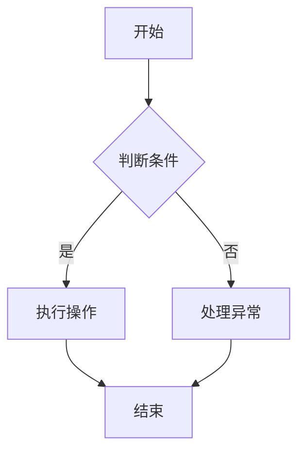
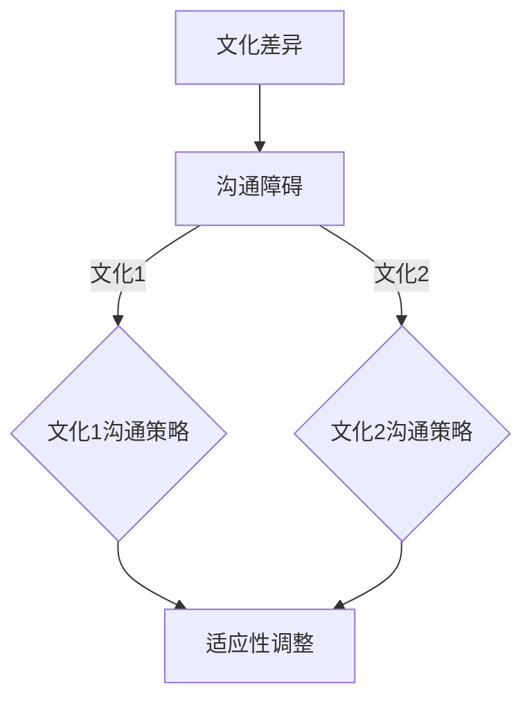

                 

# 文章标题：远程工作管理：领导分布式团队的策略

## 关键词：远程工作，团队管理，分布式团队，领导力，工作模式，绩效评估

> 摘要：随着数字化时代的到来，远程工作已成为企业运营的一种常态。本文深入探讨了远程工作管理的理论基础，分析了远程工作模式及对企业的影响，探讨了领导者在分布式团队管理中面临的挑战与应对策略。在此基础上，文章提出了构建高效远程工作团队的方法，包括团队组织结构设计、管理策略和文化建设，并提供了远程工作项目策划与执行、工作环境优化和绩效评估与反馈的具体实践与优化方案。通过本文的深入分析，读者将能够更好地理解和应对远程工作管理中的各种挑战，提升团队的协作效率和绩效。

## 目录

### 第一部分：远程工作管理的理论基础

#### 第1章：远程工作概述

1.1 远程工作的定义与发展

1.2 远程工作模式分类

1.3 远程工作对企业的影响

#### 第2章：远程工作的挑战与应对策略

2.1 挑战分析

2.2 领导者角色转变

2.3 提升团队协作的策略

### 第二部分：构建高效远程工作团队

#### 第3章：远程团队组织结构设计

3.1 远程团队架构

3.2 角色分配与职责定义

3.3 远程团队协作工具选择

#### 第4章：远程团队管理策略

4.1 目标设定与绩效管理

4.2 沟通与反馈机制

4.3 跨文化管理

#### 第5章：远程团队文化建设

5.1 团队文化的重要性

5.2 远程团队文化建设方法

5.3 团队活动策划与实施

### 第三部分：远程工作实践与优化

#### 第6章：远程工作项目策划与执行

6.1 项目管理框架

6.2 远程会议与沟通技巧

6.3 风险管理策略

#### 第7章：远程工作环境优化

7.1 工作场所选择与布置

7.2 远程工作设备与技术支持

7.3 工作生活平衡

#### 第8章：远程工作绩效评估与反馈

8.1 绩效评估指标设定

8.2 数据分析与反馈机制

8.3 培训与发展计划

### 附录

#### 附录A：远程工作相关资源与工具

A.1 远程协作工具

A.2 项目管理工具

A.3 学习与培训资源

#### 附录B：Mermaid流程图

B.1 远程团队组织结构流程图

B.2 项目管理流程图

B.3 沟通与反馈流程图

#### 附录C：算法与数学模型

C.1 远程工作绩效评估算法

C.2 跨文化沟通模型

#### 附录D：项目实战案例

D.1 远程团队协作案例

D.2 远程项目管理案例

D.3 远程工作环境优化案例

## 第一部分：远程工作管理的理论基础

### 第1章：远程工作概述

#### 1.1 远程工作的定义与发展

远程工作，作为一种灵活的工作模式，指的是员工在工作地点与工作内容之间具有一定的灵活性的工作方式。这种工作模式不再受限于传统的办公室环境，员工可以在家中、咖啡店、或任何有网络连接的地方工作。

远程工作的发展可以追溯到20世纪末，随着互联网技术的飞速发展，人们逐渐意识到远程工作的潜力。最初的远程工作主要是基于电子邮件和即时通讯工具的简单沟通，但随着协作工具的不断完善，远程工作逐渐变得更加高效和便捷。

现代远程工作的发展得益于云计算、虚拟专用网络（VPN）和人工智能等技术的进步。这些技术的应用使得远程工作的成本降低，效率提高，企业能够更灵活地管理全球资源。同时，远程工作的趋势也受到了全球疫情的影响，许多企业被迫转向远程工作模式，发现这种模式不仅能够保持业务的连续性，还能够提高员工的满意度和生产力。

#### 1.2 远程工作模式分类

远程工作模式可以根据工作的性质和形式进行分类，常见的分类方法有以下几种：

1. **基于地理位置的远程工作**：这种模式允许员工在不同的地理位置工作，但通常仍隶属于同一组织。这种模式下，员工可能需要定期到总部或其他办公地点参加团队会议或项目评审。

2. **全职远程工作**：在这种模式下，员工完全脱离传统办公室环境，全职在家或任何地点工作。这种模式通常适用于创意产业、信息技术等领域。

3. **兼职远程工作**：员工在传统办公室和远程工作之间进行切换，例如每周工作两天在办公室，三天在家办公。

4. **弹性工作时间远程工作**：员工可以根据个人需求调整工作时间，例如早上工作，下午休息，或根据任务性质灵活安排工作时间。

5. **混合办公模式**：结合传统办公和远程工作的模式，员工可以灵活选择工作地点，通常在办公室和远程工作之间进行平衡。

#### 1.3 远程工作对企业的影响

远程工作对企业产生了深远的影响，主要包括以下几个方面：

1. **提高员工满意度**：远程工作使员工能够更好地平衡工作与生活，提高工作满意度。研究表明，远程工作能够显著减少员工的工作压力，提高工作效率。

2. **提高生产力**：远程工作模式允许员工在舒适的环境中工作，减少通勤时间，从而提高工作效率。根据一些研究，远程工作的员工通常能够比在办公室的员工完成更多的任务。

3. **减少企业运营成本**：远程工作模式减少了企业对办公空间的依赖，降低了办公成本，包括租金、水电费等。同时，企业能够更灵活地招聘全球范围内的优秀人才。

4. **增强企业竞争力**：通过远程工作模式，企业能够更快地响应市场需求，灵活调整人力资源。在全球化的背景下，远程工作使企业能够更好地适应多变的商业环境。

5. **带来文化冲突和沟通障碍**：远程工作可能会导致团队之间的文化冲突和沟通障碍。由于地理位置和时区的差异，员工之间的沟通可能不够及时和有效，影响团队协作。

### 第2章：远程工作的挑战与应对策略

#### 2.1 挑战分析

远程工作虽然带来了许多好处，但同时也带来了一系列挑战。以下是一些主要的挑战：

1. **沟通障碍**：远程工作导致团队成员之间的沟通变得更加复杂。由于缺乏面对面的交流，团队成员可能无法及时了解对方的工作进展和需求，导致项目延误。

2. **监督困难**：远程工作使得领导者难以对员工的工作进行实时监督。员工在家工作，容易受到家庭和其他外部因素的干扰，导致工作效率下降。

3. **文化差异**：远程团队可能来自不同的国家和地区，具有不同的文化背景。文化差异可能导致误解、冲突和合作障碍。

4. **协作效率降低**：远程工作可能导致团队协作效率降低。团队成员无法随时随地进行面对面的讨论，协作过程可能变得更加复杂和缓慢。

5. **技术依赖性增强**：远程工作依赖于各种技术工具和平台，例如虚拟专用网络（VPN）、即时通讯工具、协作软件等。技术故障或网络中断可能会严重影响工作进展。

#### 2.2 领导者角色转变

在远程工作环境中，领导者需要适应新的角色和职责。以下是一些领导者角色转变的关键点：

1. **从管理者到促进者**：远程工作环境中，领导者不再主要担任监督和控制的角色，而更应成为促进者和支持者。领导者需要帮助员工克服远程工作中的困难，提供必要的资源和支持。

2. **从命令式到协商式**：远程工作需要领导者更加注重协商和沟通。领导者需要与团队成员进行开放和诚实的沟通，确保所有成员都清楚项目的目标和期望。

3. **从个体监督到团队支持**：领导者需要从关注个体员工的工作表现转向关注整个团队的合作和效率。领导者需要建立有效的团队协作机制，确保团队成员之间的沟通和协作。

4. **从控制到信任**：远程工作要求领导者对员工有更高的信任度。领导者需要相信员工能够自主管理和完成工作，减少不必要的干预。

#### 2.3 提升团队协作的策略

为了克服远程工作中的挑战，领导者可以采取以下策略来提升团队协作：

1. **建立明确的沟通机制**：制定一套明确的沟通规则和流程，确保团队成员能够及时、准确地传达信息。例如，定期举行在线会议、设置即时通讯群组、使用项目管理工具等。

2. **提供技术支持**：确保团队成员拥有必要的技术工具和资源，例如高速网络连接、安全VPN、协作软件等。同时，提供技术培训和支持，帮助员工熟悉和有效使用这些工具。

3. **加强团队建设**：定期组织团队建设活动，例如在线团队建设游戏、虚拟社交活动等，增强团队成员之间的情感联系和信任。

4. **设置明确的绩效目标**：为团队成员设定明确的绩效目标和期望，确保每个成员都清楚自己的职责和目标。同时，定期进行绩效评估和反馈，帮助团队成员了解自己的工作表现和改进方向。

5. **培养跨文化沟通能力**：为团队成员提供跨文化沟通培训，帮助团队成员了解不同文化背景的沟通习惯和价值观，减少误解和冲突。

## 第二部分：构建高效远程工作团队

### 第3章：远程团队组织结构设计

#### 3.1 远程团队架构

远程团队的架构设计是构建高效远程工作团队的基础。以下是一些关键点：

1. **扁平化管理结构**：远程团队通常采用扁平化的管理结构，以减少层级和沟通成本。这种结构使得团队成员能够更加直接地沟通和协作，提高决策效率。

2. **灵活的团队规模**：远程团队可以根据项目的需要灵活调整规模。团队成员可以根据任务的需求加入或离开团队，确保团队规模与项目需求相匹配。

3. **明确的责任划分**：每个团队成员都应明确自己的职责和任务。通过明确的责任划分，可以确保团队成员能够专注于自己的工作，提高工作效率。

4. **跨职能团队**：远程团队可以由不同职能的成员组成，例如开发人员、产品经理、设计师等。这种跨职能团队结构有助于不同领域的专家协作，共同推动项目进展。

5. **分布式团队**：远程团队可以分布在全球各地，利用全球范围内的资源和人才。这种分布式团队结构有助于企业更好地适应全球化的商业环境。

#### 3.2 角色分配与职责定义

在远程团队中，明确的角色分配和职责定义是确保团队协作顺畅的重要保障。以下是一些关键点：

1. **项目经理**：项目经理是远程团队的核心，负责整体项目的规划、执行和监控。项目经理需要协调不同团队成员的工作，确保项目按时完成。

2. **开发人员**：开发人员负责具体的技术实现，包括编写代码、测试和调试。开发人员可以根据项目的需求进行分工，专注于特定的模块或功能。

3. **产品经理**：产品经理负责产品的需求分析和设计，确保产品的功能和质量满足用户需求。产品经理需要与开发人员和测试团队密切合作，确保产品的顺利迭代。

4. **设计师**：设计师负责产品的视觉设计和用户体验。设计师需要与产品经理和开发人员紧密合作，确保产品的设计能够得到有效实施。

5. **测试工程师**：测试工程师负责产品的测试和质量管理，确保产品在发布前达到预定的质量标准。测试工程师需要与开发团队紧密合作，及时反馈和解决问题。

6. **运维人员**：运维人员负责产品的部署、运行和维护，确保产品能够稳定运行。运维人员需要与开发团队和测试团队密切合作，确保产品的运行状态。

#### 3.3 远程团队协作工具选择

选择合适的远程团队协作工具是确保团队高效协作的关键。以下是一些常见的协作工具：

1. **即时通讯工具**：例如Slack、Microsoft Teams、WhatsApp等，用于团队成员之间的实时沟通和协作。

2. **项目管理工具**：例如JIRA、Trello、Asana等，用于项目的规划、跟踪和协作。

3. **文档共享和协作工具**：例如Google Drive、Dropbox、OneDrive等，用于团队成员之间的文档共享和协作。

4. **视频会议工具**：例如Zoom、Microsoft Teams、Skype等，用于远程会议和团队讨论。

5. **代码管理工具**：例如Git、GitHub、GitLab等，用于代码的版本管理和协作开发。

6. **项目管理平台**：例如Confluence、Notion、Airtable等，用于团队的知识管理和协作。

### 第4章：远程团队管理策略

#### 4.1 目标设定与绩效管理

目标设定和绩效管理是远程团队管理的重要环节。以下是一些关键点：

1. **明确的目标设定**：领导者需要与团队成员共同制定明确的目标和期望。这些目标应具有可衡量性、具体性和时限性，确保团队成员能够清晰了解自己的工作方向和期望成果。

2. **定期的绩效评估**：领导者需要定期对团队成员的绩效进行评估，提供反馈和指导。通过定期的绩效评估，可以帮助团队成员了解自己的工作表现，找出改进的方向。

3. **个性化的绩效奖励**：根据团队成员的绩效表现，可以设置个性化的奖励机制，例如奖金、晋升机会、表彰等。这有助于激励团队成员，提高他们的工作积极性和满意度。

4. **透明的工作流程**：在远程团队中，工作流程应保持透明，确保团队成员能够随时了解项目进展和任务分配。通过透明的工作流程，可以减少误解和冲突，提高团队的协作效率。

#### 4.2 沟通与反馈机制

有效的沟通与反馈机制是远程团队管理的关键。以下是一些关键点：

1. **定期的团队会议**：领导者应定期组织团队会议，讨论项目进展、问题解决和团队建设。这些会议可以是每周的例行会议，也可以是紧急会议，以确保团队成员之间的沟通畅通。

2. **即时沟通工具**：利用即时通讯工具，如Slack、Microsoft Teams等，进行日常沟通和协作。这些工具可以帮助团队成员快速解决问题，提高工作效率。

3. **反馈与建议机制**：建立有效的反馈与建议机制，鼓励团队成员提出意见和建议。领导者应认真对待团队成员的反馈，及时采取改进措施。

4. **反馈的及时性**：领导者应及时给予团队成员反馈，无论正面还是负面。及时的反馈可以帮助团队成员更好地了解自己的工作表现，及时调整和改进。

#### 4.3 跨文化管理

在远程团队中，跨文化管理是确保团队协作顺畅的重要环节。以下是一些关键点：

1. **文化敏感性培训**：为团队成员提供文化敏感性培训，帮助他们了解不同文化背景的价值观、沟通方式和行为习惯。

2. **文化多样性认可**：领导者应认可和尊重团队成员的文化多样性，鼓励团队成员分享自己的文化和经验。

3. **沟通策略调整**：针对不同文化背景的团队成员，领导者应调整沟通策略，采用更加灵活和包容的方式。

4. **冲突解决机制**：建立有效的冲突解决机制，帮助团队成员解决文化冲突。通过对话和协商，找到共同点和解决方案。

### 第5章：远程团队文化建设

#### 5.1 团队文化的重要性

团队文化是团队内部共同价值观、信仰和行为的集合，对于远程团队的成功至关重要。以下是一些关键点：

1. **增强团队凝聚力**：团队文化可以增强团队成员之间的凝聚力，促进团队合作和协作。

2. **提高员工满意度**：良好的团队文化可以提高员工的满意度和归属感，降低员工流失率。

3. **促进创新**：团队文化鼓励创新和尝试，激发团队成员的创造力和潜力。

4. **增强企业竞争力**：具有强大团队文化的远程团队可以更好地适应市场变化，提高企业的竞争力。

#### 5.2 远程团队文化建设方法

以下是一些有效的远程团队文化建设方法：

1. **建立共同价值观**：领导者应与团队成员共同制定团队的价值观，并将其融入日常工作中。

2. **推广团队精神**：通过团队活动和培训，推广团队精神，增强团队成员之间的情感联系。

3. **建立信任**：信任是团队文化的基础，领导者应通过行动和沟通建立信任。

4. **鼓励开放沟通**：领导者应鼓励团队成员之间的开放沟通，分享想法和反馈。

5. **认可与奖励**：领导者应认可和奖励团队成员的成就，增强团队文化的正面效应。

#### 5.3 团队活动策划与实施

以下是一些远程团队活动策划与实施的要点：

1. **在线团队建设活动**：例如在线游戏、虚拟社交活动、团队挑战等，增强团队成员之间的情感联系。

2. **虚拟团队会议**：组织定期的虚拟团队会议，讨论项目进展、团队建设等议题。

3. **团队培训**：为团队成员提供在线培训，提升团队技能和知识水平。

4. **虚拟社交**：利用社交媒体和即时通讯工具，促进团队成员之间的虚拟社交。

## 第三部分：远程工作实践与优化

### 第6章：远程工作项目策划与执行

#### 6.1 项目管理框架

项目管理框架是确保远程工作项目顺利进行的关键。以下是一些关键点：

1. **项目立项**：明确项目目标、范围和预期成果，制定项目计划。

2. **团队组建**：组建合适的团队，明确团队成员的角色和职责。

3. **资源分配**：合理分配项目所需的资源，包括人力、技术、资金等。

4. **项目跟踪**：使用项目管理工具，实时跟踪项目进展，及时调整计划和资源。

5. **风险管理**：识别项目风险，制定风险应对策略。

#### 6.2 远程会议与沟通技巧

远程会议和沟通技巧是远程工作项目成功的关键。以下是一些关键点：

1. **明确会议目标**：每次会议前应明确会议目标和议程，确保会议高效进行。

2. **选择合适的会议工具**：根据会议内容，选择合适的会议工具，如视频会议、即时通讯等。

3. **保持沟通透明**：确保会议内容和决策对团队成员透明，促进团队协作。

4. **有效倾听和提问**：在会议中，领导者应鼓励团队成员积极参与，有效倾听和提问。

5. **会议记录和跟进**：会议后，及时记录会议内容和决策，跟进任务执行情况。

#### 6.3 风险管理策略

风险管理是远程工作项目策划与执行的重要组成部分。以下是一些风险管理策略：

1. **风险识别**：识别项目中可能出现的风险，包括技术风险、人员风险、市场风险等。

2. **风险评估**：对识别出的风险进行评估，确定其可能性和影响。

3. **风险应对**：制定风险应对策略，包括风险规避、风险转移、风险减轻等。

4. **风险监控**：实时监控项目进展，及时发现和处理风险。

5. **风险报告**：定期向项目相关方报告风险情况，确保风险得到有效控制。

### 第7章：远程工作环境优化

#### 7.1 工作场所选择与布置

远程工作环境中，选择合适的工作场所和布置对工作效率和舒适度至关重要。以下是一些关键点：

1. **家庭办公室**：选择一个安静、舒适、光线充足的地方作为家庭办公室。

2. **工作区布置**：合理布置工作区，包括办公桌、椅子、书架等，确保工作环境舒适。

3. **噪音控制**：尽量减少噪音干扰，如关闭不必要的电子设备、使用耳机等。

4. **光线与通风**：确保工作环境有良好的光线和通风，有利于身心健康。

#### 7.2 远程工作设备与技术支持

远程工作设备和技术支持是确保远程工作效率的重要因素。以下是一些关键点：

1. **高性能电脑**：选择高性能的电脑，确保高效处理工作和项目需求。

2. **稳定网络连接**：确保有稳定的网络连接，避免工作中断。

3. **视频会议设备**：配备高质量的摄像头和麦克风，确保远程会议的清晰度和音质。

4. **备份和安全性**：定期备份重要数据，确保数据安全。

5. **技术支持**：建立完善的技术支持系统，及时解决设备和技术问题。

#### 7.3 工作生活平衡

工作生活平衡是远程工作环境中员工心理健康和工作效率的重要因素。以下是一些关键点：

1. **明确工作时间**：制定合理的工作时间表，确保工作与生活之间的平衡。

2. **合理安排工作任务**：合理分配工作任务，避免过度劳累。

3. **自我管理**：培养自我管理能力，合理安排工作和休息时间。

4. **身心健康**：关注身心健康，保持良好的生活习惯，如定期锻炼、健康饮食等。

5. **家庭支持**：家庭支持对于远程工作的员工至关重要，家庭应理解和支持员工的工作。

### 第8章：远程工作绩效评估与反馈

#### 8.1 绩效评估指标设定

绩效评估指标设定是远程工作绩效评估的核心。以下是一些关键点：

1. **目标导向**：绩效评估指标应与团队和公司的目标一致，确保评估的导向性。

2. **可衡量性**：绩效评估指标应具有可衡量性，确保评估结果的客观性和公正性。

3. **具体性**：绩效评估指标应具体明确，避免模糊和抽象。

4. **时限性**：绩效评估指标应设定明确的时限，确保评估的可操作性和实用性。

#### 8.2 数据分析与反馈机制

数据分析与反馈机制是远程工作绩效评估的重要环节。以下是一些关键点：

1. **数据收集**：通过多种渠道收集与绩效相关的数据，如工作成果、客户反馈、同事评价等。

2. **数据分析**：对收集到的数据进行深入分析，找出绩效表现优异和需要改进的方面。

3. **反馈机制**：建立有效的反馈机制，将绩效评估结果及时反馈给团队成员。

4. **反馈沟通**：领导者应与团队成员进行开放和诚实的沟通，解释评估结果和改进建议。

#### 8.3 培训与发展计划

培训与发展计划是提升远程工作团队绩效的重要手段。以下是一些关键点：

1. **个性化培训**：根据团队成员的绩效评估结果和职业发展需求，提供个性化的培训计划。

2. **持续学习**：鼓励团队成员持续学习和成长，提升个人能力和团队整体水平。

3. **职业发展规划**：为团队成员提供明确的职业发展规划，帮助他们在公司内部发展。

4. **激励与奖励**：设立激励机制，鼓励团队成员积极参与培训和发展计划。

## 附录

### 附录A：远程工作相关资源与工具

#### A.1 远程协作工具

1. **Slack**：Slack是一款功能强大的即时通讯工具，适合团队内部沟通和协作。

2. **Microsoft Teams**：Microsoft Teams是微软推出的团队协作平台，提供即时通讯、视频会议和文档共享等功能。

3. **Zoom**：Zoom是一款全球领先的远程会议和视频会议工具，支持高清视频和语音通话。

4. **Google Workspace**：Google Workspace包括Gmail、Google Drive、Google Docs等，适用于团队文档共享和协作。

#### A.2 项目管理工具

1. **JIRA**：JIRA是Atlassian公司推出的一款流行的项目管理工具，适用于敏捷开发和团队协作。

2. **Trello**：Trello是一款基于看板的项目管理工具，适合简单项目和团队协作。

3. **Asana**：Asana是一款功能全面的在线项目管理工具，适用于团队任务跟踪和协作。

#### A.3 学习与培训资源

1. **Coursera**：Coursera提供丰富的在线课程，涵盖计算机科学、商业管理、人工智能等多个领域。

2. **edX**：edX是全球最大的在线学习平台之一，提供包括哈佛大学、麻省理工学院等顶尖大学的在线课程。

3. **Udemy**：Udemy提供各种在线课程，包括编程、数据科学、项目管理等，适合个人和团队学习。

### 附录B：Mermaid流程图

以下是一些常用的Mermaid流程图示例：



### 附录C：算法与数学模型

以下是一个简单的远程工作绩效评估算法的伪代码示例：

```python
def performance_evaluation(scores, goals):
    total_score = 0
    for score in scores:
        total_score += score
    average_score = total_score / len(scores)
    
    if average_score >= goals:
        return "Excellent"
    elif average_score >= 0.8 * goals:
        return "Good"
    else:
        return "Needs Improvement"
```

以下是一个简单的跨文化沟通模型的示例：



### 附录D：项目实战案例

以下是一个远程团队协作的实战案例：

#### D.1 远程团队协作案例

1. **项目背景**：某互联网公司需要开发一款新的移动应用程序，项目团队分布在不同的城市。

2. **团队组建**：项目经理、开发人员、设计师和测试工程师分别在不同城市工作。

3. **工具选择**：使用Slack进行日常沟通，JIRA进行项目管理，GitHub进行代码管理。

4. **沟通与协作**：定期举行视频会议，讨论项目进展和问题解决。团队成员通过Slack和JIRA实时沟通和协作。

5. **项目成果**：项目按时完成，应用程序成功上线，用户满意度高。

#### D.2 远程项目管理案例

1. **项目背景**：某电子商务公司需要开发一个新的电商平台，项目团队分布在不同的国家和地区。

2. **团队组建**：项目经理、开发人员、产品经理、设计师和测试工程师来自不同的国家和地区。

3. **项目管理工具**：使用JIRA进行项目管理，Google Drive进行文档共享，Zoom进行视频会议。

4. **沟通与协作**：使用Zoom进行每周的项目进度会议，使用JIRA跟踪任务和问题。团队成员通过Google Drive共享文档。

5. **项目成果**：项目按时完成，电商平台上线，销售额显著提高。

#### D.3 远程工作环境优化案例

1. **项目背景**：某IT公司需要优化远程工作环境，提高员工工作效率。

2. **工作场所选择**：为员工提供家庭办公室补贴，鼓励员工在家工作。

3. **设备与技术支持**：为员工提供高性能电脑、稳定网络连接和视频会议设备。

4. **培训与发展计划**：为员工提供在线培训资源，鼓励员工持续学习和成长。

5. **项目成果**：员工工作效率提高，员工满意度和团队凝聚力增强。公司运营成本降低，业务持续增长。

