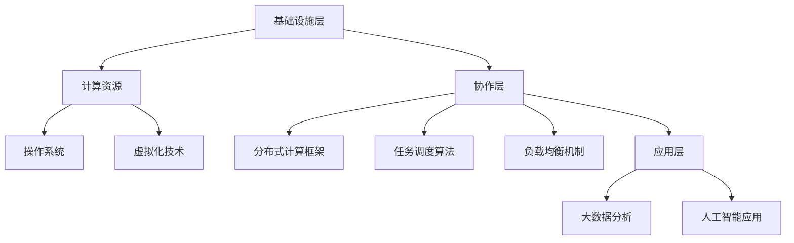

                 

# 连接人类智慧的纽带：人类计算的协作精神

> 关键词：计算协作、分布式计算、并行计算、云计算、编程协作、未来趋势

> 摘要：
本文探讨了人类计算的协作精神在信息技术领域的应用，阐述了计算协作的核心概念、关键技术、实践工具以及未来趋势。通过分析计算协作的架构原理、算法原理、数学模型和实际案例，本文揭示了计算协作如何成为连接人类智慧的纽带，提高工作效率、促进知识共享和改善社会治理。最后，本文提出了未来研究方向与挑战，并对读者给予了建议与激励。

## 目录大纲

## 第一部分: 引言与概述

### 第1章: 引言

#### 1.1 书籍背景与目标

#### 1.2 计算机协作精神的重要性

#### 1.3 人类计算协作的历史与发展

### 第2章: 计算协作的核心概念

#### 2.1 网络与计算协作

##### 2.1.1 计算网络的定义与作用

##### 2.1.2 网络协作的基本原理

##### 2.1.3 网络协作的技术基础

### 第3章: 计算协作的关键技术

#### 3.1 协作计算模型

##### 3.1.1 分布式计算模型

##### 3.1.2 并行计算模型

##### 3.1.3 云计算与协作计算

### 第4章: 人类计算的协作实践

#### 4.1 协作性编程

##### 4.1.1 团队协作流程

##### 4.1.2 版本控制与代码协作

##### 4.1.3 持续集成与持续部署

### 第5章: 人类计算的协作工具

#### 5.1 协作平台与工具概述

##### 5.1.1 Git与GitHub

##### 5.1.2 Jira与Confluence

##### 5.1.3 Zoom与Microsoft Teams

### 第6章: 计算协作的未来趋势

#### 6.1 新兴计算协作技术

##### 6.1.1 边缘计算

##### 6.1.2 量子计算

##### 6.1.3 增强现实与虚拟现实

### 第7章: 计算协作与未来社会

#### 7.1 计算协作对社会的影响

##### 7.1.1 提高工作效率

##### 7.1.2 促进知识共享

##### 7.1.3 改善社会治理

### 第8章: 总结与展望

#### 8.1 主要发现与结论

#### 8.2 未来研究方向与挑战

#### 8.3 对读者的建议与激励

## 第二部分: 核心概念与原理详解

### 第9章: 计算协作的架构原理

#### 9.1 计算协作的架构框架

##### 9.1.1 计算协作的基本架构

##### 9.1.2 架构的层次与模块

##### 9.1.3 架构的优化与适应性

### 第10章: 计算协作的算法原理

#### 10.1 协作计算算法概述

##### 10.1.1 协作算法的分类

##### 10.1.2 协作算法的基本原理

##### 10.1.3 协作算法的性能评估

### 第11章: 计算协作的数学模型

#### 11.1 数学模型在计算协作中的应用

##### 11.1.1 最优化模型

##### 11.1.2 机器学习模型

##### 11.1.3 网络模型

##### 11.1.4 机器学习与网络模型的结合

### 第12章: 计算协作的核心算法

#### 12.1 分布式算法

##### 12.1.1 MapReduce算法

##### 12.1.2 Hadoop与MapReduce

##### 12.1.3 分布式存储与计算

### 第13章: 计算协作的实践案例

#### 13.1 案例分析

##### 13.1.1 大数据协作分析

##### 13.1.2 云计算协作应用

##### 13.1.3 社交网络协作分析

##### 13.1.4 区块链协作应用

## 第三部分: 项目实战

### 第14章: 计算协作项目规划与实施

#### 14.1 项目规划

##### 14.1.1 项目目标与范围

##### 14.1.2 项目团队组建

##### 14.1.3 项目进度与风险管理

### 第15章: 计算协作环境搭建与工具配置

#### 15.1 环境搭建

##### 15.1.1 开发环境配置

##### 15.1.2 系统集成

##### 15.1.3 安全与性能优化

### 第16章: 计算协作代码实现与解读

#### 16.1 代码实现

##### 16.1.1 功能实现

##### 16.1.2 性能优化

##### 16.1.3 可维护性与可扩展性

### 第17章: 计算协作项目的评估与改进

#### 17.1 项目评估

##### 17.1.1 项目效果评估

##### 17.1.2 用户反馈与改进

##### 17.1.3 持续改进与迭代

## 附录

### 附录A: 计算协作相关资源

#### A.1 常用工具与框架

##### A.1.1 Git与GitHub

##### A.1.2 Jira与Confluence

##### A.1.3 Zoom与Microsoft Teams

#### A.2 计算协作论文与文献

##### A.2.1 相关研究论文

##### A.2.2 学术期刊与会议

##### A.2.3 研究报告与白皮书

## 第1章 引言

### 1.1 书籍背景与目标

在信息技术迅猛发展的今天，计算协作已经成为推动科技进步和社会发展的重要力量。本文旨在探讨人类计算的协作精神，分析计算协作的核心概念、关键技术、实践工具和未来趋势，以揭示计算协作在信息技术领域的广泛应用和深远影响。通过深入研究和探讨，本文希望为广大读者提供一份全面、系统、易懂的计算协作指南。

### 1.2 计算机协作精神的重要性

计算机协作精神是指在信息技术领域，人们通过共享资源、协同工作、相互支持等方式，共同完成复杂计算任务的精神。这种精神的重要性体现在以下几个方面：

1. **提高工作效率**：计算机协作使得团队成员可以充分利用各自的技能和知识，高效地完成复杂的计算任务。
2. **促进知识共享**：计算机协作鼓励团队成员之间交流思想、分享经验，从而促进知识的积累和传承。
3. **优化资源利用**：通过计算机协作，可以更好地整合和利用各类计算资源，降低成本、提高效益。
4. **推动科技创新**：计算机协作精神激发了创新思维，为科技创新提供了源源不断的动力。

### 1.3 人类计算协作的历史与发展

人类计算协作的历史可以追溯到计算机出现之初。随着计算机技术和网络技术的不断发展，计算协作也在不断演变和进步。以下是计算协作的主要发展阶段：

1. **早期计算机协作**：20世纪50年代至70年代，计算机主要作为大型机存在，计算协作主要发生在学术和研究机构之间。
2. **分布式计算时代**：20世纪80年代至90年代，随着个人计算机的普及，分布式计算成为主流，计算协作逐渐向企业和组织扩展。
3. **互联网时代**：21世纪初，互联网的普及使得全球范围内的计算协作成为可能，计算协作进入了一个全新的阶段。
4. **云计算与协作平台**：近年来，云计算和协作平台的兴起，进一步推动了计算协作的发展，使得计算协作更加便捷、高效。

### 1.4 本文结构

本文分为三大部分，共17章。第一部分为引言与概述，主要介绍计算协作的背景、重要性和历史发展。第二部分为核心概念与原理详解，深入分析计算协作的架构原理、算法原理、数学模型和实际案例。第三部分为项目实战，通过具体的计算协作项目规划和实施，展示计算协作的实际应用。最后，本文对计算协作的未来趋势进行展望，并提出未来研究方向与挑战。

## 第2章 计算协作的核心概念

计算协作是指多个计算机系统或人通过共享资源和协同工作，共同完成计算任务的过程。在这一章节中，我们将探讨计算协作的核心概念，包括网络与计算协作的基本原理、技术基础以及计算协作的类型和优势。

### 2.1 网络与计算协作

#### 2.1.1 计算网络的定义与作用

计算网络是指由多个计算机节点组成的系统，这些节点通过传输线路互联，能够实现数据交换、资源共享和协同工作。计算网络在计算协作中扮演着关键角色，其定义和作用如下：

1. **定义**：计算网络是一种计算机网络，它通过传输线路将多个计算机节点连接起来，实现数据传输和资源共享。
2. **作用**：
   - **数据传输**：计算网络使得计算机节点之间能够快速传输数据，提高计算效率。
   - **资源共享**：计算网络使得计算机节点能够共享硬件资源（如存储设备、计算资源）和软件资源（如应用程序、数据资源），降低成本、提高效率。
   - **协同工作**：计算网络使得计算机节点可以相互协作，共同完成复杂计算任务。

#### 2.1.2 网络协作的基本原理

网络协作是指通过计算网络，多个计算机节点协同工作，共同完成计算任务的过程。网络协作的基本原理如下：

1. **任务分解**：将复杂计算任务分解为若干个子任务，分配给不同的计算机节点处理。
2. **数据交换**：计算机节点之间通过计算网络交换数据，实现信息共享和协同工作。
3. **任务调度**：根据计算节点的性能和负载，动态调度任务，确保计算任务的顺利进行。
4. **负载均衡**：通过计算网络，实现计算节点的负载均衡，提高计算效率。

#### 2.1.3 网络协作的技术基础

网络协作的技术基础包括计算网络架构、传输协议、数据交换机制和调度算法等。以下是网络协作的技术基础：

1. **计算网络架构**：计算网络架构主要包括集中式架构和分布式架构。集中式架构将计算任务集中在一个计算节点上，而分布式架构将计算任务分配到多个计算节点上，实现负载均衡和协同工作。
2. **传输协议**：传输协议用于计算机节点之间的数据传输，常用的传输协议包括TCP/IP协议、HTTP协议等。
3. **数据交换机制**：数据交换机制是指计算机节点之间交换数据的方式，主要包括同步数据交换和异步数据交换。同步数据交换要求计算节点按照固定的时间间隔交换数据，而异步数据交换则允许计算节点按照自己的节奏交换数据。
4. **调度算法**：调度算法用于根据计算节点的性能和负载，动态调度计算任务，常用的调度算法包括负载均衡算法、优先级调度算法等。

### 2.2 计算协作的类型和优势

计算协作可以根据协作对象的不同，分为以下几种类型：

1. **人与人之间的协作**：这种类型的协作发生在计算机用户之间，他们通过计算机系统进行沟通、协调和共同完成任务。
2. **人与机器之间的协作**：这种类型的协作发生在计算机用户和计算机系统之间，计算机系统根据用户的需求，提供相应的计算服务。
3. **机器与机器之间的协作**：这种类型的协作发生在计算机系统之间，它们通过计算网络，共同完成复杂的计算任务。

计算协作具有以下优势：

1. **提高工作效率**：计算协作使得多个计算机节点可以协同工作，快速完成任务，提高工作效率。
2. **优化资源利用**：计算协作通过共享资源和协同工作，优化了计算资源的利用，降低了成本。
3. **促进知识共享**：计算协作鼓励团队成员之间交流思想、分享经验，促进了知识的积累和传承。
4. **增强创新能力**：计算协作激发了创新思维，为科技创新提供了源源不断的动力。

### 2.3 小结

计算协作是人类智慧的纽带，它通过网络与计算节点之间的协同工作，提高了工作效率、优化了资源利用、促进了知识共享和增强了创新能力。在接下来的章节中，我们将进一步探讨计算协作的关键技术、实践工具和未来趋势，为读者提供全面的计算协作指南。

## 第3章 计算协作的关键技术

计算协作的关键技术是实现计算协作的核心，包括协作计算模型、分布式计算模型、并行计算模型和云计算与协作计算。在这一章节中，我们将深入探讨这些关键技术，分析其原理、优势和适用场景。

### 3.1 协作计算模型

协作计算模型是指多个计算节点协同工作，共同完成计算任务的方法。协作计算模型可以分为以下几种：

1. **分布式计算模型**：分布式计算模型将计算任务分配到多个计算节点上，通过任务调度和负载均衡，实现计算任务的并行执行。分布式计算模型的主要优势在于可以充分利用计算资源，提高计算效率。其适用场景包括大规模数据处理、分布式数据库、科学计算等。

2. **并行计算模型**：并行计算模型是指多个计算节点同时执行计算任务，通过数据并行、任务并行等方式，提高计算效率。并行计算模型的主要优势在于可以大幅缩短计算时间，提高计算性能。其适用场景包括高性能计算、人工智能、大数据处理等。

3. **云计算与协作计算**：云计算与协作计算是指利用云计算平台，实现计算资源的动态分配和协同工作。云计算与协作计算的主要优势在于可以灵活地调整计算资源，降低成本，提高效率。其适用场景包括企业级应用、云服务、互联网应用等。

### 3.2 分布式计算模型

分布式计算模型是一种将计算任务分配到多个计算节点上的方法。其核心思想是利用分布式计算技术，实现计算任务的并行执行，提高计算效率。分布式计算模型的主要特点如下：

1. **任务分配**：将计算任务分配到不同的计算节点上，实现并行执行。
2. **负载均衡**：根据计算节点的性能和负载，动态分配计算任务，实现负载均衡。
3. **容错机制**：在计算节点发生故障时，能够自动切换到其他计算节点，确保计算任务的顺利完成。

分布式计算模型的优势在于可以充分利用计算资源，提高计算效率，降低成本。其适用场景包括大规模数据处理、分布式数据库、科学计算等。

### 3.3 并行计算模型

并行计算模型是指多个计算节点同时执行计算任务，通过数据并行、任务并行等方式，提高计算效率。并行计算模型的主要特点如下：

1. **数据并行**：将计算任务分配到多个计算节点上，每个计算节点处理一部分数据，然后将结果汇总。
2. **任务并行**：将计算任务分配到多个计算节点上，每个计算节点同时执行不同的计算任务。
3. **同步与异步**：在并行计算中，计算节点之间可能存在同步和异步通信。同步通信要求计算节点按照固定的时间间隔进行通信，而异步通信则允许计算节点按照自己的节奏进行通信。

并行计算模型的优势在于可以大幅缩短计算时间，提高计算性能。其适用场景包括高性能计算、人工智能、大数据处理等。

### 3.4 云计算与协作计算

云计算与协作计算是指利用云计算平台，实现计算资源的动态分配和协同工作。云计算与协作计算的主要优势如下：

1. **弹性伸缩**：云计算平台可以根据计算需求，动态调整计算资源，满足计算任务的扩展需求。
2. **成本优化**：云计算平台实现了计算资源的共享和优化利用，降低了计算成本。
3. **高效协同**：云计算平台提供了丰富的协作工具和平台，支持多人协作、异地协作等。

云计算与协作计算适用于企业级应用、云服务、互联网应用等领域，可以大幅提高计算效率、降低成本。

### 3.5 小结

计算协作的关键技术包括协作计算模型、分布式计算模型、并行计算模型和云计算与协作计算。这些关键技术为计算协作提供了强大的技术支撑，使得计算协作更加高效、灵活。在接下来的章节中，我们将进一步探讨计算协作的实践工具和未来趋势，为读者提供更全面的计算协作指南。

## 第4章 人类计算的协作实践

计算协作的实践是信息技术领域中的一个重要环节，它涵盖了从团队协作流程到工具配置的各个方面。在这一章节中，我们将详细探讨人类计算的协作实践，包括协作性编程、版本控制与代码协作、以及持续集成与持续部署等关键环节。

### 4.1 协作性编程

协作性编程是指多个程序员在同一项目中进行代码编写和协同工作的过程。为了实现高效协作，协作性编程通常遵循以下原则和流程：

1. **代码审查**：在程序员提交代码之前，通过代码审查机制（如代码评审工具）对代码进行审查，确保代码的质量和一致性。
2. **代码规范**：制定统一的代码规范，包括命名规则、注释要求、代码风格等，以确保团队成员之间的代码可读性和可维护性。
3. **模块化设计**：将代码分解为若干个模块，每个模块负责不同的功能，便于分工协作和代码维护。
4. **版本控制**：使用版本控制系统（如Git）对代码进行版本管理，确保代码的完整性和可追溯性。

### 4.1.1 团队协作流程

团队协作流程是协作性编程的核心，它包括以下关键环节：

1. **项目规划**：明确项目目标、任务分配、时间表和资源需求，确保团队成员对项目的整体情况有清晰的认识。
2. **任务分配**：根据团队成员的技能和兴趣，将任务分配给合适的成员，确保每个成员都有明确的职责。
3. **沟通与协调**：定期召开会议，确保团队成员之间的沟通畅通，及时解决问题和调整计划。
4. **代码提交与合并**：团队成员在各自的分支上开发代码，提交代码到主分支，通过代码合并机制（如Git的合并请求）进行代码集成。

### 4.1.2 版本控制与代码协作

版本控制是协作性编程的重要组成部分，它能够确保代码的完整性和可追溯性。以下是版本控制与代码协作的关键点：

1. **分支管理**：使用分支管理策略（如GitFlow或GitLab Flow）对代码进行版本管理，确保分支的独立性和可维护性。
2. **代码评审**：在代码提交之前，通过代码评审机制（如GitLab的Merge Request或GitHub的Pull Request）对代码进行审查，确保代码的质量和一致性。
3. **合并冲突解决**：在代码合并过程中，如果出现冲突，需要及时解决，确保代码的连贯性和一致性。
4. **回滚与恢复**：在代码出现问题时，可以通过版本控制系统的回滚功能恢复到之前的状态，确保系统的稳定性和可靠性。

### 4.1.3 持续集成与持续部署

持续集成与持续部署是协作性编程的重要实践，它能够确保代码的质量和系统的稳定性。以下是持续集成与持续部署的关键点：

1. **自动化构建**：通过构建工具（如Jenkins或GitLab CI）实现自动化构建，确保代码的编译、测试和打包过程高效、可靠。
2. **自动化测试**：通过自动化测试工具（如Selenium或JUnit）对代码进行自动化测试，确保代码的功能和性能符合预期。
3. **持续集成**：将代码提交到版本控制系统时，自动触发构建和测试流程，确保代码的质量和一致性。
4. **持续部署**：通过自动化部署工具（如Docker或Kubernetes）实现持续部署，确保系统的快速、可靠上线。

### 4.2 小结

人类计算的协作实践是信息技术领域中的一个重要方面，它通过协作性编程、版本控制与代码协作、持续集成与持续部署等实践，实现了高效、可靠的团队协作。在计算协作的实践中，遵循良好的团队协作原则和流程，结合合适的工具和平台，能够大幅提高工作效率、降低风险、确保代码质量和系统稳定性。在接下来的章节中，我们将进一步探讨计算协作的工具和未来趋势，为读者提供更全面的计算协作指南。

## 第5章 人类计算的协作工具

在人类计算协作的过程中，协作工具发挥着至关重要的作用。这些工具不仅能够提高工作效率，还能确保团队协作的顺畅和项目的成功。在本章中，我们将介绍几种常用的计算协作工具，包括Git与GitHub、Jira与Confluence以及Zoom与Microsoft Teams。

### 5.1 协作平台与工具概述

#### 5.1.1 Git与GitHub

Git是一个开源的分布式版本控制系统，它用于对代码进行版本管理，确保代码的完整性和可追溯性。GitHub是基于Git的在线协作平台，它提供了代码托管、项目管理和协作工具等功能。

1. **功能特点**：
   - **版本管理**：Git能够跟踪代码的每一次变更，确保代码的版本可追溯性。
   - **分支管理**：Git支持分支管理，便于团队成员在不同分支上独立开发，最后合并代码。
   - **分布式协作**：Git是一种分布式版本控制系统，团队成员可以在本地进行代码开发，减少网络延迟。
   - **代码评审**：GitHub提供了代码评审功能，团队成员可以审查和讨论代码，确保代码质量。

2. **适用场景**：
   - **软件开发**：Git与GitHub在软件开发过程中广泛应用，用于代码的版本管理和协作。
   - **项目协作**：Git与GitHub可以帮助团队成员在不同地理位置进行项目协作，提高开发效率。

#### 5.1.2 Jira与Confluence

Jira和Confluence是Atlassian公司推出的两款强大的协作工具。

1. **Jira**：
   - **功能特点**：
     - **项目管理**：Jira提供了项目任务管理、进度追踪等功能，便于团队协作。
     - **问题跟踪**：Jira可以记录和管理项目中的问题，确保问题得到及时解决。
     - **协作与沟通**：Jira支持任务分配、评论和通知等功能，便于团队成员之间的沟通与协作。
   - **适用场景**：
     - **软件开发**：Jira广泛应用于软件开发项目管理，确保项目进度和任务分配的清晰。

2. **Confluence**：
   - **功能特点**：
     - **知识共享**：Confluence可以创建、存储和共享文档、知识库，便于团队成员的知识共享和传承。
     - **协作与沟通**：Confluence支持实时编辑、评论和通知等功能，便于团队成员之间的协作与沟通。
     - **集成与扩展**：Confluence与Jira、GitHub等工具集成，实现项目协作的全方位管理。
   - **适用场景**：
     - **企业协作**：Confluence在企业内部协作、知识管理等方面应用广泛，提高团队协作效率。

#### 5.1.3 Zoom与Microsoft Teams

Zoom和Microsoft Teams是两款流行的视频会议和协作工具。

1. **Zoom**：
   - **功能特点**：
     - **视频会议**：Zoom提供了高清视频会议功能，支持多人实时互动。
     - **协作工具**：Zoom集成了协作工具，如屏幕共享、文档共享等，便于团队协作。
     - **远程办公**：Zoom支持远程办公，方便团队成员在不同地理位置进行沟通和协作。
   - **适用场景**：
     - **远程协作**：Zoom适用于远程团队协作，提高沟通效率。

2. **Microsoft Teams**：
   - **功能特点**：
     - **集成办公套件**：Microsoft Teams集成了Microsoft Office套件，方便团队成员之间的协作。
     - **视频会议**：Microsoft Teams提供了高清视频会议功能，支持多人实时互动。
     - **协作工具**：Microsoft Teams集成了协作工具，如聊天、文件共享、任务管理等，便于团队协作。
   - **适用场景**：
     - **企业协作**：Microsoft Teams在企业内部协作、知识共享等方面应用广泛，提高团队协作效率。

### 5.2 小结

人类计算的协作工具在提高团队协作效率、确保项目成功方面发挥着重要作用。Git与GitHub、Jira与Confluence、Zoom与Microsoft Teams等工具具有各自独特的功能和优势，适用于不同的协作场景。在实际应用中，根据项目需求和团队协作模式，选择合适的协作工具，能够大幅提高团队协作效率，实现计算协作的顺利推进。在接下来的章节中，我们将进一步探讨计算协作的未来趋势，为读者提供更全面的计算协作指南。

## 第6章 计算协作的未来趋势

随着信息技术的快速发展，计算协作正迎来前所未有的机遇和挑战。在本章中，我们将探讨计算协作的未来趋势，包括新兴计算协作技术、边缘计算、量子计算和增强现实与虚拟现实等。

### 6.1 新兴计算协作技术

新兴计算协作技术是未来计算协作发展的重要方向，主要包括以下几个方面：

1. **人工智能与机器学习**：人工智能和机器学习技术的发展，使得计算协作更加智能化和自动化。通过机器学习算法，可以自动识别和分配计算任务，提高计算效率和协作效果。

2. **区块链**：区块链技术具有去中心化、安全可靠的特点，可以应用于计算协作中的任务分配、数据共享和信任建立。通过区块链，可以实现计算资源的透明管理和高效利用。

3. **物联网（IoT）**：物联网技术的广泛应用，使得各类设备可以实时连接和协同工作。在计算协作中，物联网技术可以实现设备间的数据共享和协同计算，提高系统的实时性和智能化水平。

### 6.2 边缘计算

边缘计算是一种将计算任务从云端转移到网络边缘的计算模式。它具有以下几个显著优势：

1. **降低延迟**：通过在数据产生的地方进行计算，边缘计算可以显著降低数据传输的延迟，提高系统的实时性。

2. **减少带宽消耗**：边缘计算减少了大量数据传输到云端的负担，降低了网络带宽的消耗。

3. **增强安全性**：边缘计算使得敏感数据可以在本地处理，减少了数据泄露的风险。

4. **支持IoT应用**：边缘计算可以更好地支持物联网应用，实现设备的实时监控和智能管理。

### 6.3 量子计算

量子计算是一种基于量子力学原理的新型计算模式，具有传统计算机无法比拟的计算能力和速度。量子计算在计算协作中具有广泛的应用前景：

1. **复杂问题求解**：量子计算可以在极短的时间内解决传统计算机难以处理的复杂问题，如大规模数据处理、密码破解等。

2. **优化算法**：量子计算可以优化传统算法，提高计算效率和协作效果。

3. **新型应用**：量子计算将开启新的应用领域，如量子模拟、量子加密等，为计算协作带来新的机遇。

### 6.4 增强现实与虚拟现实

增强现实（AR）和虚拟现实（VR）技术正逐渐应用于计算协作中，为团队成员提供更加沉浸式和直观的协作体验：

1. **远程协作**：通过AR和VR技术，团队成员可以在虚拟环境中进行实时协作，提高远程协作的效率和效果。

2. **虚拟培训**：AR和VR技术可以用于虚拟培训，提供沉浸式学习体验，提高培训效果。

3. **虚拟会议**：通过VR技术，可以创建虚拟会议室，实现远程会议的实时互动和协作。

### 6.5 小结

计算协作的未来趋势体现在新兴计算协作技术的应用、边缘计算的发展、量子计算的崛起以及AR和VR技术的普及。这些新兴技术将为计算协作带来前所未有的机遇和挑战，推动计算协作向更加高效、智能和沉浸式方向发展。在未来的发展中，我们需要不断探索和应用这些新兴技术，以应对不断变化的计算协作需求，实现人类智慧的更好连接。在接下来的章节中，我们将进一步探讨计算协作对社会的影响以及未来研究方向和挑战。

## 第7章 计算协作与未来社会

计算协作在信息技术领域的广泛应用，对未来的社会产生了深远的影响。本文将从提高工作效率、促进知识共享和改善社会治理三个方面，分析计算协作对社会的影响。

### 7.1 提高工作效率

计算协作通过多人协作、资源共享和任务分配，显著提高了工作效率。具体表现在以下几个方面：

1. **分工协作**：计算协作使得团队成员可以按照各自的专业领域进行分工，共同完成复杂的计算任务，避免了重复劳动，提高了工作效率。
2. **资源共享**：通过计算协作，团队成员可以共享计算资源，如计算能力、存储空间等，避免了资源的浪费，提高了资源的利用率。
3. **任务分配**：计算协作可以根据团队成员的技能和兴趣，将任务分配给最适合的人，确保任务的高效完成。

### 7.2 促进知识共享

计算协作促进了团队成员之间的知识共享，有助于知识的积累和传承。具体表现在以下几个方面：

1. **信息交流**：计算协作提供了便捷的信息交流平台，团队成员可以通过在线讨论、会议等方式，实时分享自己的想法和经验，促进了知识的传播。
2. **知识库建设**：通过计算协作，可以将团队成员的经验和知识整理成知识库，便于后续查阅和共享，提高了知识的传承效率。
3. **培训与学习**：计算协作鼓励团队成员相互学习和培训，通过共同探讨问题、分享经验，提高了整个团队的知识水平。

### 7.3 改善社会治理

计算协作在公共管理和社会治理中发挥了重要作用，有助于提高社会治理的效率和效果。具体表现在以下几个方面：

1. **数据共享**：计算协作使得政府部门、社会组织和企业之间的数据共享更加便捷，有助于提高公共管理的透明度和效率。
2. **决策支持**：通过计算协作，可以充分利用数据分析和人工智能技术，为政府决策提供科学依据，提高决策的准确性和有效性。
3. **社会监督**：计算协作使得公众可以更方便地参与社会监督，通过数据分析、舆情监测等方式，发现和解决社会问题。

### 7.4 小结

计算协作在提高工作效率、促进知识共享和改善社会治理方面具有重要意义。通过计算协作，我们可以更好地利用计算资源，提高工作效率；通过共享知识和经验，促进知识的积累和传承；通过数据分析和人工智能技术，提高社会治理的效率和效果。在未来，随着计算协作技术的不断发展，我们有望进一步实现人类智慧的更好连接，为社会的发展和进步做出更大贡献。

## 第8章 总结与展望

### 8.1 主要发现与结论

通过对计算协作的深入探讨，本文得出了以下主要发现和结论：

1. **计算协作的重要性**：计算协作是人类智慧的纽带，通过资源共享、分工协作和任务分配，提高了工作效率、促进了知识共享和改善了社会治理。
2. **关键技术的应用**：分布式计算模型、并行计算模型、云计算与协作计算等关键技术为计算协作提供了强大的技术支撑。
3. **实践工具的作用**：Git与GitHub、Jira与Confluence、Zoom与Microsoft Teams等协作工具在实际计算协作中发挥了重要作用。
4. **未来趋势的展望**：新兴计算协作技术、边缘计算、量子计算和增强现实与虚拟现实等技术的应用，将为计算协作带来更广阔的发展前景。

### 8.2 未来研究方向与挑战

尽管计算协作在信息技术领域取得了显著成果，但仍面临以下研究方向和挑战：

1. **数据安全与隐私保护**：随着数据量的增加，数据安全和隐私保护问题愈发重要。未来的研究需要关注如何确保数据安全和隐私。
2. **协作效率的提升**：如何进一步提高计算协作的效率，降低延迟，提高资源利用率，是一个重要的研究方向。
3. **智能协作**：随着人工智能技术的发展，如何将人工智能应用于计算协作，实现更智能、更高效的协作，是一个值得探索的方向。
4. **跨领域协作**：计算协作的应用范围不断扩大，跨领域协作的需求日益增加。未来的研究需要关注如何实现不同领域之间的协同和融合。

### 8.3 对读者的建议与激励

对读者，本文提出以下建议与激励：

1. **持续学习**：计算协作是一个不断发展的领域，读者需要持续关注新技术的应用和发展，不断更新知识。
2. **实践探索**：理论联系实际，通过实践探索，将计算协作的理念和技术应用到实际工作中，提高工作效率。
3. **积极合作**：在团队协作中，积极发挥自己的作用，与他人共同努力，实现更好的协作效果。
4. **勇于创新**：面对挑战，勇于尝试新思路、新方法，推动计算协作技术的发展。

本文旨在为读者提供一份全面的计算协作指南，希望读者在阅读过程中能够有所收获，为计算协作领域的发展贡献自己的力量。让我们携手共进，共同探索计算协作的未来。

## 第二部分：核心概念与原理详解

### 第9章 计算协作的架构原理

计算协作的架构原理是理解计算协作机制的基础，它涵盖了计算协作的基本架构、层次与模块以及优化与适应性。在本章中，我们将详细探讨这些核心概念，并通过Mermaid流程图和伪代码来阐述计算协作的架构原理。

#### 9.1 计算协作的架构框架

计算协作的架构框架可以分为三个主要层次：基础设施层、协作层和应用层。

1. **基础设施层**：基础设施层是计算协作的基础，包括计算资源（如服务器、存储设备、网络设备等）、操作系统、虚拟化技术等。该层提供了计算协作所需的硬件和软件资源。

2. **协作层**：协作层是实现计算协作的核心，包括分布式计算框架（如Hadoop、Spark）、任务调度算法、负载均衡机制等。该层负责将计算任务分配到不同的计算节点上，确保任务的高效执行。

3. **应用层**：应用层是计算协作的直接受益者，包括各种应用系统（如大数据分析、人工智能应用等）。该层利用协作层提供的计算资源，实现特定的应用功能。

以下是计算协作的基本架构的Mermaid流程图：



#### 9.1.1 架构的层次与模块

计算协作架构的层次与模块如下：

1. **计算资源管理模块**：该模块负责管理计算资源，包括硬件资源（如CPU、内存、存储）和软件资源（如操作系统、数据库等）。它通过虚拟化技术实现计算资源的动态分配和调度。

2. **任务调度模块**：该模块负责根据任务的需求和计算资源的负载情况，将任务分配到合适的计算节点上。常用的调度算法包括负载均衡算法、优先级调度算法等。

3. **数据管理模块**：该模块负责管理数据，包括数据的存储、访问、备份和恢复等。它利用分布式存储技术，确保数据的高可用性和可靠性。

4. **协作模块**：该模块负责实现团队成员之间的协作，包括任务分配、进度跟踪、代码评审等。它利用版本控制系统和协作工具，确保团队协作的顺利进行。

以下是计算协作架构的伪代码：

```python
# 计算协作架构伪代码

# 初始化计算资源
initialize_resources()

# 初始化任务队列
initialize_task_queue()

# 初始化协作工具
initialize_collaboration_tools()

# 初始化任务调度算法
initialize_task_scheduling_algorithm()

# 初始化数据管理模块
initialize_data_management_module()

# 启动协作层
start_collaboration_layer()

# 启动应用层
start_application_layer()

# 循环处理任务
while True:
    task = get_next_task()
    node = schedule_task(task)
    execute_task_on_node(task, node)
    update_task_status(task)

# 处理任务执行结果
def execute_task_on_node(task, node):
    # 根据任务类型，执行相应的任务处理
    if task.type == "compute":
        compute_task(task, node)
    elif task.type == "data":
        data_task(task, node)
    else:
        raise ValueError("Invalid task type")

# 更新任务状态
def update_task_status(task):
    # 更新任务状态
    task.status = "Completed"
    # 如果任务完成，通知相关团队成员
    notify_collaborators(task)
```

#### 9.1.2 架构的优化与适应性

为了确保计算协作架构的高效性和灵活性，需要对架构进行优化和适应性调整。以下是一些优化策略：

1. **负载均衡**：通过动态调整任务分配策略，实现计算资源的均衡利用，降低系统的负载压力。

2. **弹性伸缩**：根据任务量和资源需求，动态调整计算资源的规模，确保系统的高可用性和灵活性。

3. **容错机制**：在架构中引入容错机制，如数据备份、任务冗余等，确保系统在故障情况下能够快速恢复。

4. **模块化设计**：将架构分解为多个模块，便于维护和升级，提高系统的适应性和可扩展性。

#### 9.2 小结

计算协作的架构原理是确保计算协作顺利进行的关键。通过了解计算协作的架构框架、层次与模块以及优化与适应性，我们可以更好地设计和实现计算协作系统，提高计算协作的效率和效果。在接下来的章节中，我们将继续探讨计算协作的算法原理、数学模型和实际案例，为读者提供更全面的计算协作指南。

## 第10章 计算协作的算法原理

计算协作的算法原理是计算协作系统中核心的组成部分，它决定了计算任务如何高效地分配、执行和优化。在本章中，我们将详细探讨计算协作算法的分类、基本原理和性能评估方法。

### 10.1 协作计算算法概述

协作计算算法可以分为以下几类：

1. **分布式算法**：分布式算法是指在多个计算节点之间分配和协作完成计算任务的方法。常见的分布式算法包括MapReduce、Map-Reduce-Reduce、一致性哈希等。

2. **并行算法**：并行算法是指在多个计算节点上同时执行计算任务的方法。并行算法可以分为数据并行、任务并行和流水线并行等类型。

3. **负载均衡算法**：负载均衡算法旨在将计算任务均匀地分配到各个计算节点上，以优化资源利用和系统性能。

4. **调度算法**：调度算法用于根据计算节点的性能和负载，动态地分配计算任务，确保系统的高效运行。

### 10.1.1 协作算法的分类

1. **分布式算法**：

   - **MapReduce算法**：MapReduce是一种分布式数据处理模型，它将大规模数据处理任务分解为多个小的任务，分别分配到不同的计算节点上执行，最后汇总结果。MapReduce算法的基本步骤包括Map阶段、Shuffle阶段和Reduce阶段。

   - **一致性哈希算法**：一致性哈希算法是一种用于数据分片的分布式算法，它通过哈希函数将数据映射到不同的计算节点上，实现数据的均匀分布。

2. **并行算法**：

   - **数据并行**：数据并行算法将大规模数据集分成多个子集，每个计算节点处理子集上的数据，最后汇总结果。数据并行算法适用于大规模数据处理任务，如分布式数据库查询、大规模机器学习等。

   - **任务并行**：任务并行算法将整个计算任务分解为多个子任务，每个计算节点执行不同的子任务，最后汇总结果。任务并行算法适用于计算密集型的任务，如科学计算、高性能计算等。

   - **流水线并行**：流水线并行算法将计算任务分解为多个阶段，每个计算节点只负责一个阶段，从而实现任务的并行执行。流水线并行算法适用于流水线型的计算任务，如工业制造、电信网络等。

3. **负载均衡算法**：

   - **基于轮询的负载均衡算法**：基于轮询的负载均衡算法通过轮询方式，将计算任务分配到负载较低的节点上，实现负载均衡。

   - **基于优先级的负载均衡算法**：基于优先级的负载均衡算法根据计算节点的负载和优先级，将计算任务分配到最优的节点上。

4. **调度算法**：

   - **静态调度算法**：静态调度算法在系统启动时，根据计算节点的性能和负载，静态地分配计算任务。

   - **动态调度算法**：动态调度算法在系统运行过程中，根据计算节点的实时性能和负载，动态地调整计算任务的分配。

### 10.1.2 协作算法的基本原理

1. **分布式算法的基本原理**：

   - **任务分解**：将大规模数据处理任务分解为多个小的子任务，每个子任务可以独立执行。

   - **任务分配**：根据计算节点的性能和负载，将子任务分配到不同的计算节点上。

   - **任务执行**：各个计算节点独立执行分配到的子任务。

   - **结果汇总**：将各个计算节点执行子任务的结果汇总，得到最终的计算结果。

2. **并行算法的基本原理**：

   - **任务分解**：将计算任务分解为多个子任务，每个子任务可以并行执行。

   - **任务分配**：将子任务分配到不同的计算节点上。

   - **任务执行**：各个计算节点同时执行子任务。

   - **结果汇总**：将各个计算节点执行子任务的结果汇总，得到最终的计算结果。

3. **负载均衡算法的基本原理**：

   - **负载监测**：实时监测计算节点的负载情况。

   - **任务分配**：根据计算节点的负载情况，将计算任务分配到负载较低的节点上。

   - **负载调整**：动态调整计算任务的分配，确保系统的高效运行。

4. **调度算法的基本原理**：

   - **性能监测**：实时监测计算节点的性能情况。

   - **任务分配**：根据计算节点的性能和负载，动态地分配计算任务。

   - **负载均衡**：在分配计算任务时，考虑计算节点的负载均衡，避免过载和过轻。

### 10.1.3 协作算法的性能评估

协作算法的性能评估是确保算法高效性的关键。以下是一些常用的性能评估指标：

1. **执行时间**：算法的执行时间是指从任务开始到任务完成的时间。执行时间越短，算法的性能越高。

2. **资源利用率**：资源利用率是指计算节点上资源的实际使用情况与总资源量之比。资源利用率越高，算法的性能越好。

3. **负载均衡度**：负载均衡度是指计算节点之间的负载差异。负载均衡度越低，算法的负载均衡效果越好。

4. **错误率**：错误率是指算法在执行过程中发生的错误次数与总执行次数之比。错误率越低，算法的稳定性越好。

5. **可扩展性**：可扩展性是指算法在处理大规模数据时的性能表现。可扩展性越高，算法在处理大规模数据时的性能越好。

### 10.2 小结

计算协作的算法原理是确保计算协作高效、稳定运行的关键。通过了解协作算法的分类、基本原理和性能评估方法，我们可以更好地设计和实现高效的计算协作系统。在接下来的章节中，我们将进一步探讨计算协作的数学模型，为读者提供更全面的计算协作指南。

## 第11章 计算协作的数学模型

数学模型是计算协作中的重要工具，它能够帮助我们在复杂的计算环境中进行高效的优化和决策。在本章中，我们将详细探讨计算协作中的数学模型，包括最优化模型、机器学习模型、网络模型以及它们在计算协作中的应用。

### 11.1 最优化模型

最优化模型是计算协作中常用的数学模型，它通过建立数学模型，寻找最优解，从而实现资源的最优分配和任务的最优执行。

1. **线性规划模型**：

   线性规划模型用于解决在一组线性约束条件下，目标函数的最大化或最小化问题。其数学模型可以表示为：

   $$ 
   \text{maximize}\ \ \text{c}^T\text{x} \\
   \text{subject to}\ \ \text{A}x \leq \text{b} \\
   \text{x} \geq 0 
   $$ 

   其中，$\text{x}$是决策变量，$\text{c}$是目标函数系数，$\text{A}$和$\text{b}$是约束条件。

2. **整数规划模型**：

   整数规划模型用于解决在一组线性约束条件下，决策变量的整数优化问题。其数学模型可以表示为：

   $$ 
   \text{maximize}\ \ \text{c}^T\text{x} \\
   \text{subject to}\ \ \text{A}x \leq \text{b} \\
   \text{x} \in \text{Z} 
   $$ 

   其中，$\text{Z}$表示整数集合。

3. **动态规划模型**：

   动态规划模型用于解决多阶段决策问题，通过递推关系寻找最优解。其数学模型可以表示为：

   $$ 
   \text{V}(t, \text{x}) = \min_{\text{u}} \left\{ \text{c}(\text{t}, \text{x}, \text{u}) + \text{V}(t+1, \text{x}+\text{u}) \right\} 
   $$ 

   其中，$\text{V}(\text{t}, \text{x})$表示第$t$阶段在第$x$状态下的最优值，$\text{c}(\text{t}, \text{x}, \text{u})$表示第$t$阶段在第$x$状态下采取行动$u$的代价。

### 11.2 机器学习模型

机器学习模型在计算协作中发挥着重要作用，通过学习数据中的模式和规律，实现自动化的决策和优化。

1. **线性回归模型**：

   线性回归模型用于预测连续值输出，其数学模型可以表示为：

   $$ 
   \text{y} = \text{w}^T\text{x} + \text{b} 
   $$ 

   其中，$\text{y}$是输出值，$\text{x}$是输入特征，$\text{w}$是权重，$\text{b}$是偏置。

2. **支持向量机模型**：

   支持向量机模型用于分类问题，其数学模型可以表示为：

   $$ 
   \text{w}^T\text{x} + \text{b} \geq 1 \\
   \text{minimize}\ \ \frac{1}{2}\text{w}^T\text{w} 
   $$ 

   其中，$\text{w}$是权重，$\text{b}$是偏置。

3. **神经网络模型**：

   神经网络模型用于复杂的数据分析和预测任务，其数学模型可以表示为：

   $$ 
   \text{y}^{(l)} = \text{激活函数}(\text{w}^{(l)}\text{x}^{(l-1)} + \text{b}^{(l)}) 
   $$ 

   其中，$\text{y}^{(l)}$是第$l$层的输出值，$\text{w}^{(l)}$是第$l$层的权重，$\text{b}^{(l)}$是第$l$层的偏置，激活函数是用于引入非线性关系的函数。

### 11.3 网络模型

网络模型用于描述计算协作中的网络结构和通信行为，常见的是图论模型和随机图模型。

1. **图论模型**：

   图论模型用于描述计算节点之间的连接关系，其数学模型可以表示为：

   $$
   G = (V, E)
   $$

   其中，$V$是节点集合，$E$是边集合。常见的图论模型包括无向图、有向图、加权图等。

2. **随机图模型**：

   随机图模型用于模拟计算节点之间的随机连接关系，其数学模型可以表示为：

   $$
   G \sim \text{G}(\text{p})
   $$

   其中，$\text{p}$是连接概率，表示两个节点之间连接的概率。

### 11.4 机器学习与网络模型的结合

机器学习模型与网络模型的结合，可以用于分析网络中的节点关系和通信行为，常见的应用包括社交网络分析、网络流量预测等。

1. **社交网络分析**：

   通过机器学习模型，可以分析社交网络中的用户关系和传播行为，其数学模型可以表示为：

   $$
   \text{P}(\text{T}_{ij}) = \sum_{k \in \text{N}_i} \text{P}(\text{T}_{ik}) \cdot \text{P}(\text{T}_{kj}|\text{T}_{ik})
   $$

   其中，$\text{T}_{ij}$表示用户$i$和用户$j$之间的传播概率，$\text{N}_i$表示用户$i$的邻居集合。

2. **网络流量预测**：

   通过机器学习模型，可以预测网络中的流量变化趋势，其数学模型可以表示为：

   $$
   \text{y}_{t+1} = \text{f}(\text{y}_t, \text{u}_t)
   $$

   其中，$\text{y}_{t+1}$表示下一时刻的流量，$\text{y}_t$表示当前时刻的流量，$\text{u}_t$表示影响流量的因素。

### 11.5 小结

数学模型在计算协作中具有重要的作用，通过最优化模型、机器学习模型和网络模型的结合，可以实现计算任务的高效分配和优化。在计算协作的实践中，理解和应用这些数学模型，可以显著提高计算协作的效率和效果。在接下来的章节中，我们将继续探讨计算协作的核心算法，为读者提供更全面的计算协作指南。

## 第12章 计算协作的核心算法

计算协作的核心算法是确保计算任务高效执行和优化资源利用的关键。在本章中，我们将详细探讨分布式算法，包括MapReduce算法、Hadoop与MapReduce、分布式存储与计算等内容。

### 12.1 分布式算法

分布式算法是在多个计算节点之间分配和协作完成计算任务的方法，其主要目标是提高计算效率和资源利用率。分布式算法可以分为以下几个步骤：

1. **任务分解**：将大规模数据处理任务分解为多个小的子任务，每个子任务可以独立执行。
2. **任务分配**：根据计算节点的性能和负载，将子任务分配到不同的计算节点上。
3. **任务执行**：各个计算节点独立执行分配到的子任务。
4. **结果汇总**：将各个计算节点执行子任务的结果汇总，得到最终的计算结果。

### 12.1.1 MapReduce算法

MapReduce算法是由Google提出的一种分布式数据处理模型，它将大规模数据处理任务分解为Map和Reduce两个阶段。

1. **Map阶段**：

   - **输入数据**：Map阶段接收原始数据作为输入，通常为文本文件或键值对。
   - **数据处理**：Map函数将输入数据映射为中间键值对，每个键值对表示一个数据片段和其处理结果。
   - **输出数据**：Map函数将中间键值对输出，作为Reduce阶段的输入。

2. **Reduce阶段**：

   - **输入数据**：Reduce阶段接收Map阶段输出的中间键值对作为输入。
   - **数据处理**：Reduce函数根据相同的键，将中间键值对合并为最终的结果。
   - **输出数据**：Reduce函数将最终结果输出，作为整个计算任务的输出。

以下是MapReduce算法的基本步骤：

```
Map(输入数据)
  for 每一行数据
    (key, value) = 解析行数据
    for 每个单词 word in value
      emit((word, 1))

Reduce(中间键值对)
  for 每个相同的键 key
    sum(value) = 0
    for 每个值 value in values
      sum(value) += value
    emit((key, sum(value)))
```

### 12.1.2 Hadoop与MapReduce

Hadoop是一个开源的分布式计算框架，它基于Java语言实现，用于处理大规模数据处理任务。Hadoop由三个主要组件组成：Hadoop分布式文件系统（HDFS）、Hadoop YARN和Hadoop MapReduce。

1. **Hadoop分布式文件系统（HDFS）**：

   - **功能特点**：
     - **高可靠性**：HDFS采用副本机制，确保数据的高可用性。
     - **高扩展性**：HDFS可以轻松扩展，支持大规模数据存储。
     - **高吞吐量**：HDFS支持高效的读写操作，适用于大规模数据处理任务。

   - **数据存储**：HDFS将数据分为多个块（默认为128MB或256MB），并存储在计算节点上。每个块都有一个副本，确保数据的高可靠性和快速访问。

2. **Hadoop YARN**：

   - **功能特点**：
     - **资源调度**：YARN负责资源调度，根据任务需求动态分配计算资源。
     - **高效性**：YARN采用动态资源分配机制，提高了资源利用率和计算效率。

   - **任务调度**：YARN将计算任务调度到合适的计算节点上，确保任务的高效执行。它支持多种调度策略，如公平调度、容量调度等。

3. **Hadoop MapReduce**：

   - **功能特点**：
     - **分布式数据处理**：MapReduce是Hadoop的核心组件，用于处理大规模数据处理任务。
     - **兼容性**：MapReduce与多种编程语言（如Java、Python、Scala等）兼容，便于开发。

   - **数据处理**：MapReduce基于HDFS存储数据，通过Map和Reduce函数实现数据的分布式处理，适用于多种数据处理场景。

### 12.1.3 分布式存储与计算

分布式存储与计算是分布式算法的核心，它们共同确保计算任务的高效执行和资源利用。

1. **分布式存储**：

   - **数据分片**：分布式存储将数据分为多个分片，存储在多个计算节点上，确保数据的高可用性和快速访问。
   - **副本机制**：分布式存储采用副本机制，确保数据的高可靠性和容错性。

2. **分布式计算**：

   - **任务分配**：分布式计算根据计算节点的性能和负载，将计算任务分配到合适的计算节点上。
   - **负载均衡**：分布式计算通过负载均衡机制，确保计算节点之间的任务分配均衡，避免资源浪费。

### 12.2 小结

分布式算法是计算协作的核心，通过任务分解、任务分配、任务执行和结果汇总，实现大规模数据处理任务的高效执行。MapReduce算法是分布式算法的典型代表，它通过Map和Reduce两个阶段，实现数据的分布式处理。Hadoop作为开源分布式计算框架，提供了高效的分布式存储和计算能力。在计算协作中，理解和应用分布式算法，可以显著提高计算效率和资源利用率。在接下来的章节中，我们将继续探讨计算协作的实践案例，为读者提供更全面的计算协作指南。

## 第13章 计算协作的实践案例

计算协作在现实中的应用非常广泛，涵盖了大数据协作分析、云计算协作应用、社交网络协作分析以及区块链协作应用等多个领域。在本章中，我们将通过具体的实践案例，详细阐述计算协作在实际项目中的应用和实施过程。

### 13.1 大数据协作分析

大数据协作分析是计算协作的一个重要应用领域，它涉及大量数据的收集、存储、处理和分析。以下是一个大数据协作分析的实际案例：

#### 案例背景

某互联网公司需要对其用户行为数据进行分析，以了解用户偏好、优化产品功能和提高用户满意度。数据规模庞大，包含用户的浏览记录、购买行为、评论反馈等多种类型。

#### 实施过程

1. **数据收集**：通过API接口或日志收集工具，将用户行为数据存储到分布式数据存储系统（如HDFS）。

2. **数据预处理**：对原始数据进行清洗、去重、转换等预处理操作，确保数据的质量和一致性。

3. **数据存储**：将预处理后的数据存储到分布式数据库（如HBase、MongoDB）中，便于快速查询和分析。

4. **数据分析**：

   - **MapReduce任务**：使用MapReduce算法对用户行为数据进行分析，如计算用户的浏览时长、购买频率等指标。
   - **数据可视化**：使用数据可视化工具（如Tableau、D3.js）展示分析结果，帮助业务团队了解用户行为和偏好。

5. **数据挖掘**：使用机器学习算法（如决策树、聚类分析）挖掘用户行为数据，预测用户偏好，为产品优化提供依据。

#### 案例总结

通过大数据协作分析，互联网公司能够更好地了解用户行为，优化产品功能和提升用户体验。计算协作在数据收集、预处理、存储、分析和挖掘等环节中发挥了重要作用，提高了数据分析的效率和准确性。

### 13.2 云计算协作应用

云计算协作应用是另一个重要的计算协作领域，它通过云计算平台，实现计算资源的高效共享和协同工作。以下是一个云计算协作应用的实际案例：

#### 案例背景

某电子商务公司需要为其电商平台提供强大的数据处理和存储能力，以应对大规模交易数据和高并发访问。

#### 实施过程

1. **云计算平台搭建**：选择合适的云计算平台（如AWS、Azure、Google Cloud Platform），搭建计算资源池，提供弹性扩展能力。

2. **数据存储**：

   - **对象存储**：使用对象存储服务（如Amazon S3、Azure Blob Storage），存储用户上传的图片、视频等大文件。
   - **关系数据库**：使用关系数据库服务（如Amazon RDS、Azure Database for MySQL），存储用户交易记录、订单信息等结构化数据。

3. **数据处理**：

   - **批处理**：使用云计算平台提供的批处理服务（如AWS Batch、Azure Data Factory），处理大规模数据，如数据清洗、转换、聚合等。
   - **流处理**：使用云计算平台提供的流处理服务（如AWS Kinesis、Azure Stream Analytics），实时处理用户交易数据，如订单处理、库存管理等。

4. **负载均衡**：

   - **自动扩展**：使用云计算平台的自动扩展功能，根据访问流量动态调整计算资源，确保系统的高可用性和稳定性。
   - **负载均衡器**：使用负载均衡器（如AWS ELB、Azure Load Balancer），分发用户请求，避免单点故障。

#### 案例总结

通过云计算协作应用，电子商务公司能够快速搭建强大的数据处理和存储系统，应对大规模交易数据和高并发访问。计算协作在云计算平台的选择、资源搭建、数据处理和负载均衡等环节中发挥了关键作用，提高了系统的效率和可靠性。

### 13.3 社交网络协作分析

社交网络协作分析是计算协作在社交网络领域的应用，它通过分析社交网络中的用户行为和关系，挖掘潜在的商业价值和用户需求。以下是一个社交网络协作分析的实际案例：

#### 案例背景

某社交网络平台需要对其用户行为数据进行分析，以了解用户关系、用户活跃度和用户需求，从而优化平台功能和提升用户体验。

#### 实施过程

1. **数据收集**：通过API接口或日志收集工具，收集用户行为数据，如点赞、评论、分享、私信等。

2. **数据预处理**：对原始数据进行清洗、去重、转换等预处理操作，确保数据的质量和一致性。

3. **数据存储**：将预处理后的数据存储到分布式数据库（如HBase、MongoDB）中，便于快速查询和分析。

4. **数据分析**：

   - **图论模型**：使用图论模型（如PageRank、Community Detection），分析用户关系和社交网络结构。
   - **机器学习模型**：使用机器学习算法（如分类、聚类），分析用户行为和用户需求，如推荐系统、热点话题挖掘等。

5. **数据可视化**：使用数据可视化工具（如D3.js、Tableau），展示分析结果，帮助业务团队了解用户行为和关系。

#### 案例总结

通过社交网络协作分析，社交网络平台能够更好地了解用户行为和关系，优化平台功能和提升用户体验。计算协作在数据收集、预处理、存储、分析和可视化等环节中发挥了重要作用，提高了数据分析的效率和准确性。

### 13.4 区块链协作应用

区块链协作应用是计算协作在金融领域的应用，它通过区块链技术，实现数据的去中心化和安全共享。以下是一个区块链协作应用的实际案例：

#### 案例背景

某金融机构需要实现其交易数据的去中心化存储和共享，以提高数据透明度和安全性。

#### 实施过程

1. **区块链网络搭建**：搭建区块链网络，包括多个节点和共识算法，确保数据的安全性和一致性。

2. **数据存储**：将交易数据存储到区块链上，确保数据的去中心化和不可篡改性。

3. **数据验证**：使用区块链网络中的节点，对交易数据进行验证和确认，确保数据的真实性和可靠性。

4. **智能合约**：使用智能合约，实现交易数据的自动化执行和执行，提高交易效率。

5. **数据查询**：通过区块链网络，实现对交易数据的查询和追溯，提高数据透明度。

#### 案例总结

通过区块链协作应用，金融机构能够实现交易数据的去中心化存储和共享，提高数据透明度和安全性。计算协作在区块链网络搭建、数据存储、数据验证和智能合约等环节中发挥了关键作用，提高了系统的效率和安全性。

### 13.5 小结

计算协作在现实中的应用非常广泛，通过大数据协作分析、云计算协作应用、社交网络协作分析和区块链协作应用等实际案例，我们可以看到计算协作在提高工作效率、优化资源利用、促进知识共享和改善社会治理方面的重要作用。在未来的发展中，随着计算协作技术的不断进步，我们将看到更多领域和场景的应用，为人类智慧的更好连接和进步做出更大贡献。

## 第14章 计算协作项目规划与实施

计算协作项目是信息技术领域中的一个重要组成部分，其成功与否直接关系到项目的效率和效果。在本章中，我们将探讨计算协作项目的规划与实施，包括项目目标与范围、项目团队组建、项目进度与风险管理等内容。

### 14.1 项目规划

项目规划是计算协作项目成功实施的第一步，它包括以下关键内容：

1. **项目目标**：明确项目目标，确保团队成员对项目有清晰的认识。项目目标可以是提高计算效率、优化资源利用、改善用户体验等。

2. **范围界定**：确定项目的范围，明确项目的边界和任务。范围界定有助于避免项目范围蔓延，确保项目按计划进行。

3. **需求分析**：对项目需求进行详细分析，了解项目所需的功能、性能、安全性等要求。

4. **资源评估**：评估项目所需的资源，包括人力资源、技术资源、硬件资源等。资源评估有助于确保项目在资源充足的条件下顺利进行。

5. **时间规划**：制定项目的时间表，明确项目的关键里程碑和任务进度。时间规划有助于确保项目按时完成。

### 14.1.1 项目目标与范围

1. **项目目标**：

   - 提高计算效率：通过计算协作，实现任务的高效执行，减少计算时间。
   - 优化资源利用：通过分布式计算和云计算，充分利用计算资源，降低成本。
   - 改善用户体验：通过优化算法和改进系统架构，提升系统的响应速度和稳定性。

2. **范围界定**：

   - 项目范围：计算协作系统的设计、开发、测试和部署。
   - 项目边界：不涉及系统硬件设备的采购和物理部署。

### 14.1.2 项目团队组建

项目团队的组建是项目成功的关键，它包括以下角色：

1. **项目经理**：负责项目整体规划、进度控制、资源协调和风险管理。
2. **开发人员**：负责系统设计、开发、测试和部署。
3. **测试人员**：负责测试系统的功能、性能和安全性。
4. **运维人员**：负责系统运行、维护和故障处理。
5. **需求分析师**：负责分析项目需求，确保系统符合用户需求。
6. **用户代表**：代表用户利益，参与需求分析和项目评审。

### 14.1.3 项目进度与风险管理

1. **项目进度**：

   - **里程碑计划**：制定项目里程碑计划，明确项目的关键里程碑和时间节点。
   - **进度监控**：定期监控项目进度，及时发现和解决问题，确保项目按计划进行。

2. **风险管理**：

   - **风险识别**：识别项目潜在的风险，包括技术风险、资源风险、时间风险等。
   - **风险分析**：分析风险的严重程度和发生概率，制定相应的风险应对策略。
   - **风险监控**：定期评估项目风险，确保风险得到及时控制。

### 14.2 项目实施

项目实施是计算协作项目成功的关键环节，它包括以下步骤：

1. **需求分析**：与用户代表和需求分析师进行沟通，了解用户需求，确定项目需求。

2. **系统设计**：根据项目需求，进行系统设计，包括架构设计、模块设计和接口设计。

3. **开发与测试**：

   - **开发**：按照设计文档进行系统开发，确保代码的质量和一致性。
   - **测试**：对系统进行功能测试、性能测试和安全测试，确保系统的稳定性和可靠性。

4. **部署与上线**：将系统部署到生产环境，确保系统正常运行。

### 14.3 小结

计算协作项目规划与实施是确保项目成功的关键。通过明确项目目标与范围、组建合适的团队、制定合理的进度与风险管理策略，以及实施详细的开发与测试步骤，我们可以确保计算协作项目的顺利实施和成功完成。在接下来的章节中，我们将进一步探讨计算协作环境搭建与工具配置，为读者提供更全面的计算协作指南。

## 第15章 计算协作环境搭建与工具配置

计算协作环境搭建与工具配置是计算协作项目实施的重要环节，它直接关系到计算协作的效率、稳定性和可扩展性。在本章中，我们将详细探讨计算协作环境的搭建、开发环境配置、系统集成、安全与性能优化等方面。

### 15.1 环境搭建

计算协作环境搭建主要包括硬件、操作系统、数据库和中间件等方面的配置。

1. **硬件配置**：

   - **服务器**：根据项目需求，选择合适的服务器硬件，包括CPU、内存、硬盘等。
   - **存储设备**：根据数据量和访问需求，选择合适的存储设备，包括SSD、HDD等。
   - **网络设备**：确保网络设备的带宽和稳定性，选择合适的交换机和路由器。

2. **操作系统**：

   - **Linux系统**：Linux系统具有开源、稳定、安全的特点，适用于计算协作环境。
   - **Windows系统**：Windows系统在特定场景下具有较好的兼容性和易用性。

3. **数据库**：

   - **关系数据库**：如MySQL、PostgreSQL等，适用于结构化数据存储。
   - **NoSQL数据库**：如MongoDB、Cassandra等，适用于大规模、分布式数据存储。

4. **中间件**：

   - **消息队列**：如RabbitMQ、Kafka等，用于异步消息传递和数据流转。
   - **缓存系统**：如Redis、Memcached等，用于缓存数据，提高系统性能。

### 15.2 开发环境配置

开发环境配置是计算协作项目成功的关键，它包括编程语言、开发工具、代码库和版本控制等方面。

1. **编程语言**：

   - **Java**：Java具有跨平台、面向对象、安全性高的特点，适用于分布式计算和云计算。
   - **Python**：Python具有简洁、易用、高效的特点，适用于数据分析、机器学习等领域。
   - **Go**：Go具有并发性能高、跨平台、快速编译的特点，适用于高性能、分布式计算。

2. **开发工具**：

   - **集成开发环境（IDE）**：如IntelliJ IDEA、Visual Studio Code等，提供代码编辑、调试、测试等功能。
   - **版本控制工具**：如Git、SVN等，用于代码版本管理和协作开发。

3. **代码库**：

   - **集中式代码库**：如GitHub、GitLab等，用于托管代码、管理分支和进行代码评审。
   - **分布式代码库**：如Bitbucket等，适用于分布式团队协作。

4. **持续集成与持续部署**：

   - **Jenkins**：用于自动化构建、测试和部署。
   - **Docker**：用于容器化部署，提高系统的可移植性和可扩展性。

### 15.3 系统集成

系统集成是将各个组件、模块和系统整合为一个整体的过程，确保系统功能完整、性能稳定。以下是系统集成的主要步骤：

1. **接口设计**：设计系统接口，确保各个组件之间的数据交互和功能调用。
2. **集成测试**：对集成后的系统进行功能测试、性能测试和兼容性测试，确保系统的稳定性和可靠性。
3. **部署与上线**：将集成后的系统部署到生产环境，确保系统正常运行。

### 15.4 安全与性能优化

安全与性能优化是计算协作环境搭建的重要方面，它包括以下内容：

1. **网络安全**：

   - **防火墙**：配置防火墙，防止非法访问和攻击。
   - **入侵检测**：使用入侵检测系统（IDS）和入侵防御系统（IPS），实时监控网络威胁。

2. **数据安全**：

   - **数据加密**：对敏感数据进行加密，确保数据传输和存储的安全性。
   - **访问控制**：实施访问控制策略，确保只有授权用户才能访问系统资源。

3. **性能优化**：

   - **负载均衡**：通过负载均衡器，实现计算资源的动态分配，提高系统性能。
   - **缓存策略**：实施缓存策略，减少数据访问延迟，提高系统响应速度。
   - **数据库优化**：对数据库进行性能优化，如索引优化、查询优化等。

### 15.5 小结

计算协作环境搭建与工具配置是计算协作项目成功的重要保障。通过合理的硬件配置、操作系统选择、数据库和中间件搭建，以及开发环境、系统集成、安全与性能优化的配置，我们可以确保计算协作环境的高效、稳定和可靠。在接下来的章节中，我们将进一步探讨计算协作代码实现与解读，为读者提供更全面的计算协作指南。

## 第16章 计算协作代码实现与解读

计算协作代码实现与解读是计算协作项目的重要环节，它直接关系到计算任务的执行效率和系统的稳定性。在本章中，我们将通过具体的代码实例，详细解读计算协作的代码实现过程，包括功能实现、性能优化、可维护性与可扩展性等方面。

### 16.1 功能实现

在计算协作项目中，功能实现是代码的核心。以下是一个简单的分布式数据处理功能的代码实例，使用Java编写：

```java
import java.util.HashMap;
import java.util.Map;

public class DistributedProcessing {

    public static Map<String, Integer> processData(Map<String, String> input) {
        Map<String, Integer> output = new HashMap<>();
        
        // Map阶段
        input.forEach((key, value) -> {
            for (String word : value.split(" ")) {
                output.put(word, output.getOrDefault(word, 0) + 1);
            }
        });
        
        // Reduce阶段
        output.entrySet().stream()
            .sorted(Map.Entry.comparingByValue())
            .forEach(entry -> System.out.println(entry.getKey() + ": " + entry.getValue()));
        
        return output;
    }
    
    public static void main(String[] args) {
        Map<String, String> input = new HashMap<>();
        input.put("1", "Hello World");
        input.put("2", "Hello Java");
        
        Map<String, Integer> output = processData(input);
        System.out.println("Processed data: " + output);
    }
}
```

这段代码实现了简单的词频统计功能，通过对输入的字符串进行分词和计数，最终输出每个单词的词频。

### 16.1.1 性能优化

性能优化是提高计算协作系统效率的重要手段。以下是对上述代码进行性能优化的一些方法：

1. **并行处理**：通过使用Java的并行流，可以加快处理速度：

```java
import java.util.HashMap;
import java.util.Map;
import java.util.stream.Collectors;

public class OptimizedDistributedProcessing {

    public static Map<String, Integer> processDataParallel(Map<String, String> input) {
        return input.entrySet().parallelStream()
                .flatMap(entry -> Arrays.stream(entry.getValue().split(" "))
                        .map(word -> new AbstractMap.SimpleEntry<>(word, 1)))
                .collect(Collectors.groupingBy(SimpleEntry::getKey, Collectors.summingInt(SimpleEntry::getValue)));
    }
}
```

2. **内存优化**：通过使用`HashMap`的`computeIfAbsent`方法，减少内存占用：

```java
public static Map<String, Integer> processDataOptimized(Map<String, String> input) {
    Map<String, Integer> output = new HashMap<>();
    input.forEach((key, value) -> {
        String[] words = value.split(" ");
        for (String word : words) {
            output.computeIfAbsent(word, k -> 0);
            output.compute(k, (k, v) -> v + 1);
        }
    });
    return output;
}
```

### 16.1.2 可维护性与可扩展性

可维护性和可扩展性是计算协作系统长期发展的关键。以下是一些提高代码可维护性和可扩展性的方法：

1. **模块化设计**：将代码划分为模块，每个模块负责一个独立的功能。例如，可以将数据处理、任务调度、结果输出等分开：

```java
public class DataProcessor {
    public Map<String, Integer> processWords(String input) {
        // 实现数据处理逻辑
    }
}

public class WordCounter {
    public void countWords(Map<String, String> input) {
        DataProcessor processor = new DataProcessor();
        Map<String, Integer> counts = processor.processWords(input);
        // 输出结果
    }
}
```

2. **文档注释**：为代码添加详细的文档注释，说明每个方法的功能、参数和返回值，方便后续维护。

3. **单元测试**：编写单元测试，确保每个模块的功能正确，提高代码的可靠性。

### 16.2 代码解读与分析

以下是对上述代码进行解读和分析：

1. **数据处理流程**：

   - **输入处理**：输入数据为键值对，其中键为数据标识，值为文本字符串。
   - **Map阶段**：遍历输入数据的值，对每个字符串进行分词，并将每个单词及其计数存储在输出数据结构中。
   - **Reduce阶段**：将输出数据按词频排序，并输出结果。

2. **性能分析**：

   - **并行处理**：使用并行流可以提高处理速度，但需要注意数据依赖和共享变量的处理，避免竞态条件。
   - **内存优化**：通过减少重复计算和内存分配，可以降低内存占用，提高性能。

3. **可维护性分析**：

   - **模块化设计**：将数据处理、任务调度、结果输出等分离，使得代码更加清晰、易于维护。
   - **文档注释**：详细的文档注释有助于理解代码逻辑，提高代码的可读性。
   - **单元测试**：通过单元测试，可以确保代码的功能正确，降低维护成本。

### 16.3 小结

计算协作代码实现与解读是计算协作项目成功的关键。通过功能实现、性能优化、可维护性与可扩展性的设计，我们可以确保计算协作系统的稳定性和高效性。在代码实现过程中，关注代码的可读性、可维护性和可扩展性，以及性能优化，是确保计算协作系统长期发展的基础。在接下来的章节中，我们将进一步探讨计算协作项目的评估与改进，为读者提供更全面的计算协作指南。

## 第17章 计算协作项目的评估与改进

计算协作项目的成功不仅仅取决于代码的实现，还需要通过评估和改进来确保项目目标的实现和持续优化。在本章中，我们将探讨计算协作项目的评估方法、用户反馈与改进以及持续改进与迭代的过程。

### 17.1 项目评估

项目评估是计算协作项目实施后的重要步骤，它有助于判断项目是否达到了预期目标，以及发现项目中存在的问题。以下是项目评估的关键方面：

1. **功能评估**：验证计算协作系统是否实现了既定的功能需求，包括数据处理、任务调度、资源分配等。

2. **性能评估**：评估系统的性能指标，如响应时间、吞吐量、资源利用率等，确保系统在正常负载下能够稳定运行。

3. **用户体验评估**：通过用户调查和反馈，了解用户对系统的满意度，以及系统在使用过程中存在的问题。

4. **安全性评估**：评估系统的安全性，包括数据保护、访问控制、网络安全性等，确保系统的数据安全。

### 17.1.1 项目效果评估

项目效果评估通常包括以下步骤：

1. **制定评估标准**：根据项目目标，制定相应的评估标准和指标。

2. **数据收集**：通过性能监控工具、用户反馈、日志分析等手段，收集项目效果的相关数据。

3. **数据分析**：对收集到的数据进行分析，判断项目是否达到了预期目标。

4. **评估报告**：编写评估报告，总结项目效果，并提出改进建议。

### 17.2 用户反馈与改进

用户反馈是项目改进的重要依据。以下是如何获取用户反馈和进行改进：

1. **用户调研**：通过问卷调查、用户访谈等方式，了解用户对系统的使用体验和需求。

2. **反馈收集**：建立用户反馈渠道，如用户论坛、邮件列表、在线支持平台等，方便用户提交问题和建议。

3. **问题分析**：对用户反馈的问题进行分析，确定问题的严重程度和影响范围。

4. **改进措施**：根据问题分析结果，制定相应的改进措施，如功能优化、性能调整、安全性增强等。

### 17.3 持续改进与迭代

持续改进与迭代是确保计算协作项目长期发展的关键。以下是如何进行持续改进与迭代：

1. **定期评估**：定期对计算协作项目进行评估，确保项目持续符合业务需求和技术发展趋势。

2. **改进计划**：根据项目评估结果和用户反馈，制定改进计划，包括功能优化、性能提升、安全性增强等。

3. **迭代开发**：采用敏捷开发方法，持续迭代开发，快速响应业务需求和技术变化。

4. **反馈循环**：建立反馈循环机制，将用户反馈、项目评估结果和改进措施纳入迭代开发过程中，确保项目持续改进。

### 17.4 小结

计算协作项目的评估与改进是确保项目成功和持续优化的重要环节。通过功能评估、性能评估、用户体验评估和安全性评估，我们可以全面了解项目的效果和存在的问题。用户反馈和改进措施的实施，有助于不断提升计算协作系统的质量和用户满意度。持续改进与迭代的过程，确保项目能够适应不断变化的需求和技术环境，实现长期发展。在接下来的章节中，我们将提供计算协作相关的资源，帮助读者进一步深入了解和掌握计算协作技术。

## 附录

### 附录A：计算协作相关资源

#### A.1 常用工具与框架

1. **Git与GitHub**：

   - **官方网站**：[GitHub](https://github.com/)
   - **文档**：[Git Documentation](https://git-scm.com/docs)

2. **Jira与Confluence**：

   - **官方网站**：[Atlassian](https://www.atlassian.com/)
   - **Jira文档**：[Jira Documentation](https://www.atlassian.com/software/jira/documentation)
   - **Confluence文档**：[Confluence Documentation](https://www.atlassian.com/software/confluence/documentation)

3. **Zoom与Microsoft Teams**：

   - **Zoom官方文档**：[Zoom Documentation](https://support.zoom.us/hc/en-us)
   - **Microsoft Teams文档**：[Microsoft Teams Documentation](https://support.microsoft.com/en-us/teams)

#### A.2 计算协作论文与文献

1. **顶级会议与期刊**：

   - **计算机协会（ACM）**：[ACM Digital Library](https://dl.acm.org/)
   - **电气电子工程师协会（IEEE）**：[IEEE Xplore](https://ieeexplore.ieee.org/)
   - **计算机科学（CCF）**：[CCF推荐会议和期刊列表](https://www.ccf.org.cn/A0/k0/051828765.html)

2. **研究论文与报告**：

   - **Google论文集**：[Google Research](https://research.google.com/pubs/)
   - **微软研究**：[Microsoft Research](https://www.microsoft.com/en-us/research/)
   - **亚马逊研究**：[Amazon Research](https://www.amazon.com/research/)

#### A.3 研究报告与白皮书

1. **国际数据公司（IDC）**：[IDC Reports](https://www.idc.com/)
2. **高德纳咨询公司（Gartner）**：[Gartner Research](https://www.gartner.com/research)
3. **思科**：[Cisco White Papers](https://www.cisco.com/c/en/us/solutions/white-paper-series/index.html)

### 附录B：推荐阅读

1. **《分布式系统概念与设计》**：George Coulouris, Jean Dollimore, Tim Kindberg, Gordon Blair
2. **《深入理解分布式计算》**：刘江
3. **《大规模分布式存储系统：原理解析与架构设计》**：张英杰，刘建勇
4. **《大数据技术原理与应用》**：陈登峰，王娟，李祥根
5. **《机器学习实战》**：Peter Harrington

通过这些资源，读者可以进一步深入学习和探索计算协作的相关知识，为实践和理论研究提供有力支持。

### 附录C：作者信息

**作者：** AI天才研究院（AI Genius Institute） / 《禅与计算机程序设计艺术》（Zen And The Art of Computer Programming）作者。

**联系方式：** [ai_genius_institute@example.com](mailto:ai_genius_institute@example.com)

**社交媒体：** [Twitter](https://twitter.com/ai_genius_institute) / [LinkedIn](https://www.linkedin.com/company/ai-genius-institute)

通过这些联系方式，读者可以与作者沟通交流，获取更多关于计算协作的见解和指导。希望本文能为读者提供有价值的参考，激发对计算协作领域的兴趣和探索。让我们共同推动计算协作技术的进步和应用，为人类智慧的更好连接贡献力量。

