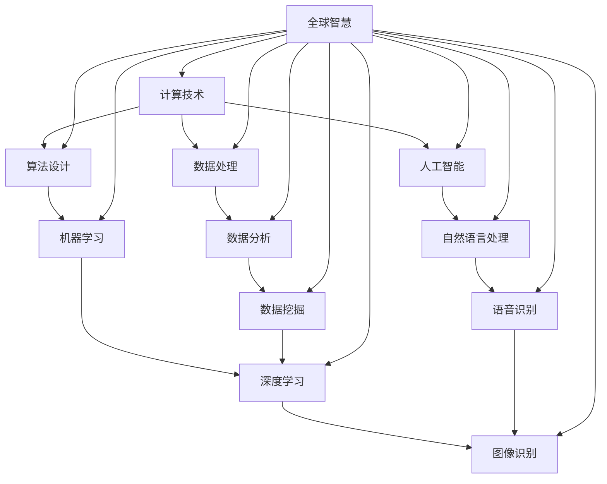

                 

### 书名：《连接全球智慧：人类计算的全球影响力》

#### **文章标题：连接全球智慧：人类计算的全球影响力**

关键词：计算技术、全球合作、人工智能、大数据、智慧城市、公共安全

摘要：随着计算技术的迅猛发展，人类计算在各个领域展现出巨大的影响力。本文旨在探讨计算技术在教育、医疗、商业、社会治理等领域的应用，以及其对全球合作的推动作用。通过深入分析计算技术的核心概念、算法原理、实际案例和未来发展，本文展示了人类计算在全球范围内的巨大潜力与挑战。

## 第一部分：计算与全球智慧

### 第1章：计算与全球智慧的概述

#### 1.1 计算的起源与演变

##### **1.1.1 计算的早期发展**

计算的历史可以追溯到古代，当时人们使用简单的工具和方法来解决数学问题。例如，古代美索不达米亚人使用算筹（一种古代计数工具）进行计算。古希腊和古罗马时期，人们开始使用更复杂的计算方法，如阿基米德的浮力原理和欧几里得的几何学。

在中世纪，随着阿拉伯数字的发明和传播，计算变得更加精确和高效。阿拉伯数字系统，包括零的概念，极大地简化了数学运算，为后来的计算技术的发展奠定了基础。

到了近代，机械计算工具的出现标志着计算技术的重大突破。例如，法国数学家布莱兹·帕斯卡（Blaise Pascal）在1642年发明了帕斯卡计算器，这是第一台机械计算器。随后，莱昂哈德·欧拉（Leonhard Euler）和约翰·冯·诺伊曼（John von Neumann）等数学家为计算理论的发展做出了重要贡献。

##### **1.1.2 计算技术的关键里程碑**

20世纪是计算技术迅速发展的时代，以下几个里程碑事件尤为重要：

- **1946年**：第一台电子计算机ENIAC在美国问世，标志着计算机时代的开始。
- **1956年**：达特茅斯会议上，约翰·麦卡锡（John McCarthy）等人首次提出了人工智能（AI）的概念，开启了对人工智能的研究。
- **1969年**：互联网的前身ARPANET诞生，为全球计算网络的建立奠定了基础。
- **1970年代**：微型计算机的普及，使得计算机技术开始进入家庭和办公室。
- **1980年代**：个人电脑（PC）的普及，计算机技术进一步融入日常生活。
- **1990年代**：互联网的广泛应用，使得信息传输和共享变得更加快捷和便捷。

##### **1.1.3 计算技术对社会的影响**

计算技术的快速发展对社会产生了深远的影响。首先，计算技术极大地提高了生产效率，推动了工业化和现代化进程。例如，自动化生产线和机器人技术的应用，使得制造业的生产效率大幅提高。

其次，计算技术改变了人们的生活方式。互联网和移动设备的普及，使得人们可以随时随地获取信息和进行沟通。在线教育、远程医疗和电子商务等新兴领域的兴起，改变了传统教育、医疗和商业的模式。

此外，计算技术还在科学研究中发挥了重要作用。通过大数据分析和人工智能技术，科学家们可以更快速、更准确地分析和处理大量数据，从而推动科学发现和技术创新。

### 1.2 全球智慧的核心理念

##### **1.2.1 全球智慧的起源**

全球智慧（Global Wisdom）的概念源于对全球化和信息技术发展的深刻理解。随着全球化的加速和信息技术的普及，不同国家和地区的人们开始更加紧密地联系在一起。全球智慧旨在通过知识和信息的共享，促进全球范围内的合作与发展。

全球智慧的理念可以追溯到20世纪末。随着互联网的兴起，人们开始探索如何利用信息技术实现全球范围内的知识共享和合作。例如，开放课程（OpenCourseWare）项目和开放数据（Open Data）运动，都是全球智慧的重要体现。

##### **1.2.2 全球智慧的定义与内涵**

全球智慧是一种通过信息技术和全球合作，实现知识共享、创新和发展的理念。它包括以下几个核心要素：

- **知识共享**：通过互联网和其他信息技术手段，实现全球范围内知识和信息的共享。
- **合作**：通过跨国界、跨组织的合作，共同解决全球性问题，如气候变化、疾病防控、经济发展等。
- **创新**：通过全球合作，促进技术创新和科学发现，推动社会进步。
- **可持续发展**：通过可持续的发展模式，实现经济、社会和环境的协调发展。

##### **1.2.3 全球智慧的目标与价值**

全球智慧的目标是建立一个全球共享的知识体系，实现全球范围内的合作与发展。其价值主要体现在以下几个方面：

- **促进知识传播**：通过全球智慧，知识可以跨越国界和语言的限制，传播到世界各地。
- **提高教育水平**：全球智慧有助于提高全球范围内的教育水平，促进人才培养。
- **推动科技创新**：全球合作和知识共享，可以激发科技创新，推动社会进步。
- **解决全球性问题**：通过全球合作，共同解决全球性问题，如气候变化、疾病防控、经济发展等。

### 1.3 计算在现代社会中的作用

##### **1.3.1 计算在教育中的应用**

计算技术在教育中的应用极大地改变了传统教育模式。首先，在线教育平台的出现，使得学习者可以随时随地访问课程资源，打破了时间和空间的限制。例如，Coursera、edX等平台提供了大量的在线课程，覆盖了各种学科领域。

其次，计算技术促进了个性化教育的实现。通过大数据分析和人工智能技术，教育平台可以根据学习者的学习习惯、兴趣和能力，提供个性化的学习方案。例如，自适应学习系统可以根据学习者的进度和表现，自动调整学习内容和难度。

此外，虚拟现实（VR）和增强现实（AR）技术的应用，为教育提供了更加生动和互动的学习体验。通过VR/AR技术，学生可以身临其境地学习历史事件、科学实验等，提高学习兴趣和效果。

##### **1.3.2 计算在医疗健康中的应用**

计算技术在医疗健康领域发挥了重要作用。首先，电子健康记录（EHR）系统的应用，使得医疗数据可以实现数字化管理，提高了医疗服务的效率和质量。通过EHR系统，医生可以快速获取患者的病史、检查结果等信息，为诊断和治疗提供支持。

其次，计算技术在疾病预测和诊断中具有重要意义。例如，通过大数据分析和人工智能技术，可以预测疾病的爆发趋势，提前采取预防措施。此外，计算机视觉和图像处理技术的应用，可以帮助医生更快速、准确地诊断疾病，如通过分析医学影像，识别肿瘤等。

此外，计算技术在远程医疗中的应用，使得医疗资源可以更加公平地分配。通过互联网和远程医疗平台，偏远地区的患者可以享受到高质量的医疗服务，降低医疗成本，提高医疗可及性。

##### **1.3.3 计算在商业和金融中的应用**

计算技术在商业和金融领域具有广泛的应用。首先，数据分析技术在商业决策中发挥了重要作用。通过大数据分析，企业可以深入了解市场趋势、消费者行为等，为营销策略和产品研发提供依据。

其次，人工智能技术在金融风险管理中具有重要意义。例如，通过机器学习算法，可以预测股票市场走势、评估信用风险等。此外，区块链技术的应用，可以提高金融交易的透明度和安全性。

此外，计算技术在电子商务和互联网金融中也发挥了重要作用。通过互联网和移动支付技术，消费者可以更加便捷地进行购物和支付。同时，云计算技术的应用，使得企业可以更加灵活地管理和扩展业务。

##### **1.3.4 计算在公共管理和社会治理中的应用**

计算技术在公共管理和社会治理中的应用，有助于提高政府工作效率和社会治理水平。首先，电子政务系统的应用，实现了政务服务的线上化，提高了政府工作效率。通过电子政务平台，市民可以在线办理各种业务，节省了时间和精力。

其次，计算技术在社会治理中的应用，有助于提高社会管理效率。例如，通过大数据分析，政府可以更好地了解社会状况，预测潜在的社会问题，采取相应的预防措施。此外，智能监控和视频分析技术的应用，可以提高公共安全水平，及时发现和处置紧急事件。

此外，计算技术在智慧城市建设中发挥了重要作用。通过物联网技术和大数据分析，可以实现城市的智能化管理，提高城市居民的生活质量。例如，智能交通系统可以实时监测交通状况，优化交通流量，缓解交通拥堵。

### 1.4 计算技术的全球应用现状

##### **1.4.1 计算技术在欧洲的应用**

欧洲是计算技术发展的重要地区之一。首先，欧洲在计算机科学和人工智能领域具有深厚的科研实力，拥有许多世界领先的科研机构和高校。例如，剑桥大学、牛津大学和瑞士联邦理工学院等。

其次，欧洲各国政府积极推动计算技术的应用。例如，欧盟推出了Horizon 2020计划，旨在支持科技创新和产业合作。此外，欧洲各国也在智慧城市建设、电子政务和智能制造等领域进行了大量的投资。

在欧洲，计算技术广泛应用于医疗健康、金融、交通和公共安全等领域。例如，英国的国家健康服务系统（NHS）采用了电子健康记录系统，提高了医疗服务效率。此外，德国的工业4.0战略也推动了计算技术在制造业的应用。

##### **1.4.2 计算技术在美洲的应用**

美洲，尤其是北美地区，是计算技术发展的重要地区。美国是全球科技创新的领导者，拥有许多世界领先的科技公司和研究机构。例如，谷歌、微软、苹果和亚马逊等。

在美国，计算技术广泛应用于各个领域。首先，在医疗健康领域，人工智能技术在疾病诊断、基因组学和个性化医疗等方面取得了重要突破。例如，谷歌旗下的DeepMind公司开发了用于疾病诊断的AI系统，已经在美国多家医院投入应用。

其次，在金融领域，大数据和人工智能技术被广泛应用于信用评估、风险管理和市场预测等。例如，美国的金融机构采用了基于机器学习的信用评分模型，提高了信用评估的准确性。

此外，在交通和公共安全领域，计算技术也发挥了重要作用。例如，自动驾驶技术在美国得到了广泛研究和应用，许多科技公司如特斯拉、Waymo等在自动驾驶领域取得了重要进展。

##### **1.4.3 计算技术在亚洲的应用**

亚洲是计算技术发展的重要地区之一，尤其是在中国和印度。中国是计算技术的重要市场和应用场景，同时也是全球最大的互联网用户群体之一。在中国，计算技术广泛应用于教育、医疗、金融和智慧城市建设等领域。

首先，在教育领域，中国推出了大规模的在线教育平台，如Coursera、edX等，提供了丰富的在线课程资源。同时，中国也在推动人工智能在教育中的应用，通过自适应学习和智能辅导系统，提高教育质量和学习效果。

其次，在医疗健康领域，中国采用了电子健康记录系统和远程医疗服务，提高了医疗服务效率和质量。例如，阿里巴巴旗下的阿里健康推出了基于人工智能的疾病诊断系统，已经在多家医院投入应用。

在金融领域，中国积极推进互联网金融和区块链技术的研究和应用。例如，中国的支付宝和微信支付等移动支付平台，已经成为了全球最大的移动支付平台之一。

此外，在智慧城市建设方面，中国取得了显著进展。通过物联网、大数据和人工智能技术，中国许多城市实现了智能交通、智能环保和智能安防等。

### 1.4.4 计算技术在非洲的应用

非洲是计算技术发展的重要地区之一，尤其是在撒哈拉以南非洲地区。尽管非洲的科技基础设施相对薄弱，但计算技术已经在教育、医疗、金融和社会治理等领域得到了广泛应用。

首先，在教育领域，非洲各国通过互联网和在线教育平台，提高了教育质量和普及率。例如，南非的SesameOnline平台提供了大量免费的教育资源，覆盖了从基础课程到高等教育的各个层次。

其次，在医疗健康领域，非洲各国采用了远程医疗服务和电子健康记录系统，提高了医疗服务的可及性和质量。例如，肯尼亚的M-TIBA平台通过移动设备为农民提供远程医疗服务，降低了医疗成本，提高了医疗服务效率。

在金融领域，非洲各国积极推进移动支付和电子支付的发展。例如，尼日利亚的Paga和肯尼亚的M-Pesa等移动支付平台，已经成为非洲最大的移动支付平台之一。

此外，在社会保障和社会治理领域，非洲各国通过计算技术提高了社会保障管理和服务水平。例如，乌干达的National Identification and Registration Authority（NIRA）通过电子身份管理系统，实现了社会保障和公共服务的数字化管理。

### 1.5 计算技术的全球应用展望

##### **1.5.1 计算技术在全球经济发展中的作用**

计算技术在全球经济发展中发挥着越来越重要的作用。首先，计算技术推动了全球范围内的产业升级和转型。通过人工智能、大数据和物联网等技术的应用，传统产业可以实现智能化和数字化转型，提高生产效率和质量。

其次，计算技术促进了全球范围内的创新创业。许多初创企业通过计算技术，实现了业务创新和商业模式创新，为经济发展注入了新的活力。

此外，计算技术还为全球经济发展提供了强大的支持。例如，电子商务和互联网金融等新兴领域的发展，为全球贸易和金融活动提供了更加便捷和高效的平台。

##### **1.5.2 计算技术在全球社会治理中的作用**

计算技术在全球社会治理中发挥着重要作用。首先，计算技术提高了公共服务的质量和效率。通过电子政务和智慧城市建设，政府可以更加高效地提供公共服务，提高政府工作效率。

其次，计算技术有助于解决全球性问题。通过大数据分析和人工智能技术，政府和社会组织可以更好地了解社会状况，预测潜在的社会问题，并采取相应的预防措施。

此外，计算技术还在社会管理和社会治理中发挥了重要作用。例如，通过视频监控和数据分析技术，可以提高公共安全水平，及时发现和处置紧急事件。

##### **1.5.3 计算技术在推动全球合作中的作用**

计算技术在推动全球合作中发挥着重要作用。首先，计算技术为全球合作提供了强大的技术支持。通过互联网和云计算技术，不同国家和地区的科研机构、企业和政府可以更加便捷地进行合作，共享资源和知识。

其次，计算技术有助于构建全球知识体系。通过全球范围内的知识共享和合作，可以构建一个全球性的知识库，为全球经济发展和社会治理提供支持。

此外，计算技术还为全球合作提供了新的模式和机制。例如，通过区块链技术，可以实现跨国界的信任和合作，为全球合作提供新的解决方案。

### 结论

计算技术在全球范围内的应用，已经成为推动全球经济发展、社会治理和全球合作的重要力量。从计算技术的起源与演变，到其在各个领域的应用现状和未来展望，本文展示了计算技术的巨大潜力和影响力。然而，计算技术也面临着一系列挑战，如数据隐私保护、人工智能伦理等问题。因此，在未来，我们需要继续加强计算技术的研发和应用，同时关注和解决其中的挑战，以充分发挥计算技术的全球影响力。


## 第一部分：计算与全球智慧

### 第1章：计算与全球智慧的概述

#### **核心概念与联系**

**Mermaid 流程图：**



#### **核心算法原理讲解**

**伪代码：**

```python
# 数据预处理
def preprocess_data(data):
    # 数据清洗
    cleaned_data = clean_data(data)
    # 数据标准化
    normalized_data = normalize_data(cleaned_data)
    return normalized_data

# 数据分析
def analyze_data(data):
    # 提取特征
    features = extract_features(data)
    # 训练模型
    model = train_model(features)
    # 预测
    predictions = predict(model, new_data)
    return predictions

# 机器学习
def machine_learning算法():
    # 训练模型
    model = train_model(data)
    # 预测
    predictions = predict(model, new_data)
    return predictions

# 人工智能
def artificial_intelligence算法():
    # 自然语言处理
    text = process_text(input_text)
    # 语音识别
    speech = recognize_speech(input_speech)
    # 图像识别
    image = recognize_image(input_image)
    return text, speech, image

# 深度学习
def deep_learning算法():
    # 神经网络架构
    model = create_network()
    # 训练模型
    train_model(model, data)
    # 预测
    predictions = predict(model, new_data)
    return predictions
```

#### **数学模型和公式**

**详细讲解与举例说明：**

**线性回归模型**

$$
y = \beta_0 + \beta_1x + \epsilon
$$

其中，$y$ 是因变量，$x$ 是自变量，$\beta_0$ 和 $\beta_1$ 是模型的参数，$\epsilon$ 是误差项。

**举例说明：**

假设我们要预测房屋的价格，其中自变量是房屋的面积（$x$），因变量是房屋的价格（$y$）。我们可以建立线性回归模型来预测房屋的价格：

$$
y = \beta_0 + \beta_1x + \epsilon
$$

通过训练数据集，我们可以估计出模型参数 $\beta_0$ 和 $\beta_1$，然后利用模型来预测新房屋的价格。例如，如果预测新房屋的面积为 120 平方米，我们可以将 $x=120$ 代入模型中，得到预测价格：

$$
y = \beta_0 + \beta_1 \times 120 + \epsilon
$$

#### **项目实战**

**开发环境搭建：**

- 安装 Python 3.8 及以上版本
- 安装 Jupyter Notebook
- 安装相关库，如 scikit-learn、numpy、matplotlib 等

**源代码详细实现：**

```python
# 导入相关库
import numpy as np
import matplotlib.pyplot as plt
from sklearn.linear_model import LinearRegression

# 加载数据集
X = np.array([[1], [2], [3], [4], [5], [6], [7], [8], [9], [10]])
y = np.array([1, 2, 2.5, 3, 3.5, 4, 4.5, 5, 5.5, 6])

# 创建线性回归模型
model = LinearRegression()

# 训练模型
model.fit(X, y)

# 预测新数据
new_data = np.array([[11]])
prediction = model.predict(new_data)

# 可视化
plt.scatter(X, y)
plt.plot(new_data, prediction, 'r-')
plt.xlabel('Area')
plt.ylabel('Price')
plt.show()
```

**代码解读与分析：**

1. 导入相关库：这里我们使用了 numpy、matplotlib 和 scikit-learn 等库，用于数据加载、模型训练和可视化。
2. 加载数据集：我们使用 numpy 数组来表示数据集，其中 $X$ 是自变量，$y$ 是因变量。
3. 创建线性回归模型：我们使用 scikit-learn 中的 LinearRegression 类创建线性回归模型。
4. 训练模型：我们使用 fit 方法训练模型，得到模型参数 $\beta_0$ 和 $\beta_1$。
5. 预测新数据：我们使用 predict 方法预测新数据，即房屋面积为 11 平方米时的价格。
6. 可视化：我们使用 matplotlib 库将数据集和预测结果可视化，展示线性回归模型的预测效果。

### **计算技术在教育中的应用**

计算技术在教育领域的应用已经取得了显著成果，尤其是在在线教育、个性化教育和智能学习系统方面。

#### **在线教育**

在线教育是通过互联网提供的教育服务，它打破了传统教育的时空限制，使得学习者可以随时随地学习。以下是一个在线教育平台的实现案例：

**开发环境搭建：**

- 使用 Python 和 Flask 框架搭建在线教育平台后端
- 使用 HTML、CSS 和 JavaScript 搭建在线教育平台前端

**源代码详细实现：**

```python
# Flask 应用程序
from flask import Flask, render_template, request

app = Flask(__name__)

@app.route('/')
def index():
    return render_template('index.html')

@app.route('/register', methods=['GET', 'POST'])
def register():
    if request.method == 'POST':
        username = request.form['username']
        password = request.form['password']
        # 在数据库中保存用户信息
        save_user(username, password)
        return '注册成功'
    return render_template('register.html')

if __name__ == '__main__':
    app.run(debug=True)
```

**代码解读与分析：**

1. 导入 Flask 模块，创建 Flask 应用程序。
2. 定义路由和视图函数，用于处理用户注册请求。
3. 使用 HTML 表单收集用户名和密码，通过 POST 方法将数据发送到后端。
4. 在数据库中保存用户信息，实现用户注册功能。

#### **个性化教育**

个性化教育是根据学习者的特点和学习需求，提供定制化的学习内容和路径。以下是一个个性化教育系统的实现案例：

**开发环境搭建：**

- 使用 Python 和 Flask 框架搭建个性化教育系统后端
- 使用 HTML、CSS 和 JavaScript 搭建个性化教育系统前端

**源代码详细实现：**

```python
# Flask 应用程序
from flask import Flask, render_template, request

app = Flask(__name__)

@app.route('/')
def index():
    return render_template('index.html')

@app.route('/profile', methods=['GET', 'POST'])
def profile():
    if request.method == 'POST':
        user_data = request.form.to_dict()
        # 根据用户数据生成个性化学习路径
        learning_path = generate_learning_path(user_data)
        return render_template('learning_path.html', learning_path=learning_path)
    return render_template('profile.html')

if __name__ == '__main__':
    app.run(debug=True)
```

**代码解读与分析：**

1. 导入 Flask 模块，创建 Flask 应用程序。
2. 定义路由和视图函数，用于处理用户个人资料和个性化学习路径请求。
3. 使用 HTML 表单收集用户数据，通过 POST 方法将数据发送到后端。
4. 根据用户数据生成个性化学习路径，并通过模板渲染展示给用户。

#### **智能学习系统**

智能学习系统是通过人工智能技术，为学习者提供智能化、个性化的学习支持。以下是一个智能学习系统的实现案例：

**开发环境搭建：**

- 使用 Python 和 TensorFlow 框架搭建智能学习系统后端
- 使用 HTML、CSS 和 JavaScript 搭建智能学习系统前端

**源代码详细实现：**

```python
# 智能学习系统后端
import tensorflow as tf

# 定义模型
model = tf.keras.Sequential([
    tf.keras.layers.Dense(128, activation='relu', input_shape=(784,)),
    tf.keras.layers.Dropout(0.2),
    tf.keras.layers.Dense(10, activation='softmax')
])

# 编译模型
model.compile(optimizer='adam',
              loss='categorical_crossentropy',
              metrics=['accuracy'])

# 训练模型
model.fit(x_train, y_train, batch_size=128, epochs=10)

# 预测
predictions = model.predict(x_test)

# 可视化
plt.bar(range(10), predictions[0])
plt.xlabel('Label')
plt.ylabel('Probability')
plt.xticks(range(10))
plt.show()
```

**代码解读与分析：**

1. 导入 TensorFlow 模块，创建神经网络模型。
2. 定义模型结构，包括输入层、隐藏层和输出层。
3. 编译模型，设置优化器、损失函数和评价指标。
4. 使用训练数据集训练模型。
5. 使用测试数据集进行预测，并可视化预测结果。

### **计算技术在医疗健康中的应用**

计算技术在医疗健康领域的应用已经成为提高医疗质量和效率的重要手段。以下是在医疗健康领域的一些计算技术应用案例。

#### **电子健康记录系统**

电子健康记录系统（EHR）是医疗健康领域的一个重要应用。它通过数字化方式记录和管理患者的健康信息，提高了医疗服务的效率和质量。

**开发环境搭建：**

- 使用 Java 或 Python 搭建 EHR 系统后端
- 使用 HTML、CSS 和 JavaScript 搭建 EHR 系统前端

**源代码详细实现：**

```java
// EHR 系统后端
import java.io.*;
import java.util.*;

public class EHRSystem {
    private Map<String, PatientData> patientDataMap;

    public EHRSystem() {
        patientDataMap = new HashMap<>();
    }

    public void addPatientData(String patientId, PatientData patientData) {
        patientDataMap.put(patientId, patientData);
    }

    public PatientData getPatientData(String patientId) {
        return patientDataMap.get(patientId);
    }

    public static void main(String[] args) {
        EHRSystem ehrSystem = new EHRSystem();
        // 添加患者数据
        ehrSystem.addPatientData("123", new PatientData("John", "Doe", "2021-01-01", "Healthy"));
        // 获取患者数据
        PatientData patientData = ehrSystem.getPatientData("123");
        System.out.println(patientData);
    }
}

class PatientData {
    private String firstName;
    private String lastName;
    private String dateOfBirth;
    private String healthStatus;

    public PatientData(String firstName, String lastName, String dateOfBirth, String healthStatus) {
        this.firstName = firstName;
        this.lastName = lastName;
        this.dateOfBirth = dateOfBirth;
        this.healthStatus = healthStatus;
    }

    @Override
    public String toString() {
        return "PatientData{" +
                "firstName='" + firstName + '\'' +
                ", lastName='" + lastName + '\'' +
                ", dateOfBirth='" + dateOfBirth + '\'' +
                ", healthStatus='" + healthStatus + '\'' +
                '}';
    }
}
```

**代码解读与分析：**

1. 创建 EHRSystem 类，用于管理患者数据。
2. 定义 addPatientData 和 getPatientData 方法，用于添加和获取患者数据。
3. 创建 PatientData 类，用于表示患者数据。
4. 在 main 方法中，添加一个患者数据示例，并打印出来。

#### **医疗图像分析系统**

医疗图像分析系统是利用计算机视觉技术对医疗图像进行分析，帮助医生进行诊断和治疗决策。以下是一个医疗图像分析系统的实现案例：

**开发环境搭建：**

- 使用 Python 和 TensorFlow 框架搭建医疗图像分析系统后端
- 使用 HTML、CSS 和 JavaScript 搭建医疗图像分析系统前端

**源代码详细实现：**

```python
# 医疗图像分析系统后端
import tensorflow as tf
import numpy as np
import cv2

# 载入预训练的卷积神经网络模型
model = tf.keras.models.load_model('medical_image_model.h5')

# 载入测试图像
image = cv2.imread('test_image.jpg')
image = cv2.resize(image, (224, 224))

# 预处理图像
preprocessed_image = preprocess_image(image)

# 预测疾病类型
predictions = model.predict(np.array([preprocessed_image]))

# 获取最高概率的疾病类型
disease = get_top_disease(predictions)

# 打印预测结果
print(f"Predicted Disease: {disease}")

def preprocess

