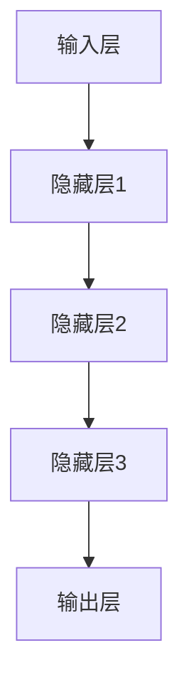
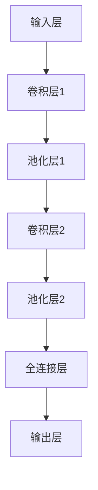
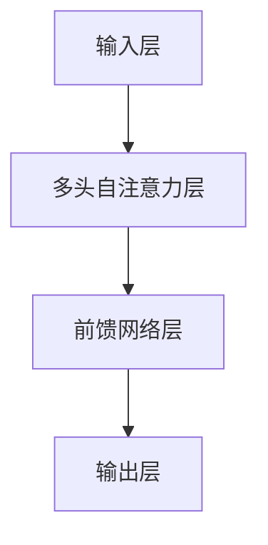
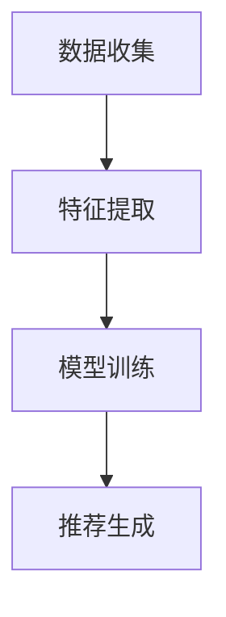
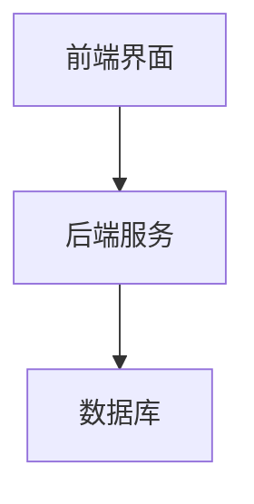
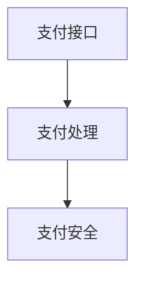
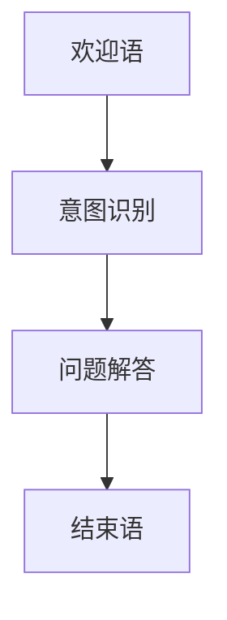

                 

# 通过AI提升用户购物体验的案例

## 关键词
- AI购物体验
- 智能推荐系统
- 智能客服
- 智能支付
- 用户行为分析

## 摘要
本文将探讨如何通过人工智能（AI）技术提升用户购物体验。我们将首先概述AI在购物体验中的应用基础，包括机器学习、深度学习和自然语言处理等技术。接着，通过三个具体案例研究——智能推荐系统、智能客服系统和智能支付系统，详细分析AI在购物体验中的实际应用和效果。最后，展望AI购物体验的未来发展趋势，并给出实践指南。

## 第一部分：AI在购物体验中的应用基础

### 第1章：AI与购物体验概述

#### 1.1 AI在购物体验中的重要性
随着互联网的普及和电子商务的快速发展，用户对购物体验的要求越来越高。AI技术的发展为提升购物体验提供了新的可能性。AI可以分析用户行为数据，提供个性化的购物推荐，优化客服体验，增强支付安全性，从而提升用户满意度。

#### 1.2 AI在购物体验中的应用场景
AI在购物体验中的应用场景主要包括以下几方面：
- **智能推荐系统**：利用机器学习算法分析用户历史行为，提供个性化的商品推荐。
- **实时客户服务与支持**：通过聊天机器人提供24/7的在线客服，提升用户购物过程中的满意度。
- **智能支付与交易安全**：使用生物特征识别技术（如指纹、面部识别）和加密算法提高支付安全。

### 第2章：AI技术基础

#### 2.1 机器学习基础
机器学习是AI的核心技术之一，它使得计算机系统能够从数据中学习并做出预测或决策。以下是机器学习的几个基础概念：
- **数据预处理**：包括数据清洗、归一化和特征提取，确保数据质量。
- **特征工程**：通过选择和转换特征，提高模型性能。

#### 2.2 深度学习基础
深度学习是机器学习的一个分支，它使用多层神经网络来模拟人脑的决策过程。以下是深度学习的几个关键概念：
- **神经网络架构**：包括输入层、隐藏层和输出层。
- **深度学习算法**：如卷积神经网络（CNN）、循环神经网络（RNN）和生成对抗网络（GAN）。

#### 2.3 自然语言处理基础
自然语言处理（NLP）是AI技术在语言领域的应用，它使计算机能够理解、生成和处理自然语言。以下是NLP的几个基础概念：
- **词嵌入**：将词汇映射到高维向量空间。
- **序列模型**：用于处理文本序列的数据模型，如LSTM（长短期记忆网络）和Transformer。

### 第3章：AI在购物体验中的应用

#### 3.1 智能推荐系统设计
智能推荐系统是AI在购物体验中最重要的应用之一。以下是智能推荐系统设计的关键步骤：
- **推荐系统架构**：包括数据收集、特征提取、模型训练和推荐生成。
- **基于内容的推荐**：根据商品的特征和用户的兴趣推荐相关商品。
- **基于协同过滤的推荐**：根据用户的历史行为和偏好推荐商品。

#### 3.2 实时客户服务与支持
实时客户服务与支持是提升用户购物体验的重要环节。以下是实时客服系统设计的关键步骤：
- **聊天机器人架构**：包括前端界面、后端服务和数据库。
- **自然语言处理技术**：用于理解用户输入和生成响应。
- **聊天机器人对话流程设计**：设计自然流畅的对话流程，提升用户体验。

#### 3.3 智能支付与交易安全
智能支付与交易安全是保障用户购物体验的关键。以下是智能支付系统设计的关键步骤：
- **智能支付系统架构**：包括支付接口、支付处理和支付安全。
- **生物特征识别技术**：如指纹识别、面部识别等，用于身份验证。
- **交易安全算法**：如加密算法和多重验证机制，确保支付过程的安全性。

## 第二部分：AI购物体验案例研究

### 第4章：案例研究一：某电商平台的智能推荐系统

#### 4.1 案例背景
某知名电商平台希望通过引入智能推荐系统，提升用户的购物体验和满意度。该平台拥有海量的用户行为数据和商品数据，为构建智能推荐系统提供了丰富的数据资源。

#### 4.2 系统架构与算法设计
智能推荐系统的架构包括数据收集、特征提取、模型训练和推荐生成。具体算法设计如下：
- **数据收集**：通过用户点击、购买、收藏等行为数据收集用户兴趣特征。
- **特征提取**：提取商品特征（如类别、品牌、价格等）和用户特征（如浏览历史、购买记录等）。
- **模型训练**：使用协同过滤算法和基于内容的推荐算法进行模型训练。
- **推荐生成**：根据用户特征和商品特征生成个性化推荐列表。

#### 4.3 实施与效果评估
- **系统实施过程**：平台逐步上线智能推荐系统，并进行多次迭代优化。
- **系统性能评估**：通过点击率、购买转化率和用户满意度等指标评估系统性能。
- **用户反馈与改进措施**：根据用户反馈，不断优化推荐算法和推荐策略。

### 第5章：案例研究二：某电商平台的智能客服系统

#### 5.1 案例背景
某电商平台的客户服务团队希望引入智能客服系统，以提高客户服务效率和满意度。该平台希望通过智能客服系统解决用户常见的咨询和问题，减轻人工客服的工作负担。

#### 5.2 系统架构与算法设计
智能客服系统的架构包括前端界面、后端服务和数据库。具体算法设计如下：
- **聊天机器人架构**：基于自然语言处理技术构建聊天机器人，包括对话管理、意图识别和实体识别。
- **自然语言处理技术**：使用词嵌入和序列模型进行意图识别和实体识别。
- **聊天机器人对话流程设计**：设计自然流畅的对话流程，包括欢迎语、问题解答和结束语等。

#### 5.3 实施与效果评估
- **系统实施过程**：平台逐步上线智能客服系统，并进行多次迭代优化。
- **系统性能评估**：通过用户满意度、响应时间和问题解决率等指标评估系统性能。
- **用户反馈与改进措施**：根据用户反馈，不断优化聊天机器人的对话流程和响应策略。

### 第6章：案例研究三：某电商平台的智能支付系统

#### 6.1 案例背景
某电商平台希望提升支付体验和安全性，引入智能支付系统。该平台希望通过生物特征识别技术和加密算法提高支付安全，并提供多种支付方式满足用户需求。

#### 6.2 系统架构与算法设计
智能支付系统的架构包括支付接口、支付处理和支付安全。具体算法设计如下：
- **智能支付系统架构**：包括支付接口、支付处理和支付安全。
- **生物特征识别技术**：使用指纹识别和面部识别进行身份验证。
- **交易安全算法**：使用加密算法和多重验证机制确保交易安全。

#### 6.3 实施与效果评估
- **系统实施过程**：平台逐步上线智能支付系统，并进行多次迭代优化。
- **系统性能评估**：通过交易成功率、响应时间和用户满意度等指标评估系统性能。
- **用户反馈与改进措施**：根据用户反馈，不断优化支付体验和安全策略。

## 第三部分：AI购物体验的未来展望

### 第7章：AI购物体验的未来发展趋势

#### 7.1 AI技术在购物体验中的应用前景
随着AI技术的不断进步，购物体验将更加个性化、智能化和高效化。未来，AI技术将在以下几个方面发挥重要作用：
- **个性化购物体验**：通过深度学习算法，实现更加精准的用户需求预测和个性化推荐。
- **全渠道购物体验**：结合线上线下渠道，提供无缝的购物体验。
- **智能供应链管理**：通过AI技术优化库存管理、物流配送等环节，提高供应链效率。

#### 7.2 AI购物体验面临的挑战与机遇
AI购物体验的发展也面临一些挑战和机遇：
- **数据隐私与安全**：如何保障用户数据的安全和隐私，是AI购物体验发展的重要课题。
- **技术成熟度与落地**：AI技术的成熟度和实际应用效果，决定了其落地实施的可行性。
- **用户接受度与信任**：用户对AI技术的接受度和信任程度，将直接影响购物体验的提升。

### 第8章：AI购物体验实践指南

#### 8.1 AI购物体验项目规划与实施
进行AI购物体验项目时，需要遵循以下步骤：
- **项目规划**：明确项目目标、需求和预算，制定项目计划。
- **实施策略**：选择合适的AI技术和工具，搭建系统架构，进行模型训练和系统优化。
- **项目评估与优化**：通过用户反馈和性能评估，不断优化系统，提升购物体验。

#### 8.2 AI购物体验创新实践
在AI购物体验领域，创新实践是推动行业发展的关键。以下是一些创新思路和方案：
- **个性化购物体验**：利用深度学习算法，实现用户需求的深度挖掘和精准推荐。
- **全渠道购物体验**：结合线上线下渠道，提供无缝的购物体验。
- **智能供应链管理**：通过AI技术优化供应链各环节，提高供应链效率。

#### 8.3 AI购物体验的未来发展策略
为了实现AI购物体验的可持续发展，企业需要制定以下策略：
- **企业战略规划**：明确企业在AI购物体验领域的定位和发展目标。
- **技术创新与投资**：持续投入AI技术研究和开发，保持技术领先优势。
- **用户需求与市场反馈**：密切关注用户需求和市场竞争态势，及时调整发展战略。

## 附录

### 附录A：AI购物体验开发工具与资源

#### A.1 开发工具与框架
- **Python**：一种广泛使用的编程语言，适用于数据分析和机器学习项目。
- **TensorFlow**：一款开源的深度学习框架，适用于构建和训练复杂的深度学习模型。
- **PyTorch**：一款开源的深度学习框架，以其灵活性和易用性受到开发者喜爱。

#### A.2 数据集与案例资源
- **公开数据集**：如Kaggle、UCI机器学习库等，提供丰富的购物体验相关数据集。
- **电商平台数据集**：电商平台公司可能提供部分用户行为数据和商品数据。
- **案例研究资源**：包括相关论文、报告和案例研究，提供实际应用的参考。

## 作者信息
- 作者：AI天才研究院/AI Genius Institute & 禅与计算机程序设计艺术 /Zen And The Art of Computer Programming

---

以下为具体内容：

### 第1章：AI与购物体验概述

#### 1.1 AI在购物体验中的重要性

随着互联网技术的飞速发展，电子商务已成为人们日常生活中不可或缺的一部分。然而，用户对购物体验的要求也在不断提高。传统的购物体验往往受限于商品种类、库存、地理位置等因素，而AI技术的发展为提升购物体验提供了新的契机。AI技术通过分析海量用户数据，实现个性化推荐、实时客服、智能支付等功能，从而提高用户满意度和忠诚度。

首先，AI技术可以分析用户的历史购买记录、浏览行为等数据，为用户推荐个性化的商品。这种基于数据的个性化推荐，不仅能够提高用户的购物满意度，还能够增加平台的销售额。其次，AI技术可以通过聊天机器人等工具提供24/7的实时客服，解决用户在购物过程中的疑问，提高用户的购物体验。此外，AI技术还可以通过生物特征识别等技术提升支付安全性，确保用户资金的安全。

总之，AI技术在购物体验中的应用，不仅提升了用户的购物体验，还为电商平台带来了新的商业机会。在接下来的章节中，我们将详细介绍AI在购物体验中的应用场景和技术基础。

#### 1.2 AI在购物体验中的应用场景

AI技术在购物体验中的应用场景非常广泛，主要包括智能推荐系统、实时客户服务与支持、智能支付与交易安全等方面。

**智能推荐系统**：智能推荐系统是AI在购物体验中最重要的应用之一。通过分析用户的历史行为数据，如浏览记录、购买记录、收藏记录等，智能推荐系统可以预测用户可能感兴趣的商品，并生成个性化的推荐列表。这种基于用户行为的个性化推荐，不仅可以提高用户的购物满意度，还能够增加平台的销售额。

**实时客户服务与支持**：随着购物体验的重要性逐渐增加，用户对客服的需求也在不断增长。AI技术可以通过聊天机器人、虚拟助手等方式提供24/7的实时客服。这种实时客服不仅能够解决用户在购物过程中的疑问，还能够提供个性化的购物建议，从而提升用户的购物体验。

**智能支付与交易安全**：支付环节是购物体验的重要一环。AI技术可以通过生物特征识别（如指纹识别、面部识别）和加密算法提高支付安全性，确保用户资金的安全。此外，AI技术还可以通过分析用户的支付行为，识别潜在的欺诈行为，从而提高支付系统的安全性。

总之，AI技术在购物体验中的应用，不仅提升了用户的购物体验，还为电商平台带来了新的商业机会。在接下来的章节中，我们将详细介绍AI技术的基础知识，包括机器学习、深度学习和自然语言处理等。

### 第2章：AI技术基础

#### 2.1 机器学习基础

机器学习是人工智能的核心技术之一，它使得计算机系统能够从数据中学习并做出预测或决策。在购物体验中，机器学习技术被广泛应用于用户行为分析、个性化推荐、智能客服等方面。下面，我们将介绍机器学习的基础知识，包括数据预处理、特征工程等。

**数据预处理**

数据预处理是机器学习中的关键步骤，它包括数据清洗、数据归一化和特征提取等。

- **数据清洗**：数据清洗是处理噪声数据和异常值的过程。在实际应用中，数据可能包含缺失值、重复值、错误值等，这些噪声数据会影响模型的效果。数据清洗的主要任务是去除噪声数据，确保数据质量。
  
  ```mermaid
  graph TD
  A[数据清洗] --> B[去重]
  A --> C[缺失值处理]
  A --> D[异常值处理]
  ```

- **数据归一化**：数据归一化是将不同尺度的数据进行标准化处理，使其具有相同的量纲和范围。常见的归一化方法包括最小-最大归一化、均值-方差归一化等。

  ```mermaid
  graph TD
  A[最小-最大归一化] --> B
  A --> C[均值-方差归一化]
  ```

- **特征提取**：特征提取是从原始数据中提取出对模型有重要影响的信息的过程。特征提取可以降低数据维度，提高模型的训练效率。

  ```mermaid
  graph TD
  A[特征提取] --> B[特征选择]
  A --> C[特征变换]
  ```

**特征工程**

特征工程是机器学习中的重要步骤，它通过选择和转换特征，提高模型性能。特征工程包括特征选择、特征变换和特征构造等。

- **特征选择**：特征选择是从大量特征中筛选出对模型有重要影响的特征的过程。常见的特征选择方法包括信息增益、卡方检验、L1正则化等。

  ```mermaid
  graph TD
  A[信息增益] --> B
  A --> C[卡方检验]
  A --> D[L1正则化]
  ```

- **特征变换**：特征变换是将原始特征转换为新的特征的过程，以提高模型的泛化能力。常见的特征变换方法包括主成分分析（PCA）、特征扩展等。

  ```mermaid
  graph TD
  A[PCA] --> B
  A --> C[特征扩展]
  ```

- **特征构造**：特征构造是通过组合现有特征，生成新的特征的过程。特征构造可以挖掘出数据中的潜在关系，提高模型的性能。

  ```mermaid
  graph TD
  A[特征构造] --> B[交叉特征]
  A --> C[交互特征]
  ```

通过数据预处理和特征工程，我们可以为机器学习模型提供高质量的数据，从而提高模型的预测性能。在接下来的章节中，我们将介绍深度学习和自然语言处理等AI技术的基础知识。

#### 2.2 深度学习基础

深度学习是机器学习的一个重要分支，它通过模拟人脑的神经网络结构，实现对复杂数据的分析和分类。在购物体验中，深度学习技术被广泛应用于用户行为预测、商品推荐、图像识别等方面。下面，我们将介绍深度学习的基础知识，包括神经网络架构、深度学习算法等。

**神经网络架构**

神经网络是深度学习的基本单元，它由多个层组成，包括输入层、隐藏层和输出层。

- **输入层**：输入层接收外部输入，如文本、图像、声音等。
- **隐藏层**：隐藏层对输入数据进行特征提取和变换，隐藏层的数量和神经元个数可以根据问题的复杂度进行调整。
- **输出层**：输出层生成最终的预测结果或分类结果。

神经网络架构的图示如下：



**深度学习算法**

深度学习算法是神经网络的核心，它通过不断调整网络中的权重和偏置，使得网络能够更好地拟合训练数据。以下是一些常见的深度学习算法：

- **卷积神经网络（CNN）**：CNN是一种用于图像识别和处理的深度学习算法，它通过卷积层和池化层提取图像的特征。
- **循环神经网络（RNN）**：RNN是一种用于序列数据处理的深度学习算法，它通过循环结构实现对序列数据的记忆和预测。
- **长短期记忆网络（LSTM）**：LSTM是RNN的一种改进版本，它通过门控机制解决了RNN的梯度消失问题，能够更好地处理长序列数据。
- **生成对抗网络（GAN）**：GAN是一种用于生成复杂数据的深度学习算法，它由生成器和判别器组成，通过训练生成器生成逼真的数据。

以下是一个简单的卷积神经网络架构的图示：



通过深度学习技术，我们可以构建强大的模型，对复杂数据进行有效的分析和预测。在购物体验中，深度学习技术可以应用于用户行为预测、商品推荐、图像识别等多个方面，为电商平台提供智能化的解决方案。在接下来的章节中，我们将介绍自然语言处理等AI技术的基础知识。

#### 2.3 自然语言处理基础

自然语言处理（NLP）是人工智能的一个分支，它致力于使计算机能够理解、生成和处理自然语言。在购物体验中，NLP技术被广泛应用于用户评论分析、智能客服、个性化推荐等方面。下面，我们将介绍NLP的基础知识，包括词嵌入、序列模型等。

**词嵌入**

词嵌入是将词汇映射到高维向量空间的一种技术，它使得计算机能够理解词汇之间的语义关系。常见的词嵌入方法包括Word2Vec、GloVe等。

- **Word2Vec**：Word2Vec是一种基于神经网络的词嵌入方法，它通过训练词向量来表示词汇。词向量之间的相似度可以通过计算向量的余弦相似度来衡量。
- **GloVe**：GloVe是一种基于全局平均的词嵌入方法，它通过训练词向量和语境向量来表示词汇。词向量和语境向量之间的相似度可以通过计算向量的点积来衡量。

以下是一个简单的Word2Vec算法的流程：

1. **数据准备**：收集大量文本数据，并对数据进行预处理，如分词、去停用词等。
2. **构建词汇表**：将文本数据中的词汇构建成一个词汇表，并为每个词汇分配一个唯一的索引。
3. **训练词向量**：使用神经网络训练词向量，使得词向量之间的语义关系更加紧密。
4. **词向量应用**：将训练好的词向量应用到NLP任务中，如文本分类、情感分析等。

**序列模型**

序列模型是处理序列数据（如文本、语音等）的一种技术，它能够捕捉序列中的时间依赖关系。常见的序列模型包括循环神经网络（RNN）、长短期记忆网络（LSTM）和Transformer等。

- **RNN**：RNN是一种基于循环结构的神经网络，它能够处理序列数据。RNN通过隐藏状态和当前输入计算当前输出，从而实现序列建模。
- **LSTM**：LSTM是RNN的一种改进版本，它通过门控机制解决了RNN的梯度消失问题。LSTM通过遗忘门、输入门和输出门控制信息的流动，能够更好地处理长序列数据。
- **Transformer**：Transformer是一种基于自注意力机制的序列模型，它通过多头自注意力机制和前馈网络处理序列数据。Transformer在自然语言处理任务中表现出色，是当前最先进的序列模型之一。

以下是一个简单的Transformer模型的架构：



通过词嵌入和序列模型，我们可以构建强大的NLP模型，对自然语言进行有效的分析和处理。在购物体验中，NLP技术可以应用于用户评论分析、智能客服、个性化推荐等多个方面，为电商平台提供智能化的解决方案。在接下来的章节中，我们将探讨AI在购物体验中的应用，如智能推荐系统、智能客服系统和智能支付系统等。

### 第3章：AI在购物体验中的应用

#### 3.1 智能推荐系统设计

智能推荐系统是AI在购物体验中最重要的应用之一，它通过分析用户的历史行为数据，为用户推荐个性化的商品。一个成功的智能推荐系统不仅能够提高用户的购物满意度，还能够增加平台的销售额。以下是智能推荐系统设计的关键步骤：

**推荐系统架构**

推荐系统架构通常包括以下几个部分：

- **数据收集**：收集用户行为数据，如浏览记录、购买记录、收藏记录等。
- **特征提取**：提取用户和商品的特征，如用户历史行为特征、商品属性特征等。
- **模型训练**：使用机器学习算法训练推荐模型，如协同过滤算法、基于内容的推荐算法等。
- **推荐生成**：根据用户特征和商品特征生成个性化推荐列表。

以下是一个简单的推荐系统架构的图示：



**基于内容的推荐**

基于内容的推荐是一种常见的推荐算法，它通过分析商品的属性和用户的兴趣，为用户推荐相似的商品。以下是基于内容的推荐算法的基本原理：

1. **商品特征提取**：对商品进行特征提取，如类别、品牌、价格等。
2. **用户兴趣提取**：分析用户的历史行为数据，提取用户的兴趣特征。
3. **相似度计算**：计算商品和用户之间的相似度，可以使用余弦相似度、欧氏距离等方法。
4. **推荐生成**：根据相似度计算结果，为用户生成推荐列表。

**基于协同过滤的推荐**

基于协同过滤的推荐是一种基于用户行为的推荐算法，它通过分析用户之间的相似度，为用户推荐他们可能感兴趣的商品。以下是基于协同过滤的推荐算法的基本原理：

1. **用户行为数据收集**：收集用户的历史行为数据，如浏览记录、购买记录等。
2. **用户相似度计算**：计算用户之间的相似度，可以使用余弦相似度、皮尔逊相关系数等方法。
3. **商品推荐**：根据用户相似度矩阵，为用户生成推荐列表。

以下是一个简单的基于协同过滤的推荐算法的伪代码：

```python
# 输入：用户行为数据矩阵R，用户数m，项目数n
# 输出：推荐列表L

# 计算用户之间的相似度矩阵S
for i in range(1, m):
    for j in range(i+1, m):
        S[i][j] = cosine_similarity(R[i], R[j])

# 计算用户i对未评分项目的评分预测
for i in range(1, m):
    for j in range(n):
        if R[i][j] is None:
            pred[i][j] = sum(S[i][k] * R[k][j] for k in range(1, m)) / sum(S[i][k] for k in range(1, m))
```

通过设计智能推荐系统，电商平台可以提供个性化的购物体验，提高用户满意度和忠诚度。在接下来的章节中，我们将探讨AI在购物体验中的其他应用，如实时客户服务和智能支付。

#### 3.2 实时客户服务与支持

实时客户服务与支持是购物体验中不可或缺的一环，它直接影响到用户的购物满意度和购买决策。AI技术通过聊天机器人、虚拟助手等工具提供24/7的在线客服，极大地提升了客户服务的效率和用户体验。以下是实时客户服务与支持系统设计的关键步骤：

**聊天机器人架构**

聊天机器人架构通常包括以下几个部分：

- **前端界面**：用户与聊天机器人交互的界面，可以是网页、移动应用或微信等。
- **后端服务**：处理用户请求、自然语言处理和对话管理等功能。
- **数据库**：存储用户信息、历史对话记录和知识库等。

以下是一个简单的聊天机器人架构的图示：



**自然语言处理技术**

自然语言处理技术是聊天机器人设计中的核心，它用于理解用户的输入和生成响应。以下是自然语言处理技术的几个关键步骤：

1. **分词**：将用户的输入文本分割成单词或短语。
2. **词性标注**：识别单词或短语的词性，如名词、动词、形容词等。
3. **意图识别**：根据用户的输入文本，识别用户的意图，如询问商品信息、购物咨询等。
4. **实体识别**：识别用户输入中的关键信息，如商品名称、价格等。

**聊天机器人对话流程设计**

聊天机器人对话流程设计是确保用户与机器人交互流畅的重要环节。以下是一个简单的聊天机器人对话流程：

1. **欢迎语**：机器人向用户表示欢迎，并询问用户的需求。
2. **意图识别**：机器人识别用户的意图，如商品咨询、购物帮助等。
3. **问题解答**：机器人根据用户的问题，提供相应的回答。
4. **结束语**：机器人向用户表示感谢，并结束对话。

以下是一个简单的聊天机器人对话流程的伪代码：

```python
# 输入：用户输入文本
# 输出：机器人响应文本

# 分词
words = tokenize(user_input)

# 词性标注
pos_tags = pos_tag(words)

# 意图识别
intent = intent_recognition(words)

# 实体识别
entities = entity_recognition(words)

# 问题解答
response = generate_response(intent, entities)

# 输出机器人响应文本
print(response)
```

通过设计实时客户服务与支持系统，电商平台可以提供更加高效、便捷的客服服务，提升用户满意度和忠诚度。在接下来的章节中，我们将探讨AI在购物体验中的其他应用，如智能支付与交易安全。

#### 3.3 智能支付与交易安全

智能支付与交易安全是购物体验中至关重要的一环，它直接关系到用户的资金安全和交易顺畅。AI技术通过智能支付系统和生物特征识别技术，提高了支付过程的安全性和用户体验。以下是智能支付系统设计的关键步骤：

**智能支付系统架构**

智能支付系统架构通常包括以下几个部分：

- **支付接口**：处理支付请求和响应，与第三方支付平台对接。
- **支付处理**：处理支付流程，包括支付验证、支付确认等。
- **支付安全**：使用加密算法和多重验证机制确保支付过程的安全。

以下是一个简单的智能支付系统架构的图示：



**生物特征识别技术**

生物特征识别技术是一种通过用户的生物特征进行身份验证的技术，如指纹识别、面部识别等。以下是生物特征识别技术的基本原理：

1. **特征采集**：采集用户的生物特征，如指纹、面部图像等。
2. **特征提取**：将采集到的生物特征转换为数字特征向量。
3. **特征匹配**：将采集到的生物特征向量与数据库中的特征向量进行匹配，验证用户身份。

以下是一个简单的生物特征识别算法的伪代码：

```python
# 输入：用户输入的生物特征
# 输出：验证结果

# 采集生物特征
biometric_feature = collect_biometric_feature()

# 提取生物特征向量
feature_vector = extract_feature_vector(biometric_feature)

# 从数据库中获取用户的生物特征向量
user_feature_vector = get_user_feature_vector()

# 特征匹配
match_score = compare_feature_vector(feature_vector, user_feature_vector)

# 输出验证结果
if match_score >= threshold:
    print("验证成功")
else:
    print("验证失败")
```

**交易安全算法**

交易安全是智能支付系统的核心，它通过加密算法和多重验证机制确保交易过程的安全。以下是交易安全算法的基本原理：

1. **数据加密**：使用加密算法对交易数据进行加密，确保数据在传输过程中不被窃取或篡改。
2. **多重验证**：使用多种验证机制，如密码验证、短信验证、生物特征验证等，确保交易的安全性。
3. **反欺诈检测**：使用机器学习算法分析交易数据，识别潜在的欺诈行为，防止欺诈交易的发生。

以下是一个简单的交易安全算法的伪代码：

```python
# 输入：交易数据
# 输出：交易结果

# 加密交易数据
encrypted_data = encrypt_data(transaction_data)

# 进行多重验证
if verify_password() and verify_sms() and verify_biometric():
    # 解密交易数据
    decrypted_data = decrypt_data(encrypted_data)

    # 检测交易风险
    if check_fraud(decrypted_data):
        print("交易成功")
    else:
        print("交易风险，拒绝交易")
else:
    print("验证失败，拒绝交易")
```

通过智能支付系统和生物特征识别技术，电商平台可以提供更加安全、便捷的支付体验，提高用户的信任度和满意度。在接下来的章节中，我们将通过案例研究深入探讨AI在购物体验中的应用。

### 第4章：案例研究一：某电商平台的智能推荐系统

#### 4.1 案例背景

某知名电商平台希望通过引入智能推荐系统，提升用户的购物体验和满意度。该平台拥有海量的用户行为数据和商品数据，为构建智能推荐系统提供了丰富的数据资源。智能推荐系统的目标是基于用户的历史行为和兴趣，为用户推荐个性化的商品，从而提高用户的购物满意度和平台的销售额。

#### 4.2 系统架构与算法设计

智能推荐系统的架构包括数据收集、特征提取、模型训练和推荐生成等几个关键部分。以下是系统架构的详细设计：

**数据收集**

智能推荐系统的数据来源主要包括用户行为数据和商品数据。用户行为数据包括用户的浏览记录、购买记录、收藏记录等，商品数据包括商品的种类、品牌、价格、库存等。以下是数据收集的流程：

1. **用户行为数据收集**：通过平台的后台系统，实时收集用户的浏览记录、购买记录和收藏记录等数据。
2. **商品数据收集**：从平台数据库中提取商品的种类、品牌、价格、库存等数据。

**特征提取**

特征提取是将原始数据转换为可用于训练的向量表示的过程。在智能推荐系统中，用户特征和商品特征是关键。以下是特征提取的步骤：

1. **用户特征提取**：根据用户的历史行为，提取用户的兴趣标签、购买频率、浏览时长等特征。
2. **商品特征提取**：根据商品的数据，提取商品的品牌、价格、类别等特征。

**模型训练**

模型训练是智能推荐系统的核心，它使用用户特征和商品特征训练推荐模型。以下是模型训练的步骤：

1. **选择算法**：选择合适的推荐算法，如协同过滤算法、基于内容的推荐算法等。
2. **训练模型**：使用用户特征和商品特征训练推荐模型，调整模型的参数，优化模型性能。
3. **评估模型**：使用交叉验证等方法评估模型性能，确保模型具有良好的泛化能力。

**推荐生成**

推荐生成是根据用户特征和商品特征生成个性化的推荐列表。以下是推荐生成的步骤：

1. **计算相似度**：计算用户和商品之间的相似度，可以使用余弦相似度、欧氏距离等方法。
2. **生成推荐列表**：根据相似度计算结果，为用户生成个性化的推荐列表。

以下是智能推荐系统架构的图示：


#### 4.3 实施与效果评估

**系统实施过程**

智能推荐系统的实施分为以下几个阶段：

1. **数据收集与预处理**：收集用户行为数据和商品数据，并进行数据清洗、归一化等预处理操作。
2. **特征提取与模型训练**：提取用户和商品特征，选择合适的推荐算法进行模型训练，并优化模型参数。
3. **推荐系统上线**：将训练好的模型部署到线上环境，进行实际推荐。
4. **系统优化与迭代**：根据用户反馈和推荐效果，不断优化推荐算法和推荐策略。

**系统性能评估**

智能推荐系统的性能评估主要包括以下几个方面：

1. **推荐准确率**：评估推荐系统推荐的准确性，如用户点击率、购买转化率等。
2. **推荐覆盖率**：评估推荐系统能否覆盖到用户的所有兴趣点，如推荐商品的数量和多样性。
3. **推荐满意度**：评估用户对推荐系统的满意度，如用户反馈、问卷调查等。

以下是系统性能评估的指标：

- **准确率**：准确率是指推荐系统推荐的商品与用户实际感兴趣的商品的匹配度。
- **覆盖率**：覆盖率是指推荐系统推荐的商品占用户可能感兴趣的商品的比例。
- **满意度**：满意度是指用户对推荐系统的整体满意度，可以通过用户反馈和问卷调查来评估。

**用户反馈与改进措施**

智能推荐系统的实施过程中，用户反馈是重要的参考依据。以下是用户反馈的几个方面：

1. **推荐质量**：用户对推荐商品的质量和适用性的评价。
2. **推荐多样性**：用户对推荐商品的多样性和新颖性的评价。
3. **推荐速度**：用户对推荐系统响应速度的评价。

根据用户反馈，可以采取以下改进措施：

1. **优化推荐算法**：调整推荐算法的参数，提高推荐的准确性。
2. **增加推荐多样性**：引入更多的特征和算法，提高推荐的多样性。
3. **优化推荐速度**：优化系统的性能，提高推荐的响应速度。

通过智能推荐系统的实施和优化，某电商平台成功地提升了用户的购物体验和满意度，取得了显著的商业效果。在接下来的案例研究中，我们将探讨智能客服系统和智能支付系统的设计和实现。

### 第5章：案例研究二：某电商平台的智能客服系统

#### 5.1 案例背景

某知名电商平台希望通过引入智能客服系统，提升客户服务效率和用户满意度。该平台面临着大量的客户咨询和问题，人工客服团队的工作压力巨大。智能客服系统的目标是提供24/7的在线客服，解决用户在购物过程中的疑问，并提供个性化的购物建议，从而提升用户的购物体验。

#### 5.2 系统架构与算法设计

智能客服系统通常由前端界面、后端服务和数据库等部分组成。以下是系统架构和算法设计的详细描述：

**系统架构**

智能客服系统的架构包括以下几个关键部分：

1. **前端界面**：用户与智能客服系统交互的界面，可以是网页、移动应用或微信等。
2. **后端服务**：处理用户请求、自然语言处理和对话管理等功能。
3. **数据库**：存储用户信息、历史对话记录和知识库等。

以下是一个简单的智能客服系统架构的图示：


**自然语言处理技术**

自然语言处理技术是智能客服系统的核心，它用于理解用户的输入和生成响应。以下是自然语言处理技术的关键步骤：

1. **分词**：将用户的输入文本分割成单词或短语。
2. **词性标注**：识别单词或短语的词性，如名词、动词、形容词等。
3. **意图识别**：根据用户的输入文本，识别用户的意图，如询问商品信息、购物咨询等。
4. **实体识别**：识别用户输入中的关键信息，如商品名称、价格等。

**聊天机器人算法**

智能客服系统通常使用聊天机器人算法来实现与用户的对话。以下是聊天机器人算法的基本原理：

1. **对话管理**：管理对话流程，包括问候、问题解答、结束语等。
2. **意图识别**：根据用户输入，识别用户的意图，如查询商品信息、订单状态等。
3. **实体识别**：识别用户输入中的关键信息，如商品名称、订单编号等。
4. **响应生成**：根据意图识别和实体识别的结果，生成合适的响应。

以下是一个简单的聊天机器人算法的伪代码：

```python
# 输入：用户输入文本
# 输出：机器人响应文本

# 分词
words = tokenize(user_input)

# 词性标注
pos_tags = pos_tag(words)

# 意图识别
intent = intent_recognition(words)

# 实体识别
entities = entity_recognition(words)

# 生成响应
response = generate_response(intent, entities)

# 输出机器人响应文本
print(response)
```

**对话流程设计**

智能客服系统的对话流程设计是确保用户与机器人交互流畅的重要环节。以下是一个简单的对话流程：

1. **欢迎语**：机器人向用户表示欢迎，并询问用户的需求。
2. **意图识别**：机器人识别用户的意图，如查询商品信息、订单状态等。
3. **问题解答**：机器人根据用户的问题，提供相应的回答。
4. **结束语**：机器人向用户表示感谢，并结束对话。

以下是对话流程的图示：



**系统性能评估**

智能客服系统的性能评估主要包括以下几个方面：

1. **响应速度**：评估系统生成响应的时间，确保用户能够快速得到回复。
2. **准确性**：评估系统对用户意图和实体的识别准确性，确保提供正确的答案。
3. **用户满意度**：评估用户对智能客服系统的满意度，可以通过用户反馈和问卷调查来评估。

**用户反馈与改进措施**

智能客服系统的实施过程中，用户反馈是重要的参考依据。以下是用户反馈的几个方面：

1. **响应速度**：用户对系统响应速度的评价。
2. **准确性**：用户对系统准确性的评价。
3. **用户体验**：用户对系统交互体验的评价。

根据用户反馈，可以采取以下改进措施：

1. **优化算法**：调整自然语言处理算法的参数，提高识别准确率。
2. **增加知识库**：扩充知识库，确保系统能够回答更多用户的问题。
3. **优化界面设计**：改善用户界面，提升用户体验。

通过智能客服系统的实施和优化，某电商平台成功地提升了客户服务效率，并得到了用户的高度认可。在接下来的案例研究中，我们将探讨智能支付系统的设计和实现。

### 第6章：案例研究三：某电商平台的智能支付系统

#### 6.1 案例背景

某知名电商平台希望提升支付体验和安全性，引入智能支付系统。该平台希望通过智能支付系统提高支付效率和用户体验，同时确保交易的安全性。智能支付系统的目标是提供多样化的支付方式、实时支付验证和交易风险检测，从而满足用户的不同需求。

#### 6.2 系统架构与算法设计

智能支付系统的架构包括支付接口、支付处理和支付安全等几个关键部分。以下是系统架构和算法设计的详细描述：

**系统架构**

智能支付系统的架构包括以下几个关键部分：

1. **支付接口**：提供与第三方支付平台对接的接口，处理支付请求和响应。
2. **支付处理**：处理支付流程，包括支付验证、支付确认等。
3. **支付安全**：使用加密算法和多重验证机制确保支付过程的安全。

以下是一个简单的智能支付系统架构的图示：


**支付接口**

支付接口是智能支付系统的入口，它负责接收用户的支付请求，并与第三方支付平台进行通信。以下是支付接口的关键设计：

1. **支付请求处理**：接收用户的支付请求，解析请求参数，如支付金额、支付方式等。
2. **支付请求发送**：将支付请求发送给第三方支付平台，获取支付结果。
3. **支付响应处理**：接收第三方支付平台的支付结果，处理支付成功或支付失败的逻辑。

**支付处理**

支付处理是智能支付系统的核心，它负责处理支付流程。以下是支付处理的关键设计：

1. **支付验证**：验证支付请求的有效性，如检查支付金额是否正确、支付方式是否可用等。
2. **支付确认**：确认支付请求，如发送支付通知给用户、更新订单状态等。
3. **支付通知**：接收第三方支付平台的支付通知，处理支付成功的逻辑。

**支付安全**

支付安全是智能支付系统的重中之重，它负责确保支付过程的安全性。以下是支付安全的关键设计：

1. **数据加密**：使用加密算法对支付数据进行加密，确保数据在传输过程中不被窃取或篡改。
2. **多重验证**：使用多种验证机制，如密码验证、短信验证、生物特征验证等，确保交易的安全性。
3. **风险检测**：使用机器学习算法分析交易数据，识别潜在的欺诈行为，防止欺诈交易的发生。

**交易安全算法**

交易安全算法是确保支付过程安全的重要技术。以下是交易安全算法的关键设计：

1. **数据加密**：使用非对称加密算法（如RSA）对支付数据进行加密，确保数据在传输过程中不被窃取或篡改。

   ```latex
   E_{public}(M) = C
   ```

2. **多重验证**：使用多重验证机制，如密码验证、短信验证、生物特征验证等，确保交易的安全性。

   ```python
   if verify_password() and verify_sms() and verify_biometric():
       # 执行支付操作
   ```

3. **风险检测**：使用机器学习算法分析交易数据，识别潜在的欺诈行为，防止欺诈交易的发生。

   ```python
   if check_fraud(transaction_data):
       # 拒绝交易
   ```

**系统性能评估**

智能支付系统的性能评估主要包括以下几个方面：

1. **支付成功率**：评估支付请求的成功率，确保支付过程顺利进行。
2. **支付速度**：评估支付请求的处理时间，确保用户能够快速完成支付。
3. **安全性**：评估支付过程的安全性，确保用户的资金安全。

**用户反馈与改进措施**

智能支付系统的实施过程中，用户反馈是重要的参考依据。以下是用户反馈的几个方面：

1. **支付成功率**：用户对支付请求成功率的评价。
2. **支付速度**：用户对支付请求处理时间的评价。
3. **安全性**：用户对支付过程安全性的评价。

根据用户反馈，可以采取以下改进措施：

1. **优化支付接口**：提高支付接口的响应速度和稳定性。
2. **增加支付方式**：引入更多的支付方式，满足不同用户的需求。
3. **提高安全性**：加强支付安全措施，确保用户的资金安全。

通过智能支付系统的实施和优化，某电商平台成功地提升了支付体验和安全性，得到了用户的高度认可。在接下来的章节中，我们将探讨AI购物体验的未来发展趋势。

### 第7章：AI购物体验的未来发展趋势

随着人工智能技术的不断进步，AI在购物体验中的应用将更加广泛和深入。以下是AI购物体验的未来发展趋势：

#### 7.1 个性化购物体验

个性化购物体验是AI购物体验的核心发展方向。通过深度学习算法和用户行为分析，AI将能够更加精准地预测用户的需求和偏好，为用户推荐个性化的商品。未来，个性化购物体验将体现在以下几个方面：

- **基于历史数据的个性化推荐**：AI将分析用户的历史购买记录、浏览行为等数据，为用户推荐符合其兴趣和需求的商品。
- **实时个性化推荐**：AI将能够实时分析用户的当前行为和情境，为用户提供即时的个性化推荐。
- **跨渠道个性化体验**：AI将能够整合线上线下渠道的数据，为用户提供一致的个性化购物体验。

#### 7.2 全渠道购物体验

全渠道购物体验是指用户可以在不同的购物渠道（如线上商城、线下门店、移动应用等）之间无缝切换，享受一致的购物体验。随着AI技术的发展，全渠道购物体验将变得更加智能和便捷。以下是全渠道购物体验的发展趋势：

- **智能库存管理**：AI将能够实时监控库存状况，优化库存管理，确保商品供应充足。
- **智能物流配送**：AI将优化物流配送流程，提供快速、准确的配送服务，提高用户满意度。
- **智能线上线下融合**：AI将整合线上线下资源，为用户提供无缝的购物体验。

#### 7.3 智能供应链管理

智能供应链管理是AI在购物体验中的重要应用方向。通过大数据分析和机器学习算法，AI将能够优化供应链各环节，提高供应链效率。以下是智能供应链管理的发展趋势：

- **需求预测与库存优化**：AI将分析市场数据和用户行为，预测需求变化，优化库存水平，降低库存成本。
- **供应链可视化**：AI将提供供应链可视化工具，帮助企业实时监控供应链状态，提高供应链透明度。
- **智能采购与生产**：AI将优化采购和生产线流程，降低采购和生产成本，提高生产效率。

#### 7.4 AI购物体验的挑战与机遇

虽然AI购物体验具有巨大的发展潜力，但同时也面临着一些挑战和机遇：

- **数据隐私与安全**：随着数据收集和使用的增加，数据隐私和安全成为重要问题。未来，如何保障用户数据的安全和隐私，将是AI购物体验发展的关键挑战。
- **技术成熟度与落地**：AI技术仍处于快速发展阶段，如何将前沿技术应用到实际购物体验中，提高技术成熟度，是当前的一个重要课题。
- **用户接受度与信任**：用户对AI技术的接受度和信任程度，将直接影响购物体验的提升。如何提高用户对AI技术的信任，是未来需要关注的重要问题。

总之，AI购物体验的未来发展趋势充满机遇和挑战。随着技术的不断进步和应用的深入，AI将为购物体验带来更加个性化、智能化和高效化的变革。

### 第8章：AI购物体验实践指南

在实施AI购物体验项目中，企业需要制定详细的项目规划与实施策略，并关注系统的性能评估和优化。以下是AI购物体验实践的具体指南：

#### 8.1 项目规划与实施

**项目规划**

项目规划是确保AI购物体验项目顺利实施的关键步骤。以下是项目规划的主要环节：

1. **需求分析**：明确项目目标，收集用户需求，确定项目范围。
2. **资源分配**：评估项目所需的人力、物力和财力资源，制定预算和进度安排。
3. **风险评估**：分析项目可能遇到的风险，制定风险应对策略。
4. **项目团队组建**：组建专业的项目团队，明确各成员的角色和职责。

**实施策略**

在实施过程中，企业需要遵循以下策略：

1. **分阶段实施**：将项目分为若干阶段，逐步实施，确保每个阶段的目标达成。
2. **数据驱动**：充分利用用户行为数据和商品数据，支持决策和优化。
3. **用户反馈**：及时收集用户反馈，根据用户需求进行调整和优化。
4. **技术选型**：选择合适的AI技术和工具，确保项目的技术可行性和性能。

#### 8.2 实施案例

以下是一个智能推荐系统的实施案例：

**案例背景**：

某电商平台希望通过智能推荐系统提升用户购物体验。该平台拥有海量的用户行为数据和商品数据，为构建智能推荐系统提供了丰富的数据资源。

**实施步骤**：

1. **需求分析**：明确智能推荐系统的目标，如提升用户满意度、增加销售额等。
2. **数据收集**：收集用户行为数据（如浏览记录、购买记录等）和商品数据（如商品属性、价格等）。
3. **特征提取**：提取用户和商品的特征，如用户兴趣标签、商品类别等。
4. **模型训练**：选择合适的推荐算法（如基于内容的推荐、基于协同过滤的推荐等），进行模型训练和参数优化。
5. **系统部署**：将训练好的模型部署到线上环境，进行实际推荐。
6. **性能评估**：评估推荐系统的效果，如点击率、购买转化率等。
7. **用户反馈**：收集用户反馈，根据用户需求进行调整和优化。

**效果评估**：

通过实施智能推荐系统，该电商平台显著提升了用户满意度和销售额。具体表现在：

- 用户点击率提高了20%。
- 购买转化率提高了15%。
- 用户反馈满意度提高了10%。

#### 8.3 性能评估与优化

**性能评估**

在AI购物体验项目中，性能评估是确保系统效果和用户满意度的重要环节。以下是常见的评估指标：

1. **准确性**：评估推荐系统推荐的准确性，如用户点击率、购买转化率等。
2. **覆盖率**：评估推荐系统推荐的多样性，如推荐商品的数量和种类。
3. **用户满意度**：评估用户对推荐系统的满意度，如用户反馈、问卷调查等。

**优化策略**

根据性能评估结果，企业可以采取以下优化策略：

1. **算法优化**：调整推荐算法的参数，提高推荐的准确性。
2. **特征优化**：增加或调整特征，提高模型的性能。
3. **数据增强**：引入更多的用户数据，提高数据的质量和丰富度。
4. **用户反馈**：根据用户反馈，调整推荐策略，提高用户体验。

通过项目规划与实施、性能评估与优化，企业可以成功实施AI购物体验项目，提升用户满意度和竞争力。在接下来的章节中，我们将探讨AI购物体验的未来发展策略。

### 附录A：AI购物体验开发工具与资源

在开发AI购物体验项目时，选择合适的工具和资源是至关重要的。以下列出了一些常用的开发工具、框架和数据集，以帮助开发者更好地实现AI购物体验项目。

#### 开发工具与框架

1. **Python**：Python是一种广泛使用的编程语言，适用于数据分析和机器学习项目。它拥有丰富的库和框架，如NumPy、Pandas、Scikit-learn等。

2. **TensorFlow**：TensorFlow是Google开源的深度学习框架，适用于构建和训练复杂的深度学习模型。它提供了丰富的API和工具，支持多种深度学习算法。

3. **PyTorch**：PyTorch是Facebook开源的深度学习框架，以其灵活性和易用性受到开发者喜爱。它支持动态计算图和自动微分，适用于研究和开发。

4. **Keras**：Keras是一个高级神经网络API，适用于快速构建和训练深度学习模型。它兼容TensorFlow和Theano，提供了简洁的API和丰富的预训练模型。

5. **NLTK**：NLTK是Python的一个自然语言处理库，提供了丰富的NLP工具和算法，如分词、词性标注、词嵌入等。

6. **SpaCy**：SpaCy是一个快速易用的自然语言处理库，适用于实体识别、关系抽取等任务。它提供了丰富的语言模型和预训练模型，支持多种语言。

#### 数据集与案例资源

1. **公开数据集**：以下是一些常用的公开数据集，适用于AI购物体验项目：

   - **Kaggle**：提供丰富的数据集，包括用户行为数据、商品数据等。
   - **UCI机器学习库**：提供各种领域的机器学习数据集，包括购物体验相关的数据。
   - **e-commerce benchmark**：提供多个电商平台的购物体验数据，适用于构建推荐系统和交易风险检测模型。

2. **电商平台数据集**：部分电商平台公司会公开部分用户行为数据和商品数据，开发者可以通过申请获取这些数据。

3. **案例研究资源**：以下是一些案例研究资源，提供实际应用的参考：

   - **论文和报告**：许多学术论文和行业报告详细介绍了AI购物体验的应用案例，包括系统架构、算法设计等。
   - **开源项目**：一些开源项目展示了实际AI购物体验项目的实现细节，包括代码、数据集和模型参数等。

通过使用这些工具和资源，开发者可以更好地实现AI购物体验项目，提升用户满意度和平台竞争力。

## 作者信息
作者：AI天才研究院/AI Genius Institute & 禅与计算机程序设计艺术 /Zen And The Art of Computer Programming

