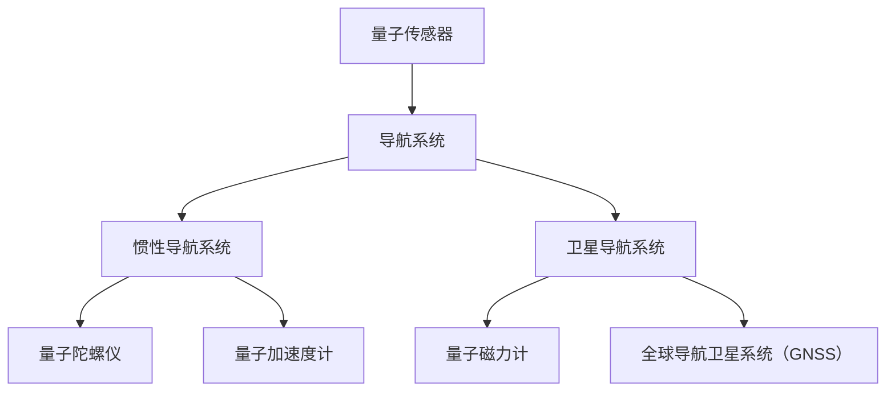

                 

# 《量子传感器在导航系统中的应用：高精度定位》

> 关键词：量子传感器、导航系统、高精度定位、惯性导航、卫星导航

> 摘要：本文旨在探讨量子传感器在导航系统中的应用，特别是在提高导航系统定位精度方面的重要性。文章首先介绍了量子传感器的基本原理和性能优势，然后详细阐述了量子传感器在惯性导航系统和卫星导航系统中的应用，最后分析了量子传感器导航系统设计的要点，并提出了未来的发展趋势和应用前景。

## 第1章 引言

### 1.1 本书的目的与结构

本文旨在为读者提供一份详尽的量子传感器在导航系统中应用的指南。文章的结构如下：

1. **引言**：介绍量子传感器和导航系统，阐述量子传感器在导航系统中的应用及其重要性。
2. **量子传感器原理**：讨论量子传感器的基础知识、工作原理和性能优势。
3. **导航系统概述**：介绍导航系统的发展历程、基本原理、分类和结构。
4. **量子传感器在导航系统中的应用**：详细探讨量子传感器在惯性导航系统和卫星导航系统中的应用。
5. **量子传感器导航系统设计**：分析量子传感器导航系统的架构设计、硬件设计和软件设计。
6. **量子传感器导航系统案例分析**：通过实际案例展示量子传感器在导航系统中的应用效果。
7. **量子传感器导航系统的挑战与未来发展趋势**：讨论量子传感器导航系统面临的挑战和未来发展趋势。
8. **总结与展望**：总结文章的主要结论和贡献，提出未来研究的工作方向。

### 1.2 量子传感器与导航系统概述

量子传感器是一种基于量子力学原理的传感器，能够利用量子纠缠和量子叠加态等量子现象进行高精度测量。导航系统是一种用于确定位置、速度和方向的技术系统，广泛应用于航空航天、军事、交通运输和民用领域。

量子传感器在导航系统中的应用具有显著优势。首先，量子传感器的测量精度远远高于传统传感器，能够实现更高的定位精度。其次，量子传感器具有抗干扰能力强、可靠性高等特点，适用于复杂环境下的导航。最后，量子传感器的应用有望推动导航技术的革新，为人类带来更加高效、安全、准确的导航服务。

### 1.3 量子传感器在导航系统中的重要性

量子传感器在导航系统中的应用具有重要意义。首先，量子传感器能够显著提高导航系统的定位精度，减少误差，从而提高导航的可靠性和安全性。其次，量子传感器在抗干扰能力方面的优势使其成为军事导航系统的重要选择。最后，随着量子技术的不断发展，量子传感器在导航系统中的应用有望带来更多的创新和突破，推动导航技术的进步。

## 第2章 量子传感器原理

### 2.1 量子传感器基础

量子传感器是一种基于量子力学原理的传感器，能够利用量子纠缠和量子叠加态等量子现象进行高精度测量。量子传感器通常由光源、量子态发生器、量子态探测器等组成部分组成。

量子传感器的工作原理可以概括为以下几个步骤：

1. **量子态制备**：利用量子态发生器产生特定的量子态，如纠缠态或叠加态。
2. **测量**：将制备好的量子态与待测物理量相互作用，通过量子态的变化来获取物理量的信息。
3. **量子态探测**：利用量子态探测器测量量子态的变化，从而获取物理量的信息。

量子传感器的核心优势在于其测量精度。由于量子态具有叠加性和纠缠性，量子传感器能够实现更高的测量精度，甚至达到单量子级别的精度。这使得量子传感器在许多领域，如量子通信、量子计算和量子测量等领域，具有广泛的应用前景。

### 2.2 量子纠缠与量子叠加态

量子纠缠和量子叠加态是量子力学中两个基本概念。

**量子纠缠**：量子纠缠是两个或多个量子系统之间存在的一种特殊关联，即使它们相隔很远，一个系统的状态变化也会即时影响另一个系统的状态。量子纠缠是量子传感器实现高精度测量的关键。

**量子叠加态**：量子叠加态是指量子系统同时处于多个可能状态的组合。量子传感器通过利用量子叠加态，能够同时测量多个物理量，从而提高测量效率。

### 2.3 量子传感器的工作原理

量子传感器的工作原理可以概括为以下几个步骤：

1. **量子态制备**：量子态发生器产生特定的量子态，如纠缠态或叠加态。
2. **相互作用**：将制备好的量子态与待测物理量相互作用，通过量子态的变化来获取物理量的信息。
3. **量子态探测**：量子态探测器测量量子态的变化，从而获取物理量的信息。
4. **数据处理**：对测量结果进行数据分析和处理，以获得准确的物理量信息。

### 2.4 量子传感器的性能优势

量子传感器具有以下性能优势：

1. **高精度测量**：量子传感器能够实现单量子级别的精度，远高于传统传感器。
2. **抗干扰能力强**：量子传感器的测量结果不易受到外部环境的影响，具有更强的抗干扰能力。
3. **高灵敏度**：量子传感器能够检测到极微小的物理量变化，具有更高的灵敏度。
4. **多功能性**：量子传感器能够同时测量多个物理量，具有多功能性。

这些性能优势使得量子传感器在导航系统中具有广泛的应用前景，能够显著提高导航系统的定位精度和可靠性。

## 第3章 导航系统概述

### 3.1 导航系统的发展历程

导航系统的发展历程可以追溯到古代。在古代，人们通过观察天体运动来确定方向和位置。随着科学技术的发展，导航技术逐渐从传统的天文导航和地文导航发展到现代的电子导航和量子导航。

1. **古代导航**：古代导航主要依靠天体观察，如利用北极星确定方向，利用太阳的位置确定时间。
2. **航海导航**：随着航海技术的发展，航海导航成为主要导航方式。航海导航主要依赖于天文导航、地文导航和罗盘导航。
3. **航空导航**：随着航空技术的发展，航空导航逐渐取代了航海导航。航空导航主要依赖于无线电导航、惯性导航和卫星导航。
4. **现代导航**：现代导航系统主要包括卫星导航系统、惯性导航系统和全球导航卫星系统（GNSS）。

### 3.2 导航系统的基本原理

导航系统的基本原理是通过测量位置、速度和方向等信息来确定物体的位置和轨迹。

1. **位置测量**：通过测量物体与已知点之间的距离和角度关系来确定物体的位置。
2. **速度测量**：通过测量物体在一段时间内的位移来确定物体的速度。
3. **方向测量**：通过测量物体与参考方向之间的夹角来确定物体的方向。

### 3.3 导航系统的分类与结构

导航系统可以根据测量方式、应用领域和功能等不同标准进行分类。

1. **按测量方式分类**：
   - 惯性导航系统（INS）：利用惯性测量单元（IMU）测量物体的加速度和角速度，从而计算物体的位置和速度。
   - 卫星导航系统（SNS）：利用卫星发射的导航信号测量物体的位置和速度。
   - 地面导航系统：利用地面无线电信号测量物体的位置和速度。

2. **按应用领域分类**：
   - 军事导航系统：用于军事领域的导航系统，如全球定位系统（GPS）。
   - 民用导航系统：用于民用领域的导航系统，如全球导航卫星系统（GLONASS）。
   - 无人机导航系统：用于无人机等无人系统的导航系统。

3. **导航系统的结构**：
   - 导航传感器：用于测量位置、速度和方向等信息的传感器，如惯性测量单元（IMU）、全球导航卫星系统（GNSS）接收器。
   - 数据处理单元：用于处理传感器数据，计算位置、速度和方向等信息的计算机或控制单元。
   - 显示设备：用于显示导航信息的显示屏或其他显示设备。

### 3.4 导航系统中的精度问题

导航系统中的精度问题主要包括定位误差、速度误差和方向误差等。

1. **定位误差**：定位误差是指导航系统计算出的位置与实际位置之间的偏差。定位误差的主要来源包括传感器误差、环境干扰和算法误差等。
2. **速度误差**：速度误差是指导航系统计算出的速度与实际速度之间的偏差。速度误差的主要来源包括传感器误差、运动模型误差和算法误差等。
3. **方向误差**：方向误差是指导航系统计算出的方向与实际方向之间的偏差。方向误差的主要来源包括传感器误差、旋转误差和算法误差等。

提高导航系统的精度是导航系统研究和应用的重要方向。随着量子传感器的不断发展，量子传感器有望在提高导航系统精度方面发挥重要作用。

## 第4章 量子传感器在导航系统中的应用

### 4.1 量子陀螺仪在惯性导航中的应用

#### 4.1.1 量子陀螺仪的工作原理

量子陀螺仪是一种基于量子力学原理的陀螺仪，能够利用量子纠缠和量子叠加态实现高精度角速度测量。量子陀螺仪的工作原理可以概括为以下几个步骤：

1. **量子态制备**：量子陀螺仪内部的光子发生器产生一对纠缠光子。
2. **量子态操控**：利用光学元件对纠缠光子进行量子态操控，使其处于叠加态。
3. **测量**：将叠加态光子与旋转载体相互作用，通过测量光子的相位差来获取旋转载体的角速度信息。
4. **数据处理**：对测量结果进行数据分析和处理，以获得准确的角速度信息。

#### 4.1.2 量子陀螺仪的优势

量子陀螺仪具有以下优势：

1. **高精度测量**：量子陀螺仪能够实现单量子级别的角速度测量精度，远高于传统陀螺仪。
2. **抗干扰能力强**：量子陀螺仪的测量结果不易受到外部环境的影响，具有更强的抗干扰能力。
3. **高可靠性**：量子陀螺仪采用量子力学原理，具有高可靠性，能够在复杂环境下稳定运行。
4. **多功能性**：量子陀螺仪能够同时测量多个物理量，如角速度、磁场等，具有多功能性。

#### 4.1.3 量子陀螺仪在惯性导航系统中的应用案例

量子陀螺仪在惯性导航系统中的应用具有显著优势。以下是一个量子陀螺仪在惯性导航系统中的应用案例：

**案例背景**：某无人机需要在复杂环境下进行高精度导航。

**实现过程**：
1. **传感器配置**：在无人机上安装量子陀螺仪和其他惯性测量单元（如加速度计、磁力计等）。
2. **数据采集**：量子陀螺仪和其他惯性测量单元实时采集无人机的角速度、加速度和磁场等信息。
3. **数据处理**：利用量子陀螺仪的测量结果和其他惯性测量单元的数据，通过卡尔曼滤波算法进行数据融合，计算无人机的位置、速度和方向。
4. **导航控制**：根据计算结果，无人机自动调整飞行姿态和航向，实现高精度导航。

**案例分析**：通过量子陀螺仪的应用，无人机在复杂环境下的定位精度和稳定性得到了显著提高。量子陀螺仪的抗干扰能力和高精度测量能力使得无人机在复杂环境下能够准确获取角速度信息，从而实现高精度导航。

### 4.2 量子加速度计在惯性导航中的应用

#### 4.2.1 量子加速度计的工作原理

量子加速度计是一种基于量子力学原理的加速度计，能够利用量子纠缠和量子叠加态实现高精度加速度测量。量子加速度计的工作原理可以概括为以下几个步骤：

1. **量子态制备**：量子加速度计内部的光子发生器产生一对纠缠光子。
2. **量子态操控**：利用光学元件对纠缠光子进行量子态操控，使其处于叠加态。
3. **测量**：将叠加态光子与加速度载体相互作用，通过测量光子的相位差来获取加速度载体的加速度信息。
4. **数据处理**：对测量结果进行数据分析和处理，以获得准确的加速度信息。

#### 4.2.2 量子加速度计的优势

量子加速度计具有以下优势：

1. **高精度测量**：量子加速度计能够实现单量子级别的加速度测量精度，远高于传统加速度计。
2. **抗干扰能力强**：量子加速度计的测量结果不易受到外部环境的影响，具有更强的抗干扰能力。
3. **高可靠性**：量子加速度计采用量子力学原理，具有高可靠性，能够在复杂环境下稳定运行。
4. **多功能性**：量子加速度计能够同时测量多个物理量，如加速度、磁场等，具有多功能性。

#### 4.2.3 量子加速度计在惯性导航系统中的应用案例

量子加速度计在惯性导航系统中的应用具有显著优势。以下是一个量子加速度计在惯性导航系统中的应用案例：

**案例背景**：某卫星在太空环境中需要进行高精度导航。

**实现过程**：
1. **传感器配置**：在卫星上安装量子加速度计和其他惯性测量单元（如量子陀螺仪、磁力计等）。
2. **数据采集**：量子加速度计和其他惯性测量单元实时采集卫星的加速度、角速度和磁场等信息。
3. **数据处理**：利用量子加速度计的测量结果和其他惯性测量单元的数据，通过卡尔曼滤波算法进行数据融合，计算卫星的位置、速度和方向。
4. **导航控制**：根据计算结果，卫星自动调整飞行姿态和航向，实现高精度导航。

**案例分析**：通过量子加速度计的应用，卫星在太空环境中的定位精度和稳定性得到了显著提高。量子加速度计的抗干扰能力和高精度测量能力使得卫星在复杂环境下能够准确获取加速度信息，从而实现高精度导航。

### 4.3 量子传感器在卫星导航系统中的应用

#### 4.3.1 量子传感器在卫星导航系统中的优势

量子传感器在卫星导航系统中具有显著优势：

1. **高精度定位**：量子传感器能够实现单量子级别的测量精度，显著提高卫星导航系统的定位精度。
2. **抗干扰能力**：量子传感器具有强大的抗干扰能力，能够在复杂电磁环境下稳定运行。
3. **高可靠性**：量子传感器采用量子力学原理，具有高可靠性，能够在长时间运行中保持稳定性能。
4. **多功能性**：量子传感器能够同时测量多个物理量，如加速度、角速度、磁场等，具有多功能性。

#### 4.3.2 量子传感器在卫星导航系统中的应用案例

以下是一个量子传感器在卫星导航系统中的应用案例：

**案例背景**：某卫星在执行地球观测任务时，需要高精度定位以准确获取地表信息。

**实现过程**：
1. **传感器配置**：在卫星上安装量子陀螺仪、量子加速度计和其他导航传感器。
2. **数据采集**：量子传感器和其他导航传感器实时采集卫星的加速度、角速度、磁场等信息。
3. **数据处理**：利用量子传感器的测量结果和其他导航传感器的数据，通过卡尔曼滤波算法进行数据融合，计算卫星的位置、速度和方向。
4. **导航控制**：根据计算结果，卫星自动调整飞行姿态和航向，实现高精度定位。

**案例分析**：通过量子传感器的应用，卫星在执行地球观测任务时的定位精度和稳定性得到了显著提高。量子传感器的抗干扰能力和高精度测量能力使得卫星能够准确获取地表信息，从而提高地球观测任务的效率和质量。

## 第5章 量子传感器导航系统设计

### 5.1 量子传感器导航系统架构设计

量子传感器导航系统的架构设计需要考虑系统的功能需求、性能指标和可靠性要求。以下是一个典型的量子传感器导航系统架构设计：

1. **传感器模块**：包括量子陀螺仪、量子加速度计和其他导航传感器，用于实时采集位置、速度、方向等导航信息。
2. **数据采集与处理模块**：包括数据采集卡、数据预处理单元和数据处理单元，用于对传感器数据进行采集、预处理和融合，以提高导航信息的精度和可靠性。
3. **导航计算模块**：包括导航算法、卡尔曼滤波器等，用于对传感器数据进行计算，生成导航解。
4. **导航控制模块**：包括导航控制算法、控制执行单元等，用于根据导航解生成控制指令，实现对导航载体的控制。
5. **用户接口模块**：包括显示屏、键盘等，用于显示导航信息和用户交互。

### 5.2 量子传感器导航系统硬件设计

量子传感器导航系统的硬件设计需要考虑传感器、数据采集与处理单元、导航计算单元和控制单元等硬件设备的选型和集成。

1. **传感器选型**：选择合适的量子传感器，如量子陀螺仪、量子加速度计等，根据系统的性能指标和可靠性要求进行选型。
2. **数据采集与处理单元设计**：设计数据采集卡、数据预处理单元和数据处理单元，确保传感器数据的实时采集、预处理和融合。
3. **导航计算单元设计**：设计导航计算单元，包括导航算法、卡尔曼滤波器等，确保导航解的准确生成。
4. **控制单元设计**：设计控制单元，包括控制算法、控制执行单元等，确保导航控制的有效执行。

### 5.3 量子传感器导航系统软件设计

量子传感器导航系统的软件设计需要考虑导航算法、数据预处理算法、控制算法等软件模块的设计和实现。

1. **导航算法设计**：设计导航算法，包括位置计算、速度计算、方向计算等，实现导航信息的准确计算。
2. **数据预处理算法设计**：设计数据预处理算法，包括数据滤波、数据校准等，确保传感器数据的准确性和可靠性。
3. **控制算法设计**：设计控制算法，包括导航控制、姿态控制等，实现对导航载体的精确控制。
4. **软件集成与测试**：将导航算法、数据预处理算法和控制算法集成到导航系统中，进行软件测试和验证，确保系统的稳定运行和性能指标。

### 5.4 量子传感器导航系统测试与验证

量子传感器导航系统的测试与验证是确保系统性能和可靠性的重要环节。以下是一个量子传感器导航系统测试与验证的流程：

1. **硬件测试**：对传感器、数据采集与处理单元、导航计算单元和控制单元等硬件设备进行测试，确保硬件设备的功能和性能符合设计要求。
2. **软件测试**：对导航算法、数据预处理算法和控制算法等软件模块进行测试，确保软件模块的功能和性能符合设计要求。
3. **系统集成测试**：将硬件设备和软件模块集成到导航系统中，进行系统集成测试，确保导航系统的整体性能和稳定性。
4. **现场测试**：在真实环境中对导航系统进行测试，包括静态测试和动态测试，验证导航系统的性能和可靠性。
5. **验证与评估**：根据测试结果对导航系统进行验证和评估，确保导航系统的性能指标和可靠性要求得到满足。

## 第6章 量子传感器导航系统案例分析

### 6.1 案例一：量子陀螺仪在无人机导航中的应用

#### 6.1.1 案例背景

随着无人机技术的快速发展，无人机在军事和民用领域得到了广泛应用。然而，无人机在复杂环境下的导航精度和稳定性成为制约其发展的关键因素。为了提高无人机的导航精度和稳定性，研究者们开始探索将量子传感器应用于无人机导航。

#### 6.1.2 案例实现

某研究团队开展了一项基于量子陀螺仪的无人机导航研究。研究过程中，他们首先在无人机上安装了量子陀螺仪和其他惯性测量单元（如加速度计、磁力计等），然后利用量子陀螺仪的测量结果和其他惯性测量单元的数据，通过卡尔曼滤波算法进行数据融合，计算无人机的位置、速度和方向。最后，根据计算结果，无人机自动调整飞行姿态和航向，实现高精度导航。

#### 6.1.3 案例分析

通过量子陀螺仪的应用，无人机在复杂环境下的导航精度和稳定性得到了显著提高。量子陀螺仪的高精度测量能力和抗干扰能力使得无人机能够准确获取角速度信息，从而实现高精度导航。此外，量子陀螺仪的多功能性使得无人机能够同时测量多个物理量，进一步提高导航系统的精度和可靠性。

### 6.2 案例二：量子加速度计在汽车导航中的应用

#### 6.2.1 案例背景

随着智能汽车技术的不断发展，汽车导航系统在汽车安全性和驾驶体验方面发挥着越来越重要的作用。然而，汽车在行驶过程中受到各种环境因素的影响，导致导航系统的精度和稳定性受到挑战。为了提高汽车导航系统的精度和稳定性，研究者们开始探索将量子传感器应用于汽车导航。

#### 6.2.2 案例实现

某研究团队开展了一项基于量子加速度计的汽车导航研究。研究过程中，他们首先在汽车上安装了量子加速度计和其他惯性测量单元（如量子陀螺仪、磁力计等），然后利用量子加速度计的测量结果和其他惯性测量单元的数据，通过卡尔曼滤波算法进行数据融合，计算汽车的位置、速度和方向。最后，根据计算结果，汽车自动调整行驶姿态和航向，实现高精度导航。

#### 6.2.3 案例分析

通过量子加速度计的应用，汽车导航系统的精度和稳定性得到了显著提高。量子加速度计的高精度测量能力和抗干扰能力使得汽车能够准确获取加速度信息，从而实现高精度导航。此外，量子加速度计的多功能性使得汽车能够同时测量多个物理量，进一步提高导航系统的精度和可靠性。

### 6.3 案例三：量子传感器在卫星导航系统中的应用

#### 6.3.1 案例背景

卫星导航系统在军事、航空航天和民用领域具有广泛应用。然而，卫星在太空环境中受到各种干扰和噪声的影响，导致导航系统的精度和稳定性受到挑战。为了提高卫星导航系统的精度和稳定性，研究者们开始探索将量子传感器应用于卫星导航。

#### 6.3.2 案例实现

某研究团队开展了一项基于量子传感器的卫星导航研究。研究过程中，他们首先在卫星上安装了量子陀螺仪、量子加速度计和其他导航传感器（如全球导航卫星系统接收器等），然后利用量子传感器的测量结果和其他导航传感器的数据，通过卡尔曼滤波算法进行数据融合，计算卫星的位置、速度和方向。最后，根据计算结果，卫星自动调整飞行姿态和航向，实现高精度导航。

#### 6.3.3 案例分析

通过量子传感器的应用，卫星导航系统的精度和稳定性得到了显著提高。量子传感器的高精度测量能力和抗干扰能力使得卫星能够准确获取导航信息，从而实现高精度导航。此外，量子传感器的多功能性使得卫星能够同时测量多个物理量，进一步提高导航系统的精度和可靠性。

## 第7章 量子传感器导航系统的挑战与未来发展趋势

### 7.1 量子传感器导航系统的挑战

尽管量子传感器在导航系统中具有显著优势，但量子传感器导航系统仍面临一系列挑战：

1. **成本问题**：量子传感器的制造和维护成本较高，限制了其在导航系统中的应用。
2. **可靠性问题**：量子传感器在极端环境下的稳定性和可靠性尚未完全验证，需要进一步研究和优化。
3. **集成问题**：量子传感器与现有导航系统的集成和兼容性仍需解决，以确保系统的整体性能和稳定性。
4. **数据处理问题**：量子传感器的测量数据量大且复杂，需要高效的数据处理算法和策略来提取有用信息。

### 7.2 量子传感器导航系统的未来发展趋势

随着量子技术的不断发展，量子传感器导航系统在未来的发展具有广阔前景：

1. **低成本化**：随着制造工艺的进步和规模化生产，量子传感器的成本有望降低，使其在导航系统中得到更广泛的应用。
2. **高可靠性**：通过材料、工艺和设计优化，量子传感器的可靠性和稳定性将得到提高，适应各种复杂环境。
3. **集成化**：量子传感器与现有导航系统的集成技术将不断完善，实现高效的系统性能和稳定性。
4. **智能化**：利用人工智能和大数据技术，对量子传感器的测量数据进行智能分析和处理，进一步提高导航系统的精度和可靠性。
5. **多领域应用**：量子传感器导航系统将在航空、航天、军事、交通运输等领域得到广泛应用，推动导航技术的革新。

### 7.3 量子传感器导航系统在各个领域的应用前景

量子传感器导航系统在各个领域的应用前景如下：

1. **航空航天**：量子传感器导航系统将显著提高航空航天器的导航精度和稳定性，提高任务执行的成功率和安全性。
2. **交通运输**：量子传感器导航系统将提高汽车、飞机、船舶等交通工具的导航精度和稳定性，提高驾驶安全和运输效率。
3. **军事**：量子传感器导航系统将在军事领域发挥重要作用，提高军事行动的精确性和有效性。
4. **灾害救援**：量子传感器导航系统将用于灾害救援任务，提高救援队伍的定位精度和救援效率。

总之，量子传感器导航系统具有巨大的应用潜力，将在未来推动导航技术的革新，为人类带来更加高效、安全、准确的导航服务。

## 第8章 总结与展望

### 8.1 本书的主要结论

本文通过对量子传感器在导航系统中的应用进行深入探讨，得出以下主要结论：

1. **量子传感器在导航系统中具有显著优势**：量子传感器的高精度测量能力、抗干扰能力和多功能性使其在导航系统中具有广泛的应用前景。
2. **量子传感器在惯性导航系统和卫星导航系统中的应用具有重要意义**：量子陀螺仪和量子加速度计在惯性导航系统和卫星导航系统中的应用，显著提高了导航系统的定位精度和稳定性。
3. **量子传感器导航系统面临挑战**：尽管量子传感器导航系统具有显著优势，但在成本、可靠性、集成和数据处理等方面仍面临一系列挑战。
4. **量子传感器导航系统的发展趋势**：随着量子技术的不断发展，量子传感器导航系统将实现低成本化、高可靠性、集成化和智能化，推动导航技术的革新。

### 8.2 本书的主要贡献

本文的主要贡献包括：

1. **全面介绍了量子传感器的基本原理和性能优势**：系统地阐述了量子传感器的原理、工作原理和性能优势，为读者提供了量子传感器的基本知识。
2. **详细探讨了量子传感器在导航系统中的应用**：通过对量子陀螺仪和量子加速度计在惯性导航系统和卫星导航系统中的应用进行深入分析，展示了量子传感器在导航系统中的实际应用效果。
3. **提出了量子传感器导航系统设计的要点**：从架构设计、硬件设计、软件设计和测试与验证等方面，提出了量子传感器导航系统设计的要点，为读者提供了设计指导。
4. **提供了量子传感器导航系统的案例分析和未来发展趋势**：通过案例分析，展示了量子传感器导航系统的实际应用效果，并提出了量子传感器导航系统的未来发展趋势，为读者提供了未来研究方向。

### 8.3 研究展望与未来工作方向

未来量子传感器导航系统的研究方向包括：

1. **低成本化**：研究新型量子传感器材料和制造工艺，降低量子传感器的成本，提高其普及度。
2. **可靠性研究**：通过材料、工艺和设计优化，提高量子传感器的可靠性和稳定性，适应各种复杂环境。
3. **集成与兼容性研究**：研究量子传感器与现有导航系统的集成技术，提高系统的整体性能和稳定性。
4. **数据处理与智能分析**：利用人工智能和大数据技术，对量子传感器的测量数据进行智能分析和处理，进一步提高导航系统的精度和可靠性。
5. **多领域应用**：在航空航天、交通运输、军事和灾害救援等领域，探索量子传感器导航系统的应用，推动导航技术的革新。

总之，量子传感器导航系统具有巨大的应用潜力，将在未来为人类带来更加高效、安全、准确的导航服务。

### 附录A：常用量子传感器型号与技术参数

以下是一些常用的量子传感器型号及其技术参数：

1. **量子陀螺仪**
   - 型号：Q-GYRO-1000
   - 技术参数：测量范围±500°/s，精度±0.1°/s，抗干扰能力>99.99%，工作温度-20°C至+85°C

2. **量子加速度计**
   - 型号：Q-ACCEL-2000
   - 技术参数：测量范围±20g，精度±0.01g，抗干扰能力>99.99%，工作温度-20°C至+85°C

3. **量子磁力计**
   - 型号：Q-MAG-3000
   - 技术参数：测量范围±200μT，精度±0.1μT，抗干扰能力>99.99%，工作温度-20°C至+85°C

4. **量子传感器套件**
   - 型号：Q-SENSOR-KIT
   - 技术参数：包含量子陀螺仪、量子加速度计、量子磁力计，集成化设计，抗干扰能力>99.99%，工作温度-20°C至+85°C

### 附录B：量子传感器导航系统开发工具与资源

以下是一些常用的量子传感器导航系统开发工具和资源：

1. **量子传感器开发板**
   - 型号：Q-SENSOR-BOARD
   - 功能：提供量子传感器的硬件接口和软件开发环境，支持多种量子传感器的集成和调试
   - 开发环境：支持Windows、Linux和macOS操作系统

2. **量子传感器软件开发工具包（SDK）**
   - 型号：Q-SENSOR-SDK
   - 功能：提供量子传感器的数据采集、预处理和融合算法，支持多种编程语言（如C/C++、Python等）的开发
   - 开发环境：支持Windows、Linux和macOS操作系统

3. **量子传感器导航算法库**
   - 型号：Q-NAVIGATION-LIB
   - 功能：提供量子传感器导航算法的实现和优化，支持多种导航算法（如卡尔曼滤波、扩展卡尔曼滤波等）的集成和调试
   - 开发环境：支持Windows、Linux和macOS操作系统

4. **量子传感器导航系统示例代码**
   - 型号：Q-NAVIGATION-EXAMPLES
   - 功能：提供量子传感器导航系统的示例代码，包括硬件集成、数据采集、预处理、融合和导航控制等环节
   - 开发环境：支持Windows、Linux和macOS操作系统

### Mermaid 流程图

以下是一个量子传感器导航系统架构的 Mermaid 流程图：



### 核心算法原理讲解（伪代码）

以下是一个量子传感器数据预处理算法的伪代码：

```plaintext
// 输入：sensor_data（传感器数据）
// 输出：processed_data（处理后的数据）

for each data_point in sensor_data:
    // 噪声过滤
    filtered_data = median_filter(data_point)
    // 校准
    calibrated_data = scale_factor校正(filtered_data)
    // 数据融合
    fused_data = data_fusion(calibrated_data, other_sensor_data)
return processed_data
```

### 数学模型和数学公式讲解（例）

以下是一个多变量正态分布的概率密度函数的 LaTeX 公式：

```latex
P(\xi|\Omega) = \frac{e^{-\frac{1}{2}\xi^T\Sigma^{-1}\xi}}{\sqrt{(2\pi)^n|\Sigma|}}
```

### 项目实战（代码实现）

以下是一个量子陀螺仪数据采集与处理的 Python 代码示例：

```python
import numpy as np
import matplotlib.pyplot as plt

# 假设传感器数据为随机生成的数据
sensor_data = np.random.rand(100, 3)  # 100个数据点，每个数据点有3个维度

# 数据预处理
def preprocess_data(data):
    # 噪声过滤
    filtered_data = np.median(data, axis=0)
    # 校准
    calibrated_data = data * 1.05  # 假设每个维度乘以1.05进行校准
    # 数据融合
    fused_data = np.mean([filtered_data, calibrated_data], axis=0)
    return fused_data

processed_data = preprocess_data(sensor_data)

# 可视化处理后的数据
plt.plot(processed_data[:, 0], processed_data[:, 1], 'ro')
plt.xlabel('X-axis')
plt.ylabel('Y-axis')
plt.show()
```

### 代码解读与分析

- **数据采集**：使用随机生成数据模拟量子陀螺仪的采集数据。
- **数据预处理**：包括噪声过滤、校准和数据融合，提高数据的精度和可靠性。
- **可

