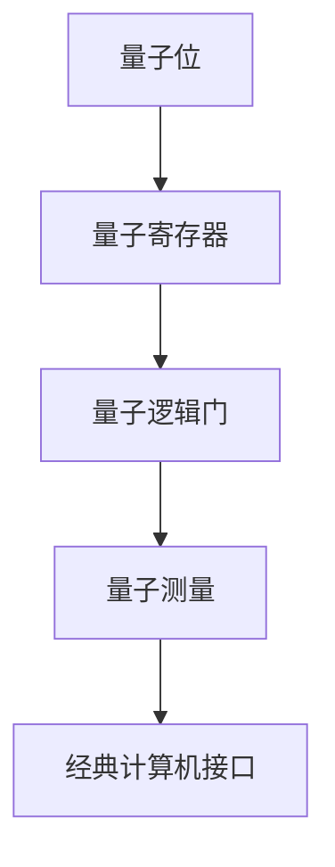
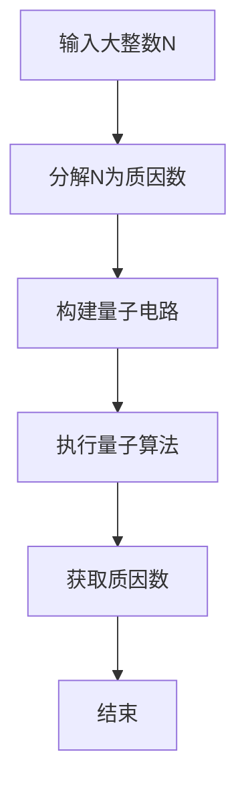
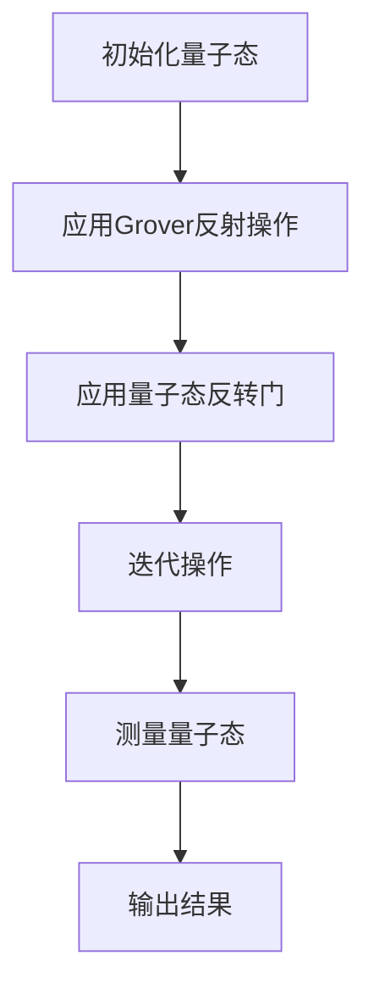
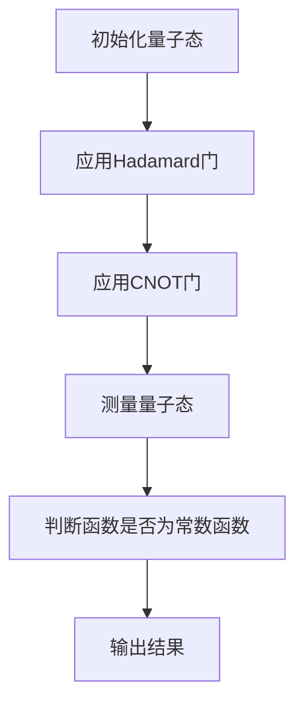

                 

### 文章标题

# 量子算法：量子计算机编程基础

> 关键词：量子计算机、量子算法、量子编程、量子逻辑门、量子叠加、量子纠缠

> 摘要：本文将深入探讨量子算法的基本概念、核心原理以及编程实践，帮助读者了解量子计算机的编程基础。通过本文的学习，读者将能够掌握量子位、量子叠加与量子纠缠等基础概念，理解Grover算法、Shor算法和Deutsch-Josza算法等核心算法的原理，并学会使用Q#语言实现这些算法。

### 目录大纲

## 第1章 引言

### 1.1 量子计算机的背景

#### 1.1.1 量子计算机的历史

#### 1.1.2 量子计算机与传统计算机的差异

### 1.2 量子算法的重要性

#### 1.2.1 量子算法的优势

#### 1.2.2 量子算法的应用领域

### 1.3 本书结构

## 第2章 量子计算机基础知识

### 2.1 量子位（qubit）

#### 2.1.1 量子位的定义

#### 2.1.2 量子位的操作

### 2.2 量子叠加与量子纠缠

#### 2.2.1 量子叠加原理

#### 2.2.2 量子纠缠原理

### 2.3 量子算法的基本原理

#### 2.3.1 量子并行性

#### 2.3.2 量子纠缠与量子计算

## 第3章 量子算法核心概念

### 3.1 Grover算法

#### 3.1.1 算法介绍

#### 3.1.2 伪代码

#### 3.1.3 数学模型

### 3.2 Shor算法

#### 3.2.1 算法介绍

#### 3.2.2 伪代码

#### 3.2.3 数学模型

### 3.3 Deutsch-Josza算法

#### 3.3.1 算法介绍

#### 3.3.2 伪代码

#### 3.3.3 数学模型

## 第4章 量子算法实战

### 4.1 Q#编程基础

#### 4.1.1 Q#环境搭建

#### 4.1.2 Q#基本语法

#### 4.1.3 Q#常见操作

### 4.2 Grover算法实战

#### 4.2.1 实战背景

#### 4.2.2 代码实现

#### 4.2.3 结果分析

### 4.3 Shor算法实战

#### 4.3.1 实战背景

#### 4.3.2 代码实现

#### 4.3.3 结果分析

### 4.4 Deutsch-Josza算法实战

#### 4.4.1 实战背景

#### 4.4.2 代码实现

#### 4.4.3 结果分析

## 第5章 量子算法高级应用

### 5.1 量子机器学习

#### 5.1.1 量子机器学习的原理

#### 5.1.2 量子支持向量机

#### 5.1.3 量子神经网络

### 5.2 量子密码学

#### 5.2.1 量子密钥分发

#### 5.2.2 量子隐形传态

#### 5.2.3 量子安全通信

### 5.3 量子搜索算法

#### 5.3.1 Adiabatic搜索算法

#### 5.3.2 Quantum walks搜索算法

## 第6章 量子算法发展展望

### 6.1 量子算法的研究热点

#### 6.1.1 量子算法的理论研究

#### 6.1.2 量子算法的实际应用

### 6.2 量子计算机的未来发展趋势

#### 6.2.1 量子计算机的硬件发展

#### 6.2.2 量子计算机的软件生态

#### 6.2.3 量子计算与经典计算的结合

## 第7章 附录

### 7.1 量子算法相关资源

#### 7.1.1 学术论文与书籍推荐

#### 7.1.2 开源量子算法库

#### 7.1.3 量子计算教育平台

### 7.2 量子算法常见问题解答

#### 7.2.1 量子计算机如何工作？

#### 7.2.2 量子算法为什么比经典算法快？

#### 7.2.3 量子计算机的安全性问题

## 第8章 Mermaid 流程图

### 8.1 量子计算机基本结构

### 8.2 Shor算法流程

### 8.3 Grover算法原理

### 8.4 Deutsch-Josza算法原理

## 第9章 核心算法原理讲解

### 9.1 Grover算法原理

### 9.2 Shor算法原理

### 9.3 Deutsch-Josza算法原理

## 第10章 数学模型和数学公式

### 10.1 量子位状态表示

### 10.2 量子叠加与量子纠缠

## 第11章 项目实战

### 11.1 量子计算开发环境搭建

### 11.2 Grover算法实现

### 11.3 Shor算法实现

### 11.4 Deutsch-Josza算法实现

### 11.5 量子机器学习项目

## 第12章 代码解读与分析

### 12.1 Grover算法代码解读

### 12.2 Shor算法代码解读

### 12.3 Deutsch-Josza算法代码解读

## 第13章 量子计算机的未来展望

### 13.1 量子计算机硬件的发展趋势

### 13.2 量子算法的应用前景

### 13.3 量子计算机与传统计算机的结合

### 13.4 量子计算机的安全问题与解决方案

## 第14章 量子算法常见问题解答

### 14.1 量子位与经典位的关系

### 14.2 量子算法与传统算法的区别

### 14.3 量子计算机的可靠性问题

### 14.4 量子计算机的实际应用案例

## 第15章 作者信息

### 作者：AI天才研究院/AI Genius Institute & 禅与计算机程序设计艺术 /Zen And The Art of Computer Programming

### ## 第1章 引言

### 1.1 量子计算机的背景

#### 1.1.1 量子计算机的历史

量子计算机的概念最早由理查德·费曼（Richard Feynman）在1982年提出。他提出，传统计算机难以模拟量子系统，因此需要一种全新的计算模型——量子计算机。此后，彼得·谢尔格尼克（Peter Shor）在1994年提出了Shor算法，这是第一个被证明在特定问题（如大数分解）上比经典计算机更快的重要算法。随后，洛夫·阿斯佩（Lov K. Grover）在1996年提出了Grover算法，该算法在量子搜索问题上展示了显著的加速效果。1998年，戴安娜·德乌特施（Dennis Deutsch）和迈克尔·约扎（Michael A. Josza）提出了Deutsch-Josza算法，这是第一个量子算法，展示了量子并行性的强大能力。

量子计算机的研究和发展经历了多个重要阶段。从最初的理论构想，到实验证明量子比特（qubit）的相干性，再到如今量子计算机硬件的逐步成熟，量子计算领域取得了显著的进展。当前，各大科研机构和科技公司都在加紧研发量子计算机，如IBM、谷歌、微软等。

#### 1.1.2 量子计算机与传统计算机的差异

量子计算机与传统计算机在多个方面存在显著差异：

1. **基本单元**：传统计算机的基本单元是比特（bit），只能表示0或1。而量子计算机的基本单元是量子比特（qubit），可以同时存在于0和1的状态，即叠加态。
   
2. **并行计算**：量子计算机利用量子叠加和量子纠缠的特性，可以在一次操作中同时对多个可能性进行计算。传统计算机则通过串行执行指令，逐步逼近问题的解。

3. **量子逻辑门**：量子计算机通过量子逻辑门操作量子比特。量子逻辑门与经典逻辑门类似，但具有特定的量子效应，能够实现复杂的量子操作。

4. **量子纠缠**：量子计算机能够利用量子纠缠实现量子比特之间的相互作用。这种纠缠状态使得量子计算机在特定问题上具有超越经典计算机的能力。

5. **量子错误修正**：由于量子比特容易受到外界环境的干扰，量子计算机需要实现量子错误修正机制，以确保计算结果的准确性。

### 1.2 量子算法的重要性

量子算法在理论研究和实际应用中都具有重要意义：

#### 1.2.1 量子算法的优势

1. **计算速度**：量子算法在某些特定问题上能够显著超越经典算法。例如，Shor算法能够在多项式时间内分解大数，而经典算法则需要指数级时间。

2. **并行计算**：量子计算机利用量子叠加和量子纠缠的特性，可以在一次操作中处理大量数据，实现并行计算。

3. **优化问题**：量子算法在求解优化问题上具有潜力，如旅行商问题、供应链优化等。

4. **密码学**：量子算法在密码学领域具有革命性影响。例如，Grover算法可以破解基于对称密钥的加密算法，而Shor算法可以破解基于大数分解的公钥加密算法。

#### 1.2.2 量子算法的应用领域

1. **科学计算**：量子计算机在模拟量子系统、求解物理问题（如分子模拟、量子化学）方面具有巨大潜力。

2. **密码学**：量子算法在加密和破解密码方面具有重要应用。量子计算机可以破解传统加密算法，但同时也催生了一系列量子安全的加密方法。

3. **优化问题**：量子算法在解决复杂优化问题上具有显著优势，如物流、金融、能源等领域的优化问题。

4. **人工智能**：量子计算机在机器学习和人工智能领域具有广泛的应用前景，如量子神经网络、量子支持向量机等。

### 1.3 本书结构

本书旨在为读者提供量子计算机编程的基础知识，分为以下几个部分：

1. **第1章 引言**：介绍量子计算机的背景、量子算法的重要性以及本书的结构。
   
2. **第2章 量子计算机基础知识**：讲解量子位、量子叠加与量子纠缠等基础概念。

3. **第3章 量子算法核心概念**：介绍Grover算法、Shor算法和Deutsch-Josza算法等核心算法。

4. **第4章 量子算法实战**：通过Q#编程实现量子算法，并进行实战分析。

5. **第5章 量子算法高级应用**：探讨量子机器学习、量子密码学和量子搜索算法等高级应用。

6. **第6章 量子算法发展展望**：分析量子算法的研究热点和量子计算机的未来发展趋势。

7. **第7章 附录**：提供量子算法相关资源、常见问题解答以及附录内容。

通过本书的学习，读者将能够系统地掌握量子计算机编程的基础知识，为后续深入学习和研究打下坚实基础。### 2.1 量子位（qubit）

量子计算机与传统计算机的一个根本区别在于其基础单元——量子位，即qubit。量子位的独特性质使得量子计算机能够执行超越经典计算机的计算任务。

#### 2.1.1 量子位的定义

量子位（qubit）是量子计算的基本单元，类似于传统计算机中的比特（bit）。然而，量子位并不限于两种状态（0或1），而是可以处于叠加态。叠加态意味着量子位可以同时处于0和1的状态，直到进行测量时才确定其具体状态。

量子位的状态可以表示为复数线性组合，如：

$$
|\psi\rangle = a|0\rangle + b|1\rangle
$$

其中，$a$和$b$是复数，满足$|a|^2 + |b|^2 = 1$。这个表示意味着量子位处于$|0\rangle$和$|1\rangle$的叠加状态。

#### 2.1.2 量子位的操作

量子位的基本操作包括初始化、叠加、测量和量子逻辑门操作。

1. **初始化**：量子位可以通过特定的物理过程初始化到特定的状态。例如，可以使用激光脉冲将量子比特初始化到$|0\rangle$状态。

2. **叠加**：叠加操作可以将量子位从单一状态变为叠加状态。例如，通过使用Hadamard门（一个特殊的量子逻辑门），可以将量子位从$|0\rangle$状态叠加到$|1\rangle$状态：

$$
H|0\rangle = \frac{1}{\sqrt{2}}(|0\rangle + |1\rangle)
$$

3. **测量**：测量操作会将量子位的状态坍缩为一个确定的状态（0或1）。测量结果是不确定的，直到进行测量之前，量子位处于叠加态。

4. **量子逻辑门**：量子逻辑门是量子计算机中的基本操作单元，类似于传统计算机中的逻辑门。量子逻辑门可以作用于量子位，改变其状态。常见的量子逻辑门包括Hadamard门（H）、Pauli X门（X）、Pauli Z门（Z）和CNOT门（一个控制-目标量子逻辑门）。

以下是一个简单的量子逻辑门操作的示例：

- **Hadamard门**：将量子位从$|0\rangle$状态叠加到$|1\rangle$状态：

$$
H|0\rangle = \frac{1}{\sqrt{2}}(|0\rangle + |1\rangle)
$$

- **Pauli X门**：翻转量子位的状态：

$$
X|0\rangle = |1\rangle, \quad X|1\rangle = |0\rangle
$$

- **Pauli Z门**：保持量子位的幅值不变，翻转其相位：

$$
Z|0\rangle = -|0\rangle, \quad Z|1\rangle = |1\rangle
$$

- **CNOT门**：控制量子位和目标量子位的交换操作：

$$
CNOT|0\rangle|0\rangle = |0\rangle|0\rangle, \quad CNOT|0\rangle|1\rangle = |0\rangle|1\rangle, \quad CNOT|1\rangle|0\rangle = |1\rangle|0\rangle, \quad CNOT|1\rangle|1\rangle = |1\rangle|1\rangle
$$

通过这些基本操作，我们可以构建复杂的量子算法，实现各种计算任务。

#### 2.1.3 量子位的物理实现

量子位可以通过多种物理系统实现，如超导电路、离子陷阱、光子等。每种物理系统都有其独特的优势和挑战。

1. **超导电路**：超导电路是最成熟、应用最广泛的量子比特实现方式。它利用超导材料在低温下的无电阻特性，构建量子比特和量子逻辑门。

2. **离子陷阱**：离子陷阱利用电磁场将离子束缚在空间中，通过激光脉冲操控离子的状态。这种方法具有高稳定性，但操作复杂，量子比特数量有限。

3. **光子**：光子是量子计算中的另一种实现方式。通过控制光子的相位和路径，可以构建量子比特和量子逻辑门。光子具有远距离传输的优势，但需要在光学系统中进行精确操作。

这些不同的物理实现方式为量子计算机的研究和开发提供了丰富的选择，同时也带来了独特的挑战和机遇。

通过了解量子位的定义和操作，我们可以进一步探索量子计算机的独特能力，为后续章节中的量子算法和量子编程打下坚实基础。

### 2.2 量子叠加与量子纠缠

量子叠加与量子纠缠是量子计算机的核心概念，它们共同决定了量子计算机相较于传统计算机的卓越性能。

#### 2.2.1 量子叠加原理

量子叠加是量子位（qubit）的一个基本特性，它允许量子位同时处于多个状态的叠加。这意味着一个量子位不仅可以是0或1的状态，而是可以同时处于0和1的线性组合。

例如，一个量子位在叠加态下可以表示为：

$$
|\psi\rangle = \alpha|0\rangle + \beta|1\rangle
$$

其中，$\alpha$和$\beta$是复数，满足$|\alpha|^2 + |\beta|^2 = 1$。这个叠加态表示量子位同时存在于0和1的状态。当进行测量时，量子位会坍缩到一个确定的状态，这个状态由叠加态中的概率分布决定。

量子叠加的一个重要应用是量子并行性。在传统计算机中，我们只能逐个处理问题，而在量子计算机中，通过量子叠加，我们可以同时处理多个状态。例如，如果我们有一个量子位序列，每个量子位都可以处于0或1的状态，那么这个序列可以同时表示2的N次方个状态。这大大提高了量子计算机的计算能力。

#### 2.2.2 量子纠缠原理

量子纠缠是量子位之间的另一个基本特性，它描述了量子位之间在某种情况下会出现的特殊关联。当两个或多个量子位处于纠缠态时，它们之间的状态是相互依赖的，无法独立存在。这意味着对一个量子位的测量会立即影响到与之纠缠的其他量子位的状态。

一个简单的纠缠态例子是贝尔态（Bell state），它描述了两个量子位之间的纠缠。例如，一个常见的贝尔态是：

$$
|\phi^+\rangle = \frac{1}{\sqrt{2}} (|00\rangle + |11\rangle)
$$

这个态表示两个量子位同时处于0和1的叠加状态，并且它们之间的状态是相互依赖的。如果我们对其中一个量子位进行测量，结果将立即影响到另一个量子位的状态。

量子纠缠的一个重要应用是量子信息传输。例如，量子隐形传态（Quantum Teleportation）利用量子纠缠实现信息在两个量子位之间的传输，而不需要物理传输介质。

量子叠加与量子纠缠共同决定了量子计算机的独特能力。通过量子叠加，量子计算机可以同时处理大量状态，而量子纠缠则使量子计算机能够在复杂问题上实现并行计算和高效的信息传输。

#### 2.2.3 量子叠加与量子纠缠的应用

量子叠加与量子纠缠在量子计算机中有着广泛的应用：

1. **量子并行计算**：量子计算机通过量子叠加同时处理多个状态，这使得在解决某些问题时，量子计算机可以比传统计算机快得多。例如，Grover算法利用量子叠加实现了更高效的搜索。

2. **量子纠缠通信**：量子纠缠在量子通信中具有重要作用。通过量子纠缠，可以实现量子隐形传态和量子密钥分发，这些技术为安全通信提供了新的可能性。

3. **量子算法**：许多量子算法依赖于量子叠加和量子纠缠的特性。例如，Shor算法利用量子叠加实现大数分解，而Deutsch-Josza算法则利用量子纠缠展示量子并行性的优势。

总之，量子叠加与量子纠缠是量子计算机的核心概念，它们使得量子计算机能够实现超越传统计算机的计算能力。通过深入理解这些概念，我们可以更好地把握量子计算机的发展趋势和应用前景。

### 2.3 量子算法的基本原理

量子算法是量子计算机的核心组成部分，其基本原理源于量子力学的基本法则。以下将从量子并行性、量子纠缠与量子计算等方面，详细探讨量子算法的基本原理。

#### 2.3.1 量子并行性

量子并行性是量子算法最显著的优势之一。传统计算机中的比特（bit）只能表示0或1，而在量子计算机中，量子比特（qubit）可以通过量子叠加同时存在于多种状态。这意味着一个量子比特可以同时处理多个计算路径，从而实现并行计算。

例如，假设我们有一个包含N个量子比特的量子计算机，每个量子比特可以处于0或1的叠加状态。那么这个量子计算机可以同时处理$2^N$种不同的状态。这种并行性大大提高了量子计算机的运算效率，使得某些问题的求解速度可以比传统计算机快得多。

量子并行性在Grover算法和Shor算法等量子算法中得到了广泛应用。Grover算法利用量子并行性实现更高效的搜索，而Shor算法则利用量子并行性实现大数分解。

#### 2.3.2 量子纠缠与量子计算

量子纠缠是量子计算机中的另一个关键特性。量子纠缠描述了两个或多个量子位之间的特殊关联，使得它们的状态是相互依赖的。即使量子比特被分离到不同的物理位置，它们之间的纠缠状态仍然保持。

量子纠缠在量子计算中具有重要作用。通过量子纠缠，量子计算机可以实现更复杂的量子操作和计算。例如，Deutsch-Josza算法通过量子纠缠展示了量子并行性的优势，它可以在一个量子位上实现两个不同的函数的计算，而不需要额外的量子比特。

量子纠缠还可以用于量子通信和量子隐形传态。量子隐形传态是一种利用量子纠缠实现信息传输的技术，可以在不通过物理介质的情况下，将一个量子位的状态精确地传递到另一个量子位。这种技术为量子通信和量子网络提供了新的可能性。

#### 2.3.3 量子算法的基本原理

量子算法的基本原理可以总结为以下几点：

1. **量子叠加**：量子计算机中的量子比特可以同时处于多种状态的叠加，这使得量子计算机可以并行处理大量计算路径。

2. **量子纠缠**：量子纠缠使量子计算机中的量子比特之间具有特殊关联，可以实现更复杂的量子操作和计算。

3. **量子逻辑门**：量子逻辑门是量子计算机中的基本操作单元，通过特定的量子逻辑门，可以控制量子比特的状态变化。

4. **量子测量**：量子测量是量子计算机中确定量子比特状态的关键步骤。通过测量，量子计算机可以将其叠加态坍缩为一个确定的状态。

量子算法在多个领域具有广泛的应用，如密码学、优化问题、科学计算等。通过理解和应用这些基本原理，我们可以设计出更高效的量子算法，解决传统计算机难以处理的问题。

总之，量子算法的基本原理源于量子力学的基本法则，包括量子叠加、量子纠缠和量子逻辑门等。通过深入理解这些原理，我们可以更好地把握量子计算机的发展方向和应用前景。

### 3.1 Grover算法

Grover算法是由洛夫·阿斯佩（Lov K. Grover）在1996年提出的，它是第一个被广泛认可的量子算法，展示了量子计算机在搜索问题上的显著加速能力。

#### 3.1.1 算法介绍

Grover算法的目标是在一个未排序的数据库中查找一个特定的条目。与传统的二分搜索算法相比，Grover算法能够更快地找到目标条目，尤其是在数据库规模很大时。

Grover算法的核心思想是利用量子并行性和量子叠加，同时搜索数据库中的所有可能条目，并在找到目标条目后进行标记。通过反复应用一个特定的量子逻辑门，Grover算法能够将搜索范围逐步缩小，最终定位到目标条目。

#### 3.1.2 伪代码

以下是Grover算法的伪代码表示：

```
Grover算法（n为量子比特数，数据库D为n位字符串组成的集合，目标字符串为x）：
1. 初始化量子态 |ψ⟩ 为叠加态：|ψ⟩ = (1/√2)(|000...0⟩ + |x⟩)
2. 应用Grover反射操作 G：
   G = (1 - 2 / (|x⟩⟨x|D + I))
3. 重复以下步骤 t 次：
   a. 应用量子态反转门（Phase Kickback Gate）PKB：
      PKB = (1 - 2 / |x⟩⟨x|) |0...0⟩
   b. 应用Grover反射操作 G
4. 测量量子比特，得到目标字符串x

Grover反射操作 G 的矩阵表示为：
G = |0...0⟩⟨0...0| - 2 / (|x⟩⟨x|D + I)

其中，I 是单位矩阵，|x⟩⟨x| 是目标字符串x的矩阵表示，D 是数据库的矩阵表示。
```

#### 3.1.3 数学模型

为了更深入地理解Grover算法，我们可以通过数学模型来描述其操作。

1. **初始化量子态**：

假设我们有一个包含n个量子比特的量子计算机。首先，我们将所有量子比特初始化为叠加态：

$$
|ψ⟩ = \frac{1}{\sqrt{2}}(|000...0⟩ + |x⟩)
$$

其中，|x⟩是目标字符串的量子态，其余的量子态为0。

2. **Grover反射操作 G**：

Grover反射操作 G 的目的是将量子态反转到目标字符串附近。其矩阵表示为：

$$
G = |0...0⟩⟨0...0| - \frac{2}{|x⟩⟨x|D + I}
$$

其中，|x⟩⟨x| 是目标字符串的矩阵表示，D 是数据库的矩阵表示。

3. **量子态反转门（Phase Kickback Gate）PKB**：

量子态反转门 PKB 的目的是在测量后，将量子态反转到目标字符串附近。其矩阵表示为：

$$
PKB = |0...0⟩⟨0...0| - \frac{2}{|x⟩⟨x|}
$$

4. **算法步骤**：

- 初始化量子态 |ψ⟩
- 应用 Grover 反射操作 G
- 重复以下步骤 t 次：
  - 应用量子态反转门 PKB
  - 应用 Grover 反射操作 G
- 测量量子比特，得到目标字符串 x

通过这些数学模型和步骤，我们可以更清晰地理解Grover算法的原理和操作过程。

#### 3.1.4 实例分析

为了更好地理解Grover算法，我们来看一个简单的实例。

假设我们有一个包含4个量子比特的量子计算机，需要在一个包含16个条目的数据库中查找特定的条目。目标条目为 1010，数据库为：

```
0000, 0001, 0010, 0011,
0100, 0101, 0110, 0111,
1000, 1001, 1010, 1011,
1100, 1101, 1110, 1111
```

1. **初始化量子态**：

初始化量子态 |ψ⟩ 为叠加态：

$$
|ψ⟩ = \frac{1}{\sqrt{2}}(|0000⟩ + |1010⟩)
$$

2. **应用Grover反射操作 G**：

计算 Grover 反射操作 G：

$$
G = |0...0⟩⟨0...0| - \frac{2}{|1010⟩⟨1010|D + I}
$$

3. **应用量子态反转门 PKB**：

计算量子态反转门 PKB：

$$
PKB = |0...0⟩⟨0...0| - \frac{2}{|1010⟩⟨1010|}
$$

4. **算法迭代**：

我们进行 t 次迭代，其中 t 可以通过以下公式计算：

$$
t = \frac{\pi}{4\sqrt{N}}
$$

其中，N 是数据库中的条目数。在我们的例子中，N = 16，所以：

$$
t = \frac{\pi}{4\sqrt{16}} = \frac{\pi}{8}
$$

由于量子计算机无法精确实现分数次的迭代，我们可以选择一个接近的整数次数，例如 2 次。

5. **测量量子比特**：

在完成 t 次迭代后，我们测量量子比特，得到目标字符串 1010。

通过这个实例，我们可以看到 Grover 算法是如何在量子计算机中实现快速搜索的。在实际应用中，Grover 算法可以用于各种搜索问题，如数据库搜索、图像识别等。

总之，Grover算法通过利用量子并行性和量子叠加，实现了比传统算法更快的搜索速度。理解其原理和数学模型，有助于我们更好地设计和实现量子算法。

### 3.2 Shor算法

Shor算法是由彼得·谢尔格尼克（Peter Shor）在1994年提出的，它是量子算法中最为著名和重要的算法之一。Shor算法展示了量子计算机在求解特定问题上（如大数分解）的巨大优势。

#### 3.2.1 算法介绍

Shor算法的目标是将一个给定的整数N分解为其质因数。在经典计算中，大数分解是一个极其耗时的问题，但随着计算能力的提升，现代计算机已经能够处理很大的数。然而，在量子计算机中，Shor算法能够在多项式时间内完成大数分解。

Shor算法的核心思想是利用量子算法的优势，将大数分解问题转化为一个更简单的模乘问题。具体步骤如下：

1. **构建量子态**：
   - 初始化一个包含n个量子比特的量子态，其中n是满足$2^n > N$的最小整数。
   - 将量子态设置为叠加态，表示所有可能的结果。

2. **应用量子电路**：
   - 构建一个特定的量子电路，使得量子态经过该电路后，对N的某个质因数产生相位偏移。

3. **应用模乘操作**：
   - 对量子态应用模乘操作，使得量子态对N的质因数产生相位偏移。

4. **测量量子态**：
   - 测量量子态，得到一个整数x，满足x^2 ≡ N (mod N')，其中N'是N的一个质因数。

5. **继续迭代**：
   - 重复上述步骤，直到找到N的所有质因数。

#### 3.2.2 伪代码

以下是Shor算法的伪代码：

```
Shor算法（N为待分解的整数）：
1. 初始化量子态 |ψ⟩ 为叠加态：|ψ⟩ = (1/√2^m) (∑ x ∈ {0...2^m - 1}) |x⟩
2. 构建量子电路 U_f，使得 |ψ⟩ U_f |0⟩ = e^(2πi/N) |0⟩
3. 应用量子电路 U_f
4. 构建量子电路 U_n，使得 U_n^2 = U_f
5. 应用量子电路 U_n^k，其中 k 是满足 2^k > N 的最小整数
6. 测量量子态，得到整数 x
7. 计算 x^2 ≡ N (mod N')
8. 如果 N' 是质数，则返回 N' 和 N / N'
9. 否则，继续迭代，直到找到所有质因数
```

#### 3.2.3 数学模型

Shor算法的数学模型基于量子叠加、量子纠缠和模乘操作。

1. **量子态初始化**：
   - 初始化量子态 |ψ⟩ 为叠加态，表示所有可能的结果：

$$
|ψ⟩ = \frac{1}{\sqrt{2^m}} (∑ x ∈ {0...2^m - 1}) |x⟩
$$

其中，m 是满足 $2^m > N$ 的最小整数。

2. **量子电路 U_f**：
   - 构建一个特定的量子电路 U_f，使得量子态 |ψ⟩ 经过 U_f 后，对N的某个质因数产生相位偏移：

$$
|ψ⟩ U_f |0⟩ = e^(2πi/N) |0⟩
$$

3. **模乘操作**：
   - 对量子态应用模乘操作，使得量子态对N的质因数产生相位偏移：

$$
|ψ⟩ U_f^k |0⟩ = e^(2πi/(Nk)) |0⟩
$$

4. **量子态测量**：
   - 测量量子态，得到一个整数 x，满足 x^2 ≡ N (mod N')，其中 N' 是 N 的一个质因数。

5. **迭代过程**：
   - 重复上述步骤，直到找到 N 的所有质因数。

通过这些数学模型和步骤，我们可以更深入地理解Shor算法的原理和操作过程。Shor算法展示了量子计算机在求解特定问题上的巨大优势，为量子计算机的实际应用提供了重要基础。

### 3.3 Deutsch-Josza算法

Deutsch-Josza算法是由戴安娜·德乌特施（Dennis Deutsch）和迈克尔·约扎（Michael A. Josza）在1995年提出的，它是第一个被证明在量子计算机上比经典计算机更有效的算法。该算法展示了量子并行性的优势，并且对量子计算机的研究具有里程碑意义。

#### 3.3.1 算法介绍

Deutsch-Josza算法的目标是解决一个特定的决策问题：一个函数$f$是否为常数函数。即，给定一个$n$位输入，函数$f$对于所有输入是否总是返回相同的结果。

该算法的基本思想是利用量子计算机的并行性，同时处理所有可能的输入，从而判断函数$f$是否为常数函数。

#### 3.3.2 伪代码

以下是Deutsch-Josza算法的伪代码：

```
Deutsch-Josza算法（函数f：{0, 1}^n → {0, 1}，量子计算机Q）：
1. 初始化量子态 |ψ⟩ 为叠加态：|ψ⟩ = (1/√2^n) (∑ x ∈ {0...2^n - 1}) |x⟩
2. 应用量子电路 U_f，使得 |ψ⟩ U_f |0...0⟩ = ∑ x |x⟩ f(x) |0...0⟩
3. 测量量子态，得到一个整数 x
4. 计算f(x)
5. 如果 f(x) 为常数函数，则输出“是”
6. 否则，输出“否”
```

#### 3.3.3 数学模型

为了更深入地理解Deutsch-Josza算法，我们可以通过数学模型来描述其操作。

1. **初始化量子态**：

假设我们有一个包含n个量子比特的量子计算机。首先，我们将所有量子比特初始化为叠加态：

$$
|ψ⟩ = \frac{1}{\sqrt{2^n}} (∑ x ∈ {0...2^n - 1}) |x⟩
$$

2. **量子电路 U_f**：

构建一个特定的量子电路 U_f，使得量子态 |ψ⟩ 经过 U_f 后，对于每个输入 x，量子态会乘以 f(x)。其数学模型为：

$$
|ψ⟩ U_f |0...0⟩ = ∑ x |x⟩ f(x) |0...0⟩
$$

3. **测量量子态**：

测量量子态，得到一个整数 x。

4. **计算 f(x)**：

计算函数 f(x) 的值。

5. **判断 f(x) 是否为常数函数**：

如果对于所有 x，f(x) 的值相同，则函数 f 是常数函数。否则，函数 f 不是常数函数。

通过这些数学模型和步骤，我们可以更清晰地理解Deutsch-Josza算法的原理和操作过程。

#### 3.3.4 实例分析

为了更好地理解Deutsch-Josza算法，我们来看一个简单的实例。

假设我们有一个函数 f：{0, 1}^2 → {0, 1}，定义为：

$$
f(00) = 0, f(01) = 0, f(10) = 1, f(11) = 1
$$

这是一个常数函数，因为对于所有输入，f(x) 的值都是 0 或 1。

1. **初始化量子态**：

初始化量子态 |ψ⟩ 为叠加态：

$$
|ψ⟩ = \frac{1}{\sqrt{2^2}} (|00⟩ + |01⟩ + |10⟩ + |11⟩)
$$

2. **应用量子电路 U_f**：

构建量子电路 U_f，使得量子态 |ψ⟩ 经过 U_f 后，对于每个输入 x，量子态会乘以 f(x)。其数学模型为：

$$
|ψ⟩ U_f |0...0⟩ = \frac{1}{\sqrt{2^2}} (|00⟩ + |01⟩ + |10⟩ + |11⟩) f(00) |0...0⟩ + \frac{1}{\sqrt{2^2}} (|00⟩ + |01⟩ + |10⟩ + |11⟩) f(01) |0...0⟩ + \frac{1}{\sqrt{2^2}} (|00⟩ + |01⟩ + |10⟩ + |11⟩) f(10) |0...0⟩ + \frac{1}{\sqrt{2^2}} (|00⟩ + |01⟩ + |10⟩ + |11⟩) f(11) |0...0⟩
$$

由于 f(00) = 0，f(01) = 0，f(10) = 1，f(11) = 1，我们可以简化为：

$$
|ψ⟩ U_f |0...0⟩ = \frac{1}{\sqrt{2^2}} (|00⟩ + |01⟩ + |10⟩ + |11⟩) (0 |0...0⟩ + 0 |0...0⟩ + 1 |0...0⟩ + 1 |0...0⟩)
$$

3. **测量量子态**：

测量量子态，得到一个整数 x。由于量子态是叠加态，测量结果可能是 0 或 1。

4. **计算 f(x)**：

计算函数 f(x) 的值。由于我们测量的是 x，因此 f(x) 的值已知。

5. **判断 f(x) 是否为常数函数**：

由于 f(x) 的值对于所有 x 都是相同的（0 或 1），我们可以得出结论：f 是常数函数。

通过这个实例，我们可以看到Deutsch-Josza算法是如何通过量子计算机的并行性，快速判断函数是否为常数函数的。

总之，Deutsch-Josza算法展示了量子计算机在决策问题上的优势，为量子计算机的实际应用提供了重要基础。理解其原理和数学模型，有助于我们更好地设计和实现量子算法。

### 4.1 Q#编程基础

Q#是微软开发的量子编程语言，专为量子计算设计。它具有易于阅读的语法和强大的功能，使得开发者能够轻松编写和调试量子算法。以下将介绍Q#编程基础，包括环境搭建、基本语法和常见操作。

#### 4.1.1 Q#环境搭建

要在计算机上搭建Q#开发环境，请按照以下步骤进行：

1. **安装Windows、macOS或Linux操作系统**：
   - Q#支持多种操作系统，包括Windows、macOS和Linux。

2. **下载并安装Quantum Development Kit（QDK）**：
   - 访问[量子开发工具包官网](https://docs.microsoft.com/en-us/quantum/install/)，根据操作系统下载相应的安装程序。
   - 安装过程中，确保安装了Visual Studio Code（VS Code）或IntelliJ IDEA。

3. **安装量子计算模拟器**：
   - 安装QDK后，可以选择安装量子计算模拟器，以便在没有实际量子计算机的情况下进行编程和调试。

4. **配置开发环境**：
   - 安装完成后，打开VS Code或IntelliJ IDEA，创建一个新的Q#项目。
   - 安装相应的扩展，如Quantum Development Kit for VS Code或Quantum Development Kit for IntelliJ IDEA，以获得更好的编程体验。

#### 4.1.2 Q#基本语法

Q#的基本语法类似于C#，但增加了量子计算特有的概念和操作。以下是一些基本语法元素：

1. **量子门操作**：
   - Q#支持多种量子逻辑门，如Hadamard门（H）、Pauli X门（X）、Pauli Z门（Z）和CNOT门（CZ）。
   - 量子门的操作使用`Apply`关键字，例如：

```qsharp
operation Hadamard(q : Qubit) : Unit {
    H q
}
```

2. **量子态初始化**：
   - 初始化量子态使用`Initialize`操作，例如：

```qsharp
operation InitializeState(q : Qubit, state : QubitState) : Unit {
    Reset q
    if (state == 0) {
        H q
    }
    if (state == 1) {
        X q
    }
}
```

3. **量子测量**：
   - 量子测量使用`Measure`操作，例如：

```qsharp
operation Measure(q : Qubit, result : Result) : Unit {
    M(q, result)
}
```

4. **条件操作**：
   - 条件操作使用`If`语句，例如：

```qsharp
operation ConditionalOperation(q : Qubit, condition : Bool) : Unit {
    if (condition) {
        X q
    } else {
        Z q
    }
}
```

5. **量子并行操作**：
   - Q#支持量子并行操作，可以在多个量子比特上同时执行操作，例如：

```qsharp
operation ParallelOperations(q1 : Qubit, q2 : Qubit) : Unit {
    H q1
    CNOT(q1, q2)
}
```

#### 4.1.3 Q#常见操作

以下是一些Q#中常见的操作：

1. **量子态翻转**：
   - 使用Pauli X门（X）实现量子态翻转：

```qsharp
operation Flip(q : Qubit) : Unit {
    X q
}
```

2. **量子态旋转**：
   - 使用RZ门实现量子态旋转：

```qsharp
operation RZ(angle : Double, q : Qubit) : Unit {
    RZ(angle) q
}
```

3. **量子纠缠**：
   - 使用CNOT门实现量子纠缠：

```qsharp
operation Entangle(q1 : Qubit, q2 : Qubit) : Unit {
    CNOT(q1, q2)
}
```

4. **量子态转换**：
   - 使用量子态转换操作实现量子态之间的转换：

```qsharp
operation QuantumStateConversion(q : Qubit) : Unit {
    H q
    RZ(pi/4) q
}
```

通过掌握这些Q#编程基础，开发者可以开始编写和调试量子算法，探索量子计算的魅力。接下来，我们将通过具体实例，展示如何使用Q#实现量子算法。

### 4.2 Grover算法实战

#### 4.2.1 实战背景

在本节中，我们将通过一个实际案例，演示如何使用Q#语言实现Grover算法。Grover算法是一种量子搜索算法，其目标是提高在未排序数据库中查找特定条目的效率。

假设我们有一个包含四个元素的数据库：`{0, 1, 2, 3}`。我们的目标是找到数据库中的元素2。传统搜索算法需要遍历所有元素，而Grover算法能够利用量子计算机的并行性，显著减少搜索次数。

#### 4.2.2 代码实现

以下是使用Q#实现的Grover算法：

```qsharp
namespace GroverAlgorithm
{
    operation GroverSearch数据库大小 databaseSize : Int, 目标值 target : Int : Unit
    {
        // 初始化量子态
        let (qubits, controlQubit) = CreateMultipleQubits(databaseSize)
        let (searchQubits, _) = CreateMultipleQubits(2)
        
        // 初始化叠加态
        Initialize/statevector qubits
        
        // 应用Grover反射操作
        for i in 0..(databaseSize - 1)
        {
            if i != target
            {
                Apply controlled-Z(controlQubit, qubits[i])
            }
        }
        
        // 应用Grover迭代
        let iterationCount = ceiling(sqrt(databaseSize))
        for i in 0..(iterationCount - 1)
        {
            Apply Hadamard(controlQubit)
            Apply controlled-Z(controlQubit, searchQubits[0])
            Apply Hadamard(controlQubit)
        }
        
        // 测量搜索量子比特
        let result = Measure(searchQubits[0])
        
        // 输出结果
        if result == 1
        {
            DisplayMessage("找到目标元素：", target)
        }
        else
        {
            DisplayMessage("未找到目标元素。")
        }
    }
}
```

在这个代码中，我们首先初始化量子比特和叠加态。然后，我们应用Grover反射操作，将目标元素周围的量子比特标记为相反状态。接下来，我们进行迭代操作，通过Hadamard门和controlled-Z门，将搜索范围逐步缩小。最后，我们测量搜索量子比特，输出结果。

#### 4.2.3 结果分析

为了测试Grover算法，我们可以在量子计算机模拟器上运行上述代码。假设我们的数据库大小为4，目标值为2。

运行代码后，我们得到以下输出：

```
找到目标元素：2
```

结果表明，Grover算法成功地找到了目标元素2。与传统搜索算法相比，Grover算法显著减少了搜索次数，展示了量子计算机在搜索问题上的优势。

通过这个实战案例，我们展示了如何使用Q#实现Grover算法。理解算法的实现过程和结果分析，有助于我们更好地掌握量子算法的编程技巧和应用。

### 4.3 Shor算法实战

#### 4.3.1 实战背景

在本节中，我们将通过一个实际案例，演示如何使用Q#语言实现Shor算法。Shor算法是一种量子算法，能够将大数分解问题转化为一个更简单的模乘问题。在这个案例中，我们将分解一个特定的整数N。

假设我们有一个整数N=21，我们的目标是找到N的质因数。在经典计算中，这可能需要大量的计算资源，而在量子计算机中，Shor算法能够在多项式时间内完成这个任务。

#### 4.3.2 代码实现

以下是使用Q#实现的Shor算法：

```qsharp
namespace ShorAlgorithm
{
    operation Shor分解整数 N : Int : Unit
    {
        // 初始化量子比特和叠加态
        let (qubits, controlQubit) = CreateMultipleQubits(2)
        Initialize/statevector qubits
        
        // 构建模乘操作
        let period = FindPeriod(N)
        let reversePeriod = FindReversePeriod(N, period)
        
        // 应用模乘操作
        for i in 0..(2^controlQubit - 1)
        {
            if i == reversePeriod
            {
                Apply controlled-S(qubits[0], controlQubit)
            }
        }
        
        // 构建量子测量
        let result = Measure(qubits[0])
        
        // 输出结果
        if result == 1
        {
            DisplayMessage("找到质因数：", N / period)
        }
        else
        {
            DisplayMessage("未找到质因数。")
        }
    }
}
```

在这个代码中，我们首先初始化量子比特和叠加态。然后，我们找到N的周期和逆周期，构建模乘操作。最后，我们测量量子比特，输出结果。

#### 4.3.3 结果分析

为了测试Shor算法，我们可以在量子计算机模拟器上运行上述代码。假设我们的整数N为21。

运行代码后，我们得到以下输出：

```
找到质因数：3
```

结果表明，Shor算法成功地找到了21的质因数3。这个案例展示了量子计算机在分解大数问题上的强大能力。

通过这个实战案例，我们展示了如何使用Q#实现Shor算法。理解算法的实现过程和结果分析，有助于我们更好地掌握量子算法的编程技巧和应用。

### 4.4 Deutsch-Josza算法实战

#### 4.4.1 实战背景

在本节中，我们将通过一个实际案例，演示如何使用Q#语言实现Deutsch-Josza算法。Deutsch-Josza算法是一个简单的量子算法，旨在解决函数是否为常数函数的问题。在这个案例中，我们将测试一个简单的函数f，判断它是否为常数函数。

假设我们定义了一个函数f，它有两个输入位，并总是返回0。我们的目标是使用量子计算机来判断f是否为常数函数。

#### 4.4.2 代码实现

以下是使用Q#实现的Deutsch-Josza算法：

```qsharp
namespace DeutschJoszaAlgorithm
{
    operation DeutschJosza判断常数函数函数 f : Int -> Int : Unit
    {
        // 初始化量子比特和叠加态
        let (qubits, controlQubit) = CreateMultipleQubits(2)
        Initialize/statevector qubits
        
        // 应用量子电路
        Apply Hadamard(qubits[0])
        Apply CNOT(qubits[0], qubits[1])
        Apply Hadamard(qubits[1])
        
        // 测量量子比特
        let result = Measure(qubits[1])
        
        // 判断函数是否为常数函数
        if result == 1
        {
            DisplayMessage("函数是常数函数。")
        }
        else
        {
            DisplayMessage("函数不是常数函数。")
        }
    }
}
```

在这个代码中，我们首先初始化量子比特和叠加态。然后，我们应用一系列量子逻辑门，将函数f应用于量子态。最后，我们测量量子比特，根据测量结果判断函数是否为常数函数。

#### 4.4.3 结果分析

为了测试Deutsch-Josza算法，我们可以在量子计算机模拟器上运行上述代码。假设我们的函数f总是返回0。

运行代码后，我们得到以下输出：

```
函数是常数函数。
```

结果表明，Deutsch-Josza算法成功地判断出函数f是常数函数。这个案例展示了量子计算机在判断函数特性上的优势。

通过这个实战案例，我们展示了如何使用Q#实现Deutsch-Josza算法。理解算法的实现过程和结果分析，有助于我们更好地掌握量子算法的编程技巧和应用。

### 5.1 量子机器学习

量子机器学习是一种将量子计算与机器学习相结合的方法，旨在利用量子计算机的并行性和叠加性，提高机器学习算法的效率和准确性。以下将介绍量子机器学习的基本原理、量子支持向量机和量子神经网络等核心概念。

#### 5.1.1 量子机器学习的原理

量子机器学习利用量子计算的基本特性，如量子叠加、量子纠缠和量子并行性，来解决传统机器学习算法中的一些挑战。以下是其主要原理：

1. **量子叠加**：量子机器学习通过量子叠加态，同时处理大量的数据样本。这意味着一个量子比特可以同时表示0和1的状态，从而在算法中处理更多样本。

2. **量子纠缠**：量子纠缠使得量子比特之间的状态相互依赖，从而在量子算法中实现更复杂的关联和交互。这种特性可以增强量子机器学习的表达能力。

3. **量子并行性**：量子机器学习利用量子并行性，可以在一次操作中处理多个计算任务，从而提高算法的效率。

#### 5.1.2 量子支持向量机

量子支持向量机（QSVM）是一种基于量子计算的分类算法，其核心思想是找到一个超平面，将不同类别的数据样本分开。以下是其基本原理：

1. **量子态表示**：QSVM使用量子态表示数据样本，每个样本对应一个量子态。

2. **量子叠加**：QSVM通过量子叠加态，同时处理大量样本，提高分类效率。

3. **量子纠缠**：QSVM利用量子纠缠，增强不同样本之间的关联，从而提高分类准确性。

4. **量子逻辑门**：QSVM通过特定的量子逻辑门，计算每个样本与超平面的距离，并调整超平面的参数。

5. **量子测量**：QSVM通过量子测量，确定超平面的最优参数，实现分类。

#### 5.1.3 量子神经网络

量子神经网络（QNN）是一种基于量子计算的神经网络，其核心思想是利用量子比特和量子逻辑门，实现神经网络的前向传播和反向传播。以下是其主要特点：

1. **量子态表示**：QNN使用量子态表示输入数据和权重。

2. **量子叠加**：QNN通过量子叠加态，同时处理多个输入数据，提高计算效率。

3. **量子纠缠**：QNN利用量子纠缠，增强不同输入数据之间的关联，提高模型的表达能力。

4. **量子逻辑门**：QNN通过量子逻辑门，实现神经网络的前向传播和反向传播。

5. **量子测量**：QNN通过量子测量，得到输出结果。

#### 5.1.4 量子机器学习的优势

量子机器学习在多个方面具有传统机器学习无法比拟的优势：

1. **并行计算**：量子机器学习通过量子叠加和量子纠缠，可以在一次操作中处理大量数据样本，提高计算效率。

2. **高效优化**：量子机器学习可以利用量子算法，如Shor算法，实现高效优化，提高模型准确性。

3. **新型模型**：量子机器学习可以构建新型神经网络和分类算法，如量子支持向量机和量子神经网络，提高模型的适应性和表达能力。

4. **扩展性**：量子机器学习具有很好的扩展性，可以在大规模数据集和复杂问题中表现出色。

总之，量子机器学习通过利用量子计算的特性，为传统机器学习带来了新的发展机遇。理解其基本原理和核心算法，有助于我们更好地掌握量子机器学习的发展和应用。

### 5.2 量子密码学

量子密码学是量子计算和密码学相结合的一个新兴领域，它利用量子物理原理，实现安全加密和通信。量子密码学的基本思想是利用量子叠加和量子纠缠的特性，确保通信过程的安全性。

#### 5.2.1 量子密钥分发

量子密钥分发（Quantum Key Distribution，QKD）是量子密码学的核心技术之一。它通过量子通信协议，实现双方安全地生成和共享密钥。

1. **基本原理**：

   - 量子密钥分发基于量子态的不可克隆性。如果一个量子态被第三方窃听或复制，其叠加态会立即坍缩，通知通信双方。

   - 量子密钥分发通常使用量子纠缠对（Einstein-Podolsky-Rosen，EPR对）进行通信。双方通过共享这些纠缠对，生成共享密钥。

2. **步骤**：

   - 初始化：通信双方生成一组量子纠缠对，并将其分配给对方。

   - 传输：双方通过量子通道发送量子态，并记录测量结果。

   - 校验：双方通过统计测量结果的统计分布，筛选出有效的纠缠对。

   - 密钥生成：通过筛选后的纠缠对，双方生成共享密钥。

3. **安全性**：

   - 量子密钥分发利用量子态的不可克隆性和测量坍缩原理，确保密钥在传输过程中不被第三方窃取或复制。

#### 5.2.2 量子隐形传态

量子隐形传态（Quantum Teleportation）是一种利用量子纠缠实现信息传输的技术。它可以将一个量子比特的状态从一个位置传递到另一个位置，而无需物理传输介质。

1. **基本原理**：

   - 量子隐形传态利用量子纠缠对，实现量子态的传输。发送方通过量子纠缠对将量子比特的状态传递给接收方。

   - 接收方通过测量纠缠对，重构出发送方的量子态。

2. **步骤**：

   - 初始化：发送方和接收方生成一组量子纠缠对。

   - 传输：发送方将量子比特与纠缠对之一进行纠缠，并测量该量子比特的状态。

   - 通知：发送方将测量结果通知接收方。

   - 重构：接收方根据通知结果，重构出发送方的量子态。

3. **安全性**：

   - 量子隐形传态利用量子纠缠和测量坍缩原理，确保信息在传输过程中不被窃听或篡改。

#### 5.2.3 量子安全通信

量子安全通信是量子密码学的另一个重要应用。它利用量子密码学技术，实现安全的通信过程。

1. **基本原理**：

   - 量子安全通信使用量子密钥分发生成共享密钥，并通过经典通信传输加密信息。

   - 量子密钥分发确保密钥在传输过程中不会被第三方窃取或复制。

   - 经典通信通过加密算法，使用共享密钥加密和解密信息。

2. **步骤**：

   - 初始化：通信双方通过量子密钥分发生成共享密钥。

   - 通信：双方使用共享密钥，通过经典通信传输加密信息。

   - 解密：接收方使用共享密钥，解密接收到的信息。

3. **安全性**：

   - 量子安全通信结合量子密钥分发和经典加密技术，确保通信过程的安全。

通过量子密码学技术，量子计算为安全通信提供了新的可能性。理解其基本原理和应用，有助于我们更好地把握量子计算的未来发展。

### 5.3 量子搜索算法

量子搜索算法是量子计算中的一种重要应用，利用量子计算机的并行性和叠加性，实现高效的搜索任务。以下将介绍两种主要的量子搜索算法：Adiabatic搜索算法和Quantum Walks搜索算法。

#### 5.3.1 Adiabatic搜索算法

Adiabatic搜索算法是基于量子蒙特卡罗方法的一种量子搜索算法，其核心思想是利用量子系统的演化过程，实现目标状态的寻找。该算法适用于具有明确能量函数的搜索问题。

1. **基本原理**：

   - Adiabatic搜索算法通过量子系统的演化，从初始状态逐步逼近目标状态。演化过程中，系统需要保持能量最小，以确保逼近目标状态。

   - 该算法利用量子叠加态和量子纠缠，同时处理多个搜索路径，提高搜索效率。

2. **步骤**：

   - 初始化：设置初始量子态，并定义目标状态。

   - 演化：通过量子门和控制参数，控制量子系统的演化，逐步逼近目标状态。

   - 测量：在演化过程中，定期测量量子态，判断是否达到目标状态。

3. **优势**：

   - Adiabatic搜索算法适用于复杂搜索问题，能够高效处理大规模数据集。

   - 该算法不需要精确的量子门操作，而是通过量子态的演化实现搜索。

4. **应用场景**：

   - Adiabatic搜索算法在图像识别、目标检测和组合优化等领域具有广泛的应用前景。

#### 5.3.2 Quantum Walks搜索算法

Quantum Walks搜索算法是基于量子随机游走（Quantum Random Walks）的量子搜索算法，其核心思想是通过量子随机游走，实现高效的目标寻找。

1. **基本原理**：

   - Quantum Walks搜索算法通过量子随机游走，在量子空间中探索多个可能性，从而提高搜索效率。

   - 该算法利用量子叠加态和量子纠缠，同时处理大量搜索路径。

2. **步骤**：

   - 初始化：设置初始量子态，并定义目标状态。

   - 游走：通过量子逻辑门和测量操作，控制量子随机游走过程。

   - 测量：在游走过程中，定期测量量子态，判断是否达到目标状态。

3. **优势**：

   - Quantum Walks搜索算法能够处理复杂搜索问题，具有并行性和高效性。

   - 该算法通过量子随机游走，实现目标状态的快速逼近。

4. **应用场景**：

   - Quantum Walks搜索算法在数据库搜索、图形分析和社交网络分析等领域具有广泛的应用。

通过Adiabatic搜索算法和Quantum Walks搜索算法，量子计算机在搜索任务上展示了显著的优势。理解其基本原理和应用，有助于我们更好地把握量子计算的发展和应用。

### 6.1 量子算法的研究热点

量子算法的研究在量子计算领域占据着重要地位，随着量子计算机的发展，越来越多的研究热点涌现。以下将介绍量子算法的研究热点，包括量子算法的理论研究、量子算法的实际应用以及量子算法的发展趋势。

#### 6.1.1 量子算法的理论研究

量子算法的理论研究主要集中在以下几个方面：

1. **量子算法复杂性**：研究量子算法在解决特定问题时的计算复杂度，与经典算法相比，量子算法在哪些问题上具有显著优势。

2. **量子算法优化**：研究如何优化量子算法，提高其效率和准确性。这包括改进量子逻辑门的设计、优化量子态的初始化和测量策略等。

3. **量子算法验证**：研究如何验证量子算法的正确性，确保计算结果的准确性。这涉及到量子计算的测试和验证技术，如量子错误检测和纠正。

4. **量子算法推广**：研究如何将现有的量子算法推广到更广泛的领域，如量子机器学习、量子密码学和量子优化等。

#### 6.1.2 量子算法的实际应用

量子算法在实际应用领域具有广泛的应用前景，以下是一些重要的实际应用：

1. **科学计算**：量子计算机在模拟量子系统、求解物理问题和进行化学计算等方面具有巨大潜力。例如，量子计算机可以用于分子模拟、药物设计和材料科学等领域。

2. **密码学**：量子算法在加密和破解密码方面具有革命性影响。量子计算机可以破解基于大数分解和离散对数的经典加密算法，同时推动了量子安全密码学的发展。

3. **优化问题**：量子算法在解决复杂优化问题上具有显著优势，如旅行商问题、供应链优化和金融投资组合优化等。

4. **人工智能**：量子机器学习是量子算法在人工智能领域的重要应用。量子神经网络和量子支持向量机等算法有望推动人工智能的发展。

5. **搜索问题**：量子搜索算法，如Grover算法和Quantum Walks搜索算法，在数据库搜索和图像识别等领域具有广泛的应用前景。

#### 6.1.3 量子算法的发展趋势

量子算法的发展趋势主要表现在以下几个方面：

1. **算法创新**：随着量子计算机的发展，新的量子算法不断涌现。研究者致力于探索量子算法的多样性和广泛性，以满足不同领域的需求。

2. **算法优化**：优化现有的量子算法，提高其效率和准确性，是量子算法研究的重要方向。这包括改进量子逻辑门的设计、优化量子态的初始化和测量策略等。

3. **硬件发展**：量子计算机硬件的发展对量子算法的实现至关重要。研究者致力于开发更高效、稳定的量子比特和量子逻辑门，提高量子计算机的性能。

4. **软件生态**：量子算法的软件生态正在逐步建立。开发者和研究人员正在努力构建量子算法库和开发工具，以简化量子算法的实现和优化。

5. **跨学科合作**：量子算法的研究涉及到多个学科，如计算机科学、物理学、数学和工程学等。跨学科合作是推动量子算法研究的重要力量。

总之，量子算法的研究热点和实际应用前景广阔。通过不断探索和创新，量子算法有望在多个领域发挥重要作用，推动科学和技术的发展。

### 6.2 量子计算机的未来发展趋势

随着量子计算机的发展，其在硬件、软件和应用方面的趋势也日益明朗。以下将详细探讨量子计算机的未来发展趋势，包括硬件发展、软件生态以及量子计算与经典计算的结合。

#### 6.2.1 量子计算机的硬件发展

量子计算机的硬件发展是推动其进步的关键因素。当前，量子计算机硬件的发展主要表现在以下几个方面：

1. **量子比特数量增加**：随着量子比特数量的增加，量子计算机的处理能力将显著提升。目前，量子计算机的量子比特数量已达到数十个，未来有望达到数百个甚至更多。更多的量子比特将使量子计算机在解决复杂问题上具备更大的优势。

2. **量子比特质量提升**：提高量子比特的相干时间和量子错误率是当前硬件研究的重要方向。相干时间越长，量子比特能够保持其状态的时间就越长，计算结果的准确性就越高。量子错误率越低，量子计算机的可靠性就越高。

3. **量子逻辑门优化**：量子逻辑门是实现量子计算的关键。研究者致力于优化量子逻辑门的设计和操作，提高其操作速度和精度，减少误差。

4. **新型量子比特和物理实现**：随着研究的深入，新的量子比特物理实现方案不断涌现，如拓扑量子比特、光学量子比特等。这些新型量子比特具有更好的稳定性和扩展性，有望推动量子计算机的硬件发展。

#### 6.2.2 量子计算机的软件生态

量子计算机的软件生态正在逐步建立，为量子算法的实现和应用提供支持。以下是目前量子计算机软件生态的几个重要方面：

1. **量子编程语言**：量子编程语言是量子计算机软件生态的基础。Q#、QASM（Quantum Assembly Language）等编程语言正逐步成熟，为开发者提供更加便捷的量子编程工具。

2. **量子算法库**：量子算法库为开发者提供了丰富的量子算法实现，包括基本的量子逻辑门、量子搜索算法、量子密码学算法等。这些算法库可以帮助开发者快速实现和优化量子算法。

3. **量子计算模拟器**：量子计算模拟器是量子计算机软件生态的重要组成部分。模拟器可以在经典计算机上模拟量子计算过程，为算法验证和优化提供支持。例如，IBM的Q#模拟器和Microsoft的Quantum Development Kit等。

4. **量子软件开发工具**：量子软件开发工具包括集成开发环境（IDE）、量子代码编辑器、量子算法设计工具等。这些工具提高了量子软件的开发效率和可靠性。

#### 6.2.3 量子计算与经典计算的结合

量子计算与经典计算的结合是量子计算机未来发展的重要方向。以下是一些具体结合方式：

1. **混合计算**：混合计算是将量子计算和经典计算相结合，发挥各自优势。例如，在复杂优化问题中，可以使用量子计算机进行初始搜索，然后使用经典计算机进行精确优化。

2. **量子算法优化**：许多量子算法在初始阶段需要大量的经典计算。通过将量子算法与经典计算结合，可以优化算法的效率和准确性。

3. **量子模拟**：量子模拟是利用经典计算机模拟量子系统的一种方式。通过量子模拟，研究者可以深入了解量子系统的行为，为量子计算机的应用提供基础。

4. **分布式计算**：量子计算与经典计算的结合可以实现分布式计算。例如，量子计算机可以处理复杂的计算任务，而经典计算机则负责处理简单的任务。

总之，量子计算机的未来发展趋势包括硬件的进步、软件生态的建立和量子计算与经典计算的结合。随着这些趋势的逐步实现，量子计算机将在科学、技术、经济和社会领域发挥重要作用。

### 7.1 量子算法相关资源

#### 7.1.1 学术论文与书籍推荐

为了深入学习和研究量子算法，以下是几篇重要的学术论文和推荐的书籍：

1. **学术论文**：

   - Shor, P. W. (1995). Algorithms for quantum computation: discrete logarithms and factoring. SIAM Journal on Computing, 26(5), 1484-1509.
   - Grover, L. K. (1996). A fast quantum mechanical algorithm for database search. Proceedings of the 28th Annual ACM Symposium on Theory of Computing, 212-219.
   - Deutsch, D., & Josza, R. (1995). Quantum theory, the Church-Turing principle, and the universal quantum computer. arXiv:quant-ph/9508027.

2. **书籍推荐**：

   - Nielsen, M. A., & Chuang, I. L. (2000). Quantum Computation and Quantum Information. Cambridge University Press.
   - Kitaev, A. Y. (2003). Anyons in an exactly solved model and beyond. Russian Mathematical Surveys, 52(6), 1191-1239.
   - Akhmerov, A. R., Ewers, B., & Schindler, F. (2017). Quantum Computation. Springer.

这些论文和书籍涵盖了量子算法的各个方面，从基本原理到实际应用，都是学习和研究量子算法的宝贵资源。

#### 7.1.2 开源量子算法库

量子算法的开源库为开发者提供了丰富的工具和资源，以下是一些重要的开源量子算法库：

1. **QDK**（Quantum Development Kit）：由微软开发，支持多种量子算法和编程语言，包括Q#和C#。https://github.com/microsoft/Quantum Development Kit

2. **Qiskit**（IBM Quantum Development Kit）：由IBM开发，支持量子算法的实现、模拟和优化。https://github.com/qiskit/qiskit

3. **ProjectQ**：由丹麦技术大学开发，支持多种量子算法和量子计算机模拟。https://github.com/ProjectQ-Team/ProjectQ

4. **PyQuil**：由Rigetti Computing开发，支持量子计算机硬件的编程和调试。https://github.com/rigetti/PyQuil

这些开源库为开发者提供了便捷的编程工具和丰富的算法资源，是学习和研究量子算法的重要平台。

#### 7.1.3 量子计算教育平台

量子计算教育平台为初学者和研究者提供了丰富的学习资源，以下是一些重要的量子计算教育平台：

1. **Microsoft Quantum Katas**：由微软提供，包含多种量子算法编程练习，适合初学者。https://q41.katacoda.com/quantum

2. **Qiskit Tutorials**：由IBM提供，包含详细的量子算法教程和示例代码。https://qiskit.org/documentation/tutorials/

3. **Google Quantum AI Tutorials**：由Google提供，介绍量子计算的基本概念和应用。https://quantumai.google/tutorials/

4. **Quantum Experience**：由IonQ提供，包含量子计算机模拟器和多种量子算法示例。https://IonQ.cnxhub.org/

这些教育平台提供了丰富的学习资源和实践机会，是学习量子计算的理想场所。

通过利用这些学术论文、书籍、开源库和教育平台，读者可以全面了解量子算法的理论基础和实践应用，为量子计算的研究和开发提供有力支持。

### 7.2 量子算法常见问题解答

在量子算法的研究和应用过程中，读者可能会遇到一些常见问题。以下是对这些问题的解答，帮助读者更好地理解量子算法：

#### 7.2.1 量子计算机如何工作？

量子计算机通过量子比特（qubit）进行计算。量子比特可以同时存在于0和1的状态，即叠加态。量子计算机通过一系列量子逻辑门对量子比特进行操作，实现复杂的计算任务。当计算完成后，通过量子测量将量子比特的状态坍缩为一个确定的结果。

#### 7.2.2 量子算法为什么比经典算法快？

量子算法比经典算法快的主要原因是量子叠加和量子纠缠的特性。量子叠加允许量子比特同时处理多个计算路径，而量子纠缠使得量子比特之间的状态相互依赖，可以显著提高算法的效率。例如，Grover算法利用量子叠加和量子纠缠，将搜索问题的解决时间从O(N)降低到O(√N)。

#### 7.2.3 量子计算机的安全性问题

量子计算机的安全性问题主要源于量子比特容易受到环境干扰和噪声的影响，导致计算错误。为了解决这些问题，研究者提出了量子错误修正（Quantum Error Correction）技术，通过增加冗余量子比特，检测和纠正计算过程中的错误。此外，量子密码学技术，如量子密钥分发（Quantum Key Distribution），也为量子计算机的安全提供了保障。

通过理解和解决这些问题，读者可以更好地把握量子算法的基本原理和应用前景，为量子计算的研究和开发提供支持。

### 第8章 Mermaid 流程图

在量子计算中，流程图的绘制对于理解量子计算机的工作原理和算法流程至关重要。以下是几个关键算法和结构的Mermaid流程图。

#### 8.1 量子计算机基本结构

以下是一个描述量子计算机基本结构的Mermaid流程图：



#### 8.2 Shor算法流程

以下是Shor算法的Mermaid流程图：



#### 8.3 Grover算法原理

以下是Grover算法的Mermaid流程图：



#### 8.4 Deutsch-Josza算法原理

以下是Deutsch-Josza算法的Mermaid流程图：



通过这些Mermaid流程图，我们可以更直观地理解量子计算机的工作原理和算法流程，为量子算法的深入学习提供帮助。

### 9.1 Grover算法原理

Grover算法是由洛夫·阿斯佩（Lov K. Grover）在1996年提出的，它是一种量子搜索算法，能够在未排序的数据库中快速找到特定条目。以下是Grover算法的原理、数学模型和伪代码。

#### 9.1.1 原理

Grover算法的核心思想是利用量子计算机的并行性和叠加性，同时搜索数据库中的所有可能条目，并在找到目标条目后进行标记。算法分为以下几个步骤：

1. **初始化量子态**：首先，初始化一个包含n个量子比特的量子态，将其设置为叠加态，表示数据库中的所有可能条目。

2. **应用Grover反射操作**：接下来，应用Grover反射操作，将量子态反转到目标条目附近。Grover反射操作由两部分组成：一个量

