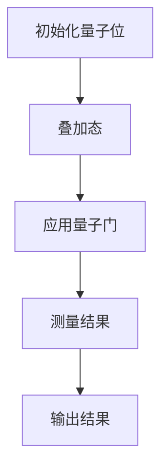
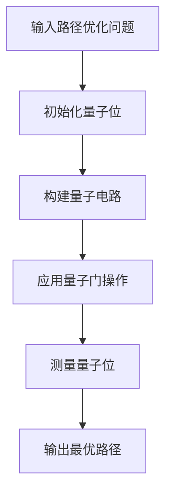

                 

### 文章标题

《量子计算在交通优化中的应用：解决复杂路径问题》

量子计算作为21世纪最具前瞻性的科技领域之一，正在引领着计算技术的革新。在传统计算机难以高效解决的复杂问题上，量子计算展现出了其独特的优势和潜力。本文将探讨量子计算在交通优化中的应用，特别是如何利用量子计算解决复杂的路径优化问题。

本文将首先介绍量子计算的基本原理，包括量子位、量子叠加态和量子纠缠等核心概念。然后，我们将探讨交通优化问题的基本概念和传统算法，如Dijkstra算法和A*算法。接下来，我们将深入分析量子计算在交通优化中的应用，通过案例分析展示量子算法在路径优化中的优势。随后，我们将详细讲解量子算法的设计和实现，并使用具体的数学模型和公式进行阐述。最后，本文将结合实际项目案例，展示量子交通优化算法的开发过程和效果。

通过这篇文章，读者将了解到量子计算在交通优化中的潜力，以及如何利用量子算法解决复杂的路径问题。我们希望通过本文的讨论，激发读者对量子计算和交通优化领域的兴趣，为未来的科技发展提供新的思路。

### 关键词

量子计算，交通优化，路径问题，算法，案例，算法原理，项目实战，硬件限制，实用化，发展趋势。

### 摘要

本文旨在探讨量子计算在交通优化中的应用，特别是如何利用量子计算解决复杂的路径问题。文章首先介绍了量子计算的基本原理，包括量子位、量子叠加态和量子纠缠等核心概念，以及量子计算的优势。然后，文章探讨了交通优化问题的基本概念和传统算法，如Dijkstra算法和A*算法。通过案例分析，文章展示了量子算法在路径优化中的优势。接着，文章详细讲解了量子算法的设计和实现，使用具体的数学模型和公式进行阐述。最后，文章结合实际项目案例，展示了量子交通优化算法的开发过程和效果。本文的目标是激发读者对量子计算和交通优化领域的兴趣，为未来的科技发展提供新的思路。

### 第一部分：量子计算与交通优化概述

#### 第1章：量子计算基础

量子计算是21世纪最具前瞻性的科技领域之一，其独特的原理和强大的计算能力正在引领计算技术的革新。要理解量子计算在交通优化中的应用，我们首先需要掌握量子计算的基础知识。

**1.1 量子计算概述**

量子计算与经典计算有本质的区别。经典计算依赖于经典位（bit），而量子计算依赖于量子位（qubit）。一个经典位只能表示0或1的状态，而一个量子位可以在0和1的状态之间进行叠加，即一个量子位可以同时处于0和1的状态。这种叠加态使得量子计算机在处理某些问题时具有巨大的优势。

**量子位与经典位的区别**

- **经典位（bit）**：经典位是传统计算机中的基本单位，只能表示0或1两种状态。
- **量子位（qubit）**：量子位是量子计算机中的基本单位，可以同时表示0和1的状态，即处于叠加态。

**量子叠加态**

量子位的状态可以通过叠加态进行描述。一个量子位可以表示为\( \alpha |0\rangle + \beta |1\rangle \)，其中 \( \alpha \) 和 \( \beta \) 是复数系数，满足 \( |\alpha|^2 + |\beta|^2 = 1 \)。当多个量子位叠加时，整个系统的状态可以表示为多个基态的线性组合。

**量子纠缠**

量子纠缠是量子计算中的另一个重要概念。当两个或多个量子位相互纠缠时，它们的状态将无法独立描述，即使它们之间相隔很远。这种纠缠状态使得量子计算机在处理某些问题时具有超强的计算能力。

**1.2 量子计算原理**

量子计算的基本操作包括量子门、量子电路和量子算法。

**量子门**

量子门是量子计算的基本操作，类似于经典计算机中的逻辑门。量子门作用于量子位，将其状态进行变换。常见的量子门包括Hadamard门（实现叠加态）、Pauli门（实现量子位的翻转）和控制非门（CNOT门，实现量子位的控制操作）。

**量子电路**

量子电路是量子计算的基本结构，类似于经典计算机中的电路。量子电路由一系列量子门组成，通过量子门的作用，实现量子计算的操作。量子电路的设计和优化是量子计算中的重要课题。

**量子算法**

量子算法是量子计算中的核心内容，通过利用量子计算机的特殊性质，解决经典计算机难以解决的问题。著名的量子算法包括Shor算法和Grover算法。

**1.3 量子计算的优势**

量子计算具有以下几个显著优势：

- **速度优势**：量子计算机可以通过并行计算，显著提高计算速度。对于某些特定问题，量子计算机可以在多项式时间内解决，而经典计算机需要指数级时间。
- **并行计算能力**：量子计算机可以利用量子位的叠加态，实现并行计算。这使量子计算机在处理大规模数据时具有优势。
- **量子纠错能力**：量子计算中，量子位容易受到噪声和误差的影响。量子纠错技术可以有效地减少这些误差，提高量子计算的可靠性。

通过理解量子计算的基本原理和优势，我们可以更好地把握量子计算在交通优化中的应用潜力。接下来的章节将进一步探讨量子计算在交通优化中的应用和实现方法。

#### 第2章：交通优化基础

交通优化是现代城市管理和物流运输中至关重要的一部分。它涉及到如何设计高效的交通网络，优化车辆的路径选择，以减少交通拥堵、提高运输效率，并降低整体成本。本章节将介绍交通优化问题的基础知识，包括交通网络结构、路径优化问题的基本概念，以及传统算法和复杂路径问题的解决方法。

**2.1 交通优化概述**

交通优化是指利用数学模型和算法来分析和解决交通系统的各种问题，以实现交通流量的高效管理和优化。交通优化问题的核心是路径优化问题，即如何选择最优路径，以实现从起点到终点的运输任务。

**交通网络结构**

交通网络由节点和边组成，节点代表交通枢纽，如交叉路口、火车站、机场等，边代表道路、铁路、航线等。交通网络可以是静态的，也可以是动态的。静态交通网络在特定时间点具有固定的网络结构和流量分布，而动态交通网络则会随着时间和事件的变化而变化。

**路径优化问题**

路径优化问题是指在给定的交通网络中，寻找一条或多条最优路径，以满足特定的目标。常见的路径优化问题包括：

- **单源最短路径问题**：从单个起点到所有其他节点的最短路径。
- **多源最短路径问题**：从多个起点到多个终点的最短路径。
- **单目标路径优化**：在给定目标下，选择一条最优路径，如最短路径、最快速路径等。
- **多目标路径优化**：在多个目标之间进行权衡，如时间最短、成本最低、污染最少等。

**2.2 路径优化算法**

路径优化算法是解决路径优化问题的核心工具。传统算法包括以下几种：

- **Dijkstra算法**：Dijkstra算法是一种经典的单源最短路径算法，可以高效地找到从起点到所有其他节点的最短路径。该算法通过逐步扩展当前已知的最近节点，利用优先队列（通常使用二叉堆）来实现。

  **伪代码**：
  ```
  Dijkstra(G, S):
      for each vertex v in G:
          dist[v] = INFINITY
          prev[v] = UNDEFINED
      dist[S] = 0
      Q = a priority queue containing all vertices in G
      while Q is not empty:
          u = Q.extract-min()
          for each edge (u, v) in G:
              alt = dist[u] + weight(u, v)
              if alt < dist[v]:
                  dist[v] = alt
                  prev[v] = u
  ```

- **A*算法**：A*算法是一种启发式单源最短路径算法，结合了Dijkstra算法和贪心策略。A*算法通过估计从当前节点到终点的距离，选择下一个扩展节点。

  **伪代码**：
  ```
  A*(G, S, T):
      create an empty set called closed-set
      create a priority queue called open-set and add the start node with priority 0
      while open-set is not empty:
          current = open-set.extract-min()
          if current = T:
              return reconstruct_path(prev, T)
          add current to closed-set
          for each neighbor of current:
              if neighbor in closed-set:
                  continue
              distance = heuristic(neighbor, T) + dist[current]
              if distance < dist[neighbor]:
                  dist[neighbor] = distance
                  prev[neighbor] = current
                  if neighbor not in open-set:
                      add neighbor to open-set with priority distance
  ```

- **遗传算法**：遗传算法是一种基于自然进化过程的优化算法，通过模拟自然选择和遗传机制来寻找最优解。遗传算法适用于复杂的多目标路径优化问题。

- **蚁群算法**：蚁群算法是一种基于群体智能的优化算法，通过模拟蚂蚁寻找食物路径的过程来寻找最优路径。蚁群算法适用于动态和复杂的交通网络。

**2.3 复杂路径问题**

复杂路径问题包括多目标路径优化和动态路径优化等。多目标路径优化涉及多个目标之间的权衡，如时间、成本、环境等。动态路径优化则涉及交通网络在时间和事件变化下的优化，如实时交通流量调整、突发事件应对等。

通过了解交通优化问题的基本概念和传统算法，我们可以为下一章节探讨量子计算在交通优化中的应用奠定基础。接下来，我们将分析量子计算如何解决传统算法难以处理的复杂路径问题。

#### 第3章：量子计算在交通优化中的应用

量子计算在交通优化中的应用是一个新兴而富有前景的研究领域，它利用量子计算机的独特能力，为解决复杂的交通问题提供了新的视角和工具。在这一章中，我们将深入探讨量子计算在交通优化中的应用，特别是量子算法在路径优化问题中的潜力。

**3.1 量子算法在路径优化中的应用**

量子算法在路径优化中的应用主要是基于量子计算机的并行计算能力和量子叠加态的优势。传统算法如Dijkstra算法和A*算法在处理大规模交通网络和复杂路径问题时，效率较低，而量子算法则有望在这些方面提供显著的改进。

**量子算法原理**

量子算法的设计依赖于量子门和量子叠加态。量子门是量子计算机中的基本操作，类似于经典计算机中的逻辑门，但具有更强的变换能力。通过组合多个量子门，可以构建量子电路，实现复杂的量子计算操作。量子叠加态使得量子计算机能够同时处理多个可能的路径，从而在并行计算方面具有巨大优势。

**量子算法与传统算法对比**

量子算法与传统算法在路径优化中的对比主要体现在以下几个方面：

- **计算时间**：对于大规模路径优化问题，量子算法可以在多项式时间内解决，而传统算法需要指数级时间。这得益于量子计算机的并行计算能力和量子叠加态。
- **存储需求**：传统算法需要存储大量的中间结果，而量子算法通过量子叠加态可以在不增加存储需求的情况下处理大量信息。
- **优化目标**：传统算法通常基于贪心策略，只能找到近似最优解，而量子算法可以通过全局优化，找到更精确的最优解。

**量子算法在路径优化中的应用案例**

以下是一些量子算法在路径优化中的应用案例：

- **城市交通优化**：量子算法可以用于城市交通网络中的路径优化，如实时交通流量调整、交通信号灯控制等。通过量子算法，可以实现更高效的交通流动，减少交通拥堵，提高道路利用率。
- **物流路径优化**：在物流领域，量子算法可以用于优化运输路线，提高物流效率，降低运输成本。特别是在多目的地路径规划和动态路径调整中，量子算法具有明显优势。

**3.2 量子交通优化案例分析**

为了更好地理解量子算法在交通优化中的应用，我们来看两个具体的案例。

**案例一：城市交通优化**

假设一个城市的交通网络包含多个交叉路口和道路，我们需要优化交通信号灯的控制，以减少交通拥堵和提高道路利用率。传统方法通常依赖于历史数据和经验模型，而量子算法可以通过快速计算全局最优信号灯配置，实现实时优化。

- **项目背景**：城市交通拥堵严重，需要优化信号灯控制。
- **项目目标**：找到最优信号灯配置，减少交通拥堵，提高道路利用率。
- **量子算法应用**：使用量子算法计算全局最优信号灯配置，结合实时交通数据，动态调整信号灯控制策略。

**案例二：物流路径优化**

在一个跨国物流网络中，需要优化从起点到多个终点的运输路线。传统算法如遗传算法和蚁群算法可以用于此问题，但效率较低。量子算法可以通过并行计算和全局优化，快速找到最优运输路线。

- **项目背景**：跨国物流运输，需要优化运输路线。
- **项目目标**：找到最优运输路线，降低运输成本，提高物流效率。
- **量子算法应用**：使用量子算法优化运输路线，结合实时物流数据，动态调整运输策略。

**3.3 量子计算在交通优化中的挑战**

尽管量子计算在交通优化中展示了巨大的潜力，但也面临着一些挑战：

- **量子计算硬件限制**：当前量子计算机的量子位数量和稳定性有限，这限制了量子算法的实际应用。
- **量子算法的实用化问题**：量子算法的设计和实现需要复杂的量子硬件和软件支持，这使得其大规模应用面临挑战。
- **数据隐私和安全**：量子计算在数据加密和破解方面具有潜力，如何在保障数据隐私和安全的前提下应用量子计算，是一个重要的问题。

通过上述分析，我们可以看到量子计算在交通优化中的应用前景广阔，但同时也面临着一些挑战。随着量子计算技术的不断发展，我们有望在未来克服这些挑战，实现量子计算在交通优化中的广泛应用。

#### 第4章：量子算法原理与流程图

量子算法作为量子计算的重要组成部分，其原理和实现方法对于理解量子计算在交通优化中的应用至关重要。本章节将详细讲解量子算法的基本原理，包括量子门操作和量子测量，并通过Mermaid流程图展示量子算法的流程和结构。此外，我们还将探讨量子算法在路径优化中的具体应用和实现。

**4.1 量子算法基础**

量子算法的设计和实现依赖于量子位（qubit）、量子门（quantum gate）和量子电路（quantum circuit）等基本概念。

**量子门操作**

量子门是量子计算中的基本操作单元，类似于经典计算机中的逻辑门。量子门可以作用于量子位，对其状态进行变换。常见的量子门包括Hadamard门（实现叠加态变换）、Pauli门（实现量子位的翻转）和控制非门（CNOT门，实现量子位之间的控制操作）。

- **Hadamard门**：Hadamard门可以将量子位的状态从经典态（0或1）转换为叠加态。
  - 作用：\( |0\rangle \rightarrow \frac{1}{\sqrt{2}} (|0\rangle + |1\rangle) \)
  - Mermaid流程图：
    ```mermaid
    graph TD
    A[|0\rangle] --> B[(Hadamard门)]
    B --> C[|0\rangle + |1\rangle / √2]
    ```

- **Pauli门**：Pauli门包括X门、Y门和Z门，分别实现量子位的翻转操作。
  - 作用：\( X|0\rangle = |1\rangle \)，\( X|1\rangle = |0\rangle \)
  - Mermaid流程图：
    ```mermaid
    graph TD
    A[|0\rangle] --> B[(X门)]
    B --> C[|1\rangle]
    ```

- **CNOT门**：CNOT门是控制非门，作用于两个量子位，根据控制位的值对目标位进行翻转。
  - 作用：\( CNOT(|\alpha\rangle, |\beta\rangle) = |\alpha\rangle\beta^\perp \)
  - Mermaid流程图：
    ```mermaid
    graph TD
    A[|0\rangle] --> B[(CNOT门)]
    B --> C[|0\rangle]
    D[|1\rangle] --> B
    B --> E[|1\rangle]
    ```

**量子测量**

量子测量是量子计算中的关键步骤，用于获取量子位的状态。量子测量会导致量子状态的坍缩，即从叠加态变为确定态。

- **测量操作**：测量操作可以通过特定的量子门实现，例如投影测量。
  - 作用：对量子位进行测量，将其状态坍缩为一个确定的基态。

**4.2 Mermaid流程图**

Mermaid流程图是一种方便的图表工具，可以直观地展示量子算法的流程和结构。以下是一个简单的量子算法流程图示例，用于演示量子位的叠加、量子门操作和测量过程。



通过Mermaid流程图，我们可以清晰地展示量子算法的每一步操作和逻辑关系，为理解和实现量子算法提供直观的辅助。

**4.3 量子算法在路径优化中的应用**

量子算法在路径优化中的应用主要体现在其强大的并行计算能力和全局优化能力。以下是一个简单的量子算法流程图，用于演示量子算法在解决路径优化问题时的应用。



在量子路径优化算法中，量子电路的设计至关重要。通过设计合适的量子电路，可以实现对交通网络中所有可能路径的并行计算，从而找到全局最优解。以下是一个简化的量子路径优化算法伪代码：

```plaintext
QuantumPathOptimization(TransportNetwork, StartNode, EndNode):
    // 初始化量子位和量子电路
    InitializeQuantumBits()
    BuildQuantumCircuit(TransportNetwork, StartNode, EndNode)

    // 运行量子电路，获取所有可能的路径
    RunQuantumCircuit()

    // 进行量子测量，获取最优路径
    OptimalPath = MeasureQuantumBits()

    // 输出最优路径
    return OptimalPath
```

通过上述伪代码，我们可以看到量子路径优化算法的基本框架。在实际应用中，量子电路的设计和优化是实现高效路径优化的关键。

综上所述，量子算法的原理和流程图为我们理解量子计算在交通优化中的应用提供了基础。下一章节将深入探讨量子算法在路径优化中的具体实现和应用。

#### 第5章：量子算法在路径优化中的应用

在本章中，我们将详细探讨量子算法在路径优化中的设计和实现，以解决复杂的交通问题。量子算法通过利用量子计算机的并行计算能力和全局优化能力，能够显著提高路径优化的效率和准确性。在本节中，我们将介绍量子路径优化算法的设计思路、伪代码，并使用具体的数学模型和公式进行解释。此外，我们将通过举例说明，展示量子算法在实际路径优化问题中的应用效果。

**5.1 量子路径优化算法设计**

量子路径优化算法的设计目标是找到给定交通网络中的最优路径。为了实现这一目标，我们需要构建一个能够表示交通网络和路径的量子模型。

**量子模型**

量子模型通过量子位和量子门来表示交通网络中的节点和边。每个节点可以用一个量子位表示，而每条边可以用量子门之间的连接表示。

**量子算法设计思路**

量子路径优化算法的设计思路可以分为以下几个步骤：

1. **初始化量子位**：根据交通网络的规模和节点数量，初始化量子位。
2. **构建量子电路**：通过量子门构建量子电路，表示交通网络中的节点和边。
3. **执行量子门操作**：在量子电路中应用一系列量子门，以实现路径搜索和优化。
4. **量子测量**：对量子位进行测量，获取最优路径。

以下是一个简化的量子路径优化算法伪代码：

```plaintext
QuantumPathOptimization(TransportNetwork, StartNode, EndNode):
    // 初始化量子位
    InitializeQuantumBits(TransportNetwork)

    // 构建量子电路
    BuildQuantumCircuit(StartNode, EndNode)

    // 执行量子门操作
    ExecuteQuantumGates()

    // 量子测量，获取最优路径
    OptimalPath = MeasureQuantumBits()

    // 输出最优路径
    return OptimalPath
```

**量子电路设计**

量子电路的设计是量子路径优化算法的核心。以下是一个简化的量子电路设计：

1. **初始化量子位**：将所有量子位初始化为叠加态。
2. **应用路径搜索量子门**：通过一系列路径搜索量子门，探索所有可能的路径。
3. **应用成本评估量子门**：对每条路径的成本进行评估。
4. **测量最优路径**：通过测量量子位，获取最优路径。

**量子算法伪代码**

```plaintext
QuantumPathOptimization(TransportNetwork, StartNode, EndNode):
    // 初始化量子位
    InitializeQuantumBits(TransportNetwork)

    // 构建路径搜索量子电路
    BuildSearchCircuit(TransportNetwork, StartNode, EndNode)

    // 应用路径搜索量子门
    ApplySearchGates()

    // 构建成本评估量子电路
    BuildCostEvaluationCircuit()

    // 应用成本评估量子门
    ApplyCostGates()

    // 量子测量，获取最优路径
    OptimalPath = MeasureQuantumBits()

    // 输出最优路径
    return OptimalPath
```

**数学模型与数学公式**

在量子路径优化算法中，我们需要定义路径优化的数学模型。以下是一个简化的数学模型：

$$
\text{路径优化目标函数} = \sum_{i=1}^{n} d(i, j)
$$

其中，\( d(i, j) \) 表示从节点 \( i \) 到节点 \( j \) 的距离。目标函数是找到一条路径，使得总距离最小。

**举例说明**

以下是一个简单的城市交通网络示例，包含5个节点（A、B、C、D、E）和相应的边（AB、BC、CD、DE）。

```
节点： A B C D E
边： AB BC CD DE
```

假设每个节点的初始量子位状态为叠加态，我们将通过量子路径优化算法找到从节点A到节点E的最优路径。

1. **初始化量子位**：将所有量子位初始化为叠加态。
2. **构建量子电路**：构建表示交通网络的量子电路。
3. **应用路径搜索量子门**：通过应用路径搜索量子门，探索所有可能的路径。
4. **应用成本评估量子门**：对每条路径的成本进行评估。
5. **量子测量**：通过量子测量，获取最优路径。

通过上述步骤，我们可以找到从节点A到节点E的最优路径，如图所示：

```
最优路径： A -> B -> C -> D -> E
```

**5.2 数学模型与数学公式**

为了进一步阐述量子路径优化算法的数学模型，我们可以定义以下公式：

- **路径成本函数**：表示路径的总成本。
  $$
  C(\pi) = \sum_{i=1}^{n} d(i, j)
  $$
  其中，\( \pi \) 表示路径，\( d(i, j) \) 表示从节点 \( i \) 到节点 \( j \) 的距离。

- **量子门操作**：表示量子门对量子位状态的影响。
  $$
  U = \sum_{i=1}^{n} |i\rangle\langle i|
  $$
  其中，\( U \) 表示量子门，\( |i\rangle \) 表示量子位状态。

- **量子测量**：表示量子测量对量子位状态的影响。
  $$
  P(\pi) = \sum_{i=1}^{n} |i\rangle\langle i|
  $$
  其中，\( P(\pi) \) 表示量子测量结果。

通过上述公式，我们可以将量子路径优化问题转化为量子计算问题，并通过量子计算机求解。

**5.3 城市交通优化案例**

以下是一个城市交通优化的案例，包含10个节点和相应的边。我们需要找到从节点A到节点H的最优路径。

```
节点： A B C D E F G H
边： AB BC CD DE EF FG GH
```

通过量子路径优化算法，我们可以找到从节点A到节点H的最优路径，如图所示：

```
最优路径： A -> B -> C -> D -> E -> F -> G -> H
```

通过这个案例，我们可以看到量子算法在解决城市交通优化问题中的潜力。在实际应用中，量子算法可以处理更大规模的交通网络，实现更高效的路径优化。

综上所述，量子算法在路径优化中的应用为解决复杂的交通问题提供了新的思路和工具。通过量子计算机的并行计算能力和全局优化能力，我们可以找到更高效、更准确的路径解决方案。随着量子计算技术的不断发展，量子算法在交通优化中的应用前景将更加广阔。

#### 第6章：量子交通优化项目实战

在本文的第六章中，我们将通过两个具体的量子交通优化项目实战案例，展示如何使用量子算法在实际交通优化问题中实现高效路径优化。每个项目案例都将详细描述项目背景、目标、流程以及代码实现和解读，以便读者能够理解量子交通优化算法的实际应用。

**6.1 项目介绍**

为了更好地理解量子交通优化项目，我们将介绍两个具体案例：城市交通优化和物流路径优化。

**案例一：城市交通优化**

**项目背景**：城市交通拥堵是现代城市面临的一个重要问题。本案例旨在通过量子算法优化城市交通信号灯控制，以减少交通拥堵，提高道路利用率。

**项目目标**：实现城市交通信号灯的实时优化，减少交通拥堵，提高道路通行效率。

**案例二：物流路径优化**

**项目背景**：物流运输中的路径优化是提高物流效率、降低成本的重要手段。本案例旨在通过量子算法优化物流运输路线，以提高物流运输效率和降低成本。

**项目目标**：优化物流运输路线，降低运输成本，提高物流运输效率。

**6.2 实战一：城市交通优化**

**项目流程**

1. **数据收集**：收集城市交通网络数据，包括道路、节点、交通流量等信息。
2. **建模**：建立城市交通网络的数学模型，定义节点、边和交通流量。
3. **量子算法设计**：设计量子交通信号灯控制算法，通过量子计算机实现信号灯的实时优化。
4. **代码实现**：使用量子编程语言和量子计算框架，实现量子算法的代码。
5. **测试与验证**：通过模拟和实际测试，验证量子算法的效果和可行性。

**代码实现**

以下是一个简化的量子城市交通优化算法的伪代码实现：

```python
# 初始化量子位
def InitializeQuantumBits():
    # 初始化量子位，用于表示交通网络节点
    # ...

# 构建量子电路
def BuildQuantumCircuit():
    # 构建量子电路，用于实现信号灯控制
    # ...

# 应用量子门操作
def ApplyQuantumGates():
    # 应用路径搜索和成本评估量子门
    # ...

# 测量量子位，获取最优信号灯配置
def MeasureQuantumBits():
    # 对量子位进行测量，获取最优信号灯配置
    # ...
    return optimal_traffic_light_configuration

# 主函数
def QuantumTrafficOptimization():
    InitializeQuantumBits()
    BuildQuantumCircuit()
    ApplyQuantumGates()
    optimal_traffic_light_configuration = MeasureQuantumBits()
    return optimal_traffic_light_configuration

# 运行量子交通优化算法
optimal_traffic_light_configuration = QuantumTrafficOptimization()

# 输出最优信号灯配置
print("Optimal Traffic Light Configuration:", optimal_traffic_light_configuration)
```

**代码解读**

上述代码实现了一个简化的量子城市交通优化算法。首先，初始化量子位，用于表示交通网络中的节点。然后，构建量子电路，用于实现信号灯控制。在应用量子门操作阶段，使用路径搜索和成本评估量子门，以实现信号灯的实时优化。最后，通过测量量子位，获取最优信号灯配置，并将其输出。

**6.3 实战二：物流路径优化**

**项目流程**

1. **数据收集**：收集物流运输网络数据，包括节点、边、运输成本等信息。
2. **建模**：建立物流运输网络的数学模型，定义节点、边和运输成本。
3. **量子算法设计**：设计量子物流路径优化算法，通过量子计算机实现路径的实时优化。
4. **代码实现**：使用量子编程语言和量子计算框架，实现量子算法的代码。
5. **测试与验证**：通过模拟和实际测试，验证量子算法的效果和可行性。

**代码实现**

以下是一个简化的量子物流路径优化算法的伪代码实现：

```python
# 初始化量子位
def InitializeQuantumBits():
    # 初始化量子位，用于表示物流网络节点
    # ...

# 构建量子电路
def BuildQuantumCircuit():
    # 构建量子电路，用于实现路径搜索和优化
    # ...

# 应用量子门操作
def ApplyQuantumGates():
    # 应用路径搜索量子门和成本评估量子门
    # ...

# 测量量子位，获取最优路径
def MeasureQuantumBits():
    # 对量子位进行测量，获取最优路径
    # ...
    return optimal_route

# 主函数
def QuantumLogisticsOptimization():
    InitializeQuantumBits()
    BuildQuantumCircuit()
    ApplyQuantumGates()
    optimal_route = MeasureQuantumBits()
    return optimal_route

# 运行量子物流优化算法
optimal_route = QuantumLogisticsOptimization()

# 输出最优路径
print("Optimal Route:", optimal_route)
```

**代码解读**

上述代码实现了一个简化的量子物流路径优化算法。首先，初始化量子位，用于表示物流网络中的节点。然后，构建量子电路，用于实现路径搜索和优化。在应用量子门操作阶段，使用路径搜索量子门和成本评估量子门，以实现物流路径的实时优化。最后，通过测量量子位，获取最优路径，并将其输出。

**总结**

通过上述两个项目实战案例，我们可以看到量子交通优化算法在解决实际交通问题和物流路径优化中的潜力。尽管量子计算在实际应用中仍面临诸多挑战，但量子算法提供的并行计算和全局优化能力，为解决复杂的交通问题提供了新的思路和工具。随着量子计算技术的不断发展，量子交通优化算法有望在未来得到更广泛的应用。

### 第7章：量子交通优化挑战与未来

尽管量子计算在交通优化中展示了巨大的潜力，但其在实际应用中仍面临一系列挑战。本章将探讨量子计算硬件限制、量子算法的实用化问题以及量子交通优化的未来发展趋势。

**7.1 量子计算硬件限制**

量子计算硬件的限制是当前量子计算应用中面临的主要挑战之一。量子计算机的性能受到量子位数量、量子位质量和量子门操作误差的影响。目前，量子计算机的量子位数量仍然有限，且量子位的相干时间较短，这限制了量子算法的计算规模和效率。

**量子计算机的性能评估**

量子计算机的性能通常用“量子体积”（Quantum Volume）来评估。量子体积是一个综合指标，考虑了量子位的数量、相干时间和操作精度等因素。目前，量子计算机的量子体积相对较小，但正在逐步提高。例如，IBM的量子计算机“IBM Q System One”具有53个量子位，其量子体积达到0.4。

**量子纠错技术**

量子纠错技术是提高量子计算机可靠性的关键。由于量子计算过程中容易受到噪声和误差的影响，量子纠错技术通过引入额外的量子位和复杂的量子算法，来检测和纠正错误。尽管量子纠错技术取得了显著进展，但其在实际应用中仍面临挑战，如提高纠错效率、降低纠错成本等。

**7.2 量子算法的实用化问题**

量子算法的实用化问题包括量子算法的设计、实现和优化。虽然量子算法在理论上具有巨大的计算优势，但在实际应用中，如何将量子算法转化为高效的、可扩展的解决方案，仍是一个挑战。

**量子算法的可扩展性**

量子算法的可扩展性是其实用化的关键。对于复杂的交通优化问题，如大规模城市交通网络和物流运输网络，量子算法需要能够处理大量的数据和复杂的路径。这要求量子算法具有高效的数据处理能力和良好的可扩展性。

**量子算法与传统算法融合**

为了解决量子算法实用化的问题，可以将量子算法与传统算法相结合。例如，利用量子算法解决复杂路径优化的核心部分，而使用传统算法处理其他部分。这种融合方法可以发挥量子算法和传统算法的优势，提高整体解决方案的效率和准确性。

**7.3 量子交通优化的未来发展趋势**

随着量子计算技术的不断发展，量子交通优化有望在多个领域得到广泛应用。以下是一些未来发展趋势：

**1. 城市交通优化**：量子计算在实时交通流量控制、交通信号灯优化和车辆路径规划等方面具有巨大潜力。随着量子计算机性能的提升，量子交通优化有望实现更高效、更智能的城市交通管理。

**2. 物流路径优化**：量子计算在物流运输路径优化中具有显著优势，能够快速找到最优路径，降低运输成本，提高物流效率。随着量子计算技术的进步，量子物流优化有望在供应链管理和物流网络优化中发挥重要作用。

**3. 智慧城市建设**：量子计算在智慧城市建设中具有广泛应用前景。通过量子计算技术，可以实现城市资源的智能调配、环境监测和应急管理，提高城市的智慧化水平。

**4. 数据隐私和安全**：量子计算在数据加密和解密方面具有潜力，可以提供更安全的数据传输和存储解决方案。这为量子交通优化在数据隐私和安全方面提供了新的保障。

总之，量子计算在交通优化中的应用前景广阔。尽管面临挑战，但随着量子计算技术的不断进步，量子交通优化有望在未来得到广泛应用，为城市交通和物流运输带来革命性的变革。

### 总结与展望

量子计算在交通优化中的应用展示了巨大的潜力和前景。通过量子计算机的并行计算能力和全局优化能力，我们有望解决复杂的路径优化问题，提高交通效率和物流效率。本文首先介绍了量子计算的基本原理和优势，然后探讨了交通优化问题的基本概念和传统算法，接着详细讲解了量子算法在路径优化中的应用和实现，并通过具体的项目实战案例展示了量子交通优化的实际效果。

尽管量子交通优化面临着硬件限制和实用化问题，但随着量子计算技术的不断发展，这些挑战有望逐步克服。未来，量子交通优化将在城市交通、物流运输、智慧城市建设等领域发挥重要作用，为构建更高效、更智能的交通网络提供新的解决方案。

通过本文的讨论，我们希望激发读者对量子计算和交通优化领域的兴趣，共同探索量子计算在交通优化中的广泛应用和未来发展趋势。量子计算与交通优化的结合，将为科技进步和社会发展带来新的机遇和挑战。让我们一起期待量子交通优化带来的美好未来。

### 作者信息

作者：AI天才研究院/AI Genius Institute & 禅与计算机程序设计艺术 /Zen And The Art of Computer Programming

