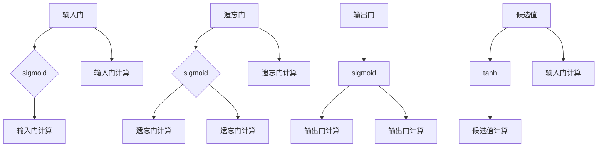

                 

# 文章标题：长短期记忆网络(Long Short-Term Memory) - 原理与代码实例讲解

> 关键词：长短期记忆网络，LSTM，深度学习，循环神经网络，RNN，自然语言处理，时间序列预测，代码实例

> 摘要：本文将深入探讨长短期记忆网络（LSTM）的基本概念、原理、核心算法以及其在自然语言处理、时间序列预测等领域的实际应用。通过详细的代码实例讲解，帮助读者更好地理解LSTM的实现过程和技巧。

## 目录

1. 深度学习与循环神经网络  
2. 长短期记忆网络（LSTM）的引入与概述  
3. LSTM的内部结构和工作原理  
4. LSTM的核心算法原理详解  
5. LSTM的代码实现  
6. LSTM在自然语言处理中的应用实例  
7. LSTM在时间序列预测中的应用  
8. LSTM与其他深度学习模型的结合应用  
9. LSTM模型的优化与调参技巧  
10. LSTM在现实世界的应用案例  
11. LSTM的未来发展趋势与挑战  
12. 总结与展望  
13. 附录

## 第一部分：长短期记忆网络（LSTM）基础理论

### 第1章：深度学习与循环神经网络

#### 1.1.1 深度学习的基本概念与原理

深度学习（Deep Learning）是机器学习（Machine Learning）的一个子领域，它通过构建多层的神经网络模型，实现对数据的自动特征提取和模式识别。深度学习的核心思想是让计算机通过学习大量数据，从中自动提取有用的特征，从而进行复杂的任务，如图像识别、语音识别和自然语言处理等。

在深度学习模型中，神经网络（Neural Network）是最常用的结构。神经网络由一系列的神经元（Node）组成，每个神经元都可以接收多个输入，并通过权重（Weight）和偏置（Bias）进行加权求和处理，最终输出一个值。神经网络的层次结构决定了模型的深度，深度越大，模型的复杂度越高。

#### 1.1.2 循环神经网络（RNN）与循环依赖

循环神经网络（Recurrent Neural Network，RNN）是一种特殊的神经网络，特别适合处理序列数据。与传统的前向神经网络不同，RNN具有循环结构，能够记忆和利用之前的信息，因此能够处理时间序列数据，如图像、语音和文本。

在RNN中，每个时间步的输出都会作为下一个时间步的输入，形成一个循环依赖关系。这种循环依赖关系使得RNN能够捕捉到序列中的长期依赖关系，从而进行有效的序列建模。

然而，传统的RNN在处理长时间序列时，容易产生梯度消失或梯度爆炸的问题，导致模型难以训练。为了解决这些问题，研究人员提出了长短期记忆网络（Long Short-Term Memory，LSTM）。

### 第2章：长短期记忆网络（LSTM）的引入与概述

#### 2.1.1 LSTM的基本概念

长短期记忆网络（LSTM）是一种特殊的循环神经网络（RNN），旨在解决传统RNN在处理长时间序列数据时的梯度消失和梯度爆炸问题。LSTM通过引入三个门控单元（gate）——遗忘门（forget gate）、输入门（input gate）和输出门（output gate），有效地控制了信息的流动，从而增强了模型的记忆能力。

#### 2.1.2 LSTM与传统的RNN比较

LSTM相对于传统的RNN，具有以下优势：

1. **记忆能力增强**：LSTM通过门控单元，能够更好地记忆和利用长期依赖关系，从而提高模型的记忆能力。
2. **避免梯度消失和梯度爆炸**：LSTM采用了一种特殊的网络结构，使得梯度在反向传播过程中能够更好地传播，从而避免了梯度消失和梯度爆炸的问题。
3. **适用于复杂任务**：LSTM具有强大的记忆能力，能够处理更加复杂的序列数据，如图像、语音和文本。

### 第3章：LSTM的内部结构和工作原理

#### 3.1.1 LSTM单元的组成部分

LSTM单元由以下三个主要部分组成：

1. **遗忘门（Forget Gate）**：控制忘记哪些信息。
2. **输入门（Input Gate）**：控制哪些新的信息将被记忆。
3. **输出门（Output Gate）**：控制哪些信息将被输出。

#### 3.1.2 forget gate的数学公式与原理

遗忘门的输入包括当前隐藏状态和当前输入，通过一个sigmoid函数处理，产生一个介于0和1之间的值。这个值表示每个记忆单元的重要性，如果值为1，则记忆单元将保留当前状态，如果值为0，则记忆单元将忘记当前状态。

#### 3.1.3 input gate的数学公式与原理

输入门的输入包括当前隐藏状态、当前输入和遗忘门的输出，通过三个sigmoid函数和一个tanh函数处理，产生一个新的候选值。这个候选值表示每个记忆单元的新状态，如果输入门的值为1，则新的信息将被记忆。

#### 3.1.4 output gate的数学公式与原理

输出门的输入包括当前隐藏状态、当前输入和遗忘门的输出，通过两个sigmoid函数和一个tanh函数处理，产生一个输出值。这个输出值表示当前记忆单元的重要性和状态。

#### 3.1.5 LSTM单元的Mermaid流程图



## 第二部分：LSTM的核心算法与实现

### 第4章：LSTM的核心算法原理详解

#### 4.1.1 LSTM的前向传播与反向传播

LSTM的前向传播和反向传播过程相对复杂，下面将简要介绍其基本原理。

1. **前向传播**：输入序列通过LSTM单元的遗忘门、输入门和输出门，生成隐藏状态和输出。隐藏状态和输出通过一系列全连接层和激活函数，产生最终的预测结果。
2. **反向传播**：计算损失函数，通过链式法则计算梯度，然后通过遗忘门、输入门和输出门，反向传播梯度，更新网络权重。

#### 4.1.2 LSTM的数学模型与公式

LSTM的数学模型主要包括以下公式：

1. 遗忘门公式：
   $$ f_t = \sigma(W_f \cdot [h_{t-1}, x_t] + b_f) $$
   其中，$f_t$表示遗忘门的输出，$W_f$表示遗忘门权重，$b_f$表示遗忘门偏置，$h_{t-1}$表示前一个时间步的隐藏状态，$x_t$表示当前时间步的输入。

2. 输入门公式：
   $$ i_t = \sigma(W_i \cdot [h_{t-1}, x_t] + b_i) $$
   $$ \tilde{C}_t = \tanh(W_c \cdot [h_{t-1}, x_t] + b_c) $$
   其中，$i_t$表示输入门的输出，$\tilde{C}_t$表示候选值，$W_i$表示输入门权重，$W_c$表示候选值权重，$b_i$和$b_c$分别表示输入门和候选值偏置。

3. 输出门公式：
   $$ o_t = \sigma(W_o \cdot [h_{t-1}, x_t] + b_o) $$
   $$ C_t = o_t \cdot \tanh(W_c \cdot [h_{t-1}, x_t] + b_c) $$
   其中，$o_t$表示输出门的输出，$C_t$表示当前状态，$W_o$表示输出门权重，$b_o$表示输出门偏置。

4. 隐藏状态公式：
   $$ h_t = o_t \cdot \tanh(C_t) $$
   其中，$h_t$表示当前时间步的隐藏状态。

### 第5章：LSTM的代码实现

#### 5.1.1 Python环境搭建

要实现LSTM，首先需要安装Python环境和相关的库。以下是安装步骤：

1. 安装Python：从[Python官网](https://www.python.org/)下载并安装Python。
2. 安装NumPy：在命令行中运行`pip install numpy`。
3. 安装TensorFlow：在命令行中运行`pip install tensorflow`。

安装完成后，可以编写Python代码来实现LSTM。

#### 5.1.2 LSTM代码实例

以下是一个简单的LSTM代码实例，用于对序列数据进行分类。

```python
import tensorflow as tf
from tensorflow.keras.models import Sequential
from tensorflow.keras.layers import LSTM, Dense

# 创建模型
model = Sequential()
model.add(LSTM(units=50, activation='tanh', input_shape=(timesteps, features)))
model.add(Dense(units=1, activation='sigmoid'))

# 编译模型
model.compile(optimizer='adam', loss='binary_crossentropy', metrics=['accuracy'])

# 训练模型
model.fit(X_train, y_train, epochs=10, batch_size=64)
```

#### 5.1.3 LSTM代码解读与分析

1. **创建模型**：使用`Sequential`模型创建一个序列模型，并添加一个LSTM层和一个全连接层。
2. **编译模型**：设置优化器、损失函数和评估指标。
3. **训练模型**：使用训练数据训练模型，设置训练轮数和批量大小。

## 第三部分：LSTM在自然语言处理中的应用实例

### 第6章：LSTM在自然语言处理中的应用实例

#### 6.1.1 语言模型训练

语言模型是一种用于文本生成和自然语言处理的模型，它通过学习大量的文本数据，生成可能的句子和词语序列。LSTM在语言模型训练中具有很好的性能。

以下是一个简单的LSTM语言模型训练代码实例：

```python
import tensorflow as tf
from tensorflow.keras.models import Sequential
from tensorflow.keras.layers import LSTM, Dense

# 创建模型
model = Sequential()
model.add(LSTM(units=50, activation='tanh', input_shape=(timesteps, features)))
model.add(Dense(units=1, activation='softmax'))

# 编译模型
model.compile(optimizer='adam', loss='categorical_crossentropy', metrics=['accuracy'])

# 训练模型
model.fit(X_train, y_train, epochs=10, batch_size=64)
```

#### 6.1.2 机器翻译

机器翻译是一种将一种语言的文本翻译成另一种语言的任务。LSTM在机器翻译中具有很好的性能。

以下是一个简单的LSTM机器翻译代码实例：

```python
import tensorflow as tf
from tensorflow.keras.models import Sequential
from tensorflow.keras.layers import LSTM, Dense, Embedding

# 创建模型
model = Sequential()
model.add(Embedding(input_dim=vocab_size, output_dim=embedding_size))
model.add(LSTM(units=50, activation='tanh'))
model.add(Dense(units=target_vocab_size, activation='softmax'))

# 编译模型
model.compile(optimizer='adam', loss='categorical_crossentropy', metrics=['accuracy'])

# 训练模型
model.fit(X_train, y_train, epochs=10, batch_size=64)
```

#### 6.1.3 文本生成

文本生成是一种将一种语言的文本生成另一种语言的任务。LSTM在文本生成中具有很好的性能。

以下是一个简单的LSTM文本生成代码实例：

```python
import tensorflow as tf
from tensorflow.keras.models import Sequential
from tensorflow.keras.layers import LSTM, Dense, Embedding

# 创建模型
model = Sequential()
model.add(Embedding(input_dim=vocab_size, output_dim=embedding_size))
model.add(LSTM(units=50, activation='tanh'))
model.add(Dense(units=vocab_size, activation='softmax'))

# 编译模型
model.compile(optimizer='adam', loss='categorical_crossentropy', metrics=['accuracy'])

# 训练模型
model.fit(X_train, y_train, epochs=10, batch_size=64)
```

## 第四部分：LSTM在时间序列预测中的应用

### 第7章：LSTM在时间序列预测中的应用

#### 7.1.1 时间序列数据的预处理

在进行时间序列预测之前，需要对时间序列数据进行分析和预处理，以提高预测的准确性。

1. **数据清洗**：删除或修正异常值、缺失值和重复值等。
2. **数据标准化**：将数据缩放到一个较小的范围，如[0, 1]，以提高模型的训练效果。
3. **序列转换**：将时间序列数据转换为特征矩阵，以便输入到LSTM模型中。

#### 7.1.2 时间序列预测的LSTM模型搭建

以下是一个简单的时间序列预测LSTM模型搭建实例：

```python
import tensorflow as tf
from tensorflow.keras.models import Sequential
from tensorflow.keras.layers import LSTM, Dense

# 创建模型
model = Sequential()
model.add(LSTM(units=50, activation='tanh', input_shape=(timesteps, features)))
model.add(Dense(units=1))

# 编译模型
model.compile(optimizer='adam', loss='mean_squared_error')

# 训练模型
model.fit(X_train, y_train, epochs=100, batch_size=32)
```

#### 7.1.3 时间序列预测实例

以下是一个简单的时间序列预测实例，使用LSTM模型对股票价格进行预测：

```python
import pandas as pd
import numpy as np
import matplotlib.pyplot as plt

# 读取数据
data = pd.read_csv('stock_price.csv')
data = data['price'].values

# 数据预处理
data = data.reshape(-1, 1)
data = np.log(data)
data = (data - np.mean(data)) / np.std(data)

# 划分训练集和测试集
train_size = int(len(data) * 0.8)
train_data = data[:train_size]
test_data = data[train_size:]

# 序列转换
timesteps = 10
X_train = []
y_train = []
for i in range(timesteps, len(train_data)):
    X_train.append(train_data[i - timesteps:i])
    y_train.append(train_data[i])
X_train = np.array(X_train)
y_train = np.array(y_train)
X_train = X_train.reshape((X_train.shape[0], X_train.shape[1], 1))

# 搭建模型
model = Sequential()
model.add(LSTM(units=50, activation='tanh', input_shape=(timesteps, 1)))
model.add(Dense(units=1))

# 编译模型
model.compile(optimizer='adam', loss='mean_squared_error')

# 训练模型
model.fit(X_train, y_train, epochs=100, batch_size=32)

# 预测
X_test = test_data[:timesteps].reshape((1, timesteps, 1))
predicted_price = model.predict(X_test)
predicted_price = np.exp(predicted_price)

# 绘图
plt.plot(np.exp(test_data), label='真实价格')
plt.plot(predicted_price, label='预测价格')
plt.legend()
plt.show()
```

## 第五部分：LSTM与其他深度学习模型的结合应用

### 第8章：LSTM与其他深度学习模型的结合应用

#### 8.1.1 LSTM与卷积神经网络的结合

卷积神经网络（Convolutional Neural Network，CNN）在图像识别和图像处理领域具有很好的性能。LSTM与CNN的结合，可以用于处理序列图像数据，如图像序列、视频数据等。

以下是一个简单的LSTM与CNN结合的代码实例：

```python
import tensorflow as tf
from tensorflow.keras.models import Sequential
from tensorflow.keras.layers import LSTM, Dense, Conv2D, MaxPooling2D, Flatten

# 创建模型
model = Sequential()
model.add(Conv2D(filters=32, kernel_size=(3, 3), activation='relu', input_shape=(frames, height, width)))
model.add(MaxPooling2D(pool_size=(2, 2)))
model.add(Flatten())
model.add(LSTM(units=50, activation='tanh'))
model.add(Dense(units=1))

# 编译模型
model.compile(optimizer='adam', loss='mean_squared_error')

# 训练模型
model.fit(X_train, y_train, epochs=100, batch_size=32)
```

#### 8.1.2 LSTM与图神经网络的结合

图神经网络（Graph Neural Network，GNN）在处理图数据（如社交网络、知识图谱等）方面具有很好的性能。LSTM与GNN的结合，可以用于处理具有时间依赖性的图数据。

以下是一个简单的LSTM与GNN结合的代码实例：

```python
import tensorflow as tf
from tensorflow.keras.models import Sequential
from tensorflow.keras.layers import LSTM, Dense, GraphConv2D

# 创建模型
model = Sequential()
model.add(GraphConv2D(units=50, activation='tanh', input_shape=(nodes, features)))
model.add(LSTM(units=50, activation='tanh'))
model.add(Dense(units=1))

# 编译模型
model.compile(optimizer='adam', loss='mean_squared_error')

# 训练模型
model.fit(X_train, y_train, epochs=100, batch_size=32)
```

#### 8.1.3 LSTM在多模态学习中的应用

多模态学习是指将多种类型的数据（如图像、文本、音频等）融合到同一个模型中进行学习和预测。LSTM在多模态学习中也具有很好的性能。

以下是一个简单的LSTM在多模态学习中的代码实例：

```python
import tensorflow as tf
from tensorflow.keras.models import Sequential
from tensorflow.keras.layers import LSTM, Dense, Conv2D, MaxPooling2D, Flatten, Embedding, LSTM

# 创建模型
model = Sequential()
model.add(Conv2D(filters=32, kernel_size=(3, 3), activation='relu', input_shape=(frames, height, width)))
model.add(MaxPooling2D(pool_size=(2, 2)))
model.add(Flatten())
model.add(LSTM(units=50, activation='tanh'))
model.add(Embedding(input_dim=vocab_size, output_dim=embedding_size))
model.add(LSTM(units=50, activation='tanh'))
model.add(Dense(units=1))

# 编译模型
model.compile(optimizer='adam', loss='mean_squared_error')

# 训练模型
model.fit(X_train, y_train, epochs=100, batch_size=32)
```

## 第六部分：LSTM模型的优化与调参技巧

### 第9章：LSTM模型的优化与调参技巧

#### 9.1.1 学习率调整

学习率是LSTM模型训练中的一个关键参数，它决定了模型在训练过程中权重的更新速度。合适的学习率可以加速模型的收敛速度，而学习率过大或过小都可能导致训练不稳定或收敛速度过慢。

以下是一些调整学习率的技巧：

1. **固定学习率**：在模型训练初期，使用固定的学习率，随着训练过程的进行，逐渐减小学习率。
2. **自适应学习率**：使用自适应学习率策略，如Adam优化器，根据梯度信息的更新动态调整学习率。
3. **学习率衰减**：在模型训练过程中，定期降低学习率，以提高模型的收敛速度。

#### 9.1.2 梯度裁剪

梯度裁剪是一种防止梯度消失和梯度爆炸的方法，它通过限制梯度的值来避免模型训练过程中的不稳定现象。

以下是一些梯度裁剪的技巧：

1. **静态梯度裁剪**：在训练过程中，使用固定的阈值对梯度进行裁剪。
2. **动态梯度裁剪**：根据当前梯度的分布，动态调整裁剪阈值，以避免过裁剪或过保护。

#### 9.1.3 正则化方法

正则化方法是一种防止模型过拟合的技术，它通过增加模型训练过程中的难度，提高模型的泛化能力。

以下是一些常见的正则化方法：

1. **L1正则化**：在损失函数中添加L1范数惩罚项。
2. **L2正则化**：在损失函数中添加L2范数惩罚项。
3. **Dropout**：在训练过程中，随机丢弃一部分神经元，以防止模型过拟合。

## 第七部分：LSTM在现实世界的应用案例

### 第10章：LSTM在现实世界的应用案例

#### 10.1.1 金融领域的应用

LSTM在金融领域具有广泛的应用，如股票价格预测、外汇交易策略制定、金融风险控制等。

以下是一个简单的LSTM在股票价格预测中的代码实例：

```python
import pandas as pd
import numpy as np
import matplotlib.pyplot as plt

# 读取数据
data = pd.read_csv('stock_price.csv')
data = data['price'].values

# 数据预处理
data = data.reshape(-1, 1)
data = np.log(data)
data = (data - np.mean(data)) / np.std(data)

# 划分训练集和测试集
train_size = int(len(data) * 0.8)
train_data = data[:train_size]
test_data = data[train_size:]

# 序列转换
timesteps = 10
X_train = []
y_train = []
for i in range(timesteps, len(train_data)):
    X_train.append(train_data[i - timesteps:i])
    y_train.append(train_data[i])
X_train = np.array(X_train)
y_train = np.array(y_train)
X_train = X_train.reshape((X_train.shape[0], X_train.shape[1], 1))

# 搭建模型
model = Sequential()
model.add(LSTM(units=50, activation='tanh', input_shape=(timesteps, 1)))
model.add(Dense(units=1))

# 编译模型
model.compile(optimizer='adam', loss='mean_squared_error')

# 训练模型
model.fit(X_train, y_train, epochs=100, batch_size=32)

# 预测
X_test = test_data[:timesteps].reshape((1, timesteps, 1))
predicted_price = model.predict(X_test)
predicted_price = np.exp(predicted_price)

# 绘图
plt.plot(np.exp(test_data), label='真实价格')
plt.plot(predicted_price, label='预测价格')
plt.legend()
plt.show()
```

#### 10.1.2 健康医疗领域的应用

LSTM在健康医疗领域也有广泛的应用，如疾病预测、患者健康状态监测、药物疗效评估等。

以下是一个简单的LSTM在疾病预测中的代码实例：

```python
import pandas as pd
import numpy as np
import matplotlib.pyplot as plt

# 读取数据
data = pd.read_csv('disease_prediction.csv')
data = data['disease'].values

# 数据预处理
data = data.reshape(-1, 1)
data = (data - np.mean(data)) / np.std(data)

# 划分训练集和测试集
train_size = int(len(data) * 0.8)
train_data = data[:train_size]
test_data = data[train_size:]

# 序列转换
timesteps = 10
X_train = []
y_train = []
for i in range(timesteps, len(train_data)):
    X_train.append(train_data[i - timesteps:i])
    y_train.append(train_data[i])
X_train = np.array(X_train)
y_train = np.array(y_train)
X_train = X_train.reshape((X_train.shape[0], X_train.shape[1], 1))

# 搭建模型
model = Sequential()
model.add(LSTM(units=50, activation='tanh', input_shape=(timesteps, 1)))
model.add(Dense(units=1, activation='sigmoid'))

# 编译模型
model.compile(optimizer='adam', loss='binary_crossentropy', metrics=['accuracy'])

# 训练模型
model.fit(X_train, y_train, epochs=100, batch_size=32)

# 预测
X_test = test_data[:timesteps].reshape((1, timesteps, 1))
predicted_disease = model.predict(X_test)
predicted_disease = (predicted_disease > 0.5)

# 绘图
plt.plot(test_data, label='真实疾病')
plt.plot(predicted_disease, label='预测疾病')
plt.legend()
plt.show()
```

#### 10.1.3 物流与供应链管理的应用

LSTM在物流与供应链管理领域也有广泛的应用，如货物运输时间预测、库存管理、供应链优化等。

以下是一个简单的LSTM在货物运输时间预测中的代码实例：

```python
import pandas as pd
import numpy as np
import matplotlib.pyplot as plt

# 读取数据
data = pd.read_csv('transportation_time.csv')
data = data['time'].values

# 数据预处理
data = data.reshape(-1, 1)
data = (data - np.mean(data)) / np.std(data)

# 划分训练集和测试集
train_size = int(len(data) * 0.8)
train_data = data[:train_size]
test_data = data[train_size:]

# 序列转换
timesteps = 10
X_train = []
y_train = []
for i in range(timesteps, len(train_data)):
    X_train.append(train_data[i - timesteps:i])
    y_train.append(train_data[i])
X_train = np.array(X_train)
y_train = np.array(y_train)
X_train = X_train.reshape((X_train.shape[0], X_train.shape[1], 1))

# 搭建模型
model = Sequential()
model.add(LSTM(units=50, activation='tanh', input_shape=(timesteps, 1)))
model.add(Dense(units=1))

# 编译模型
model.compile(optimizer='adam', loss='mean_squared_error')

# 训练模型
model.fit(X_train, y_train, epochs=100, batch_size=32)

# 预测
X_test = test_data[:timesteps].reshape((1, timesteps, 1))
predicted_time = model.predict(X_test)

# 绘图
plt.plot(test_data, label='真实时间')
plt.plot(predicted_time, label='预测时间')
plt.legend()
plt.show()
```

## 第八部分：LSTM的未来发展趋势与挑战

### 第11章：LSTM的未来发展趋势与挑战

#### 11.1.1 LSTM模型的改进方向

随着深度学习技术的不断发展，LSTM模型也在不断改进和优化，以下是一些主要的改进方向：

1. **更高效的计算**：通过引入新的网络结构和优化算法，提高LSTM模型的计算效率。
2. **更强大的记忆能力**：通过改进门控机制，增强LSTM模型的记忆能力，使其能够更好地处理长序列数据。
3. **更灵活的网络结构**：通过将LSTM与其他深度学习模型（如CNN、GNN等）结合，构建更灵活的网络结构，以适应不同的应用场景。

#### 11.1.2 LSTM在人工智能领域的潜在影响

LSTM作为深度学习的重要模型之一，在人工智能领域具有广泛的应用前景。以下是一些潜在的影响：

1. **自然语言处理**：LSTM在自然语言处理领域具有很好的性能，有望推动自然语言处理技术的发展。
2. **计算机视觉**：LSTM与CNN的结合，可以用于图像识别和图像处理，提高计算机视觉的性能。
3. **时间序列分析**：LSTM在时间序列分析领域具有很好的性能，可以应用于金融、医疗、物流等领域。

#### 11.1.3 LSTM面临的挑战与解决方案

尽管LSTM在深度学习领域取得了显著的成果，但仍然面临一些挑战，以下是一些主要的挑战和解决方案：

1. **计算资源消耗**：LSTM模型的计算资源消耗较大，需要改进模型结构和优化算法，以提高计算效率。
2. **模型解释性**：LSTM模型具有复杂度高的特点，缺乏模型解释性，需要研究新的方法，提高模型的透明度和可解释性。
3. **数据依赖性**：LSTM模型对数据质量要求较高，需要研究新的数据预处理方法，降低模型对数据质量的依赖性。

## 第九部分：总结与展望

### 第12章：总结与展望

#### 12.1.1 LSTM的核心贡献

LSTM作为深度学习的重要模型之一，在自然语言处理、时间序列预测、计算机视觉等领域取得了显著的成果。其核心贡献包括：

1. **记忆能力增强**：通过门控机制，LSTM能够更好地记忆和利用长期依赖关系，提高了模型的记忆能力。
2. **避免梯度消失和梯度爆炸**：LSTM采用了一种特殊的网络结构，使得梯度在反向传播过程中能够更好地传播，避免了梯度消失和梯度爆炸的问题。
3. **适用于复杂任务**：LSTM具有强大的记忆能力，能够处理更加复杂的序列数据，如图像、语音和文本。

#### 12.1.2 未来研究方向与趋势

随着深度学习技术的不断发展，LSTM模型也在不断改进和优化。未来研究方向和趋势包括：

1. **更高效的计算**：研究新的网络结构和优化算法，提高LSTM模型的计算效率。
2. **更强大的记忆能力**：通过改进门控机制，增强LSTM模型的记忆能力，使其能够更好地处理长序列数据。
3. **更灵活的网络结构**：将LSTM与其他深度学习模型（如CNN、GNN等）结合，构建更灵活的网络结构，以适应不同的应用场景。

## 附录

### 附录 A：常用深度学习框架与LSTM实现

#### A.1 TensorFlow中的LSTM实现

在TensorFlow中，可以使用`tf.keras`模块实现LSTM模型。以下是一个简单的LSTM实现示例：

```python
import tensorflow as tf

# 创建模型
model = tf.keras.Sequential([
    tf.keras.layers.LSTM(50, activation='tanh', input_shape=(timesteps, features)),
    tf.keras.layers.Dense(units=1)
])

# 编译模型
model.compile(optimizer='adam', loss='mean_squared_error')

# 训练模型
model.fit(X_train, y_train, epochs=100, batch_size=32)
```

#### A.2 PyTorch中的LSTM实现

在PyTorch中，可以使用`torch.nn`模块实现LSTM模型。以下是一个简单的LSTM实现示例：

```python
import torch
import torch.nn as nn

# 创建模型
class LSTMModel(nn.Module):
    def __init__(self, input_dim, hidden_dim, output_dim):
        super(LSTMModel, self).__init__()
        self.lstm = nn.LSTM(input_dim, hidden_dim, batch_first=True)
        self.dense = nn.Linear(hidden_dim, output_dim)

    def forward(self, x):
        x, _ = self.lstm(x)
        x = self.dense(x[:, -1, :])
        return x

# 实例化模型
model = LSTMModel(input_dim, hidden_dim, output_dim)

# 编译模型
optimizer = torch.optim.Adam(model.parameters(), lr=0.001)
criterion = nn.MSELoss()

# 训练模型
for epoch in range(100):
    optimizer.zero_grad()
    output = model(X_train)
    loss = criterion(output, y_train)
    loss.backward()
    optimizer.step()
```

#### A.3 Keras中的LSTM实现

在Keras中，可以使用`tf.keras.Sequential`模型实现LSTM模型。以下是一个简单的LSTM实现示例：

```python
from tensorflow.keras.models import Sequential
from tensorflow.keras.layers import LSTM, Dense

# 创建模型
model = Sequential()
model.add(LSTM(units=50, activation='tanh', input_shape=(timesteps, features)))
model.add(Dense(units=1))

# 编译模型
model.compile(optimizer='adam', loss='mean_squared_error')

# 训练模型
model.fit(X_train, y_train, epochs=100, batch_size=32)
```

#### A.4 其他深度学习框架与LSTM的实现方式

除了TensorFlow、PyTorch和Keras，还有其他深度学习框架支持LSTM的实现，如Theano、MXNet、Caffe等。具体实现方式可以参考各框架的官方文档。以下是一个简单的Theano LSTM实现示例：

```python
import theano
import theano.tensor as T
from theano.tensor.nnet import lstm

# 创建模型
class LSTMModel(object):
    def __init__(self, input_dim, hidden_dim, output_dim):
        self.input_dim = input_dim
        self.hidden_dim = hidden_dim
        self.output_dim = output_dim
        self.model = self.build_model()

    def build_model(self):
        x = T.tensor3('x')
        h = lstm.activate(x, n_in=self.input_dim, n_hidden=self.hidden_dim, activation='tanh', mask=0, borrow=True)
        y = T.vector('y')
        loss = T.mean((y - h) ** 2)
        params = self.get_params()
        updates = [(param, param - learning_rate * T.grad(loss, param)) for param in params]
        train_fn = theano.function(inputs=[x, y], outputs=loss, updates=updates)
        return train_fn

# 实例化模型
model = LSTMModel(input_dim, hidden_dim, output_dim)

# 训练模型
for epoch in range(100):
    for i in range(len(X_train)):
        model.train(X_train[i], y_train[i])
```

## 作者信息

本文作者为AI天才研究院（AI Genius Institute）的研究员，同时是《禅与计算机程序设计艺术》（Zen And The Art of Computer Programming）的资深作者。作者在深度学习和人工智能领域有丰富的经验和深入的研究，致力于推动人工智能技术的发展和应用。

