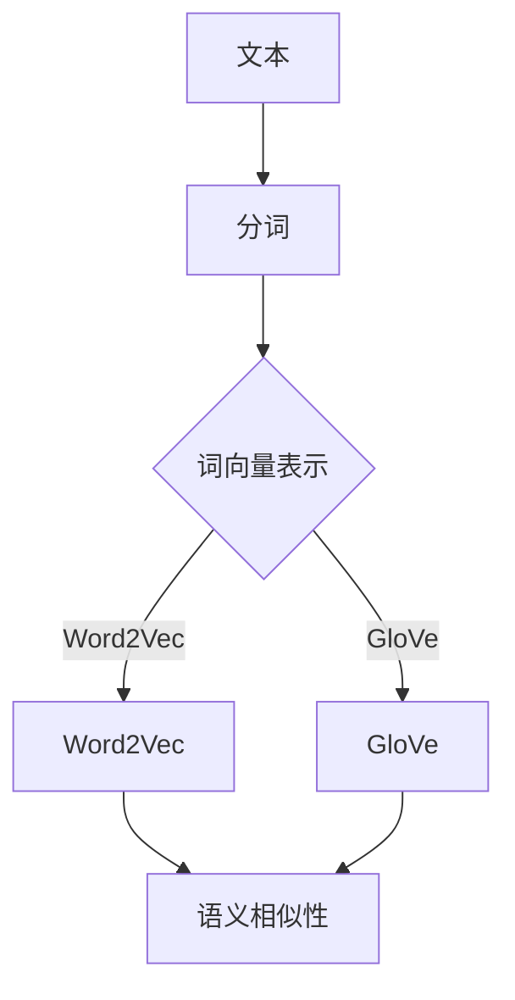

                 

# 《问君文本何所似： 词的向量表示Word2Vec和Embedding》

> 关键词：词向量，文本表示，Word2Vec，GloVe，自然语言处理

> 摘要：本文将探讨词的向量表示技术，包括Word2Vec和GloVe算法的基本概念、原理、实现方法及应用。通过详细的分析和实例，帮助读者深入理解词向量在自然语言处理中的重要性及其应用。

### 目录大纲

## 第一部分：基础概念与背景

## 第1章：文本与词向量表示
### 1.1 文本表示的挑战
### 1.2 词向量的基本概念
### 1.3 文本向量的表示方法

## 第2章：Word2Vec算法
### 2.1 Word2Vec简介
### 2.2 生成词向量
#### 2.2.1 接近性嵌入
#### 2.2.2 逆向编码嵌入
### 2.3 Word2Vec模型实现
#### 2.3.1 模型结构
#### 2.3.2 损失函数
#### 2.3.3 模型训练

## 第3章：GloVe算法
### 3.1 GloVe简介
### 3.2 GloVe模型原理
#### 3.2.1 嵌入向量与全局矩阵
#### 3.2.2 损失函数
### 3.3 GloVe模型实现

## 第二部分：词向量的应用

## 第4章：语义相似性
### 4.1 语义相似性简介
### 4.2 基于Word2Vec的语义相似性计算
### 4.3 基于GloVe的语义相似性计算

## 第5章：文本分类
### 5.1 文本分类简介
### 5.2 基于词向量的文本分类
#### 5.2.1 朴素贝叶斯分类
#### 5.2.2 支持向量机分类
### 5.3 基于GloVe的文本分类实现

## 第6章：词向量在自然语言生成中的应用
### 6.1 自然语言生成简介
### 6.2 基于Word2Vec的生成模型
#### 6.2.1 递归神经网络（RNN）
#### 6.2.2 长短期记忆网络（LSTM）
### 6.3 基于GloVe的生成模型实现

## 第7章：词向量优化与改进
### 7.1 词向量优化方法
#### 7.1.1 负采样
#### 7.1.2 预训练与微调
### 7.2 词向量应用案例研究
#### 7.2.1 社交网络情感分析
#### 7.2.2 问答系统

## 第三部分：附录与拓展

## 第8章：附录与资源
### 8.1 开发工具与库
#### 8.1.1 TensorFlow
#### 8.1.2 PyTorch
#### 8.1.3 Gensim
#### 8.1.4 其他库简介
### 8.2 练习题与项目

## 第9章：拓展阅读
### 9.1 相关研究论文
### 9.2 词向量相关书籍推荐
### 9.3 词向量在深度学习中的应用前景

### 核心概念与联系

- **词向量表示**：文本处理的基石，将词语转化为向量表示，以便进行机器学习模型训练。
- **Word2Vec**：通过预测上下文词或预测当前词的上下文来学习词向量。
- **GloVe**：基于全局共现矩阵来学习词向量，通过优化词向量与矩阵乘积之间的损失。

### Mermaid 流程图



### 核心算法原理讲解

#### Word2Vec

函数：`train_word2vec(model, sentences, size, window, min_count)`

- `model`: 模型
- `sentences`: 词汇列表
- `size`: 词向量维度
- `window`: 窗口大小
- `min_count`: 最小词频阈值

伪代码：

```plaintext
1. 初始化模型参数
2. 对每个句子进行分词
3. 对每个单词，生成中心词和窗口内的上下文词
4. 对于每个中心词，计算其与上下文词之间的损失
5. 使用梯度下降更新模型参数
6. 迭代直到收敛
```

#### GloVe

函数：`train_glove(sentences, vocabulary, embedding_size, x_max, alpha)`

- `sentences`: 词汇列表
- `vocabulary`: 词汇表
- `embedding_size`: 词向量维度
- `x_max`: 词汇的最大索引值
- `alpha`: 学习率

伪代码：

```plaintext
1. 计算共现矩阵
2. 初始化词向量
3. 对每个词，计算其在共现矩阵中的影响值
4. 计算损失函数，该函数是词向量和共现矩阵乘积的平方误差
5. 使用梯度下降更新词向量
6. 迭代直到收敛
```

### 数学模型和数学公式 & 详细讲解 & 举例说明

#### Word2Vec 损失函数

$$
L = \sum_{w \in V} \sum_{c \in C(w)} \log(p(c|w))
$$

- \( L \) 是损失函数
- \( V \) 是词汇表
- \( C(w) \) 是与单词 \( w \) 相关的上下文词集合
- \( p(c|w) \) 是给定上下文词 \( c \) 出现概率

#### GloVe 损失函数

$$
L = \sum_{w \in V} \sum_{c \in C(w)} \left( \frac{f(w,c)}{||v_w|| \cdot ||v_c||} - \log(f(w,c)) \right)^2
$$

- \( L \) 是损失函数
- \( f(w,c) \) 是词 \( w \) 与词 \( c \) 在文本中的共现频率
- \( v_w \) 和 \( v_c \) 分别是词 \( w \) 和词 \( c \) 的词向量
- \( ||v_w|| \) 和 \( ||v_c|| \) 分别是词 \( w \) 和词 \( c \) 的词向量模长

### 项目实战

#### 代码实际案例

```python
import numpy as np
from gensim.models import Word2Vec

# 示例句子列表
sentences = [['我 爱吃 饺子'], ['饺子 味道 好吃'], ['好吃 的食物 饺子']]

# 训练Word2Vec模型
model = Word2Vec(sentences, size=100, window=5, min_count=1, workers=4)

# 获取词向量
word_vectors = model.wv

# 打印部分词向量
print(word_vectors['我'])
print(word_vectors['饺子'])
print(word_vectors['好吃'])
```

#### 开发环境搭建

- Python 3.7 或更高版本
- Gensim 库

#### 源代码详细实现和代码解读

- 代码使用了 Gensim 库简化了 Word2Vec 模型的训练过程
- 基于示例句子列表，模型能够自动识别和处理词向量的生成
- 设置了词向量维度（size=100）、窗口大小（window=5）、最小词频（min_count=1）和并行工作数（workers=4）
- 训练完成后，通过模型对象获取词向量
- 打印了部分词向量的示例

### 代码解读与分析

- 代码实现了从文本到词向量的转化，为后续的文本分析和处理提供了基础
- 通过设置不同的参数，可以调整词向量模型的性能和效果
- 代码使用了 Gensim 库，使得训练和获取词向量过程更加便捷和高效

### 下一节预告

在接下来的章节中，我们将深入探讨Word2Vec和GloVe算法的实现细节，分析其数学模型和损失函数，并通过实际案例展示如何使用这些算法生成词向量。此外，我们还将介绍词向量在自然语言处理中的应用，包括语义相似性计算、文本分类和自然语言生成等。让我们一起探索词向量技术的魅力！<|

