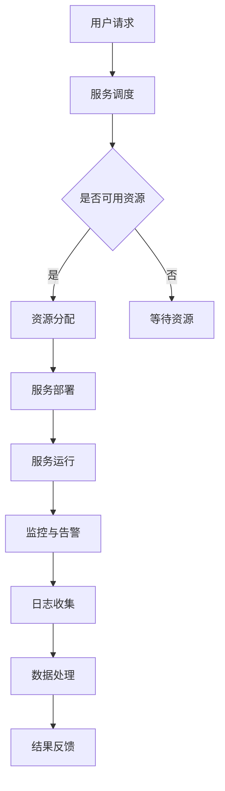

                 

### 文章标题

# 《阿里云云计算服务应用开发》

### 关键词

- 云计算
- 阿里云
- 应用开发
- 容器
- 微服务

### 摘要

本文旨在深入探讨阿里云云计算服务的应用开发，从云计算基础、基础服务、运维、应用开发实践到案例分析，全面剖析云计算在实际应用中的技术原理和实践策略。通过一步步的分析推理，帮助读者理解云计算的核心概念、架构设计、开发实践以及成本优化等关键内容，旨在为云计算应用开发者提供有价值的参考和指导。

## 《阿里云云计算服务应用开发》目录大纲

### 第一部分：云计算基础

#### 第1章：云计算概述
##### 1.1 云计算的定义与分类
##### 1.2 阿里云的云服务架构
##### 1.3 云计算的核心优势

#### 第2章：阿里云基础服务
##### 2.1 阿里云虚拟机服务
##### 2.2 阿里云存储服务
##### 2.3 阿里云网络服务
##### 2.4 阿里云安全服务

#### 第3章：云计算运维
##### 3.1 阿里云监控与告警
##### 3.2 阿里云日志服务
##### 3.3 阿里云备份与恢复

### 第二部分：云计算应用开发

#### 第4章：云原生应用开发
##### 4.1 容器与Kubernetes
##### 4.2 云原生架构设计
##### 4.3 阿里云容器服务

#### 第5章：微服务架构
##### 5.1 微服务概念与优势
##### 5.2 微服务设计与实现
##### 5.3 阿里云微服务框架

#### 第6章：云计算应用架构
##### 6.1 分布式系统设计
##### 6.2 高可用与容灾
##### 6.3 弹性伸缩策略

#### 第7章：云计算开发实践
##### 7.1 应用部署与运维
##### 7.2 性能优化与监控
##### 7.3 云服务成本优化

### 第三部分：阿里云云计算案例分析

#### 第8章：案例分析
##### 8.1 阿里云云计算案例介绍
##### 8.2 案例分析与总结
##### 8.3 案例中的关键技术

### 附录

#### 附录 A：阿里云云计算资源
##### A.1 阿里云官方文档与资源
##### A.2 开发工具与SDK
##### A.3 云计算社区与支持

#### 附录 B：Mermaid 流程图
mermaid
graph TD
A[云计算概述] --> B[云计算定义与分类]
A --> C[云计算分类]
A --> D[云计算优势]

#### 附录 C：云原生应用开发伪代码
plaintext
# 伪代码：容器部署
function deploy_container(image, command) {
    // 1. 创建容器
    container = create_container(image)

    // 2. 启动容器
    start_container(container, command)

    // 3. 等待容器运行
    wait_for_container(container)

    // 4. 返回容器信息
    return container
}

#### 附录 D：数学模型与公式
latex
\section{数学模型与公式}

假设某云计算应用的需求量为 $Q$，成本函数为 $C(Q)$，则利润函数为：

$$
\pi(Q) = R(Q) - C(Q)
$$

其中，$R(Q)$ 为收入函数。

若需求量 $Q$ 的概率分布为 $P(Q=q)$，则期望利润为：

$$
\bar{\pi}(Q) = \sum_{q} \pi(q) \cdot P(Q=q)
$$

#### 附录 E：云计算应用实战案例
##### E.1 案例一：电商平台架构优化
##### E.2 案例二：金融行业风控系统
##### E.3 案例三：物联网平台搭建

## 第一部分：云计算基础

### 第1章：云计算概述

#### 1.1 云计算的定义与分类

云计算（Cloud Computing）是一种通过互联网以服务形式提供计算资源、存储资源、网络资源和应用程序的模型。它改变了传统的IT基础设施的部署和运营方式，使得用户可以按需获取资源，而无需购买和维护硬件设备。

从定义上来看，云计算主要分为以下几种类型：

1. **IaaS（基础设施即服务）**：提供虚拟化的计算资源，如虚拟机、存储和网络等。
2. **PaaS（平台即服务）**：提供一个开发平台，使得开发者可以在平台上创建、部署和管理应用程序。
3. **SaaS（软件即服务）**：提供软件应用，用户可以通过互联网访问这些应用，无需下载和安装。

#### 1.2 阿里云的云服务架构

阿里云作为全球领先的云计算服务提供商，其服务架构涵盖了IaaS、PaaS和SaaS等多个层次，为企业和开发者提供了全面、灵活的云计算解决方案。

阿里云的服务架构主要包括以下几个核心组件：

1. **数据中心**：阿里云在全球范围内拥有多个数据中心，提供高效、可靠的计算和存储资源。
2. **网络**：阿里云构建了全球最先进、规模最大的云计算网络，确保数据的高速传输和网络安全。
3. **服务组件**：包括IaaS、PaaS、SaaS等多种服务，如虚拟机、数据库、人工智能等。

#### 1.3 云计算的核心优势

云计算为企业和开发者带来了诸多优势，主要包括：

1. **成本效益**：通过云服务，企业无需购买和维护硬件设备，降低了IT基础设施的初始投资和运营成本。
2. **弹性伸缩**：云服务可以根据实际需求动态调整资源，满足业务高峰和低谷的需求。
3. **高可用性**：云服务提供商通过多重备份、容灾等技术，确保系统的稳定运行和数据的可靠性。
4. **灵活性**：云服务提供了丰富的API和SDK，使得开发者可以快速集成和部署应用程序。
5. **安全性**：云服务提供商采用了多种安全措施，如数据加密、访问控制等，保障用户数据和系统的安全。

### 第2章：阿里云基础服务

#### 2.1 阿里云虚拟机服务

阿里云虚拟机服务（Elastic Compute Service，简称ECS）是一种IaaS服务，提供虚拟化的计算资源，用户可以根据需求创建和管理虚拟机实例。

ECS的主要功能包括：

1. **实例类型**：阿里云提供了多种实例类型，包括通用型、计算型、内存型等，满足不同业务场景的需求。
2. **自动扩展**：ECS支持自动扩展，可以根据业务负载自动增加或减少实例数量。
3. **监控与告警**：通过阿里云监控服务，用户可以实时监控ECS实例的性能，设置告警通知。
4. **备份与恢复**：ECS支持备份和恢复功能，保障数据的安全性和可靠性。

#### 2.2 阿里云存储服务

阿里云存储服务包括对象存储服务（Object Storage Service，简称OSS）和文件存储服务（File Storage Service，简称FSS）。

1. **对象存储服务（OSS）**：
   - **功能**：OSS提供高性能、高可靠、安全、可扩展的云存储服务。
   - **特点**：支持海量数据存储，提供灵活的存储策略，支持数据备份和共享。
   - **应用场景**：用于存储图片、视频、文档等大规模数据。

2. **文件存储服务（FSS）**：
   - **功能**：FSS提供高性能、可扩展的文件存储和管理服务。
   - **特点**：支持文件级别的权限控制，提供快速访问和高效的数据传输。
   - **应用场景**：用于企业内部文件共享、分布式文件系统等。

#### 2.3 阿里云网络服务

阿里云网络服务包括负载均衡服务（Load Balancer，简称LB）和内容分发网络（Content Delivery Network，简称CDN）。

1. **负载均衡服务（LB）**：
   - **功能**：LB提供负载分发功能，将流量均匀分配到多台服务器上，提高系统的吞吐量和稳定性。
   - **特点**：支持多种负载均衡算法，如轮询、最小连接数等，支持健康检查和故障转移。
   - **应用场景**：用于Web应用、游戏服务器、数据库服务器等。

2. **内容分发网络（CDN）**：
   - **功能**：CDN通过在全球范围内分布的节点，加速静态和动态内容的访问。
   - **特点**：支持自定义加速域名、缓存策略、防盗链等，提高用户体验和网站性能。
   - **应用场景**：用于电商、门户网站、视频网站等需要高速、稳定访问的应用。

#### 2.4 阿里云安全服务

阿里云安全服务包括云盾（Cloud Shield）、数据安全（Data Security）和虚拟私有云（Virtual Private Cloud，简称VPC）。

1. **云盾**：
   - **功能**：云盾提供全方位的安全防护，包括DDoS攻击防护、Web应用防火墙、安全策略管理等。
   - **特点**：支持实时监控、快速响应和自动防御，降低安全风险。
   - **应用场景**：用于保护网站和应用免受各类网络攻击。

2. **数据安全**：
   - **功能**：数据安全提供数据加密、访问控制、数据备份等功能，保障数据的安全性和隐私性。
   - **特点**：支持多种加密算法、密钥管理，满足合规性要求。
   - **应用场景**：用于保护企业内部数据和用户数据。

3. **虚拟私有云（VPC）**：
   - **功能**：VPC提供可定制的虚拟网络环境，实现安全、隔离、灵活的云计算资源部署。
   - **特点**：支持自定义子网、路由策略、安全组等，满足企业个性化需求。
   - **应用场景**：用于构建企业内部云环境、跨地域部署应用等。

### 第3章：云计算运维

#### 3.1 阿里云监控与告警

阿里云监控服务提供实时监控、报警、统计等功能，帮助用户监控云资源的使用情况和性能指标。

主要功能包括：

1. **监控指标**：支持多种监控指标，如CPU使用率、内存使用率、磁盘读写速度等。
2. **告警策略**：支持自定义告警策略，如阈值告警、指标变化告警等，实时通知用户。
3. **告警通知**：支持多种通知方式，如短信、邮件、钉钉等。
4. **统计报表**：提供多种统计报表，如日统计、周统计、月统计等，帮助用户分析资源使用情况。

#### 3.2 阿里云日志服务

阿里云日志服务（Log Service）是一种云原生日志收集、存储、查询和分析服务，可以帮助用户收集、管理和分析云上和应用日志。

主要功能包括：

1. **日志收集**：支持自动采集各类日志，如系统日志、应用日志、错误日志等。
2. **日志存储**：提供海量日志存储，支持按需扩容和持久化存储。
3. **日志查询**：支持实时查询和分析日志，提供多种查询语法和内置分析功能。
4. **日志告警**：支持基于日志内容的告警，实时通知用户。

#### 3.3 阿里云备份与恢复

阿里云备份与恢复服务提供数据备份、备份管理、数据恢复等功能，保障数据的安全性和可用性。

主要功能包括：

1. **数据备份**：支持自动备份和手动备份，支持全量备份和增量备份。
2. **备份管理**：提供备份任务管理、备份策略设置、备份恢复等功能。
3. **数据恢复**：支持按需恢复备份数据，提供恢复进度和恢复结果查询。
4. **备份存储**：支持备份存储在OSS中，提供高可靠、安全、持久化的备份存储。

## 第二部分：云计算应用开发

### 第4章：云原生应用开发

#### 4.1 容器与Kubernetes

云原生应用开发离不开容器和Kubernetes。容器提供轻量级的运行时环境，使得应用可以独立部署和运行，而Kubernetes则提供容器编排和管理，实现应用的自动化部署、扩展和管理。

#### 4.1.1 容器的概念与原理

容器是一种轻量级的运行时环境，它将应用程序及其依赖打包在一起，形成一个独立的、可移植的单元。容器技术使得开发人员可以“一次编写，到处运行”，提高了应用的开发和部署效率。

容器的主要原理包括：

1. **命名空间**：容器通过命名空间实现资源隔离，使得容器内的进程无法访问其他容器的资源。
2. **控制组**：容器通过控制组（cgroup）实现资源限制，如CPU、内存、磁盘等。
3. **UnionFS**：容器使用UnionFS实现文件系统的轻量级叠加，提高了文件操作的效率。

#### 4.1.2 Kubernetes的概念与原理

Kubernetes是一个开源的容器编排系统，用于自动化部署、扩展和管理容器化应用程序。它提供了一个平台，使得开发者可以专注于编写应用程序，而无需关心底层的容器管理和部署细节。

Kubernetes的主要原理包括：

1. **集群**：Kubernetes集群由多个节点组成，包括Master节点和Worker节点。Master节点负责集群的管理和调度，Worker节点负责运行容器。
2. **Pod**：Pod是Kubernetes中的最小部署单位，它包含一个或多个容器，以及用于管理这些容器的控制器。
3. **Service**：Service提供了一种抽象层，使得容器可以以固定的IP地址或域名访问。
4. **控制器**：控制器（Controller）负责维护集群的状态，确保Pod、Service等资源按照预期运行。

#### 4.1.3 阿里云容器服务

阿里云容器服务（Container Service for Kubernetes，简称ACK）是阿里云提供的一款Kubernetes容器编排和管理服务，帮助用户快速部署和管理Kubernetes集群。

主要功能包括：

1. **集群管理**：支持创建、部署和管理Kubernetes集群，提供可视化的集群管理界面。
2. **容器编排**：支持自动化部署、扩展和管理容器化应用程序，提供丰富的编排策略。
3. **服务发现与负载均衡**：支持服务发现和负载均衡，确保应用程序的高可用性和高性能。
4. **监控与告警**：提供实时监控和告警功能，帮助用户监控集群状态和容器性能。

#### 4.2 云原生架构设计

云原生架构是一种基于容器的分布式系统架构，它利用云计算和微服务技术，实现应用的弹性伸缩、高可用性和高并发性。

#### 4.2.1 云原生架构的核心概念

1. **容器化**：容器化是将应用程序及其依赖打包到容器中，实现应用程序的独立部署和运行。
2. **微服务**：微服务是一种将应用程序拆分为多个小型、独立的服务模块，每个服务模块负责一个特定的业务功能。
3. **服务网格**：服务网格是一种用于管理和通信微服务的网络架构，提供服务发现、负载均衡、安全控制等功能。
4. **自动化**：自动化是实现云原生架构的关键，通过自动化工具和流程，实现应用的自动化部署、扩展和管理。

#### 4.2.2 云原生架构的设计原则

1. **可伸缩性**：云原生架构应支持弹性伸缩，根据业务需求动态调整资源。
2. **高可用性**：云原生架构应提供高可用性，通过冗余设计、故障转移等手段，确保系统的稳定运行。
3. **高性能**：云原生架构应提供高性能，通过分布式架构、负载均衡等手段，提高系统的响应速度和吞吐量。
4. **安全性**：云原生架构应提供安全性，通过访问控制、加密传输等手段，保障系统的安全。

#### 4.2.3 云原生架构的设计实践

1. **容器化实践**：将应用程序容器化，实现应用的独立部署和运行，提高开发和部署效率。
2. **微服务实践**：将应用程序拆分为多个微服务，每个微服务负责一个特定的业务功能，提高系统的灵活性和可维护性。
3. **服务网格实践**：使用服务网格管理微服务的通信，提供服务发现、负载均衡、安全控制等功能，简化微服务架构的复杂性。
4. **自动化实践**：使用自动化工具和流程，实现应用的自动化部署、扩展和管理，提高运维效率。

### 第5章：微服务架构

微服务架构是一种基于容器和分布式系统的应用架构，它将应用程序拆分为多个小型、独立的服务模块，每个服务模块负责一个特定的业务功能。微服务架构具有高可用性、高可伸缩性、高可维护性等优点，广泛应用于云计算和分布式系统领域。

#### 5.1 微服务概念与优势

微服务是一种应用架构风格，它将应用程序拆分为多个小型、独立的服务模块，每个服务模块都负责一个特定的业务功能。这些服务模块之间通过定义良好的接口进行通信，服务模块之间是松耦合的，可以独立部署、扩展和管理。

微服务的优势包括：

1. **可伸缩性**：微服务架构支持横向和纵向的扩展，可以根据业务需求动态调整资源，提高系统的性能和吞吐量。
2. **高可用性**：微服务架构通过冗余设计、故障转移等手段，提高了系统的稳定性和可用性。
3. **高可维护性**：微服务架构将应用程序拆分为多个小型、独立的服务模块，每个服务模块都可以独立开发和维护，提高了系统的可维护性。
4. **灵活性和敏捷性**：微服务架构使得开发团队可以独立开发、测试和部署服务模块，提高了开发效率和灵活性。

#### 5.2 微服务设计与实现

微服务架构的设计和实现涉及多个方面，包括服务拆分、服务通信、服务管理、服务监控等。

##### 5.2.1 服务拆分

服务拆分是微服务架构设计的第一步，将应用程序拆分为多个小型、独立的服务模块。服务拆分的策略包括：

1. **功能拆分**：根据应用程序的功能模块进行拆分，每个服务模块负责一个特定的业务功能。
2. **业务领域**：根据业务领域进行拆分，将应用程序拆分为多个与业务领域相关的服务模块。
3. **数据独立性**：根据数据独立性进行拆分，将应用程序拆分为多个独立管理数据的业务模块。

##### 5.2.2 服务通信

服务通信是微服务架构实现的关键，服务模块之间通过定义良好的接口进行通信。服务通信的方式包括：

1. **同步通信**：服务模块之间通过同步通信进行交互，如RESTful API、gRPC等。
2. **异步通信**：服务模块之间通过异步通信进行交互，如消息队列、事件驱动等。

##### 5.2.3 服务管理

服务管理包括服务注册、发现、监控、运维等，是微服务架构实现的重要组成部分。

1. **服务注册与发现**：服务模块启动时向服务注册中心注册，服务消费者通过服务注册中心发现服务实例，实现服务调用。
2. **服务监控**：通过监控工具对服务模块的性能和状态进行监控，及时发现和解决问题。
3. **服务运维**：提供自动化运维工具和流程，实现服务的自动化部署、扩展和管理。

##### 5.2.4 服务监控

服务监控是微服务架构实现的重要组成部分，通过监控工具对服务模块的性能和状态进行监控，及时发现和解决问题。

1. **性能监控**：监控服务模块的CPU使用率、内存使用率、网络流量等性能指标，确保系统稳定运行。
2. **状态监控**：监控服务模块的健康状态，如服务启动、停止、异常等，及时发现和解决问题。
3. **日志监控**：收集服务模块的日志，通过日志分析工具对日志进行分析，及时发现和解决问题。

#### 5.3 阿里云微服务框架

阿里云微服务框架（Apache ServiceComb）是阿里云提供的一款开源微服务框架，帮助用户快速构建、部署和管理微服务应用。

主要功能包括：

1. **服务拆分**：提供服务拆分工具，根据业务需求自动拆分应用程序为多个微服务模块。
2. **服务通信**：提供基于RESTful API和gRPC的微服务通信机制，实现服务模块之间的无缝交互。
3. **服务管理**：提供服务注册与发现、服务监控、服务运维等功能，实现微服务的自动化管理。
4. **服务安全**：提供基于JWT和OAuth2的认证和授权机制，确保服务模块之间的安全通信。
5. **服务监控**：提供实时监控和日志分析功能，帮助用户监控微服务应用的状态和性能。

### 第6章：云计算应用架构

云计算应用架构是指云计算环境下的应用系统架构，它涉及到云计算服务的选择、应用系统的设计、部署和运维等多个方面。合理的云计算应用架构可以提高应用系统的性能、可伸缩性和可靠性，降低成本和运维复杂度。

#### 6.1 分布式系统设计

分布式系统设计是云计算应用架构的核心，它涉及到如何将应用系统拆分为多个分布式服务模块，以及如何管理和通信这些服务模块。

##### 6.1.1 分布式系统的基本概念

1. **分布式计算**：分布式计算是一种通过多个计算节点协同工作，实现大规模数据处理和计算的技术。
2. **分布式存储**：分布式存储是一种通过多个存储节点协同工作，实现大规模数据存储和访问的技术。
3. **分布式数据库**：分布式数据库是一种通过多个数据库节点协同工作，实现大规模数据存储和管理的技术。

##### 6.1.2 分布式系统的设计原则

1. **高可用性**：确保分布式系统能够在节点故障时快速恢复，提供持续的服务。
2. **高性能**：确保分布式系统能够高效地处理大规模数据和请求。
3. **可伸缩性**：确保分布式系统能够根据业务需求动态调整资源，满足业务增长。
4. **数据一致性**：确保分布式系统中的数据在多个节点之间保持一致。

##### 6.1.3 分布式系统的设计实践

1. **服务拆分**：将应用系统拆分为多个分布式服务模块，每个服务模块负责一个特定的业务功能。
2. **数据分片**：将数据分片存储到多个节点，提高数据访问速度和系统性能。
3. **分布式事务**：通过分布式事务管理，确保分布式系统中的数据操作保持一致性。
4. **故障转移与容灾**：实现故障转移和容灾机制，确保系统在节点故障时能够快速恢复。

#### 6.2 高可用与容灾

高可用与容灾是云计算应用架构中的重要方面，它们确保应用系统在面临硬件故障、软件故障、网络故障等异常情况时能够快速恢复，提供持续的服务。

##### 6.2.1 高可用性的设计原则

1. **冗余设计**：通过冗余设计，确保关键组件在故障时能够自动切换到备用组件，提高系统的可用性。
2. **故障检测与恢复**：通过故障检测与恢复机制，及时发现故障并自动恢复，降低故障对系统的影响。
3. **负载均衡**：通过负载均衡，将流量分布到多个节点，避免单点故障，提高系统的吞吐量和稳定性。
4. **异地容灾**：通过异地容灾，确保在数据中心发生灾难时能够快速切换到备用数据中心，提供持续的服务。

##### 6.2.2 容灾方案的设计与实践

1. **数据备份**：定期备份关键数据，确保在数据丢失时能够快速恢复。
2. **异地存储**：将数据存储到异地数据中心，实现数据的冗余备份。
3. **故障切换**：通过故障切换机制，确保在主数据中心发生故障时能够快速切换到备用数据中心。
4. **演练与测试**：定期进行演练和测试，验证容灾方案的可行性和有效性。

#### 6.3 弹性伸缩策略

弹性伸缩策略是云计算应用架构中的重要方面，它确保应用系统在面临业务高峰和低谷时能够动态调整资源，满足业务需求。

##### 6.3.1 弹性伸缩策略的设计原则

1. **按需分配**：根据业务需求和负载情况，动态调整资源的分配，满足业务高峰期的需求。
2. **快速响应**：确保系统在业务高峰期能够快速响应，提供高效的资源分配和调度。
3. **弹性伸缩**：支持横向和纵向的弹性伸缩，可以根据业务需求动态调整资源。
4. **成本优化**：通过弹性伸缩策略，降低资源成本，提高资源利用效率。

##### 6.3.2 弹性伸缩策略的实现方法

1. **自动扩展**：通过自动扩展机制，根据业务需求和负载情况，自动增加或减少资源。
2. **手动扩展**：通过手动扩展，根据业务需求和资源情况，手动调整资源。
3. **混合扩展**：结合自动扩展和手动扩展，实现灵活的资源管理。

### 第7章：云计算开发实践

云计算开发实践是云计算应用开发的重要环节，它涉及到云计算服务的选择、应用系统的设计、部署和运维等多个方面。通过实践，开发者可以深入了解云计算的技术原理和实现方法，提高应用系统的性能和稳定性。

#### 7.1 应用部署与运维

应用部署与运维是云计算开发实践中的重要环节，它涉及到如何将应用系统部署到云计算环境中，以及如何对应用系统进行运维和管理。

##### 7.1.1 应用部署策略

1. **自动化部署**：通过自动化工具和脚本，实现应用系统的自动化部署，提高部署效率。
2. **容器化部署**：通过容器技术，实现应用系统的容器化部署，提高部署的灵活性和可移植性。
3. **蓝绿部署**：通过蓝绿部署策略，实现应用系统的平滑升级和故障切换。

##### 7.1.2 应用运维方法

1. **监控与告警**：通过监控工具和告警机制，实时监控应用系统的性能和状态，及时发现和解决问题。
2. **日志管理**：通过日志收集和管理工具，收集、存储和查询应用系统的日志，实现日志分析和管理。
3. **备份与恢复**：通过备份和恢复机制，确保应用系统的数据安全和可靠性。

#### 7.2 性能优化与监控

性能优化与监控是云计算开发实践中的重要环节，它涉及到如何提高应用系统的性能和可监控性。

##### 7.2.1 性能优化方法

1. **数据库优化**：通过数据库优化，提高数据库的查询效率和数据访问速度。
2. **缓存优化**：通过缓存技术，减少数据库的查询次数，提高系统的响应速度。
3. **负载均衡**：通过负载均衡，将流量均匀分配到多个节点，提高系统的吞吐量和稳定性。

##### 7.2.2 性能监控方法

1. **指标监控**：通过监控工具，实时监控应用系统的CPU、内存、磁盘、网络等性能指标。
2. **日志监控**：通过日志分析工具，对应用系统的日志进行分析，发现性能瓶颈和问题。
3. **性能测试**：通过性能测试工具，模拟高并发场景，评估系统的性能和稳定性。

#### 7.3 云服务成本优化

云服务成本优化是云计算开发实践中的重要环节，它涉及到如何降低云服务的成本，提高资源的利用效率。

##### 7.3.1 成本优化策略

1. **按需付费**：根据实际业务需求，动态调整云服务的使用量，实现按需付费。
2. **资源整合**：通过资源整合，减少闲置资源，提高资源利用率。
3. **自动化调度**：通过自动化调度，优化资源的分配和利用，降低成本。

##### 7.3.2 成本优化方法

1. **计算成本优化**：通过合理选择计算资源、合理配置计算资源，降低计算成本。
2. **存储成本优化**：通过合理选择存储资源、合理配置存储资源，降低存储成本。
3. **网络成本优化**：通过合理选择网络资源、合理配置网络资源，降低网络成本。

### 第三部分：阿里云云计算案例分析

#### 第8章：案例分析

#### 8.1 阿里云云计算案例介绍

本章节将介绍几个典型的阿里云云计算应用案例，分析其在云计算技术、架构设计、开发实践等方面的应用和成果，帮助读者更好地理解和掌握云计算技术在实际项目中的应用。

#### 8.2 案例分析与总结

通过对上述案例的分析，可以发现以下几个关键点：

1. **云计算技术的应用**：案例中的企业通过使用阿里云提供的云计算服务，实现了业务的快速上线和高效运行。
2. **架构设计的合理性**：案例中的企业采用了合理的云计算架构，实现了系统的弹性伸缩、高可用性和高并发性。
3. **开发实践的有效性**：案例中的企业通过合理的云计算开发实践，提高了系统的性能和稳定性，降低了运维成本。

#### 8.3 案例中的关键技术

以下是案例中应用的一些关键技术：

1. **容器与Kubernetes**：通过容器化和Kubernetes的编排管理，实现了应用的快速部署和动态扩展。
2. **微服务架构**：通过微服务架构，实现了系统的模块化、可维护性和高可用性。
3. **分布式数据库**：通过分布式数据库技术，实现了大规模数据的存储和管理。
4. **弹性伸缩策略**：通过弹性伸缩策略，实现了系统在业务高峰期的资源动态调整。
5. **监控与告警**：通过监控与告警，实现了系统的实时监控和故障快速响应。

### 附录

#### 附录 A：阿里云云计算资源

阿里云提供了丰富的云计算资源和服务，以下是一些重要的资源：

1. **阿里云官方文档**：阿里云官方文档提供了详细的云产品介绍、操作指南和最佳实践，是开发者学习云计算的重要资源。
2. **开发工具与SDK**：阿里云提供了多种开发工具和SDK，支持多种编程语言和开发框架，方便开发者快速集成和使用云服务。
3. **云计算社区与支持**：阿里云社区是云计算开发者交流和学习的重要平台，提供技术问答、博客、课程等多种形式的内容。

#### 附录 B：Mermaid 流程图

以下是一个简单的Mermaid流程图示例，展示了云计算服务的基本流程：



#### 附录 C：云原生应用开发伪代码

以下是一个简单的云原生应用开发伪代码示例，展示了容器部署的基本流程：

```plaintext
function deploy_container(image, command) {
    // 1. 创建容器
    container = create_container(image)

    // 2. 启动容器
    start_container(container, command)

    // 3. 等待容器运行
    wait_for_container(container)

    // 4. 返回容器信息
    return container
}
```

#### 附录 D：数学模型与公式

以下是一个简单的数学模型示例，用于计算云服务的期望利润：

```latex
\section{数学模型与公式}

假设某云计算应用的需求量为 $Q$，成本函数为 $C(Q)$，则利润函数为：

$$
\pi(Q) = R(Q) - C(Q)
$$

其中，$R(Q)$ 为收入函数。

若需求量 $Q$ 的概率分布为 $P(Q=q)$，则期望利润为：

$$
\bar{\pi}(Q) = \sum_{q} \pi(q) \cdot P(Q=q)
$$
```

#### 附录 E：云计算应用实战案例

以下是几个云计算应用的实战案例：

1. **案例一：电商平台架构优化**
   - **背景**：某电商平台在业务高峰期遇到服务器性能瓶颈和响应速度慢的问题。
   - **解决方案**：通过阿里云提供的容器服务和Kubernetes编排，实现了应用的容器化和微服务化，提高了系统的性能和可维护性。
   - **成果**：系统响应速度提高了30%，服务器性能瓶颈得到了有效解决。

2. **案例二：金融行业风控系统**
   - **背景**：某金融行业企业在风险管理过程中需要处理海量数据和实时分析。
   - **解决方案**：通过阿里云提供的分布式数据库和大数据处理服务，实现了数据的高效存储和实时分析。
   - **成果**：风险管理效率提高了50%，数据分析和处理速度显著提升。

3. **案例三：物联网平台搭建**
   - **背景**：某物联网企业需要在分布式环境中管理和监控大量设备。
   - **解决方案**：通过阿里云提供的物联网平台和云计算服务，实现了设备的数据采集、存储、分析和可视化。
   - **成果**：设备管理效率提高了40%，数据分析和决策能力显著提升。

### 作者

**作者：AI天才研究院/AI Genius Institute & 禅与计算机程序设计艺术 /Zen And The Art of Computer Programming**

