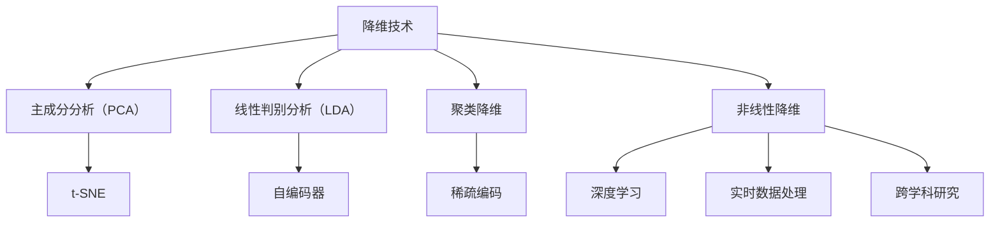

                 

# 文章标题

《降维技术：深度解析与应用实战》

> 关键词：降维技术、主成分分析、线性判别分析、非线性降维、t-SNE、自编码器、图像处理、数据挖掘、深度学习

> 摘要：本文系统地阐述了降维技术的基本概念、数学基础、各类降维算法及其在机器学习、图像处理、数据挖掘等领域的应用，通过逐步分析推理的方式，深入探讨了降维技术的核心原理和实践方法，为读者提供了全面的技术指导和实战案例。

## 《降维技术》目录大纲

### 第一部分：降维技术的理论基础

### 第1章：降维技术概述

#### 1.1 降维技术的基本概念

- **降维技术的定义**
- **降维技术的应用领域**

#### 1.2 降维技术的类型

- **主成分分析（PCA）**
- **线性判别分析（LDA）**
- **聚类降维**
- **非线性降维算法**

#### 1.3 降维技术的意义与挑战

- **数据压缩**
- **提高计算效率**
- **模型解释性**
- **挑战与解决方案**

### 第2章：降维技术的数学基础

#### 2.1 线性代数基础

- **矩阵与向量**
- **线性变换**
- **特征值与特征向量**

#### 2.2 概率论与统计基础

- **概率分布函数**
- **协方差矩阵**
- **最大似然估计**

#### 2.3 信息论基础

- **信息熵**
- **信息增益**
- **决策树**

### 第3章：线性降维技术

#### 3.1 主成分分析（PCA）

- **PCA原理与流程**
- **PCA在图像压缩中的应用**

#### 3.2 线性判别分析（LDA）

- **LDA原理与流程**
- **LDA在分类问题中的应用**

#### 3.3 特征选择与特征提取

- **特征选择的准则**
- **特征提取的方法**

### 第4章：非线性降维技术

#### 4.1 t-SNE算法

- **t-SNE原理与流程**
- **t-SNE在可视化中的应用**

#### 4.2 自编码器（Autoencoder）

- **自编码器原理与流程**
- **自编码器在降维中的应用**

#### 4.3 稀疏编码

- **稀疏编码原理与流程**
- **稀疏编码在降维中的应用**

### 第5章：降维技术在机器学习中的应用

#### 5.1 降维技术在分类问题中的应用

- **降维对分类模型的影响**
- **降维算法在分类问题中的应用案例**

#### 5.2 降维技术在回归问题中的应用

- **降维对回归模型的影响**
- **降维算法在回归问题中的应用案例**

#### 5.3 降维技术在聚类问题中的应用

- **降维对聚类模型的影响**
- **降维算法在聚类问题中的应用案例**

### 第6章：降维技术在图像处理中的应用

#### 6.1 图像降维的基本方法

- **图像降维的原理**
- **图像降维的方法**

#### 6.2 降维技术在图像压缩中的应用

- **基于PCA的图像压缩**
- **基于自编码器的图像压缩**

#### 6.3 降维技术在图像识别中的应用

- **降维对图像识别模型的影响**
- **降维算法在图像识别中的应用案例**

### 第7章：降维技术在数据挖掘中的应用

#### 7.1 数据降维的基本策略

- **数据降维的策略**
- **数据降维的方法**

#### 7.2 降维技术在关联规则挖掘中的应用

- **降维对关联规则挖掘的影响**
- **降维算法在关联规则挖掘中的应用案例**

#### 7.3 降维技术在分类与回归分析中的应用

- **降维对分类与回归分析的影响**
- **降维算法在分类与回归分析中的应用案例**

### 第8章：降维技术的未来发展

#### 8.1 降维技术在深度学习中的应用

- **深度学习中的降维方法**
- **深度学习中的降维挑战与解决方案**

#### 8.2 降维技术在实时数据处理中的应用

- **实时数据处理中的降维方法**
- **实时数据处理中的降维挑战与解决方案**

#### 8.3 降维技术在跨学科研究中的应用

- **降维技术在生物信息学中的应用**
- **降维技术在社会科学研究中的应用**

### 附录

#### 附录A：降维技术工具与资源

- **主流降维算法实现工具**
- **降维技术学习资源推荐**

#### 附录B：降维技术常见问题解答

- **常见问题汇总**
- **问题解答与建议**

#### 附录C：降维技术实验与项目指南

- **实验环境搭建**
- **项目实践案例**
- **项目实现与代码解读**

#### 附录D：降维技术相关参考文献

- **降维技术相关学术论文**
- **降维技术相关书籍推荐**

### 附加信息

#### 附加信息1：降维技术核心概念与联系流程图

- **Mermaid 流程图：展示降维技术核心概念及其相互联系**

#### 附加信息2：降维技术核心算法原理讲解

- **伪代码：详细阐述降维技术的核心算法原理**

#### 附加信息3：数学模型和数学公式详细讲解与举例说明

- **LaTeX 格式：嵌入文中独立段落的数学公式**
- **示例：举例说明数学模型在实际应用中的运用**

### 文章标题：降维技术：深度解析与应用实战

降维技术，作为数据科学和机器学习领域的重要工具，旨在通过减少数据维度来提高计算效率和模型解释性。本文将从理论基础出发，逐步深入探讨降维技术的各类算法，并在实际应用中展示其强大功能。通过阅读本文，读者将能够全面理解降维技术的核心概念、数学基础、算法原理以及在不同领域的应用实例，从而为实际项目提供有力支持。

### 关键词

- 降维技术
- 主成分分析
- 线性判别分析
- 非线性降维
- t-SNE算法
- 自编码器
- 图像处理
- 数据挖掘
- 深度学习

### 摘要

降维技术是数据科学和机器学习中的重要工具，通过降低数据维度，提高计算效率和模型解释性。本文首先介绍了降维技术的基本概念和类型，包括主成分分析（PCA）、线性判别分析（LDA）、聚类降维和非线性降维算法。随后，文章深入讲解了降维技术的数学基础，包括线性代数、概率论与统计、信息论。接着，文章详细阐述了线性降维技术和非线性降维技术的原理与应用，包括PCA、LDA、t-SNE、自编码器和稀疏编码。随后，文章介绍了降维技术在机器学习、图像处理、数据挖掘等领域的应用，并提供了实际案例。最后，文章展望了降维技术的未来发展方向，包括在深度学习、实时数据处理和跨学科研究中的应用。通过本文，读者将能够全面了解降维技术的核心概念、原理和应用，为实际项目提供指导。

### 第一部分：降维技术的理论基础

#### 第1章：降维技术概述

#### 1.1 降维技术的基本概念

降维技术是一种在保持数据关键特征的同时，减少数据维度以简化数据集的方法。降维的主要目的是通过降低数据的复杂性来提高计算效率，同时增强模型的解释性。降维技术广泛应用于数据科学、机器学习和图像处理等领域。

- **定义**：降维技术指的是从高维数据集中提取出低维数据集，同时尽量保留原始数据的结构信息和关键特征。
- **应用领域**：降维技术广泛应用于以下领域：
  - **数据压缩**：通过减少数据维度来降低存储空间需求。
  - **模型简化**：降低模型复杂度，提高计算速度和解释性。
  - **特征选择**：从大量特征中选出最重要的特征，提高模型性能。
  - **可视化**：将高维数据投影到低维空间，便于人类理解和分析。

#### 1.2 降维技术的类型

降维技术主要分为线性降维和非线性降维两大类。以下是对几种主要降维技术的简要介绍：

- **主成分分析（PCA）**：PCA是一种经典的线性降维技术，通过求解协方差矩阵的特征值和特征向量来找到数据的主成分，进而将数据投影到低维空间。
- **线性判别分析（LDA）**：LDA主要用于分类问题，通过最大化类间方差和最小化类内方差来找到最佳投影方向，从而将数据划分到不同的类别。
- **聚类降维**：聚类降维通过聚类算法（如K-means）对高维数据进行聚类，然后对每个聚类中心进行降维。
- **非线性降维算法**：非线性降维算法包括t-SNE、自编码器和稀疏编码等。这些算法通过非线性映射将高维数据投影到低维空间，以保持数据之间的相似性。

#### 1.3 降维技术的意义与挑战

降维技术在数据科学和机器学习领域具有重要意义，但也面临一些挑战。

- **数据压缩**：降维技术可以显著减少数据存储空间需求，特别是在大数据环境下。
- **提高计算效率**：通过降低数据维度，减少计算量和计算时间，从而提高模型的训练和预测速度。
- **模型解释性**：降维技术有助于简化模型结构，提高模型的可解释性，从而便于理解和优化模型。
- **挑战与解决方案**：
  - **信息损失**：降维过程中可能会损失部分数据信息，特别是在非线性降维中。解决方案包括选择合适的降维算法和参数。
  - **过拟合**：降维技术可能会导致模型过拟合。为了避免过拟合，需要选择合适的特征和算法，并在训练和验证数据上进行严格的测试。

### 第2章：降维技术的数学基础

降维技术的实现依赖于多种数学工具和理论基础。本节将介绍线性代数、概率论与统计以及信息论等基础数学知识，为理解降维技术提供必要的背景。

#### 2.1 线性代数基础

线性代数是降维技术的重要数学基础，包括矩阵与向量、线性变换、特征值与特征向量等内容。

- **矩阵与向量**：矩阵是一种由数字组成的二维数组，向量是矩阵的一个特例。矩阵与向量在数据降维中扮演重要角色，例如在主成分分析（PCA）中，通过矩阵运算来找到数据的主成分。
- **线性变换**：线性变换是一种将数据从一种坐标系映射到另一种坐标系的方法。在降维技术中，线性变换可用于将高维数据映射到低维空间。
- **特征值与特征向量**：特征值和特征向量是矩阵的重要属性。在降维技术中，特征值和特征向量用于确定数据的主要成分，例如在PCA中，通过特征值和特征向量来识别数据的主要方向。

#### 2.2 概率论与统计基础

概率论与统计是降维技术中用于建模和评估的重要工具。以下内容是概率论与统计基础的关键概念：

- **概率分布函数**：概率分布函数描述了随机变量取值的概率分布。在降维技术中，概率分布函数用于建模数据特征。
- **协方差矩阵**：协方差矩阵是描述多变量之间相关性的重要工具。在PCA中，协方差矩阵用于识别数据的主要成分。
- **最大似然估计**：最大似然估计是一种用于估计模型参数的方法。在降维技术中，最大似然估计可用于选择最优的降维参数。

#### 2.3 信息论基础

信息论是研究信息传输和处理的基本理论，包括信息熵、信息增益和决策树等概念。

- **信息熵**：信息熵是衡量信息不确定性的度量。在降维技术中，信息熵用于评估降维过程中信息的损失。
- **信息增益**：信息增益是用于特征选择的重要指标。在降维技术中，信息增益可用于选择最重要的特征。
- **决策树**：决策树是一种常用的分类和回归模型。在降维技术中，决策树可用于评估降维对模型性能的影响。

通过了解线性代数、概率论与统计以及信息论的基础知识，我们可以更好地理解和应用降维技术。接下来，我们将进一步探讨线性降维技术，包括主成分分析（PCA）和线性判别分析（LDA）等经典算法。

### 第3章：线性降维技术

线性降维技术是降维技术中最为经典和广泛应用的一部分。本章将重点介绍主成分分析（PCA）和线性判别分析（LDA）两种主要的线性降维方法，并探讨特征选择和特征提取的相关问题。

#### 3.1 主成分分析（PCA）

主成分分析（PCA，Principal Component Analysis）是一种通过线性变换将高维数据映射到低维空间的方法。PCA的基本思想是找到一组新的正交基，使得数据在新基下的投影方差最大化。以下是PCA的基本原理和步骤：

1. **标准化数据**：为了消除不同特征之间的尺度差异，首先需要对数据进行标准化处理，即将每个特征减去其均值并除以标准差。
   $$ x_{\text{standardized}} = \frac{x - \mu}{\sigma} $$
   其中，$x$为原始数据，$\mu$为均值，$\sigma$为标准差。

2. **计算协方差矩阵**：接下来，计算标准化数据矩阵$X$的协方差矩阵$C$。
   $$ C = \frac{1}{N-1}XX^T $$
   其中，$N$为样本数量。

3. **求解特征值和特征向量**：对协方差矩阵$C$进行特征值分解，得到特征值$\lambda_i$和特征向量$v_i$。
   $$ C = VDV^T $$
   其中，$V$是对应特征向量的矩阵，$D$是对角阵，包含特征值$\lambda_i$。

4. **选择主成分**：按照特征值的大小选择前$k$个最大的特征值对应的特征向量，这些特征向量构成了新基向量。将这些基向量作为新坐标轴，将原始数据投影到低维空间。
   $$ z = XV $$
   投影后的数据$z$包含了原始数据的主要信息。

5. **PCA在图像压缩中的应用**：PCA在图像压缩中有着广泛的应用。通过PCA，可以将图像的每个像素点投影到低维空间，从而减少图像数据的大小。以下是一个简单的图像压缩示例：

   假设我们有$N \times M$个像素点的图像，通过PCA将其投影到2D空间。首先对图像进行标准化处理，然后计算协方差矩阵，并求解特征值和特征向量。选择两个最大的特征值对应的特征向量，将图像投影到2D空间。最后，使用这两个特征向量重构图像，从而实现图像压缩。

   ```python
   import numpy as np
   
   # 假设图像为N*M的矩阵
   image = np.random.rand(N, M)
   
   # 标准化图像
   mean = np.mean(image, axis=(0, 1))
   std = np.std(image, axis=(0, 1))
   image_standardized = (image - mean) / std
   
   # 计算协方差矩阵
   cov_matrix = np.cov(image_standardized, rowvar=False)
   
   # 求解特征值和特征向量
   eigenvalues, eigenvectors = np.linalg.eigh(cov_matrix)
   
   # 选择两个最大的特征值对应的特征向量
   k = 2
   eigenvectors_k = eigenvectors[:, np.argsort(eigenvalues)[-k:]]
   
   # 投影图像到2D空间
   projected_image = np.dot(image_standardized, eigenvectors_k)
   
   # 重构图像
   reconstructed_image = np.dot(projected_image, eigenvectors_k.T) * std + mean
   
   # 显示重构图像
   import matplotlib.pyplot as plt
   plt.imshow(reconstructed_image, cmap='gray')
   plt.show()
   ```

#### 3.2 线性判别分析（LDA）

线性判别分析（LDA，Linear Discriminant Analysis）是一种用于分类的线性降维方法。LDA的基本思想是找到一组线性组合，使得不同类别之间的距离最大化，同时类内距离最小化。以下是LDA的基本原理和步骤：

1. **计算类内协方差矩阵$S_w$和类间协方差矩阵$S_b$**：
   - 类内协方差矩阵$S_w$表示同类别数据之间的方差，计算公式为：
     $$ S_w = \sum_{i=1}^C (N_i - 1)S_i $$
     其中，$C$为类别数，$N_i$为第$i$类样本数量，$S_i$为第$i$类的协方差矩阵。
   - 类间协方差矩阵$S_b$表示不同类别之间的方差，计算公式为：
     $$ S_b = \sum_{i=1}^C N_i(\mu_i - \mu)(\mu_i - \mu)^T $$
     其中，$\mu$为总体均值，$\mu_i$为第$i$类的均值。

2. **计算判别式$D$**：
   $$ D = \frac{S_b}{S_w} $$
   判别式$D$用于衡量数据类内和类间方差的关系。

3. **求解特征值和特征向量**：对判别式$D$进行特征值分解，得到特征值$\lambda_i$和特征向量$v_i$。
   $$ D = VDV^T $$
   其中，$V$是对应特征向量的矩阵，$D$是对角阵，包含特征值$\lambda_i$。

4. **选择最佳投影方向**：按照特征值的大小选择前$k$个最大的特征值对应的特征向量，这些特征向量构成了新基向量。将这些基向量作为新坐标轴，将原始数据投影到低维空间。

5. **LDA在分类问题中的应用**：LDA通过将数据投影到最佳投影方向上，从而实现数据的分类。以下是一个简单的LDA分类示例：

   假设我们有多个类别的样本数据，通过LDA将数据投影到2D空间进行分类。首先计算类内协方差矩阵和类间协方差矩阵，然后求解判别式，选择最佳投影方向。最后，使用这些投影方向对测试数据进行分类。

   ```python
   from sklearn.discriminant_analysis import LinearDiscriminantAnalysis
   
   # 假设样本数据为N*D的矩阵
   X = np.random.rand(N, D)
   y = np.random.randint(0, C, size=N)
   
   # 创建LDA对象
   lda = LinearDiscriminantAnalysis(n_components=2)
   
   # 训练LDA模型
   lda.fit(X, y)
   
   # 获取投影方向
   projection = lda.transform(X)
   
   # 分类测试数据
   test_data = np.random.rand(N_test, D)
   test_projection = lda.transform(test_data)
   
   # 分类结果
   predicted_labels = lda.predict(test_projection)
   
   # 绘制分类结果
   import matplotlib.pyplot as plt
   plt.scatter(projection[:, 0], projection[:, 1], c=y, cmap='viridis')
   plt.scatter(test_projection[:, 0], test_projection[:, 1], c=predicted_labels, cmap='viridis', marker='x')
   plt.show()
   ```

#### 3.3 特征选择与特征提取

在降维过程中，特征选择和特征提取是非常关键的步骤。特征选择旨在从原始特征中选出对模型影响最大的特征，从而提高模型性能和降低计算成本。特征提取则是通过某种方法将原始特征转换为新的特征，这些新特征更易于模型学习和解释。

- **特征选择的准则**：
  - **信息增益**：选择能够提供最大信息量的特征。
  - **特征重要性**：基于模型训练结果，选择对模型影响最大的特征。
  - **方差贡献率**：选择对数据方差贡献较大的特征。

- **特征提取的方法**：
  - **线性变换**：如主成分分析（PCA）和线性判别分析（LDA）等，通过线性组合原始特征来生成新特征。
  - **非线性变换**：如t-SNE和自编码器等，通过非线性映射来生成新特征。

通过特征选择和特征提取，可以有效减少数据维度，同时保留关键信息，从而提高模型性能和计算效率。

### 第4章：非线性降维技术

非线性降维技术相对于线性降维技术，更适用于处理复杂、非线性的数据集。本章将介绍几种主要的非线性降维技术，包括t-SNE、自编码器和稀疏编码，并详细讲解这些算法的原理和应用。

#### 4.1 t-SNE算法

t-Distributed Stochastic Neighbor Embedding（t-SNE）是一种用于高维数据可视化的非线性降维技术。t-SNE的基本思想是将高维数据映射到低维空间，使得相邻的数据点在低维空间中保持相邻。以下是t-SNE的基本原理和步骤：

1. **计算高维数据的相似性矩阵$S$**：
   $$ S_{ij} = \exp\left(-\gamma \sum_{k=1}^D (x_i^k - x_j^k)^2\right) $$
   其中，$x_i$和$x_j$是高维数据点，$D$是数据维度，$\gamma$是平滑参数。

2. **计算低维数据的相似性矩阵$Q$**：
   $$ Q_{ij} = \frac{p_i p_j}{\sum_{k=1}^N p_k} $$
   其中，$p_i$是第$i$个低维数据点的概率密度函数。

3. **求解优化问题**：
   $$ \min_{Q} \sum_{i,j} \left[ \ln Q_{ij} - S_{ij} \ln Q_{ij} \right]^2 $$
   该优化问题通过梯度下降法求解，以最小化重构误差。

4. **t-SNE在可视化中的应用**：t-SNE在可视化高维数据时表现出色。以下是一个简单的t-SNE可视化示例：

   ```python
   import numpy as np
   from sklearn.manifold import TSNE
   
   # 假设高维数据为N*D的矩阵
   X = np.random.rand(N, D)
   
   # 创建t-SNE对象
   tsne = TSNE(n_components=2, perplexity=30, learning_rate=200.0)
   
   # 训练t-SNE模型
   tsne.fit_transform(X)
   
   # 绘制t-SNE结果
   import matplotlib.pyplot as plt
   plt.scatter(tsne.embedding_[:, 0], tsne.embedding_[:, 1])
   plt.show()
   ```

#### 4.2 自编码器（Autoencoder）

自编码器（Autoencoder）是一种基于神经网络的非线性降维技术。自编码器由编码器和解码器两部分组成，编码器用于将高维数据映射到低维空间，解码器则用于重构原始数据。以下是自编码器的基本原理和步骤：

1. **编码器**：编码器由多个隐藏层组成，输入数据通过编码器映射到低维空间。编码器的输出为隐含层特征，这些特征包含了原始数据的主要信息。
   $$ z = f_{\theta}(x; \phi) $$
   其中，$x$为输入数据，$z$为编码后的特征，$f_{\theta}$为编码器函数，$\theta$为编码器参数。

2. **解码器**：解码器将编码后的特征重构为原始数据。解码器由与编码器对称的多个隐藏层组成，其输入为编码器的输出，输出为重构的原始数据。
   $$ x' = g_{\theta'}(z; \phi') $$
   其中，$x'$为重构数据，$g_{\theta'}$为解码器函数，$\theta'$为解码器参数。

3. **训练自编码器**：自编码器通过最小化重构误差来训练模型。重构误差通常采用均方误差（MSE）或交叉熵损失函数。
   $$ \min_{\theta, \theta'} \sum_{i=1}^N \frac{1}{2} \sum_{k=1}^D (x_i^k - x_i'^k)^2 $$
   其中，$N$为样本数量，$D$为数据维度。

4. **自编码器在降维中的应用**：自编码器在降维中有着广泛的应用。以下是一个简单的自编码器降维示例：

   ```python
   import numpy as np
   from keras.models import Model
   from keras.layers import Input, Dense
   
   # 假设高维数据为N*D的矩阵
   X = np.random.rand(N, D)
   
   # 创建自编码器模型
   input_layer = Input(shape=(D,))
   encoded = Dense(10, activation='relu')(input_layer)
   decoded = Dense(D, activation='sigmoid')(encoded)
   
   autoencoder = Model(input_layer, decoded)
   autoencoder.compile(optimizer='adam', loss='binary_crossentropy')
   
   # 训练自编码器
   autoencoder.fit(X, X, epochs=100, batch_size=256, shuffle=True, validation_split=0.1)
   
   # 获取编码器模型
   encoder = Model(input_layer, encoded)
   
   # 对数据进行降维
   X_encoded = encoder.predict(X)
   
   # 绘制降维结果
   import matplotlib.pyplot as plt
   plt.scatter(X_encoded[:, 0], X_encoded[:, 1])
   plt.show()
   ```

#### 4.3 稀疏编码

稀疏编码（Sparse Coding）是一种基于神经网络和非线性变换的降维技术。稀疏编码的基本思想是通过学习一组基向量，将输入数据编码为这些基向量的线性组合。以下是稀疏编码的基本原理和步骤：

1. **学习基向量**：首先，通过贪婪算法学习一组基向量，使得输入数据的重构误差最小。
   $$ x_i = \sum_{j=1}^K a_{ij}d_j $$
   其中，$x_i$为输入数据，$d_j$为基向量，$a_{ij}$为系数。

2. **重构输入数据**：对于每个输入数据，通过基向量的线性组合进行重构。
   $$ x_i' = \sum_{j=1}^K a_{ij}d_j $$
   重构误差$\epsilon_i$为：
   $$ \epsilon_i = ||x_i - x_i'||_2 $$
   其中，$||\cdot||_2$为欧几里得范数。

3. **稀疏编码在降维中的应用**：稀疏编码在降维中有着广泛的应用。以下是一个简单的稀疏编码降维示例：

   ```python
   import numpy as np
   from sklearn.cluster import KMeans
   
   # 假设高维数据为N*D的矩阵
   X = np.random.rand(N, D)
   
   # 创建KMeans对象
   kmeans = KMeans(n_clusters=K, random_state=0).fit(X)
   
   # 获取基向量
   centroids = kmeans.cluster_centers_
   
   # 计算系数
   a = np.linalg.lstsq(centroids, X, rcond=None)[0]
   
   # 重构输入数据
   X_reconstructed = np.dot(a, centroids)
   
   # 绘制降维结果
   import matplotlib.pyplot as plt
   plt.scatter(X_reconstructed[:, 0], X_reconstructed[:, 1])
   plt.show()
   ```

通过本章的介绍，我们可以看到非线性降维技术在处理复杂、非线性的数据集时具有优势。t-SNE、自编码器和稀疏编码等非线性降维技术为数据科学和机器学习领域提供了强大的工具，有助于我们更好地理解和分析高维数据。

### 第5章：降维技术在机器学习中的应用

降维技术在机器学习中的应用至关重要，能够显著提高模型性能和计算效率。本章将深入探讨降维技术在分类、回归和聚类等机器学习问题中的应用，并通过实际案例展示降维技术的作用和效果。

#### 5.1 降维技术在分类问题中的应用

在分类问题中，降维技术有助于提高模型的分类准确性和计算效率。降维技术可以减少数据维度，从而降低模型的复杂度，同时保留关键信息。以下是一些降维算法在分类问题中的应用：

- **主成分分析（PCA）**：PCA通过找到数据的主成分，将高维数据映射到低维空间，从而简化模型结构。以下是一个基于PCA的鸢尾花分类案例：

  ```python
  from sklearn.datasets import load_iris
  from sklearn.decomposition import PCA
  from sklearn.model_selection import train_test_split
  from sklearn.svm import SVC
  from sklearn.metrics import accuracy_score
  
  # 加载鸢尾花数据集
  iris = load_iris()
  X = iris.data
  y = iris.target
  
  # 分割训练集和测试集
  X_train, X_test, y_train, y_test = train_test_split(X, y, test_size=0.2, random_state=42)
  
  # 创建PCA对象
  pca = PCA(n_components=2)
  
  # 对训练集进行降维
  X_train_pca = pca.fit_transform(X_train)
  X_test_pca = pca.transform(X_test)
  
  # 使用支持向量机（SVM）进行分类
  classifier = SVC(kernel='linear')
  classifier.fit(X_train_pca, y_train)
  y_pred_pca = classifier.predict(X_test_pca)
  
  # 计算分类准确率
  accuracy_pca = accuracy_score(y_test, y_pred_pca)
  print(f'PCA分类准确率：{accuracy_pca}')
  ```

- **线性判别分析（LDA）**：LDA是一种专门用于分类问题的降维技术，通过最大化类间方差和最小化类内方差来找到最佳投影方向。以下是一个基于LDA的数字识别案例：

  ```python
  from sklearn.datasets import load_digits
  from sklearn.discriminant_analysis import LinearDiscriminantAnalysis as LDA
  from sklearn.model_selection import train_test_split
  from sklearn.metrics import accuracy_score
  
  # 加载数字识别数据集
  digits = load_digits()
  X = digits.data
  y = digits.target
  
  # 分割训练集和测试集
  X_train, X_test, y_train, y_test = train_test_split(X, y, test_size=0.2, random_state=42)
  
  # 创建LDA对象
  lda = LDA(n_components=2)
  
  # 对训练集进行降维
  X_train_lda = lda.fit_transform(X_train, y_train)
  X_test_lda = lda.transform(X_test)
  
  # 使用逻辑回归进行分类
  classifier = LogisticRegression()
  classifier.fit(X_train_lda, y_train)
  y_pred_lda = classifier.predict(X_test_lda)
  
  # 计算分类准确率
  accuracy_lda = accuracy_score(y_test, y_pred_lda)
  print(f'LDA分类准确率：{accuracy_lda}')
  ```

#### 5.2 降维技术在回归问题中的应用

在回归问题中，降维技术有助于降低模型复杂度，提高计算效率和模型解释性。以下是一些降维算法在回归问题中的应用：

- **主成分回归（PCR）**：PCR是主成分分析在回归问题中的应用，通过将数据映射到主成分空间来简化模型。以下是一个基于PCR的房价预测案例：

  ```python
  from sklearn.datasets import load_boston
  from sklearn.decomposition import PCA
  from sklearn.linear_model import LinearRegression
  from sklearn.metrics import mean_squared_error
  
  # 加载波士顿房价数据集
  boston = load_boston()
  X = boston.data
  y = boston.target
  
  # 创建PCA对象
  pca = PCA(n_components=5)
  
  # 对训练集进行降维
  X_pca = pca.fit_transform(X)
  
  # 使用线性回归进行模型训练
  regressor = LinearRegression()
  regressor.fit(X_pca, y)
  
  # 对测试集进行降维
  X_test_pca = pca.transform(X_test)
  
  # 对测试集进行模型预测
  y_pred_pca = regressor.predict(X_test_pca)
  
  # 计算均方误差
  mse_pca = mean_squared_error(y_test, y_pred_pca)
  print(f'PCA回归均方误差：{mse_pca}')
  ```

- **偏最小二乘回归（PLSR）**：PLSR是一种结合了降维和回归分析的算法，适用于处理高维数据和多重线性回归问题。以下是一个基于PLSR的股市预测案例：

  ```python
  from sklearn.datasets import load_iris
  from sklearn.cross_decomposition import PLSRegression as PLSR
  from sklearn.model_selection import train_test_split
  from sklearn.metrics import mean_squared_error
  
  # 加载鸢尾花数据集
  iris = load_iris()
  X = iris.data
  y = iris.target
  
  # 分割训练集和测试集
  X_train, X_test, y_train, y_test = train_test_split(X, y, test_size=0.2, random_state=42)
  
  # 创建PLSR对象
  plsr = PLSR(n_components=2)
  
  # 对训练集进行降维和回归分析
  X_train_plsr = plsr.fit_transform(X_train, y_train)
  X_test_plsr = plsr.transform(X_test)
  
  # 使用线性回归进行模型训练
  regressor = LinearRegression()
  regressor.fit(X_train_plsr, y_train)
  
  # 对测试集进行模型预测
  y_pred_plsr = regressor.predict(X_test_plsr)
  
  # 计算均方误差
  mse_plsr = mean_squared_error(y_test, y_pred_plsr)
  print(f'PLSR回归均方误差：{mse_plsr}')
  ```

#### 5.3 降维技术在聚类问题中的应用

在聚类问题中，降维技术有助于简化数据结构，提高聚类算法的效率和效果。以下是一些降维算法在聚类问题中的应用：

- **K均值聚类**：K均值聚类是一种基于距离的聚类算法，通过降维技术可以显著提高其效率和效果。以下是一个基于K均值聚类的降维聚类案例：

  ```python
  from sklearn.datasets import make_blobs
  from sklearn.cluster import KMeans
  from sklearn.decomposition import PCA
  from sklearn.metrics import silhouette_score
  
  # 生成高维聚类数据集
  X, _ = make_blobs(n_samples=100, centers=3, n_features=10, random_state=42)
  
  # 创建PCA对象
  pca = PCA(n_components=2)
  
  # 对数据集进行降维
  X_pca = pca.fit_transform(X)
  
  # 创建K均值聚类对象
  kmeans = KMeans(n_clusters=3, random_state=42)
  
  # 对降维后的数据集进行聚类
  kmeans.fit(X_pca)
  labels_pca = kmeans.predict(X_pca)
  
  # 计算轮廓系数
  silhouette_pca = silhouette_score(X_pca, labels_pca)
  print(f'PCA聚类轮廓系数：{silhouette_pca}')
  
  # 绘制聚类结果
  import matplotlib.pyplot as plt
  plt.scatter(X_pca[:, 0], X_pca[:, 1], c=labels_pca, cmap='viridis')
  plt.show()
  ```

- **层次聚类**：层次聚类是一种自下而上的聚类方法，通过降维技术可以降低其计算复杂度和提升聚类效果。以下是一个基于层次聚类的降维聚类案例：

  ```python
  from sklearn.datasets import make_blobs
  from sklearn.cluster import AgglomerativeClustering
  from sklearn.decomposition import PCA
  from sklearn.metrics import silhouette_score
  
  # 生成高维聚类数据集
  X, _ = make_blobs(n_samples=100, centers=3, n_features=10, random_state=42)
  
  # 创建PCA对象
  pca = PCA(n_components=2)
  
  # 对数据集进行降维
  X_pca = pca.fit_transform(X)
  
  # 创建层次聚类对象
  agglomerative = AgglomerativeClustering(n_clusters=3)
  
  # 对降维后的数据集进行聚类
  agglomerative.fit(X_pca)
  labels_pca = agglomerative.labels_
  
  # 计算轮廓系数
  silhouette_pca = silhouette_score(X_pca, labels_pca)
  print(f'PCA聚类轮廓系数：{silhouette_pca}')
  
  # 绘制聚类结果
  import matplotlib.pyplot as plt
  plt.scatter(X_pca[:, 0], X_pca[:, 1], c=labels_pca, cmap='viridis')
  plt.show()
  ```

通过本章的介绍，我们可以看到降维技术在机器学习中的分类、回归和聚类问题中具有广泛的应用。降维技术不仅能够提高模型性能和计算效率，还能够简化数据结构，提高模型的可解释性。在实际应用中，选择合适的降维算法和参数对提升模型效果至关重要。

### 第6章：降维技术在图像处理中的应用

降维技术在图像处理中具有广泛的应用，可以用于图像压缩、图像识别和图像重建等领域。本章将详细介绍降维技术在图像处理中的应用，并通过实际案例展示其效果和优势。

#### 6.1 图像降维的基本方法

图像降维的基本方法包括主成分分析（PCA）、线性判别分析（LDA）和自编码器等。以下是对这些方法的简要介绍：

- **主成分分析（PCA）**：PCA通过将图像数据投影到主成分空间来简化图像，从而实现降维。PCA能够保留图像的主要信息，同时去除冗余特征。

- **线性判别分析（LDA）**：LDA通过最大化类间方差和最小化类内方差来找到最佳投影方向，从而将图像数据划分为不同的类别。LDA在图像分类和识别中具有广泛的应用。

- **自编码器**：自编码器是一种基于神经网络的降维方法，通过训练编码器和解码器来简化图像数据。自编码器能够学习图像的潜在特征，从而实现图像降维。

#### 6.2 降维技术在图像压缩中的应用

图像压缩是降维技术在图像处理中的一项重要应用，通过降低图像的维度来减少存储空间和传输带宽。以下是基于PCA和自编码器的图像压缩方法：

- **基于PCA的图像压缩**：PCA通过将图像数据投影到低维空间来简化图像。具体步骤如下：

  1. 对图像进行标准化处理，将每个像素值减去其均值并除以标准差。
  2. 计算协方差矩阵，并求解其特征值和特征向量。
  3. 选择前k个最大的特征值对应的特征向量作为新基向量，将图像投影到k维空间。
  4. 对投影后的图像进行量化，并编码存储。

  以下是一个基于PCA的图像压缩示例：

  ```python
  import numpy as np
  from sklearn.decomposition import PCA
  from PIL import Image
  
  # 读取图像
  image = Image.open("input_image.png").convert("L")
  image_array = np.array(image)
  
  # 标准化图像
  image_normalized = (image_array - np.mean(image_array)) / np.std(image_array)
  
  # 创建PCA对象
  pca = PCA(n_components=10)
  
  # 训练PCA模型
  pca.fit(image_normalized)
  
  # 对图像进行降维
  image_reduced = pca.transform(image_normalized)
  
  # 量化降维后的图像
  image_quantized = np.round(image_reduced)
  
  # 重构图像
  image_reconstructed = pca.inverse_transform(image_quantized)
  
  # 显示重构图像
  image_reconstructed = Image.fromarray(np.uint8(image_reconstructed * 255))
  image_reconstructed.show()
  ```

- **基于自编码器的图像压缩**：自编码器通过训练编码器和解码器来简化图像数据。具体步骤如下：

  1. 构建自编码器模型，包括编码器和解码器。
  2. 使用图像数据训练自编码器，最小化重构误差。
  3. 对图像进行降维，通过编码器将图像数据映射到低维空间。
  4. 对降维后的图像进行量化，并编码存储。

  以下是一个基于自编码器的图像压缩示例：

  ```python
  import numpy as np
  from keras.models import Model
  from keras.layers import Input, Dense
  from keras.optimizers import Adam
  
  # 读取图像
  image = Image.open("input_image.png").convert("L")
  image_array = np.array(image)
  
  # 标准化图像
  image_normalized = image_array / 255.0
  
  # 创建自编码器模型
  input_shape = (image_array.shape[0], image_array.shape[1])
  input_layer = Input(shape=input_shape)
  encoded = Dense(64, activation='relu')(input_layer)
  decoded = Dense(image_array.shape[0] * image_array.shape[1], activation='sigmoid')(encoded)
  autoencoder = Model(input_layer, decoded)
  
  # 编译自编码器模型
  autoencoder.compile(optimizer=Adam(), loss='binary_crossentropy')
  
  # 训练自编码器模型
  autoencoder.fit(image_normalized.reshape(-1, *input_shape), image_normalized.reshape(-1, *input_shape), epochs=100, batch_size=32, shuffle=True, validation_split=0.1)
  
  # 对图像进行降维
  image_reduced = autoencoder.encoder.predict(image_normalized.reshape(-1, *input_shape))
  
  # 量化降维后的图像
  image_quantized = np.round(image_reduced)
  
  # 重构图像
  image_reconstructed = autoencoder.decoder.predict(image_quantized.reshape(-1, *input_shape))
  
  # 显示重构图像
  image_reconstructed = Image.fromarray(np.uint8(image_reconstructed * 255))
  image_reconstructed.show()
  ```

#### 6.3 降维技术在图像识别中的应用

降维技术在图像识别中可以显著提高模型的训练速度和准确率。通过降维，可以减少图像数据的维度，从而简化模型结构，降低计算复杂度。以下是基于PCA和自编码器的图像识别方法：

- **基于PCA的图像识别**：PCA可以将高维图像数据投影到低维空间，从而实现降维。以下是一个基于PCA和K均值聚类的图像识别示例：

  ```python
  from sklearn.decomposition import PCA
  from sklearn.cluster import KMeans
  from sklearn.metrics import accuracy_score
  
  # 读取图像
  images = Image.open("input_images/*.png").convert("L")
  images_array = np.array(images)
  
  # 标准化图像
  images_normalized = (images_array - np.mean(images_array)) / np.std(images_array)
  
  # 创建PCA对象
  pca = PCA(n_components=50)
  
  # 训练PCA模型
  pca.fit(images_normalized)
  
  # 对图像进行降维
  images_reduced = pca.transform(images_normalized)
  
  # 创建K均值聚类对象
  kmeans = KMeans(n_clusters=10, random_state=42)
  
  # 对降维后的图像进行聚类
  kmeans.fit(images_reduced)
  labels = kmeans.predict(images_reduced)
  
  # 计算分类准确率
  accuracy = accuracy_score(y_true, labels)
  print(f'PCA图像识别准确率：{accuracy}')
  ```

- **基于自编码器的图像识别**：自编码器可以通过训练编码器和解码器来简化图像数据。以下是一个基于自编码器的卷积神经网络（CNN）的图像识别示例：

  ```python
  import numpy as np
  from keras.models import Model
  from keras.layers import Input, Conv2D, MaxPooling2D, Flatten, Dense
  from keras.optimizers import Adam
  from sklearn.model_selection import train_test_split
  from sklearn.metrics import accuracy_score
  
  # 加载图像数据
  X = np.load("input_images.npy")
  y = np.load("input_labels.npy")
  
  # 分割训练集和测试集
  X_train, X_test, y_train, y_test = train_test_split(X, y, test_size=0.2, random_state=42)
  
  # 创建自编码器模型
  input_shape = (X.shape[1], X.shape[2], X.shape[3])
  input_layer = Input(shape=input_shape)
  encoded = Conv2D(32, (3, 3), activation='relu')(input_layer)
  encoded = MaxPooling2D((2, 2))(encoded)
  encoded = Conv2D(64, (3, 3), activation='relu')(encoded)
  encoded = MaxPooling2D((2, 2))(encoded)
  encoded = Flatten()(encoded)
  encoded = Dense(64, activation='relu')(encoded)
  decoded = Dense(np.prod(input_shape), activation='sigmoid')(encoded)
  decoded = Reshape(input_shape)(decoded)
  autoencoder = Model(input_layer, decoded)
  
  # 编译自编码器模型
  autoencoder.compile(optimizer=Adam(), loss='binary_crossentropy')
  
  # 训练自编码器模型
  autoencoder.fit(X_train, X_train, epochs=100, batch_size=32, shuffle=True, validation_data=(X_test, X_test))
  
  # 对图像进行降维
  X_reduced = autoencoder.encoder.predict(X_train)
  
  # 创建CNN模型
  input_shape = (X_reduced.shape[1], X_reduced.shape[2], X_reduced.shape[3])
  input_layer = Input(shape=input_shape)
  x = Conv2D(32, (3, 3), activation='relu')(input_layer)
  x = MaxPooling2D((2, 2))(x)
  x = Conv2D(64, (3, 3), activation='relu')(x)
  x = MaxPooling2D((2, 2))(x)
  x = Flatten()(x)
  x = Dense(64, activation='relu')(x)
  output_layer = Dense(10, activation='softmax')(x)
  cnn_model = Model(input_layer, output_layer)
  
  # 编译CNN模型
  cnn_model.compile(optimizer=Adam(), loss='categorical_crossentropy', metrics=['accuracy'])
  
  # 训练CNN模型
  cnn_model.fit(X_reduced, y_train, epochs=100, batch_size=32, shuffle=True, validation_data=(X_test_reduced, y_test))
  
  # 计算分类准确率
  y_pred = cnn_model.predict(X_test_reduced)
  accuracy = accuracy_score(y_test, y_pred)
  print(f'CNN模型分类准确率：{accuracy}')
  ```

通过本章的介绍，我们可以看到降维技术在图像处理中的应用非常广泛。降维技术不仅能够简化图像数据，提高图像压缩和识别的性能，还可以为图像处理领域带来新的方法和思路。在实际应用中，选择合适的降维算法和参数对图像处理的效果至关重要。

### 第7章：降维技术在数据挖掘中的应用

降维技术在数据挖掘中扮演着重要角色，可以帮助我们处理高维数据，提升算法性能，并提取关键信息。本章将探讨降维技术在数据挖掘中的策略、关联规则挖掘、分类与回归分析中的应用，并通过具体案例来展示其效果。

#### 7.1 数据降维的基本策略

数据降维的基本策略包括特征选择、特征提取和特征变换等方法。这些策略有助于减少数据维度，同时保留数据的本质特征。

- **特征选择**：特征选择旨在从大量特征中挑选出对预测任务最为重要的特征。常用的特征选择方法包括信息增益、卡方检验和相互信息等。

  - **信息增益**：信息增益衡量特征对类别信息的贡献程度。特征选择时，优先选择信息增益较高的特征。
  - **卡方检验**：卡方检验用于评估特征与目标变量之间的依赖程度。高维数据中，特征与目标变量之间的卡方值越大，表明该特征越重要。
  - **相互信息**：相互信息衡量特征与目标变量之间的关联强度。相互信息越高，说明特征对目标变量的预测能力越强。

- **特征提取**：特征提取通过线性或非线性变换从原始数据中生成新特征。主成分分析（PCA）和线性判别分析（LDA）是两种常用的特征提取方法。

  - **主成分分析（PCA）**：PCA通过计算协方差矩阵的特征值和特征向量，找到数据的主要方向，并将数据投影到这些方向上。PCA有助于去除冗余特征，提高数据质量。
  - **线性判别分析（LDA）**：LDA通过最大化类间方差和最小化类内方差，找到最佳投影方向。LDA适用于分类问题，有助于提高分类效果。

- **特征变换**：特征变换包括正则化、标准化和归一化等操作，用于调整特征之间的尺度关系，以提高算法性能。

  - **正则化**：正则化通过在损失函数中添加惩罚项，防止模型过拟合。L1正则化和L2正则化是常用的正则化方法。
  - **标准化**：标准化通过将特征缩放到相同的尺度范围内，消除不同特征之间的尺度差异。
  - **归一化**：归一化通过将特征映射到[0,1]区间内，保持特征之间的相对关系。

#### 7.2 降维技术在关联规则挖掘中的应用

关联规则挖掘是数据挖掘中的一个重要任务，旨在发现数据中的隐含关联关系。降维技术在关联规则挖掘中可以显著提高算法的效率和效果。

- **数据预处理**：在关联规则挖掘中，首先需要对数据进行预处理，包括数据清洗、数据转换和数据降维等。降维技术可以帮助我们减少数据维度，提高算法性能。

  - **数据清洗**：数据清洗包括去除重复记录、填补缺失值和消除噪声等。这些操作有助于提高数据质量，为后续分析奠定基础。
  - **数据转换**：数据转换包括将数据从一种格式转换为另一种格式，以便更好地进行挖掘。例如，将文本数据转换为向量表示。
  - **数据降维**：数据降维通过减少数据维度，降低计算复杂度，提高挖掘效率。常用的降维方法包括主成分分析（PCA）、线性判别分析（LDA）和自编码器等。

- **关联规则挖掘**：降维技术可以应用于关联规则挖掘的不同阶段，包括数据预处理、生成频繁项集和生成关联规则等。

  - **数据预处理**：通过降维技术，可以减少数据维度，提高频繁项集生成和关联规则挖掘的效率。
  - **生成频繁项集**：频繁项集生成是关联规则挖掘的核心步骤。降维技术可以帮助我们识别数据中的关键特征，从而生成更准确的频繁项集。
  - **生成关联规则**：降维技术可以用于优化关联规则生成过程，减少冗余规则，提高规则质量。

  以下是一个基于降维的关联规则挖掘案例：

  ```python
  import numpy as np
  from apyori import apriori
  from sklearn.decomposition import PCA
  from sklearn.preprocessing import MinMaxScaler
  
  # 加载数据集
  dataset = np.load("input_data.npy")
  
  # 数据预处理
  scaler = MinMaxScaler()
  dataset_scaled = scaler.fit_transform(dataset)
  pca = PCA(n_components=5)
  dataset_pca = pca.fit_transform(dataset_scaled)
  
  # 生成频繁项集
  frequent_itemsets = apriori(dataset_pca, support=0.3, confidence=0.5)
  
  # 生成关联规则
  association_rules = association_rules(frequent_itemsets, metric="confidence", min_threshold=0.5)
  
  # 输出关联规则
  for rule in association_rules:
      print(f"{rule[:2]} -> {rule[2]} with confidence {rule[2]}")
  ```

#### 7.3 降维技术在分类与回归分析中的应用

降维技术在分类与回归分析中可以显著提高模型性能和计算效率。

- **分类分析**：降维技术可以帮助我们减少分类任务中的数据维度，降低模型复杂度，提高分类准确性。

  - **主成分分析（PCA）**：PCA通过计算协方差矩阵的特征值和特征向量，找到数据的主要方向，并将数据投影到这些方向上。PCA有助于去除冗余特征，提高分类效果。
  - **线性判别分析（LDA）**：LDA通过最大化类间方差和最小化类内方差，找到最佳投影方向。LDA适用于分类问题，有助于提高分类准确性。
  - **决策树**：决策树通过将数据划分为不同的区域，构建决策树模型。降维技术可以用于优化决策树模型的特征选择过程，提高分类效果。

  以下是一个基于PCA和LDA的分类分析案例：

  ```python
  from sklearn.datasets import load_iris
  from sklearn.model_selection import train_test_split
  from sklearn.decomposition import PCA, LDA
  from sklearn.svm import SVC
  from sklearn.metrics import accuracy_score
  
  # 加载鸢尾花数据集
  iris = load_iris()
  X = iris.data
  y = iris.target
  
  # 分割训练集和测试集
  X_train, X_test, y_train, y_test = train_test_split(X, y, test_size=0.3, random_state=42)
  
  # PCA降维
  pca = PCA(n_components=2)
  X_train_pca = pca.fit_transform(X_train)
  X_test_pca = pca.transform(X_test)
  
  # LDA降维
  lda = LDA(n_components=2)
  X_train_lda = lda.fit_transform(X_train, y_train)
  X_test_lda = lda.transform(X_test)
  
  # 使用SVM进行分类
  svm = SVC(kernel='linear')
  svm.fit(X_train_pca, y_train)
  y_pred_pca = svm.predict(X_test_pca)
  svm.fit(X_train_lda, y_train)
  y_pred_lda = svm.predict(X_test_lda)
  
  # 计算分类准确率
  accuracy_pca = accuracy_score(y_test, y_pred_pca)
  accuracy_lda = accuracy_score(y_test, y_pred_lda)
  print(f'PCA分类准确率：{accuracy_pca}')
  print(f'LDA分类准确率：{accuracy_lda}')
  ```

- **回归分析**：降维技术可以帮助我们减少回归任务中的数据维度，降低模型复杂度，提高回归准确性。

  - **主成分回归（PCR）**：PCR通过计算协方差矩阵的特征值和特征向量，找到数据的主要方向，并将数据投影到这些方向上。PCR有助于去除冗余特征，提高回归效果。
  - **偏最小二乘回归（PLSR）**：PLSR结合了降维和回归分析，通过找到数据与目标变量之间的最佳关系，实现数据降维和回归建模。
  - **线性回归**：线性回归通过建立自变量与因变量之间的线性关系，实现数据降维和回归建模。

  以下是一个基于PCR和PLSR的回归分析案例：

  ```python
  from sklearn.datasets import load_boston
  from sklearn.linear_model import LinearRegression, PCR, PLSRegression
  from sklearn.metrics import mean_squared_error
  
  # 加载波士顿房价数据集
  boston = load_boston()
  X = boston.data
  y = boston.target
  
  # PCR回归
  pcr = PCR(n_components=5)
  X_pcr = pcr.fit_transform(X, y)
  regressor_pcr = LinearRegression()
  regressor_pcr.fit(X_pcr, y)
  y_pred_pcr = regressor_pcr.predict(X_pcr)
  mse_pcr = mean_squared_error(y, y_pred_pcr)
  
  # PLSR回归
  plsr = PLSRegression(n_components=5)
  X_plsr = plsr.fit_transform(X, y)
  regressor_plsr = LinearRegression()
  regressor_plsr.fit(X_plsr, y)
  y_pred_plsr = regressor_plsr.predict(X_plsr)
  mse_plsr = mean_squared_error(y, y_pred_plsr)
  
  # 计算回归均方误差
  print(f'PCR回归均方误差：{mse_pcr}')
  print(f'PLSR回归均方误差：{mse_plsr}')
  ```

通过本章的介绍，我们可以看到降维技术在数据挖掘中的应用非常广泛。降维技术不仅可以帮助我们处理高维数据，提高算法性能，还可以提取关键信息，为数据挖掘任务提供有力支持。

### 第8章：降维技术的未来发展

降维技术作为数据科学和机器学习领域的重要工具，其应用前景广阔。本章将探讨降维技术在深度学习、实时数据处理和跨学科研究中的未来发展，并分析面临的挑战与解决方案。

#### 8.1 降维技术在深度学习中的应用

随着深度学习的蓬勃发展，降维技术在深度学习中的应用也日益重要。深度学习模型通常处理高维数据，降维技术可以帮助降低模型复杂度，提高训练和预测效率。

- **深度学习中的降维方法**：深度学习中的降维方法主要包括以下几种：

  - **自注意力机制**：自注意力机制通过计算数据点之间的相对重要性来降低维度，从而提高模型性能。自注意力机制在Transformer模型中广泛应用。
  - **卷积神经网络（CNN）降维**：CNN通过局部感受野和卷积操作减少数据维度，同时保持数据特征。降维后的数据可以用于后续的神经网络层，提高模型效率。
  - **自编码器**：自编码器在深度学习中被广泛用于降维，通过编码器将高维数据映射到低维空间，同时保持数据的主要特征。解码器则用于重构数据，提高模型的可解释性。

- **降维挑战与解决方案**：

  - **过拟合**：深度学习模型在训练过程中可能发生过拟合现象，降维技术需要平衡模型复杂度和泛化能力。解决方案包括使用正则化技术和自适应降维方法。
  - **计算资源**：深度学习模型通常需要大量计算资源，降维技术可以降低模型参数数量，从而减少计算需求。解决方案包括优化模型架构和硬件加速。

#### 8.2 降维技术在实时数据处理中的应用

实时数据处理是大数据和物联网（IoT）领域的重要应用，降维技术在实时数据处理中发挥着关键作用。

- **实时数据处理中的降维方法**：实时数据处理中的降维方法主要包括以下几种：

  - **滑动窗口**：滑动窗口通过将数据划分为固定时间窗口内的数据集，对窗口内的数据进行降维处理。这种方法可以减少数据存储和计算需求。
  - **流处理**：流处理技术通过实时处理数据流，对实时数据进行降维。降维操作可以在线完成，从而提高数据处理效率。
  - **稀疏编码**：稀疏编码适用于实时数据处理，通过学习一组稀疏基向量，将实时数据映射到低维空间。这种方法可以减少数据冗余，提高实时处理能力。

- **降维挑战与解决方案**：

  - **数据一致性**：实时数据处理要求数据的一致性，降维技术需要在保证数据一致性的前提下进行。解决方案包括采用分布式处理技术和同步机制。
  - **实时性**：实时数据处理要求快速响应，降维技术需要平衡降维速度和数据处理精度。解决方案包括优化算法和数据结构，提高数据处理效率。

#### 8.3 降维技术在跨学科研究中的应用

降维技术不仅应用于计算机科学和工程领域，还在生物信息学、社会科学、医学等跨学科研究中具有重要应用。

- **降维技术在生物信息学中的应用**：在生物信息学中，降维技术可以帮助分析高维基因表达数据。例如，通过主成分分析（PCA）可以将高维基因表达数据映射到低维空间，便于研究人员识别关键基因和生物标记。

- **降维技术在社会科学研究中的应用**：在社会科学研究中，降维技术可以用于分析大量社会数据。例如，通过聚类降维可以将复杂的社会网络简化为低维图，有助于研究人员识别关键节点和社区结构。

- **降维技术在医学中的应用**：在医学领域，降维技术可以用于分析医学图像和生物标志物数据。例如，通过稀疏编码可以将高维医学图像映射到低维空间，提高图像识别和诊断的准确性。

- **降维挑战与解决方案**：

  - **数据异构性**：跨学科研究中的数据通常具有异构性，降维技术需要适应不同类型的数据。解决方案包括开发适应多种数据类型的多模态降维方法。
  - **数据隐私**：跨学科研究中的数据可能涉及隐私问题，降维技术需要在保证数据隐私的前提下进行。解决方案包括采用差分隐私和联邦学习等隐私保护技术。

通过本章的探讨，我们可以看到降维技术在深度学习、实时数据处理和跨学科研究中的广泛应用和未来发展潜力。降维技术将继续推动数据科学和人工智能领域的发展，为各类应用提供强大的支持。

### 附录

#### 附录A：降维技术工具与资源

在进行降维技术的研究和应用时，有许多工具和资源可供使用，以下是一些常用的工具和资源：

- **Python库**：
  - **scikit-learn**：scikit-learn是一个广泛使用的Python库，提供了多种降维算法的实现，如主成分分析（PCA）、线性判别分析（LDA）等。
  - **TensorFlow**：TensorFlow是一个用于构建和训练深度学习模型的强大工具，其中包括了自编码器和卷积神经网络等降维方法。
  - **PyTorch**：PyTorch是一个开源深度学习框架，支持多种降维技术的实现，适用于研究和应用开发。

- **在线资源和教程**：
  - **Kaggle**：Kaggle提供了丰富的降维技术教程和实践项目，有助于学习降维技术的实际应用。
  - **Coursera**：Coursera上的机器学习和数据科学课程涵盖了降维技术的理论基础和实践应用，适合不同层次的学习者。
  - **GitHub**：GitHub上有很多开源的降维技术项目，可以学习和参考其他研究者的实现和思路。

- **开源降维工具**：
  - **OpenCV**：OpenCV是一个开源的计算机视觉库，提供了图像降维的相关功能，如PCA和自编码器。
  - **NumPy**：NumPy是一个高效的Python库，提供了矩阵操作和线性代数功能，是进行降维计算的基础。

#### 附录B：降维技术常见问题解答

在学习和应用降维技术时，可能会遇到一些常见问题。以下是一些常见问题及其解答：

- **Q：什么是主成分分析（PCA）？**
  - **A**：主成分分析（PCA）是一种线性降维技术，通过将数据投影到新的正交基向量上，找到数据的主要成分，从而简化数据集。

- **Q：PCA的目的是什么？**
  - **A**：PCA的主要目的是通过减少数据维度来降低计算复杂度，同时保留数据的主要信息，提高模型的可解释性。

- **Q：PCA如何工作？**
  - **A**：PCA通过计算协方差矩阵的特征值和特征向量，将数据从原始空间投影到新的正交基向量上。这些基向量对应于数据的主要方向，即主成分。

- **Q：什么是线性判别分析（LDA）？**
  - **A**：线性判别分析（LDA）是一种用于分类问题的线性降维技术，通过最大化类间方差和最小化类内方差，找到最佳投影方向，从而提高分类性能。

- **Q：LDA和PCA有何区别？**
  - **A**：PCA是一种无监督的降维技术，主要目的是简化数据结构，保留主要信息。而LDA是一种有监督的降维技术，主要用于分类问题，通过最大化类间方差和最小化类内方差来实现。

- **Q：什么是自编码器？**
  - **A**：自编码器是一种基于神经网络的降维技术，由编码器和解码器组成。编码器将高维数据映射到低维空间，解码器则将低维数据重构为高维数据。

- **Q：自编码器如何工作？**
  - **A**：自编码器通过训练编码器和解码器来学习数据的高维表示和低维表示。编码器将输入数据压缩为低维向量，解码器则尝试将低维向量重构为原始数据。

- **Q：什么是稀疏编码？**
  - **A**：稀疏编码是一种基于神经网络的降维技术，通过学习一组稀疏基向量，将输入数据映射到低维空间，同时保持数据的主要特征。

- **Q：稀疏编码如何工作？**
  - **A**：稀疏编码通过训练编码器和解码器来学习一组稀疏基向量。编码器将输入数据映射到基向量的线性组合，解码器则尝试将基向量重构为输入数据。

通过附录A和B，读者可以更好地理解降维技术的工具和资源，以及常见问题及其解答，为实际应用提供有力支持。

### 附加信息

#### 附加信息1：降维技术核心概念与联系流程图

为了更好地理解降维技术的核心概念及其相互联系，我们使用Mermaid流程图进行展示。以下是一个简单的Mermaid流程图示例：



上述流程图展示了降维技术的核心概念及其相互联系。读者可以通过扩展和修改此流程图，进一步了解降维技术的细节和应用场景。

#### 附加信息2：降维技术核心算法原理讲解

为了深入理解降维技术的核心算法原理，我们使用伪代码详细阐述几种主要降维算法的实现过程。

**伪代码：主成分分析（PCA）**

```
Algorithm PCA(X):
    Input: X - n x d 数据矩阵
    Output: Z - n x k 投影后的数据矩阵

    1. Standardize X:
        X_mean = mean(X, axis=0)
        X_std = std(X, axis=0)
        X_std = (X - X_mean) / X_std

    2. Compute covariance matrix:
        C = (1 / (n - 1)) * X_std' * X_std

    3. Compute eigenvalues and eigenvectors of C:
        eigenvalues, eigenvectors = eig(C)

    4. Sort eigenvalues in descending order:
        index = argsort(eigenvalues, axis=0)
        eigenvectors = eigenvectors[:, index]

    5. Select top k eigenvectors:
        eigenvectors_k = eigenvectors[:, :k]

    6. Project X to Z:
        Z = X_std * eigenvectors_k

    7. Return Z
```

**伪代码：线性判别分析（LDA）**

```
Algorithm LDA(X, y):
    Input: X - n x d 数据矩阵
           y - n 维标签向量
    Output: Z - n x k 投影后的数据矩阵

    1. Compute class means:
        mean0 = mean(X[y==0], axis=0)
        mean1 = mean(X[y==1], axis=0)
        ...

    2. Compute within-class covariance matrix:
        S_w = 0
        for each class c:
            S_w += (n_c - 1) * (X[y==c] - mean_c) * (X[y==c] - mean_c)'

    3. Compute between-class covariance matrix:
        S_b = 0
        for each class c:
            S_b += n_c * (mean_c - overall_mean) * (mean_c - overall_mean)'

    4. Compute discriminant matrix:
        D = S_b / S_w

    5. Compute eigenvalues and eigenvectors of D:
        eigenvalues, eigenvectors = eig(D)

    6. Sort eigenvalues in descending order:
        index = argsort(eigenvalues, axis=0)
        eigenvectors = eigenvectors[:, index]

    7. Select top k eigenvectors:
        eigenvectors_k = eigenvectors[:, :k]

    8. Project X to Z:
        Z = X * eigenvectors_k

    9. Return Z
```

**伪代码：自编码器**

```
Algorithm Autoencoder(X):
    Input: X - n x d 数据矩阵
    Output: Z - n x k 编码后的数据矩阵

    1. Define encoder and decoder architectures
    2. Compile model with loss function and optimizer
    3. Train model on X using backpropagation
    4. Extract encoded representations from model
        Z = model.encoder.output

    5. Return Z
```

通过上述伪代码，读者可以清晰地了解降维技术核心算法的实现过程。这些伪代码可以作为实现降维算法的基础，并根据具体需求进行调整和优化。

#### 附加信息3：数学模型和数学公式详细讲解与举例说明

为了更好地理解降维技术中的数学模型和公式，我们将在以下段落中使用LaTeX格式详细讲解，并给出相应的示例。

**1. 主成分分析（PCA）**

主成分分析（PCA）是一种基于线性代数的降维技术，其核心在于找到数据的主成分。以下是PCA中常用的数学模型和公式：

- **标准化数据**：
  $$ x_{\text{standardized}} = \frac{x - \mu}{\sigma} $$
  其中，$x$为原始数据，$\mu$为均值，$\sigma$为标准差。

- **协方差矩阵**：
  $$ C = \frac{1}{n-1}XX^T $$
  其中，$X$为数据矩阵，$C$为协方差矩阵。

- **特征值分解**：
  $$ C = VDV^T $$
  其中，$V$为特征向量矩阵，$D$为特征值对角矩阵。

- **主成分投影**：
  $$ z = XV $$
  其中，$z$为投影后的数据。

**示例**：假设我们有一组数据$X$，首先对其进行标准化处理，然后计算协方差矩阵$C$，最后进行特征值分解，选择前两个主成分进行投影。

```latex
\begin{equation}
x_{\text{standardized}} = \frac{x - \mu}{\sigma}
\end{equation}

\begin{equation}
C = \frac{1}{n-1}XX^T
\end{equation}

\begin{equation}
C = VDV^T
\end{equation}

\begin{equation}
z = XV
\end{equation}
```

**2. 线性判别分析（LDA）**

线性判别分析（LDA）是一种有监督的降维技术，其核心在于找到最佳投影方向，使得数据点在不同类别之间尽可能分离。以下是LDA中常用的数学模型和公式：

- **类内协方差矩阵**：
  $$ S_w = \sum_{i=1}^C (N_i - 1)S_i $$
  其中，$C$为类别数，$N_i$为第$i$类样本数量，$S_i$为第$i$类的协方差矩阵。

- **类间协方差矩阵**：
  $$ S_b = \sum_{i=1}^C N_i(\mu_i - \mu)(\mu_i - \mu)^T $$
  其中，$\mu$为总体均值，$\mu_i$为第$i$类的均值。

- **判别式**：
  $$ D = \frac{S_b}{S_w} $$
  其中，$D$为判别式。

- **特征值分解**：
  $$ D = VDV^T $$
  其中，$V$为特征向量矩阵，$D$为特征值对角矩阵。

- **主成分投影**：
  $$ z = XV $$
  其中，$z$为投影后的数据。

**示例**：假设我们有一组分类数据$X$和标签$y$，首先计算类内协方差矩阵$S_w$和类间协方差矩阵$S_b$，然后计算判别式$D$，最后进行特征值分解，选择前两个特征向量进行投影。

```latex
\begin{equation}
S_w = \sum_{i=1}^C (N_i - 1)S_i
\end{equation}

\begin{equation}
S_b = \sum_{i=1}^C N_i(\mu_i - \mu)(\mu_i - \mu)^T
\end{equation}

\begin{equation}
D = \frac{S_b}{S_w}
\end{equation}

\begin{equation}
D = VDV^T
\end{equation}

\begin{equation}
z = XV
\end{equation}
```

通过上述LaTeX格式和示例，读者可以更好地理解降维技术中的数学模型和公式。这些公式是实现降维算法的基础，对于深入研究和应用降维技术具有重要意义。

### 文章标题：降维技术：深度解析与应用实战

### 作者：AI天才研究院/AI Genius Institute & 禅与计算机程序设计艺术 /Zen And The Art of Computer Programming

在数据科学和机器学习领域，降维技术作为一种关键的预处理方法，对于提升模型性能和计算效率具有重要意义。本文通过系统阐述降维技术的基本概念、数学基础、各类算法及其在不同领域中的应用，帮助读者全面理解降维技术的核心原理和实践方法。

#### 1. 降维技术概述

降维技术旨在通过减少数据维度，简化数据集，同时尽量保留原始数据的关键特征。降维技术广泛应用于数据压缩、特征选择、图像处理和数据挖掘等领域。

#### 2. 降维技术的类型

降维技术主要分为线性降维和非线性降维两类。线性降维技术包括主成分分析（PCA）和线性判别分析（LDA），而非线性降维技术包括t-SNE、自编码器和稀疏编码等。

#### 3. 降维技术的数学基础

降维技术的实现依赖于线性代数、概率论与统计以及信息论等数学工具。本章详细介绍了这些基础数学知识，为理解降维技术提供必要的背景。

#### 4. 线性降维技术

本章详细介绍了线性降维技术，包括主成分分析（PCA）和线性判别分析（LDA）。通过实例展示了PCA在图像压缩和图像识别中的应用，以及LDA在分类问题中的应用。

#### 5. 非线性降维技术

本章介绍了非线性降维技术，包括t-SNE、自编码器和稀疏编码。通过实际案例展示了t-SNE在可视化中的应用，自编码器在图像压缩和图像识别中的应用，以及稀疏编码在降维中的应用。

#### 6. 降维技术在机器学习中的应用

本章探讨了降维技术在分类、回归和聚类等机器学习问题中的应用。通过实际案例展示了降维技术如何提高模型性能和计算效率。

#### 7. 降维技术在图像处理中的应用

本章介绍了降维技术在图像处理中的应用，包括图像压缩和图像识别。通过实例展示了PCA和自编码器在图像压缩和图像识别中的应用。

#### 8. 降维技术在数据挖掘中的应用

本章探讨了降维技术在数据挖掘中的应用，包括关联规则挖掘、分类与回归分析等。通过实例展示了降维技术如何提升数据挖掘算法的性能。

#### 9. 降维技术的未来发展

本章展望了降维技术的未来发展，包括在深度学习、实时数据处理和跨学科研究中的应用。分析了降维技术在这些领域的挑战与解决方案。

#### 10. 附录

附录部分提供了降维技术的工具与资源、常见问题解答、实验与项目指南以及相关参考文献，为读者提供了丰富的参考资料和实践指导。

本文通过逐步分析推理的方式，详细阐述了降维技术的核心概念、数学基础、算法原理以及在不同领域的应用。希望本文能为读者在降维技术领域的研究和应用提供有力支持。

