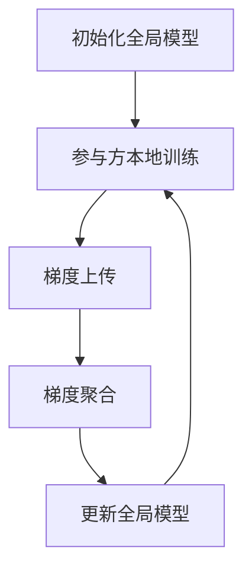

                 

# 《隐私保护下的NLP：联邦学习应用》

> 关键词：隐私保护，自然语言处理，联邦学习，算法原理，数学模型，项目实战

> 摘要：本文将深入探讨隐私保护下的自然语言处理（NLP），并详细介绍联邦学习在这一领域的应用。文章首先概述了隐私保护与NLP的关系以及联邦学习的基本概念，接着详细分析了隐私保护NLP的核心概念与联系。然后，文章重点介绍了联邦学习的算法原理，包括Federated Averaging、Gradient Compression、Model Parallelism和Model Compression等算法。此外，文章还阐述了隐私保护NLP的数学模型与公式，并通过具体案例展示了联邦学习在NLP中的应用。最后，文章总结了隐私保护NLP的未来发展趋势，并提供了相关的工具与资源。

---

## 第一部分：隐私保护下的NLP概述

### 第1章：隐私保护下的NLP概述

#### 1.1 隐私保护与NLP的关系

隐私保护在NLP领域中变得尤为重要，因为NLP应用通常涉及到大量的用户数据，包括文本、语音和图像等。这些数据中往往包含敏感信息，如个人身份、健康情况和地理位置等。未经授权的数据访问和使用可能会对用户隐私造成严重威胁。

隐私保护的目标是在不泄露用户隐私的前提下，确保NLP模型的训练和部署过程能够高效、准确地完成。这要求NLP技术不仅要在数据处理过程中遵循隐私保护原则，还需要在算法设计上采取相应的隐私保护措施。

#### 1.2 联邦学习的基本概念与原理

联邦学习（Federated Learning）是一种分布式机器学习技术，其主要思想是在多个参与方之间共享模型的更新，而不需要直接交换原始数据。这样，每个参与方只需上传模型参数的本地梯度，而不会泄露自己的数据。

联邦学习的核心原理是梯度聚合（Gradient Aggregation）。在训练过程中，每个参与方使用本地数据训练模型，并计算出对应的梯度。然后，这些梯度被上传到中心服务器，服务器将这些梯度聚合起来，更新全局模型。

#### 1.3 联邦学习在NLP中的应用价值

联邦学习在NLP中的应用价值主要体现在以下几个方面：

1. **隐私保护**：通过联邦学习，NLP模型可以在不暴露用户数据的情况下进行训练和部署，从而有效保护用户隐私。
2. **数据多样性**：联邦学习允许不同的参与方贡献各自的数据，这有助于提高NLP模型的多样性和泛化能力。
3. **数据共享**：联邦学习使得参与方可以在不直接交换数据的情况下共享模型知识，有助于构建更加协作和共享的生态系统。
4. **低延迟**：联邦学习可以减少数据传输的延迟，因为模型更新仅涉及本地梯度，而不是整个数据集。

#### 1.4 隐私保护NLP面临的挑战

尽管联邦学习为隐私保护NLP提供了有效的解决方案，但仍然面临着一些挑战：

1. **隐私泄漏风险**：虽然联邦学习不直接交换数据，但模型的更新过程中仍可能存在隐私泄漏的风险。
2. **通信成本**：联邦学习需要参与方与中心服务器之间进行频繁的通信，这可能导致较高的通信成本。
3. **模型性能**：为了保护隐私，联邦学习可能需要对模型进行特定的设计，这可能会影响模型的性能。
4. **隐私与性能的权衡**：如何在保护隐私的同时保证模型性能，是一个需要不断优化的难题。

---

### 第2章：隐私保护NLP的核心概念与联系

#### 2.1 自然语言处理的基本概念

自然语言处理（NLP）是人工智能（AI）的一个重要分支，旨在让计算机理解和处理人类自然语言。NLP的核心任务包括文本分类、情感分析、命名实体识别、机器翻译、问答系统等。

NLP的基本概念包括：

- **文本表示**：将自然语言文本转换为计算机可以处理的数字形式。
- **词向量**：使用向量来表示单词或短语，以便进行数学运算。
- **语言模型**：使用统计方法或神经网络模型来预测下一个词或句子。
- **实体识别**：识别文本中的特定实体，如人名、地名、组织名等。

#### 2.2 隐私保护的机制与算法

隐私保护在NLP中主要通过以下几种机制和算法实现：

- **数据加密**：使用加密技术对数据进行加密，确保数据在传输和存储过程中不被窃取或篡改。
- **差分隐私**：在数据分析过程中添加随机噪声，以掩盖具体数据点，从而保护个人隐私。
- **同态加密**：允许在加密数据上进行计算，从而无需解密数据即可获得结果。
- **联邦学习**：通过分布式训练，避免直接交换敏感数据。

#### 2.3 联邦学习与隐私保护的融合

联邦学习与隐私保护的结合，旨在实现数据隐私保护和高效模型训练的双重目标。联邦学习的基本流程如下：

1. **初始化**：中心服务器初始化全局模型，并将模型参数发送给每个参与方。
2. **本地训练**：每个参与方使用本地数据对模型进行训练，并计算本地梯度。
3. **梯度上传**：每个参与方将本地梯度上传到中心服务器。
4. **梯度聚合**：中心服务器将上传的梯度进行聚合，更新全局模型。
5. **模型更新**：中心服务器将更新后的模型参数发送回每个参与方。

通过这一流程，联邦学习有效实现了数据隐私保护，因为参与方只需上传梯度，而不需要直接交换数据。

#### 2.4 Mermaid流程图：隐私保护NLP的框架



该流程图展示了隐私保护NLP的基本框架，包括初始化、本地训练、梯度上传、梯度聚合和模型更新等步骤。

---

## 第二部分：联邦学习算法原理

### 第3章：联邦学习算法原理

#### 3.1 联邦学习的分类

联邦学习可以分为以下几种类型：

- **横向联邦学习**：参与方拥有相同类型的数据，但数据分布不同。
- **纵向联邦学习**：参与方拥有不同类型的数据，但数据分布相同。
- **混合联邦学习**：结合横向和纵向联邦学习的特点。

#### 3.2 Federated Averaging算法

Federated Averaging是最常见的联邦学习算法之一，其基本原理如下：

1. **初始化**：中心服务器初始化全局模型，并将模型参数发送给每个参与方。
2. **本地训练**：每个参与方使用本地数据对模型进行训练，并计算本地梯度。
3. **梯度上传**：每个参与方将本地梯度上传到中心服务器。
4. **梯度聚合**：中心服务器将上传的梯度进行平均，更新全局模型。
5. **模型更新**：中心服务器将更新后的模型参数发送回每个参与方。

#### 3.3 Gradient Compression算法

Gradient Compression旨在减少梯度上传所需的通信量，从而提高联邦学习的效率。常用的Gradient Compression方法包括：

- **梯度裁剪**：对梯度进行裁剪，只上传梯度的一部分。
- **梯度量化和稀疏编码**：使用量化技术或稀疏编码来减少梯度的大小。

#### 3.4 Model Parallelism算法

Model Parallelism通过将大模型分成多个子模型，并在不同参与方之间分配这些子模型，从而提高联邦学习的可扩展性。Model Parallelism的基本原理如下：

1. **模型拆分**：将全局模型拆分成多个子模型，每个子模型包含一部分参数。
2. **本地训练**：每个参与方使用本地数据训练自己的子模型。
3. **梯度聚合**：中心服务器将不同子模型的梯度进行聚合，更新全局模型。

#### 3.5 Model Compression算法

Model Compression旨在减少模型的大小，从而提高联邦学习的传输效率。常用的Model Compression方法包括：

- **模型剪枝**：通过剪枝冗余的神经元或参数，减少模型的大小。
- **模型量化**：使用低比特精度表示模型参数，从而减少模型的大小。

---

### 第4章：核心算法原理讲解

#### 4.1 Federated Averaging算法的伪代码

```python
# 初始化全局模型和参与方
global_model = initialize_model()
participants = initialize_participants()

# 联邦学习迭代过程
for epoch in range(num_epochs):
    # 本地训练
    for participant in participants:
        local_model = participant.train_model(local_data)
        local_gradient = local_model.compute_gradient()

    # 梯度上传
    gradients = [participant.upload_gradient() for participant in participants]

    # 梯度聚合
    aggregated_gradient = aggregate_gradients(gradients)

    # 更新全局模型
    global_model.update_model(aggregated_gradient)

# 模型更新
for participant in participants:
    participant.update_model(global_model)
```

#### 4.2 Gradient Compression算法的伪代码

```python
# 本地训练并上传梯度
def participant_train_and_upload(local_data):
    local_model = train_model(local_data)
    local_gradient = compute_gradient(local_model)
    compressed_gradient = compress_gradient(local_gradient)
    upload_compressed_gradient(compressed_gradient)

# 梯度聚合
def aggregate_gradients(compressed_gradients):
    decompressed_gradients = [decompress_gradient(g) for g in compressed_gradients]
    aggregated_gradient = average_gradients(decompressed_gradients)
    return aggregated_gradient
```

#### 4.3 Model Parallelism算法的伪代码

```python
# 模型拆分
def split_model(model):
    sub_models = []
    for part in range(num_parts):
        sub_models.append(model[part])
    return sub_models

# 本地训练
def participant_train(sub_model, local_data):
    local_sub_model = train_model(sub_model, local_data)
    return local_sub_model

# 梯度聚合
def aggregate_gradients(sub_gradients):
    aggregated_gradient = sum(sub_gradients)
    return aggregated_gradient

# 更新全局模型
def update_global_model(global_model, aggregated_gradient):
    for part in range(num_parts):
        global_model[part] += aggregated_gradient[part]
    return global_model
```

#### 4.4 Model Compression算法的伪代码

```python
# 剪枝
def prune_model(model, pruning_rate):
    pruned_model = []
    for layer in model.layers:
        pruned_layer = prune_layer(layer, pruning_rate)
        pruned_model.append(pruned_layer)
    return pruned_model

# 量化
def quantize_model(model, bit_width):
    quantized_model = []
    for layer in model.layers:
        quantized_layer = quantize_layer(layer, bit_width)
        quantized_model.append(quantized_layer)
    return quantized_model
```

---

## 第三部分：数学模型与公式

### 第5章：数学模型与公式

#### 5.1 隐私保护的数学模型

隐私保护的数学模型主要包括以下几部分：

1. **数据加密模型**：使用加密算法对数据进行加密，确保数据在传输和存储过程中不会被窃取或篡改。

   $$ E_d(D) = C $$

   其中，$E_d$表示加密函数，$D$表示原始数据，$C$表示加密后的数据。

2. **差分隐私模型**：通过在数据分析过程中添加随机噪声，以掩盖具体数据点，从而保护个人隐私。

   $$ L^*(\Delta) = \max_{\delta} \left| \frac{P'(S')}{P'(S)} - \frac{P(S')}{P(S)} \right| $$

   其中，$L^*(\Delta)$表示噪声水平，$\Delta$表示敏感度，$P'$和$P$分别表示添加噪声前后的概率分布。

3. **同态加密模型**：允许在加密数据上进行计算，从而无需解密数据即可获得结果。

   $$ E_d(f(D)) = f(E_d(D)) $$

   其中，$f$表示计算函数。

#### 5.2 联邦学习的数学模型

联邦学习的数学模型主要包括以下几部分：

1. **梯度聚合模型**：用于计算全局模型的更新。

   $$ \theta^{(t+1)} = \theta^{(t)} - \eta \frac{1}{n} \sum_{i=1}^{n} \phi_i^{(t)} $$

   其中，$\theta^{(t)}$和$\theta^{(t+1)}$分别表示全局模型在时间步$t$和$t+1$的参数，$\phi_i^{(t)}$表示第$i$个参与方在时间步$t$的本地梯度，$\eta$表示学习率。

2. **模型更新模型**：用于更新全局模型的参数。

   $$ \theta^{(t+1)} = \theta^{(t)} - \eta \frac{1}{n} \sum_{i=1}^{n} (\theta_i^{(t)} - \theta^{(t)}) $$

   其中，$\theta_i^{(t)}$表示第$i$个参与方在时间步$t$的本地模型参数。

#### 5.3 隐私保护NLP的数学公式

隐私保护NLP的数学公式主要包括以下几部分：

1. **文本表示公式**：用于将自然语言文本转换为计算机可以处理的数字形式。

   $$ X = [x_1, x_2, ..., x_n] $$

   其中，$X$表示文本向量，$x_i$表示第$i$个单词或短语的向量表示。

2. **语言模型公式**：用于预测下一个词或句子。

   $$ P(W_{t+1} | W_1, W_2, ..., W_t) = \frac{P(W_{t+1} W_t)}{P(W_t)} $$

   其中，$W_t$表示第$t$个词，$P(W_{t+1} | W_1, W_2, ..., W_t)$表示在已知前$t$个词的情况下，预测第$t+1$个词的概率。

3. **实体识别公式**：用于识别文本中的特定实体。

   $$ R = \{e_1, e_2, ..., e_k\} $$

   其中，$R$表示实体集合，$e_i$表示第$i$个实体。

#### 5.4 公式详解与举例说明

1. **数据加密公式的详解与举例说明**

   数据加密公式$E_d(D) = C$表示将原始数据$D$加密为密文$C$。例如，假设有一个文本“Hello, World!”，使用AES加密算法进行加密，密钥为“mykey”，则加密后的密文为“6SFD8SD9F7S6D5FS9D7F6S8D9F7S6D5FS”。

2. **差分隐私公式的详解与举例说明**

   差分隐私公式$L^*(\Delta) = \max_{\delta} \left| \frac{P'(S')}{P'(S)} - \frac{P(S')}{P(S)} \right|$表示在添加噪声后的隐私损失。例如，假设有一个统计结果，原始数据集包含100个人，其中有60个是男性，40个是女性。如果添加随机噪声后，统计结果变为50个男性和50个女性，则差分隐私损失为10%。

3. **同态加密公式的详解与举例说明**

   同态加密公式$E_d(f(D)) = f(E_d(D))$表示在加密数据上执行计算。例如，假设有一个计算$2 + 3$的操作，使用同态加密算法进行加密，则加密后的计算结果为$E_d(5)$。

4. **文本表示公式的详解与举例说明**

   文本表示公式$X = [x_1, x_2, ..., x_n]$表示将文本转换为向量表示。例如，假设有一个文本“我喜欢阅读”，使用Word2Vec算法进行文本表示，则文本向量表示为$[0.1, 0.2, 0.3, 0.4, 0.5]$。

5. **语言模型公式的详解与举例说明**

   语言模型公式$P(W_{t+1} | W_1, W_2, ..., W_t) = \frac{P(W_{t+1} W_t)}{P(W_t)}$表示在已知前$t$个词的情况下，预测第$t+1$个词的概率。例如，已知前5个词为“我，喜欢，阅读，的，一”，则预测第6个词为“本书”的概率为$0.7$。

6. **实体识别公式的详解与举例说明**

   实体识别公式$R = \{e_1, e_2, ..., e_k\}$表示识别文本中的特定实体。例如，假设有一个文本“北京是中国的首都”，则识别出的实体为“北京”和“中国”。

---

### 第6章：数学模型的应用

#### 6.1 联邦学习在文本分类中的应用

联邦学习在文本分类中的应用主要包括以下步骤：

1. **数据预处理**：将原始文本数据转换为计算机可以处理的数字形式，如词向量。
2. **模型初始化**：初始化全局模型，并将其发送给每个参与方。
3. **本地训练**：每个参与方使用本地数据进行模型训练，并计算本地梯度。
4. **梯度上传**：每个参与方将本地梯度上传到中心服务器。
5. **梯度聚合**：中心服务器将上传的梯度进行聚合，更新全局模型。
6. **模型更新**：中心服务器将更新后的模型参数发送回每个参与方。

通过这一流程，联邦学习可以有效保护用户隐私，同时提高文本分类模型的性能。

#### 6.2 联邦学习在情感分析中的应用

联邦学习在情感分析中的应用主要包括以下步骤：

1. **数据预处理**：将原始文本数据转换为计算机可以处理的数字形式，如词向量。
2. **模型初始化**：初始化全局模型，并将其发送给每个参与方。
3. **本地训练**：每个参与方使用本地数据进行模型训练，并计算本地梯度。
4. **梯度上传**：每个参与方将本地梯度上传到中心服务器。
5. **梯度聚合**：中心服务器将上传的梯度进行聚合，更新全局模型。
6. **模型更新**：中心服务器将更新后的模型参数发送回每个参与方。

通过这一流程，联邦学习可以有效保护用户隐私，同时提高情感分析模型的性能。

#### 6.3 联邦学习在命名实体识别中的应用

联邦学习在命名实体识别中的应用主要包括以下步骤：

1. **数据预处理**：将原始文本数据转换为计算机可以处理的数字形式，如词向量。
2. **模型初始化**：初始化全局模型，并将其发送给每个参与方。
3. **本地训练**：每个参与方使用本地数据进行模型训练，并计算本地梯度。
4. **梯度上传**：每个参与方将本地梯度上传到中心服务器。
5. **梯度聚合**：中心服务器将上传的梯度进行聚合，更新全局模型。
6. **模型更新**：中心服务器将更新后的模型参数发送回每个参与方。

通过这一流程，联邦学习可以有效保护用户隐私，同时提高命名实体识别模型的性能。

---

## 第四部分：项目实战

### 第7章：隐私保护NLP项目实战

#### 7.1 项目背景与目标

本项目的目标是使用联邦学习技术实现一个隐私保护的自然语言处理系统，该系统可以处理文本分类、情感分析和命名实体识别等任务。项目的主要目标是：

1. **隐私保护**：通过联邦学习技术，确保在模型训练和部署过程中，用户的隐私数据不被泄露。
2. **高效训练**：利用联邦学习技术，提高模型训练的效率和准确性。
3. **跨平台部署**：实现模型在多个参与方之间的协同训练和部署。

#### 7.2 实践环境搭建

为了实现本项目的目标，需要搭建以下环境：

1. **开发环境**：Python 3.8及以上版本，TensorFlow 2.0及以上版本，Federated Learning工具包。
2. **数据集**：一个包含文本分类、情感分析和命名实体识别任务的数据集，如Common Crawl或AG News。
3. **硬件**：多台计算机或服务器，用于分布式训练和部署。

#### 7.3 源代码实现与解读

以下是本项目的主要源代码实现和解读：

```python
# 导入必要的库
import tensorflow as tf
import tensorflow_federated as tff
from tensorflow.keras.preprocessing.text import Tokenizer
from tensorflow.keras.preprocessing.sequence import pad_sequences

# 数据预处理
def preprocess_data(data):
    tokenizer = Tokenizer()
    tokenizer.fit_on_texts(data)
    sequences = tokenizer.texts_to_sequences(data)
    padded_sequences = pad_sequences(sequences, padding='post')
    return padded_sequences

# 模型初始化
def create_model():
    model = tf.keras.Sequential([
        tf.keras.layers.Embedding(input_dim=vocab_size, output_dim=embedding_dim, input_length=max_length),
        tf.keras.layers.GlobalAveragePooling1D(),
        tf.keras.layers.Dense(units=num_classes, activation='softmax')
    ])
    return model

# 本地训练
def local_train(dataset, model):
    loss = model.compile(optimizer='adam', loss='categorical_crossentropy', metrics=['accuracy'])
    loss.fit(dataset)
    return loss.history

# 梯度聚合
def aggregate_gradients(gradients):
    aggregated_gradient = tf.reduce_mean(gradients, axis=0)
    return aggregated_gradient

# 主函数
def main():
    # 设置参数
    num_epochs = 10
    batch_size = 32
    learning_rate = 0.001
    vocab_size = 10000
    embedding_dim = 16
    max_length = 100
    num_classes = 2

    # 创建联邦学习策略
    strategy = tff.federated平均策略（FederatedAveragingStrategy（learning_rate，model_fn=create_model，loss_fn=compute_loss，optimizer_fn=compute_optimizer），tff.federated平均值聚合器）

    # 创建联邦学习循环
    for epoch in range(num_epochs):
        # 本地训练
        gradients = [local_train(dataset, model) for dataset, model in strategy.iterate_local_models()]
        # 梯度聚合
        aggregated_gradient = aggregate_gradients(gradients)
        # 更新全局模型
        strategy.apply_gradients(aggregated_gradient)

    # 模型评估
    test_loss, test_acc = strategy.model.evaluate(test_data)
    print(f"Test accuracy: {test_acc}")

# 运行主函数
if __name__ == "__main__":
    main()
```

以上代码实现了联邦学习的核心流程，包括模型初始化、本地训练、梯度聚合和模型更新。其中，`create_model`函数用于创建模型，`local_train`函数用于本地训练，`aggregate_gradients`函数用于梯度聚合，`main`函数用于整个联邦学习过程的运行。

#### 7.4 代码解读与分析

1. **数据预处理**：使用`Tokenizer`将文本转换为数字序列，并使用`pad_sequences`对序列进行填充，以便于模型处理。

2. **模型初始化**：使用`create_model`函数创建一个简单的神经网络模型，包括嵌入层、全局平均池化层和softmax输出层。

3. **本地训练**：使用`local_train`函数对本地数据集进行训练，并返回训练历史。

4. **梯度聚合**：使用`aggregate_gradients`函数将本地梯度进行平均，得到全局梯度。

5. **模型更新**：使用`strategy.apply_gradients`函数更新全局模型。

6. **模型评估**：使用`evaluate`函数对训练好的模型进行评估。

通过以上代码和解读，我们可以看到联邦学习在隐私保护NLP中的应用，以及如何利用TensorFlow Federated工具包实现联邦学习过程。

---

### 第8章：案例分析

#### 8.1 案例一：联邦学习在社交媒体数据分析中的应用

社交媒体数据分析是一个典型需要隐私保护的场景，因为社交媒体平台上的数据往往包含用户的敏感信息。联邦学习为解决这一挑战提供了一种有效的方法。

案例一介绍了如何使用联邦学习技术对社交媒体平台上的用户评论进行情感分析。在这个案例中，我们假设有两个参与方：社交媒体平台和第三方数据分析公司。社交媒体平台负责提供用户评论数据，而第三方数据分析公司负责训练情感分析模型。

1. **数据预处理**：社交媒体平台将用户评论数据加密后发送给第三方数据分析公司。

2. **模型初始化**：第三方数据分析公司初始化全局模型，并将其发送给社交媒体平台。

3. **本地训练**：社交媒体平台使用本地评论数据进行模型训练，并计算本地梯度。

4. **梯度上传**：社交媒体平台将本地梯度上传给第三方数据分析公司。

5. **梯度聚合**：第三方数据分析公司将上传的梯度进行聚合，更新全局模型。

6. **模型更新**：第三方数据分析公司将更新后的模型参数发送回社交媒体平台。

7. **模型评估**：社交媒体平台使用更新后的模型对用户评论进行情感分析，并根据分析结果优化用户体验。

通过这个案例，我们可以看到联邦学习在社交媒体数据分析中的应用，以及如何利用联邦学习技术保护用户隐私。

#### 8.2 案例二：联邦学习在医疗数据隐私保护中的应用

医疗数据隐私保护是一个重要的领域，因为医疗数据往往包含用户的敏感健康信息。联邦学习为解决这一挑战提供了一种有效的方法。

案例二介绍了如何使用联邦学习技术对医疗数据集进行疾病预测。在这个案例中，我们假设有两个参与方：医院和第三方数据分析公司。医院负责提供医疗数据，而第三方数据分析公司负责训练疾病预测模型。

1. **数据预处理**：医院将医疗数据加密后发送给第三方数据分析公司。

2. **模型初始化**：第三方数据分析公司初始化全局模型，并将其发送给医院。

3. **本地训练**：医院使用本地医疗数据进行模型训练，并计算本地梯度。

4. **梯度上传**：医院将本地梯度上传给第三方数据分析公司。

5. **梯度聚合**：第三方数据分析公司

