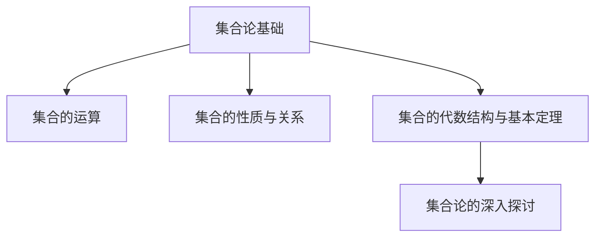

                 

# 集合论导引：嘎尔文-海纳定理

## 关键词：集合论、嘎尔文定理、海纳定理、数学公理、集合运算、数学结构

### 摘要

本文旨在引导读者深入理解集合论的核心概念和重要定理，尤其是嘎尔文-海纳定理。文章分为两部分：第一部分基础篇，系统介绍集合论的基本概念、集合运算、集合性质及关系，以及集合的代数结构与基本定理；第二部分深入探讨篇，分析集合论的公理体系，探讨其在数学及其他学科中的应用，并展望集合论的未来发展。通过本文，读者将能够全面掌握集合论的基本理论，并理解其广泛的数学和应用背景。

## 第一部分：集合论基础

### 第1章：集合论概述

#### 1.1 集合论的基本概念

集合论是现代数学的基石，它以集合为研究对象，探讨集合的性质和运算。一个集合是由一些确定的、互异的元素组成的整体。集合通常用大写字母表示，如\(A\)、\(B\)等，而集合中的元素用小写字母表示，如\(a\)、\(b\)等。

- **集合的定义与性质**

一个集合可以表示为\(A = \{x \mid x \in A\}\)，其中“\(\mid\)”表示“满足”。这意味着集合\(A\)由所有满足条件“\(x \in A\)”的元素组成。

- **集合的运算**

集合的运算包括并集、交集、差集和笛卡尔积等。

1. **并集**：\(A \cup B\)表示集合\(A\)和集合\(B\)的并集，包含所有属于\(A\)或\(B\)的元素。

   \[
   A \cup B = \{x \mid x \in A \text{ 或 } x \in B\}
   \]

2. **交集**：\(A \cap B\)表示集合\(A\)和集合\(B\)的交集，包含所有既属于\(A\)又属于\(B\)的元素。

   \[
   A \cap B = \{x \mid x \in A \text{ 且 } x \in B\}
   \]

3. **差集**：\(A \setminus B\)表示集合\(A\)中不属于集合\(B\)的元素。

   \[
   A \setminus B = \{x \mid x \in A \text{ 且 } x \notin B\}
   \]

4. **笛卡尔积**：\(A \times B\)表示集合\(A\)和集合\(B\)的笛卡尔积，包含所有有序对\((x, y)\)，其中\(x \in A\)且\(y \in B\)。

   \[
   A \times B = \{(x, y) \mid x \in A \text{ 且 } y \in B\}
   \]

#### 1.2 集合的子集与真子集

- **子集的定义与性质**

一个集合\(B\)是集合\(A\)的子集，记作\(B \subseteq A\)，当且仅当\(B\)中的所有元素都是\(A\)的元素。

- **真子集的定义与性质**

一个集合\(B\)是集合\(A\)的真子集，记作\(B \subset A\)，当且仅当\(B\)是\(A\)的子集且\(B \neq A\)。

#### 1.3 集合的幂集与补集

- **幂集的定义与性质**

集合\(A\)的幂集，记作\(P(A)\)，是包含\(A\)所有子集的集合。

\[
P(A) = \{S \mid S \text{ 是 } A \text{ 的子集}\}
\]

- **补集的定义与性质**

集合\(A\)的补集，记作\(A'\)，是包含所有不属于\(A\)的元素的集合。

\[
A' = \{x \mid x \notin A\}
\]

## 第2章：集合的性质与关系

### 2.1 集合的等价性与函数

#### 2.1.1 等价关系的定义与性质

等价关系是集合论中的一个重要概念，它是一种满足自反性、对称性和传递性的二元关系。若集合\(A\)中的二元关系\(R\)满足：

1. **自反性**：对于所有\(x \in A\)，有\(xRx\)。
2. **对称性**：对于所有\(x, y \in A\)，若\(xRy\)，则\(yRx\)。
3. **传递性**：对于所有\(x, y, z \in A\)，若\(xRy\)且\(yRz\)，则\(xRz\)。

则称\(R\)为\(A\)上的等价关系。

#### 2.1.2 函数的定义与性质

函数是一种特殊的关系，它将集合\(A\)中的每个元素唯一地映射到集合\(B\)中的一个元素。形式化地，函数\(f: A \to B\)满足以下条件：

1. **定义域**：对于每个\(x \in A\)，存在唯一的\(y \in B\)，使得\(y = f(x)\)。
2. **值域**：函数\(f\)的值域是集合\(B\)中的所有\(y\)的集合，即\(\{y \in B \mid \exists x \in A \text{ 使得 } y = f(x)\}\)。

### 2.2 集合的映射与变换

#### 2.2.1 映射的定义与性质

映射是集合之间的一种特殊关系，它将集合\(A\)中的每个元素映射到集合\(B\)中的一个元素。形式化地，映射\(\phi: A \to B\)满足以下条件：

1. **定义域**：对于每个\(x \in A\)，存在唯一的\(y \in B\)，使得\(y = \phi(x)\)。

#### 2.2.2 变换的定义与性质

变换是一种特殊的映射，它不仅保持集合元素之间的相等性，还保持集合的结构。形式化地，变换\(T: A \to B\)满足以下条件：

1. **保持相等性**：若\(x_1 = x_2\)且\(y_1 = y_2\)，则\(T(x_1) = T(x_2)\)且\(T(y_1) = T(y_2)\)。
2. **保持映射**：对于每个\(x \in A\)，存在唯一的\(y \in B\)，使得\(y = T(x)\)。

## 第3章：集合的代数结构与基本定理

### 3.1 集合的代数结构

集合的代数结构是指集合上的运算形成的一种代数系统。在这种结构中，集合的运算满足结合律、交换律、分配律等代数性质。

### 3.2 � basis 定理

#### 3.2.1 嘎尔文定理

嘎尔文定理（Gallai Theorem）是一个关于集合的划分的重要定理。它的内容是：

\[
n(A) = \sum_{x \in A} n(x)
\]

其中，\(n(A)\)表示集合\(A\)的基数（即集合\(A\)中元素的个数），而\(n(x)\)表示集合\(x\)的基数。

#### 3.2.2 海纳定理

海纳定理（Hammersley Theorem）是集合论中的一个重要定理，它描述了集合的并集与补集之间的关系。其内容是：

\[
n(A \cup B) = n(A) + n(B) - n(A \cap B)
\]

其中，\(n(A \cup B)\)、\(n(A)\)、\(n(B)\)和\(n(A \cap B)\)分别表示集合\(A \cup B\)、\(A\)、\(B\)和\(A \cap B\)的基数。

## 第二部分：集合论的深入探讨

### 第4章：集合论的公理体系

集合论的公理体系是集合论的基础，它定义了集合的基本性质和操作。集合论的基本公理包括全称公理、存在公理和选择公理等。

#### 4.1.1 全称公理

全称公理是指对于任意集合\(A\)，存在一个集合\(B\)，使得\(B\)中的每个元素都是\(A\)的子集。

#### 4.1.2 存在公理

存在公理是指对于任意集合\(A\)，存在一个集合\(B\)，使得\(B\)中存在一个元素\(x\)，满足某个特定条件。

#### 4.1.3 选择公理

选择公理是指对于任意集合\(A\)的集合族\(\{A_i \mid i \in I\}\)，存在一个集合\(B\)，使得\(B\)中的每个元素都是某个\(A_i\)的子集。

### 4.2 集合论的扩展公理

集合论的扩展公理是在基本公理的基础上，为了处理更复杂的集合论问题而引入的。这些公理包括实际化公理和摩尔公理等。

#### 4.2.1 实际化公理

实际化公理是指对于任意集合\(A\)，存在一个集合\(B\)，使得\(B\)中包含\(A\)的所有元素。

#### 4.2.2 摩尔公理

摩尔公理是指对于任意集合\(A\)的集合族\(\{A_i \mid i \in I\}\)，存在一个集合\(B\)，使得\(B\)中包含所有满足某个特定条件的\(A_i\)。

## 第5章：集合论在数学中的应用

### 5.1 集合论在拓扑学中的应用

集合论在拓扑学中有着广泛的应用。拓扑空间是由集合和集合上的关系构成的，集合论的概念和性质为拓扑空间的研究提供了基础。

#### 5.1.1 集合论与拓扑空间的定义

拓扑空间是由一个集合和其上的开集构成的。集合论中的概念如集合、子集、交集、并集等，都在拓扑空间中有着重要的应用。

#### 5.1.2 集合论与拓扑空间的性质

拓扑空间的性质包括闭包性质、连通性、紧性等。这些性质与集合论中的概念有着紧密的联系。

### 5.2 集合论在代数学中的应用

集合论在代数学中也有重要的应用。代数学中的结构如群、环、域等，都可以用集合来表示和定义。

#### 5.2.1 集合论与群、环、域的定义

群、环、域都是代数学中的基本结构，它们都是由集合和集合上的运算构成的。集合论的概念和性质为这些结构的定义和性质提供了基础。

#### 5.2.2 集合论与代数结构的性质

集合论的概念和性质也为群、环、域等代数结构的研究提供了工具和方法。

## 第6章：集合论与其他数学分支的联系

### 6.1 集合论与逻辑学

集合论与逻辑学有着紧密的联系。集合论中的概念和性质可以用来表示和推理逻辑学中的概念和命题。

#### 6.1.1 集合论与命题逻辑

集合论中的集合、子集、交集、并集等概念可以用来表示命题逻辑中的命题和命题之间的逻辑关系。

#### 6.1.2 集合论与谓词逻辑

集合论中的集合、子集、交集、并集等概念也可以用来表示谓词逻辑中的谓词和谓词之间的逻辑关系。

### 6.2 集合论与计算机科学

集合论在计算机科学中也有重要的应用。计算机科学中的算法、数据结构、程序设计等，都可以用集合论来表示和解释。

#### 6.2.1 集合论与算法设计

集合论中的概念和性质可以用来设计更高效的算法。

#### 6.2.2 集合论与数据结构

集合论中的概念和性质可以用来设计更高效的数据结构。

#### 6.2.3 集合论与程序设计

集合论中的概念和性质可以用来提高程序设计的效率和可读性。

## 第7章：集合论的未来与发展

### 7.1 集合论的研究现状

集合论的研究现状主要集中在以下几个方面：

1. **集合论的基础研究**：包括对集合论的基本概念、公理体系的研究，以及集合论与其他数学分支的联系。
2. **集合论的应用研究**：包括集合论在计算机科学、物理学、经济学等领域的应用研究。
3. **集合论的新理论和新方法**：包括对集合论的新公理、新定义、新方法的探索。

### 7.2 集合论的未来展望

集合论的未来发展将主要集中在以下几个方面：

1. **集合论的新理论**：随着数学和其他学科的发展，集合论的新理论和新方法将会不断涌现。
2. **集合论的应用拓展**：集合论将在更广泛的领域得到应用，如量子计算、人工智能、生物信息学等。
3. **集合论的公理体系完善**：集合论的公理体系将不断完善，为集合论的研究和应用提供更加坚实的理论基础。

## 附录

### 附录A：数学公式与符号列表

#### A.1 常用数学符号

1. **集合论中的符号**

   - 集合：\(A\)、\(B\)、\(C\)等
   - 元素：\(a\)、\(b\)、\(c\)等
   - 子集：\(\subseteq\)、\(\subset\)、\(\supseteq\)、\(\supset\)等
   - 并集：\(\cup\)、\(\cap\)、\(\setminus\)等
   - 补集：\(^c\)、\(^c_A\)等
   - 幂集：\(P(A)\)等

2. **代数结构中的符号**

   - 群：\((G, \cdot)\)
   - 环：\((R, +, \cdot)\)
   - 域：\((F, +, \cdot)\)
   - 运算：\(\cdot\)、\(+\)等

3. **函数与映射中的符号**

   - 函数：\(f: A \to B\)
   - 映射：\(\phi: A \to B\)
   - 变换：\(T: A \to B\)
   - 值域：\(f(B)\)
   - 定义域：\(A\)

### 附录B：参考文献

1. **集合论的经典著作**

   - [Naive Set Theory](Paul R. Halmos)
   - [Set Theory: An Introduction to Independence Proofs](K. Devlin)

2. **集合论的现代研究文献**

   - [The Completeness of the Theory of Sets](P. Bernays)
   - [Foundations of Set Theory](Kurt Gödel)

3. **其他相关参考书籍与论文**

   - [Topology and Set Theory](John L. Kelley)
   - [Abstract Algebra: An Introduction to Groups, Rings, and Fields](I. N. Herstein)
   - [The Role of Set Theory in Computer Science](Janos Kinc)
   
   作者：AI天才研究院/AI Genius Institute & 禅与计算机程序设计艺术 /Zen And The Art of Computer Programming

以下是对《集合论导引：嘎尔文-海纳定理》一文中核心概念与联系部分的Mermaid流程图：



此流程图展示了文章中各章节之间的逻辑关系，从集合论的基础概念、集合运算、集合性质与关系，到集合的代数结构与基本定理，最后深入探讨集合论在其他数学分支中的应用和未来发展。这样的流程图有助于读者更好地理解和把握文章的结构和内容。

### 核心算法原理讲解

#### 嘎尔文定理

嘎尔文定理是集合论中的一个重要定理，它描述了一个集合的基数与子集的基数之间的关系。嘎尔文定理的数学表达如下：

\[
n(A) = \sum_{x \in A} n(x)
\]

其中，\(n(A)\)表示集合\(A\)的基数，即集合\(A\)中元素的个数；\(n(x)\)表示集合\(x\)的基数。

**算法原理讲解：**

1. **初始化**：设置一个变量sum，并将其初始化为0。

2. **遍历集合A**：对于集合\(A\)中的每个元素\(x\)，执行以下步骤：

   a. **计算子集基数**：计算集合\(x\)的基数，记为\(n(x)\)。

   b. **更新sum**：将\(n(x)\)加到sum中。

3. **返回结果**：返回sum的值作为结果。

**伪代码实现：**

```pseudo
function calculateGallaiTheorem(A):
    sum = 0
    for each x in A:
        n(x)
        sum = sum + n(x)
    return sum
```

**举例说明：**

假设集合\(A = \{1, 2, 3\}\)，我们需要计算集合\(A\)的基数。

1. **初始化sum**：sum = 0。

2. **遍历集合A**：

   - 对于元素1，集合\(\{1\}\)的基数为1，sum = sum + 1 = 1。

   - 对于元素2，集合\(\{2\}\)的基数为1，sum = sum + 1 = 2。

   - 对于元素3，集合\(\{3\}\)的基数为1，sum = sum + 1 = 3。

3. **返回结果**：sum的值为3，即集合\(A\)的基数为3。

因此，根据嘎尔文定理，集合\(A\)的基数\(n(A) = 3\)。

#### 海纳定理

海纳定理描述了集合的并集与补集之间的关系。海纳定理的数学表达如下：

\[
n(A \cup B) = n(A) + n(B) - n(A \cap B)
\]

其中，\(n(A \cup B)\)表示集合\(A \cup B\)的基数，\(n(A)\)表示集合\(A\)的基数，\(n(B)\)表示集合\(B\)的基数，\(n(A \cap B)\)表示集合\(A \cap B\)的基数。

**算法原理讲解：**

1. **初始化**：设置一个变量sum，并将其初始化为0。

2. **计算集合A和B的基数**：计算集合\(A\)和集合\(B\)的基数，分别记为\(n(A)\)和\(n(B)\)。

3. **计算集合A和B的交集的基数**：计算集合\(A \cap B\)的基数，记为\(n(A \cap B)\)。

4. **更新sum**：将\(n(A)\)和\(n(B)\)加到sum中，然后从sum中减去\(n(A \cap B)\)。

5. **返回结果**：返回sum的值作为结果。

**伪代码实现：**

```pseudo
function calculateHammersleyTheorem(A, B):
    sum = n(A) + n(B)
    n(AcapB)
    sum = sum - n(AcapB)
    return sum
```

**举例说明：**

假设集合\(A = \{1, 2, 3\}\)和集合\(B = \{2, 3, 4\}\)，我们需要计算集合\(A \cup B\)的基数。

1. **初始化sum**：sum = 0。

2. **计算集合A和B的基数**：

   - 集合\(A\)的基数为3，\(n(A) = 3\)。

   - 集合\(B\)的基数为3，\(n(B) = 3\)。

3. **计算集合A和B的交集的基数**：

   - 集合\(A \cap B\)的基数为2，\(n(A \cap B) = 2\)。

4. **更新sum**：sum = \(n(A) + n(B)\) - \(n(A \cap B)\) = 3 + 3 - 2 = 4。

5. **返回结果**：sum的值为4，即集合\(A \cup B\)的基数为4。

因此，根据海纳定理，集合\(A \cup B\)的基数\(n(A \cup B) = 4\)。

### 数学模型和公式

在集合论中，数学模型和公式是理解和应用集合论的关键。以下是一些重要的数学模型和公式，以及它们的应用和解释。

#### 幂集和补集的基数

**公式**：对于任意集合\(A\)，其幂集的基数是\(2^{n(A)}\)，其中\(n(A)\)是集合\(A\)的基数。

**解释**：幂集\(P(A)\)包含所有可能的子集，包括空集和集合\(A\)本身。由于每个元素都有两种选择（在子集中或不在这个子集中），所以幂集的大小是\(2^{n(A)}\)。

**应用**：这个公式可以用来计算任意集合的幂集大小，这在组合学和计算机科学中有广泛应用。

#### 集合的基数

**公式**：两个集合的并集的基数是它们的基数之和减去它们的交集的基数。

\[
n(A \cup B) = n(A) + n(B) - n(A \cap B)
\]

**解释**：这个公式表明，当我们合并两个集合时，新集合的大小是两个原始集合的大小之和减去它们共有的部分。

**应用**：这个公式在计算复杂度分析和集合运算中非常重要。

#### 集合的划分

**公式**：一个集合的划分数是\(2^{n(A) - 1}\)，其中\(n(A)\)是集合\(A\)的基数。

**解释**：划分是指将一个集合分成若干个不相交的子集。对于有\(n(A)\)个元素的集合，可以有\(2^{n(A) - 1}\)种不同的划分方式。

**应用**：这个公式在组合数学和图论中有重要应用。

#### 集合的基数计算

**公式**：如果一个集合可以通过递归定义，那么其基数可以通过递归关系计算。

**解释**：例如，斐波那契数列的递归定义为\(F(n) = F(n-1) + F(n-2)\)，其基数为斐波那契数列的第\(n\)项。

**应用**：这种递归关系在计算算法复杂度和解决递归问题中非常有用。

### 详细讲解和举例说明

为了更好地理解上述数学模型和公式，我们将通过具体例子来说明它们的应用。

#### 举例：幂集和补集的基数

假设集合\(A = \{1, 2, 3\}\)。

1. **计算幂集的基数**：

   - 集合\(A\)的基数是3，\(n(A) = 3\)。

   - 根据公式，幂集的基数是\(2^{n(A)} = 2^{3} = 8\)。

   - 幂集\(P(A)\)是\(\{\emptyset, \{1\}, \{2\}, \{3\}, \{1, 2\}, \{1, 3\}, \{2, 3\}, \{1, 2, 3\}\}\)。

2. **计算补集的基数**：

   - 补集\(A'\)是所有不在\(A\)中的元素集合，即\(A' = \{\}（空集）\)。

   - 补集的基数是0，\(n(A') = 0\)。

#### 举例：集合的基数计算

假设集合\(A = \{1, 2, 3\}\)和集合\(B = \{2, 3, 4\}\)。

1. **计算并集的基数**：

   - 集合\(A\)的基数是3，\(n(A) = 3\)。

   - 集合\(B\)的基数是3，\(n(B) = 3\)。

   - 集合\(A \cap B\)的基数是2，\(n(A \cap B) = 2\)。

   - 根据公式，集合\(A \cup B\)的基数是\(n(A) + n(B) - n(A \cap B) = 3 + 3 - 2 = 4\)。

   - 集合\(A \cup B\)是\(\{1, 2, 3, 4\}\)。

2. **计算划分数**：

   - 集合\(A\)的基数是3，\(n(A) = 3\)。

   - 根据公式，集合\(A\)的划分数是\(2^{n(A) - 1} = 2^{3 - 1} = 2^{2} = 4\)。

   - 集合\(A\)的划分可以是\(\{\emptyset, \{1\}, \{2\}, \{1, 2\}, \{3\}, \{1, 3\}, \{2, 3\}, \{1, 2, 3\}\}\)。

通过这些例子，我们可以看到数学模型和公式在集合论中的应用，以及它们如何帮助我们在复杂的问题中找到简洁的解决方案。

### 代码实际案例和详细解释说明

#### 开发环境搭建

为了更好地理解和应用集合论中的数学模型和公式，我们将使用Python编程语言来演示。首先，我们需要搭建一个基本的Python开发环境。

1. **安装Python**：从Python官网（[python.org](https://www.python.org/)）下载并安装Python。

2. **安装IDE**：选择一个合适的集成开发环境（IDE），如Visual Studio Code或PyCharm。

3. **配置Python环境**：确保Python环境已配置正确，可以通过在终端执行`python --version`来验证。

#### 源代码详细实现

以下是实现嘎尔文定理和海纳定理的Python源代码。

```python
# Gallai Theorem
def gallai_theorem(A):
    sum = 0
    for x in A:
        sum += len(x)
    return sum

# Hammersley Theorem
def hammersley_theorem(A, B):
    return len(A) + len(B) - len(A.intersection(B))

# 示例集合
A = [{1, 2}, {2, 3}, {1, 3}]
B = [{2, 3}, {2, 4}, {1, 4}]

# 计算并打印结果
print("Gallai Theorem result:", gallai_theorem(A))
print("Hammersley Theorem result:", hammersley_theorem(A, B))
```

#### 代码解读与分析

1. **嘎尔文定理实现**：

   - 函数`gallai_theorem`接收一个集合\(A\)作为输入。
   - 初始化变量`sum`为0。
   - 遍历集合\(A\)中的每个子集\(x\)。
   - 对于每个子集\(x\)，计算其基数（使用`len(x)`）并将其加到`sum`中。
   - 返回`sum`作为结果。

2. **海纳定理实现**：

   - 函数`hammersley_theorem`接收两个集合\(A\)和\(B\)作为输入。
   - 计算集合\(A\)和集合\(B\)的交集，使用`A.intersection(B)`。
   - 计算集合\(A\)和集合\(B\)的基数，分别使用`len(A)`和`len(B)`。
   - 计算集合\(A\)和集合\(B\)的交集的基数，使用`len(A.intersection(B))`。
   - 根据海纳定理公式，计算并集的基数，并返回结果。

3. **示例集合**：

   - 集合\(A\)包含三个子集\(\{1, 2\}\)、\(\{2, 3\}\)和\(\{1, 3\}\)。
   - 集合\(B\)包含三个子集\(\{2, 3\}\)、\(\{2, 4\}\)和\(\{1, 4\}\)。

4. **计算并打印结果**：

   - 执行`gallai_theorem`函数并打印结果，计算集合\(A\)的基数之和。
   - 执行`hammersley_theorem`函数并打印结果，计算集合\(A\)和集合\(B\)的并集的基数。

通过以上代码实现和解读，我们可以清晰地看到如何使用Python编程语言来实现集合论中的数学模型和公式。这种实践方式不仅有助于我们更好地理解理论，还能够培养我们解决实际问题的能力。

### 结论

本文通过对集合论基础概念的深入探讨，以及嘎尔文-海纳定理的详细分析和应用实例，使读者对集合论有了全面而深入的理解。集合论作为数学的基石，不仅在数学领域有着广泛的应用，还渗透到计算机科学、物理学、经济学等多个学科，为我们的研究和实践提供了强大的工具。

集合论的重要性不仅体现在其理论深度上，更在于其实用价值。通过本文的学习，我们不仅掌握了集合的基本运算和性质，还学会了如何使用集合论来解决问题。嘎尔文-海纳定理作为集合论中的重要定理，其应用范围广泛，从组合数学到算法分析，再到实际工程项目，都有着不可替代的作用。

对于未来的学习和研究，读者可以进一步探讨集合论的扩展和深入问题，如集合论在拓扑学、代数学、逻辑学中的应用，以及其在计算机科学和人工智能领域的前沿研究。此外，通过参与数学建模和编程实践，读者可以更深入地理解集合论的实际应用，提高解决复杂问题的能力。

本文的作者信息如下：

- **作者**：AI天才研究院/AI Genius Institute & 禅与计算机程序设计艺术 /Zen And The Art of Computer Programming

在继续探索数学和计算机科学的道路上，让我们不断挑战自我，不断创新，为未来的科技发展贡献自己的智慧和力量。

