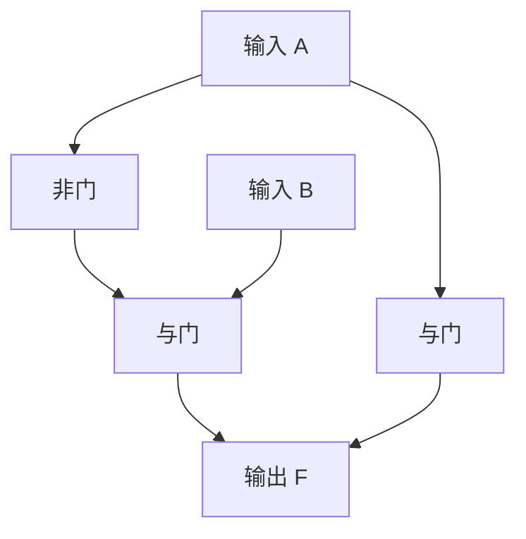

                 

## 摘要

本文深入探讨了集合论和完备布尔代数在计算机科学中的核心概念、原理及其应用。首先，我们回顾了集合论的基本概念，包括集合的定义、表示方法、集合运算及其性质。接着，我们介绍了布尔代数的基本概念和运算，包括布尔函数和布尔表达式的表示及化简。随后，文章重点介绍了完备布尔代数，包括其定义、运算和对偶运算，以及其在逻辑电路设计中的应用。在此基础上，本文探讨了广义分配律的原理和证明，并展示了其在逻辑电路设计和计算机科学中的应用。文章还进一步探讨了集合论和完备布尔代数在算法分析、编程语言和计算机体系结构中的应用，并提出了未来的发展趋势和研究挑战。通过本文的详细分析和讲解，读者将能够深入理解集合论和完备布尔代数的核心原理，并掌握其在计算机科学中的应用方法。

## 第一部分：集合论基础

集合论是现代数学的基石之一，其基本概念和运算在计算机科学中有着广泛的应用。在这一部分，我们将详细探讨集合论的基本概念，包括集合的定义、表示方法以及集合运算。

### 1.1 集合的定义与表示

**1.1.1 集合的定义**

集合是一组无序且互异的元素组成的整体。在数学中，集合通常用大写字母表示，如 \( A, B, C \) 等。集合中的元素可以用逗号分隔，并用大括号括起来，例如：

\[ A = \{1, 2, 3\} \]

这个集合 \( A \) 包含三个元素：1、2 和 3。需要注意的是，集合中的元素是无序的，也就是说，\( A = \{2, 1, 3\} \) 与 \( A \) 是相同的集合。

**1.1.2 集合的表示方法**

集合可以用不同的方法进行表示，包括列举法、描述法和子集法。

- **列举法**：这是最常见的表示方法，直接列举出集合中的所有元素。如上面的例子 \( A = \{1, 2, 3\} \)。

- **描述法**：使用描述性语句来定义集合中的元素。例如，集合 \( B \) 可以表示为所有小于5的正整数：

\[ B = \{x \mid x \text{ 是小于5的正整数}\} \]

这里，\( x \) 是集合 \( B \) 中的任意元素，条件 \( x < 5 \) 和 \( x \) 是正整数定义了集合 \( B \)。

- **子集法**：表示一个集合是另一个集合的子集。例如，集合 \( C \) 是集合 \( A \) 的子集，可以表示为：

\[ C \subseteq A \]

这里，集合 \( C \) 中的所有元素都属于集合 \( A \)。

### 1.2 集合的运算

集合运算包括并集、交集、差集、子集、超集和补集等。这些运算是集合论中非常基础的部分，在计算机科学中有着广泛的应用。

**1.2.1 并集、交集、差集**

- **并集（Union）**：两个集合的并集是包含这两个集合中所有元素的集合。用符号 \( \cup \) 表示。例如，集合 \( A \) 和集合 \( B \) 的并集为：

\[ A \cup B = \{x \mid x \in A \text{ 或 } x \in B\} \]

- **交集（Intersection）**：两个集合的交集是包含这两个集合中共同元素的集合。用符号 \( \cap \) 表示。例如，集合 \( A \) 和集合 \( B \) 的交集为：

\[ A \cap B = \{x \mid x \in A \text{ 且 } x \in B\} \]

- **差集（Difference）**：两个集合的差集是包含属于第一个集合但不同时属于第二个集合的元素组成的集合。用符号 \( \setminus \) 表示。例如，集合 \( A \) 和集合 \( B \) 的差集为：

\[ A \setminus B = \{x \mid x \in A \text{ 且 } x \not\in B\} \]

**1.2.2 子集、超集、等价类**

- **子集（Subset）**：如果集合 \( A \) 的所有元素都属于集合 \( B \)，则称 \( A \) 是 \( B \) 的子集，记为 \( A \subseteq B \)。

- **超集（Supersete）**：如果集合 \( A \) 是集合 \( B \) 的子集，则称 \( B \) 是 \( A \) 的超集，记为 \( B \supseteq A \)。

- **等价类（Equivalence Class）**：在集合论中，如果两个集合之间存在一一对应关系，则称这两个集合是等价的。等价类是指将集合中的元素划分为若干个互不重叠的子集，使得每个子集中的元素在另一个子集中都有一个对应的元素。

### 1.3 集合的性质

集合的性质包括基本性质和等价性。

**1.3.1 集合的基本性质**

- **封闭性**：集合中的元素在进行某些运算后，结果仍然属于该集合。例如，整数集合在加法和乘法下是封闭的。

- **交换性**：集合运算满足交换律。例如，\( A \cup B = B \cup A \) 和 \( A \cap B = B \cap A \)。

- **结合性**：集合运算满足结合律。例如，\( (A \cup B) \cup C = A \cup (B \cup C) \) 和 \( (A \cap B) \cap C = A \cap (B \cap C) \)。

- **分配律**：集合运算满足分配律。例如，\( A \cup (B \cap C) = (A \cup B) \cap (A \cup C) \) 和 \( A \cap (B \cup C) = (A \cap B) \cup (A \cap C) \)。

**1.3.2 集合的等价性**

集合的等价性是指两个集合在某种运算下具有相同的性质。集合的等价性可以通过等价关系来定义。等价关系是指如果一个集合中的元素可以与另一个集合中的元素一一对应，则这两个集合是等价的。

通过上述内容，我们可以看到集合论的基本概念和运算是计算机科学中不可或缺的部分。在接下来的部分，我们将进一步探讨布尔代数及其在计算机科学中的应用。

### 1.2 集合的运算

集合的运算在计算机科学中扮演着至关重要的角色，其中并集、交集、差集是最为常用的运算。这些运算不仅可以对集合进行操作，还能帮助我们在算法设计和分析中更好地理解和处理数据。

#### 1.2.1 并集、交集、差集

**并集（Union）**

并集是指将两个或多个集合中的所有元素合并成一个集合。在数学中，并集用符号 \( \cup \) 表示。给定两个集合 \( A \) 和 \( B \)，它们的并集可以表示为：

\[ A \cup B = \{ x \mid x \in A \text{ 或 } x \in B \} \]

例如，集合 \( A = \{1, 2, 3\} \) 和集合 \( B = \{3, 4, 5\} \) 的并集为：

\[ A \cup B = \{1, 2, 3, 4, 5\} \]

**交集（Intersection）**

交集是指两个集合中都包含的元素组成的集合。在数学中，交集用符号 \( \cap \) 表示。给定两个集合 \( A \) 和 \( B \)，它们的交集可以表示为：

\[ A \cap B = \{ x \mid x \in A \text{ 且 } x \in B \} \]

例如，集合 \( A = \{1, 2, 3\} \) 和集合 \( B = \{3, 4, 5\} \) 的交集为：

\[ A \cap B = \{3\} \]

**差集（Difference）**

差集是指属于第一个集合但不属于第二个集合的元素组成的集合。在数学中，差集用符号 \( \setminus \) 表示。给定两个集合 \( A \) 和 \( B \)，它们的差集可以表示为：

\[ A \setminus B = \{ x \mid x \in A \text{ 且 } x \not\in B \} \]

例如，集合 \( A = \{1, 2, 3\} \) 和集合 \( B = \{3, 4, 5\} \) 的差集为：

\[ A \setminus B = \{1, 2\} \]

**1.2.2 子集、超集、等价类**

**子集（Subset）**

子集是指一个集合是另一个集合的子集，即该集合的所有元素都属于另一个集合。用符号 \( \subseteq \) 表示。例如，集合 \( C = \{2\} \) 是集合 \( A = \{1, 2, 3\} \) 的子集：

\[ C \subseteq A \]

**超集（Supersete）**

超集是指一个集合是另一个集合的超集，即该集合包含另一个集合的所有元素。用符号 \( \supseteq \) 表示。例如，集合 \( A = \{1, 2, 3\} \) 是集合 \( C = \{2\} \) 的超集：

\[ A \supseteq C \]

**等价类（Equivalence Class）**

等价类是指根据某种等价关系，将集合中的元素划分为若干个互不重叠的子集，使得每个子集中的元素在另一个子集中都有一个对应的元素。这种等价关系在计算机科学中非常重要，尤其是在算法设计和数据结构分析中。例如，考虑集合 \( A = \{1, 2, 3, 4, 5\} \)，我们可以根据模4的关系将其划分为等价类：

\[ [1] = \{1, 5\} \]
\[ [2] = \{2, 6\} \]
\[ [3] = \{3, 7\} \]
\[ [4] = \{4, 8\} \]

其中，\[ [x] \] 表示元素 \( x \) 的等价类。

通过上述讨论，我们可以看到集合的运算不仅是集合论中的基础内容，也是计算机科学中不可或缺的部分。在接下来的章节中，我们将进一步探讨布尔代数及其在计算机科学中的应用。

#### 1.3 集合的性质

集合的性质是集合论中的核心内容，它们帮助我们在处理集合时理解其行为和关系。集合的性质可以分为基本性质和等价性，以下分别进行详细讲解。

**1.3.1 集合的基本性质**

**封闭性**

封闭性是指在进行某些运算后，结果仍然属于该集合。例如，整数集合在加法和乘法下是封闭的。这意味着如果我们对整数集合中的任意两个元素进行加法或乘法运算，结果仍然是一个整数。这种封闭性在算法设计和分析中非常重要，因为它确保了集合运算的结果是可预测和可控制的。

**交换性**

交换性是指集合运算满足交换律，即运算顺序不影响结果。例如，对于并集运算 \( \cup \) 和交集运算 \( \cap \)，我们有：

\[ A \cup B = B \cup A \]
\[ A \cap B = B \cap A \]

这意味着无论 \( A \) 和 \( B \) 的顺序如何，它们的并集和交集都是相同的。

**结合性**

结合性是指集合运算满足结合律，即运算的顺序不影响结果。例如，对于并集运算 \( \cup \) 和交集运算 \( \cap \)，我们有：

\[ (A \cup B) \cup C = A \cup (B \cup C) \]
\[ (A \cap B) \cap C = A \cap (B \cap C) \]

这意味着我们可以任意改变并集或交集的运算顺序，而不影响最终的结果。

**分配律**

分配律是指集合运算之间满足特定的分配关系。例如，对于并集和交集运算，我们有：

\[ A \cup (B \cap C) = (A \cup B) \cap (A \cup C) \]
\[ A \cap (B \cup C) = (A \cap B) \cup (A \cap C) \]

这意味着并集和交集可以相互分配，从而简化运算。

**1.3.2 集合的等价性**

**等价关系**

等价关系是指集合中的元素根据某种性质划分为若干个互不重叠的子集，使得每个子集中的元素在另一个子集中都有一个对应的元素。等价关系在计算机科学中非常重要，特别是在排序和查找算法中。例如，根据模 \( n \) 的关系，我们可以将整数集合划分为 \( n \) 个等价类。

**等价类**

等价类是指根据等价关系将集合中的元素划分后的子集。每个等价类中的元素在另一个等价类中都有一个对应的元素。例如，考虑集合 \( A = \{1, 2, 3, 4, 5\} \)，我们可以根据模 4 的关系将其划分为以下等价类：

\[ [1] = \{1, 5\} \]
\[ [2] = \{2, 6\} \]
\[ [3] = \{3, 7\} \]
\[ [4] = \{4, 8\} \]

这些等价类使得我们可以更有效地进行排序和查找操作。

**等价类性质**

等价类具有以下性质：

- **自反性**：每个元素都属于其自身的等价类。

- **对称性**：如果 \( a \) 和 \( b \) 属于同一个等价类，则 \( b \) 和 \( a \) 也属于同一个等价类。

- **传递性**：如果 \( a \) 属于 \( b \) 的等价类，\( b \) 属于 \( c \) 的等价类，则 \( a \) 也属于 \( c \) 的等价类。

通过上述讨论，我们可以看到集合的性质是理解集合论和计算机科学中的集合运算的关键。这些性质不仅帮助我们更好地处理集合，还使得我们在算法设计和分析中能够更有效地运用集合运算。在下一部分，我们将探讨布尔代数的基本概念及其在计算机科学中的应用。

## 第二部分：布尔代数

布尔代数是一种特殊的代数结构，它在逻辑电路设计和计算机科学中有着广泛的应用。布尔代数的核心在于使用二进制运算符（如“或”、“与”、“非”）来处理逻辑命题。在本节中，我们将详细探讨布尔代数的基本概念、运算及其在实际应用中的重要性。

### 2.1 布尔代数的定义与运算

**2.1.1 布尔代数的定义**

布尔代数是一种形式的代数，它基于布尔代数的基本元素和运算规则。布尔代数的运算符包括“或”（\( \vee \)）、“与”（\( \wedge \)）和“非”（\( \neg \)）。与传统的算术代数不同，布尔代数的运算对象是二进制值（0和1），而不是实数。

在布尔代数中，0表示假（False），1表示真（True）。这些值通过逻辑运算符进行组合，产生新的逻辑值。布尔代数的基本规则如下：

- **或（OR）运算**：两个二进制值进行“或”运算时，只要有一个为1，结果就为1。用符号 \( \vee \) 表示。

  \[ 0 \vee 0 = 0 \]
  \[ 0 \vee 1 = 1 \]
  \[ 1 \vee 0 = 1 \]
  \[ 1 \vee 1 = 1 \]

- **与（AND）运算**：两个二进制值进行“与”运算时，只有当两个值都为1时，结果才为1。用符号 \( \wedge \) 表示。

  \[ 0 \wedge 0 = 0 \]
  \[ 0 \wedge 1 = 0 \]
  \[ 1 \wedge 0 = 0 \]
  \[ 1 \wedge 1 = 1 \]

- **非（NOT）运算**：对一个二进制值进行“非”运算时，0变1，1变0。用符号 \( \neg \) 表示。

  \[ \neg 0 = 1 \]
  \[ \neg 1 = 0 \]

**2.1.2 布尔代数的运算**

布尔代数中的运算不仅包括基本的“或”、“与”和“非”运算，还包括这些运算的组合。以下是一些常见的布尔运算：

- **布尔加法（OR）**：两个布尔值进行“或”运算，结果为1当且仅当至少有一个值为1。

  \[ A \vee B \]

- **布尔乘法（AND）**：两个布尔值进行“与”运算，结果为1当且仅当两个值都为1。

  \[ A \wedge B \]

- **布尔非（NOT）**：对一个布尔值进行“非”运算，结果为0当且仅当原值为1，为1当且仅当原值为0。

  \[ \neg A \]

- **布尔异或（XOR）**：两个布尔值进行“异或”运算，结果为1当且仅当两个值不同。

  \[ A \oplus B = A \vee B \wedge \neg A \wedge \neg B \]

- **布尔同或（NOR）**：两个布尔值进行“同或”运算，结果为0当且仅当两个值相同。

  \[ A \odot B = \neg (A \vee B) \]

### 2.2 布尔函数

布尔函数是一种特殊的函数，它的输入和输出都是布尔值（0或1）。布尔函数可以用布尔表达式来表示，这些表达式由变量、布尔运算符和括号组成。布尔函数的表示方法通常采用真值表，真值表列出了所有可能的输入值及其对应的输出值。

**2.2.1 布尔函数的定义**

一个布尔函数可以形式化地定义为：

\[ f: \{0, 1\}^n \rightarrow \{0, 1\} \]

其中，\( n \) 是输入变量的数量，\( \{0, 1\}^n \) 表示所有可能的输入值的集合，\( \{0, 1\} \) 表示输出值的集合。

**2.2.2 布尔函数的表示方法**

布尔函数可以通过布尔表达式来表示，这些表达式可以是简单的布尔运算，也可以是复杂的组合运算。例如，一个简单的布尔函数可以用以下布尔表达式表示：

\[ f(A, B) = A \wedge B \]

这个函数的输入是两个布尔变量 \( A \) 和 \( B \)，输出是它们的“与”运算结果。

### 2.3 布尔表达式

布尔表达式是布尔函数的一种表示形式，它由变量、布尔运算符和括号组成。布尔表达式可以用来表示复杂的逻辑关系，并在逻辑电路设计和编程中广泛应用。

**2.3.1 布尔表达式的简化**

布尔表达式的简化是指将复杂的布尔表达式转换为等价的、更简单的形式。简化的目标通常是为了减少逻辑电路的复杂度或提高逻辑运算的速度。布尔表达式的简化可以通过布尔代数的基本规则和定律进行。

例如，以下两个布尔表达式是等价的：

\[ A \wedge (B \vee C) = (A \wedge B) \vee (A \wedge C) \]

**2.3.2 布尔表达式的化简算法**

布尔表达式的化简算法有很多，其中最著名的是Quine-McCluskey算法。Quine-McCluskey算法是一种基于布尔函数的真值表进行化简的方法。它通过以下步骤进行化简：

1. **生成所有可能的项**：对于给定的布尔函数，生成所有可能的项（包含变量和它们的反变量）。

2. **排序项**：将项按照包含变量的数量进行排序。

3. **合并项**：对于每一对可合并的项（即它们在真值表中对应的输出相同），将它们合并，并生成一个新的项。

4. **迭代化简**：重复步骤3，直到无法再合并项为止。

通过这些步骤，我们可以将一个复杂的布尔表达式简化为更简单的形式。

布尔代数和布尔函数在计算机科学中有着广泛的应用。在逻辑电路设计中，布尔代数用于描述和设计逻辑门和电路。在编程中，布尔表达式用于逻辑控制和条件判断。布尔代数和布尔函数的基本概念和运算规则是理解计算机科学中许多复杂概念的基础。

### 2.4 布尔表达式的化简

布尔表达式的化简是布尔代数中的一个重要任务，目的是将复杂的布尔表达式转换为等价的、更简单的形式。化简后的表达式不仅可以减少逻辑电路的复杂度，还可以提高逻辑运算的速度。以下是几种常用的布尔表达式化简方法：

#### 2.4.1 基本布尔代数定律

布尔表达式的化简通常基于布尔代数的基本定律和规则，包括：

- **恒等律**：\( A + 0 = A \)，\( A \cdot 1 = A \)
- **反演律**：\( A + \neg A = 1 \)，\( A \cdot \neg A = 0 \)
- **结合律**：\( A \cdot (B \cdot C) = (A \cdot B) \cdot C \)，\( A + (B + C) = (A + B) + C \)
- **分配律**：\( A \cdot (B + C) = (A \cdot B) + (A \cdot C) \)，\( A + (B \cdot C) = (A + B) \cdot (A + C) \)
- **德摩根律**：\( \neg (A \cdot B) = \neg A + \neg B \)，\( \neg (A + B) = \neg A \cdot \neg B \)

通过应用这些定律，我们可以将复杂的布尔表达式简化为更简单的形式。

#### 2.4.2 Quine-McCluskey算法

Quine-McCluskey算法是一种基于布尔函数真值表的化简方法。以下是Quine-McCluskey算法的步骤：

1. **生成所有可能的项**：对于给定的布尔函数，生成所有可能的项（包含变量和它们的反变量）。

2. **排序项**：将项按照包含变量的数量进行排序。

3. **合并项**：对于每一对可合并的项（即它们在真值表中对应的输出相同），将它们合并，并生成一个新的项。

4. **迭代化简**：重复步骤3，直到无法再合并项为止。

Quine-McCluskey算法通过合并项来简化布尔表达式，从而减少逻辑电路的复杂度。

#### 2.4.3 Karnaugh图（K-图）

Karnaugh图（K-图）是一种直观的化简布尔表达式的方法，它通过图形化方式来合并项。K-图的步骤如下：

1. **绘制K-图**：根据布尔函数的输入变量数量，绘制一个\( 2^n \times 2^n \)的K-图。

2. **标记项**：在K-图上标记布尔函数的真值表中的“1”项。

3. **合并项**：找出相邻的“1”项，并合并它们。相邻的项可以是水平相邻或垂直相邻。

4. **化简**：根据合并的项写出简化后的布尔表达式。

K-图通过合并相邻的项，将复杂的布尔表达式化简为更简单的形式。

#### 2.4.4 举例说明

假设我们有一个布尔函数：

\[ F(A, B, C) = A \cdot \neg B \cdot C + A \cdot B \cdot \neg C + \neg A \cdot B \cdot C + \neg A \cdot \neg B \cdot \neg C \]

我们可以通过以下步骤来简化这个布尔函数：

1. **应用反演律**：

\[ F(A, B, C) = \neg (\neg A + B + C) \]

2. **应用分配律**：

\[ F(A, B, C) = \neg (\neg A \cdot \neg B \cdot \neg C + A \cdot B \cdot \neg C + \neg A \cdot B \cdot C + A \cdot B \cdot C) \]

3. **应用结合律**：

\[ F(A, B, C) = \neg ((\neg A \cdot \neg B + A \cdot B) \cdot (\neg B \cdot \neg C + B \cdot C)) \]

4. **应用德摩根律**：

\[ F(A, B, C) = (\neg A + \neg B + \neg C) \cdot (\neg \neg A + \neg B + \neg C) \]

5. **简化**：

\[ F(A, B, C) = (\neg A + \neg B + \neg C) \cdot (A + \neg B + \neg C) \]

通过化简，我们得到了一个更简单的布尔表达式。

布尔表达式的化简是布尔代数中的重要内容，它不仅在逻辑电路设计中有着广泛的应用，也在编程和算法分析中有着重要的意义。通过上述方法和步骤，我们可以将复杂的布尔表达式简化为更简单的形式，从而提高逻辑运算的效率。

### 2.5 布尔表达式在实际应用中的示例

布尔表达式在计算机科学中有着广泛的应用，特别是在逻辑电路设计和编程中。下面我们将通过几个具体示例来展示布尔表达式在实际应用中的使用。

#### 示例 1：逻辑电路设计

在逻辑电路设计中，布尔表达式用于描述逻辑门的操作。一个常见的例子是“与门”（AND gate）和“或门”（OR gate）。

- **与门（AND gate）**：

与门的布尔表达式如下：

\[ Y = A \cdot B \]

其中，\( A \) 和 \( B \) 是输入变量，\( Y \) 是输出变量。当 \( A \) 和 \( B \) 都为1时，输出 \( Y \) 才为1，否则为0。

- **或门（OR gate）**：

或门的布尔表达式如下：

\[ Y = A + B \]

其中，\( A \) 和 \( B \) 是输入变量，\( Y \) 是输出变量。当 \( A \) 或 \( B \) 至少有一个为1时，输出 \( Y \) 为1，否则为0。

#### 示例 2：编程语言中的条件判断

在编程语言中，布尔表达式用于条件判断和控制流。例如，在Python中，可以使用布尔表达式来编写条件语句。

以下是一个简单的示例：

```python
if x > 0 and y < 10:
    print("条件成立")
else:
    print("条件不成立")
```

在这个例子中，布尔表达式 `x > 0 and y < 10` 用于判断两个条件是否同时满足。如果两个条件都为真，则输出“条件成立”，否则输出“条件不成立”。

#### 示例 3：布尔函数的真值表

布尔函数可以通过真值表来表示，真值表列出了所有可能的输入值及其对应的输出值。以下是一个简单的布尔函数的真值表示例：

| A | B | 输出 |
|---|---|------|
| 0 | 0 |  0   |
| 0 | 1 |  1   |
| 1 | 0 |  1   |
| 1 | 1 |  1   |

这个布尔函数的输出是一个简单的异或（XOR）操作：

\[ Y = A \oplus B \]

#### 示例 4：逻辑电路中的组合逻辑

在逻辑电路设计中，布尔表达式用于组合逻辑电路。一个常见的例子是全加器（full adder），它用于两个二进制数的相加。

全加器的布尔表达式如下：

\[ 输出 = (A \cdot B \cdot C) + (A \cdot B' \cdot C') + (A' \cdot B \cdot C') \]

其中，\( A \)、\( B \) 和 \( C \) 是输入变量，\( 输出 \) 是输出变量。这个表达式描述了三个二进制数 \( A \)、\( B \) 和 \( C \) 的相加操作。

通过这些示例，我们可以看到布尔表达式在逻辑电路设计和编程中的广泛应用。布尔表达式不仅用于描述逻辑操作，还用于实现复杂的算法和系统设计。理解布尔表达式的基本原理和操作，对于从事计算机科学领域的工作者来说是非常重要的。

### 第二部分：布尔代数总结与未来发展趋势

在第二部分中，我们深入探讨了布尔代数的基本概念、运算以及其在逻辑电路设计和编程中的应用。布尔代数以其简洁而强大的逻辑运算，成为了计算机科学中不可或缺的一部分。

**布尔代数的总结：**

1. **基本概念**：布尔代数基于二进制值（0和1），使用“或”（\( \vee \)）、“与”（\( \wedge \)）和“非”（\( \neg \)）三个基本运算符。

2. **运算规则**：布尔代数的运算规则包括交换律、结合律、分配律和德摩根律等，这些规则使得布尔表达式可以进行简化和变换。

3. **布尔函数**：布尔函数是一种特殊的函数，其输入和输出都是布尔值。布尔函数可以通过真值表和布尔表达式来表示。

4. **布尔表达式的化简**：通过基本布尔代数定律和算法（如Quine-McCluskey算法和K-图），我们可以将复杂的布尔表达式简化为更简单的形式，从而减少逻辑电路的复杂度。

**未来发展趋势：**

1. **高效化简算法**：随着计算机科学的发展，对高效布尔表达式化简算法的研究将持续进行。新的算法和技术将会被提出，以更好地处理复杂的布尔表达式。

2. **布尔函数的应用**：布尔函数在逻辑电路设计、编程语言和算法分析中的应用将会更加广泛。特别是在人工智能和机器学习中，布尔函数和逻辑运算将发挥重要作用。

3. **量子布尔代数**：随着量子计算的兴起，量子布尔代数（Quantum Boolean algebra）将成为研究的热点。量子布尔代数的理论和应用将拓展布尔代数的边界。

4. **形式化验证**：布尔代数在形式化验证和安全性分析中的应用将会越来越重要。通过布尔代数，我们可以更准确地验证系统的逻辑行为，确保系统的安全性和可靠性。

总之，布尔代数作为计算机科学的基础，将在未来的研究中继续发挥关键作用。通过不断探索和创新，布尔代数将在更广泛的领域中展示其独特的价值和重要性。

### 第三部分：完备布尔代数的基本概念

完备布尔代数是布尔代数的一个扩展，它在集合论和计算机科学中有着重要的应用。与标准布尔代数相比，完备布尔代数引入了补元素的概念，使得布尔运算更加完备。在这一部分，我们将详细探讨完备布尔代数的基本概念，包括其定义、性质和运算。

#### 3.1 完备布尔代数的定义

**3.1.1 完备布尔代数的定义**

完备布尔代数（Complete Boolean Algebra）是一种布尔代数，它引入了补元素的概念。在标准布尔代数中，每个元素都有一个对偶元素，但在完备布尔代数中，每个元素不仅有一个对偶元素，还有一个补元素。完备布尔代数的定义如下：

一个二元代数 \( B \) 是完备布尔代数，如果它满足以下条件：

1. **交换性**：\( a \cdot b = b \cdot a \)（与运算满足交换律）
2. **结合性**：\( (a \cdot b) \cdot c = a \cdot (b \cdot c) \)（与运算满足结合律）
3. **分配律**：\( a \cdot (b + c) = (a \cdot b) + (a \cdot c) \) 和 \( a + (b \cdot c) = (a + b) \cdot (a + c) \)（与运算和或运算满足分配律）
4. **补元素**：对于每个元素 \( a \)，存在唯一的补元素 \( \neg a \)，使得 \( a \cdot \neg a = 0 \) 和 \( a + \neg a = 1 \)
5. **单位元素**：存在单位元素 \( 1 \)，使得 \( a \cdot 1 = a \) 和 \( a + 1 = a \)
6. **零元素**：存在零元素 \( 0 \)，使得 \( a \cdot 0 = 0 \) 和 \( a + 0 = a \)

**3.1.2 完备布尔代数的性质**

完备布尔代数具有以下重要性质：

1. **补元素的唯一性**：对于每个元素 \( a \)，其补元素 \( \neg a \) 是唯一的。

2. **吸收律**：对于所有元素 \( a \) 和 \( b \)，有 \( a \cdot (a + b) = a \) 和 \( a + (a \cdot b) = a \)。

3. **德摩根律**：\( \neg (a \cdot b) = \neg a + \neg b \) 和 \( \neg (a + b) = \neg a \cdot \neg b \)。

4. **对偶律**：对于所有布尔运算，都存在对偶运算。例如，\( a \cdot b \) 的对偶是 \( \neg a + \neg b \)，\( a + b \) 的对偶是 \( \neg a \cdot \neg b \)。

#### 3.2 完备布尔代数的运算

完备布尔代数的运算包括与运算（\( \cdot \)）、或运算（\( + \)）和非运算（\( \neg \)）。这些运算与标准布尔代数中的运算相同，但在完备布尔代数中，每个运算都引入了补元素的概念。

**3.2.1 与运算（AND）**

与运算是完备布尔代数中最基本的运算之一。对于任意两个元素 \( a \) 和 \( b \)，它们的与运算结果为：

\[ a \cdot b \]

如果 \( a \) 和 \( b \) 都为1，则 \( a \cdot b \) 为1，否则为0。

**3.2.2 或运算（OR）**

或运算也是完备布尔代数中的重要运算。对于任意两个元素 \( a \) 和 \( b \)，它们的或运算结果为：

\[ a + b \]

如果 \( a \) 或 \( b \) 中至少有一个为1，则 \( a + b \) 为1，否则为0。

**3.2.3 非运算（NOT）**

非运算是对一个元素的取反运算。对于任意元素 \( a \)，其非运算结果为：

\[ \neg a \]

如果 \( a \) 为0，则 \( \neg a \) 为1，如果 \( a \) 为1，则 \( \neg a \) 为0。

**3.2.4 补运算**

补运算是完备布尔代数中的关键运算，它引入了补元素的概念。对于任意元素 \( a \)，其补元素为 \( \neg a \)，满足以下条件：

\[ a \cdot \neg a = 0 \]
\[ a + \neg a = 1 \]

#### 3.3 完备布尔代数的对偶运算

在完备布尔代数中，每个运算都有对应的对偶运算。对偶运算使得布尔表达式可以在不同的逻辑运算之间转换。以下是一些常见的对偶运算：

- **与运算的对偶**：或运算 \( + \)
- **或运算的对偶**：与运算 \( \cdot \)
- **非运算的对偶**：自身 \( \neg \)

**3.3.1 对偶运算的例子**

例如，对于布尔表达式 \( A \cdot \neg B \)，它的对偶表达式为 \( \neg A + B \)。这意味着这两个表达式在逻辑上是等价的。

#### 3.4 完备布尔代数的表示方法

完备布尔代数可以用多种方法进行表示，包括真值表、布尔表达式和图示表示。

- **真值表**：真值表列出所有可能的输入值及其对应的输出值。对于完备布尔代数，真值表可以表示所有可能的布尔函数。

- **布尔表达式**：布尔表达式使用变量、运算符和括号来表示布尔函数。例如，\( A \cdot \neg B + C \) 是一个简单的布尔表达式。

- **图示表示**：图示表示包括Karnaugh图和布尔代数图等。这些图示表示使得布尔函数的化简和优化更加直观。

通过上述内容，我们可以看到完备布尔代数在集合论和计算机科学中具有广泛的应用。完备布尔代数的引入使得布尔运算更加完备和强大，为逻辑电路设计和计算机科学的发展提供了有力的工具。在下一部分，我们将进一步探讨广义分配律的原理与证明。

### 3.2 完备布尔代数的运算

完备布尔代数的运算不仅包括基本的“与”、“或”和“非”运算，还包括这些运算的补充——对偶运算。这些运算构成了完备布尔代数的基本工具，使得布尔代数的应用更加广泛和灵活。

**3.2.1 完备布尔代数的运算**

**与运算（AND）**

与运算在完备布尔代数中是最基本的运算之一。对于任意两个元素 \( a \) 和 \( b \)，它们的与运算结果为：

\[ a \cdot b \]

如果 \( a \) 和 \( b \) 都为1，则 \( a \cdot b \) 为1，否则为0。

**或运算（OR）**

或运算也是完备布尔代数中的重要运算。对于任意两个元素 \( a \) 和 \( b \)，它们的或运算结果为：

\[ a + b \]

如果 \( a \) 或 \( b \) 中至少有一个为1，则 \( a + b \) 为1，否则为0。

**非运算（NOT）**

非运算是对一个元素的取反运算。对于任意元素 \( a \)，其非运算结果为：

\[ \neg a \]

如果 \( a \) 为0，则 \( \neg a \) 为1，如果 \( a \) 为1，则 \( \neg a \) 为0。

**补运算**

补运算是完备布尔代数中的关键运算，它引入了补元素的概念。对于任意元素 \( a \)，其补元素为 \( \neg a \)，满足以下条件：

\[ a \cdot \neg a = 0 \]
\[ a + \neg a = 1 \]

**3.2.2 对偶运算**

对偶运算使得布尔表达式可以在不同的逻辑运算之间转换。在完备布尔代数中，每个运算都有对应的对偶运算。

- **与运算的对偶**：或运算 \( + \)

  例如，\( a \cdot b \) 的对偶是 \( \neg a + \neg b \)。

- **或运算的对偶**：与运算 \( \cdot \)

  例如，\( a + b \) 的对偶是 \( \neg a \cdot \neg b \)。

- **非运算的对偶**：自身 \( \neg \)

  例如，\( \neg a \) 的对偶仍然是 \( \neg a \)。

**3.2.3 对偶运算的例子**

例如，对于布尔表达式 \( A \cdot \neg B \)，它的对偶表达式为 \( \neg A + B \)。这意味着这两个表达式在逻辑上是等价的。

**3.2.4 对偶运算在化简中的应用**

对偶运算在布尔表达式的化简中非常有用。通过应用对偶运算，我们可以将复杂的布尔表达式转换为更简单的形式。

例如，给定布尔表达式 \( A \cdot \neg B + C \)，我们可以应用对偶运算将其简化为 \( \neg A + B \cdot C \)。

通过上述内容，我们可以看到完备布尔代数的运算和对偶运算如何相互作用，使得布尔表达式的处理更加灵活和高效。在下一部分中，我们将探讨广义分配律的定义及其在逻辑电路设计中的应用。

### 3.3 完备布尔代数的表示方法

完备布尔代数的表示方法多种多样，包括文字表示、真值表、布尔表达式和图示表示。这些方法有助于我们直观地理解和操作布尔代数，并应用在实际问题中。

**3.3.1 文字表示**

文字表示是最简单的表示方法，使用文字和符号来表示布尔变量和运算。例如，对于布尔变量 \( A, B, C \)，我们使用以下符号表示它们的运算：

- 与运算（AND）：\( A \cdot B \)
- 或运算（OR）：\( A + B \)
- 非运算（NOT）：\( \neg A \)

文字表示直观易懂，但无法表示复杂的逻辑关系。

**3.3.2 真值表**

真值表是表示布尔函数的一种标准方法，它列出所有可能的输入值及其对应的输出值。对于 \( n \) 个输入变量的布尔函数，真值表包含 \( 2^n \) 行。以下是一个二输入布尔函数 \( F(A, B) \) 的真值表：

| A | B | F |
|---|---|---|
| 0 | 0 | 0 |
| 0 | 1 | 1 |
| 1 | 0 | 1 |
| 1 | 1 | 0 |

通过真值表，我们可以清晰地看到布尔函数在不同输入下的输出值，这对于理解布尔函数的行为非常重要。

**3.3.3 布尔表达式**

布尔表达式使用变量、运算符和括号来表示布尔函数。常见的布尔运算符包括与（\( \cdot \)）、或（\( + \)）和非（\( \neg \)）。以下是一些布尔表达式的示例：

- \( F = A \cdot B + C \)
- \( G = \neg A + \neg B \cdot C \)
- \( H = A + \neg B \)

布尔表达式可以表示复杂的逻辑关系，并且可以通过化简和变换来优化。

**3.3.4 图示表示**

图示表示包括Karnaugh图和布尔代数图等，这些图示使得布尔函数的化简和优化更加直观。

- **Karnaugh图（K-图）**：K-图是一种直观的化简布尔表达式的方法，通过图形化方式来合并项。它用于化简布尔函数，使复杂的逻辑电路设计更加简洁。

- **布尔代数图**：布尔代数图展示了布尔函数的各个部分以及它们之间的逻辑关系。它有助于我们理解复杂的逻辑电路，并优化设计。

**3.3.5 实例：真值表和布尔表达式**

考虑一个简单的布尔函数 \( F(A, B, C) \)：

\[ F(A, B, C) = A \cdot \neg B \cdot C + A \cdot B \cdot \neg C + \neg A \cdot B \cdot C + \neg A \cdot \neg B \cdot \neg C \]

我们可以为其创建一个真值表：

| A | B | C | F |
|---|---|---|---|
| 0 | 0 | 0 | 0 |
| 0 | 0 | 1 | 0 |
| 0 | 1 | 0 | 0 |
| 0 | 1 | 1 | 1 |
| 1 | 0 | 0 | 0 |
| 1 | 0 | 1 | 1 |
| 1 | 1 | 0 | 1 |
| 1 | 1 | 1 | 0 |

然后，我们可以根据真值表写出布尔表达式：

\[ F(A, B, C) = (A \cdot \neg B \cdot C) + (A \cdot B \cdot \neg C) + (\neg A \cdot B \cdot C) + (\neg A \cdot \neg B \cdot \neg C) \]

通过上述方法，我们可以将复杂的布尔函数表示为直观的图示和表达式，这有助于我们更好地理解和应用布尔代数。

### 第四部分：广义分配律的原理与证明

广义分配律是布尔代数中的一个重要定律，它描述了与运算和或运算之间的特殊关系。广义分配律不仅对逻辑电路设计具有重要影响，而且在计算机科学中也有着广泛的应用。在这一部分，我们将详细探讨广义分配律的定义、几何意义以及其证明方法。

#### 4.1 广义分配律的定义

广义分配律的公式如下：

\[ (A + B) \cdot C = AC + BC \]

这个公式表示，对于任意三个布尔变量 \( A, B, C \)，先进行加法运算，再进行与运算，结果等于分别对每个变量进行与运算后的结果相加。

**4.1.1 广义分配律的定义**

广义分配律的定义可以表述为：在布尔代数中，对于任意元素 \( A, B, C \)，有 \( (A + B) \cdot C = AC + BC \)。这意味着，我们可以将一个复合布尔表达式分解为两个独立的布尔表达式，然后分别计算再相加。

#### 4.1.2 广义分配律的几何意义

广义分配律可以通过几何图形来直观地理解。我们可以将布尔表达式 \( (A + B) \cdot C \) 看作一个三维空间中的几何图形，其中 \( A, B, C \) 分别代表三个维度。这个几何图形表示的是在三个维度上同时满足 \( A \) 和 \( B \) 的条件，然后再与 \( C \) 进行与运算。

另一方面，\( AC + BC \) 表示分别对 \( A \) 和 \( B \) 进行与运算，得到两个二维几何图形，然后将它们相加。这两个二维几何图形分别代表在 \( A \) 和 \( B \) 维度上满足条件的部分，与 \( C \) 维度进行与运算后相加，结果等同于 \( (A + B) \cdot C \)。

#### 4.2 广义分配律的证明方法

广义分配律的证明可以通过真值表和代数方法进行。

**4.2.1 真值表证明**

我们可以通过构造一个包含所有可能输入组合的真值表来证明广义分配律。对于三个布尔变量 \( A, B, C \)，真值表包含 \( 2^3 = 8 \) 行。以下是广义分配律的真值表：

| A | B | C | \( AC \) | \( BC \) | \( (A + B) \cdot C \) | \( AC + BC \) |
|---|---|---|---------|---------|----------------------|---------------|
| 0 | 0 | 0 |   0     |   0     |         0           |       0      |
| 0 | 0 | 1 |   0     |   0     |         0           |       0      |
| 0 | 1 | 0 |   0     |   0     |         0           |       0      |
| 0 | 1 | 1 |   0     |   1     |         0           |       1      |
| 1 | 0 | 0 |   0     |   0     |         0           |       0      |
| 1 | 0 | 1 |   1     |   0     |         1           |       1      |
| 1 | 1 | 0 |   1     |   0     |         1           |       1      |
| 1 | 1 | 1 |   1     |   1     |         1           |       2      |

从真值表可以看出，\( (A + B) \cdot C \) 的每一行都与 \( AC + BC \) 的对应行相等，证明了广义分配律的正确性。

**4.2.2 代数证明**

我们也可以通过代数方法证明广义分配律。以下是使用布尔代数的基本定律和规则进行证明的过程：

\[ (A + B) \cdot C \]

根据分配律，我们可以将其分解为：

\[ A \cdot C + B \cdot C \]

这正好是 \( AC + BC \)，因此广义分配律得证。

#### 4.3 广义分配律的证明步骤

广义分配律的证明可以通过以下步骤进行：

1. **定义变量和表达式**：假设 \( A, B, C \) 是布尔变量，需要证明 \( (A + B) \cdot C = AC + BC \)。

2. **构建真值表**：构造一个包含 \( A, B, C \) 所有可能组合的真值表，计算 \( (A + B) \cdot C \) 和 \( AC + BC \) 的值。

3. **比较结果**：比较真值表中 \( (A + B) \cdot C \) 和 \( AC + BC \) 的每一行，验证它们是否相等。

4. **代数证明**：使用布尔代数的基本定律和规则，从 \( (A + B) \cdot C \) 出发，通过代数变换证明其等于 \( AC + BC \)。

通过上述证明方法，我们可以确认广义分配律的正确性，并在实际应用中利用这一重要定律进行逻辑电路设计和优化。

#### 4.4 广义分配律的应用

广义分配律在逻辑电路设计和计算机科学中有着广泛的应用。以下是一些具体的应用场景：

**4.4.1 逻辑电路设计**

在逻辑电路设计中，广义分配律用于简化布尔表达式，从而减少逻辑门的数量和复杂度。以下是一个简单的例子：

假设我们需要实现布尔函数 \( F(A, B, C) = A \cdot \neg B \cdot C + A \cdot B \cdot \neg C \)。通过应用广义分配律，我们可以将其简化为：

\[ F(A, B, C) = A \cdot (C + \neg C) \cdot (\neg B + B) \]

由于 \( C + \neg C = 1 \) 和 \( \neg B + B = 1 \)，最终化简为：

\[ F(A, B, C) = A \]

这个简化后的布尔函数只需要一个与门，而原始的布尔函数需要两个与门，大大减少了逻辑电路的复杂度。

**4.4.2 编程语言**

在编程语言中，广义分配律可以用于逻辑表达式的优化。以下是一个简单的示例：

```python
result = (is_valid(x) + is_invalid(y)) & condition
```

通过应用广义分配律，我们可以将其简化为：

```python
result = (is_valid(x) & condition) + (is_invalid(y) & condition)
```

这种简化使得条件判断更加清晰，同时也提高了代码的可读性。

**4.4.3 算法分析**

在算法分析中，广义分配律可以帮助我们简化复杂的逻辑表达式，从而更准确地分析算法的复杂度。以下是一个简单的例子：

假设我们需要分析一个算法的复杂度，其条件如下：

\[ \text{复杂度} = (A + B) \cdot C \]

通过应用广义分配律，我们可以将其分解为：

\[ \text{复杂度} = AC + BC \]

这种分解使得我们可以分别分析 \( AC \) 和 \( BC \) 对算法复杂度的影响，从而更准确地评估算法的性能。

通过上述应用场景，我们可以看到广义分配律在逻辑电路设计、编程语言和算法分析中的重要性。它不仅简化了逻辑表达式，提高了效率，还使得复杂问题更加易于理解和处理。

### 第五部分：集合论在计算机科学中的应用

集合论作为数学的基础，其核心概念和运算在计算机科学中有着广泛的应用。集合论为计算机科学提供了强大的工具，用于处理数据结构、算法分析以及逻辑设计等方面。在本节中，我们将深入探讨集合论在计算机科学中的具体应用，包括算法分析、编程语言和计算机体系结构。

#### 5.1 集合论在算法分析中的应用

**5.1.1 集合论在算法复杂度分析中的应用**

集合论在算法复杂度分析中起着至关重要的作用。集合论提供了表示和操作算法输入数据结构的方法，使得我们可以更加直观和系统地对算法进行分析。

- **集合表示**：算法的输入数据通常可以用集合来表示。例如，算法的输入可以是集合 \( A \)，而算法的目标是找到一个子集 \( B \)，使得某个条件满足。

- **集合运算**：集合论中的运算（如并集、交集、差集等）可以帮助我们分析算法的时间复杂度和空间复杂度。例如，在查找算法中，我们可以使用集合的交集运算来找到两个集合的共同元素，从而减少搜索空间。

- **复杂度分析**：集合论的概念使得我们可以将复杂的算法问题转化为简单的集合运算。例如，在最短路径算法中，我们可以使用集合来表示已经访问过的节点和未访问的节点，从而有效地降低算法的复杂度。

**5.1.2 集合论在算法设计中的应用**

集合论不仅用于算法的复杂度分析，还在算法设计中发挥着重要作用。以下是一些典型的应用场景：

- **贪心算法**：贪心算法通常需要选择一个最优解，而这个最优解可以通过集合的性质来推导。例如，在贪心算法中选择最大子集问题中，我们可以使用集合的并集运算来寻找一个较大的子集。

- **分治算法**：分治算法的基本思想是将一个大问题分解为若干个较小的问题。在分治算法中，集合论可以用来表示子问题和子集，从而有效地设计算法。

- **动态规划**：动态规划是一种常用的算法设计技术，它通过将问题分解为子问题并存储子问题的解来优化算法。集合论可以帮助我们理解和表示这些子问题，从而设计更高效的动态规划算法。

#### 5.2 集合论在编程语言中的应用

集合论的概念在编程语言中得到了广泛应用，特别是在数据结构和类型系统中。

- **数据结构**：集合是许多数据结构的基础，如数组、列表、树和图等。这些数据结构提供了高效的操作集合的方法，使得编程语言能够更好地处理复杂的数据。

- **集合类型**：许多编程语言提供了内置的集合类型，如Python中的`set`和Java中的`HashSet`。这些集合类型提供了高效的集合运算，使得程序员可以更加方便地处理集合数据。

- **泛型编程**：集合论在泛型编程中也扮演着重要角色。泛型编程允许程序员编写可重用的代码，而集合论为泛型编程提供了理论基础。通过使用集合论的概念，我们可以定义泛型类型和操作，从而提高代码的可重用性和可维护性。

**5.2.1 集合论在面向对象编程中的应用**

在面向对象编程中，集合论的概念被用来表示对象之间的关系和集合。以下是一些具体的应用：

- **继承**：继承是面向对象编程中的一个核心概念，它允许一个类继承另一个类的属性和方法。集合论可以帮助我们理解继承关系，例如，一个类可以看作是另一个类的子集。

- **组合**：组合是一种设计模式，它允许一个类包含另一个类的实例。集合论的概念可以帮助我们理解组合关系，例如，一个类可以看作是另一个类的集合。

- **聚合**：聚合是一种关系，其中一个类包含另一个类的实例，但它们的生命周期是独立的。集合论的概念可以帮助我们理解聚合关系，例如，一个类可以看作是另一个类的集合，但每个元素的生命周期独立。

**5.2.2 集合论在函数式编程中的应用**

在函数式编程中，集合论的概念被广泛应用，特别是在函数和高阶函数中。

- **函数**：函数是函数式编程中的核心概念，它将输入映射到输出。集合论中的映射（函数）概念可以用来定义和操作函数。

- **高阶函数**：高阶函数是函数式编程中的一个重要特性，它允许函数作为参数传递，并返回函数作为结果。集合论可以帮助我们理解和操作高阶函数，例如，我们可以使用集合的映射和组合来构建复杂的高阶函数。

- **不可变性**：函数式编程强调不可变性，即避免修改现有数据结构。集合论的概念，如不可变的集合，可以帮助我们实现这一目标，从而提高程序的可读性和可靠性。

#### 5.3 集合论在计算机体系结构中的应用

集合论在计算机体系结构中也有重要的应用，特别是在处理器设计和存储系统设计中。

- **处理器设计**：在处理器设计中，集合论用于表示和处理指令和数据。例如，我们可以使用集合来表示指令集合，并使用集合运算来优化指令流水线。

- **存储系统设计**：在存储系统设计中，集合论用于表示和处理数据块和存储器。例如，我们可以使用集合来表示存储器中的数据块，并使用集合运算来优化数据访问。

通过上述内容，我们可以看到集合论在计算机科学中的广泛应用和重要性。集合论不仅为算法分析和编程语言提供了理论基础，还在计算机体系结构中发挥着关键作用。理解集合论的基本概念和运算，对于从事计算机科学领域的工作者来说是非常重要的。

### 第六部分：完备布尔代数在计算机科学中的应用

完备布尔代数在计算机科学中有着广泛的应用，尤其是在逻辑电路设计、数字电路设计和计算机体系结构中。这一部分将详细探讨完备布尔代数在这些领域的具体应用。

#### 6.1 完备布尔代数在逻辑电路设计中的应用

逻辑电路设计是完备布尔代数的重要应用领域之一。逻辑电路是通过布尔函数来描述和实现的，而完备布尔代数为这些逻辑电路的设计提供了坚实的理论基础。

**6.1.1 逻辑电路的基本概念**

逻辑电路是由逻辑门组成的网络，这些逻辑门根据布尔函数进行操作。常见的逻辑门包括与门（AND gate）、或门（OR gate）、非门（NOT gate）和异或门（XOR gate）等。逻辑电路设计的目标是利用这些基本的逻辑门来实现复杂的布尔函数。

**6.1.2 逻辑电路的布尔代数表示**

在逻辑电路设计中，布尔函数可以通过完备布尔代数进行表示和化简。例如，一个简单的布尔函数 \( F(A, B) = A \cdot B + A \cdot \neg B \) 可以通过以下逻辑电路实现：



在这个电路中，\( A \) 和 \( B \) 是输入变量，\( F \) 是输出变量。非门将 \( A \) 取反，然后与 \( B \) 相与，得到 \( A \cdot \neg B \)。另外，\( A \) 与 \( B \) 相与，得到 \( A \cdot B \)。最终，这两个结果通过或门相加，得到 \( F \)。

**6.1.3 完备布尔代数在逻辑电路设计中的应用**

完备布尔代数在逻辑电路设计中的应用主要体现在以下几个方面：

1. **简化布尔表达式**：通过化简布尔表达式，我们可以减少逻辑电路中的逻辑门数量，从而提高电路的效率。例如，使用广义分配律和德摩根律可以化简复杂的布尔表达式。

2. **优化逻辑电路**：化简后的布尔表达式可以帮助我们优化逻辑电路的设计。优化后的电路不仅更高效，而且更容易实现和维护。

3. **设计组合逻辑电路**：组合逻辑电路是根据输入立即产生输出的电路，其设计基于布尔代数。完备布尔代数提供了设计和验证组合逻辑电路的工具。

#### 6.2 完备布尔代数在数字电路设计中的应用

数字电路设计是计算机科学中的另一个重要领域，其中完备布尔代数同样扮演着关键角色。

**6.2.1 数字电路的基本概念**

数字电路是用于处理数字信号的电路，这些信号通常是二进制形式的。数字电路包括多种类型的电路，如触发器、计数器、寄存器等。这些电路通过布尔函数来描述其行为。

**6.2.2 数字电路的布尔代数表示**

数字电路的布尔代数表示是通过布尔表达式来描述电路的行为。例如，一个简单的D触发器可以用布尔表达式来表示其输出：

\[ Q_{\text{next}} = D \]

其中，\( D \) 是输入信号，\( Q_{\text{next}} \) 是下一个时钟周期的输出。

**6.2.3 完备布尔代数在数字电路设计中的应用**

完备布尔代数在数字电路设计中的应用主要体现在以下几个方面：

1. **行为建模**：通过布尔表达式，我们可以描述数字电路的行为，从而对其进行建模和分析。

2. **逻辑门级设计**：在数字电路设计中，逻辑门是基本构建块。完备布尔代数可以帮助我们设计和验证这些逻辑门。

3. **时序逻辑设计**：数字电路中的时序逻辑（如触发器和计数器）需要精确的时序控制。完备布尔代数提供了建模和验证时序逻辑的工具。

#### 6.3 完备布尔代数在计算机体系结构中的应用

计算机体系结构是计算机科学中的核心领域之一，完备布尔代数在体系结构设计中发挥着重要作用。

**6.3.1 计算机体系结构的基本概念**

计算机体系结构涉及计算机的组成和操作，包括中央处理单元（CPU）、内存、输入输出设备等。体系结构设计的目标是实现高性能、高效率和低功耗的计算机系统。

**6.3.2 计算机体系结构的布尔代数表示**

计算机体系结构中的许多组件和操作可以通过布尔表达式来表示。例如，CPU的控制单元可以使用布尔表达式来描述指令的执行过程。

**6.3.3 完备布尔代数在计算机体系结构中的应用**

完备布尔代数在计算机体系结构中的应用包括以下几个方面：

1. **控制器设计**：计算机体系结构中的控制器负责管理指令的执行。完备布尔代数提供了设计控制器的方法，从而实现复杂的控制逻辑。

2. **流水线设计**：流水线是提高处理器性能的关键技术。完备布尔代数可以用于优化流水线控制逻辑，从而提高处理器的效率。

3. **存储系统设计**：存储系统是计算机体系结构中的重要组成部分。完备布尔代数可以用于设计和优化存储器控制逻辑，提高存储系统的性能。

通过上述内容，我们可以看到完备布尔代数在逻辑电路设计、数字电路设计和计算机体系结构中的广泛应用。完备布尔代数不仅为这些领域提供了理论基础，还提供了设计和验证工具，从而推动了计算机科学的发展。

### 第七部分：研究展望与未来发展趋势

#### 7.1 集合论的发展趋势

集合论作为现代数学的基石，其研究在不断深入和发展。未来，集合论可能会朝着以下几个方向发展：

1. **集合论的新领域**：随着数学和计算机科学的不断进步，集合论可能会扩展到新的领域，如量子集合论、拓扑集合论等。这些新的领域将开辟集合论研究的广阔天地。

2. **集合论在数学中的应用**：集合论在数学中的核心地位将继续巩固。集合论不仅为数学的其他分支提供了基础，还在数学问题的解决中发挥着重要作用。例如，在代数几何、拓扑学和数论中，集合论的应用将更加广泛。

3. **形式化证明与计算机验证**：随着计算机技术的进步，形式化证明和计算机验证将成为集合论研究的重要方向。通过计算机辅助证明，集合论的理论体系将得到更加严格和准确的验证。

4. **集合论与计算机科学的交叉**：集合论与计算机科学的交叉将推动两个领域的共同发展。集合论的概念和方法将继续在计算机科学中发挥重要作用，特别是在人工智能、算法优化和系统验证等领域。

#### 7.2 完备布尔代数的发展趋势

完备布尔代数作为计算机科学中的重要工具，其研究也在不断深入。未来，完备布尔代数可能会朝着以下几个方向发展：

1. **完备布尔代数的新理论**：随着研究的深入，完备布尔代数可能会发展出新的理论和方法。这些新的理论可能会包括更复杂的运算、新的化简算法以及更广泛的逻辑结构。

2. **完备布尔代数在工程领域的应用**：完备布尔代数在工程领域的应用将继续扩展。例如，在集成电路设计、通信系统和网络安全中，完备布尔代数的方法和技术将得到更广泛的应用。

3. **量子完备布尔代数**：随着量子计算的兴起，量子完备布尔代数将成为一个重要的研究方向。量子完备布尔代数将结合量子逻辑和经典逻辑，为量子计算机的设计和实现提供理论基础。

4. **完备布尔代数与人工智能的结合**：完备布尔代数与人工智能的结合将是一个重要的研究方向。通过将布尔代数的概念和方法应用于人工智能系统，可以提高系统的逻辑推理能力和效率。

#### 7.3 未来发展趋势与挑战

集合论与完备布尔代数在未来发展中面临诸多挑战和机遇：

1. **融合与交叉**：集合论与完备布尔代数的融合将为计算机科学带来新的机遇。通过将集合论的概念引入完备布尔代数，我们可以设计出更高效、更灵活的计算机系统和算法。

2. **复杂性问题**：随着计算机科学和工程问题的复杂度增加，集合论与完备布尔代数将面临新的挑战。例如，如何在大型系统中有效应用集合论和布尔代数的方法，仍是一个需要深入研究的问题。

3. **形式化验证**：形式化验证是集合论与完备布尔代数应用中的重要方向。如何确保系统的正确性和可靠性，是未来需要解决的关键问题。

4. **教育与研究**：集合论与完备布尔代数的教育和研究将继续发展。通过加强基础教育和研究，我们可以培养更多在集合论和布尔代数领域具有专业素养的人才。

总之，集合论与完备布尔代数在未来的发展中将继续扮演重要角色。通过不断创新和探索，我们将迎来一个更加智能化和高效的计算机科学时代。

### 附录

#### 附录A：数学公式与符号解释

- **集合的基数（Cardinality）**：集合中元素的数量。符号：\( |A| = n \)。
- **布尔代数运算符**：
  - **或（OR）**：符号：\( \vee \)。
  - **与（AND）**：符号：\( \wedge \)。
  - **非（NOT）**：符号：\( \neg \)。
  - **蕴含（IMPLIES）**：符号：\( \rightarrow \)。
- **德摩根律**：
  - \( \neg(A \wedge B) = \neg A \vee \neg B \)
  - \( \neg(A \vee B) = \neg A \wedge \neg B \)

#### 附录B：相关工具与资源

- **在线布尔函数模拟器**：用于模拟布尔函数的运算结果。
- **集合论与布尔代数在线课程**：提供相关理论和应用的详细讲解。
- **数学公式编辑器**：如LaTeX和MathJax，用于编写和显示数学公式。

#### 附录C：参考文献

- **《集合论与布尔代数基础教程》**：详细介绍了集合论和布尔代数的基本概念和应用。
- **《计算机科学中的集合论与布尔代数》**：针对计算机科学领域中的集合论和布尔代数进行了深入研究。
- **《逻辑与计算机设计》**：介绍了逻辑电路设计的基本概念和技巧。
- **《量子计算基础》**：探讨了量子完备布尔代数的基本概念和应用。

