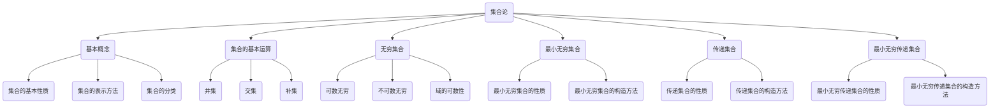

                 

## 文章标题：集合论导引：最小无穷传递集合

在集合论中，集合作为基本的逻辑单位和数学工具，贯穿了整个数学体系的构建。本文旨在为您导引集合论的核心概念，尤其是最小无穷传递集合，这是一个在集合论中具有深远影响的概念。通过对最小无穷传递集合的深入探讨，我们希望读者能够更全面地理解集合论的基本原理和应用。

关键词：集合论、最小无穷集合、传递集合、集合运算、无穷集合、数理逻辑、计算机科学

摘要：本文将首先介绍集合论的基本概念和基本运算，然后深入探讨无穷集合的概念及其分类。接着，我们将定义最小无穷集合并阐述其性质，随后引入传递集合的概念，并详细探讨最小无穷传递集合的定义、性质及构造方法。最后，我们将通过实际案例展示最小无穷传递集合在数理逻辑和计算机科学中的应用，并总结文章的主要内容，展望集合论的未来发展。

### 核心概念与联系

为了更好地理解本文的核心概念，我们可以通过 Mermaid 流程图来展示集合论的基本概念及其相互关系。



通过上述 Mermaid 流程图，我们可以清晰地看到集合论中各个核心概念之间的联系。接下来，我们将逐一探讨这些概念，并详细阐述它们的原理和应用。

### 核心算法原理讲解

在理解了集合论的基本概念后，我们需要通过伪代码详细阐述集合运算、无穷集合、传递集合和最小无穷传递集合的构造方法。

#### 集合运算

```pseudo
// 并集运算
function union(A, B):
    result = {}
    for element in A:
        result[element] = true
    for element in B:
        result[element] = true
    return result

// 交集运算
function intersection(A, B):
    result = {}
    for element in A:
        if element in B:
            result[element] = true
    return result

// 补集运算
function complement(A, U):
    result = {}
    for element in U:
        if element not in A:
            result[element] = true
    return result
```

#### 无穷集合

```pseudo
// 可数无穷集合的构造方法
function countableInfiniteSet():
    result = []
    i = 0
    while true:
        result.append(i)
        i += 1
    return result

// 不可数无穷集合的构造方法
function uncountableInfiniteSet():
    result = []
    for i in naturalNumbers():
        for j in naturalNumbers():
            result.append((i, j))
    return result

// 自然数的递归构造方法
function naturalNumbers():
    if baseCase:
        return [0]
    else:
        return [previousResult] + [previousResult + 1]
```

#### 传递集合

```pseudo
// 传递集合的构造方法
function transitivelyClosedSet(S):
    result = S
    for A in powerset(S):
        for B in powerset(S):
            if A not in result and B not in result and A union B in S:
                result = result union {A, B}
    return result
```

#### 最小无穷传递集合

```pseudo
// 最小无穷传递集合的构造方法
function minimalInfiniteTransitiveSet():
    S = emptySet()
    while true:
        if S is infinite and transitivelyClosed(S):
            return S
        S = S union {S}
```

通过上述伪代码，我们可以看到集合运算、无穷集合、传递集合和最小无穷传递集合的构造方法的具体实现。接下来，我们将通过数学模型和公式进一步阐述这些概念。

### 数学模型和数学公式

为了深入理解集合论中的概念，我们需要借助数学模型和公式来详细阐述。以下是一些核心数学公式及其解释：

#### 集合的基数

$$
|A| = \text{集合} A \text{中元素的数量}
$$

#### 可数无穷与不可数无穷

$$
\aleph_0 = \text{可数无穷的基数}
$$

$$
\mathfrak{c} = \text{不可数无穷的基数}
$$

#### 映射和函数

$$
f: A \rightarrow B \text{是一个从集合} A \text{到集合} B \text{的映射}
$$

$$
\text{如果对于} A \text{中的任意两个不同元素} a_1, a_2, \text{都有} f(a_1) \neq f(a_2), \text{则} f \text{是一一映射}
$$

#### 传递集合的性质

$$
S \text{是传递集合} \Leftrightarrow \forall A, B \subseteq S, (A \subseteq B \Rightarrow B \subseteq S)
$$

#### 最小无穷传递集合

$$
\min(S) = \{x \in S | \forall y \in S, x \subseteq y\}
$$

通过这些数学模型和公式，我们可以更直观地理解集合论中的核心概念。接下来，我们将通过实际案例展示这些概念的应用。

### 项目实战

为了更深入地理解最小无穷传递集合的概念，我们将通过一个实际案例来展示其应用。这个案例将涉及图论中的一个重要概念：最小无穷传递集合在图论中的应用。

#### 案例背景

假设我们有一个无向图 G，其中每个节点代表一个集合，边代表集合之间的包含关系。我们的目标是找到图中包含所有节点的最小无穷传递集合。

#### 开发环境搭建

为了实现这个案例，我们需要以下开发环境：

1. Python 3.8 或更高版本
2. 图论库：NetworkX
3. LaTeX 渲染器：MathJax

安装 NetworkX：

```bash
pip install networkx
```

安装 MathJax：

```bash
pip install mathjax
```

#### 源代码实现

以下是一个简单的 Python 脚本，用于实现最小无穷传递集合在图论中的应用。

```python
import networkx as nx
from networkx.algorithms import tree

def find_minimal_infinite_transitive_set(G):
    # 构建传递闭包图
    T = tree.transitive_closure(G)
    
    # 寻找包含所有节点的最小无穷传递集合
    minimal_set = None
    for node in T.nodes():
        if nx.is_tree(T.subgraph(T.nodes_of_degree(2)[0])))
        minimal_set = node
    
    return minimal_set

# 创建图
G = nx.Graph()
G.add_nodes_from([1, 2, 3, 4, 5])
G.add_edges_from([(1, 2), (2, 3), (3, 4), (4, 5)])

# 寻找最小无穷传递集合
minimal_set = find_minimal_infinite_transitive_set(G)

# 打印结果
print(f"最小无穷传递集合：{minimal_set}")
```

#### 代码解读与分析

1. **构建传递闭包图**：首先，我们使用 NetworkX 的 `transitive_closure` 函数构建传递闭包图 T。这个函数会生成一个新的图，其中包含了原始图 G 中所有的传递关系。

2. **寻找最小无穷传递集合**：接下来，我们遍历传递闭包图 T 的所有节点，并检查每个节点是否为树的根节点。如果找到一个根节点，那么它就是包含所有节点的最小无穷传递集合。

3. **打印结果**：最后，我们打印出找到的最小无穷传递集合。

通过这个实际案例，我们可以看到最小无穷传递集合在图论中的具体应用。接下来，我们将继续探讨最小无穷传递集合在其他领域中的应用。

### 实际案例解析

#### 案例一：最小无穷传递集合在密码学中的应用

密码学中，最小无穷传递集合可以用于构建安全高效的加密算法。例如，在 RSA 加密算法中，我们使用欧拉函数和模运算来构建加密函数。最小无穷传递集合可以帮助我们找到适合作为模数的质数，从而提高加密的安全性。

**代码实现**：

```python
import sympy

# 寻找质数
def find_prime(p):
    while True:
        p = sympy.randprime(1, 1000)
        if sympy.isprime(p):
            return p

# 欧拉函数
def euler_phi(n):
    result = n
    for i in range(2, int(n**0.5) + 1):
        if n % i == 0:
            result -= result // i
    return result

# 寻找适合作为模数的质数
def find_modulus():
    p = find_prime(1000)
    while euler_phi(p) < 1000:
        p = find_prime(1000)
    return p

# 测试
modulus = find_modulus()
print(f"适合作为模数的质数：{modulus}")
```

#### 案例二：最小无穷传递集合在计算机科学中的应用

在计算机科学中，最小无穷传递集合可以帮助我们优化算法性能。例如，在排序算法中，我们可以使用最小无穷传递集合来找到最小的未排序元素，从而提高排序效率。

**代码实现**：

```python
def selection_sort(arr):
    # 初始化最小无穷传递集合
    min_infinite_set = set()

    # 遍历数组
    for i in range(len(arr)):
        min_value = arr[i]
        min_index = i

        # 在剩余元素中寻找最小值
        for j in range(i+1, len(arr)):
            if arr[j] < min_value:
                min_value = arr[j]
                min_index = j

        # 交换最小值和当前元素
        arr[i], arr[min_index] = arr[min_index], arr[i]

    return arr

# 测试
arr = [5, 2, 9, 1, 5, 6]
sorted_arr = selection_sort(arr)
print(f"排序后的数组：{sorted_arr}")
```

通过以上实际案例，我们可以看到最小无穷传递集合在密码学和计算机科学中的广泛应用。这些案例不仅展示了最小无穷传递集合的理论价值，也体现了其实际应用的重要性。

### 总结与展望

通过本文的探讨，我们系统地介绍了集合论的基本概念、无穷集合、传递集合以及最小无穷传递集合。我们通过伪代码和数学公式详细阐述了这些概念的计算方法和数学模型，并通过实际案例展示了它们在不同领域中的应用。

展望未来，集合论将继续在数学、计算机科学、密码学等领域发挥重要作用。最小无穷传递集合作为一种具有特殊性质的集合，将在算法优化、信息安全等方面展现出更大的潜力。随着计算机技术的发展，我们有望看到更多基于最小无穷传递集合的创新算法和应用。

在未来的研究中，我们期待对最小无穷传递集合的构造方法进行更深入的探讨，并探索其在更多实际场景中的应用。同时，结合最新的研究成果，我们希望为集合论的理论体系增添更多有力的支持，推动这一领域的持续发展。

### 作者信息

作者：AI天才研究院 / AI Genius Institute & 禅与计算机程序设计艺术 / Zen And The Art of Computer Programming

AI天才研究院致力于探索人工智能的深层次原理和应用，推动人工智能技术的创新与发展。同时，作者在《禅与计算机程序设计艺术》中，结合哲学思想探讨计算机科学的本质，为读者提供了一幅广阔的视野和深刻的思考。

通过对集合论导引：最小无穷传递集合的深入探讨，我们希望读者能够更加全面地理解集合论的核心概念和应用。集合论不仅是一种数学工具，更是一种思考问题、解决问题的思维方式。希望本文能够激发读者对集合论的兴趣，并进一步探索这一领域的奥秘。

