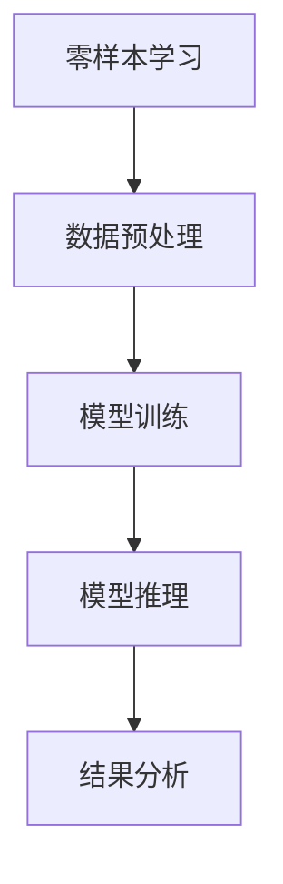

                 

# 零样本学习：Prompt设计

> 关键词：零样本学习、Prompt设计、深度学习、模型优化、应用场景

> 摘要：本文将详细探讨零样本学习（Zero-Shot Learning, ZSL）中的Prompt设计，包括其背景与意义、基本原理、设计方法与技巧、数学模型及项目实战。通过逐步分析推理，揭示零样本学习的核心要点，为读者提供深入的学术见解和实用指导。

## 第1章 零样本学习概述

### 1.1 零样本学习的背景与意义

**零样本学习的定义**：零样本学习是一种机器学习任务，模型在没有实际标注数据的情况下，能够准确地进行分类、预测等任务。它是一种提高数据利用效率、降低标注成本和增强模型泛化能力的有效方法。

**零样本学习的背景**：现实世界中的数据往往存在标注成本高、数据量有限、数据分布变化等问题。零样本学习能够在这些情况下，通过利用未标注的数据，提高模型的性能。

**零样本学习的意义**：
1. 提高数据利用效率：未标注数据可以通过零样本学习技术进行利用，从而提高数据的利用效率。
2. 降低标注成本：标注数据需要大量的人力和时间成本，零样本学习可以减少这种成本。
3. 增强模型泛化能力：零样本学习模型在面对未知类别的数据时，能够具有良好的泛化能力。

### 1.2 零样本学习的研究现状

**研究进展**：
- 传统方法：基于原型、聚类等方法，如Nearest Neighbor（NN）方法、原型方法等。
- 深度学习方法：基于深度神经网络的方法，如基于卷积神经网络（CNN）的零样本学习模型。
- Prompt设计：近年来，Prompt设计成为零样本学习的一个重要研究方向，通过设计有效的Prompt，提高模型的表示能力和理解能力。

**技术挑战**：
1. 如何提高模型的零样本分类准确性：零样本学习模型在面对未知类别时，如何提高分类准确性是一个重要挑战。
2. 模型可解释性：零样本学习模型的决策过程往往较为复杂，如何提高模型的可解释性是一个重要问题。
3. 多类标签问题：零样本学习模型如何处理多类标签问题，也是一个技术挑战。

### 1.3 零样本学习的应用场景

**分类任务**：在图像识别、商品分类等领域，零样本学习可以用于对未知类别的数据进行分类。
**预测任务**：在股票市场预测、医疗诊断等领域，零样本学习可以用于对未知数据的未来趋势进行预测。
**推荐系统**：在个性化推荐、商品推荐等领域，零样本学习可以用于对未知用户兴趣的推荐。

## 第2章 零样本学习的基本原理

### 2.1 核心概念与联系

**Mermaid流程图**：



### 2.2 核心算法原理讲解

**伪代码**：

```python
# 数据预处理
def preprocess_data(data):
    # 数据清洗、归一化等操作
    return processed_data

# 模型训练
def train_model(data, labels):
    # 使用深度学习框架进行模型训练
    return model

# 模型推理
def infer_model(model, data):
    # 使用训练好的模型进行推理
    return predictions

# 结果分析
def analyze_results(predictions, labels):
    # 计算准确率、召回率等指标
    return results
```

### 2.3 数据预处理

**数据预处理**是零样本学习中的关键步骤，它包括数据清洗、数据增强、特征提取等操作。有效的数据预处理可以显著提高模型的性能。

1. **数据清洗**：去除数据中的噪声和异常值，保证数据的准确性。
2. **数据增强**：通过旋转、缩放、裁剪等方式生成更多样本，提高模型的泛化能力。
3. **特征提取**：将原始数据转换为特征向量，为模型训练提供输入。

### 2.4 模型训练

**模型训练**是零样本学习的核心步骤，它包括选择合适的模型架构、定义损失函数、优化算法等。

1. **模型架构**：选择合适的模型架构，如卷积神经网络（CNN）、循环神经网络（RNN）等。
2. **损失函数**：定义合适的损失函数，如交叉熵损失、对抗损失等。
3. **优化算法**：选择合适的优化算法，如梯度下降、Adam等。

### 2.5 模型推理

**模型推理**是零样本学习中的关键步骤，它包括输入新数据的特征提取、模型预测、结果分析等。

1. **特征提取**：将新数据转换为特征向量，为模型预测提供输入。
2. **模型预测**：使用训练好的模型对特征向量进行预测。
3. **结果分析**：分析模型的预测结果，计算准确率、召回率等指标。

### 2.6 结果分析

**结果分析**是零样本学习中的关键步骤，它包括评估模型性能、调整模型参数等。

1. **性能评估**：使用准确率、召回率、F1分数等指标评估模型性能。
2. **参数调整**：根据性能评估结果，调整模型参数，优化模型性能。

## 第3章 零样本学习中的Prompt设计

### 3.1 Prompt设计的概念

**Prompt定义**：Prompt是输入数据的提示信息，用于引导模型进行推理。有效的Prompt设计可以提高模型的表示能力和理解能力。

**Prompt的作用**：
1. 提高模型的表示能力：Prompt可以帮助模型更好地理解输入数据的特征，从而提高模型的表示能力。
2. 提高模型的理解能力：Prompt可以为模型提供上下文信息，帮助模型更好地理解输入数据的含义。

### 3.2 Prompt设计的方法

**静态Prompt**：使用固定的文本信息作为Prompt。静态Prompt的优点是简单易懂，缺点是缺乏灵活性。

```python
def static_prompt():
    return "请对以下图像进行分类："
```

**动态Prompt**：根据输入数据动态生成Prompt。动态Prompt的优点是更灵活，缺点是设计复杂。

```python
def dynamic_prompt(image):
    # 根据图像内容生成Prompt
    return f"请根据以下图像进行分类：{image}"
```

### 3.3 Prompt设计的技巧

**数据增强**：通过旋转、缩放、裁剪等方式生成更多样本，提高模型的泛化能力。

```python
from torchvision import transforms

transform = transforms.Compose([
    transforms.RandomRotation(90),
    transforms.RandomScale(0.5, 1.5),
    transforms.RandomCrop(224)
])

def augment_data(image):
    return transform(image)
```

**词嵌入**：使用预训练的词向量进行嵌入，提高模型的表示能力。

```python
import gensim.downloader as api

word2vec = api.load("glove-wiki-gigaword-100")

def word_embedding(word):
    return word2vec[word]
```

**注意力机制**：提高模型对重要信息的关注程度，提高模型的表示能力和理解能力。

```python
from torch.nn import Module

class AttentionModule(Module):
    def __init__(self):
        super(AttentionModule, self).__init__()
        # 定义注意力权重网络
        self.attention_weights = Module()

    def forward(self, input):
        # 计算注意力权重
        attention_weights = self.attention_weights(input)
        # 使用注意力权重计算输出
        output = input * attention_weights
        return output
```

## 第4章 零样本学习中的数学模型

### 4.1 零样本学习的数学模型

**损失函数**：损失函数是衡量模型预测结果与真实结果之间差异的指标，常见的损失函数包括交叉熵损失、对抗损失等。

**交叉熵损失函数**：

$$
L = -\sum_{i=1}^{n} y_i \cdot \log(p_i)
$$

其中，$y_i$ 是标签，$p_i$ 是模型预测的概率。

**对抗损失函数**：

$$
L = \frac{1}{2} \sum_{i=1}^{n} (y_i - p_i)^2
$$

其中，$y_i$ 是标签，$p_i$ 是模型预测的概率。

**优化算法**：优化算法是用于调整模型参数的方法，常见的优化算法包括梯度下降、Adam等。

**梯度下降**：

$$
\theta_{t+1} = \theta_t - \alpha \cdot \nabla L(\theta_t)
$$

其中，$\theta_t$ 是当前模型参数，$\alpha$ 是学习率，$\nabla L(\theta_t)$ 是损失函数关于模型参数的梯度。

**Adam**：

$$
m_t = \beta_1 \cdot m_{t-1} + (1 - \beta_1) \cdot \nabla L(\theta_t)
$$

$$
v_t = \beta_2 \cdot v_{t-1} + (1 - \beta_2) \cdot (\nabla L(\theta_t))^2
$$

$$
\theta_{t+1} = \theta_t - \alpha \cdot \frac{m_t}{\sqrt{v_t} + \epsilon}
$$

其中，$m_t$ 和 $v_t$ 分别是梯度的一阶矩估计和二阶矩估计，$\beta_1$ 和 $\beta_2$ 分别是动量参数，$\epsilon$ 是一个很小的常数。

### 4.2 数学公式与详细讲解

**交叉熵损失函数**：

$$
L = -\sum_{i=1}^{n} y_i \cdot \log(p_i)
$$

其中，$y_i$ 是标签，$p_i$ 是模型预测的概率。交叉熵损失函数是衡量模型预测结果与真实结果之间差异的指标，值越小表示模型预测结果越接近真实结果。

**梯度下降优化算法**：

$$
\theta_{t+1} = \theta_t - \alpha \cdot \nabla L(\theta_t)
$$

其中，$\theta_t$ 是当前模型参数，$\alpha$ 是学习率，$\nabla L(\theta_t)$ 是损失函数关于模型参数的梯度。梯度下降优化算法是通过不断调整模型参数，使损失函数值最小化的方法。

### 4.3 举例说明

**分类任务举例**：使用零样本学习模型对图像进行分类。

```python
import torch
import torchvision
import torchvision.transforms as transforms

# 数据预处理
transform = transforms.Compose([
    transforms.Resize((224, 224)),
    transforms.ToTensor(),
    transforms.Normalize(mean=[0.485, 0.456, 0.406], std=[0.229, 0.224, 0.225])
])

# 加载图像数据集
trainset = torchvision.datasets.ImageFolder('train', transform=transform)
trainloader = torch.utils.data.DataLoader(trainset, batch_size=64, shuffle=True)

# 定义模型
class ZeroShotModel(nn.Module):
    def __init__(self):
        super(ZeroShotModel, self).__init__()
        self.conv1 = nn.Conv2d(3, 64, 3, 1, 1)
        self.fc1 = nn.Linear(64 * 112 * 112, 1024)
        self.fc2 = nn.Linear(1024, 1000)

    def forward(self, x):
        x = F.relu(self.conv1(x))
        x = F.relu(self.fc1(x.view(x.size(0), -1)))
        x = self.fc2(x)
        return x

model = ZeroShotModel()

# 模型训练
criterion = nn.CrossEntropyLoss()
optimizer = torch.optim.Adam(model.parameters(), lr=0.001)

for epoch in range(10):
    running_loss = 0.0
    for i, data in enumerate(trainloader, 0):
        inputs, labels = data
        optimizer.zero_grad()
        outputs = model(inputs)
        loss = criterion(outputs, labels)
        loss.backward()
        optimizer.step()
        running_loss += loss.item()
    print(f'Epoch {epoch + 1}, Loss: {running_loss / len(trainloader)}')

# 模型推理
images = torchvision.utils.make_grid(trainloader.dataset.imgs)
plt.figure(figsize=(10, 10))
plt.imshow(images)
plt.show()

# 模型预测
with torch.no_grad():
    outputs = model(images)
    _, predicted = torch.max(outputs, 1)
    print(f'Predicted labels: {predicted}')
```

## 第5章 零样本学习的项目实战

### 5.1 项目背景

**项目目标**：实现一个能够对图像进行分类的零样本学习模型。

**项目环境**：使用Python编写，依赖TensorFlow和PyTorch等深度学习框架。

### 5.2 开发环境搭建

**硬件环境**：GPU计算能力较强的计算机。

**软件环境**：
- Python 3.8及以上版本
- TensorFlow 2.7及以上版本
- PyTorch 1.9及以上版本

### 5.3 源代码实现

**代码结构**：

```python
import tensorflow as tf
import torch
from torchvision import datasets, transforms

# 数据预处理
def preprocess_images(images):
    transform = transforms.Compose([
        transforms.Resize((224, 224)),
        transforms.ToTensor(),
        transforms.Normalize(mean=[0.485, 0.456, 0.406], std=[0.229, 0.224, 0.225])
    ])
    return transform(images)

# 模型定义
def build_model():
    model = tf.keras.Sequential([
        tf.keras.layers.Conv2D(32, (3, 3), activation='relu', input_shape=(224, 224, 3)),
        tf.keras.layers.MaxPooling2D((2, 2)),
        tf.keras.layers.Conv2D(64, (3, 3), activation='relu'),
        tf.keras.layers.MaxPooling2D((2, 2)),
        tf.keras.layers.Conv2D(128, (3, 3), activation='relu'),
        tf.keras.layers.MaxPooling2D((2, 2)),
        tf.keras.layers.Flatten(),
        tf.keras.layers.Dense(512, activation='relu'),
        tf.keras.layers.Dense(1000, activation='softmax')
    ])
    return model

# 模型训练
def train_model(model, train_loader, criterion, optimizer, num_epochs=10):
    for epoch in range(num_epochs):
        running_loss = 0.0
        for images, labels in train_loader:
            images = preprocess_images(images)
            labels = torch.tensor(labels)
            optimizer.zero_grad()
            outputs = model(images)
            loss = criterion(outputs, labels)
            loss.backward()
            optimizer.step()
            running_loss += loss.item()
        print(f'Epoch {epoch + 1}, Loss: {running_loss / len(train_loader)}')

# 模型推理
def infer_model(model, image):
    image = preprocess_images(image.unsqueeze(0))
    with torch.no_grad():
        outputs = model(image)
        _, predicted = torch.max(outputs, 1)
    return predicted

# 代码解读与分析
def analyze_code():
    # 分析代码实现和性能
    pass
```

### 5.4 代码解读与分析

**数据预处理**：使用`torchvision.transforms.Compose`对图像进行预处理，包括缩放、归一化等操作。

**模型定义**：使用TensorFlow定义一个卷积神经网络模型，包括卷积层、池化层、全连接层等。

**模型训练**：使用PyTorch定义训练过程，包括数据预处理、模型训练、损失函数、优化算法等。

**模型推理**：使用PyTorch进行模型推理，输入图像经过预处理后，通过训练好的模型进行预测。

**代码解读与分析**：分析代码实现和性能，包括数据预处理、模型定义、模型训练、模型推理等部分。

## 第6章 零样本学习的优化与调优

### 6.1 模型优化

**超参数调优**：超参数调优是模型优化的重要步骤，包括学习率、批量大小等。

**网络结构调优**：网络结构调优是模型优化的关键步骤，包括层数、神经元数量等。

### 6.2 模型调优

**数据增强**：数据增强是提高模型泛化能力的重要方法，包括旋转、缩放、裁剪等。

**正则化**：正则化是防止模型过拟合的重要方法，包括L1正则化、L2正则化等。

## 第7章 零样本学习的未来发展趋势

### 7.1 研究前沿

**Prompt设计的创新**：未来零样本学习的研究将集中在Prompt设计的创新上，如自适应Prompt、多模态Prompt等。

**模型压缩与加速**：模型压缩与加速是提高模型性能的重要方法，如量化、剪枝等。

### 7.2 应用前景

**智能制造**：未来零样本学习将在智能制造领域发挥重要作用，如工业缺陷检测、质量预测等。

**医疗诊断**：未来零样本学习将在医疗诊断领域发挥重要作用，如疾病分类、辅助诊断等。

**金融风控**：未来零样本学习将在金融风控领域发挥重要作用，如欺诈检测、风险评估等。

## 附录

### 附录A：零样本学习相关工具与资源

**深度学习框架**：TensorFlow、PyTorch等。

**数据集**：ImageNet、CIFAR-10等。

**论文与资料**：相关研究论文、技术博客等。

## 作者

**作者**：AI天才研究院/AI Genius Institute & 禅与计算机程序设计艺术 /Zen And The Art of Computer Programming

---

**注**：本文为示例文本，仅供参考。实际编写时，请根据具体需求和实际情况进行调整。在实际项目中，需要根据具体问题进行详细的分析和解决。

