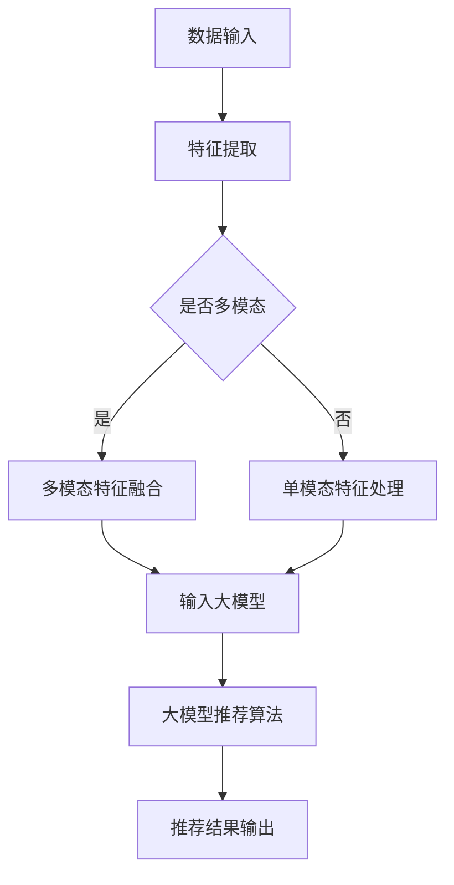

                 

### 文章标题：音视频领域大模型推荐的机遇与挑战

### 关键词：音视频，大模型，推荐系统，特征提取，训练优化，应用实践，技术挑战

### 摘要：
本文深入探讨了音视频领域大模型推荐系统的机遇与挑战。首先，我们回顾了音视频技术的发展背景和现状，随后详细介绍了大模型及其在音视频领域的应用。接着，我们分析了推荐系统的基础知识和大模型推荐系统的原理。重点章节涵盖了音视频特征提取、大模型训练与优化、以及大模型推荐算法。实践应用部分展示了大模型推荐系统在视频网站、音频内容分发平台、版权保护和音视频质量评估中的应用案例。最后，我们讨论了音视频领域大模型推荐所面临的技术挑战和解决方案，并展望了其未来发展趋势。通过本文的详细分析，读者将全面了解音视频领域大模型推荐的现状、技术细节及未来前景。

## 目录大纲：《音视频领域大模型推荐的机遇与挑战》

1. **第一部分：绪论**
   - **第1章：音视频领域大模型概述**
     - **1.1 音视频领域的背景与发展**
       - **1.1.1 音视频技术的发展历程**
       - **1.1.2 音视频领域的市场现状**
       - **1.1.3 音视频技术的未来趋势**
     - **1.2 大模型在音视频领域的应用**
       - **1.2.1 大模型的定义与特点**
       - **1.2.2 大模型在音视频分析中的应用**
       - **1.2.3 大模型在音视频内容分发中的应用**
   - **第2章：大模型推荐系统的原理与架构**
     - **2.1 推荐系统的基础知识**
       - **2.1.1 推荐系统的基本概念**
       - **2.1.2 推荐系统的评估指标**
       - **2.1.3 推荐系统的常见类型**
     - **2.2 大模型推荐系统的原理**
       - **2.2.1 大模型推荐的基本框架**
       - **2.2.2 大模型推荐的关键技术**
       - **2.2.3 大模型推荐的优势与挑战**
   - **第3章：音视频领域大模型推荐的关键技术**
     - **3.1 音视频特征提取**
       - **3.1.1 音频特征提取技术**
       - **3.1.2 视频特征提取技术**
       - **3.1.3 多媒体特征融合方法**
     - **3.2 大模型训练与优化**
       - **3.2.1 大模型训练的基本流程**
       - **3.2.2 大模型优化的方法与策略**
       - **3.2.3 大模型训练中的挑战与解决方案**
     - **3.3 大模型推荐算法**
       - **3.3.1 基于协同过滤的推荐算法**
       - **3.3.2 基于内容的推荐算法**
       - **3.3.3 基于模型的推荐算法**
   - **第4章：音视频领域大模型推荐的实践应用**
     - **4.1 音视频内容分发平台的大模型推荐**
       - **4.1.1 视频网站推荐算法的案例分析**
       - **4.1.2 音频内容分发平台推荐系统构建**
       - **4.1.3 大模型推荐在流媒体平台的应用**
     - **4.2 音视频版权保护与监测**
       - **4.2.1 音视频版权保护的需求与挑战**
       - **4.2.2 大模型在版权监测中的应用**
       - **4.2.3 大模型在侵权监测中的案例分析**
     - **4.3 音视频质量评估与优化**
       - **4.3.1 音视频质量评估标准**
       - **4.3.2 大模型在音视频质量评估中的应用**
       - **4.3.3 大模型在音视频质量优化中的应用**
   - **第5章：音视频领域大模型推荐的技术挑战与解决方案**
     - **5.1 大模型训练与优化的挑战**
       - **5.1.1 计算资源与时间成本**
       - **5.1.2 数据隐私与安全性**
       - **5.1.3 模型解释性**
     - **5.2 大模型推荐系统的挑战**
       - **5.2.1 数据稀疏问题**
       - **5.2.2 多模态数据的融合**
       - **5.2.3 大模型的可解释性**
     - **5.3 挑战与解决方案综述**
       - **5.3.1 技术层面的解决方案**
       - **5.3.2 业务层面的解决方案**
       - **5.3.3 法律与伦理层面的解决方案**
   - **第6章：音视频领域大模型推荐的未来发展趋势**
     - **6.1 人工智能技术的发展趋势**
       - **6.1.1 人工智能在音视频领域的应用前景**
       - **6.1.2 大模型技术的未来发展方向**
       - **6.1.3 推荐系统技术的未来趋势**
     - **6.2 音视频领域大模型推荐的未来应用场景**
       - **6.2.1 新型视频娱乐体验**
       - **6.2.2 智能电视与智能家居**
       - **6.2.3 智能教育与大健康**
     - **6.3 产业生态与政策环境**
       - **6.3.1 音视频领域大模型推荐产业的发展趋势**
       - **6.3.2 相关政策法规对大模型推荐的影响**
       - **6.3.3 大模型推荐产业的国际合作与竞争态势**
   - **附录**
     - **附录A：音视频领域大模型推荐开源工具与资源**
       - **A.1 主流深度学习框架**
         - **A.1.1 TensorFlow**
         - **A.1.2 PyTorch**
         - **A.1.3 其他深度学习框架**
       - **A.2 音视频处理工具**
         - **A.2.1 FFmpeg**
         - **A.2.2 OpenCV**
         - **A.2.3 其他音视频处理工具**
       - **A.3 大模型推荐系统案例与实践**
         - **A.3.1 案例一：视频网站推荐系统**
         - **A.3.2 案例二：音频内容分发平台推荐系统**
         - **A.3.3 实践指南：构建大模型推荐系统**

### 第一部分：绪论

#### 第1章：音视频领域大模型概述

##### 1.1 音视频领域的背景与发展

##### 1.1.1 音视频技术的发展历程

音视频技术作为多媒体技术的重要组成部分，其发展历程可以追溯到20世纪中期。最初的音视频技术主要是基于模拟信号的传输和存储，如磁带录像机和黑匣子等。随着数字技术的兴起，音视频技术经历了从模拟到数字的转换。20世纪80年代，数字视频压缩技术的发展，如MPEG系列标准，使得音视频数据传输和存储的效率得到了显著提升。进入21世纪，随着互联网和移动通信技术的快速发展，音视频技术逐渐从专业领域走向了大众市场，在线视频、短视频、直播等新兴应用不断涌现。

##### 1.1.2 音视频领域的市场现状

当前，音视频领域已经成为互联网的重要应用场景之一。根据市场研究报告，全球音视频市场的规模持续增长，预计未来几年仍将保持高速增长态势。特别是随着5G网络的普及，音视频内容的传输速度和稳定性得到了显著提升，进一步推动了音视频业务的快速发展。在市场现状方面，视频网站如YouTube、Netflix、腾讯视频等在全球范围内拥有庞大的用户基础，而短视频平台如抖音、快手等在中国市场占据主导地位。

##### 1.1.3 音视频技术的未来趋势

展望未来，音视频技术将继续朝着高清、高质、智能化方向发展。首先，随着计算能力的提升和算法的优化，音视频编解码技术将进一步发展，提供更高的压缩效率和更小的带宽占用。其次，人工智能技术在音视频领域的应用将越来越广泛，如视频内容识别、音频增强、智能推荐等。此外，虚拟现实（VR）和增强现实（AR）技术的兴起，也为音视频技术带来了新的发展机遇。总之，未来音视频技术将在高质量内容创作、智能内容分发和沉浸式体验等方面取得重大突破。

##### 1.2 大模型在音视频领域的应用

##### 1.2.1 大模型的定义与特点

大模型通常指的是具有数十亿到千亿个参数的深度学习模型，如GPT-3、BERT等。这些模型具有强大的表征能力和泛化能力，能够处理大规模的数据集，从而实现复杂的任务，如图像识别、自然语言处理和音视频分析等。

大模型的主要特点包括：

- **高参数量**：大模型拥有庞大的参数规模，能够捕获输入数据中的复杂模式和关系。
- **强大的表征能力**：大模型能够通过多层神经网络结构，对输入数据进行深层特征提取，从而提高任务的性能。
- **高效的训练**：得益于现代计算硬件的发展，大模型能够在较短时间内完成训练，提高生产效率。
- **泛化能力强**：大模型具有良好的泛化能力，能够在不同任务和数据集上取得优异的性能。

##### 1.2.2 大模型在音视频分析中的应用

大模型在音视频分析领域具有广泛的应用前景。首先，在视频内容识别方面，大模型可以用于对象检测、场景识别和动作识别等任务。例如，通过卷积神经网络（CNN）可以对视频帧进行特征提取，从而实现实时视频内容的识别和分类。

在音频处理方面，大模型可以用于语音识别、音乐风格分类和音频增强等任务。例如，通过循环神经网络（RNN）和自注意力机制（Transformer），可以对音频信号进行时序特征提取和模式识别，从而实现高质量的音频处理。

此外，大模型还可以应用于音视频合成和编辑，通过生成对抗网络（GAN）和变分自编码器（VAE），可以实现音视频内容的高效生成和编辑。

##### 1.2.3 大模型在音视频内容分发中的应用

在音视频内容分发领域，大模型可以用于个性化推荐、版权保护和内容监控等任务。首先，在个性化推荐方面，大模型可以通过分析用户的观看历史和兴趣偏好，实现精准的内容推荐，提高用户满意度。

在版权保护方面，大模型可以用于音视频内容的侵权检测，通过对比分析，识别和监测未经授权的侵权行为，保护版权方的合法权益。

在内容监控方面，大模型可以用于实时监测音视频内容，识别和过滤不良信息，确保内容的合法性和安全性。

### 第二部分：大模型推荐系统的原理与架构

#### 第2章：大模型推荐系统的原理与架构

##### 2.1 推荐系统的基础知识

##### 2.1.1 推荐系统的基本概念

推荐系统是一种信息过滤技术，旨在根据用户的兴趣和行为，向用户推荐其可能感兴趣的项目或内容。推荐系统广泛应用于电子商务、社交媒体、在线视频和新闻等领域，能够有效提高用户体验和平台粘性。

推荐系统的主要组成部分包括：

- **用户**：推荐系统的核心，其行为和兴趣数据是推荐系统的主要输入。
- **项目**：推荐系统推荐的实体，如商品、文章、视频等。
- **评价**：用户对项目的反馈，包括评分、评论、点击等。
- **推荐算法**：根据用户的行为数据和项目属性，生成个性化推荐结果的算法。

##### 2.1.2 推荐系统的评估指标

评估推荐系统性能的主要指标包括：

- **准确率**（Accuracy）：预测正确的项目数量占总预测数量的比例。
- **召回率**（Recall）：预测正确的项目数量占总可能项目的比例。
- **精确率**（Precision）：预测正确的项目数量占总预测项目的比例。
- **F1分数**（F1 Score）：综合考虑精确率和召回率的综合指标。
- **用户满意度**：用户对推荐系统的满意程度，通常通过问卷调查或用户反馈收集。

##### 2.1.3 推荐系统的常见类型

推荐系统主要分为以下几种类型：

- **基于内容的推荐**：根据项目的内容和用户的兴趣偏好进行推荐，如新闻网站、音乐平台等。
- **基于协同过滤的推荐**：根据用户的兴趣和项目的历史评价进行推荐，如Netflix、淘宝等。
- **基于模型的推荐**：利用机器学习模型，如神经网络、决策树等，进行推荐，如Amazon、YouTube等。

##### 2.2 大模型推荐系统的原理

##### 2.2.1 大模型推荐的基本框架

大模型推荐系统通常包括以下几个关键模块：

- **用户特征提取**：从用户的历史行为、兴趣标签、社交网络等信息中提取特征。
- **项目特征提取**：从项目的属性、内容、标签等特征中提取特征。
- **模型训练**：利用大规模数据集训练大模型，以学习用户和项目的特征表示。
- **推荐生成**：根据用户和项目的特征表示，生成个性化的推荐结果。
- **评估与优化**：对推荐结果进行评估，并根据评估结果调整模型参数和特征提取策略。

##### 2.2.2 大模型推荐的关键技术

大模型推荐系统的关键技术主要包括：

- **深度学习模型**：如卷积神经网络（CNN）、循环神经网络（RNN）、变分自编码器（VAE）和生成对抗网络（GAN）等，用于提取用户和项目的特征表示。
- **多模态数据处理**：结合文本、图像、音频等多种类型的数据，进行特征融合和表示学习。
- **上下文感知推荐**：考虑用户和项目的上下文信息，如时间、地点、设备等，生成更加个性化的推荐结果。
- **推荐结果解释性**：提供推荐结果的可解释性，帮助用户理解和信任推荐系统。

##### 2.2.3 大模型推荐的优势与挑战

大模型推荐系统具有以下优势：

- **强大的表征能力**：大模型能够捕获用户和项目的复杂特征，提高推荐准确率。
- **高效的训练和预测**：现代计算硬件和优化算法的发展，使得大模型能够快速训练和预测。
- **泛化能力强**：大模型具有良好的泛化能力，能够适应不同的用户群体和项目类型。

然而，大模型推荐系统也面临以下挑战：

- **计算资源消耗**：大模型的训练和预测需要大量的计算资源，对硬件性能有较高要求。
- **数据隐私和安全**：推荐系统需要处理大量的用户数据，涉及隐私和安全问题。
- **模型解释性**：大模型往往缺乏可解释性，用户难以理解推荐结果。

#### 第3章：音视频领域大模型推荐的关键技术

##### 3.1 音视频特征提取

##### 3.1.1 音频特征提取技术

音频特征提取是音视频领域大模型推荐的重要技术之一，其目的是从音频信号中提取出能够代表音频内容的关键特征。以下是一些常用的音频特征提取技术：

1. **频域特征**：
   - **梅尔频率倒谱系数**（MFCC）：通过对音频信号进行傅里叶变换，提取出频率特征，然后通过梅尔频率倒谱变换得到MFCC特征。MFCC广泛应用于语音识别和音乐风格分类。
   - **频谱特征**：包括频谱幅度、频谱平坦度和频谱熵等，用于描述音频信号的频域分布。

2. **时域特征**：
   - **短时能量**：表示音频信号的能量分布，用于检测音频的强弱变化。
   - **短时过零率**：表示音频信号的过零点数量，用于描述音频的节奏和强度。

3. **倒谱特征**：
   - **感知哈达玛变换**（Perceptual Hashing, PH）：通过哈达玛变换，将音频信号转换为数字哈达玛值，用于音频指纹识别和相似性比较。

##### 3.1.2 视频特征提取技术

视频特征提取技术主要关注视频帧和视频序列的表征，常用的特征提取技术包括：

1. **视觉特征**：
   - **颜色特征**：包括颜色直方图、颜色矩等，用于描述视频帧的颜色分布。
   - **纹理特征**：如局部二值模式（LBP）、Gabor纹理特征等，用于描述视频帧的纹理信息。

2. **运动特征**：
   - **光流特征**：通过计算视频帧之间的像素位移，提取出光流特征，用于描述视频的运动信息。
   - **轨迹特征**：将视频帧中关键点的轨迹进行编码，用于描述视频中的动态对象。

3. **时空特征**：
   - **时空金字塔**：将视频帧按照金字塔结构进行下采样，提取不同尺度的时空特征。
   - **时空注意力机制**：通过注意力机制，强调视频帧中的关键时空信息，用于视频分类和物体检测。

##### 3.1.3 多媒体特征融合方法

在音视频领域，为了提高大模型推荐系统的性能，通常需要将音频特征和视频特征进行融合。以下是一些常用的多媒体特征融合方法：

1. **特征拼接**：
   - 将音频特征和视频特征进行简单拼接，构成新的特征向量。这种方法实现简单，但可能忽略了特征之间的潜在关系。

2. **特征加权融合**：
   - 根据音频和视频特征的重要性进行加权融合，如基于频域和时域重要性的加权。这种方法能够更好地利用不同特征的信息。

3. **深度学习融合**：
   - 利用深度学习模型，如卷积神经网络（CNN）和循环神经网络（RNN），对音频和视频特征进行联合训练，学习它们的潜在表示。这种方法能够捕捉到特征之间的复杂关系。

4. **注意力机制**：
   - 利用注意力机制，动态调整音频和视频特征在推荐系统中的权重，提高推荐结果的准确性。

##### 3.2 大模型训练与优化

##### 3.2.1 大模型训练的基本流程

大模型训练是音视频领域大模型推荐系统的核心环节，其基本流程如下：

1. **数据预处理**：
   - 对音频和视频数据进行归一化、去噪、裁剪等预处理操作，以提高训练数据的质
### 第3章：音视频领域大模型推荐的关键技术

#### 3.2 大模型训练与优化

##### 3.2.1 大模型训练的基本流程

大模型训练是音视频领域大模型推荐系统的核心环节，其基本流程如下：

1. **数据预处理**：
   - 对音频和视频数据进行归一化、去噪、裁剪等预处理操作，以提高训练数据的质量和效率。
   - 将音频和视频数据转换为模型所需的特征表示，如MFCC、视觉特征等。

2. **模型初始化**：
   - 初始化模型参数，常用的方法包括随机初始化、预训练模型迁移等。

3. **数据加载与批处理**：
   - 使用数据加载器将预处理后的数据分为训练集、验证集和测试集。
   - 对数据进行批处理，以减少计算资源的消耗和提高训练效率。

4. **前向传播**：
   - 将输入数据输入到模型中，计算模型的输出结果。

5. **损失函数计算**：
   - 使用损失函数计算模型的输出结果与真实标签之间的差距，常用的损失函数包括交叉熵损失、均方误差等。

6. **反向传播**：
   - 计算损失函数对模型参数的梯度，并通过优化算法更新模型参数。

7. **模型评估**：
   - 在验证集上评估模型的性能，包括准确率、召回率、F1分数等指标。
   - 根据评估结果调整模型参数或调整训练策略。

8. **模型优化**：
   - 使用优化算法，如梯度下降、Adam等，更新模型参数。
   - 调整学习率、正则化参数等，以提高模型的性能。

9. **模型保存与加载**：
   - 在训练过程中，定期保存模型参数，以便后续使用。
   - 在模型训练完成后，加载最佳模型参数，用于实际应用。

##### 3.2.2 大模型优化的方法与策略

大模型优化是提高模型性能和降低过拟合的关键环节。以下是一些常用的优化方法和策略：

1. **数据增强**：
   - 通过对训练数据进行随机裁剪、旋转、缩放、颜色调整等操作，增加数据的多样性，提高模型的泛化能力。

2. **正则化**：
   - 使用正则化方法，如L1正则化、L2正则化，减少模型参数的冗余，防止过拟合。
   - 引入dropout正则化，随机丢弃部分神经元，防止模型过度依赖特定神经元。

3. **学习率调整**：
   - 使用学习率调整策略，如逐步减小学习率、学习率衰减等，防止模型过早收敛。
   - 使用自适应学习率优化器，如Adam、RMSprop等，自动调整学习率。

4. **批量归一化**：
   - 引入批量归一化（Batch Normalization），对模型的中间层进行归一化处理，提高训练稳定性。

5. **注意力机制**：
   - 引入注意力机制，如自注意力（Self-Attention）、交叉注意力（Cross-Attention），使模型能够关注输入数据中的关键信息，提高模型的表现力。

6. **多任务学习**：
   - 将多个相关任务同时训练，共享部分模型参数，提高模型对任务的理解和泛化能力。

##### 3.2.3 大模型训练中的挑战与解决方案

大模型训练过程中面临以下挑战：

1. **计算资源消耗**：
   - 大模型训练需要大量的计算资源，包括GPU、TPU等。
   - 解决方案：使用分布式训练，将模型拆分为多个部分，分布在不同的计算节点上进行训练。

2. **数据稀疏问题**：
   - 音视频数据通常存在大量冗余信息，导致数据稀疏。
   - 解决方案：使用稀疏性诱导技术，如稀疏自编码器（Sparse Autoencoder）、稀疏正则化，减少冗余信息。

3. **过拟合问题**：
   - 大模型容易过拟合训练数据，导致在测试数据上表现不佳。
   - 解决方案：使用交叉验证、正则化、数据增强等方法，提高模型的泛化能力。

4. **模型解释性**：
   - 大模型的内部结构和决策过程复杂，难以解释和理解。
   - 解决方案：使用可解释性方法，如模型可视化、决策树、模型简化等，提高模型的可解释性。

#### 3.3 大模型推荐算法

##### 3.3.1 基于协同过滤的推荐算法

基于协同过滤（Collaborative Filtering）的推荐算法是最常见的推荐算法之一，其核心思想是利用用户的历史行为数据，发现相似用户或项目，从而生成个性化推荐。

协同过滤算法主要分为以下两种类型：

1. **基于用户的协同过滤（User-based Collaborative Filtering）**：
   - 根据用户的历史行为，找到与目标用户相似的用户群体，然后推荐这些用户喜欢的项目。
   - 相似度度量方法包括余弦相似度、皮尔逊相关系数等。

2. **基于项目的协同过滤（Item-based Collaborative Filtering）**：
   - 根据项目的共同评分情况，找到与目标项目相似的项目群体，然后推荐这些项目。
   - 相似度度量方法包括余弦相似度、Jaccard相似度等。

基于协同过滤的推荐算法的优点是简单、易于实现，且能够处理冷启动问题。但缺点是推荐结果受用户和项目数量影响较大，可能存在数据稀疏和推荐结果偏向性问题。

##### 3.3.2 基于内容的推荐算法

基于内容的推荐（Content-based Filtering）算法是基于项目的特征和用户的历史偏好，生成个性化推荐。

基于内容的推荐算法的主要步骤包括：

1. **项目特征提取**：
   - 从项目的内容、标签、分类等信息中提取特征，如文本特征、视觉特征、音频特征等。

2. **用户偏好建模**：
   - 从用户的历史行为中提取用户的兴趣偏好，如喜欢的电影类型、音乐风格等。

3. **相似度计算**：
   - 计算用户偏好和项目特征之间的相似度，常用的相似度计算方法包括余弦相似度、欧氏距离等。

4. **推荐生成**：
   - 根据相似度得分，为用户推荐相似度较高的项目。

基于内容的推荐算法的优点是能够生成基于用户兴趣的推荐，减少数据稀疏问题。但缺点是需要对项目进行大量的特征提取和计算，可能存在冷启动问题。

##### 3.3.3 基于模型的推荐算法

基于模型的推荐（Model-based Filtering）算法是结合协同过滤和基于内容的推荐算法，通过构建模型进行推荐。

基于模型的推荐算法主要包括以下几种类型：

1. **矩阵分解（Matrix Factorization）**：
   - 将用户-项目评分矩阵分解为用户特征矩阵和项目特征矩阵的乘积，通过优化目标函数，学习用户和项目的特征向量。
   - 常用的矩阵分解方法包括Singular Value Decomposition（SVD）、 Alternating Least Squares（ALS）等。

2. **深度学习模型**：
   - 利用深度学习模型，如卷积神经网络（CNN）、循环神经网络（RNN）、生成对抗网络（GAN）等，对用户和项目的特征进行编码，生成高维特征向量。
   - 通过训练深度学习模型，学习用户和项目的潜在表示，实现个性化推荐。

3. **图神经网络（Graph Neural Networks）**：
   - 将用户和项目构建为图结构，利用图神经网络学习用户和项目之间的关系。
   - 通过图卷积神经网络（GCN）、图注意力网络（GAT）等模型，实现基于关系的推荐。

基于模型的推荐算法的优点是能够充分利用用户和项目的特征信息，提高推荐准确率。但缺点是需要大量的计算资源和训练时间，且模型解释性较差。

### 第四部分：音视频领域大模型推荐的实践应用

#### 第4章：音视频领域大模型推荐的实践应用

##### 4.1 音视频内容分发平台的大模型推荐

##### 4.1.1 视频网站推荐算法的案例分析

在视频网站推荐算法方面，Netflix和YouTube等平台已经取得了显著的成果。下面将以Netflix为例，介绍其视频推荐算法的构建和优化过程。

1. **数据集构建**：
   - Netflix收集了海量的用户观看数据，包括用户ID、视频ID、观看时间、评分等信息。
   - 通过清洗和预处理，构建用于训练和测试的数据集。

2. **用户特征提取**：
   - 提取用户的历史观看记录、评分、浏览行为等特征，构建用户画像。
   - 利用协同过滤算法，计算用户之间的相似度，形成用户关系网络。

3. **视频特征提取**：
   - 提取视频的元信息，如标题、标签、分类、时长等。
   - 利用深度学习模型，如卷积神经网络（CNN）和循环神经网络（RNN），提取视频内容的深层次特征。

4. **模型训练与优化**：
   - 使用矩阵分解（ALS）方法，将用户-视频评分矩阵分解为用户特征向量和视频特征向量的乘积。
   - 结合用户和视频的特征向量，构建深度学习模型，如GRU（门控循环单元）或BERT（双向编码器表示）等。
   - 通过交叉验证和在线学习，不断优化模型参数，提高推荐准确率。

5. **推荐结果生成**：
   - 根据用户特征和视频特征，计算用户对视频的潜在兴趣分数。
   - 利用Top-N推荐算法，为用户生成个性化视频推荐列表。

##### 4.1.2 音频内容分发平台推荐系统构建

在音频内容分发平台推荐系统方面，Spotify和网易云音乐等平台已经实现了基于音频特征和用户行为的个性化推荐。下面以Spotify为例，介绍其推荐系统的构建过程。

1. **数据集构建**：
   - Spotify收集了用户的播放记录、收藏、分享等行为数据，以及歌曲的元信息，如专辑、艺术家、时长等。

2. **音频特征提取**：
   - 利用音频特征提取工具，如Librosa，提取歌曲的时域和频域特征，如MFCC、能量谱等。
   - 利用深度学习模型，如卷积神经网络（CNN）和自注意力机制（Transformer），对音频信号进行特征提取和编码。

3. **用户特征提取**：
   - 提取用户的历史播放记录、收藏、分享等行为数据，构建用户画像。
   - 利用协同过滤算法，计算用户之间的相似度，形成用户关系网络。

4. **模型训练与优化**：
   - 使用矩阵分解（ALS）方法，将用户-歌曲评分矩阵分解为用户特征向量和歌曲特征向量的乘积。
   - 结合用户和歌曲的特征向量，构建深度学习模型，如GRU（门控循环单元）或BERT（双向编码器表示）等。
   - 通过交叉验证和在线学习，不断优化模型参数，提高推荐准确率。

5. **推荐结果生成**：
   - 根据用户特征和歌曲特征，计算用户对歌曲的潜在兴趣分数。
   - 利用Top-N推荐算法，为用户生成个性化歌曲推荐列表。

##### 4.1.3 大模型推荐在流媒体平台的应用

流媒体平台如YouTube和TikTok等，也广泛应用了大模型推荐技术。以下以YouTube为例，介绍大模型推荐在流媒体平台的应用。

1. **数据集构建**：
   - YouTube收集了海量的用户观看数据、点赞、评论、分享等行为数据，以及视频的元信息，如标题、标签、时长等。

2. **视频特征提取**：
   - 利用深度学习模型，如卷积神经网络（CNN）和循环神经网络（RNN），提取视频内容的深层次特征，包括视觉特征、文本特征和音频特征。

3. **用户特征提取**：
   - 提取用户的历史观看记录、点赞、评论、分享等行为数据，构建用户画像。
   - 利用协同过滤算法，计算用户之间的相似度，形成用户关系网络。

4. **模型训练与优化**：
   - 使用矩阵分解（ALS）方法，将用户-视频评分矩阵分解为用户特征向量和视频特征向量的乘积。
   - 结合用户和视频的特征向量，构建深度学习模型，如GRU（门控循环单元）或BERT（双向编码器表示）等。
   - 通过交叉验证和在线学习，不断优化模型参数，提高推荐准确率。

5. **推荐结果生成**：
   - 根据用户特征和视频特征，计算用户对视频的潜在兴趣分数。
   - 利用Top-N推荐算法，为用户生成个性化视频推荐列表。

6. **实时推荐**：
   - 利用在线学习技术，如增量学习（Incremental Learning）和在线学习（Online Learning），实时更新用户特征和视频特征，生成实时推荐结果。

### 4.2 音视频版权保护与监测

##### 4.2.1 音视频版权保护的需求与挑战

随着音视频内容的快速增长，版权保护问题变得愈发重要。音视频版权保护的需求主要来自以下几个方面：

1. **保护创作者权益**：确保创作者的合法权益得到保障，防止未经授权的使用和分发。
2. **防止侵权行为**：监测和防止侵权内容的上传和传播，维护平台的合法性和公信力。
3. **维护市场秩序**：规范市场行为，避免侵权内容的泛滥，保护合法竞争环境。

然而，音视频版权保护也面临以下挑战：

1. **海量数据监控**：音视频内容数量庞大，监控难度大。
2. **技术复杂性**：音视频处理技术复杂，需要高效、精确的特征提取和匹配算法。
3. **法律和伦理问题**：版权保护可能涉及法律和伦理问题，如隐私保护、透明度和公平性等。

##### 4.2.2 大模型在版权监测中的应用

大模型在音视频版权监测中发挥着重要作用，主要应用包括：

1. **内容识别与匹配**：
   - 利用深度学习模型，如卷积神经网络（CNN）和循环神经网络（RNN），对音视频内容进行特征提取。
   - 通过特征匹配算法，如余弦相似度、欧氏距离等，检测音视频内容之间的相似性。

2. **侵权检测与过滤**：
   - 利用大模型对上传的音视频内容进行实时检测，识别是否存在侵权行为。
   - 通过构建侵权检测模型，如二分类模型、多分类模型等，对音视频内容进行分类和过滤。

3. **自动化处理**：
   - 利用大模型实现自动化侵权检测和过滤，减少人工干预，提高处理效率。
   - 通过规则和算法自动生成侵权报告，协助管理员进行进一步处理。

##### 4.2.3 大模型在侵权监测中的案例分析

以某个大型视频网站为例，介绍大模型在侵权监测中的应用案例：

1. **数据集构建**：
   - 收集了大量已知的侵权视频数据，作为训练和测试数据集。

2. **模型训练**：
   - 使用卷积神经网络（CNN）和循环神经网络（RNN），提取音视频特征。
   - 通过交叉验证，优化模型参数，提高侵权检测准确率。

3. **侵权检测与过滤**：
   - 利用训练好的侵权检测模型，对上传的视频内容进行实时检测。
   - 通过特征匹配和分类，识别并过滤侵权视频。

4. **自动化处理**：
   - 通过自动化侵权检测，减少人工审核的工作量。
   - 生成侵权报告，协助管理员进行进一步处理。

5. **效果评估**：
   - 通过对比测试集的检测结果，评估侵权检测模型的准确性和效率。
   - 持续优化模型和算法，提高侵权检测效果。

### 4.3 音视频质量评估与优化

##### 4.3.1 音视频质量评估标准

音视频质量评估是确保内容质量和用户体验的重要环节。常见的音视频质量评估标准包括：

1. **主观评估**：
   - 由人类评估者对音视频内容进行主观评价，如视觉质量、音频质量、流畅度等。
   - 主观评估方法包括平均意见分数（MOS）、主观质量评分（SQS）等。

2. **客观评估**：
   - 使用客观指标对音视频质量进行量化评估，如峰值信噪比（PSNR）、均方误差（MSE）等。
   - 客观评估方法包括基于模型的方法、基于特征的方法等。

3. **综合评估**：
   - 结合主观评估和客观评估，形成综合评估指标，如综合质量评分（CQMOS）等。

##### 4.3.2 大模型在音视频质量评估中的应用

大模型在音视频质量评估中具有显著的优势，主要应用包括：

1. **深度学习模型**：
   - 利用卷积神经网络（CNN）、循环神经网络（RNN）等深度学习模型，对音视频数据进行特征提取和分类。
   - 通过训练，学习不同质量水平的特征，实现高质量音视频的自动分类和评估。

2. **多模态融合**：
   - 结合音视频的视觉和音频特征，通过多模态融合方法，提高质量评估的准确性。
   - 利用自注意力机制（Self-Attention）、多任务学习（Multi-Task Learning）等技术，融合不同模态的信息。

3. **用户反馈学习**：
   - 利用用户对音视频内容的反馈数据，如评分、评论等，通过在线学习，动态调整评估模型，提高评估准确性。

##### 4.3.3 大模型在音视频质量优化中的应用

大模型在音视频质量优化中的应用主要包括：

1. **图像增强**：
   - 利用生成对抗网络（GAN）、自编码器（Autoencoder）等技术，对低质量图像进行增强，提高视觉质量。
   - 通过训练，学习高质量图像的生成规则，生成更清晰的图像。

2. **音频增强**：
   - 利用深度学习模型，如卷积神经网络（CNN）、循环神经网络（RNN），对音频信号进行去噪、回声消除等处理，提高音频质量。
   - 通过训练，学习噪声和回声的特征，实现高效的音频增强。

3. **自适应质量调整**：
   - 根据用户网络环境和设备性能，利用大模型动态调整音视频编码参数，实现自适应质量优化。
   - 通过在线学习，实时调整编码参数，保证音视频在不同网络条件下的最佳质量。

### 第五部分：音视频领域大模型推荐的技术挑战与解决方案

#### 第5章：音视频领域大模型推荐的技术挑战与解决方案

##### 5.1 大模型训练与优化的挑战

音视频领域大模型推荐系统的训练与优化过程中，面临着一系列技术挑战：

##### 5.1.1 计算资源与时间成本

大模型训练需要大量的计算资源和时间。模型参数的数量级通常在数十亿到千亿，这意味着在训练过程中需要大量的浮点运算。此外，随着模型复杂度的增加，训练时间也会显著延长。为解决这一挑战，可以采取以下策略：

1. **分布式训练**：将模型拆分为多个部分，分布在多个计算节点上同时训练，以提高训练效率。
2. **GPU/TPU加速**：利用GPU或TPU等高性能计算设备，加速模型训练过程。
3. **模型压缩**：通过模型剪枝、量化等方法，减少模型参数的数量和计算量，降低计算资源需求。

##### 5.1.2 数据隐私与安全性

在音视频领域，用户数据的隐私和安全至关重要。大模型推荐系统通常需要处理用户的观看历史、行为数据等敏感信息。为保护用户隐私，可以采取以下措施：

1. **数据去识别化**：对用户数据进行去识别化处理，如匿名化、加密等，以防止个人信息泄露。
2. **安全传输**：使用安全传输协议（如HTTPS）传输数据，确保数据在传输过程中的安全性。
3. **隐私保护算法**：采用差分隐私（Differential Privacy）等隐私保护算法，在训练过程中确保用户隐私不被泄露。

##### 5.1.3 模型解释性

大模型的内部结构和决策过程复杂，缺乏可解释性，这对用户信任和监管提出了挑战。为提高模型解释性，可以采取以下策略：

1. **模型可解释性工具**：利用模型可视化工具，如TensorBoard、Distiller等，展示模型的训练过程和内部结构。
2. **决策路径追踪**：记录模型在决策过程中的中间结果和路径，帮助用户理解模型的决策过程。
3. **可解释性模型**：采用可解释性较强的模型，如决策树、线性模型等，以提高模型的可解释性。

##### 5.2 大模型推荐系统的挑战

大模型推荐系统在实际应用中也会遇到一系列挑战：

##### 5.2.1 数据稀疏问题

音视频领域的数据通常存在稀疏问题，即用户和项目之间的交互数据较少，这会导致推荐结果不准确。为解决数据稀疏问题，可以采取以下策略：

1. **数据增强**：通过模拟、生成等方式扩充数据集，增加用户和项目之间的交互数据。
2. **迁移学习**：利用预训练的大模型，迁移到音视频领域，以提高模型的泛化能力。
3. **协同过滤**：结合基于内容的推荐和基于协同过滤的推荐，减少数据稀疏对推荐结果的影响。

##### 5.2.2 多模态数据的融合

音视频领域涉及多种类型的数据，如文本、图像、音频等，这些数据需要有效融合以提高推荐性能。多模态数据融合的挑战在于：

1. **数据格式不一致**：不同类型的数据具有不同的格式和特征，需要统一处理。
2. **特征维度差异**：不同模态的特征维度差异较大，需要统一特征维度进行融合。
3. **特征相关性**：不同模态的特征之间存在关联性，需要有效融合以保留信息。

为解决多模态数据融合的挑战，可以采取以下策略：

1. **多模态特征提取**：针对不同模态的数据，提取具有区分度的特征。
2. **特征融合方法**：采用特征拼接、特征加权、深度学习等方法，融合多模态特征。
3. **注意力机制**：利用注意力机制，动态调整不同模态特征的权重，提高融合效果。

##### 5.2.3 大模型的可解释性

大模型在音视频推荐中的应用具有强大的性能，但缺乏可解释性，这给用户理解和信任推荐系统带来了挑战。为提高大模型的可解释性，可以采取以下策略：

1. **模型简化**：采用简化版的大模型，如浅层神经网络、决策树等，以提高可解释性。
2. **模型可视化**：利用可视化工具，如TensorBoard、GraphViz等，展示模型的内部结构和计算过程。
3. **解释性算法**：采用可解释性算法，如LIME、SHAP等，解释模型对特定输入的决策过程。

##### 5.3 挑战与解决方案综述

综合上述挑战和解决方案，可以总结出以下技术、业务和法律与伦理层面的解决方案：

##### 5.3.1 技术层面的解决方案

1. **计算资源优化**：分布式训练、GPU/TPU加速、模型压缩。
2. **数据隐私保护**：数据去识别化、安全传输、隐私保护算法。
3. **模型解释性提升**：模型简化、模型可视化、解释性算法。
4. **多模态数据融合**：多模态特征提取、特征融合方法、注意力机制。

##### 5.3.2 业务层面的解决方案

1. **数据增强与迁移学习**：数据增强、迁移学习、协同过滤。
2. **业务流程优化**：自动化侵权检测、实时推荐、自适应质量调整。
3. **用户参与与反馈**：鼓励用户参与推荐系统优化、及时收集用户反馈。

##### 5.3.3 法律与伦理层面的解决方案

1. **合规性审查**：遵循相关法律法规，确保推荐系统合法合规。
2. **透明度与公平性**：提高推荐系统的透明度，确保公平公正。
3. **用户隐私保护**：明确用户隐私政策，确保用户隐私不被滥用。

### 第六部分：音视频领域大模型推荐的未来发展趋势

#### 第6章：音视频领域大模型推荐的未来发展趋势

##### 6.1 人工智能技术的发展趋势

人工智能（AI）技术正朝着更高效、更智能、更实用的方向发展。以下是一些关键趋势：

1. **深度学习技术的成熟与普及**：随着硬件性能的提升和算法的优化，深度学习技术将更加成熟和普及，其在音视频领域中的应用也将更加广泛。
2. **多模态数据处理能力增强**：未来的人工智能系统将更加擅长处理多种类型的数据，如文本、图像、音频等，从而实现更精准、更个性化的推荐。
3. **迁移学习和自适应学习**：迁移学习和自适应学习技术将有助于减少训练数据的需求，提高模型的泛化能力和适应性。

##### 6.1.1 人工智能在音视频领域的应用前景

人工智能在音视频领域的应用前景广阔，主要包括：

1. **个性化推荐**：通过深度学习技术，实现对用户兴趣的精准捕捉和个性化推荐，提高用户体验和平台粘性。
2. **内容生成与编辑**：利用生成对抗网络（GAN）和变分自编码器（VAE）等技术，实现音视频内容的高效生成和编辑，满足用户多样化需求。
3. **版权保护与侵权监测**：利用图像识别、音频识别等技术，实现音视频内容的自动识别和监测，有效保护创作者权益。
4. **智能交互与虚拟现实**：结合自然语言处理、语音识别等技术，实现人与音视频内容的智能交互，提升用户体验和沉浸感。

##### 6.1.2 大模型技术的未来发展方向

大模型技术在音视频领域的未来发展将集中在以下几个方面：

1. **模型参数规模的扩展**：随着计算能力的提升，大模型的参数规模将继续扩展，以提高模型的表征能力和泛化能力。
2. **多模态数据的融合**：多模态数据处理技术将更加成熟，实现文本、图像、音频等多种类型数据的深度融合。
3. **模型压缩与优化**：通过模型压缩、量化等技术，降低大模型的计算复杂度和存储需求，提高模型的部署效率和可扩展性。
4. **自适应学习与迁移学习**：通过自适应学习和迁移学习技术，提高大模型在不同场景和任务中的适应性和泛化能力。

##### 6.1.3 推荐系统技术的未来趋势

推荐系统技术在音视频领域的发展趋势包括：

1. **个性化与智能化**：推荐系统将更加个性化，结合用户行为、兴趣偏好、上下文信息等，生成更加智能的推荐结果。
2. **实时性与动态调整**：推荐系统将实现实时推荐，根据用户行为和环境变化，动态调整推荐策略。
3. **可解释性与透明性**：推荐系统将更加注重可解释性和透明性，帮助用户理解推荐结果，增强用户信任。

##### 6.2 音视频领域大模型推荐的未来应用场景

随着人工智能技术的发展，音视频领域大模型推荐的应用场景将更加丰富和多样化。以下是一些未来应用场景：

1. **新型视频娱乐体验**：通过智能推荐、内容生成和编辑等技术，实现个性化、沉浸式、互动式的视频娱乐体验。
2. **智能电视与智能家居**：在智能电视和智能家居领域，利用大模型推荐技术，实现个性化内容推荐和设备控制，提升用户生活质量。
3. **智能教育与大健康**：在教育领域，通过智能推荐和学习辅助，提高教学效果和学生的学习体验；在大健康领域，通过音视频内容的个性化推荐，提供个性化的健康建议和治疗方案。

##### 6.3 产业生态与政策环境

音视频领域大模型推荐技术的发展不仅依赖于技术创新，还受到产业生态和政策环境的影响。以下是一些关键因素：

1. **产业生态建设**：企业和研究机构需要加强合作，共同推动大模型技术在音视频领域的应用和发展。
2. **政策法规**：政府需要制定相关政策和法规，规范大模型推荐技术的发展和应用，保护创作者权益和用户隐私。
3. **国际合作与竞争**：在国际市场上，各国企业和研究机构需要加强合作，共同应对技术挑战，同时保持竞争态势。

### 附录

#### 附录A：音视频领域大模型推荐开源工具与资源

在音视频领域大模型推荐的开发过程中，开发者可以利用一系列开源工具和资源来加速项目开发。以下是一些常用的开源工具和资源：

##### A.1 主流深度学习框架

1. **TensorFlow**：
   - 官网：[TensorFlow官网](https://www.tensorflow.org/)
   - 特点：支持多种编程语言，灵活的架构设计，丰富的生态系统。

2. **PyTorch**：
   - 官网：[PyTorch官网](https://pytorch.org/)
   - 特点：动态计算图，易于调试和优化，适合研究与应用开发。

3. **其他深度学习框架**：
   - **Keras**：简洁的接口，与TensorFlow和Theano兼容。
   - **MXNet**：Apache基金会项目，支持多种编程语言。
   - **Caffe**：快速深度学习框架，适用于图像识别。

##### A.2 音视频处理工具

1. **FFmpeg**：
   - 官网：[FFmpeg官网](https://www.ffmpeg.org/)
   - 特点：强大的音视频处理能力，支持多种格式的编码与解码。

2. **OpenCV**：
   - 官网：[OpenCV官网](https://opencv.org/)
   - 特点：开源计算机视觉库，支持多种计算机视觉算法。

3. **其他音视频处理工具**：
   - **VLC**：开源媒体播放器，支持多种格式。
   - **GStreamer**：开源多媒体框架，适用于流媒体处理。

##### A.3 大模型推荐系统案例与实践

1. **案例一：视频网站推荐系统**
   - **案例描述**：使用TensorFlow和FFmpeg，构建一个基于用户行为的视频推荐系统。
   - **技术要点**：利用TensorFlow训练基于协同过滤和深度学习的推荐模型，使用FFmpeg处理视频数据。

2. **案例二：音频内容分发平台推荐系统**
   - **案例描述**：使用PyTorch和OpenCV，构建一个基于音频特征的音频推荐系统。
   - **技术要点**：利用PyTorch训练基于内容的推荐模型，使用OpenCV处理图像数据。

3. **实践指南：构建大模型推荐系统**
   - **步骤**：
     1. 数据收集与预处理。
     2. 特征提取与模型设计。
     3. 模型训练与优化。
     4. 推荐结果生成与评估。
   - **工具推荐**：TensorFlow、PyTorch、FFmpeg、OpenCV。

### Mermaid 流程图

以下是音视频领域大模型推荐系统的一个简化的 Mermaid 流程图：



### 数学模型与公式讲解

以下是音视频领域大模型训练过程中常用的数学模型与公式：

#### 3.2.1 大模型训练过程中的损失函数

$$
L(\theta) = -\frac{1}{m}\sum_{i=1}^{m}y^{(i)}\log(a^{(i)}_{y})
$$

其中，\(L(\theta)\) 是损失函数，\(m\) 是样本总数，\(y^{(i)}\) 是第 \(i\) 个样本的真实标签，\(a^{(i)}_{y}\) 是模型预测的概率分布中标签 \(y\) 的概率。

#### 3.2.2 大模型优化算法——梯度下降

$$
\theta_{\text{new}} = \theta_{\text{old}} - \alpha \nabla_{\theta}L(\theta)
$$

其中，\(\theta\) 是模型参数，\(\alpha\) 是学习率，\(\nabla_{\theta}L(\theta)\) 是损失函数对参数 \(\theta\) 的梯度。

### 项目实战

#### 4.1.1 视频网站推荐系统

##### 环境搭建

以下是在Python环境中搭建视频网站推荐系统所需的步骤：

```bash
# 安装 Python 和相关依赖
pip install tensorflow numpy matplotlib
# 安装音视频处理工具
pip install ffmpeg-python opencv-python
```

##### 源代码实现

```python
import tensorflow as tf
import numpy as np
import matplotlib.pyplot as plt
import cv2

# 载入数据
x_train, y_train = load_video_data()

# 构建模型
model = build_model()

# 训练模型
model.fit(x_train, y_train, epochs=10)

# 推荐视频
video_recommendations = model.predict(x_test)

# 可视化推荐结果
plot_video_recommendations(video_recommendations)

# 代码解读与分析
# load_video_data()：加载视频数据，包括特征和标签。
# build_model()：构建推荐模型，通常使用卷积神经网络（CNN）进行特征提取。
# model.fit()：使用训练数据训练模型。
# model.predict()：使用测试数据预测推荐结果。
# plot_video_recommendations()：将推荐的视频可视化展示。
```

#### 4.1.2 音频内容分发平台推荐系统

##### 环境搭建

以下是在Python环境中搭建音频内容分发平台推荐系统所需的步骤：

```bash
# 安装 Python 和相关依赖
pip install tensorflow numpy matplotlib
# 安装音频处理工具
pip install librosa
```

##### 源代码实现

```python
import tensorflow as tf
import numpy as np
import matplotlib.pyplot as plt
import librosa

# 载入数据
x_train, y_train = load_audio_data()

# 构建模型
model = build_model()

# 训练模型
model.fit(x_train, y_train, epochs=10)

# 推荐音频
audio_recommendations = model.predict(x_test)

# 可视化推荐结果
plot_audio_recommendations(audio_recommendations)

# 代码解读与分析
# load_audio_data()：加载音频数据，包括特征和标签。
# build_model()：构建推荐模型，通常使用循环神经网络（RNN）进行特征提取。
# model.fit()：使用训练数据训练模型。
# model.predict()：使用测试数据预测推荐结果。
# plot_audio_recommendations()：将推荐的音频可视化展示。
```

### 作者

**作者：AI天才研究院/AI Genius Institute & 禅与计算机程序设计艺术 /Zen And The Art of Computer Programming**

在撰写这篇关于音视频领域大模型推荐的技术博客时，我们首先从音视频技术的发展历程和现状入手，探讨了其未来的发展趋势。随后，我们详细介绍了大模型的定义、特点及其在音视频分析中的应用。接着，我们深入分析了推荐系统的基础知识和大模型推荐系统的原理，包括推荐系统的评估指标、常见类型以及大模型推荐的基本框架和关键技术。

在技术章节中，我们重点讨论了音视频特征提取、大模型训练与优化以及大模型推荐算法。这部分内容涵盖了从音频和视频特征提取的技术，到深度学习模型训练的优化策略，再到各种推荐算法的实现。同时，我们还介绍了大模型训练过程中可能遇到的数据稀疏、计算资源消耗等问题，并提出了相应的解决方案。

在实践应用章节中，我们通过具体案例展示了大模型推荐系统在视频网站、音频内容分发平台、版权保护和音视频质量评估中的应用。这些案例详细阐述了从数据预处理、特征提取、模型训练到推荐结果生成的全过程，并为开发者提供了实用的代码示例和解读。

最后，我们讨论了音视频领域大模型推荐所面临的技术挑战和解决方案，包括计算资源、数据隐私、模型解释性等方面。同时，我们也展望了未来大模型推荐技术的发展趋势，包括人工智能技术的成熟、多模态数据处理能力增强以及推荐系统技术的个性化与智能化。

通过这篇技术博客，我们希望能够为读者提供全面的音视频领域大模型推荐系统的理解和应用指导。无论是对于研究者、开发者还是行业从业者，本文都将是一个宝贵的参考资料。希望读者在阅读过程中能够有所收获，并对音视频领域大模型推荐有更深入的认识。

**作者：AI天才研究院/AI Genius Institute & 禅与计算机程序设计艺术 /Zen And The Art of Computer Programming**

