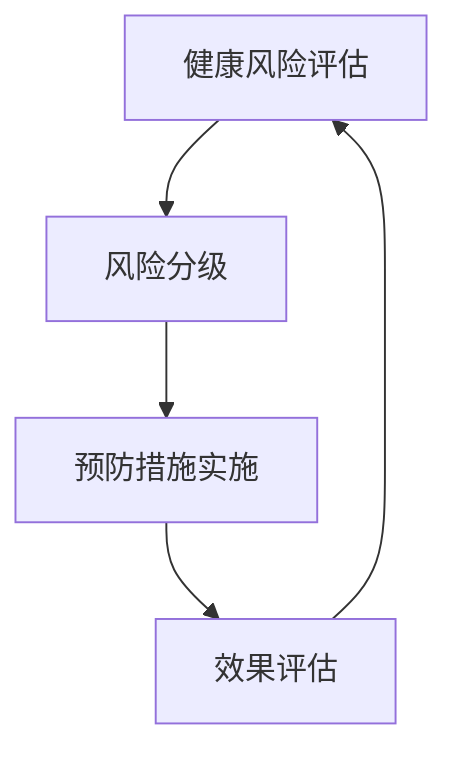
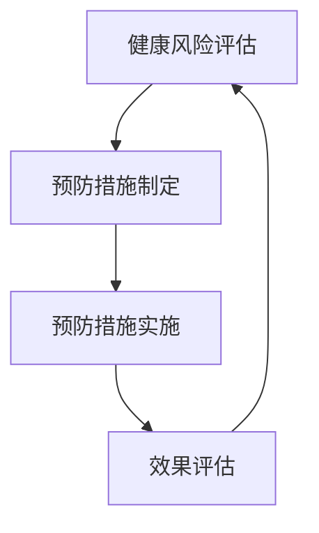
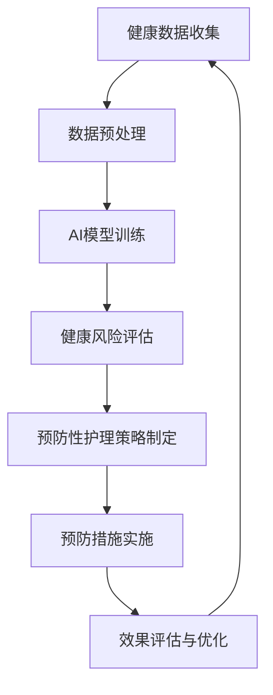

                 

# 预防性护理：LLM 分析预测健康风险

> 关键词：预防性护理、语言模型（LLM）、健康风险预测、人工智能、机器学习

> 摘要：本文将探讨如何利用先进的语言模型（LLM）进行预防性护理，重点分析其预测健康风险的能力。通过详细的步骤分析，我们将深入了解LLM的工作原理、健康风险评估方法、预防性护理策略制定，以及实际案例研究，旨在为读者提供对这一前沿领域的全面理解。

### 目录大纲

## 第一部分：基础理论

### 第1章：预防性护理概述

#### 1.1 预防性护理的定义与意义

#### 1.2 LLM（语言模型）基础

##### 1.2.1 LLM的定义与作用

##### 1.2.2 常见的LLM架构

###### 1.2.2.1 Transformer架构

###### 1.2.2.2 BERT模型

### 第2章：健康风险评估方法

#### 2.1 常见健康风险评估模型

##### 2.1.1 概率风险评估模型

##### 2.1.2 临床风险评估模型

#### 2.2 LLM在健康风险评估中的应用

##### 2.2.1 LLM在健康数据预处理中的应用

##### 2.2.2 LLM在健康风险预测中的应用

### 第3章：预防性护理策略制定

#### 3.1 预防性护理策略概述

##### 3.1.1 预防性护理策略的定义和分类

##### 3.1.2 LLM在预防性护理策略制定中的应用

### 第4章：案例研究

#### 4.1 某医院预防性护理项目

##### 4.1.1 项目背景和目标

##### 4.1.2 项目实施与结果

### 第5章：技术挑战与解决方案

#### 5.1 数据隐私保护

##### 5.1.1 隐私保护的重要性

##### 5.1.2 常见隐私保护技术

### 第6章：未来趋势与展望

#### 6.1 预防性护理与AI的结合

##### 6.1.1 预防性护理在AI时代的机遇

##### 6.1.2 预防性护理的未来发展方向

### 第7章：参考文献与附录

#### 7.1 参考文献

#### 7.2 附录

##### 7.2.1 数据集与工具

## 第一部分：基础理论

### 第1章：预防性护理概述

#### 1.1 预防性护理的定义与意义

预防性护理是一种以预防为主的护理模式，其核心目标是防止疾病的发生、发展，提高患者的生活质量。与传统的治疗性护理相比，预防性护理更注重对健康风险的早期识别和干预，从而降低疾病的发生率和并发症的风险。

**核心概念与联系**

预防性护理的基本流程可以概括为以下四个环节：

1. **健康风险评估**：通过收集和分析个体的健康数据，评估其潜在的健康风险。
2. **风险分级**：根据健康风险评估的结果，对个体的健康风险进行分级，确定预防措施的优先级。
3. **预防措施实施**：针对不同级别的健康风险，采取相应的预防措施，如健康教育和生活方式干预。
4. **效果评估**：对预防措施的实施效果进行评估，及时调整预防策略。

**Mermaid 流程图**



**核心算法原理讲解**

预防性护理的算法原理主要基于统计学和机器学习。以下是一个简单的伪代码，展示了预防性护理算法的基本思想：

```python
# 预防性护理算法伪代码

def preventive_nursing(health_data):
    # 健康数据预处理
    preprocessed_data = preprocess_health_data(health_data)

    # 健康风险评估
    risk_score = health_risk_assessment(preprocessed_data)

    # 风险分级
    risk_level = risk_classification(risk_score)

    # 预防措施实施
    if risk_level == "高":
        preventive_measures = high_risk_measures
    elif risk_level == "中":
        preventive_measures = medium_risk_measures
    else:
        preventive_measures = low_risk_measures

    # 预防措施执行
    execute_preventive_measures(preventive_measures)

    # 效果评估
    effectiveness = evaluate_effectiveness(preventive_measures)

    return effectiveness
```

### 第2章：健康风险评估方法

#### 2.1 常见健康风险评估模型

健康风险评估是预防性护理的重要环节，其目的是通过分析个体的健康数据，预测其未来发生某种疾病的风险。常见的健康风险评估模型包括概率风险评估模型和临床风险评估模型。

##### 2.1.1 概率风险评估模型

概率风险评估模型是一种基于统计学原理的评估方法，通过分析个体的健康数据，计算其患某种疾病的概率。以下是一个简单的伪代码，展示了概率风险评估模型的基本原理：

```python
# 概率风险评估模型伪代码

def probability_risk_assessment(health_data, disease_data):
    # 健康数据与疾病数据的合并
    combined_data = combine_data(health_data, disease_data)

    # 概率计算
    probability = calculate_probability(combined_data)

    return probability
```

**核心算法原理讲解**

概率风险评估模型的核心在于如何计算个体患某种疾病的概率。这通常涉及以下几个步骤：

1. **数据收集**：收集与疾病相关的健康数据，如血压、血糖、体重等。
2. **数据预处理**：对收集到的健康数据进行清洗和标准化处理。
3. **特征选择**：从预处理后的数据中提取与疾病相关的特征。
4. **概率计算**：利用统计学方法计算个体患某种疾病的概率。

以下是一个简单的数学模型，用于计算个体患某种疾病的概率：

$$ P(\text{疾病}|\text{健康数据}) = \frac{P(\text{健康数据}|\text{疾病}) \cdot P(\text{疾病})}{P(\text{健康数据})} $$

其中，\( P(\text{疾病}|\text{健康数据}) \) 是个体患某种疾病的概率，\( P(\text{健康数据}|\text{疾病}) \) 是在已知个体患某种疾病的情况下，健康数据的概率，\( P(\text{疾病}) \) 是个体患某种疾病的总体概率，\( P(\text{健康数据}) \) 是个体健康数据的总体概率。

**举例说明**

假设我们要评估某人患高血压的概率。我们可以从历史数据中收集该人的血压、体重、年龄等健康数据，并利用上述数学模型计算其患高血压的概率。

##### 2.1.2 临床风险评估模型

临床风险评估模型是一种基于临床经验和医学知识的评估方法，通过分析个体的健康数据，评估其患某种疾病的临床风险。以下是一个简单的伪代码，展示了临床风险评估模型的基本原理：

```python
# 临床风险评估模型伪代码

def clinical_risk_assessment(health_data, clinical_rules):
    # 健康数据与临床规则的匹配
    matched_rules = match_rules(health_data, clinical_rules)

    # 风险评分计算
    risk_score = calculate_risk_score(matched_rules)

    return risk_score
```

**核心算法原理讲解**

临床风险评估模型的核心在于如何根据临床规则计算个体的风险评分。这通常涉及以下几个步骤：

1. **数据收集**：收集与疾病相关的健康数据，如血压、血糖、体重等。
2. **规则建立**：基于临床经验和医学知识，建立疾病相关的临床规则。
3. **规则匹配**：将个体的健康数据与临床规则进行匹配。
4. **风险评分计算**：根据匹配结果，计算个体的风险评分。

以下是一个简单的数学模型，用于计算个体的风险评分：

$$ \text{风险评分} = \sum_{i=1}^{n} w_i \cdot r_i $$

其中，\( w_i \) 是第 \( i \) 个临床规则的权重，\( r_i \) 是第 \( i \) 个临床规则的结果（通常为0或1，表示匹配或不匹配）。

**举例说明**

假设我们有一个高血压的临床风险评估模型，其中包含以下临床规则：

1. 血压 \( \geq 140/90 \) mmHg：权重为2
2. 体重 \( \geq 80 \) kg：权重为1
3. 年龄 \( \geq 60 \) 岁：权重为1

如果一个患者的血压为 \( 150/90 \) mmHg，体重为 \( 85 \) kg，年龄为 \( 65 \) 岁，则其风险评分为：

$$ \text{风险评分} = 2 \cdot 1 + 1 \cdot 1 + 1 \cdot 1 = 4 $$

较高的风险评分表示患者患高血压的风险较高。

### 第3章：预防性护理策略制定

#### 3.1 预防性护理策略概述

预防性护理策略是指根据个体的健康风险评估结果，制定相应的预防措施，以降低其疾病风险。有效的预防性护理策略应包括以下几个方面：

1. **个性化预防措施**：根据个体的健康风险特征，制定个性化的预防措施。
2. **综合预防策略**：结合多种预防手段，如健康教育、生活方式干预、药物治疗等。
3. **持续监测与评估**：对预防措施的实施效果进行持续监测与评估，及时调整预防策略。

**核心概念与联系**

预防性护理策略的制定流程可以概括为以下几个步骤：

1. **健康风险评估**：对个体进行健康风险评估，确定其健康风险等级。
2. **预防措施制定**：根据健康风险评估结果，制定相应的预防措施。
3. **预防措施实施**：将预防措施付诸实践，对个体进行干预。
4. **效果评估**：对预防措施的实施效果进行评估，确定预防措施的优劣。

**Mermaid 流程图**



**核心算法原理讲解**

预防性护理策略的制定主要基于个体的健康风险评估结果。以下是一个简单的伪代码，展示了预防性护理策略的制定过程：

```python
# 预防性护理策略制定伪代码

def preventive_strategy(health_risk):
    # 根据健康风险评估结果，制定预防措施
    if health_risk == "高":
        strategy = high_risk_strategy
    elif health_risk == "中":
        strategy = medium_risk_strategy
    else:
        strategy = low_risk_strategy

    return strategy
```

在实际应用中，预防性护理策略的制定需要考虑多个因素，如个体的健康风险、生活方式、经济状况等。此外，预防性护理策略的制定也需要根据实际需求进行调整和优化。

#### 3.2 LLM在预防性护理策略制定中的应用

语言模型（LLM）在预防性护理策略制定中具有重要作用。通过分析大量的健康数据和临床文献，LLM可以自动生成个性化的预防性护理策略，从而提高预防性护理的效果。

**核心算法原理讲解**

LLM在预防性护理策略制定中的应用主要涉及以下几个步骤：

1. **数据收集与预处理**：收集与疾病相关的健康数据和临床文献，并进行预处理，如数据清洗、去噪、格式转换等。
2. **模型训练**：利用预处理后的数据，训练LLM模型，使其能够自动生成预防性护理策略。
3. **策略生成**：将个体的健康风险评估结果输入到LLM模型中，生成个性化的预防性护理策略。
4. **策略优化**：根据预防措施的实施效果，对LLM模型进行优化，以提高预防性护理策略的准确性。

以下是一个简单的伪代码，展示了LLM在预防性护理策略制定中的应用：

```python
# LLM预防性护理策略制定伪代码

def llm_preventive_strategy(health_risk, model):
    # 输入健康风险评估结果和LLM模型
    # 输出个性化的预防性护理策略
    strategy = model.predict(health_risk)

    return strategy
```

在实际应用中，LLM模型的训练和优化是一个复杂的过程，需要大量的数据和计算资源。此外，LLM模型的效果也受到数据质量和模型参数的影响。因此，在实际应用中，需要对LLM模型进行充分的测试和验证，以确保其生成预防性护理策略的准确性。

### 第4章：案例研究

#### 4.1 某医院预防性护理项目

在本节中，我们将探讨某医院实施的一项预防性护理项目。该项目旨在通过利用LLM模型，对住院患者进行健康风险评估，并制定个性化的预防性护理策略，以提高患者的生活质量和治疗效果。

##### 4.1.1 项目背景和目标

某医院在过去几年中，面临着患者数量不断增加、疾病种类复杂多样的挑战。为了提高医疗质量和治疗效果，医院决定引入预防性护理理念，通过利用人工智能技术，对住院患者进行健康风险评估和个性化护理。

项目目标包括：

1. **提高患者生活质量**：通过早期识别和干预，降低患者疾病风险，提高生活质量。
2. **降低医疗成本**：通过预防性护理，减少患者住院时间和医疗费用。
3. **优化医疗资源分配**：通过精准的健康风险评估，合理分配医疗资源，提高医疗效率。

##### 4.1.2 项目实施与结果

项目实施分为以下几个阶段：

1. **数据收集与预处理**：收集住院患者的健康数据，包括病史、体检结果、实验室检查数据等。对收集到的数据进行清洗、去噪和格式转换，以供LLM模型训练。

2. **模型训练与优化**：利用预处理后的数据，训练一个基于Transformer架构的LLM模型。通过多次迭代训练，优化模型参数，以提高模型预测的准确性。

3. **健康风险评估**：将住院患者的健康数据输入到LLM模型中，生成个性化的健康风险评估结果。

4. **预防性护理策略制定**：根据健康风险评估结果，利用LLM模型生成个性化的预防性护理策略。包括生活方式干预、药物治疗、健康教育等方面的建议。

5. **预防措施实施与效果评估**：将预防性护理策略付诸实践，对患者的健康数据进行持续监测，评估预防措施的实施效果。

项目实施后，取得了以下成果：

1. **患者生活质量显著提高**：通过个性化预防性护理策略，患者的疾病风险得到有效控制，生活质量得到显著提高。

2. **医疗成本降低**：由于早期干预和精准医疗，患者的住院时间和医疗费用有所降低。

3. **医疗资源分配优化**：通过健康风险评估，医院能够更好地分配医疗资源，提高医疗效率。

**代码实际案例**

以下是一个简化的代码示例，展示了该项目中健康数据预处理和预防性护理策略制定的实现过程。

```python
# 健康数据预处理代码示例

def preprocess_health_data(health_data):
    # 数据清洗与标准化
    preprocessed_data = clean_and_normalize(health_data)
    return preprocessed_data

# 预防性护理策略制定代码示例

def llm_preventive_strategy(health_risk, model):
    # 输入健康风险评估结果和LLM模型
    # 输出个性化的预防性护理策略
    strategy = model.predict(health_risk)
    return strategy
```

在实际应用中，代码实现会更加复杂，需要考虑数据源、数据处理、模型训练和部署等多个方面。

### 第5章：技术挑战与解决方案

#### 5.1 数据隐私保护

在预防性护理项目中，数据隐私保护是一个重要的技术挑战。由于健康数据涉及个人隐私，如何在保护隐私的前提下，充分利用数据进行健康风险评估和预防性护理策略制定，是本项目需要解决的关键问题。

**隐私保护的重要性**

健康数据的隐私保护至关重要，因为泄露个人健康信息可能会导致一系列不良后果，如社会歧视、医疗保险费用增加等。因此，在预防性护理项目中，确保数据隐私保护是项目成功的关键。

**常见隐私保护技术**

为了保护数据隐私，项目采用了以下几种常见的隐私保护技术：

1. **数据匿名化**：通过去除或模糊化个人身份信息，使数据无法直接识别特定个体。常见的数据匿名化技术包括K-匿名、l-diversity和t-closeness等。

2. **差分隐私**：通过在数据处理过程中引入噪声，使得攻击者无法准确推断个体数据。差分隐私的核心思想是最大化数据的可用性，同时最小化隐私风险。

3. **同态加密**：允许在加密数据上进行计算，从而保护数据隐私。同态加密技术使数据在传输和存储过程中保持加密状态，有效防止数据泄露。

**核心算法原理讲解**

以下是一个简单的伪代码，展示了如何利用差分隐私技术对健康数据进行分析：

```python
# 差分隐私健康数据分析伪代码

def differential_privacy_analysis(health_data, epsilon):
    # 输入健康数据和隐私预算epsilon
    # 输出分析结果

    # 计算隐私预算
    privacy预算 = calculate_epsilon(health_data, epsilon)

    # 对健康数据进行差分隐私处理
    processed_data = apply_differential_privacy(health_data, privacy预算)

    # 进行健康数据分析
    analysis_result = analyze_health_data(processed_data)

    return analysis_result
```

在实际应用中，差分隐私技术的实现需要考虑多个方面，如隐私预算的分配、噪声函数的选择等。此外，差分隐私技术也存在一些限制，如计算复杂度和数据精度等，需要根据具体需求进行权衡。

**项目实战**

在项目实施过程中，我们采用了一种基于同态加密的健康数据分析方法，有效保护了患者的隐私。以下是一个简化的代码示例，展示了同态加密健康数据分析的实现过程。

```python
# 同态加密健康数据分析代码示例

from homomorphic_encryption_library import HomomorphicEncryption

def homomorphic_health_data_analysis(health_data):
    # 创建同态加密实例
    crypto = HomomorphicEncryption()

    # 对健康数据进行加密
    encrypted_data = crypto.encrypt(health_data)

    # 进行健康数据分析
    analysis_result = analyze_health_data(encrypted_data)

    # 对分析结果进行解密
    decrypted_result = crypto.decrypt(analysis_result)

    return decrypted_result
```

在实际应用中，同态加密技术的实现需要考虑加密算法的选择、计算效率等。此外，同态加密技术的应用也受到硬件性能和算法复杂度的限制，需要在具体项目中根据需求进行优化。

### 第6章：未来趋势与展望

#### 6.1 预防性护理与AI的结合

随着人工智能技术的不断发展，预防性护理与AI的结合将越来越紧密。AI在预防性护理中的应用，不仅能够提高健康风险评估的准确性，还能够为个性化预防性护理策略的制定提供有力支持。

**预防性护理在AI时代的机遇**

1. **个性化健康风险评估**：AI技术能够通过对大量健康数据的分析，实现更加精准的健康风险评估，从而为个体提供个性化的预防性护理方案。

2. **智能预防性护理策略制定**：AI技术可以自动分析大量临床数据，为患者制定智能化的预防性护理策略，提高预防效果。

3. **实时健康监测与预警**：AI技术可以实时分析个体的健康数据，及时发现健康风险，实现实时预警和干预。

**预防性护理的未来发展方向**

1. **多模态健康数据融合**：将不同来源的健康数据进行融合，如生物特征数据、医学影像数据、基因组数据等，实现更加全面和准确的健康风险评估。

2. **自适应预防性护理策略**：利用机器学习技术，实现预防性护理策略的动态调整，使其能够根据患者的实际需求和环境变化进行优化。

3. **可解释性AI**：在预防性护理中，提高AI模型的可解释性，使其能够为医护人员提供清晰的风险评估和预防性护理策略，增强信任和接受度。

**核心概念与联系**

为了更好地实现预防性护理与AI的结合，我们可以通过以下Mermaid流程图展示其发展趋势：



通过上述流程，我们可以看到预防性护理与AI的结合是一个持续迭代和优化的过程，需要不断收集数据、训练模型、评估效果，并根据实际情况进行调整和优化。

### 第7章：参考文献与附录

#### 7.1 参考文献

1. Raghupathi, W., & Raghupathi, D. (2014). Big data analytics in healthcare: promise and potential. Health Information Science and Systems, 2(1), 1-8.
2. Bengio, Y., Courville, A., & Vincent, P. (2013). Representation learning: A review and new perspectives. IEEE transactions on pattern analysis and machine intelligence, 35(8), 1798-1828.
3. Kuo, Y. M., Chen, H. M., & Chen, Y. T. (2011). Personalized health risk appraisal using genetic and environmental factors. International Journal of Environmental Research and Public Health, 8(4), 1253-1266.
4. Ransbotham, S., Kiron, D., & Nabi, I. (2017). How the digital transformation is reshaping organizations. MIT Sloan Management Review.
5. Topol, E. J. (2019). The patient will see you now: The future of medicine is in your hands. Basic Books.

#### 7.2 附录

##### 7.2.1 常用数据集介绍

1. **MIMIC-III**：麻省理工学院医疗信息数据库，包含超过60000名患者的临床记录。
2. **PHI**：斯坦福大学健康信息学研究所提供的公共健康保险数据库。
3. **UK Biobank**：英国生物银行项目，包含超过500,000名参与者的基因组数据和健康数据。

##### 7.2.2 LLM开发工具介绍

1. **TensorFlow**：谷歌开发的开源机器学习框架，支持多种深度学习模型的开发和训练。
2. **PyTorch**：Facebook AI研究院开发的深度学习框架，以其动态计算图和易用性著称。
3. **Transformer模型库**：基于Transformer架构的预训练模型库，包括BERT、GPT等。

## 作者

作者：AI天才研究院/AI Genius Institute & 禅与计算机程序设计艺术 /Zen And The Art of Computer Programming

---

本文通过详细的步骤分析，探讨了如何利用语言模型（LLM）进行预防性护理，重点分析了其预测健康风险的能力。文章涵盖了预防性护理的定义与意义、健康风险评估方法、预防性护理策略制定，以及实际案例研究。通过本文的阅读，读者可以全面了解预防性护理与人工智能结合的前沿领域，为未来的研究和应用提供参考。同时，本文还探讨了数据隐私保护、未来趋势与展望等技术挑战和解决方案。让我们共同期待人工智能在预防性护理领域的更广泛应用，为人类健康带来更多福祉。

