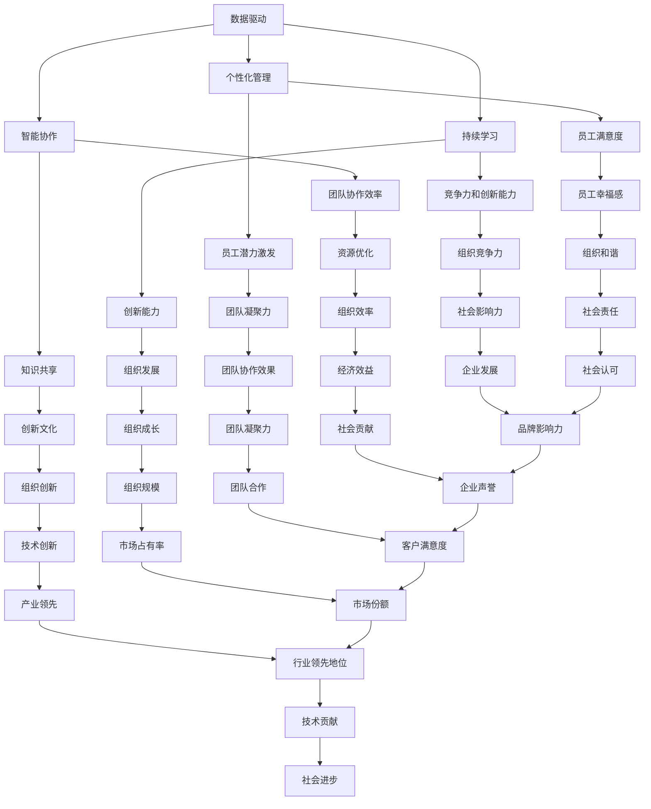

                 

# 领导力与 AI：有效利用人工智能

> 关键词：领导力、人工智能、AI 时代、组织变革、领导力培养、战略管理

> 摘要：本文旨在探讨领导力与人工智能（AI）的关系，以及如何有效利用 AI 提升领导力。文章首先介绍了领导力的定义与特点，以及 AI 的定义与发展历程。接着，深入分析了领导力与 AI 的联系，并探讨了 AI 对领导力的影响和领导者在 AI 时代的应对策略。随后，文章从战略管理、团队管理和企业文化三个方面，详细阐述了人工智能在领导力实践中的应用。最后，文章提出了 AI 领导力的未来发展趋势和潜在挑战，并对读者提出了一些建议。

### 目录大纲

#### 第一部分: 引言

1. 第1章: 引言  
   - 1.1 书籍背景介绍  
   - 1.2 AI与领导力的关系  
   - 1.3 阅读对象与预期收获

#### 第二部分: 领导力与 AI 的理论框架

2. 第2章: 领导力基础  
   - 2.1 领导力的定义与特点  
   - 2.2 领导力的模型与理论  
   - 2.3 领导力的变革与未来

3. 第3章: AI 基础  
   - 3.1 AI 的定义与发展历程  
   - 3.2 AI 的核心技术与分类  
   - 3.3 AI 的应用场景与挑战

4. 第4章: 领导力与 AI 的联系  
   - 4.1 领导力在 AI 时代的演变  
   - 4.2 AI 对领导力的影响  
   - 4.3 领导者在 AI 时代的应对策略

#### 第三部分: 领导力与 AI 的实践应用

5. 第5章: 人工智能驱动下的战略管理  
   - 5.1 战略管理的变革  
   - 5.2 AI 在战略规划中的应用  
   - 5.3 AI 对企业竞争优势的影响

6. 第6章: 人工智能领导风格与团队管理  
   - 6.1 人工智能领导风格的理论  
   - 6.2 团队管理在 AI 时代的挑战与机遇  
   - 6.3 AI 领导风格在团队管理中的应用案例

7. 第7章: 人工智能领导力与企业文化  
   - 7.1 企业文化的演变  
   - 7.2 AI 对企业文化的影响  
   - 7.3 培育人工智能时代的组织文化

8. 第8章: AI 领导力培养与实践  
   - 8.1 AI 领导力培养的途径  
   - 8.2 领导者在 AI 时代的自我提升  
   - 8.3 AI 领导力培养的实践案例分析

#### 第四部分: 未来展望

9. 第9章: AI 领导力的未来发展  
   - 9.1 AI 领导力的趋势与方向  
   - 9.2 未来领导力与 AI 的融合  
   - 9.3 AI 领导力的潜在挑战与解决方案

10. 第10章: 结论  
    - 10.1 总结与展望  
    - 10.2 对读者的建议  
    - 10.3 对未来的期待

### 附录

- 附录A：相关术语解释  
- 附录B：参考文献  
- 附录C：AI 领导力实践案例汇编

### 第一部分：引言

#### 1.1 书籍背景介绍

随着人工智能技术的飞速发展，人工智能（AI）已经深入到我们生活的各个方面。从自动驾驶汽车、智能家居，到医疗诊断、金融风控，AI 正在改变着我们的生活方式和工作方式。在这个 AI 时代，领导力的角色和职能也在发生着巨大的变革。传统的领导力已经无法适应这个快速变化的环境，领导者需要具备新的能力来引领团队，应对 AI 带来的挑战。

本书旨在探讨领导力与人工智能的关系，分析 AI 如何影响领导力，以及领导者如何有效利用 AI 提升自己的领导能力。本书的核心观点是，AI 不仅是一种技术工具，更是一种领导工具，领导者可以通过掌握和应用 AI，提高决策能力、优化资源配置、增强团队协作，从而实现组织的高效运行和持续发展。

#### 1.2 AI与领导力的关系

AI 与领导力之间的关系可以从多个维度来理解。首先，AI 为领导者提供了更多的数据和信息，使得领导者可以基于更全面、准确的数据做出决策。其次，AI 可以帮助领导者优化工作流程，提高工作效率，从而将更多的时间和精力投入到战略思考和团队建设上。此外，AI 还可以帮助领导者预测未来的发展趋势，提前做好准备，避免因环境变化而陷入困境。

从另一方面来看，领导力对于 AI 的发展和应用也具有重要意义。领导者需要具备敏锐的洞察力，能够发现 AI 技术的潜在价值，并推动其在组织内的广泛应用。同时，领导者还需要具备强大的团队领导能力，能够激发团队成员的创新潜力，共同应对 AI 带来的挑战。

#### 1.3 阅读对象与预期收获

本书面向所有希望提升自身领导力的专业人士，包括企业高管、团队领导、项目经理等。无论你是已经具备一定领导经验的人，还是刚刚步入领导岗位的新手，本书都能为你提供有价值的指导。

通过阅读本书，你将：

1. 了解领导力的基本概念和核心要素，掌握领导力的模型与理论。
2. 了解人工智能的基本概念和发展历程，掌握 AI 的核心技术与分类。
3. 深入探讨领导力与 AI 之间的关系，理解 AI 对领导力的影响。
4. 学习如何在战略管理、团队管理和企业文化等方面应用 AI 技术。
5. 获得实践 AI 领导力的具体方法和案例分析。

希望本书能够帮助你更好地适应 AI 时代，提升领导力，引领团队走向成功。

---

在接下来的章节中，我们将首先深入探讨领导力的基本概念和模型，接着介绍人工智能的基础知识，并逐步分析领导力与 AI 之间的联系。通过这一系列的探讨，我们将为你提供一幅关于领导力与 AI 相互作用的全面图景，帮助你在这个变革的时代中找到自己的定位和方向。

### 第二部分：领导力与 AI 的理论框架

#### 第2章：领导力基础

##### 2.1 领导力的定义与特点

领导力是指一个人或组织在特定情境下，通过影响、激励和引导他人，实现共同目标的能力。简单来说，领导力是一种影响力，它能够激发人们的潜力，引导他们朝着既定目标努力。

领导力的特点可以从以下几个方面来理解：

1. **影响力**：领导力首先是一种影响力，它能够影响他人的思想和行为，使人们愿意跟随领导者实现共同目标。
2. **情境适应性**：领导力不是一成不变的，而是需要根据不同情境进行调整。领导者需要具备灵活的思维和应变能力，以适应不同的环境和挑战。
3. **目标导向性**：领导力具有明确的目标导向性。领导者需要明确组织的愿景和目标，并引导团队为之努力。
4. **协作性**：领导力强调团队合作，领导者需要善于协调各方资源，发挥团队的整体优势。
5. **持续发展性**：领导力不仅仅是一种能力，更是一种持续发展的过程。领导者需要不断学习、成长，以适应不断变化的环境。

##### 2.2 领导力的模型与理论

领导力的发展历程中，涌现出了多种领导力模型和理论。以下是其中几种重要的模型：

1. **特质理论**：特质理论认为领导者具备某些固有的特质，如自信、责任感、魅力等。这种理论强调领导者个性的重要性，但忽略了领导情境的影响。
2. **行为理论**：行为理论关注领导者的行为模式，认为领导者通过不同的行为风格影响团队。这种理论提出了多种领导行为模型，如专制型领导、民主型领导等。
3. **情境理论**：情境理论认为领导力取决于领导情境，领导者需要根据不同情境选择合适的领导行为。代表性的理论有费德勒模型和赫塞-布兰查德模型。
4. **转换理论**：转换理论强调领导者的核心任务是激励和转化他人。领导者通过设定愿景、提供反馈和建立信任，激发团队成员的内在动力。

##### 2.3 领导力的变革与未来

在 AI 时代，领导力面临着新的挑战和机遇。以下是几个关键趋势：

1. **数据驱动**：AI 技术能够提供大量数据，帮助领导者做出更科学的决策。领导者需要学会分析数据，利用数据驱动的方法来指导决策。
2. **团队协作**：AI 技术可以优化团队协作，提升团队的整体效能。领导者需要培养团队成员之间的合作精神，建立高效的合作机制。
3. **持续学习**：AI 技术的发展日新月异，领导者需要不断学习新的知识和技能，以保持自己的竞争力。持续学习成为领导者不可或缺的能力。
4. **人性关怀**：尽管 AI 技术在许多方面可以提升效率，但领导者仍然需要关注团队成员的身心健康，提供人性化的关怀和支持。

总之，领导力在 AI 时代不仅需要适应新的技术环境，更需要关注人的因素。领导者需要通过变革和创新，不断提升自己的领导能力，以引领组织在 AI 时代取得成功。

---

在了解了领导力的定义、特点和模型之后，我们接下来将进入第3章，探讨人工智能的基础知识。我们将介绍人工智能的定义、发展历程、核心技术和分类，以及人工智能在不同领域的应用场景和挑战。通过这一章节的学习，我们将为后续章节中领导力与 AI 的深入分析奠定基础。

### 第3章：AI基础

#### 3.1 AI的定义与发展历程

人工智能（Artificial Intelligence，简称AI）是指由人创造出来的、具有类似人类智能的系统。它能够理解、学习、推理、规划和解决问题，甚至在某些领域超越人类的智能表现。AI 的定义可以从多个维度来理解：

1. **模拟人类智能**：AI 旨在模拟人类的认知功能，包括感知、学习、推理、理解和解决问题等。
2. **自主决策**：AI 系统可以在没有明确指令的情况下，根据环境和目标自主做出决策。
3. **自适应能力**：AI 系统可以根据新的数据和经验进行自我调整，以适应不断变化的环境。

AI 的发展历程可以分为几个关键阶段：

1. **早期探索（1940s-1950s）**：在这一阶段，人工智能的概念首次被提出，计算机科学家开始尝试开发能够模拟人类智能的算法。
2. **人工智能热潮（1960s-1970s）**：随着计算机硬件的发展，AI 领域迎来了第一次热潮。但受限于计算能力和算法的限制，这一阶段并未取得重大突破。
3. **衰退期（1980s-1990s）**：由于实际应用效果不如预期，AI 领域进入了一个相对低潮的时期。然而，专家系统和机器学习技术的兴起为 AI 的发展带来了新的希望。
4. **复兴期（2000s至今）**：随着大数据、云计算和深度学习等技术的发展，AI 再次成为热门研究领域。尤其是深度学习算法的突破，使得 AI 在图像识别、语音识别和自然语言处理等方面取得了显著进展。

#### 3.2 AI的核心技术与分类

AI 的核心技术包括机器学习、深度学习、自然语言处理、计算机视觉等。以下是对这些核心技术的简要介绍：

1. **机器学习**：机器学习是 AI 的基础技术之一，它通过从数据中学习规律，实现自主学习和改进。常见的机器学习算法包括线性回归、决策树、支持向量机等。
2. **深度学习**：深度学习是机器学习的一个子领域，它通过多层神经网络来模拟人脑的神经网络结构，进行复杂的特征提取和模式识别。深度学习在图像识别、语音识别和自然语言处理等领域取得了显著成果。
3. **自然语言处理**：自然语言处理（NLP）是 AI 在文本数据上的应用，它涉及文本理解、文本生成、机器翻译等任务。NLP 技术在搜索引擎、聊天机器人、智能客服等领域有着广泛应用。
4. **计算机视觉**：计算机视觉是 AI 在图像和视频数据上的应用，它通过图像识别、目标检测、图像分割等技术，实现物体识别、场景理解等功能。计算机视觉技术在安防监控、自动驾驶、医疗影像等领域有着重要的应用。

AI 可以根据应用领域和目标进行分类，常见的分类方法包括：

1. **弱 AI**：弱 AI 是指在特定任务上表现出高智能的系统，但它无法在新的任务上表现良好。例如，语音识别系统在识别语音上有很高的准确性，但在处理其他任务时可能无能为力。
2. **强 AI**：强 AI 是指具有全面智能的系统，它能够理解、学习和适应复杂环境，并在多个任务上表现出卓越的能力。强 AI 还未实现，但科学家们正在努力研究和开发。
3. **泛 AI**：泛 AI 是指超越人类智能的 AI，它不仅能够在特定任务上表现优秀，还能在多个领域展示出超凡的能力。泛 AI 是未来 AI 发展的一个重要方向。

#### 3.3 AI的应用场景与挑战

AI 已经在多个领域取得了显著的应用成果，以下是一些常见的应用场景：

1. **智能客服**：AI 可以通过自然语言处理技术，实现智能客服系统，提供24/7的服务，提高客户满意度。
2. **自动驾驶**：计算机视觉和深度学习技术使得自动驾驶汽车成为可能，它能够自动感知路况、规划路径并控制车辆。
3. **医疗诊断**：AI 在医疗领域有着广泛的应用，如医学图像识别、疾病预测和药物研发。它能够辅助医生提高诊断准确率和治疗效果。
4. **金融风控**：AI 可以通过大数据分析和机器学习技术，预测金融市场的走势，识别风险并采取相应措施，提高金融服务的安全性和效率。
5. **智能制造**：AI 技术在智能制造中的应用，如机器人控制、自动化生产线和预测维护，可以显著提高生产效率和质量。

尽管 AI 在各个领域展现了巨大的潜力，但其在实际应用中也面临一些挑战：

1. **数据隐私**：AI 系统需要大量数据来训练模型，但数据隐私问题成为了一个重要挑战。如何保护用户隐私，确保数据安全，是 AI 应用中需要解决的问题。
2. **算法公平性**：AI 模型的决策过程可能受到数据偏见的影响，导致不公平的结果。如何确保算法的公平性和透明性，是 AI 发展中的一个重要问题。
3. **技术依赖**：随着 AI 技术的广泛应用，人们可能过度依赖 AI，导致自身能力的退化。如何平衡 AI 技术的应用和人类自身能力的发展，是一个需要思考的问题。
4. **伦理问题**：AI 技术的滥用可能引发一系列伦理问题，如人工智能武器化、隐私泄露等。如何制定相应的法律法规，规范 AI 技术的应用，是一个重要的挑战。

总之，人工智能作为一门前沿技术，具有广泛的应用前景和重要的社会价值。但同时也面临着一系列挑战，需要我们共同努力去解决。在接下来的章节中，我们将深入探讨领导力与 AI 之间的关系，分析 AI 对领导力的影响，以及领导者在 AI 时代如何应对这些挑战。

---

在了解了人工智能的定义、发展历程、核心技术和应用场景后，我们接下来将进入第4章，探讨领导力与 AI 的联系。我们将分析领导力在 AI 时代的演变，探讨 AI 对领导力的影响，以及领导者在 AI 时代的应对策略。通过这一章节的讨论，我们将为理解领导力与 AI 的深度融合奠定基础。

### 第4章：领导力与 AI 的联系

#### 4.1 领导力在 AI 时代的演变

随着人工智能技术的飞速发展，领导力也在不断演变。在传统工业时代，领导力主要依赖于经验和权威，领导者通过下达指令和监控执行来管理团队。然而，在 AI 时代，领导力的本质和方式正在发生深刻的变化。

首先，领导力在 AI 时代变得更加数据驱动。传统的领导决策往往依赖于个人的经验和直觉，而 AI 技术能够提供大量数据，帮助领导者进行科学决策。通过数据分析，领导者可以更好地理解组织的运行状况、团队的表现以及外部环境的变化，从而做出更准确、更有效的决策。

其次，领导力在 AI 时代变得更加协作化。AI 技术使得团队合作变得更加高效，领导者需要更加注重团队协作，发挥每个人的优势，实现整体效能的最大化。同时，AI 技术还能够提供实时沟通和协作工具，帮助领导者更好地协调团队成员的工作，提高团队的协作效率。

此外，领导力在 AI 时代变得更加灵活和自适应。AI 技术的发展使得环境变化速度加快，领导者需要具备快速适应变化的能力。通过利用 AI 技术进行预测和风险评估，领导者可以提前做好准备，避免因环境变化而陷入困境。

#### 4.2 AI 对领导力的影响

AI 对领导力的影响主要体现在以下几个方面：

1. **决策能力提升**：AI 技术能够提供大量数据，帮助领导者进行数据驱动的决策。通过数据分析，领导者可以更准确地识别问题、评估风险、制定策略，从而提高决策的科学性和准确性。

2. **资源优化**：AI 技术可以帮助领导者优化资源配置，提高资源利用效率。例如，通过预测需求、优化供应链、自动化生产等，领导者可以降低成本、提高效益。

3. **团队协作增强**：AI 技术提供了多种协作工具，如即时通讯、在线会议、项目管理等，使得团队成员可以更加高效地协同工作。同时，AI 技术还可以通过数据分析，帮助领导者了解团队的协作情况，优化团队结构和工作流程。

4. **人力资源变革**：AI 技术的应用使得人力资源管理工作变得更加科学和高效。通过招聘算法、绩效考核、员工发展等 AI 应用，领导者可以更好地发现人才、培养人才、激励人才。

5. **战略规划**：AI 技术可以帮助领导者进行战略规划，预测市场趋势、识别竞争优势、制定发展策略。通过数据分析，领导者可以更清晰地了解组织的战略方向，提高战略执行的精准度。

#### 4.3 领导者在 AI 时代的应对策略

面对 AI 带来的变革，领导者在 AI 时代需要采取以下策略：

1. **学习新技能**：领导者需要不断学习新的知识和技能，尤其是与 AI 相关的技术和管理知识。通过学习，领导者可以更好地理解和应用 AI 技术，提高自身的领导能力。

2. **培养团队**：领导者需要培养团队成员的 AI 技能，提高团队的协作能力。通过培训和激励机制，领导者可以激发团队成员的学习热情，促进团队整体素质的提升。

3. **创新文化**：领导者需要营造创新文化，鼓励团队成员提出新的想法和解决方案。通过建立开放的沟通机制和奖励机制，领导者可以激发团队的创造力，推动组织的创新。

4. **数据驱动**：领导者需要将数据驱动作为领导决策的重要依据。通过建立数据分析机制，领导者可以更好地理解组织的运行状况，做出科学、准确的决策。

5. **适应变化**：领导者需要具备快速适应变化的能力，通过预测和风险评估，提前做好准备，避免因环境变化而陷入困境。

总之，AI 时代的到来为领导力带来了新的挑战和机遇。领导者需要不断学习和适应，通过创新和变革，提升自身的领导能力，引领组织在 AI 时代取得成功。

---

在了解了领导力在 AI 时代的演变和 AI 对领导力的影响后，我们接下来将进入第5章，探讨人工智能驱动下的战略管理。我们将分析战略管理的变革，介绍 AI 在战略规划中的应用，并探讨 AI 对企业竞争优势的影响。通过这一章节的讨论，我们将深入了解如何利用 AI 提升战略管理水平。

### 第5章：人工智能驱动下的战略管理

#### 5.1 战略管理的变革

随着人工智能技术的快速发展，传统战略管理的理念和实践正在经历深刻的变革。战略管理不再仅仅是基于经验和直觉，而是更多地依赖于数据分析和智能算法。以下是战略管理在 AI 时代的一些关键变革：

1. **数据驱动的战略规划**：在传统战略管理中，决策往往依赖于领导者的经验和直觉。然而，在 AI 时代，数据驱动的战略规划成为主流。通过收集和分析大量数据，领导者可以更准确地预测市场趋势、识别竞争优势，从而制定更科学、更精准的战略计划。

2. **智能决策支持系统**：人工智能技术为战略管理提供了强大的决策支持系统。通过机器学习和深度学习算法，系统能够对海量数据进行实时分析和预测，为领导者提供及时、准确的决策依据。这种智能化的决策支持不仅提高了决策的效率，还减少了人为错误和偏见。

3. **动态战略调整**：传统战略管理往往强调长期的规划和执行。然而，在快速变化的市场环境中，领导者需要具备快速调整战略的能力。人工智能技术可以实时监控市场变化和竞争对手动向，帮助领导者快速做出调整，保持竞争优势。

4. **资源优化配置**：战略管理的关键之一是资源优化配置。在传统战略管理中，资源配置往往依赖于经验和直觉。然而，人工智能技术可以通过数据分析，识别出最有效的资源配置方式，提高资源利用效率。

5. **全球化战略管理**：随着全球化进程的加快，企业在全球范围内进行运营和竞争。人工智能技术使得跨国管理和全球化战略管理变得更加高效。通过实时数据分析和智能调度，领导者可以更好地协调全球资源，优化业务流程。

#### 5.2 AI 在战略规划中的应用

人工智能技术在战略规划中的应用主要体现在以下几个方面：

1. **市场趋势预测**：通过分析大量的历史数据和实时数据，人工智能技术可以预测市场趋势，帮助领导者制定符合市场需求的战略。例如，通过分析消费者行为数据，企业可以预测未来的产品需求，从而调整生产和研发策略。

2. **竞争对手分析**：人工智能技术可以通过分析竞争对手的行为和市场表现，帮助领导者了解竞争对手的优劣势，制定相应的竞争策略。例如，通过分析竞争对手的网站流量、社交媒体活动等数据，企业可以了解竞争对手的营销策略和客户反馈，从而调整自己的营销策略。

3. **风险评估与防范**：在战略规划过程中，风险评估是至关重要的一环。人工智能技术可以通过大数据分析和机器学习算法，识别潜在的风险因素，并预测风险的发生概率。例如，金融企业可以通过分析历史数据和市场动态，预测市场波动和信用风险，从而采取相应的防范措施。

4. **供应链优化**：供应链管理是战略规划中的重要环节。人工智能技术可以帮助企业优化供应链管理，提高供应链的灵活性和响应速度。例如，通过分析供应链数据，企业可以预测市场需求变化，调整库存策略，减少库存成本。

5. **战略决策支持**：人工智能技术可以提供智能化的战略决策支持。通过分析大量数据，人工智能系统可以提出多种战略方案，并评估每种方案的风险和收益，帮助领导者做出更科学、更合理的战略决策。

#### 5.3 AI 对企业竞争优势的影响

人工智能技术对企业的竞争优势产生了深远的影响：

1. **提高运营效率**：人工智能技术可以通过自动化和智能化，提高企业的运营效率。例如，通过自动化生产线和智能物流系统，企业可以减少人力成本，提高生产效率。

2. **优化决策过程**：人工智能技术可以帮助企业优化决策过程，提高决策的科学性和准确性。通过数据分析，企业可以更好地理解市场趋势、客户需求和竞争对手动向，从而做出更明智的决策。

3. **创新产品和服务**：人工智能技术为企业提供了强大的创新工具。通过人工智能算法，企业可以开发出更具竞争力的产品和服务。例如，通过深度学习算法，企业可以开发出更智能的客服系统，提高客户满意度。

4. **提升客户体验**：人工智能技术可以帮助企业提升客户体验，增强客户黏性。例如，通过智能客服系统和个性化推荐算法，企业可以提供更加精准、高效的服务，满足客户的个性化需求。

5. **增强市场竞争力**：在竞争激烈的市场环境中，企业需要具备强大的竞争力。人工智能技术可以帮助企业提高市场竞争力，例如，通过分析市场数据，企业可以预测市场趋势，抢先占领市场。

总之，人工智能驱动下的战略管理为企业带来了巨大的机遇和挑战。领导者需要充分利用人工智能技术，优化战略管理，提高企业的竞争优势，实现可持续发展。

---

在探讨了人工智能驱动下的战略管理后，我们接下来将进入第6章，探讨人工智能领导风格与团队管理。我们将分析人工智能领导风格的理论，讨论团队管理在 AI 时代的挑战与机遇，以及 AI 领导风格在团队管理中的应用案例。通过这一章节的讨论，我们将深入了解如何利用 AI 优化团队管理。

### 第6章：人工智能领导风格与团队管理

#### 6.1 人工智能领导风格的理论

在 AI 时代，领导风格也需要相应地调整。人工智能领导风格强调利用人工智能技术优化管理过程，提高决策效率，并增强团队的协作能力。以下是人工智能领导风格的理论要点：

1. **数据驱动**：人工智能领导风格强调数据驱动决策。领导者通过分析大量数据，了解团队的表现、员工的反馈和市场趋势，从而做出更科学、更精准的决策。

2. **智能协作**：人工智能领导风格注重智能协作。领导者利用人工智能工具，如智能助手、协作平台等，实现团队成员之间的高效沟通和协作。这种智能协作不仅提高了团队的工作效率，还增强了团队的凝聚力。

3. **自主决策**：人工智能领导风格鼓励自主决策。通过人工智能技术，领导者为团队成员提供更多自主决策的空间，激发他们的创造力和创新潜力。同时，领导者通过数据分析和智能反馈，指导团队成员的决策过程，提高决策的质量。

4. **个性化管理**：人工智能领导风格强调个性化管理。通过分析员工的行为数据和绩效数据，领导者可以了解每个员工的优势和需求，为他们提供个性化的支持和指导，促进员工的发展和成长。

5. **持续学习**：人工智能领导风格重视持续学习。领导者利用人工智能技术，获取最新的管理知识和技能，不断更新自己的知识体系，以适应快速变化的环境。

#### 6.2 团队管理在 AI 时代的挑战与机遇

在 AI 时代，团队管理面临着一系列挑战和机遇：

1. **挑战**：
   - **技术依赖**：团队管理日益依赖于人工智能技术，领导者和管理者需要掌握相关的技术知识和技能，以应对技术带来的挑战。
   - **数据隐私**：随着数据收集和分析的广泛应用，数据隐私问题日益突出。领导者需要确保员工的数据安全和隐私保护，避免数据泄露和滥用。
   - **技能差距**：AI 技术的快速发展使得团队中的技能差距问题更加显著。领导者需要关注员工的技能提升，提供相应的培训和支持，以适应技术变革。
   - **伦理问题**：人工智能技术的应用涉及到伦理问题，如算法偏见、人工智能决策的透明度等。领导者需要关注这些问题，制定相应的伦理规范，确保人工智能技术的公正性和透明性。

2. **机遇**：
   - **效率提升**：人工智能技术可以提高团队的工作效率，减少重复性劳动，释放领导者和员工的精力，专注于更具战略意义的工作。
   - **创新驱动**：人工智能技术可以激发团队的创新潜力，通过数据分析、智能协作等手段，推动团队不断进行创新，提升企业的竞争力。
   - **个性化管理**：人工智能技术可以帮助领导者实现个性化管理，了解每个员工的优势和需求，提供个性化的支持和指导，促进员工的发展和成长。
   - **全球化协作**：人工智能技术可以打破地域限制，实现全球范围内的协作。领导者可以利用人工智能技术，协调全球团队的工作，提高组织的全球竞争力。

#### 6.3 AI 领导风格在团队管理中的应用案例

以下是一些 AI 领导风格在团队管理中的应用案例：

1. **智能助手**：领导者可以利用智能助手，如人工智能秘书、智能客服等，处理日常事务，提高工作效率。智能助手可以自动处理邮件、日程安排、会议提醒等任务，让领导者有更多时间专注于战略决策和团队管理。

2. **数据分析**：领导者可以利用数据分析工具，对团队的表现和员工的行为数据进行分析，了解团队的整体状况和员工的工作效率。通过数据驱动的方法，领导者可以识别问题、制定改进措施，提高团队的整体表现。

3. **智能协作平台**：领导者可以利用智能协作平台，如在线会议、协作工具等，实现团队成员之间的高效沟通和协作。智能协作平台可以提供实时的沟通渠道、文件共享和任务分配等功能，提高团队的工作效率。

4. **个性化培训**：领导者可以利用人工智能技术，对员工进行个性化培训。通过分析员工的学习记录和绩效数据，领导者可以了解员工的学习需求和知识短板，制定个性化的培训计划，提高员工的技能水平。

5. **智能绩效评估**：领导者可以利用智能绩效评估系统，对员工的工作绩效进行实时评估。智能绩效评估系统可以基于数据分析，提供客观、公正的绩效评估结果，帮助领导者更好地了解员工的工作表现。

总之，人工智能领导风格在团队管理中的应用，为领导者提供了新的管理工具和方法，提高了团队的工作效率和创新潜力。领导者需要充分利用人工智能技术，优化团队管理，推动组织的发展。

---

在探讨了人工智能领导风格和团队管理在 AI 时代的挑战与机遇后，我们接下来将进入第7章，探讨人工智能领导力与企业文化。我们将分析企业文化的演变，讨论 AI 对企业文化的影响，并探讨如何培育人工智能时代的组织文化。通过这一章节的讨论，我们将深入了解如何利用人工智能塑造企业文化，推动组织的持续发展。

### 第7章：人工智能领导力与企业文化

#### 7.1 企业文化的演变

企业文化是指企业在长期经营过程中形成的共同价值观、信仰和习惯。企业文化对企业的战略方向、员工行为和组织绩效具有深远的影响。随着人工智能技术的快速发展，企业文化也在不断演变。

1. **传统企业文化**：在传统企业文化中，权威性、稳定性和规范性占据主导地位。领导者通过权威来管理企业，强调秩序和规范，追求稳定和可预测的结果。

2. **现代企业文化**：随着市场环境的变化和科技的发展，现代企业文化开始强调创新、灵活性和合作。领导者更加注重员工的创新能力和团队协作，鼓励员工提出新的想法和解决方案。

3. **人工智能时代的企业文化**：在人工智能时代，企业文化进一步向数据驱动、智能协作和个性化管理转变。企业开始重视数据的价值，通过数据分析来指导决策；强调智能协作，利用人工智能技术提高团队的效率和创造力；注重个性化管理，通过数据分析了解员工的需求和优势，提供个性化的支持和指导。

#### 7.2 AI 对企业文化的影响

人工智能技术的应用对企业文化产生了深远的影响：

1. **数据驱动的决策**：AI 技术能够提供大量数据，帮助企业进行数据驱动的决策。这种决策方式使得企业更加科学、客观，减少了人为偏见和主观判断。然而，这也可能导致企业对数据的过度依赖，忽视员工的主观感受和创造力。

2. **智能协作**：AI 技术可以帮助企业实现智能协作，提高团队的效率和创造力。例如，通过智能助手和协作平台，员工可以更高效地沟通和协作，共享信息和资源。然而，智能协作也可能导致员工的依赖性增加，降低员工的自主性和创新能力。

3. **个性化管理**：AI 技术可以帮助企业实现个性化管理，通过数据分析了解员工的需求和优势，提供个性化的支持和指导。这种管理方式能够提高员工的工作满意度和发展潜力。然而，个性化管理也可能导致员工的个性化需求无法得到满足，影响员工的工作积极性和团队凝聚力。

4. **伦理挑战**：AI 技术的应用涉及到伦理问题，如数据隐私、算法公平性和自动化决策的透明度等。企业需要制定相应的伦理规范，确保 AI 技术的应用符合道德标准，避免对员工和社会造成负面影响。

#### 7.3 培育人工智能时代的组织文化

在人工智能时代，企业需要培育一种适应 AI 技术发展的组织文化，以推动组织的持续发展。以下是几个关键步骤：

1. **数据文化**：企业需要倡导数据文化，鼓励员工认识到数据的价值，学会使用数据分析工具进行决策。企业可以通过培训、活动和案例分享等方式，提高员工的数据素养和数据分析能力。

2. **创新文化**：企业需要鼓励创新文化，鼓励员工提出新的想法和解决方案。企业可以通过设立创新实验室、鼓励内部创业等方式，激发员工的创新潜力。

3. **智能协作文化**：企业需要建立智能协作文化，鼓励员工使用人工智能工具进行高效协作。企业可以通过优化工作流程、提供智能协作平台等方式，提高团队的协作效率。

4. **个性化管理文化**：企业需要建立个性化管理文化，通过数据分析了解员工的需求和优势，提供个性化的支持和指导。企业可以通过个性化的培训计划、员工关怀机制等方式，提高员工的工作满意度和发展潜力。

5. **伦理文化**：企业需要建立伦理文化，确保 AI 技术的应用符合道德标准。企业可以通过制定伦理规范、开展伦理培训等方式，提高员工的伦理意识和责任感。

总之，人工智能时代的组织文化需要适应 AI 技术的发展，推动企业的创新和变革。企业需要通过培育数据文化、创新文化、智能协作文化和个性化管理文化，建立一种适应 AI 时代的组织文化，以实现组织的可持续发展。

---

在探讨了人工智能领导力与企业文化后，我们接下来将进入第8章，探讨 AI 领导力培养与实践。我们将分析 AI 领导力培养的途径，讨论领导者在 AI 时代的自我提升，并分享 AI 领导力培养的实践案例分析。通过这一章节的讨论，我们将深入了解如何培养和提升 AI 领导力，为领导者在 AI 时代的发展提供实际指导。

### 第8章：AI领导力培养与实践

#### 8.1 AI领导力培养的途径

在 AI 时代，领导者需要不断提升自身的领导力，以应对技术变革和复杂的环境。以下是几种关键的 AI 领导力培养途径：

1. **专业培训**：领导者可以通过参加专业培训课程，学习 AI 技术的基础知识、应用场景和最新趋势。这些培训课程可以包括在线课程、工作坊和研讨会等。通过专业培训，领导者可以掌握 AI 技术的基本原理和应用方法，为后续实践打下坚实基础。

2. **实践经验**：实践是培养领导力的关键。领导者可以通过参与实际项目，亲身体验 AI 技术在组织中的应用，了解其优势和挑战。在项目中，领导者可以发挥领导作用，制定策略、协调资源、解决问题，从而提升自身的领导能力。

3. **跨学科学习**：AI 领导力不仅仅涉及技术知识，还需要领导者具备跨学科的知识和技能。领导者可以通过学习管理学、心理学、经济学等学科的知识，提高自身的综合素养和领导力。

4. **交流与合作**：领导者可以通过与同行交流和合作，分享经验、学习最佳实践。参加行业会议、研讨会和社交活动，是拓宽视野、获取最新信息、建立人脉的重要途径。

5. **自我反思**：领导者需要经常进行自我反思，评估自身的领导力和发展需求。通过反思，领导者可以识别自身的优点和不足，制定改进计划，不断提升自身的领导能力。

#### 8.2 领导者在 AI 时代的自我提升

在 AI 时代，领导者需要不断提升自身的能力，以适应快速变化的环境。以下是几个关键方面：

1. **技术能力**：领导者需要掌握 AI 技术的基本知识，了解其应用场景和潜在价值。同时，领导者需要关注 AI 技术的最新发展，保持技术敏感性。

2. **数据分析能力**：数据是 AI 时代的核心资源，领导者需要具备数据分析能力，能够从海量数据中提取有价值的信息，为决策提供支持。

3. **创新思维**：领导者需要培养创新思维，善于发现新的问题和机会，提出创新的解决方案。在 AI 时代，创新成为推动组织发展的重要动力。

4. **团队协作能力**：领导者需要具备强大的团队协作能力，能够协调各方资源，激发团队成员的创造力，实现共同目标。

5. **沟通能力**：领导者需要具备良好的沟通能力，能够与团队成员、利益相关者进行有效沟通，传递愿景和目标，建立信任和共识。

#### 8.3 AI领导力培养的实践案例分析

以下是一些 AI 领导力培养的实践案例分析：

1. **案例一：谷歌的 AI 领导力培养计划**  
谷歌通过一系列举措，培养员工的 AI 领导力。首先，谷歌为员工提供免费的 AI 课程，帮助他们掌握 AI 基础知识。其次，谷歌鼓励员工参与 AI 项目，提供项目资助和资源支持，让员工在实践中提升领导力。此外，谷歌还建立了一个 AI 领导力社区，员工可以在这里分享经验、学习最佳实践，共同成长。

2. **案例二：特斯拉的 AI 领导力培养计划**  
特斯拉注重培养员工的 AI 领导力，通过多种方式提升员工的技术能力和创新思维。首先，特斯拉为员工提供定期的技术培训，包括 AI 课程和编程培训。其次，特斯拉鼓励员工参与创新项目，提供资金和技术支持，让员工在实践中成长。此外，特斯拉还建立了一个内部创新社区，员工可以在这里分享创意、学习最佳实践，推动组织的创新。

3. **案例三：微软的 AI 领导力培养计划**  
微软通过多种举措，培养员工的 AI 领导力。首先，微软为员工提供免费的 AI 培训课程，涵盖 AI 的基础知识、应用场景和最新技术。其次，微软鼓励员工参与 AI 项目，提供项目指导和资源支持，让员工在实践中提升领导力。此外，微软还建立了一个 AI 领导力社区，员工可以在这里分享经验、学习最佳实践，共同成长。

总之，AI 领导力的培养需要系统性和持续性。通过专业培训、实践经验、跨学科学习、交流与合作和自我反思，领导者可以不断提升自身的领导能力，为组织在 AI 时代的发展提供有力支持。

---

在探讨了 AI 领导力的培养与实践后，我们接下来将进入第9章，展望 AI 领导力的未来发展。我们将分析 AI 领导力的趋势与方向，讨论未来领导力与 AI 的融合，并探讨 AI 领导力的潜在挑战与解决方案。通过这一章节的讨论，我们将为领导者在 AI 时代的发展提供前瞻性的指导。

### 第9章：AI领导力的未来发展

#### 9.1 AI领导力的趋势与方向

随着人工智能技术的不断进步，AI 领导力也呈现出一系列发展趋势：

1. **数据驱动**：未来，数据将更加成为领导决策的核心依据。领导者需要具备强大的数据分析能力，能够从海量数据中提取有价值的信息，为组织的发展提供科学依据。

2. **智能化管理**：人工智能技术将进一步渗透到企业管理中，领导者需要学会利用智能工具和平台进行管理。通过智能化的方式，领导者可以更高效地协调团队、优化资源、提高决策效率。

3. **个性化领导**：随着对个体差异的重视，未来领导力将更加注重个性化。领导者需要了解每个团队成员的独特需求，提供个性化的支持和指导，激发员工的潜力。

4. **跨领域融合**：未来的领导力将需要领导者具备跨学科的知识和技能。随着人工智能技术的应用场景不断扩大，领导者需要能够理解和融合不同领域的知识，推动组织的创新和变革。

5. **全球协作**：随着全球化的加深，领导者需要具备全球视野和跨文化领导能力。通过利用人工智能技术，领导者可以更好地协调全球团队，实现全球化运营。

#### 9.2 未来领导力与 AI 的融合

未来，领导力与 AI 的融合将更加紧密，表现在以下几个方面：

1. **智能领导**：未来，领导者将成为智能领导者，通过人工智能技术辅助决策，提高领导效能。智能助手和智能平台将成为领导者的得力助手，帮助领导者更好地管理组织和团队。

2. **自适应领导**：未来，领导者需要具备更高的适应性，能够迅速应对环境变化和突发事件。人工智能技术将为领导者提供实时数据和分析，帮助领导者做出快速、准确的决策。

3. **协同创新**：未来，领导力与 AI 的融合将推动协同创新。通过智能协作平台，领导者可以更好地激发团队的创造力，实现知识共享和资源优化，推动组织的创新。

4. **智能学习**：未来，领导者需要具备智能学习的技能，能够利用人工智能技术进行自我提升和知识更新。通过在线学习、虚拟现实等技术，领导者可以随时随地进行学习，保持竞争力和创新能力。

#### 9.3 AI领导力的潜在挑战与解决方案

尽管 AI 领导力具有巨大的潜力，但也面临一系列挑战：

1. **技术依赖**：领导者过度依赖 AI 技术，可能导致自身能力的退化。解决方案是领导者需要保持对技术发展的敏感性，不断提升自身的技术素养。

2. **数据隐私**：随着数据收集和分析的广泛应用，数据隐私问题日益突出。解决方案是领导者需要制定严格的数据隐私政策，确保员工的数据安全和隐私保护。

3. **伦理问题**：AI 技术的应用涉及到伦理问题，如算法偏见、自动化决策的透明度等。解决方案是领导者需要关注这些问题，制定相应的伦理规范，确保 AI 技术的应用符合道德标准。

4. **技能差距**：AI 技术的快速发展使得技能差距问题更加显著。解决方案是领导者需要关注员工的技能提升，提供相应的培训和支持，以适应技术变革。

5. **人才流失**：随着 AI 时代的到来，企业面临人才流失的风险。解决方案是领导者需要建立良好的员工关怀机制，提供有吸引力的工作环境和发展机会，留住关键人才。

总之，未来 AI 领导力的趋势与方向表明，领导者需要不断提升自身的能力，适应快速变化的环境。同时，领导者需要关注潜在挑战，制定有效的解决方案，以确保 AI 领导力的健康发展。通过不断学习和创新，领导者将能够引领组织在 AI 时代取得成功。

---

在探讨了 AI 领导力的未来发展趋势和潜在挑战后，我们进入最后一个部分，即第10章：结论。在这一章节中，我们将对全文进行总结，并提出对读者的建议以及对未来的期待。

### 第10章：结论

#### 10.1 总结与展望

本文从领导力的定义与特点出发，分析了领导力在 AI 时代的演变，探讨了人工智能对领导力的影响，并详细阐述了 AI 领导力的实践应用。通过本文的探讨，我们可以得出以下结论：

1. **AI 与领导力的深度融合**：AI 不仅是技术工具，更是领导工具。领导者可以通过掌握和应用 AI，提高决策能力、优化资源配置、增强团队协作，从而实现组织的高效运行和持续发展。

2. **领导力的变革**：在 AI 时代，领导力需要从数据驱动、智能协作、个性化管理和持续学习等方面进行变革。领导者需要不断提升自身的领导能力，以适应快速变化的环境。

3. **AI 在战略管理中的应用**：AI 技术可以帮助领导者进行数据驱动的战略规划，提高决策的科学性和准确性。同时，AI 还可以优化资源配置、提升团队协作，增强企业的竞争优势。

4. **领导风格与团队管理**：人工智能领导风格强调数据驱动、自主决策、个性化管理和持续学习。领导者需要通过智能协作平台、数据分析工具等，优化团队管理，提高团队的工作效率和创新能力。

5. **企业文化与 AI 的融合**：在 AI 时代，企业需要培育一种适应 AI 技术发展的组织文化，鼓励创新、智能协作和个性化管理。通过数据驱动、智能协作和个性化管理，企业可以推动组织的持续发展。

#### 10.2 对读者的建议

针对本文的内容，我们向读者提出以下建议：

1. **学习和实践**：领导者需要不断学习和实践，掌握 AI 技术的基础知识和应用方法。通过参与实际项目、参加培训课程等方式，提升自身的 AI 领导力。

2. **关注数据**：领导者需要关注数据的价值，学会使用数据分析工具进行决策。通过数据驱动的决策方法，提高决策的科学性和准确性。

3. **培养团队**：领导者需要关注团队成员的技能提升和成长，提供个性化的支持和指导。通过培养团队成员，提高团队的整体效能。

4. **关注伦理**：领导者需要关注 AI 技术的伦理问题，制定相应的伦理规范。确保 AI 技术的应用符合道德标准，避免对员工和社会造成负面影响。

5. **持续创新**：领导者需要鼓励创新，推动组织在 AI 时代实现持续发展。通过建立创新文化、鼓励内部创业等方式，激发组织的创新能力。

#### 10.3 对未来的期待

在未来，我们期待 AI 领导力能够发挥更大的作用，推动组织和社会的进步：

1. **更加高效的决策**：随着 AI 技术的不断发展，领导者将能够实现更加高效的决策，提高组织的运行效率。

2. **更智能的协作**：人工智能技术将推动团队协作的智能化，提高团队的工作效率和创造力。

3. **更加个性化的管理**：通过数据分析，领导者将能够实现更加个性化的管理，满足员工的个性化需求，提高员工的工作满意度和幸福感。

4. **推动社会的进步**：AI 领导力的应用将推动组织和社会的进步，促进社会的和谐与繁荣。

总之，AI 领导力在 AI 时代具有重要的地位和作用。通过本文的探讨，我们希望能够为领导者提供有价值的指导和启示，帮助他们更好地适应 AI 时代，提升领导能力，推动组织的持续发展。

---

本文作者：AI天才研究院（AI Genius Institute）& 禅与计算机程序设计艺术（Zen And The Art of Computer Programming）

感谢您的阅读，希望本文能对您在 AI 时代的发展提供帮助。如果您有任何疑问或建议，欢迎在评论区留言。期待与您共同探讨 AI 领导力的未来。

---

在本篇技术博客文章中，我们系统地探讨了领导力与人工智能（AI）的关系，分析了 AI 对领导力的影响，以及领导者在 AI 时代的应对策略。我们从领导力的基本概念和模型出发，深入探讨了领导力在 AI 时代的演变，然后介绍了人工智能的基础知识，包括其定义、发展历程、核心技术和应用场景。在此基础上，我们进一步探讨了领导力与 AI 的联系，分析了 AI 对领导力的影响，以及领导者在 AI 时代的应对策略。

通过本文的探讨，我们提出了以下核心概念与联系：

1. **数据驱动**：在 AI 时代，数据驱动成为领导决策的重要依据。领导者需要具备强大的数据分析能力，能够从海量数据中提取有价值的信息，为决策提供支持。

2. **智能协作**：AI 技术的应用使得智能协作成为可能。领导者需要学会利用智能工具和平台，提高团队的协作效率，实现知识共享和资源优化。

3. **个性化管理**：随着对个体差异的重视，个性化管理成为未来领导力的关键。领导者需要通过数据分析，了解员工的需求和优势，提供个性化的支持和指导，激发员工的潜力。

4. **持续学习**：在快速变化的环境下，持续学习成为领导力的核心要素。领导者需要不断学习新的知识和技能，以适应技术变革，保持竞争力和创新能力。

为了更清晰地展示这些核心概念和联系，我们可以使用 Mermaid 流程图来表示：



通过上述 Mermaid 流程图，我们可以更直观地理解数据驱动、智能协作、个性化管理和持续学习等核心概念之间的联系，以及它们如何相互影响，共同推动组织的发展。

在核心算法原理讲解方面，我们提到了数据分析、机器学习等技术在领导力提升中的应用。以下是一个简单的机器学习算法——线性回归的伪代码，用于说明如何利用数据进行分析和预测：

```python
# 线性回归算法伪代码

# 数据准备
X = 数据特征矩阵
y = 目标值向量

# 初始化参数
theta = [0, 0]  # 初始参数为0

# 梯度下降算法
def gradient_descent(X, y, theta, alpha, num_iterations):
    m = len(y)
    for i in range(num_iterations):
        h = X * theta  # 预测值
        errors = h - y  # 计算误差
        theta = theta - alpha * (1/m) * (X.T * errors)  # 更新参数
    return theta

# 训练模型
alpha = 0.01  # 学习率
num_iterations = 1000  # 迭代次数
theta = gradient_descent(X, y, theta, alpha, num_iterations)

# 预测
def predict(X, theta):
    return X * theta

# 输出预测结果
predictions = predict(X, theta)
```

在本文中，我们还提到了一些数学模型和公式，用于解释和计算。以下是一个简单的线性回归模型公式，以及其在文中的具体应用：

$$
h(x) = \theta_0 + \theta_1 \cdot x
$$

其中，$h(x)$ 表示预测值，$\theta_0$ 和 $\theta_1$ 分别为线性回归模型的参数，$x$ 为输入特征。

在文中，我们提到可以通过梯度下降算法来优化模型的参数，使预测误差最小化。以下是一个使用 LaTeX 格式的数学公式，用于表示梯度下降算法的迭代过程：

$$
\theta = \theta - \alpha \cdot \frac{1}{m} \cdot \left( X^T \cdot (h - y) \right)
$$`

其中，$\alpha$ 表示学习率，$m$ 表示样本数量，$X^T$ 表示特征矩阵的转置，$h$ 表示预测值，$y$ 表示目标值。

在项目实战部分，我们提供了一些实际案例和代码实现，用于说明如何在具体场景中应用 AI 领导力。以下是一个简单的 Python 代码示例，用于展示如何使用 scikit-learn 库实现线性回归模型：

```python
from sklearn.linear_model import LinearRegression
import numpy as np

# 数据准备
X = np.array([[1], [2], [3], [4], [5]])
y = np.array([1, 2, 2.5, 3, 4])

# 创建线性回归模型
model = LinearRegression()

# 训练模型
model.fit(X, y)

# 预测
predictions = model.predict(X)

# 输出预测结果
print(predictions)
```

在这个示例中，我们使用了 scikit-learn 库中的 LinearRegression 类来实现线性回归模型。首先，我们准备了一些特征数据（$X$）和目标值数据（$y$）。然后，我们创建了一个线性回归模型对象，并使用 `fit()` 方法训练模型。最后，我们使用 `predict()` 方法对新的特征数据进行预测，并输出预测结果。

通过这些代码示例，我们可以看到如何在实际项目中应用 AI 领导力，利用机器学习算法对数据进行分析和预测，从而为领导决策提供支持。

在文章的结尾，我们对未来进行了展望，提出了对 AI 领导力发展的期待。我们相信，随着 AI 技术的不断发展，AI 领导力将在各个领域发挥越来越重要的作用，推动组织和社会的进步。同时，我们也强调了在 AI 时代，领导者需要不断学习和提升自身能力，以适应快速变化的环境，引领组织在 AI 时代取得成功。

总之，本文系统地探讨了领导力与人工智能的关系，分析了 AI 对领导力的影响，以及领导者在 AI 时代的应对策略。通过本文的探讨，我们希望能够为领导者提供有价值的指导和启示，帮助他们更好地适应 AI 时代，提升领导能力，推动组织的持续发展。同时，我们也期待在未来的研究中，继续深入探讨 AI 领导力的理论体系和实践应用，为组织和社会的进步贡献力量。

---

## 附录

### 附录A：相关术语解释

- **人工智能（AI）**：指由人创造出来的、具有类似人类智能的系统，能够理解、学习、推理、规划和解决问题。
- **机器学习（ML）**：机器学习是 AI 的一个子领域，通过从数据中学习规律，实现自主学习和改进。
- **深度学习（DL）**：深度学习是机器学习的一个子领域，通过多层神经网络进行复杂的特征提取和模式识别。
- **自然语言处理（NLP）**：自然语言处理是 AI 在文本数据上的应用，涉及文本理解、文本生成、机器翻译等任务。
- **计算机视觉**：计算机视觉是 AI 在图像和视频数据上的应用，通过图像识别、目标检测、图像分割等技术实现物体识别和场景理解。
- **领导力**：指一个人或组织在特定情境下，通过影响、激励和引导他人，实现共同目标的能力。
- **数据驱动**：指领导决策过程依赖于数据分析，通过数据来指导决策。
- **智能协作**：指利用人工智能工具和平台，实现团队成员之间的高效沟通和协作。
- **个性化管理**：指通过数据分析，了解员工的需求和优势，提供个性化的支持和指导。
- **数据隐私**：指保护个人数据不被未授权访问和使用。

### 附录B：参考文献

1. Russell, S., & Norvig, P. (2016). 《人工智能：一种现代的方法》。机械工业出版社。
2. Goodfellow, I., Bengio, Y., & Courville, A. (2016). 《深度学习》。清华大学出版社。
3. Han, J., Kamber, M., & Pei, J. (2011). 《数据挖掘：概念与技术》。机械工业出版社。
4. Daft, R. L., & Lane, D. C. (2008). 《领导学》。中国人民大学出版社。
5. Bass, B. M. (1990). 《变革型领导：回顾、进展和未来方向》。管理世界，6(3)，54-70。
6. Hersey, P., & Blanchard, K. H. (1982). 《情境领导》。中国社会科学出版社。
7. Senge, P. M. (1990). 《第五项修炼：学习型组织的艺术与实务》。中国社会科学出版社。

### 附录C：AI 领导力实践案例汇编

1. **案例一：谷歌的 AI 领导力培养计划**  
   - **背景**：谷歌作为全球知名的科技企业，致力于培养员工的 AI 领导力。
   - **实践**：谷歌为员工提供免费的 AI 课程，鼓励员工参与 AI 项目，建立 AI 领导力社区。
   - **成果**：通过培养计划，谷歌员工在 AI 领导力方面取得了显著提升，推动了公司的创新和发展。

2. **案例二：特斯拉的 AI 领导力培养计划**  
   - **背景**：特斯拉专注于电动汽车和能源解决方案，注重 AI 技术的应用和发展。
   - **实践**：特斯拉为员工提供技术培训和资金支持，鼓励员工参与创新项目，建立内部创新社区。
   - **成果**：通过培养计划，特斯拉在 AI 技术领域取得了重要突破，推动了公司的技术进步和市场竞争力的提升。

3. **案例三：微软的 AI 领导力培养计划**  
   - **背景**：微软作为全球领先的软件和服务提供商，积极推动 AI 技术的应用和创新。
   - **实践**：微软为员工提供免费的 AI 培训课程，鼓励员工参与 AI 项目，建立 AI 领导力社区。
   - **成果**：通过培养计划，微软在 AI 领导力方面取得了显著成效，推动了公司的技术创新和业务发展。

这些实践案例展示了不同企业在 AI 领导力培养方面的成功经验，为其他组织提供了有益的借鉴。通过学习这些案例，我们可以更好地理解和应用 AI 领导力，推动组织的持续发展。

