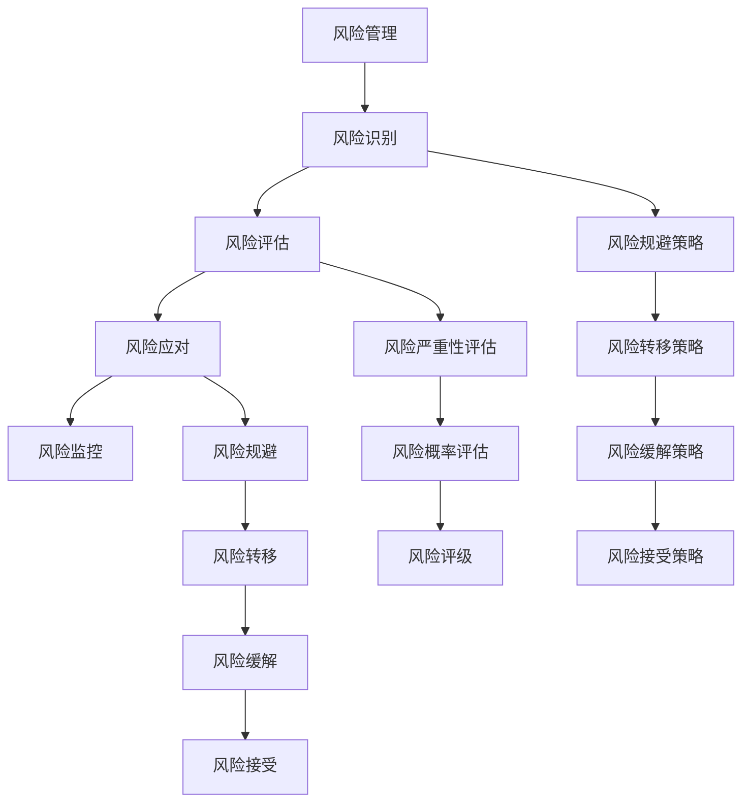

                 

### 文章标题：风险管理：识别和应对潜在威胁

在当今快速发展的信息技术时代，风险管理已成为企业和组织运营不可或缺的一部分。随着数字化进程的加速，潜在的风险也在不断演变，从传统的财务风险到运营风险、市场风险等，各种风险因素相互交织，给企业的稳定发展带来了巨大的挑战。本文旨在系统地探讨风险管理的核心概念、识别与评估方法，以及在不同领域的风险应对策略，帮助读者全面了解和掌握风险管理的实践应用。

### 关键词

- 风险管理
- 风险识别
- 风险评估
- 风险应对策略
- 财务风险
- 运营风险
- 市场风险

### 摘要

本文首先介绍了风险管理的核心概念和重要性，阐述了风险识别与评估的基本方法和工具。随后，深入探讨了财务风险、运营风险和市场营销风险的类型、识别与评估方法，并提出了相应的风险应对策略。最后，通过实际案例和风险管理工具与模型的应用，为读者提供了实用的风险管理实践指南。

### 目录大纲

- 第一部分：风险管理基础
  - 第1章：风险管理的概念与重要性
  - 第2章：风险识别与评估
  - 第3章：风险应对策略
- 第二部分：具体领域风险识别与应对
  - 第4章：财务风险
  - 第5章：运营风险
  - 第6章：市场风险
- 第三部分：风险管理实践
  - 第7章：风险管理实践案例
  - 第8章：风险管理工具与模型
- 附录
  - 附录A：风险管理常用术语表
  - 附录B：风险管理参考资料

---

### 第一部分：风险管理基础

#### 第1章：风险管理的概念与重要性

**1.1.1 风险管理的定义**

风险管理是一种系统的、持续的过程，旨在识别、评估、应对和监控潜在风险，以确保组织的目标得以实现。其核心目标是最大限度地减少风险带来的负面影响，并从中寻找机会。

**1.1.2 风险管理的目标**

- 保护组织的资源
- 保障组织的稳定运营
- 提高组织的竞争力和可持续性

**1.1.3 风险管理的核心原则**

- 全员参与：风险管理需要全体员工的参与，从最高管理层到基层员工，都应意识到风险管理的重要性。
- 全面性：风险管理应覆盖所有业务领域和环节，确保无死角。
- 持续改进：风险管理是一个持续的过程，需要定期评估和改进。

**1.1.4 风险管理的历史与发展**

风险管理起源于20世纪50年代的商业领域，随着信息技术的发展，风险管理逐渐成为企业管理和运营的核心环节。近年来，随着云计算、大数据、人工智能等技术的应用，风险管理的方法和工具也在不断革新。

#### 第2章：风险识别与评估

**2.1.1 风险识别的方法**

风险识别是风险管理的第一步，其目的是发现潜在的风险因素。常用的风险识别方法包括：

- **问卷调查法**：通过设计问卷，收集员工和利益相关者的意见和建议，以识别潜在风险。
- **脚手架分析**：从组织的业务流程、系统架构等方面，系统性地识别潜在风险。
- **SWOT分析**：从组织的优势、劣势、机会和威胁等方面，全面识别风险。

**2.1.2 风险评估指标**

风险评估是风险管理的核心环节，其目的是评估风险的严重程度和概率。常用的风险评估指标包括：

- **风险严重性评估**：评估风险发生后可能造成的损失和影响。
- **风险概率评估**：评估风险发生的可能性。
- **风险评级**：将风险按照严重程度和概率进行分级，以便制定相应的应对策略。

**2.1.3 风险评估的方法**

风险评估方法包括定性和定量两种。

- **定性风险评估**：基于专家意见和经验，对风险进行评估。
- **定量风险评估**：通过数学模型和计算，对风险进行量化评估。

**2.1.4 风险评估的流程**

风险评估通常包括以下步骤：

1. **确定评估对象**：明确评估的目标和范围。
2. **收集数据**：收集与风险相关的信息和数据。
3. **风险识别**：识别潜在的风险因素。
4. **风险评估**：评估风险的严重性和概率。
5. **制定应对策略**：根据风险评估结果，制定相应的应对策略。

#### 第3章：风险应对策略

**3.1.1 风险规避策略**

风险规避是指通过改变计划或决策，以避免风险的发生。常用的风险规避策略包括：

- **完全规避**：避免涉及可能导致风险的活动。
- **部分规避**：在无法完全规避风险的情况下，尽量减少风险的影响。

**3.1.2 风险转移策略**

风险转移是指将风险转移给第三方，以减轻组织自身的风险负担。常用的风险转移策略包括：

- **保险转移**：购买保险，将风险转移给保险公司。
- **合同转移**：在合同中规定，将风险转移给对方。

**3.1.3 风险缓解策略**

风险缓解是指通过采取措施，降低风险发生的概率或减轻风险的影响。常用的风险缓解策略包括：

- **损失控制**：在风险发生后，采取措施减少损失。
- **风险分散**：通过多元化投资或业务布局，降低风险集中度。

**3.1.4 风险接受策略**

风险接受是指组织主动承担风险，并制定相应的应急计划。常用的风险接受策略包括：

- **自留风险**：组织自行承担风险。
- **紧急处理计划**：制定应急预案，以应对突发事件。

---

### 第二部分：具体领域风险识别与应对

#### 第4章：财务风险

**4.1.1 财务风险的类型**

财务风险是指企业在财务活动中可能面临的各种风险，包括：

- **利率风险**：由于利率变动导致的企业财务状况的不确定性。
- **信用风险**：由于借款人无法按时偿还债务而导致的风险。
- **流动性风险**：企业无法及时满足债务支付需求的风险。

**4.1.2 财务风险识别与评估方法**

财务风险的识别和评估方法包括：

- **财务比率分析**：通过分析企业的财务比率，评估其财务状况。
- **财务预警系统**：建立财务预警系统，实时监测企业的财务风险。

**4.1.3 财务风险管理策略**

财务风险管理策略包括：

- **风险规避策略**：避免涉及高风险的财务活动。
- **风险转移策略**：通过购买保险或签订合同，将风险转移给第三方。
- **风险缓解策略**：通过优化财务结构、提高盈利能力等措施，降低风险。

#### 第5章：运营风险

**5.1.1 运营风险的类型**

运营风险是指企业在日常运营活动中可能面临的各种风险，包括：

- **供应链风险**：供应链中断或延迟导致的风险。
- **法律风险**：企业在法律活动中可能面临的风险。
- **员工风险**：员工行为或能力不足导致的风险。

**5.1.2 运营风险识别与评估方法**

运营风险的识别和评估方法包括：

- **内部控制评估**：评估企业的内部控制体系是否完善。
- **外部环境分析**：分析企业所处的市场环境、政策环境等。

**5.1.3 运营风险管理策略**

运营风险管理策略包括：

- **风险规避策略**：避免涉及高风险的运营活动。
- **风险转移策略**：通过签订合同或购买保险，将风险转移给第三方。
- **风险缓解策略**：通过改进流程、提高员工素质等措施，降低风险。

#### 第6章：市场风险

**6.1.1 市场风险的特点**

市场风险是指企业在市场活动中可能面临的风险，具有以下特点：

- **波动性**：市场风险的变化幅度较大。
- **不确定性**：市场风险难以预测。
- **难以预测性**：市场风险的发生往往难以预见。

**6.1.2 市场风险识别与评估方法**

市场风险的识别和评估方法包括：

- **历史数据分析**：通过分析历史数据，预测市场风险。
- **情景分析**：模拟不同的市场情景，评估市场风险。

**6.1.3 市场风险管理策略**

市场风险管理策略包括：

- **风险规避策略**：避免涉及高风险的市场活动。
- **风险转移策略**：通过签订合同或购买保险，将风险转移给第三方。
- **风险缓解策略**：通过多元化投资、分散风险等措施，降低市场风险。

---

### 第三部分：风险管理实践

#### 第7章：风险管理实践案例

**7.1.1 案例一：某企业的财务风险管理实践**

**7.1.1.1 案例背景**

某企业主要从事制造业，面临财务风险的主要因素包括利率风险、信用风险和流动性风险。

**7.1.1.2 风险识别与评估**

通过财务比率分析和财务预警系统，企业识别了以下风险：

- **利率风险**：由于利率波动可能导致企业融资成本增加。
- **信用风险**：由于部分客户无法按时支付货款，可能导致企业现金流紧张。
- **流动性风险**：由于企业短期内资金需求大，可能导致资金链断裂。

**7.1.1.3 风险应对策略**

企业采取了以下风险应对策略：

- **利率风险规避策略**：通过调整融资结构，降低利率波动对企业的影响。
- **信用风险转移策略**：购买信用保险，将信用风险转移给保险公司。
- **流动性风险缓解策略**：加强现金流管理，提高资金使用效率。

**7.1.2 案例二：某企业的运营风险管理实践**

**7.1.2.1 案例背景**

某企业主要从事软件研发，面临运营风险的主要因素包括供应链风险、法律风险和员工风险。

**7.1.2.2 风险识别与评估**

通过内部控制评估和外部环境分析，企业识别了以下风险：

- **供应链风险**：由于供应链中断，可能导致项目进度延误。
- **法律风险**：由于法规变化，可能导致企业业务受限。
- **员工风险**：由于员工流失，可能导致项目延误。

**7.1.2.3 风险应对策略**

企业采取了以下风险应对策略：

- **供应链风险规避策略**：建立备用供应链，以应对供应链中断。
- **法律风险转移策略**：购买法律保险，将法律风险转移给保险公司。
- **员工风险缓解策略**：加强员工培训，提高员工素质。

#### 第8章：风险管理工具与模型

**8.1.1 风险管理工具概述**

风险管理工具是帮助企业和组织进行风险识别、评估和应对的重要工具。常用的风险管理工具包括：

- **风险管理软件**：用于自动识别、评估和监控风险。
- **风险管理模型**：用于预测和评估风险的影响。

**8.1.2 常见风险管理模型**

常见风险管理模型包括：

- **贝叶斯网络**：用于评估多个因素之间的关联关系。
- **风险矩阵**：用于评估风险的严重性和概率。
- **模拟模型**：用于模拟不同情景下的风险情况。

**8.1.3 风险管理工具的应用**

风险管理工具的应用主要包括：

- **数据收集与处理**：通过工具自动收集和处理与风险相关的数据。
- **风险识别与评估**：通过工具识别和评估潜在风险。
- **风险应对策略制定**：根据评估结果，制定相应的风险应对策略。

### 附录

#### 附录A：风险管理常用术语表

- 风险管理：识别、评估和应对风险的过程。
- 风险识别：发现潜在风险的过程。
- 风险评估：评估风险的概率和影响的过程。
- 风险应对策略：应对风险的方法和措施。
- 财务风险：企业在财务活动中可能面临的风险。
- 运营风险：企业在日常运营活动中可能面临的风险。
- 市场风险：企业在市场活动中可能面临的风险。

#### 附录B：风险管理参考资料

- **ISO31000标准**：风险管理指南。
- **《风险管理》**：小约翰·霍普金斯，2006年出版。
- **《企业风险管理》**：乔治·桑托斯，2015年出版。
- **《风险管理：现代方法》**：丹尼尔·贝尔，2018年出版。

### 总结

本文通过详细阐述风险管理的核心概念、识别与评估方法，以及在不同领域的风险应对策略，帮助读者全面了解和掌握风险管理的实践应用。通过实际案例和风险管理工具与模型的应用，读者可以更好地应对各种潜在风险，确保企业的稳定发展。

---

**核心概念与联系：**

### 风险管理的核心概念及相互关系

### 风险管理的核心概念及相互关系

风险管理是一个复杂而系统的过程，涉及到多个核心概念和环节，它们之间相互关联，共同构成了一个完整的风险管理体系。以下是对这些核心概念及其相互关系的详细阐述。

**风险识别（Risk Identification）**

风险识别是风险管理的第一步，它的目标是系统地识别和列出可能影响组织目标实现的各种风险。风险识别不仅仅是发现已经存在的风险，还包括预测和评估未来可能发生的风险。风险识别的方法有多种，如问卷调查法、脚手架分析、SWOT分析等。

**风险评估（Risk Assessment）**

风险评估是在风险识别的基础上，对识别出的风险进行评估，以确定其发生的概率和可能带来的影响。风险评估通常包括定量和定性两种方法。定量评估通过数学模型和计算，对风险的概率和影响进行量化；定性评估则主要依赖于专家意见和经验。风险评估的关键是确定风险的严重性和概率，以便为后续的风险应对提供依据。

**风险应对（Risk Response）**

风险应对是指根据风险评估的结果，制定和实施应对策略，以减轻或消除风险带来的负面影响。风险应对策略包括四种类型：风险规避、风险转移、风险缓解和风险接受。

- **风险规避（Risk Avoidance）**：通过改变计划或决策，避免涉及可能导致风险的活动。
- **风险转移（Risk Transfer）**：通过购买保险或签订合同，将风险转移给第三方。
- **风险缓解（Risk Mitigation）**：通过采取措施，降低风险发生的概率或减轻风险的影响。
- **风险接受（Risk Acceptance）**：组织主动承担风险，并制定相应的应急计划。

**风险监控（Risk Monitoring）**

风险监控是风险管理的持续过程，它包括跟踪和评估风险的状况和变化，以及及时调整风险应对策略。风险监控的目的是确保风险应对措施的有效性和及时性，以及在风险发生时能够迅速响应。

**相互关系**

风险管理中的各个核心概念和环节相互关联，构成了一个动态的、持续改进的系统。具体来说：

1. **风险识别**是整个风险管理过程的基础，为后续的风险评估和应对提供数据和信息。
2. **风险评估**对风险进行量化，为制定有效的风险应对策略提供依据。
3. **风险应对**是将风险评估结果转化为实际行动，以降低风险的影响。
4. **风险监控**确保风险应对策略的有效性和及时性，以及在风险发生时能够迅速响应。

通过这种相互关联的关系，风险管理能够形成一个闭环系统，不断改进和完善，以适应不断变化的外部环境和内部条件。

### 风险识别的方法

在风险管理的初始阶段，准确识别风险是至关重要的。这不仅有助于提前预知潜在的威胁，还能为后续的风险评估和应对策略提供坚实的基础。以下是几种常用的风险识别方法，每种方法都有其独特的优势和适用场景。

**问卷调查法**

问卷调查法是一种通过设计问卷，收集相关人员意见和建议的方法。这种方法适用于广泛的风险识别，特别适用于需要大量数据输入的场景。通过问卷调查，企业可以收集到来自员工、客户、供应商等各方的意见和建议，从而全面识别潜在的风险因素。

**脚手架分析**

脚手架分析是一种系统性的分析方法，它通过梳理组织的业务流程、系统架构等，识别潜在的风险点。这种方法适用于复杂系统，可以帮助企业从整体层面识别风险，特别是在业务变革、系统集成等项目中。

**SWOT分析**

SWOT分析是一种基于优势（Strengths）、劣势（Weaknesses）、机会（Opportunities）和威胁（Threats）的分析方法。通过SWOT分析，企业可以从内外部环境的角度，全面识别和评估各种风险因素。这种方法特别适用于战略规划和业务决策，可以帮助企业在不同市场环境中识别和应对风险。

### 风险评估指标

在风险管理的核心环节——风险评估中，选择合适的指标对于准确评估风险至关重要。以下是几种常用的风险评估指标，以及它们的定义和计算方法。

**风险严重性评估**

风险严重性评估是指评估风险发生后可能造成的损失和影响。这个指标通常通过以下公式计算：

$$
严重性评分 = （潜在损失 * 风险概率）/ 风险缓解成本
$$

其中，潜在损失是风险发生时可能造成的最大损失，风险概率是风险发生的可能性，风险缓解成本是采取措施降低风险的成本。

**风险概率评估**

风险概率评估是指评估风险发生的可能性。这个指标通常通过以下公式计算：

$$
概率评分 = 风险发生的可能性
$$

风险概率可以通过历史数据分析、专家意见和情景模拟等方法进行估算。

**风险评级**

风险评级是指将评估出的风险按照严重性和概率进行分级。常用的风险评级方法包括：

- **五级风险评级**：将风险分为高、中、低三个等级。
- **三级风险评级**：将风险分为可接受、需关注和需立即处理三个等级。

通过风险评级，企业可以明确不同风险的优先级，以便优先处理高优先级的风险。

### 风险规避策略

在风险管理中，风险规避策略是一种常见的风险应对方法，旨在通过改变计划或决策，避免涉及可能导致风险的活动。以下是几种常见的风险规避策略：

**完全规避**

完全规避是指通过完全避免涉及可能导致风险的活动来规避风险。例如，企业可能会选择不进入某些具有较高风险的市场，或者不从事某些可能导致法律问题的业务。

**部分规避**

部分规避是指在不完全避免风险的情况下，尽量减少风险的影响。例如，企业可能会通过改进流程、增加检查点等方式来减少风险。

### 风险转移策略

风险转移策略是指通过将风险转移给第三方，以减轻组织自身的风险负担。以下是几种常见的风险转移策略：

**保险转移**

保险转移是指通过购买保险，将风险转移给保险公司。例如，企业可以通过购买产品责任保险、商业保险等方式，将潜在的法律风险和财务风险转移给保险公司。

**合同转移**

合同转移是指通过签订合同，将风险转移给对方。例如，在供应链管理中，企业可以通过与供应商签订合同，将供应链中断的风险转移给供应商。

### 风险缓解策略

风险缓解策略是指通过采取措施，降低风险发生的概率或减轻风险的影响。以下是几种常见的风险缓解策略：

**损失控制**

损失控制是指通过采取措施，降低风险发生后的损失程度。例如，企业可以通过建立应急预案、定期备份数据等方式，降低风险发生后的损失。

**风险分散**

风险分散是指通过多元化投资或业务布局，降低风险集中度。例如，企业可以通过投资多个不同的行业或市场，降低单一行业或市场风险带来的影响。

### 风险接受策略

风险接受策略是指组织主动承担风险，并制定相应的应急计划。以下是几种常见风险接受策略：

**自留风险**

自留风险是指组织自行承担风险，并制定相应的应急计划。这种方法适用于风险概率较低、影响较小的情况。

**紧急处理计划**

紧急处理计划是指制定应急预案，以应对突发事件。例如，企业可以制定火灾应急预案、地震应急预案等，以确保在风险发生时能够迅速响应。

### 财务风险的类型

财务风险是指企业在财务活动中可能面临的各种风险，这些风险可能会导致企业财务状况的恶化。以下是财务风险的几种主要类型：

**利率风险**

利率风险是指由于利率波动导致的企业财务状况的不确定性。例如，当利率上升时，企业的借贷成本会增加，从而影响盈利能力。

**信用风险**

信用风险是指由于借款人无法按时偿还债务而导致的风险。例如，企业可能会因为客户无法支付货款而遭受损失。

**流动性风险**

流动性风险是指企业无法及时满足债务支付需求的风险。例如，当企业面临短期债务到期时，可能无法迅速变现资产以偿还债务。

### 财务风险识别与评估方法

识别和评估财务风险是风险管理的关键步骤。以下是一些常用的财务风险识别与评估方法：

**财务比率分析**

财务比率分析是通过计算和分析企业的财务比率，评估其财务状况。常用的财务比率包括流动比率、速动比率、负债比率、盈利能力比率等。通过分析这些比率，企业可以识别潜在的风险。

**财务预警系统**

财务预警系统是一种通过监测企业财务指标，提前发现潜在财务风险的方法。财务预警系统通常包括监控财务指标、设置预警阈值和触发警报等功能。通过财务预警系统，企业可以及时识别和应对财务风险。

### 财务风险管理策略

针对财务风险的类型，企业可以采取以下风险管理策略：

**风险规避策略**

风险规避策略是通过避免涉及高风险的财务活动来减轻风险。例如，企业可以避免投资波动性较大的金融产品，或者不与信用评级较差的客户进行交易。

**风险转移策略**

风险转移策略是通过将风险转移给第三方来减轻风险。例如，企业可以通过购买保险将信用风险和利率风险转移给保险公司。

**风险缓解策略**

风险缓解策略是通过采取措施降低风险发生的概率或减轻风险的影响。例如，企业可以通过优化财务结构、加强现金流管理、提高盈利能力等措施来缓解财务风险。

### 运营风险的类型

运营风险是指企业在日常运营活动中可能面临的各种风险，这些风险可能会影响企业的稳定运营和竞争力。以下是运营风险的几种主要类型：

**供应链风险**

供应链风险是指由于供应链中断或延迟导致的风险。例如，供应商无法按时交货或原材料短缺，可能会影响企业的生产计划。

**法律风险**

法律风险是指企业在法律活动中可能面临的风险。例如，企业可能会因为违反法律法规而面临罚款、诉讼等风险。

**员工风险**

员工风险是指由于员工行为或能力不足导致的风险。例如，员工流失、能力不足、违反职业道德等，可能会影响企业的运营和业务发展。

### 运营风险识别与评估方法

识别和评估运营风险是风险管理的关键步骤。以下是一些常用的运营风险识别与评估方法：

**内部控制评估**

内部控制评估是通过评估企业的内部控制体系，识别潜在的风险点。内部控制体系包括企业的政策、流程、监控机制等。通过内部控制评估，企业可以识别和消除内部风险。

**外部环境分析**

外部环境分析是通过分析企业所处的市场环境、政策环境等，识别外部风险。例如，市场变化、政策调整等都可能对企业的运营产生重大影响。

### 运营风险管理策略

针对运营风险的类型，企业可以采取以下风险管理策略：

**风险规避策略**

风险规避策略是通过避免涉及高风险的运营活动来减轻风险。例如，企业可以避免在供应链上依赖于单一供应商，或者不从事可能面临法律诉讼的业务。

**风险转移策略**

风险转移策略是通过将风险转移给第三方来减轻风险。例如，企业可以通过购买保险将供应链风险转移给保险公司，或者通过签订合同将法律风险转移给对方。

**风险缓解策略**

风险缓解策略是通过采取措施降低风险发生的概率或减轻风险的影响。例如，企业可以通过建立冗余供应链、加强员工培训等措施来缓解运营风险。

### 市场风险的特点

市场风险是指企业在市场活动中可能面临的风险，这些风险通常具有以下特点：

**波动性**

市场风险具有波动性，即市场状况会不断变化，风险因素也在不断变化。例如，股票市场的波动、汇率的波动等都可能导致市场风险的波动。

**不确定性**

市场风险具有不确定性，即风险的发生和影响难以预测。例如，市场趋势的变化、政策调整等都可能导致市场风险的难以预测。

**难以预测性**

市场风险具有难以预测性，即即使通过历史数据和趋势分析，也很难准确预测市场风险的发生和影响。例如，突发事件、自然灾害等都可能导致市场风险的难以预测。

### 市场风险识别与评估方法

识别和评估市场风险是风险管理的关键步骤。以下是一些常用的市场风险识别与评估方法：

**历史数据分析**

历史数据分析是通过分析市场历史数据，识别市场风险。例如，通过分析股票市场的历史波动情况，可以识别股票市场的风险。

**情景分析**

情景分析是通过模拟不同的市场情景，评估市场风险。例如，通过模拟经济衰退、政策调整等情景，可以评估市场风险的影响。

### 市场风险管理策略

针对市场风险的特点，企业可以采取以下风险管理策略：

**风险规避策略**

风险规避策略是通过避免涉及高风险的市场活动来减轻风险。例如，企业可以避免投资波动性较大的金融产品，或者不从事高风险的市场业务。

**风险转移策略**

风险转移策略是通过将风险转移给第三方来减轻风险。例如，企业可以通过购买保险将市场风险转移给保险公司。

**风险缓解策略**

风险缓解策略是通过采取措施降低风险发生的概率或减轻风险的影响。例如，企业可以通过多元化投资、分散风险等措施来缓解市场风险。

### 风险管理实践案例一：某企业的财务风险管理实践

**7.1.1.1 案例背景**

某大型制造企业在全球市场上运营，面临复杂的财务风险。该公司的主要财务风险包括利率风险、信用风险和流动性风险。随着全球经济形势的波动，利率的上升和下降、客户信用状况的变化以及市场需求的波动，都对公司的财务稳定性构成了威胁。

**7.1.1.2 风险识别与评估**

为了有效管理财务风险，公司采取了以下步骤：

1. **风险识别**：
   - 利率风险：通过分析历史利率数据和市场趋势，公司识别出利率波动可能导致融资成本上升和现金流紧张的风险。
   - 信用风险：通过客户信用评分和交易记录，公司识别出客户无法按时支付货款的风险。
   - 流动性风险：通过现金流预测和流动性分析，公司识别出短期债务到期时无法及时偿还的风险。

2. **风险评估**：
   - 利率风险：通过利率敏感度分析，公司评估了利率上升对财务状况的影响，并确定了相应的风险承受能力。
   - 信用风险：通过信用评分模型，公司评估了客户的信用风险，并根据评分结果调整了信用政策。
   - 流动性风险：通过现金流预测和流动性分析，公司评估了短期债务的偿还能力，并制定了应急计划。

**7.1.1.3 风险应对策略**

针对识别出的财务风险，公司制定了以下风险应对策略：

1. **利率风险规避策略**：
   - 公司通过调整融资结构，降低了利率波动对企业融资成本的影响。例如，公司增加了长期债务的比例，降低了短期债务的占比，以减少利率风险。
   - 公司还利用利率掉期等金融工具，对冲利率风险。

2. **信用风险转移策略**：
   - 公司购买信用保险，将信用风险转移给保险公司。这降低了客户违约对公司财务状况的影响。
   - 公司对高风险客户实施了更严格的信用政策，如限制信用额度、增加保证金等。

3. **流动性风险缓解策略**：
   - 公司建立了现金储备，以应对短期债务到期的流动性需求。
   - 公司优化了现金流管理，通过提高应收账款回收速度、延迟支付应付账款等方式，改善了现金流量。

通过这些措施，公司有效地降低了财务风险，确保了财务稳定性。

### 风险管理实践案例二：某企业的运营风险管理实践

**7.1.2.1 案例背景**

某高科技企业在快速发展的市场中运营，面临多种运营风险。这些风险包括供应链风险、法律风险和员工风险。供应链的不稳定、法律法规的变化以及员工的不稳定，都对企业的持续运营和竞争力构成了挑战。

**7.1.2.2 风险识别与评估**

为了有效管理运营风险，公司采取了以下步骤：

1. **风险识别**：
   - 供应链风险：通过分析供应链的各个环节，公司识别出供应链中断可能导致的生产延误和成本增加的风险。
   - 法律风险：通过法律咨询和合规审计，公司识别出违反法律法规可能导致的法律纠纷和罚款的风险。
   - 员工风险：通过员工满意度调查和离职数据分析，公司识别出员工流失可能对业务连续性和团队士气的影响。

2. **风险评估**：
   - 供应链风险：公司通过供应链分析工具，评估了供应链的稳定性和弹性，并确定了潜在中断的风险等级。
   - 法律风险：公司通过风险评估模型，评估了不同法律风险的合规性和潜在损失，并根据风险评估结果制定了法律风险管理计划。
   - 员工风险：公司通过员工离职数据分析，评估了员工流失率对业务连续性的影响，并确定了关键岗位的员工流失风险。

**7.1.2.3 风险应对策略**

针对识别出的运营风险，公司制定了以下风险应对策略：

1. **供应链风险规避策略**：
   - 公司通过建立多元化供应链，降低了供应链中断的风险。例如，公司增加了供应商的数量，并与多个供应商签订了长期合同。
   - 公司还建立了供应链应急预案，以应对突发供应链中断。

2. **法律风险转移策略**：
   - 公司购买法律保险，将法律风险转移给保险公司。
   - 公司加强法律培训，提高员工的合规意识，减少因违规操作导致的法律风险。

3. **员工风险缓解策略**：
   - 公司实施了员工激励机制，提高员工满意度和忠诚度。
   - 公司制定了员工培训和发展计划，提高员工的能力和素质，减少员工流失。

通过这些措施，公司有效地降低了运营风险，确保了业务的稳定和持续发展。

### 风险管理工具概述

在风险管理过程中，选择合适的工具至关重要。这些工具可以帮助企业有效地识别、评估和应对风险。以下是几种常见风险管理工具的概述：

**风险管理软件**

风险管理软件是一种用于自动化风险管理过程的工具。这类软件通常包括风险识别、风险评估、风险监控等功能。通过风险管理软件，企业可以更高效地管理风险，提高风险应对的效率。常见的风险管理软件有Oracle Risk Manager、Open Risk Manager等。

**风险管理模型**

风险管理模型是一种用于评估和预测风险的方法。这类模型可以根据企业的具体情况和需求进行定制。常见的风险管理模型包括贝叶斯网络、蒙特卡罗模拟、风险矩阵等。通过风险管理模型，企业可以更准确地评估风险的概率和影响，为决策提供科学依据。

**风险识别工具**

风险识别工具是一种帮助企业识别潜在风险的方法。这类工具通常包括问卷调查、SWOT分析、脚手架分析等。通过风险识别工具，企业可以系统地识别各种潜在风险，为后续的风险评估和应对提供基础。

**风险监控工具**

风险监控工具是一种用于实时监控风险状况的工具。这类工具可以帮助企业及时了解风险的最新情况，并采取相应的应对措施。常见的风险监控工具包括风险管理软件中的监控模块、风险仪表盘等。

### 常见风险管理模型

在风险管理过程中，选择合适的风险管理模型对于准确评估和应对风险至关重要。以下是几种常见风险管理模型及其应用场景：

**贝叶斯网络**

贝叶斯网络是一种基于概率论的图形模型，用于表示多个因素之间的依赖关系。通过贝叶斯网络，企业可以分析各种因素之间的相互作用，评估风险的概率和影响。贝叶斯网络特别适用于复杂系统和高维度数据的风险评估。

**风险矩阵**

风险矩阵是一种用于评估风险的常用工具，通常用于定性风险评估。风险矩阵通过将风险的严重性和概率进行量化，帮助企业确定风险的优先级。风险矩阵通常包括四个象限，分别表示高风险、高概率、中风险、中概率等。

**蒙特卡罗模拟**

蒙特卡罗模拟是一种基于概率统计的方法，用于评估风险的定量分析。通过模拟不同的场景和参数，蒙特卡罗模拟可以帮助企业预测风险的可能结果，评估风险的影响。蒙特卡罗模拟特别适用于涉及多个变量和复杂依赖关系的风险评估。

### 风险管理工具的应用

风险管理工具在企业中的应用包括以下几个方面：

**数据收集与处理**

风险管理工具可以帮助企业收集和处理与风险相关的数据。例如，通过风险管理软件，企业可以自动化收集和分析财务数据、市场数据等，以便进行风险评估。

**风险识别与评估**

风险管理工具可以帮助企业识别和评估各种风险。例如，通过风险矩阵和贝叶斯网络，企业可以系统地评估风险的严重性和概率，确定风险的优先级。

**风险应对策略制定**

风险管理工具可以帮助企业制定和实施风险应对策略。例如，通过风险管理软件，企业可以制定详细的应对措施，分配资源和责任，确保风险应对的有效性。

**风险监控**

风险管理工具可以帮助企业实时监控风险状况，确保风险应对措施的执行。例如，通过风险仪表盘，企业可以实时了解风险的变化情况和应对进展，及时调整风险应对策略。

### 附录A：风险管理常用术语表

**风险识别**：通过系统化的方法发现潜在风险。

**风险评估**：对已识别的风险进行量化评估，以确定其可能性和影响。

**风险规避**：通过避免涉及可能导致风险的活动来消除风险。

**风险转移**：通过合同或保险等方式将风险转移给第三方。

**风险缓解**：通过采取措施降低风险的发生概率或减轻其影响。

**风险接受**：主动承担风险，并制定相应的应急计划。

**风险监控**：持续跟踪和评估风险状况，以及调整风险应对策略。

**财务风险**：企业在财务活动中可能面临的风险。

**运营风险**：企业在日常运营活动中可能面临的风险。

**市场风险**：企业在市场活动中可能面临的风险。

### 附录B：风险管理参考资料

**ISO31000标准**：国际标准化组织发布的《风险管理——原则和指南》。

**《风险管理》**：小约翰·霍普金斯著，详细介绍风险管理的理论和方法。

**《企业风险管理》**：乔治·桑托斯著，探讨企业如何建立和实施风险管理框架。

**《风险管理：现代方法》**：丹尼尔·贝尔著，介绍现代风险管理技术和实践。

### 总结

本文全面阐述了风险管理的核心概念、识别与评估方法以及具体领域的风险应对策略。通过实际案例和风险管理工具的应用，读者可以更好地理解风险管理的重要性，并掌握有效的风险管理实践。风险管理不仅关乎企业的财务稳定，更影响到企业的长期发展和竞争力。因此，企业应高度重视风险管理，不断完善风险管理框架，以应对不断变化的市场环境。

