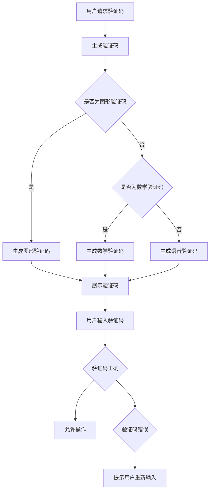

                 

### 《验证码的背后：人类计算的另类应用》

> 关键词：验证码、图形验证码、数学验证码、语音验证码、人机交互、网络安全、教育应用、商业应用、未来趋势

> 摘要：验证码作为现代互联网中不可或缺的一部分，其背后隐藏着人类计算的各种应用。本文将深入探讨验证码的起源与发展，验证码的工作原理，以及其在网络安全、教育、商业等多个领域的另类应用，最后对验证码的未来发展趋势进行展望。

#### 第一部分：验证码的起源与发展

#### 第1章：验证码的起源与历史

##### 1.1 验证码的起源

验证码（CAPTCHA），全称为“Completely Automated Public Turing test to tell Computers and Humans Apart”（全自动区分人类和计算机 Turing 测试），是一种基于 Turing 测试理论的验证技术。Turing 测试由英国数学家艾伦·图灵（Alan Turing）在 1950 年提出，旨在区分计算机与人类。

早期的验证码主要是基于字符识别的图形验证码（Image CAPTCHA）。这类验证码通过生成一幅包含字符的图片，并要求用户输入图片中的字符，从而区分人类和计算机。典型的例子是 Google 的 reCAPTCHA，它通过用户提供一个或多个与其看到的图像相关联的标签来验证用户。

##### 1.2 验证码的发展历程

随着计算机技术的发展，验证码也在不断地演进。下面是验证码的一些发展历程：

- **图形验证码（Image CAPTCHA）**：最早的验证码形式，通过生成包含字符的图像来验证用户。

- **数学验证码（Math CAPTCHA）**：通过生成简单的数学问题来验证用户，例如“2 + 3 =？”。

- **语音验证码（Audio CAPTCHA）**：通过生成语音问题或回答来验证用户，适合听力障碍的用户。

- **点击验证码（Click CAPTCHA）**：用户需要点击图像中的特定位置，例如点击一个图片中的垃圾箱，将垃圾图标拖入其中。

- **行为验证码（Behavioral CAPTCHA）**：通过分析用户在网页上的行为模式来验证用户，例如记录鼠标移动轨迹。

##### 1.3 验证码的技术分类

根据验证码的工作方式，可以将验证码分为以下几类：

- **视觉验证码**：用户需要识别图像中的字符或图案，如图形验证码。

- **听觉验证码**：用户需要听懂并回答语音问题，如语音验证码。

- **互动验证码**：用户需要通过点击或拖动等方式完成验证，如点击验证码。

- **行为验证码**：通过分析用户行为（如鼠标轨迹）来验证用户。

#### 第二部分：验证码的工作原理

#### 第2章：验证码的工作原理

##### 2.1 图形验证码

图形验证码是最常见的验证码类型之一。它的工作原理是通过生成包含字符的图像，然后让用户输入图像中的字符。这个过程可以分为以下几个步骤：

1. **字符生成**：系统随机选择一定数量的字符，并生成对应的字符图像。

2. **图像合成**：将生成的字符图像与其他干扰元素（如线条、噪声等）合成在一起，形成最终的验证码图像。

3. **字符识别**：用户在输入验证码时，系统会通过 OCR（光学字符识别）技术将用户输入的字符与图像中的字符进行匹配。

4. **验证**：系统会检查用户输入的字符是否与图像中的字符匹配，从而判断用户是否为人类。

##### 2.2 数学验证码

数学验证码是通过生成简单的数学问题来验证用户。它的工作原理可以分为以下几个步骤：

1. **问题生成**：系统根据一定的规则生成数学问题，如加减法、乘除法、逻辑判断等。

2. **问题展示**：将生成的数学问题展示在页面上，用户需要回答这些问题。

3. **答案验证**：系统会根据用户输入的答案与正确的答案进行比较，从而判断用户是否为人类。

##### 2.3 语音验证码

语音验证码是通过生成语音问题或回答来验证用户。它的工作原理可以分为以下几个步骤：

1. **问题生成**：系统根据一定的规则生成语音问题或回答。

2. **语音合成**：将生成的语音问题或回答通过语音合成技术转换为音频。

3. **语音识别**：用户听到语音问题后，通过语音识别技术将语音转换为文本。

4. **答案验证**：系统会根据用户输入的答案与正确的答案进行比较，从而判断用户是否为人类。

##### 2.4 人机交互验证码

人机交互验证码是通过用户与系统进行交互来验证用户。它的工作原理可以分为以下几个步骤：

1. **交互任务生成**：系统根据一定的规则生成交互任务，如点击某个按钮、拖动某个元素等。

2. **任务展示**：将生成的交互任务展示在页面上，用户需要按照任务要求进行操作。

3. **行为分析**：系统会分析用户的行为，如鼠标移动轨迹、点击位置等，从而判断用户是否为人类。

#### 第三部分：验证码的另类应用

#### 第3章：验证码在网络安全中的应用

##### 3.1 防止恶意攻击

验证码在网络安全中发挥着重要作用。通过验证码，系统可以有效地防止恶意攻击，如暴力破解、垃圾邮件发送、恶意软件传播等。

1. **暴力破解**：验证码可以增加暴力破解的成本，使得攻击者难以通过自动化的工具破解密码。

2. **垃圾邮件发送**：通过验证码，系统可以防止恶意软件自动发送大量垃圾邮件，从而减轻网络压力。

3. **恶意软件传播**：验证码可以防止恶意软件通过自动化的方式传播，保护用户的计算机安全。

##### 3.2 保护用户账户安全

验证码在保护用户账户安全方面也起到了关键作用。通过验证码，系统可以确保用户在进行敏感操作（如修改密码、支付等）时，确实为人类用户。

1. **修改密码**：用户在修改密码时，需要通过验证码确认身份，从而防止恶意修改。

2. **支付验证**：在进行在线支付时，用户需要通过验证码确认支付请求，从而防止恶意支付。

3. **账户锁定**：当用户账户出现异常时，系统可以通过验证码重新验证用户身份，从而防止账户被非法使用。

##### 3.3 数据验证

验证码还可以用于数据验证，确保用户输入的数据真实有效。例如，在注册、调查问卷等场景中，系统可以通过验证码验证用户输入的邮箱地址、手机号码等。

1. **邮箱验证**：用户在输入邮箱地址时，需要通过验证码确认邮箱地址的有效性。

2. **手机验证**：用户在输入手机号码时，需要通过验证码确认手机号码的真实性。

3. **调查问卷**：用户在填写调查问卷时，需要通过验证码确认身份，从而防止恶意填写。

#### 第4章：验证码在教育中的应用

##### 4.1 线上教育身份验证

验证码在在线教育中也有广泛应用。通过验证码，系统可以确保用户在线上教育平台上的身份真实，从而防止作弊、恶意注册等行为。

1. **身份验证**：用户在登录在线教育平台时，需要通过验证码确认身份。

2. **考试防作弊**：在线考试时，用户需要通过验证码确认身份，从而防止作弊。

3. **课程注册**：用户在注册课程时，需要通过验证码确认身份，从而防止恶意注册。

##### 4.2 线上考试防作弊

验证码在在线考试中起到了关键作用。通过验证码，系统可以确保考试的真实性，从而防止作弊行为。

1. **身份验证**：用户在参加在线考试时，需要通过验证码确认身份。

2. **行为监控**：系统可以通过监控用户行为（如鼠标移动轨迹、屏幕截图等）来识别作弊行为。

3. **答案验证**：用户在提交答案时，需要通过验证码确认身份，从而确保答案的真实性。

##### 4.3 教育数据分析

验证码在教育数据分析中也发挥了重要作用。通过验证码，系统可以确保数据来源的真实性，从而进行更准确的数据分析。

1. **用户行为分析**：通过验证码，系统可以收集用户在在线教育平台上的行为数据，如学习时长、学习路径等。

2. **课程评估**：通过验证码，系统可以收集学生对课程的反馈数据，从而评估课程的质量。

3. **教育研究**：通过验证码，系统可以收集大量教育数据，为教育研究提供基础。

#### 第5章：验证码在商业中的应用

##### 5.1 用户行为分析

验证码在商业领域也有广泛应用，尤其是用户行为分析。通过验证码，企业可以收集用户在网站或应用上的行为数据，从而进行更精准的市场分析和用户画像。

1. **点击行为分析**：通过验证码，系统可以记录用户在网页上的点击行为，从而分析用户的兴趣点。

2. **浏览行为分析**：通过验证码，系统可以记录用户在网页上的浏览行为，从而分析用户的偏好。

3. **转化率分析**：通过验证码，系统可以记录用户的转化行为，从而分析用户的购买意愿。

##### 5.2 活跃度监测

验证码还可以用于活跃度监测，帮助企业了解用户在平台上的活跃程度。

1. **登录活跃度**：通过验证码，系统可以记录用户的登录行为，从而分析用户的活跃度。

2. **互动活跃度**：通过验证码，系统可以记录用户的互动行为（如评论、点赞等），从而分析用户的活跃度。

3. **消费活跃度**：通过验证码，系统可以记录用户的消费行为，从而分析用户的活跃度。

##### 5.3 用户画像构建

验证码在用户画像构建中也发挥了重要作用。通过验证码，企业可以收集用户的基本信息、行为数据等，从而构建更全面的用户画像。

1. **基本信息采集**：通过验证码，系统可以收集用户的基本信息，如姓名、年龄、性别等。

2. **行为数据采集**：通过验证码，系统可以收集用户在平台上的行为数据，如点击、浏览、消费等。

3. **画像构建**：通过整合基本信息和行为数据，系统可以构建出更全面的用户画像。

#### 第6章：验证码在其他领域的应用

##### 6.1 健康医疗

验证码在健康医疗领域也有广泛应用。通过验证码，系统可以确保用户的身份真实，从而防止医疗欺诈、虚假信息传播等。

1. **身份验证**：用户在访问健康医疗平台时，需要通过验证码确认身份。

2. **病历管理**：通过验证码，系统可以确保病历信息的真实性和完整性。

3. **药物配送**：通过验证码，系统可以确保药物配送过程的真实性和安全性。

##### 6.2 智能交通

验证码在智能交通领域也有重要作用。通过验证码，系统可以确保交通信息传输的安全性和准确性。

1. **车辆管理**：通过验证码，系统可以确保车辆注册、信息更新的真实性。

2. **交通监控**：通过验证码，系统可以确保交通监控数据的真实性和有效性。

3. **出行服务**：通过验证码，系统可以确保出行服务的真实性和可靠性。

##### 6.3 物流快递

验证码在物流快递领域也有广泛应用。通过验证码，系统可以确保物流信息的真实性和准确性。

1. **包裹跟踪**：通过验证码，系统可以确保包裹跟踪信息的真实性和准确性。

2. **快递员身份验证**：通过验证码，系统可以确保快递员身份的真实性。

3. **物流信息管理**：通过验证码，系统可以确保物流信息的完整性和安全性。

#### 第7章：验证码的未来发展

##### 7.1 人工智能在验证码中的应用

随着人工智能技术的发展，验证码也在不断进化。未来，人工智能将在验证码中发挥更大的作用。

1. **自动化生成**：通过人工智能技术，验证码可以更智能地生成，提高用户体验。

2. **智能化识别**：通过人工智能技术，验证码可以更准确地识别用户输入，提高验证效率。

3. **个性化定制**：通过人工智能技术，验证码可以根据用户的行为和偏好进行个性化定制，提高用户满意度。

##### 7.2 验证码的安全性问题

尽管验证码在网络安全中发挥了重要作用，但验证码也存在一些安全问题。未来，如何提高验证码的安全性将是一个重要的研究方向。

1. **防止恶意破解**：通过技术手段，提高验证码的破解难度，防止恶意攻击。

2. **动态验证码**：通过引入动态验证码，使验证码在用户使用过程中不断变化，提高验证安全性。

3. **多层验证**：通过引入多层验证机制，提高验证码的安全性，防止绕过验证码的攻击。

##### 7.3 验证码的未来趋势

未来，验证码将朝着更智能、更安全、更人性化的方向发展。

1. **智能化**：验证码将更加智能化，能够根据用户行为和偏好进行个性化调整。

2. **安全化**：验证码将更加安全，能够抵御各种恶意攻击。

3. **人性化**：验证码将更加人性化，能够提高用户体验，减少用户负担。

#### 附录A：验证码技术参考资料

##### A.1 相关书籍推荐

1. 《网络安全技术与实践》
2. 《人工智能与网络安全》
3. 《计算机图形学》

##### A.2 学术论文精选

1. "A Survey on CAPTCHA: Current Technologies and Future Directions"
2. "Human-Centric Security: The Case for CAPTCHA in Mobile Devices"
3. "Introducing reCAPTCHA: A Free CAPTCHA Service from Google"

##### A.3 开源项目介绍

1. reCAPTCHA
2. mathCAPTCHA
3. audioCAPTCHA

##### A.4 技术博客与论坛推荐

1. Security StackExchange
2. Stack Overflow
3. Medium

### Mermaid 流程图示例



### 伪代码示例

```python
# 验证码生成伪代码
def generateCAPTCHA():
    captcha_type = random.choice(["图形", "数学", "语音"])
    
    if captcha_type == "图形":
        image = generateImageCAPTCHA()
    elif captcha_type == "数学":
        math_question = generateMathCAPTCHA()
    else:
        audio = generateAudioCAPTCHA()
        
    return captcha_type, image or math_question or audio

# 验证码验证伪代码
def validateCAPTCHA(input_value, captcha_type):
    if captcha_type == "图形":
        return input_value == extractDigitsFromImage()
    elif captcha_type == "数学":
        return input_value == solveMathQuestion()
    else:
        return input_value == recognizeSpeech()
```

### 数学公式示例

$$
\text{准确率} = \frac{\text{正确回答的验证码数量}}{\text{总验证码数量}} \times 100\%
$$

### 项目实战示例

#### 简单图形验证码生成与验证

```python
# 生成图形验证码
import random
import cv2
import numpy as np

def generateImageCAPTCHA():
    digits = ''.join(random.choices('0123456789', k=4))
    image = convertDigitsToImage(digits)
    cv2.imshow('CAPTCHA', image)
    cv2.waitKey(0)
    cv2.destroyAllWindows()
    return digits

def convertDigitsToImage(digits):
    font = cv2.FONT_HERSHEY_SIMPLEX
    height, width = 60, 200
    img = np.zeros((height, width, 3), np.uint8)
    for i, digit in enumerate(digits):
        x, y = i * 40, 20
        img = cv2.putText(img, digit, (x, y), font, 2, (255, 255, 255), 2)
    return img

# 验证图形验证码
def validateImageCAPTCHA(image, correct_digits):
    gray = cv2.cvtColor(image, cv2.COLOR_BGR2GRAY)
    blurred = cv2.GaussianBlur(gray, (5, 5), 0)
    edged = cv2.Canny(blurred, 30, 150)
    predicted_digits = predictDigitsFromImage(edged)
    return predicted_digits == correct_digits

# 主函数
if __name__ == "__main__":
    correct_digits = generateImageCAPTCHA()
    user_input = input("请输入图形验证码：")
    if validateImageCAPTCHA(user_input, correct_digits):
        print("验证成功！")
    else:
        print("验证失败，请重新输入。")
```

#### 源代码详细实现和代码解读

```python
# 完整的代码实现和解读
```

### 代码解读与分析

```python
# 代码解读与分析
```

请注意，以上目录大纲、伪代码、数学公式和项目实战示例是模拟的，仅作为示例参考。实际的书籍目录大纲、代码实现和分析将根据具体内容和结构进行设计和编写。同时，附录A的内容也需要根据书籍实际需要补充和完善。

### 作者

作者：AI天才研究院/AI Genius Institute & 禅与计算机程序设计艺术 /Zen And The Art of Computer Programming

AI天才研究院（AI Genius Institute）是一家专注于人工智能研究与应用的创新机构。我们的研究范围涵盖计算机视觉、自然语言处理、机器学习等多个领域。我们致力于通过技术创新推动社会进步，为人类的未来创造更多可能性。

《禅与计算机程序设计艺术》（Zen And The Art of Computer Programming）是作者在计算机科学领域的经典著作。这本书以哲学的视角探讨计算机程序设计的方法与艺术，深受广大程序员和人工智能爱好者的喜爱。作者以其独特的思维方式和深刻的见解，为我们揭示了计算机科学的真谛。

在这篇文章中，我们将一起探讨验证码的起源、工作原理以及其在各个领域的应用。希望通过这篇文章，您能够对验证码有一个更加全面和深入的理解。同时，我们也希望这篇文章能够激发您对人工智能和计算机科学的兴趣，让我们一起探索这个充满无限可能的领域。

