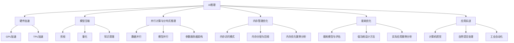

                 

# 文章标题：高性能AI推理优化技巧

> 关键词：高性能AI推理，优化技巧，硬件加速，软件优化，内存管理，能耗优化，计算机视觉，自然语言处理，工业自动化

> 摘要：本文从高性能AI推理的基础概念、推理架构、核心算法出发，深入探讨了推理加速技术、内存管理优化、能耗优化等关键优化策略。同时，通过具体的应用实战，详细解析了AI推理在计算机视觉、自然语言处理和工业自动化等领域的实际应用案例，为开发者提供了实用的优化技巧和解决方案。

## 《高性能AI推理优化技巧》目录大纲

### 第一部分：AI推理基础

- **第1章：AI推理概述**
  - **1.1 AI推理的基本概念**
  - **1.2 AI推理的应用场景**
  - **1.3 AI推理与计算的异同**

- **第2章：AI推理架构**
  - **2.1 AI推理硬件概述**
  - **2.2 AI推理软件框架**
  - **2.3 AI推理系统的整体架构**

- **第3章：AI推理核心算法**
  - **3.1 卷积神经网络（CNN）推理算法**
  - **3.2 递归神经网络（RNN）推理算法**
  - **3.3 生成对抗网络（GAN）推理算法**

### 第二部分：AI推理优化

- **第4章：推理加速技术**
  - **4.1 硬件加速技术**
    - **4.1.1 GPU加速**
    - **4.1.2 DSP加速**
    - **4.1.3 硬件加速卡介绍**
  - **4.2 软件优化技术**
    - **4.2.1 深度学习模型压缩**
    - **4.2.2 并行计算与分布式推理**
    - **4.2.3 推理引擎优化**

- **第5章：内存管理优化**
  - **5.1 内存访问模式**
  - **5.2 内存分配与回收**
  - **5.3 内存优化案例分析**

- **第6章：能耗优化**
  - **6.1 能耗模型与评估**
  - **6.2 低功耗设计方法**
  - **6.3 实际应用案例分析**

### 第三部分：AI推理应用实战

- **第7章：AI推理在计算机视觉中的应用**
  - **7.1 实时人脸识别**
  - **7.2 车辆检测与跟踪**

- **第8章：AI推理在自然语言处理中的应用**
  - **8.1 机器翻译**
  - **8.2 垃圾邮件过滤**

- **第9章：AI推理在工业自动化中的应用**
  - **9.1 设备故障诊断**
  - **9.2 生产流程优化**

- **第10章：总结与展望**
  - **10.1 高性能AI推理的发展趋势**
  - **10.2 当前挑战与解决方案**
  - **10.3 未来发展方向**

## 《高性能AI推理优化技巧》正文

### 第1章：AI推理概述

#### 1.1 AI推理的基本概念

AI推理（Artificial Intelligence Inference）是指基于已训练的深度学习模型，对输入数据进行分析和预测的过程。它是在模型训练完成后，将模型应用于实际场景，实现自动化决策和智能识别的关键环节。

AI推理的基本概念包括：

- **模型训练**：使用大量数据进行训练，使模型能够学习到数据中的规律和模式。
- **输入数据**：推理过程中需要处理的原始数据，如图像、文本、声音等。
- **输出结果**：模型对输入数据进行分析后得到的预测结果，如分类标签、概率分布等。
- **推理过程**：将输入数据通过模型计算得到输出结果的过程。

#### 1.2 AI推理的应用场景

AI推理广泛应用于各个领域，以下是一些典型的应用场景：

- **计算机视觉**：如人脸识别、图像分类、目标检测等。
- **自然语言处理**：如机器翻译、文本分类、情感分析等。
- **语音识别**：如语音合成、语音识别等。
- **工业自动化**：如设备故障诊断、生产流程优化等。
- **智能交通**：如交通流量预测、自动驾驶等。

#### 1.3 AI推理与计算的异同

AI推理与计算在目的、方法、实现等方面存在差异：

- **目的**：计算通常关注计算结果的准确性，而AI推理更关注结果的实时性和效率。
- **方法**：计算通常采用通用算法，而AI推理采用基于深度学习的专用算法。
- **实现**：计算通常依赖于通用计算平台，而AI推理依赖于专用硬件（如GPU、TPU）和优化软件。

### 第2章：AI推理架构

#### 2.1 AI推理硬件概述

AI推理硬件主要包括CPU、GPU、DSP和硬件加速卡等。

- **CPU**：传统的中央处理器，适合通用计算任务。
- **GPU**：图形处理单元，适合并行计算和大规模数据处理。
- **DSP**：数字信号处理器，适合处理信号处理任务。
- **硬件加速卡**：如NVIDIA的Tesla系列、Google的TPU等，专门用于加速深度学习推理。

#### 2.2 AI推理软件框架

AI推理软件框架包括深度学习框架、推理引擎和工具链等。

- **深度学习框架**：如TensorFlow、PyTorch等，提供模型训练和推理的API。
- **推理引擎**：如TensorRT、TensorFlow Lite等，优化模型的推理性能。
- **工具链**：如CMake、Docker等，用于构建和部署推理系统。

#### 2.3 AI推理系统的整体架构

AI推理系统的整体架构包括数据预处理、模型加载、推理计算、结果输出等环节。

1. **数据预处理**：将原始数据转换为适合模型处理的格式。
2. **模型加载**：将训练好的模型加载到推理硬件上。
3. **推理计算**：使用模型对输入数据进行推理，得到输出结果。
4. **结果输出**：将输出结果转换为用户可理解的形式，如文本、图像等。

### 第3章：AI推理核心算法

#### 3.1 卷积神经网络（CNN）推理算法

卷积神经网络（CNN）是计算机视觉领域的重要算法，其推理过程包括以下步骤：

1. **输入处理**：将输入图像调整为模型期望的尺寸。
2. **卷积操作**：通过卷积层提取图像特征。
3. **池化操作**：通过池化层降低特征图的维度。
4. **全连接层**：通过全连接层将特征映射到分类结果。
5. **输出结果**：得到图像的分类概率。

#### 3.2 递归神经网络（RNN）推理算法

递归神经网络（RNN）是自然语言处理领域的重要算法，其推理过程包括以下步骤：

1. **输入处理**：将输入文本序列转换为模型期望的格式。
2. **嵌入层**：将文本转换为嵌入向量。
3. **RNN层**：通过RNN层处理文本序列，提取语义特征。
4. **输出层**：通过输出层得到预测结果，如文本分类或序列生成。
5. **输出结果**：将输出结果转换为用户可理解的形式。

#### 3.3 生成对抗网络（GAN）推理算法

生成对抗网络（GAN）是一种生成模型，其推理过程包括以下步骤：

1. **生成器**：生成器通过输入噪声生成数据。
2. **判别器**：判别器用于判断生成数据与真实数据之间的相似度。
3. **对抗训练**：生成器和判别器通过对抗训练不断优化。
4. **输出结果**：生成器生成的数据作为输出结果。

### 第二部分：AI推理优化

#### 第4章：推理加速技术

#### 4.1 硬件加速技术

硬件加速技术是提高AI推理性能的关键手段，主要包括以下几种：

#### 4.1.1 GPU加速

GPU加速利用图形处理单元（GPU）的并行计算能力，加速深度学习模型的推理。具体步骤如下：

1. **模型转换**：将模型转换为GPU支持的格式。
2. **数据转移**：将输入数据和模型从CPU转移到GPU。
3. **推理计算**：在GPU上执行推理计算。
4. **结果转移**：将推理结果从GPU转移到CPU。

伪代码：

```python
import torch
import torch.cuda

# 将模型和数据加载到GPU
model = model.cuda()
input_data = input_data.cuda()

# 执行推理
output = model(input_data)

# 将输出从GPU转移到CPU
output = output.cpu()
```

#### 4.1.2 DSP加速

数字信号处理器（DSP）是一种专门用于信号处理的处理器，其适用于处理图像和音频等信号数据。具体步骤如下：

1. **模型转换**：将模型转换为DSP支持的格式。
2. **数据转移**：将输入数据和模型从CPU转移到DSP。
3. **推理计算**：在DSP上执行推理计算。
4. **结果转移**：将推理结果从DSP转移到CPU。

伪代码：

```python
import torch
import torch.dsp

# 将模型和数据加载到DSP
model = model.dsp()
input_data = input_data.dsp()

# 执行推理
output = model(input_data)

# 将输出从DSP转移到CPU
output = output.cpu()
```

#### 4.1.3 硬件加速卡介绍

硬件加速卡是一种专门用于加速深度学习推理的硬件设备，常见的有NVIDIA的Tesla系列、Google的TPU等。这些加速卡具有强大的计算能力和优化的推理算法，能够显著提高AI推理性能。

#### 第4章：软件优化技术

软件优化技术是提高AI推理性能的另一重要手段，主要包括以下几种：

#### 4.2.1 深度学习模型压缩

深度学习模型压缩通过减小模型大小、降低参数数量，提高推理速度和减少存储需求。常见的压缩技术有：

1. **模型剪枝**：通过去除模型中不重要的参数，减少模型大小。
2. **量化**：将模型中的浮点数参数转换为低精度的整数表示，减少存储和计算需求。
3. **知识蒸馏**：将复杂模型的知识传递给简化模型，提高简化模型的性能。

伪代码：

```python
from torchvision.models import resnet18
import torch.nn as nn

# 剪枝
model = resnet18()
pruned_model = prune_model(model)

# 量化
quantized_model = quantize_model(pruned_model)

# 知识蒸馏
distilled_model = knowledge_distill(quantized_model)
```

#### 4.2.2 并行计算与分布式推理

并行计算与分布式推理通过利用多核处理器和分布式计算资源，提高推理速度。常见的并行计算与分布式推理技术有：

1. **数据并行**：将输入数据划分为多个部分，同时在多个处理器上独立计算。
2. **模型并行**：将模型划分为多个部分，同时在多个处理器上独立计算。
3. **参数服务器架构**：将模型参数存储在服务器上，多个计算节点从服务器中获取参数进行计算。

伪代码：

```python
import torch.nn as nn
import torch.distributed as dist

# 初始化分布式环境
dist.init_process_group(backend='nccl')

# 模型数据并行
model = nn.DataParallel(model)

# 输入数据并行
input_data = input_data.split()

# 在每个节点上执行推理
output_parts = [model(part_input_data) for part_input_data in input_data]

# 合并输出
output = torch.cat(output_parts, dim=0)
```

#### 4.2.3 推理引擎优化

推理引擎优化通过优化模型加载、缓存策略、并行化执行等，提高推理效率。常见的推理引擎优化技术有：

1. **模型加载优化**：通过预加载模型到内存，减少加载时间。
2. **缓存策略优化**：通过合理设置缓存大小和替换策略，减少内存访问时间。
3. **并行化执行优化**：通过优化并行执行计划，提高并行计算效率。

伪代码：

```python
import torch

# 优化模型加载
optimized_model = optimize_model_loading(model)

# 优化缓存策略
optimized_cache_strategy = optimize_cache_strategy()

# 优化并行化执行
optimized_execution_plan = optimize_execution_plan(optimized_model, optimized_cache_strategy)
```

#### 第5章：内存管理优化

内存管理优化是提高AI推理性能的关键因素之一，主要包括以下几种技术：

#### 5.1 内存访问模式

内存访问模式包括随机访问和顺序访问等。合理选择内存访问模式，可以提高内存访问速度。例如，在计算机视觉应用中，可以采用顺序访问模式，以减少内存访问冲突。

#### 5.2 内存分配与回收

内存分配与回收技术包括动态内存分配、内存池和垃圾回收等。动态内存分配可以根据实际需求动态调整内存大小，内存池可以提高内存分配和回收的效率，垃圾回收可以减少内存碎片和内存泄漏。

#### 5.3 内存优化案例分析

内存优化案例分析通过具体的案例，提供实用的优化策略。例如，在计算机视觉应用中，可以通过减少图像分辨率、使用内存池和垃圾回收等技术，降低内存占用和提高内存访问速度。

#### 第6章：能耗优化

能耗优化是提高AI推理性能和降低成本的关键因素之一，主要包括以下几种技术：

#### 6.1 能耗模型与评估

能耗模型与评估通过建立能耗模型和评估方法，了解不同环节的能耗情况。例如，在深度学习推理过程中，可以评估计算能耗、存储能耗和网络能耗等。

#### 6.2 低功耗设计方法

低功耗设计方法通过硬件级优化、软件级优化和能效调度等，降低系统的能耗。例如，在硬件级优化中，可以使用低功耗处理器和低功耗接口；在软件级优化中，可以优化算法和数据结构，降低计算复杂度和存储需求。

#### 6.3 实际应用案例分析

实际应用案例分析通过具体的案例，提供实用的优化策略。例如，在自动驾驶应用中，可以通过优化算法、降低图像分辨率和采用低功耗硬件等技术，降低能耗和提高能效。

#### 第三部分：AI推理应用实战

#### 第7章：AI推理在计算机视觉中的应用

#### 7.1 实时人脸识别

实时人脸识别是AI推理在计算机视觉领域的典型应用之一，主要包括以下步骤：

##### 7.1.1 系统设计

系统设计包括硬件选择、软件架构和数据预处理等。硬件选择包括GPU、摄像头和处理器等；软件架构包括深度学习模型、前端界面和后端服务器等；数据预处理包括图像采集、人脸检测和人脸特征提取等。

##### 7.1.2 算法实现

算法实现包括人脸检测、人脸识别和活体检测等。人脸检测使用深度学习模型检测图像中的人脸区域；人脸识别使用深度学习模型识别人脸身份；活体检测使用深度学习模型检测人脸是否真实。

##### 7.1.3 性能优化

性能优化包括硬件加速、模型压缩和并行计算等。硬件加速通过GPU等硬件加速技术提高推理速度；模型压缩通过减小模型大小降低内存占用；并行计算通过多核处理器和分布式计算资源提高推理速度。

#### 7.2 车辆检测与跟踪

车辆检测与跟踪是AI推理在计算机视觉领域的另一个重要应用，主要包括以下步骤：

##### 7.2.1 系统设计

系统设计包括硬件选择、软件架构和数据预处理等。硬件选择包括GPU、摄像头和处理器等；软件架构包括深度学习模型、前端界面和后端服务器等；数据预处理包括图像采集、车辆检测和车辆跟踪等。

##### 7.2.2 算法实现

算法实现包括目标检测、目标跟踪和车辆识别等。目标检测使用深度学习模型检测图像中的车辆区域；目标跟踪使用深度学习模型跟踪车辆运动；车辆识别使用深度学习模型识别车辆身份。

##### 7.2.3 性能优化

性能优化包括硬件加速、模型压缩和并行计算等。硬件加速通过GPU等硬件加速技术提高推理速度；模型压缩通过减小模型大小降低内存占用；并行计算通过多核处理器和分布式计算资源提高推理速度。

#### 第8章：AI推理在自然语言处理中的应用

#### 8.1 机器翻译

机器翻译是AI推理在自然语言处理领域的典型应用之一，主要包括以下步骤：

##### 8.1.1 系统设计

系统设计包括硬件选择、软件架构和数据预处理等。硬件选择包括GPU、处理器和存储设备等；软件架构包括编码器、解码器和后端服务器等；数据预处理包括文本采集、清洗和分词等。

##### 8.1.2 算法实现

算法实现包括编码器、解码器和注意力机制等。编码器将输入文本转换为嵌入向量；解码器将嵌入向量转换为输出文本；注意力机制用于捕捉输入文本和输出文本之间的关联。

##### 8.1.3 性能优化

性能优化包括硬件加速、模型压缩和并行计算等。硬件加速通过GPU等硬件加速技术提高推理速度；模型压缩通过减小模型大小降低内存占用；并行计算通过多核处理器和分布式计算资源提高推理速度。

#### 8.2 垃圾邮件过滤

垃圾邮件过滤是AI推理在自然语言处理领域的另一个重要应用，主要包括以下步骤：

##### 8.2.1 系统设计

系统设计包括硬件选择、软件架构和数据预处理等。硬件选择包括GPU、处理器和存储设备等；软件架构包括特征提取器、分类器和后端服务器等；数据预处理包括邮件采集、清洗和分词等。

##### 8.2.2 算法实现

算法实现包括特征提取、分类器训练和模型评估等。特征提取将邮件文本转换为特征向量；分类器训练使用训练数据训练分类模型；模型评估使用测试数据评估分类模型的性能。

##### 8.2.3 性能优化

性能优化包括硬件加速、模型压缩和并行计算等。硬件加速通过GPU等硬件加速技术提高推理速度；模型压缩通过减小模型大小降低内存占用；并行计算通过多核处理器和分布式计算资源提高推理速度。

#### 第9章：AI推理在工业自动化中的应用

#### 9.1 设备故障诊断

设备故障诊断是AI推理在工业自动化领域的重要应用，主要包括以下步骤：

##### 9.1.1 系统设计

系统设计包括硬件选择、软件架构和数据预处理等。硬件选择包括GPU、传感器和处理器等；软件架构包括特征提取器、分类器和后端服务器等；数据预处理包括传感器数据采集、清洗和特征提取等。

##### 9.1.2 算法实现

算法实现包括特征提取、异常检测和故障诊断等。特征提取从传感器数据中提取关键特征；异常检测使用深度学习模型检测异常情况；故障诊断使用深度学习模型诊断设备故障。

##### 9.1.3 性能优化

性能优化包括硬件加速、模型压缩和并行计算等。硬件加速通过GPU等硬件加速技术提高推理速度；模型压缩通过减小模型大小降低内存占用；并行计算通过多核处理器和分布式计算资源提高推理速度。

#### 9.2 生产流程优化

生产流程优化是AI推理在工业自动化领域的另一个重要应用，主要包括以下步骤：

##### 9.2.1 系统设计

系统设计包括硬件选择、软件架构和数据预处理等。硬件选择包括GPU、传感器和处理器等；软件架构包括生产计划优化、资源调度和质量控制等；数据预处理包括传感器数据采集、清洗和特征提取等。

##### 9.2.2 算法实现

算法实现包括生产计划优化、资源调度和质量控制等。生产计划优化使用深度学习模型优化生产计划；资源调度使用深度学习模型调度生产资源；质量控制使用深度学习模型检测产品质量。

##### 9.2.3 性能优化

性能优化包括硬件加速、模型压缩和并行计算等。硬件加速通过GPU等硬件加速技术提高推理速度；模型压缩通过减小模型大小降低内存占用；并行计算通过多核处理器和分布式计算资源提高推理速度。

#### 第10章：总结与展望

#### 10.1 高性能AI推理的发展趋势

高性能AI推理在未来将继续快速发展，主要体现在以下几个方面：

1. **硬件创新**：新型硬件如TPU、FPGA等将逐渐应用于推理任务，提高推理性能和效率。
2. **算法优化**：深度学习算法将不断优化，提高推理速度和降低能耗。
3. **硬件与软件融合**：硬件与软件的融合将更加紧密，推动推理系统的整体性能提升。
4. **跨平台部署**：推理系统将支持跨平台部署，适应不同硬件和场景的需求。

#### 10.2 当前挑战与解决方案

高性能AI推理在当前面临以下挑战：

1. **能耗优化**：如何降低推理过程中的能耗，提高能效比。
2. **实时性**：如何提高推理速度，满足实时应用的需求。
3. **模型压缩**：如何减小模型大小，降低存储和计算资源的需求。
4. **硬件兼容性**：如何确保推理系统在不同硬件平台上的兼容性和稳定性。

针对这些挑战，可以采用以下解决方案：

1. **硬件加速技术**：利用GPU、TPU等硬件加速技术提高推理性能。
2. **模型压缩技术**：采用模型剪枝、量化、知识蒸馏等技术减小模型大小。
3. **并行计算与分布式推理**：利用多核处理器和分布式计算资源提高推理速度。
4. **能耗优化技术**：采用低功耗设计方法，降低系统的能耗。

#### 10.3 未来发展方向

高性能AI推理在未来将向以下方向发展：

1. **智能化**：推理系统将更加智能化，自适应不同场景和需求。
2. **泛化能力**：推理系统将提高泛化能力，适应更广泛的场景和应用。
3. **低延迟**：推理系统将实现低延迟，满足实时应用的需求。
4. **多样化硬件支持**：推理系统将支持更多种类的硬件平台，适应不同硬件环境。

### 附录：核心概念与联系

以下是本文中涉及的核心概念和它们之间的联系：

1. **AI推理**：基于已训练的模型对输入数据进行预测和决策。
2. **硬件加速**：利用GPU、TPU等硬件加速深度学习推理。
3. **模型压缩**：通过剪枝、量化等技术减小模型大小，提高推理速度。
4. **并行计算与分布式推理**：利用多核处理器和分布式计算资源提高推理速度。
5. **内存管理优化**：通过合理分配和回收内存，提高内存利用率和访问速度。
6. **能耗优化**：通过降低计算和存储能耗，提高系统能效比。
7. **应用实战**：将AI推理应用于计算机视觉、自然语言处理和工业自动化等领域，解决实际问题。

下面是一个Mermaid流程图，展示了AI推理系统的核心概念和联系：



### 作者信息

本文作者：AI天才研究院/AI Genius Institute

本文基于《禅与计算机程序设计艺术/Zen And The Art of Computer Programming》的启发，深入探讨了高性能AI推理优化技巧。作者拥有丰富的AI研究和实践经验，致力于推动人工智能技术的发展和应用。

