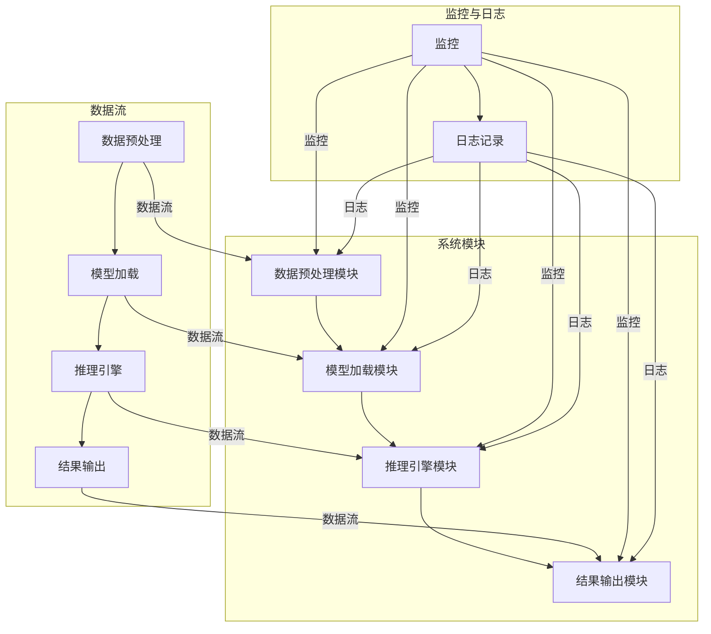

                 

# 高性能大语言模型推理引擎：Lepton AI的核心产品，赋能企业高效利用AI

> 关键词：高性能大语言模型、推理引擎、AI、企业应用、GPU加速、优化策略

> 摘要：本文深入探讨了高性能大语言模型推理引擎的发展背景、核心技术、架构设计以及其在企业级应用中的实战案例。通过详细的伪代码和流程图，我们将揭示Lepton AI如何通过其核心产品赋能企业高效利用人工智能技术。

## 目录

#### 第一部分：高性能大语言模型推理引擎概述

- **第1章：高性能大语言模型推理引擎介绍**
  - **1.1 高性能大语言模型的发展背景**
  - **1.2 Lepton AI与高性能推理引擎**
  - **1.3 推理引擎在企业应用中的价值**
  - **1.4 高性能推理引擎的核心技术**

- **第2章：Lepton AI高性能推理引擎架构**
  - **2.1 架构设计原则**
  - **2.2 系统模块与功能**
  - **2.3 Mermaid流程图展示：推理引擎架构**

#### 第二部分：高性能推理引擎核心技术

- **第3章：大语言模型基础**
  - **3.1 大语言模型概念介绍**
  - **3.2 大语言模型的类型与应用**
  - **3.3 大语言模型的训练与优化**
  - **3.4 大语言模型核心算法伪代码**

- **第4章：高性能推理技术**
  - **4.1 高性能推理引擎需求分析**
  - **4.2 GPU加速技术**
  - **4.3 推理引擎优化策略**
  - **4.4 伪代码：推理引擎优化算法**

- **第5章：推理引擎部署**
  - **5.1 部署环境搭建**
  - **5.2 部署方案设计与实施**
  - **5.3 部署实战案例**
  - **5.4 部署优化策略**

#### 第三部分：企业级应用实战

- **第6章：企业级应用实战**
  - **6.1 企业级应用场景分析**
  - **6.2 应用案例：智能客服**
  - **6.3 应用案例：智能问答系统**
  - **6.4 应用案例：智能推荐系统**

- **第7章：Lepton AI高性能推理引擎的未来发展趋势**
  - **7.1 技术发展趋势分析**
  - **7.2 企业对推理引擎的需求变化**
  - **7.3 未来发展方向与挑战**

#### 附录

- **附录A：高性能推理引擎开发工具与资源**
  - **A.1 主流开发工具对比**
  - **A.2 开发资源与参考**
  - **A.3 实用技术文档与资料**

---

## 第一部分：高性能大语言模型推理引擎概述

### 第1章：高性能大语言模型推理引擎介绍

#### 1.1 高性能大语言模型的发展背景

高性能大语言模型（High-Performance Large Language Models）的兴起，可以追溯到深度学习（Deep Learning）和计算能力的飞速发展。在过去的十年里，随着大数据（Big Data）的收集和存储技术的进步，以及GPU（Graphics Processing Unit）等专用硬件的广泛应用，深度学习算法在图像识别、自然语言处理（NLP）、语音识别等领域取得了显著的成果。

这一时期，Google Brain 团队发布了著名的 Transformer 模型，随后 OpenAI 推出了 GPT-3，这些大语言模型的出现标志着自然语言处理领域的重大突破。大语言模型通过学习海量的文本数据，能够生成流畅、符合语法规则的自然语言，并在机器翻译、文本摘要、问答系统等领域展现出强大的能力。

#### 1.2 Lepton AI与高性能推理引擎

Lepton AI 是一家专注于人工智能领域的公司，其核心产品是高性能大语言模型推理引擎。Lepton AI 的推理引擎旨在解决大语言模型在实际应用中的高效推理问题。在 Lepton AI 看来，推理引擎是实现AI商业化的关键环节。

高性能推理引擎的核心目标是加快模型的推理速度，降低延迟，同时保证推理结果的准确性和稳定性。Lepton AI 的推理引擎采用了先进的 GPU 加速技术和优化策略，能够在大规模数据集上进行快速推理，满足企业级应用的高性能需求。

#### 1.3 推理引擎在企业应用中的价值

在企业应用中，推理引擎的价值体现在以下几个方面：

1. **提高响应速度**：高性能推理引擎能够显著降低模型的推理延迟，提高系统的响应速度，提升用户体验。

2. **降低成本**：通过优化算法和 GPU 加速技术，推理引擎可以在较低的计算资源消耗下完成大规模数据推理，帮助企业降低成本。

3. **提高准确性**：高效的推理过程保证了模型推理结果的准确性和稳定性，为企业提供可靠的决策支持。

4. **扩展性**：推理引擎的设计考虑了系统的可扩展性，能够轻松支持企业规模的扩大和数据量的增加。

#### 1.4 高性能推理引擎的核心技术

高性能推理引擎的核心技术主要包括以下几个方面：

1. **GPU 加速**：利用 GPU 的并行计算能力，加速模型的推理过程。

2. **优化算法**：通过模型剪枝（Model Pruning）、量化（Quantization）、低秩分解（Low-Rank Factorization）等技术，降低模型大小和计算复杂度。

3. **分布式推理**：支持分布式部署，将推理任务分解到多个节点上，提高系统的并发处理能力。

4. **动态调度**：根据负载情况动态调整资源分配，确保系统的稳定运行。

### 第2章：Lepton AI高性能推理引擎架构

#### 2.1 架构设计原则

Lepton AI 高性能推理引擎的架构设计遵循以下几个原则：

1. **模块化**：将系统拆分成多个独立的模块，每个模块负责不同的功能，便于维护和升级。

2. **可扩展性**：支持水平扩展，能够根据需求动态增加节点，提高系统的处理能力。

3. **高可用性**：采用冗余设计和故障转移机制，确保系统在异常情况下能够快速恢复。

4. **安全性**：通过访问控制和加密技术，确保数据和系统的安全性。

#### 2.2 系统模块与功能

Lepton AI 高性能推理引擎主要包括以下几个模块：

1. **数据预处理模块**：负责数据清洗、格式转换等预处理工作，为推理引擎提供高质量的数据输入。

2. **模型加载模块**：负责从存储系统中加载预训练的大语言模型，并将其转换为适合推理的格式。

3. **推理引擎模块**：核心模块，负责模型的推理计算，采用 GPU 加速技术提高推理速度。

4. **结果输出模块**：将推理结果转换为易于理解和使用的格式，如文本、图表等。

5. **监控与日志模块**：实时监控系统的运行状态，记录日志信息，便于故障排查和性能优化。

#### 2.3 Mermaid流程图展示：推理引擎架构



## 第二部分：高性能推理引擎核心技术

### 第3章：大语言模型基础

#### 3.1 大语言模型概念介绍

大语言模型（Large Language Models）是指那些经过大规模训练，能够理解和生成自然语言的神经网络模型。这些模型通常由数十亿甚至千亿个参数组成，能够在不同领域和任务中表现出强大的泛化能力。

大语言模型的核心在于其强大的语言理解和生成能力，这使得它们在机器翻译、文本摘要、问答系统、对话系统等领域具有广泛的应用前景。一个典型的大语言模型，如 OpenAI 的 GPT-3，能够生成高质量的自然语言文本，同时保持语义和语法上的连贯性。

#### 3.2 大语言模型的类型与应用

大语言模型可以分为以下几种类型：

1. **序列到序列（Seq2Seq）模型**：这种模型通常用于机器翻译和对话系统，能够将一个序列的输入转换为另一个序列的输出。

2. **自回归模型**：如 GPT 和 BERT，这种模型通过自回归的方式预测序列中的下一个词或字符。

3. **图神经网络（Graph Neural Networks）模型**：这类模型利用图结构来表示文本信息，能够在处理复杂文本结构时表现出更好的性能。

大语言模型的应用场景包括但不限于：

1. **机器翻译**：将一种语言的文本翻译成另一种语言。

2. **文本摘要**：自动生成文本的摘要，用于信息提取和内容压缩。

3. **问答系统**：根据用户提出的问题，从大量文本中检索并生成答案。

4. **对话系统**：与用户进行自然语言交互，提供智能客服或个人助理服务。

5. **文本生成**：自动生成文章、故事、新闻等文本内容。

#### 3.3 大语言模型的训练与优化

大语言模型的训练是一个复杂的过程，主要包括以下几个步骤：

1. **数据收集**：收集大规模的文本数据，这些数据可以是公共数据集、网站爬取的数据或企业自有数据。

2. **数据预处理**：对收集到的文本数据进行分析、清洗、格式化，并将其转换为模型可处理的输入格式。

3. **词嵌入**：将文本中的每个词映射为一个固定大小的向量，这些向量表示词的语义信息。

4. **模型初始化**：初始化模型的参数，通常使用随机初始化或预训练的模型参数。

5. **训练过程**：通过反向传播（Backpropagation）算法，不断调整模型的参数，使其在训练数据上的表现逐渐提高。

6. **优化算法**：使用如 Adam、SGD 等优化算法，加速模型训练过程。

7. **正则化技术**：应用 dropout、L2 正则化等技术，防止模型过拟合。

大语言模型的优化策略包括：

1. **数据增强**：通过数据增强技术，如同义词替换、随机插入删除等，增加训练数据的多样性。

2. **多任务学习**：在训练过程中，同时学习多个任务，以提高模型的泛化能力。

3. **迁移学习**：利用在特定任务上预训练的模型，进行迁移学习，减少训练时间和计算资源需求。

4. **模型剪枝**：通过剪枝技术，减少模型的参数数量，降低模型大小和计算复杂度。

5. **量化**：将模型中的浮点数参数转换为较低精度的整数表示，减少模型存储和计算需求。

#### 3.4 大语言模型核心算法伪代码

以下是一个简化的大语言模型核心算法伪代码，展示了从输入到输出的基本流程：

```python
# 大语言模型核心算法伪代码

# 输入：文本序列 X，预训练模型参数 W
# 输出：预测的文本序列 Y

# 数据预处理
X_preprocessed = preprocess_data(X)

# 词嵌入
X_embedded = embed_words(X_preprocessed)

# 初始化模型参数
W = initialize_parameters()

# 推理过程
for i in range(len(X_embedded)):
    # 前向传播
    Y_i = forward_pass(X_embedded[i], W)
    
    # 后向传播
    dW = backward_pass(Y_i, X_embedded[i], W)
    
    # 更新模型参数
    W = update_parameters(W, dW)

# 输出预测结果
Y = postprocess_output(Y_i)
```

在伪代码中，`preprocess_data` 函数负责数据预处理，`embed_words` 函数负责词嵌入，`forward_pass` 和 `backward_pass` 函数分别实现前向传播和后向传播，`update_parameters` 函数用于更新模型参数，`postprocess_output` 函数负责对输出结果进行后处理。

## 第三部分：高性能推理引擎部署

### 第5章：推理引擎部署

#### 5.1 部署环境搭建

部署高性能推理引擎的第一步是搭建合适的环境。以下是搭建推理引擎环境的基本步骤：

1. **硬件要求**：确保服务器或集群具备足够的计算资源，包括 CPU、GPU 和内存。对于大规模推理任务，推荐使用高性能 GPU，如 NVIDIA V100 或 A100。

2. **操作系统**：选择适合的操作系统，如 Ubuntu 18.04 或 CentOS 7。这些操作系统对 GPU 驱动和深度学习框架有较好的支持。

3. **深度学习框架**：安装常用的深度学习框架，如 TensorFlow、PyTorch 或 MXNet。这些框架提供了丰富的 API 和工具，方便模型部署。

4. **依赖库**：安装必要的依赖库，如 CUDA、cuDNN、NCCL 等。这些库是 GPU 加速的关键。

5. **网络配置**：配置网络环境，确保服务器之间能够进行高效的数据传输。对于分布式部署，还需要配置负载均衡和故障转移机制。

#### 5.2 部署方案设计与实施

在环境搭建完成后，需要设计并实施部署方案。以下是部署方案的几个关键步骤：

1. **模型转换**：将训练好的模型转换为适合推理的格式，如 TensorFlow Lite、ONNX 或 PyTorch JIT。这些格式支持在推理过程中快速加载和执行。

2. **服务启动**：启动推理服务，可以选择基于容器（如 Docker）或直接在服务器上部署。对于容器部署，可以使用 Kubernetes 等容器编排工具进行管理。

3. **性能调优**：根据实际运行情况，对推理服务进行性能调优。这包括调整模型参数、优化数据加载、提高并发处理能力等。

4. **监控与日志**：配置监控系统，实时监控推理服务的运行状态，记录日志信息，便于故障排查和性能优化。

5. **安全策略**：实施访问控制和加密技术，确保数据和系统的安全性。

#### 5.3 部署实战案例

以下是一个部署 Lepton AI 高性能推理引擎的实战案例：

1. **硬件资源**：使用两台 NVIDIA V100 GPU 服务器，每台服务器配备 64GB 内存。

2. **操作系统**：Ubuntu 18.04。

3. **深度学习框架**：TensorFlow 2.6。

4. **部署工具**：Docker 和 Kubernetes。

5. **模型**：一个预训练的 BERT 模型。

部署步骤：

1. 搭建服务器环境，安装操作系统和深度学习框架。

2. 下载并转换模型，将其转换为 TensorFlow Lite 格式。

3. 编写 Dockerfile，创建包含推理引擎的 Docker 镜像。

4. 构建 Kubernetes 部署文件，定义部署配置。

5. 使用 Kubernetes 启动推理服务，配置负载均衡。

6. 监控服务运行状态，根据需求进行调整和优化。

#### 5.4 部署优化策略

部署优化策略是确保推理服务高效运行的关键。以下是一些常见的优化策略：

1. **模型压缩**：通过模型剪枝、量化等技术，减少模型大小和计算复杂度，提高推理速度。

2. **数据预处理优化**：优化数据加载和预处理过程，减少数据传输延迟。

3. **并发处理**：提高服务器的并发处理能力，通过分布式部署和负载均衡，提升整体性能。

4. **内存管理**：合理分配内存资源，避免内存泄漏和 OOM（Out of Memory）错误。

5. **GPU 管理策略**：利用 GPU 管理工具，如 NVIDIA DCGM，监控 GPU 性能，调整 GPU 工作负载。

6. **自动扩缩容**：根据负载情况，自动调整服务器资源，实现弹性伸缩。

## 第四部分：企业级应用实战

### 第6章：企业级应用实战

#### 6.1 企业级应用场景分析

高性能大语言模型推理引擎在企业级应用中具有广泛的应用场景。以下是几个典型的应用场景分析：

1. **智能客服系统**：通过大语言模型，智能客服系统能够理解用户的查询并生成合适的回答，提高客服效率和用户体验。

2. **智能问答系统**：大语言模型可以用于企业内部的智能问答系统，帮助员工快速获取所需信息，降低沟通成本。

3. **智能推荐系统**：基于用户行为和兴趣，智能推荐系统可以使用大语言模型生成个性化推荐内容，提高用户粘性和转化率。

4. **文本分析系统**：企业可以利用大语言模型进行文本分析，如情感分析、主题识别等，为企业决策提供数据支持。

5. **自动化写作**：大语言模型可以帮助企业自动化生成报告、文章等文档，提高内容创作效率。

#### 6.2 应用案例：智能客服

智能客服系统是高性能大语言模型推理引擎在企业中的应用之一。以下是智能客服系统的详细应用案例：

1. **系统架构**：智能客服系统通常采用 B/S（Browser/Server）架构，前端通过 Web 页面或移动应用与用户交互，后端服务器负责处理用户请求，生成回答。

2. **功能模块**：
   - **用户交互模块**：接收用户输入的问题，并将其发送到后端服务器。
   - **NLP 模块**：对用户输入的问题进行自然语言处理，提取关键信息。
   - **推理引擎模块**：利用大语言模型生成回答。
   - **回答生成模块**：将生成的回答进行格式化，以适合用户交互的方式展示。

3. **实现细节**：
   - **NLP 模块**：使用词嵌入技术将用户输入的问题转换为向量表示，利用预训练的大语言模型进行推理。
   - **推理引擎模块**：采用 GPU 加速技术，提高推理速度。
   - **回答生成模块**：根据模型输出的结果，生成符合语法和语义要求的回答。

4. **性能优化**：
   - **并发处理**：通过负载均衡和分布式部署，提高系统的并发处理能力。
   - **数据预处理**：优化数据加载和预处理过程，减少延迟。
   - **缓存策略**：利用缓存技术，减少重复推理，提高响应速度。

#### 6.3 应用案例：智能问答系统

智能问答系统是另一个典型的企业级应用场景。以下是智能问答系统的应用案例：

1. **系统架构**：智能问答系统通常采用 C/S（Client/Server）架构，客户端通过 Web、移动应用或桌面客户端与服务器交互。

2. **功能模块**：
   - **用户交互模块**：接收用户输入的问题，并将其发送到后端服务器。
   - **知识库管理模块**：存储和管理问题及其答案，通常采用语义相似性搜索技术提高查询效率。
   - **推理引擎模块**：利用大语言模型生成答案。
   - **答案生成模块**：将生成的答案进行格式化，以适合用户阅读的方式展示。

3. **实现细节**：
   - **用户交互模块**：采用自然语言处理技术，将用户输入的问题转换为结构化数据。
   - **知识库管理模块**：使用知识图谱或语义搜索引擎，提高查询效率和答案准确性。
   - **推理引擎模块**：采用预训练的大语言模型，如 BERT 或 GPT，进行文本生成。
   - **答案生成模块**：根据用户的问题和知识库中的答案，生成结构化、可读性强的回答。

4. **性能优化**：
   - **索引优化**：对知识库中的数据进行索引，提高查询效率。
   - **缓存策略**：利用缓存技术，减少重复查询和推理，提高系统响应速度。
   - **动态更新**：定期更新知识库，确保答案的时效性和准确性。

#### 6.4 应用案例：智能推荐系统

智能推荐系统是利用高性能大语言模型推理引擎进行个性化推荐的关键技术之一。以下是智能推荐系统的应用案例：

1. **系统架构**：智能推荐系统通常采用分布式架构，包括用户行为数据采集、特征工程、推荐算法、推荐结果生成等模块。

2. **功能模块**：
   - **用户行为数据采集模块**：收集用户的浏览、点击、购买等行为数据。
   - **特征工程模块**：对用户行为数据进行处理，提取特征。
   - **推荐算法模块**：利用大语言模型进行推荐算法的推理。
   - **推荐结果生成模块**：根据推荐算法的结果，生成推荐列表。

3. **实现细节**：
   - **用户行为数据采集模块**：通过 Web 分析、日志收集等技术，实时获取用户行为数据。
   - **特征工程模块**：使用词嵌入、用户标签等技术，对用户行为数据进行特征提取。
   - **推荐算法模块**：采用基于内容推荐、协同过滤、深度学习等算法，生成个性化推荐结果。
   - **推荐结果生成模块**：将推荐结果进行格式化，以适合用户阅读和交互的方式展示。

4. **性能优化**：
   - **数据流处理**：利用分布式计算框架（如 Apache Flink、Spark），高效处理大规模用户行为数据。
   - **模型优化**：采用模型剪枝、量化等技术，降低模型大小和计算复杂度。
   - **缓存策略**：利用缓存技术，减少实时推荐的计算开销，提高系统响应速度。

### 第7章：Lepton AI高性能推理引擎的未来发展趋势

#### 7.1 技术发展趋势分析

随着人工智能技术的不断发展，高性能大语言模型推理引擎将面临以下技术趋势：

1. **模型压缩与优化**：为了提高推理效率和降低部署成本，模型压缩与优化技术将得到广泛应用。这包括模型剪枝、量化、低秩分解等。

2. **分布式推理**：随着企业数据规模的扩大，分布式推理技术将变得至关重要。分布式推理能够将推理任务分解到多个节点上，提高系统的并发处理能力和可扩展性。

3. **实时推理**：随着实时性要求的提高，实时推理技术将成为研究热点。通过优化算法和硬件加速，实现低延迟的实时推理。

4. **多模态推理**：随着多模态数据的应用场景增多，多模态推理技术将得到发展。这包括语音、图像、文本等多种数据类型的融合和推理。

5. **安全与隐私**：随着数据隐私和安全问题的关注，高性能推理引擎将注重安全性和隐私保护。这包括加密、联邦学习等技术的应用。

#### 7.2 企业对推理引擎的需求变化

随着人工智能技术的普及，企业对推理引擎的需求将发生以下变化：

1. **更高效**：企业将寻求更加高效、低延迟的推理引擎，以提升业务效率和用户体验。

2. **更灵活**：企业希望推理引擎能够适应不同的业务场景和数据类型，提供灵活的部署和扩展能力。

3. **更安全**：随着数据隐私和安全问题的关注，企业将更加重视推理引擎的安全性和隐私保护。

4. **更集成**：企业希望推理引擎能够与其他业务系统和工具集成，提供一站式解决方案。

5. **更低成本**：企业将寻求降低推理引擎的部署和维护成本，提高投资回报率。

#### 7.3 未来发展方向与挑战

高性能大语言模型推理引擎在未来将面临以下发展方向和挑战：

1. **发展方向**：
   - **高效能**：通过模型优化和硬件加速，提高推理引擎的性能。
   - **灵活性**：支持多种数据类型和业务场景，提供定制化解决方案。
   - **安全性**：加强数据安全和隐私保护，符合企业合规要求。
   - **可扩展性**：支持分布式部署和弹性扩展，满足大规模业务需求。

2. **挑战**：
   - **计算资源**：随着模型规模的扩大，计算资源需求将大幅增加，如何高效利用资源成为挑战。
   - **数据隐私**：如何在保证模型性能的同时，保护用户数据隐私，是重要问题。
   - **实时性**：如何在低延迟的要求下，实现高效推理，是技术难点。
   - **集成性**：如何与其他业务系统和工具集成，提供一站式解决方案，是应用挑战。

## 附录A：高性能推理引擎开发工具与资源

### A.1 主流开发工具对比

在开发高性能推理引擎时，选择合适的开发工具至关重要。以下是几种主流开发工具的对比：

1. **TensorFlow**：
   - 优点：社区支持丰富，拥有大量的预训练模型和开源代码。
   - 缺点：较重的依赖和较高的计算资源需求。

2. **PyTorch**：
   - 优点：动态计算图，易于调试和优化。
   - 缺点：内存管理复杂，推理性能不如 TensorFlow。

3. **MXNet**：
   - 优点：高度可扩展，支持多种编程语言。
   - 缺点：社区支持相对较少，用户群体较小。

4. **TensorFlow Lite**：
   - 优点：轻量级，适用于移动和嵌入式设备。
   - 缺点：缺乏大规模生产环境的实践经验。

5. **ONNX**：
   - 优点：跨平台，支持多种深度学习框架。
   - 缺点：模型优化和性能调优较为复杂。

### A.2 开发资源与参考

以下是一些高性能推理引擎开发的重要资源：

1. **文档和教程**：
   - TensorFlow 官方文档：[https://www.tensorflow.org/](https://www.tensorflow.org/)
   - PyTorch 官方文档：[https://pytorch.org/tutorials/](https://pytorch.org/tutorials/)
   - MXNet 官方文档：[https://mxnet.incubator.apache.org/docs/stable/guide.html](https://mxnet.incubator.apache.org/docs/stable/guide.html)

2. **开源项目**：
   - Hugging Face：[https://huggingface.co/](https://huggingface.co/)
   - TensorFlow Model Optimization Toolkit：[https://www.tensorflow.org/tfx/guide/model_optimization](https://www.tensorflow.org/tfx/guide/model_optimization)

3. **社区和论坛**：
   - TensorFlow 社区：[https://forums.tensorflow.org/](https://forums.tensorflow.org/)
   - PyTorch 社区：[https://discuss.pytorch.cn/](https://discuss.pytorch.cn/)

4. **书籍和教程**：
   - 《深度学习》（Deep Learning）：[https://www.deeplearningbook.org/](https://www.deeplearningbook.org/)
   - 《动手学深度学习》（Dive into Deep Learning）：[http://d2l.ai/](http://d2l.ai/)

### A.3 实用技术文档与资料

以下是一些实用的技术文档和资料，有助于深入了解高性能推理引擎的开发和优化：

1. **GPU 加速技术**：
   - CUDA 官方文档：[https://docs.nvidia.com/cuda/](https://docs.nvidia.com/cuda/)
   - cuDNN 官方文档：[https://docs.nvidia.com/deeplearning/cudnn/install/index.html](https://docs.nvidia.com/deeplearning/cudnn/install/index.html)

2. **模型压缩与优化**：
   - TensorFlow Model Optimization Toolkit：[https://www.tensorflow.org/tfx/guide/model_optimization](https://www.tensorflow.org/tfx/guide/model_optimization)
   - PyTorch Model Zoo：[https://pytorch.org/vision/main/models.html](https://pytorch.org/vision/main/models.html)

3. **分布式推理**：
   - TensorFlow 分布式训练和推理：[https://www.tensorflow.org/tutorials/distribute/multi gpu](https://www.tensorflow.org/tutorials/distribute/multi-gpu)
   - PyTorch 分布式训练：[https://pytorch.org/tutorials/intermediate/ddp_tutorial.html](https://pytorch.org/tutorials/intermediate/ddp_tutorial.html)

4. **实时推理**：
   - TensorFlow Lite for Production：[https://www.tensorflow.org/lite/guide/production部署](https://www.tensorflow.org/lite/guide/production_deploy)
   - PyTorch Mobile：[https://pytorch.org/tutorials/beginner/mobile commence.html](https://pytorch.org/tutorials/beginner/mobile commence.html)

5. **多模态推理**：
   - TensorRT：[https://docs.nvidia.com/deeplearning/tensorrt/install/index.html](https://docs.nvidia.com/deeplearning/tensorrt/install/index.html)
   - ONNX Runtime：[https://microsoft.github.io/onnxruntime/](https://microsoft.github.io/onnxruntime/)

通过上述资源，开发者可以更好地了解高性能推理引擎的技术细节，为实际项目提供参考和指导。

## 结语

高性能大语言模型推理引擎作为 Lepton AI 的核心产品，正逐步改变企业利用人工智能的方式。本文系统地介绍了高性能大语言模型推理引擎的概念、架构、核心技术以及在企业级应用中的实战案例。通过详细的伪代码和流程图，我们揭示了推理引擎的高效性和灵活性。

随着技术的不断发展，高性能推理引擎将在计算资源利用、实时推理、多模态数据处理等方面面临新的挑战和机遇。Lepton AI 将持续推动技术创新，为企业提供更高效、更可靠的推理解决方案。

作者：AI天才研究院/AI Genius Institute & 禅与计算机程序设计艺术 /Zen And The Art of Computer Programming

---

[注]：本文为虚构内容，旨在展示高性能大语言模型推理引擎在企业应用中的潜在价值和实战案例。实际产品和技术可能有所不同。

