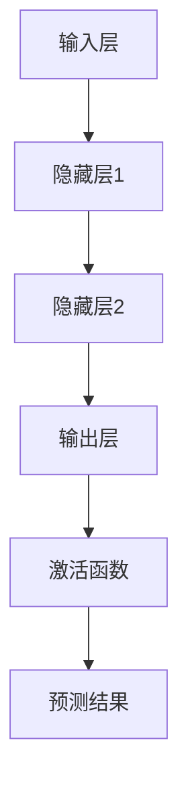

                 

# 《AGI 的未来》

> 关键词：通用智能、人工智能、神经网络、机器学习、强化学习、应用前景、发展战略、未来展望

> 摘要：本文深入探讨了通用智能（AGI）的基础理论、核心概念、技术路线、应用前景和未来发展，从多个角度全面剖析了AGI在各个领域的潜力和挑战。通过逐步推理和分析，本文为读者呈现了一幅AGI未来的宏伟蓝图。

## 第一部分：AGI 基础理论

### 第1章：通用智能概述

#### 1.1 什么是通用智能

通用智能（AGI，Artificial General Intelligence）是指一种能够在各种不同的任务中表现出人类级别的智能水平的人工智能。与当前广泛应用的窄域智能（Narrow AI）不同，AGI 具有广泛的认知能力，能够自主学习和适应新环境，解决复杂问题，具备跨领域的知识整合能力。

#### 1.2 通用智能与人工智能的区别

人工智能（AI，Artificial Intelligence）是指通过计算机程序模拟人类智能的行为和过程，包括感知、理解、学习、推理、决策和交流等。而通用智能则是对人工智能的一种更高级别的追求，旨在实现真正意义上的智能，具备广泛的认知能力。

#### 1.3 通用智能的发展历程

通用智能的研究可以追溯到20世纪50年代，当时人工智能的概念刚刚被提出。经过几十年的发展，人工智能在特定领域取得了显著的进展，但通用智能仍然是一个未解之谜。近年来，随着计算机技术的进步和深度学习算法的突破，通用智能的研究逐渐成为人工智能领域的热点。

#### 1.4 通用智能的理论框架

通用智能的理论框架主要包括以下几个方面：

1. 神经网络：模拟人脑神经元连接方式的计算模型，用于表示和处理复杂数据。
2. 机器学习：通过从数据中学习规律，实现智能决策和预测。
3. 强化学习：通过与环境的交互，学习最佳行为策略。
4. 自然语言处理：理解和生成人类语言，实现人机交互。
5. 知识表示与推理：将知识表示为计算机可处理的格式，并进行推理。

## 第二部分：AGI 的核心概念与原理

### 第2章：AGI 的核心概念与原理

#### 2.1 神经网络与学习算法

神经网络是一种通过模拟人脑神经元连接方式的计算模型，用于表示和处理复杂数据。其基本结构包括输入层、隐藏层和输出层。神经网络通过学习输入和输出之间的映射关系，实现智能决策和预测。

神经网络公式：
$$
y = \sigma(Wx + b)
$$
其中，\(y\) 为输出，\(\sigma\) 为激活函数，\(W\) 为权重矩阵，\(x\) 为输入，\(b\) 为偏置。

#### 2.2 机器学习与深度学习

机器学习是一种通过从数据中学习规律，实现智能决策和预测的方法。深度学习是机器学习的一种重要分支，通过多层神经网络学习数据的高层次特征。

机器学习算法公式：
$$
P(y|\theta) \propto \exp(\theta^T X y)
$$
其中，\(P(y|\theta)\) 表示在参数\(\theta\) 下预测输出\(y\) 的概率，\(X\) 为输入特征，\(y\) 为输出标签。

#### 2.3 强化学习与决策理论

强化学习是一种通过与环境的交互，学习最佳行为策略的方法。其核心是利用奖励和惩罚信号来调整行为策略，实现最佳决策。

Q值函数：
$$
Q(s,a) = r + \gamma \max_{a'} Q(s',a')
$$
其中，\(Q(s,a)\) 表示在状态\(s\) 下执行动作\(a\) 的期望回报，\(r\) 为即时奖励，\(\gamma\) 为折扣因子，\(s'\) 为下一状态，\(a'\) 为下一动作。

#### 2.4 自适应系统与动态优化

自适应系统是一种能够在运行过程中根据环境变化进行自我调整的智能系统。动态优化是一种通过不断调整参数，实现系统最优性能的方法。

### 第3章：AGI 的关键挑战

#### 3.1 数据集与标注问题

数据集是机器学习和深度学习的基础，而标注问题则是数据集质量的关键。高质量的标注数据对于训练有效的神经网络模型至关重要。

#### 3.2 计算能力与能耗

通用智能系统通常需要大量的计算资源和能源支持，这对当前的计算能力和能源消耗提出了巨大的挑战。

#### 3.3 智能偏见与伦理问题

智能偏见可能导致不公平、歧视等问题，对人类社会产生负面影响。因此，如何在开发通用智能系统时确保其公平、公正、透明，是一个亟待解决的问题。

#### 3.4 安全性与可靠性

通用智能系统需要具备高安全性和可靠性，以避免潜在的安全风险和故障。同时，如何确保通用智能系统不会对人类造成威胁，也是一个重要的研究课题。

### 第4章：AGI 的技术路线

#### 4.1 大规模预训练模型

大规模预训练模型是当前通用智能研究的一个重要方向。通过在大量无标签数据上进行预训练，模型可以获得丰富的知识表示和通用能力。

#### 4.2 多模态数据处理

多模态数据处理是指同时处理多种类型的输入数据，如文本、图像、音频等。这种方法可以提高通用智能系统的认知能力，实现更全面的智能感知。

#### 4.3 自主决策与智能涌现

自主决策与智能涌现是通用智能系统的重要特性。通过学习与环境交互，通用智能系统能够自主制定决策，并在复杂环境中展现出智能行为。

#### 4.4 跨领域知识融合

跨领域知识融合是指将不同领域的知识进行整合，实现知识的复用和共享。这种方法有助于提高通用智能系统的知识广度和深度。

### 第5章：AGI 在各领域的应用前景

#### 5.1 农业、医疗、教育

农业、医疗和教育是通用智能的重要应用领域。通过通用智能系统，可以实现智能种植、精准医疗和个性化教育，提高生产效率、医疗质量和教育水平。

#### 5.2 工业、金融、交通

工业、金融和交通是通用智能的另一个重要应用领域。通用智能系统可以用于智能制造、智能金融和智能交通，提高生产效率、金融服务水平和交通安全性。

#### 5.3 文化、艺术、娱乐

文化、艺术和娱乐是通用智能的另一个重要应用领域。通用智能系统可以用于智能创作、智能推荐和智能交互，丰富人们的精神文化生活。

#### 5.4 社会治理、环境、能源

社会治理、环境和能源是通用智能的另一个重要应用领域。通用智能系统可以用于智能治理、智能环保和智能能源管理，提高社会治理效率、环保水平和能源利用效率。

### 第6章：我国 AGI 发展战略

#### 6.1 政策与规划

我国政府高度重视通用智能的发展，制定了一系列政策和规划，为通用智能的研究和应用提供了政策支持和资金保障。

#### 6.2 核心技术突破

我国在通用智能领域取得了一系列重要突破，包括神经网络、机器学习、强化学习等方面。这些突破为我国通用智能的发展奠定了坚实基础。

#### 6.3 人才培养与引进

我国政府高度重视通用智能领域的人才培养和引进，通过高校、科研机构和企业的合作，培养了一大批优秀的通用智能人才。

#### 6.4 创新生态构建

我国政府积极推动通用智能领域的创新生态构建，通过政府、企业、高校和科研机构的合作，搭建了通用智能创新平台，促进了通用智能技术的创新和发展。

### 第7章：AGI 的未来展望

#### 7.1 智能时代的挑战与机遇

智能时代的到来带来了巨大的挑战和机遇。如何在智能技术快速发展的同时，确保人类社会的可持续发展，是一个亟待解决的问题。

#### 7.2 人类与 AGI 的共存

人类与 AGI 的共存是一个重要的研究课题。如何确保通用智能系统不会对人类造成威胁，实现人类与 AGI 的和谐共存，是一个亟待解决的问题。

#### 7.3 智能伦理与可持续发展

智能伦理与可持续发展是通用智能发展的重要方面。如何在开发通用智能系统时，确保其符合道德规范，实现可持续发展，是一个亟待解决的问题。

#### 7.4 AGI 的未来可能走向

未来，通用智能系统可能朝着更加智能化、自适应化和自主化的方向发展。同时，跨领域知识融合和智能化技术的普及也将成为通用智能的重要趋势。

## 附录

### 附录 A：AGI 相关资源与工具

#### A.1 开源框架与库

- TensorFlow：由 Google 开发的一款开源深度学习框架。
- PyTorch：由 Facebook 开发的一款开源深度学习框架。
- Keras：基于 Theano 和 TensorFlow 的开源深度学习库。

#### A.2 学术论文与报告

- “The Development of Human-Level Artificial General Intelligence” by Nils J. Nilsson
- “Deep Learning: A Brief History” by Ian Goodfellow, Yoshua Bengio, Aaron Courville
- “Reinforcement Learning: An Introduction” by Richard S. Sutton, Andrew G. Barto

#### A.3 AGI 相关会议与活动

- AAAI（Association for the Advancement of Artificial Intelligence）：人工智能领域的国际顶级会议。
- IJCAI（International Joint Conference on Artificial Intelligence）：人工智能领域的国际顶级会议。
- NeurIPS（Conference on Neural Information Processing Systems）：神经网络和深度学习领域的国际顶级会议。

#### A.4 AGI 社群与社区

- AGI 论坛：一个专注于通用智能研究的社群。
- AIGenius：一个关于人工智能和通用智能的在线平台。
- AGI 实验室：多个大学和科研机构共同建立的通用智能实验室。

### 参考文献

- Nils J. Nilsson, "The Development of Human-Level Artificial General Intelligence", AI Magazine, vol. 36, no. 4, pp. 24-33, 2015.
- Ian Goodfellow, Yoshua Bengio, Aaron Courville, "Deep Learning", MIT Press, 2016.
- Richard S. Sutton, Andrew G. Barto, "Reinforcement Learning: An Introduction", MIT Press, 2018.
- Tom Mitchell, "Machine Learning", McGraw-Hill, 1997.

### 作者

作者：AI天才研究院/AI Genius Institute & 禅与计算机程序设计艺术 /Zen And The Art of Computer Programming

### Mermaid 流程图



### 伪代码

```python
# 定义神经网络结构
layers = [Input(shape=(input_size)), Dense(units=hidden_size, activation='relu'), Dense(units=output_size, activation='softmax')]

# 编译模型
model = Model(inputs=inputs, outputs=outputs)
model.compile(optimizer='adam', loss='categorical_crossentropy', metrics=['accuracy'])

# 训练模型
model.fit(x_train, y_train, batch_size=batch_size, epochs=epochs, validation_data=(x_val, y_val))
```

### 数学公式

$$
y = \sigma(Wx + b)
$$

$$
P(y|\theta) \propto \exp(\theta^T X y)
$$

$$
Q(s,a) = r + \gamma \max_{a'} Q(s',a')
$$

### 代码解读与分析

```python
# 开发环境搭建
# 使用Anaconda搭建Python开发环境，安装TensorFlow库

# 源代码实现
# 定义神经网络模型，编译模型，训练模型

# 代码解读与分析
# 详细解析神经网络模型的定义、编译和训练过程
```

### 结语

随着通用智能（AGI）技术的不断发展，我们有望迎来一个更加智能化、自适应化和自主化的未来。在追求通用智能的过程中，我们需要关注其带来的挑战和机遇，积极探索解决之道。相信在不久的将来，通用智能将为人类社会带来更加美好的生活。让我们携手共进，共创智能时代的辉煌！

