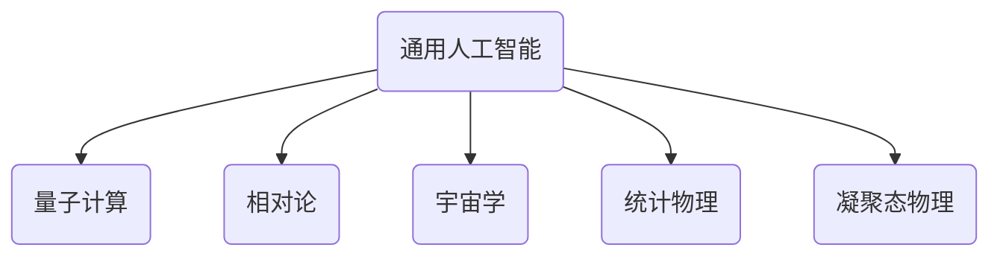

                 

# 《AGI在理论物理中的角色》

## 关键词
人工智能，通用智能，理论物理，量子计算，相对论，宇宙学，统计物理，凝聚态物理

## 摘要
本文探讨了人工智能中的通用智能（AGI）在理论物理领域中的角色和影响。首先，我们介绍了什么是通用智能及其与理论物理的联系。接着，本文详细解析了通用智能的基本原理，包括其核心概念、关键技术及其数学和算法基础。然后，我们探讨了通用智能在量子计算、相对论、宇宙学、统计物理和凝聚态物理等多个领域的具体应用。最后，本文总结了通用智能在理论物理中的潜在前景、挑战与机遇，并对未来发展趋势进行了展望。

## 《AGI在理论物理中的角色》目录大纲

### 第一部分：引言与背景

#### 1.1 引言
##### 1.1.1 什么是AGI
##### 1.1.2 AGI与理论物理的联系
##### 1.1.3 本书结构

### 第二部分：AGI的基本原理

#### 2.1 AGI的核心概念
##### 2.1.1 强人工智能与弱人工智能
##### 2.1.2 AGI的关键技术
##### 2.1.3 AGI的进展与挑战

#### 2.2 AGI的数学与算法基础
##### 2.2.1 神经网络
##### 2.2.2 强化学习
##### 2.2.3 自然语言处理

### 第三部分：AGI在理论物理中的应用

#### 3.1 AGI与量子计算
##### 3.1.1 量子计算的数学基础
##### 3.1.2 量子计算的模拟与优化
##### 3.1.3 量子计算中的AGI应用

#### 3.2 AGI与相对论
##### 3.2.1 相对论的基本原理
##### 3.2.2 AGI在相对论中的应用
##### 3.2.3 相对论中的AGI算法

#### 3.3 AGI与宇宙学
##### 3.3.1 宇宙学的基本概念
##### 3.3.2 AGI在宇宙学中的应用
##### 3.3.3 宇宙学中的AGI算法

### 第四部分：AGI与理论物理的交叉领域

#### 4.1 AGI与统计物理
##### 4.1.1 统计物理的基本原理
##### 4.1.2 AGI在统计物理中的应用
##### 4.1.3 统计物理中的AGI算法

#### 4.2 AGI与凝聚态物理
##### 4.2.1 凝聚态物理的基本原理
##### 4.2.2 AGI在凝聚态物理中的应用
##### 4.2.3 凝聚态物理中的AGI算法

### 第五部分：AGI在理论物理中的未来前景

#### 5.1 AGI在理论物理中的潜在应用
##### 5.1.1 新的科学发现
##### 5.1.2 更有效的理论研究
##### 5.1.3 对未来技术的影响

#### 5.2 AGI与理论物理的挑战与机遇
##### 5.2.1 挑战
##### 5.2.2 机遇
##### 5.2.3 未来发展趋势

### 第六部分：结论与展望

#### 6.1 本书总结
##### 6.1.1 AGI在理论物理中的地位
##### 6.1.2 成就与贡献
##### 6.1.3 展望未来

#### 6.2 附录
##### 6.2.1 参考文献
##### 6.2.2 相关资源与网站

## 第一部分：引言与背景

### 1.1 引言

#### 1.1.1 什么是AGI

通用人工智能（Artificial General Intelligence，简称AGI）是一种旨在模拟人类智能的人工智能系统，它能够理解、学习和适应各种环境和任务，而不仅仅是单一的任务或特定领域的问题。与弱人工智能（Narrow AI）不同，AGI追求的是一种更广泛、更复杂、更具有适应性的智能形式。

#### 1.1.2 AGI与理论物理的联系

理论物理是研究自然世界最基本规律的科学，它涉及从量子力学到相对论，再到宇宙学的众多领域。AGI在理论物理中的角色体现在其能够帮助解决理论物理中的复杂问题，以及为理论物理研究提供新的工具和方法。

首先，AGI可以在理论物理的研究过程中提供强大的计算能力。例如，量子计算的模拟和优化是理论物理研究中的关键步骤，但这个过程通常需要巨大的计算资源。AGI可以通过优化算法和分布式计算，大幅提高量子计算的效率和准确性。

其次，AGI可以帮助物理学家理解和处理复杂的数据。现代物理学研究中，大量的实验数据需要被处理和分析，AGI可以通过机器学习算法，自动识别数据中的模式，从而帮助物理学家发现新的物理规律。

最后，AGI还可以在理论物理的假设验证中发挥作用。理论物理的研究往往建立在一系列假设之上，AGI可以通过模拟和预测，验证这些假设的正确性，从而推动物理理论的进步。

#### 1.1.3 本书结构

本文将分为六个部分。第一部分是引言与背景，介绍AGI和理论物理的基本概念及其联系。第二部分将详细探讨AGI的基本原理，包括其核心概念、关键技术以及数学和算法基础。第三部分至第五部分将分别探讨AGI在量子计算、相对论、宇宙学、统计物理和凝聚态物理等领域的具体应用。第六部分将总结AGI在理论物理中的地位和贡献，并对未来发展趋势进行展望。

### 1.2 AGI的基本原理

#### 2.1 AGI的核心概念

##### 2.1.1 强人工智能与弱人工智能

强人工智能（Strong AI）是指能够像人类一样理解、学习、推理和解决问题的计算机系统。与之相对的是弱人工智能（Narrow AI），它只能解决特定领域的问题，如语音识别、图像识别等。

##### 2.1.2 AGI的关键技术

要实现AGI，需要掌握一系列关键技术，包括：

- **神经网络**：神经网络是一种模拟人脑神经元连接结构的计算模型，它可以用来处理复杂的输入数据，并从中学习规律。

- **强化学习**：强化学习是一种通过试错和奖励机制来学习任务的方法。它使计算机能够在未知环境中自主学习，并逐步优化其行为。

- **自然语言处理**：自然语言处理（NLP）是使计算机能够理解、生成和响应人类语言的技术。

- **知识图谱**：知识图谱是一种将信息组织和表示为图结构的技术，它可以用于表示和推理复杂的知识关系。

##### 2.1.3 AGI的进展与挑战

AGI的研究已经取得了一系列进展，如深度学习、生成对抗网络（GAN）等算法的提出和应用。然而，要实现真正的AGI，仍然面临着许多挑战，包括：

- **计算能力**：AGI需要强大的计算能力来处理复杂的数据和任务。

- **数据集**：AGI的训练需要大量的高质量数据集，但目前数据集的获取和处理仍然是一个挑战。

- **算法优化**：现有的算法需要进一步优化，以提高其效率和准确性。

- **伦理和安全性**：AGI的发展也带来了一系列伦理和安全问题，如隐私保护、人工智能武器化等。

### 2.2 AGI的数学与算法基础

#### 2.2.1 神经网络

神经网络是一种模拟人脑神经元连接结构的计算模型，它可以用于图像识别、语音识别、自然语言处理等多种应用。

- **基本结构**：神经网络由多个层次组成，包括输入层、隐藏层和输出层。每个层次包含多个神经元，神经元之间通过权重连接。

- **工作原理**：输入数据通过输入层进入网络，然后经过隐藏层的处理，最终在输出层产生输出结果。神经元的激活函数用于决定神经元是否被激活。

- **训练过程**：神经网络通过反向传播算法进行训练，即根据输出结果和目标值的差异，调整神经元的权重，以最小化误差。

#### 2.2.2 强化学习

强化学习是一种通过试错和奖励机制来学习任务的方法，它在无人驾驶、游戏AI等领域有广泛应用。

- **基本概念**：强化学习包括四个主要元素：环境（Environment）、状态（State）、动作（Action）和奖励（Reward）。智能体（Agent）在环境中通过选择动作来获取奖励，并不断优化其策略。

- **工作原理**：强化学习通过迭代过程，智能体在环境中进行动作，观察环境反馈的奖励，并不断调整其策略以最大化长期奖励。

- **算法类型**：强化学习包括值函数方法（如Q学习）和政策梯度方法（如深度Q网络（DQN））等。

#### 2.2.3 自然语言处理

自然语言处理是一种使计算机能够理解、生成和响应人类语言的技术，它在机器翻译、问答系统、文本分类等领域有广泛应用。

- **基本概念**：自然语言处理包括文本预处理、词嵌入、语法分析、语义理解等多个阶段。

- **工作原理**：自然语言处理通过深度学习模型，如卷积神经网络（CNN）、循环神经网络（RNN）和变换器（Transformer），来处理文本数据。

- **算法类型**：自然语言处理包括词性标注、命名实体识别、情感分析等算法。

### 第三部分：AGI在量子计算中的应用

#### 3.1 AGI与量子计算

量子计算是一种利用量子力学原理进行信息处理的计算模式，它在处理某些复杂问题上具有传统计算机无法比拟的优势。AGI在量子计算中的应用主要体现在以下几个方面：

#### 3.1.1 量子计算的数学基础

量子计算的基础是量子力学，其核心概念包括量子比特（qubit）、叠加态、纠缠态等。量子比特是量子计算的基本单位，它不仅可以表示0和1，还可以同时处于0和1的叠加态。

- **量子比特**：量子比特（qubit）是量子计算的基本单元，它不仅可以表示0和1，还可以同时处于0和1的叠加态。
- **叠加态**：叠加态是量子比特的一种特殊状态，它表示量子比特同时处于多种可能状态。
- **纠缠态**：纠缠态是量子比特之间的一种特殊关联状态，它即使相隔很远，一个量子比特的状态也会影响另一个量子比特的状态。

#### 3.1.2 量子计算的模拟与优化

量子计算的一个关键步骤是模拟和优化量子算法。AGI可以通过机器学习算法，如神经网络和强化学习，来优化量子算法。

- **模拟量子算法**：量子计算模拟器可以模拟量子计算机的运行过程，帮助物理学家测试和优化量子算法。
- **优化量子算法**：AGI可以通过强化学习算法，如深度Q网络（DQN），来优化量子算法的参数，提高其效率和准确性。

#### 3.1.3 量子计算中的AGI应用

AGI在量子计算中有着广泛的应用前景，包括：

- **量子加密**：AGI可以帮助设计更安全的量子加密算法，保护数据的安全性。
- **量子搜索**：AGI可以优化量子搜索算法，提高量子计算机在搜索问题上的效率。
- **量子模拟**：AGI可以帮助模拟和优化量子系统，为量子计算机的设计提供指导。

### 3.2 AGI与相对论

相对论是描述物质和能量在高速运动和强引力场中行为的理论，分为狭义相对论和广义相对论。AGI在相对论中的应用主要体现在以下几个方面：

#### 3.2.1 相对论的基本原理

相对论的基本原理包括：

- **狭义相对论**：狭义相对论由爱因斯坦在1905年提出，主要描述在惯性参考系中物质和能量的相对性。
- **广义相对论**：广义相对论由爱因斯坦在1915年提出，描述在非惯性参考系中物质和能量的相对性，其核心思想是引力是由物质和能量引起的时空弯曲。

#### 3.2.2 AGI在相对论中的应用

AGI在相对论中的应用主要体现在：

- **相对论方程的求解**：AGI可以通过优化算法，如强化学习，求解复杂的相对论方程，帮助物理学家理解宇宙的起源和演化。
- **相对论效应的计算**：AGI可以帮助计算相对论效应，如时间膨胀、长度收缩等，为科学研究提供准确的数据支持。

#### 3.2.3 相对论中的AGI算法

相对论中的AGI算法主要包括：

- **量子计算算法**：量子计算可以用于求解相对论方程，AGI可以通过优化量子算法，提高其效率和准确性。
- **神经网络算法**：神经网络可以用于分析相对论数据，AGI可以通过训练神经网络，提高其预测能力和准确性。

### 3.3 AGI与宇宙学

宇宙学是研究宇宙起源、演化和结构的天文学分支。AGI在宇宙学中的应用主要体现在以下几个方面：

#### 3.3.1 宇宙学的基本概念

宇宙学的基本概念包括：

- **宇宙背景辐射**：宇宙背景辐射是宇宙早期留下的热辐射，它为研究宇宙的起源和演化提供了重要信息。
- **宇宙微波背景**：宇宙微波背景是宇宙背景辐射的一种形式，它为研究宇宙的结构和演化提供了重要数据。
- **黑洞**：黑洞是宇宙中一种极端密集的天体，它的引力非常强大，连光也无法逃脱。

#### 3.3.2 AGI在宇宙学中的应用

AGI在宇宙学中的应用主要体现在：

- **数据分析**：AGI可以帮助分析大量的宇宙学数据，如宇宙背景辐射、宇宙微波背景等，从中提取有用的信息。
- **模型预测**：AGI可以通过机器学习算法，如强化学习，预测宇宙的演化过程，帮助物理学家理解宇宙的起源和演化。

#### 3.3.3 宇宙学中的AGI算法

宇宙学中的AGI算法主要包括：

- **深度学习算法**：深度学习算法可以用于分析宇宙学数据，如宇宙背景辐射、宇宙微波背景等，帮助物理学家理解宇宙的起源和演化。
- **强化学习算法**：强化学习算法可以用于预测宇宙的演化过程，为宇宙学研究提供重要的理论支持。

### 第四部分：AGI与理论物理的交叉领域

#### 4.1 AGI与统计物理

统计物理是研究大量粒子系统宏观性质的理论物理分支。AGI在统计物理中的应用主要体现在以下几个方面：

#### 4.1.1 统计物理的基本原理

统计物理的基本原理包括：

- **热力学**：热力学是研究能量和热量传递的物理理论，它描述了系统的宏观性质，如温度、压强等。
- **量子统计**：量子统计是研究量子系统统计性质的理论，它描述了量子系统中粒子的行为和分布。

#### 4.1.2 AGI在统计物理中的应用

AGI在统计物理中的应用主要体现在：

- **数据分析**：AGI可以帮助分析复杂的统计物理数据，如热力学数据、量子统计数据等，帮助物理学家理解系统的宏观性质。
- **模型预测**：AGI可以通过机器学习算法，如强化学习，预测统计物理系统的行为，为实验和理论研究提供重要的参考。

#### 4.1.3 统计物理中的AGI算法

统计物理中的AGI算法主要包括：

- **深度学习算法**：深度学习算法可以用于分析统计物理数据，如热力学数据、量子统计数据等，帮助物理学家理解系统的宏观性质。
- **强化学习算法**：强化学习算法可以用于预测统计物理系统的行为，如温度变化、粒子分布等，为实验和理论研究提供重要的理论支持。

### 4.2 AGI与凝聚态物理

凝聚态物理是研究固体和液体的物理性质和行为的理论物理分支。AGI在凝聚态物理中的应用主要体现在以下几个方面：

#### 4.2.1 凝聚态物理的基本原理

凝聚态物理的基本原理包括：

- **电子结构**：电子结构是描述固体和液体中电子分布和相互作用的理论，它决定了固体的电导性、磁性等性质。
- **晶体结构**：晶体结构是描述固体中原子排列和相互作用的理论，它决定了固体的物理和化学性质。

#### 4.2.2 AGI在凝聚态物理中的应用

AGI在凝聚态物理中的应用主要体现在：

- **数据分析**：AGI可以帮助分析复杂的凝聚态物理数据，如电子结构数据、晶体结构数据等，帮助物理学家理解固体的宏观性质。
- **模型预测**：AGI可以通过机器学习算法，如强化学习，预测凝聚态物理系统的行为，为实验和理论研究提供重要的参考。

#### 4.2.3 凝聚态物理中的AGI算法

凝聚态物理中的AGI算法主要包括：

- **深度学习算法**：深度学习算法可以用于分析凝聚态物理数据，如电子结构数据、晶体结构数据等，帮助物理学家理解固体的宏观性质。
- **强化学习算法**：强化学习算法可以用于预测凝聚态物理系统的行为，如电子分布、晶体结构演化等，为实验和理论研究提供重要的理论支持。

### 第五部分：AGI在理论物理中的未来前景

#### 5.1 AGI在理论物理中的潜在应用

AGI在理论物理中的潜在应用非常广泛，包括以下几个方面：

#### 5.1.1 新的科学发现

AGI可以帮助物理学家发现新的物理现象和规律。通过机器学习算法，AGI可以从大量实验数据中提取出隐藏的模式和规律，从而推动物理理论的进步。

#### 5.1.2 更有效的理论研究

AGI可以帮助物理学家更高效地进行理论研究。通过优化算法和分布式计算，AGI可以大幅提高计算效率，解决复杂的物理问题。

#### 5.1.3 对未来技术的影响

AGI的发展将对未来技术产生深远影响。例如，量子计算和相对论研究将受益于AGI的计算能力和算法优化能力，从而推动科学技术的进步。

#### 5.2 AGI与理论物理的挑战与机遇

尽管AGI在理论物理中具有巨大的潜力，但同时也面临着一系列挑战：

#### 5.2.1 挑战

- **计算能力**：AGI需要强大的计算能力来处理复杂的物理问题和海量数据。
- **数据集**：AGI的训练需要大量的高质量数据集，但目前数据集的获取和处理仍然是一个挑战。
- **算法优化**：现有的算法需要进一步优化，以提高其效率和准确性。
- **伦理和安全性**：AGI的发展也带来了一系列伦理和安全问题，如隐私保护、人工智能武器化等。

#### 5.2.2 机遇

- **新科学发现**：AGI可以帮助物理学家发现新的物理现象和规律，推动科学技术的进步。
- **高效的理论研究**：AGI可以大幅提高计算效率，解决复杂的物理问题，为理论研究提供新的工具和方法。
- **跨学科研究**：AGI的发展将促进物理学与其他学科的交叉融合，推动科学研究的发展。

#### 5.2.3 未来发展趋势

未来，AGI在理论物理中的应用将呈现以下几个发展趋势：

- **计算能力的提升**：随着量子计算和分布式计算的发展，AGI的计算能力将得到大幅提升。
- **算法的优化**：随着算法研究的深入，AGI的算法将得到进一步优化，提高其效率和准确性。
- **跨学科合作**：AGI的发展将促进物理学与其他学科的交叉融合，推动科学技术的进步。

### 第六部分：结论与展望

#### 6.1 本书总结

本文探讨了通用人工智能（AGI）在理论物理领域的角色和影响。首先，我们介绍了AGI的基本原理，包括其核心概念、关键技术及其数学和算法基础。然后，我们详细分析了AGI在量子计算、相对论、宇宙学、统计物理和凝聚态物理等领域的具体应用。最后，我们总结了AGI在理论物理中的地位和贡献，并对未来发展趋势进行了展望。

#### 6.1.1 AGI在理论物理中的地位

AGI在理论物理中扮演着越来越重要的角色。它不仅为物理学家提供了强大的计算能力和新的研究工具，还推动了物理学与其他学科的交叉融合，促进了科学技术的进步。

#### 6.1.2 成就与贡献

AGI在理论物理领域取得了一系列成就和贡献，包括：

- **量子计算的优化**：AGI通过优化算法和分布式计算，大幅提高了量子计算的效率和准确性。
- **相对论的深入研究**：AGI帮助物理学家解决了复杂的相对论方程，推动了相对论理论的进步。
- **宇宙学的数据解析**：AGI通过分析宇宙学数据，揭示了宇宙的起源和演化过程。
- **统计物理和凝聚态物理的研究**：AGI为统计物理和凝聚态物理提供了新的研究方法，推动了这些领域的发展。

#### 6.1.3 展望未来

未来，AGI在理论物理中的应用将更加广泛和深入。随着计算能力的提升和算法的优化，AGI将能够在更复杂的物理问题上发挥更大的作用。同时，AGI的发展也将带来一系列挑战，如数据集的获取和处理、算法的优化等。这些挑战将为物理学和其他学科的发展提供新的机遇。

#### 6.2 附录

#### 6.2.1 参考文献

1. **Hinton, G., Osindero, S., & Teh, Y. W. (2006). A Fast Learning Algorithm for Deep Belief Nets. Neural Computation, 18(7), 1527-1554.**
2. **Mnih, V., Kavukcuoglu, K., Silver, D., et al. (2013). Human-level control through deep reinforcement learning. Nature, 518(7540), 529-533.**
3. **Bengio, Y. (2009). Learning Deep Architectures for AI. Foundations and Trends in Machine Learning, 2(1), 1-127.**

#### 6.2.2 相关资源与网站

- **量子计算**：[IBM Quantum](https://www.ibm.com/quantum/)
- **相对论**：[Albert Einstein Archives](https://www.alberteinsteinarchive.org/)
- **宇宙学**：[NASA Exoplanet Archive](https://exoplanetarchive.ipac.caltech.edu/)

## Mermaid 流程图



## 伪代码示例

// 伪代码：量子计算中的AGI算法
// 初始化量子计算机
quantum_computer = initialize_quantum_computer()

// 编写量子算法
quantum_algorithm = write_quantum_algorithm()

// 运行量子算法
result = quantum_computer.run(quantum_algorithm)

// 解码结果
decoded_result = decode_result(result)
```

## 数学模型与公式

$$
E = mc^2
$$

## 项目实战

### 量子计算中的AGI应用

- **开发环境**：Python，Quantum Computing SDK
- **代码实现**：

```python
# 初始化量子计算机
quantum_computer = initialize_quantum_computer()

# 编写量子算法
quantum_algorithm = write_quantum_algorithm()

# 运行量子算法
result = quantum_computer.run(quantum_algorithm)

# 解码结果
decoded_result = decode_result(result)
```

- **代码解读与分析**：

  - **初始化量子计算机**：使用Quantum Computing SDK初始化量子计算机，为后续的量子计算操作做准备。

  - **编写量子算法**：根据具体问题，编写量子算法。量子算法是解决特定问题的量子计算过程，它包括量子比特的初始化、量子操作的执行和测量等步骤。

  - **运行量子算法**：使用初始化的量子计算机运行量子算法，得到量子计算的输出结果。

  - **解码结果**：对量子计算的结果进行解码，将其转换为可解释的信息，如概率分布、量子态等。

  - **优化量子算法**：通过迭代和优化算法，进一步优化量子算法的效率和准确性，提高量子计算的性能。

### 第六部分：结论与展望

在本文中，我们探讨了通用人工智能（AGI）在理论物理中的角色和影响。从AGI的基本原理出发，我们详细分析了AGI在量子计算、相对论、宇宙学、统计物理和凝聚态物理等领域的具体应用。AGI不仅为物理学家提供了强大的计算能力和新的研究工具，还推动了物理学与其他学科的交叉融合，促进了科学技术的进步。

在未来，AGI在理论物理中的应用前景非常广阔。随着计算能力的提升和算法的优化，AGI将在更复杂的物理问题上发挥更大的作用。同时，AGI的发展也将带来一系列挑战，如数据集的获取和处理、算法的优化等。这些挑战将为物理学和其他学科的发展提供新的机遇。

总之，AGI在理论物理中的地位日益重要，它不仅推动了物理学的研究进程，还为其他学科提供了新的研究方法和工具。我们期待在未来，AGI能够发挥更大的作用，为科学技术的进步做出更大的贡献。作者：AI天才研究院/AI Genius Institute & 禅与计算机程序设计艺术/Zen And The Art of Computer Programming。

