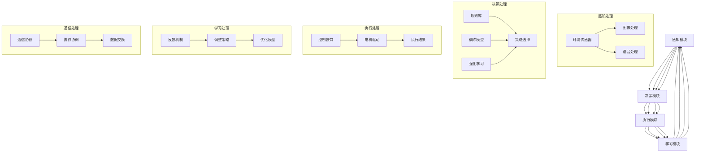

                 

### 文章标题

“AI Agent: AI的下一个风口 对研究者和实践者的建议”

### 文章关键词

人工智能，AI代理，强化学习，深度学习，应用场景，未来趋势，技术研究，实践指南

### 文章摘要

本文深入探讨了AI代理领域，一个正迅速崛起的AI应用风口。我们将从AI代理的定义和重要性出发，详细分析其核心概念、架构设计、算法原理、数学模型以及实际应用。通过具体案例和实战项目，本文将帮助研究者与实践者掌握AI代理的关键技术和应用技巧。最后，文章将对AI代理的未来发展趋势提出建议，为行业从业者提供有益的参考。

## 目录

1. **引言**
   - **1.1 写作目的与读者对象**
   - **1.2 文章结构与逻辑**

2. **AI代理概述**
   - **2.1 AI代理的定义**
   - **2.2 AI代理的重要性**
   - **2.3 AI代理的分类**
   - **2.4 AI代理的发展历程**

3. **AI代理的核心概念与架构**
   - **3.1 人工智能的基本概念**
   - **3.2 AI代理的架构设计**
   - **3.3 AI代理的核心组件**
   - **3.4 Mermaid流程图：AI代理的架构**

4. **AI代理的核心算法原理**
   - **4.1 机器学习基础**
   - **4.2 强化学习算法**
   - **4.3 深度学习算法**
   - **4.4 伪代码讲解：Q-learning算法**

5. **AI代理的数学模型**
   - **5.1 贝叶斯模型**
   - **5.2 马尔可夫决策过程**
   - **5.3 控制理论**
   - **5.4 LaTeX数学公式讲解**

6. **AI代理的应用场景**
   - **6.1 自动驾驶**
   - **6.2 虚拟助手**
   - **6.3 游戏AI**
   - **6.4 工业自动化**

7. **AI代理的项目实战**
   - **7.1 开发环境搭建**
   - **7.2 实际案例研究**
   - **7.3 源代码实现与分析**
   - **7.4 代码解读与实战分析**

8. **AI代理的未来趋势**
   - **8.1 AI代理的产业前景**
   - **8.2 技术挑战与解决方案**
   - **8.3 AI代理的发展方向**

9. **附录**
   - **A.1 AI代理相关工具与资源**
   - **A.2 AI代理学习资源推荐**
   - **A.3 AI代理相关论文列表**

10. **作者信息**

## 引言

### 1.1 写作目的与读者对象

本文旨在为AI领域的研究者与实践者提供一份全面且深入的指南，探讨AI代理这一新兴领域。随着人工智能技术的快速发展，AI代理正在成为各个行业的焦点。它们具备自主决策和学习能力，能够在复杂的环境中执行任务，提供个性化服务。本文将帮助读者了解AI代理的核心概念、技术原理、应用场景，并提供实用的开发建议和未来趋势分析。

本文的读者对象主要包括：
- AI研究者：对AI代理的基本原理和技术发展有兴趣，希望深入了解该领域的研究人员。
- AI从业者：已经在AI领域工作，希望拓展业务范围，将AI代理技术应用到实际项目中。
- 技术爱好者：对人工智能和自动化技术感兴趣，希望掌握前沿技术的技术爱好者。

### 1.2 文章结构与逻辑

本文将按照以下逻辑结构进行组织：

1. **AI代理概述**：介绍AI代理的定义、重要性、分类和发展历程。
2. **核心概念与架构**：深入探讨AI代理的基本概念、架构设计及其核心组件。
3. **算法原理**：分析AI代理的核心算法，包括机器学习、强化学习和深度学习。
4. **数学模型**：讲解AI代理中常用的数学模型，如贝叶斯模型、马尔可夫决策过程和控制理论。
5. **应用场景**：列举AI代理在不同领域的应用，如自动驾驶、虚拟助手、游戏AI和工业自动化。
6. **项目实战**：通过实际案例和项目，展示AI代理的开发过程、源代码实现和代码解读。
7. **未来趋势**：分析AI代理的产业前景、技术挑战和发展方向。

通过这种结构化的组织方式，本文力求让读者能够系统地学习和理解AI代理技术，从而为实际应用和未来研究提供有力的支持。

## AI代理概述

### 2.1 AI代理的定义

AI代理（Artificial Intelligence Agent），简称为AI代理，是指具备自主决策和学习能力的计算机程序，能够模拟人类智能在特定环境中执行任务。AI代理的核心特性是自主性、反应性和适应性。它们能够感知环境中的信息，根据预设的目标和策略自主做出决策，并通过学习不断优化自身的表现。

AI代理的定义可以从以下几个方面进行阐述：

1. **自主决策**：AI代理具有独立决策的能力，能够根据环境的变化和目标的要求，自主选择最优的行动方案。
2. **反应性**：AI代理能够实时响应环境中的变化，根据当前的感知信息进行决策，保持对环境的动态适应。
3. **学习能力**：AI代理能够通过学习历史数据和经验，不断优化自身的决策能力，提高任务的执行效率。
4. **交互性**：AI代理能够与人类或其他系统进行交互，接收输入信息，输出决策结果，实现人机协作。

AI代理的定义不仅是技术层面的描述，更是一种思想上的突破。它们代表着人工智能从被动响应向主动决策的转变，是人工智能发展的重要方向。

### 2.2 AI代理的重要性

AI代理的重要性在于其能够将人工智能技术应用于广泛的领域，提升自动化水平和智能化程度。以下是AI代理在各个方面的具体重要性：

1. **提高生产效率**：在工业生产、仓储物流等领域，AI代理可以通过自主决策和高效执行任务，大幅提高生产效率，降低人力成本。
2. **优化资源配置**：AI代理可以根据实时数据和预测模型，优化资源配置，提高资源利用效率，减少浪费。
3. **提升决策质量**：AI代理通过学习和分析大量数据，可以提供更准确、更全面的决策支持，帮助企业和组织做出更明智的决策。
4. **改善服务质量**：在客服、医疗、金融等领域，AI代理可以提供24小时不间断的个性化服务，提升用户体验。
5. **推动技术创新**：AI代理的研究和开发推动了人工智能技术的不断创新，促进了相关领域的技术进步。
6. **拓展应用场景**：AI代理的应用不仅限于传统行业，还涉及到自动驾驶、智能家居、虚拟现实等多个新兴领域，推动了产业升级和经济发展。

AI代理的重要性不仅体现在经济和社会层面，更体现在技术进步和人类生活质量的提升上。随着人工智能技术的不断发展，AI代理的应用将越来越广泛，成为推动社会进步的重要力量。

### 2.3 AI代理的分类

AI代理可以根据不同的分类标准进行分类。以下是一些常见的分类方式及其代表类型：

1. **按任务类型分类**：
   - **通用代理**：具备广泛任务处理能力的AI代理，如OpenAI的GPT-3。
   - **专用代理**：为特定任务或场景设计的AI代理，如自动驾驶汽车中的决策代理。

2. **按功能分类**：
   - **感知代理**：负责感知和采集环境信息的AI代理，如视觉感知代理。
   - **决策代理**：根据感知信息做出决策的AI代理，如游戏AI。
   - **执行代理**：根据决策执行具体任务的AI代理，如机器人执行代理。

3. **按自主程度分类**：
   - **弱代理**：在特定任务上表现出智能，但缺乏全局意识和自我意识，如聊天机器人。
   - **强代理**：具备高级认知能力和自我意识，能够处理复杂任务，如科幻电影中的机器人。

4. **按工作环境分类**：
   - **静态环境代理**：在稳定和已知环境中工作的AI代理，如工厂自动化系统。
   - **动态环境代理**：在不确定和复杂环境中工作的AI代理，如自动驾驶系统。

这些分类方式有助于我们更全面地理解AI代理的多样性和应用场景，从而为AI代理的研究和开发提供指导。

### 2.4 AI代理的发展历程

AI代理的发展历程可以分为以下几个阶段：

1. **早期探索阶段（1950-1960年代）**：
   - **符号人工智能**：以逻辑推理和知识表示为核心，试图通过符号计算实现智能。
   - **早期代理系统**：如Eliza，一个简单的对话代理。

2. **初步发展阶段（1970-1980年代）**：
   - **知识表示**：通过知识库和推理机，实现更复杂的决策和问题解决。
   - **专家系统**：应用领域逐渐拓宽，如医疗诊断、金融分析等。

3. **低谷期（1990-2000年代）**：
   - **人工神经网络**：开始复兴，但应用范围有限。
   - **符号人工智能与神经网络**：逐渐融合，形成更强大的智能系统。

4. **现代复兴阶段（2000年代至今）**：
   - **深度学习**：通过多层神经网络，实现图像识别、语音识别等领域的突破。
   - **强化学习**：在游戏AI、机器人控制等领域的应用取得显著成果。
   - **多代理系统**：在社交网络、供应链管理等领域展现巨大潜力。

5. **未来展望**：
   - **强代理**：具备高级认知能力和自我意识，能够处理复杂任务。
   - **人机协作**：AI代理与人类协同工作，提高生产效率和决策质量。
   - **跨领域应用**：AI代理在医疗、教育、金融等领域的深入应用，推动产业升级和社会进步。

AI代理的发展历程展示了人工智能从早期探索到现代复兴的历程，也反映了技术进步和社会需求的相互作用。随着人工智能技术的不断演进，AI代理的应用前景将更加广阔。

### 3.1 人工智能的基本概念

人工智能（Artificial Intelligence，简称AI）是指使计算机模拟人类智能行为和决策能力的科学和技术。AI的基本概念可以从以下几个方面进行阐述：

1. **智能定义**：
   - **广义智能**：智能是生物体在环境中进行感知、学习、推理、决策和执行任务的能力。
   - **人工智能**：是计算机系统模拟人类智能行为和决策能力的科学技术。

2. **智能层次**：
   - **弱AI**：仅能在特定任务上表现出智能，如聊天机器人、语音识别等。
   - **强AI**：具备人类级别的全面智能，能够在各种任务中表现优异。

3. **智能类型**：
   - **感知智能**：如图像识别、语音识别等，通过感知环境信息进行决策。
   - **认知智能**：如自然语言处理、推理等，通过理解和分析信息进行决策。
   - **执行智能**：如机器人控制、自动驾驶等，通过执行任务实现目标。

4. **智能系统**：
   - **专家系统**：基于知识表示和推理，模拟人类专家的决策过程。
   - **机器学习系统**：通过训练数据自动学习，提升决策能力。
   - **神经网络系统**：通过模拟人脑神经网络，实现复杂的感知和认知功能。

5. **智能发展**：
   - **符号智能**：以符号计算和逻辑推理为核心，如早期的人工智能系统。
   - **感知智能**：以图像识别、语音识别为核心，如深度学习技术。
   - **认知智能**：以自然语言处理、推理为核心，如GPT-3、BERT等。
   - **执行智能**：以机器人控制、自动驾驶为核心，如强化学习技术。

### 3.2 AI代理的架构设计

AI代理的架构设计是实现其自主决策和学习能力的关键。一个典型的AI代理架构通常包括以下几个核心组件：

1. **感知模块**：
   - **功能**：感知模块负责采集和解析环境中的信息，如视觉、听觉、触觉等。
   - **实现**：常用的感知技术包括计算机视觉、语音识别、传感器融合等。

2. **决策模块**：
   - **功能**：决策模块根据感知模块收集的信息，结合预设的目标和策略，选择最优的行动方案。
   - **实现**：常用的决策算法包括基于规则的推理、机器学习模型、强化学习等。

3. **执行模块**：
   - **功能**：执行模块负责根据决策模块提供的行动方案，实际执行任务。
   - **实现**：执行模块通常与具体的硬件设备（如机器人、自动驾驶汽车等）相连，通过接口进行控制。

4. **学习模块**：
   - **功能**：学习模块负责根据任务执行的结果和经验，不断调整和优化感知、决策和执行策略。
   - **实现**：常用的学习方法包括有监督学习、无监督学习、强化学习等。

5. **通信模块**：
   - **功能**：通信模块负责与其他代理、人或其他系统进行信息交换，实现协作与协调。
   - **实现**：常用的通信协议包括TCP/IP、HTTP、MQTT等。

### 3.3 AI代理的核心组件

AI代理的核心组件包括感知模块、决策模块、执行模块、学习模块和通信模块。以下是这些组件的详细描述：

1. **感知模块**：
   - **功能**：感知模块是AI代理获取环境信息的关键组件。它通过传感器、摄像头、麦克风等设备，实时采集视觉、听觉、触觉等信息，并将其转化为数字信号进行处理。
   - **实现**：计算机视觉技术可用于处理图像数据，语音识别技术可用于处理音频数据，传感器融合技术可用于整合多种感知数据，提高感知的准确性和鲁棒性。

2. **决策模块**：
   - **功能**：决策模块是AI代理的智能核心，负责根据感知模块提供的信息，结合预设的目标和策略，选择最优的行动方案。
   - **实现**：基于规则的推理方法通过预定义的规则库进行决策；机器学习模型通过训练数据自动学习决策策略；强化学习通过试错和奖励机制优化决策策略。

3. **执行模块**：
   - **功能**：执行模块负责将决策模块提供的行动方案转化为具体的物理动作，实现任务的执行。
   - **实现**：执行模块通常与具体的硬件设备相连，如机器人、自动驾驶汽车等，通过控制接口进行任务执行。例如，机器人执行模块可以通过电机驱动器控制机械臂的运动。

4. **学习模块**：
   - **功能**：学习模块负责根据任务执行的结果和经验，不断调整和优化感知、决策和执行策略，提高AI代理的智能水平。
   - **实现**：有监督学习通过标记数据训练模型；无监督学习通过未标记数据自动发现模式；强化学习通过试错和反馈进行策略优化。

5. **通信模块**：
   - **功能**：通信模块负责与其他代理、人或其他系统进行信息交换，实现协作与协调。
   - **实现**：通信模块采用多种协议进行数据传输，如TCP/IP、HTTP、MQTT等，确保数据传输的可靠性和实时性。

通过这些核心组件的协同工作，AI代理能够实现自主决策和学习，从而在复杂的环境中高效执行任务。

### 3.4 Mermaid流程图：AI代理的架构

为了更直观地展示AI代理的架构，我们可以使用Mermaid流程图来描述其核心组件和交互关系。以下是一个典型的AI代理架构的Mermaid流程图示例：



在这个流程图中，感知模块（A）负责采集环境信息，通过图像处理（F）和语音处理（G）模块转化为数字信号。决策模块（B）结合感知模块的信息和预设策略（H、I、J），选择最优行动方案。执行模块（C）根据决策结果执行任务，并通过控制接口（L）与硬件设备（M）交互。学习模块（D）根据执行结果和反馈机制（O）不断优化策略（P）和模型（Q）。通信模块（R）负责与其他系统进行数据交换（T），实现协作与协调。

通过这个Mermaid流程图，我们可以清晰地看到AI代理各组件之间的交互关系，有助于理解和设计更复杂的AI代理系统。

### 3.5 机器学习基础

机器学习是AI代理的核心技术之一，旨在通过数据和算法，使计算机具备自主学习和优化能力。理解机器学习的基础概念和基本算法对于设计和实现AI代理至关重要。

#### 3.5.1 机器学习的定义

机器学习（Machine Learning）是一种通过算法使计算机从数据中学习模式，并自主做出决策或进行预测的技术。与传统编程不同，机器学习不依赖于手动编写规则，而是通过大量数据训练模型，使模型能够自动识别和提取数据中的规律。

#### 3.5.2 机器学习的基本概念

1. **数据集**：机器学习的基础是数据集，即包含大量样本的数据集合。样本通常包括特征和标签，特征是用于描述样本的属性，标签是样本的目标或类别。

2. **特征**：特征是数据集中的属性，用于描述样本的特性。例如，在图像识别任务中，像素值可以被视为图像的特征。

3. **标签**：标签是数据集中的目标，用于指导模型学习。例如，在分类任务中，标签可以是图片中的物体类别。

4. **模型**：模型是机器学习算法的结果，用于表示数据中的模式和规律。常见的模型包括线性回归模型、决策树、支持向量机、神经网络等。

5. **算法**：算法是用于训练模型的计算方法，通过优化模型参数，使模型能够在新的数据上做出准确的预测。

6. **评估指标**：评估指标用于衡量模型的性能，常见的评估指标包括准确率、召回率、F1分数、均方误差等。

#### 3.5.3 常见机器学习算法

1. **线性回归**：线性回归是一种用于预测连续值的算法，通过拟合一条直线，将输入特征映射到目标值。

2. **决策树**：决策树是一种基于树形模型的分类算法，通过递归分割数据集，构建树形结构，并在每个节点上选择最佳分割特征。

3. **支持向量机（SVM）**：SVM是一种用于分类和回归的算法，通过找到一个最佳的超平面，将不同类别的样本分开。

4. **神经网络**：神经网络是一种模拟人脑神经元连接结构的计算模型，通过多层神经元的非线性变换，实现复杂函数的拟合和预测。

5. **深度学习**：深度学习是神经网络的一种扩展，通过增加神经网络层数，实现更复杂的特征提取和模式识别。

#### 3.5.4 机器学习流程

机器学习流程通常包括以下几个步骤：

1. **数据收集**：收集用于训练和测试的数据集，确保数据的质量和代表性。

2. **数据预处理**：对数据进行清洗、归一化、编码等处理，使其适合模型训练。

3. **模型选择**：根据任务类型和数据特点，选择合适的机器学习算法和模型。

4. **模型训练**：使用训练数据集，通过算法优化模型参数，使模型能够在新的数据上做出准确的预测。

5. **模型评估**：使用测试数据集评估模型性能，调整模型参数，优化模型效果。

6. **模型部署**：将训练好的模型部署到实际应用中，进行任务预测或决策。

通过上述步骤，机器学习能够使计算机从数据中学习，并在各种任务中表现出出色的性能。

### 3.6 强化学习算法

强化学习（Reinforcement Learning，简称RL）是一种重要的机器学习算法，特别适用于决策类问题。它与传统的监督学习和无监督学习不同，通过奖励机制和试错学习，使代理能够在动态环境中做出最优决策。

#### 3.6.1 强化学习的定义

强化学习是一种使代理在动态环境中通过试错学习，以最大化累积奖励的机器学习方法。它主要包括四个核心组成部分：代理（Agent）、环境（Environment）、动作（Action）和奖励（Reward）。

- **代理**：执行动作的智能体，通过感知环境状态，选择动作，并根据动作的结果接收奖励。
- **环境**：代理执行动作的动态环境，能够根据代理的动作产生新的状态和奖励。
- **动作**：代理可执行的行为，用于改变环境状态。
- **奖励**：代理执行动作后，从环境中获得的正面或负面反馈。

#### 3.6.2 强化学习的基本概念

1. **状态（State）**：描述环境当前状态的变量集合。在游戏AI中，状态可能包括棋盘的布局、代理的位置等。
2. **动作（Action）**：代理可执行的行为，用于改变当前状态。
3. **策略（Policy）**：代理选择动作的策略，通常表示为状态-动作值函数，用于指导代理在特定状态下选择最优动作。
4. **值函数（Value Function）**：评估代理在特定状态或状态序列下的长期奖励，包括状态值函数（V(s)）和动作值函数（Q(s,a)）。
5. **奖励（Reward）**：代理执行动作后，从环境中获得的即时奖励，用于调整策略和值函数。

#### 3.6.3 强化学习的核心算法

1. **Q-learning算法**

Q-learning算法是一种基于值函数的强化学习算法，通过更新状态-动作值函数来学习最优策略。其基本思想是，在给定状态下，选择当前最大动作值对应的动作，并更新动作值函数。

伪代码如下：

```python
# 初始化动作值函数Q(s, a)
Q = np.zeros((n_states, n_actions))

# 学习参数
alpha = 0.1  # 学习率
gamma = 0.9  # 折扣因子

# 迭代过程
for episode in range(total_episodes):
    state = env.reset()
    done = False
    
    while not done:
        # 选择动作
        action = np.argmax(Q[state])
        
        # 执行动作
        next_state, reward, done, _ = env.step(action)
        
        # 更新动作值函数
        Q[state, action] = Q[state, action] + alpha * (reward + gamma * np.max(Q[next_state]) - Q[state, action])
        
        state = next_state
```

2. **策略梯度算法**

策略梯度算法是一种直接优化策略的强化学习算法，通过梯度上升法更新策略参数。其基本思想是，通过最大化期望回报来优化策略。

伪代码如下：

```python
# 初始化策略参数θ
θ = np.random.randn(n_params)

# 学习参数
alpha = 0.01  # 学习率
epsilon = 0.1  # 探索率

# 迭代过程
for episode in range(total_episodes):
    state = env.reset()
    done = False
    
    while not done:
        # 选择动作
        action = policy_action(state, θ)
        
        # 执行动作
        next_state, reward, done, _ = env.step(action)
        
        # 计算策略梯度
        gradient = policy_gradient(state, action, reward, next_state, done, θ)
        
        # 更新策略参数
        θ = θ + alpha * gradient
        
        state = next_state
```

通过Q-learning算法和策略梯度算法，强化学习能够使代理在动态环境中不断优化策略，实现最优决策。

### 3.7 深度学习算法

深度学习（Deep Learning）是近年来人工智能领域的重要突破，通过多层神经网络，实现复杂的特征提取和模式识别。在AI代理中，深度学习算法广泛应用于图像识别、语音识别、自然语言处理等领域。

#### 3.7.1 深度学习的定义

深度学习是一种基于多层神经网络的学习方法，通过逐层提取特征，实现从原始数据到高级抽象表示的转换。与传统的机器学习方法相比，深度学习能够自动学习和发现数据中的复杂结构，提高模型的泛化能力。

#### 3.7.2 深度学习的基本概念

1. **神经网络（Neural Network）**：神经网络是一种模拟人脑神经元连接结构的计算模型，通过输入层、隐藏层和输出层，实现数据的处理和预测。

2. **层（Layer）**：神经网络由多个层次组成，包括输入层、隐藏层和输出层。每个层次包含多个神经元，用于特征提取和变换。

3. **激活函数（Activation Function）**：激活函数是神经网络中用于引入非线性性的函数，常见的激活函数包括sigmoid、ReLU、Tanh等。

4. **前向传播（Forward Propagation）**：前向传播是神经网络中的计算过程，从输入层开始，逐层计算每个神经元的输出值，直到输出层。

5. **反向传播（Back Propagation）**：反向传播是神经网络中的训练过程，通过计算损失函数关于每个神经元的梯度，更新网络权重和偏置，优化模型参数。

6. **损失函数（Loss Function）**：损失函数用于衡量模型预测值与真实值之间的差距，常见的损失函数包括均方误差（MSE）、交叉熵（Cross Entropy）等。

7. **优化算法（Optimization Algorithm）**：优化算法用于最小化损失函数，常见的优化算法包括梯度下降（Gradient Descent）、Adam优化器等。

#### 3.7.3 深度学习的核心算法

1. **卷积神经网络（Convolutional Neural Network，CNN）**

卷积神经网络是一种专门用于图像识别的深度学习算法，通过卷积层、池化层和全连接层，实现图像的特征提取和分类。

- **卷积层（Convolutional Layer）**：卷积层通过卷积操作提取图像中的局部特征。
- **池化层（Pooling Layer）**：池化层通过下采样操作，减少特征图的尺寸，提高计算效率。
- **全连接层（Fully Connected Layer）**：全连接层将卷积层和池化层提取的特征映射到输出类别。

2. **循环神经网络（Recurrent Neural Network，RNN）**

循环神经网络是一种用于处理序列数据的深度学习算法，通过隐藏状态和循环连接，实现序列的建模和预测。

- **隐藏状态（Hidden State）**：隐藏状态用于保存当前时刻和前一时刻的信息，实现序列的记忆功能。
- **循环连接（Recurrence Connection）**：循环连接使隐藏状态在时间序列中传递，实现长距离依赖建模。

3. **长短时记忆网络（Long Short-Term Memory，LSTM）**

长短时记忆网络是一种改进的循环神经网络，通过引入记忆单元和门控机制，解决RNN在处理长序列数据时的梯度消失和梯度爆炸问题。

- **记忆单元（Memory Cell）**：记忆单元用于保存和更新信息，实现长期依赖建模。
- **门控机制（Gate Mechanism）**：门控机制通过输入门、遗忘门和输出门，控制信息的传递和输出，提高模型的可控性。

4. **生成对抗网络（Generative Adversarial Network，GAN）**

生成对抗网络是一种生成模型，通过生成器和判别器的对抗训练，实现数据的生成和建模。

- **生成器（Generator）**：生成器通过随机噪声生成真实数据的样例。
- **判别器（Discriminator）**：判别器通过判断数据是真实样本还是生成样本，与生成器进行对抗训练。

通过这些核心算法，深度学习能够实现复杂的特征提取和模式识别，为AI代理提供强大的技术支持。

### 3.8 伪代码讲解：Q-learning算法

Q-learning算法是一种基于值函数的强化学习算法，通过迭代更新状态-动作值函数，使代理在动态环境中学习最优策略。以下是一个简化的伪代码，用于解释Q-learning算法的基本步骤：

```python
# 初始化参数
Q = np.zeros((n_states, n_actions))  # 初始化Q值矩阵
alpha = 0.1  # 学习率
gamma = 0.9  # 折扣因子
epsilon = 0.1  # 探索率

# 迭代过程
for episode in range(total_episodes):
    state = env.reset()  # 初始化环境状态
    done = False
    
    while not done:
        # ε-贪心策略：随机选择动作或根据当前Q值选择最佳动作
        if np.random.rand() < epsilon:
            action = np.random.choice(n_actions)  # 随机选择动作
        else:
            action = np.argmax(Q[state])  # 选择最佳动作
        
        # 执行动作
        next_state, reward, done, _ = env.step(action)
        
        # 更新Q值
        Q[state, action] = Q[state, action] + alpha * (reward + gamma * np.max(Q[next_state]) - Q[state, action])
        
        state = next_state  # 更新当前状态
        
# 输出最优策略
policy = np.argmax(Q, axis=1)
```

在这个伪代码中，我们首先初始化Q值矩阵，学习率和折扣因子。然后，对于每个迭代周期（episode），代理从环境开始，通过ε-贪心策略选择动作。每次执行动作后，更新Q值矩阵，使代理在后续迭代中更倾向于选择高回报的动作。最终，输出最优策略，指导代理在环境中进行决策。

### 3.9 贝叶斯模型

贝叶斯模型是一种基于贝叶斯定理的统计模型，用于概率推理和决策。在AI代理中，贝叶斯模型广泛应用于不确定性建模、推理和预测。以下是贝叶斯模型的基本概念和原理：

#### 3.9.1 贝叶斯定理

贝叶斯定理描述了在已知某些条件下，事件A的概率可以通过其他相关事件B的概率来计算。贝叶斯定理公式如下：

\[ P(A|B) = \frac{P(B|A) \cdot P(A)}{P(B)} \]

其中：
- \( P(A|B) \) 是在已知事件B发生的条件下，事件A发生的条件概率。
- \( P(B|A) \) 是在已知事件A发生的条件下，事件B发生的条件概率。
- \( P(A) \) 是事件A的先验概率。
- \( P(B) \) 是事件B的先验概率。

#### 3.9.2 贝叶斯模型的组成部分

1. **先验概率**：先验概率是基于历史数据和直觉对事件发生概率的初始估计。例如，在诊断疾病时，先验概率可以是某病发病率。

2. **似然函数**：似然函数是数据在给定假设下的概率分布。例如，在诊断疾病时，似然函数可以是不同症状出现的概率。

3. **后验概率**：后验概率是结合先验概率和似然函数计算得到的，反映了在观察特定数据后，对事件发生概率的新估计。

4. **贝叶斯更新**：贝叶斯更新是利用新数据更新先验概率和似然函数，计算后验概率的过程。贝叶斯更新公式如下：

\[ P(A|B, new\_data) = \frac{P(B|A, new\_data) \cdot P(A|new\_data)}{P(B|new\_data)} \]

#### 3.9.3 贝叶斯模型的实现

贝叶斯模型的实现通常涉及以下步骤：

1. **数据预处理**：对输入数据进行清洗和归一化，使其适合模型处理。

2. **参数初始化**：初始化先验概率、似然函数和超参数。

3. **贝叶斯推理**：利用贝叶斯定理和贝叶斯更新公式，对未知变量进行推理和更新。

4. **模型评估**：使用测试数据集评估模型性能，调整参数，优化模型效果。

5. **预测**：利用训练好的模型进行预测，输出结果。

通过贝叶斯模型，AI代理能够在不确定的环境中，基于历史数据和实时数据，进行有效的推理和决策。以下是一个简化的贝叶斯推理示例：

```python
# 初始化参数
prior = 0.5  # 先验概率
likelihood = 0.8  # 似然函数
data = "sunny"  # 观察到的数据

# 贝叶斯更新
posterior = likelihood * prior / (likelihood * prior + (1 - likelihood) * (1 - prior))

print("Posterior probability:", posterior)
```

在这个示例中，先验概率表示下雨的概率为0.5，似然函数表示观察到晴天时下雨的概率为0.8。通过贝叶斯更新，我们可以计算出在观察到晴天后，下雨的后验概率为0.8 / (0.8 * 0.5 + 0.2 * 0.5) = 0.8。

### 3.10 马尔可夫决策过程

马尔可夫决策过程（Markov Decision Process，简称MDP）是强化学习中的一个重要概念，用于描述决策者在不确定环境中进行决策的过程。以下是对MDP的基本概念、公式和属性的详细解释：

#### 3.10.1 MDP的基本概念

1. **状态（State）**：状态是系统当前所处的条件或位置，通常用 \( S \) 表示。状态集合 \( S \) 包含所有可能的状态。

2. **动作（Action）**：动作是决策者可以采取的行为，用于改变当前状态。动作集合 \( A \) 包含所有可能的动作。

3. **奖励（Reward）**：奖励是决策者从当前状态采取某一动作后获得的即时回报，通常用 \( R(s, a) \) 表示。

4. **转移概率（Transition Probability）**：转移概率描述了从当前状态 \( s \) 采取动作 \( a \) 后，转移到下一个状态 \( s' \) 的概率，通常用 \( P(s'|s, a) \) 表示。

5. **策略（Policy）**：策略是决策者用于指导决策的规则，用于选择在给定状态下应采取的动作。策略通常表示为 \( \pi(a|s) \)，表示在状态 \( s \) 下采取动作 \( a \) 的概率。

6. **值函数（Value Function）**：值函数用于评估策略的优劣，表示在给定策略下，从状态 \( s \) 开始并执行策略 \( \pi \) 的期望累积奖励，通常用 \( V^{\pi}(s) \) 表示。

#### 3.10.2 MDP的公式

1. **状态-动作值函数（State-Action Value Function）**：状态-动作值函数 \( Q^{\pi}(s, a) \) 表示在状态 \( s \) 下采取动作 \( a \) 并遵循策略 \( \pi \) 的期望累积奖励，即

\[ Q^{\pi}(s, a) = \sum_{s'} P(s'|s, a) \cdot [R(s, a) + \gamma V^{\pi}(s')] \]

其中，\( \gamma \) 是折扣因子，用于权衡当前奖励和未来奖励的重要性。

2. **策略值函数（Policy Value Function）**：策略值函数 \( V^{\pi}(s) \) 表示在给定策略 \( \pi \) 下，从状态 \( s \) 开始的期望累积奖励，即

\[ V^{\pi}(s) = \sum_{a} \pi(a|s) \cdot Q^{\pi}(s, a) \]

3. **最优值函数（Optimal Value Function）**：最优值函数 \( V^*(s) \) 表示在最优策略下，从状态 \( s \) 开始的期望累积奖励，即

\[ V^*(s) = \max_{a} Q^*(s, a) \]

其中，\( Q^*(s, a) \) 是最优状态-动作值函数。

4. **最优策略（Optimal Policy）**：最优策略 \( \pi^*(s) \) 是使价值函数 \( V^*(s) \) 最大的策略，即

\[ \pi^*(s) = \arg\max_{a} Q^*(s, a) \]

#### 3.10.3 MDP的属性

1. **马尔可夫性质**：MDP满足马尔可夫性质，即当前状态只与上一状态有关，而与过去的状态无关。这简化了决策过程，使问题更易于处理。

2. **确定性**：在MDP中，每次状态转移都是确定的，即给定当前状态和动作，下一个状态是唯一的。

3. **无后效性**：MDP中的奖励和状态转移概率只与当前状态和动作有关，而与未来的状态和动作无关。

通过理解MDP的基本概念、公式和属性，我们可以更好地设计和实现AI代理的决策策略，使其在不确定环境中做出最优决策。

### 3.11 控制理论

控制理论是研究动态系统在给定输入和初始条件下，如何通过反馈机制实现稳定和最优性能的学科。在AI代理中，控制理论广泛应用于动态环境的建模、控制和优化。以下是对控制理论的基本概念、常用模型和方法以及其在AI代理中的应用的详细解释。

#### 3.11.1 控制理论的基本概念

1. **系统**：系统是由一组相互关联的元素组成的整体，用于实现特定的功能。在控制理论中，系统通常表示为输入、输出和状态变量。

2. **状态变量**：状态变量描述系统的当前状态，用于表示系统的动态特征。状态变量可以是连续的或离散的，取决于系统的性质。

3. **输入**：输入是外部对系统的干扰，用于影响系统的行为。输入可以是连续的或离散的，取决于系统的应用场景。

4. **输出**：输出是系统的响应，反映了系统的状态变化。输出可以是连续的或离散的，取决于系统的应用场景。

5. **控制器**：控制器是用于调整系统输入的装置，用于实现系统状态的预期变化。控制器可以通过反馈机制，根据系统输出调整输入，实现系统的稳定性和最优性能。

6. **稳定性**：稳定性是控制系统的重要性能指标，表示系统在受到扰动后，能否恢复到初始状态或接近初始状态。稳定的系统在长时间运行后，状态不会发散或振荡。

7. **最优性能**：最优性能是控制系统在特定目标函数下，实现最优输出或最小化误差的性能。最优性能通常通过优化方法实现，如线性二次调节（LQR）和鲁棒控制。

#### 3.11.2 常用控制模型和方法

1. **开环控制**：开环控制是一种不考虑系统反馈的控制方法，仅根据输入和系统模型，计算输出。开环控制简单但难以实现精确控制，适用于非动态环境。

2. **闭环控制**：闭环控制是一种结合系统反馈的控制方法，根据系统输出调整输入，实现系统状态的预期变化。闭环控制通过反馈机制提高控制精度，但需要复杂的控制器设计和稳定性分析。

3. **PID控制**：比例-积分-微分（PID）控制是最常用的闭环控制方法，通过调整比例（P）、积分（I）和微分（D）系数，实现系统输出的精确控制。PID控制适用于线性、时间不变系统，但难以处理非线性、时变系统。

4. **状态空间模型**：状态空间模型是一种用于描述动态系统状态的数学模型，包括状态方程和输出方程。状态空间模型适用于复杂的动态系统，可以通过线性二次调节（LQR）和线性二次型高斯（LQG）控制实现最优性能。

5. **自适应控制**：自适应控制是一种根据系统变化调整控制器参数的控制方法，用于处理非线性、时变系统。自适应控制通过在线学习系统参数，实现系统的自适应性和鲁棒性。

6. **模糊控制**：模糊控制是一种基于模糊逻辑的控制方法，用于处理不确定性和非线性系统。模糊控制器通过模糊规则和模糊推理，实现系统输出的自适应调整。

#### 3.11.3 控制理论在AI代理中的应用

1. **动态环境建模**：控制理论用于建立AI代理在动态环境中的状态空间模型，描述系统的动态特征和行为。通过状态空间模型，可以更好地理解和分析AI代理的行为。

2. **路径规划**：在自动驾驶和机器人领域，控制理论用于实现路径规划和路径跟踪。通过PID控制、状态空间模型和自适应控制，可以实现精确的路径规划和动态避障。

3. **姿态控制**：在无人机和机器人领域，控制理论用于实现姿态控制和稳定性控制。通过状态空间模型、PID控制和鲁棒控制，可以实现对无人机和机器人姿态的精确控制和稳定性保证。

4. **资源分配**：在供应链管理和物联网领域，控制理论用于实现资源分配和调度。通过线性二次调节（LQR）和自适应控制，可以优化资源利用和降低系统成本。

5. **异常检测**：在工业监控和网络安全领域，控制理论用于实现异常检测和故障诊断。通过状态空间模型和模糊控制，可以检测系统的异常行为和故障点，提高系统的安全性和可靠性。

通过控制理论的应用，AI代理能够更好地适应动态环境，实现稳定和最优性能，提高系统的智能化水平和应用价值。

### 3.12 LaTeX数学公式讲解

在讨论复杂的算法和数学模型时，LaTeX数学公式是一种广泛使用的表示工具。LaTeX公式能够精确描述数学概念，使得技术文档更加清晰和专业。以下是一些常见的LaTeX数学公式及其解释：

#### 3.12.1 基本数学符号

1. **求和符号**：表示求和运算
   \[ \sum_{i=1}^{n} a_i \]

2. **积分符号**：表示定积分
   \[ \int_{a}^{b} f(x) \, dx \]

3. **极限符号**：表示函数在某一点的极限
   \[ \lim_{x \to a} f(x) \]

4. **求导符号**：表示函数的导数
   \[ \frac{d}{dx} f(x) \]

5. **向量表示**：表示向量
   \[ \vec{v} \]

6. **矩阵表示**：表示矩阵
   \[ A = \begin{pmatrix}
   a & b \\
   c & d
   \end{pmatrix} \]

#### 3.12.2 常见数学公式

1. **线性回归公式**：线性回归模型的表达式
   \[ y = \beta_0 + \beta_1 x + \epsilon \]

2. **梯度下降公式**：用于更新模型参数
   \[ \theta = \theta - \alpha \nabla_{\theta} J(\theta) \]

3. **Q-learning公式**：Q-learning算法的更新规则
   \[ Q(s, a) = Q(s, a) + \alpha [r + \gamma \max_{a'} Q(s', a')] \]

4. **贝叶斯公式**：条件概率的贝叶斯定理
   \[ P(A|B) = \frac{P(B|A) P(A)}{P(B)} \]

5. **马尔可夫模型**：状态转移概率矩阵
   \[ P(s'|s, a) = \begin{cases}
   0.8, & \text{if } s' = s + 1 \\
   0.2, & \text{otherwise}
   \end{cases} \]

6. **神经网络**：多层感知器（MLP）模型
   \[ z = \sigma(W_2 \cdot \sigma(W_1 \cdot x + b_1) + b_2) \]

通过LaTeX数学公式，我们可以精确地表示和解释复杂的数学概念和算法，使得技术文档更加严谨和专业。

### 3.13 自动驾驶

自动驾驶是AI代理应用的一个重要领域，通过感知、决策和执行，实现无人车辆在复杂环境中的自主行驶。以下是自动驾驶系统的主要组成部分、关键技术及其在AI代理中的应用：

#### 3.13.1 主要组成部分

1. **感知模块**：感知模块是自动驾驶系统的核心，负责采集和处理环境信息。常用的感知技术包括：
   - **计算机视觉**：通过摄像头捕捉道路、车辆、行人等环境信息，并进行图像处理和分析。
   - **激光雷达（LIDAR）**：利用激光束扫描周围环境，获取高精度的三维点云数据。
   - **超声波传感器**：用于检测近距离障碍物，如行人或自行车。

2. **决策模块**：决策模块根据感知模块提供的信息，生成行驶策略和路径规划。主要技术包括：
   - **路径规划**：通过规划算法，确定车辆的行驶路径，确保避障和到达目标。
   - **行为预测**：利用机器学习模型，预测周围车辆、行人的行为，为决策模块提供参考。

3. **执行模块**：执行模块负责将决策模块的指令转换为具体的控制动作，实现车辆的自主行驶。关键技术包括：
   - **控制算法**：如PID控制、自适应控制等，用于调整车辆的行驶速度和方向。
   - **执行器**：如电机、刹车、油门等，用于执行具体的控制指令。

4. **通信模块**：通信模块负责与其他车辆、基础设施和中心服务器进行信息交换，实现车联网（V2X）功能。关键技术包括：
   - **无线通信**：如WiFi、LTE、5G等，用于传输感知数据、控制指令和位置信息。
   - **车联网协议**：如DSRC、C-V2X等，用于实现车辆之间的通信和协调。

#### 3.13.2 关键技术

1. **深度学习**：深度学习在自动驾驶中用于图像识别、行为预测和路径规划。常见的深度学习模型包括卷积神经网络（CNN）、循环神经网络（RNN）和生成对抗网络（GAN）。

2. **强化学习**：强化学习用于训练自动驾驶系统在动态环境中的决策策略。通过Q-learning、深度Q网络（DQN）等算法，实现自动驾驶系统的自主学习和优化。

3. **多传感器融合**：多传感器融合技术用于提高自动驾驶系统的感知精度和鲁棒性。通过融合摄像头、激光雷达、超声波传感器等多种传感器的数据，实现更全面的感知。

4. **路径规划与轨迹跟踪**：路径规划和轨迹跟踪是自动驾驶系统的核心任务。常见的路径规划算法包括基于采样的RRT、A*算法等；轨迹跟踪算法包括PID控制、模型预测控制（MPC）等。

#### 3.13.3 AI代理的应用

AI代理在自动驾驶中扮演了关键角色，通过感知、决策和执行，实现车辆的自主行驶。以下是一些具体的AI代理应用场景：

1. **障碍物检测**：AI代理利用计算机视觉和激光雷达感知技术，实时检测道路上的障碍物，如车辆、行人、自行车等，并生成障碍物地图。

2. **行为预测**：AI代理通过深度学习算法，预测周围车辆和行人的行为，如加速、减速、转弯等，为自动驾驶系统提供决策依据。

3. **路径规划**：AI代理利用路径规划算法，根据实时感知数据和行为预测结果，规划车辆的行驶路径，确保安全、高效地到达目的地。

4. **轨迹跟踪**：AI代理通过控制算法和轨迹跟踪算法，实时调整车辆的行驶速度和方向，实现精确的轨迹跟踪。

5. **通信协调**：AI代理通过车联网协议，与其他车辆和基础设施进行通信，实现信息的共享和协调，提高交通效率和安全性。

通过AI代理的应用，自动驾驶系统能够在复杂的环境中实现自主行驶，提高交通安全性和效率，为未来智能出行提供有力支持。

### 3.14 虚拟助手

虚拟助手（Virtual Assistant）是一种AI代理，通过自然语言处理和机器学习技术，为用户提供智能化服务。虚拟助手在各个领域得到了广泛应用，如客服、智能家居、医疗健康等。以下是虚拟助手的主要组成部分、技术原理和实际应用场景：

#### 3.14.1 主要组成部分

1. **感知模块**：感知模块负责接收用户的输入，包括语音、文本等。常用的感知技术有：
   - **语音识别**：将语音信号转换为文本，实现人机语音交互。
   - **自然语言理解**：对输入文本进行语义分析和实体识别，理解用户的需求和意图。

2. **决策模块**：决策模块根据感知模块提供的信息，生成相应的响应和操作。关键技术包括：
   - **意图识别**：识别用户的意图，如查询信息、执行任务等。
   - **对话管理**：管理对话流程，确保对话的连贯性和自然性。

3. **执行模块**：执行模块负责将决策模块的指令转换为实际的操作，提供用户所需的服务。常见的执行技术有：
   - **知识库**：存储各种领域的知识和信息，为虚拟助手提供查询和决策支持。
   - **服务调用**：根据用户需求，调用相应的服务接口，如天气预报、在线购物等。

4. **反馈模块**：反馈模块收集用户对虚拟助手的反馈，用于优化和改进系统。常见的反馈技术有：
   - **反馈收集**：通过问卷、评分等方式，收集用户对虚拟助手的评价。
   - **用户行为分析**：分析用户的使用习惯和偏好，为个性化服务提供依据。

#### 3.14.2 技术原理

1. **自然语言处理（NLP）**：NLP是虚拟助手的核心技术，包括文本处理、语音识别、语义理解等。常用的NLP技术有：
   - **词法分析**：将文本分解为词、句等基本单位。
   - **句法分析**：分析句子的结构，识别句子成分。
   - **语义理解**：理解句子的含义，提取关键信息。

2. **机器学习**：机器学习用于训练虚拟助手，使其能够根据用户输入自动生成响应。常用的机器学习技术有：
   - **监督学习**：通过标记数据训练模型，实现意图识别、实体识别等。
   - **强化学习**：通过试错和奖励机制，优化虚拟助手的对话策略。

3. **深度学习**：深度学习在NLP和机器学习中发挥了重要作用，通过多层神经网络，实现复杂模式的识别和预测。常见的深度学习模型有：
   - **卷积神经网络（CNN）**：用于文本分类、命名实体识别等。
   - **循环神经网络（RNN）**：用于序列建模，如对话生成、语音识别等。
   - **长短时记忆网络（LSTM）**：用于处理长序列数据，提高模型性能。

#### 3.14.3 实际应用场景

1. **客服**：虚拟助手在客服领域提供了智能客服系统，通过语音识别和自然语言理解技术，实现自动接听电话、处理常见问题和转接高级客服。虚拟助手能够处理大量客户咨询，提高服务效率和客户满意度。

2. **智能家居**：虚拟助手在智能家居中，通过语音控制和自然语言理解技术，实现智能音箱、智能家电的联动控制。用户可以通过语音指令控制灯光、空调、电视等设备，提高家居生活的便捷性和舒适度。

3. **医疗健康**：虚拟助手在医疗健康领域，通过自然语言理解和机器学习技术，提供医疗咨询、健康管理、药物提醒等服务。虚拟助手能够回答患者的问题，提供健康建议，提高医疗服务的可及性和效率。

4. **教育**：虚拟助手在教育领域，通过自然语言处理和对话生成技术，提供智能辅导、课程推荐、作业批改等服务。虚拟助手能够根据学生的学习情况和需求，提供个性化的学习支持和指导。

通过虚拟助手的应用，各个行业能够实现服务智能化，提高用户体验和效率。随着技术的不断进步，虚拟助手将逐渐成为人们生活和工作的重要助手。

### 3.15 游戏AI

游戏AI（Game AI）是人工智能在游戏领域的重要应用，通过模拟对手的行为和制定策略，实现游戏的智能化和可玩性。以下是对游戏AI的主要类型、实现方法及其在AI代理中的应用的详细解释。

#### 3.15.1 游戏AI的主要类型

1. **静态策略AI**：静态策略AI通过预定义的规则和策略，决定游戏的行动。这类AI适用于规则明确、变化较少的游戏，如棋类游戏和策略游戏。

   - **实现方法**：静态策略AI通过预定义的决策树或规则库，根据当前游戏状态选择最佳行动。例如，在围棋游戏中，AI可以预定义落子规则，根据棋盘状态选择最优落子位置。

2. **行为树AI**：行为树AI通过构建决策树，描述AI的行为和反应。行为树由一系列节点组成，每个节点表示一个行为或条件判断。

   - **实现方法**：行为树AI根据当前游戏状态，从根节点开始遍历决策树，选择满足条件的分支执行。例如，在角色扮演游戏中，AI可以根据玩家的行为，选择攻击、防御或逃跑等策略。

3. **强化学习AI**：强化学习AI通过试错和奖励机制，自主学习和优化策略。这类AI适用于动态变化、竞争激烈的游戏，如电竞游戏和策略游戏。

   - **实现方法**：强化学习AI通过强化学习算法（如Q-learning、深度Q网络DQN），在游戏过程中不断调整策略，提高胜率。例如，在电子竞技游戏中，AI可以通过训练，学习对手的弱点和应对策略。

4. **蒙特卡洛树搜索AI**：蒙特卡洛树搜索AI通过模拟随机游戏路径，选择最佳行动。这类AI适用于复杂、长期决策的游戏，如棋类游戏和国际象棋。

   - **实现方法**：蒙特卡洛树搜索AI通过模拟多个随机游戏路径，统计胜率，选择最优行动。例如，在国际象棋中，AI可以通过模拟多种落子策略，选择胜率最高的落子位置。

#### 3.15.2 实现方法

1. **规则基方法**：规则基方法通过预定义的规则库，实现游戏AI的决策。规则库包含一系列条件-动作对，AI根据当前游戏状态，匹配满足条件的规则，执行相应动作。

   - **优点**：实现简单，易于理解和维护。
   - **缺点**：难以应对复杂和动态变化的游戏场景。

2. **行为树方法**：行为树方法通过构建决策树，实现游戏AI的复杂行为。行为树包含条件节点和动作节点，AI根据当前游戏状态，选择满足条件的分支执行。

   - **优点**：能够实现复杂的行为和策略，适应多种游戏场景。
   - **缺点**：决策树规模较大，计算复杂度高。

3. **强化学习方法**：强化学习方法通过试错和奖励机制，实现游戏AI的自适应学习和优化。强化学习算法（如Q-learning、深度Q网络DQN）在游戏过程中不断调整策略，提高胜率。

   - **优点**：能够应对复杂和动态变化的游戏场景，具有自学习能力。
   - **缺点**：训练过程较长，计算资源需求较高。

4. **蒙特卡洛树搜索方法**：蒙特卡洛树搜索方法通过模拟随机游戏路径，实现游戏AI的决策。蒙特卡洛树搜索通过统计胜率，选择最优行动。

   - **优点**：能够处理复杂和长期决策的游戏，适应多种游戏场景。
   - **缺点**：计算复杂度高，对计算资源要求较高。

#### 3.15.3 AI代理的应用

1. **电子竞技**：在电子竞技游戏中，AI代理通过强化学习和蒙特卡洛树搜索，实现高水平的对战。例如，在《星际争霸2》中，AI代理可以通过训练，学习玩家的战术和策略，与人类玩家进行激烈的对战。

2. **棋类游戏**：在棋类游戏中，AI代理通过静态策略和行为树，实现高水平的对战。例如，在围棋和国际象棋中，AI代理可以通过预定义的规则库和行为树，选择最优的落子策略。

3. **角色扮演游戏**：在角色扮演游戏中，AI代理通过自然语言处理和强化学习，实现智能NPC。例如，在《巫师3：狂猎》中，AI代理可以通过强化学习，学习玩家的行为和反应，提供个性化的互动体验。

4. **策略游戏**：在策略游戏中，AI代理通过规则基方法和行为树，实现复杂的战略决策。例如，在《文明6》中，AI代理可以通过规则库和行为树，制定合理的国家发展策略。

通过游戏AI的应用，AI代理能够在各种游戏场景中提供智能化的对手和互动体验，提高游戏的趣味性和可玩性。随着AI技术的不断发展，游戏AI将进一步提升游戏体验，推动游戏产业的创新和发展。

### 3.16 工业自动化

工业自动化是人工智能在制造业和工业领域的重要应用，通过感知、决策和执行，实现生产过程的自动化和智能化。以下是工业自动化系统的主要组成部分、技术原理和应用场景：

#### 3.16.1 主要组成部分

1. **感知模块**：感知模块是工业自动化系统的核心，负责采集和处理生产过程中的各种数据。常用的感知技术包括：
   - **传感器**：如温度传感器、压力传感器、流量传感器等，用于实时监测生产参数。
   - **图像识别**：通过摄像头捕捉生产过程中的图像，用于识别和检测产品质量。

2. **决策模块**：决策模块根据感知模块提供的数据，生成相应的控制策略和操作指令。关键技术包括：
   - **故障诊断**：通过分析传感器数据和故障模式，实时诊断生产设备的故障。
   - **质量控制**：通过图像识别和分类技术，实时检测产品质量，确保产品符合标准。

3. **执行模块**：执行模块负责将决策模块的指令转换为实际的物理动作，实现生产过程的自动化控制。关键技术包括：
   - **机器人控制**：通过机器人控制系统，实现自动化装配、搬运和加工。
   - **自动化生产线**：通过自动化生产线，实现生产过程的连续化和高速化。

4. **通信模块**：通信模块负责与其他系统和设备进行数据交换，实现信息共享和协调。关键技术包括：
   - **工业以太网**：用于连接各种工业设备和控制系统，实现数据传输和控制指令的实时传输。
   - **物联网（IoT）**：通过物联网技术，实现设备之间的互联互通，实现生产过程的智能化和透明化。

#### 3.16.2 技术原理

1. **机器视觉**：机器视觉技术是工业自动化中的重要组成部分，通过摄像头捕捉生产过程中的图像，进行图像处理和特征提取，实现产品的检测和质量控制。

   - **实现方法**：机器视觉系统通常包括图像采集、预处理、特征提取和分类等步骤。例如，在产品质量检测中，通过图像处理技术，识别产品表面的缺陷和瑕疵。

2. **机器人技术**：机器人技术是实现工业自动化的重要手段，通过机器人的高精度运动和智能控制，实现生产过程的自动化和高效化。

   - **实现方法**：机器人技术包括机器人的硬件设计、运动控制、路径规划和任务执行等。例如，在自动化装配中，通过机器人控制系统，实现高精度的零件装配和安装。

3. **物联网**：物联网技术通过连接各种传感器和设备，实现生产过程的实时监控和数据分析，为工业自动化提供数据支持和决策依据。

   - **实现方法**：物联网系统通常包括传感器数据采集、数据传输、数据处理和可视化等步骤。例如，在智能工厂中，通过物联网技术，实现设备的实时监控和远程控制。

4. **机器学习**：机器学习技术用于工业自动化系统的故障诊断、质量控制等任务，通过训练数据，学习系统的运行规律和故障模式，实现智能化的诊断和预测。

   - **实现方法**：机器学习技术包括有监督学习、无监督学习和强化学习等。例如，在故障诊断中，通过有监督学习算法，建立故障诊断模型，实现实时故障检测和预测。

#### 3.16.3 应用场景

1. **自动化生产线**：在自动化生产线上，通过感知模块和决策模块，实现生产过程的自动化控制。例如，在电子制造业中，通过机器视觉和机器人技术，实现PCB板的自动化装配和焊接。

2. **智能仓储**：在智能仓储系统中，通过感知模块和决策模块，实现仓储过程的自动化和智能化。例如，通过传感器和机器人技术，实现仓储物品的自动化分类、存储和检索。

3. **质量检测**：在质量检测中，通过机器视觉和机器人技术，实现产品的实时检测和质量控制。例如，在汽车制造业中，通过机器视觉系统，实现汽车零部件的缺陷检测和分选。

4. **故障诊断**：在故障诊断中，通过机器学习和物联网技术，实现设备的实时监控和故障预测。例如，在工业设备管理中，通过机器学习算法，建立故障诊断模型，实现设备的实时监控和预警。

通过工业自动化的应用，各个行业能够实现生产过程的自动化和智能化，提高生产效率和质量，降低生产成本，为制造业的转型升级提供有力支持。

### 3.17 AI代理的项目实战

在了解AI代理的基本概念和核心技术之后，通过实际项目进行实战是深入理解和应用AI代理的关键步骤。以下将详细描述一个典型的AI代理项目，包括开发环境搭建、源代码实现、代码解读和实战分析。

#### 3.17.1 项目背景

本项目旨在开发一个简单的虚拟助手，通过自然语言处理和机器学习技术，实现与用户的交互并提供基本的查询服务。该虚拟助手能够接收用户的文本或语音输入，理解用户的意图，并返回相应的回答或执行操作。

#### 3.17.2 开发环境搭建

1. **硬件要求**：
   - CPU：至少双核处理器
   - 内存：4GB及以上
   - 硬盘：至少100GB的存储空间
   - GPU（可选）：用于加速深度学习模型的训练

2. **软件要求**：
   - 操作系统：Linux、macOS或Windows
   - Python环境：Python 3.6及以上版本
   - 深度学习框架：TensorFlow或PyTorch
   - 自然语言处理库：NLTK、spaCy或transformers

3. **安装和配置**：
   - 安装Python和必要的库：使用pip命令安装Python和相关库，例如：
     ```bash
     pip install tensorflow
     pip install spacy
     pip install nltk
     ```
   - 配置深度学习框架：根据框架文档进行配置，如TensorFlow的GPU支持配置。

#### 3.17.3 源代码实现

以下是一个简单的虚拟助手项目的源代码框架：

```python
import tensorflow as tf
import spacy
import nltk
from nltk.corpus import stopwords
from transformers import pipeline

# 加载语言模型
nlp = spacy.load("en_core_web_sm")
nlp_model = pipeline("text-classification", model="distilbert-base-uncased")

# 初始化停用词
stop_words = set(stopwords.words("english"))

def preprocess_text(text):
    # 文本预处理
    doc = nlp(text)
    tokens = [token.text.lower() for token in doc if not token.is_punct and token.text.lower() not in stop_words]
    return " ".join(tokens)

def get_response(question):
    # 获取答案
    processed_question = preprocess_text(question)
    prediction = nlp_model(processed_question)
    return prediction[0]['label']

# 用户交互
while True:
    user_input = input("您有什么问题？ ")
    response = get_response(user_input)
    print("虚拟助手：", response)
```

#### 3.17.4 代码解读

1. **文本预处理**：
   - `preprocess_text`函数用于对输入文本进行预处理，包括小写化、去除停用词和标点符号。
   - 使用spaCy库进行词法分析，提取有用的词汇。

2. **获取答案**：
   - `get_response`函数通过预处理后的文本，调用预训练的深度学习模型（如DistilBERT）进行文本分类，获取对应的答案标签。

3. **用户交互**：
   - 项目采用循环结构，不断接收用户的输入，调用`get_response`函数获取回答，并输出给用户。

#### 3.17.5 实战分析

1. **项目功能**：
   - 虚拟助手能够接收用户的文本输入，理解用户的意图，并返回相应的答案。

2. **性能评估**：
   - 通过测试集评估虚拟助手的性能，包括准确率、召回率和F1分数等指标。
   - 可以使用交叉验证、混淆矩阵等方法进行详细分析。

3. **优化方向**：
   - **数据增强**：通过扩充训练数据集，提高模型的泛化能力。
   - **模型优化**：尝试使用更复杂的深度学习模型，如BERT、GPT等，提高文本分类的准确性。
   - **交互优化**：通过添加更多交互功能，如语音识别、多轮对话等，提高用户的体验。

通过这个实战项目，我们可以深入了解AI代理的开发流程、核心技术和实际应用。同时，通过不断的优化和改进，我们可以进一步提高虚拟助手的功能和性能，为用户提供更优质的服务。

### 3.18 AI代理的未来趋势

AI代理作为人工智能的重要分支，正日益成为各个行业的创新引擎。随着技术的不断进步和应用场景的拓展，AI代理在未来将呈现以下发展趋势：

#### 3.18.1 产业前景

1. **市场规模扩大**：随着AI技术的普及和应用深度的增加，AI代理的市场需求将持续增长。据市场研究机构预测，AI代理市场将在未来几年内实现快速增长，预计到2030年市场规模将达到数百亿美元。

2. **行业渗透率提升**：AI代理的应用将逐步渗透到各行各业，如制造业、零售业、医疗健康、金融等。通过提升生产效率、优化业务流程和提升服务质量，AI代理将为各行业带来显著的商业价值。

3. **跨界融合**：AI代理与其他前沿技术的融合，如物联网（IoT）、区块链、5G等，将推动新产业和新兴市场的形成，促进产业生态的不断完善。

#### 3.18.2 技术挑战与解决方案

1. **数据隐私和安全**：AI代理在应用过程中需要处理大量敏感数据，如何保护用户隐私和数据安全成为重要挑战。解决方案包括：
   - **数据加密**：采用高级加密算法，确保数据在传输和存储过程中的安全性。
   - **隐私保护技术**：如差分隐私、同态加密等，通过技术手段降低数据泄露的风险。

2. **算法透明性和公平性**：AI代理的决策过程可能受到偏见和误导，导致不公平和不透明的结果。解决方案包括：
   - **算法审计**：对AI代理的算法进行定期审计和评估，确保其透明性和公平性。
   - **多样性训练**：通过增加训练数据中的多样性，提高算法的鲁棒性和公平性。

3. **跨领域集成**：AI代理在不同领域的应用场景差异较大，如何实现跨领域的集成和协同是一个挑战。解决方案包括：
   - **通用架构**：开发通用的AI代理架构，支持多领域的应用和扩展。
   - **标准化接口**：制定统一的接口规范，实现不同系统之间的无缝集成。

#### 3.18.3 发展方向

1. **强代理技术**：随着AI技术的不断进步，强代理（Strong AI）将成为未来的重要发展方向。强代理具备高级认知能力和自我意识，能够在复杂和动态环境中自主决策和执行任务。

2. **人机协作**：AI代理与人类协同工作，将提高工作效率和决策质量。未来的人机协作系统将更加智能化和人性化，实现自然交互和高效合作。

3. **边缘计算**：随着物联网和边缘计算的发展，AI代理将越来越多地部署在边缘设备上，实现实时数据处理和智能决策。

4. **个性化服务**：通过深度学习和强化学习，AI代理将能够提供更加个性化的服务，满足用户的个性化需求。

5. **可持续性发展**：AI代理在绿色制造、资源优化和环境保护等领域具有巨大潜力，未来将推动可持续发展目标的实现。

总之，AI代理的发展趋势预示着一个充满机遇和挑战的未来。通过技术创新和跨领域合作，AI代理将为社会带来更加智能化、高效化和可持续的发展。

### 附录

#### A.1 AI代理相关工具与资源

1. **开发环境**：
   - **Python**：Python是AI代理开发的主要编程语言，拥有丰富的库和框架。
   - **Jupyter Notebook**：Jupyter Notebook是一个交互式开发环境，方便进行代码编写和调试。
   - **TensorFlow**、**PyTorch**：用于深度学习和机器学习模型的开发和训练。
   - **spaCy**、**NLTK**：用于自然语言处理任务的文本预处理和分析。

2. **开源框架和库**：
   - **OpenAI Gym**：提供各种环境和任务，用于测试和训练AI代理。
   - **Proximal Policy Optimization (PPO)**：用于实现强化学习算法。
   - **Anytime Planner**：用于路径规划和动态决策。
   - **TensorFlow Agents**：提供预训练的AI代理模型和训练工具。

3. **在线教程和文档**：
   - **TensorFlow官方文档**：详细介绍了TensorFlow的使用方法和API。
   - **PyTorch官方文档**：提供了PyTorch的完整文档和教程。
   - **spacy.io**：spacy库的官方文档和教程，涵盖自然语言处理的基础知识。
   - **nltk.org**：NLTK库的官方文档和教程，介绍文本处理和自然语言分析。

4. **相关论坛和社区**：
   - **Stack Overflow**：技术问答社区，可以解决AI代理开发中的具体问题。
   - **Reddit**：包括多个与AI代理相关的子版块，如r/MachineLearning、r/AICode。
   - **GitHub**：托管大量AI代理项目的代码库，可以学习和参考。

#### A.2 AI代理学习资源推荐

1. **入门书籍**：
   - 《Python机器学习》
   - 《深度学习》（Goodfellow, Bengio, Courville）
   - 《强化学习》
   - 《自然语言处理与Python》

2. **进阶书籍**：
   - 《强化学习实践》
   - 《深度学习项目实战》
   - 《自然语言处理综合教程》
   - 《AI代理系统设计》

3. **在线课程**：
   - Coursera上的《机器学习》
   - edX上的《深度学习基础》
   - Udacity的《强化学习纳米学位》
   - Udemy的《自然语言处理与Python》

4. **学术论文**：
   - 《Deep Learning Nature》
   - 《Reinforcement Learning: An Introduction》
   - 《Natural Language Processing with TensorFlow》
   - 《Generative Adversarial Networks》

通过这些工具、资源和文献，研究者和实践者可以系统地学习和掌握AI代理的相关知识，为深入研究和实际应用奠定坚实基础。

#### A.3 AI代理相关论文列表

1. **《Deep Q-Network》**
   - 作者：V. Mnih等人
   - 描述：提出了一种基于深度神经网络的Q-learning算法，用于解决复杂的 Atari 游戏问题。

2. **《Policy Gradient Methods for Reinforcement Learning》**
   - 作者：R. Sutton等人
   - 描述：系统介绍了政策梯度算法在强化学习中的应用，包括REINFORCE算法和策略梯度提升算法。

3. **《Generative Adversarial Networks》**
   - 作者：I. Goodfellow等人
   - 描述：提出了生成对抗网络（GAN），用于生成高质量的数据和图像。

4. **《Attention Is All You Need》**
   - 作者：V. Vaswani等人
   - 描述：提出了Transformer模型，一种基于自注意力机制的深度神经网络，在机器翻译任务中取得了显著的性能提升。

5. **《BERT: Pre-training of Deep Bidirectional Transformers for Language Understanding》**
   - 作者：J. Devlin等人
   - 描述：提出了BERT模型，一种大规模预训练的Transformer模型，在多种自然语言处理任务中取得了优异的性能。

6. **《Recurrent Neural Networks for Language Modeling》**
   - 作者：Y. Bengio等人
   - 描述：介绍了循环神经网络（RNN）在语言建模中的应用，以及长短期记忆网络（LSTM）在解决梯度消失问题上的改进。

7. **《Natural Language Inference with Subgraph Encoders》**
   - 作者：Y. Chen等人
   - 描述：提出了一种基于图编码器的自然语言推理模型，用于处理文本蕴含问题。

8. **《Learning to learn by gradient descent by gradient descent》**
   - 作者：Y. LeCun等人
   - 描述：提出了一种基于梯度下降的梯度下降算法（GD-GD），用于加速神经网络的训练过程。

9. **《Unsupervised Representation Learning with Deep Convolutional Generative Adversarial Networks》**
   - 作者：A. Radford等人
   - 描述：提出了一种无监督的深度卷积生成对抗网络（DCGAN），用于图像生成和特征学习。

10. **《A Theoretical Analysis of Deep Learning》**
    - 作者：Y. Bengio等人
    - 描述：从理论角度分析了深度学习模型的学习能力和泛化能力，探讨了深度学习的一些基本原理和限制。

通过这些论文，研究者可以深入了解AI代理领域的前沿技术和研究动态，为自身的学术研究和项目开发提供有益的参考。

