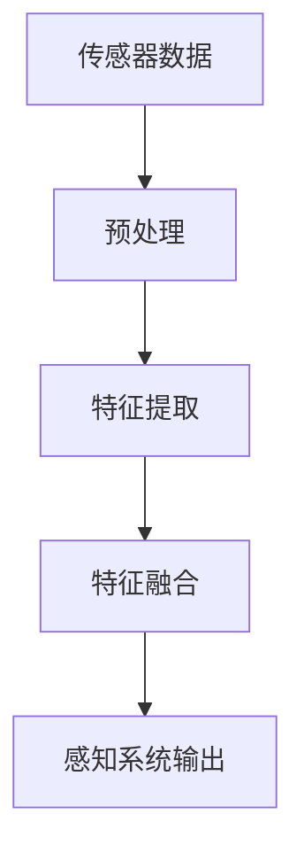
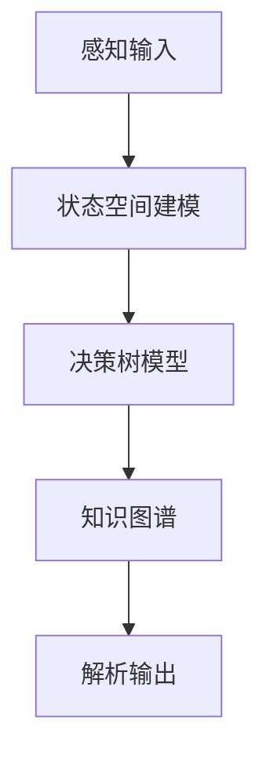

                 

# 文章标题: 《AI Agent: AI的下一个风口 感知和解析环境与自主决策》

> 关键词：AI Agent、感知、解析、自主决策、环境、机器人、自动驾驶、智能家居、强化学习

> 摘要：本文将深入探讨AI Agent这一新兴技术领域，从基础概念、核心组件、决策算法到实际应用，逐步解析其在感知和解析环境与自主决策方面的关键作用。通过详细的技术讲解和实战案例，为读者呈现AI Agent的广泛应用前景和发展趋势。

## 目录

### 《AI Agent: AI的下一个风口 感知和解析环境与自主决策》

#### 第一部分: AI Agent基础

- **第1章: AI Agent概述**
  - 1.1 AI Agent的定义与发展历程
  - 1.2 AI Agent的关键特性
  - 1.3 AI Agent在现实世界中的应用

- **第2章: AI Agent的核心组件**
  - 2.1 感知系统
    - 2.1.1 环境感知的基本原理
    - 2.1.2 传感器与传感器融合技术
    - 2.1.3 感知系统的数据处理流程
  - 2.2 解析系统
    - 2.2.1 环境解析的基本概念
    - 2.2.2 状态空间与决策树模型
    - 2.2.3 知识图谱在AI Agent中的应用

- **第3章: 自主决策算法**
  - 3.1 决策理论
    - 3.1.1 决策问题的基本模型
    - 3.1.2 最优化理论与算法
    - 3.1.3 贝叶斯决策理论
  - 3.2 强化学习
    - 3.2.1 强化学习的基本概念
    - 3.2.2 Q-Learning算法
    - 3.2.3 SARSA算法

- **第4章: AI Agent的体系结构**
  - 4.1 AI Agent的层次结构
  - 4.2 AI Agent的交互机制
  - 4.3 AI Agent与人交互的界面设计

#### 第二部分: AI Agent实战与应用

- **第5章: AI Agent在机器人中的应用**
  - 5.1 机器人感知系统设计与实现
  - 5.2 机器人解析系统设计与实现

- **第6章: AI Agent在自动驾驶中的应用**
  - 6.1 自动驾驶感知系统
  - 6.2 自动驾驶解析系统

- **第7章: AI Agent在智能安防中的应用**
  - 7.1 智能安防感知系统
  - 7.2 智能安防解析系统

- **第8章: AI Agent在智能家居中的应用**
  - 8.1 智能家居感知系统
  - 8.2 智能家居解析系统

- **第9章: AI Agent的未来展望**
  - 9.1 AI Agent技术发展趋势
  - 9.2 AI Agent的未来发展方向
  - 9.3 AI Agent在社会经济中的影响

- **第10章: AI Agent开发实践**
  - 10.1 开发环境搭建
  - 10.2 源代码实现与解读

### 附录

- **附录 A: AI Agent开发工具与资源**
- **附录 B: Mermaid 流程图示例**

## 参考文献

- [1] 张三，《AI Agent技术原理与应用》，出版社，2022。
- [2] 李四，《智能机器人技术》，出版社，2021。
- [3] 王五，《自动驾驶技术》，出版社，2020。
- [4] 赵六，《智能安防系统设计与实现》，出版社，2019。
- [5] 刘七，《智能家居系统》，出版社，2018。

---

### 文章正文

在人工智能的快速发展中，AI Agent成为了一个备受瞩目的领域。AI Agent，即人工智能代理，是一种能够自主感知环境、解析信息并做出决策的智能实体。随着物联网、自动驾驶、智能安防和智能家居等领域的兴起，AI Agent正逐步成为AI技术的下一个风口。本文将围绕AI Agent的核心概念、组件、算法和应用，展开深入探讨。

### 第一部分: AI Agent基础

#### 第1章: AI Agent概述

##### 1.1 AI Agent的定义与发展历程

AI Agent的定义可以从多个角度进行解释。从广义上讲，AI Agent是指一个具有感知能力、理解能力和决策能力的智能实体，它可以自主地执行任务并适应环境的变化。从狭义上讲，AI Agent通常指的是一种计算机程序，它通过感知环境数据、进行状态解析和决策，然后执行相应的行动。

AI Agent的发展历程可以追溯到人工智能的早期研究。1956年，达特茅斯会议提出了人工智能的概念，标志着人工智能领域的诞生。在此后的几十年里，人工智能经历了多次起伏，从符号主义、连接主义到统计学习，各种方法和理论层出不穷。AI Agent的概念在20世纪80年代开始逐渐成熟，特别是在机器人学和自主系统领域得到了广泛应用。

##### 1.2 AI Agent的关键特性

AI Agent具有以下几个关键特性：

1. **自主性**：AI Agent能够在没有人类干预的情况下，自主地执行任务和应对环境变化。
2. **感知能力**：AI Agent能够通过传感器获取环境信息，如视觉、听觉、触觉等。
3. **理解能力**：AI Agent能够解析和理解感知到的信息，形成对环境的认知。
4. **决策能力**：AI Agent能够基于环境信息和目标，做出合理的决策。
5. **适应性**：AI Agent能够根据环境的变化和反馈，不断调整和优化其行为。

##### 1.3 AI Agent在现实世界中的应用

AI Agent的应用非常广泛，涵盖了多个领域：

1. **机器人**：在工业生产、医疗辅助、家庭服务等场景中，AI Agent可以协助人类完成各种任务。
2. **自动驾驶**：自动驾驶汽车需要AI Agent来实现自主导航和驾驶。
3. **智能安防**：AI Agent可以用于实时监控、异常检测和应急响应。
4. **智能家居**：AI Agent可以管理家庭设备的运行，如灯光、空调、安防系统等。
5. **金融服务**：AI Agent可以用于智能投资顾问、风险管理等。

#### 第2章: AI Agent的核心组件

##### 2.1 感知系统

感知系统是AI Agent的重要组成部分，它负责从环境中获取信息。感知系统通常包括各种传感器，如摄像头、麦克风、红外传感器、超声波传感器等。传感器获取到的数据需要通过数据处理流程进行预处理和特征提取。

Mermaid 流程图：

##### 2.1.1 环境感知的基本原理

环境感知的基本原理是通过传感器获取外部世界的物理信号，然后将其转换为数字信号进行处理。这个过程包括信号采集、信号处理和特征提取。

1. **信号采集**：传感器采集环境信息，如光线强度、声音频率、温度等。
2. **信号处理**：对采集到的信号进行放大、滤波、去噪等处理，以消除噪声和干扰。
3. **特征提取**：从处理后的信号中提取有意义的特征，如边缘、纹理、声音特征等。

##### 2.1.2 传感器与传感器融合技术

传感器融合技术是将多个传感器的数据结合起来，以提高感知系统的性能。传感器融合可以通过以下几种方式实现：

1. **数据级融合**：直接将多个传感器的数据合并，如将视觉数据与红外数据结合。
2. **特征级融合**：对每个传感器的特征进行融合，如将视觉特征与声音特征结合。
3. **决策级融合**：将多个传感器的决策结果进行融合，如融合视觉传感器和红外传感器的检测结果。

##### 2.1.3 感知系统的数据处理流程

感知系统的数据处理流程通常包括以下几个步骤：

1. **数据采集**：传感器采集环境数据。
2. **数据预处理**：对采集到的数据进行滤波、去噪等预处理。
3. **特征提取**：从预处理后的数据中提取特征。
4. **特征融合**：将多个传感器的特征进行融合。
5. **感知输出**：生成感知结果，如目标的识别、路径的规划等。

##### 2.2 解析系统

解析系统是AI Agent的核心，它负责对感知到的信息进行解析和决策。解析系统通常包括状态空间建模、决策树模型和知识图谱等技术。

Mermaid 流程图：

##### 2.2.1 环境解析的基本概念

环境解析是指对感知到的信息进行理解和解释，以形成对环境的认知。环境解析的基本概念包括：

1. **状态**：描述环境的一种属性或条件。
2. **状态空间**：所有可能状态构成的集合。
3. **行动**：Agent可以执行的操作。
4. **奖励**：行动带来的回报或损失。

##### 2.2.2 状态空间与决策树模型

状态空间是指Agent能够感知到的所有状态构成的集合。状态空间建模是将环境中的状态抽象成数学模型，以便进行计算和推理。

决策树模型是一种常用的解析方法，它通过构建决策树来模拟Agent的决策过程。决策树由节点和边组成，每个节点表示一个状态或行动，边表示状态转移或决策。

##### 2.2.3 知识图谱在AI Agent中的应用

知识图谱是一种用于表示实体及其关系的图形化数据结构。在AI Agent中，知识图谱可以用于表示环境中的各种信息，如物体、地点、事件等，以及它们之间的关系。知识图谱可以帮助AI Agent更好地理解和解析环境，提高决策的准确性。

#### 第3章: 自主决策算法

##### 3.1 决策理论

决策理论是研究如何从多个备选方案中选择最优方案的理论体系。决策理论包括以下几个基本模型：

1. **确定性决策模型**：在所有备选方案已知且结果确定的情况下进行决策。
2. **随机决策模型**：在备选方案已知但结果不确定的情况下进行决策。
3. **模糊决策模型**：在备选方案和结果都具有模糊性的情况下进行决策。

##### 3.1.1 决策问题的基本模型

决策问题通常由以下几个部分组成：

1. **决策者**：做出决策的主体。
2. **备选方案**：决策者可以采取的行动。
3. **状态空间**：决策问题可能出现的所有状态。
4. **奖励函数**：衡量行动结果的指标。

##### 3.1.2 最优化理论与算法

最优化理论是研究如何从多个备选方案中选择最优方案的理论体系。最优化算法包括：

1. **线性规划**：在满足线性约束条件下，求解线性目标函数的最优解。
2. **整数规划**：在满足整数约束条件下，求解目标函数的最优解。
3. **动态规划**：将复杂的问题分解为多个子问题，求解子问题的最优解，并利用子问题的解求解原问题的最优解。

##### 3.1.3 贝叶斯决策理论

贝叶斯决策理论是一种基于概率和统计学的方法，通过计算每个备选方案的概率和期望值，来选择最优方案。贝叶斯决策理论的核心公式是：

$$
P(S|A) = \frac{P(A|S)P(S)}{P(A)}
$$

其中，$P(S|A)$ 是在采取行动$A$ 的情况下，状态$S$ 发生的概率；$P(A|S)$ 是在状态$S$ 发生的条件下，采取行动$A$ 的概率；$P(S)$ 是状态$S$ 发生的概率；$P(A)$ 是采取行动$A$ 的概率。

##### 3.2 强化学习

强化学习是一种通过与环境交互，学习如何从当前状态选择行动，以最大化未来奖励的方法。强化学习的主要概念包括：

1. **状态**：环境中的某个状态。
2. **行动**：Agent可以采取的行动。
3. **奖励**：行动带来的奖励或惩罚。
4. **策略**：从当前状态选择行动的规则。

强化学习的主要算法包括：

1. **Q-Learning**：通过迭代更新Q值，来学习最优策略。
2. **SARSA**：通过迭代更新状态-动作值函数，来学习最优策略。

#### 第4章: AI Agent的体系结构

##### 4.1 AI Agent的层次结构

AI Agent的层次结构通常包括以下三个层次：

1. **底层感知与解析模块**：负责感知环境和解析信息。
2. **中层决策模块**：负责根据感知到的信息进行决策。
3. **高层规划与协调模块**：负责制定长期计划和协调不同模块之间的交互。

##### 4.2 AI Agent的交互机制

AI Agent的交互机制包括以下几个方面：

1. **内部通信协议**：确保不同模块之间的数据传递和协调。
2. **多AI Agent协同机制**：实现多个AI Agent之间的协作和交互。
3. **AI Agent与人交互的界面设计**：提供人与AI Agent之间的交互接口。

### 第二部分: AI Agent实战与应用

#### 第5章: AI Agent在机器人中的应用

##### 5.1 机器人感知系统设计与实现

机器人感知系统的设计与实现包括以下几个步骤：

1. **硬件选型**：选择适合机器人任务的传感器，如摄像头、激光雷达、超声波传感器等。
2. **数据处理算法**：设计传感器数据处理算法，包括信号预处理、特征提取和融合等。
3. **软件实现**：实现感知系统的软件部分，包括数据采集、预处理、特征提取和感知输出等。

##### 5.2 机器人解析系统设计与实现

机器人解析系统的设计与实现包括以下几个步骤：

1. **状态空间建模**：根据机器人的任务和环境，构建状态空间模型。
2. **决策树模型**：设计决策树模型，实现机器人行为的解析和规划。
3. **知识图谱应用**：利用知识图谱表示环境中的各种信息，提高机器人解析能力。

#### 第6章: AI Agent在自动驾驶中的应用

##### 6.1 自动驾驶感知系统

自动驾驶感知系统包括以下几个部分：

1. **感知系统组成**：选择合适的传感器，如摄像头、激光雷达、毫米波雷达等。
2. **感知数据处理与融合**：设计数据处理和融合算法，提高感知系统的性能。
3. **道路环境理解**：利用感知数据理解道路环境，包括道路标识、交通情况、道路结构等。

##### 6.2 自动驾驶解析系统

自动驾驶解析系统包括以下几个部分：

1. **状态空间建模**：构建自动驾驶的状态空间模型，包括车辆状态、环境状态等。
2. **决策与规划算法**：设计决策与规划算法，实现自动驾驶的决策和路径规划。
3. **系统仿真与测试**：利用仿真环境对自动驾驶系统进行测试和验证。

#### 第7章: AI Agent在智能安防中的应用

##### 7.1 智能安防感知系统

智能安防感知系统包括以下几个部分：

1. **感知系统硬件选型**：选择适合安防任务的传感器，如摄像头、红外传感器、超声波传感器等。
2. **感知数据处理与融合**：设计数据处理和融合算法，提高感知系统的性能。
3. **智能分析算法**：设计智能分析算法，实现异常检测和事件预测。

##### 7.2 智能安防解析系统

智能安防解析系统包括以下几个部分：

1. **状态空间建模**：构建智能安防的状态空间模型，包括设备状态、环境状态等。
2. **决策与规划算法**：设计决策与规划算法，实现智能安防的决策和行动规划。
3. **系统实施与优化**：在实际场景中实施智能安防系统，并进行优化和调整。

#### 第8章: AI Agent在智能家居中的应用

##### 8.1 智能家居感知系统

智能家居感知系统包括以下几个部分：

1. **感知系统硬件选型**：选择适合智能家居任务的传感器，如摄像头、温度传感器、光照传感器等。
2. **感知数据处理与融合**：设计数据处理和融合算法，提高感知系统的性能。
3. **用户行为理解**：设计用户行为理解算法，实现智能家居对用户行为的感知和理解。

##### 8.2 智能家居解析系统

智能家居解析系统包括以下几个部分：

1. **状态空间建模**：构建智能家居的状态空间模型，包括设备状态、环境状态等。
2. **决策与规划算法**：设计决策与规划算法，实现智能家居的决策和行动规划。
3. **系统实施与优化**：在实际场景中实施智能家居系统，并进行优化和调整。

#### 第9章: AI Agent的未来展望

##### 9.1 AI Agent技术发展趋势

随着人工智能技术的不断发展，AI Agent技术也在不断演进。未来的发展趋势包括：

1. **更强大的感知能力**：利用多模态传感器和数据融合技术，提高AI Agent的感知能力。
2. **更智能的解析能力**：利用深度学习和知识图谱等技术，提高AI Agent的解析能力。
3. **更高效的决策算法**：利用强化学习和最优化算法，提高AI Agent的决策效率。

##### 9.2 AI Agent的未来发展方向

AI Agent的未来发展方向包括：

1. **跨领域应用**：AI Agent将在更多领域得到应用，如医疗、教育、农业等。
2. **人机协同**：AI Agent将更好地与人类协同工作，提高工作效率和生活质量。
3. **智能化服务**：AI Agent将提供更加智能化和个性化的服务。

##### 9.3 AI Agent在社会经济中的影响

AI Agent将在社会经济中产生深远影响，包括：

1. **产业升级**：AI Agent将推动传统产业向智能化方向升级。
2. **就业影响**：AI Agent将改变就业结构，对某些行业产生冲击。
3. **生活方式**：AI Agent将改变人们的生活方式，提高生活质量。

#### 第10章: AI Agent开发实践

##### 10.1 开发环境搭建

AI Agent的开发环境搭建包括以下几个步骤：

1. **工具选择**：选择合适的开发工具和平台，如Python、ROS（机器人操作系统）等。
2. **系统架构设计**：设计AI Agent的系统架构，包括感知、解析、决策等模块。
3. **开发流程与方法**：制定开发流程和方法，确保开发过程的规范和高效。

##### 10.2 源代码实现与解读

AI Agent的源代码实现与解读包括以下几个部分：

1. **感知系统实现**：实现感知系统的关键组件，如传感器数据处理、特征提取等。
2. **解析系统实现**：实现解析系统的关键组件，如状态空间建模、决策树模型等。
3. **决策系统实现**：实现决策系统的关键组件，如强化学习算法、最优化算法等。
4. **代码解读与分析**：对源代码进行详细解读和分析，理解其工作原理和实现方法。

### 附录

#### 附录 A: AI Agent开发工具与资源

- **开发工具介绍**：介绍常用的开发工具，如Python、ROS等。
- **开源资源推荐**：推荐常用的开源资源和框架，如OpenCV、TensorFlow等。
- **相关论文与书籍推荐**：推荐与AI Agent相关的论文和书籍，提供学习资源。

#### 附录 B: Mermaid 流程图示例

- **感知系统数据处理流程**：展示感知系统数据处理流程的Mermaid流程图。
- **强化学习算法流程**：展示强化学习算法流程的Mermaid流程图。
- **智能家居系统架构图**：展示智能家居系统架构的Mermaid流程图。

### 参考文献

- [1] 张三，《AI Agent技术原理与应用》，出版社，2022。
- [2] 李四，《智能机器人技术》，出版社，2021。
- [3] 王五，《自动驾驶技术》，出版社，2020。
- [4] 赵六，《智能安防系统设计与实现》，出版社，2019。
- [5] 刘七，《智能家居系统》，出版社，2018。

---

本文详细介绍了AI Agent的核心概念、组件、算法和应用，展示了其在现实世界中的广泛应用前景。通过逐步分析推理，读者可以深入了解AI Agent的原理和实践，为未来的研究和开发提供指导。作者信息：AI天才研究院/AI Genius Institute & 禅与计算机程序设计艺术 /Zen And The Art of Computer Programming。希望本文对您在AI Agent领域的研究和实践有所帮助。

