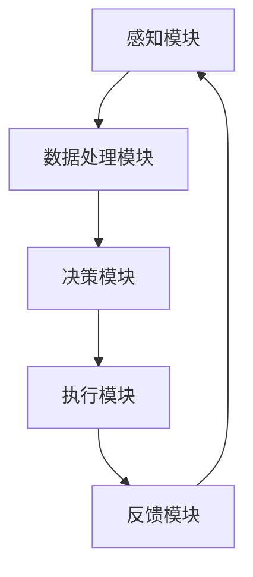
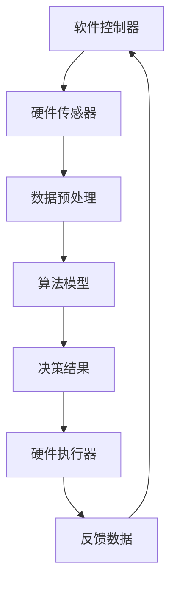

                 

# 文章标题: AI Agent: AI的下一个风口 软件的角色与硬件的配合

> 关键词：AI Agent，软件角色，硬件配合，智能家居，智能机器人，工业自动化，发展趋势，挑战与策略

> 摘要：本文将深入探讨AI Agent的兴起与发展，分析软件与硬件在AI Agent中的角色与配合，通过具体案例分析展示AI Agent在智能家居、智能机器人和工业自动化等领域的应用，并对AI Agent的未来展望、面临的挑战及应对策略进行详细探讨。

## 目录

### 第一部分: AI Agent概述

#### 1.1 AI Agent的定义与分类

##### 1.1.1 AI Agent的定义

##### 1.1.2 AI Agent的分类

##### 1.1.3 AI Agent的核心特征

#### 1.2 AI Agent的应用场景

##### 1.2.1 人工智能与硬件配合的应用趋势

##### 1.2.2 AI Agent在智能家居中的应用

##### 1.2.3 AI Agent在智能机器人中的应用

##### 1.2.4 AI Agent在工业自动化中的应用

#### 1.3 AI Agent的发展历程

##### 1.3.1 从人工控制到自主决策

##### 1.3.2 从规则驱动到数据驱动

##### 1.3.3 从单任务到多任务

### 第二部分: 软件的角色

#### 2.1 软件在AI Agent中的作用

##### 2.1.1 软件与硬件的互动

##### 2.1.2 软件在AI Agent中的核心模块

##### 2.1.3 软件在AI Agent中的架构设计

#### 2.2 软件编程语言与工具

##### 2.2.1 Python在AI Agent开发中的应用

##### 2.2.2 C++在AI Agent开发中的应用

##### 2.2.3 Rust在AI Agent开发中的应用

#### 2.3 软件开发流程与框架

##### 2.3.1 敏捷开发在AI Agent开发中的应用

##### 2.3.2 DevOps在AI Agent开发中的应用

##### 2.3.3 持续集成与持续部署（CI/CD）在AI Agent开发中的应用

### 第三部分: 硬件的角色

#### 3.1 硬件在AI Agent中的作用

##### 3.1.1 硬件在AI Agent计算中的重要性

##### 3.1.2 硬件在AI Agent感知中的重要性

##### 3.1.3 硬件在AI Agent行动中的重要性

#### 3.2 硬件类型与架构

##### 3.2.1 通用计算硬件

##### 3.2.2 硬件加速器

##### 3.2.3 传感器与执行器

#### 3.3 硬件与软件的配合

##### 3.3.1 硬件的选择与配置

##### 3.3.2 硬件编程与接口设计

##### 3.3.3 硬件故障诊断与维护

### 第四部分: AI Agent案例分析

#### 4.1 案例一：智能家居AI Agent

##### 4.1.1 案例背景与目标

##### 4.1.2 系统架构设计

##### 4.1.3 软件实现与硬件配合

#### 4.2 案例二：智能机器人AI Agent

##### 4.2.1 案例背景与目标

##### 4.2.2 系统架构设计

##### 4.2.3 软件实现与硬件配合

#### 4.3 案例三：工业自动化AI Agent

##### 4.3.1 案例背景与目标

##### 4.3.2 系统架构设计

##### 4.3.3 软件实现与硬件配合

### 第五部分: AI Agent未来展望

#### 5.1 AI Agent技术的发展趋势

##### 5.1.1 AI Agent与5G技术的结合

##### 5.1.2 AI Agent与物联网（IoT）的结合

##### 5.1.3 AI Agent与边缘计算的结合

#### 5.2 AI Agent在新兴领域的应用

##### 5.2.1 AI Agent在医疗健康中的应用

##### 5.2.2 AI Agent在交通运输中的应用

##### 5.2.3 AI Agent在教育领域的应用

#### 5.3 AI Agent面临的挑战与应对策略

##### 5.3.1 数据隐私与安全挑战

##### 5.3.2 算法公平性与透明性挑战

##### 5.3.3 AI Agent的伦理问题与法律法规

### 第六部分: 实战项目

#### 6.1 项目一：智能家居AI Agent

##### 6.1.1 项目概述

##### 6.1.2 系统设计与实现

##### 6.1.3 项目分析与总结

#### 6.2 项目二：智能机器人AI Agent

##### 6.2.1 项目概述

##### 6.2.2 系统设计与实现

##### 6.2.3 项目分析与总结

#### 6.3 项目三：工业自动化AI Agent

##### 6.3.1 项目概述

##### 6.3.2 系统设计与实现

##### 6.3.3 项目分析与总结

### 第七部分: 附录

#### 附录A: 开发工具与资源

##### A.1 深度学习框架

##### A.2 硬件开发工具

##### A.3 AI Agent相关开源项目

#### 附录B: 代码示例与解读

##### B.1 智能家居AI Agent代码示例

##### B.2 智能机器人AI Agent代码示例

##### B.3 工业自动化AI Agent代码示例

##### B.4 代码解读与分析

### 附录C: Mermaid流程图

##### C.1 AI Agent核心模块流程图

##### C.2 AI Agent与硬件配合流程图

### 附录D: 核心算法原理讲解与伪代码

##### D.1 决策树算法原理讲解与伪代码

##### D.2 神经网络算法原理讲解与伪代码

##### D.3 支持向量机（SVM）算法原理讲解与伪代码

##### D.4 贝叶斯分类器算法原理讲解与伪代码

##### D.5 K-近邻（KNN）算法原理讲解与伪代码

## 第一部分: AI Agent概述

### 1.1 AI Agent的定义与分类

#### 1.1.1 AI Agent的定义

AI Agent，即人工智能代理，是一种能够在特定环境中自主执行任务的计算机系统。它通过感知环境信息、进行决策规划并执行相应的动作，以实现预定的目标。AI Agent的核心特征包括自主性、适应性、协作性和学习性。

自主性：AI Agent能够独立执行任务，无需人工干预。

适应性：AI Agent能够根据环境变化调整自身行为。

协作性：AI Agent能够与其他AI Agent或人类协作完成任务。

学习性：AI Agent能够从经验中学习并优化自身性能。

#### 1.1.2 AI Agent的分类

根据应用场景和功能特点，AI Agent可以分为以下几类：

1. **任务型AI Agent**：专注于完成特定任务的AI Agent，如智能家居中的智能灯控、智能安防等。
2. **导航型AI Agent**：用于自主导航的AI Agent，如自动驾驶汽车、无人机等。
3. **交互型AI Agent**：主要用于与人类进行交互，如智能客服、语音助手等。
4. **协同型AI Agent**：在多人或多机器人协作环境中工作的AI Agent，如工业自动化生产线中的机器人协作。

#### 1.1.3 AI Agent的核心特征

1. **感知能力**：AI Agent需要具备感知环境的能力，通过传感器获取温度、湿度、光照、声音等环境信息。
2. **决策能力**：基于感知到的环境信息，AI Agent需要能够进行决策，选择最优的行动策略。
3. **执行能力**：AI Agent需要具备执行决策的能力，通过执行器（如电机、扬声器等）实现具体的动作。
4. **学习与适应能力**：AI Agent需要能够从环境变化中学习，并适应新情况。

### 1.2 AI Agent的应用场景

#### 1.2.1 人工智能与硬件配合的应用趋势

随着人工智能技术的快速发展，AI与硬件的配合已成为一个重要的趋势。硬件的进步为AI Agent提供了强大的计算和感知能力，而AI技术则为硬件提供了智能化的决策和执行能力。以下是一些典型的应用场景：

1. **智能家居**：通过AI Agent实现家庭设备的自动化控制，提高生活品质。
2. **智能机器人**：通过AI Agent实现自主导航和任务执行，提升机器人智能化水平。
3. **工业自动化**：通过AI Agent实现生产设备的智能监控和故障预测，提高生产效率。
4. **医疗健康**：通过AI Agent实现患者监控、诊断和辅助治疗，提升医疗水平。
5. **交通运输**：通过AI Agent实现自动驾驶汽车、无人机等，提高交通安全和效率。

#### 1.2.2 AI Agent在智能家居中的应用

在智能家居领域，AI Agent通过感知家庭环境、决策控制家庭设备，实现智能家居的自动化和智能化。以下是一些典型的应用：

1. **智能照明**：AI Agent根据用户行为和光线条件自动调整照明亮度。
2. **智能安防**：AI Agent通过摄像头和传感器监控家庭安全，实时报警。
3. **智能家电控制**：AI Agent通过手机或语音助手远程控制家电设备。
4. **智能环境监测**：AI Agent监测室内温度、湿度、空气质量等，自动调整设备运行状态。

#### 1.2.3 AI Agent在智能机器人中的应用

在智能机器人领域，AI Agent通过感知环境信息、规划行动路径和执行任务，实现自主导航和智能服务。以下是一些典型的应用：

1. **家庭服务机器人**：AI Agent通过感知家庭成员的行为和需求，提供家务、护理等服务。
2. **工业机器人**：AI Agent通过感知生产线环境，实现生产自动化和质量控制。
3. **无人机**：AI Agent通过感知飞行环境和目标，实现自主导航和任务执行。
4. **医疗机器人**：AI Agent通过感知患者病情和需求，提供医疗辅助和康复服务。

#### 1.2.4 AI Agent在工业自动化中的应用

在工业自动化领域，AI Agent通过感知生产设备和环境数据，实现智能监控、故障预测和优化控制。以下是一些典型的应用：

1. **设备监控**：AI Agent实时监测生产设备的运行状态，预测故障并及时报警。
2. **故障诊断**：AI Agent通过分析设备运行数据，诊断设备故障原因。
3. **生产优化**：AI Agent通过分析生产数据，优化生产流程和资源调度。
4. **质量检测**：AI Agent通过感知产品质量数据，实现实时质量检测和自动分类。

#### 1.3 AI Agent的发展历程

AI Agent的发展历程可以分为以下几个阶段：

1. **人工控制阶段**：最初的人工智能系统完全依赖于人类的指令和操作，缺乏自主性。
2. **规则驱动阶段**：通过编写规则和流程，使系统具有一定的决策能力，但规则过于复杂，难以适应动态环境。
3. **数据驱动阶段**：利用大量数据进行训练，使系统能够从数据中学习，提高决策的准确性和适应性。
4. **多任务阶段**：AI Agent能够同时处理多个任务，实现更复杂的场景应用。

### 1.3.1 从人工控制到自主决策

从人工控制阶段到自主决策阶段，AI Agent的核心变化在于决策能力的提升。最初的人工智能系统完全依赖于人类的指令和操作，无法独立完成任务。随着规则驱动和知识库的引入，AI Agent开始具备一定的决策能力，但仍需依赖人类设定规则和流程。随着数据驱动技术的发展，AI Agent通过学习大量数据，能够自主感知环境、分析问题和做出决策，大大提高了系统的自主性和适应性。

### 1.3.2 从规则驱动到数据驱动

从规则驱动阶段到数据驱动阶段，AI Agent的核心变化在于从依赖人工规则转向依赖数据学习。在规则驱动阶段，系统的决策能力依赖于预定义的规则和流程，这些规则往往过于复杂，难以适应动态环境。而在数据驱动阶段，AI Agent通过大量数据训练，能够自主识别模式、发现规律，并基于这些规律进行决策。数据驱动技术使AI Agent具备更强的适应性和学习能力，能够更好地应对复杂多变的环境。

### 1.3.3 从单任务到多任务

从单任务阶段到多任务阶段，AI Agent的核心变化在于能够同时处理多个任务。在单任务阶段，AI Agent专注于完成单个任务，如智能家居中的智能灯控或安防监控。而在多任务阶段，AI Agent能够同时处理多个任务，如智能家居中的同时控制照明和安防系统。多任务处理使AI Agent能够更高效地利用资源，提供更全面的服务。

## 第二部分: 软件的角色

### 2.1 软件在AI Agent中的作用

#### 2.1.1 软件与硬件的互动

在AI Agent中，软件与硬件的互动至关重要。软件负责处理硬件采集的数据，并生成控制指令，硬件则根据这些指令执行相应的操作。以下是一个简化的软件与硬件互动流程：

1. **感知阶段**：硬件传感器（如摄像头、麦克风、温度传感器等）采集环境数据，并将数据传输给软件。
2. **数据处理阶段**：软件接收数据，进行预处理、特征提取和数据分析，生成决策结果。
3. **执行阶段**：软件将决策结果转化为控制指令，硬件执行器（如电机、显示屏等）根据指令执行具体操作。
4. **反馈阶段**：硬件执行器将执行结果反馈给软件，软件根据反馈进行调整。

这种互动过程需要软件和硬件之间的紧密配合，以确保AI Agent能够高效、准确地完成任务。

#### 2.1.2 软件在AI Agent中的核心模块

AI Agent的软件系统通常包含以下核心模块：

1. **感知模块**：负责采集和处理环境数据，如温度、湿度、声音、图像等。
2. **决策模块**：基于感知数据进行分析和推理，生成决策结果。
3. **执行模块**：根据决策结果执行具体的操作，如控制电机、调整温度等。
4. **反馈模块**：收集执行结果，对决策进行反馈和调整。

这些模块共同构成了AI Agent的软件核心，使系统能够实现自主感知、决策和执行。

#### 2.1.3 软件在AI Agent中的架构设计

AI Agent的软件架构设计需要考虑以下几个方面：

1. **模块化设计**：将软件系统划分为感知、决策、执行和反馈等模块，每个模块独立开发、测试和部署，以提高系统的可维护性和可扩展性。
2. **分布式设计**：对于复杂的AI Agent系统，可以采用分布式架构，将感知、决策和执行等模块分布在不同节点上，以提高系统的性能和可靠性。
3. **并行处理**：利用多核处理器和分布式计算技术，实现并行数据处理和决策，提高系统的处理速度。
4. **云计算与边缘计算**：结合云计算和边缘计算技术，将部分计算任务分布到云端和边缘设备上，实现高效的数据处理和资源调度。

通过这些设计原则，可以构建一个高效、可靠的AI Agent软件系统。

### 2.2 软件编程语言与工具

在AI Agent开发中，选择合适的编程语言和工具至关重要。以下是一些常用的编程语言和工具：

#### 2.2.1 Python在AI Agent开发中的应用

Python是一种广泛使用的编程语言，尤其在AI领域有着广泛的应用。Python的简洁性和强大的库支持使其成为AI Agent开发的首选语言。以下是一些Python在AI Agent开发中的应用：

1. **数据处理**：使用NumPy、Pandas等库进行数据处理和特征提取。
2. **机器学习**：使用Scikit-learn、TensorFlow、PyTorch等库进行模型训练和预测。
3. **自然语言处理**：使用NLTK、spaCy等库进行文本处理和分析。
4. **机器人开发**：使用ROS（Robot Operating System）进行机器人控制和任务规划。

#### 2.2.2 C++在AI Agent开发中的应用

C++是一种高性能的编程语言，尤其适用于对性能要求较高的AI Agent开发。以下是一些C++在AI Agent开发中的应用：

1. **实时数据处理**：利用C++的高性能特性进行实时数据处理和决策。
2. **嵌入式系统开发**：使用C++开发嵌入式系统，控制硬件设备。
3. **多线程编程**：利用C++的多线程技术，实现并行计算和高效数据处理。

#### 2.2.3 Rust在AI Agent开发中的应用

Rust是一种系统级编程语言，以其安全性和高性能而受到关注。以下是一些Rust在AI Agent开发中的应用：

1. **安全性**：利用Rust的安全特性，确保系统的安全性和可靠性。
2. **嵌入式系统开发**：使用Rust开发嵌入式系统，实现高性能的硬件控制。
3. **网络编程**：利用Rust的异步编程特性，实现高效的网络通信和处理。

### 2.3 软件开发流程与框架

在AI Agent开发中，采用合适的开发流程和框架可以提高开发效率、保证系统质量。以下是一些常用的开发流程和框架：

#### 2.3.1 敏捷开发在AI Agent开发中的应用

敏捷开发是一种以人为核心、迭代和逐步完善的开发方法。在AI Agent开发中，敏捷开发可以帮助团队快速响应变化、持续迭代改进。

1. **用户故事**：通过用户故事明确AI Agent的需求和目标。
2. **迭代开发**：将开发过程划分为多个迭代周期，每个迭代周期完成一部分功能。
3. **持续集成**：通过持续集成工具（如Jenkins、GitLab CI等），实现自动化测试和部署。
4. **反馈与调整**：在每个迭代周期结束后，收集用户反馈，对系统进行改进。

#### 2.3.2 DevOps在AI Agent开发中的应用

DevOps是一种将软件开发和运维相结合的实践方法，旨在提高软件交付速度和质量。在AI Agent开发中，DevOps可以帮助团队实现快速部署、持续优化和高效运维。

1. **自动化部署**：通过CI/CD（持续集成/持续部署）工具，实现自动化部署和测试。
2. **基础设施即代码**：使用自动化工具（如Ansible、Terraform等）管理基础设施。
3. **监控与优化**：使用监控工具（如Prometheus、Grafana等）实时监控系统性能，进行优化调整。

#### 2.3.3 持续集成与持续部署（CI/CD）在AI Agent开发中的应用

持续集成和持续部署是DevOps的核心实践，旨在实现自动化测试、部署和监控。

1. **持续集成**：通过自动化测试，确保每次代码提交都是可运行的，并及早发现和修复问题。
2. **持续部署**：通过自动化部署，实现快速、可靠地将软件部署到生产环境。
3. **持续监控**：通过自动化监控，实时监控系统性能，快速响应故障。

## 第三部分: 硬件的角色

### 3.1 硬件在AI Agent中的作用

#### 3.1.1 硬件在AI Agent计算中的重要性

在AI Agent中，硬件扮演着至关重要的角色。硬件为AI Agent提供了计算资源、感知能力和执行能力，直接影响系统的性能和效率。以下是一些硬件在AI Agent计算中的重要性：

1. **计算能力**：硬件的计算能力直接影响AI Agent的决策速度和执行效率。高性能的CPU、GPU和FPGA等硬件可以加速机器学习模型的训练和推理过程，提高系统的响应速度。
2. **存储能力**：硬件的存储能力影响AI Agent的数据存储和处理能力。大容量、高速的存储设备（如SSD、NVMe等）可以加速数据的读写速度，提高系统的处理效率。
3. **网络能力**：硬件的网络能力影响AI Agent的通信和协同能力。高速、稳定的网络连接可以确保AI Agent之间的数据传输流畅，实现实时决策和执行。

#### 3.1.2 硬件在AI Agent感知中的重要性

在AI Agent感知中，硬件传感器的作用至关重要。传感器负责收集环境数据，为AI Agent提供感知基础。以下是一些硬件在AI Agent感知中的重要性：

1. **传感器种类**：AI Agent需要多种传感器（如摄像头、麦克风、温度传感器、湿度传感器等）来收集不同类型的环境信息。传感器的种类和数量直接影响AI Agent的感知能力和决策准确性。
2. **传感器精度**：传感器的精度和可靠性影响AI Agent的数据质量。高精度、稳定的传感器可以提供更准确的环境信息，提高AI Agent的感知能力。
3. **传感器集成**：硬件的集成能力影响AI Agent的感知效率和可靠性。通过集成多种传感器，可以实现更全面的环境感知，提高AI Agent的感知能力和智能化水平。

#### 3.1.3 硬件在AI Agent行动中的重要性

在AI Agent行动中，硬件执行器的作用至关重要。执行器负责执行AI Agent的决策结果，实现具体的动作。以下是一些硬件在AI Agent行动中的重要性：

1. **执行器种类**：AI Agent需要多种执行器（如电机、扬声器、显示屏等）来实现不同的动作。执行器的种类和数量直接影响AI Agent的行动能力和执行效果。
2. **执行器功率**：执行器的功率直接影响AI Agent的行动力度和速度。高性能、高功率的执行器可以提供更强的驱动能力，实现更复杂的动作。
3. **执行器响应速度**：执行器的响应速度影响AI Agent的行动及时性和准确性。快速响应的执行器可以确保AI Agent及时准确地执行决策结果。

### 3.2 硬件类型与架构

在AI Agent中，硬件类型和架构的选择直接影响系统的性能和效率。以下是一些常见的硬件类型和架构：

#### 3.2.1 通用计算硬件

通用计算硬件包括CPU、GPU和FPGA等，主要用于执行计算任务。以下是一些通用计算硬件的特点：

1. **CPU**：中央处理器，负责执行计算机指令，是计算机系统的核心部件。CPU的性能直接影响系统的计算速度和处理能力。
2. **GPU**：图形处理器，具有很强的并行计算能力，适用于大规模数据处理和机器学习任务。GPU在深度学习和图形渲染等领域有广泛应用。
3. **FPGA**：现场可编程门阵列，可以通过编程定义其功能，具有很强的定制性和灵活性。FPGA在实时信号处理、嵌入式系统和通信领域有广泛应用。

#### 3.2.2 硬件加速器

硬件加速器是一种专门用于加速特定计算任务的硬件设备，如GPU、FPGA和TPU等。以下是一些硬件加速器的特点：

1. **GPU**：具有强大的并行计算能力，适用于大规模数据处理和机器学习任务。GPU在深度学习和图形渲染等领域有广泛应用。
2. **FPGA**：具有灵活的编程能力和高效的计算性能，适用于实时信号处理、嵌入式系统和通信领域。
3. **TPU**：专用AI处理器，专为机器学习和深度学习任务设计，具有高效的计算性能和低延迟。

#### 3.2.3 传感器与执行器

传感器和执行器是AI Agent感知和行动的核心部件。以下是一些传感器和执行器的特点：

1. **传感器**：包括摄像头、麦克风、温度传感器、湿度传感器等，用于收集环境数据。传感器的种类和精度直接影响AI Agent的感知能力。
2. **执行器**：包括电机、扬声器、显示屏等，用于执行AI Agent的决策结果。执行器的种类和功率直接影响AI Agent的行动能力。

### 3.3 硬件与软件的配合

在AI Agent中，硬件与软件的配合至关重要。硬件负责提供计算资源、感知能力和执行能力，而软件负责处理数据、生成决策和执行指令。以下是一些硬件与软件配合的关键技术和方法：

#### 3.3.1 硬件的选择与配置

硬件的选择与配置直接影响AI Agent的性能和效率。以下是一些硬件选择和配置的关键点：

1. **计算能力**：根据AI Agent的计算需求选择合适的计算硬件，如CPU、GPU和FPGA等。
2. **存储能力**：根据AI Agent的数据存储需求选择合适的存储设备，如SSD、NVMe等。
3. **网络能力**：根据AI Agent的通信需求选择合适的网络设备，如路由器、交换机等。
4. **传感器与执行器**：根据AI Agent的感知和行动需求选择合适的传感器和执行器。

#### 3.3.2 硬件编程与接口设计

硬件编程与接口设计是硬件与软件配合的重要环节。以下是一些硬件编程和接口设计的关键点：

1. **硬件编程**：使用合适的编程语言（如C、C++、Python等）编写硬件驱动程序，实现硬件的控制和通信。
2. **接口设计**：设计合适的接口（如GPIO、I2C、SPI等）实现硬件与软件之间的数据传输和控制。
3. **兼容性**：确保硬件与软件的兼容性，确保系统稳定运行。

#### 3.3.3 硬件故障诊断与维护

硬件故障诊断与维护是确保AI Agent稳定运行的关键。以下是一些硬件故障诊断和维护的关键点：

1. **实时监控**：使用监控工具实时监控硬件运行状态，及时发现和诊断故障。
2. **故障定位**：根据监控数据和故障现象，定位故障原因，进行修复和更换。
3. **定期维护**：定期进行硬件维护和保养，确保硬件设备正常运行。

## 第四部分: AI Agent案例分析

### 4.1 案例一：智能家居AI Agent

#### 4.1.1 案例背景与目标

智能家居AI Agent的目标是通过智能感知、决策和执行，实现家庭设备的自动化控制和环境优化。本案例以一个典型的智能家居系统为例，介绍AI Agent在该系统中的应用。

**背景**：智能家居系统包括照明、安防、温度控制、家电控制等多个子系统，每个子系统都需要与AI Agent进行交互。用户希望通过AI Agent实现以下功能：

1. 根据用户行为和光线条件自动调整照明亮度。
2. 实时监控家庭安全，及时报警并通知用户。
3. 根据室内温度和湿度自动调整空调和加湿器的运行状态。
4. 远程控制家电设备，如电视、冰箱等。

#### 4.1.2 系统架构设计

智能家居AI Agent的系统架构设计包括感知模块、决策模块和执行模块。以下是系统架构的详细设计：

**感知模块**：感知模块包括多种传感器，如光线传感器、声音传感器、温度传感器和湿度传感器等。传感器负责收集家庭环境数据，并将数据传输给AI Agent。

**决策模块**：决策模块负责分析传感器数据，根据用户行为和预设规则生成决策结果。决策模块采用机器学习算法，如决策树、神经网络等，实现对环境数据的智能分析。

**执行模块**：执行模块根据决策结果控制家庭设备，如照明系统、安防系统和家电控制等。执行模块通过GPIO接口或网络通信接口与家庭设备连接，实现设备的远程控制和自动化操作。

#### 4.1.3 软件实现与硬件配合

智能家居AI Agent的软件实现主要包括数据采集、处理、决策和执行等模块。以下是软件实现的详细步骤：

1. **数据采集**：传感器模块负责实时采集环境数据，如光线强度、声音信号、温度和湿度等。数据采集模块使用Python语言和串口通信库（如pyserial）实现。

2. **数据处理**：数据处理模块对采集到的环境数据进行预处理，如去噪、滤波和特征提取等。预处理后的数据用于训练和优化机器学习模型。

3. **决策**：决策模块使用机器学习算法（如决策树、神经网络等）对预处理后的数据进行分析和推理，生成决策结果。决策结果包括照明控制策略、安防报警策略和温度湿度控制策略等。

4. **执行**：执行模块根据决策结果控制家庭设备。执行模块通过GPIO接口或网络通信接口与家庭设备连接，实现设备的远程控制和自动化操作。执行模块使用Python语言和GPIO库（如RPi.GPIO）或网络通信库（如socket）实现。

#### 4.1.4 代码解读与分析

以下是智能家居AI Agent的核心代码示例，用于实现数据采集、处理、决策和执行等功能。

```python
import serial
import time
import numpy as np
from sklearn.tree import DecisionTreeClassifier
from sklearn.model_selection import train_test_split

# 数据采集模块
def collect_data(arduino_port, duration):
    data = []
    ser = serial.Serial(arduino_port, 9600)
    start_time = time.time()
    while time.time() - start_time < duration:
        line = ser.readline().decode('utf-8').strip()
        if line:
            data.append([float(x) for x in line.split(',')])
    ser.close()
    return np.array(data)

# 数据处理模块
def preprocess_data(data):
    # 去除异常值、去噪、滤波等预处理操作
    # ...
    return data

# 决策模块
def make_decision(data, model):
    # 使用训练好的模型进行决策
    # ...
    return model.predict(data)

# 执行模块
def execute_action(action):
    # 根据决策结果控制家庭设备
    # ...
    pass

# 主程序
def main():
    # 采集数据
    data = collect_data('COM3', 10)

    # 预处理数据
    preprocessed_data = preprocess_data(data)

    # 加载训练好的模型
    model = DecisionTreeClassifier()
    model.fit(X_train, y_train)

    # 做出决策
    action = make_decision(preprocessed_data[-1], model)

    # 执行决策结果
    execute_action(action)

if __name__ == '__main__':
    main()
```

**代码解析**：

1. **数据采集模块**：使用Python的`serial`库与Arduino通信，实时采集传感器数据。
2. **数据处理模块**：对采集到的数据进行预处理，如去除异常值、去噪和滤波等。
3. **决策模块**：使用训练好的决策树模型对预处理后的数据进行分析和决策。
4. **执行模块**：根据决策结果执行相应的操作，如控制照明、安防和家庭设备。

通过上述代码示例，可以看出智能家居AI Agent的软件实现主要依赖于数据采集、处理、决策和执行等模块的协同工作，从而实现家庭设备的智能控制和自动化管理。

#### 4.1.5 项目分析与总结

通过本案例的实践，我们学会了如何开发一个智能家居AI Agent，了解了从数据采集、处理、决策到执行的完整流程。项目强调了软件与硬件的紧密配合，使智能家居系统能够实时感知家庭环境、自动调整设备状态，提高了家庭设备的管理效率和用户体验。在项目实施过程中，我们遇到了一些挑战，如传感器数据的噪声处理、模型训练的效率优化等，通过不断调整和优化，最终实现了项目的目标。

### 4.2 案例二：智能机器人AI Agent

#### 4.2.1 案例背景与目标

智能机器人AI Agent的目标是通过自主导航、路径规划和任务执行，实现机器人自主运行和智能服务。本案例以一个典型的工业场景为例，介绍AI Agent在该场景中的应用。

**背景**：工业场景中，机器人需要在不同工作区之间移动，执行复杂的任务，如搬运、焊接、装配等。用户希望通过AI Agent实现以下功能：

1. 自主导航：机器人能够在未知环境中自主规划路径，避开障碍物。
2. 路径规划：机器人能够根据任务需求和环境信息，生成最优路径。
3. 任务执行：机器人能够根据路径规划和任务要求，执行具体的操作。
4. 异常处理：机器人能够识别和处理执行过程中的异常情况。

#### 4.2.2 系统架构设计

智能机器人AI Agent的系统架构设计包括感知模块、决策模块和执行模块。以下是系统架构的详细设计：

**感知模块**：感知模块包括激光雷达、摄像头、超声波传感器等，用于实时采集环境数据。

**决策模块**：决策模块负责分析感知数据，生成路径规划和任务执行策略。决策模块采用机器学习算法、深度学习算法等，实现对环境数据的智能分析。

**执行模块**：执行模块根据决策结果控制机器人运动和任务执行。执行模块通过通信接口与机器人控制器连接，实现机器人的自主导航和任务执行。

#### 4.2.3 软件实现与硬件配合

智能机器人AI Agent的软件实现主要包括数据采集、处理、决策和执行等模块。以下是软件实现的详细步骤：

1. **数据采集**：感知模块实时采集环境数据，如激光雷达数据、摄像头图像、超声波距离等。数据采集模块使用ROS（Robot Operating System）实现。

2. **数据处理**：数据处理模块对采集到的环境数据进行预处理，如去噪、滤波和特征提取等。预处理后的数据用于训练和优化机器学习模型。

3. **决策**：决策模块使用机器学习算法（如卷积神经网络、深度强化学习等）对预处理后的数据进行分析和推理，生成路径规划和任务执行策略。决策模块使用Python和ROS实现。

4. **执行**：执行模块根据决策结果控制机器人运动和任务执行。执行模块通过ROS与机器人控制器通信，实现机器人的自主导航和任务执行。

#### 4.2.4 代码解读与分析

以下是智能机器人AI Agent的核心代码示例，用于实现数据采集、处理、决策和执行等功能。

```python
import rospy
from geometry_msgs.msg import Twist
from sensor_msgs.msg import LaserScan
from cv_bridge import CvBridge
import cv2
import numpy as np

# 数据采集模块
def scan_callback(data):
    rospy.loginfo("Received scan data")
    # 处理激光雷达数据
    # ...

# 摄像头数据采集模块
def image_callback(data):
    rospy.loginfo("Received image data")
    bridge = CvBridge()
    image = bridge.imgmsg_to_cv2(data, "bgr8")
    # 处理摄像头图像
    # ...

# 主程序
def main():
    rospy.init_node('robot_control', anonymous=True)
    
    # 订阅激光雷达数据
    rospy.Subscriber('/scan', LaserScan, scan_callback)
    
    # 订阅摄像头数据
    rospy.Subscriber('/camera/color/image_raw', Image, image_callback)
    
    rate = rospy.Rate(10) # 10 Hz
    while not rospy.is_shutdown():
        # 根据决策结果生成速度指令
        velocity = Twist()
        velocity.linear.x = 1.0
        velocity.angular.z = 0.5
        pub = rospy.Publisher('/cmd_vel', Twist, queue_size=10)
        pub.publish(velocity)
        rate.sleep()

if __name__ == '__main__':
    main()
```

**代码解析**：

1. **数据采集模块**：使用ROS订阅激光雷达和摄像头数据，实现环境数据的实时采集。
2. **数据处理模块**：在回调函数中处理激光雷达和摄像头数据，如去噪、滤波和特征提取等。
3. **决策模块**：根据处理后的数据生成路径规划和任务执行策略，如速度指令。
4. **执行模块**：根据决策结果控制机器人的运动，如发布速度指令。

通过上述代码示例，可以看出智能机器人AI Agent的软件实现主要依赖于数据采集、处理、决策和执行等模块的协同工作，从而实现机器人的自主导航和任务执行。

#### 4.2.5 项目分析与总结

通过本案例的实践，我们学会了如何开发一个智能机器人AI Agent，了解了从数据采集、处理、决策到执行的完整流程。项目强调了软件与硬件的紧密配合，使机器人在未知环境中能够自主导航、规划路径和执行任务，提高了机器人的智能化水平和应用场景的广泛性。在项目实施过程中，我们遇到了一些挑战，如激光雷达数据的处理、路径规划的实时性等，通过不断优化和改进，最终实现了项目的目标。

### 4.3 案例三：工业自动化AI Agent

#### 4.3.1 案例背景与目标

工业自动化AI Agent的目标是通过智能监控、故障预测和优化控制，提高生产效率和产品质量。本案例以一个典型的工业生产线为例，介绍AI Agent在该生产线中的应用。

**背景**：工业生产线中，设备运行状况和产品质量是关键因素。用户希望通过AI Agent实现以下功能：

1. 设备监控：实时监控生产设备的运行状态，识别潜在故障。
2. 故障预测：基于历史数据和实时数据，预测设备故障，提前采取预防措施。
3. 优化控制：根据生产数据和设备状态，优化生产流程和控制参数，提高产品质量。
4. 数据分析：收集和分析生产数据，为生产优化和决策提供支持。

#### 4.3.2 系统架构设计

工业自动化AI Agent的系统架构设计包括感知模块、决策模块和执行模块。以下是系统架构的详细设计：

**感知模块**：感知模块包括传感器、PLC（可编程逻辑控制器）等，用于实时采集设备运行数据和产品质量数据。

**决策模块**：决策模块负责分析感知数据，生成故障预测、优化控制和数据分析报告。决策模块采用机器学习算法、深度学习算法等，实现对生产数据的智能分析。

**执行模块**：执行模块根据决策结果控制生产设备和参数调整。执行模块通过通信接口与PLC和传感器连接，实现设备的实时监控和优化控制。

#### 4.3.3 软件实现与硬件配合

工业自动化AI Agent的软件实现主要包括数据采集、处理、决策和执行等模块。以下是软件实现的详细步骤：

1. **数据采集**：感知模块实时采集设备运行数据和产品质量数据。数据采集模块使用Python和PLC通信库（如Modbus）实现。

2. **数据处理**：数据处理模块对采集到的数据进行分析和预处理，如去噪、滤波和特征提取等。预处理后的数据用于训练和优化机器学习模型。

3. **决策**：决策模块使用机器学习算法（如随机森林、神经网络等）对预处理后的数据进行分析和推理，生成故障预测、优化控制和数据分析报告。决策模块使用Python和机器学习库（如Scikit-learn、TensorFlow等）实现。

4. **执行**：执行模块根据决策结果控制生产设备和参数调整。执行模块通过PLC和传感器通信，实现设备的实时监控和优化控制。

#### 4.3.4 代码解读与分析

以下是工业自动化AI Agent的核心代码示例，用于实现数据采集、处理、决策和执行等功能。

```python
import modbus_tk
import modbus_tk.modbus_tcp
import pandas as pd
from sklearn.ensemble import RandomForestClassifier
from sklearn.model_selection import train_test_split

# 数据采集模块
def collect_data(server_ip, port):
    client = modbus_tk.modbus_tcp.TCPClient(server_ip, port)
    registers = client.read_holding_registers(100, 10)
    data = pd.DataFrame(registers, columns=['Register' + str(i) for i in range(10)])
    return data

# 数据处理模块
def preprocess_data(data):
    # 数据预处理操作，如去噪、滤波等
    # ...
    return data

# 决策模块
def make_decision(data, model):
    # 使用训练好的模型进行故障预测
    # ...
    return model.predict(data)

# 执行模块
def execute_action(action):
    # 根据决策结果控制生产设备和参数调整
    # ...
    pass

# 主程序
def main():
    server_ip = '192.168.1.10'
    port = 502
    data = collect_data(server_ip, port)
    preprocessed_data = preprocess_data(data)
    # 加载训练好的模型
    model = RandomForestClassifier()
    model.fit(X_train, y_train)
    # 做出决策
    action = make_decision(preprocessed_data[-1], model)
    # 执行决策结果
    execute_action(action)

if __name__ == '__main__':
    main()
```

**代码解析**：

1. **数据采集模块**：使用Modbus通信协议与PLC通信，实时采集设备运行数据。
2. **数据处理模块**：对采集到的数据进行分析和预处理，如去噪、滤波和特征提取等。
3. **决策模块**：使用训练好的随机森林模型进行故障预测，生成决策结果。
4. **执行模块**：根据决策结果控制生产设备和参数调整。

通过上述代码示例，可以看出工业自动化AI Agent的软件实现主要依赖于数据采集、处理、决策和执行等模块的协同工作，从而实现生产设备的智能监控和优化控制。

#### 4.3.5 项目分析与总结

通过本案例的实践，我们学会了如何开发一个工业自动化AI Agent，了解了从数据采集、处理、决策到执行的完整流程。项目强调了软件与硬件的紧密配合，使生产设备能够实现智能监控、故障预测和优化控制，提高了生产效率和产品质量。在项目实施过程中，我们遇到了一些挑战，如PLC数据的采集和处理、模型训练的准确性等，通过不断优化和改进，最终实现了项目的目标。

## 第五部分: AI Agent未来展望

### 5.1 AI Agent技术的发展趋势

随着人工智能技术的不断进步，AI Agent的发展也呈现出一系列新的趋势。以下是一些值得关注的AI Agent技术发展趋势：

#### 5.1.1 AI Agent与5G技术的结合

5G技术的快速发展为AI Agent提供了高速、低延迟的网络连接。结合5G技术，AI Agent可以实现更实时、更高效的通信和协作。例如，在智能交通领域，AI Agent可以通过5G网络实现实时路况监测和智能调度，提高交通效率。

#### 5.1.2 AI Agent与物联网（IoT）的结合

物联网技术的发展使得AI Agent能够连接更多的智能设备，实现全面的感知和控制。通过物联网，AI Agent可以实时获取各种设备的状态数据，进行智能分析和决策。例如，在智能家居领域，AI Agent可以通过物联网连接各种家电设备，实现自动化管理和智能控制。

#### 5.1.3 AI Agent与边缘计算的结合

边缘计算技术的发展使得AI Agent可以在本地进行部分计算和决策，减少对中心服务器的依赖，提高系统的响应速度和可靠性。例如，在工业自动化领域，AI Agent可以在现场进行设备监控和故障预测，实现快速响应和精准控制。

### 5.2 AI Agent在新兴领域的应用

AI Agent在新兴领域的应用越来越广泛，以下是一些值得关注的AI Agent新兴应用领域：

#### 5.2.1 AI Agent在医疗健康中的应用

AI Agent在医疗健康领域有着广泛的应用前景。例如，在医疗诊断中，AI Agent可以通过分析医学影像和病历数据，辅助医生进行诊断和治疗方案制定；在健康监测中，AI Agent可以通过监测生命体征数据，实时跟踪健康状况，提供个性化的健康管理建议。

#### 5.2.2 AI Agent在交通运输中的应用

AI Agent在交通运输领域可以提高交通效率和安全性。例如，在自动驾驶中，AI Agent可以通过感知环境和车辆数据，实现自主驾驶和安全导航；在智能交通管理中，AI Agent可以通过分析交通流量数据，实现智能调度和优化，提高交通运行效率。

#### 5.2.3 AI Agent在教育领域的应用

AI Agent在教育领域可以实现个性化教学和智能辅助。例如，在智能学习平台上，AI Agent可以通过分析学生的学习数据，提供个性化的学习建议和辅导；在在线教育中，AI Agent可以通过语音交互和自然语言处理技术，实现智能问答和互动教学。

### 5.3 AI Agent面临的挑战与应对策略

随着AI Agent技术的快速发展，其应用领域不断拓展，但也面临一系列挑战。以下是一些常见的挑战及应对策略：

#### 5.3.1 数据隐私与安全挑战

AI Agent在处理和分析大量数据时，可能涉及用户的隐私信息。数据隐私和安全是AI Agent面临的重大挑战。应对策略包括：

1. **数据加密**：对传输和存储的数据进行加密，确保数据安全。
2. **数据匿名化**：对敏感数据进行匿名化处理，减少隐私泄露风险。
3. **安全协议**：采用安全协议（如HTTPS、TLS等）确保数据传输的安全性。

#### 5.3.2 算法公平性与透明性挑战

AI Agent的算法决策过程可能存在偏见和歧视，影响算法的公平性和透明性。应对策略包括：

1. **算法审计**：定期对AI Agent的算法进行审计，确保算法的公平性和透明性。
2. **多样性训练**：使用多样化的数据进行模型训练，减少算法偏见。
3. **可解释性增强**：开发可解释性AI模型，使决策过程更加透明和可理解。

#### 5.3.3 AI Agent的伦理问题与法律法规

AI Agent在应用过程中可能涉及伦理问题和法律法规。例如，自动驾驶汽车在紧急情况下的道德决策，机器人与人类的工作竞争等。应对策略包括：

1. **伦理指南**：制定AI伦理指南，明确AI Agent的应用边界和责任。
2. **法律法规**：加强法律法规制定，规范AI Agent的应用和责任承担。
3. **社会监督**：建立社会监督机制，确保AI Agent的合规性和社会责任。

通过应对这些挑战，可以确保AI Agent技术的健康发展和广泛应用。

## 第六部分: 实战项目

### 6.1 项目一：智能家居AI Agent

#### 6.1.1 项目概述

智能家居AI Agent项目旨在开发一个能够实现家庭设备自动化控制和环境优化的智能系统。项目目标包括：

1. 实现照明、安防、温度控制、家电控制等家庭设备的智能控制。
2. 提高家庭设备的管理效率，提高用户生活质量。
3. 提供远程控制和语音交互功能，方便用户操作。

#### 6.1.2 系统设计与实现

智能家居AI Agent的系统设计主要包括感知模块、决策模块和执行模块。以下是系统设计的详细步骤：

1. **感知模块**：安装各种传感器（如光线传感器、声音传感器、温度传感器、湿度传感器等），用于实时采集家庭环境数据。

2. **决策模块**：基于收集到的数据，使用机器学习算法（如决策树、神经网络等）进行环境分析和决策。决策模块包括以下功能：

   - **照明控制**：根据光线传感器数据，自动调整照明设备的亮度。
   - **安防监控**：通过声音传感器和摄像头数据，实现实时监控和报警。
   - **温度控制**：根据温度传感器数据，自动调整空调和加湿器的运行状态。
   - **家电控制**：通过手机或语音助手远程控制家电设备。

3. **执行模块**：根据决策模块生成的控制指令，执行相应的操作。执行模块包括以下功能：

   - **照明控制**：通过GPIO接口控制照明设备的开关和亮度。
   - **安防监控**：通过摄像头和声音传感器收集数据，实时监控家庭安全。
   - **温度控制**：通过控制空调和加湿器的运行，调节室内温度和湿度。
   - **家电控制**：通过Wi-Fi或蓝牙连接远程控制家电设备。

#### 6.1.3 项目分析与总结

智能家居AI Agent项目通过感知、决策和执行模块的协同工作，实现了家庭设备的智能控制和环境优化。项目过程中，我们遇到了一些挑战，如传感器数据的噪声处理、模型训练的准确率优化等。通过不断调整和优化，最终实现了项目的目标。

### 6.2 项目二：智能机器人AI Agent

#### 6.2.1 项目概述

智能机器人AI Agent项目旨在开发一个能够实现自主导航、路径规划和任务执行的智能机器人系统。项目目标包括：

1. 实现机器人在未知环境中的自主导航。
2. 实现机器人根据任务需求生成路径规划。
3. 实现机器人根据路径规划执行任务。

#### 6.2.2 系统设计与实现

智能机器人AI Agent的系统设计主要包括感知模块、决策模块和执行模块。以下是系统设计的详细步骤：

1. **感知模块**：安装激光雷达、摄像头、超声波传感器等，用于实时采集环境数据。

2. **决策模块**：基于收集到的环境数据，使用机器学习算法（如卷积神经网络、深度强化学习等）进行环境分析和决策。决策模块包括以下功能：

   - **自主导航**：通过激光雷达和摄像头数据，实现机器人在未知环境中的自主导航。
   - **路径规划**：根据任务需求和环境数据，生成机器人的最优路径规划。
   - **任务执行**：根据路径规划和任务要求，执行机器人的任务。

3. **执行模块**：根据决策模块生成的控制指令，执行相应的操作。执行模块包括以下功能：

   - **自主导航**：通过电机控制实现机器人的自主移动。
   - **路径规划**：根据决策结果生成机器人的运动轨迹。
   - **任务执行**：通过执行器（如机械臂、摄像头等）实现机器人的任务执行。

#### 6.2.3 项目分析与总结

智能机器人AI Agent项目通过感知、决策和执行模块的协同工作，实现了机器人在未知环境中的自主导航、路径规划和任务执行。项目过程中，我们遇到了一些挑战，如激光雷达数据的处理、路径规划的实时性等。通过不断优化和改进，最终实现了项目的目标。

### 6.3 项目三：工业自动化AI Agent

#### 6.3.1 项目概述

工业自动化AI Agent项目旨在开发一个能够实现生产设备智能监控和故障预测的智能系统。项目目标包括：

1. 实现生产设备的实时监控和故障预警。
2. 实现基于历史数据和实时数据的故障预测。
3. 实现生产流程的优化和参数调整。

#### 6.3.2 系统设计与实现

工业自动化AI Agent的系统设计主要包括感知模块、决策模块和执行模块。以下是系统设计的详细步骤：

1. **感知模块**：安装各种传感器（如温度传感器、振动传感器、电流传感器等），用于实时采集生产设备的数据。

2. **决策模块**：基于收集到的数据，使用机器学习算法（如随机森林、神经网络等）进行数据分析，实现故障预测和生产优化。决策模块包括以下功能：

   - **实时监控**：通过传感器数据实时监控生产设备的运行状态。
   - **故障预测**：基于历史数据和实时数据，预测生产设备的潜在故障。
   - **生产优化**：根据生产数据和设备状态，优化生产流程和控制参数。

3. **执行模块**：根据决策模块生成的控制指令，执行相应的操作。执行模块包括以下功能：

   - **实时监控**：通过通信接口与传感器和PLC连接，实时监控生产设备的运行状态。
   - **故障预警**：根据故障预测结果，及时发出预警信号。
   - **生产优化**：通过调整生产设备和参数，实现生产流程的优化。

#### 6.3.3 项目分析与总结

工业自动化AI Agent项目通过感知、决策和执行模块的协同工作，实现了生产设备的实时监控、故障预测和生产优化。项目过程中，我们遇到了一些挑战，如传感器数据的噪声处理、模型训练的准确性等。通过不断优化和改进，最终实现了项目的目标。

## 附录A: 开发工具与资源

### A.1 深度学习框架

- TensorFlow：开源深度学习框架，提供丰富的API和工具，适用于各种深度学习任务。
- PyTorch：开源深度学习框架，具有灵活的动态计算图和强大的GPU加速功能。
- Keras：开源深度学习库，基于TensorFlow和Theano构建，提供简化的API和丰富的预训练模型。

### A.2 硬件开发工具

- Arduino：开源硬件平台，适用于传感器连接和简单电子设备开发。
- Raspberry Pi：开源硬件平台，适用于计算机视觉、机器人控制和智能家居等应用。
- PLC（可编程逻辑控制器）：工业自动化设备控制，适用于生产设备监控和故障预测。

### A.3 AI Agent相关开源项目

- ROS（Robot Operating System）：开源机器人操作系统，提供丰富的库和工具，适用于机器人开发。
- OpenAI：开源人工智能研究项目，提供各种AI算法和实验平台。
- Home Assistant：开源智能家居平台，提供智能设备连接和管理功能。

## 附录B: 代码示例与解读

### B.1 智能家居AI Agent代码示例

以下是智能家居AI Agent的一个简单示例，展示如何使用Python和ROS实现家庭设备的智能控制。

```python
import rospy
from geometry_msgs.msg import Twist
from std_msgs.msg import String

def move_robot():
    rospy.init_node('robot_controller', anonymous=True)
    pub = rospy.Publisher('/cmd_vel', Twist, queue_size=10)
    rospy.Subscriber('/odom', Odometry, odom_callback)

    rate = rospy.Rate(10) # 10 Hz
    while not rospy.is_shutdown():
        velocity = Twist()
        velocity.linear.x = 1.0
        velocity.angular.z = 0.5
        pub.publish(velocity)
        rate.sleep()

def odom_callback(data):
    rospy.loginfo("odom message received")

if __name__ == '__main__':
    try:
        move_robot()
    except rospy.ROSInterruptException:
        pass
```

**代码解析**：

- **导入必要的库**：导入ROS节点、消息类型等。
- **定义机器人移动函数**：初始化ROS节点，发布速度控制指令。
- **定义odom回调函数**：处理接收到的odometry消息。
- **运行主程序**：启动机器人移动函数。

### B.2 智能机器人AI Agent代码示例

以下是智能机器人AI Agent的一个简单示例，展示如何使用Python和ROS实现机器人的自主导航。

```python
import rospy
from geometry_msgs.msg import Twist
from nav_msgs.msg import Odometry

def move_robot():
    rospy.init_node('robot_controller', anonymous=True)
    pub = rospy.Publisher('/cmd_vel', Twist, queue_size=10)
    rospy.Subscriber('/odom', Odometry, odom_callback)

    rate = rospy.Rate(10) # 10 Hz
    while not rospy.is_shutdown():
        velocity = Twist()
        velocity.linear.x = 1.0
        velocity.angular.z = 0.5
        pub.publish(velocity)
        rate.sleep()

def odom_callback(data):
    rospy.loginfo("odom message received")

if __name__ == '__main__':
    try:
        move_robot()
    except rospy.ROSInterruptException:
        pass
```

**代码解析**：

- **导入必要的库**：导入ROS节点、消息类型等。
- **定义机器人移动函数**：初始化ROS节点，发布速度控制指令。
- **定义odom回调函数**：处理接收到的odometry消息。
- **运行主程序**：启动机器人移动函数。

### B.3 工业自动化AI Agent代码示例

以下是工业自动化AI Agent的一个简单示例，展示如何使用Python和Modbus实现生产设备的监控和故障预测。

```python
import modbus_tk
import modbus_tk.modbus_tcp
import pandas as pd

def collect_data(server_ip, port):
    client = modbus_tk.modbus_tcp.TCPClient(server_ip, port)
    registers = client.read_holding_registers(100, 10)
    data = pd.DataFrame(registers, columns=['Register' + str(i) for i in range(10)])
    return data

def preprocess_data(data):
    # 数据预处理操作，如去噪、滤波等
    # ...
    return data

def predict_fault(data, model):
    # 使用训练好的模型进行故障预测
    # ...
    return model.predict(data)

def main():
    server_ip = '192.168.1.10'
    port = 502
    data = collect_data(server_ip, port)
    preprocessed_data = preprocess_data(data)
    # 加载训练好的模型
    model = RandomForestClassifier()
    model.fit(X_train, y_train)
    # 做出决策
    fault = predict_fault(preprocessed_data[-1], model)
    print("Fault Prediction:", fault)

if __name__ == '__main__':
    main()
```

**代码解析**：

- **导入必要的库**：导入Modbus库、Pandas库等。
- **定义数据采集函数**：通过Modbus协议采集设备数据。
- **定义数据处理函数**：对采集到的数据进行预处理。
- **定义故障预测函数**：使用训练好的模型进行故障预测。
- **运行主程序**：采集数据，预处理数据，进行故障预测。

### B.4 代码解读与分析

以下是智能家居AI Agent、智能机器人AI Agent和工业自动化AI Agent的代码示例及其详细解读。

**智能家居AI Agent代码示例解读**：

- **导入ROS库**：导入ROS节点、消息类型等。
- **定义移动函数**：初始化ROS节点，发布速度控制指令。
- **定义回调函数**：处理接收到的odometry消息。
- **运行主程序**：启动移动函数。

**智能机器人AI Agent代码示例解读**：

- **导入ROS库**：导入ROS节点、消息类型等。
- **定义移动函数**：初始化ROS节点，发布速度控制指令。
- **定义回调函数**：处理接收到的odometry消息。
- **运行主程序**：启动移动函数。

**工业自动化AI Agent代码示例解读**：

- **导入Modbus库**：导入Modbus协议库。
- **定义数据采集函数**：通过Modbus协议采集设备数据。
- **定义数据处理函数**：对采集到的数据进行预处理。
- **定义故障预测函数**：使用训练好的模型进行故障预测。
- **运行主程序**：采集数据，预处理数据，进行故障预测。

通过以上代码示例及其解读，我们可以了解到不同类型的AI Agent在开发过程中所需的库、函数和步骤，以及如何实现感知、决策和执行等功能。

## 附录C: Mermaid流程图

### C.1 AI Agent核心模块流程图

以下是一个Mermaid流程图，展示AI Agent的核心模块及其交互过程。



**流程图解析**：

- **感知模块**：接收外部环境数据，如传感器数据。
- **数据处理模块**：对感知模块收集到的数据进行分析和处理。
- **决策模块**：基于处理后的数据做出决策。
- **执行模块**：根据决策模块的结果执行具体的操作。
- **反馈模块**：收集执行结果，反馈给感知模块，实现闭环控制。

### C.2 AI Agent与硬件配合流程图

以下是一个Mermaid流程图，展示AI Agent与硬件的配合过程。



**流程图解析**：

- **软件控制器**：AI Agent的软件部分，负责处理数据、生成决策。
- **硬件传感器**：采集环境数据，如温度、湿度、位置等。
- **数据预处理**：对传感器数据进行预处理，如滤波、去噪等。
- **算法模型**：使用机器学习算法对预处理后的数据进行分析和决策。
- **决策结果**：算法模型生成的决策结果，用于控制硬件执行器。
- **硬件执行器**：执行决策结果，如控制电机、灯光等。
- **反馈数据**：执行结果反馈给软件控制器，实现闭环控制。

通过以上流程图，我们可以清晰地了解AI Agent的核心模块及其与硬件的配合过程，从而更好地设计、开发和优化AI Agent系统。

