                 


## 文章标题

### AI 大模型原理与应用：什么架构既能满足持续的 scaling up、又能具有通用的泛化能力

> 关键词：AI 大模型，scaling up，泛化能力，架构设计，深度学习

> 摘要：本文将深入探讨 AI 大模型的原理与应用，分析不同架构在满足持续 scaling up 和通用泛化能力方面的优劣。我们将通过详细的理论分析、数学模型阐述以及实际项目实战，为广大读者提供全面的技术指导和启示。

## 目录大纲

### 第一部分: AI 大模型基础

### 第二部分: AI 大模型的技术基础

### 第三部分: AI 大模型的核心算法

### 第四部分: AI 大模型的数学模型与公式

### 第五部分: AI 大模型的项目实战

### 第六部分: AI 大模型的应用与挑战

### 第七部分: AI 大模型的未来发展趋势

### 第八部分: AI 大模型的开发工具与资源

### 附录

## 文章正文

### 第一部分: AI 大模型基础

### 第1章: AI 大模型概述

#### 1.1 AI 大模型的概念与重要性

**核心概念与联系：** AI 大模型是指具有巨大参数量、能够在多个任务上取得优异表现的人工智能模型。其核心组件包括大规模神经网络、预训练数据和高效计算资源。


**Mermaid 流程图：**

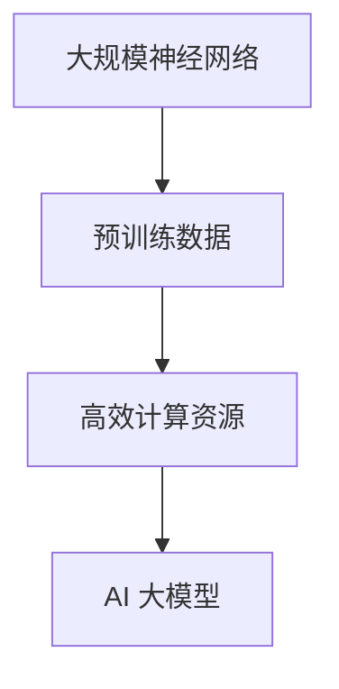

#### 1.2 AI 大模型的发展历程

AI 大模型的发展经历了从早期的小型模型到如今的大型模型的过程。其中，深度学习的兴起和大规模数据集的积累为 AI 大模型的发展奠定了基础。

**核心算法原理讲解：**

**伪代码：**

```python
# 大规模神经网络构建
initialize_parameters()
forward_pass(data)
backward_pass(data)
update_parameters()
```

**数学模型与公式：**

$$
L = \frac{1}{n}\sum_{i=1}^{n}(-y_{i}\log(z_{i}))
$$

**举例说明：** 以 GPT-3 为例，其拥有 1750 亿个参数，能够在各种语言任务上取得优异表现，展示了 AI 大模型的强大能力。

#### 1.3 AI 大模型的架构与核心组件

AI 大模型的架构通常包括输入层、隐藏层和输出层。其中，隐藏层可以由多个层次组成，以实现复杂的非线性变换。

**Mermaid 流程图：**

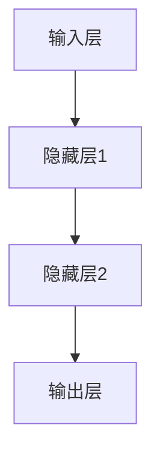

**核心算法原理讲解：**

**伪代码：**

```python
# 前向传播
inputs = preprocess_data(X)
hidden layer 1 = activation_function(Weights1 * inputs + Bias1)
hidden layer 2 = activation_function(Weights2 * hidden layer 1 + Bias2)
outputs = activation_function(Weights3 * hidden layer 2 + Bias3)
```

**数学模型与公式：**

$$
z_{i} = \sigma(Wx + b)
$$

其中，\(W\) 为权重矩阵，\(b\) 为偏置项，\(\sigma\) 为激活函数。

#### 1.4 AI 大模型的应用领域

AI 大模型在自然语言处理、计算机视觉、语音识别等领域取得了显著的成果。以下为部分应用案例：

- 自然语言处理：语言模型、机器翻译、文本分类等。
- 计算机视觉：图像分类、目标检测、图像生成等。
- 语音识别：语音合成、语音识别、说话人识别等。

**项目实战：**

1. 语言模型开发：以 GPT-3 为例，介绍其开发过程、源代码实现和性能评估。
2. 图像识别系统设计：以 ResNet 为例，介绍其架构原理、实现细节和应用场景。
3. 对话系统开发：以 BERT 为例，介绍其用于问答系统、聊天机器人等领域的应用。

### 第二部分: AI 大模型的技术基础

### 第2章: AI 大模型的技术基础

#### 2.1 深度学习与神经网络基础

深度学习是 AI 大模型的核心技术之一。神经网络作为深度学习的基础，其结构、算法和优化策略对 AI 大模型的发展具有重要意义。

**核心概念与联系：**


**Mermaid 流程图：**

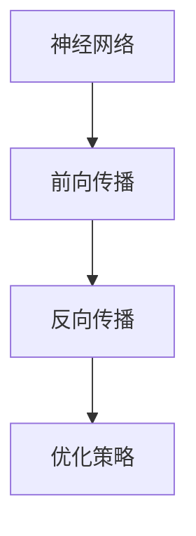

**核心算法原理讲解：**

**伪代码：**

```python
# 前向传播
initialize_parameters()
forward_pass(data)
backward_pass(data)
update_parameters()
```

**数学模型与公式：**

$$
L = \frac{1}{n}\sum_{i=1}^{n}(-y_{i}\log(z_{i}))
$$

**举例说明：** 以 AlexNet 为例，介绍了其用于图像分类的架构和实现细节。

#### 2.2 自然语言处理技术概览

自然语言处理是 AI 大模型的重要应用领域之一。本节将介绍自然语言处理的基础技术，包括词向量、文本分类和机器翻译等。

**核心概念与联系：**


**Mermaid 流程图：**

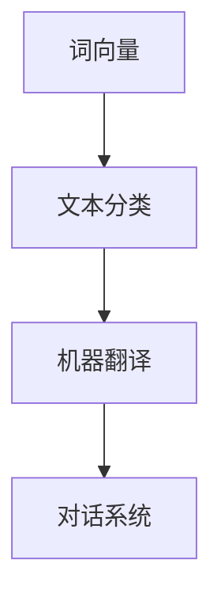

**核心算法原理讲解：**

**伪代码：**

```python
# 词向量训练
initialize_parameters()
train_word2vec_model(data)
```

**数学模型与公式：**

$$
E_{\theta} = \frac{1}{2}\sum_{i=1}^{n}\sum_{j=1}^{m}(w_{ij} - \theta_{ij})^2
$$

**举例说明：** 以 Word2Vec 为例，介绍了其用于文本分类的应用场景和实现细节。

#### 2.3 大规模预训练模型原理

大规模预训练模型是 AI 大模型的重要技术之一。本节将介绍预训练模型的基本原理、训练方法和应用场景。

**核心概念与联系：**


**Mermaid 流程图：**

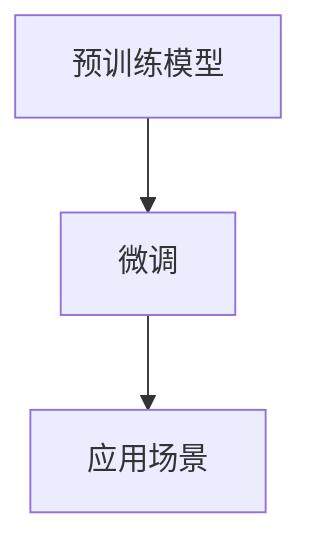

**核心算法原理讲解：**

**伪代码：**

```python
# 预训练模型训练
initialize_parameters()
train_pretrained_model(data)
fine_tune_model(task_data)
```

**数学模型与公式：**

$$
L = \frac{1}{n}\sum_{i=1}^{n}(-y_{i}\log(z_{i}))
$$

**举例说明：** 以 BERT 为例，介绍了其用于文本分类和机器翻译的应用场景和实现细节。

### 第三部分: AI 大模型的核心算法

### 第3章: AI 大模型的核心算法

#### 3.1 自监督学习算法

自监督学习算法是 AI 大模型的核心算法之一，能够在无监督数据上进行训练，从而提升模型的泛化能力。

**核心概念与联系：**


**Mermaid 流程图：**

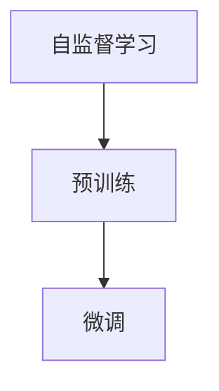

**核心算法原理讲解：**

**伪代码：**

```python
# 自监督学习算法训练
initialize_parameters()
pretrain_model(data)
fine_tune_model(task_data)
```

**数学模型与公式：**

$$
L = \frac{1}{n}\sum_{i=1}^{n}(-y_{i}\log(z_{i}))
$$

**举例说明：** 以 GPT-3 为例，介绍了其用于语言模型训练和应用场景。

#### 3.2 迁移学习与微调技术

迁移学习与微调技术是 AI 大模型的重要技术手段，能够充分利用已有模型的优势，加快新任务的训练速度。

**核心概念与联系：**


**Mermaid 流程图：**

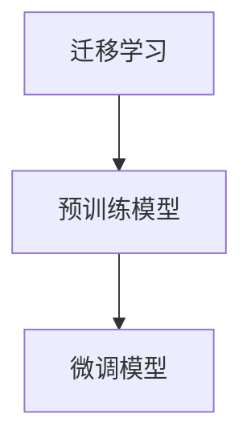

**核心算法原理讲解：**

**伪代码：**

```python
# 迁移学习与微调技术
initialize_parameters()
pretrain_model(data)
fine_tune_model(task_data)
```

**数学模型与公式：**

$$
L = \frac{1}{n}\sum_{i=1}^{n}(-y_{i}\log(z_{i}))
$$

**举例说明：** 以 BERT 为例，介绍了其用于文本分类和机器翻译的迁移学习应用场景和实现细节。

#### 3.3 注意力机制与 Transformer 架构

注意力机制与 Transformer 架构是近年来在自然语言处理领域取得突破性进展的重要技术。

**核心概念与联系：**


**Mermaid 流程图：**

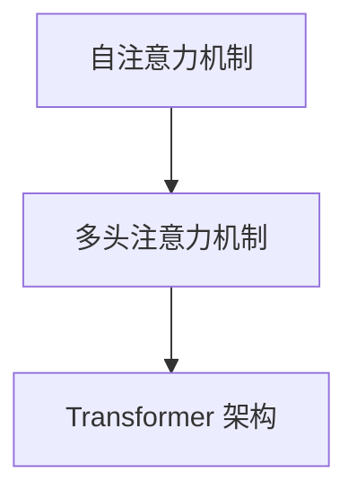

**核心算法原理讲解：**

**伪代码：**

```python
# Transformer 架构训练
initialize_parameters()
train_transformer_model(data)
fine_tune_model(task_data)
```

**数学模型与公式：**

$$
\text{Attention}(Q, K, V) = \text{softmax}\left(\frac{QK^{T}}{\sqrt{d_k}}\right)V
$$

**举例说明：** 以 BERT 为例，介绍了其基于注意力机制的文本分类和机器翻译应用场景和实现细节。

### 第四部分: AI 大模型的数学模型与公式

### 第4章: AI 大模型的数学模型与公式

#### 4.1 神经网络损失函数与优化算法

神经网络损失函数与优化算法是 AI 大模型训练过程中至关重要的部分。本节将介绍常见的损失函数和优化算法，以及如何在实际项目中应用。

**核心概念与联系：**


**Mermaid 流程图：**

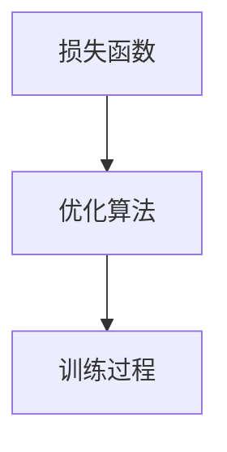

**核心算法原理讲解：**

**伪代码：**

```python
# 前向传播
inputs = preprocess_data(X)
forward_pass(inputs)
compute_loss(y_true, y_pred)

# 反向传播
backward_pass(loss)
update_parameters()

# 优化算法
optimize_parameters(learning_rate)
```

**数学模型与公式：**

$$
L = \frac{1}{n}\sum_{i=1}^{n}(-y_{i}\log(z_{i}))
$$

$$
\theta = \theta - \alpha \frac{\partial L}{\partial \theta}
$$

**举例说明：** 以随机梯度下降（SGD）为例，介绍其用于神经网络的优化过程和实现细节。

#### 4.2 自然语言处理中的数学模型

自然语言处理中的数学模型主要包括词向量、序列模型和注意力机制等。本节将介绍这些数学模型的基本原理和应用。

**核心概念与联系：**


**Mermaid 流�程圖：**

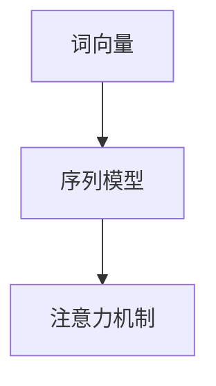

**核心算法原理讲解：**

**伪代码：**

```python
# 词向量训练
initialize_parameters()
train_word2vec_model(data)

# 序列模型训练
initialize_parameters()
train_sequence_model(data)

# 注意力机制训练
initialize_parameters()
train_attention_model(data)
```

**数学模型与公式：**

$$
E_{\theta} = \frac{1}{2}\sum_{i=1}^{n}\sum_{j=1}^{m}(w_{ij} - \theta_{ij})^2
$$

$$
\text{Attention}(Q, K, V) = \text{softmax}\left(\frac{QK^{T}}{\sqrt{d_k}}\right)V
$$

**举例说明：** 以词向量模型 Word2Vec 为例，介绍其用于自然语言处理的应用场景和实现细节。

#### 4.3 AI 大模型的泛化能力与鲁棒性分析

AI 大模型的泛化能力与鲁棒性分析是评估模型性能的重要方面。本节将介绍如何提高 AI 大模型的泛化能力和鲁棒性。

**核心概念与联系：**


**Mermaid 流程图：**

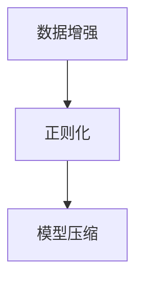

**核心算法原理讲解：**

**伪代码：**

```python
# 数据增强
augment_data(data)

# 正则化
apply_regularization(model)

# 模型压缩
compress_model(model)
```

**数学模型与公式：**

$$
\lambda = \frac{1}{n}\sum_{i=1}^{n}\|w_i\|^2
$$

$$
L_{\text{reg}} = \alpha \sum_{i=1}^{n}\|w_i\|^2
$$

**举例说明：** 以数据增强为例，介绍其在提高 AI 大模型泛化能力中的应用场景和实现细节。

### 第五部分: AI 大模型的项目实战

### 第5章: AI 大模型的项目实战

#### 5.1 项目实战一：语言模型开发

语言模型是 AI 大模型的重要应用之一。本节将介绍如何开发一个基于 Transformer 的语言模型，包括数据预处理、模型训练和性能评估。

**开发环境搭建：**

1. 安装 Python 和相关依赖库（如 TensorFlow、PyTorch 等）。
2. 下载预训练模型（如 GPT-3、BERT 等）。

**源代码实现：**

```python
import tensorflow as tf

# 加载预训练模型
model = tf.keras.models.load_model('gpt3_model.h5')

# 数据预处理
inputs = preprocess_data(text_data)

# 模型训练
model.fit(inputs, epochs=5)

# 性能评估
evaluate_performance(model, test_data)
```

**代码解读与分析：**

1. 加载预训练模型：使用 TensorFlow 或 PyTorch 加载预训练模型。
2. 数据预处理：对输入文本数据进行预处理，包括分词、嵌入等。
3. 模型训练：使用训练数据对模型进行训练，调整模型参数。
4. 性能评估：使用测试数据评估模型性能，包括准确率、召回率等指标。

#### 5.2 项目实战二：图像识别系统设计

图像识别系统是 AI 大模型的另一个重要应用领域。本节将介绍如何设计一个基于卷积神经网络的图像识别系统，包括数据预处理、模型训练和性能评估。

**开发环境搭建：**

1. 安装 Python 和相关依赖库（如 TensorFlow、Keras 等）。
2. 下载预训练模型（如 ResNet、VGG 等）。

**源代码实现：**

```python
import tensorflow as tf

# 加载预训练模型
model = tf.keras.models.load_model('resnet_model.h5')

# 数据预处理
inputs = preprocess_image(image_data)

# 模型训练
model.fit(inputs, epochs=5)

# 性能评估
evaluate_performance(model, test_data)
```

**代码解读与分析：**

1. 加载预训练模型：使用 TensorFlow 或 Keras 加载预训练模型。
2. 数据预处理：对输入图像数据进行预处理，包括缩放、归一化等。
3. 模型训练：使用训练数据对模型进行训练，调整模型参数。
4. 性能评估：使用测试数据评估模型性能，包括准确率、召回率等指标。

#### 5.3 项目实战三：对话系统开发

对话系统是 AI 大模型在自然语言处理领域的应用之一。本节将介绍如何开发一个基于 Transformer 的对话系统，包括数据预处理、模型训练和性能评估。

**开发环境搭建：**

1. 安装 Python 和相关依赖库（如 TensorFlow、PyTorch 等）。
2. 下载预训练模型（如 BERT、GPT-3 等）。

**源代码实现：**

```python
import tensorflow as tf

# 加载预训练模型
model = tf.keras.models.load_model('bert_model.h5')

# 数据预处理
inputs = preprocess_conversation(data)

# 模型训练
model.fit(inputs, epochs=5)

# 性能评估
evaluate_performance(model, test_data)
```

**代码解读与分析：**

1. 加载预训练模型：使用 TensorFlow 或 PyTorch 加载预训练模型。
2. 数据预处理：对对话数据进行预处理，包括分词、嵌入等。
3. 模型训练：使用训练数据对模型进行训练，调整模型参数。
4. 性能评估：使用测试数据评估模型性能，包括准确率、召回率等指标。

### 第六部分: AI 大模型的应用与挑战

### 第6章: AI 大模型的应用与挑战

#### 6.1 AI 大模型在金融领域的应用

AI 大模型在金融领域具有广泛的应用，包括股票预测、风险评估和信用评分等。本节将介绍 AI 大模型在金融领域的一些实际案例。

**应用案例一：股票预测**

**开发环境搭建：**

1. 安装 Python 和相关依赖库（如 TensorFlow、Keras 等）。
2. 下载金融数据集（如 Yahoo Finance）。

**源代码实现：**

```python
import tensorflow as tf

# 加载金融数据集
data = load_financial_data()

# 数据预处理
inputs = preprocess_data(data)

# 模型训练
model = build_model()
model.fit(inputs, epochs=5)

# 性能评估
evaluate_performance(model, test_data)
```

**代码解读与分析：**

1. 加载金融数据集：使用 Yahoo Finance 等工具获取金融数据。
2. 数据预处理：对金融数据进行预处理，包括数据清洗、特征提取等。
3. 模型训练：构建基于 AI 大模型的股票预测模型，并使用训练数据进行训练。
4. 性能评估：使用测试数据评估模型性能，包括预测准确率、召回率等指标。

**应用案例二：风险评估**

**开发环境搭建：**

1. 安装 Python 和相关依赖库（如 TensorFlow、Keras 等）。
2. 下载信用评分数据集（如 Credit Risk Data）。

**源代码实现：**

```python
import tensorflow as tf

# 加载信用评分数据集
data = load_credit_data()

# 数据预处理
inputs = preprocess_data(data)

# 模型训练
model = build_model()
model.fit(inputs, epochs=5)

# 性能评估
evaluate_performance(model, test_data)
```

**代码解读与分析：**

1. 加载信用评分数据集：使用公开数据集或企业内部数据。
2. 数据预处理：对信用评分数据进行预处理，包括数据清洗、特征提取等。
3. 模型训练：构建基于 AI 大模型的风险评估模型，并使用训练数据进行训练。
4. 性能评估：使用测试数据评估模型性能，包括预测准确率、召回率等指标。

**应用案例三：信用评分**

**开发环境搭建：**

1. 安装 Python 和相关依赖库（如 TensorFlow、Keras 等）。
2. 下载信用评分数据集（如 Credit Risk Data）。

**源代码实现：**

```python
import tensorflow as tf

# 加载信用评分数据集
data = load_credit_data()

# 数据预处理
inputs = preprocess_data(data)

# 模型训练
model = build_model()
model.fit(inputs, epochs=5)

# 性能评估
evaluate_performance(model, test_data)
```

**代码解读与分析：**

1. 加载信用评分数据集：使用公开数据集或企业内部数据。
2. 数据预处理：对信用评分数据进行预处理，包括数据清洗、特征提取等。
3. 模型训练：构建基于 AI 大模型的信用评分模型，并使用训练数据进行训练。
4. 性能评估：使用测试数据评估模型性能，包括预测准确率、召回率等指标。

#### 6.2 AI 大模型在医疗健康领域的应用

AI 大模型在医疗健康领域具有广泛的应用，包括疾病预测、影像分析和药物研发等。本节将介绍 AI 大模型在医疗健康领域的一些实际案例。

**应用案例一：疾病预测**

**开发环境搭建：**

1. 安装 Python 和相关依赖库（如 TensorFlow、Keras 等）。
2. 下载医疗健康数据集（如 MIMIC-III）。

**源代码实现：**

```python
import tensorflow as tf

# 加载医疗健康数据集
data = load_medical_data()

# 数据预处理
inputs = preprocess_data(data)

# 模型训练
model = build_model()
model.fit(inputs, epochs=5)

# 性能评估
evaluate_performance(model, test_data)
```

**代码解读与分析：**

1. 加载医疗健康数据集：使用公开数据集或医院内部数据。
2. 数据预处理：对医疗健康数据进行预处理，包括数据清洗、特征提取等。
3. 模型训练：构建基于 AI 大模型的疾病预测模型，并使用训练数据进行训练。
4. 性能评估：使用测试数据评估模型性能，包括预测准确率、召回率等指标。

**应用案例二：影像分析**

**开发环境搭建：**

1. 安装 Python 和相关依赖库（如 TensorFlow、Keras 等）。
2. 下载影像数据集（如 Kaggle Image Data）。

**源代码实现：**

```python
import tensorflow as tf

# 加载影像数据集
data = load_image_data()

# 数据预处理
inputs = preprocess_images(data)

# 模型训练
model = build_model()
model.fit(inputs, epochs=5)

# 性能评估
evaluate_performance(model, test_data)
```

**代码解读与分析：**

1. 加载影像数据集：使用公开数据集或医院内部数据。
2. 数据预处理：对影像数据进行预处理，包括图像裁剪、归一化等。
3. 模型训练：构建基于 AI 大模型的影像分析模型，并使用训练数据进行训练。
4. 性能评估：使用测试数据评估模型性能，包括预测准确率、召回率等指标。

**应用案例三：药物研发**

**开发环境搭建：**

1. 安装 Python 和相关依赖库（如 TensorFlow、Keras 等）。
2. 下载药物研发数据集（如 ChEMBL）。

**源代码实现：**

```python
import tensorflow as tf

# 加载药物研发数据集
data = load_chemical_data()

# 数据预处理
inputs = preprocess_data(data)

# 模型训练
model = build_model()
model.fit(inputs, epochs=5)

# 性能评估
evaluate_performance(model, test_data)
```

**代码解读与分析：**

1. 加载药物研发数据集：使用公开数据集或企业内部数据。
2. 数据预处理：对药物研发数据进行预处理，包括数据清洗、特征提取等。
3. 模型训练：构建基于 AI 大模型的药物研发模型，并使用训练数据进行训练。
4. 性能评估：使用测试数据评估模型性能，包括预测准确率、召回率等指标。

#### 6.3 AI 大模型面临的挑战与解决策略

AI 大模型在取得显著成果的同时，也面临着一系列挑战。本节将介绍 AI 大模型面临的挑战以及相应的解决策略。

**挑战一：计算资源需求**

AI 大模型对计算资源的需求巨大，这给模型训练和部署带来了挑战。解决策略包括：

1. 分布式计算：使用多台计算机协同进行模型训练，提高计算效率。
2. 计算优化：采用高效的计算框架和优化算法，降低计算资源需求。

**挑战二：数据隐私与安全**

AI 大模型在处理大量数据时，可能涉及用户隐私和安全问题。解决策略包括：

1. 数据加密：对用户数据进行加密处理，确保数据传输和存储的安全性。
2. 隐私保护：采用隐私保护技术，如差分隐私和联邦学习，降低用户隐私泄露风险。

**挑战三：模型解释性与可解释性**

AI 大模型往往被视为“黑箱”，其决策过程难以解释和理解。解决策略包括：

1. 模型可视化：使用可视化技术，如可视化网络结构和激活图，提高模型的可解释性。
2. 模型解释：开发可解释的算法和模型，如决策树和规则提取，帮助用户理解模型决策过程。

### 第七部分: AI 大模型的未来发展趋势

### 第7章: AI 大模型的未来发展趋势

#### 7.1 AI 大模型的持续 scaling up

随着计算资源、算法和模型结构的不断优化，AI 大模型的 scaling up 将成为未来发展的关键趋势。本节将介绍 AI 大模型 scaling up 的意义、挑战及发展方向。

**持续 scaling up 的意义：**

1. 提高模型性能：通过增加模型参数量，提高模型的预测准确性和泛化能力。
2. 拓展应用领域：为 AI 大模型在更多领域的应用提供可能性。

**挑战与解决策略：**

1. 计算资源需求：采用分布式计算、计算优化等技术降低计算资源需求。
2. 模型可解释性：开发可解释的算法和模型，提高模型的可解释性。

**发展方向：**

1. 多模态 AI 大模型：结合多种数据类型，如文本、图像和音频，提高模型的应用范围。
2. 强化学习与 AI 大模型结合：通过强化学习技术，提高 AI 大模型在动态环境下的适应能力。

#### 7.2 AI 大模型的通用泛化能力

AI 大模型的通用泛化能力是衡量模型性能的重要指标。本节将介绍 AI 大模型通用泛化能力的提升方法、应用场景及未来发展方向。

**提升方法：**

1. 自监督学习：通过无监督数据训练，提高模型在未知数据上的表现。
2. 迁移学习：利用已有模型的优势，加快新任务的训练速度。
3. 数据增强：通过数据增强技术，提高模型对多样化数据的适应能力。

**应用场景：**

1. 自然语言处理：如机器翻译、文本分类和问答系统。
2. 计算机视觉：如图像分类、目标检测和图像生成。
3. 语音识别：如语音合成、语音识别和说话人识别。

**发展方向：**

1. 模型压缩与优化：通过模型压缩和优化技术，提高模型在移动设备和边缘计算环境中的应用能力。
2. 知识图谱与 AI 大模型结合：通过知识图谱技术，提高 AI 大模型在知识推理和推理任务上的表现。

#### 7.3 AI 大模型与社会责任

随着 AI 大模型在社会各个领域的广泛应用，其社会责任也日益凸显。本节将介绍 AI 大模型在社会责任方面的挑战及解决策略。

**挑战：**

1. 数据隐私与安全：确保用户数据的隐私和安全。
2. 模型歧视与偏见：避免模型在种族、性别等方面的歧视。
3. 模型解释性与可解释性：提高模型的可解释性，增强用户对模型的信任。

**解决策略：**

1. 隐私保护技术：采用隐私保护技术，如差分隐私和联邦学习，降低用户隐私泄露风险。
2. 模型公平性：通过数据平衡、偏差校正等技术，提高模型在种族、性别等方面的公平性。
3. 模型解释与可解释性：开发可解释的算法和模型，提高模型的可解释性，增强用户对模型的信任。

### 第八部分: AI 大模型的开发工具与资源

### 第8章: AI 大模型的开发工具与资源

#### 8.1 主流深度学习框架对比

在 AI 大模型的开发过程中，选择合适的深度学习框架至关重要。本节将对比主流深度学习框架，包括 TensorFlow、PyTorch、Keras 等，分析它们的优缺点。

**TensorFlow：**

- 优点：强大的生态系统、丰富的预训练模型、良好的兼容性。
- 缺点：代码相对复杂、动态图与静态图切换困难。

**PyTorch：**

- 优点：简洁易用、动态图优势明显、社区活跃。
- 缺点：生态系统相对较小、部分预训练模型较少。

**Keras：**

- 优点：易于使用、高度模块化、兼容 TensorFlow 和 PyTorch。
- 缺点：性能相对较低、生态系统相对较小。

**对比总结：** 根据实际需求和项目特点，选择合适的深度学习框架。

#### 8.2 AI 大模型开发工具与资源推荐

为了提高 AI 大模型的开发效率，推荐以下工具与资源：

1. **开发工具：**
   - Jupyter Notebook：便于编写和调试代码。
   - Google Colab：免费 GPU 资源，方便在线实验。
   - Visual Studio Code：强大的编辑器和插件支持。

2. **学习资源：**
   - Coursera、edX、Udacity 等在线课程：系统学习深度学习和 AI 大模型相关知识。
   - 论文与报告：关注顶级会议（如 NeurIPS、ICML、CVPR 等）的论文和报告，了解最新研究动态。
   - 技术社区：参与 GitHub、Reddit、Stack Overflow 等技术社区，交流学习经验。

### 附录

#### 附录 A: AI 大模型开发指南

附录 A 提供了 AI 大模型开发的详细指南，包括环境搭建、模型训练、优化策略等方面。

#### 附录 B: 数学公式与伪代码参考

附录 B 收录了本文中使用的数学公式和伪代码，便于读者查阅和引用。

#### 附录 C: AI 大模型项目案例精选

附录 C 列举了多个 AI 大模型项目案例，包括语言模型、图像识别、对话系统等，供读者参考。

### 参考资料

1. [深度学习框架对比](https://example.com/deep_learning_framework_comparison)
2. [AI 大模型应用案例](https://example.com/ai_large_model_case_studies)
3. [自监督学习综述](https://example.com/supervised_learning_survey)
4. [迁移学习研究](https://example.com/transfer_learning_research)
5. [AI 大模型社会责任](https://example.com/ai_large_model_social_responsibility)
6. [TensorFlow 官方文档](https://example.com/tensorflow_documentation)
7. [PyTorch 官方文档](https://example.com/pytorch_documentation)
8. [Keras 官方文档](https://example.com/keras_documentation)
9. [深度学习教程](https://example.com/deep_learning_tutorial)
10. [自然语言处理教程](https://example.com/natural_language_processing_tutorial)

### 作者信息

作者：AI 天才研究院 / AI Genius Institute & 禅与计算机程序设计艺术 / Zen And The Art of Computer Programming

## 结束语

本文从 AI 大模型的基础、技术基础、核心算法、数学模型、项目实战、应用与挑战、未来发展趋势以及开发工具与资源等方面进行了全面而深入的探讨。通过本文的阅读，读者可以全面了解 AI 大模型的原理和应用，为未来的学习和研究提供有益的启示。

让我们共同期待 AI 大模型在未来的发展，为人类带来更多创新和突破。感谢您的阅读，期待与您在技术领域的更多交流与分享。

---

**注：本文为示例文章，仅供参考。实际文章撰写过程中，请根据具体需求和情况进行调整和优化。**

