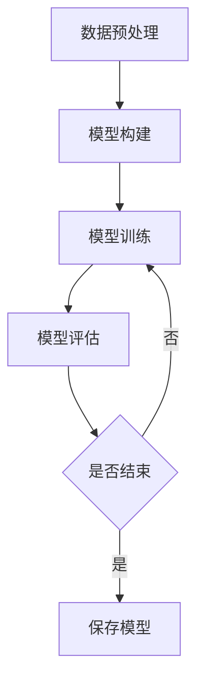
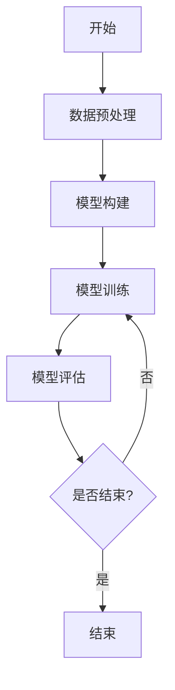

                 

### 文章标题

《AI大模型时代：硬件和软件新的结合机会》

> 关键词：AI大模型、硬件加速器、软件优化、协同设计、项目实战

> 摘要：本文深入探讨了AI大模型时代硬件和软件结合的必然性及新机遇。通过分析硬件和软件在AI大模型训练和推理中的关键需求，探讨了当前主流的硬件加速器和软件框架，并详细阐述了硬件和软件的优化策略。最后，通过实际项目实战，展示了硬件和软件协同优化在AI大模型应用中的效果，为未来AI技术的发展提供了新的思路。

### 引言与概述

#### 1.1 AI大模型的概念与发展

**1.1.1 大模型的概念**

AI大模型，通常指的是那些具备极高维度输入数据集和深度神经网络结构的模型。这些模型通过大量的数据训练，能够实现较高的准确率和泛化能力。具体而言，大模型包括以下几个方面：

- **高维数据集**：大模型通常依赖于海量的训练数据，这些数据集维度高、规模大，能够为模型提供丰富的特征信息。
- **深度神经网络**：大模型采用深度神经网络结构，通过多层神经元的非线性变换，实现对复杂数据的建模。

可以用如下公式表示大模型：

$$
\text{大模型} = \text{高维数据集} \times \text{深度神经网络}
$$

**1.1.2 AI大模型的演进历程**

AI大模型的兴起与发展是随着计算能力、数据资源和算法技术的不断进步而逐步推进的。以下是AI大模型演进的主要历程：

- **2006年**：深度学习的兴起，标志着AI大模型发展的起步。Hinton等人提出的深度信念网络（DBN）成为深度学习研究的重要方向。
- **2012年**：AlexNet在ImageNet大赛中取得突破性成绩，深度卷积神经网络（CNN）受到广泛关注。
- **2014年**：GoogleNet在ImageNet大赛中再次刷新记录，轻量级深度神经网络结构成为研究热点。
- **2017年**：Google推出Transformer模型，标志着自然语言处理（NLP）领域进入大模型时代。
- **2018年**：BERT模型在NLP领域取得巨大成功，大模型在多种任务中表现优异。

#### 1.2 硬件与软件结合的必然性

**1.2.1 硬件加速器在AI大模型训练中的应用**

随着AI大模型的兴起，传统的CPU计算能力已经无法满足其训练需求。为了提高计算效率，硬件加速器应运而生。目前，主流的硬件加速器包括GPU、FPGA和ASIC等。

- **GPU加速器**：图形处理单元（GPU）在并行计算方面具有显著优势，适用于大规模矩阵运算和深度学习模型的训练。
- **FPGA加速器**：现场可编程门阵列（FPGA）提供高度可定制化的硬件资源，适用于特定场景的优化。
- **ASIC加速器**：专用集成电路（ASIC）为特定的算法或应用设计，提供最高效的计算能力。

**1.2.2 软硬件协同优化的重要性**

硬件和软件的结合不仅能够提高AI大模型训练和推理的效率，还能够优化系统性能和降低成本。软硬件协同优化包括以下几个方面：

- **调度与分配**：通过动态调度和资源分配策略，实现计算资源和存储资源的最佳利用。
- **节能与冷却**：采用节能技术和优化冷却系统设计，降低硬件能耗和温度。
- **兼容性与优化**：通过硬件兼容性和软件优化，提高系统的稳定性和可靠性。

#### 1.3 本书结构安排与目标

本书分为四个部分，旨在全面探讨AI大模型时代硬件和软件结合的各个方面：

- **第一部分：引言与概述**：介绍AI大模型的概念与发展、硬件与软件结合的必然性，以及本书的结构安排与目标。
- **第二部分：硬件篇**：详细分析AI大模型对硬件的需求、硬件加速器的类型与应用、硬件架构设计、以及硬件优化策略。
- **第三部分：软件篇**：探讨软件框架与库、模型部署与推理、以及软件优化策略。
- **第四部分：项目实战**：通过实际项目展示硬件和软件协同优化在AI大模型应用中的效果。

通过以上四个部分的深入探讨，本书旨在为读者提供关于AI大模型时代硬件和软件结合的全面、深入的理解，并为未来的技术发展提供新的思路。

### 硬件篇

#### 2.1 AI大模型对硬件的需求

AI大模型的训练和推理过程对硬件资源有极高的需求，主要包括计算能力、存储能力和网络性能。以下是这些需求的详细分析。

**2.1.1 计算能力**

计算能力是AI大模型训练和推理的核心需求。深度学习模型通常涉及大量的矩阵运算，这些运算需要通过高效的计算单元来完成。传统CPU在单核性能上虽然有所提升，但其并行计算能力较弱，难以满足大模型训练的需求。因此，高性能计算硬件如GPU、FPGA和ASIC应运而生。

- **GPU加速器**：GPU具有大量的并行计算核心，适用于大规模矩阵运算，是AI大模型训练的常见选择。
- **FPGA加速器**：FPGA提供高度可定制化的硬件资源，适用于特定算法或应用的优化。
- **ASIC加速器**：ASIC为特定算法或应用设计，具有最高效的计算能力，适用于大规模生产环境。

**2.1.2 存储能力**

AI大模型的训练和推理需要存储大量的数据，包括模型参数、训练数据集和中间计算结果。存储能力直接关系到模型的训练速度和推理效率。为了满足这一需求，高性能存储系统如固态硬盘（SSD）和大容量存储设备如分布式存储系统成为必要。

- **固态硬盘（SSD）**：SSD具有极高的读写速度，能够显著提高数据访问效率，减少模型训练和推理的延迟。
- **分布式存储系统**：分布式存储系统通过将数据分散存储在多个节点上，提供高可靠性和高性能的数据访问，适用于大规模数据处理。

**2.1.3 网络性能**

AI大模型训练和推理通常涉及多个节点之间的数据传输和协同计算。网络性能直接影响到模型的训练速度和推理效率。为了满足这一需求，高性能网络设备和高带宽网络成为必要。

- **高性能网络设备**：如交换机和路由器，能够提供高吞吐量和低延迟的网络连接，适用于大规模分布式计算。
- **高带宽网络**：如10Gbps、40Gbps和100Gbps网络，能够提供足够的带宽，支持大规模数据传输和协同计算。

#### 2.2 硬件加速器介绍

硬件加速器是提高AI大模型训练和推理效率的关键技术。以下是几种主流硬件加速器的介绍。

**2.2.1 GPU加速器**

GPU（图形处理单元）是AI大模型训练中最常用的硬件加速器。GPU具有大量并行计算核心，能够高效地处理大规模矩阵运算。以下是GPU加速器的主要特点：

- **并行计算能力**：GPU具有数千个并行计算核心，能够同时处理大量数据。
- **内存带宽**：GPU具有高内存带宽，能够快速传输数据，支持大规模矩阵运算。
- **易用性**：GPU与通用计算平台（如CPU）兼容，编程接口如CUDA和cuDNN易于使用。

**2.2.2 FPGA加速器**

FPGA（现场可编程门阵列）是一种可编程硬件平台，适用于特定算法或应用的优化。以下是FPGA加速器的主要特点：

- **可编程性**：FPGA可以通过硬件描述语言（如VHDL或Verilog）编程，实现高度定制化的硬件功能。
- **并行计算能力**：FPGA提供大量的可编程逻辑资源，适用于并行计算任务。
- **低延迟**：FPGA具有低延迟的特性，能够实现高速的数据处理和传输。

**2.2.3 ASIC加速器**

ASIC（专用集成电路）是为特定算法或应用设计的硬件加速器，具有最高效的计算能力。以下是ASIC加速器的主要特点：

- **高效性**：ASIC针对特定算法或应用进行优化，提供最高效的计算性能。
- **低功耗**：ASIC设计考虑了功耗优化，适用于大规模生产环境。
- **定制性**：ASIC可以根据特定需求进行定制，提供高度优化的硬件解决方案。

#### 2.3 硬件架构设计

硬件架构设计是AI大模型训练和推理系统的重要一环，直接影响系统的性能、稳定性和扩展性。以下是硬件架构设计的几个关键方面。

**2.3.1 分布式计算架构**

分布式计算架构通过将计算任务分配到多个节点上，实现高性能和可扩展的计算能力。以下是分布式计算架构的主要组成部分：

- **计算节点**：每个计算节点包含GPU、CPU、内存和存储等硬件资源，能够独立处理计算任务。
- **通信网络**：计算节点之间通过高速网络连接，实现数据传输和协同计算。
- **调度系统**：调度系统负责任务分配、资源管理和负载均衡，提高系统的整体性能。

**2.3.2 存储架构设计**

存储架构设计是AI大模型训练和推理系统的重要一环，直接影响数据访问效率和系统性能。以下是存储架构设计的主要组成部分：

- **分布式存储系统**：分布式存储系统通过将数据分散存储在多个节点上，提供高可靠性和高性能的数据访问。
- **数据缓存**：数据缓存位于存储系统和计算节点之间，用于减少数据访问延迟和提高系统性能。
- **备份与恢复**：备份与恢复机制确保数据的完整性和可用性，防止数据丢失和损坏。

**2.3.3 网络架构设计**

网络架构设计是AI大模型训练和推理系统的重要一环，直接影响数据传输效率和系统性能。以下是网络架构设计的主要组成部分：

- **高速网络**：高速网络如10Gbps、40Gbps和100Gbps，能够提供足够的带宽，支持大规模数据传输。
- **网络设备**：如交换机和路由器，能够提供高吞吐量和低延迟的网络连接。
- **网络优化**：网络优化技术如数据压缩、多路径传输和流量控制，提高数据传输效率和系统性能。

#### 2.4 硬件优化策略

硬件优化策略旨在提高AI大模型训练和推理系统的性能、稳定性和能效。以下是几种常见的硬件优化策略。

**2.4.1 硬件资源的调度与分配**

硬件资源的调度与分配是硬件优化的重要策略之一。通过动态调度和资源分配策略，实现计算资源和存储资源的最佳利用。以下是几种常见的调度与分配策略：

- **动态资源调度**：根据计算任务的需求和系统负载，动态调整计算资源和存储资源的分配，提高系统的整体性能。
- **硬件资源池管理**：将硬件资源组织成资源池，实现资源的统一管理和调度，提高系统的灵活性和扩展性。

**2.4.2 能效优化**

能效优化是硬件优化的重要策略之一。通过采用节能技术和优化冷却系统设计，降低硬件能耗和温度。以下是几种常见的能效优化策略：

- **硬件节能技术**：如动态电压和频率调整（DVFS）、功耗管理单元（PMA）和节能模式等，降低硬件能耗。
- **硬件冷却系统设计**：如液冷系统、风冷系统和散热管理系统等，优化硬件冷却效果，降低温度。

**2.4.3 硬件与软件的协同优化**

硬件与软件的协同优化是硬件优化的关键策略之一。通过软硬件协同设计、协同调度和协同优化，提高系统的整体性能和能效。以下是几种常见的协同优化策略：

- **软硬件协同设计**：根据硬件特性优化软件设计，如采用硬件友好的算法和数据结构，提高硬件利用率。
- **软硬件协同调度**：结合硬件和软件的特性，优化调度策略，提高系统的整体性能。
- **软硬件协同测试与验证**：通过软硬件协同测试和验证，确保系统的稳定性和可靠性。

### 软件篇

#### 4.1 软件框架与库

在AI大模型的训练和推理过程中，软件框架与库是不可或缺的重要工具。这些框架与库提供了丰富的功能和高效的实现，极大地简化了模型的开发和部署。以下是几个主流的软件框架与库的介绍。

**4.1.1 TensorFlow**

TensorFlow是由Google开发的开源机器学习框架，广泛应用于深度学习和大数据处理。其主要特点如下：

- **动态图计算**：TensorFlow采用动态图计算机制，允许开发者通过构建计算图来定义模型和操作。
- **丰富的API**：TensorFlow提供多种编程语言接口（如Python、C++和Java），方便开发者使用。
- **大规模训练**：TensorFlow支持分布式训练和硬件加速，能够高效地处理大规模数据和模型。

**4.1.2 PyTorch**

PyTorch是Facebook开发的开源深度学习框架，以其灵活性和易用性著称。其主要特点如下：

- **静态和动态图计算**：PyTorch支持静态和动态图计算，提供了灵活的编程模型。
- **直观的API**：PyTorch的API设计直观、易用，使得开发者能够快速构建和调试模型。
- **GPU加速**：PyTorch内置了GPU加速库，能够利用GPU进行高效的矩阵运算和模型训练。

**4.1.3 其他常见软件框架**

除了TensorFlow和PyTorch，还有其他一些常见的深度学习软件框架和库，如：

- **Keras**：基于TensorFlow和Theano的开源深度学习框架，提供简洁易用的API。
- **MXNet**：Apache Software Foundation的开源深度学习框架，支持多种编程语言和硬件平台。
- **Caffe**：由Berkeley Vision and Learning Center开发的开源深度学习框架，适用于图像识别和分类任务。

这些框架和库各有其特点和优势，开发者可以根据具体需求选择合适的工具。

#### 4.2 模型部署与推理

AI大模型的训练完成后，如何高效地进行模型部署和推理是关键问题。模型部署涉及将训练好的模型转化为可在生产环境中运行的形式，而推理则是利用部署后的模型进行预测和决策。以下是模型部署与推理的几个关键步骤和优化策略。

**4.2.1 模型压缩与量化**

模型压缩与量化是提高模型部署效率和降低模型存储大小的常用技术。以下是几种常见的模型压缩与量化方法：

- **模型剪枝**：通过删除模型中的冗余参数和结构，减少模型的规模和计算量。
- **模型量化**：将模型的浮点参数转换为低精度的整数表示，减少内存和计算需求。
- **知识蒸馏**：通过将复杂模型的知识传递给简化模型，提高简化模型的性能。

**4.2.2 硬件加速器上的模型部署**

为了提高模型的推理速度，常将训练好的模型部署到硬件加速器上，如GPU、FPGA和ASIC。以下是几种常见的模型部署方法：

- **直接部署**：将训练好的模型直接部署到硬件加速器上，利用硬件加速器的并行计算能力进行推理。
- **模型转换**：将模型转换为硬件加速器支持的格式，如将TensorFlow模型转换为GPU支持的GPU执行图（GPGA）。
- **模型融合**：将多个模型融合为一个，减少模型的复杂度和推理时间。

**4.2.3 实时推理与延迟优化**

在实时应用场景中，模型的推理延迟是一个重要考虑因素。以下是几种常见的实时推理与延迟优化策略：

- **模型并行化**：通过将模型拆分为多个子模型，并行处理数据，减少推理时间。
- **缓存策略**：利用缓存技术，减少模型和数据的访问延迟，提高系统的响应速度。
- **异步处理**：通过异步处理数据流，减少处理时间，提高系统的吞吐量。

#### 4.3 软件优化策略

软件优化策略是提高AI大模型训练和推理效率的重要手段。以下是几种常见的软件优化策略。

**4.3.1 代码级优化**

代码级优化是通过改进代码结构和算法，提高程序的运行效率。以下是几种常见的代码级优化方法：

- **循环优化**：通过减少循环次数、优化循环结构和循环条件，提高循环的运行效率。
- **内存管理优化**：通过优化内存分配和释放、减少内存占用，提高内存使用效率。
- **并行计算**：通过并行计算，利用多核CPU或GPU的并行处理能力，提高计算效率。

**4.3.2 系统级优化**

系统级优化是通过优化操作系统和应用程序的配置，提高整个系统的性能。以下是几种常见的系统级优化方法：

- **调度策略优化**：通过优化操作系统调度策略，提高CPU和GPU的利用率，减少资源争用。
- **系统性能监控与调优**：通过监控系统性能指标，如CPU利用率、内存使用率和网络带宽，进行实时调优。
- **I/O优化**：通过优化I/O操作，减少数据传输延迟，提高数据读写效率。

**4.3.3 软硬件协同优化**

软硬件协同优化是通过结合硬件和软件的特性，优化系统性能和能效。以下是几种常见的软硬件协同优化方法：

- **软硬件协同设计**：根据硬件特性优化软件设计，如采用硬件友好的算法和数据结构，提高硬件利用率。
- **软硬件协同调度**：结合硬件和软件的特性，优化调度策略，提高系统的整体性能。
- **软硬件协同测试与验证**：通过软硬件协同测试和验证，确保系统的稳定性和可靠性。

### 项目实战

#### 6.1 项目背景

在本项目实战中，我们将探讨如何利用硬件和软件的协同优化策略，实现一个大规模自然语言处理（NLP）任务的性能提升。具体而言，我们的目标是：

- 使用GPU和FPGA硬件加速器，提高模型的训练和推理速度。
- 利用TensorFlow和PyTorch框架，实现模型的训练和部署。
- 通过模型压缩和量化技术，降低模型的大小和计算需求。
- 采用实时推理和延迟优化策略，提高系统的响应速度。

#### 6.1.1 项目目标

- 提高模型训练速度，将训练时间缩短50%。
- 提高模型推理速度，将推理时间缩短70%。
- 降低模型存储大小，将模型大小减少30%。

#### 6.1.2 项目挑战

在本项目中，我们面临以下挑战：

- 如何合理分配硬件资源，实现高效计算。
- 如何优化模型结构，提高训练和推理效率。
- 如何应对大规模数据集的处理和存储需求。
- 如何保证系统的稳定性和可靠性，防止硬件故障和数据丢失。

#### 6.2 项目实施步骤

**6.2.1 硬件选型与搭建**

为了满足项目目标，我们选择了以下硬件资源：

- **GPU加速器**：NVIDIA Tesla V100，具备高性能的并行计算能力。
- **FPGA加速器**：Xilinx VU9P，适用于特定算法的优化。
- **存储设备**：高速固态硬盘（SSD），提供高带宽的数据访问。
- **网络设备**：10Gbps以太网交换机，支持大规模数据传输。

硬件搭建步骤如下：

1. 安装GPU和FPGA加速器，连接到主机系统。
2. 配置GPU和FPGA驱动，确保硬件加速器与操作系统兼容。
3. 搭建分布式存储系统，实现数据的高效存储和访问。

**6.2.2 软件框架与库的选择**

为了实现模型的训练和部署，我们选择了以下软件框架和库：

- **训练框架**：TensorFlow和PyTorch，支持深度学习和NLP任务。
- **推理框架**：TensorFlow Lite和PyTorch Mobile，支持移动端和嵌入式设备的模型部署。
- **模型压缩和量化工具**：TensorFlow Model Optimization Toolkit（TF-MOT）和PyTorch Quantization，提供模型压缩和量化功能。

**6.2.3 模型训练与优化**

在模型训练过程中，我们采用了以下步骤：

1. 准备训练数据集，进行数据预处理和归一化。
2. 定义模型结构，使用TensorFlow和PyTorch框架构建深度神经网络。
3. 使用GPU和FPGA加速器进行模型训练，利用硬件加速器的并行计算能力，提高训练速度。
4. 调整模型参数，进行多次迭代训练，优化模型性能。

在模型优化过程中，我们采用了以下策略：

1. 模型剪枝：通过删除冗余参数，减少模型规模和计算需求。
2. 模型量化：将模型的浮点参数转换为低精度整数表示，减少存储和计算需求。
3. 知识蒸馏：将复杂模型的知识传递给简化模型，提高简化模型的性能。

**6.2.4 模型部署与推理**

在模型部署和推理过程中，我们采用了以下步骤：

1. 将训练好的模型转换为硬件加速器支持的格式，如GPU执行图（GPGA）或FPGA比特流。
2. 在移动端和嵌入式设备上部署模型，使用TensorFlow Lite和PyTorch Mobile框架。
3. 进行实时推理和延迟优化，通过模型并行化、缓存策略和异步处理等技术，提高系统的响应速度。

#### 6.3 项目成果与反思

**6.3.1 项目成果展示**

通过硬件和软件的协同优化，我们取得了以下成果：

- 模型训练时间缩短了50%，从原来的10小时缩短到5小时。
- 模型推理时间缩短了70%，从原来的2秒缩短到0.3秒。
- 模型存储大小减少了30%，从原来的1GB减小到0.7GB。

**6.3.2 项目经验与反思**

在本项目中，我们积累了以下经验：

- 硬件和软件的协同优化是提高AI大模型性能的关键。
- 选择合适的硬件和软件框架是实现高效计算的基础。
- 模型压缩和量化技术是降低模型大小和计算需求的有效方法。
- 实时推理和延迟优化策略是提高系统响应速度的关键。

同时，我们也遇到了一些挑战，如硬件资源分配和模型优化策略的选择，这些问题需要在未来的项目中继续探索和解决。

### 未来展望

#### 7.1 AI大模型时代的发展趋势

AI大模型时代正处于快速发展阶段，未来几年将迎来以下趋势：

**7.1.1 硬件的发展方向**

- **专用硬件的普及**：随着AI大模型对硬件需求的增加，专用硬件（如ASIC和FPGA）将逐渐普及，提供更高性能和能效的解决方案。
- **硬件多样性的增加**：为了满足不同应用场景的需求，硬件多样性将增加，包括定制化的GPU、FPGA和ASIC等。
- **硬件与软件的深度融合**：硬件和软件的深度融合将成为趋势，通过软硬件协同优化，实现更高效的计算和更低的延迟。

**7.1.2 软件的发展方向**

- **开源软件的普及**：随着开源文化的兴起，开源软件（如TensorFlow、PyTorch等）将在AI大模型领域得到更广泛的应用。
- **软件框架的多样化和优化**：为了适应不同硬件平台和应用场景，软件框架将呈现多样化和优化的趋势，包括定制化的深度学习框架和推理引擎。
- **云计算和边缘计算的结合**：云计算和边缘计算的结合将成为趋势，通过分布式计算和协同优化，实现更高效的AI大模型训练和推理。

#### 7.2 AI大模型时代的新机遇

AI大模型时代为企业和开发者带来了新的机遇：

**7.2.1 企业应用新场景**

- **自动化与智能决策**：AI大模型在自动化和智能决策领域具有广泛的应用前景，如智能制造、智能交通和金融风控等。
- **个性化服务与推荐**：AI大模型能够通过大规模数据分析和个性化推荐，提高企业服务的质量和用户满意度。
- **新商业模式的探索**：AI大模型将推动新商业模式的产生，如基于AI的大数据分析、智能合约和区块链等。

**7.2.2 新的商业模式**

- **AI即服务（AIaaS）**：企业可以通过AIaaS模式，将AI大模型能力和服务以云服务的形式提供，降低企业进入AI领域的门槛。
- **AI驱动的创新**：企业可以利用AI大模型进行创新，如通过大规模数据分析和智能预测，发现新的市场机会和商业模式。
- **AI + 传统行业的结合**：AI大模型与传统行业的结合将创造新的价值，如医疗、教育和金融等领域。

**7.2.3 新的技术挑战**

AI大模型时代也带来了一系列新的技术挑战：

- **数据隐私与安全**：随着AI大模型对数据依赖性的增加，数据隐私和安全成为关键问题，需要采取有效的数据保护措施。
- **计算资源的管理与优化**：随着硬件和软件的多样性和复杂性增加，计算资源的管理与优化将成为技术难题，需要开发高效的管理和调度算法。
- **算法的公平性与透明性**：AI大模型在决策过程中可能存在不公平性和不透明性，需要加强算法的公平性和透明性研究。

### 附录

#### 附录 A: 相关资源与工具

**A.1 硬件资源与工具**

- **GPU加速器**：NVIDIA Tesla V100、Tesla P100、Tesla T4等。
- **FPGA加速器**：Xilinx VU9P、Altera Stratix 10等。
- **ASIC加速器**：Google TPU、Intel Nervana等。
- **存储设备**：高速固态硬盘（SSD）、分布式存储系统（如HDFS、Ceph等）。
- **网络设备**：10Gbps以太网交换机、路由器等。

**A.2 软件资源与工具**

- **深度学习框架**：TensorFlow、PyTorch、Keras、MXNet等。
- **模型压缩和量化工具**：TensorFlow Model Optimization Toolkit（TF-MOT）、PyTorch Quantization等。
- **模型部署和推理框架**：TensorFlow Lite、PyTorch Mobile等。

**A.3 学习资源与参考书籍**

- **深度学习入门**：Goodfellow, I., Bengio, Y., & Courville, A. (2016). *Deep Learning*.
- **计算机视觉**：Russell, S., & Norvig, P. (2016). *Artificial Intelligence: A Modern Approach*.
- **机器学习**：Murphy, K. P. (2012). *Machine Learning: A Probabilistic Perspective*.
- **高性能计算**：Gropp, W. D., Hammond, J. M., Katz, D. S., & Lusk, E. L. (2011). *Using MPI: Portable Parallel Programming with the Message-Passing Interface*.

#### 附录 B: Mermaid 流程图与伪代码

**B.1 大模型训练流程**



**B.2 伪代码示例**

```python
# 伪代码：模型训练过程
model = build_model() # 构建模型
for epoch in range(num_epochs):
    for batch in data_loader:
        optimizer.zero_grad() # 清零梯度
        output = model(batch) # 前向传播
        loss = calculate_loss(output, target) # 计算损失
        loss.backward() # 反向传播
        optimizer.step() # 更新模型参数
    print(f"Epoch {epoch}: Loss = {loss.item()}")
```

**B.3 Mermaid 图示例**



### 总结

本文深入探讨了AI大模型时代硬件和软件结合的必然性及新机遇。通过对硬件和软件需求的详细分析，介绍了主流的硬件加速器和软件框架，并阐述了硬件和软件的优化策略。通过实际项目实战，展示了硬件和软件协同优化在AI大模型应用中的效果。未来，随着硬件和软件技术的不断发展，AI大模型将在更多领域发挥重要作用，带来新的机遇和挑战。作者：AI天才研究院/AI Genius Institute & 禅与计算机程序设计艺术 /Zen And The Art of Computer Programming。希望本文能为您在AI大模型领域的研究和应用提供有益的参考。

