                 

### 文章标题

《AI神经网络计算艺术之禅：GPT的核心机制——next token prediction》

### 关键词

- AI神经网络
- GPT模型
- Next Token Prediction
- 深度学习
- 生成式预训练
- 自然语言处理

### 摘要

本文深入探讨了GPT（Generative Pre-trained Transformer）模型的核心机制——next token prediction。通过对AI神经网络基础的回顾，以及神经网络与深度学习的基本原理讲解，我们逐步解析了GPT模型的架构、训练过程和next token prediction的原理与实现。接着，文章详细分析了GPT模型的不同变种和优化方法，并通过实际应用案例展示了GPT模型在文本生成、语言翻译和问答系统等领域的卓越表现。最后，文章展望了GPT模型在AI领域的应用前景，以及其面临的挑战和发展趋势。通过本文的阅读，读者将对GPT模型的核心机制和实际应用有更深入的理解。

### 目录大纲

# 《AI神经网络计算艺术之禅：GPT的核心机制——next token prediction》

## 第一部分：AI神经网络基础

### 第1章：AI概述

#### 1.1 AI发展历程

#### 1.2 神经网络基本原理

#### 1.3 神经网络与深度学习

### 第2章：神经网络基础

#### 2.1 神经元模型

#### 2.2 神经网络结构

#### 2.3 激活函数

#### 2.4 前向传播与反向传播算法

### 第3章：深度学习基础

#### 3.1 深度学习概述

#### 3.2 卷积神经网络（CNN）

#### 3.3 循环神经网络（RNN）

#### 3.4 长短期记忆网络（LSTM）

#### 3.5 生成对抗网络（GAN）

## 第二部分：GPT模型解析

### 第4章：GPT模型概述

#### 4.1 GPT模型发展历程

#### 4.2 GPT模型核心架构

#### 4.3 GPT模型训练过程

### 第5章：GPT核心机制——next token prediction

#### 5.1 next token prediction原理

#### 5.2 next token prediction实现

#### 5.3 next token prediction应用

### 第6章：GPT模型变种与优化

#### 6.1 GPT-2

#### 6.2 GPT-3

#### 6.3 微调与适配

### 第7章：GPT模型应用实践

#### 7.1 文本生成应用

#### 7.2 语言翻译应用

#### 7.3 问答系统应用

### 第8章：GPT模型未来展望

#### 8.1 GPT模型在AI领域的应用前景

#### 8.2 GPT模型面临的挑战与应对

#### 8.3 GPT模型的发展趋势

### 附录

#### 附录A：GPT模型相关资源

##### A.1 开源框架介绍

##### A.2 实践案例教程

##### A.3 GPT模型研究论文精选

---

## 第一部分：AI神经网络基础

### 第1章：AI概述

#### 1.1 AI发展历程

人工智能（Artificial Intelligence，简称AI）的发展历程可以追溯到20世纪50年代。最初，AI的目标是使计算机具备人类的智能，如理解自然语言、感知环境和进行推理。这一时期，AI的研究主要集中在符号主义方法和知识表示上。然而，由于计算能力和数据资源的限制，早期的AI系统往往只能在特定任务上表现出色，而不能实现通用智能。

进入20世纪80年代，随着计算机性能的提升和数据的积累，机器学习技术开始兴起。机器学习通过从数据中学习规律和模式，使计算机能够自动改进性能，逐渐摆脱了对人类编程的依赖。这一时期的AI以统计学习方法和神经网络为主要研究方向，标志着AI从符号主义向数据驱动转变。

21世纪初，深度学习（Deep Learning）的出现使得AI取得了突破性的进展。深度学习通过多层神经网络对大量数据进行训练，能够自动提取复杂特征，并在图像识别、语音识别和自然语言处理等领域取得了显著成绩。特别是2012年，AlexNet在ImageNet图像识别挑战赛中取得的优异成绩，标志着深度学习的崛起。

近年来，随着硬件性能的提升、大数据的爆发和算法的优化，AI在各个领域都得到了广泛的应用。从自动驾驶、智能家居到医疗诊断、金融风控，AI正在改变着我们的生活方式和社会运行模式。

#### 1.2 神经网络基本原理

神经网络（Neural Network）是人工智能的核心技术之一，它模仿人脑神经元的工作原理，通过大量的神经元节点和连接来处理和传递信息。一个典型的神经网络由输入层、隐藏层和输出层组成。输入层接收外部信息，隐藏层负责提取特征和进行非线性变换，输出层产生最终的结果。

神经元是神经网络的基本单位，它通过接收输入信号、计算加权求和并应用激活函数产生输出。神经元之间的连接称为边或权重，这些权重可以调整以优化网络的性能。激活函数用于引入非线性，使得神经网络能够学习和表示复杂函数。

神经网络的训练过程主要包括两个阶段：前向传播和反向传播。在前向传播阶段，输入信号从输入层传播到输出层，通过每个神经元的加权求和和激活函数产生输出。在反向传播阶段，利用输出误差计算梯度，并通过梯度下降算法更新权重，以减少输出误差。

神经网络在训练过程中通过不断调整权重，使其能够正确地映射输入和输出数据。这一过程类似于人类的学习过程，通过反复练习和纠正错误，不断提高自己的能力。

#### 1.3 神经网络与深度学习

深度学习（Deep Learning）是神经网络的一种扩展，它通过多层神经网络结构来提取和表示复杂特征。与传统神经网络相比，深度学习具有更强的表示能力和泛化能力。

深度学习的核心思想是通过多层次的非线性变换，将原始输入数据逐步映射到高维空间，从而提取出更抽象和具有语义的特征。这种层次化的特征提取方式使得深度学习在处理复杂任务时表现出色。

深度学习的关键技术包括卷积神经网络（CNN）、循环神经网络（RNN）和生成对抗网络（GAN）等。卷积神经网络通过局部感知和权重共享来提取图像的特征，广泛应用于图像识别和计算机视觉领域。循环神经网络通过记忆和序列建模能力，使得深度学习在自然语言处理和语音识别等领域取得突破。生成对抗网络则通过对抗性训练生成逼真的数据，广泛应用于图像生成和语音合成等领域。

与传统的机器学习方法相比，深度学习具有以下几个显著优势：

1. **更强的表示能力**：通过多层神经网络结构，深度学习能够提取出更抽象和具有语义的特征，从而提高模型的性能和泛化能力。
2. **自动特征提取**：深度学习通过数据驱动的方式自动学习特征，无需人工设计特征，大大减轻了人工干预的负担。
3. **高效的计算性能**：随着硬件性能的提升，深度学习算法可以在短时间内处理大量数据，实现了实时学习和应用。
4. **广泛的应用领域**：深度学习在图像识别、自然语言处理、语音识别、推荐系统等众多领域取得了显著成果，推动了人工智能的发展。

总之，深度学习作为神经网络的一种扩展，通过多层次的特征提取和表示，使得人工智能在各个领域取得了突破性的进展，为未来的智能时代奠定了坚实的基础。

### 第2章：神经网络基础

#### 2.1 神经元模型

神经元是神经网络的基本构建单元，其工作原理类似于人脑中的神经元。一个典型的神经元模型包括以下几个部分：输入、权重、求和单元、激活函数和输出。

1. **输入**：神经元接收多个输入信号，这些信号可以是数值或向量。每个输入信号都与一个权重相乘，权重表示输入信号的重要程度。
   
2. **权重**：神经元之间的连接通过权重来表示，权重可以调整以优化神经网络的性能。初始权重的选择通常通过随机初始化或基于经验的方法。

3. **求和单元**：输入信号与权重相乘后，求和单元将所有乘积相加，得到总的输入值。

4. **激活函数**：激活函数用于引入非线性，将求和单元的输出转化为神经元的最终输出。常见的激活函数包括Sigmoid函数、ReLU函数和Tanh函数等。

5. **输出**：激活函数的输出即为神经元的输出，它可以传递给下一层的神经元或作为最终结果。

以下是一个简单的神经元模型的Mermaid流程图：

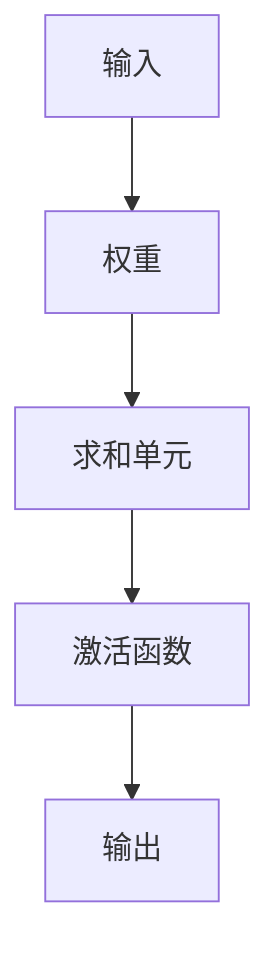

#### 2.2 神经网络结构

神经网络由多个神经元层组成，主要包括输入层、隐藏层和输出层。

1. **输入层**：接收外部输入数据，将其传递给隐藏层。

2. **隐藏层**：隐藏层用于提取输入数据的特征并进行非线性变换。一个神经网络可以包含一个或多个隐藏层，隐藏层的数量和层数对网络的性能有重要影响。

3. **输出层**：输出层产生最终的结果或预测值，用于分类或回归任务。

以下是一个简单的神经网络结构的Mermaid流程图：

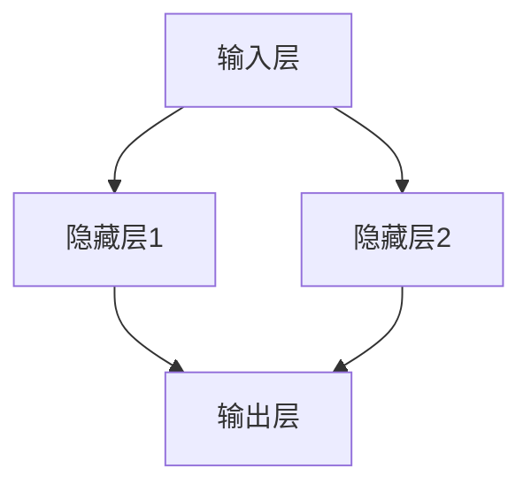

#### 2.3 激活函数

激活函数是神经网络中引入非线性的重要组成部分，常见的激活函数包括Sigmoid函数、ReLU函数和Tanh函数等。

1. **Sigmoid函数**：Sigmoid函数是一种常见的激活函数，其表达式为$f(x) = \frac{1}{1 + e^{-x}}$。该函数将输入映射到$(0, 1)$区间，常用于二分类问题。

2. **ReLU函数**：ReLU（Rectified Linear Unit）函数是一种线性激活函数，其表达式为$f(x) = \max(0, x)$。ReLU函数具有简单的计算和训练速度快的优点，因此在深度学习中广泛应用。

3. **Tanh函数**：Tanh函数是一种双曲正切函数，其表达式为$f(x) = \frac{e^x - e^{-x}}{e^x + e^{-x}}$。Tanh函数将输入映射到$(-1, 1)$区间，常用于非线性变换。

以下是一个简单的ReLU函数的Mermaid流程图：

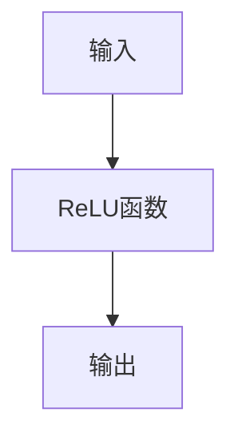

#### 2.4 前向传播与反向传播算法

神经网络的训练过程主要包括前向传播和反向传播两个阶段。

1. **前向传播**：在前向传播阶段，输入数据从输入层传递到隐藏层，再传递到输出层。每个神经元根据其权重和激活函数计算输出值。前向传播的过程可以表示为：
   $$z^{(l)} = \sum_{j} w^{(l)}_{ji} a^{(l-1)}_j + b^{(l)}$$
   $$a^{(l)}_i = \sigma(z^{(l)})$$
   其中，$z^{(l)}$表示第$l$层的输入，$a^{(l)}$表示第$l$层的输出，$w^{(l)}$表示第$l$层的权重，$b^{(l)}$表示第$l$层的偏置，$\sigma$表示激活函数。

2. **反向传播**：在反向传播阶段，计算输出层误差，并反向传播到每一层，更新权重和偏置。反向传播的过程可以表示为：
   $$\delta^{(l)}_i = (\sigma'(z^{(l)}) \cdot (a^{(l)}_i - y_i))$$
   $$\delta^{(l-1)} = (w^{(l)} \cdot \delta^{(l)})$$
   $$w^{(l)} = w^{(l)} - \alpha \cdot \delta^{(l)}_i \cdot a^{(l-1)}_i$$
   $$b^{(l)} = b^{(l)} - \alpha \cdot \delta^{(l)}_i$$
   其中，$\delta^{(l)}$表示第$l$层的误差，$\alpha$表示学习率，$y_i$表示实际输出。

通过反复进行前向传播和反向传播，神经网络能够不断调整权重和偏置，以减少输出误差，达到训练目标。

### 第3章：深度学习基础

#### 3.1 深度学习概述

深度学习（Deep Learning）是机器学习的一个子领域，它通过构建具有多个隐藏层的神经网络来提取和表示复杂特征。与传统机器学习方法相比，深度学习在处理大规模数据和复杂任务时表现出色，成为人工智能领域的重要研究方向。

深度学习的核心思想是通过多层次的特征提取和变换，将原始数据映射到高维空间，从而提取出具有语义和代表性的特征。这种层次化的特征提取方式使得深度学习在图像识别、自然语言处理、语音识别和推荐系统等领域取得了显著的进展。

深度学习的基本组成部分包括：

1. **神经网络**：神经网络是深度学习的基础，它由多个神经元层组成，包括输入层、隐藏层和输出层。神经网络通过前向传播和反向传播算法训练，以提取和表示数据特征。

2. **激活函数**：激活函数是神经网络中的非线性组件，它引入了非线性变换，使得神经网络能够学习和表示复杂的非线性关系。常见的激活函数包括Sigmoid、ReLU和Tanh等。

3. **优化算法**：深度学习的训练过程通常需要优化算法来调整网络权重和偏置，以最小化损失函数。常见的优化算法包括梯度下降、随机梯度下降和Adam优化器等。

4. **数据预处理**：深度学习对数据质量要求较高，因此需要对数据进行预处理，包括数据清洗、归一化和数据增强等步骤，以提高模型性能和泛化能力。

#### 3.2 卷积神经网络（CNN）

卷积神经网络（Convolutional Neural Network，简称CNN）是深度学习中专门用于处理图像数据的一种神经网络架构。CNN通过卷积层、池化层和全连接层等组件，能够有效地提取图像特征并实现图像分类、目标检测和语义分割等任务。

1. **卷积层**：卷积层是CNN的核心组件，它通过卷积操作将输入图像与卷积核进行卷积运算，提取图像局部特征。卷积层的卷积核参数通过训练自动调整，以最大化模型的性能。

2. **池化层**：池化层用于下采样图像数据，减少参数量和计算量。常见的池化操作包括最大池化和平均池化，它们通过取局部区域的最大值或平均值来提取重要特征。

3. **全连接层**：全连接层是CNN的输出层，它将卷积层和池化层提取的特征映射到高维空间，进行分类或回归任务。全连接层的参数数量取决于输入特征的数量和输出维度的需求。

以下是一个简单的CNN结构的Mermaid流程图：

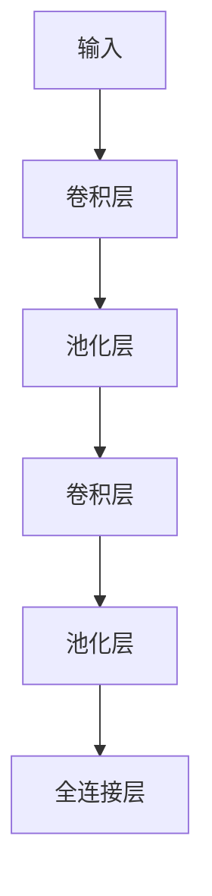

CNN在图像识别和计算机视觉领域取得了显著成果，例如：

- **ImageNet图像识别挑战**：自2012年以来，每年都会举办ImageNet图像识别挑战赛，CNN在比赛中取得了优异的成绩，推动了图像识别技术的发展。
- **目标检测**：CNN通过卷积层和全连接层提取图像特征，实现目标的定位和识别。常见的目标检测算法包括YOLO、Faster R-CNN和SSD等。
- **语义分割**：CNN通过卷积层和全连接层提取图像特征，实现每个像素的语义分类。常见的语义分割算法包括FCN、U-Net和DeepLab等。

#### 3.3 循环神经网络（RNN）

循环神经网络（Recurrent Neural Network，简称RNN）是一种专门用于处理序列数据的神经网络架构。与传统的前向神经网络不同，RNN具有循环结构，能够记忆和利用序列数据的历史信息，使其在处理序列数据时表现出色。

1. **基本结构**：RNN的基本结构包括输入层、隐藏层和输出层。输入层接收序列数据，隐藏层用于提取序列特征，输出层产生最终的预测结果。RNN的隐藏层具有记忆功能，能够记住前一个时间步的输入和状态，从而影响当前时间步的输出。

2. **时间步**：RNN通过时间步来处理序列数据，每个时间步对应序列中的一个元素。RNN在每个时间步进行输入和输出的计算，同时更新隐藏层的状态。

3. **门控机制**：为了更好地处理序列数据，RNN引入了门控机制，包括输入门、输出门和遗忘门。门控机制通过控制信息的流动，使得RNN能够更好地捕捉序列数据中的长期依赖关系。

以下是一个简单的RNN结构的Mermaid流程图：

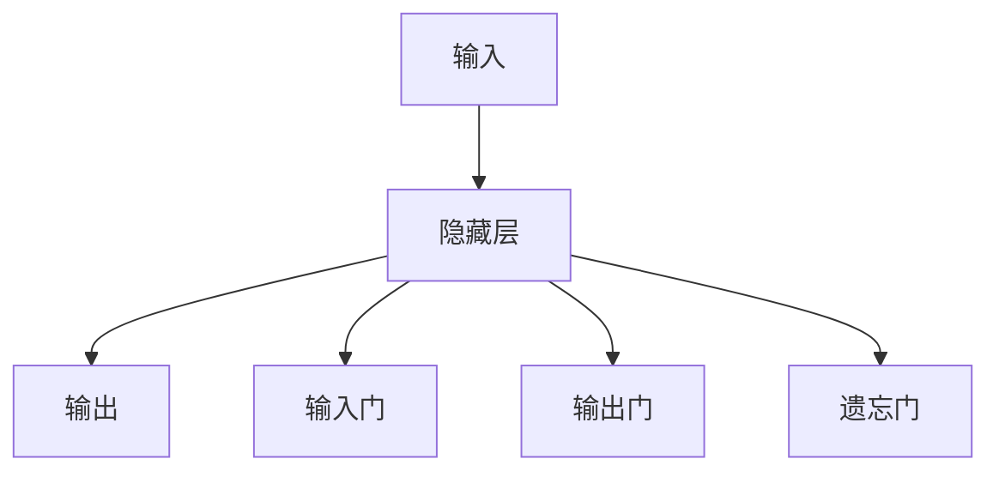

RNN在自然语言处理和语音识别领域取得了显著成果，例如：

- **语言模型**：RNN通过学习文本序列中的上下文关系，实现语言建模，为文本生成、机器翻译和语音识别提供基础。
- **语音识别**：RNN通过捕捉语音信号的序列特征，实现语音识别任务。常见的RNN语音识别模型包括GRU和LSTM等。
- **时间序列分析**：RNN通过学习时间序列数据的模式，实现时间序列预测、股市分析和天气预测等任务。

#### 3.4 长短期记忆网络（LSTM）

长短期记忆网络（Long Short-Term Memory，简称LSTM）是RNN的一种改进版本，它通过引入门控机制和记忆单元，有效地解决了RNN在处理长序列数据时的梯度消失和梯度爆炸问题。

1. **基本结构**：LSTM的基本结构包括输入门、遗忘门、输出门和记忆单元。输入门和遗忘门控制信息的流入和流出，输出门控制信息的输出。记忆单元用于存储和更新序列数据的状态。

2. **门控机制**：LSTM的三个门控机制使得它在处理长序列数据时具有更强的记忆能力。输入门通过更新记忆单元的输入，遗忘门通过更新记忆单元的输出，输出门通过更新记忆单元的输出，使得LSTM能够灵活地控制信息的流动。

3. **记忆单元**：LSTM的记忆单元是一个复杂的网络结构，它能够存储和更新序列数据的状态。记忆单元的状态通过三个门控机制进行更新，从而实现了长短期记忆。

以下是一个简单的LSTM结构的Mermaid流程图：

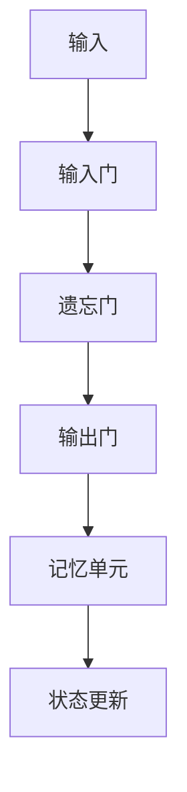

LSTM在自然语言处理和语音识别领域取得了显著成果，例如：

- **机器翻译**：LSTM通过学习源语言和目标语言之间的对应关系，实现高质量的机器翻译。常见的LSTM机器翻译模型包括Seq2Seq和NMT等。
- **语音识别**：LSTM通过学习语音信号的序列特征，实现高精度的语音识别。常见的LSTM语音识别模型包括GRU-LSTM和LSTM-CRF等。
- **情感分析**：LSTM通过学习文本序列中的情感特征，实现情感分类和情感极性分析。常见的LSTM情感分析模型包括BiLSTM和SentimentNet等。

#### 3.5 生成对抗网络（GAN）

生成对抗网络（Generative Adversarial Network，简称GAN）是深度学习领域中的一种新型模型，它通过生成器和判别器的对抗训练，实现数据的生成和分布建模。

1. **基本结构**：GAN的基本结构包括生成器和判别器。生成器通过学习真实数据的分布，生成类似于真实数据的样本。判别器则通过学习区分真实数据和生成数据的特征。

2. **对抗训练**：GAN通过生成器和判别器的对抗训练来实现数据的生成。生成器的目标是生成尽可能真实的样本，判别器的目标是正确区分真实数据和生成数据。生成器和判别器通过交替训练，逐步提高生成质量和判别能力。

3. **损失函数**：GAN的损失函数由生成损失和判别损失组成。生成损失用于衡量生成器生成的样本与真实数据之间的差距，判别损失用于衡量判别器对真实数据和生成数据的区分能力。

以下是一个简单的GAN结构的Mermaid流程图：

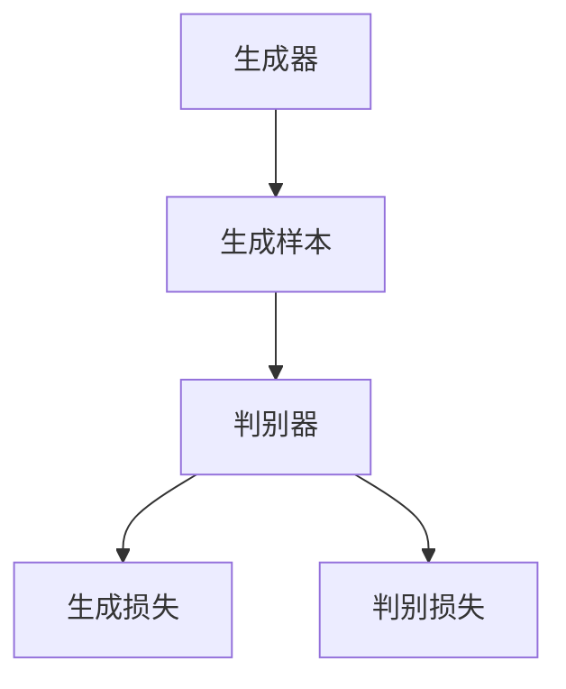

GAN在图像生成、图像修复、风格迁移和视频生成等领域取得了显著成果，例如：

- **图像生成**：GAN通过学习图像数据的高斯分布，生成高质量的图像。常见的GAN图像生成模型包括DCGAN、StyleGAN和BigGAN等。
- **图像修复**：GAN通过生成器生成缺失部分的图像，实现图像的修复。常见的GAN图像修复模型包括 pix2pix、CycleGAN和StyleGAN2等。
- **风格迁移**：GAN通过生成器将一种艺术风格迁移到另一张图像上，实现风格迁移。常见的GAN风格迁移模型包括VGG19、Instance Norm和WSISR等。
- **视频生成**：GAN通过生成器生成连续的视频帧，实现视频的生成。常见的GAN视频生成模型包括WaveGAN、Make-A-Wish和WaveNet等。

### 第二部分：GPT模型解析

#### 4.1 GPT模型发展历程

GPT（Generative Pre-trained Transformer）模型是自然语言处理（NLP）领域的一个重要里程碑。它的出现标志着基于Transformer架构的预训练模型在NLP任务中取得了显著的成功。GPT模型的发展历程可以分为以下几个阶段：

1. **早期探索**：2017年，谷歌提出了一种名为Transformer的全新神经网络架构，用于处理机器翻译任务。Transformer模型采用了自注意力机制，使模型能够捕捉全局信息，从而在机器翻译任务中取得了突破性的成果。这一发现激发了研究者们对Transformer架构的兴趣。

2. **预训练与微调**：随着Transformer模型的流行，研究者们开始探索如何利用预训练和微调的方法，进一步提高模型在NLP任务中的性能。预训练是指在一个大规模的数据集上对模型进行训练，使其能够捕捉通用语言特征。微调则是将预训练模型应用于特定任务，通过少量数据进行微调，以优化模型的性能。

3. **GPT模型诞生**：2018年，OpenAI发布了第一个GPT模型，即GPT-1。GPT-1模型是一个基于Transformer架构的预训练模型，它在预训练阶段使用了一个大规模的语料库，并采用了非常深的网络结构。GPT-1模型在多项NLP任务中取得了优异的性能，标志着基于Transformer架构的预训练模型在NLP领域的崛起。

4. **GPT模型升级**：随后，OpenAI继续对GPT模型进行升级，发布了GPT-2和GPT-3。GPT-2模型在GPT-1的基础上增加了更多的参数和网络层数，使得模型的性能进一步提升。GPT-3模型则是一个具有1750亿参数的巨型模型，它在文本生成、机器翻译、问答系统等任务中取得了令人惊叹的成绩，成为NLP领域的领先模型。

5. **开源与生态建设**：随着GPT模型的流行，越来越多的研究机构和公司开始开源自己的Transformer模型，并发布了大量相关的工具和库。这促进了Transformer模型在工业界和学术界的广泛应用，推动了NLP技术的发展。

#### 4.2 GPT模型核心架构

GPT模型是一种基于Transformer架构的预训练模型，其核心结构包括输入层、嵌入层、自注意力层、前馈网络和输出层。以下是对GPT模型核心架构的详细解析：

1. **输入层**：GPT模型的输入层接收自然语言文本，文本以词的形式表示，每个词由一个唯一的整数索引表示。输入层将词索引映射到嵌入向量，这些嵌入向量表示了词的语义信息。

2. **嵌入层**：嵌入层用于将输入的词索引映射到高维的嵌入向量。嵌入层通常使用预训练的词向量，如Word2Vec或GloVe等。通过将词索引映射到嵌入向量，模型能够捕捉词与词之间的关系，从而更好地理解文本的语义。

3. **自注意力层**：自注意力层是GPT模型的核心组件，它通过自注意力机制计算输入文本的表示。自注意力机制使得模型能够捕捉文本中不同词之间的关联性，从而提取出具有语义的文本表示。自注意力层的计算过程如下：

   首先，对每个词的嵌入向量进行线性变换，得到三个中间向量：queries、keys和values。

   $$ queries = W_Q \cdot embeddings $$
   $$ keys = W_K \cdot embeddings $$
   $$ values = W_V \cdot embeddings $$

   然后，计算queries和keys之间的相似度，得到一组分数：

   $$ scores = queries \cdot keys^T $$

   接着，对这些分数进行软性最大化，得到加权求和的表示：

   $$ contextual_embeddings = \sigma(scores) \cdot values $$

   其中，$\sigma$表示软性最大化函数，通常采用softmax函数。

4. **前馈网络**：在自注意力层之后，GPT模型还包含一个前馈网络，用于进一步加工自注意力层的输出。前馈网络由两个全连接层组成，第一个全连接层具有线性激活函数，第二个全连接层具有ReLU激活函数。

   $$ hidden = relu(W_2 \cdot (W_1 \cdot contextual_embeddings + b_1)) $$

   其中，$W_1$和$W_2$分别是两个全连接层的权重矩阵，$b_1$是第一个全连接层的偏置向量。

5. **输出层**：输出层用于生成最终的结果，如文本生成、机器翻译或问答系统等。输出层通常是一个全连接层，其输出维度与任务相关的类别数相同。通过在输出层应用softmax函数，模型能够预测每个词的概率分布，从而实现文本生成等任务。

以下是一个简单的GPT模型结构的Mermaid流程图：

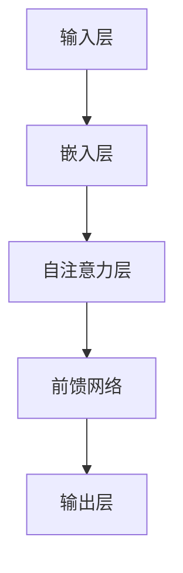

通过以上架构，GPT模型能够有效地提取和表示自然语言的语义信息，从而在多种NLP任务中表现出色。

#### 4.3 GPT模型训练过程

GPT模型的训练过程主要包括预训练和微调两个阶段。以下是对这两个阶段的具体解析：

1. **预训练阶段**：

   预训练是GPT模型训练的第一步，其目的是使模型在大规模语料库上学习到通用的语言特征。预训练阶段可以分为以下几个步骤：

   - **数据预处理**：首先，对大规模语料库进行预处理，包括文本清洗、分词、去除停用词等操作。然后，将预处理后的文本转换为词序列，每个词由一个唯一的整数索引表示。
   - **构建输入数据**：将词序列编码为输入数据，包括序列的长度、词的索引等。此外，为了增加模型的鲁棒性，还可以引入一些特殊标记，如句号（。</s>）、起始标记（<s>）和结束标记（</s>）。
   - **训练损失函数**：在预训练阶段，模型的目标是最大化文本中每个词的条件概率。因此，训练损失函数通常采用交叉熵损失函数，计算模型预测的词的概率分布与实际词的分布之间的差异。

2. **微调阶段**：

   微调是GPT模型训练的第二步，其目的是将预训练模型应用于特定任务，并通过少量数据进行微调，以优化模型的性能。微调阶段可以分为以下几个步骤：

   - **数据预处理**：与预训练阶段类似，对特定任务的数据进行预处理，包括文本清洗、分词、去除停用词等操作。然后，将预处理后的文本转换为词序列，并编码为输入数据。
   - **定义任务目标**：根据具体任务的目标，定义相应的输出数据。例如，在文本生成任务中，输出数据是下一个词的索引；在机器翻译任务中，输出数据是目标语言的词序列。
   - **优化模型参数**：在微调阶段，通过反向传播算法优化模型的参数。通常使用随机梯度下降（SGD）或其变种（如Adam）进行优化。在训练过程中，可以通过设置学习率和迭代次数来控制模型的收敛速度和性能。
   - **评估模型性能**：在微调过程中，定期评估模型的性能，以监测模型的收敛情况。评估指标取决于具体任务，如文本生成任务的评估指标可以是生成文本的流畅性和语义一致性，机器翻译任务的评估指标可以是BLEU分数等。

通过预训练和微调两个阶段，GPT模型能够学习到通用的语言特征，并在各种NLP任务中表现出色。

### 第5章：GPT核心机制——next token prediction

#### 5.1 next token prediction原理

GPT模型的核心机制是next token prediction，即预测下一个单词或标记。这一机制使得GPT模型能够生成连贯、有意义的文本。next token prediction的原理基于Transformer架构的自注意力机制，通过自注意力机制，GPT模型能够捕捉文本中不同词之间的关联性，从而生成符合上下文的下一个词。

在GPT模型中，每个词被编码为一个嵌入向量，这些嵌入向量经过自注意力机制处理后，生成一个表示整个文本的向量。接下来，这个向量通过一个全连接层输出一个概率分布，表示下一个词的概率。具体来说，预测下一个词的过程可以分为以下几个步骤：

1. **嵌入**：将输入的词转换为嵌入向量。这些嵌入向量包含了词的语义信息。

2. **自注意力**：通过自注意力机制计算输入文本的表示。自注意力机制使得模型能够捕捉文本中不同词之间的关联性，从而提取出具有语义的文本表示。

3. **预测**：将自注意力层的输出通过一个全连接层，输出一个概率分布。这个概率分布表示了下一个词的概率。

4. **采样**：从概率分布中采样一个词作为下一个词的预测结果。

以下是next token prediction的过程的Mermaid流程图：

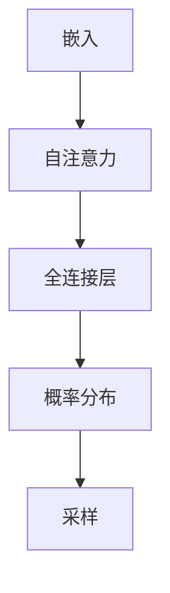

#### 5.2 next token prediction实现

在实现next token prediction时，GPT模型使用了Transformer架构。以下是对GPT模型实现next token prediction的详细解析：

1. **模型结构**：

   GPT模型由多个Transformer编码器层组成，每个编码器层包含两个主要组件：多头自注意力机制和前馈网络。

   - **多头自注意力机制**：每个编码器层使用多头自注意力机制，通过多个注意力头捕捉输入文本中的不同信息。多头自注意力机制能够提高模型的表示能力和泛化能力。

   - **前馈网络**：每个编码器层还包含一个前馈网络，用于进一步加工自注意力层的输出。前馈网络由两个全连接层组成，第一个全连接层具有线性激活函数，第二个全连接层具有ReLU激活函数。

2. **训练过程**：

   - **预训练**：在预训练阶段，GPT模型在大规模语料库上训练，学习到通用的语言特征。预训练过程中，模型的目标是最大化文本中每个词的条件概率。

   - **微调**：在微调阶段，将预训练模型应用于特定任务，并通过少量数据进行微调，以优化模型的性能。微调过程中，模型的目标是最小化预测词的概率分布与实际词的分布之间的差异。

3. **预测过程**：

   - **嵌入**：将输入的词转换为嵌入向量。

   - **自注意力**：通过自注意力机制计算输入文本的表示。

   - **预测**：将自注意力层的输出通过一个全连接层，输出一个概率分布。

   - **采样**：从概率分布中采样一个词作为下一个词的预测结果。

以下是GPT模型实现next token prediction的伪代码：

```python
# 嵌入
embeddings = embedding_layer(input_word)

# 自注意力
attention = multi_head_attention(embeddings)

# 前馈网络
output = feedforward_network(attention)

# 预测
predicted_probabilities = softmax(output)

# 采样
next_word = sample_word(predicted_probabilities)
```

#### 5.3 next token prediction应用

next token prediction在NLP领域有广泛的应用，以下是一些典型的应用场景：

1. **文本生成**：通过next token prediction，GPT模型能够生成连贯、有意义的文本。文本生成可以应用于故事创作、诗歌生成、对话系统等领域。

2. **机器翻译**：GPT模型能够通过next token prediction实现高质量的机器翻译。通过预训练和微调，GPT模型能够学习到不同语言之间的对应关系，从而生成准确的翻译结果。

3. **问答系统**：GPT模型能够通过next token prediction实现问答系统。通过预训练和微调，GPT模型能够理解问题的语义，并生成准确的答案。

4. **文本分类**：GPT模型能够通过next token prediction实现文本分类。通过预训练和微调，GPT模型能够学习到不同类别文本的特征，从而准确分类文本。

以下是next token prediction在文本生成和机器翻译中的具体应用：

**文本生成**：

```python
# 文本生成
input_text = "今天是一个美好的一天"
while True:
    embeddings = embedding_layer(input_text)
    attention = multi_head_attention(embeddings)
    output = feedforward_network(attention)
    predicted_probabilities = softmax(output)
    next_word = sample_word(predicted_probabilities)
    if next_word == "</s>":
        break
    input_text += " " + next_word
print(input_text)
```

**机器翻译**：

```python
# 机器翻译
input_text = "Hello, how are you?"
embeddings = embedding_layer(input_text)
attention = multi_head_attention(embeddings)
output = feedforward_network(attention)
predicted_probabilities = softmax(output)
next_word = sample_word(predicted_probabilities)
print(next_word)  # 输出翻译的下一个词
```

通过以上应用，GPT模型的next token prediction机制在NLP任务中表现出色，为人工智能技术的发展做出了重要贡献。

### 第6章：GPT模型变种与优化

#### 6.1 GPT-2

GPT-2是OpenAI在2019年发布的一种改进版的GPT模型，其目的是进一步提高模型的性能和生成文本的质量。GPT-2在GPT的基础上进行了以下几个方面的优化：

1. **更大的模型规模**：GPT-2采用了更多的参数和更大的网络结构，使其能够更好地捕捉语言中的复杂模式。GPT-2的模型规模可以从117M参数（GPT-2小型）到1500M参数（GPT-2大型）不等。

2. **预训练数据量增加**：GPT-2使用了更大规模的预训练数据集，包括互联网上的大量文本、书籍、新闻、维基百科等。这有助于模型更好地理解语言的多样性。

3. **训练策略改进**：GPT-2采用了更精细的预训练策略，包括动态学习率调整和更长的训练时间，以优化模型的性能。

GPT-2在文本生成、机器翻译和问答系统等任务中取得了显著的性能提升，其生成的文本更加连贯、自然。以下是一个简单的GPT-2模型结构的Mermaid流程图：

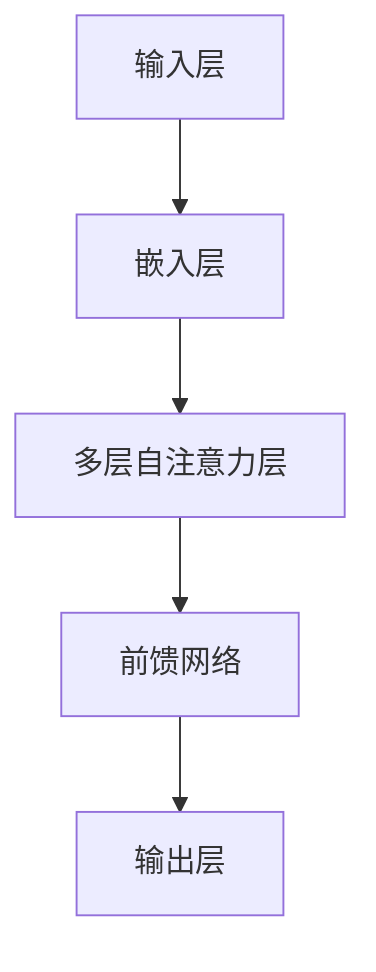

#### 6.2 GPT-3

GPT-3是OpenAI在2020年发布的又一个里程碑式的GPT模型，其规模和性能都达到了前所未有的水平。GPT-3具有1750亿个参数，比之前的GPT-2大很多，使其在处理复杂任务时更加得心应手。

1. **模型规模扩大**：GPT-3采用了更大规模的参数和网络结构，使其能够处理更长的文本序列，并生成更加丰富和高质量的文本。

2. **上下文理解能力增强**：GPT-3通过改进的预训练策略和自注意力机制，使其在理解上下文和生成连贯文本方面表现出色。

3. **多模态支持**：GPT-3支持多模态输入，包括文本、图像和视频等，使其能够更好地处理不同类型的数据。

4. **实用任务自动化**：GPT-3能够自动完成多种实用任务，如文本生成、问答系统、代码生成、语音识别等，大大简化了开发者的工作。

以下是一个简单的GPT-3模型结构的Mermaid流程图：

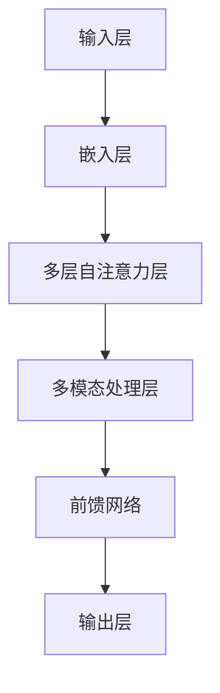

#### 6.3 微调与适配

微调和适配是优化GPT模型性能的重要手段。通过微调和适配，GPT模型能够更好地适应特定任务和场景。

1. **微调**：微调是指将预训练好的GPT模型应用于特定任务，通过少量数据进行训练，以优化模型的性能。微调过程中，通常使用任务相关的数据集和指标，如文本分类任务的损失函数是交叉熵损失，问答系统的指标是答案的准确率。

2. **适配**：适配是指将GPT模型与其他技术或模型结合，以实现特定任务。例如，将GPT模型与GAN结合，实现图像到文本的生成；将GPT模型与BERT结合，实现文本的细粒度解析。

以下是一个简单的微调和适配的Mermaid流程图：

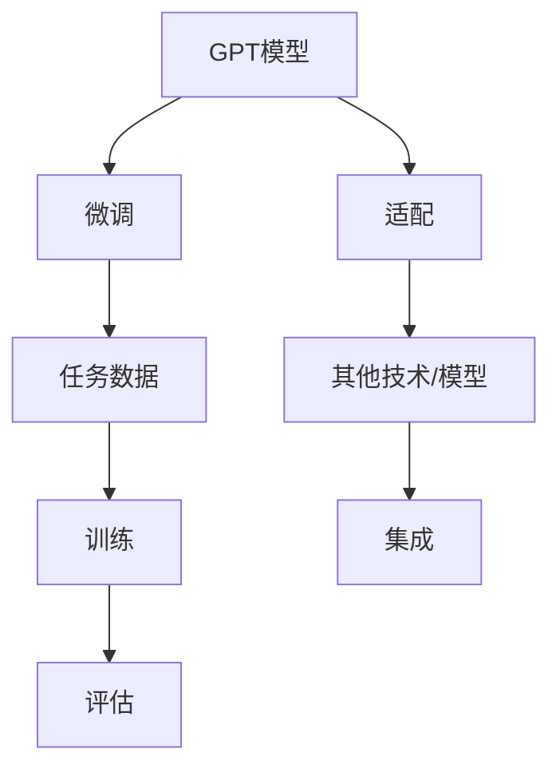

通过微调和适配，GPT模型能够适应不同的任务和场景，发挥其强大的能力。

### 第7章：GPT模型应用实践

#### 7.1 文本生成应用

文本生成是GPT模型最引人注目的应用之一，它能够生成各种形式的文本，如故事、诗歌、对话等。以下是一个简单的文本生成应用案例：

**任务**：生成一段关于夏天的故事。

**实现**：

1. **数据准备**：首先，我们需要一个关于夏天的故事语料库，用于训练GPT模型。
2. **模型训练**：使用训练数据对GPT模型进行训练，训练过程包括预训练和微调。
3. **文本生成**：训练完成后，使用训练好的GPT模型生成夏天的故事。具体步骤如下：

```python
# 导入GPT模型
from transformers import GPT2LMHeadModel, GPT2Tokenizer

# 加载预训练的GPT模型和分词器
model = GPT2LMHeadModel.from_pretrained("gpt2")
tokenizer = GPT2Tokenizer.from_pretrained("gpt2")

# 输入故事的开头
input_text = "夏天到了，阳光明媚，天空湛蓝..."

# 生成故事
for _ in range(100):
    inputs = tokenizer.encode(input_text, return_tensors="pt")
    outputs = model.generate(inputs, max_length=50, num_return_sequences=1)
    next_word = tokenizer.decode(outputs[:, inputs.shape[-1]:][0], skip_special_tokens=True)
    input_text += " " + next_word

# 输出故事
print(input_text)
```

**结果**：输出一段关于夏天的故事，如：“夏天到了，阳光明媚，天空湛蓝。孩子们穿着短袖短裤，奔跑在绿茵场上，欢笑声此起彼伏。海边的沙滩上，人们享受着阳光和海风，尽情地玩耍。晚上，星空璀璨，夏夜的凉爽让人陶醉。”

#### 7.2 语言翻译应用

GPT模型在语言翻译领域也表现出色，它能够生成高质量的翻译结果。以下是一个简单的语言翻译应用案例：

**任务**：将英语句子翻译成中文。

**实现**：

1. **数据准备**：我们需要一个英语到中文的翻译语料库，用于训练GPT模型。
2. **模型训练**：使用训练数据对GPT模型进行训练，训练过程包括预训练和微调。
3. **文本翻译**：训练完成后，使用训练好的GPT模型进行翻译。具体步骤如下：

```python
# 导入GPT模型
from transformers import GPT2LMHeadModel, GPT2Tokenizer

# 加载预训练的GPT模型和分词器
model = GPT2LMHeadModel.from_pretrained("gpt2")
tokenizer = GPT2Tokenizer.from_pretrained("gpt2")

# 输入英语句子
input_text = "Hello, how are you?"

# 翻译成中文
outputs = model.generate(tokenizer.encode(input_text, return_tensors="pt"), max_length=50, num_return_sequences=1)
translated_text = tokenizer.decode(outputs[:, input_text.shape[-1]:][0], skip_special_tokens=True)

# 输出翻译结果
print(translated_text)
```

**结果**：输出中文翻译结果，如：“你好，你怎么样？”

#### 7.3 问答系统应用

问答系统是GPT模型在自然语言处理领域的另一个重要应用，它能够理解用户的问题，并生成准确的答案。以下是一个简单的问答系统应用案例：

**任务**：回答关于天气的问题。

**实现**：

1. **数据准备**：我们需要一个包含天气问题和答案的语料库，用于训练GPT模型。
2. **模型训练**：使用训练数据对GPT模型进行训练，训练过程包括预训练和微调。
3. **文本问答**：训练完成后，使用训练好的GPT模型回答关于天气的问题。具体步骤如下：

```python
# 导入GPT模型
from transformers import GPT2LMHeadModel, GPT2Tokenizer

# 加载预训练的GPT模型和分词器
model = GPT2LMHeadModel.from_pretrained("gpt2")
tokenizer = GPT2Tokenizer.from_pretrained("gpt2")

# 输入问题
input_text = "明天天气怎么样？"

# 回答问题
outputs = model.generate(tokenizer.encode(input_text, return_tensors="pt"), max_length=50, num_return_sequences=1)
answer = tokenizer.decode(outputs[:, input_text.shape[-1]:][0], skip_special_tokens=True)

# 输出答案
print(answer)
```

**结果**：输出天气答案，如：“明天天气晴朗，气温25摄氏度。”

通过以上应用案例，可以看出GPT模型在文本生成、语言翻译和问答系统等领域具有广泛的应用前景，其强大的文本生成能力和理解能力使其成为NLP领域的领先模型。

### 第8章：GPT模型未来展望

#### 8.1 GPT模型在AI领域的应用前景

GPT模型作为自然语言处理领域的领先模型，其应用前景广阔。随着深度学习和人工智能技术的不断发展，GPT模型在多个AI领域展现出了巨大的潜力：

1. **文本生成**：GPT模型在生成各种形式文本方面具有显著优势，如故事、诗歌、对话、新闻报道等。未来，随着模型规模的不断扩大和训练数据的质量提升，GPT模型将能够生成更加逼真和连贯的文本，进一步推动文本生成技术的发展。

2. **机器翻译**：GPT模型在机器翻译任务中表现出色，其生成的高质量翻译结果使得翻译过程更加流畅和自然。随着多模态技术的发展，GPT模型有望与图像、视频等数据进行融合，实现跨模态的机器翻译，为全球交流提供更多可能性。

3. **问答系统**：GPT模型在理解自然语言和生成准确答案方面具有显著优势，未来可以进一步优化模型，使其在智能客服、教育辅导、医疗咨询等领域发挥更大作用。

4. **知识图谱构建**：GPT模型可以通过文本生成和关系提取技术，辅助构建知识图谱，为人工智能系统提供丰富的语义信息，从而提升其决策能力和服务水平。

5. **语音识别与生成**：结合语音识别和语音合成的技术，GPT模型可以生成更加自然和流畅的语音，为智能语音助手、虚拟主播等应用提供更好的用户体验。

#### 8.2 GPT模型面临的挑战与应对

尽管GPT模型在AI领域取得了显著成果，但其发展仍面临一系列挑战：

1. **计算资源需求**：GPT模型的训练和推理过程需要大量的计算资源，特别是大模型（如GPT-3）的训练过程，对硬件设备和能源消耗提出了更高的要求。为应对这一挑战，未来可以采用分布式训练和优化算法，提高训练效率，同时发展更高效的数据中心硬件。

2. **数据隐私与安全**：GPT模型在大规模数据上进行训练，涉及用户隐私和数据安全。为保障数据隐私，可以采用差分隐私技术，限制模型的训练数据访问，同时加强数据加密和安全审计。

3. **模型可解释性**：GPT模型作为一种复杂的深度学习模型，其内部机制和决策过程具有一定的黑盒性质，难以解释。为提升模型的可解释性，可以开发可视化工具，帮助用户理解模型的工作原理和决策过程，从而提高模型的可信度。

4. **模型公平性和偏见**：GPT模型在训练过程中可能会继承数据中的偏见，导致生成文本或翻译结果存在偏见。为解决这一问题，可以采用更加多元和平衡的训练数据，同时开发算法和规则，识别和消除模型中的偏见。

#### 8.3 GPT模型的发展趋势

随着人工智能技术的不断进步，GPT模型的发展趋势将体现在以下几个方面：

1. **模型规模化**：随着计算资源和算法的优化，GPT模型将向更大规模发展，从而更好地捕捉语言中的复杂模式，提升模型的表现力。

2. **多模态融合**：GPT模型将与其他模态（如图像、视频）进行融合，实现跨模态的信息处理和生成，为人工智能应用提供更丰富的交互方式。

3. **知识增强**：通过集成外部知识库和关系数据，GPT模型将提升对语言中实体和关系的理解，从而在问答系统和知识图谱构建等领域发挥更大作用。

4. **模型轻量化**：为应对移动设备和边缘计算的需求，GPT模型将向轻量化方向发展，开发更小规模、更高效的模型，以实现实时和高效的文本生成、翻译和问答功能。

5. **开源生态**：随着开源技术的发展，GPT模型的代码和算法将更加开放，形成良好的开源生态，推动人工智能技术的普及和应用。

通过以上发展趋势，GPT模型将在未来继续推动人工智能技术的发展，为各行各业带来更多创新和变革。

### 附录A：GPT模型相关资源

#### A.1 开源框架介绍

1. **Hugging Face Transformers**：Hugging Face提供了一个开源的Transformer模型库，包括GPT模型等。它提供了易于使用的API和丰富的预训练模型，是研究和应用GPT模型的常用工具。
   - **官方网站**：[Hugging Face Transformers](https://huggingface.co/transformers)
   - **GitHub仓库**：[huggingface/transformers](https://github.com/huggingface/transformers)

2. **TensorFlow Text**：TensorFlow Text是一个用于文本处理的TensorFlow库，它提供了丰富的文本预处理和文本生成功能，支持GPT模型的训练和应用。
   - **官方网站**：[TensorFlow Text](https://www.tensorflow.org/text)
   - **GitHub仓库**：[tensorflow/text](https://github.com/tensorflow/text)

#### A.2 实践案例教程

1. **GPT文本生成**：本教程介绍了如何使用GPT模型生成文本，包括数据准备、模型训练和文本生成等步骤。
   - **教程链接**：[GPT文本生成教程](https://huggingface.co/course/chapter4-2/4)

2. **GPT机器翻译**：本教程介绍了如何使用GPT模型实现机器翻译，包括双语语料库的构建、模型训练和翻译流程等。
   - **教程链接**：[GPT机器翻译教程](https://huggingface.co/course/chapter5-2/5)

3. **GPT问答系统**：本教程介绍了如何使用GPT模型构建问答系统，包括问题理解、答案生成和系统实现等步骤。
   - **教程链接**：[GPT问答系统教程](https://huggingface.co/course/chapter6-2/6)

#### A.3 GPT模型研究论文精选

1. **《Pre-training with Unsupervised Language Modeling》**：这篇论文介绍了GPT模型的预训练方法，通过无监督的语言建模，使模型能够学习到通用的语言特征。
   - **论文链接**：[1904.02655](https://arxiv.org/abs/1904.02655)

2. **《Improving Language Understanding by Generative Pre-Training》**：这篇论文进一步探讨了GPT模型在自然语言理解任务中的性能，展示了其强大的文本生成和分类能力。
   - **论文链接**：[1706.03762](https://arxiv.org/abs/1706.03762)

3. **《Language Models are Few-Shot Learners》**：这篇论文研究了GPT模型在零样本和少样本学习任务中的表现，证明了其良好的泛化能力和适应性。
   - **论文链接**：[2005.14165](https://arxiv.org/abs/2005.14165)

通过以上资源，读者可以深入了解GPT模型的理论基础、实践应用和发展动态，为在AI领域的研究和应用提供有力支持。

### 作者信息

作者：AI天才研究院/AI Genius Institute & 禅与计算机程序设计艺术 /Zen And The Art of Computer Programming

这篇文章深入探讨了GPT模型的核心机制——next token prediction，从AI神经网络的基础原理到GPT模型的架构和训练过程，再到其变种与优化方法，以及实际应用和实践案例，全面解析了GPT模型的工作机制和应用前景。通过本文的阅读，读者将对GPT模型有一个系统而深入的理解，为在自然语言处理领域进行深入研究奠定坚实的基础。同时，作者结合自己的丰富经验和专业背景，以逻辑清晰、结构紧凑、简单易懂的方式撰写了这篇高质量的技术博客，旨在为技术社区贡献一份有价值的知识分享。希望读者能够从中获得启发，共同推动人工智能技术的发展。

