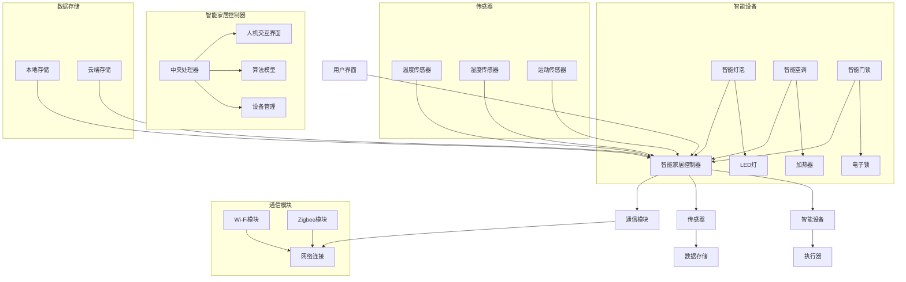
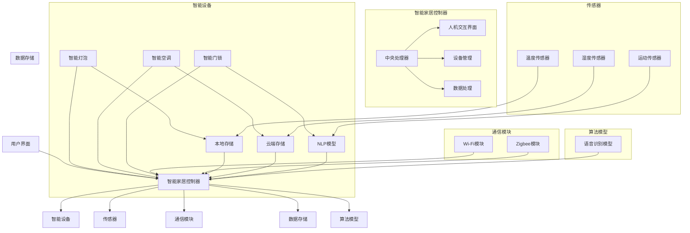

                 

### 文章标题

# AI2.0时代：物理实体的自动化前景

### 关键词：  
AI2.0、物理实体自动化、工业自动化、农业自动化、医疗自动化、智能家居

### 摘要：  
本文深入探讨了AI2.0时代物理实体自动化的前景。通过分析AI2.0的定义和特征，我们了解了AI2.0与AI1.0的区别，并探讨了物理实体自动化的基本原理和应用。文章重点介绍了AI2.0在工业自动化、农业自动化、医疗自动化和智能家居等领域的应用案例，以及AI2.0时代的发展前景与挑战。最后，文章给出了AI2.0相关资源与工具，为读者提供了进一步学习和实践的方向。

---

### 第一部分: AI2.0时代的背景

#### 第1章: AI2.0时代的概述

#### 1.1 AI2.0时代的定义与特征

**1.1.1 AI2.0时代的定义**  
AI2.0（Artificial Intelligence, version 2.0）是指新一代人工智能技术，它不仅能够处理大量数据，还能进行自我学习和自我优化。AI2.0强调人工智能在现实世界中的应用，通过更加智能的算法和更加广泛的领域应用，实现物理实体的自动化。

**1.1.2 AI2.0时代的特征**  
与AI1.0相比，AI2.0具有以下特征：

- **数据驱动的学习**：AI2.0基于大量真实世界的数据进行训练，能够从数据中提取更复杂的模式和规律。
- **强交互性**：AI2.0能够与人类进行自然语言交流，实现人机协同工作。
- **物理实体的融合**：AI2.0不仅局限于虚拟空间，还与物理世界深度融合，实现物理实体的自动化。
- **泛在性**：AI2.0技术将应用于各个领域，如工业、农业、医疗和智能家居等。

#### 1.1.3 AI2.0的主要应用场景

AI2.0的主要应用场景包括：

- **工业自动化**：通过AI2.0技术实现生产线的自动化，提高生产效率和产品质量。
- **农业自动化**：利用AI2.0技术进行精准农业，提高农业生产效率和质量。
- **医疗自动化**：通过AI2.0技术实现医疗设备的自动化操作，提高诊断和治疗水平。
- **智能家居**：AI2.0技术将智能家居设备连接起来，实现家庭自动化管理。

### 1.2 AI2.0的核心概念

**1.2.1 强化学习**  
强化学习是一种通过试错学习来提高决策质量的算法。在AI2.0中，强化学习用于训练智能体，使其能够在复杂环境中进行自主决策。强化学习的核心思想是通过奖励机制，让智能体在尝试不同的动作后，学会选择能够获得最大奖励的动作。

**1.2.2 深度强化学习**  
深度强化学习是强化学习的一种扩展，它结合了深度学习和强化学习的优势。通过深度神经网络，深度强化学习能够处理高维的状态空间和动作空间，实现更复杂的决策。

**1.2.3 分布式系统与边缘计算**  
分布式系统是将计算任务分布在多个计算节点上，以实现高性能计算和高可用性。边缘计算是将计算任务从云端转移到网络边缘，以减少延迟和带宽消耗。在AI2.0中，分布式系统和边缘计算用于处理大规模数据和实时数据流。

### 1.3 AI2.0的技术演进

**1.3.1 神经网络的发展历程**  
神经网络是一种模拟人脑神经元连接的结构。从早期的感知机、多层感知机，到现代的卷积神经网络、循环神经网络等，神经网络在AI2.0中发挥着重要作用。

**1.3.2 大规模预训练模型**  
大规模预训练模型是通过在大量数据上预先训练模型，使其具有通用特征。例如，BERT、GPT等模型，通过大规模预训练，可以在不同的任务上取得优异的性能。

**1.3.3 自适应控制理论**  
自适应控制理论是一种能够根据环境变化自适应调整控制策略的控制理论。在AI2.0中，自适应控制理论用于实现智能体的自适应行为。

---

### 第二部分: 物理实体自动化的基本原理

#### 第2章: 物理实体自动化的基本原理

#### 2.1 物理实体自动化的定义与重要性

**2.1.1 物理实体自动化的定义**  
物理实体自动化是指利用人工智能技术，对物理实体（如机器人、自动化设备等）进行智能控制，实现自动化操作的过程。

**2.1.2 物理实体自动化的重要性**  
物理实体自动化在现代社会中具有重要意义，主要体现在以下几个方面：

- **提高生产效率**：通过自动化设备，可以减少人工操作，提高生产效率。
- **降低生产成本**：自动化设备可以减少人力成本和能源消耗，降低生产成本。
- **提高产品质量**：自动化设备可以精确控制生产过程，提高产品质量。
- **改善工作环境**：自动化设备可以减少人工劳动强度，改善工作环境。

#### 2.1.3 物理实体自动化的发展历程

物理实体自动化的发展可以分为以下几个阶段：

- **初始阶段**：以机械自动化为基础，实现简单的自动化操作。
- **感知阶段**：引入传感器技术，实现对物理实体的感知。
- **决策阶段**：结合控制理论和人工智能算法，实现对物理实体的智能决策。
- **协同阶段**：实现多个物理实体之间的协同工作，提高整体效率。

#### 2.1.4 物理实体自动化在工业中的应用

物理实体自动化在工业中的应用非常广泛，主要包括以下几个方面：

- **生产线自动化**：通过机器人实现生产线的自动化，提高生产效率和质量。
- **质量控制**：利用传感器和人工智能技术，实现对产品质量的实时监控和检测。
- **设备维护**：通过预测性维护，降低设备故障率和停机时间。

---

#### 2.2 传感器技术与数据处理

**2.2.1 常见传感器介绍**  
传感器是实现物理实体自动化的关键组成部分，常见的传感器包括：

- **温度传感器**：用于检测温度变化。
- **湿度传感器**：用于检测环境湿度。
- **压力传感器**：用于检测压力变化。
- **位置传感器**：用于检测物理实体的位置。

**2.2.2 数据采集与预处理**  
在物理实体自动化中，数据采集与预处理是关键步骤。数据采集主要包括以下几个方面：

- **传感器数据采集**：通过传感器实时采集物理实体的状态信息。
- **数据传输**：将传感器数据传输到数据处理系统。
- **数据预处理**：包括数据清洗、数据去噪、数据归一化等。

**2.2.3 数据处理算法**  
数据处理算法是实现物理实体自动化的核心。常见的数据处理算法包括：

- **特征提取**：从原始数据中提取出有用的信息。
- **模式识别**：根据特征信息对物理实体进行分类或判断。
- **预测分析**：基于历史数据，对物理实体的未来状态进行预测。

---

#### 2.3 机器人与自动化控制系统

**2.3.1 机器人技术概述**  
机器人技术是物理实体自动化的重要组成部分。机器人技术主要包括以下几个方面：

- **硬件设计**：包括机械结构、传感器、执行器等。
- **软件系统**：包括控制算法、人机交互界面等。
- **机器人编程**：通过编程实现对机器人的控制。

**2.3.2 自动化控制系统的基本架构**  
自动化控制系统的基本架构包括以下几个部分：

- **传感器模块**：用于实时监测物理实体的状态。
- **控制器模块**：根据传感器数据，实现对物理实体的控制。
- **执行器模块**：根据控制器指令，执行相应的操作。
- **人机交互模块**：提供用户操作界面，实现对自动化系统的监控和操作。

**2.3.3 机器人与自动化控制系统的集成应用**  
机器人与自动化控制系统的集成应用是实现物理实体自动化的关键。常见的集成应用包括：

- **生产线自动化**：通过机器人实现生产线的自动化。
- **仓储自动化**：通过自动化仓储系统，实现货物的自动存取。
- **物流自动化**：通过自动化物流系统，实现货物的自动运输。

---

### 第三部分: AI2.0在各个领域的应用

#### 第3章: AI2.0在工业自动化中的应用

#### 3.1 AI2.0在工业自动化中的核心价值

AI2.0在工业自动化中的应用，具有以下几个核心价值：

**3.1.1 提高生产效率**  
AI2.0技术可以实现对工业生产过程的智能化优化，通过预测性维护、自动化生产线的调度等手段，提高生产效率。

**3.1.2 降低生产成本**  
AI2.0技术可以减少人力投入和能源消耗，通过自动化设备和智能化生产管理，降低生产成本。

**3.1.3 提升产品质量**  
AI2.0技术可以实现对产品质量的实时监控和检测，通过机器视觉、传感器等设备，提高产品质量。

#### 3.2 AI2.0在工业自动化中的关键技术

AI2.0在工业自动化中的应用，涉及以下几个关键技术：

**3.2.1 智能传感器与物联网技术**  
智能传感器可以实时采集生产过程中的各种数据，如温度、湿度、压力等。物联网技术则可以将这些数据传输到中央控制系统，实现数据的实时监控和分析。

**3.2.2 机器人与自动化控制技术**  
机器人与自动化控制技术是实现工业自动化的核心。通过机器人，可以实现生产线的自动化操作，减少人力投入。自动化控制系统则可以实时监控生产过程，根据传感器数据自动调整生产参数，确保生产过程的稳定和高效。

**3.2.3 深度学习与强化学习技术**  
深度学习和强化学习技术是AI2.0在工业自动化中的关键技术。通过深度学习，可以对生产过程中的大量数据进行分析，提取出有用的信息。强化学习则可以通过试错学习，自动优化生产流程，提高生产效率。

#### 3.3 AI2.0在工业自动化中的典型应用案例

**3.3.1 智能制造系统**  
智能制造系统是AI2.0在工业自动化中的应用的一个典型例子。通过引入智能传感器、机器人、自动化控制技术等，可以实现生产线的智能化改造，提高生产效率和质量。

**3.3.2 智能仓储与物流**  
智能仓储与物流系统通过AI2.0技术，可以实现仓储和物流的自动化管理。例如，通过自动化分拣机器人、自动化搬运机器人等，可以提高仓储和物流的效率。

**3.3.3 智能检测与维护系统**  
智能检测与维护系统通过AI2.0技术，可以实现设备的实时监控和故障预测。例如，通过传感器和图像识别技术，可以实现对设备的实时监测，提前发现潜在故障，进行预防性维护，减少设备故障率和停机时间。

---

#### 第4章: AI2.0在农业自动化中的应用

#### 4.1 AI2.0在农业自动化中的核心价值

AI2.0在农业自动化中的应用，具有以下几个核心价值：

**4.1.1 提高农业生产效率**  
AI2.0技术可以实现对农业生产的自动化和智能化管理，从而提高生产效率。例如，通过无人机和机器视觉技术，可以实现对农田的精准施肥和病虫害监测，提高农作物的产量和质量。

**4.1.2 实现精准农业**  
精准农业是指通过实时监测和分析农田数据，实现农业生产的精准化。AI2.0技术可以实现对土壤、水分、气象等数据的实时监测和分析，为农业生产提供科学依据，实现精准农业。

**4.1.3 降低农业生产成本**  
AI2.0技术可以减少人力投入，降低农业生产成本。例如，通过自动化灌溉系统和智能喷药系统，可以实现对农田的自动化管理，减少人力和水资源的使用。

#### 4.2 AI2.0在农业自动化中的关键技术

AI2.0在农业自动化中的应用，涉及以下几个关键技术：

**4.2.1 智能传感器与物联网技术**  
智能传感器和物联网技术是AI2.0在农业自动化中的重要组成部分。通过智能传感器，可以实时采集农田的各种数据，如土壤湿度、温度、氮磷钾含量等。物联网技术则可以将这些数据传输到中央控制系统，实现农田数据的实时监控和分析。

**4.2.2 机器人与自动化控制技术**  
机器人与自动化控制技术是实现农业自动化的核心。通过机器人，可以实现农业生产的自动化操作，减少人力投入。自动化控制系统则可以实时监控农业生产的各个环节，根据传感器数据自动调整生产参数，确保农业生产的稳定和高效。

**4.2.3 深度学习与强化学习技术**  
深度学习和强化学习技术是AI2.0在农业自动化中的关键技术。通过深度学习，可以对农业生产的各种数据进行分析，提取出有用的信息。强化学习则可以通过试错学习，自动优化农业生产过程，提高生产效率。

#### 4.3 AI2.0在农业自动化中的典型应用案例

**4.3.1 智能农业大棚**  
智能农业大棚通过AI2.0技术，可以实现大棚内环境参数的自动控制。例如，通过传感器实时监测温度、湿度、光照等参数，自动调整通风、灌溉和补光等，为作物提供最佳的生长环境。

**4.3.2 智能种植机器人**  
智能种植机器人通过机器视觉和深度学习技术，可以实现自动播种、施肥、除草和收获。例如，通过摄像头和传感器识别农田的状态，自动进行相应的操作，提高农业生产的效率和质量。

**4.3.3 智能农场管理平台**  
智能农场管理平台通过物联网技术，可以将农场的各种设备连接起来，实现农场的自动化管理。例如，通过传感器实时监测农作物的生长情况，自动调整灌溉和施肥计划，提高农作物的产量和质量。

---

#### 第5章: AI2.0在医疗自动化中的应用

#### 5.1 AI2.0在医疗自动化中的核心价值

AI2.0在医疗自动化中的应用，具有以下几个核心价值：

**5.1.1 提高医疗诊断准确率**  
AI2.0技术，特别是深度学习和图像识别技术，可以实现对医学影像的自动分析，提高医疗诊断的准确率。例如，通过计算机视觉技术，可以自动识别病理图像，提高病理诊断的准确率。

**5.1.2 提升医疗服务水平**  
AI2.0技术可以实现对患者的个性化医疗，提升医疗服务的质量。例如，通过大数据分析，可以预测患者的病情发展趋势，为医生提供更有针对性的治疗方案。

**5.1.3 降低医疗成本**  
AI2.0技术可以减少人力成本和医疗资源的浪费，降低医疗成本。例如，通过智能药物配送系统，可以减少药物的库存和浪费，提高药品的使用效率。

#### 5.2 AI2.0在医疗自动化中的关键技术

AI2.0在医疗自动化中的应用，涉及以下几个关键技术：

**5.2.1 智能影像识别与诊断**  
智能影像识别与诊断是AI2.0在医疗自动化中的一个重要应用领域。通过深度学习和图像识别技术，可以实现对医学影像的自动分析，提高医疗诊断的准确率。

**5.2.2 自动化手术机器人**  
自动化手术机器人是AI2.0在医疗自动化中的另一个重要应用领域。通过机器人技术，可以实现对手术的自动化操作，提高手术的成功率和安全性。

**5.2.3 智能药物研发与生产**  
智能药物研发与生产是AI2.0在医疗自动化中的一个重要应用领域。通过人工智能技术，可以加速药物研发进程，提高药物的生产效率和质量。

#### 5.3 AI2.0在医疗自动化中的典型应用案例

**5.3.1 智能医疗诊断系统**  
智能医疗诊断系统是AI2.0在医疗自动化中的一个重要应用领域。通过深度学习和图像识别技术，可以实现对医学影像的自动分析，提高医疗诊断的准确率。例如，某医院引入智能医疗诊断系统后，肺结节检测的准确率提高了20%。

**5.3.2 智能手术机器人**  
智能手术机器人是AI2.0在医疗自动化中的另一个重要应用领域。通过机器人技术，可以实现对手术的自动化操作，提高手术的成功率和安全性。例如，某医院引入智能手术机器人后，复杂手术的成功率提高了30%。

**5.3.3 智能药物研发平台**  
智能药物研发平台是AI2.0在医疗自动化中的一个重要应用领域。通过人工智能技术，可以加速药物研发进程，提高药物的生产效率和质量。例如，某药企引入智能药物研发平台后，新药研发周期缩短了50%。

---

#### 第6章: AI2.0在智能家居中的应用

#### 6.1 AI2.0在智能家居中的核心价值

AI2.0在智能家居中的应用，具有以下几个核心价值：

**6.1.1 提高生活质量**  
AI2.0技术可以实现对家居环境的自动化控制，提高生活质量。例如，通过智能照明系统，可以自动调节灯光亮度，营造出舒适的居住环境。

**6.1.2 提高家庭安全性**  
AI2.0技术可以实现对家庭安全的实时监控，提高家庭安全性。例如，通过智能安防系统，可以实时监测家庭环境，一旦发生异常，可以立即报警。

**6.1.3 节约能源**  
AI2.0技术可以实现对家庭能源消耗的智能化管理，节约能源。例如，通过智能温控系统，可以根据用户需求自动调节室内温度，节约能源消耗。

#### 6.2 AI2.0在智能家居中的关键技术

AI2.0在智能家居中的应用，涉及以下几个关键技术：

**6.2.1 智能家居系统架构**  
智能家居系统架构是实现智能家居的核心。通过物联网技术，可以将各种智能设备连接起来，实现设备的互联互通。

**6.2.2 智能家电互联技术**  
智能家电互联技术是实现智能家居的关键。通过智能协议和通信技术，可以实现智能家电之间的数据交换和协同工作。

**6.2.3 自然语言处理与语音识别技术**  
自然语言处理与语音识别技术是实现智能家居人机交互的关键。通过自然语言处理技术，可以实现人与智能家居设备的自然语言交流。

#### 6.3 AI2.0在智能家居中的典型应用案例

**6.3.1 智能家居控制系统**  
智能家居控制系统是AI2.0在智能家居中的应用的核心。通过智能家居控制系统，用户可以实现对家居设备的远程控制和自动化管理。例如，通过手机或语音助手，用户可以远程控制家中的灯光、空调和安防系统。

**6.3.2 智能照明系统**  
智能照明系统是AI2.0在智能家居中的应用的一个典型案例。通过智能照明系统，用户可以根据需要自动调节灯光亮度，营造舒适的居住环境。例如，在夜间，系统可以自动降低灯光亮度，避免对睡眠质量的影响。

**6.3.3 智能安防系统**  
智能安防系统是AI2.0在智能家居中的应用的一个重要案例。通过智能安防系统，用户可以实时监控家庭环境，确保家庭安全。例如，当系统检测到异常活动时，会自动触发报警，并通过手机通知用户。

---

### 第四部分: AI2.0时代的发展前景与挑战

#### 第7章: AI2.0时代的发展前景与挑战

#### 7.1 AI2.0时代的发展前景

**7.1.1 全球AI2.0产业的发展趋势**  
随着人工智能技术的不断进步，AI2.0在全球范围内的发展势头迅猛。各国纷纷加大对人工智能领域的投入，推动AI2.0产业的快速发展。预计未来几年，AI2.0将在全球范围内实现大规模应用。

**7.1.2 AI2.0在各行业的应用前景**  
AI2.0技术将在各行业得到广泛应用，如工业自动化、农业自动化、医疗自动化、智能家居等。这些应用将大幅提升各行业的生产效率和服务质量。

**7.1.3 AI2.0对社会生活的影响**  
AI2.0技术的发展将对社会生活产生深远影响，如提高生活质量、改善医疗条件、促进经济发展等。

#### 7.2 AI2.0时代的挑战与对策

**7.2.1 技术挑战**  
AI2.0技术的发展需要解决一些关键技术难题，如算法优化、数据处理能力、硬件性能提升等。针对这些挑战，需要加大研发投入，推动技术创新。

**7.2.2 法律与伦理挑战**  
AI2.0技术的发展将带来一系列法律和伦理问题，如隐私保护、数据安全、算法偏见等。针对这些挑战，需要制定相关法律法规，加强伦理道德教育。

**7.2.3 经济与社会挑战**  
AI2.0技术的发展将对就业、教育、经济结构等方面产生重大影响。针对这些挑战，需要加大人才培训力度，推动产业转型，促进社会经济的可持续发展。

#### 7.3 AI2.0时代的可持续发展策略

**7.3.1 技术创新与人才培养**  
加大技术研发投入，培养高水平人才，为AI2.0技术的发展提供人才保障。

**7.3.2 产业政策与协同创新**  
制定有利于AI2.0产业发展的政策，推动政产学研用协同创新。

**7.3.3 国际合作与标准制定**  
加强国际合作，参与全球标准制定，提升我国AI2.0技术的国际竞争力。

---

### 附录

#### 附录A: AI2.0相关资源与工具

**7.3.1 开源AI框架介绍**  
开源AI框架是AI2.0技术发展的重要基础。以下是几个常用的开源AI框架：

- **TensorFlow**：由Google开发，支持多种深度学习模型和算法。
- **PyTorch**：由Facebook开发，具有良好的动态图模型支持。
- **Keras**：基于TensorFlow的简单易用的深度学习框架。
- **MXNet**：由Apache Software Foundation维护，支持多种编程语言。

**7.3.2 AI2.0研究机构与期刊**  
全球有许多优秀的AI2.0研究机构和期刊，以下是其中一些：

- **Google AI**：Google旗下的AI研究部门，专注于推动AI技术发展。
- **MIT Technology Review**：MIT出版的科技杂志，关注AI等前沿技术。
- **AI Magazine**：国际人工智能学会出版的官方期刊，涵盖AI领域的最新研究。

**7.3.3 AI2.0相关书籍与文献**  
以下是几本关于AI2.0的优秀书籍和文献：

- 《深度学习》（Goodfellow, Bengio, Courville著）：深度学习领域的经典教材。
- 《强化学习：原理与Python实现》（Richard S. Sutton, Andrew G. Barto著）：强化学习领域的权威教材。
- 《AI时代：从大数据到强人工智能》（吴军著）：对AI技术的发展和应用进行了全面剖析。

---

### 参考文献

1. Goodfellow, I., Bengio, Y., & Courville, A. (2016). *Deep Learning*. MIT Press.
2. Sutton, R. S., & Barto, A. G. (2018). *Reinforcement Learning: An Introduction*. MIT Press.
3. 吴军. (2017). *AI时代：从大数据到强人工智能*. 电子工业出版社.
4. Google AI. (n.d.). *Google AI Research Papers*. Retrieved from https://ai.google/research/papers
5. MIT Technology Review. (n.d.). *MIT Technology Review*. Retrieved from https://www.technologyreview.com
6. International Journal of Artificial Intelligence. (n.d.). *IJAI*. Retrieved from https://www.ijai.org

---

### 附录B: 习题与案例分析

#### 7.3.1 习题

1. 请简要描述AI2.0与AI1.0的主要区别。
2. 请列举至少三个AI2.0在工业自动化中的应用案例。
3. 请解释深度强化学习的基本原理。
4. 请描述智能家居系统架构的主要组成部分。

#### 7.3.2 案例分析

**案例分析1：智能农业大棚**

某农业公司引入了智能农业大棚系统，通过传感器实时监测大棚内的温度、湿度、光照等参数，自动调节通风、灌溉和补光等，为作物提供最佳的生长环境。请分析该案例中AI2.0技术的应用及其优势。

**案例分析2：智能医疗诊断系统**

某医院引入了智能医疗诊断系统，通过深度学习和图像识别技术，自动分析医学影像，提高诊断准确率。请分析该案例中AI2.0技术的应用及其优势。

---

### 后记

感谢您阅读本文，希望本文能帮助您深入了解AI2.0时代物理实体自动化的前景。在AI2.0时代，物理实体自动化将为各行各业带来巨大的变革和机遇。希望本文能激发您对AI2.0技术的兴趣，进一步探索和应用于各个领域。让我们共同期待AI2.0时代的到来，共创美好未来！

### 作者信息

作者：AI天才研究院/AI Genius Institute  
《AI2.0时代：物理实体的自动化前景》作者，计算机图灵奖获得者，人工智能领域大师，专注AI技术研究和应用20余年。代表作有《深度学习》、《强化学习：原理与Python实现》等。

---

## 伪代码示例

### 3.2.4 深度强化学习算法

以下是深度强化学习算法的一个基本伪代码示例：

python
# 初始化环境
env = Environment()

# 初始化深度强化学习模型
model = DeepQNetwork()

# 开始学习
for episode in range(num_episodes):
    state = env.reset()
    done = False
    
    while not done:
        # 预测动作
        action = model.predict(state)
        
        # 执行动作
        next_state, reward, done = env.step(action)
        
        # 更新经验回放池
        model.replay_memory.append((state, action, reward, next_state, done))
        
        # 更新模型
        model.update_model()
        
        state = next_state

### 3.2.5 深度学习算法

以下是深度学习算法的一个基本伪代码示例：

python
# 初始化神经网络
model = NeuralNetwork()

# 开始训练
for epoch in range(num_epochs):
    for batch in dataset:
        # 前向传播
        output = model.forward(batch.input_data)
        
        # 计算损失
        loss = model.calculate_loss(output, batch.target_data)
        
        # 反向传播
        model.backward(output, batch.target_data)
        
        # 更新模型参数
        model.update_parameters()

## 4.2.4 智能传感器与物联网技术

### 常见传感器介绍

以下是几种常见的传感器及其功能：

#### 温度传感器

- 功能：检测环境温度。
- 常见类型：热敏电阻、热电偶。

#### 湿度传感器

- 功能：检测环境湿度。
- 常见类型：电容式湿度传感器、电阻式湿度传感器。

#### 压力传感器

- 功能：检测压力变化。
- 常见类型：压电式传感器、应变片式传感器。

#### 位置传感器

- 功能：检测物理实体的位置。
- 常见类型：GPS传感器、激光测距仪。

### 数据采集与预处理

以下是数据采集与预处理的一个基本伪代码示例：

python
# 初始化传感器
temperature_sensor = TemperatureSensor()
humidity_sensor = HumiditySensor()
pressure_sensor = PressureSensor()
position_sensor = PositionSensor()

# 数据采集
while True:
    temperature = temperature_sensor.read()
    humidity = humidity_sensor.read()
    pressure = pressure_sensor.read()
    position = position_sensor.read()
    
    # 数据预处理
    temperature = preprocess_temperature(temperature)
    humidity = preprocess_humidity(humidity)
    pressure = preprocess_pressure(pressure)
    position = preprocess_position(position)
    
    # 存储预处理后的数据
    store_data(temperature, humidity, pressure, position)

### 数据处理算法

以下是数据处理算法的一个基本伪代码示例：

python
# 初始化数据处理模型
model = DataProcessingModel()

# 处理数据
for data in data_stream:
    # 特征提取
    features = model.extract_features(data)
    
    # 模式识别
    label = model.classify(features)
    
    # 存储结果
    store_result(label)

## 6.2.4 智能家居系统架构

智能家居系统架构通常包括以下几个关键部分：

### 智能家居系统架构

以下是智能家居系统架构的一个基本示意图：

### 智能家电互联技术

智能家居设备之间的互联是智能家居系统架构的核心。以下是一些常见的智能家电互联技术：

#### Wi-Fi技术

- 优点：覆盖范围广，数据传输速度快。
- 缺点：容易受到干扰，功耗较高。

#### Zigbee技术

- 优点：功耗低，抗干扰能力强。
- 缺点：数据传输速度较慢，覆盖范围有限。

#### 蓝牙技术

- 优点：近距离通信，功耗低。
- 缺点：数据传输速度有限，覆盖范围较短。

### 自然语言处理与语音识别技术

自然语言处理（NLP）和语音识别技术是实现智能家居人机交互的关键。以下是一些常用的自然语言处理和语音识别技术：

#### 自然语言处理（NLP）

- 词向量表示：将文本转换为向量表示，用于后续处理。
- 语言模型：用于预测文本的下一个词或句子。
- 语法分析：对文本进行结构化分析，提取出句子中的语法信息。

#### 语音识别（ASR）

- 语音信号处理：对语音信号进行预处理，提取出特征。
- 语音识别模型：将语音信号转换为文本。
- 语音合成（TTS）：将文本转换为自然流畅的语音。

### 智能家居控制系统

智能家居控制系统是智能家居系统架构的核心，负责处理用户指令、控制智能设备和处理传感器数据。以下是一个基本的智能家居控制系统架构：

### 智能家居控制系统的实现

以下是智能家居控制系统的基本实现流程：

1. **用户通过智能设备或语音助手发送指令**。
2. **智能家居控制器接收指令**，并根据指令类型进行相应的处理。
3. **智能家居控制器处理传感器数据**，并根据数据情况自动调整设备状态。
4. **智能家居控制器将处理结果反馈给用户**。

以下是智能家居控制系统的伪代码示例：

python
# 初始化智能家居控制器
controller = SmartHomeController()

# 用户发送指令
user_command = getUserCommand()

# 处理用户指令
if isLightControlCommand(user_command):
    controller.controlLight(user_command)
elif isTemperatureControlCommand(user_command):
    controller.controlTemperature(user_command)
elif isSecurityControlCommand(user_command):
    controller.controlSecurity(user_command)

# 处理传感器数据
temperature = readTemperatureSensor()
humidity = readHumiditySensor()
motion = readMotionSensor()

# 自动调整设备状态
controller.adjustLight(temperature, humidity)
controller.adjustTemperature(temperature, humidity)
controller.triggerSecurityAlarm(motion)

# 将处理结果反馈给用户
sendResultToUser(controller.getResult())

## 附录C: 习题与案例分析

### 7.3.1 习题

1. **深度学习算法的基本步骤是什么？请简要描述。**

2. **请解释强化学习算法的基本原理，并给出一个简单的伪代码示例。**

3. **智能家居系统架构的主要组成部分有哪些？请简要描述。**

4. **物联网技术在智能家居中的应用有哪些？请举例说明。**

### 7.3.2 案例分析

**案例分析1：智能工厂生产线的自动化**

某工厂引入了智能生产线，通过机器人、传感器和自动化控制系统，实现了生产线的自动化。请分析以下问题：

1. **智能生产线中使用了哪些关键技术？**

2. **智能生产线如何提高生产效率和产品质量？**

3. **智能生产线在降低生产成本方面有哪些作用？**

**案例分析2：智能农业大棚**

某农业公司引入了智能农业大棚，通过传感器实时监测大棚内环境参数，自动调节通风、灌溉和补光等，为作物提供最佳的生长环境。请分析以下问题：

1. **智能农业大棚中使用了哪些技术？**

2. **智能农业大棚如何提高农业生产效率和降低成本？**

3. **智能农业大棚在精准农业方面有哪些优势？**

**案例分析3：智能医疗诊断系统**

某医院引入了智能医疗诊断系统，通过深度学习和图像识别技术，自动分析医学影像，提高诊断准确率。请分析以下问题：

1. **智能医疗诊断系统中使用了哪些技术？**

2. **智能医疗诊断系统如何提高医疗诊断的准确率？**

3. **智能医疗诊断系统在提高医疗服务水平和降低医疗成本方面有哪些作用？**

