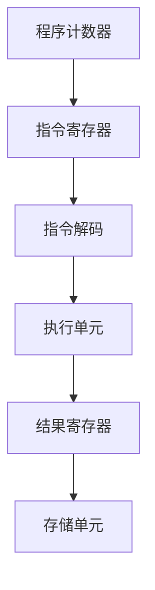
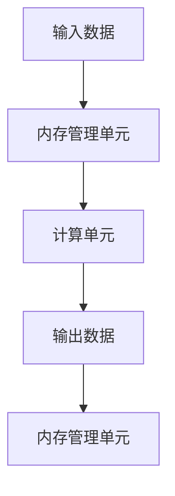
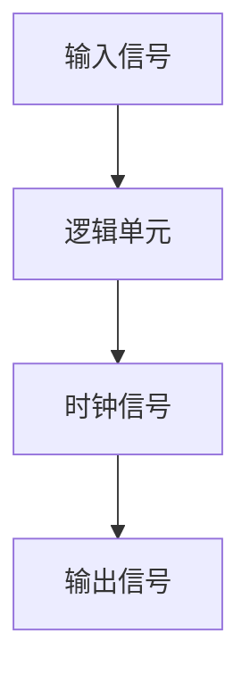

                 

# AIGC从入门到实战：进行硬件部署和运行工程源码

> 关键词：AIGC，硬件部署，工程源码，生成对抗网络（GAN），变分自编码器（VAE），GPU优化，FPGA架构

> 摘要：本文旨在系统地介绍AIGC（AI Generated Content）从入门到实战的各个方面，包括AIGC的定义、核心技术、应用场景，以及AIGC在硬件部署和工程源码运行方面的实际操作。本文将通过一步一步的分析和推理，帮助读者深入理解AIGC的本质，并掌握其在硬件部署和运行工程源码的技巧。

### 第一部分：AIGC基础

#### 第1章 AIGC概述

##### 1.1 AIGC的定义与历史背景

###### 1.1.1 AIGC的概念

AIGC（AI Generated Content）是指通过人工智能技术生成内容的过程。AIGC涵盖了多种人工智能技术，如生成对抗网络（GAN）、变分自编码器（VAE）等，旨在利用机器学习算法自动生成文字、图像、音频等多媒体内容。

###### 1.1.2 AIGC的发展历程

AIGC的发展可以追溯到生成对抗网络（GAN）的提出。2014年，Ian Goodfellow等人发表了GAN的论文，标志着AIGC技术的诞生。此后，GAN和VAE等生成模型得到了迅速发展，并应用于各个领域。随着深度学习技术的不断进步，AIGC在数字艺术、娱乐产业、游戏开发等领域展现出了巨大的潜力。

##### 1.2 AIGC的核心技术

###### 1.2.1 AI生成内容的基本原理

AI生成内容的基本原理是基于生成模型和判别模型的对抗训练。生成模型负责生成内容，判别模型负责判断生成内容和真实内容的相似度。通过不断调整生成模型的参数，使生成的内容和真实内容越来越相似，从而实现内容的自动化生成。

###### 1.2.2 生成对抗网络（GAN）

生成对抗网络（GAN）是一种由生成模型和判别模型组成的对抗性训练模型。生成模型旨在生成与真实样本相似的数据，判别模型则试图区分生成样本和真实样本。在训练过程中，生成模型和判别模型相互竞争，使生成模型不断优化生成质量，判别模型不断提高判别能力。

GAN的流程如下：

1. 初始化生成模型G和判别模型D。
2. 从真实数据集采样一个batch的数据。
3. 生成模型G根据随机噪声生成一个batch的伪造数据。
4. 将真实数据和伪造数据输入判别模型D，计算判别损失。
5. 对判别模型D进行反向传播和优化。
6. 对生成模型G进行反向传播和优化。
7. 重复步骤2-6，直至达到训练目标。

GAN的伪代码如下：

```
for epoch in 1 to EPOCHS do:
    for real_data in real_dataset do:
        D.train(real_data)
    for noise in noise_dataset do:
        fake_data = G.generate(noise)
        D.train(fake_data)
    G.update()
    D.update()
end
```

###### 1.2.3 变分自编码器（VAE）

变分自编码器（VAE）是一种基于概率模型的生成模型。VAE由编码器和解码器组成，编码器将输入数据编码为一个潜在变量，解码器则根据潜在变量生成输出数据。

VAE的流程如下：

1. 初始化编码器E和解码器D。
2. 对于每个输入数据x，计算其编码器E(x)和解码器D(E(x))。
3. 计算重构损失和KL散度损失。
4. 对编码器E和解码器D进行反向传播和优化。
5. 重复步骤2-4，直至达到训练目标。

VAE的伪代码如下：

```
for epoch in 1 to EPOCHS do:
    for x in dataset do:
        z = E(x)
        x' = D(z)
        RECONSTRUCTION_LOSS = ||x - x'||^2
        KL_DIVERGENCE = -D.log(p(z|x)) - p(z) * log(p(z))
        KL_DIVERGENCE_LOSS = KL_DIVERGENCE.mean()
        RECONSTRUCTION_LOSS = RECONSTRUCTION_LOSS.mean()
        LOSS = RECONSTRUCTION_LOSS + KL_DIVERGENCE_LOSS
        E.update()
        D.update()
end
```

##### 1.3 AIGC的应用场景

###### 1.3.1 数字艺术

AIGC在数字艺术领域的应用主要表现在图像生成和动画制作。通过GAN和VAE等技术，可以生成高质量的图像和动画，为艺术家提供更多创作灵感。例如，生成对抗网络可以生成逼真的人脸图像，变分自编码器可以生成具有独特风格的艺术作品。

###### 1.3.2 娱乐产业

AIGC在娱乐产业的应用主要集中在游戏开发和影视制作。通过生成对抗网络和变分自编码器，可以自动生成游戏场景、角色形象和游戏剧情，提高开发效率。同时，AIGC技术还可以用于影视制作，生成虚拟场景和特效，提升作品质量。

###### 1.3.3 游戏开发

AIGC在游戏开发中的应用主要体现在角色生成、场景构建和游戏剧情生成。通过生成对抗网络和变分自编码器，可以自动生成各种游戏角色、场景和剧情，丰富游戏内容，提高游戏可玩性。

###### 1.3.4 数据增强

AIGC在数据增强领域的应用主要集中在图像和文本数据。通过生成对抗网络和变分自编码器，可以自动生成大量的图像和文本数据，用于训练和验证机器学习模型。这有助于提高模型在复杂环境下的泛化能力。

### 第二部分：硬件部署与运行

#### 第2章 硬件基础知识

##### 2.1 计算机硬件基础

###### 2.1.1 CPU架构

CPU（Central Processing Unit，中央处理器）是计算机硬件的核心组成部分。CPU负责执行计算机程序中的指令，控制数据在计算机各部件之间的流动。常见的CPU架构有冯诺伊曼架构和哈佛架构。

- 冯诺伊曼架构：将程序指令和数据存储在同一内存中，通过程序计数器（PC）控制指令的执行顺序。
- 哈佛架构：将程序指令和数据存储在不同的内存中，通过程序计数器（PC）和指令指针（IP）分别控制指令和数据流。

以下是一个简单的CPU架构的Mermaid流程图：



###### 2.1.2 GPU架构

GPU（Graphics Processing Unit，图形处理器）是一种专门用于图形处理的处理器，但在人工智能领域也具有广泛的应用。GPU具有高度并行的计算能力，能够同时处理大量的数据。

以下是一个简单的GPU架构的Mermaid流程图：



###### 2.1.3 FPGA架构

FPGA（Field-Programmable Gate Array，现场可编程门阵列）是一种可编程逻辑器件，具有高度的灵活性和可定制性。FPGA可以通过编程实现各种逻辑电路，适用于高性能计算和硬件加速等领域。

以下是一个简单的FPGA架构的Mermaid流程图：



##### 2.2 硬件选型与优化

###### 2.2.1 GPU性能优化

GPU性能优化主要包括以下几个方面：

1. **并行计算优化**：充分利用GPU的并行计算能力，将计算任务分解成多个并行子任务，提高计算效率。
2. **内存访问优化**：优化内存访问模式，减少内存访问延迟，提高内存带宽利用率。
3. **流水线优化**：优化GPU流水线，减少数据传输和计算时间，提高整体性能。

以下是一个简单的GPU性能优化的伪代码：

```
function optimize_gpu_performance():
    parallelize_computation()
    optimize_memory_access()
    optimize_pipeline()
    return optimized_gpu_performance()
```

###### 2.2.2 FPGA优化

FPGA优化主要包括以下几个方面：

1. **资源利用率优化**：充分利用FPGA的硬件资源，提高资源利用率。
2. **时钟周期优化**：优化时钟周期，减少硬件资源的占用，提高硬件性能。
3. **功耗优化**：降低FPGA的功耗，提高系统能效。

以下是一个简单的FPGA优化的伪代码：

```
function optimize_fpga_performance():
    optimize_resource_usage()
    optimize_clock周期()
    optimize_power_consumption()
    return optimized_fpga_performance()
```

### 第三部分：硬件部署与运行工程源码

#### 第3章 硬件部署

##### 3.1 硬件环境搭建

在硬件部署过程中，首先需要搭建一个适合AIGC任务的硬件环境。以下是一个简单的硬件环境搭建步骤：

1. **CPU环境搭建**：安装操作系统，配置GPU驱动，安装深度学习框架（如TensorFlow、PyTorch等）。
2. **GPU环境搭建**：安装CUDA和cuDNN，配置GPU加速，安装深度学习框架。
3. **FPGA环境搭建**：安装Vivado或Intel FPGA开发套件，配置硬件加速，安装深度学习框架。

##### 3.2 硬件部署步骤

以下是AIGC硬件部署的基本步骤：

1. **选择合适的硬件平台**：根据AIGC任务的需求，选择适合的CPU、GPU或FPGA硬件平台。
2. **安装操作系统和驱动程序**：安装操作系统，配置GPU或FPGA驱动程序。
3. **安装深度学习框架**：安装深度学习框架，配置GPU或FPGA加速。
4. **部署模型**：将训练好的AIGC模型部署到硬件平台上，进行模型推理和生成。

##### 3.3 硬件部署案例

以下是一个简单的硬件部署案例：

1. **选择硬件平台**：使用NVIDIA GPU作为硬件平台，配置CUDA和cuDNN。
2. **安装操作系统和驱动程序**：安装Ubuntu操作系统，配置NVIDIA GPU驱动程序。
3. **安装深度学习框架**：安装TensorFlow，配置GPU加速。
4. **部署模型**：将训练好的GAN模型部署到NVIDIA GPU上，进行图像生成。

以下是部署GAN模型的伪代码：

```
function deploy_gan_model():
    install_cuda_and_cudnn()
    install_tensorflow()
    configure_gpu_acceleration()
    load_pretrained_gan_model()
    generate_images()
    return deployed_gan_model()
```

#### 第4章 运行工程源码

##### 4.1 运行环境搭建

在运行工程源码之前，需要搭建一个适合AIGC任务的开发环境。以下是一个简单的运行环境搭建步骤：

1. **安装开发工具**：安装Python、Git、Jupyter Notebook等开发工具。
2. **配置深度学习框架**：配置TensorFlow、PyTorch等深度学习框架。
3. **安装依赖库**：安装与AIGC任务相关的依赖库，如NumPy、Pandas、Matplotlib等。

##### 4.2 运行流程

以下是AIGC运行的基本流程：

1. **导入模块和模型**：导入深度学习框架和相关模块，加载训练好的AIGC模型。
2. **输入数据预处理**：对输入数据进行预处理，包括数据清洗、归一化等操作。
3. **模型推理**：使用训练好的AIGC模型对输入数据进行推理，生成输出内容。
4. **结果展示**：将生成的输出内容展示给用户。

##### 4.3 运行案例

以下是一个简单的AIGC运行案例：

1. **导入模块和模型**：导入TensorFlow和GAN模型。
2. **输入数据预处理**：读取图片数据，进行归一化处理。
3. **模型推理**：使用GAN模型生成新图片。
4. **结果展示**：将生成的图片展示给用户。

以下是运行GAN模型的伪代码：

```
import tensorflow as tf
import gan_model

def run_gan_model():
    gan = gan_model.load_gan_model()
    image = preprocess_input_image()
    generated_image = gan.generate(image)
    display_generated_image(generated_image)
```

### 结束语

本文系统地介绍了AIGC从入门到实战的各个方面，包括AIGC的定义、核心技术、应用场景，以及AIGC在硬件部署和运行工程源码方面的实际操作。通过一步一步的分析和推理，我们深入了解了AIGC的本质，并掌握了其在硬件部署和运行工程源码的技巧。希望本文对广大读者在AIGC领域的学习和实践有所帮助。

### 作者

作者：AI天才研究院/AI Genius Institute & 禅与计算机程序设计艺术/Zen And The Art of Computer Programming

