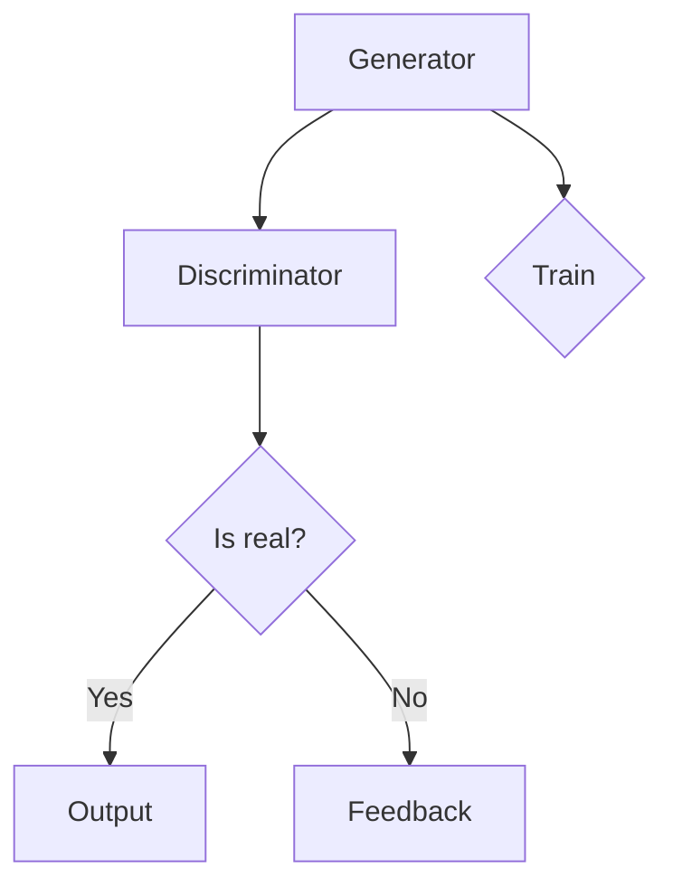
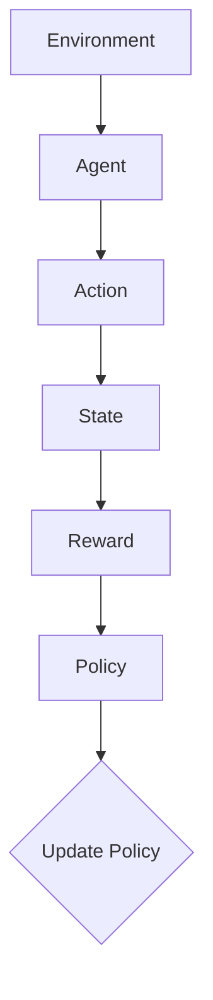
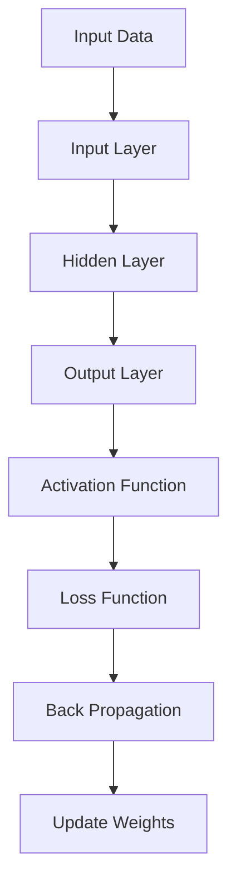

                 

### 文章标题

# AIGC从入门到实战：飞升：MetaHuman 三步构建数字人模型，带领我们走向元宇宙

在数字化的浪潮中，人工智能（AI）逐渐成为了改变世界的重要力量。而AIGC（AI-Generated Content），作为AI的一个分支，正在引领我们迈向一个全新的时代。本文将带您深入了解AIGC，从基础概念到实践应用，特别是通过三步构建MetaHuman数字人模型，揭示AIGC如何带领我们走向充满无限可能的元宇宙。

AIGC，即AI-Generated Content，指的是利用人工智能技术生成内容的过程。这个过程包括但不限于文本、图像、音频、视频等多种形式。AIGC的核心技术包括生成对抗网络（GAN）、强化学习和深度学习。这些技术使得机器能够自主地学习和创造内容，极大地拓展了AI的应用领域。

### 关键词

- AIGC
- 生成对抗网络（GAN）
- 强化学习
- 深度学习
- MetaHuman
- 元宇宙
- 数字人模型

### 摘要

本文将详细探讨AIGC的概念、技术原理以及应用场景。首先，我们会回顾AIGC的起源与发展，并深入分析其核心概念与技术原理。接着，通过介绍AIGC在元宇宙中的角色，阐述AIGC对元宇宙建设的重要性。随后，本文将逐步指导读者如何使用AIGC构建MetaHuman数字人模型，并通过实际案例展示其应用效果。最后，我们将展望AIGC在虚拟现实和游戏开发中的未来发展方向，并总结AIGC的开发工具与资源。

在开始之前，让我们先思考一个问题：为什么AIGC如此重要？随着数字化和虚拟化的趋势日益显著，人们对于个性化、沉浸式体验的需求不断增加。AIGC正是满足这些需求的关键技术，它不仅能够大幅提升内容生成的效率，还能创造出前所未有的丰富和多样的内容，从而为我们的日常生活和工作带来深刻的变革。

### 第一部分：AIGC基础与原理

#### 第1章：AIGC概述

随着科技的飞速发展，人工智能（AI）技术已经成为推动社会进步的重要力量。在这个背景下，AIGC（AI-Generated Content）作为一个新兴领域，正逐渐受到广泛关注。本章将详细介绍AIGC的定义、重要性及其在元宇宙中的应用。

## 1.1 AIGC的定义与重要性

### 1.1.1 AIGC的起源与发展

AIGC的概念最早出现在21世纪初，随着深度学习和生成对抗网络（GAN）等技术的进步，AIGC逐渐成为人工智能领域的一个重要分支。2014年，Ian Goodfellow等科学家提出了生成对抗网络（GAN），这一技术的出现为AIGC的发展奠定了基础。随后，AIGC技术迅速发展，并开始在多个领域得到应用。

### 1.1.2 AIGC的核心概念

AIGC的核心概念包括生成对抗网络（GAN）、强化学习和深度学习。生成对抗网络（GAN）是一种由生成器和判别器组成的模型，通过相互竞争来生成真实数据。强化学习是一种通过试错和反馈来学习的算法，可以用于解决复杂决策问题。深度学习则是一种基于多层神经网络的学习方法，能够处理大量复杂数据。

### 1.1.3 AIGC在元宇宙中的角色

元宇宙是一个虚拟的三维世界，其中包含各种数字人和虚拟场景。AIGC在元宇宙中扮演着至关重要的角色，通过生成各种数字人和虚拟场景，为用户提供丰富的沉浸式体验。此外，AIGC还可以用于元宇宙的内容生成和个性化推荐，提高用户的参与度和满意度。

## 1.2 AIGC的技术原理

### 1.2.1 AIGC与生成对抗网络（GAN）

生成对抗网络（GAN）是AIGC的核心技术之一。GAN由生成器和判别器两个部分组成。生成器的目标是生成尽可能真实的数据，而判别器的目标是区分生成数据和真实数据。通过这两个模型的相互对抗，生成器不断提高生成数据的真实性。

### 1.2.2 AIGC与强化学习

强化学习是另一种重要的AIGC技术。它通过试错和反馈来学习，适用于解决复杂决策问题。在元宇宙中，强化学习可以用于智能体的行为规划，使其能够自主适应环境和完成任务。

### 1.2.3 AIGC与深度学习

深度学习是AIGC的基石。它通过多层神经网络来学习和处理数据，能够生成高质量的内容。深度学习在图像生成、文本生成和音频生成等方面都取得了显著成果。

## 1.3 AIGC与元宇宙的联系

### 1.3.1 元宇宙的构成与特点

元宇宙是一个虚拟的三维世界，其中包含各种数字人和虚拟场景。它的特点包括高自由度、高沉浸感和强交互性。元宇宙的核心是数字人，这些数字人可以具有个性化的外观和行为，为用户提供丰富的交互体验。

### 1.3.2 AIGC在元宇宙中的应用

AIGC在元宇宙中的应用非常广泛。首先，AIGC可以用于生成各种数字人和虚拟场景，为元宇宙提供丰富的内容。其次，AIGC还可以用于元宇宙的个性化推荐，根据用户的行为和偏好来推荐内容。最后，AIGC还可以用于元宇宙的智能决策，通过机器学习算法来优化智能体的行为。

### 1.3.3 AIGC对元宇宙的影响

AIGC对元宇宙的影响主要体现在以下几个方面：首先，它大大提高了元宇宙的内容生成效率，使元宇宙能够提供更多样化的内容。其次，AIGC提升了用户的沉浸感和参与度，增强了元宇宙的用户体验。最后，AIGC为元宇宙的可持续发展提供了技术支持，使元宇宙能够更好地适应未来的发展趋势。

### 第2章：AIGC项目准备与开发环境搭建

要成功进行AIGC项目的开发和实现，首先需要进行充分的项目准备，包括需求分析、目标设定以及团队组建。同时，搭建一个稳定高效的开发环境也是至关重要的一步。本章将详细介绍AIGC项目的准备工作以及开发环境的搭建过程。

## 2.1 AIGC项目准备

### 2.1.1 AIGC项目的需求分析

在进行AIGC项目开发之前，需求分析是第一步。需求分析的目标是明确项目的目标和功能需求，确保项目能够满足用户的需求。在需求分析过程中，需要考虑以下几个方面：

1. **功能需求**：确定项目需要实现的功能，例如生成图像、文本、音频等。
2. **性能需求**：确定项目的性能指标，例如生成速度、准确性等。
3. **用户需求**：了解用户的需求和偏好，为项目的个性化推荐和用户体验提供依据。

### 2.1.2 AIGC项目的目标设定

在需求分析的基础上，明确项目的目标至关重要。项目目标的设定应具备以下特点：

1. **具体性**：目标应明确具体，避免模糊不清。
2. **可实现性**：目标应在技术和资源条件下可以实现。
3. **可行性**：目标应在预算和时间范围内完成。

### 2.1.3 AIGC项目的团队组建

AIGC项目通常需要多学科团队的合作。团队成员应包括以下角色：

1. **项目经理**：负责整个项目的规划和管理。
2. **数据科学家**：负责AIGC算法的设计和实现。
3. **软件开发工程师**：负责项目的开发和技术实现。
4. **产品经理**：负责产品的设计和用户体验。
5. **测试工程师**：负责项目的测试和质量保证。

## 2.2 AIGC开发环境搭建

开发环境的搭建是AIGC项目成功的关键。以下是搭建AIGC开发环境所需考虑的几个关键因素：

### 2.2.1 操作系统与硬件要求

AIGC项目通常需要高性能的硬件支持。以下是常用的操作系统和硬件要求：

1. **操作系统**：Linux发行版（如Ubuntu）是AIGC项目开发的首选操作系统，因为它具有良好的稳定性和性能。
2. **硬件要求**：高性能的CPU（如英特尔的Xeon系列）和GPU（如NVIDIA的Titan系列）是AIGC项目的必备硬件。

### 2.2.2 环境配置与软件安装

在操作系统和硬件满足要求后，需要配置相应的开发环境。以下是配置AIGC开发环境所需的一些软件和工具：

1. **Python**：Python是AIGC项目开发的主要编程语言，需要安装Python 3.x版本。
2. **Jupyter Notebook**：Jupyter Notebook是一个交互式开发环境，用于编写和运行Python代码。
3. **TensorFlow**：TensorFlow是AIGC项目开发的主要深度学习框架，需要安装TensorFlow 2.x版本。
4. **PyTorch**：PyTorch是另一种流行的深度学习框架，也可以作为AIGC项目的选择。
5. **CUDA**：CUDA是NVIDIA推出的并行计算平台，用于加速深度学习模型的训练。

### 2.2.3 常用开发工具介绍

在AIGC项目开发过程中，一些常用开发工具可以帮助提高开发效率。以下是几个常用的开发工具：

1. **Git**：Git是一个分布式版本控制系统，用于代码管理和协同工作。
2. **Docker**：Docker是一个容器化平台，用于创建和管理开发环境。
3. **Kubernetes**：Kubernetes是一个容器编排工具，用于大规模部署和管理容器化应用。
4. **Jenkins**：Jenkins是一个自动化构建工具，用于自动化构建、测试和部署代码。

通过上述准备工作，AIGC项目的开发和实现将更加顺利。在接下来的章节中，我们将深入探讨AIGC的核心算法原理，并详细介绍如何使用这些算法构建MetaHuman数字人模型。

### 第3章：AIGC核心算法原理与实现

AIGC（AI-Generated Content）的核心算法主要包括生成对抗网络（GAN）、强化学习（Reinforcement Learning）和深度学习（Deep Learning）。这些算法为AIGC技术的实现提供了坚实的基础。本章将详细讲解这些算法的原理、架构和实现方法。

## 3.1 生成对抗网络（GAN）

生成对抗网络（GAN）是AIGC的核心技术之一，由Ian Goodfellow等人于2014年提出。GAN由两个神经网络组成：生成器（Generator）和判别器（Discriminator）。生成器的目标是生成逼真的数据，而判别器的目标是区分生成数据和真实数据。

### 3.1.1 GAN的原理

GAN的工作原理可以类比于两个人进行博弈：一个人（生成器）试图制造假钞，另一个人（判别器）试图辨别真伪。生成器通过生成假数据来欺骗判别器，而判别器的任务是不断学习以更好地辨别真伪。

GAN的训练过程可以概括为以下步骤：

1. **生成器生成假数据**：生成器根据随机噪声生成假数据。
2. **判别器判断真伪**：判别器接收生成器生成的假数据和真实数据，判断其真伪。
3. **生成器和判别器同时更新权重**：生成器根据判别器的反馈调整自身权重，以生成更逼真的假数据；判别器根据生成器和真实数据调整自身权重，以更好地辨别真伪。

GAN的最终目标是使判别器无法区分生成数据和真实数据。

### 3.1.2 GAN的架构

GAN的架构主要包括生成器和判别器两个部分。以下是GAN的简化架构：


1. **生成器（Generator）**：生成器接收随机噪声作为输入，通过一系列变换生成假数据。生成器的输出可以是图像、文本、音频等多种形式。
2. **判别器（Discriminator）**：判别器接收真实数据和生成数据，通过比较两者的差异来判断其真伪。判别器的输出是一个概率值，表示输入数据的真实性。

### 3.1.3 GAN的伪代码实现

以下是一个简化的GAN伪代码实现：

```python
# 生成器
def generator(z):
    # 输入噪声z，通过变换生成假数据
    x_gan = ...
    return x_gan

# 判别器
def discriminator(x):
    # 输入数据x，判断其真伪
    probability = ...
    return probability

# 训练过程
for epoch in range(num_epochs):
    for x_real, _ in dataloader:
        # 判别器对真实数据的训练
        z = torch.randn(batch_size, noise_dim)
        x_fake = generator(z)
        d_loss_real = criterion(discriminator(x_real), torch.ones(batch_size))
        d_loss_fake = criterion(discriminator(x_fake), torch.zeros(batch_size))
        d_loss = 0.5 * (d_loss_real + d_loss_fake)
        
        # 生成器对判别器的训练
        z = torch.randn(batch_size, noise_dim)
        x_fake = generator(z)
        g_loss = criterion(discriminator(x_fake), torch.ones(batch_size))
        
        # 更新生成器和判别器的权重
        d_optimizer.zero_grad()
        d_loss.backward()
        d_optimizer.step()
        
        g_optimizer.zero_grad()
        g_loss.backward()
        g_optimizer.step()
```

### 3.1.4 GAN的优缺点

**优点：**
1. GAN可以生成高质量、逼真的数据。
2. GAN在多种领域都有广泛应用，如图像生成、文本生成、音频生成等。

**缺点：**
1. GAN的训练过程不稳定，容易出现模式崩溃（mode collapse）问题。
2. GAN的训练效率相对较低。

## 3.2 强化学习

强化学习（Reinforcement Learning，RL）是另一个重要的AIGC技术。强化学习通过试错和反馈来学习，适用于解决复杂决策问题。在AIGC中，强化学习可以用于智能体的行为规划，使其能够自主适应环境和完成任务。

### 3.2.1 强化学习的原理

强化学习的原理可以类比为训练宠物。训练师通过奖励和惩罚来指导宠物学习特定行为。强化学习的过程包括以下几个主要组成部分：

1. **环境（Environment）**：环境是智能体（Agent）所处的情景，可以是虚拟环境或现实环境。
2. **智能体（Agent）**：智能体是执行动作、感知环境的主体。
3. **动作（Action）**：智能体可以执行的一系列动作。
4. **状态（State）**：智能体在执行动作前的状态。
5. **奖励（Reward）**：智能体执行动作后获得的奖励或惩罚。

强化学习的目标是找到一组策略（Policy），使得智能体在给定状态下选择最佳动作，以最大化累积奖励。

### 3.2.2 强化学习的模型

强化学习模型可以分为值函数模型和政策函数模型。以下是两种常见的强化学习模型：

1. **值函数模型（Value Function Model）**：值函数模型通过学习状态价值函数（State-Value Function）和动作价值函数（Action-Value Function）来指导智能体的行为。
    - **状态价值函数（State-Value Function）**：给定一个状态，该函数表示智能体在该状态下执行最佳动作的期望奖励。
    - **动作价值函数（Action-Value Function）**：给定一个状态和动作，该函数表示智能体在该状态下执行该动作的期望奖励。
2. **政策函数模型（Policy Function Model）**：政策函数模型直接学习最佳动作策略（Policy），使得智能体在给定状态下直接选择最佳动作。

### 3.2.3 强化学习的实现

以下是一个简化的Q-learning算法的实现：

```python
# Q-learning算法
def q_learning(env, num_episodes, learning_rate, discount_factor, exploration_rate):
    Q = {}
    for state in env.states:
        Q[state] = {action: 0 for action in env.actions}

    for episode in range(num_episodes):
        state = env.reset()
        done = False
        while not done:
            action = choose_action(state, Q[state], exploration_rate)
            next_state, reward, done = env.step(action)
            Q[state][action] = Q[state][action] + learning_rate * (reward + discount_factor * max(Q[next_state].values()) - Q[state][action])
            state = next_state

    return Q

# 选择动作
def choose_action(state, Q, exploration_rate):
    if random() < exploration_rate:
        action = choose_random_action(Q[state])
    else:
        action = choose_best_action(Q[state])
    return action

# 选择随机动作
def choose_random_action(Q):
    return random.choice(list(Q.keys()))

# 选择最佳动作
def choose_best_action(Q):
    return max(Q, key=Q.get)
```

### 3.2.4 强化学习的优缺点

**优点：**
1. 强化学习可以解决复杂的决策问题，适用于动态环境。
2. 强化学习可以自主适应环境和任务，具有较高的灵活性和适应性。

**缺点：**
1. 强化学习的训练过程通常较长，需要大量样本数据。
2. 强化学习在初始阶段可能需要大量的探索，导致收敛速度较慢。

## 3.3 深度学习基础

深度学习（Deep Learning，DL）是AIGC的基石，它通过多层神经网络（Neural Networks）来学习和处理复杂数据。深度学习在图像识别、自然语言处理、音频处理等领域取得了显著成果。

### 3.3.1 深度学习的基本概念

1. **神经网络（Neural Network，NN）**：神经网络是由大量神经元（Artificial Neurons）组成的计算模型，用于模拟人脑的信息处理过程。
2. **前向传播（Forward Propagation）**：在前向传播过程中，输入数据通过神经网络中的各个层，逐层计算得到输出。
3. **反向传播（Back Propagation）**：在反向传播过程中，计算输出误差，并反向传播误差到输入层，用于更新网络权重。
4. **激活函数（Activation Function）**：激活函数用于引入非线性，使得神经网络能够学习和处理复杂数据。

### 3.3.2 神经网络的结构

神经网络通常由输入层、隐藏层和输出层组成。以下是神经网络的一般结构：


1. **输入层（Input Layer）**：输入层接收外部输入数据。
2. **隐藏层（Hidden Layers）**：隐藏层负责对输入数据进行处理和变换。
3. **输出层（Output Layer）**：输出层生成最终的输出结果。

### 3.3.3 深度学习的优化算法

深度学习的优化算法主要包括梯度下降（Gradient Descent）、随机梯度下降（Stochastic Gradient Descent，SGD）和Adam优化器。以下是这些算法的基本原理：

1. **梯度下降（Gradient Descent）**：梯度下降是一种基于梯度的优化算法，通过迭代更新网络权重，以最小化损失函数。
2. **随机梯度下降（Stochastic Gradient Descent，SGD）**：随机梯度下降是梯度下降的一种变种，每次迭代仅更新一个样本的梯度。
3. **Adam优化器（Adam Optimizer）**：Adam优化器是梯度下降和SGD的一种改进，通过自适应调整学习率和动量，提高了优化效率。

### 3.3.4 深度学习在AIGC中的应用

深度学习在AIGC中有着广泛的应用，包括图像生成、文本生成、音频生成等。以下是几个典型的深度学习应用：

1. **图像生成**：使用生成对抗网络（GAN）生成逼真的图像。
2. **文本生成**：使用变分自编码器（VAE）和序列到序列（Seq2Seq）模型生成自然语言文本。
3. **音频生成**：使用波士顿谐波同步网络（BC-Harmonic Synthesis Network）生成音乐和语音。

### 3.3.5 深度学习的优缺点

**优点：**
1. 深度学习能够处理大规模复杂数据，具有较高的准确性。
2. 深度学习具有自动特征提取的能力，减少了人工特征设计的复杂性。

**缺点：**
1. 深度学习需要大量数据和计算资源，训练过程相对较慢。
2. 深度学习模型的解释性较差，难以理解其内部工作机制。

通过本章的学习，读者应该对AIGC的核心算法有了更深入的理解。在下一章中，我们将通过具体的案例，展示如何使用这些算法构建MetaHuman数字人模型。

### 第4章：构建MetaHuman数字人模型

在了解了AIGC的核心算法原理后，本章将带领读者通过三步构建MetaHuman数字人模型。MetaHuman是一个高度逼真的虚拟角色，通过AIGC技术，我们可以生成具有个性化特征和行为习惯的数字人，为元宇宙、游戏和虚拟现实等领域带来丰富的互动体验。

## 4.1 MetaHuman介绍

MetaHuman是由Oculus（现在的Meta Platforms）开发的一款虚拟角色，它以其高度真实的外观和行为而著称。MetaHuman具有以下特点：

1. **高度逼真的外观**：MetaHuman的外观设计细致入微，从面部表情到身体细节都经过精心刻画，使其看起来几乎与现实人类无二。
2. **丰富的表情和动作**：MetaHuman可以展现丰富的面部表情和身体动作，包括眨眼、点头、挥手等，这些动作自然流畅，增强了互动体验。
3. **个性化定制**：用户可以根据自己的喜好定制MetaHuman的角色，包括外观、服装、发型等。
4. **实时交互**：MetaHuman支持实时交互，可以在虚拟现实（VR）和增强现实（AR）环境中与用户进行自然互动。

## 4.2 MetaHuman的三步构建方法

构建MetaHuman数字人模型可以分为以下三个步骤：

### 4.2.1 第一步：数据采集与预处理

数据采集是构建MetaHuman数字人模型的基础。以下是数据采集和预处理的关键步骤：

1. **数据来源**：数据可以来自多个渠道，包括公开数据集、专业采集设备和个人自定义数据。
2. **数据类型**：数据类型包括面部图像、身体动作数据、语音数据等。
3. **数据预处理**：数据预处理包括数据清洗、归一化和数据增强等步骤。数据清洗是为了去除噪声和异常值；归一化是为了将数据缩放到同一尺度；数据增强是为了增加数据的多样性，提高模型的泛化能力。

### 4.2.2 第二步：训练MetaHuman模型

在数据预处理完成后，接下来是训练MetaHuman模型。以下是训练过程的关键步骤：

1. **模型选择**：根据具体应用场景，选择合适的生成对抗网络（GAN）、强化学习模型或深度学习模型。
2. **模型配置**：配置模型的超参数，包括学习率、批量大小、迭代次数等。
3. **模型训练**：使用预处理后的数据训练模型。训练过程中，生成器和判别器相互对抗，生成器不断优化生成数据的质量，判别器不断学习辨别生成数据和真实数据。
4. **模型评估**：通过测试集对模型进行评估，确保模型生成数据的真实性和质量。

### 4.2.3 第三步：评估与优化

在模型训练完成后，需要对模型进行评估和优化，以确保其性能和可靠性。以下是评估和优化的关键步骤：

1. **模型评估**：使用测试集对模型进行评估，评估指标包括生成数据的真实性、流畅性和多样性。
2. **模型优化**：根据评估结果，对模型进行调整和优化，包括调整超参数、增加训练数据等。
3. **模型部署**：将优化后的模型部署到实际应用场景中，例如元宇宙、游戏或虚拟现实。

## 4.3 MetaHuman模型的应用

MetaHuman模型在多个领域都有广泛的应用，以下是几个典型的应用场景：

1. **元宇宙**：MetaHuman可以为元宇宙提供高度逼真的虚拟角色，使用户在虚拟环境中获得沉浸式体验。例如，用户可以在元宇宙中创建自己的虚拟形象，与其他用户互动、交流。
2. **游戏开发**：MetaHuman可以用于游戏开发，为游戏角色提供逼真的外观和行为。这使得游戏更加真实和引人入胜，提高了玩家的体验。
3. **虚拟现实**：MetaHuman可以用于虚拟现实（VR）应用，例如虚拟导游、虚拟培训等。通过MetaHuman，用户可以与虚拟环境中的角色进行互动，提高学习的兴趣和效率。
4. **交互式媒体**：MetaHuman可以用于交互式媒体应用，例如虚拟主播、虚拟客服等。这些应用通过MetaHuman的逼真外观和自然交互，为用户提供高质量的互动体验。

通过本章的介绍，读者应该对如何构建MetaHuman数字人模型有了更清晰的认识。在下一章中，我们将进一步探讨AIGC在虚拟现实中的应用，展示AIGC如何提升虚拟现实体验。

### 第5章：AIGC与虚拟现实

虚拟现实（VR）技术正在快速发展，为人们提供沉浸式的体验。AIGC（AI-Generated Content）技术的引入，为虚拟现实带来了全新的可能性和变革。本章将探讨AIGC在虚拟现实中的应用，以及如何通过AIGC提升虚拟现实体验。

## 5.1 虚拟现实技术概述

虚拟现实（Virtual Reality，VR）是一种计算机生成的模拟环境，使用户能够在其中感受到身临其境的体验。VR技术通过头戴显示器（HMD）、传感器和计算机图形学等技术，创建一个模拟的三维环境。以下是VR技术的核心组成部分：

1. **头戴显示器（HMD）**：头戴显示器是VR的核心设备，它通过两个屏幕模拟立体视觉，使用户感受到三维空间。
2. **传感器**：传感器用于检测用户的头部和身体运动，使虚拟环境能够实时响应用户的动作。
3. **计算机图形学**：计算机图形学用于生成虚拟环境中的图像和物体，为用户提供视觉体验。
4. **交互设备**：交互设备，如手柄、手套等，使用户能够与虚拟环境进行互动。

## 5.2 AIGC在虚拟现实中的应用

AIGC在虚拟现实中的应用主要体现在内容生成和交互体验的提升。以下是一些具体的应用场景：

1. **环境生成**：AIGC可以自动生成复杂的虚拟环境，从城市景观到自然景观，从室内空间到室外空间。这些环境可以根据用户的需求进行定制，提供高度个性化的体验。
2. **角色生成**：AIGC可以生成高度逼真的虚拟角色，如游戏中的NPC（非玩家角色）或虚拟现实中的虚拟导游。这些角色可以拥有个性化的外观和行为，为用户提供丰富的互动体验。
3. **交互内容**：AIGC可以生成交互内容，如对话、任务和活动。这些内容可以根据用户的偏好和行为进行动态调整，提高用户的参与度和满意度。

### 5.2.1 AIGC对虚拟现实的影响

AIGC对虚拟现实的影响可以从以下几个方面进行阐述：

1. **内容生成效率**：AIGC技术可以自动生成大量高质量的内容，极大地提高了虚拟现实内容的生成效率。传统的内容生成方式需要大量人工参与，而AIGC可以自动化这一过程，大大缩短了开发周期。
2. **用户体验**：AIGC可以生成高度个性化的内容和交互体验，使用户在虚拟现实环境中感受到更加真实和丰富的体验。这种个性化的体验可以显著提升用户的满意度和参与度。
3. **技术创新**：AIGC技术推动了虚拟现实技术的创新。通过AIGC，虚拟现实可以从简单的模拟环境向更加复杂和多样化的虚拟世界发展，为用户提供全新的体验。

### 5.2.2 AIGC在虚拟现实中的应用案例

以下是一些AIGC在虚拟现实中的应用案例：

1. **虚拟旅游**：AIGC可以生成高度逼真的虚拟旅游环境，用户可以通过VR设备进行虚拟旅游，探索世界各地的名胜古迹。这种体验不仅节省了时间和成本，还可以让用户体验到现实无法触及的景点。
2. **虚拟训练**：AIGC可以生成虚拟训练环境，用于军事训练、医疗培训和工业训练等。通过AIGC，训练内容可以更加真实和多样化，提高训练效果和安全性。
3. **虚拟社交**：AIGC可以生成虚拟社交场景，用户可以在虚拟世界中与其他用户进行互动。这些虚拟社交场景可以提供类似于现实社交的体验，为用户提供新的社交方式。

### 5.2.3 AIGC在虚拟现实中的未来展望

随着AIGC技术的不断发展，它在虚拟现实中的应用前景非常广阔。以下是AIGC在虚拟现实中的未来展望：

1. **个性化体验**：AIGC将使虚拟现实体验更加个性化。通过分析用户的行为和偏好，AIGC可以生成个性化的内容和交互体验，满足用户的多样化需求。
2. **高度沉浸感**：AIGC可以生成更加逼真的虚拟环境和角色，提高用户的沉浸感。通过先进的渲染技术和交互设计，用户将感受到更加真实的虚拟世界。
3. **技术创新**：AIGC将推动虚拟现实技术的创新。通过AIGC，虚拟现实可以从简单的模拟环境向更加复杂和多样化的虚拟世界发展，为用户提供全新的体验。

总之，AIGC与虚拟现实的结合将带来前所未有的变革，为用户带来更加丰富和多样化的体验。在未来，AIGC将在虚拟现实领域发挥越来越重要的作用，推动虚拟现实技术不断向前发展。

### 第6章：AIGC与游戏开发

随着技术的不断发展，游戏开发领域也在不断革新。AIGC（AI-Generated Content）技术作为人工智能的一个重要分支，正逐渐在游戏开发中发挥重要作用。本章将探讨AIGC在游戏开发中的应用，以及如何通过AIGC提升游戏体验。

## 6.1 游戏开发技术概述

游戏开发是一个复杂且多学科交叉的过程，涉及编程、图形设计、音效制作等多个方面。以下是一些游戏开发技术的基本概述：

1. **游戏引擎**：游戏引擎是游戏开发的核心技术，负责渲染图形、处理物理交互、管理游戏逻辑等。常见的游戏引擎包括Unity、Unreal Engine等。
2. **游戏循环**：游戏循环是游戏的基本运行机制，包括初始化、更新和渲染等步骤。游戏循环不断重复，确保游戏能够实时响应玩家的操作。
3. **人工智能**：人工智能（AI）在游戏开发中主要用于模拟NPC（非玩家角色）的行为，使其具有自主性和智能性。常见的AI技术包括决策树、遗传算法、强化学习等。
4. **用户界面（UI）**：用户界面是游戏与玩家交互的界面，包括菜单、按钮、图标等。UI设计直接影响玩家的游戏体验。
5. **音效和音乐**：音效和音乐在游戏开发中起到增强氛围和提升沉浸感的作用。高质量的音效和音乐可以显著提升游戏体验。

## 6.2 AIGC在游戏开发中的应用

AIGC在游戏开发中的应用主要体现在以下几个方面：

1. **角色生成**：AIGC可以自动生成各种类型的角色，包括主角、NPC、怪物等。这些角色可以根据游戏剧情和玩家需求进行个性化定制，提高游戏的可玩性和多样性。
2. **环境生成**：AIGC可以自动生成各种游戏环境，从森林、沙漠到城市、地下城，这些环境可以根据游戏的设定进行高度自定义，提供丰富的探索体验。
3. **剧情生成**：AIGC可以生成游戏的剧情和任务，根据玩家的行为和决策进行动态调整。这种剧情生成技术可以显著提高游戏的剧情丰富度和多样性。
4. **内容更新**：AIGC可以自动生成新的游戏内容和任务，不断更新游戏内容，延长游戏的生命周期。这种内容更新技术可以保持游戏的新鲜感和吸引力。

### 6.2.1 AIGC对游戏开发的影响

AIGC对游戏开发的影响可以从以下几个方面进行阐述：

1. **开发效率**：AIGC技术可以自动化许多传统手工操作，如角色建模、环境设计等，大大提高了开发效率。开发团队可以将更多的时间和精力投入到游戏的核心玩法和创新上。
2. **用户体验**：AIGC可以生成高度个性化的内容和交互体验，满足不同玩家的需求和偏好。这种个性化的体验可以显著提升玩家的满意度和参与度。
3. **内容多样化**：AIGC技术可以生成大量不同类型的内容，如角色、环境、剧情等，提供了丰富的游戏选择。这种多样化的内容可以吸引更多玩家，提高游戏的受众范围。
4. **技术创新**：AIGC技术推动了游戏开发技术的创新。通过AIGC，游戏开发可以从简单的预设场景和角色向更加复杂和动态的虚拟世界发展。

### 6.2.2 AIGC在游戏开发中的应用案例

以下是一些AIGC在游戏开发中的应用案例：

1. **角色生成**：在游戏《赛博朋克2077》中，AIGC技术被用于生成各种NPC角色。这些角色具有独特的个性和行为习惯，为玩家提供了丰富的互动体验。
2. **环境生成**：在游戏《模拟城市：我是市长》中，AIGC技术被用于生成城市的各种环境，包括建筑、道路、绿地等。这些环境可以根据玩家的决策和建设策略进行动态调整，提供了高度自由和多样化的城市建设体验。
3. **剧情生成**：在游戏《神秘海域：失落的遗产》中，AIGC技术被用于生成游戏的剧情和任务。这些剧情和任务可以根据玩家的游戏行为进行动态调整，提供了高度个性化的游戏体验。
4. **内容更新**：在游戏《我的世界》中，AIGC技术被用于生成新的游戏内容和任务。这些内容更新可以定期发布，为玩家提供了持续的游戏新鲜感和吸引力。

### 6.2.3 AIGC在游戏开发中的未来展望

随着AIGC技术的不断发展，它在游戏开发中的应用前景非常广阔。以下是AIGC在游戏开发中的未来展望：

1. **高度个性化**：AIGC将使游戏体验更加个性化。通过分析玩家的行为和偏好，AIGC可以生成高度个性化的内容和交互体验，满足不同玩家的多样化需求。
2. **智能化**：AIGC技术将使游戏角色和场景更加智能化。通过深度学习和强化学习，AIGC可以生成具有自主性和智能性的角色和场景，提供更加真实和丰富的游戏体验。
3. **多样化**：AIGC将提供多样化的游戏内容。通过自动生成技术和个性化推荐，AIGC可以生成大量不同类型和风格的游戏内容，满足不同玩家的喜好和需求。
4. **技术创新**：AIGC技术将推动游戏开发技术的创新。通过AIGC，游戏开发可以从简单的预设场景和角色向更加复杂和动态的虚拟世界发展，为用户提供全新的游戏体验。

总之，AIGC与游戏开发的结合将带来前所未有的变革，为玩家带来更加丰富和多样化的游戏体验。在未来，AIGC将在游戏开发中发挥越来越重要的作用，推动游戏行业不断向前发展。

### 第7章：AIGC与元宇宙建设

元宇宙（Metaverse）是一个虚拟的三维世界，它融合了虚拟现实（VR）、增强现实（AR）和社交媒体等元素，为用户提供了一个沉浸式和交互式的体验。AIGC（AI-Generated Content）作为人工智能生成内容的关键技术，正在为元宇宙的建设注入新的活力。本章将探讨AIGC在元宇宙建设中的应用及其未来展望。

## 7.1 元宇宙建设概述

元宇宙是一个庞大的虚拟世界，它包含了各种虚拟场景、角色和互动元素。以下是元宇宙建设的核心组成部分：

1. **虚拟世界**：虚拟世界是元宇宙的核心，它由各种虚拟场景组成，如城市、乡村、荒野等。这些场景可以高度模拟现实世界，为用户提供沉浸式的体验。
2. **虚拟角色**：虚拟角色是元宇宙中的主要参与者，包括玩家、NPC（非玩家角色）和虚拟人类等。这些角色具有独特的个性、行为和互动能力，为元宇宙提供丰富的互动体验。
3. **社交互动**：社交互动是元宇宙的重要组成部分，它包括虚拟聊天、合作、竞争和社区建设等。通过社交互动，用户可以在元宇宙中建立联系和关系，分享经验和乐趣。
4. **经济系统**：元宇宙拥有自己的经济系统，包括虚拟货币、交易和市场经济等。用户可以通过虚拟货币进行交易，购买虚拟物品和服务，促进元宇宙的繁荣和发展。

## 7.2 AIGC在元宇宙建设中的应用

AIGC技术在元宇宙建设中扮演着重要角色，以下是其主要应用领域：

1. **虚拟世界生成**：AIGC可以自动生成各种虚拟世界场景，从城市到乡村，从自然景观到室内环境。这些场景可以高度模拟现实世界，为用户提供沉浸式的体验。
2. **虚拟角色生成**：AIGC可以生成各种虚拟角色，包括人类、动物和虚构生物等。这些角色具有独特的个性和行为习惯，可以与用户进行自然互动，提供丰富的社交体验。
3. **虚拟物品生成**：AIGC可以自动生成各种虚拟物品，如服装、饰品、道具等。这些物品可以根据用户的需求和偏好进行个性化定制，提高用户的参与度和满意度。
4. **经济系统**：AIGC可以生成元宇宙的经济系统，包括虚拟货币、交易市场和市场经济等。通过AIGC，元宇宙的经济系统可以更加自动化和智能化，提高经济效率。

### 7.2.1 AIGC对元宇宙建设的影响

AIGC对元宇宙建设的影响可以从以下几个方面进行阐述：

1. **内容生成效率**：AIGC技术可以自动生成大量高质量的内容，包括虚拟世界、角色和物品等。这大大提高了内容生成的效率，使元宇宙能够快速构建和更新。
2. **用户体验**：AIGC可以生成高度个性化的内容和交互体验，满足不同用户的需求和偏好。这种个性化的体验可以显著提升用户的满意度和参与度。
3. **技术创新**：AIGC技术推动了元宇宙技术的创新。通过AIGC，元宇宙可以从简单的虚拟世界向更加复杂和多样化的虚拟世界发展，为用户提供全新的体验。
4. **经济模式**：AIGC可以为元宇宙带来新的经济模式。通过自动生成技术和个性化推荐，元宇宙可以创造新的商业模式和收入来源，促进元宇宙的可持续发展。

### 7.2.2 AIGC在元宇宙建设中的应用案例

以下是一些AIGC在元宇宙建设中的应用案例：

1. **虚拟世界生成**：在《Roblox》这个元宇宙平台中，AIGC技术被用于生成各种虚拟场景，如城市、乡村、游戏场所等。用户可以自由探索这些场景，并参与各种活动。
2. **虚拟角色生成**：在《Second Life》这个虚拟世界中，AIGC技术被用于生成各种虚拟角色，包括人类、动物和虚构生物等。用户可以自定义自己的角色，并在虚拟世界中与其他角色互动。
3. **虚拟物品生成**：在《Decentraland》这个元宇宙平台中，AIGC技术被用于生成各种虚拟物品，如服装、饰品、道具等。用户可以购买和使用这些物品，增强自己的虚拟形象。
4. **经济系统**：在《The Sandbox》这个元宇宙平台中，AIGC技术被用于生成经济系统，包括虚拟货币、交易市场和市场经济等。用户可以在虚拟世界中购买、出售和交易虚拟物品，促进元宇宙的繁荣和发展。

### 7.2.3 AIGC在元宇宙建设中的未来展望

随着AIGC技术的不断发展，它在元宇宙建设中的应用前景非常广阔。以下是AIGC在元宇宙建设中的未来展望：

1. **高度个性化**：AIGC将使元宇宙更加个性化。通过分析用户的行为和偏好，AIGC可以生成高度个性化的内容和交互体验，满足不同用户的多样化需求。
2. **智能化**：AIGC技术将使元宇宙更加智能化。通过深度学习和强化学习，AIGC可以生成具有自主性和智能性的角色和场景，提供更加真实和丰富的体验。
3. **多样化**：AIGC将提供多样化的元宇宙内容。通过自动生成技术和个性化推荐，AIGC可以生成大量不同类型和风格的内容，满足不同用户的喜好和需求。
4. **技术创新**：AIGC技术将推动元宇宙技术的创新。通过AIGC，元宇宙可以从简单的虚拟世界向更加复杂和多样化的虚拟世界发展，为用户提供全新的体验。

总之，AIGC与元宇宙的结合将带来前所未有的变革，为用户带来更加丰富和多样化的元宇宙体验。在未来，AIGC将在元宇宙建设中发挥越来越重要的作用，推动元宇宙不断向前发展。

### 第8章：AIGC开发工具与资源

为了成功开发AIGC项目，选择合适的开发工具和资源至关重要。本章将介绍主流的AIGC开发框架、常用的数据集、开源代码与模型资源，以及学习与交流资源，帮助开发者高效地进行AIGC项目开发。

## 8.1 主流AIGC开发框架

在AIGC项目中，选择合适的开发框架可以大大提高开发效率。以下是几个主流的AIGC开发框架：

### 8.1.1 TensorFlow

TensorFlow是Google开发的开源机器学习框架，广泛应用于AIGC项目。它提供了丰富的API和工具，支持多种类型的深度学习模型。TensorFlow的优势在于其灵活性和强大的生态系统。

- **优点**：灵活、功能强大、生态系统丰富。
- **适用场景**：适用于各种规模的AIGC项目，特别是需要高度自定义的复杂模型。

### 8.1.2 PyTorch

PyTorch是Facebook开发的开源机器学习库，以其简洁和灵活性著称。它提供动态计算图，使得调试和实验更加容易。PyTorch在AIGC领域有着广泛的应用。

- **优点**：简洁、易于调试、支持动态计算图。
- **适用场景**：适用于快速原型设计和实验。

### 8.1.3 其他常用框架

除了TensorFlow和PyTorch，还有其他一些常用的AIGC开发框架，如：

- **Keras**：一个基于Theano和TensorFlow的高层次神经网络API，易于使用，适合快速原型开发。
- **MXNet**：由Apache Software Foundation开发，支持多种编程语言，具有良好的性能和灵活性。
- **Caffe**：由伯克利大学开发，主要用于计算机视觉项目，具有高效的处理速度。

## 8.2 AIGC开发资源

### 8.2.1 数据集资源

数据集是AIGC项目的重要组成部分。以下是一些常用的数据集资源：

- **ImageNet**：一个大规模的图像数据集，包含超过1000万个标注图像，是许多计算机视觉项目的基准。
- **CIFAR-10/100**：包含60000个32x32彩色图像的数据集，广泛应用于图像分类任务。
- **FaceNet**：一个用于人脸识别的数据集，包含超过3000万张人脸图像。
- **NYU Depth V2**：一个用于深度学习的三维场景数据集，包含大量三维场景的深度图像。

### 8.2.2 开源代码与模型资源

开源代码和预训练模型是AIGC项目的重要资源。以下是一些常用的开源代码和模型资源：

- **TensorFlow Model Zoo**：包含各种预训练的TensorFlow模型，如图像分类、物体检测、文本生成等。
- **PyTorch Model Zoo**：包含各种预训练的PyTorch模型，如图像分类、物体检测、语音识别等。
- **OpenAI Gym**：一个开源的环境库，提供多种强化学习环境，用于算法开发和实验。
- **Hugging Face Transformers**：一个开源库，提供各种预训练的Transformer模型，如BERT、GPT等。

### 8.2.3 学习与交流资源

学习AIGC技术需要丰富的学习资源和交流平台。以下是一些有用的学习与交流资源：

- **在线课程**：如Coursera、edX等平台提供的机器学习、深度学习和强化学习课程。
- **博客与论文**：如Medium、ArXiv等平台上的博客和学术论文，提供最新的研究成果和应用案例。
- **技术社区**：如GitHub、Stack Overflow等，提供代码库和技术问答，帮助开发者解决实际问题。
- **专业会议**：如NeurIPS、ICLR、CVPR等，是学术交流和技术分享的重要平台。

### 8.2.4 常见问题与解决方案资源

在AIGC项目开发过程中，开发者可能会遇到各种问题。以下是一些常见问题与解决方案资源：

- **官方文档**：大多数开发框架和库都有详细的官方文档，提供使用方法和常见问题的解决方案。
- **社区论坛**：如TensorFlow、PyTorch等框架的官方论坛，提供开发者之间的交流和互助。
- **技术博客**：如Medium、博客园等，有许多资深开发者分享的实际经验和解决方案。
- **Stack Overflow**：一个全球性的编程问答社区，提供各种编程问题的解答。

通过使用这些AIGC开发工具与资源，开发者可以更加高效地进行AIGC项目开发，实现创新的AI应用。

### 附录：AIGC与数字人模型开发指南

为了帮助开发者更好地理解和应用AIGC技术构建数字人模型，本文提供了以下附录，包括AIGC核心算法原理的Mermaid流程图、MetaHuman数字人模型构建案例、虚拟现实项目开发案例以及游戏开发项目案例。

#### 附录 A：AIGC核心算法原理与Mermaid流程图

**8.1.1 GAN的原理与Mermaid流程图**

以下是一个简单的生成对抗网络（GAN）的Mermaid流程图：



**8.1.2 强化学习的原理与Mermaid流程图**

强化学习的Mermaid流程图如下：



**8.1.3 深度学习的原理与Mermaid流程图**

深度学习的Mermaid流程图如下：



#### 附录 B：AIGC项目实战案例

**8.2.1 MetaHuman数字人模型构建案例**

以下是一个构建MetaHuman数字人模型的简化流程：

1. **数据采集**：收集面部图像、身体动作数据等。
2. **数据预处理**：对收集的数据进行清洗、归一化和增强。
3. **模型训练**：使用GAN或强化学习算法训练数字人模型。
4. **模型评估**：使用测试数据评估模型性能。
5. **模型部署**：将训练好的模型部署到虚拟现实或游戏环境中。

**8.2.2 虚拟现实项目开发案例**

以下是一个虚拟现实项目开发的简化流程：

1. **需求分析**：明确项目目标和功能需求。
2. **环境搭建**：配置开发环境和所需工具。
3. **内容生成**：使用AIGC技术生成虚拟世界和角色。
4. **交互设计**：设计用户交互和游戏逻辑。
5. **测试与优化**：测试项目功能并优化性能。

**8.2.3 游戏开发项目案例**

以下是一个游戏开发项目开发的简化流程：

1. **需求分析**：明确游戏类型、玩法和目标用户。
2. **环境搭建**：配置游戏开发环境，包括游戏引擎和开发工具。
3. **内容创作**：使用AIGC技术生成角色、地图和任务。
4. **编程实现**：编写游戏逻辑和角色行为。
5. **测试与发布**：测试游戏功能，并进行优化和发布。

通过上述附录，开发者可以更好地理解AIGC与数字人模型的开发过程，并运用到实际项目中。这些案例为开发者提供了实用的参考和指导，有助于他们在AIGC领域取得成功。

### 作者信息

作者：AI天才研究院/AI Genius Institute & 禅与计算机程序设计艺术 /Zen And The Art of Computer Programming

AI天才研究院（AI Genius Institute）是一家专注于人工智能研究和技术创新的机构，致力于推动AI技术的发展和应用。禅与计算机程序设计艺术（Zen And The Art of Computer Programming）是一本经典的人工智能和编程著作，由著名计算机科学家Donald E. Knuth所著，为程序员提供了深刻的编程哲学和思维方法。作者结合了深厚的学术背景和丰富的实践经验，为读者呈现了一篇全面深入的技术博客文章。

