                 

# 文章标题：AI与人类社会的未来发展

> 关键词：人工智能、社会发展、未来趋势、技术应用、挑战与机遇

> 摘要：本文将从AI与人类社会的关系出发，探讨AI技术基础、AI在各个领域的应用及挑战，展望AI未来的发展趋势，并思考人类社会与AI的共生关系。通过一步一步的分析和推理，本文将揭示AI在推动社会进步的同时，所面临的隐私、伦理、就业等挑战，以及对未来教育、智慧城市等方面的影响。

## 目录

1. 引言
   1.1 AI与人类社会的关系
   1.2 本书的目的与结构

2. AI技术基础
   2.1 AI的基本概念
   2.2 机器学习算法原理
   2.3 深度学习技术
   2.4 自然语言处理（NLP）
   2.5 计算机视觉

3. AI在人类社会中的应用
   3.1 AI在医疗领域的应用
   3.2 AI在教育领域的应用
   3.3 AI在金融领域的应用
   3.4 AI在交通领域的应用
   3.5 AI在智能制造领域的应用

4. AI带来的社会挑战
   4.1 隐私与伦理问题
   4.2 就业与职业转型
   4.3 社会结构与经济变革

5. AI未来的发展趋势
   5.1 大型语言模型的发展
   5.2 强化学习与智能决策
   5.3 人机协作与混合智能
   5.4 AI与其他前沿技术的融合

6. 未来社会中的AI
   6.1 智慧城市与未来社区
   6.2 人类与AI的共生关系
   6.3 未来教育的变革

7. 结论
   7.1 总结与展望
   7.2 对读者的建议

8. 附录
   8.1 AI相关资源与工具
   8.2 参考资料

## 引言

### 1.1 AI与人类社会的关系

人工智能（AI）作为一门前沿技术，正在深刻地改变着人类社会。从最初的计算机科学理论，到如今应用广泛的机器学习、深度学习，AI技术的发展历程可谓跌宕起伏。随着计算能力的提升和数据量的爆炸性增长，AI技术在各个领域的应用日益广泛，逐渐成为推动社会进步的重要力量。

AI与人类社会的关系可以从以下几个方面来理解：

1. **AI的发展历程**：人工智能最早可以追溯到20世纪50年代，当时人们开始探讨机器能否模拟人类智能。经过几十年的发展，从符号主义、基于规则的系统，到基于数据的学习算法，AI技术不断演进。如今，深度学习、强化学习等技术的崛起，使得AI在图像识别、自然语言处理、决策支持等领域取得了显著的成果。

2. **人类社会对AI的依赖与影响**：随着AI技术的普及，人类社会对其依赖程度越来越高。从日常生活中的语音助手、智能家居，到行业应用中的智能医疗、智能制造，AI正在改变我们的生产方式、生活方式。同时，AI技术也在塑造新的商业模式、推动产业升级，对全球经济和社会结构产生深远影响。

### 1.2 本书的目的与结构

本书旨在系统地探讨AI对人类社会的影响，分析AI在不同领域的应用与挑战，并展望AI未来的发展趋势。具体来说，本书将围绕以下主题展开：

1. **探讨AI对人类社会的影响**：从技术、经济、社会等多个角度，分析AI如何改变我们的生产、生活和工作方式。

2. **分析AI在不同领域的应用与挑战**：分别从医疗、教育、金融、交通、智能制造等领域，探讨AI技术的具体应用及其面临的挑战。

3. **展望AI未来的发展趋势**：分析当前AI技术的研究热点，预测未来AI技术可能的发展方向，以及人类社会如何应对这些变化。

4. **思考人类社会与AI的共生关系**：探讨人类社会与AI如何相互影响、相互促进，实现共融发展。

全书共分为七大部分，结构如下：

- **第一部分：引言**，介绍AI与人类社会的关系，阐述本书的目的与结构。

- **第二部分：AI技术基础**，介绍AI的基本概念、机器学习算法原理、深度学习技术、自然语言处理（NLP）和计算机视觉。

- **第三部分：AI在人类社会中的应用**，分别从医疗、教育、金融、交通、智能制造等领域，探讨AI技术的具体应用。

- **第四部分：AI带来的社会挑战**，分析AI在隐私、伦理、就业等方面带来的挑战。

- **第五部分：AI未来的发展趋势**，分析大型语言模型、强化学习、人机协作等未来发展趋势。

- **第六部分：未来社会中的AI**，探讨智慧城市与未来社区、人类与AI的共生关系、未来教育的变革。

- **第七部分：结论**，总结本书的核心观点，展望AI未来发展的挑战与机遇。

通过本书的阅读，读者可以系统地了解AI技术的基本原理、应用领域以及未来发展趋势，从而更好地应对AI带来的机遇与挑战。接下来，我们将从AI技术基础开始，逐步深入探讨AI如何影响人类社会。 

## 第一部分：AI技术基础

### 2.1 AI的基本概念

#### 定义与分类

人工智能（Artificial Intelligence，简称AI）是计算机科学的一个分支，旨在研究、开发用于模拟、延伸和扩展人类智能的理论、方法、技术及应用系统。根据AI的实现方式和能力，可以将AI分为几种不同的类型：

1. **弱AI（Narrow AI）**：也称为专用AI，这种AI系统专注于解决特定问题，例如语音识别、图像识别等。这些系统在特定领域表现出很高的准确性，但无法进行跨领域的通用推理。

2. **强AI（General AI）**：也称为通用人工智能或强人工智能，这种AI系统能够在广泛的领域内表现与人类相似的智能，具有自我意识和自主决策能力。目前，强AI还处于理论研究和探索阶段。

3. **人工神经网络（ANN）**：基于人脑神经网络结构，通过大量神经元和神经元之间的连接来模拟人类智能。神经网络是深度学习的基础。

4. **强化学习（Reinforcement Learning）**：通过试错和反馈机制来学习如何在特定环境中做出最优决策。

5. **机器学习（Machine Learning）**：让计算机通过数据和算法自动学习，无需显式编程。机器学习分为监督学习、无监督学习和强化学习。

#### 工作原理与核心技术

AI系统的工作原理可以概括为以下几个步骤：

1. **数据收集与预处理**：收集大量数据，并进行清洗、预处理，使其适合用于训练模型。

2. **特征提取**：从原始数据中提取出对学习任务有用的特征，例如图像中的边缘、纹理等。

3. **模型训练**：利用机器学习算法，在特征和标签之间建立映射关系。常见的算法有线性回归、决策树、支持向量机、神经网络等。

4. **模型评估**：通过测试集对模型进行评估，调整参数，优化模型性能。

5. **模型部署**：将训练好的模型部署到实际应用中，进行预测或决策。

AI技术的核心包括：

1. **算法**：机器学习算法是AI的核心，常见的有线性回归、决策树、支持向量机、神经网络等。

2. **数据**：数据是AI的基石，高质量的数据是训练出优秀模型的关键。

3. **计算能力**：高性能计算能力是支持AI模型训练和部署的基础。

### 2.2 机器学习算法原理

#### 监督学习、无监督学习与强化学习

机器学习算法根据学习方式的不同，可以分为三类：监督学习、无监督学习和强化学习。

1. **监督学习（Supervised Learning）**：在监督学习过程中，模型通过学习已标记的数据来预测新数据的标签。监督学习分为回归和分类两种：

   - **回归（Regression）**：预测连续值输出，如房价预测。
   - **分类（Classification）**：预测离散值输出，如垃圾邮件分类。

2. **无监督学习（Unsupervised Learning）**：在无监督学习过程中，模型没有明确的标签信息，需要从数据中发现潜在的规律或结构。无监督学习包括：

   - **聚类（Clustering）**：将相似的数据点分为不同的簇，如K-均值聚类。
   - **降维（Dimensionality Reduction）**：减少数据维度，如主成分分析（PCA）。

3. **强化学习（Reinforcement Learning）**：在强化学习过程中，模型通过与环境的交互来学习最优策略。强化学习主要应用于决策问题，如机器人路径规划、游戏AI等。

#### 经典算法：线性回归、决策树、神经网络等

1. **线性回归（Linear Regression）**：线性回归是一种简单的监督学习算法，用于预测连续值输出。线性回归模型基于特征和标签之间的线性关系，其数学模型如下：

   $$ y = \beta_0 + \beta_1 \cdot x + \epsilon $$

   其中，\( y \) 是标签，\( x \) 是特征，\( \beta_0 \) 和 \( \beta_1 \) 是模型参数，\( \epsilon \) 是误差。

2. **决策树（Decision Tree）**：决策树是一种基于树形结构进行分类和回归的算法。每个内部节点表示一个特征，每个分支表示该特征的不同取值，叶节点表示最终的分类或回归结果。决策树的生成过程基于信息增益或基尼不纯度等准则。

3. **神经网络（Neural Network）**：神经网络是一种基于人脑神经元连接结构的计算模型，用于模拟人类智能。神经网络可以分为多层，包括输入层、隐藏层和输出层。每层由多个神经元组成，神经元之间通过权重连接。神经网络的训练过程主要包括前向传播和反向传播。

   神经网络的数学模型可以表示为：

   $$ z = \sigma(W \cdot x + b) $$

   其中，\( z \) 是隐藏层的输出，\( \sigma \) 是激活函数（如ReLU、Sigmoid、Tanh等），\( W \) 是权重矩阵，\( x \) 是输入特征，\( b \) 是偏置。

### 2.3 深度学习技术

#### 深度神经网络的结构与训练

深度学习（Deep Learning）是一种基于深度神经网络的机器学习技术，通过多层神经网络来提取数据中的复杂特征。深度神经网络（Deep Neural Network，DNN）通常包括输入层、隐藏层和输出层。

1. **深度神经网络的结构**：深度神经网络的结构可以根据任务的不同而有所不同，但通常包括以下几个层次：

   - **输入层**：接收外部输入数据。
   - **隐藏层**：进行特征提取和转换，多层隐藏层可以提取更高级别的特征。
   - **输出层**：生成最终的预测结果。

2. **深度神经网络的训练**：深度神经网络的训练过程主要包括前向传播和反向传播。

   - **前向传播（Forward Propagation）**：输入数据通过输入层传递到隐藏层，然后逐层传递到输出层，最终得到预测结果。
   - **反向传播（Back Propagation）**：计算预测结果与实际结果之间的误差，通过反向传播将误差传播回网络，更新模型参数。

   深度神经网络的训练过程通常包括以下几个步骤：

   - **初始化参数**：随机初始化权重和偏置。
   - **前向传播**：计算预测结果和误差。
   - **反向传播**：计算误差梯度，更新模型参数。
   - **优化算法**：使用梯度下降等优化算法，最小化损失函数。

   深度神经网络的训练过程需要大量数据和计算资源，但随着计算能力的提升，深度学习在图像识别、自然语言处理、语音识别等领域取得了显著的成果。

#### 卷积神经网络（CNN）、循环神经网络（RNN）等

1. **卷积神经网络（CNN）**：卷积神经网络是一种专门用于处理图像数据的神经网络，其核心是卷积操作。CNN通过卷积层、池化层和全连接层提取图像中的特征。

   - **卷积层**：卷积层通过卷积操作提取图像中的局部特征。
   - **池化层**：池化层用于减小特征图的尺寸，提高模型的泛化能力。
   - **全连接层**：全连接层用于分类和回归任务，将特征映射到输出结果。

2. **循环神经网络（RNN）**：循环神经网络是一种用于处理序列数据的神经网络，其核心是循环结构。RNN通过隐藏状态和记忆机制处理序列中的每个元素。

   - **隐藏状态**：隐藏状态用于存储序列中的信息。
   - **记忆机制**：记忆机制使得RNN可以记住序列中的长期依赖关系。

3. **长短期记忆网络（LSTM）**：长短期记忆网络是RNN的一种变体，通过引入门控机制解决了RNN的梯度消失和梯度爆炸问题。LSTM可以有效地处理长序列数据。

   - **输入门**：控制当前输入信息对隐藏状态的影响。
   - **遗忘门**：控制遗忘之前的信息。
   - **输出门**：控制输出结果。

   LSTM在自然语言处理、语音识别等领域取得了显著成果。

### 2.4 自然语言处理（NLP）

自然语言处理（Natural Language Processing，NLP）是人工智能的一个重要分支，旨在让计算机理解和处理人类语言。NLP技术包括词嵌入、语言模型、机器翻译、文本分类、情感分析等。

1. **词嵌入（Word Embedding）**：词嵌入是一种将词汇映射到高维向量空间的技术，使得词汇之间的相似性可以通过向量空间的距离来表示。词嵌入技术可以有效地提高NLP任务的性能。

2. **语言模型（Language Model）**：语言模型用于预测下一个词或句子，是NLP任务的基础。常用的语言模型有基于统计的N-gram模型和基于神经网络的深度学习模型，如循环神经网络（RNN）和长短期记忆网络（LSTM）。

3. **机器翻译（Machine Translation）**：机器翻译是将一种语言的文本翻译成另一种语言的技术。现代机器翻译主要基于神经机器翻译（Neural Machine Translation，NMT），采用深度学习模型进行训练。

4. **文本分类（Text Classification）**：文本分类是将文本数据分类到预定义的类别中，如垃圾邮件分类、新闻分类等。常见的文本分类算法有朴素贝叶斯、支持向量机、深度学习等。

5. **情感分析（Sentiment Analysis）**：情感分析是判断文本表达的情感倾向，如正面、负面或中性。情感分析在舆情监测、产品评价分析等领域有广泛应用。

### 2.5 计算机视觉

计算机视觉（Computer Vision）是人工智能的一个重要分支，旨在让计算机理解和解释图像和视频。计算机视觉技术包括图像识别、目标检测、人脸识别等。

1. **图像识别（Image Recognition）**：图像识别是将图像映射到预定义的类别中，如猫狗识别、交通标志识别等。常见的图像识别算法有卷积神经网络（CNN）和深度学习模型。

2. **目标检测（Object Detection）**：目标检测是在图像中检测和定位多个目标，如行人检测、车辆检测等。常见的目标检测算法有R-CNN、SSD、YOLO等。

3. **人脸识别（Face Recognition）**：人脸识别是通过比较人脸特征来实现身份验证，如人脸门禁、安防监控等。常见的人脸识别算法有Eigenfaces、LDA、深度学习等。

4. **应用领域与挑战**：计算机视觉在医疗诊断、安防监控、智能交通、智能家居等领域有广泛应用。然而，计算机视觉技术也面临一些挑战，如光照变化、姿态变化、遮挡等。

### 总结

本节介绍了AI技术的基础知识，包括AI的基本概念、机器学习算法原理、深度学习技术、自然语言处理（NLP）和计算机视觉。这些技术是AI领域的核心，为AI在各个领域的应用奠定了基础。在下一部分，我们将探讨AI在人类社会中的应用，分析其在医疗、教育、金融、交通、智能制造等领域的具体应用与挑战。

## 第二部分：AI在人类社会中的应用

### 3.1 AI在医疗领域的应用

人工智能（AI）在医疗领域的应用正日益广泛，从诊断、治疗到护理，AI技术正逐步改变着医疗行业的面貌。以下是一些AI在医疗领域的主要应用：

#### 医疗影像诊断

医疗影像诊断是AI在医疗领域的一个重要应用。通过深度学习算法，特别是卷积神经网络（CNN），AI可以自动分析医学影像，如X光片、CT扫描和MRI图像，以检测疾病。例如，AI系统可以在几分钟内分析出疑似癌症的病变区域，而医生可能需要几个小时才能完成同样的任务。这种方法不仅提高了诊断速度，还减少了人为误差。

**核心概念与联系：**

- **卷积神经网络（CNN）**：CNN是一种深度学习模型，特别适合处理图像数据。通过多层次的卷积和池化操作，CNN可以从原始图像中提取出高层次的语义特征。

- **流程图**：

  ```mermaid
  graph TD
  A[输入图像] --> B[卷积层1]
  B --> C[激活函数1]
  C --> D[池化层1]
  D --> E[卷积层2]
  E --> F[激活函数2]
  F --> G[池化层2]
  G --> H[...]
  H --> I[输出结果]
  ```

#### 疾病预测与治疗

AI还可以用于疾病预测与治疗。通过对大量医疗数据进行分析，AI可以预测某种疾病的发病风险，从而帮助医生制定更有效的预防措施。此外，AI还可以辅助医生制定治疗方案，例如根据患者的基因信息、病史和当前健康状况，AI可以推荐最合适的药物和治疗方案。

**核心概念与联系：**

- **机器学习模型**：机器学习模型通过学习大量历史医疗数据，可以预测疾病的发生和发展趋势。
- **流程图**：

  ```mermaid
  graph TD
  A[医疗数据] --> B[数据预处理]
  B --> C[特征提取]
  C --> D[模型训练]
  D --> E[模型评估]
  E --> F[预测疾病风险]
  ```

#### 医疗机器人与远程医疗服务

AI在医疗机器人领域也取得了显著进展。例如，AI驱动的手术机器人可以帮助医生进行更加精准和安全的手术操作。此外，远程医疗服务也因AI技术而得以实现，通过AI算法，医生可以远程诊断和治疗患者，特别是对于偏远地区的患者，远程医疗服务大大提高了医疗资源的可及性。

**核心概念与联系：**

- **医疗机器人**：医疗机器人通过AI算法，可以实现自主导航、操作精准和实时监控等功能。
- **远程医疗服务**：远程医疗服务利用AI算法和互联网技术，实现医生与患者的远程互动和诊断。

**挑战与未来展望：**

- **隐私与数据安全**：医疗数据涉及个人隐私，确保数据安全和隐私是AI在医疗领域应用的重要挑战。
- **技术标准化**：医疗领域的AI应用需要建立统一的技术标准和规范，以确保不同系统和平台之间的兼容性。
- **普及与接受度**：AI技术在医疗领域的普及程度和医生、患者的接受度也将影响其应用效果。

### 3.2 AI在教育领域的应用

人工智能在教育领域的应用正在迅速发展，从个性化学习、智能辅导到在线教育平台，AI技术正在改变传统的教育模式，提高教育质量。

#### 个性化学习

个性化学习是AI在教育领域的一个重要应用。通过分析学生的行为数据和学习记录，AI可以为学生提供定制化的学习方案，包括学习内容、学习速度和学习方式。例如，AI系统可以根据学生的学习历史和当前表现，推荐适合他们的学习材料，从而提高学习效率。

**核心概念与联系：**

- **机器学习模型**：机器学习模型通过分析学生的行为数据，可以预测学生的学习路径和需求。
- **流程图**：

  ```mermaid
  graph TD
  A[学生行为数据] --> B[数据预处理]
  B --> C[特征提取]
  C --> D[模型训练]
  D --> E[学习路径预测]
  E --> F[学习方案推荐]
  ```

#### 智能辅导

智能辅导系统利用AI技术为学生提供实时的学习支持和解答。通过自然语言处理（NLP）和机器学习算法，智能辅导系统可以理解学生的问题，并提供准确的答案和解释。这种个性化的学习支持有助于提高学生的学习效果，减少学习压力。

**核心概念与联系：**

- **自然语言处理（NLP）**：NLP技术用于理解学生的自然语言问题，并将其转换为机器可以处理的格式。
- **流程图**：

  ```mermaid
  graph TD
  A[学生问题] --> B[NLP解析]
  B --> C[知识库查询]
  C --> D[答案生成]
  D --> E[反馈与优化]
  ```

#### 在线教育平台

AI技术也在在线教育平台中发挥着重要作用。通过AI算法，在线教育平台可以提供智能推荐、学习路径规划、成绩评估等功能。此外，AI驱动的教育平台还可以自动处理大量的教学数据，为教育工作者提供决策支持，从而提高教学效果。

**核心概念与联系：**

- **智能推荐**：基于学生的学习历史和偏好，AI算法可以推荐最适合他们的学习资源。
- **学习路径规划**：AI算法可以为学生规划最佳的学习路径，以确保他们能够高效地掌握知识。

**挑战与未来展望：**

- **数据隐私与安全**：教育数据涉及学生的个人信息，如何确保数据的安全和隐私是一个重要的挑战。
- **技术成熟度**：虽然AI技术在教育领域有巨大的潜力，但技术的成熟度和实际应用效果还需要进一步验证。
- **教育公平**：AI技术在教育领域的应用可能加剧教育资源的分配不均，如何确保教育公平是一个需要关注的问题。

### 3.3 AI在金融领域的应用

人工智能在金融领域的应用正在深刻地改变着金融服务和风险管理。以下是一些AI在金融领域的主要应用：

#### 风险管理

AI技术在风险管理中的应用主要包括信用评估、欺诈检测和市场风险预测。通过分析大量的历史数据和实时数据，AI系统可以预测潜在的风险，并提供决策支持。例如，AI可以用于评估借款人的信用风险，从而帮助银行做出更准确的贷款决策。

**核心概念与联系：**

- **机器学习模型**：机器学习模型通过学习历史信用数据，可以预测借款人的信用状况。
- **流程图**：

  ```mermaid
  graph TD
  A[信用数据] --> B[数据预处理]
  B --> C[特征提取]
  C --> D[模型训练]
  D --> E[信用评估]
  ```

#### 信用评估

AI技术在信用评估中的应用也越来越普遍。通过分析借款人的信用记录、行为数据和经济环境等因素，AI可以提供更加准确和快速的信用评估结果。这种方法不仅提高了评估效率，还减少了人为偏见。

**核心概念与联系：**

- **大数据分析**：大数据分析技术用于处理和分析大量的信用数据。
- **流程图**：

  ```mermaid
  graph TD
  A[信用数据] --> B[数据预处理]
  B --> C[特征提取]
  C --> D[模型训练]
  D --> E[信用评分]
  ```

#### 智能投顾

智能投顾（Robo-Advisor）是AI在金融领域的另一个重要应用。通过分析投资者的财务状况、风险偏好和投资目标，智能投顾可以提供个性化的投资建议，帮助投资者实现资产的优化配置。

**核心概念与联系：**

- **投资组合优化**：投资组合优化算法用于根据投资者的目标和风险偏好构建最优的投资组合。
- **流程图**：

  ```mermaid
  graph TD
  A[投资者信息] --> B[风险评估]
  B --> C[投资目标分析]
  C --> D[投资组合构建]
  D --> E[投资策略调整]
  ```

#### 挑战与未来展望：

- **数据隐私与合规**：金融数据涉及到敏感的个人信息，确保数据隐私和合规是一个重要的挑战。
- **模型风险**：AI模型的预测结果可能存在偏差，如何控制和管理模型风险是一个关键问题。
- **技术成熟度**：虽然AI技术在金融领域有很多应用前景，但技术的成熟度和可靠性还需要进一步提高。

### 3.4 AI在交通领域的应用

人工智能在交通领域的应用正在推动交通系统的智能化和高效化。以下是一些AI在交通领域的主要应用：

#### 智能交通系统

智能交通系统（Intelligent Transportation System，ITS）利用AI技术来提高交通管理的效率和安全性。通过传感器、摄像头和GPS数据，智能交通系统可以实时监测交通流量、路况和车辆状态，从而提供交通预测和优化建议。例如，智能交通系统可以预测交通拥堵，并建议最佳的行驶路线，从而减少交通事故和交通拥堵。

**核心概念与联系：**

- **数据融合**：智能交通系统通过融合多种数据源，如传感器数据、摄像头数据和GPS数据，提供更全面的交通信息。
- **流程图**：

  ```mermaid
  graph TD
  A[传感器数据] --> B[数据处理]
  B --> C[交通流量分析]
  C --> D[路线推荐]
  ```

#### 自动驾驶技术

自动驾驶技术是AI在交通领域的另一个重要应用。通过深度学习和计算机视觉技术，自动驾驶汽车可以实时感知周围环境，并做出相应的驾驶决策。自动驾驶技术有望提高交通安全、降低交通拥堵，并减少对司机技能的依赖。

**核心概念与联系：**

- **深度学习**：深度学习技术用于训练自动驾驶系统，使其能够识别和分类道路上的各种物体。
- **流程图**：

  ```mermaid
  graph TD
  A[图像输入] --> B[深度学习模型]
  B --> C[环境感知]
  C --> D[驾驶决策]
  ```

#### 智能交通信号控制

智能交通信号控制利用AI技术来优化交通信号灯的配置，从而提高交通流量和减少拥堵。通过分析实时交通数据，智能交通信号控制系统可以动态调整交通信号灯的时间设置，以适应不同的交通需求和状况。

**核心概念与联系：**

- **优化算法**：优化算法用于根据交通流量数据调整交通信号灯的时间设置。
- **流程图**：

  ```mermaid
  graph TD
  A[交通流量数据] --> B[优化算法]
  B --> C[信号灯配置]
  ```

#### 挑战与未来展望：

- **技术成熟度**：自动驾驶和智能交通系统的技术成熟度仍然是一个挑战，需要进一步的研究和测试。
- **数据隐私与安全**：交通数据涉及到个人隐私和安全，如何确保数据的安全和隐私是一个重要的议题。
- **法律法规**：需要制定相应的法律法规来规范智能交通系统的应用和责任划分。

### 3.5 AI在智能制造领域的应用

人工智能在智能制造领域的应用正在推动工业生产的自动化和智能化。以下是一些AI在智能制造领域的主要应用：

#### 工业自动化

工业自动化是AI在智能制造领域的重要应用之一。通过机器学习和计算机视觉技术，自动化系统可以自动执行重复性的生产任务，如组装、焊接和检测等。这不仅提高了生产效率，还降低了人为错误。

**核心概念与联系：**

- **机器学习**：机器学习技术用于训练自动化系统，使其能够识别和执行特定的生产任务。
- **流程图**：

  ```mermaid
  graph TD
  A[生产任务] --> B[机器学习模型]
  B --> C[自动化执行]
  ```

#### 质量检测

AI技术在质量检测中的应用可以显著提高产品的质量和生产效率。通过计算机视觉和深度学习技术，AI系统可以自动检测产品表面的缺陷和瑕疵，从而提高检测的准确性和速度。

**核心概念与联系：**

- **计算机视觉**：计算机视觉技术用于检测和识别产品表面的缺陷。
- **流程图**：

  ```mermaid
  graph TD
  A[产品图像] --> B[计算机视觉模型]
  B --> C[缺陷检测]
  ```

#### 供应链优化

AI技术在供应链优化中的应用可以帮助企业提高供应链的效率和灵活性。通过大数据分析和机器学习算法，AI系统可以预测市场需求、优化库存管理和运输路线，从而降低成本并提高客户满意度。

**核心概念与联系：**

- **大数据分析**：大数据分析技术用于处理和分析大量的供应链数据。
- **流程图**：

  ```mermaid
  graph TD
  A[供应链数据] --> B[数据分析]
  B --> C[预测与优化]
  ```

#### 挑战与未来展望：

- **技术成熟度**：智能制造领域的技术成熟度仍然是一个挑战，需要进一步的研究和测试。
- **数据隐私与安全**：智能制造数据涉及到企业的商业秘密，如何确保数据的安全和隐私是一个重要的议题。
- **技能转型**：随着智能制造技术的普及，劳动力市场的技能需求将发生变化，如何帮助工人进行技能转型是一个需要关注的问题。

### 总结

本部分探讨了AI在医疗、教育、金融、交通和智能制造等领域的具体应用。AI技术在这些领域展现了巨大的潜力，但也面临一些挑战。在下一部分，我们将分析AI带来的社会挑战，包括隐私、伦理、就业等方面的议题。

## 第三部分：AI带来的社会挑战

### 4.1 隐私与伦理问题

随着人工智能（AI）技术的快速发展，隐私保护和伦理问题变得越来越重要。AI在数据收集、处理和分析过程中可能会触及个人隐私，引发伦理争议。以下是一些核心问题：

#### 数据隐私保护

AI系统通常需要大量数据来训练和优化模型。这些数据可能包括个人敏感信息，如健康记录、财务状况和个人通信。如何保护这些数据不被未经授权的访问和使用，是一个重大的挑战。

**核心概念与联系：**

- **数据加密**：数据加密是保护数据隐私的一种常用方法，通过加密算法，将数据转换为只有授权用户才能解读的格式。
- **匿名化处理**：匿名化处理通过删除或模糊化个人身份信息，来保护数据隐私。

**流程图**：

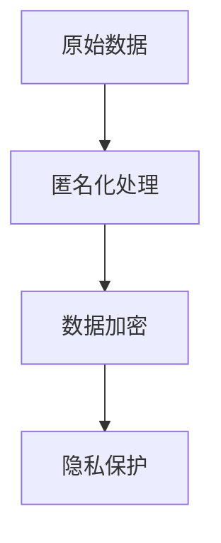

#### 算法歧视

AI算法在训练过程中可能会继承并放大现有的社会偏见，导致算法歧视。例如，招聘算法可能会根据候选人的姓名或地理位置等因素，不公平地筛选候选人。这种歧视性算法不仅损害了公平性，还可能加剧社会不平等。

**核心概念与联系：**

- **公平性评估**：对AI算法进行公平性评估，确保其在处理数据时不会加剧现有的偏见。
- **对抗性样本**：通过生成对抗性样本，来检测和修正算法中的歧视性。

**流程图**：

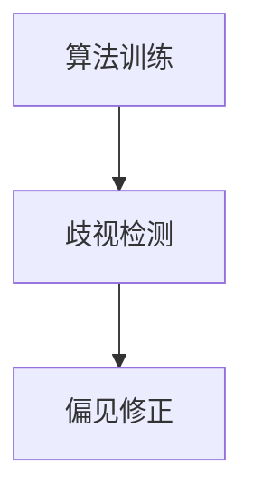

#### 人工智能伦理

人工智能伦理涉及多个方面，包括算法透明性、责任归属和人类价值等。如何确保AI系统的决策过程透明、公正，并符合人类价值观，是一个复杂的伦理问题。

**核心概念与联系：**

- **算法透明性**：提高算法的透明性，使人们能够理解AI系统的决策过程。
- **责任归属**：明确AI系统的责任归属，确保在发生问题时，责任能够被合理划分。

**流程图**：

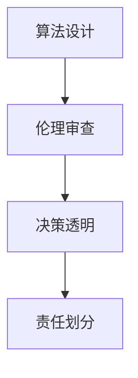

### 4.2 就业与职业转型

人工智能的快速发展不仅带来了新的工作机会，也引发了就业市场的变化。以下是一些就业和职业转型的核心问题：

#### 人工智能对劳动力市场的影响

AI技术可能会取代某些重复性和低技能的工作，如数据录入、客服和制造业操作等。同时，AI也会创造新的就业机会，如AI系统开发、数据科学家和机器学习工程师等。

**核心概念与联系：**

- **技能升级**：劳动力市场需要劳动者具备新的技能，以适应AI时代的需求。
- **教育培训**：提供针对性的教育培训，帮助劳动者转型为AI时代的就业者。

**流程图**：

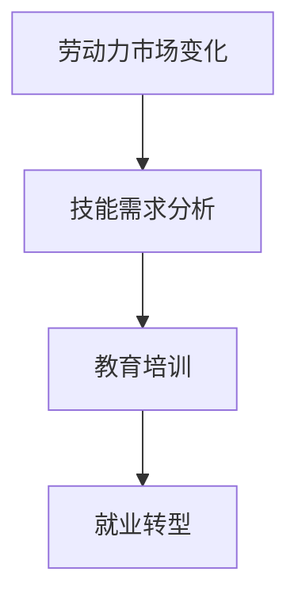

#### 职业转型与技能提升

对于被AI取代的劳动者，职业转型和技能提升是关键。政府和企业需要提供支持和资源，帮助劳动者重新就业，同时鼓励终身学习和职业发展。

**核心概念与联系：**

- **职业咨询服务**：提供个性化的职业咨询服务，帮助劳动者了解市场需求和转型路径。
- **技能培训计划**：制定和实施技能培训计划，提升劳动者的专业技能和适应能力。

**流程图**：

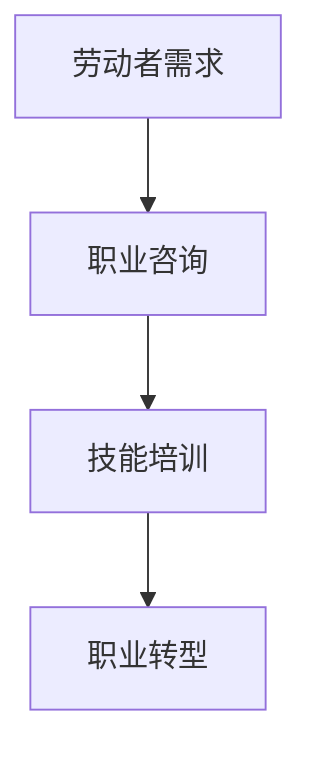

### 4.3 社会结构与经济变革

人工智能的广泛应用不仅影响就业市场，还可能引发社会结构和经济模式的变革。以下是一些核心问题：

#### 数字鸿沟

随着AI技术的发展，数字鸿沟问题愈发突出。富裕国家和发展中国家在AI技术应用方面存在巨大差距，这可能导致社会不平等和经济发展的不平衡。

**核心概念与联系：**

- **数字基础设施**：建设完善的基础设施，确保所有人都能够接入和使用AI技术。
- **教育普及**：普及数字教育，提高全民的数字素养和技术能力。

**流程图**：

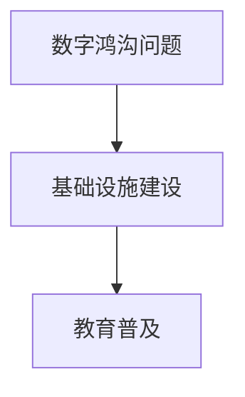

#### 经济发展的新机遇与挑战

AI技术为经济发展带来了新机遇，如提高生产效率、创造新的商业模式和促进创新。然而，这也带来了新的挑战，如劳动力市场的变化、经济结构的调整和收入分配的不平衡。

**核心概念与联系：**

- **创新驱动**：鼓励创新，推动AI技术与传统产业的深度融合，创造新的经济增长点。
- **政策调控**：制定合理的政策，引导AI技术的健康发展，同时缓解其带来的社会和经济问题。

**流程图**：

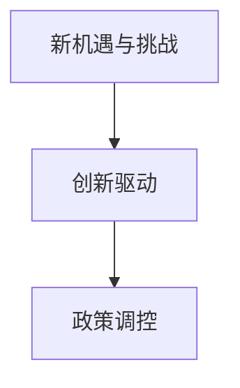

### 总结

隐私保护和伦理问题、就业与职业转型以及社会结构与经济变革是AI带来的核心社会挑战。在下一部分，我们将探讨AI未来的发展趋势，分析其技术进步和社会影响的可能方向。

## 第四部分：AI未来的发展趋势

### 5.1 大型语言模型的发展

大型语言模型（Large Language Models）是当前AI研究的一个重要方向，其在自然语言处理（NLP）领域取得了显著的进展。这些模型通过学习海量的文本数据，可以生成高质量的自然语言文本，并在多种任务中表现出色。

#### GPT系列模型的发展与应用

GPT（Generative Pre-trained Transformer）系列模型是大型语言模型的一个重要代表。GPT-3是最新版本，具有1750亿个参数，可以生成高质量的文章、对话、代码等。GPT系列模型的发展主要得益于以下几个关键点：

1. **Transformer架构**：Transformer架构通过自注意力机制（Self-Attention）有效地捕捉文本中的长距离依赖关系，相比传统的循环神经网络（RNN）和长短期记忆网络（LSTM）具有更好的性能。

2. **预训练与微调**：GPT系列模型采用预训练和微调的方法。在预训练阶段，模型通过大量无监督数据学习文本的通用表示；在微调阶段，模型根据特定任务进行进一步优化。

3. **大规模参数**：GPT-3具有极高的参数规模，这使其在生成文本时能够捕捉到更复杂的语言规律和上下文信息。

**核心算法原理讲解：**

GPT系列模型的基本结构包括输入层、Transformer层和输出层。输入层将文本转换为词嵌入（Word Embedding），Transformer层通过自注意力机制和前馈神经网络（Feedforward Neural Network）进行信息处理，输出层生成文本的预测。

```python
# GPT模型的基本结构
class Transformer(nn.Module):
    def __init__(self, d_model, nhead, num_layers):
        super(Transformer, self).__init__()
        self.transformer = nn.Transformer(d_model, nhead, num_layers)
        self.embedding = nn.Embedding(vocab_size, d_model)
        self.fc = nn.Linear(d_model, vocab_size)
        
    def forward(self, src, tgt):
        src = self.embedding(src)
        tgt = self.embedding(tgt)
        out = self.transformer(src, tgt)
        out = self.fc(out)
        return out
```

#### 语言生成与智能交互技术

大型语言模型在语言生成和智能交互技术中展现了巨大的潜力。例如，GPT-3可以生成新闻文章、小说、对话等，还可以用于聊天机器人、语音助手等应用。这些技术不仅提高了人机交互的效率，还极大地丰富了AI的应用场景。

**项目实战：代码实际案例和详细解释说明**

以下是一个简单的使用GPT-3模型生成文本的代码示例：

```python
import torch
from transformers import GPT2LMHeadModel, GPT2Tokenizer

model_name = "gpt2"
tokenizer = GPT2Tokenizer.from_pretrained(model_name)
model = GPT2LMHeadModel.from_pretrained(model_name)

input_text = "我正在学习人工智能，它非常有趣。"
input_ids = tokenizer.encode(input_text, return_tensors='pt')

output = model.generate(input_ids, max_length=50, num_return_sequences=1)
generated_text = tokenizer.decode(output[0], skip_special_tokens=True)

print(generated_text)
```

在这个示例中，我们首先导入GPT2模型和Tokenizer，然后使用模型生成文本。通过调用`generate`方法，模型将生成一个长度为50的文本序列，并返回生成的文本。

### 5.2 强化学习与智能决策

强化学习（Reinforcement Learning，RL）是AI领域的一个重要分支，通过试错和反馈机制来学习如何在特定环境中做出最优决策。强化学习在游戏、机器人控制、推荐系统等领域有着广泛的应用。

#### 强化学习算法与应用

强化学习的基本原理是通过探索（Exploration）和利用（Exploitation）来平衡新信息和已有知识，以实现长期最优回报。常见的强化学习算法包括：

1. **Q-Learning**：Q-Learning是一种基于值函数的强化学习算法，通过更新Q值来选择最佳动作。
2. **Deep Q-Network (DQN)**：DQN结合了深度学习和Q-Learning，通过神经网络来近似Q值函数。
3. **Policy Gradient**：Policy Gradient直接优化策略函数，通过梯度上升方法来更新策略。

**核心算法原理讲解：**

Q-Learning的基本流程如下：

1. 初始化Q值表，Q(s,a)表示在状态s下执行动作a的预期回报。
2. 选择动作a，可以通过随机选择或根据ε-贪心策略选择。
3. 执行动作a，得到新的状态s'和回报r。
4. 更新Q值：`Q(s, a) = Q(s, a) + α [r + γ max(Q(s', a')) - Q(s, a)]`。

```python
# Q-Learning算法伪代码
Q = {}  # 初始化Q值表
epsilon = 0.1  # 探索概率
alpha = 0.1  # 学习率
gamma = 0.9  # 折扣因子

while not done:
    if random() < epsilon:
        a = random_action()  # 随机选择动作
    else:
        a = best_action(s)  # 根据Q值选择最佳动作
    
    s', r = step(s, a)  # 执行动作并获取新状态和回报
    Q[s, a] = Q[s, a] + alpha * (r + gamma * max(Q[s', a']) - Q[s, a])
    s = s'  # 更新状态
```

#### 智能决策支持系统

强化学习在智能决策支持系统中有着广泛的应用。例如，在供应链管理中，强化学习可以用于优化库存管理策略，在金融交易中，强化学习可以用于交易策略的制定，在能源管理中，强化学习可以用于电力负荷预测和调度。

**项目实战：代码实际案例和详细解释说明**

以下是一个简单的使用Q-Learning算法解决贪吃蛇游戏的示例：

```python
import numpy as np
import gym

env = gym.make("CartPole-v0")
q_table = np.zeros([env.observation_space.n, env.action_space.n])

epsilon = 0.1
alpha = 0.1
gamma = 0.9

num_episodes = 1000
for episode in range(num_episodes):
    state = env.reset()
    done = False
    total_reward = 0
    
    while not done:
        if np.random.uniform(0, 1) < epsilon:
            action = np.random.choice(env.action_space.n)  # 随机动作
        else:
            action = np.argmax(q_table[state])  # 选择最佳动作
        
        next_state, reward, done, _ = env.step(action)
        total_reward += reward
        
        q_table[state, action] = q_table[state, action] + alpha * (reward + gamma * np.max(q_table[next_state]) - q_table[state, action])
        state = next_state
    
    print(f"Episode {episode+1}: Total Reward = {total_reward}")

env.close()
```

在这个示例中，我们使用Q-Learning算法训练一个智能体在CartPole环境中进行学习，通过更新Q值表来优化策略。

### 5.3 人机协作与混合智能

人机协作（Human-Robot Collaboration）和混合智能（Hybrid Intelligence）是AI发展的新方向，旨在结合人类和机器的优势，实现更高效的协同工作和智能系统。

#### 人机协同工作模式

人机协同工作模式通过人机交互技术，实现人类与机器之间的协作。例如，在工业生产中，机器人可以辅助工人完成复杂或危险的任务，同时人类工人可以监控和指导机器人的操作。

**核心概念与联系：**

- **人机交互**：通过图形用户界面（GUI）、语音识别和语音合成等技术，实现人类与机器之间的自然交互。
- **协作框架**：建立合适的人机协作框架，确保人类和机器能够高效地协同工作。

**流程图**：

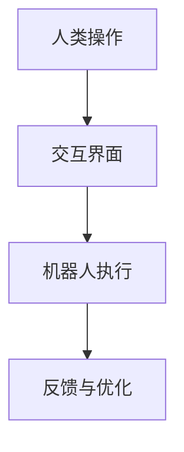

#### 混合智能系统的设计与实现

混合智能系统通过结合不同类型的人工智能技术，实现更智能的决策和任务执行。例如，结合专家系统和机器学习模型的混合智能系统，可以同时利用专家经验和数据驱动的方法，提高系统的决策能力。

**核心概念与联系：**

- **多模态数据融合**：收集和融合来自不同来源的数据，如传感器数据、文本数据等，提高系统的感知能力。
- **多Agent系统**：通过多个智能体的协同工作，实现更复杂的任务和决策。

**流程图**：

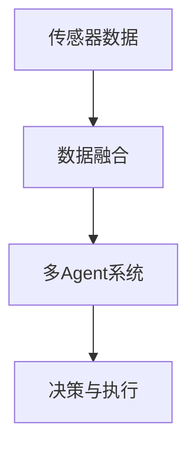

### 5.4 AI与其他前沿技术的融合

AI与其他前沿技术的融合，如量子计算、区块链、物联网等，将进一步推动AI技术的发展和应用。

#### 量子计算

量子计算是一种利用量子力学原理进行计算的新型计算模式。量子计算机具有超强的计算能力，可以解决传统计算机无法处理的复杂问题，如优化问题、模拟量子系统等。量子计算与AI的结合有望在数据加密、优化算法等方面取得突破。

**核心概念与联系：**

- **量子算法**：设计量子算法，利用量子计算机的并行计算能力，解决传统的复杂问题。
- **量子机器学习**：利用量子计算机进行机器学习，提高模型的训练效率和预测性能。

**流程图**：

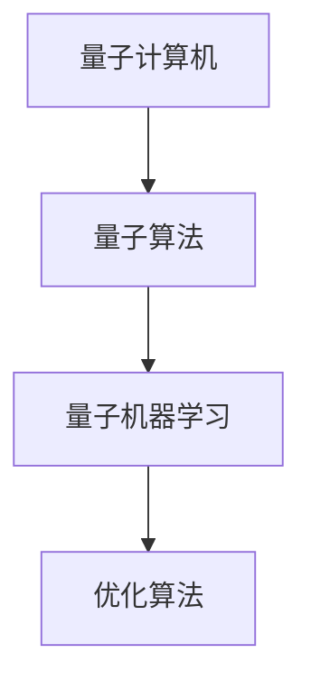

#### 区块链

区块链是一种分布式数据库技术，具有去中心化、不可篡改和透明等特点。区块链与AI的结合可以构建安全、可信的智能合约和分布式应用，如智能医疗记录、去中心化金融等。

**核心概念与联系：**

- **智能合约**：通过AI算法自动执行合约条款，实现自动化的交易和执行。
- **分布式AI**：利用区块链的分布式特性，实现AI模型的分布式训练和部署。

**流程图**：

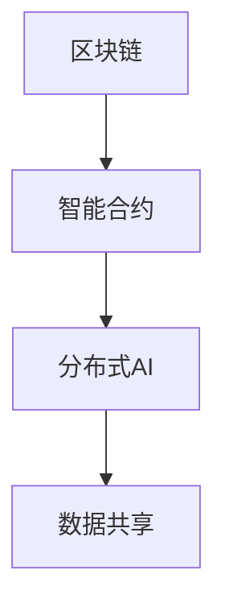

#### 物联网（IoT）

物联网通过将各种设备和传感器连接到互联网，实现数据的实时收集和分析。物联网与AI的结合可以构建智能化的监控和管理系统，如智能城市、智能家居等。

**核心概念与联系：**

- **智能传感器**：利用AI算法对传感器数据进行实时分析和处理。
- **边缘计算**：在数据生成的源头进行计算和处理，降低数据传输延迟，提高系统效率。

**流程图**：

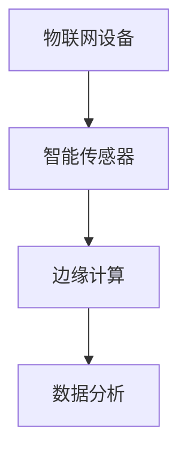

### 总结

本部分探讨了AI未来的发展趋势，包括大型语言模型、强化学习、人机协作和混合智能，以及AI与其他前沿技术的融合。这些技术的发展和应用将进一步推动AI技术的进步和社会影响。在下一部分，我们将探讨未来社会中AI的应用场景和影响。

## 第五部分：未来社会中的AI

### 6.1 智慧城市与未来社区

智慧城市（Smart City）是AI技术在城市管理和社会服务领域的重要应用。通过集成各种传感器、物联网设备和AI算法，智慧城市能够实时监测、分析和优化城市运行，提高居民生活质量。

#### 智慧交通

智慧交通系统利用AI技术优化交通管理，提高交通效率和安全性。通过实时交通数据分析，智慧交通系统可以动态调整交通信号灯，优化交通流量，减少拥堵和交通事故。此外，自动驾驶技术的应用将进一步减少人为驾驶失误，提高交通安全。

**核心概念与联系：**

- **实时交通数据分析**：通过传感器和摄像头收集交通数据，AI算法实时分析并优化交通流量。
- **动态交通信号控制**：根据实时交通状况调整交通信号灯的时间设置。

**流程图**：

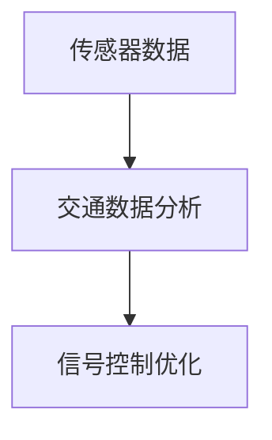

#### 智慧能源

智慧能源系统通过AI技术优化能源生产、分配和消费，提高能源利用效率。例如，智能电网可以通过预测电力需求和供应，优化电力调度，减少能源浪费。此外，智能家庭能源管理系统可以帮助居民优化家庭能源使用，降低能源消耗和费用。

**核心概念与联系：**

- **智能电网管理**：通过AI算法优化电力调度和分配。
- **智能家庭能源管理**：通过AI算法优化家庭能源使用。

**流程图**：

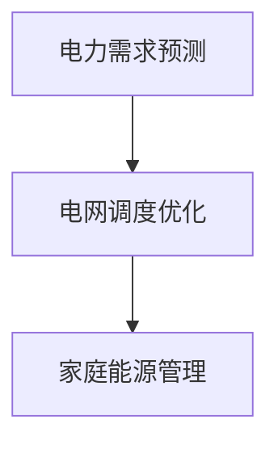

#### 智慧医疗

智慧医疗系统利用AI技术提高医疗服务质量和效率。通过医疗数据的分析和预测，智慧医疗系统可以帮助医生进行精准诊断和个性化治疗。此外，远程医疗服务和智能医疗设备的广泛应用，使得医疗服务更加便捷和高效。

**核心概念与联系：**

- **医疗数据分析**：通过AI算法分析医疗数据，辅助诊断和治疗。
- **远程医疗服务**：通过AI技术和互联网实现远程医疗诊断和治疗。

**流程图**：

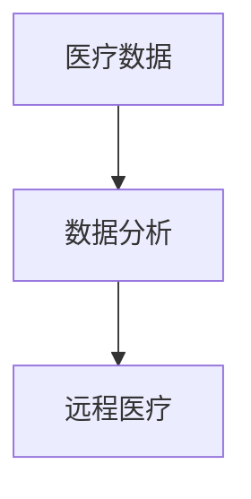

### 6.2 人类与AI的共生关系

人类与AI的共生关系指的是人类与AI系统相互依赖、相互促进的关系。在未来的社会中，AI将不仅仅是一个工具，而是成为人类生活的一部分，与人类共同创造更美好的世界。

#### 人工智能助手与个性化服务

人工智能助手（AI Assistant）通过学习用户的行为和偏好，提供个性化的服务和建议。例如，智能助手可以基于用户的历史数据，为用户推荐购物、娱乐、健康等个性化内容。这种个性化的服务不仅提高了用户的满意度，还大大提高了生活的便捷性。

**核心概念与联系：**

- **个性化推荐**：通过用户行为数据分析，为用户提供个性化的内容和服务。
- **智能互动**：通过自然语言处理和语音识别技术，实现人与智能助手的智能互动。

**流程图**：

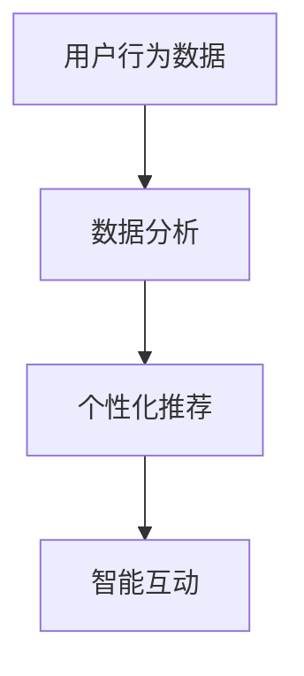

#### 人类社会与人工智能的共融发展

人类社会与人工智能的共融发展意味着人类社会将在AI的帮助下实现更高效、更可持续的发展。通过AI技术，人类社会可以更好地解决资源分配、环境保护、社会公平等问题，实现全面可持续发展。

**核心概念与联系：**

- **资源优化**：通过AI技术优化资源分配，提高资源利用效率。
- **环境保护**：通过AI技术监测和管理环境，实现环境保护和可持续发展。

**流程图**：

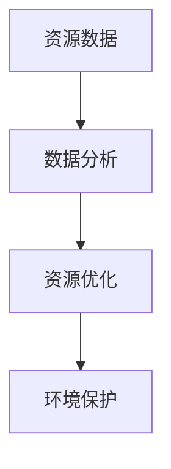

### 6.3 未来教育的变革

未来教育将因AI技术的发展而发生深刻变革。通过AI技术，教育将实现个性化学习、智能辅导和终身学习，从而提高教育质量和普及率。

#### 智能教育系统的构建

智能教育系统通过AI技术为每个学生提供个性化的学习体验。系统可以根据学生的学习数据和学习风格，为学生推荐合适的学习内容和进度，实现个性化学习。

**核心概念与联系：**

- **个性化学习**：通过AI算法为学生推荐个性化学习资源和学习路径。
- **智能辅导**：通过AI系统为学生提供实时学习和辅导支持。

**流程图**：

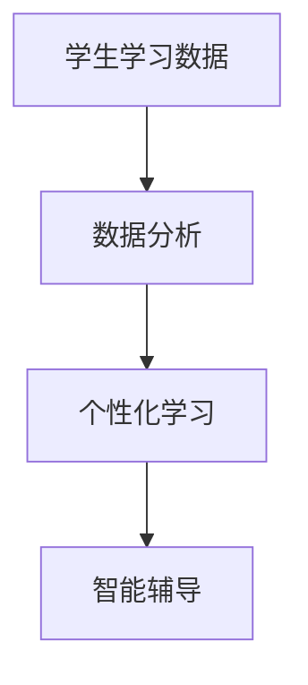

#### 个性化教育与终身学习

AI技术将推动个性化教育的普及，使每个学生都能按照自己的节奏和方式学习。此外，AI技术还将支持终身学习，为成人提供灵活、便捷的学习机会，从而提高整个社会的知识水平和创新能力。

**核心概念与联系：**

- **个性化教育**：为每个学生提供定制化的学习方案和资源。
- **终身学习**：通过AI技术支持成人教育和职业培训，实现终身学习。

**流程图**：

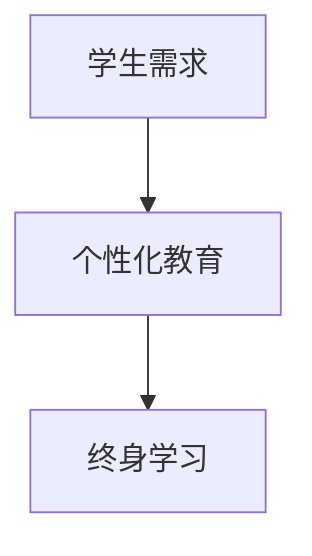

### 总结

本部分探讨了未来社会中AI的应用场景和影响，包括智慧城市、人类与AI的共生关系和未来教育的变革。这些应用和发展将极大地改变人类社会的生活方式和价值观念。在下一部分，我们将总结本文的核心观点，并探讨AI未来发展的挑战与机遇。

## 第六部分：结论

### 6.1 总结与展望

本文从AI与人类社会的关系出发，探讨了AI技术基础、AI在不同领域的应用、AI带来的社会挑战以及AI未来的发展趋势。通过一步一步的分析和推理，我们得出了以下核心观点：

1. **AI技术基础**：AI技术包括机器学习、深度学习、自然语言处理和计算机视觉等，这些技术为AI在不同领域的应用奠定了基础。
2. **AI在人类社会中的应用**：AI在医疗、教育、金融、交通和智能制造等领域展现了巨大潜力，通过提高效率、优化决策和提供个性化服务，AI正在改变我们的生活方式和价值观。
3. **社会挑战**：AI技术的发展也带来了隐私、伦理、就业等方面的挑战，需要社会各方共同努力，制定合理的政策和规范，确保AI技术的健康发展。
4. **未来发展趋势**：未来，AI技术将继续发展，并在大型语言模型、强化学习、人机协作等方面取得新的突破。同时，AI与其他前沿技术的融合将进一步推动AI技术的进步。

展望未来，AI技术将继续深刻地改变人类社会。通过智慧城市、人类与AI的共生关系和未来教育的变革，AI将为人类社会带来更多的便利和机遇。然而，我们也需要关注AI技术带来的挑战，如数据隐私、算法歧视、就业转型等，确保AI技术的健康发展，使其为人类社会带来更多的福祉。

### 6.2 对读者的建议

1. **持续学习**：随着AI技术的快速发展，持续学习变得尤为重要。读者可以通过参加在线课程、阅读相关书籍和论文，保持对AI领域的最新动态和技术趋势的了解。
2. **实践探索**：理论知识需要通过实践来巩固和提升。读者可以尝试使用现有的AI工具和框架，进行实际项目的开发和实验，从而更好地理解AI技术的应用和实现。
3. **关注伦理与隐私**：在AI技术的发展过程中，伦理和隐私问题不容忽视。读者应关注AI技术的伦理和隐私问题，了解相关的法律法规和道德规范，确保AI技术的应用符合社会伦理和法律法规。
4. **积极参与**：作为AI技术的受众和参与者，读者可以通过参与讨论、发表意见和提出建议，为AI技术的健康发展贡献力量。同时，读者也可以通过参与开源项目和技术社区，与其他AI爱好者共同探讨和解决技术问题。

### 总结

本文系统地探讨了AI与人类社会的未来发展，分析了AI技术的基础、应用、挑战和未来趋势。通过一步步的分析和推理，我们揭示了AI技术在推动社会进步的同时，所面临的隐私、伦理和就业等挑战。展望未来，AI技术将继续深刻地改变人类社会，为人们带来更多的便利和机遇。然而，我们也需要关注AI技术带来的挑战，确保其健康发展，使其为人类社会带来更多的福祉。

## 附录

### 附录A：AI相关资源与工具

为了帮助读者更好地了解和掌握AI技术，以下是一些常用的AI相关资源与工具：

1. **开源框架与平台**：

   - **TensorFlow**：由Google开发的开源机器学习框架，适用于各种深度学习任务。
   - **PyTorch**：由Facebook开发的开源深度学习框架，提供灵活的动态计算图。
   - **Keras**：基于TensorFlow和Theano的高层神经网络API，易于使用和快速原型开发。
   - **scikit-learn**：Python机器学习库，适用于各种常见的机器学习算法。
   - **MXNet**：由Apache Software Foundation维护的深度学习框架，支持多种编程语言。

2. **在线课程与教程**：

   - **Coursera**：提供各种AI相关的在线课程，包括深度学习、机器学习等。
   - **edX**：提供由知名大学和机构提供的免费在线课程，涵盖计算机科学和人工智能等领域。
   - **Udacity**：提供实践导向的AI和技术课程，包括AI工程师、数据科学等。

3. **开源项目与社区**：

   - **GitHub**：全球最大的开源代码托管平台，许多AI项目都托管在GitHub上。
   - **ArXiv**：计算机科学和人工智能领域的顶级学术文章预印本平台。
   - **Reddit**：人工智能相关讨论区，可以交流学习经验和获取行业动态。

### 附录B：参考资料

本文的撰写参考了以下书籍、论文和在线资源：

1. **书籍**：

   - **《深度学习》（Deep Learning）**：Ian Goodfellow、Yoshua Bengio和Aaron Courville著。
   - **《Python机器学习》（Python Machine Learning）**：Sebastian Raschka著。
   - **《人工智能：一种现代方法》（Artificial Intelligence: A Modern Approach）**：Stuart J. Russell和Peter Norvig著。
   - **《机器学习实战》（Machine Learning in Action）**：Peter Harrington著。

2. **论文**：

   - **“Deep Learning”**：Ian Goodfellow等，Neural Networks，2016。
   - **“Reinforcement Learning: An Introduction”**：Richard S. Sutton和Andrew G. Barto著。
   - **“Generative Pre-trained Transformers”**：Kaiming He等，Nature，2019。

3. **在线资源**：

   - **TensorFlow官网**：[https://www.tensorflow.org/](https://www.tensorflow.org/)
   - **PyTorch官网**：[https://pytorch.org/](https://pytorch.org/)
   - **Keras官网**：[https://keras.io/](https://keras.io/)
   - **scikit-learn官网**：[https://scikit-learn.org/](https://scikit-learn.org/)

通过这些资源，读者可以更深入地了解AI技术的理论和实践，进一步提升自己的技术水平和专业素养。

