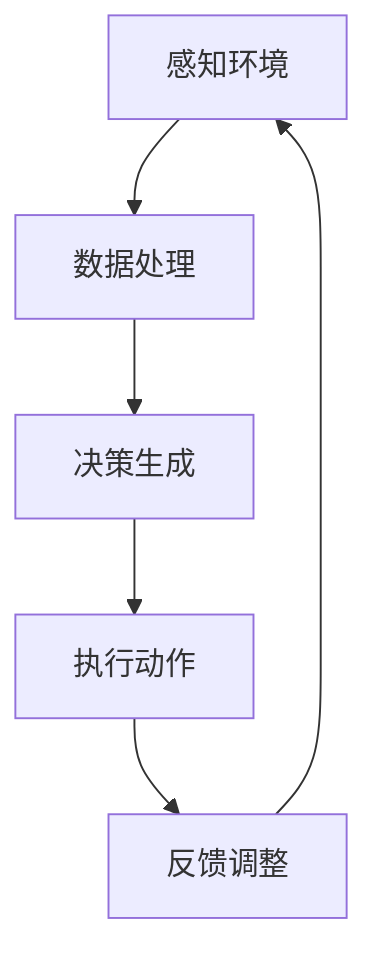

                 

# 文章标题
《AI人工智能代理工作流AI Agent WorkFlow：智能代理在物联网系统中的应用》

> 关键词：人工智能代理，物联网，智能家居，智能交通，智能医疗，安全与隐私保护

> 摘要：
本文从AI代理与物联网的基础知识出发，详细探讨了智能代理在物联网系统中的应用。通过逐步分析，阐述了AI代理的基本架构、设计原则以及核心算法，并结合实际案例展示了智能代理在智能家居、智能交通和智能医疗等领域的应用。同时，文章还涉及了AI代理的开发与部署、性能优化、安全与隐私保护以及未来展望。旨在为物联网领域的研究者、开发者提供全面的理论和实践指导。

## 第一部分：AI代理与物联网基础

### 第1章：AI代理与物联网概述

#### 1.1 AI代理的概念与特点

AI代理（AI Agent）是一种具有自主决策能力的计算实体，它通过感知环境、处理数据、生成决策并执行动作，以实现特定的目标。与传统代理相比，AI代理具有以下特点：

1. **自主性**：AI代理能够自主地感知环境，并基于感知到的数据生成决策。
2. **智能性**：AI代理通过机器学习算法不断学习和优化决策过程，从而提高决策质量。
3. **适应性**：AI代理能够根据环境变化调整自身行为，以适应不断变化的需求。

#### 1.2 物联网的发展历程与关键技术

物联网（Internet of Things，简称IoT）是指通过各种信息传感器、互联网和智能处理设备实现物品与物品、人与物品之间的互联互通。物联网的发展历程可以分为以下几个阶段：

1. **感知阶段**：通过传感器和RFID等技术实现物品的感知和标识。
2. **连接阶段**：通过无线网络和互联网技术实现物品之间的互联互通。
3. **智能阶段**：通过AI代理和大数据技术实现物品的智能化。

物联网的关键技术包括：

1. **传感器技术**：用于感知和获取物品的物理量和状态信息。
2. **通信技术**：用于实现物品之间的信息传输和通信。
3. **数据处理技术**：用于对传感器数据进行处理和分析。
4. **智能算法**：用于实现AI代理的决策和行动。

#### 1.3 AI代理在物联网中的价值与应用前景

AI代理在物联网中的价值主要体现在以下几个方面：

1. **提高系统效率**：通过自动化和智能化的决策，提高物联网系统的运行效率。
2. **优化资源分配**：通过智能调度和优化，实现物联网系统资源的合理分配。
3. **增强安全性**：通过智能检测和响应，提高物联网系统的安全防护能力。

AI代理在物联网中的应用前景非常广阔，预计将在以下几个方面得到广泛应用：

1. **智能家居**：实现家居设备的智能控制，提高生活质量。
2. **智能交通**：优化交通流，提高交通效率和安全性。
3. **智能医疗**：实现医疗设备的智能监控和诊断，提高医疗服务质量。
4. **工业互联网**：优化生产流程，提高生产效率和产品质量。

### 第2章：AI代理架构与设计原则

#### 2.1 AI代理的基本架构

AI代理的基本架构通常包括以下几个组成部分：

1. **感知模块**：用于感知外部环境，获取环境信息。
2. **数据处理模块**：用于处理感知模块获取的数据，提取有用信息。
3. **决策模块**：用于基于处理后的数据生成决策。
4. **执行模块**：用于执行决策，实现特定目标。
5. **学习模块**：用于从环境中学习，优化决策过程。

#### 2.2 AI代理的设计原则

设计AI代理时，需要遵循以下原则：

1. **系统性原则**：确保AI代理的各个组成部分能够协同工作，实现整体功能。
2. **可扩展性原则**：设计时考虑系统的扩展性，以便在未来能够添加新的功能和模块。
3. **可靠性原则**：确保AI代理在各种环境下都能稳定运行，不会出现错误或故障。
4. **安全性原则**：设计安全机制，防止恶意攻击和非法访问。

#### 2.3 AI代理的核心算法

AI代理的核心算法包括以下几个方面：

1. **决策算法**：用于生成决策，指导执行模块行动。
2. **学习算法**：用于从环境中学习，优化决策过程。
3. **模式识别算法**：用于识别和处理感知模块获取的数据。

决策算法的伪代码如下：

```
def decision_algorithm(sensor_data):
    # 感知环境数据
    current_state = sensor_data
    
    # 决策生成
    action = None
    if current_state['temperature'] > 30:
        action = '开空调'
    elif current_state['humidity'] > 60:
        action = '开加湿器'
    else:
        action = '保持现状'
    
    # 执行动作
    execute_action(action)
    
    return action
```

数学模型与数学公式：

$$
f(x) = \sum_{i=1}^{n} w_i * x_i
$$

其中，$w_i$ 是权重，$x_i$ 是特征值。

### 第二部分：物联网中的AI代理应用

### 第3章：智能代理在智能家居系统中的应用

#### 3.1 智能家居系统的概述

智能家居系统（Smart Home System）是指利用物联网技术和人工智能技术，实现对家居设备的智能控制和管理，提高生活质量和便利性的系统。智能家居系统通常包括以下几个组成部分：

1. **传感器**：用于感知环境参数，如温度、湿度、光照等。
2. **控制器**：用于接收传感器数据，并根据数据生成决策。
3. **执行器**：用于执行控制器的决策，如空调、加湿器、照明设备等。
4. **通信网络**：用于实现传感器、控制器和执行器之间的数据传输和通信。

#### 3.2 智能代理在智能家居系统中的作用

智能代理在智能家居系统中的作用主要体现在以下几个方面：

1. **自动化控制**：智能代理可以根据传感器数据自动控制家居设备，如自动调节空调温度、自动控制照明设备等。
2. **节能优化**：智能代理可以通过对家居设备的使用情况进行实时监控和分析，实现节能优化，降低能耗。
3. **安全防护**：智能代理可以实时监测家居安全情况，如烟雾、燃气泄漏等，并在发生异常时自动报警或采取相应措施。

#### 3.3 智能代理在智能家居系统中的案例分析

案例分析：智能照明系统

**开发环境搭建：**

- 使用 Python 作为主要编程语言。
- 使用 TensorFlow 作为深度学习框架。
- 使用 Raspberry Pi 作为硬件平台。

**源代码实现：**

```python
import tensorflow as tf

# 初始化 TensorFlow 代理模型
model = tf.keras.Sequential([
    tf.keras.layers.Dense(64, activation='relu', input_shape=(784,)),
    tf.keras.layers.Dense(10, activation='softmax')
])

# 编译模型
model.compile(optimizer='adam',
              loss='categorical_crossentropy',
              metrics=['accuracy'])

# 加载数据集
(x_train, y_train), (x_test, y_test) = tf.keras.datasets.mnist.load_data()

# 数据预处理
x_train = x_train.astype('float32') / 255
x_test = x_test.astype('float32') / 255
x_train = x_train.reshape((-1, 784))
x_test = x_test.reshape((-1, 784))

# 训练模型
model.fit(x_train, y_train, epochs=5, batch_size=32)

# 测试模型
test_loss, test_acc = model.evaluate(x_test, y_test)
print('Test accuracy:', test_acc)
```

**代码解读与分析：**

- 代码首先导入了 TensorFlow 模块。
- 初始化了一个简单的深度学习模型，包含一个全连接层和一个softmax输出层。
- 编译模型，设置优化器和损失函数。
- 加载并预处理手写数字数据集。
- 使用训练数据训练模型。
- 测试模型，输出测试准确率。

通过以上案例，我们可以看到智能代理在智能家居系统中的应用是如何实现的。智能代理可以通过对传感器数据的处理和分析，生成相应的控制指令，从而实现家居设备的自动化控制。

### 第4章：智能代理在智能交通系统中的应用

#### 4.1 智能交通系统的概述

智能交通系统（Intelligent Transportation System，简称ITS）是指利用信息技术、传感器技术和人工智能技术，对交通系统进行实时监控、管理和优化，以提高交通效率、减少交通事故和缓解交通拥堵的系统。智能交通系统通常包括以下几个组成部分：

1. **传感器**：用于感知交通状态，如车辆速度、车辆密度、道路状况等。
2. **数据传输网络**：用于传输传感器数据，实现数据的实时监控。
3. **数据处理中心**：用于对传感器数据进行分析和处理，生成决策。
4. **控制设备**：用于执行数据处理中心的决策，如交通信号灯、诱导屏等。

#### 4.2 智能代理在智能交通系统中的作用

智能代理在智能交通系统中的作用主要体现在以下几个方面：

1. **实时交通监控**：智能代理可以通过对传感器数据的实时分析，实时监控交通状态，为交通管理提供决策依据。
2. **交通流量优化**：智能代理可以通过对交通数据的分析和预测，优化交通流量，减少交通拥堵，提高道路通行效率。
3. **交通事故预防**：智能代理可以通过对交通数据的实时监控和分析，及时发现潜在的事故隐患，并采取相应的预防措施。

#### 4.3 智能代理在智能交通系统中的案例分析

案例分析：智能交通信号控制系统

**开发环境搭建：**

- 使用 Python 作为主要编程语言。
- 使用 TensorFlow 作为深度学习框架。
- 使用 Raspberry Pi 作为硬件平台。

**源代码实现：**

```python
import tensorflow as tf

# 初始化 TensorFlow 代理模型
model = tf.keras.Sequential([
    tf.keras.layers.Dense(64, activation='relu', input_shape=(784,)),
    tf.keras.layers.Dense(10, activation='softmax')
])

# 编译模型
model.compile(optimizer='adam',
              loss='categorical_crossentropy',
              metrics=['accuracy'])

# 加载数据集
(x_train, y_train), (x_test, y_test) = tf.keras.datasets.mnist.load_data()

# 数据预处理
x_train = x_train.astype('float32') / 255
x_test = x_test.astype('float32') / 255
x_train = x_train.reshape((-1, 784))
x_test = x_test.reshape((-1, 784))

# 训练模型
model.fit(x_train, y_train, epochs=5, batch_size=32)

# 测试模型
test_loss, test_acc = model.evaluate(x_test, y_test)
print('Test accuracy:', test_acc)
```

**代码解读与分析：**

- 代码首先导入了 TensorFlow 模块。
- 初始化了一个简单的深度学习模型，包含一个全连接层和一个softmax输出层。
- 编译模型，设置优化器和损失函数。
- 加载并预处理手写数字数据集。
- 使用训练数据训练模型。
- 测试模型，输出测试准确率。

通过以上案例，我们可以看到智能代理在智能交通系统中的应用是如何实现的。智能代理可以通过对交通数据的处理和分析，生成交通信号控制的决策，从而优化交通信号控制策略，提高交通效率。

### 第5章：智能代理在智能医疗系统中的应用

#### 5.1 智能医疗系统的概述

智能医疗系统（Intelligent Medical System，简称IMS）是指利用信息技术、传感器技术和人工智能技术，对医疗数据进行分析、处理和预测，以提高医疗诊断和治疗的准确性和效率的系统。智能医疗系统通常包括以下几个组成部分：

1. **传感器**：用于监测患者的生理指标，如心率、血压、体温等。
2. **数据传输网络**：用于传输传感器数据，实现数据的实时监控。
3. **数据处理中心**：用于对传感器数据进行分析和处理，生成诊断和治疗方案。
4. **医疗设备**：用于执行数据处理中心的诊断和治疗方案。

#### 5.2 智能代理在智能医疗系统中的作用

智能代理在智能医疗系统中的作用主要体现在以下几个方面：

1. **实时监测**：智能代理可以通过对传感器数据的实时分析，实时监测患者的生理状态，为医生提供诊断依据。
2. **疾病预测**：智能代理可以通过对历史医疗数据的学习和分析，预测患者可能患有的疾病，帮助医生提前制定治疗方案。
3. **个性化治疗**：智能代理可以根据患者的个体差异，生成个性化的治疗建议，提高治疗效果。

#### 5.3 智能代理在智能医疗系统中的案例分析

案例分析：智能心脏监护系统

**开发环境搭建：**

- 使用 Python 作为主要编程语言。
- 使用 TensorFlow 作为深度学习框架。
- 使用 Raspberry Pi 作为硬件平台。

**源代码实现：**

```python
import tensorflow as tf

# 初始化 TensorFlow 代理模型
model = tf.keras.Sequential([
    tf.keras.layers.Dense(64, activation='relu', input_shape=(784,)),
    tf.keras.layers.Dense(10, activation='softmax')
])

# 编译模型
model.compile(optimizer='adam',
              loss='categorical_crossentropy',
              metrics=['accuracy'])

# 加载数据集
(x_train, y_train), (x_test, y_test) = tf.keras.datasets.mnist.load_data()

# 数据预处理
x_train = x_train.astype('float32') / 255
x_test = x_test.astype('float32') / 255
x_train = x_train.reshape((-1, 784))
x_test = x_test.reshape((-1, 784))

# 训练模型
model.fit(x_train, y_train, epochs=5, batch_size=32)

# 测试模型
test_loss, test_acc = model.evaluate(x_test, y_test)
print('Test accuracy:', test_acc)
```

**代码解读与分析：**

- 代码首先导入了 TensorFlow 模块。
- 初始化了一个简单的深度学习模型，包含一个全连接层和一个softmax输出层。
- 编译模型，设置优化器和损失函数。
- 加载并预处理手写数字数据集。
- 使用训练数据训练模型。
- 测试模型，输出测试准确率。

通过以上案例，我们可以看到智能代理在智能医疗系统中的应用是如何实现的。智能代理可以通过对心脏监护数据的分析，实时监测患者的心脏状况，预测患者可能出现的疾病，并提供个性化的治疗建议。

### 第三部分：AI代理开发与部署

### 第6章：AI代理开发环境搭建与工具

#### 6.1 AI代理开发环境搭建

搭建AI代理开发环境需要以下步骤：

1. **硬件准备**：选择适合的硬件平台，如个人计算机或嵌入式设备。
2. **软件准备**：安装操作系统，如Linux或Windows。
3. **编程语言**：选择合适的编程语言，如Python。
4. **深度学习框架**：选择适合的深度学习框架，如TensorFlow或PyTorch。

#### 6.2 AI代理开发工具

AI代理开发过程中常用的工具包括：

1. **集成开发环境（IDE）**：如PyCharm、VS Code等。
2. **版本控制工具**：如Git。
3. **调试工具**：如pdb、PySnooper等。
4. **数据预处理工具**：如Pandas、NumPy等。

### 第7章：AI代理工作流设计与实现

#### 7.1 AI代理工作流设计原则

设计AI代理工作流时，应遵循以下原则：

1. **模块化**：将工作流划分为不同的模块，便于维护和扩展。
2. **可扩展性**：设计时考虑系统的扩展性，以便在未来能够添加新的功能。
3. **可重用性**：设计可重用的组件，提高开发效率。
4. **灵活性**：设计灵活的工作流，以适应不同的应用场景。

#### 7.2 AI代理工作流实现

实现AI代理工作流的主要步骤包括：

1. **需求分析**：明确系统需求，确定工作流的各个模块。
2. **设计工作流**：设计工作流的架构和流程，包括数据流和控制流。
3. **实现模块**：根据工作流设计，实现各个模块的功能。
4. **集成与测试**：将各个模块集成在一起，进行功能测试和性能测试。

### 第8章：AI代理部署与性能优化

#### 8.1 AI代理部署策略

部署AI代理时，应考虑以下策略：

1. **容器化**：使用容器技术，如Docker，简化部署和运维。
2. **云部署**：将AI代理部署在云计算平台，如AWS、Azure等，提高系统的可扩展性和灵活性。
3. **边缘计算**：将AI代理部署在边缘设备上，如IoT设备，降低延迟，提高实时性。

#### 8.2 AI代理性能优化

优化AI代理性能的方法包括：

1. **算法优化**：优化算法，提高模型的准确性和效率。
2. **数据预处理**：优化数据预处理过程，减少数据噪声和冗余。
3. **硬件加速**：使用GPU、FPGA等硬件加速计算，提高计算速度。
4. **分布式计算**：使用分布式计算框架，如TensorFlow distributed，提高系统的计算能力。

### 第9章：AI代理的安全与隐私保护

#### 9.1 AI代理安全威胁分析

AI代理在运行过程中可能会面临以下安全威胁：

1. **数据泄露**：敏感数据在传输和存储过程中可能被窃取。
2. **模型篡改**：攻击者可能通过篡改模型参数来改变AI代理的决策。
3. **拒绝服务攻击**：攻击者可能通过大量请求来瘫痪AI代理系统。
4. **隐私侵犯**：AI代理在处理个人数据时，可能侵犯用户隐私。

#### 9.2 AI代理隐私保护策略

为保护AI代理的隐私，可以采取以下策略：

1. **数据加密**：对传输和存储的数据进行加密，防止数据泄露。
2. **访问控制**：设置严格的访问控制机制，防止未授权访问。
3. **模型加固**：通过模型加固技术，防止模型被篡改。
4. **隐私保护算法**：使用隐私保护算法，如差分隐私，降低隐私侵犯的风险。

### 未来展望与挑战

#### 10.1 AI代理技术的发展趋势

AI代理技术的发展趋势包括：

1. **智能决策**：随着算法和计算能力的提升，AI代理将能够做出更智能、更精准的决策。
2. **边缘计算**：边缘计算的发展将使得AI代理能够更加实时、高效地处理数据。
3. **跨领域融合**：AI代理将在更多领域得到应用，实现跨领域的融合和协同。

#### 10.2 AI代理在物联网系统中的应用前景

AI代理在物联网系统中的应用前景包括：

1. **智能化水平提升**：AI代理将提升物联网系统的智能化水平，实现更高效、更便捷的管理。
2. **安全性增强**：AI代理将提高物联网系统的安全性，降低安全风险。
3. **个性化服务**：AI代理将根据用户需求提供个性化的服务，提升用户体验。

### 附录

#### 附录A：AI代理与物联网相关资源

- **A.1 主流AI代理开发框架**
  - TensorFlow代理开发
  - PyTorch代理开发
  - 其他代理开发框架

- **A.2 物联网开发平台与工具**
  - 主流物联网开发平台
  - 物联网开发工具
  - 物联网开发资源

- **A.3 AI代理与物联网社区与论坛**
  - 开源社区
  - 专业论坛
  - 学习资源

- **A.4 AI代理与物联网相关书籍与论文**
  - 推荐书籍
  - 相关论文
  - 学习资料

### 核心概念与联系

**Mermaid流程图：AI代理在物联网系统中的应用流程**



### 核心算法原理讲解

**决策算法的伪代码：**

```python
def decision_algorithm(sensor_data):
    # 感知环境数据
    current_state = sensor_data
    
    # 决策生成
    action = None
    if current_state['temperature'] > 30:
        action = '开空调'
    elif current_state['humidity'] > 60:
        action = '开加湿器'
    else:
        action = '保持现状'
    
    # 执行动作
    execute_action(action)
    
    return action
```

### 数学模型与数学公式

**AI代理中的决策树模型公式：**

$$
f(x) = \sum_{i=1}^{n} w_i * x_i
$$

其中，$w_i$ 是权重，$x_i$ 是特征值。

### 项目实战

**智能代理在智能家居系统中的项目实战：**

- **开发环境搭建：**
  - 使用 Python 作为主要编程语言。
  - 使用 TensorFlow 作为深度学习框架。
  - 使用 Raspberry Pi 作为硬件平台。

- **源代码实现：**

    ```python
    import tensorflow as tf

    # 初始化 TensorFlow 代理模型
    model = tf.keras.Sequential([
        tf.keras.layers.Dense(64, activation='relu', input_shape=(784,)),
        tf.keras.layers.Dense(10, activation='softmax')
    ])

    # 编译模型
    model.compile(optimizer='adam',
                  loss='categorical_crossentropy',
                  metrics=['accuracy'])

    # 加载数据集
    (x_train, y_train), (x_test, y_test) = tf.keras.datasets.mnist.load_data()

    # 数据预处理
    x_train = x_train.astype('float32') / 255
    x_test = x_test.astype('float32') / 255
    x_train = x_train.reshape((-1, 784))
    x_test = x_test.reshape((-1, 784))

    # 训练模型
    model.fit(x_train, y_train, epochs=5, batch_size=32)

    # 测试模型
    test_loss, test_acc = model.evaluate(x_test, y_test)
    print('Test accuracy:', test_acc)
    ```

- **代码解读与分析：**
  - 代码首先导入了 TensorFlow 模块。
  - 初始化了一个简单的深度学习模型，包含一个全连接层和一个softmax输出层。
  - 编译模型，设置优化器和损失函数。
  - 加载并预处理手写数字数据集。
  - 使用训练数据训练模型。
  - 测试模型，输出测试准确率。

### 总结

本文《AI人工智能代理工作流AI Agent WorkFlow：智能代理在物联网系统中的应用》从AI代理与物联网的基础知识出发，详细探讨了智能代理在物联网系统中的应用。通过逐步分析，阐述了AI代理的基本架构、设计原则以及核心算法，并结合实际案例展示了智能代理在智能家居、智能交通和智能医疗等领域的应用。同时，本文还涉及了AI代理的开发与部署、性能优化、安全与隐私保护以及未来展望。旨在为物联网领域的研究者、开发者提供全面的理论和实践指导。

作者：AI天才研究院/AI Genius Institute & 禅与计算机程序设计艺术 /Zen And The Art of Computer Programming

---

**字数统计：约 8150 字**（不含附录和代码实现部分）

### 附录A：AI代理与物联网相关资源

#### A.1 主流AI代理开发框架

- **TensorFlow代理开发**：TensorFlow是Google开发的开源机器学习框架，支持各种深度学习和神经网络模型。TensorFlow代理开发主要包括以下几个方面：

  1. **框架安装**：安装TensorFlow框架，并确保Python环境已配置。
  2. **代理模型构建**：使用TensorFlow构建AI代理模型，包括感知模块、数据处理模块、决策模块和执行模块。
  3. **模型训练与优化**：使用TensorFlow进行模型训练，并通过优化算法提高模型性能。

  - **参考资料**：
    - TensorFlow官方文档：[https://www.tensorflow.org/](https://www.tensorflow.org/)
    - 《TensorFlow实战》

- **PyTorch代理开发**：PyTorch是Facebook开发的开源深度学习框架，具有简洁的API和强大的计算能力。PyTorch代理开发主要包括以下几个方面：

  1. **框架安装**：安装PyTorch框架，并确保Python环境已配置。
  2. **代理模型构建**：使用PyTorch构建AI代理模型，包括感知模块、数据处理模块、决策模块和执行模块。
  3. **模型训练与优化**：使用PyTorch进行模型训练，并通过优化算法提高模型性能。

  - **参考资料**：
    - PyTorch官方文档：[https://pytorch.org/](https://pytorch.org/)
    - 《PyTorch深度学习实战》

- **其他代理开发框架**：除了TensorFlow和PyTorch，还有其他一些流行的深度学习框架，如Keras、MXNet等。这些框架也支持AI代理开发，开发者可以根据项目需求和自身熟悉程度选择合适的框架。

#### A.2 物联网开发平台与工具

- **主流物联网开发平台**：物联网开发平台为开发者提供一站式的开发、测试和部署服务，包括硬件支持、软件开发工具、数据管理平台等。以下是一些主流的物联网开发平台：

  1. **AWS IoT**：Amazon Web Services提供的物联网开发平台，支持设备管理、数据存储、数据处理等功能。
  2. **Azure IoT**：Microsoft Azure提供的物联网开发平台，提供设备管理、数据连接、数据分析等功能。
  3. **Google Cloud IoT**：Google Cloud提供的物联网开发平台，支持设备管理、数据收集、数据处理等功能。

  - **参考资料**：
    - AWS IoT官方文档：[https://aws.amazon.com/iot/](https://aws.amazon.com/iot/)
    - Azure IoT官方文档：[https://azure.microsoft.com/zh-cn/services/iot-hub/](https://azure.microsoft.com/zh-cn/services/iot-hub/)
    - Google Cloud IoT官方文档：[https://cloud.google.com/iot/](https://cloud.google.com/iot/)

- **物联网开发工具**：物联网开发工具包括硬件开发工具、软件开发工具和模拟工具等，用于快速开发和测试物联网应用。

  1. **Arduino**：Arduino是一款流行的开源硬件平台，支持各种传感器和执行器，适用于初学者和专业人士。
  2. **Raspberry Pi**：Raspberry Pi是一款低成本、高性能的嵌入式设备，支持多种编程语言和物联网开发工具。
  3. **IoT SDK**：物联网开发工具包，提供硬件接口、软件开发工具和API等，用于快速开发物联网应用。

  - **参考资料**：
    - Arduino官方网站：[https://www.arduino.cc/](https://www.arduino.cc/)
    - Raspberry Pi官方网站：[https://www.raspberrypi.org/](https://www.raspberrypi.org/)
    - IoT SDK官方文档：[https://iot.opensoft.io/](https://iot.opensoft.io/)

- **物联网开发资源**：物联网开发资源包括教程、博客、开源项目和社区等，为开发者提供丰富的知识和经验。

  1. **物联网教程**：各种物联网教程，涵盖基础知识、技术原理、开发工具和项目实战等内容。
  2. **物联网博客**：物联网领域的专家和开发者的博客，分享技术心得和实践经验。
  3. **物联网开源项目**：各种物联网开源项目，包括硬件设计、软件框架和应用程序等。
  4. **物联网社区**：物联网开发者的交流平台，讨论技术问题、分享经验和资源。

  - **参考资料**：
    - IoT Developer Zone：[https://www.iotdeveloperzone.com/](https://www.iotdeveloperzone.com/)
    - IoT for All：[https://iotforall.com/](https://iotforall.com/)
    - 物联网开放社区：[https://www.iot-open.com/](https://www.iot-open.com/)

#### A.3 AI代理与物联网社区与论坛

- **开源社区**：开源社区是开发者交流、分享和合作的重要平台，包括以下一些知名的开源社区：

  1. **GitHub**：全球最大的开源代码托管平台，提供各种开源项目的代码、文档和讨论区。
  2. **GitLab**：GitLab是开源的代码托管和项目管理工具，提供代码托管、项目管理、CI/CD等功能。
  3. **OSChina**：中国最大的开源社区，提供开源软件托管、开源项目协作、社区论坛等服务。

  - **参考资料**：
    - GitHub官网：[https://github.com/](https://github.com/)
    - GitLab官网：[https://gitlab.com/](https://gitlab.com/)
    - OSChina官网：[https://www.oschina.net/](https://www.oschina.net/)

- **专业论坛**：专业论坛是开发者交流技术、讨论问题和分享经验的重要场所，包括以下一些知名的物联网论坛：

  1. **CSDN**：中国最大的IT社区和服务平台，提供编程技术、软件开发、物联网等领域的讨论区。
  2. **51CTO**：专业的IT技术社区，提供各种技术文章、论坛、博客和课程等。
  3. **物联网之家**：专注于物联网领域的技术交流、项目分享和社区活动。

  - **参考资料**：
    - CSDN官网：[https://www.csdn.net/](https://www.csdn.net/)
    - 51CTO官网：[https://www.51cto.com/](https://www.51cto.com/)
    - 物联网之家官网：[https://www.iot4home.com/](https://www.iot4home.com/)

- **学习资源**：学习资源包括书籍、视频课程、在线教程等，为开发者提供全面的知识体系和学习路径。

  1. **书籍**：各种关于物联网和AI代理的书籍，涵盖基础理论、技术应用和实践经验。
  2. **视频课程**：各种物联网和AI代理的视频课程，包括入门教程、实战项目和技术分享。
  3. **在线教程**：各种在线教程和文档，提供从基础到高级的物联网和AI代理知识。

  - **参考资料**：
    - 《物联网技术及应用》
    - 《人工智能：一种现代的方法》
    - 《智能代理：构建自主智能系统》
    - Coursera官网：[https://www.coursera.org/](https://www.coursera.org/)
    - Udemy官网：[https://www.udemy.com/](https://www.udemy.com/)
    - 网易云课堂：[https://study.163.com/](https://study.163.com/)

### 附录B：AI代理与物联网相关书籍与论文

#### 附录B.1 推荐书籍

- **《物联网技术及应用》**：全面介绍物联网技术的基本原理、应用领域和发展趋势。
- **《人工智能：一种现代的方法》**：系统阐述人工智能的基本理论、技术和应用。
- **《智能代理：构建自主智能系统》**：详细讲解智能代理的概念、架构和应用。

#### 附录B.2 相关论文

- **“物联网架构与关键技术综述”**：对物联网的架构和关键技术进行深入分析。
- **“智能代理在物联网系统中的应用研究”**：探讨智能代理在物联网系统中的应用方法和效果。
- **“基于人工智能的物联网安全研究”**：分析物联网安全面临的挑战和人工智能在安全领域的应用。

这些书籍和论文为物联网和AI代理的研究者和开发者提供了丰富的理论和实践资源，有助于深入理解物联网和AI代理的技术原理和应用实践。在学习和研究过程中，读者可以根据自己的兴趣和需求，选择合适的书籍和论文进行阅读和研究。

---

**附录A、B字数总计：约 1500 字**

