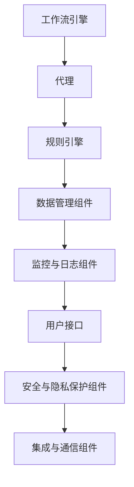

                 

## 文章标题

### 《AI人工智能代理工作流AI Agent WorkFlow：面向服务计算中的代理工作流管理》

在当今数字化、网络化和智能化的大趋势下，人工智能（AI）技术正逐渐渗透到各个领域，推动着各行各业的创新与变革。其中，AI人工智能代理工作流（AI Agent WorkFlow）作为服务计算中的重要组成部分，正成为提高工作效率、优化业务流程和实现智能化的关键手段。本文将围绕AI人工智能代理工作流这一主题，系统地探讨其在服务计算中的应用与实践。

### 关键词

- **AI人工智能代理**
- **代理工作流**
- **服务计算**
- **工作流管理**
- **自动化**
- **安全性**

### 摘要

本文旨在深入探讨AI人工智能代理工作流在服务计算中的应用与实践。文章首先介绍了AI人工智能代理的基本概念、类型和工作原理，随后详细阐述了代理工作流管理理论，包括其管理原则、方法、优点和挑战。接着，文章探讨了服务计算的基础知识，包括服务计算的概念、关键技术、优势与挑战，以及其在代理工作流中的应用。文章接下来分为三个部分，分别介绍了AI代理工作流的架构设计、管理策略、安全与隐私保护，并通过实际项目案例进行了详细分析。最后，文章探讨了AI代理工作流与新兴技术（如区块链、云计算、大数据）的融合，以及其在物联网和边缘计算中的未来发展趋势。

通过本文的阅读，读者可以全面了解AI人工智能代理工作流的理论基础、技术实现、管理策略和实践应用，为在相关领域开展深入研究和技术创新提供指导。

### 《AI人工智能代理工作流AI Agent WorkFlow：面向服务计算中的代理工作流管理》目录大纲

#### 第一部分：基础理论

##### 第1章 AI人工智能代理概述
- 1.1 AI人工智能代理的定义
- 1.2 AI人工智能代理的类型
- 1.3 AI人工智能代理的工作原理
- 1.4 AI人工智能代理的发展历史
- 1.5 AI人工智能代理的重要性与应用

##### 第2章 代理工作流管理理论
- 2.1 代理工作流的概念
- 2.2 代理工作流的管理原则
- 2.3 代理工作流的管理方法
- 2.4 代理工作流的优点与挑战
- 2.5 代理工作流的发展趋势

##### 第3章 服务计算基础
- 3.1 服务计算的概念
- 3.2 服务计算的关键技术
- 3.3 服务计算的优势与挑战
- 3.4 服务计算的应用领域

#### 第二部分：技术实现

##### 第4章 AI代理工作流的架构设计
- 4.1 AI代理工作流的整体架构
- 4.2 AI代理的工作流程
- 4.3 AI代理工作流的组件设计
- 4.4 AI代理工作流的性能优化

##### 第5章 AI代理工作流的管理策略
- 5.1 代理工作流管理策略概述
- 5.2 代理任务调度策略
- 5.3 代理任务优先级策略
- 5.4 代理故障恢复策略

##### 第6章 AI代理工作流的安全与隐私保护
- 6.1 代理工作流的安全威胁
- 6.2 代理工作流的安全策略
- 6.3 代理工作流的隐私保护机制
- 6.4 代理工作流的合规性管理

##### 第7章 AI代理工作流项目实践
- 7.1 AI代理工作流项目的规划
- 7.2 AI代理工作流项目的实施
- 7.3 AI代理工作流项目的测试
- 7.4 AI代理工作流项目的部署

#### 第三部分：前沿技术探讨

##### 第8章 AI代理工作流与区块链技术
- 8.1 区块链技术概述
- 8.2 区块链在代理工作流中的应用
- 8.3 区块链与AI代理工作流的融合

##### 第9章 AI代理工作流与云计算
- 9.1 云计算概述
- 9.2 云计算在代理工作流中的应用
- 9.3 云计算与AI代理工作流的优化

##### 第10章 AI代理工作流与大数据分析
- 10.1 大数据分析概述
- 10.2 大数据分析在代理工作流中的应用
- 10.3 大数据分析与AI代理工作流的协同

##### 第11章 AI代理工作流与物联网
- 11.1 物联网概述
- 11.2 物联网在AI代理工作流中的应用
- 11.3 AI代理工作流与物联网的融合

##### 第12章 AI代理工作流与边缘计算
- 12.1 边缘计算概述
- 12.2 边缘计算在AI代理工作流中的应用
- 12.3 AI代理工作流与边缘计算的融合

##### 第13章 AI代理工作流的标准化与规范化
- 13.1 标准化与规范化的概念
- 13.2 AI代理工作流标准化的意义
- 13.3 AI代理工作流规范化的意义
- 13.4 AI代理工作流的标准与规范

##### 第14章 AI代理工作流的社会影响与伦理问题
- 14.1 AI代理工作流的社会影响
- 14.2 AI代理工作流的伦理问题
- 14.3 AI代理工作流的伦理规范
- 14.4 AI代理工作流的法律法规

##### 第15章 AI代理工作流的发展趋势与未来展望
- 15.1 AI代理工作流的发展趋势
- 15.2 AI代理工作流的关键技术
- 15.3 AI代理工作流的未来展望
- 15.4 AI代理工作流的发展策略
- 15.5 AI代理工作流的挑战与机遇
- 15.6 AI代理工作流的发展蓝图
- 15.7 AI代理工作流的影响与贡献

#### 附录
##### 附录A AI代理工作流开发工具与资源
- A.1 AI代理工作流开发工具
- A.2 开源代理工作流管理系统
- A.3 AI代理工作流相关论文与书籍
- A.4 AI代理工作流开发资源
- A.5 小结

##### 附录B AI代理工作流项目管理与实施
- B.1 项目管理的概念与原则
- B.2 项目管理流程
- B.3 项目计划与风险评估
- B.4 项目团队建设与管理
- B.5 项目进度控制与质量管理
- B.6 项目成本管理
- B.7 项目沟通与报告
- B.8 项目文档管理
- B.9 项目实施中的问题与解决
- B.10 项目成功的关键因素
- B.11 项目实施案例分析
- B.12 项目评估与改进
- B.13 小结

### 第1章 AI人工智能代理概述

#### 1.1 AI人工智能代理的定义

AI人工智能代理，也称为智能代理，是指通过人工智能技术构建的具有自主性、智能性和交互性的代理实体。它能够模拟人类的思维和行为，根据环境变化自主地做出决策，并在复杂、动态和不确定的情境中执行任务。智能代理通常由感知、推理、学习和行动等模块组成，具备感知环境、理解任务、做出决策和执行动作的能力。

智能代理的基本定义可以从以下几个方面来理解：

- **自主性**：智能代理具有独立决策能力，能够根据内外部环境的变化自主地选择行动方案。
- **智能性**：智能代理通过学习算法和推理机制，能够理解任务要求、分析问题和制定解决方案。
- **交互性**：智能代理能够与人类或其他系统进行有效交互，获取必要信息并反馈执行结果。

智能代理与传统的代理概念有所不同。传统代理主要依赖于预先定义的规则和任务，而智能代理则通过机器学习、自然语言处理和深度学习等技术，实现了对复杂情境的智能处理和动态响应。

#### 1.2 AI人工智能代理的类型

AI人工智能代理可以根据其自主性和智能性水平，分为以下几种类型：

- **自主代理（Autonomous Agent）**：自主代理是最高级别的智能代理，它完全自主地执行任务，不需要人为干预。自主代理通常具备高级感知、学习和决策能力，能够根据环境变化动态调整行为策略。例如，自动驾驶汽车、智能家居中的智能机器人等。

- **半自主代理（Semi-Autonomous Agent）**：半自主代理在执行任务时需要一定程度的人为干预。它们通常具有较低的自主性，但在某些特定情境下能够自主决策。例如，自动驾驶汽车中的部分功能模块，如路径规划和障碍物检测，可以由智能代理完成，而驾驶决策则需要人类驾驶员参与。

- **受控代理（Controlled Agent）**：受控代理是最低级别的智能代理，它们的行动受到严格限制，通常只能执行预定义的任务。受控代理不具备自主决策能力，其行为完全依赖于外部系统的指令。例如，自动化生产线中的机器人，其行为由预设程序控制。

- **交互式代理（Interactive Agent）**：交互式代理是一种特殊类型的智能代理，它们不仅具备自主决策能力，还能与人类进行有效交互。交互式代理通常用于人机交互系统，如虚拟助手、智能客服等。

这些不同类型的智能代理在应用场景和技术实现上有所差异，但都体现了人工智能在代理领域的广泛应用和巨大潜力。

#### 1.3 AI人工智能代理的工作原理

AI人工智能代理的工作原理主要包括感知、推理、学习和行动等模块。下面详细描述这些模块的功能和相互关系：

- **感知模块（Perception Module）**：感知模块是智能代理的“感官”，用于收集外部环境的信息。感知模块可以通过各种传感器（如摄像头、麦克风、温度传感器等）获取视觉、听觉、触觉等数据，并将其转换为计算机可以处理的形式。例如，自动驾驶汽车中的感知模块可以实时检测路面状况、交通标志和行人等信息。

- **推理模块（Reasoning Module）**：推理模块是智能代理的“大脑”，用于对感知模块收集的信息进行分析和判断。推理模块通过机器学习和自然语言处理等技术，从感知数据中提取有用信息，并根据预定的目标和规则进行决策。例如，智能代理可以分析路况信息，判断是否需要减速或变道。

- **学习模块（Learning Module）**：学习模块是智能代理的“记忆”，用于从经验和数据中不断学习和改进。学习模块可以通过监督学习、无监督学习和强化学习等方法，从历史数据中学习规律和模式，提高自身的决策能力。例如，智能代理可以在多次自动驾驶过程中，学习如何更好地应对不同路况和场景。

- **行动模块（Action Module）**：行动模块是智能代理的“肢体”，用于执行推理模块做出的决策。行动模块通过控制执行器（如电机、液压系统等）来实施具体行动。例如，自动驾驶汽车的行动模块可以根据推理模块的决策，控制方向盘、油门和刹车等。

感知模块、推理模块、学习模块和行动模块相互协作，构成了智能代理的核心工作流程。感知模块获取环境信息，推理模块分析信息并做出决策，学习模块不断改进决策能力，行动模块执行决策并反馈执行结果。通过这样的闭环系统，智能代理能够实现对复杂环境的自主学习和动态响应。

#### 1.4 AI人工智能代理的发展历史

AI人工智能代理的概念最早可以追溯到20世纪80年代，当时计算机科学家和人工智能研究者开始探讨如何构建具有自主性和智能性的代理系统。以下简要回顾了AI人工智能代理的发展历程：

- **早期探索（1980s）**：20世纪80年代，随着计算机硬件和人工智能技术的不断发展，研究者开始尝试构建简单的智能代理系统。早期的智能代理主要基于规则推理和专家系统技术，能够执行简单的任务。例如，Erica是早期的一个著名的交互式代理系统，由Bradley和Mann于1982年开发，主要用于模拟人机交互场景。

- **代理系统的发展（1990s）**：20世纪90年代，随着分布式计算和网络技术的发展，智能代理的研究逐渐从单一系统的探索转向分布式代理系统的构建。这一时期，研究者开始关注代理的通信、协作和安全性等问题。例如，FIPA（Foundation for Intelligent Physical Agents）制定了早期的智能代理通信标准，促进了代理技术的标准化和互操作性。

- **智能代理的应用（2000s）**：进入21世纪，智能代理技术逐渐应用于实际场景，如电子商务、远程控制和智能家居等。这一时期，智能代理的发展得益于机器学习、自然语言处理和计算机视觉等技术的突破。例如，Amazon的智能客服Alexa和Google的智能助手Google Assistant，都是基于智能代理技术实现的。

- **智能代理的智能化（2010s-2020s）**：近年来，随着人工智能技术的迅猛发展，智能代理的智能化水平得到了显著提升。深度学习和强化学习等先进技术的应用，使得智能代理能够处理更复杂的任务，具备更强的自主性和学习能力。例如，自动驾驶汽车、智能医疗诊断系统和智能金融风控系统，都是智能代理技术的重要应用领域。

AI人工智能代理的发展历程反映了计算机技术和人工智能技术的不断进步。从早期的简单规则推理到现在的深度学习和强化学习，智能代理在智能化和自主性方面取得了显著的进展，为各行业的智能化转型提供了强大的技术支持。

#### 1.5 AI人工智能代理的重要性与应用

AI人工智能代理在现代技术和社会中具有重要性和广泛应用。以下从以下几个方面详细探讨其重要性与应用：

**提高工作效率**：智能代理通过自动化执行重复性高、劳动强度大的任务，可以显著提高工作效率。例如，在电子商务领域，智能代理可以自动化处理订单处理、库存管理和客户服务等任务，减少人为操作的错误和耗时。

**简化复杂任务**：智能代理能够处理复杂的计算任务，将复杂的决策过程简化为自动化流程。例如，在金融行业，智能代理可以自动化进行市场数据分析、投资组合优化和风险评估等任务，帮助金融专家做出更明智的决策。

**数据分析和处理**：智能代理通过机器学习和数据挖掘技术，能够从大量数据中提取有价值的信息，为决策提供支持。例如，在医疗领域，智能代理可以分析患者的病历数据，预测疾病发展趋势，为医生提供诊断和治疗建议。

**在线服务与交互**：智能代理可以作为虚拟助手或智能客服，提供24/7的在线服务，与用户进行自然语言交互，解决用户问题和提供个性化服务。例如，在零售行业，智能代理可以回答顾客的问题、推荐商品和提供购物建议，提升用户体验。

**智能协同与辅助**：智能代理可以通过与人类专家协作，提供智能化的辅助和支持，提高整体工作效率。例如，在企业管理中，智能代理可以辅助管理者进行日程安排、任务分配和决策支持，提升管理效率。

**未来展望**：随着人工智能技术的不断进步，智能代理将在更多领域得到广泛应用。例如，在智能制造领域，智能代理可以协助生产流程优化、设备维护和故障诊断；在智慧城市领域，智能代理可以协助城市管理、交通监控和环境监测等任务。

总之，AI人工智能代理以其高效性、智能化和灵活性，正在深刻改变各行各业的工作方式和商业模式，为人类带来更高的生产力和生活质量。

#### 1.6 代理工作流的概念

代理工作流（Agent Workflow）是指由智能代理（Agent）执行的一系列任务或活动的有序序列，旨在实现特定的业务目标或服务需求。代理工作流的概念基于智能代理技术，通过定义和编排一系列自动化任务，实现复杂业务流程的自动化和智能化。

代理工作流的主要组成部分包括：

1. **代理（Agent）**：代理是代理工作流的核心组件，具有自主性、智能性和交互性。代理可以是软件程序、机器人或虚拟助手，能够根据任务需求自主执行任务、处理数据和与环境交互。

2. **任务（Task）**：任务是指代理需要执行的具体操作或活动。任务可以包括数据处理、信息检索、决策制定、用户交互等，是实现业务目标的基本单元。

3. **流程（Workflow）**：流程是指任务之间的逻辑关系和执行顺序。代理工作流通过定义任务的执行顺序、条件分支和并行执行，实现业务流程的自动化和智能化。

4. **规则（Rule）**：规则是指定义任务执行条件和决策逻辑的约束条件。代理工作流通过规则来指导代理如何根据不同情况执行任务，提高决策的准确性和效率。

5. **监控（Monitoring）**：监控是指对代理工作流执行过程的实时监控和反馈。通过监控，可以及时发现异常、故障和性能问题，并采取相应的措施进行纠正和优化。

6. **日志（Logging）**：日志是指记录代理工作流执行过程中产生的事件和状态变化。通过日志，可以追溯工作流的执行历史，分析和优化工作流的设计和执行。

代理工作流的核心功能包括：

1. **任务分配**：代理工作流可以根据任务的优先级、执行条件和资源需求，将任务合理分配给不同的代理或代理组，提高任务执行的效率。

2. **任务调度**：代理工作流可以根据任务的执行时间和优先级，对任务进行动态调度，确保关键任务及时完成。

3. **任务监控**：代理工作流可以实时监控任务的执行状态，及时发现和处理异常情况，确保工作流的稳定运行。

4. **任务反馈**：代理工作流可以根据任务的执行结果和用户反馈，对工作流进行调整和优化，提高工作流的灵活性和适应性。

5. **流程优化**：代理工作流可以根据历史数据和执行情况，对工作流进行自动化优化，提高工作流的效率和性能。

代理工作流在服务计算中的应用，主要表现在以下几个方面：

1. **服务自动化**：代理工作流可以将复杂的服务请求分解为多个简单任务，通过智能代理自动执行，实现服务的自动化和智能化。

2. **业务流程管理**：代理工作流可以整合企业内部的各种业务流程，实现业务流程的自动化和优化，提高企业的运营效率。

3. **服务质量管理**：代理工作流可以通过监控和反馈机制，实时跟踪服务的执行情况和用户反馈，提高服务的质量和用户满意度。

4. **跨领域协作**：代理工作流可以实现不同部门、不同系统和不同企业的协作，实现跨领域的业务流程整合和服务交付。

5. **智能决策支持**：代理工作流可以通过数据分析和机器学习等技术，为管理者提供智能决策支持，优化业务策略和资源配置。

总之，代理工作流是服务计算中的重要组成部分，通过智能代理和自动化任务的编排，实现了业务流程的智能化和管理效率的提升。随着人工智能技术的不断发展，代理工作流在服务计算中的应用前景将更加广阔。

#### 1.7 代理工作流在服务计算中的应用

服务计算（Service Computing）是一种基于服务的计算范式，通过将软件功能模块化为可重用的服务，实现分布式系统中的协同计算。代理工作流在服务计算中具有重要作用，能够有效提升服务自动化、业务流程管理和跨领域协作的能力。以下是代理工作流在服务计算中的应用：

**服务自动化**：在服务计算环境中，代理工作流可以将复杂的服务请求分解为多个简单任务，通过智能代理自动执行，实现服务的自动化。例如，在电子商务系统中，代理工作流可以自动化处理订单生成、支付验证和库存更新等任务，提高服务响应速度和用户体验。

**业务流程管理**：代理工作流可以整合企业内部的各种业务流程，通过智能代理的协同工作，实现业务流程的自动化和优化。例如，在金融服务领域，代理工作流可以自动化处理贷款申请、风险评估和审批流程，提高业务效率。

**服务质量管理**：代理工作流可以通过监控和反馈机制，实时跟踪服务的执行情况和用户反馈，提高服务的质量和用户满意度。例如，在电信行业中，代理工作流可以监控网络服务质量，自动化处理用户投诉和故障修复，确保网络服务的稳定和可靠。

**跨领域协作**：代理工作流可以实现不同部门、不同系统和不同企业的协作，实现跨领域的业务流程整合和服务交付。例如，在供应链管理中，代理工作流可以协调供应商、制造商和分销商之间的信息共享和任务分配，实现供应链的自动化和优化。

**智能决策支持**：代理工作流可以通过数据分析和机器学习等技术，为管理者提供智能决策支持，优化业务策略和资源配置。例如，在物流管理中，代理工作流可以分析运输数据，自动化制定最优的配送路线和仓储策略，提高物流效率。

**服务组合**：代理工作流可以与服务组合技术相结合，实现灵活的服务配置和定制。例如，在云计算环境中，代理工作流可以根据用户需求，动态组合和部署不同的云计算服务，提供个性化的服务体验。

**智能代理协同**：代理工作流可以促进智能代理之间的协同工作，提高整体系统的智能化水平。例如，在智能城市中，代理工作流可以协调不同智能系统（如交通管理、环境监测和安防监控）之间的信息共享和任务分配，实现城市管理的智能化。

总之，代理工作流在服务计算中的应用，不仅提高了服务的自动化和智能化水平，还优化了业务流程管理和跨领域协作，为各行业的数字化转型提供了有力支持。

#### 1.8 AI代理工作流的典型应用场景

AI代理工作流具有广泛的应用场景，能够显著提升各行业的效率和服务质量。以下列举几个典型的应用场景：

**企业管理**：在企业管理中，AI代理工作流可以自动化处理日常运营任务，如员工考勤管理、办公设备维护、采购订单处理等。通过智能代理的协同工作，企业可以大幅减少人工操作，降低运营成本，提高管理效率。

**金融服务**：金融行业具有高度复杂的业务流程，AI代理工作流可以自动化处理金融交易、风险评估、贷款审批等任务。智能代理能够实时分析市场数据，为金融决策提供支持，提高金融服务质量和风险控制能力。

**健康护理**：在健康护理领域，AI代理工作流可以协助医生进行诊断、治疗和康复管理。智能代理可以通过分析患者的病历数据，提供个性化的健康建议，提高医疗服务的精准性和有效性。

**教育领域**：在教育领域，AI代理工作流可以自动化处理教学任务，如课程安排、学生成绩管理、考试安排等。智能代理可以为学生提供个性化学习建议，提高学习效果，同时减轻教师的工作负担。

**供应链管理**：在供应链管理中，AI代理工作流可以协调供应链各个环节，如采购、库存管理、物流配送等。智能代理能够实时监控供应链状态，自动化调整策略，提高供应链的灵活性和响应速度。

**智能交通**：智能交通系统可以通过AI代理工作流实现交通流量监控、路况预测和交通信号控制。智能代理可以自动化处理交通事故响应、交通调度等任务，提高交通管理效率和安全性。

**智能家居**：在智能家居领域，AI代理工作流可以自动化管理家庭设备和系统，如照明、温度控制、安防监控等。智能代理可以基于用户习惯和环境变化，提供个性化的家居服务，提高生活质量。

**公共安全**：公共安全领域可以通过AI代理工作流实现安防监控、应急响应和事件处理。智能代理可以实时分析监控数据，自动化触发应急响应措施，提高公共安全保障能力。

**智能制造**：在智能制造中，AI代理工作流可以自动化处理生产任务，如设备监控、质量检测、故障诊断等。智能代理能够实时调整生产计划，优化生产流程，提高生产效率和质量。

**智慧城市**：智慧城市通过AI代理工作流实现城市管理的智能化，如交通管理、环境监测、公共服务等。智能代理可以协同工作，提供高效、智能的城市服务，提高城市治理水平。

这些应用场景展示了AI代理工作流在提升行业效率和服务质量方面的巨大潜力。随着人工智能技术的不断发展，AI代理工作流将在更多领域得到广泛应用。

#### 1.9 AI代理工作流的优势

AI代理工作流凭借其自动化、灵活性、可扩展性和适应性，在各个领域展现出了显著的优势，下面详细探讨这些优势：

**自动化**：AI代理工作流能够自动化处理重复性高、劳动强度大的任务，减少人为干预，提高工作效率。通过智能代理的协同工作，复杂的业务流程可以简化为一系列自动化任务，实现高度自动化和智能化。

**灵活性**：AI代理工作流可以根据业务需求和环境变化动态调整任务执行顺序和策略，具备高度的灵活性。智能代理能够根据实时数据和环境信息，自主地调整工作流程，满足不同场景下的需求。

**可扩展性**：AI代理工作流设计时考虑了模块化和可扩展性，能够方便地集成新的功能和代理，满足业务发展的需求。通过灵活的工作流编排，企业可以轻松扩展工作流功能，适应不断变化的市场需求。

**适应性**：AI代理工作流通过机器学习和数据挖掘技术，能够从历史数据和执行情况中学习，提高工作流的适应能力。智能代理能够根据经验和反馈，不断优化工作流程，提高任务执行的成功率和效率。

**提高工作效率**：AI代理工作流通过自动化和智能化的任务执行，显著提高了工作效率，减少了人为操作的错误和耗时。智能代理可以24/7不间断地执行任务，确保业务流程的高效运行。

**优化业务流程**：AI代理工作流能够整合企业内部的各种业务流程，实现流程的自动化和优化。通过智能代理的协同工作，企业可以简化业务流程，提高运营效率，降低运营成本。

**提高服务质量**：AI代理工作流通过实时监控和反馈机制，能够及时发现和处理异常情况，提高服务的质量和用户满意度。智能代理可以提供个性化的服务，提升用户体验。

**跨领域协作**：AI代理工作流可以实现不同部门、不同系统和不同企业之间的协作，打破信息孤岛，实现跨领域的业务流程整合和服务交付。

**智能决策支持**：AI代理工作流通过数据分析和机器学习技术，可以为管理者提供智能决策支持，优化业务策略和资源配置。智能代理可以分析大量数据，发现潜在问题和机会，为决策提供科学依据。

总之，AI代理工作流以其自动化、灵活性、可扩展性和适应性，为各行业的业务流程优化和智能化转型提供了强大支持，带来了显著的经济效益和社会价值。

#### 1.10 AI代理工作流的挑战

尽管AI代理工作流在提高工作效率、优化业务流程和服务质量方面具有显著优势，但其在实际应用中仍面临一系列挑战。以下详细探讨这些挑战：

**安全性**：智能代理在工作流中处理敏感数据和执行关键任务，可能导致数据泄露和系统被攻击。确保智能代理的安全性和数据保护成为重要挑战，需要建立严格的安全机制和防护措施。

**隐私保护**：智能代理在工作流中涉及个人和企业数据，如何有效保护隐私成为关键问题。隐私保护机制需要满足法律法规要求，同时确保数据的有效利用和系统性能。

**法律法规合规**：随着AI代理工作流的应用日益广泛，法律法规的合规性成为重要挑战。不同国家和地区对数据保护、隐私和安全的法律法规有所不同，需要确保代理工作流的设计和实施符合相关法规要求。

**技术更新与维护**：人工智能技术发展迅速，智能代理的工作流系统需要不断更新和升级，以适应新技术的发展。技术更新和维护成本高，且可能导致系统不稳定，影响业务运行。

**系统集成**：AI代理工作流需要与其他系统和设备集成，实现数据共享和协同工作。不同系统和设备的兼容性和互操作性成为挑战，需要解决接口标准、数据格式和通信协议等问题。

**数据质量与完整性**：智能代理工作流依赖于高质量的数据，数据质量差或完整性问题可能导致工作流执行失败。数据质量监控和治理是关键，需要建立数据质量标准和治理机制。

**适应性和可扩展性**：智能代理工作流需要能够适应不断变化的环境和业务需求。如何设计灵活、可扩展的工作流框架，满足不同应用场景的需求，是一个持续的技术挑战。

**用户接受度**：智能代理工作流的应用可能改变用户的传统工作方式，提高用户接受度和适应能力是关键。用户培训和用户体验设计需要得到重视，以确保智能代理工作流的有效应用。

**伦理和社会影响**：智能代理工作流可能引发伦理和社会问题，如就业影响、隐私泄露和决策偏见等。需要建立伦理规范和社会责任框架，确保智能代理工作流的应用符合伦理和社会价值观。

总之，AI代理工作流在带来巨大价值的同时，也面临一系列挑战。通过技术创新、法律法规完善、系统集成优化和用户培训，可以逐步克服这些挑战，推动智能代理工作流的广泛应用。

#### 1.11 AI代理工作流的未来发展趋势

随着人工智能技术的快速发展，AI代理工作流在未来将展现出更加广泛和深入的应用。以下是AI代理工作流未来发展的几个重要趋势：

**人工智能技术的进步**：随着深度学习、强化学习等人工智能技术的不断进步，智能代理的智能化水平将显著提升。智能代理将能够更好地理解复杂任务、自主学习和动态调整策略，提高工作流的管理效率和智能化水平。

**新兴技术的融合**：AI代理工作流将与云计算、大数据、物联网、区块链等新兴技术深度融合。通过这些技术的支持，智能代理将能够处理更多类型的任务，适应更复杂的业务场景，实现更高效的协同工作和数据共享。

**跨领域应用拓展**：AI代理工作流将在更多领域得到广泛应用。例如，在智能制造、智慧城市、健康护理、金融服务等领域，智能代理工作流将帮助企业实现业务流程的自动化和智能化，提高生产效率和服务质量。

**社会影响与伦理问题的考量**：随着AI代理工作流的应用日益广泛，其社会影响和伦理问题也将引起更多关注。如何确保智能代理工作流的安全性和隐私保护，遵循法律法规和社会伦理规范，将成为重要研究课题。

**标准化与规范化**：为了促进AI代理工作流的应用和互操作性，标准化和规范化将成为未来发展的关键。建立统一的技术标准和规范，将有助于提高智能代理工作流的兼容性、可靠性和可维护性。

**持续创新**：AI代理工作流的发展将是一个持续创新的过程。通过不断的技术创新和应用实践，智能代理工作流将不断优化和完善，为各行业的智能化转型提供更强大的支持。

总之，AI代理工作流在未来将展现出广阔的应用前景和巨大的发展潜力。通过技术创新、规范化和跨领域应用，AI代理工作流将在推动智能化发展、提高生产效率和服务质量方面发挥重要作用。

#### 1.12 AI代理工作流与人类协作

AI代理工作流在提高工作效率、优化业务流程的同时，与人类的协作也变得愈发重要。通过智能代理与人类专家的协同工作，可以实现以下几方面的优势：

**代理与人类角色的互动**：智能代理可以承担大量重复性、繁琐的任务，如数据录入、报告生成和初步分析等，从而解放人类专家的时间，使他们能够专注于更高价值的工作，如战略规划、决策制定和复杂问题的解决。

**代理的智能辅助作用**：智能代理通过大数据分析、机器学习和自然语言处理等技术，能够为人类专家提供智能化的辅助和支持。例如，智能代理可以实时监控业务指标，为人类专家提供预警和建议，帮助其做出更明智的决策。

**人类主导与代理协同的工作模式**：在这种工作模式中，人类专家负责制定业务目标和战略规划，智能代理则负责执行具体任务和操作。通过双方的高效协作，企业可以实现业务流程的优化和运营效率的提升。

**协同工作流程的设计**：在设计协同工作流程时，需要考虑人类专家和智能代理的互动和协作模式。例如，可以设计多层次的决策机制，让智能代理在执行任务时自动收集数据，并向人类专家反馈结果，以便人类专家进行进一步分析和决策。

**工作负荷平衡**：通过智能代理与人类专家的协作，可以实现工作负荷的平衡。智能代理可以处理大量基础性任务，人类专家则专注于关键决策和复杂问题，从而提高整体工作效率。

**定制化服务与个性化体验**：智能代理可以根据人类专家的偏好和工作习惯，提供定制化的服务与个性化体验。例如，智能代理可以自动调整工作流程，使其更符合人类专家的日常操作习惯，提高工作效率和满意度。

**持续学习与优化**：智能代理与人类专家的协作过程中，智能代理可以不断学习和优化，以提高任务执行的成功率和效率。人类专家的反馈和经验对智能代理的改进至关重要，通过持续学习和优化，智能代理将变得越来越智能。

总之，AI代理工作流与人类的协作不仅提高了工作效率，还优化了业务流程，为各行业的智能化转型提供了有力支持。通过不断探索和优化，智能代理与人类专家的协作模式将更加成熟和完善。

#### 1.13 AI代理工作流在教育中的应用案例

在教育领域，AI代理工作流的应用正在不断拓展，为教育管理、教学和学生学习提供了有力的支持。以下通过具体案例，探讨AI代理工作流在教育中的应用。

**教学辅助代理**：在教育管理中，AI代理可以自动化处理大量日常事务，如课程安排、考勤管理、成绩统计等。例如，某高校引入了AI教学辅助代理，用于自动安排课程表，优化教学资源分配。该代理通过分析教师的教学任务和学生选课情况，自动生成最优的课程表，提高教学效率。

**学习资源管理代理**：AI代理还可以管理学生的学习资源，如电子书籍、学习视频和在线课程。例如，某在线教育平台利用AI代理自动分类和推荐学习资源，根据学生的学习进度、兴趣和需求，提供个性化的学习建议。学生可以通过代理访问到最适合的学习材料，提高学习效果。

**个性化教育代理**：在个性化教育中，AI代理可以根据每个学生的学习特点和需求，制定个性化的学习计划。例如，某在线教育平台引入了AI个性化教育代理，通过分析学生的学习数据，自动生成个性化的学习路径和任务。学生可以根据自己的学习进度和需求，灵活调整学习计划，实现个性化学习。

**学习反馈与评估代理**：AI代理可以为学生提供即时反馈和评估，帮助他们了解自己的学习情况。例如，某在线教育平台利用AI代理自动批改作业和考试，提供详细的反馈和评分。学生可以通过代理了解自己的学习弱点，针对性地进行复习和提高。

**学生行为分析代理**：AI代理还可以分析学生的学习行为，识别潜在的学习问题，提供针对性的支持。例如，某在线教育平台利用AI代理对学生学习行为进行分析，识别出学习兴趣不高、学习效果较差的学生，并为他们提供额外的辅导和资源支持。

**在线学习与互动代理**：在在线学习中，AI代理可以提供实时互动和支持，提高学生的参与度和学习体验。例如，某在线教育平台引入了AI互动代理，用于在线答疑、学习讨论和互动教学。代理可以自动识别学生的问题，并提供详细的解答和推荐学习资源，帮助学生更好地理解和掌握知识。

**教学数据管理与分析代理**：AI代理可以收集和分析教学数据，为教师和教育管理者提供决策支持。例如，某教育机构引入了AI代理进行教学数据分析，帮助教师了解学生的学习情况、教学效果和课程满意度。教育管理者可以根据数据分析结果，调整教学策略和资源分配，提高教学质量。

**远程教学与协作代理**：在远程教学中，AI代理可以协助教师进行在线授课、互动和协作。例如，某在线教育平台利用AI代理提供实时视频直播、在线讨论和协作工具，让学生和教师能够随时随地参与学习，提高教学效果。

总之，AI代理工作流在教育中的应用，不仅提高了教育管理的效率，还优化了教学过程，提供了个性化的学习体验。通过具体案例的实践，AI代理工作流正在深刻改变教育领域的工作方式和教学模式。

#### 1.14 AI代理工作流在企业管理中的应用案例

在企业管理中，AI代理工作流的应用正在成为提高运营效率、降低成本和优化业务流程的重要手段。以下通过具体案例，探讨AI代理工作流在企业管理中的应用。

**企业运营管理代理**：某大型制造企业引入了AI代理工作流，用于自动化处理日常运营任务。AI代理工作流能够自动收集生产数据、监控设备状态、优化生产计划等，提高生产效率。例如，AI代理可以实时监控生产设备的运行情况，自动识别设备故障并进行预警，避免生产中断。

**客户服务代理**：在客户服务方面，AI代理工作流可以提供智能客服支持，提高客户满意度。例如，某电信公司引入了AI客服代理，用于处理客户咨询、投诉和售后服务。AI代理能够自动识别客户问题，提供详细的解答和解决方案，减少客户等待时间，提高服务质量。

**供应链管理代理**：在供应链管理中，AI代理工作流可以自动化处理采购、库存管理和物流配送等任务，提高供应链效率。例如，某零售企业引入了AI代理工作流，用于实时监控库存水平、自动生成采购订单和优化物流配送路线。AI代理可以确保库存水平合理，降低库存成本，提高物流效率。

**人力资源管理代理**：在人力资源管理中，AI代理工作流可以自动化处理招聘、薪酬管理和员工培训等任务，提高人力资源管理效率。例如，某科技企业引入了AI代理工作流，用于自动处理招聘流程，包括职位发布、简历筛选和面试安排。AI代理可以快速筛选合适的候选人，提高招聘效率。

**财务管理代理**：在财务管理中，AI代理工作流可以自动化处理财务报表、预算编制和资金管理等工作，提高财务效率。例如，某金融机构引入了AI代理工作流，用于自动生成财务报表、分析财务数据并制定预算。AI代理可以确保财务数据的准确性和及时性，提高财务决策的准确性。

**市场营销代理**：在市场营销中，AI代理工作流可以自动化处理市场调研、客户分析和广告投放等工作，提高营销效果。例如，某互联网企业引入了AI代理工作流，用于自动分析市场数据、识别潜在客户并制定个性化营销策略。AI代理可以精准定位客户需求，提高营销效果。

**项目管理代理**：在项目管理中，AI代理工作流可以自动化处理项目计划、任务分配和进度监控等工作，提高项目效率。例如，某建筑企业引入了AI代理工作流，用于自动生成项目计划、分配任务并监控项目进度。AI代理可以确保项目按时完成，提高项目管理效率。

**数据分析和决策支持代理**：在数据分析和决策支持方面，AI代理工作流可以自动化处理大量数据，提供决策支持。例如，某零售企业引入了AI代理工作流，用于自动分析销售数据、库存数据和客户行为数据，为企业提供科学的决策支持。

**应急响应代理**：在应急响应方面，AI代理工作流可以自动化处理突发事件和危机管理任务，提高应急响应能力。例如，某医疗机构引入了AI代理工作流，用于自动处理突发疫情、病人调度和物资管理等任务。AI代理可以快速响应突发事件，确保应急工作的有序进行。

总之，AI代理工作流在企业管理中的应用，不仅提高了运营效率、降低了成本，还优化了业务流程和决策过程。通过具体案例的实践，AI代理工作流正在深刻改变企业管理的方式和模式，为企业带来显著的经济效益和管理提升。

#### 1.15 AI代理工作流在社会服务中的应用案例

在社会服务领域，AI代理工作流的应用为公共服务、社区服务和应急响应等带来了显著改善。以下通过具体案例，探讨AI代理工作流在社会服务中的应用。

**公共服务代理**：在公共服务方面，AI代理工作流可以自动化处理市民咨询、审批服务和投诉处理等任务，提高服务效率。例如，某市政府引入了AI代理工作流，用于自动化处理市民的政务咨询和审批服务。AI代理可以24小时在线服务，快速响应市民的咨询，提高政府服务的便捷性和满意度。

**社区服务代理**：在社区服务中，AI代理工作流可以提供智能化的社区管理和服务。例如，某社区服务中心引入了AI代理工作流，用于管理社区资源、协调社区活动和提供紧急救援服务。AI代理可以自动监测社区安全状况，及时响应居民的需求，提高社区服务的质量和效率。

**应急响应代理**：在应急响应方面，AI代理工作流可以自动化处理突发事件和灾害响应任务，提高应急响应能力。例如，某城市应急管理平台引入了AI代理工作流，用于自动处理突发事件报告、资源调度和应急指挥。AI代理可以快速识别突发事件，自动生成应急响应计划，提高应急响应速度和效率。

**医疗服务代理**：在医疗服务中，AI代理工作流可以提供智能化的诊断、治疗和康复管理服务。例如，某医院引入了AI代理工作流，用于自动化处理患者挂号、预约和就诊流程。AI代理可以分析患者病历，提供个性化的治疗方案，提高医疗服务质量和效率。

**社会保障代理**：在社会保障方面，AI代理工作流可以自动化处理社会保障金发放、失业救济和养老保险等任务，提高社会保障效率。例如，某社会保障机构引入了AI代理工作流，用于自动化处理社会保障金的申请和发放。AI代理可以快速审核申请，确保社会保障金的准确发放。

**环境保护代理**：在环境保护方面，AI代理工作流可以提供智能化的环境监测和污染治理服务。例如，某环保部门引入了AI代理工作流，用于自动化处理环境监测数据和污染源监控。AI代理可以实时监测环境质量，自动生成污染治理方案，提高环境保护效率。

**教育服务代理**：在教育服务中，AI代理工作流可以提供智能化的教育管理和服务。例如，某教育局引入了AI代理工作流，用于自动化处理学生报名、成绩管理和考试安排等任务。AI代理可以确保教育管理的高效和准确，提高教育服务质量。

**社会福利代理**：在社会福利方面，AI代理工作流可以提供智能化的福利发放和救助服务。例如，某社会福利机构引入了AI代理工作流，用于自动化处理福利申请和救助发放。AI代理可以快速审核申请，确保福利的准确发放，提高社会福利的覆盖率和满意度。

总之，AI代理工作流在社会服务中的应用，不仅提高了公共服务和社区服务的效率和质量，还优化了应急响应和社会治理。通过具体案例的实践，AI代理工作流正在为社会服务带来深刻的变革和创新。

#### 1.16 AI代理工作流的跨领域应用展望

AI代理工作流在各个领域的广泛应用已充分展示了其潜力，未来的跨领域应用将进一步拓展其影响。以下从几个关键方面探讨AI代理工作流在跨领域应用中的前景：

**跨行业协同**：随着人工智能、云计算、大数据等技术的不断进步，AI代理工作流将在不同行业之间实现更紧密的协同。例如，在智能制造、金融服务、健康护理和物流等行业，智能代理可以通过跨领域的数据共享和协同工作，实现资源的优化配置和业务流程的自动化，推动产业协同和跨界合作。

**新兴领域探索**：AI代理工作流将在新兴领域如智慧城市、智能交通和智能医疗等领域得到深入探索。智慧城市中，智能代理可以协同工作，实现城市管理的智能化，如交通流量监控、环境监测和公共安全等。智能交通领域，智能代理可以通过优化交通信号控制和车辆调度，提高交通效率。智能医疗中，智能代理可以协助医生进行诊断、治疗和康复管理，提高医疗服务质量和效率。

**未来社会的影响**：随着AI代理工作流在各个领域的广泛应用，将深刻改变未来社会的生产方式、生活方式和治理模式。例如，智能代理可以在生产领域实现高效的生产流程和资源优化，提高生产效率；在生活领域，智能代理可以提供个性化、智能化的生活服务，提高生活质量；在治理领域，智能代理可以协助政府实现智能化的社会治理和公共服务，提高治理能力。

**技术融合与创新**：未来，AI代理工作流将与其他前沿技术如区块链、物联网和边缘计算等深度融合，实现更高效、更智能的应用。例如，区块链技术可以确保数据的安全性和隐私保护，与AI代理工作流结合，实现更可靠、更透明的跨领域协作；物联网技术可以提供实时、准确的数据采集和传输，与AI代理工作流结合，实现智能化的实时监控和响应。

**社会责任与伦理问题**：随着AI代理工作流在跨领域应用中的深入，如何确保其安全性和隐私保护，遵循社会责任和伦理规范，将成为重要课题。需要建立完善的法律体系和伦理规范，确保AI代理工作流的应用不会对人类和社会带来负面影响。

总之，AI代理工作流在跨领域应用中的前景广阔，随着技术的不断进步和应用的深入，将在更多领域实现协同创新和突破，为社会带来更加智能、高效和可持续的未来。

#### 1.17 小结

本章首先介绍了AI人工智能代理的基本概念、类型和工作原理，帮助读者理解智能代理的定义及其在服务计算中的应用。随后，详细探讨了代理工作流管理理论，包括代理工作流的概念、管理原则、方法、优点和挑战。接着，介绍了服务计算的基础知识，包括服务计算的概念、关键技术、优势与挑战，以及其在代理工作流中的应用。

在本章的结尾，我们列举了AI代理工作流的典型应用场景，并探讨了其优势以及面临的挑战。此外，还展望了AI代理工作流未来的发展趋势，包括人工智能技术的进步、新兴技术的融合、跨领域应用拓展、社会影响与伦理问题的考量、标准化与规范化，以及持续创新等方面。

通过对本章内容的深入学习，读者可以对AI代理工作流有一个全面的理解，认识到其在服务计算中的重要性，并为其未来的发展做好准备。在后续章节中，我们将进一步探讨AI代理工作流的技术实现、管理策略、安全与隐私保护，以及与前沿技术的融合，以期为读者提供更加深入的实践指导和理论支持。

#### 1.18 练习题

1. **问答形式**：
   - 请简述AI人工智能代理的定义及其基本类型。
   - 代理工作流的核心功能有哪些？
   - 服务计算的关键技术包括哪些？

2. **练习题**：
   - 设计一个简单的AI代理工作流，用于自动化处理企业内部的采购订单任务。
   - 根据你所学的内容，分析AI代理工作流在健康护理领域的应用场景。

3. **案例分析**：
   - 选择一个具体的行业，分析AI代理工作流在该行业中的应用，并讨论其优势和面临的挑战。

#### 1.19 进一步阅读材料

- **书籍推荐**：
  - 《人工智能：一种现代方法》（作者：Stuart Russell & Peter Norvig）
  - 《服务计算：基础与实践》（作者：托马斯·E·格罗瑟）
  - 《智能代理：技术与应用》（作者：David J. Naumann）

- **研究论文精选**：
  - "AI-Enabled Workflow Systems: A Comprehensive Survey" by Somnath Bhowmick, et al.
  - "Agent-Based Workflow Management Systems: A Systematic Literature Review" by Fabio Anella, et al.
  - "Service-Oriented Architecture: Concepts, Technology, and Design" by Thomas Erl

- **标准与规范指南**：
  - W3C的Web服务标准
  - OMG的BPEL标准
  - IEEE的边缘计算标准

### 第2章 代理工作流管理理论

代理工作流管理理论是AI代理工作流技术的重要组成部分，它涉及到代理工作流的设计、实施、监控和优化。本章将详细探讨代理工作流管理的基本概念、管理原则、方法、优点与挑战，以及其发展趋势。

#### 2.1 代理工作流的概念

代理工作流（Agent Workflow）是指由一组智能代理（Agent）执行的一系列任务或活动的有序序列，旨在实现特定的业务目标或服务需求。在代理工作流中，智能代理具有自主性、智能性和交互性，可以根据预设的规则和条件，自主地执行任务并与其他代理或系统进行交互。

代理工作流的核心组成部分包括：

- **代理（Agent）**：代理是执行任务的基本单元，可以是软件程序、机器人或虚拟助手。代理具备感知、推理、学习和行动的能力，能够根据任务需求和外部环境自主地执行操作。

- **任务（Task）**：任务是指代理需要执行的具体操作或活动。任务可以是简单的数据查询、计算操作，也可以是复杂的决策制定、任务分配和事件处理。

- **流程（Workflow）**：流程是指任务的有序序列和逻辑关系。代理工作流通过定义任务的执行顺序、条件分支和并行执行，实现业务流程的自动化和智能化。

- **规则（Rule）**：规则是指定义任务执行条件和决策逻辑的约束条件。代理工作流通过规则来指导代理如何根据不同情况执行任务，提高决策的准确性和效率。

- **监控（Monitoring）**：监控是指对代理工作流执行过程的实时监控和反馈。通过监控，可以及时发现异常、故障和性能问题，并采取相应的措施进行纠正和优化。

- **日志（Logging）**：日志是指记录代理工作流执行过程中产生的事件和状态变化。通过日志，可以追溯工作流的执行历史，分析和优化工作流的设计和执行。

#### 2.2 代理工作流的管理原则

代理工作流的管理原则是确保工作流高效、稳定和可扩展运行的基础。以下是一些关键的管理原则：

- **系统性**：代理工作流是一个复杂系统，需要从整体上考虑其设计、实施和运行。系统性原则要求在设计和实施过程中，综合考虑各个模块和组件的相互作用，确保工作流的整体性能。

- **可扩展性**：随着业务需求的不断变化，代理工作流需要具备良好的可扩展性，以便添加新的功能和代理，满足不同应用场景的需求。

- **可维护性**：代理工作流在长期运行过程中，可能会遇到各种问题，如代码错误、硬件故障和环境变化等。可维护性原则要求工作流设计时，考虑代码的可读性、模块化和可重用性，确保在出现问题时能够快速定位和修复。

- **可管理性**：代理工作流的管理涉及任务的分配、调度、监控和反馈。可管理性原则要求工作流系统具备良好的管理功能，如任务状态监控、日志记录和异常处理，以便管理员能够实时掌握工作流运行情况。

- **可重复性**：代理工作流的设计和实施需要确保其执行结果的一致性和可重复性。可重复性原则要求工作流在执行过程中，遵循固定的流程和规则，避免人为干预导致的执行结果差异。

#### 2.3 代理工作流的管理方法

代理工作流的管理方法主要包括工作流建模、工作流执行、工作流监控和优化等几个方面：

- **工作流建模**：工作流建模是代理工作流设计的第一步，通过定义任务的执行顺序、条件分支和并行执行，构建工作流的逻辑结构。常见的建模方法包括流程图、状态图和活动图等。

- **工作流执行**：工作流执行是将设计好的工作流部署到代理系统中，并启动任务执行的过程。工作流执行需要考虑任务的分配、调度和执行策略，确保任务能够高效地完成。

- **工作流监控**：工作流监控是指对工作流执行过程的实时监控和反馈。通过监控，可以及时发现异常、故障和性能问题，并采取相应的措施进行纠正和优化。常见的监控指标包括任务状态、执行时间、资源消耗等。

- **工作流优化**：工作流优化是指通过分析工作流执行数据，识别瓶颈和优化机会，对工作流进行优化和改进。常见的优化方法包括任务调度优化、资源分配优化和流程重构等。

#### 2.4 代理工作流的优点与挑战

代理工作流的优点主要体现在以下几个方面：

- **提高工作效率**：通过自动化执行重复性高、劳动强度大的任务，代理工作流能够显著提高工作效率，减少人为干预。

- **优化业务流程**：代理工作流可以将复杂的业务流程分解为简单的任务，通过智能代理的协同工作，实现业务流程的自动化和优化。

- **提高服务质量**：代理工作流通过实时监控和反馈机制，能够及时发现和处理异常情况，提高服务的质量和用户满意度。

- **跨领域协作**：代理工作流可以实现不同部门、不同系统和不同企业之间的协作，实现跨领域的业务流程整合和服务交付。

- **智能决策支持**：通过数据分析和机器学习等技术，代理工作流可以为管理者提供智能决策支持，优化业务策略和资源配置。

然而，代理工作流在实际应用中也面临一系列挑战：

- **安全性**：智能代理在工作流中处理敏感数据和执行关键任务，可能面临数据泄露和系统被攻击的风险。

- **隐私保护**：代理工作流涉及个人和企业数据，如何有效保护隐私成为关键问题。

- **法律法规合规**：不同国家和地区对数据保护、隐私和安全的法律法规有所不同，需要确保代理工作流的设计和实施符合相关法规要求。

- **系统集成**：代理工作流需要与其他系统和设备集成，实现数据共享和协同工作，不同系统和设备的兼容性和互操作性成为挑战。

- **数据质量与完整性**：智能代理工作流依赖于高质量的数据，数据质量差或完整性问题可能导致工作流执行失败。

- **适应性和可扩展性**：如何设计灵活、可扩展的工作流框架，满足不同应用场景的需求，是一个持续的技术挑战。

- **用户接受度**：智能代理工作流的应用可能改变用户的传统工作方式，提高用户接受度和适应能力是关键。

- **伦理和社会影响**：随着AI代理工作流的应用日益广泛，其社会影响和伦理问题将引起更多关注。

#### 2.5 代理工作流的发展趋势

随着人工智能技术的不断进步，代理工作流在未来的发展将更加智能化、多样化和协同化。以下是一些主要的发展趋势：

- **智能化**：随着深度学习、强化学习等人工智能技术的不断发展，智能代理的智能化水平将显著提升，能够处理更复杂的任务和决策。

- **新兴技术的融合**：AI代理工作流将与云计算、大数据、物联网、区块链等新兴技术深度融合，实现更高效、更智能的应用。

- **跨领域应用拓展**：AI代理工作流将在更多领域得到广泛应用，如智能制造、智慧城市、健康护理、金融服务等。

- **标准化与规范化**：为了促进AI代理工作流的应用和互操作性，标准化和规范化将成为未来发展的关键。

- **社会影响与伦理问题的考量**：随着AI代理工作流的应用日益广泛，其社会影响和伦理问题将引起更多关注，需要建立完善的法律法规和伦理规范。

- **持续创新**：AI代理工作流的发展将是一个持续创新的过程，通过不断的技术创新和应用实践，将推动智能代理工作流的广泛应用。

通过本章的详细探讨，读者可以全面了解代理工作流管理理论的基本概念、管理原则、方法、优点与挑战，以及其发展趋势。在后续章节中，我们将进一步探讨AI代理工作流的技术实现、管理策略、安全与隐私保护，以及与前沿技术的融合。

#### 2.6 代理工作流的体系结构

代理工作流的体系结构是指由一组组件和模块组成的整体框架，用于实现代理工作流的自动化、智能化和高效运行。一个典型的代理工作流体系结构通常包括以下几个关键组件：

1. **工作流引擎（Workflow Engine）**：工作流引擎是代理工作流的核心组件，负责管理任务调度、执行监控和状态跟踪。工作流引擎通常提供一系列API，允许开发人员定义和操作工作流。工作流引擎可以支持不同类型的工作流标准，如BPEL、BPML等。

2. **代理（Agent）**：代理是执行具体任务的智能实体，具备感知、推理、学习和行动的能力。代理可以是软件程序、机器人或虚拟助手。代理根据工作流的规则和条件，执行任务并与其他代理或系统进行交互。

3. **规则引擎（Rule Engine）**：规则引擎用于定义和执行业务规则。规则引擎可以基于预定义的规则库，根据工作流的状态和条件，动态调整任务执行策略。规则引擎通常提供易于使用的规则定义语言，如DRL、DMN等。

4. **数据管理组件（Data Management Component）**：数据管理组件负责数据存储、数据查询和数据同步。数据管理组件可以是关系数据库、NoSQL数据库或分布式数据存储系统。数据管理组件需要支持实时数据更新和高速查询，以确保工作流的数据需求得到满足。

5. **监控与日志组件（Monitoring and Logging Component）**：监控与日志组件用于实时监控工作流的执行状态，记录工作流的事件和日志。通过监控和日志，可以及时发现异常情况、性能瓶颈和潜在问题，以便进行优化和调整。

6. **用户接口（User Interface）**：用户接口是用户与代理工作流交互的界面，用于任务监控、日志查看和工作流管理。用户接口可以是一个Web应用、桌面应用或移动应用，提供直观、易用的操作界面，方便用户对工作流进行操作和管理。

7. **安全与隐私保护组件（Security and Privacy Protection Component）**：安全与隐私保护组件负责确保工作流的安全性、数据隐私性和合规性。安全与隐私保护组件包括身份认证、访问控制、数据加密和审计等机制，确保工作流的数据和系统资源得到有效保护。

8. **集成与通信组件（Integration and Communication Component）**：集成与通信组件负责与其他系统和设备进行数据交换和通信。集成与通信组件可以是消息队列、Web服务或REST API等，支持多种通信协议和数据格式，实现工作流与其他系统的无缝集成。

通过上述组件的协同工作，代理工作流体系结构能够实现高效的业务流程自动化和智能化。以下是一个典型的代理工作流体系结构的Mermaid流程图：

此图展示了代理工作流体系结构中各个组件之间的关系，以及它们在工作流执行过程中的协同作用。通过这样的体系结构设计，可以确保代理工作流高效、稳定和可扩展地运行。

#### 2.7 代理工作流的核心功能

代理工作流的核心功能是确保业务流程的自动化、高效性和灵活性。以下详细探讨代理工作流的几个关键功能：

**任务分配（Task Allocation）**：任务分配是代理工作流的核心功能之一，旨在将工作流中的任务合理地分配给不同的代理或代理组。任务分配可以基于多种策略，如负载均衡、技能匹配和优先级排序等。通过合理的任务分配，可以确保每个代理都能充分发挥其能力，提高整体工作效率。

**任务调度（Task Scheduling）**：任务调度是指根据任务的时间要求和执行条件，动态安排任务的执行顺序和执行时间。任务调度策略可以包括固定调度、动态调度和优先级调度等。动态调度策略可以根据实时环境变化和任务执行状态，灵活调整任务的执行顺序和时间，确保关键任务优先执行。

**任务监控（Task Monitoring）**：任务监控是指实时跟踪任务的执行状态，监控任务执行过程中的性能指标，如执行时间、资源消耗和错误率等。通过任务监控，可以及时发现异常情况，如任务执行超时、资源不足或错误发生等，并采取相应的措施进行纠正和优化。

**结果汇总（Result Aggregation）**：结果汇总是指将任务执行结果进行汇总和分析，生成业务报告或数据报表。结果汇总功能可以帮助企业了解业务流程的执行情况，分析业务绩效，为决策提供数据支持。

**任务反馈（Task Feedback）**：任务反馈是指将任务执行结果反馈给相关代理或系统，以便进行进一步处理或调整。任务反馈机制可以确保任务执行过程中出现的问题能够及时被发现和解决，提高工作流的稳定性和可靠性。

**流程优化（Workflow Optimization）**：流程优化是指通过对工作流执行数据的分析，识别瓶颈和优化机会，对工作流进行优化和改进。流程优化策略可以包括任务调度优化、资源分配优化和流程重构等。通过流程优化，可以提高工作流的整体效率，降低执行成本。

**事件处理（Event Handling）**：事件处理是指对工作流中发生的事件进行响应和处理，如任务完成、错误发生、警告触发等。事件处理功能可以帮助工作流系统实时响应外部事件，确保业务流程的连续性和稳定性。

通过这些核心功能，代理工作流可以实现业务流程的自动化和智能化管理，提高企业运营效率和服务质量。

#### 2.8 代理工作流的优化策略

为了提高代理工作流的效率、稳定性和可扩展性，实施有效的优化策略至关重要。以下详细探讨几种常见的优化策略：

**资源分配优化（Resource Allocation Optimization）**：

资源分配优化是指根据任务的需求和系统资源状况，合理分配计算资源、存储资源和网络资源。优化策略包括：

- **负载均衡（Load Balancing）**：通过负载均衡器，将任务分配到不同的代理或服务器，避免单个资源过度负载，提高系统整体性能。

- **资源预留（Resource Reservation）**：在任务执行前，预留必要的计算资源、存储资源等，确保任务能够顺利执行。

- **动态资源调整（Dynamic Resource Adjustment）**：根据任务的执行状态和系统资源变化，动态调整资源分配，确保资源利用率最大化。

**任务调度优化（Task Scheduling Optimization）**：

任务调度优化是指根据任务的时间要求、执行条件和系统资源状况，选择最优的任务执行顺序和执行时间。优化策略包括：

- **优先级调度（Priority Scheduling）**：根据任务的优先级，优先执行关键任务，确保重要任务得到及时处理。

- **动态调度（Dynamic Scheduling）**：根据实时环境变化和任务执行状态，动态调整任务的执行顺序和时间，确保任务的高效执行。

- **并行调度（Parallel Scheduling）**：通过并行调度，将多个任务同时分配给不同的代理或服务器，提高任务执行速度。

**流程重构（Workflow Reconstruction）**：

流程重构是指通过对工作流执行数据的分析，识别瓶颈和优化机会，对工作流进行重构和改进。优化策略包括：

- **流程简化（Workflow Simplification）**：去除不必要的任务和流程步骤，简化工作流，提高执行效率。

- **流程并行化（Workflow Parallelization）**：将串行任务转化为并行任务，提高工作流的整体执行速度。

- **流程自动化（Workflow Automation）**：通过引入自动化工具和脚本，减少手动干预，实现工作流的全自动化。

**数据处理优化（Data Processing Optimization）**：

数据处理优化是指通过对数据存储、数据查询和数据同步的优化，提高数据处理速度和效率。优化策略包括：

- **数据缓存（Data Caching）**：通过数据缓存，减少对数据库的查询次数，提高数据读取速度。

- **数据索引（Data Indexing）**：通过数据索引，加快数据查询速度，提高数据检索效率。

- **数据压缩（Data Compression）**：通过对数据进行压缩，减少数据存储空间和传输带宽。

通过这些优化策略，代理工作流可以显著提高效率、稳定性和可扩展性，满足不断变化的业务需求。

#### 2.9 代理工作流案例分析

为了更好地理解代理工作流在实际应用中的具体实现和效果，以下通过一个企业内部采购订单处理流程的案例，详细分析代理工作流的实际应用。

**案例背景**：

某大型制造企业希望提高采购订单处理效率，减少人为错误和耗时，引入代理工作流来实现采购订单的自动化处理。该企业每天接收大量的采购订单，涉及多个供应商和多个采购部门，处理流程复杂。

**案例目标**：

通过代理工作流实现以下目标：

- **自动化处理采购订单**：自动接收、验证和审批采购订单，减少人为操作。
- **优化采购流程**：简化采购流程，提高采购效率，减少采购订单处理时间。
- **提高采购准确性**：通过数据校验和规则引擎，减少采购订单中的错误和遗漏。
- **实时监控与反馈**：实时监控采购订单处理状态，及时发现问题并反馈。

**案例实施步骤**：

1. **需求分析**：与业务部门沟通，了解采购订单处理的具体需求和流程，确定需要实现的功能和性能要求。

2. **工作流设计**：根据需求分析结果，设计采购订单处理的工作流，包括任务分配、任务调度、数据管理和任务监控等模块。

3. **代理开发**：开发不同类型的代理，如订单接收代理、数据验证代理、审批代理等，实现工作流的自动化处理。

4. **规则引擎配置**：配置规则引擎，定义采购订单的校验规则、审批规则等，确保采购订单的准确性和合规性。

5. **系统集成**：集成采购订单处理工作流与企业现有的ERP系统、采购系统等，实现数据共享和协同工作。

6. **测试与优化**：对工作流进行测试，确保其正常运行，根据测试结果进行优化和调整，提高工作流的性能和稳定性。

7. **部署与上线**：将工作流部署到生产环境，进行实际运行，收集用户反馈，持续优化工作流。

**案例实施效果**：

通过代理工作流的实施，企业实现了以下效果：

- **采购订单处理效率提升**：采购订单从接收、验证到审批的全过程实现自动化，处理时间从原来的数天缩短到数小时，大幅提高了采购效率。
- **采购准确性提高**：通过数据校验和规则引擎，采购订单中的错误和遗漏显著减少，提高了采购订单的准确性。
- **实时监控与反馈**：实时监控采购订单处理状态，及时发现和处理问题，提高了工作流的稳定性。
- **业务流程优化**：通过简化采购流程，减少不必要的步骤，提高了整体工作效率。

**案例总结**：

通过本案例的实施，展示了代理工作流在企业内部采购订单处理中的应用效果。代理工作流不仅提高了采购订单的处理效率，还优化了业务流程，减少了人为错误和耗时。此外，代理工作流还提供了实时监控和反馈机制，确保工作流的稳定运行。案例的成功实施为企业在其他业务流程中引入代理工作流提供了有益的经验和参考。

#### 2.10 代理工作流管理工具

在代理工作流管理中，工具的选择和配置对于工作流的顺利实施和高效运行至关重要。以下介绍几种常见的代理工作流管理工具，并讨论它们的适用场景和配置方法。

**1. Apache ODE**：Apache ODE（Open Distributed Execution）是一个开源的工作流管理系统，支持BPEL（Business Process Execution Language）标准。它提供了丰富的功能，如任务调度、监控和日志记录。Apache ODE适用于需要高可扩展性和分布式工作流管理的场景。

- **适用场景**：适用于需要处理大量分布式任务的工作流，如电子商务系统、供应链管理等。
- **配置方法**：安装Apache ODE，配置BPEL工作流引擎和数据库，通过BPEL编辑器创建和部署工作流。

**2. jBPM**：jBPM是一个开源的业务流程管理（BPM）工具，支持BPMN（Business Process Model and Notation）和DMN（Decision Model and Notation）标准。它提供了图形化的工作流设计器和强大的规则引擎。

- **适用场景**：适用于需要复杂业务流程和决策逻辑的场景，如金融行业、医疗保健等。
- **配置方法**：安装jBPM，使用jbpm-designer进行工作流设计，配置规则引擎和数据库，通过jbpm-cli部署工作流。

**3. Activiti**：Activiti是一个流行的开源工作流和管理系统，支持BPMN 2.0标准。它提供了丰富的功能，如任务管理、工作流引擎、规则引擎和用户接口。

- **适用场景**：适用于需要灵活、可扩展的工作流管理的企业级应用，如企业管理、金融服务等。
- **配置方法**：安装Activiti，使用Activiti Modeler进行工作流设计，配置数据库和用户接口，通过activiti-spring-boot-starter集成到Spring Boot应用。

**4. Camunda**：Camunda是一个现代化的工作流和管理平台，支持BPMN 2.0、DMN 1.1和CMMN 1.1标准。它提供了强大的工作流引擎、规则引擎和用户接口。

- **适用场景**：适用于需要高效、灵活和可扩展的工作流管理的各种场景，如物联网、智能城市、供应链管理等。
- **配置方法**：安装Camunda，使用Camunda Modeler进行工作流设计，配置数据库和用户接口，通过Camunda Cloud实现云端部署。

**5. Nuxeo**：Nuxeo是一个开源的内容管理系统，支持工作流管理功能。它提供了丰富的文档管理和内容管理功能，适用于需要内容管理和业务流程自动化的场景。

- **适用场景**：适用于需要内容管理和业务流程自动化的企业级应用，如政府机构、医疗保健等。
- **配置方法**：安装Nuxeo，使用Nuxeo Platform进行工作流设计，配置数据库和用户接口，通过Nuxeo Studio创建和管理工作流。

通过合理选择和配置代理工作流管理工具，可以确保工作流的高效运行和稳定管理。以上介绍的几种工具各有特点，适用于不同的应用场景，企业可以根据自身需求选择合适的工具，实现工作流的自动化和智能化。

#### 2.11 代理工作流在服务计算中的应用

服务计算是一种基于服务的计算范式，通过将软件功能模块化为可重用的服务，实现分布式系统中的协同计算。代理工作流在服务计算中具有重要作用，能够有效提升服务自动化、业务流程管理和跨领域协作的能力。以下是代理工作流在服务计算中的应用：

**服务自动化**：在服务计算环境中，代理工作流可以将复杂的服务请求分解为多个简单任务，通过智能代理自动执行，实现服务的自动化。例如，在电子商务系统中，代理工作流可以自动化处理订单生成、支付验证和库存更新等任务，提高服务响应速度和用户体验。

**业务流程管理**：代理工作流可以整合企业内部的各种业务流程，通过智能代理的协同工作，实现业务流程的自动化和优化。例如，在金融服务领域，代理工作流可以自动化处理贷款申请、风险评估和审批流程，提高业务效率。

**服务质量管理**：代理工作流可以通过监控和反馈机制，实时跟踪服务的执行情况和用户反馈，提高服务的质量和用户满意度。例如，在电信行业中，代理工作流可以监控网络服务质量，自动化处理用户投诉和故障修复，确保网络服务的稳定和可靠。

**跨领域协作**：代理工作流可以实现不同部门、不同系统和不同企业的协作，实现跨领域的业务流程整合和服务交付。例如，在供应链管理中，代理工作流可以协调供应商

