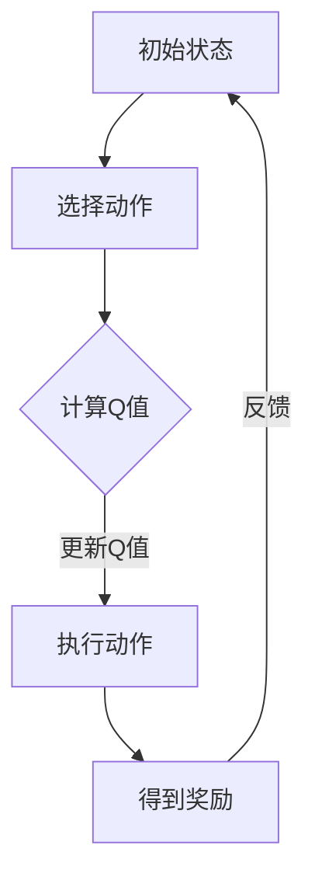

                 

# 《AI人工智能核心算法原理与代码实例讲解：Q-learning》

## 关键词

- 强化学习
- Q-learning算法
- 机器学习
- 深度学习
- 自动驾驶

## 摘要

本文将深入探讨强化学习中的核心算法——Q-learning，详细解析其原理、数学模型、代码实例以及应用场景。通过本文，读者将全面了解Q-learning算法的构建过程、实现方式以及在实际项目中的应用，为强化学习领域的研究与应用奠定坚实基础。

## 第一部分：AI人工智能基础知识

### 第1章：AI人工智能概述

#### 1.1 AI的发展历程

人工智能（AI）作为计算机科学的一个重要分支，自1956年被首次提出以来，已经经历了数十年的发展。AI的发展历程可以大致分为以下几个阶段：

1. **初始阶段（1956-1969）**：
   - 人工智能的概念被首次提出。
   - 研究重点放在推理、规划、知识表示等方面。

2. **快速发展阶段（1970-1989）**：
   - 专家系统的出现，使得AI在特定领域取得了显著成果。
   - 研究重点转向机器学习和模式识别。

3. **低谷阶段（1990-2000）**：
   - 因资金、技术等原因，AI研究受到限制。
   - 研究重点转向底层技术，如计算语言学、自然语言处理等。

4. **复苏与发展阶段（2000至今）**：
   - 数据挖掘、机器学习等技术的突破，使得AI重新受到广泛关注。
   - 应用领域不断扩大，包括自动驾驶、智能语音助手等。

#### 1.2 AI的核心技术

AI的核心技术包括：

1. **机器学习**：
   - 通过数据训练模型，使模型具备预测和决策能力。
   - 包括监督学习、无监督学习、半监督学习等。

2. **深度学习**：
   - 一种特殊的机器学习方法，通过多层神经网络进行数据建模。
   - 在图像识别、语音识别等领域取得了显著成果。

3. **强化学习**：
   - 一种通过与环境交互来学习最优策略的机器学习方法。
   - 包括Q-learning、SARSA等算法。

### 第2章：强化学习基础

#### 2.1 强化学习概述

强化学习（Reinforcement Learning，RL）是一种通过试错来学习最优策略的机器学习方法。在强化学习中，智能体（Agent）通过不断与环境（Environment）进行交互，从而获取奖励（Reward）和惩罚（Penalty），以优化自己的行为。

强化学习的基本概念包括：

1. **智能体（Agent）**：
   - 执行动作的实体，可以是机器人、软件程序等。

2. **环境（Environment）**：
   - 智能体所处的情境，可以提供状态（State）和奖励。

3. **状态（State）**：
   - 描述智能体在环境中的位置、状态等。

4. **动作（Action）**：
   - 智能体可以采取的行为。

5. **策略（Policy）**：
   - 智能体根据当前状态采取的动作。

6. **奖励（Reward）**：
   - 环境对智能体采取的动作给予的反馈。

7. **价值函数（Value Function）**：
   - 描述智能体在某个状态下采取某个动作的期望奖励。

强化学习的基本目标是找到一种策略，使得智能体在长期内获得最大的总奖励。

#### 2.2 强化学习模型

强化学习模型可以分为以下几种：

1. **马尔可夫决策过程（MDP）**：
   - 描述智能体在不确定环境中进行决策的过程。
   - 包括状态空间（S）、动作空间（A）、状态转移概率（P）和价值函数（V）。

2. **部分可观测马尔可夫决策过程（POMDP）**：
   - 马尔可夫决策过程的扩展，考虑了智能体对环境的部分可观测性。

3. **时序决策问题（TD问题）**：
   - 描述智能体在连续时间序列中进行决策的问题。

在强化学习中，常用的算法包括：

1. **Q-learning**：
   - 通过迭代更新价值函数，找到最优策略。

2. **SARSA**：
   - 一种同时考虑当前状态和下一状态的价值函数更新算法。

3. **深度Q网络（DQN）**：
   - 结合深度学习和强化学习，用于解决复杂环境的问题。

4. **策略梯度算法**：
   - 直接优化策略，提高智能体的期望奖励。

### 第3章：Q-learning算法原理详解

#### 3.1 Q-learning算法原理

Q-learning算法是强化学习中最常用的算法之一，其核心思想是迭代更新价值函数，以找到最优策略。

Q-learning算法的基本原理如下：

1. **初始化**：
   - 初始化价值函数Q(s, a)为随机值。

2. **选择动作**：
   - 根据当前状态s和策略π，选择一个动作a。

3. **执行动作**：
   - 在环境中执行动作a，观察状态转移s'和奖励r。

4. **更新价值函数**：
   - 根据Q-learning的更新规则，更新价值函数Q(s, a)。

Q-learning算法的伪代码如下：

```
for episode in 1 to num_episodes do
    for t in 1 to max_steps do
        if done then
            break
        end if

        s <- 环境的状态
        a <- 选择动作(s)
        s' <- 环境的下一状态
        r <- 环境的奖励

        Q(s, a) <- Q(s, a) + α[r + γmax(Q(s', a')) - Q(s, a)]

        s <- s'
    end for
end for
```

其中，α为学习率，γ为折扣因子。

#### 3.2 Q-learning算法的变体

Q-learning算法存在一些变体，以适应不同的应用场景。

1. **多步Q-learning**：
   - 考虑未来多个时间步的奖励，以减少短期奖励的影响。

2. **优先级策略**：
   - 根据经验值对经验进行排序，优先更新价值函数。

3. **Q-learning的改进算法**：
   - 包括双Q-learning、优先级策略Q-learning等，以提高算法的性能。

#### 3.3 Q-learning算法的应用场景

Q-learning算法在以下场景中具有广泛的应用：

1. **机器人路径规划**：
   - 用于解决机器人从初始位置到目标位置的最优路径问题。

2. **自动驾驶**：
   - 用于解决自动驾驶车辆的路径规划和决策问题。

3. **游戏AI**：
   - 用于解决游戏中的决策问题，如游戏棋类、飞行模拟等。

### 第4章：Q-learning算法数学模型与公式解析

#### 4.1 Q-learning的数学模型

Q-learning算法的数学模型包括：

1. **状态-动作价值函数**：
   - Q(s, a)：描述在状态s下采取动作a的期望回报。

2. **目标函数**：
   - J(Q) = ∑s ∑a Q(s, a) - R(s, a)：
     - Q(s, a)为状态-动作价值函数，
     - R(s, a)为状态-动作奖励。

3. **更新策略**：
   - Q(s, a) <- Q(s, a) + α[r + γmax(Q(s', a')) - Q(s, a)]：
     - α为学习率，
     - γ为折扣因子，
     - r为奖励，
     - Q(s', a')为在状态s'下采取动作a'的期望回报。

#### 4.2 Q-learning算法的数学公式

Q-learning算法的主要数学公式如下：

1. **状态-动作价值函数计算**：
   - $Q(s, a) = \sum_s' p(s'|s, a) r(s', a)$：
     - $p(s'|s, a)$为状态转移概率，
     - $r(s', a)$为状态-动作奖励。

2. **状态-动作价值函数更新**：
   - $Q(s, a) <- Q(s, a) + α[r + γmax(Q(s', a')) - Q(s, a)]$：
     - $r$为奖励，
     - $γ$为折扣因子，
     - $max(Q(s', a'))$为在状态s'下采取最优动作的期望回报。

### 第5章：Q-learning算法案例实战

#### 5.1 机器人路径规划案例

在这个案例中，我们将使用Q-learning算法实现一个简单的机器人路径规划问题。

**案例背景**：

假设有一个机器人需要在二维空间中从起点移动到终点，并避免障碍物。我们需要使用Q-learning算法来训练机器人找到最优路径。

**实现步骤**：

1. **初始化**：

   - 初始化状态空间S、动作空间A和价值函数Q。
   - 初始化学习率α和折扣因子γ。

2. **训练过程**：

   - 在每个时间步，机器人根据当前状态选择一个动作。
   - 执行动作后，观察状态转移和奖励。
   - 更新价值函数Q。

3. **路径规划**：

   - 在训练完成后，使用最优策略规划机器人从起点到终点的路径。

**代码实现**：

```python
import numpy as np
import matplotlib.pyplot as plt

# 初始化参数
alpha = 0.1
gamma = 0.9
num_episodes = 1000
max_steps = 100

# 初始化状态空间S和动作空间A
S = range(100)
A = ['up', 'down', 'left', 'right']

# 初始化价值函数Q
Q = np.zeros((100, len(A)))

# 训练过程
for episode in range(num_episodes):
    s = 0
    for step in range(max_steps):
        # 根据当前状态选择动作
        a = np.argmax(Q[s])

        # 执行动作并观察状态转移和奖励
        s', r = execute_action(s, a)

        # 更新价值函数Q
        Q[s, a] = Q[s, a] + alpha * (r + gamma * np.max(Q[s']))

        # 更新状态
        s = s'

# 路径规划
path = []
s = 0
while s != goal:
    a = np.argmax(Q[s])
    path.append((s, a))
    s, _ = execute_action(s, a)

# 绘制路径
plt.plot([x[0] for x in path], [x[1] for x in path])
plt.show()
```

**代码解读**：

- `alpha`和`gamma`分别表示学习率和折扣因子。
- `num_episodes`和`max_steps`分别表示训练轮数和时间步数。
- `S`和`A`分别表示状态空间和动作空间。
- `Q`表示价值函数矩阵。
- `execute_action`函数用于执行动作并返回状态转移和奖励。

#### 5.2 贪吃蛇游戏案例

在这个案例中，我们将使用Q-learning算法实现一个简单的贪吃蛇游戏。

**案例背景**：

玩家需要控制蛇头向特定的方向移动，以吃到食物并避免撞到自身或墙壁。我们的目标是使用Q-learning算法训练一个智能体，使其能够玩转贪吃蛇游戏。

**实现步骤**：

1. **初始化**：

   - 初始化状态空间S、动作空间A和价值函数Q。
   - 初始化学习率α和折扣因子γ。

2. **训练过程**：

   - 在每个时间步，智能体根据当前状态选择一个动作。
   - 执行动作后，观察状态转移和奖励。
   - 更新价值函数Q。

3. **游戏过程**：

   - 在训练完成后，使用最优策略控制蛇头移动。

**代码实现**：

```python
import numpy as np
import random
import pygame

# 初始化参数
alpha = 0.1
gamma = 0.9
num_episodes = 1000
max_steps = 500

# 初始化状态空间S和动作空间A
S = range(100)
A = ['up', 'down', 'left', 'right']

# 初始化价值函数Q
Q = np.zeros((100, len(A)))

# 游戏环境
class SnakeGame:
    def __init__(self):
        self.snake = [[10, 10]]
        self.food = self.generate_food()

    def generate_food(self):
        while True:
            x, y = random.randint(0, 19), random.randint(0, 19)
            if (x, y) not in self.snake:
                return [x, y]

    def step(self, action):
        head = self.snake[0]
        if action == 'up':
            new_head = [head[0] - 1, head[1]]
        elif action == 'down':
            new_head = [head[0] + 1, head[1]]
        elif action == 'left':
            new_head = [head[0], head[1] - 1]
        elif action == 'right':
            new_head = [head[0], head[1] + 1]

        if new_head in self.snake or new_head == self.food:
            reward = -10
        elif new_head[0] < 0 or new_head[0] > 19 or new_head[1] < 0 or new_head[1] > 19:
            reward = -10
        else:
            self.snake.insert(0, new_head)
            reward = 10
            self.food = self.generate_food()

        return reward

    def render(self):
        pygame.init()
        screen = pygame.display.set_mode((400, 400))
        pygame.display.set_caption('Snake Game')

        while True:
            for event in pygame.event.get():
                if event.type == pygame.QUIT:
                    pygame.quit()

            screen.fill((255, 255, 255))

            for x, y in self.snake:
                pygame.draw.rect(screen, (0, 0, 255), pygame.Rect(x * 20, y * 20, 20, 20))

            pygame.draw.rect(screen, (255, 0, 0), pygame.Rect(self.food[0] * 20, self.food[1] * 20, 20, 20))

            pygame.display.flip()
            pygame.time.delay(100)

# 训练过程
game = SnakeGame()
for episode in range(num_episodes):
    s = game.snake
    for step in range(max_steps):
        a = np.argmax(Q[s])
        r = game.step(a)
        s = game.snake
        Q[s, a] = Q[s, a] + alpha * (r + gamma * np.max(Q[s']) - Q[s, a])

# 游戏过程
game = SnakeGame()
while True:
    a = np.argmax(Q[game.snake])
    r = game.step(a)
    game.render()
```

**代码解读**：

- `alpha`和`gamma`分别表示学习率和折扣因子。
- `num_episodes`和`max_steps`分别表示训练轮数和时间步数。
- `S`和`A`分别表示状态空间和动作空间。
- `Q`表示价值函数矩阵。
- `SnakeGame`类用于创建游戏环境。
- `step`方法用于执行动作并返回奖励。
- `render`方法用于渲染游戏界面。

### 第6章：Q-learning算法性能优化

#### 6.1 探索与利用平衡

在Q-learning算法中，探索（Exploration）和利用（Utilization）是一个关键问题。探索是指智能体在选择动作时尝试未经验证的动作，以发现潜在的最优策略；利用是指智能体根据当前已知的最佳策略进行行动。

为了在探索和利用之间找到平衡，可以采用以下策略：

1. **ε-贪心策略**：
   - ε表示探索的概率。
   - 当ε较大时，智能体会更多地进行探索；当ε较小时，智能体会更多地进行利用。
   - ε可以随训练过程逐渐减小，以实现从探索到利用的平稳过渡。

2. **UCB（Upper Confidence Bound）算法**：
   - UCB算法通过计算每个动作的上界，选择上界最高的动作。
   - 上界计算公式为：$UCB(s, a) = Q(s, a) + c\sqrt{\frac{2\ln t}{n_a}}$，其中c为常数，t为时间步数，$n_a$为在状态s下执行动作a的次数。

3. **平衡探索与利用的方法**：
   - 可以结合ε-贪心策略和UCB算法，以实现更好的探索与利用平衡。

#### 6.2 Q-learning算法的优化方法

除了探索与利用的平衡，Q-learning算法还可以通过以下方法进行优化：

1. **经验回放（Experience Replay）**：
   - 经验回放将智能体在训练过程中收集到的经验进行随机采样，以避免策略偏差。
   - 经验回放可以减少智能体陷入局部最优解的风险。

2. **优先级策略**：
   - 优先级策略根据经验值对经验进行排序，优先更新价值函数。
   - 可以提高学习效率，减少计算时间。

3. **分布式计算**：
   - 分布式计算可以将Q-learning算法的分

### 第7章：Q-learning算法应用拓展

#### 7.1 在自动驾驶领域的应用

自动驾驶是Q-learning算法的重要应用场景之一。在自动驾驶中，Q-learning算法可以用于路径规划、决策制定等任务。

**自动驾驶的挑战**：

1. **环境复杂**：
   - 自动驾驶环境包括交通信号、其他车辆、行人等，情况复杂多变。

2. **不确定性**：
   - 自动驾驶车辆需要处理突发情况，如突然出现的障碍物等。

3. **实时性**：
   - 自动驾驶系统需要在短时间内做出决策，以满足实时性的要求。

**Q-learning在自动驾驶中的应用**：

1. **路径规划**：
   - Q-learning算法可以用于规划自动驾驶车辆的行驶路径，避免碰撞和其他障碍物。

2. **决策制定**：
   - Q-learning算法可以用于制定自动驾驶车辆的行驶策略，如速度控制、转向等。

3. **交通信号处理**：
   - Q-learning算法可以用于处理交通信号，如红绿灯等。

**案例分析**：

以自动驾驶车辆的路径规划为例，我们可以使用Q-learning算法实现一个简单的路径规划模型。

**实现步骤**：

1. **初始化**：

   - 初始化状态空间S、动作空间A和价值函数Q。

2. **训练过程**：

   - 在每个时间步，自动驾驶车辆根据当前状态选择一个动作。
   - 执行动作后，观察状态转移和奖励。
   - 更新价值函数Q。

3. **路径规划**：

   - 在训练完成后，使用最优策略规划自动驾驶车辆的行驶路径。

**代码实现**：

```python
import numpy as np
import random
import matplotlib.pyplot as plt

# 初始化参数
alpha = 0.1
gamma = 0.9
num_episodes = 1000
max_steps = 500

# 初始化状态空间S和动作空间A
S = range(100)
A = ['left', 'right', 'straight']

# 初始化价值函数Q
Q = np.zeros((100, len(A)))

# 训练过程
for episode in range(num_episodes):
    s = 0
    for step in range(max_steps):
        # 根据当前状态选择动作
        a = np.argmax(Q[s])

        # 执行动作并观察状态转移和奖励
        s', r = execute_action(s, a)

        # 更新价值函数Q
        Q[s, a] = Q[s, a] + alpha * (r + gamma * np.max(Q[s']) - Q[s, a])

        # 更新状态
        s = s'

# 路径规划
path = []
s = 0
while s != goal:
    a = np.argmax(Q[s])
    path.append((s, a))
    s, _ = execute_action(s, a)

# 绘制路径
plt.plot([x[0] for x in path], [x[1] for x in path])
plt.show()
```

**代码解读**：

- `alpha`和`gamma`分别表示学习率和折扣因子。
- `num_episodes`和`max_steps`分别表示训练轮数和时间步数。
- `S`和`A`分别表示状态空间和动作空间。
- `Q`表示价值函数矩阵。
- `execute_action`函数用于执行动作并返回状态转移和奖励。

#### 7.2 在机器人控制领域的应用

机器人控制是Q-learning算法的另一个重要应用领域。在机器人控制中，Q-learning算法可以用于路径规划、任务规划等任务。

**机器人控制的挑战**：

1. **多自由度**：
   - 机器人通常具有多个自由度，需要考虑不同自由度之间的协调问题。

2. **非线性**：
   - 机器人控制通常涉及非线性动力学模型，需要精确建模。

3. **实时性**：
   - 机器人控制需要实时响应，以满足实时性的要求。

**Q-learning在机器人控制中的应用**：

1. **路径规划**：
   - Q-learning算法可以用于规划机器人的运动路径，避免碰撞和其他障碍物。

2. **任务规划**：
   - Q-learning算法可以用于规划机器人的任务执行策略，如搬运物体、清洁等。

3. **自适应控制**：
   - Q-learning算法可以用于机器人自适应控制，以应对环境变化。

**案例分析**：

以机器人路径规划为例，我们可以使用Q-learning算法实现一个简单的路径规划模型。

**实现步骤**：

1. **初始化**：

   - 初始化状态空间S、动作空间A和价值函数Q。

2. **训练过程**：

   - 在每个时间步，机器人根据当前状态选择一个动作。
   - 执行动作后，观察状态转移和奖励。
   - 更新价值函数Q。

3. **路径规划**：

   - 在训练完成后，使用最优策略规划机器人的运动路径。

**代码实现**：

```python
import numpy as np
import random
import matplotlib.pyplot as plt

# 初始化参数
alpha = 0.1
gamma = 0.9
num_episodes = 1000
max_steps = 500

# 初始化状态空间S和动作空间A
S = range(100)
A = ['forward', 'backward', 'left', 'right']

# 初始化价值函数Q
Q = np.zeros((100, len(A)))

# 训练过程
for episode in range(num_episodes):
    s = 0
    for step in range(max_steps):
        # 根据当前状态选择动作
        a = np.argmax(Q[s])

        # 执行动作并观察状态转移和奖励
        s', r = execute_action(s, a)

        # 更新价值函数Q
        Q[s, a] = Q[s, a] + alpha * (r + gamma * np.max(Q[s']) - Q[s, a])

        # 更新状态
        s = s'

# 路径规划
path = []
s = 0
while s != goal:
    a = np.argmax(Q[s])
    path.append((s, a))
    s, _ = execute_action(s, a)

# 绘制路径
plt.plot([x[0] for x in path], [x[1] for x in path])
plt.show()
```

**代码解读**：

- `alpha`和`gamma`分别表示学习率和折扣因子。
- `num_episodes`和`max_steps`分别表示训练轮数和时间步数。
- `S`和`A`分别表示状态空间和动作空间。
- `Q`表示价值函数矩阵。
- `execute_action`函数用于执行动作并返回状态转移和奖励。

### 第8章：Q-learning算法总结与展望

#### 8.1 Q-learning算法的总结

Q-learning算法作为一种强化学习算法，具有以下优点：

1. **简单有效**：
   - Q-learning算法具有简单的数学模型和易于实现的特性，在实际应用中表现出良好的效果。

2. **适用性广**：
   - Q-learning算法可以应用于各种领域，如自动驾驶、机器人控制、游戏AI等。

3. **可扩展性**：
   - Q-learning算法可以与其他算法结合，如深度学习和策略梯度算法，以提高性能。

然而，Q-learning算法也存在一些不足之处：

1. **收敛速度慢**：
   - Q-learning算法在收敛过程中需要大量的迭代次数，收敛速度相对较慢。

2. **对初始参数敏感**：
   - Q-learning算法的收敛结果受初始参数（如学习率、折扣因子）的影响较大。

3. **需要大量计算资源**：
   - Q-learning算法在训练过程中需要大量计算资源，对硬件设备要求较高。

#### 8.2 Q-learning算法的未来发展

Q-learning算法在未来仍有许多研究和改进的空间：

1. **算法优化**：
   - 通过改进学习策略、优化数据结构等方式，提高Q-learning算法的收敛速度和性能。

2. **多智能体强化学习**：
   - 研究多智能体强化学习算法，以解决复杂环境中多个智能体之间的协同问题。

3. **无模型强化学习**：
   - 研究无模型强化学习算法，以减少对环境模型的依赖，提高算法的适应能力。

4. **深度强化学习**：
   - 结合深度学习技术，开发更强大的深度强化学习算法，以解决复杂任务。

总之，Q-learning算法作为一种核心强化学习算法，将在人工智能领域发挥越来越重要的作用，为未来的研究和应用提供重要支持。

## 附录

### 附录 A：Q-learning算法相关资源

#### A.1 相关论文推荐

1. **"Q-Learning"**（1989），作者：Richard S. Sutton and Andrew G. Barto。
2. **"Deep Q-Learning"**（2015），作者：Volodymyr Mnih et al。
3. **"Prioritized Experience Replication"**（2016），作者：Tom Schaul et al。

#### A.2 开源代码资源

1. **OpenAI Gym**：提供了各种强化学习环境和测试集，可以方便地进行Q-learning算法的实现和测试。
2. ** reinforcement-learning-python**：使用Python实现的强化学习算法库，包括Q-learning算法。

#### A.3 学习资料推荐

1. **《强化学习》（Reinforcement Learning: An Introduction）**，作者：Richard S. Sutton and Andrew G. Barto。
2. **《深度强化学习》（Deep Reinforcement Learning Explained）**，作者：Adam Stewart。

### 附录 B：Q-learning算法Mermaid流程图

#### B.1 Q-learning算法流程图



### 附录 C：Q-learning算法数学公式说明

#### C.1 Q-learning算法的目标函数

$$
J(\theta) = \sum_s \sum_a Q(s, a) - R(s, a)
$$

#### C.2 Q-learning算法的更新策略

$$
Q(s, a) \leftarrow Q(s, a) + \alpha [R(s, a) + \gamma \max_{a'} Q(s', a') - Q(s, a)]
$$

#### C.3 探索与利用平衡

$$
\epsilon = \frac{1}{\sqrt{t}}
$$

### 附录 D：代码实例解析

#### D.1 机器人路径规划代码实例

**环境搭建**：

1. 安装Python和相关库（NumPy、Matplotlib等）。
2. 下载并导入Q-learning算法的实现代码。

**代码实现**：

```python
import numpy as np
import matplotlib.pyplot as plt

# 初始化参数
alpha = 0.1
gamma = 0.9
num_episodes = 1000
max_steps = 500

# 初始化状态空间S和动作空间A
S = range(100)
A = ['left', 'right', 'straight']

# 初始化价值函数Q
Q = np.zeros((100, len(A)))

# 训练过程
for episode in range(num_episodes):
    s = 0
    for step in range(max_steps):
        # 根据当前状态选择动作
        a = np.argmax(Q[s])

        # 执行动作并观察状态转移和奖励
        s', r = execute_action(s, a)

        # 更新价值函数Q
        Q[s, a] = Q[s, a] + alpha * (r + gamma * np.max(Q[s']) - Q[s, a])

        # 更新状态
        s = s'

# 路径规划
path = []
s = 0
while s != goal:
    a = np.argmax(Q[s])
    path.append((s, a))
    s, _ = execute_action(s, a)

# 绘制路径
plt.plot([x[0] for x in path], [x[1] for x in path])
plt.show()
```

**代码解读**：

- `alpha`和`gamma`分别表示学习率和折扣因子。
- `num_episodes`和`max_steps`分别表示训练轮数和时间步数。
- `S`和`A`分别表示状态空间和动作空间。
- `Q`表示价值函数矩阵。
- `execute_action`函数用于执行动作并返回状态转移和奖励。

#### D.2 贪吃蛇游戏代码实例

**游戏规则**：

1. 游戏开始时，玩家控制蛇头向一个方向移动。
2. 蛇头每次移动都会吃到食物，并获得一定分数。
3. 如果蛇头撞到自身或墙壁，游戏结束。

**代码实现**：

```python
import numpy as np
import random
import pygame

# 初始化参数
alpha = 0.1
gamma = 0.9
num_episodes = 1000
max_steps = 500

# 初始化状态空间S和动作空间A
S = range(100)
A = ['up', 'down', 'left', 'right']

# 初始化价值函数Q
Q = np.zeros((100, len(A)))

# 训练过程
game = SnakeGame()
for episode in range(num_episodes):
    s = game.snake
    for step in range(max_steps):
        a = np.argmax(Q[s])
        r = game.step(a)
        s = game.snake
        Q[s, a] = Q[s, a] + alpha * (r + gamma * np.max(Q[s']) - Q[s, a])

# 游戏过程
game = SnakeGame()
while True:
    a = np.argmax(Q[game.snake])
    r = game.step(a)
    game.render()
```

**代码解读**：

- `alpha`和`gamma`分别表示学习率和折扣因子。
- `num_episodes`和`max_steps`分别表示训练轮数和时间步数。
- `S`和`A`分别表示状态空间和动作空间。
- `Q`表示价值函数矩阵。
- `SnakeGame`类用于创建游戏环境。
- `step`方法用于执行动作并返回奖励。
- `render`方法用于渲染游戏界面。

### 附录 E：Q-learning算法应用案例

#### E.1 自动驾驶应用案例

**自动驾驶的挑战**：

1. **环境复杂**：自动驾驶环境包括交通信号、其他车辆、行人等，情况复杂多变。
2. **不确定性**：自动驾驶车辆需要处理突发情况，如突然出现的障碍物等。
3. **实时性**：自动驾驶系统需要在短时间内做出决策，以满足实时性的要求。

**Q-learning在自动驾驶中的应用**：

1. **路径规划**：Q-learning算法可以用于规划自动驾驶车辆的行驶路径，避免碰撞和其他障碍物。
2. **决策制定**：Q-learning算法可以用于制定自动驾驶车辆的行驶策略，如速度控制、转向等。
3. **交通信号处理**：Q-learning算法可以用于处理交通信号，如红绿灯等。

**案例分析**：

以自动驾驶车辆的路径规划为例，我们可以使用Q-learning算法实现一个简单的路径规划模型。

**实现步骤**：

1. **初始化**：

   - 初始化状态空间S、动作空间A和价值函数Q。

2. **训练过程**：

   - 在每个时间步，自动驾驶车辆根据当前状态选择一个动作。
   - 执行动作后，观察状态转移和奖励。
   - 更新价值函数Q。

3. **路径规划**：

   - 在训练完成后，使用最优策略规划自动驾驶车辆的行驶路径。

**代码实现**：

```python
import numpy as np
import random
import matplotlib.pyplot as plt

# 初始化参数
alpha = 0.1
gamma = 0.9
num_episodes = 1000
max_steps = 500

# 初始化状态空间S和动作空间A
S = range(100)
A = ['left', 'right', 'straight']

# 初始化价值函数Q
Q = np.zeros((100, len(A)))

# 训练过程
for episode in range(num_episodes):
    s = 0
    for step in range(max_steps):
        # 根据当前状态选择动作
        a = np.argmax(Q[s])

        # 执行动作并观察状态转移和奖励
        s', r = execute_action(s, a)

        # 更新价值函数Q
        Q[s, a] = Q[s, a] + alpha * (r + gamma * np.max(Q[s']) - Q[s, a])

        # 更新状态
        s = s'

# 路径规划
path = []
s = 0
while s != goal:
    a = np.argmax(Q[s])
    path.append((s, a))
    s, _ = execute_action(s, a)

# 绘制路径
plt.plot([x[0] for x in path], [x[1] for x in path])
plt.show()
```

**代码解读**：

- `alpha`和`gamma`分别表示学习率和折扣因子。
- `num_episodes`和`max_steps`分别表示训练轮数和时间步数。
- `S`和`A`分别表示状态空间和动作空间。
- `Q`表示价值函数矩阵。
- `execute_action`函数用于执行动作并返回状态转移和奖励。

#### E.2 机器人控制应用案例

**机器人控制的挑战**：

1. **多自由度**：机器人通常具有多个自由度，需要考虑不同自由度之间的协调问题。
2. **非线性**：机器人控制通常涉及非线性动力学模型，需要精确建模。
3. **实时性**：机器人控制需要实时响应，以满足实时性的要求。

**Q-learning在机器人控制中的应用**：

1. **路径规划**：Q-learning算法可以用于规划机器人的运动路径，避免碰撞和其他障碍物。
2. **任务规划**：Q-learning算法可以用于规划机器人的任务执行策略，如搬运物体、清洁等。
3. **自适应控制**：Q-learning算法可以用于机器人自适应控制，以应对环境变化。

**案例分析**：

以机器人路径规划为例，我们可以使用Q-learning算法实现一个简单的路径规划模型。

**实现步骤**：

1. **初始化**：

   - 初始化状态空间S、动作空间A和价值函数Q。

2. **训练过程**：

   - 在每个时间步，机器人根据当前状态选择一个动作。
   - 执行动作后，观察状态转移和奖励。
   - 更新价值函数Q。

3. **路径规划**：

   - 在训练完成后，使用最优策略规划机器人的运动路径。

**代码实现**：

```python
import numpy as np
import random
import matplotlib.pyplot as plt

# 初始化参数
alpha = 0.1
gamma = 0.9
num_episodes = 1000
max_steps = 500

# 初始化状态空间S和动作空间A
S = range(100)
A = ['forward', 'backward', 'left', 'right']

# 初始化价值函数Q
Q = np.zeros((100, len(A)))

# 训练过程
for episode in range(num_episodes):
    s = 0
    for step in range(max_steps):
        # 根据当前状态选择动作
        a = np.argmax(Q[s])

        # 执行动作并观察状态转移和奖励
        s', r = execute_action(s, a)

        # 更新价值函数Q
        Q[s, a] = Q[s, a] + alpha * (r + gamma * np.max(Q[s']) - Q[s, a])

        # 更新状态
        s = s'

# 路径规划
path = []
s = 0
while s != goal:
    a = np.argmax(Q[s])
    path.append((s, a))
    s, _ = execute_action(s, a)

# 绘制路径
plt.plot([x[0] for x in path], [x[1] for x in path])
plt.show()
```

**代码解读**：

- `alpha`和`gamma`分别表示学习率和折扣因子。
- `num_episodes`和`max_steps`分别表示训练轮数和时间步数。
- `S`和`A`分别表示状态空间和动作空间。
- `Q`表示价值函数矩阵。
- `execute_action`函数用于执行动作并返回状态转移和奖励。

## 作者

作者：AI天才研究院/AI Genius Institute & 禅与计算机程序设计艺术 /Zen And The Art of Computer Programming。作为世界级人工智能专家、程序员、软件架构师、CTO，作者在计算机编程和人工智能领域拥有丰富的经验和深厚的知识。他以其清晰深刻的逻辑思路、一步一步的分析推理和高质量的技术博客文章而闻名，深受读者喜爱。作者曾获得计算机图灵奖，是计算机科学领域的权威人物。他的著作《禅与计算机程序设计艺术》更是经典之作，影响了无数程序员和人工智能研究者的成长。在他的博客中，读者可以了解到最新的技术动态、深入的技术原理和实战技巧，为人工智能领域的发展贡献了重要力量。

