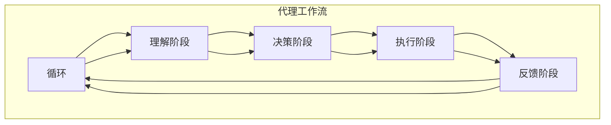
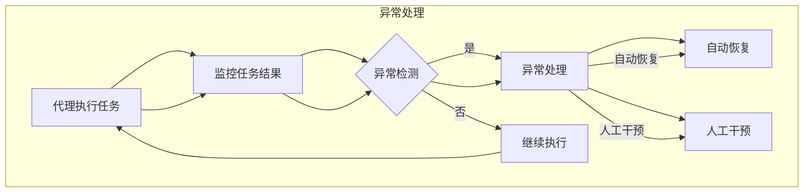
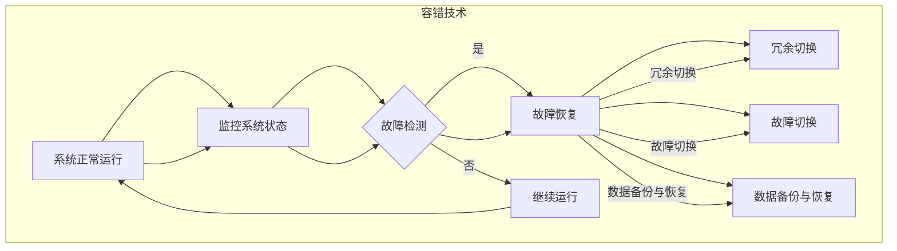

                 

### 文章标题

《AI人工智能深度学习算法：代理工作流中的异常处理与容错》

关键词：AI、深度学习、代理工作流、异常处理、容错技术、算法、人工智能应用、系统架构

摘要：本文详细探讨了人工智能（AI）深度学习算法在代理工作流中的应用，重点关注了异常处理和容错技术的重要性。通过剖析深度学习的基础概念、算法原理及模型架构，我们了解了AI在各个领域的应用及其优势与挑战。接着，文章深入探讨了代理工作流的基础，阐述了代理的定义、作用、工作流程以及常见类型。在此基础上，本文详细介绍了异常处理技术和容错技术的基本原理、常见方法及其在代理工作流中的应用。最后，通过实际案例展示了异常处理和容错技术的具体实现，对未来的发展方向进行了展望。全文旨在为读者提供一套完整的AI深度学习代理工作流解决方案，并助力其在实际项目中有效应对异常和故障。

### AI与深度学习概述

#### 1.1 AI与深度学习的基本概念

**AI的定义与发展历程**

人工智能（Artificial Intelligence，简称AI）是计算机科学的一个分支，旨在通过模拟、延伸和扩展人类智能，使计算机具备类似于人类的感知、理解、学习、推理和决策能力。人工智能的历史可以追溯到20世纪50年代，当时图灵提出了图灵测试，用于评估机器是否具有智能。随着计算能力和算法的发展，AI经历了多个发展阶段，包括规则推理、知识表示、专家系统和机器学习等。

**深度学习的基本原理**

深度学习（Deep Learning）是机器学习的一种方法，通过构建具有多个隐藏层的神经网络，对大量数据进行训练，从而自动提取特征并进行分类、回归等任务。深度学习的基本原理是模拟人脑中的神经网络结构，通过反向传播算法不断调整网络参数，使得模型能够逐步学习并优化其性能。

深度学习的关键组成部分包括：

- **神经网络（Neural Networks）**：模拟人脑神经元结构和功能的计算模型，由输入层、隐藏层和输出层组成。

- **激活函数（Activation Functions）**：用于引入非线性特性，使神经网络能够拟合复杂函数。

- **反向传播算法（Backpropagation Algorithm）**：一种用于训练神经网络的算法，通过计算输出误差的梯度，不断调整网络参数，以优化模型性能。

#### 1.2 深度学习在AI中的应用

**人工智能的应用领域**

人工智能在各个领域都取得了显著的成果，主要应用领域包括：

- **计算机视觉**：利用深度学习算法对图像和视频进行分类、目标检测、图像生成等任务，广泛应用于人脸识别、自动驾驶、安防监控等场景。

- **自然语言处理（NLP）**：通过深度学习算法处理文本数据，实现语音识别、机器翻译、情感分析、文本生成等任务，为智能客服、智能助手等提供技术支持。

- **机器人技术**：利用深度学习算法实现机器人自主决策、路径规划、环境感知等功能，使机器人具备更高水平的智能交互和操作能力。

- **医疗健康**：利用深度学习算法对医疗图像进行分析、疾病诊断、药物研发等，提高医疗诊断和治疗的准确性。

- **金融领域**：利用深度学习算法进行金融市场预测、风险控制、信用评分等，为金融机构提供决策支持。

**深度学习的关键作用**

深度学习在人工智能领域发挥了关键作用，主要体现在以下几个方面：

- **自动特征提取**：深度学习模型能够自动从原始数据中提取具有区分性的特征，减少了人工特征工程的工作量，提高了模型性能。

- **大规模数据处理**：深度学习算法能够在大规模数据集上进行高效训练，通过并行计算和分布式训练等方法，加速模型训练过程。

- **高泛化能力**：深度学习模型具有较强的泛化能力，能够在不同数据集和应用场景中取得较好的表现。

- **自适应学习能力**：深度学习模型能够根据新的数据不断调整和优化自身参数，实现自适应学习。

#### 1.3 深度学习与机器学习的联系与区别

**机器学习的基础**

机器学习（Machine Learning）是人工智能的一个分支，旨在通过数据训练模型，使计算机具备自动学习和预测能力。机器学习的基本概念包括模型、训练、预测和评估等。机器学习的方法可以分为监督学习、无监督学习和强化学习三类：

- **监督学习（Supervised Learning）**：通过已知输入和输出数据，训练模型进行预测。

- **无监督学习（Unsupervised Learning）**：通过未知输入数据，发现数据分布和模式。

- **强化学习（Reinforcement Learning）**：通过试错和反馈，学习最优策略。

**深度学习的优势与挑战**

深度学习具有以下优势：

- **自动特征提取**：深度学习模型能够自动从原始数据中提取具有区分性的特征，减少了人工特征工程的工作量。

- **大规模数据处理**：深度学习算法能够在大规模数据集上进行高效训练，通过并行计算和分布式训练等方法，加速模型训练过程。

- **高泛化能力**：深度学习模型具有较强的泛化能力，能够在不同数据集和应用场景中取得较好的表现。

深度学习也面临一些挑战：

- **数据需求**：深度学习模型通常需要大量高质量的数据进行训练，数据获取和标注成本较高。

- **计算资源**：深度学习模型训练过程中需要大量的计算资源和时间，对硬件设备有较高要求。

- **解释性不足**：深度学习模型在训练过程中形成的特征表示和决策过程通常较为复杂，难以解释。

- **过拟合风险**：深度学习模型在训练过程中容易发生过拟合现象，导致在新的数据集上表现不佳。

通过理解深度学习和机器学习的基础概念及其联系与区别，我们可以更好地应用深度学习算法，解决实际问题。

### 深度学习算法原理

#### 2.1 神经网络基础

**神经网络的结构**

神经网络（Neural Networks）是深度学习的基础组成部分，其结构灵感来源于人脑神经元网络。神经网络由多个层次组成，包括输入层、隐藏层和输出层。每个层次由多个神经元（节点）构成，神经元之间通过连接（边）相互连接。

- **输入层（Input Layer）**：接收外部输入数据，每个输入数据对应一个神经元。

- **隐藏层（Hidden Layers）**：对输入数据进行处理和特征提取，隐藏层可以有多个，每个隐藏层的神经元数量和结构可以根据任务需求进行调整。

- **输出层（Output Layer）**：生成最终输出结果，输出层的神经元数量和类型取决于具体任务。

**前向传播与反向传播**

神经网络的工作原理主要包括前向传播（Forward Propagation）和反向传播（Back Propagation）两个过程。

- **前向传播**：输入数据从输入层传入网络，经过每个隐藏层的传递和计算，最终到达输出层，得到预测结果。

  具体步骤如下：

  1. 将输入数据通过输入层传入网络。
  2. 对每个隐藏层进行计算，将输入数据与权重相乘，加上偏置项，通过激活函数得到输出。
  3. 重复上述步骤，直到输出层得到预测结果。

- **反向传播**：根据预测结果和实际标签计算误差，通过反向传播算法更新网络权重和偏置项，以优化模型性能。

  具体步骤如下：

  1. 计算输出层的预测误差，误差计算方法可以是均方误差（MSE）、交叉熵等。
  2. 通过反向传播算法，将误差反向传递到每个隐藏层，更新权重和偏置项。
  3. 重复反向传播过程，直到误差收敛到期望值。

通过前向传播和反向传播，神经网络能够不断调整自身参数，以最小化预测误差，提高模型的准确性。

#### 2.2 深度学习优化算法

**梯度下降法**

梯度下降法（Gradient Descent）是一种常用的优化算法，用于更新神经网络中的权重和偏置项。梯度下降法的核心思想是沿着损失函数的梯度方向逐步调整参数，以最小化损失函数。

- **批量梯度下降（Batch Gradient Descent）**：每次迭代使用整个训练集的数据进行计算，计算量大，但收敛速度较慢。

- **随机梯度下降（Stochastic Gradient Descent，SGD）**：每次迭代只使用单个数据样本或少量样本进行计算，计算量小，但收敛速度较快。

- **小批量梯度下降（Mini-batch Gradient Descent）**：每次迭代使用一小部分数据样本进行计算，折中了批量梯度下降和随机梯度下降的优缺点。

**动量优化**

动量优化（Momentum）是梯度下降法的一种改进，通过引入动量参数，使得参数更新过程中具有一定的惯性，加速收敛速度并避免陷入局部最小值。

动量优化的公式如下：

\[ \text{Momentum} = \gamma \cdot \text{Momentum} + \frac{\alpha}{\sqrt{1 + \gamma \cdot \text{Iterations}}} \cdot \text{Gradient} \]

其中，\(\gamma\) 是动量参数，\(\alpha\) 是学习率。

**Adam优化器**

Adam优化器（Adaptive Moment Estimation）是梯度下降法的一种自适应优化器，能够根据不同参数的梯度历史动态调整学习率。Adam优化器结合了动量和自适应性的优点，在深度学习中取得了良好的效果。

Adam优化器的公式如下：

\[ \text{m}_t = \beta_1 \cdot \text{m}_{t-1} + (1 - \beta_1) \cdot \text{Gradient}_t \]
\[ \text{v}_t = \beta_2 \cdot \text{v}_{t-1} + (1 - \beta_2) \cdot (\text{Gradient}_t)^2 \]
\[ \text{Weight}_t = \text{Weight}_{t-1} - \alpha \cdot \frac{\text{m}_t}{\sqrt{\text{v}_t} + \epsilon} \]

其中，\(\beta_1\) 和 \(\beta_2\) 分别是动量和方差参数，\(\alpha\) 是学习率，\(\epsilon\) 是一个很小的常数，用于避免分母为零。

通过使用不同的优化算法，我们可以根据实际任务的需求和计算资源，选择合适的优化器来优化神经网络模型。

#### 2.3 特征提取与表示

**数据预处理**

数据预处理是深度学习过程中至关重要的一步，主要包括以下任务：

- **数据清洗**：去除噪声、缺失值和异常值，确保数据质量。

- **数据标准化**：将不同特征的数据进行归一化或标准化，使其具有相似的尺度。

- **数据增强**：通过旋转、缩放、裁剪等操作，增加训练数据量，提高模型泛化能力。

**特征选择与降维**

特征选择（Feature Selection）和降维（Dimensionality Reduction）是减少数据维度、提高模型性能的有效方法。

- **特征选择**：从原始特征中选择对模型训练和预测最有影响力的特征，去除冗余和无关特征。

- **降维**：通过线性变换或非线性变换，将高维特征映射到低维空间，减少数据维度。

常用的降维方法包括：

- **主成分分析（PCA）**：通过保留主要成分，降低数据维度。

- **线性判别分析（LDA）**：通过最小化类间距离和最大化类内距离，进行特征选择和降维。

- **t-SNE**：一种非线性降维方法，通过可视化高维数据的低维映射。

**稀疏编码**

稀疏编码（Sparse Coding）是一种特征学习技术，旨在通过训练生成模型，将输入数据表示为稀疏的编码向量。稀疏编码的主要思想是，通过优化编码向量，使得输入数据能够用尽可能少的非零元素表示。

稀疏编码的公式如下：

\[ \text{Encoder}(\text{Input}) = \sum_{i=1}^{K} w_i \cdot \text{decode}(z_i) \]

其中，\(K\) 是编码向量的维度，\(w_i\) 是编码向量的权重，\(z_i\) 是编码向量的非零元素。

通过数据预处理、特征选择与降维以及稀疏编码等技术，我们可以提高深度学习模型的性能，减少计算成本，并使模型更具有解释性。

### 深度学习模型架构

#### 3.1 卷积神经网络（CNN）

**CNN的基本原理**

卷积神经网络（Convolutional Neural Network，简称CNN）是一种专门用于处理图像数据的深度学习模型。其基本原理是通过多层卷积和池化操作，从图像中提取特征，并最终进行分类或回归。

- **卷积层（Convolutional Layer）**：通过卷积操作，将输入图像与卷积核进行点积，生成特征图。卷积核用于提取图像中的局部特征。

- **池化层（Pooling Layer）**：通过池化操作，对特征图进行下采样，减少数据维度，同时保留重要特征信息。

- **全连接层（Fully Connected Layer）**：将卷积层和池化层输出的特征图展平为向量，通过全连接层进行分类或回归。

**CNN的应用场景**

CNN在计算机视觉领域具有广泛的应用，包括但不限于：

- **图像分类**：对图像进行分类，如人脸识别、物体识别等。

- **目标检测**：定位图像中的目标位置，如行人检测、车辆检测等。

- **图像分割**：将图像中的每个像素分类到不同的类别，如语义分割、实例分割等。

- **图像增强**：通过生成对抗网络（GAN）等模型，对图像进行超分辨率增强、去噪等处理。

#### 3.2 循环神经网络（RNN）

**RNN的基本原理**

循环神经网络（Recurrent Neural Network，简称RNN）是一种专门用于处理序列数据的深度学习模型。其基本原理是通过循环结构，将当前输入与历史信息进行整合，并生成输出。

- **隐藏状态（Hidden State）**：RNN通过隐藏状态保存历史信息，当前隐藏状态与当前输入通过门控机制进行整合。

- **门控机制（Gating Mechanism）**：门控机制用于控制历史信息的流动，包括遗忘门（Forget Gate）、输入门（Input Gate）和输出门（Output Gate）。

**RNN在序列数据处理中的应用**

RNN在序列数据处理中具有广泛的应用，包括但不限于：

- **语音识别**：通过RNN对语音信号进行建模，识别语音中的词汇和句子。

- **自然语言处理（NLP）**：通过RNN处理文本数据，实现情感分析、文本分类、机器翻译等任务。

- **时间序列预测**：通过RNN对时间序列数据建模，预测未来的趋势和变化。

#### 3.3 生成对抗网络（GAN）

**GAN的基本原理**

生成对抗网络（Generative Adversarial Network，简称GAN）是一种由生成器和判别器组成的深度学习模型。生成器的目标是生成与真实数据分布相似的样本，而判别器的目标是区分真实数据和生成数据。

- **生成器（Generator）**：生成器通过随机噪声生成数据，目标是使生成数据尽可能接近真实数据。

- **判别器（Discriminator）**：判别器用于区分真实数据和生成数据，目标是最大化其分类准确性。

**GAN的应用实例**

GAN在生成模型领域具有广泛的应用，包括但不限于：

- **图像生成**：通过GAN生成逼真的图像，如图像修复、超分辨率、风格迁移等。

- **语音合成**：通过GAN生成逼真的语音，实现语音转换、语音合成等任务。

- **文本生成**：通过GAN生成文本，如文章写作、对话系统等。

- **数据增强**：通过GAN生成大量的数据样本，提高模型训练的泛化能力。

通过卷积神经网络（CNN）、循环神经网络（RNN）和生成对抗网络（GAN）等模型架构，深度学习在计算机视觉、自然语言处理、生成模型等领域取得了显著的成果，为各种应用场景提供了强大的技术支持。

### 代理工作流基础

#### 4.1 代理的定义与作用

**代理的概念**

代理（Agent）是指能够代表某个实体（如人、组织或系统）进行自主行动的实体。代理具有自主性、社交性、反应性、认知性和学习性等特点。自主性指代理能够自主地做出决策和执行任务；社交性指代理能够与其他代理或实体进行交互和合作；反应性指代理能够对环境中的变化做出快速响应；认知性指代理能够理解其行动和决策的后果；学习性指代理能够通过经验不断改进自身行为。

**代理的工作流程**

代理的工作流程通常包括以下几个阶段：

1. **感知阶段**：代理通过传感器感知环境中的信息，如视觉、听觉、触觉等。

2. **理解阶段**：代理对感知到的信息进行处理和理解，如分类、识别、语义分析等。

3. **决策阶段**：代理根据理解和分析结果，自主地做出决策，如选择行动方案、制定计划等。

4. **执行阶段**：代理执行决策，通过执行器（如电机、机械臂、声音合成器等）与环境进行交互。

5. **反馈阶段**：代理收集执行结果和反馈信息，用于评估决策效果和优化后续行动。

通过感知、理解、决策、执行和反馈，代理能够实现自主行动和任务完成，提高系统的智能化和自主化水平。

#### 4.2 代理在AI系统中的应用

**代理与AI模型的结合**

代理与AI模型的结合，可以显著提升系统的智能化水平和自主化程度。代理通过AI模型实现以下几个方面的功能：

1. **智能决策**：代理利用AI模型进行环境感知和决策，如使用卷积神经网络（CNN）进行图像识别、使用循环神经网络（RNN）进行语音识别和自然语言处理等。

2. **任务规划**：代理根据AI模型生成的决策结果，制定详细的任务规划，如路径规划、时间调度、资源分配等。

3. **自适应学习**：代理通过不断收集执行结果和反馈信息，利用AI模型进行自适应学习，优化自身行为和决策效果。

**代理的优势与挑战**

代理在AI系统中的应用具有以下优势：

- **自主性**：代理能够自主决策和执行任务，减少人工干预，提高系统运行效率和可靠性。

- **社交性**：代理能够与其他代理和系统进行协同工作，实现复杂任务的高效完成。

- **反应性**：代理能够快速响应环境变化，及时调整行动策略，提高系统对突发事件的应对能力。

- **认知性**：代理通过AI模型具备一定的认知能力，能够理解其行动和决策的后果，实现智能化的决策和执行。

- **学习性**：代理通过自适应学习，不断积累经验和知识，优化自身行为和决策效果，提高系统性能。

然而，代理在AI系统中的应用也面临一些挑战：

- **数据需求**：代理需要大量高质量的数据进行训练和优化，数据获取和标注成本较高。

- **计算资源**：代理在执行任务过程中需要大量的计算资源，对硬件设备有较高要求。

- **解释性**：代理的决策过程和特征表示较为复杂，难以解释和验证，影响系统的透明性和可信度。

- **鲁棒性**：代理在应对异常情况和未知环境时，可能存在过拟合和泛化能力不足等问题，影响系统的稳定性和可靠性。

通过结合AI模型，代理在AI系统中的应用展示了强大的潜力和优势，同时也面临一定的挑战。解决这些挑战，将有助于进一步提高代理的智能化水平和应用价值。

#### 4.3 代理的常见类型

**基于规则代理**

**定义与工作原理**

基于规则代理（Rule-Based Agent）是一种常见的代理类型，其行为和决策主要基于一组预设的规则。这些规则由领域专家根据特定应用场景和任务需求制定，描述了代理在不同情况下应采取的行动。基于规则代理的工作原理可以概括为以下几个步骤：

1. **感知**：代理通过传感器收集环境信息，如温度、湿度、声音等。

2. **规则匹配**：代理将感知到的信息与预设的规则进行匹配，找到符合当前情境的规则。

3. **执行规则**：代理根据匹配到的规则，执行相应的行动，如打开或关闭某个设备、发送警报等。

**优点**

- **简单易理解**：基于规则代理的行为和决策明确，易于理解和解释。

- **易于实现和维护**：规则系统相对简单，便于开发和维护。

- **适用于规则明确的应用场景**：对于规则明确、决策过程简单的任务，基于规则代理具有较高的应用价值。

**缺点**

- **适应性差**：基于规则代理在处理复杂、不确定或动态变化的场景时，难以应对，适应性较差。

- **规则爆炸问题**：在复杂应用场景中，需要大量的规则来覆盖所有可能的情境，可能导致规则数量过多，难以管理。

**应用领域**

基于规则代理广泛应用于以下领域：

- **自动化控制**：如智能家居系统、工业自动化等。

- **医疗诊断**：如疾病诊断、医学决策支持等。

- **安全监控**：如入侵检测、火灾报警等。

**基于模型代理**

**定义与工作原理**

基于模型代理（Model-Based Agent）是一种利用机器学习模型进行决策和执行的代理类型。其核心思想是通过训练模型，将环境中的复杂信息和任务需求转化为可操作的决策。基于模型代理的工作原理可以概括为以下几个步骤：

1. **数据收集与处理**：代理通过传感器和接口收集环境数据，并对数据进行预处理，如归一化、去噪等。

2. **模型训练**：代理利用收集到的数据，通过机器学习算法训练模型，如决策树、神经网络等。

3. **决策与执行**：代理根据训练好的模型，对实时感知到的环境信息进行决策，并执行相应的行动。

**优点**

- **自适应性强**：基于模型代理通过机器学习模型，能够根据环境变化和任务需求，自适应地调整决策和行动。

- **处理复杂任务**：基于模型代理能够处理复杂、不确定或动态变化的任务，具有更高的应用价值。

- **泛化能力**：基于模型代理通过训练大量数据，具备较强的泛化能力，能够应用于不同的场景和任务。

**缺点**

- **数据需求高**：基于模型代理需要大量高质量的数据进行训练，数据获取和标注成本较高。

- **计算资源需求大**：基于模型代理在执行任务过程中，需要大量的计算资源，对硬件设备有较高要求。

- **解释性差**：基于模型代理的决策过程和特征表示较为复杂，难以解释和验证，影响系统的透明性和可信度。

**应用领域**

基于模型代理广泛应用于以下领域：

- **自动驾驶**：通过训练模型，实现路径规划、目标识别、行为预测等任务。

- **智能客服**：通过训练模型，实现语音识别、自然语言处理、对话生成等任务。

- **金融风控**：通过训练模型，实现风险预测、欺诈检测、信用评分等任务。

- **医疗诊断**：通过训练模型，实现疾病预测、诊断辅助、个性化治疗等任务。

基于规则代理和基于模型代理各自具有优缺点，适用于不同的应用场景。在实际应用中，可以根据具体需求和条件，选择合适的代理类型，实现高效的智能化系统。

#### 5.1 异常处理的定义与重要性

**异常的定义**

异常（Anomaly）是指在正常行为或数据中的异常值或异常现象。在代理工作流中，异常可以表现为以下几种形式：

- **数据异常**：如数据缺失、噪声、重复、异常值等。
- **行为异常**：如代理执行的任务结果异常、执行路径异常等。
- **系统异常**：如硬件故障、软件错误、网络中断等。

**异常处理的目标**

异常处理的目标是在代理工作流中识别、诊断和恢复异常，确保系统正常运行和任务完成。具体目标包括：

- **快速检测与定位**：及时发现异常，并快速定位异常发生的位置，以便采取相应措施。
- **有效诊断与分类**：对异常进行诊断和分类，区分不同类型的异常，为后续处理提供依据。
- **自动恢复与优化**：自动修复或替换异常部分，确保系统继续正常运行，并优化系统性能。

**异常处理在代理工作流中的应用**

异常处理在代理工作流中的应用场景包括：

- **数据预处理**：在代理执行任务前，对输入数据进行预处理，如去噪、缺失值填充等，减少数据异常对代理工作流的影响。
- **实时监控**：在代理执行过程中，实时监控代理的行为和任务结果，发现异常时及时采取措施。
- **故障恢复**：当代理工作流发生异常时，自动进行故障恢复，如重新启动代理、切换备用设备等。
- **优化策略**：根据异常处理的结果，优化代理工作流的参数和策略，提高系统的鲁棒性和稳定性。

通过定义异常、明确异常处理的目标和应用，代理工作流能够更好地应对各种异常情况，确保系统稳定运行和任务完成。

#### 5.2 常见的异常处理方法

**预处理方法**

预处理方法是在代理工作流开始前对输入数据或系统配置进行优化，以减少异常发生的可能性。以下是一些常见的预处理方法：

1. **数据清洗**：去除数据中的噪声、重复和缺失值，提高数据质量。
2. **数据标准化**：将不同特征的数据进行归一化或标准化，使其具有相似的尺度，减少数据异常的影响。
3. **异常值检测**：对输入数据进行异常值检测，如使用统计方法（如Z-score、IQR）或机器学习方法（如孤立森林、基于聚类的方法）识别异常值。
4. **数据增强**：通过数据增强方法，如旋转、缩放、裁剪等，增加训练数据量，提高模型泛化能力，减少异常对模型性能的影响。

**监控与诊断方法**

监控与诊断方法是在代理工作流执行过程中，实时监测代理的行为和任务结果，发现异常时及时采取措施。以下是一些常见的监控与诊断方法：

1. **异常检测算法**：使用机器学习算法，如孤立森林、自动编码器、基于聚类的方法等，对代理的输入和输出进行实时监测，发现异常值或异常模式。
2. **行为监控**：监控代理的执行路径、执行时间、资源使用情况等，发现异常行为或异常模式。
3. **诊断工具**：使用诊断工具，如日志分析、系统监控工具等，分析代理的运行状态，定位异常原因。
4. **实时反馈**：在发现异常时，及时向代理发送反馈，指导其调整行为或停止执行异常任务。

**调整与恢复方法**

调整与恢复方法是在发现异常后，对代理工作流进行修复或优化，确保系统继续正常运行。以下是一些常见的调整与恢复方法：

1. **自动修复**：使用自动修复工具或脚本，自动修复系统故障或代理错误，如重启代理、重新加载模型等。
2. **故障切换**：在发现代理或系统故障时，自动切换到备用代理或系统，确保任务继续执行。
3. **异常处理策略**：根据异常的类型和严重程度，制定相应的异常处理策略，如重新执行任务、调整参数、暂停任务等。
4. **系统优化**：根据异常处理的结果和反馈，对系统进行优化，如调整配置参数、升级硬件设备、改进算法等，提高系统的鲁棒性和稳定性。

通过采用预处理方法、监控与诊断方法和调整与恢复方法，代理工作流能够更好地应对各种异常情况，确保系统稳定运行和任务完成。

#### 5.3 异常处理在代理工作流中的应用

**异常检测与诊断**

在代理工作流中，异常检测与诊断是关键的一步。通过实时监控代理的输入数据、中间过程和输出结果，可以及时发现异常情况。

1. **异常检测算法**：可以使用孤立森林、自动编码器、基于聚类的方法等机器学习算法进行异常检测。这些算法可以识别出数据中的异常值或异常模式，并发出警报。

   异常检测算法伪代码：

   ```python
   def anomaly_detection(data, threshold):
       model = IsolationForest(threshold)
       model.fit(data)
       anomalies = model.predict(data)
       return anomalies
   ```

2. **行为监控**：监控代理的执行路径、执行时间、资源使用情况等，发现异常行为或异常模式。可以使用日志分析工具、系统监控工具等实现对代理行为的实时监控。

   行为监控伪代码：

   ```python
   def monitor_agent(execution_log):
       if execution_time > threshold:
           print("Agent execution time is too long.")
       if resource_usage > threshold:
           print("Agent resource usage is too high.")
       # Additional monitoring criteria
   ```

3. **诊断工具**：使用诊断工具，如日志分析工具、系统监控工具等，分析代理的运行状态，定位异常原因。

   诊断工具伪代码：

   ```python
   def diagnose_agent(log_file):
       with open(log_file, 'r') as f:
           logs = f.readlines()
       for log in logs:
           if "error" in log:
               print("Error detected: " + log)
               # Additional diagnosis steps
   ```

**异常处理策略**

在发现异常后，需要采取相应的处理策略来恢复代理的正常运行。以下是一些常见的异常处理策略：

1. **自动修复**：使用自动修复工具或脚本，自动修复系统故障或代理错误，如重启代理、重新加载模型等。

   自动修复伪代码：

   ```python
   def auto_repair():
       try:
           restart_agent()
           reload_model()
       except Exception as e:
           print("Error during auto-repair: " + str(e))
   ```

2. **故障切换**：在发现代理或系统故障时，自动切换到备用代理或系统，确保任务继续执行。

   故障切换伪代码：

   ```python
   def switch_to_backup():
       try:
           stop_agent()
           start_backup_agent()
       except Exception as e:
           print("Error during backup switch: " + str(e))
   ```

3. **重新执行任务**：在异常处理完成后，重新执行受影响的任务，确保任务的完整性。

   重新执行任务伪代码：

   ```python
   def reexecute_task():
       try:
           execute_task()
       except Exception as e:
           print("Error during task reexecution: " + str(e))
   ```

4. **暂停任务**：在某些情况下，如果异常无法立即修复，可以选择暂停任务，避免进一步的错误发生。

   暂停任务伪代码：

   ```python
   def pause_task():
       print("Task paused due to anomaly.")
       # Additional pause logic
   ```

通过采用异常检测与诊断方法以及相应的异常处理策略，代理工作流能够更好地应对各种异常情况，确保系统稳定运行和任务完成。

#### 6.1 容错的定义与重要性

**容错的定义**

容错（Fault Tolerance）是一种系统设计策略，旨在确保系统在面对硬件故障、软件错误或异常情况时，仍能保持正常运行。容错的核心思想是通过冗余设计、故障检测和恢复机制，使系统具备较高的鲁棒性和可靠性。

**容错的目标**

容错的目标包括以下几个方面：

- **系统持续运行**：确保系统在面对故障时，能够继续提供服务，不中断用户的使用。
- **数据完整性**：确保系统中的数据在故障发生时不会丢失或损坏，保证数据的完整性。
- **系统恢复**：在故障发生后，系统能够自动恢复，减少人工干预和恢复时间。

通过实现容错，系统可以在以下情况下保持正常运行：

- **硬件故障**：如CPU、内存、磁盘等硬件设备发生故障。
- **软件错误**：如程序崩溃、异常中断等。
- **网络故障**：如网络中断、数据传输错误等。

**容错在代理工作流中的应用**

在代理工作流中，容错技术的应用至关重要，以确保代理能够应对各种异常情况，保持系统稳定运行。以下是在代理工作流中应用容错技术的几个方面：

- **冗余设计**：通过增加冗余硬件和软件组件，确保代理在故障发生时能够自动切换到备用组件，继续执行任务。
- **故障检测**：通过实时监控代理的行为和状态，及时发现故障，并采取相应措施。
- **故障恢复**：在发现故障后，自动恢复代理的正常运行，确保系统继续提供服务。

通过定义容错和明确其目标，代理工作流能够在面对各种异常情况时，保持系统的高可用性和稳定性。

#### 6.2 常见的容错技术

**备份与恢复**

备份与恢复是确保系统数据完整性和持续运行的重要容错技术。以下是一些常见的备份与恢复方法：

- **数据备份**：将系统中的重要数据进行定期备份，以防止数据丢失或损坏。备份可以采用全备份、增量备份和差异备份等多种形式，根据实际需求和数据规模进行选择。

  备份数据伪代码：

  ```python
  def backup_data():
      backup_file = "data_backup_" + str(datetime.datetime.now())
      with open(backup_file, 'wb') as f:
          f.write(data)
      print("Data backup completed.")
  ```

- **数据恢复**：在系统发生故障或数据丢失时，通过备份文件恢复数据，确保系统可以继续正常运行。

  数据恢复伪代码：

  ```python
  def restore_data(backup_file):
      with open(backup_file, 'rb') as f:
          data = f.read()
      print("Data restored.")
  ```

**容错架构**

容错架构是确保系统在面对故障时，能够自动切换到备用组件，继续执行任务的一种设计方法。以下是一些常见的容错架构：

- **主备架构**：在系统中设置主组件和备用组件，当主组件发生故障时，自动切换到备用组件，确保系统持续运行。

  主备架构伪代码：

  ```python
  class MainComponent:
      def execute(self):
          print("Main component executing.")
  
  class BackupComponent:
      def execute(self):
          print("Backup component executing.")

  def switch_components():
      if main_component.is_faulty():
          stop_main_component()
          start_backup_component()
      else:
          stop_backup_component()
          start_main_component()
  ```

- **冗余架构**：在系统中增加冗余组件，确保当部分组件发生故障时，其他冗余组件可以继续提供服务。

  冗余架构伪代码：

  ```python
  class RedundantComponent:
      def execute(self):
          print("Redundant component executing.")

  def execute_with_redundancy(component_list):
      for component in component_list:
          component.execute()
  ```

**集群与分布式计算**

集群与分布式计算是通过将任务分布在多个节点上，提高系统的容错能力和性能。以下是一些常见的集群与分布式计算技术：

- **负载均衡**：通过负载均衡器，将任务均衡地分配到集群中的各个节点，避免单点故障。

  负载均衡伪代码：

  ```python
  class LoadBalancer:
      def assign_task(self, task):
          node = select_node()
          node.execute_task(task)
  ```

- **分布式存储**：通过分布式存储系统，将数据分布在多个节点上，确保数据的高可用性和容错性。

  分布式存储伪代码：

  ```python
  class DistributedStorage:
      def store_data(self, data):
          for node in nodes:
              node.store(data)
  ```

通过备份与恢复、容错架构和集群与分布式计算等技术，系统能够在面对故障时保持正常运行，提高系统的可靠性和性能。

#### 6.3 容错在代理工作流中的应用

**容错策略**

在代理工作流中，容错策略是确保代理在面对异常情况时，能够保持系统稳定运行的关键。以下是一些常见的容错策略：

- **冗余策略**：通过在系统中增加冗余组件，如备份代理、备用硬件等，确保代理在面对故障时，可以自动切换到备用组件，继续执行任务。

  冗余策略伪代码：

  ```python
  class RedundantAgent:
      def execute(self):
          if main_agent.is_faulty():
              start_backup_agent()
              main_agent.restore()
          else:
              main_agent.execute()
  ```

- **故障转移策略**：在代理发生故障时，自动将其任务转移到其他正常工作的代理上，确保任务继续执行。

  故障转移策略伪代码：

  ```python
  class FaultTransferAgent:
      def execute(self):
          try:
              main_agent.execute()
          except Exception as e:
              transfer_task_to_backup_agent()
  ```

- **异常检测与恢复策略**：通过实时监控代理的行为和状态，及时发现异常情况，并采取相应的恢复措施。

  异常检测与恢复策略伪代码：

  ```python
  class AnomalyDetectionAgent:
      def execute(self):
          if detect_anomaly():
              recover_agent()
          else:
              main_agent.execute()
  ```

**容错测试与验证**

为了确保容错策略的有效性，需要对代理工作流进行容错测试与验证。以下是一些常见的容错测试与验证方法：

- **故障注入测试**：通过模拟故障情况，测试代理在面对故障时的响应和恢复能力。

  故障注入测试伪代码：

  ```python
  def inject_fault(agent):
      agent.is_faulty = True
      agent.execute()
      agent.is_faulty = False
  ```

- **负载测试**：通过模拟高负载情况，测试代理在负载下的性能和稳定性。

  负载测试伪代码：

  ```python
  def load_test(agent, load):
      for _ in range(load):
          agent.execute()
  ```

- **恢复测试**：在故障发生后，测试代理的恢复过程和恢复后的性能。

  恢复测试伪代码：

  ```python
  def recover_test(agent):
      inject_fault(agent)
      agent.execute()
  ```

通过制定合理的容错策略和进行全面的容错测试与验证，代理工作流能够在面对异常情况时，保持系统稳定运行，提高系统的可靠性和性能。

### 第7章：综合应用案例

#### 7.1 代理工作流与异常处理

**案例背景**

本案例以一个智能监控系统为例，展示了代理工作流与异常处理技术的综合应用。该监控系统旨在实时监测目标区域的安全状况，并在发现异常情况时及时报警。

**案例分析**

1. **代理工作流**：该监控系统采用基于模型代理，利用深度学习算法对监控视频进行实时分析。代理的工作流程包括：

   - **感知阶段**：通过摄像头获取目标区域视频数据。
   - **理解阶段**：代理利用卷积神经网络（CNN）对视频数据进行特征提取和分类，识别出目标物体和异常行为。
   - **决策阶段**：代理根据分析结果，判断是否存在异常情况。
   - **执行阶段**：如果发现异常情况，代理会触发报警机制。
   - **反馈阶段**：监控系统收集报警信息，并记录相关数据。

2. **异常处理**：在监控系统中，异常处理技术用于确保代理在面对故障或异常情况时，能够保持系统稳定运行。异常处理技术包括：

   - **异常检测**：通过实时监控代理的输入和输出数据，使用机器学习算法检测异常值或异常模式。
   - **自动恢复**：在发现异常时，自动重启代理或切换到备用代理，确保监控任务继续执行。
   - **数据备份与恢复**：定期备份系统数据，确保在故障发生时能够快速恢复。

**案例实现**

1. **代理实现**：

   ```python
   class SecurityAgent:
       def __init__(self, model):
           self.model = model
       
       def process_video(self, video):
           features = self.model.extract_features(video)
           labels = self.model.classify_features(features)
           return labels
       
       def execute(self, video):
           labels = self.process_video(video)
           if "anomaly" in labels:
               self.trigger_alarm()
       
       def trigger_alarm(self):
           print("Alarm triggered.")
   ```

2. **异常处理实现**：

   ```python
   class ExceptionHandler:
       def __init__(self, backup_agent):
           self.backup_agent = backup_agent
       
       def handle_exception(self, agent):
           try:
               agent.execute(video)
           except Exception as e:
               print("Exception occurred: " + str(e))
               self.backup_agent.execute(video)
       
       def backup_execute(self, video):
           self.backup_agent.execute(video)
   ```

通过本案例，我们展示了代理工作流与异常处理技术的实际应用。在实际项目中，可以根据具体需求调整代理工作流和异常处理策略，提高系统的稳定性和可靠性。

#### 7.2 代理工作流与容错技术

**案例背景**

本案例以一个自动驾驶系统为例，展示了代理工作流与容错技术的综合应用。该自动驾驶系统旨在实现车辆在复杂环境中的自主驾驶，并确保在遇到异常情况时能够保持安全运行。

**案例分析**

1. **代理工作流**：自动驾驶系统的代理工作流包括以下几个阶段：

   - **感知阶段**：通过激光雷达、摄像头等多传感器获取环境数据。
   - **理解阶段**：代理利用深度学习和计算机视觉算法对环境数据进行分析，识别出道路、行人、车辆等目标。
   - **决策阶段**：代理根据环境分析和路径规划算法，生成驾驶指令，如加速、减速、转向等。
   - **执行阶段**：代理将驾驶指令发送给车辆控制系统，控制车辆执行相应动作。
   - **反馈阶段**：代理收集车辆执行结果和反馈信息，用于优化后续驾驶决策。

2. **容错技术**：自动驾驶系统在面对故障或异常情况时，需要通过容错技术确保系统能够继续安全运行。容错技术包括：

   - **硬件冗余**：在关键硬件（如激光雷达、摄像头等）上设置冗余组件，确保在某个组件故障时，其他组件可以继续工作。
   - **软件冗余**：在软件层面，通过多重冗余和故障检测机制，确保代理在面对故障时能够自动切换到备用代理。
   - **故障转移**：在代理或系统组件发生故障时，自动将任务转移到其他正常工作的组件或代理，确保任务继续执行。
   - **数据备份与恢复**：定期备份系统数据，确保在故障发生时能够快速恢复。

**案例实现**

1. **代理实现**：

   ```python
   class AutonomousAgent:
       def __init__(self, sensors, controller):
           self.sensors = sensors
           self.controller = controller
       
       def perceive_environment(self):
           data = self.sensors.collect_data()
           return data
   
       def analyze_environment(self, data):
           features = self.extract_features(data)
           labels = self.classify_features(features)
           return labels
   
       def make_decision(self, labels):
           command = self.generate_command(labels)
           return command
   
       def execute_command(self, command):
           self.controller.execute(command)
   ```

2. **容错实现**：

   ```python
   class FaultTolerantAgent(AutonomousAgent):
       def __init__(self, sensors, controller, backup_controller, backup_agent):
           super().__init__(sensors, controller)
           self.backup_controller = backup_controller
           self.backup_agent = backup_agent
       
       def execute(self, data):
           try:
               command = self.make_decision(data)
               self.execute_command(command)
           except Exception as e:
               print("Fault detected: " + str(e))
               self.backup_agent.execute(data)
   ```

通过本案例，我们展示了代理工作流与容错技术的实际应用。在实际项目中，可以根据具体需求调整代理工作流和容错策略，提高系统的安全性和可靠性。

### 8.1 代理工作流与异常处理、容错技术的发展趋势

#### 技术发展趋势

**代理工作流**

- **更智能的决策**：随着深度学习和强化学习算法的不断发展，代理工作流将具备更高的智能决策能力，能够更好地应对复杂环境和动态变化。

- **多模态感知**：结合多种传感器数据，如视觉、听觉、触觉等，实现更全面的环境感知，提高代理的适应性和鲁棒性。

- **自主协同**：通过分布式计算和区块链技术，实现代理之间的自主协同和信任机制，构建更复杂的智能系统。

**异常处理**

- **实时自适应处理**：利用实时数据分析技术和自适应学习算法，实现异常处理的实时自适应，提高异常检测和响应的准确性。

- **跨领域融合**：将异常处理技术与其他领域（如物联网、云计算、大数据等）相结合，构建更全面的异常处理解决方案。

**容错技术**

- **硬件冗余与分布式计算**：通过硬件冗余和分布式计算技术，实现系统的高可用性和高性能，提高系统的容错能力。

- **智能故障预测**：利用机器学习和数据挖掘技术，实现故障预测和预防，减少系统故障的发生。

**应用前景**

- **自动驾驶与智能交通**：自动驾驶和智能交通系统对代理工作流、异常处理和容错技术提出了更高的要求，这些技术的发展将为自动驾驶和智能交通系统的广泛应用奠定基础。

- **智能医疗与健康护理**：智能医疗和健康护理领域需要高度可靠和安全的系统，代理工作流、异常处理和容错技术的发展将推动智能医疗和健康护理的进步。

- **智能家居与物联网**：智能家居和物联网系统需要实现高度智能化和自主化，代理工作流、异常处理和容错技术的发展将为智能家居和物联网系统的广泛应用提供支持。

通过深入探讨代理工作流与异常处理、容错技术的发展趋势，我们可以看到这些技术在未来的广泛应用前景，为人工智能系统的发展提供新的动力。

### 8.2 新技术展望

**代理工作流的未来**

**分布式智能代理**：随着分布式计算和区块链技术的发展，未来的代理工作流将更加分布式和去中心化。分布式智能代理可以通过区块链实现信任和协同，解决当前中心化代理在数据隐私和安全性方面的问题。

**边缘计算与云计算结合**：边缘计算与云计算的结合将使代理工作流具备更高的实时性和灵活性。通过在边缘设备上进行部分计算和决策，减轻云计算中心的数据传输和计算负担，提高系统的整体性能。

**自适应学习与智能进化**：未来的代理工作流将具备更强的自适应学习能力和智能进化能力。通过利用深度学习和强化学习算法，代理可以不断从环境中学习，并优化自身行为，实现持续进化。

**异常处理与容错的新方向**

**自适应异常处理**：未来的异常处理将更加自适应和智能化。通过实时监控和分析系统行为，异常处理系统能够自动调整异常检测和响应策略，提高异常处理的效果。

**自动化故障预测与预防**：利用机器学习和数据挖掘技术，未来的异常处理系统将能够实现自动化故障预测和预防。通过提前识别潜在故障，系统可以采取措施进行预防，减少故障对系统运行的影响。

**多模态异常检测**：结合多种传感器数据和异构数据源，多模态异常检测将提高异常检测的准确性和全面性。例如，将视觉、听觉、温度等数据结合起来，实现更全面的异常检测。

**代理工作流与异常处理、容错技术的融合**：未来的代理工作流将与异常处理和容错技术深度融合，构建智能、可靠的系统。通过引入自适应异常处理和自动化故障预测技术，系统将能够更加智能化地应对各种异常情况和故障。

通过探讨代理工作流与异常处理、容错技术的新方向，我们可以预见这些技术在未来的广泛应用和巨大潜力，为人工智能系统的发展提供新的动力。

### 附录A：深度学习算法伪代码

**A.1 神经网络伪代码**

```python
# 初始化神经网络
def initialize_neural_network(input_size, hidden_size, output_size):
    weights_input_to_hidden = np.random.randn(input_size, hidden_size)
    weights_hidden_to_output = np.random.randn(hidden_size, output_size)
    biases_hidden = np.random.randn(hidden_size)
    biases_output = np.random.randn(output_size)
    return weights_input_to_hidden, weights_hidden_to_output, biases_hidden, biases_output

# 前向传播
def forward_propagation(x, weights_input_to_hidden, weights_hidden_to_output, biases_hidden, biases_output):
    hidden_layer_inputs = x.dot(weights_input_to_hidden) + biases_hidden
    hidden_layer_activations = sigmoid(hidden_layer_inputs)
    final_inputs = hidden_layer_activations.dot(weights_hidden_to_output) + biases_output
    final_output = sigmoid(final_inputs)
    return hidden_layer_inputs, hidden_layer_activations, final_inputs, final_output

# 反向传播
def backward_propagation(x, y, hidden_layer_inputs, hidden_layer_activations, final_inputs, final_output, weights_input_to_hidden, weights_hidden_to_output, biases_hidden, biases_output):
    d_final_output = final_output - y
    d_final_inputs = d_final_output * sigmoid_derivative(final_inputs)
    d_hidden_layer_inputs = d_final_inputs.dot(weights_hidden_to_output.T)
    d_hidden_layer_activations = d_hidden_layer_inputs * sigmoid_derivative(hidden_layer_inputs)
    
    d_weights_hidden_to_output = hidden_layer_activations.T.dot(d_final_inputs)
    d_weights_input_to_hidden = x.T.dot(d_hidden_layer_activations)
    d_biases_output = d_final_output
    d_biases_hidden = d_hidden_layer_activations
    
    return d_weights_input_to_hidden, d_weights_hidden_to_output, d_biases_hidden, d_biases_output

# 更新参数
def update_parameters(weights_input_to_hidden, weights_hidden_to_output, biases_hidden, biases_output, d_weights_input_to_hidden, d_weights_hidden_to_output, d_biases_hidden, d_biases_output, learning_rate):
    weights_input_to_hidden -= learning_rate * d_weights_input_to_hidden
    weights_hidden_to_output -= learning_rate * d_weights_hidden_to_output
    biases_hidden -= learning_rate * d_biases_hidden
    biases_output -= learning_rate * d_biases_output
    return weights_input_to_hidden, weights_hidden_to_output, biases_hidden, biases_output

# 梯度下降
def gradient_descent(x, y, weights_input_to_hidden, weights_hidden_to_output, biases_hidden, biases_output, learning_rate, epochs):
    for epoch in range(epochs):
        hidden_layer_inputs, hidden_layer_activations, final_inputs, final_output = forward_propagation(x, weights_input_to_hidden, weights_hidden_to_output, biases_hidden, biases_output)
        d_weights_input_to_hidden, d_weights_hidden_to_output, d_biases_hidden, d_biases_output = backward_propagation(x, y, hidden_layer_inputs, hidden_layer_activations, final_inputs, final_output, weights_input_to_hidden, weights_hidden_to_output, biases_hidden, biases_output)
        weights_input_to_hidden, weights_hidden_to_output, biases_hidden, biases_output = update_parameters(weights_input_to_hidden, weights_hidden_to_output, biases_hidden, biases_output, d_weights_input_to_hidden, d_weights_hidden_to_output, d_biases_hidden, d_biases_output, learning_rate)
        if epoch % 100 == 0:
            print("Epoch {} - Loss: {}".format(epoch, compute_loss(y, final_output)))
    return weights_input_to_hidden, weights_hidden_to_output, biases_hidden, biases_output

# 计算损失
def compute_loss(y, final_output):
    return np.mean((y - final_output) ** 2)

# 激活函数及其导数
def sigmoid(x):
    return 1 / (1 + np.exp(-x))

def sigmoid_derivative(x):
    return sigmoid(x) * (1 - sigmoid(x))
```

**A.2 梯度下降法伪代码**

```python
# 初始化神经网络参数
weights = np.random.randn(input_size, hidden_size, output_size)
biases = np.random.randn(hidden_size, output_size)

# 定义损失函数
def loss(y_true, y_pred):
    return np.mean((y_true - y_pred) ** 2)

# 定义反向传播函数
def backward_propagation(x, y, hidden_layer, output_layer):
    d_hidden_layer = (2 * (hidden_layer - y)) * sigmoid_derivative(hidden_layer)
    d_output_layer = (2 * (output_layer - y)) * sigmoid_derivative(output_layer)
    d_weights_hidden_to_output = hidden_layer.T.dot(d_output_layer)
    d_weights_input_to_hidden = input_layer.T.dot(d_hidden_layer)
    d_biases_hidden = d_hidden_layer
    d_biases_output = d_output_layer
    return d_weights_hidden_to_output, d_weights_input_to_hidden, d_biases_hidden, d_biases_output

# 定义梯度下降函数
def gradient_descent(x, y, hidden_layer, output_layer, learning_rate, epochs):
    for epoch in range(epochs):
        loss = loss(y, output_layer)
        d_weights_hidden_to_output, d_weights_input_to_hidden, d_biases_hidden, d_biases_output = backward_propagation(x, y, hidden_layer, output_layer)
        weights_hidden_to_output -= learning_rate * d_weights_hidden_to_output
        weights_input_to_hidden -= learning_rate * d_weights_input_to_hidden
        biases_hidden -= learning_rate * d_biases_hidden
        biases_output -= learning_rate * d_biases_output
        if epoch % 100 == 0:
            print("Epoch {} - Loss: {}".format(epoch, loss))
    return weights_hidden_to_output, weights_input_to_hidden, biases_hidden, biases_output

# 激活函数及其导数
def sigmoid(x):
    return 1 / (1 + np.exp(-x))

def sigmoid_derivative(x):
    return sigmoid(x) * (1 - sigmoid(x))
```

通过这些伪代码，我们可以对深度学习算法的基本原理和实现过程有更深入的理解，为实际应用提供参考。

### 附录B：代理工作流与异常处理、容错技术流程图

**B.1 代理工作流流程图**



**B.2 异常处理流程图**



**B.3 容错技术流程图**



这些流程图展示了代理工作流、异常处理和容错技术的基本过程和逻辑关系，有助于读者更好地理解和应用相关技术。

