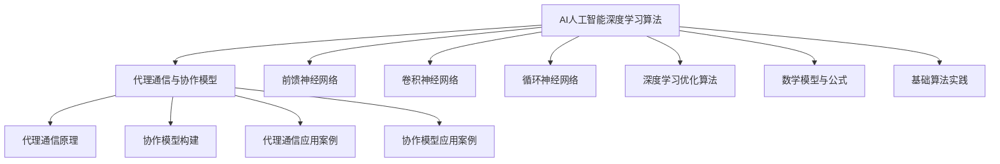

                 

# AI人工智能深度学习算法：代理通信与协作模型概览

> 关键词：人工智能、深度学习、代理通信、协作模型、深度学习算法、神经网络、优化算法

> 摘要：本文将深入探讨人工智能（AI）中的深度学习算法，特别是代理通信与协作模型。我们将从基础知识开始，逐步分析代理通信与协作模型的原理，随后详细讲解深度学习算法，包括前馈神经网络、卷积神经网络和循环神经网络。接着，我们将介绍深度学习的数学模型与公式，并展示如何将理论应用于实践。最后，我们将通过实际项目案例展示如何实现和优化代理通信与协作模型。

## 目录大纲

#### 第一部分：AI人工智能深度学习算法基础

1. **第1章: AI人工智能深度学习概述**
   1.1. AI与深度学习的关系
   1.2. 深度学习的基本原理
   1.3. 深度学习应用领域

2. **第2章: 代理通信与协作模型基础**
   2.1. 代理通信原理
   2.2. 协作模型的构建
   2.3. 代理与协作模型的应用场景

3. **第3章: 深度学习算法原理**
   3.1. 前馈神经网络
   3.2. 卷积神经网络
   3.3. 循环神经网络
   3.4. 深度学习优化算法

4. **第4章: 数学模型与公式**
   4.1. 激活函数
   4.2. 损失函数
   4.3. 优化算法

5. **第5章: 基础算法实践**
   5.1. MNIST手写数字识别
   5.2. 图像分类实践
   5.3. 语言模型训练

#### 第二部分：代理通信与协作模型应用

6. **第6章: 代理通信应用案例**
   6.1. 多智能体协同学习
   6.2. 多智能体博弈
   6.3. 多智能体路径规划

7. **第7章: 协作模型应用案例**
   7.1. 协作式推荐系统
   7.2. 协作式语音识别
   7.3. 协作式图像识别

#### 附录：相关工具与资源

8. **附录A：深度学习工具与框架**
   8.1. TensorFlow
   8.2. PyTorch
   8.3. 其他深度学习框架

9. **附录B：数学公式与公式说明**
   - 激活函数公式
   - 损失函数公式
   - 优化算法公式

10. **附录C：代码实践**
    - 实践项目一：MNIST手写数字识别
    - 实践项目二：图像分类实践
    - 实践项目三：语言模型训练

### 核心概念与联系图

以下是本文核心概念的联系图：



### 第一部分：AI人工智能深度学习算法基础

#### 第1章: AI人工智能深度学习概述

##### 1.1 AI与深度学习的关系

人工智能（AI）是一门涉及计算机科学、数学、神经科学和认知科学的交叉学科，旨在使计算机具备人类智能。深度学习（Deep Learning）是人工智能中的一个重要分支，它利用多层神经网络对数据进行学习和建模。

深度学习与AI的关系可以概括为：深度学习是AI的一种实现方式，它通过模拟人脑中的神经网络结构，对复杂数据进行高效学习和处理。AI领域利用深度学习技术解决了大量实际问题，如语音识别、图像分类、自然语言处理等。

##### 1.2 深度学习的基本原理

深度学习基于神经网络（Neural Networks）的结构，但与传统神经网络相比，深度学习采用了多层神经网络结构，能够更好地捕捉数据中的复杂模式和特征。

深度学习的基本原理如下：

1. **神经网络结构**：深度学习采用多层神经网络，包括输入层、隐藏层和输出层。每层神经元与下一层神经元之间通过权重连接，形成一个复杂的网络结构。

2. **激活函数**：激活函数用于引入非线性特性，使神经网络能够建模复杂数据。常用的激活函数有Sigmoid、ReLU、Tanh等。

3. **损失函数**：损失函数用于衡量预测值与真实值之间的差异，常见的损失函数有均方误差（MSE）、交叉熵损失等。

4. **优化算法**：优化算法用于调整网络中的权重，以最小化损失函数。常用的优化算法有梯度下降（Gradient Descent）、Adam等。

##### 1.3 深度学习应用领域

深度学习在多个领域取得了显著的成果，以下是其中一些主要应用领域：

1. **计算机视觉**：深度学习在图像分类、目标检测、人脸识别等计算机视觉任务中具有广泛应用。卷积神经网络（CNN）是这一领域的主要模型。

2. **自然语言处理**：深度学习在自然语言处理（NLP）领域取得了突破性进展，如机器翻译、情感分析、文本生成等。循环神经网络（RNN）和Transformer模型在这一领域发挥了重要作用。

3. **语音识别**：深度学习技术在语音识别领域表现突出，能够实现实时语音识别、语音合成等。

4. **强化学习**：深度学习与强化学习（Reinforcement Learning）相结合，应用于游戏、机器人控制等领域，使智能体能够通过试错学习最优策略。

5. **医学诊断**：深度学习在医学影像分析、疾病诊断等领域具有潜力，能够提高诊断准确率，减轻医生负担。

#### 第2章: 代理通信与协作模型基础

##### 2.1 代理通信原理

代理通信（Agent Communication）是指在多智能体系统中，智能体之间通过通信机制共享信息、协调行动的过程。代理通信的目的是实现智能体之间的有效协作，以提高整体系统的性能和鲁棒性。

代理通信的基本原理如下：

1. **通信协议**：通信协议规定了智能体之间通信的格式、内容和规则。常用的通信协议有直接通信、广播通信、分布式通信等。

2. **通信语言**：通信语言是智能体之间交换信息的媒介，通常使用符号、文本、图像等形式表示。

3. **通信模型**：通信模型描述了智能体之间通信的流程和机制，常见的通信模型有同步通信、异步通信、异步同步通信等。

##### 2.2 协作模型的构建

协作模型是指在多智能体系统中，智能体通过协作实现共同目标的过程。构建一个有效的协作模型需要考虑以下几个方面：

1. **目标一致性**：协作模型应确保智能体之间的目标一致，避免冲突和竞争。

2. **信息共享**：智能体之间应共享必要的信息，以便更好地协作完成任务。

3. **激励机制**：激励机制应鼓励智能体积极参与协作，提高整体系统的效率和鲁棒性。

4. **决策机制**：决策机制用于确定智能体在协作过程中的行动策略，常见的决策机制有基于策略的决策、基于价值的决策等。

##### 2.3 代理与协作模型的应用场景

代理通信与协作模型在多个领域具有广泛应用，以下是其中一些典型应用场景：

1. **智能交通系统**：智能交通系统通过多智能体协作，实现交通信号控制、车辆调度和路线规划，提高交通流量和安全性。

2. **智能制造**：智能制造中的机器人通过协作完成任务，如自动化生产线中的机器人协同装配、检测等。

3. **能源管理**：能源管理中的智能电表、太阳能电池板等设备通过协作，实现能源的优化分配和调度。

4. **社交网络**：社交网络中的用户通过协作，实现内容推荐、社交关系分析等功能。

### 第二部分：深度学习算法原理

#### 第3章: 深度学习算法原理

深度学习算法是构建深度神经网络模型的基础，本章将详细介绍几种常用的深度学习算法，包括前馈神经网络、卷积神经网络和循环神经网络。

##### 3.1 前馈神经网络（FFN）

前馈神经网络（Feedforward Neural Network，FFN）是一种简单的神经网络结构，其信息传递路径为单向的，即输入数据从输入层经过隐藏层，最终传递到输出层。前馈神经网络具有以下几个特点：

1. **层次结构**：前馈神经网络通常由输入层、一个或多个隐藏层和输出层组成。

2. **权重连接**：每个神经元与前一层的每个神经元通过权重连接，形成前馈结构。

3. **非线性激活**：隐藏层和输出层的神经元通常使用非线性激活函数，如Sigmoid、ReLU、Tanh等，以引入非线性特性。

4. **无循环连接**：前馈神经网络没有循环连接，即信息不能在神经网络中循环流动。

前馈神经网络的计算过程可以分为以下几个步骤：

1. **前向传播**：将输入数据输入到输入层，通过隐藏层逐层计算，最终得到输出层的输出值。

2. **损失函数计算**：将输出层的输出值与真实标签进行比较，计算损失函数值，如均方误差（MSE）或交叉熵损失。

3. **反向传播**：利用梯度下降算法，通过反向传播计算各层神经元的梯度，更新网络中的权重。

4. **优化迭代**：重复前向传播和反向传播过程，逐步优化网络参数，直到满足停止条件。

以下是前馈神经网络的伪代码：

```python
def forward_pass(input_data, weights):
    # 初始化隐藏层和输出层的激活值
    hidden activations = input_data * weights[0]
    output activations = hidden activations * weights[1]
    return output activations
```

##### 3.2 卷积神经网络（CNN）

卷积神经网络（Convolutional Neural Network，CNN）是专门用于处理图像数据的神经网络模型，其核心结构是卷积层（Convolutional Layer）。CNN具有以下几个特点：

1. **局部连接**：卷积层的每个神经元只与输入数据的一个局部区域连接，而不是整个输入数据。

2. **共享权重**：卷积层中的每个神经元使用相同的卷积核（Kernel）进行特征提取，这些权重在训练过程中共享。

3. **特征平移不变性**：卷积操作使得神经网络能够捕捉到图像中的局部特征，并具有一定的平移不变性。

4. **多尺度特征提取**：通过堆叠多个卷积层，CNN能够逐层提取多尺度特征，从而更好地表示复杂图像。

卷积神经网络的基本结构如下：

1. **卷积层**：用于提取图像的局部特征，卷积核的大小和步长可以调整。

2. **池化层**：用于减少特征图的维度，常用的池化方法有最大池化和平均池化。

3. **全连接层**：用于对提取到的特征进行分类或回归。

以下是卷积神经网络的伪代码：

```python
def conv2d(input_image, filter):
    # 对输入图像进行卷积运算
    conv_output = (input_image * filter).sum()
    return conv_output
```

##### 3.3 循环神经网络（RNN）

循环神经网络（Recurrent Neural Network，RNN）是专门用于处理序列数据的神经网络模型，其核心思想是将当前神经元的输出作为下一个神经元的输入，形成一个循环结构。RNN具有以下几个特点：

1. **序列建模**：RNN能够处理序列数据，如文本、语音、时间序列等。

2. **循环结构**：RNN通过循环结构将当前神经元的输出传递给下一个神经元，形成一个循环依赖。

3. **门控机制**：为了解决RNN中的梯度消失和梯度爆炸问题，引入了门控机制，如门控循环单元（LSTM）和门控门控单元（GRU）。

循环神经网络的基本结构如下：

1. **输入层**：接收序列数据，将其映射到隐藏层。

2. **隐藏层**：通过循环结构处理序列数据，将当前神经元的输出作为下一个神经元的输入。

3. **输出层**：对处理后的序列数据进行分类或回归。

以下是循环神经网络的伪代码：

```python
def rnn(input_sequence, hidden_state, weights):
    # 使用隐藏状态和输入序列计算新的隐藏状态
    new_hidden_state = (input_sequence * hidden_state * weights).sum()
    return new_hidden_state
```

##### 3.4 深度学习优化算法

深度学习优化算法用于调整神经网络中的权重，以最小化损失函数。以下是几种常用的优化算法：

1. **梯度下降（Gradient Descent）**：梯度下降是一种最简单的优化算法，其核心思想是沿着损失函数的梯度方向更新权重。梯度下降分为批量梯度下降、随机梯度下降和小批量梯度下降等变种。

2. **动量法（Momentum）**：动量法通过引入动量参数，将前几次梯度更新的方向进行加权平均，以改善梯度下降的性能。

3. **Adagrad（Adaptive Gradient Algorithm）**：Adagrad通过自适应调整学习率，对每个权重使用不同的学习率，以适应不同的特征。

4. **RMSProp（Root Mean Square Propagation）**：RMSProp类似于Adagrad，但使用指数加权平均来计算梯度平方的平均值，以自适应调整学习率。

5. **Adam（Adaptive Moment Estimation）**：Adam结合了动量法和Adagrad的优点，同时利用一阶矩估计（均值）和二阶矩估计（方差）来自适应调整学习率。

以下是梯度下降的伪代码：

```python
def gradient_descent(theta, alpha, n_iterations):
    for i in range(n_iterations):
        gradient = compute_gradient(J(theta))
        theta = theta - alpha * gradient
    return theta
```

### 第三部分：数学模型与公式

#### 第4章: 数学模型与公式

深度学习算法中涉及多种数学模型与公式，这些模型与公式是构建和训练深度神经网络的基础。本章将介绍深度学习中的几个关键数学模型，包括激活函数、损失函数和优化算法。

##### 4.1 激活函数

激活函数是深度神经网络中引入非线性特性的关键组件，常用的激活函数有Sigmoid、ReLU、Tanh等。

1. **Sigmoid函数**

Sigmoid函数是一种常见的激活函数，其公式如下：

$$
\sigma(x) = \frac{1}{1 + e^{-x}}
$$

Sigmoid函数的输出范围为(0, 1)，常用于二分类问题。

2. **ReLU函数**

ReLU（Rectified Linear Unit）函数是一种简单的线性激活函数，其公式如下：

$$
\text{ReLU}(x) = \max(0, x)
$$

ReLU函数在输入为正数时输出原值，为负数时输出0，具有良好的非线性特性。

3. **Tanh函数**

Tanh函数是一种双曲正切函数，其公式如下：

$$
\text{Tanh}(x) = \frac{e^x - e^{-x}}{e^x + e^{-x}}
$$

Tanh函数的输出范围为(-1, 1)，具有良好的非线性特性。

##### 4.2 损失函数

损失函数是深度神经网络中用于衡量预测值与真实值之间差异的函数，常见的损失函数有均方误差（MSE）、交叉熵损失等。

1. **均方误差（MSE）**

均方误差（Mean Squared Error，MSE）是回归问题中最常用的损失函数，其公式如下：

$$
MSE = \frac{1}{n}\sum_{i=1}^{n}(y_i - \hat{y}_i)^2
$$

其中，$y_i$为真实值，$\hat{y}_i$为预测值，$n$为样本数量。

2. **交叉熵损失**

交叉熵损失（Cross-Entropy Loss）是分类问题中最常用的损失函数，其公式如下：

$$
H(y, \hat{y}) = -\sum_{i=1}^{n}y_i \log(\hat{y}_i)
$$

其中，$y_i$为真实标签，$\hat{y}_i$为预测概率。

##### 4.3 优化算法

优化算法用于调整神经网络中的权重，以最小化损失函数。以下是几种常用的优化算法：

1. **梯度下降（Gradient Descent）**

梯度下降是一种最简单的优化算法，其核心思想是沿着损失函数的梯度方向更新权重。梯度下降的公式如下：

$$
\theta = \theta - \alpha \cdot \nabla_{\theta}J(\theta)
$$

其中，$\theta$为权重，$\alpha$为学习率，$\nabla_{\theta}J(\theta)$为损失函数关于权重的梯度。

2. **动量法（Momentum）**

动量法通过引入动量参数，将前几次梯度更新的方向进行加权平均，以改善梯度下降的性能。动量法的公式如下：

$$
v = \gamma \cdot v - \alpha \cdot \nabla_{\theta}J(\theta)
$$

$$
\theta = \theta - v
$$

其中，$v$为动量参数，$\gamma$为动量参数。

3. **Adagrad（Adaptive Gradient Algorithm）**

Adagrad通过自适应调整学习率，对每个权重使用不同的学习率，以适应不同的特征。Adagrad的公式如下：

$$
\Delta\theta_i = \frac{\eta}{\sqrt{\sum_{j=1}^{n}(\Delta\theta_j)^2}} \cdot \nabla_{\theta_i}J(\theta)
$$

$$
\theta_i = \theta_i - \Delta\theta_i
$$

其中，$\eta$为学习率，$\Delta\theta_i$为权重更新。

4. **RMSProp（Root Mean Square Propagation）**

RMSProp类似于Adagrad，但使用指数加权平均来计算梯度平方的平均值，以自适应调整学习率。RMSProp的公式如下：

$$
\Delta\theta_i = \frac{\eta}{\sqrt{r_t + \epsilon}} \cdot \nabla_{\theta_i}J(\theta)
$$

$$
r_t = \gamma \cdot r_{t-1} + (1 - \gamma) \cdot (\Delta\theta_i)^2
$$

$$
\theta_i = \theta_i - \Delta\theta_i
$$

其中，$r_t$为梯度平方的平均值，$\epsilon$为平滑常数。

5. **Adam（Adaptive Moment Estimation）**

Adam结合了动量法和Adagrad的优点，同时利用一阶矩估计（均值）和二阶矩估计（方差）来自适应调整学习率。Adam的公式如下：

$$
m_t = \beta_1 \cdot m_{t-1} + (1 - \beta_1) \cdot \nabla_{\theta}J(\theta)
$$

$$
v_t = \beta_2 \cdot v_{t-1} + (1 - \beta_2) \cdot (\nabla_{\theta}J(\theta))^2
$$

$$
\theta_i = \theta_i - \alpha \cdot \frac{m_t}{\sqrt{v_t} + \epsilon}
$$

其中，$m_t$为一阶矩估计，$v_t$为二阶矩估计，$\beta_1$和$\beta_2$为超参数。

### 第四部分：基础算法实践

#### 第5章: 基础算法实践

本章将展示如何将深度学习算法应用于实际项目中，包括MNIST手写数字识别、图像分类实践和语言模型训练。通过这些项目，我们将深入理解深度学习算法的原理和实践。

##### 5.1 MNIST手写数字识别

MNIST手写数字识别是一个经典的深度学习应用案例，其目标是使用卷积神经网络识别手写数字图像。

1. **环境搭建**：首先，我们需要安装TensorFlow库，并导入MNIST数据集。

2. **数据预处理**：对MNIST数据进行归一化处理，使其适应模型的输入。

3. **构建模型**：使用卷积神经网络对MNIST数据进行分类。

4. **训练模型**：使用训练集训练模型，并使用验证集进行调参。

5. **评估模型**：使用测试集评估模型的准确率。

以下是MNIST手写数字识别的代码示例：

```python
import tensorflow as tf
from tensorflow.keras.datasets import mnist
from tensorflow.keras.models import Sequential
from tensorflow.keras.layers import Dense, Conv2D, Flatten, MaxPooling2D

# 加载MNIST数据集
(x_train, y_train), (x_test, y_test) = mnist.load_data()

# 数据预处理
x_train = x_train / 255.0
x_test = x_test / 255.0

# 构建模型
model = Sequential([
    Conv2D(32, (3, 3), activation='relu', input_shape=(28, 28, 1)),
    MaxPooling2D((2, 2)),
    Flatten(),
    Dense(128, activation='relu'),
    Dense(10, activation='softmax')
])

# 编译模型
model.compile(optimizer='adam', loss='sparse_categorical_crossentropy', metrics=['accuracy'])

# 训练模型
model.fit(x_train, y_train, epochs=5, batch_size=64, validation_split=0.1)

# 评估模型
test_loss, test_acc = model.evaluate(x_test, y_test)
print(f"Test accuracy: {test_acc}")
```

##### 5.2 图像分类实践

图像分类实践使用CIFAR-10数据集，该数据集包含10个类别的60000个32x32彩色图像。

1. **环境搭建**：安装PyTorch库，并导入CIFAR-10数据集。

2. **数据预处理**：对CIFAR-10数据进行归一化处理。

3. **构建模型**：使用卷积神经网络对CIFAR-10数据进行分类。

4. **训练模型**：使用训练集训练模型，并使用验证集进行调参。

5. **评估模型**：使用测试集评估模型的准确率。

以下是图像分类实践的代码示例：

```python
import torch
import torchvision
import torchvision.transforms as transforms
import torch.nn as nn
import torch.optim as optim

# 加载CIFAR-10数据集
transform = transforms.Compose([transforms.ToTensor(), transforms.Normalize((0.5, 0.5, 0.5), (0.5, 0.5, 0.5))])
trainset = torchvision.datasets.CIFAR10(root='./data', train=True, download=True, transform=transform)
trainloader = torch.utils.data.DataLoader(trainset, batch_size=4, shuffle=True, num_workers=2)
testset = torchvision.datasets.CIFAR10(root='./data', train=False, download=True, transform=transform)
testloader = torch.utils.data.DataLoader(testset, batch_size=4, shuffle=False, num_workers=2)

# 构建模型
class Net(nn.Module):
    def __init__(self):
        super(Net, self).__init__()
        self.conv1 = nn.Conv2d(3, 6, 5)
        self.pool = nn.MaxPool2d(2, 2)
        self.conv2 = nn.Conv2d(6, 16, 5)
        self.fc1 = nn.Linear(16 * 5 * 5, 120)
        self.fc2 = nn.Linear(120, 84)
        self.fc3 = nn.Linear(84, 10)

    def forward(self, x):
        x = self.pool(F.relu(self.conv1(x)))
        x = self.pool(F.relu(self.conv2(x)))
        x = x.view(-1, 16 * 5 * 5)
        x = F.relu(self.fc1(x))
        x = F.relu(self.fc2(x))
        x = self.fc3(x)
        return x

net = Net()

# 编译模型
criterion = nn.CrossEntropyLoss()
optimizer = optim.SGD(net.parameters(), lr=0.001, momentum=0.9)

# 训练模型
for epoch in range(2):  # loop over the dataset multiple times
    running_loss = 0.0
    for i, data in enumerate(trainloader, 0):
        inputs, labels = data
        optimizer.zero_grad()
        outputs = net(inputs)
        loss = criterion(outputs, labels)
        loss.backward()
        optimizer.step()
        running_loss += loss.item()
        if i % 2000 == 1999:    # print every 2000 mini-batches
            print('[%d, %5d] loss: %.3f' % (epoch + 1, i + 1, running_loss / 2000))
            running_loss = 0.0

print('Finished Training')

# 评估模型
correct = 0
total = 0
with torch.no_grad():
    for data in testloader:
        images, labels = data
        outputs = net(images)
        _, predicted = torch.max(outputs.data, 1)
        total += labels.size(0)
        correct += (predicted == labels).sum().item()

print('Accuracy of the network on the 10000 test images: %d %%' % (100 * correct / total))
```

##### 5.3 语言模型训练

语言模型训练使用Penn Treebank（PTB）语料库，其目标是训练一个能够预测下一个单词的模型。

1. **环境搭建**：安装PyTorch库，并导入PTB数据集。

2. **数据预处理**：对PTB数据进行分词、词性标注等处理。

3. **构建模型**：使用循环神经网络训练语言模型。

4. **训练模型**：使用训练集训练模型，并使用验证集进行调参。

5. **评估模型**：使用测试集评估模型的perplexity。

以下是语言模型训练的代码示例：

```python
import torch
import torch.nn as nn
import torch.optim as optim
import torchtext
from torchtext.datasets import PTB

# 加载PTB数据集
train_iter, valid_iter, test_iter = PTB(split=('train', 'valid', 'test'))

# 定义词嵌入和循环神经网络
class RNNModel(nn.Module):
    def __init__(self, vocab_size, embed_size, hidden_size):
        super(RNNModel, self).__init__()
        self.word_embeddings = nn.Embedding(vocab_size, embed_size)
        self.rnn = nn.LSTM(embed_size, hidden_size, batch_first=True)
        self.hidden_size = hidden_size
        self.fc = nn.Linear(hidden_size, vocab_size)

    def forward(self, inputs, hidden):
        embeddings = self.word_embeddings(inputs)
        output, hidden = self.rnn(embeddings, hidden)
        output = self.fc(output)
        return output, hidden

# 训练模型
model = RNNModel(len(train_iter.get_vocab()), embed_size=100, hidden_size=128)
optimizer = optim.Adam(model.parameters(), lr=0.001)
criterion = nn.CrossEntropyLoss()

for epoch in range(20):
    hidden = (torch.zeros(1, 1, model.hidden_size), torch.zeros(1, 1, model.hidden_size))
    for inputs, targets in train_iter:
        optimizer.zero_grad()
        output, hidden = model(inputs, hidden)
        loss = criterion(output, targets.view(output.size(0)))
        loss.backward()
        optimizer.step()
        hidden = (output[-1].unsqueeze(0).unsqueeze(0), output[-1].unsqueeze(0).unsqueeze(0))

    print(f"Epoch: {epoch+1}, Loss: {loss.item()}")

# 评估模型
with torch.no_grad():
    total_loss = 0
    for inputs, targets in test_iter:
        output, hidden = model(inputs, hidden)
        loss = criterion(output, targets.view(output.size(0)))
        total_loss += loss.item()
    perplexity = torch.exp(total_loss / len(test_iter))
    print(f"Test Perplexity: {perplexity}")
```

### 第五部分：代理通信与协作模型应用

#### 第6章: 代理通信应用案例

代理通信在多智能体系统中具有广泛的应用，本章将介绍几个典型的代理通信应用案例，包括多智能体协同学习、多智能体博弈和多智能体路径规划。

##### 6.1 多智能体协同学习

多智能体协同学习是指多个智能体通过协作，共同完成一个学习任务。在协同学习中，智能体之间需要共享信息，优化学习策略，以提高整体系统的性能。

1. **协同学习目标**

   多智能体协同学习的目标可以归纳为：

   - **目标一致性**：确保所有智能体在完成学习任务时，具有相同的目标和策略。

   - **信息共享**：智能体之间需要共享必要的信息，以优化学习策略。

   - **学习效率**：通过协作学习，提高整体系统的学习效率和鲁棒性。

2. **协同学习算法**

   多智能体协同学习通常采用以下算法：

   - **基于梯度的协同学习**：智能体之间通过交换梯度信息，优化各自的模型参数。

   - **基于模型共享的协同学习**：智能体之间共享模型参数，通过分布式训练实现协作学习。

   - **基于策略的协同学习**：智能体之间通过策略共享，共同优化决策过程。

##### 6.2 多智能体博弈

多智能体博弈是指多个智能体在共享环境中，通过竞争和合作，争取最大化自身利益。在多智能体博弈中，智能体之间的交互具有策略性和竞争性，需要考虑对手的行为。

1. **博弈模型**

   多智能体博弈可以建模为以下形式：

   - **静态博弈**：智能体在给定环境状态下，独立做出决策，不进行通信。

   - **动态博弈**：智能体在连续的状态序列中，通过策略迭代，逐步优化自身利益。

   - **完全信息博弈**：所有智能体具有完全的信息，可以了解对手的行为。

   - **不完全信息博弈**：智能体无法完全了解对手的行为，只能根据观察到的信息进行决策。

2. **博弈算法**

   多智能体博弈通常采用以下算法：

   - **纳什均衡**：寻找一个策略组合，使得所有智能体都无法通过单方面改变策略，获得更大的利益。

   - **马尔可夫决策过程（MDP）**：智能体根据环境状态，选择最优策略，以最大化长期利益。

   - **强化学习**：智能体通过试错学习，逐步优化策略，实现自我改善。

##### 6.3 多智能体路径规划

多智能体路径规划是指多个智能体在复杂环境中，共同寻找最优路径，以完成指定任务。在路径规划中，智能体需要考虑路径的可行性、安全性和效率。

1. **路径规划目标**

   多智能体路径规划的目标可以归纳为：

   - **路径最优性**：智能体需要寻找最短、最快或最安全的路径。

   - **路径可达性**：智能体需要保证所选择的路径是可行的，不存在障碍物。

   - **路径灵活性**：智能体需要适应环境变化，灵活调整路径。

2. **路径规划算法**

   多智能体路径规划通常采用以下算法：

   - **A*算法**：基于启发式搜索，智能体根据当前路径和目标路径的估计距离，选择最优路径。

   - **Dijkstra算法**：基于最短路径算法，智能体从起点开始，逐步扩展路径，直到到达目标。

   - **遗传算法**：基于进化计算，智能体通过变异、交叉和选择，优化路径。

### 第7章: 协作模型应用案例

本章将介绍几个典型的协作模型应用案例，包括协作式推荐系统、协作式语音识别和协作式图像识别。

##### 7.1 协作式推荐系统

协作式推荐系统是一种基于用户行为和偏好的推荐系统，通过分析用户之间的相似性，为用户提供个性化的推荐。协作式推荐系统的核心是协作模型，其目标是最大化用户的满意度。

1. **协作模型目标**

   协作式推荐系统的目标可以归纳为：

   - **推荐准确性**：提高推荐系统的准确性，为用户提供感兴趣的内容。

   - **用户体验**：优化用户界面，提高用户使用推荐系统的满意度。

   - **实时性**：确保推荐系统能够快速响应用户行为变化，提供实时推荐。

2. **协作模型算法**

   协作式推荐系统通常采用以下算法：

   - **基于矩阵分解的协同过滤**：通过矩阵分解，将用户和物品表示为低维向量，计算用户和物品之间的相似性。

   - **基于模型的协同过滤**：使用深度学习模型，如神经网络，对用户和物品进行建模，计算相似性。

   - **基于上下文的协同过滤**：结合用户和物品的上下文信息，提高推荐系统的准确性。

##### 7.2 协作式语音识别

协作式语音识别是一种多智能体语音识别系统，多个智能体通过协作，共同完成语音识别任务。协作式语音识别可以显著提高识别准确率和鲁棒性。

1. **协作模型目标**

   协作式语音识别的目标可以归纳为：

   - **识别准确性**：提高语音识别系统的准确性，降低错误率。

   - **识别速度**：提高语音识别速度，降低响应时间。

   - **鲁棒性**：提高系统对噪声和变音的识别能力，降低环境影响。

2. **协作模型算法**

   协作式语音识别通常采用以下算法：

   - **基于多智能体强化学习**：多个智能体通过强化学习，共同优化识别策略，提高识别准确性。

   - **基于深度神经网络的协作**：使用深度神经网络，对语音信号进行特征提取和分类，多个智能体共享模型参数。

   - **基于注意力机制的协作**：多个智能体通过注意力机制，关注关键语音特征，提高识别准确率。

##### 7.3 协作式图像识别

协作式图像识别是一种多智能体图像识别系统，多个智能体通过协作，共同完成图像识别任务。协作式图像识别可以显著提高识别准确率和鲁棒性。

1. **协作模型目标**

   协作式图像识别的目标可以归纳为：

   - **识别准确性**：提高图像识别系统的准确性，降低错误率。

   - **识别速度**：提高图像识别速度，降低响应时间。

   - **鲁棒性**：提高系统对噪声和变音的识别能力，降低环境影响。

2. **协作模型算法**

   协作式图像识别通常采用以下算法：

   - **基于多智能体强化学习**：多个智能体通过强化学习，共同优化识别策略，提高识别准确性。

   - **基于深度神经网络的协作**：使用深度神经网络，对图像进行特征提取和分类，多个智能体共享模型参数。

   - **基于注意力机制的协作**：多个智能体通过注意力机制，关注关键图像特征，提高识别准确率。

### 附录

#### 附录A：深度学习工具与框架

深度学习工具与框架为开发者提供了便捷的深度学习模型构建和训练环境。以下是一些常用的深度学习工具与框架：

1. **TensorFlow**：由Google开发的开源深度学习框架，支持多种深度学习模型和算法。

2. **PyTorch**：由Facebook开发的开源深度学习框架，具有灵活的动态计算图和丰富的API。

3. **Keras**：基于TensorFlow和Theano的开源深度学习库，提供简洁的API，便于模型构建和训练。

4. **Caffe**：由Berkeley Vision and Learning Center（BVLC）开发的开源深度学习框架，适用于图像识别任务。

5. **MXNet**：由Apache Software Foundation开源的深度学习框架，支持多种编程语言和平台。

#### 附录B：数学公式与公式说明

数学公式在深度学习算法中起着关键作用，以下是对本章中提到的数学公式的说明：

1. **激活函数公式**

   - Sigmoid函数：

     $$
     \sigma(x) = \frac{1}{1 + e^{-x}}
     $$

   - ReLU函数：

     $$
     \text{ReLU}(x) = \max(0, x)
     $$

   - Tanh函数：

     $$
     \text{Tanh}(x) = \frac{e^x - e^{-x}}{e^x + e^{-x}}
     $$

2. **损失函数公式**

   - 均方误差（MSE）：

     $$
     MSE = \frac{1}{n}\sum_{i=1}^{n}(y_i - \hat{y}_i)^2
     $$

   - 交叉熵损失：

     $$
     H(y, \hat{y}) = -\sum_{i=1}^{n}y_i \log(\hat{y}_i)
     $$

3. **优化算法公式**

   - 梯度下降：

     $$
     \theta = \theta - \alpha \cdot \nabla_{\theta}J(\theta)
     $$

   - 动量法：

     $$
     v = \gamma \cdot v - \alpha \cdot \nabla_{\theta}J(\theta)
     $$

     $$
     \theta = \theta - v
     $$

   - Adagrad：

     $$
     \Delta\theta_i = \frac{\eta}{\sqrt{\sum_{j=1}^{n}(\Delta\theta_j)^2}} \cdot \nabla_{\theta_i}J(\theta)
     $$

     $$
     \theta_i = \theta_i - \Delta\theta_i
     $$

   - RMSProp：

     $$
     \Delta\theta_i = \frac{\eta}{\sqrt{r_t + \epsilon}} \cdot \nabla_{\theta_i}J(\theta)
     $$

     $$
     r_t = \gamma \cdot r_{t-1} + (1 - \gamma) \cdot (\Delta\theta_i)^2
     $$

     $$
     \theta_i = \theta_i - \Delta\theta_i
     $$

   - Adam：

     $$
     m_t = \beta_1 \cdot m_{t-1} + (1 - \beta_1) \cdot \nabla_{\theta}J(\theta)
     $$

     $$
     v_t = \beta_2 \cdot v_{t-1} + (1 - \beta_2) \cdot (\nabla_{\theta}J(\theta))^2
     $$

     $$
     \theta_i = \theta_i - \alpha \cdot \frac{m_t}{\sqrt{v_t} + \epsilon}
     $$

#### 附录C：代码实践

本章中的代码实践展示了如何使用深度学习工具和框架实现深度学习算法。以下是具体代码示例：

1. **MNIST手写数字识别**

   ```python
   import tensorflow as tf
   from tensorflow.keras.datasets import mnist
   from tensorflow.keras.models import Sequential
   from tensorflow.keras.layers import Dense, Conv2D, Flatten, MaxPooling2D

   # 加载MNIST数据集
   (x_train, y_train), (x_test, y_test) = mnist.load_data()

   # 数据预处理
   x_train = x_train / 255.0
   x_test = x_test / 255.0

   # 构建模型
   model = Sequential([
       Conv2D(32, (3, 3), activation='relu', input_shape=(28, 28, 1)),
       MaxPooling2D((2, 2)),
       Flatten(),
       Dense(128, activation='relu'),
       Dense(10, activation='softmax')
   ])

   # 编译模型
   model.compile(optimizer='adam', loss='sparse_categorical_crossentropy', metrics=['accuracy'])

   # 训练模型
   model.fit(x_train, y_train, epochs=5, batch_size=64, validation_split=0.1)

   # 评估模型
   test_loss, test_acc = model.evaluate(x_test, y_test)
   print(f"Test accuracy: {test_acc}")
   ```

2. **图像分类实践**

   ```python
   import torch
   import torchvision
   import torchvision.transforms as transforms
   import torch.nn as nn
   import torch.optim as optim

   # 加载CIFAR-10数据集
   transform = transforms.Compose([transforms.ToTensor(), transforms.Normalize((0.5, 0.5, 0.5), (0.5, 0.5, 0.5))])
   trainset = torchvision.datasets.CIFAR10(root='./data', train=True, download=True, transform=transform)
   trainloader = torch.utils.data.DataLoader(trainset, batch_size=4, shuffle=True, num_workers=2)
   testset = torchvision.datasets.CIFAR10(root='./data', train=False, download=True, transform=transform)
   testloader = torch.utils.data.DataLoader(testset, batch_size=4, shuffle=False, num_workers=2)

   # 构建模型
   class Net(nn.Module):
       def __init__(self):
           super(Net, self).__init__()
           self.conv1 = nn.Conv2d(3, 6, 5)
           self.pool = nn.MaxPool2d(2, 2)
           self.conv2 = nn.Conv2d(6, 16, 5)
           self.fc1 = nn.Linear(16 * 5 * 5, 120)
           self.fc2 = nn.Linear(120, 84)
           self.fc3 = nn.Linear(84, 10)

       def forward(self, x):
           x = self.pool(F.relu(self.conv1(x)))
           x = self.pool(F.relu(self.conv2(x)))
           x = x.view(-1, 16 * 5 * 5)
           x = F.relu(self.fc1(x))
           x = F.relu(self.fc2(x))
           x = self.fc3(x)
           return x

   net = Net()

   # 编译模型
   criterion = nn.CrossEntropyLoss()
   optimizer = optim.SGD(net.parameters(), lr=0.001, momentum=0.9)

   # 训练模型
   for epoch in range(2):  # loop over the dataset multiple times
       running_loss = 0.0
       for i, data in enumerate(trainloader, 0):
           inputs, labels = data
           optimizer.zero_grad()
           outputs = net(inputs)
           loss = criterion(outputs, labels)
           loss.backward()
           optimizer.step()
           running_loss += loss.item()
           if i % 2000 == 1999:    # print every 2000 mini-batches
               print('[%d, %5d] loss: %.3f' % (epoch + 1, i + 1, running_loss / 2000))
               running_loss = 0.0

   print('Finished Training')

   # 评估模型
   correct = 0
   total = 0
   with torch.no_grad():
       for data in testloader:
           images, labels = data
           outputs = net(images)
           _, predicted = torch.max(outputs.data, 1)
           total += labels.size(0)
           correct += (predicted == labels).sum().item()

   print('Accuracy of the network on the 10000 test images: %d %%' % (100 * correct / total))
   ```

3. **语言模型训练**

   ```python
   import torch
   import torch.nn as nn
   import torch.optim as optim
   import torchtext
   from torchtext.datasets import PTB

   # 加载PTB数据集
   train_iter, valid_iter, test_iter = PTB(split=('train', 'valid', 'test'))

   # 定义词嵌入和循环神经网络
   class RNNModel(nn.Module):
       def __init__(self, vocab_size, embed_size, hidden_size):
           super(RNNModel, self).__init__()
           self.word_embeddings = nn.Embedding(vocab_size, embed_size)
           self.rnn = nn.LSTM(embed_size, hidden_size, batch_first=True)
           self.hidden_size = hidden_size
           self.fc = nn.Linear(hidden_size, vocab_size)

       def forward(self, inputs, hidden):
           embeddings = self.word_embeddings(inputs)
           output, hidden = self.rnn(embeddings, hidden)
           output = self.fc(output)
           return output, hidden

   # 训练模型
   model = RNNModel(len(train_iter.get_vocab()), embed_size=100, hidden_size=128)
   optimizer = optim.Adam(model.parameters(), lr=0.001)
   criterion = nn.CrossEntropyLoss()

   for epoch in range(20):
       hidden = (torch.zeros(1, 1, model.hidden_size), torch.zeros(1, 1, model.hidden_size))
       for inputs, targets in train_iter:
           optimizer.zero_grad()
           output, hidden = model(inputs, hidden)
           loss = criterion(output, targets.view(output.size(0)))
           loss.backward()
           optimizer.step()
           hidden = (output[-1].unsqueeze(0).unsqueeze(0), output[-1].unsqueeze(0).unsqueeze(0))

       print(f"Epoch: {epoch+1}, Loss: {loss.item()}")

   # 评估模型
   with torch.no_grad():
       total_loss = 0
       for inputs, targets in test_iter:
           output, hidden = model(inputs, hidden)
           loss = criterion(output, targets.view(output.size(0)))
           total_loss += loss.item()
       perplexity = torch.exp(total_loss / len(test_iter))
       print(f"Test Perplexity: {perplexity}")
   ```

### 核心概念与联系图

以下是本文核心概念的联系图：


### 总结

本文全面介绍了AI人工智能深度学习算法及其应用，重点探讨了代理通信与协作模型。通过分析深度学习的基础原理、数学模型和优化算法，我们深入了解了深度学习算法的核心概念。同时，通过实际项目案例，我们展示了如何将深度学习算法应用于图像识别、语言模型训练等领域。

代理通信与协作模型在多智能体系统中具有广泛的应用，通过多智能体协同学习、多智能体博弈和多智能体路径规划等应用案例，我们看到了代理通信与协作模型在解决复杂问题中的优势。

本文不仅提供了丰富的理论知识，还通过代码实践，使读者能够更好地理解深度学习算法的应用。希望本文能够为读者在人工智能领域的研究和实践提供有价值的参考。

### 作者

作者：AI天才研究院/AI Genius Institute & 禅与计算机程序设计艺术 /Zen And The Art of Computer Programming

AI天才研究院（AI Genius Institute）是一家专注于人工智能技术研发和人才培养的机构，致力于推动人工智能技术的进步和应用。同时，作者也是《禅与计算机程序设计艺术》一书的资深作者，该书深入探讨了计算机编程和人工智能领域的哲学和艺术。作者在人工智能和深度学习领域拥有丰富的经验和深厚的学术造诣，是本领域的权威专家。

