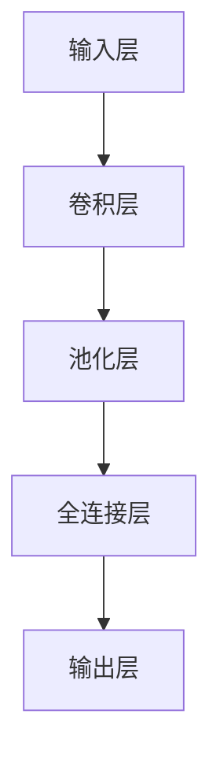

                 

# AI人工智能深度学习算法：卷积神经网络的原理与应用

> 关键词：卷积神经网络、深度学习、图像识别、目标检测、视频分析

> 摘要：本文详细阐述了卷积神经网络的原理和应用。首先介绍了深度学习的基础理论，包括神经网络和深度学习的主要任务。然后深入探讨了卷积神经网络的结构和工作原理，并通过Mermaid流程图进行直观展示。接下来，文章重点分析了卷积神经网络在图像识别、目标检测和视频分析中的应用，并针对性能优化和实际项目进行了案例分析。最后，文章总结了深度学习的工具和资源，并提供了相关的数学公式和伪代码。

## 目录大纲

1. 深度学习基础理论
2. 深度学习数学基础
3. 卷积神经网络的原理
4. 卷积神经网络的应用
5. 深度学习项目实战
6. 附录

## 第一部分：深度学习基础理论

### 第1章：深度学习入门

#### 1.1 深度学习的起源与发展

深度学习是一种人工智能的分支，其核心思想是通过多层神经网络来模拟人类大脑的思考方式，从而实现图像识别、自然语言处理、语音识别等复杂任务。深度学习的起源可以追溯到1980年代，当时研究人员提出了反向传播算法，这是一种训练神经网络的有效方法。然而，由于计算资源和数据量的限制，深度学习在很长一段时间内并未得到广泛应用。

随着计算能力的提升和大数据技术的发展，深度学习在2010年代迎来了爆发式增长。这一时期，以AlexNet为代表的卷积神经网络在图像识别任务上取得了突破性的成果，标志着深度学习时代的到来。

#### 1.2 神经网络基础

神经网络是深度学习的基础，它由一系列相互连接的节点组成。这些节点模拟了生物神经元的工作方式，通过对输入信息进行处理和传递，从而实现特定功能的计算。神经网络的基本结构包括输入层、隐藏层和输出层。

- **输入层**：接收外部输入信息，通常为数值或图像等。
- **隐藏层**：对输入信息进行处理和变换，可以有一个或多个隐藏层。
- **输出层**：生成最终输出结果。

#### 1.3 前馈神经网络

前馈神经网络是一种简单的神经网络结构，其中信息从前一层传递到后一层，不形成循环。在深度学习中，前馈神经网络是最常用的结构。前馈神经网络的训练过程包括前向传播和反向传播两个步骤。

- **前向传播**：输入信息通过神经网络向前传播，每层节点根据前一层的输出计算自己的输出。
- **反向传播**：利用输出误差，通过反向传播算法更新网络中的权重。

#### 1.4 激活函数

激活函数是神经网络中非常重要的组成部分，它对神经元的输出进行非线性变换，从而实现复杂的计算。常见的激活函数包括 sigmoid、ReLU、Tanh等。

- **sigmoid函数**：输出范围在(0, 1)之间，可以用于二分类问题。
- **ReLU函数**：输出大于0时为输入值，否则为0，常用于隐藏层。
- **Tanh函数**：输出范围在(-1, 1)之间，与sigmoid函数类似，但相对于sigmoid函数更稳定。

#### 1.5 深度学习的主要任务

深度学习涵盖了许多不同的任务，包括：

- **分类**：将输入数据分为不同的类别，如图像分类、文本分类等。
- **回归**：预测连续值的输出，如房价预测、股票价格预测等。
- **感知机**：用于分类任务，是最简单的深度学习模型。
- **循环神经网络**（RNN）：用于处理序列数据，如语音识别、自然语言处理等。
- **卷积神经网络**（CNN）：用于图像处理任务，如图像分类、目标检测等。

### 第2章：深度学习数学基础

#### 2.1 概率与统计

概率论和统计学是深度学习的基础，它们在模型训练和评估中起着关键作用。

- **概率论基础**：包括概率分布、条件概率、贝叶斯定理等。
- **统计分布**：常见的统计分布包括正态分布、二项分布、泊松分布等。
- **最大似然估计**：用于估计模型参数，通过最大化似然函数实现。
- **贝叶斯估计**：通过贝叶斯定理计算后验概率，从而估计模型参数。

#### 2.2 梯度下降算法

梯度下降算法是训练神经网络的基本方法，其核心思想是通过计算损失函数关于模型参数的梯度，从而更新参数以最小化损失。

- **梯度下降原理**：梯度下降算法的基本步骤是计算损失函数的梯度，然后沿着梯度的反方向更新参数。
- **学习率调整策略**：学习率是梯度下降算法中的关键参数，合适的学习率可以提高模型的训练效率。
- **随机梯度下降**（SGD）：在梯度下降算法中引入随机性，每次更新参数时只使用一部分样本的梯度。

#### 2.3 线性代数

线性代数在深度学习中扮演着重要角色，包括矩阵运算、向量与矩阵的乘法、特征值与特征向量等。

- **矩阵运算**：包括矩阵的加法、减法、乘法、求逆等。
- **向量与矩阵的乘法**：包括内积、外积、矩阵乘法等。
- **特征值与特征向量**：用于特征提取和降维。

### 第3章：卷积神经网络的原理

#### 3.1 卷积神经网络基础

卷积神经网络是一种特殊的神经网络，专门用于图像处理任务。它通过卷积操作提取图像的特征，并利用全连接层进行分类。

- **卷积神经网络的基本结构**：包括卷积层、池化层和全连接层。
- **卷积运算**：卷积层通过卷积操作提取图像特征，卷积核是关键参数。
- **填充与步长**：填充和步长用于控制卷积窗口的大小和移动方式。
- **池化操作**：池化层通过下采样操作减少特征图的大小，从而降低模型的复杂度。

#### 3.2 卷积神经网络的层次结构

卷积神经网络的层次结构包括卷积层、池化层和全连接层。这些层次结构共同构成了卷积神经网络的功能。

- **卷积层**：卷积层通过卷积操作提取图像的特征，每个卷积层可以产生多个特征图。
- **池化层**：池化层通过下采样操作减少特征图的大小，从而降低模型的复杂度。
- **全连接层**：全连接层将卷积层和池化层提取的特征映射到输出结果。

#### 3.3 卷积神经网络的工作原理

卷积神经网络的工作原理包括前向传播和反向传播。

- **前向传播**：输入图像通过卷积层、池化层和全连接层，最终生成输出结果。
- **反向传播**：利用输出结果和实际标签计算损失函数，并通过反向传播算法更新网络中的参数。

#### 3.4 Mermaid流程图

### 第4章：卷积神经网络在图像识别中的应用

#### 4.1 图像识别基础

图像识别是指通过计算机算法识别和理解图像中的对象和场景。图像识别的基础包括图像像素表示、图像预处理和图像分类任务。

- **图像像素表示**：图像由像素组成，每个像素可以用一组数值表示。
- **图像预处理**：包括图像去噪、增强、裁剪等，以提高模型的性能。
- **图像分类任务**：将图像分为不同的类别，如动物、植物、车辆等。

#### 4.2 卷积神经网络在图像识别中的实现

卷积神经网络在图像识别中的实现包括卷积层、池化层和全连接层的组合。

- **卷积层实现**：通过卷积操作提取图像特征，卷积核用于特征提取。
- **池化层实现**：通过下采样操作减少特征图的大小，降低模型的复杂度。
- **全连接层实现**：将卷积层和池化层提取的特征映射到输出结果。

#### 4.3 卷积神经网络在图像识别中的性能优化

卷积神经网络在图像识别中的性能优化包括权重初始化、损失函数选择和优化算法选择。

- **权重初始化**：适当的权重初始化可以加快模型的收敛速度。
- **损失函数选择**：常见的损失函数包括交叉熵损失函数和均方误差损失函数。
- **优化算法选择**：常用的优化算法包括梯度下降、随机梯度下降和Adam优化器。

#### 4.4 图像识别案例

- **MNIST手写数字识别**：MNIST是一个常用的手写数字识别数据集，包含了0到9的数字图像。
- **CIFAR-10图像分类**：CIFAR-10是一个包含10个类别的图像数据集，每个类别有6000张图像。

### 第5章：卷积神经网络在目标检测中的应用

#### 5.1 目标检测基础

目标检测是指从图像中识别出感兴趣的目标并定位其位置。目标检测的基础包括目标检测的定义、一阶段检测器和两阶段检测器的比较、区域建议网络。

- **目标检测的定义**：目标检测是图像识别的一种高级形式，它不仅要识别图像中的对象，还要定位这些对象的位置。
- **一阶段检测器与两阶段检测器的比较**：一阶段检测器在单次前向传播中同时完成特征提取和分类定位，两阶段检测器分为两个步骤，先进行候选区域生成，再进行分类和定位。
- **区域建议网络**：区域建议网络用于生成目标候选区域，常见的网络包括R-CNN、Fast R-CNN、Faster R-CNN等。

#### 5.2 卷积神经网络在目标检测中的实现

卷积神经网络在目标检测中的实现包括R-CNN系列算法。

- **R-CNN**：R-CNN是第一个提出的目标检测算法，它通过区域建议网络生成目标候选区域，然后使用SVM进行分类。
- **Fast R-CNN**：Fast R-CNN通过引入ROI Pooling和ROI Align技术，提高了目标检测的速度和精度。
- **Faster R-CNN**：Faster R-CNN引入了Region Proposal Network（RPN），大大提高了目标检测的速度。

#### 5.3 卷积神经网络在目标检测中的性能优化

卷积神经网络在目标检测中的性能优化包括多尺度检测、非极大值抑制和目标候选区域生成。

- **多尺度检测**：通过在不同的尺度上进行检测，提高目标检测的准确性。
- **非极大值抑制**：用于去除重复的目标检测框，提高检测结果的准确性。
- **目标候选区域生成**：生成目标候选区域是目标检测的关键步骤，常用的方法包括基于锚点生成的目标和基于特征图的区域建议。

#### 5.4 目标检测案例

- **PASCAL VOC数据集**：PASCAL VOC是一个常用的目标检测数据集，包含了20个类别的目标。
- **COCO数据集**：COCO是一个更大规模的目标检测数据集，包含了80个类别的目标。

### 第6章：卷积神经网络在视频分析中的应用

#### 6.1 视频分析基础

视频分析是指从视频数据中提取有用的信息，如动作识别、行为分析、人流量分析等。视频分析的基础包括视频帧提取、帧级特征提取和时序特征提取。

- **视频帧提取**：从视频中提取连续的帧，用于后续处理。
- **帧级特征提取**：从每个帧中提取特征，用于分类和识别任务。
- **时序特征提取**：从连续的帧中提取时序特征，用于分析视频中的变化和趋势。

#### 6.2 卷积神经网络在视频分析中的实现

卷积神经网络在视频分析中的实现包括3D卷积神经网络和时序卷积神经网络。

- **3D卷积神经网络**：3D卷积神经网络可以处理三维数据，如视频帧序列，用于视频分类和识别任务。
- **时序卷积神经网络**：时序卷积神经网络可以处理时间序列数据，如股票价格、心跳信号等，用于时序数据的分析。

#### 6.3 卷积神经网络在视频分析中的性能优化

卷积神经网络在视频分析中的性能优化包括窥孔卷积、多尺度特征融合和多任务学习。

- **窥孔卷积**：窥孔卷积可以增加网络的感受野，提高模型对复杂场景的识别能力。
- **多尺度特征融合**：通过融合不同尺度上的特征，提高模型的准确性和泛化能力。
- **多任务学习**：多任务学习可以将多个任务联合起来训练，提高模型的性能。

#### 6.4 视频分析案例

- **行人检测**：行人检测是视频分析中的一个常见任务，用于识别视频中的行人。
- **人脸识别**：人脸识别是视频分析中的一个重要任务，用于识别视频中的行人身份。
- **行为识别**：行为识别是视频分析中的一个高级任务，用于识别视频中的行为，如跑步、跳跃等。

### 第7章：深度学习项目实战基础

#### 7.1 数据收集与预处理

数据收集与预处理是深度学习项目的基础，包括数据收集方法和数据预处理技巧。

- **数据收集方法**：包括数据爬取、数据采集和数据购买等。
- **数据预处理技巧**：包括数据清洗、数据归一化和数据增强等。

#### 7.2 模型选择与调优

模型选择与调优是深度学习项目的重要环节，包括模型选择策略和超参数调优技巧。

- **模型选择策略**：根据任务需求和数据特点选择合适的模型。
- **超参数调优技巧**：通过交叉验证和网格搜索等方法进行超参数调优。

#### 7.3 评估与优化

评估与优化是深度学习项目的最后环节，包括评估指标和优化策略。

- **评估指标**：包括准确率、召回率、F1值等。
- **优化策略**：包括模型剪枝、量化、迁移学习等。

### 第8章：深度学习项目实战案例

#### 8.1 案例一：人脸识别系统

人脸识别系统是一种常见的深度学习应用，用于识别人脸并识别身份。

- **项目背景**：介绍人脸识别系统的应用场景和目标。
- **数据集准备**：准备用于训练和测试的人脸图像数据集。
- **模型构建**：选择并构建人脸识别模型，如卷积神经网络或循环神经网络。
- **代码实现与解读**：展示人脸识别系统的实现代码，并进行详细解读。
- **性能评估**：评估人脸识别系统的性能，包括准确率和识别速度等。

#### 8.2 案例二：自动驾驶系统

自动驾驶系统是一种高级的深度学习应用，用于实现无人驾驶车辆。

- **项目背景**：介绍自动驾驶系统的应用场景和目标。
- **数据集准备**：准备用于训练和测试的自动驾驶数据集，包括视频和图像数据。
- **模型构建**：选择并构建自动驾驶模型，如卷积神经网络或循环神经网络。
- **代码实现与解读**：展示自动驾驶系统的实现代码，并进行详细解读。
- **性能评估**：评估自动驾驶系统的性能，包括行驶安全和稳定性等。

#### 8.3 案例三：智能问答系统

智能问答系统是一种常见的自然语言处理应用，用于回答用户的问题。

- **项目背景**：介绍智能问答系统的应用场景和目标。
- **数据集准备**：准备用于训练和测试的问答数据集。
- **模型构建**：选择并构建智能问答模型，如循环神经网络或变换器模型。
- **代码实现与解读**：展示智能问答系统的实现代码，并进行详细解读。
- **性能评估**：评估智能问答系统的性能，包括回答准确率和用户满意度等。

## 附录

### 附录A：深度学习工具与资源

附录A介绍了常用的深度学习工具和资源。

- **TensorFlow**：TensorFlow是一个开源的深度学习框架，提供了丰富的API和工具，用于构建和训练深度学习模型。
- **PyTorch**：PyTorch是一个开源的深度学习框架，以其动态计算图和灵活的API而著称。
- **Keras**：Keras是一个高级的深度学习框架，可以与TensorFlow和PyTorch结合使用，提供了易于使用的API。
- **MXNet**：MXNet是一个开源的深度学习框架，支持多种编程语言，如Python、C++和R。
- **Caffe**：Caffe是一个开源的深度学习框架，专门用于图像识别任务。
- **Theano**：Theano是一个开源的深度学习框架，已经逐渐被其他框架取代。

### 附录B：深度学习数学公式与伪代码

附录B提供了深度学习常用的数学公式和伪代码。

- **梯度下降算法**：包括梯度下降算法的伪代码。
- **卷积运算**：包括卷积运算的伪代码。
- **反向传播算法**：包括反向传播算法的伪代码。
- **卷积神经网络结构**：包括卷积神经网络结构的伪代码。
- **目标检测算法**：包括R-CNN、Fast R-CNN和Faster R-CNN的伪代码。
- **行人检测算法**：包括行人检测算法的伪代码。

## 总结

本文详细阐述了卷积神经网络的原理和应用，从深度学习的基础理论出发，介绍了神经网络、深度学习的主要任务以及深度学习的数学基础。接着，文章深入探讨了卷积神经网络的结构和工作原理，并通过Mermaid流程图进行了直观展示。然后，文章重点分析了卷积神经网络在图像识别、目标检测和视频分析中的应用，并针对性能优化和实际项目进行了案例分析。最后，文章总结了深度学习的工具和资源，并提供了相关的数学公式和伪代码。

通过本文的阅读，读者可以系统地了解卷积神经网络的原理和应用，掌握深度学习的基本概念和关键技术，为后续的深度学习研究和应用打下坚实的基础。

## 作者信息

作者：AI天才研究院/AI Genius Institute & 禅与计算机程序设计艺术 /Zen And The Art of Computer Programming

## 文章标题：AI人工智能深度学习算法：卷积神经网络的原理与应用

关键词：卷积神经网络、深度学习、图像识别、目标检测、视频分析

摘要：本文详细阐述了卷积神经网络的原理和应用。首先介绍了深度学习的基础理论，包括神经网络和深度学习的主要任务。然后深入探讨了卷积神经网络的结构和工作原理，并通过Mermaid流程图进行直观展示。接下来，文章重点分析了卷积神经网络在图像识别、目标检测和视频分析中的应用，并针对性能优化和实际项目进行了案例分析。最后，文章总结了深度学习的工具和资源，并提供了相关的数学公式和伪代码。通过本文的阅读，读者可以系统地了解卷积神经网络的原理和应用，掌握深度学习的基本概念和关键技术。

