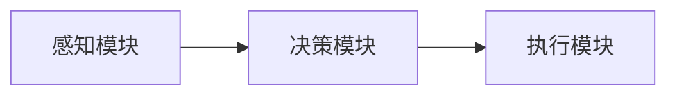
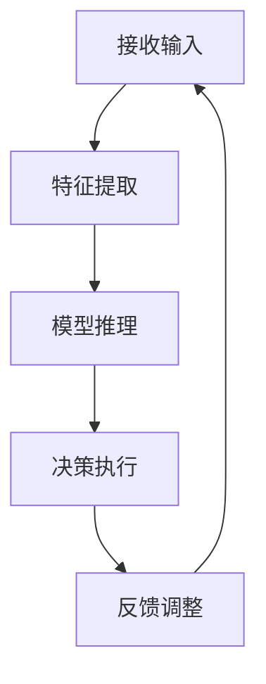

                 

### 文章标题

### AI人工智能深度学习算法：智能深度学习代理的推理机制

#### 关键词：AI人工智能、深度学习、智能深度学习代理、推理机制

> 摘要：本文将深入探讨AI人工智能深度学习算法的核心原理，重点解析智能深度学习代理的推理机制。通过逐步分析，我们将理解深度学习在AI中的应用，以及智能深度学习代理如何实现高效推理和决策。文章还将介绍深度学习算法的实践应用，并展望未来的发展趋势。

---

### 第一部分：AI人工智能深度学习算法概述

#### 第1章：AI人工智能与深度学习基础

#### 1.1 AI与人工智能概述

**AI的概念与分类**

人工智能（Artificial Intelligence，简称AI）是指计算机系统模拟人类智能行为和决策能力的技术。AI可以分为几种主要类型：

1. **弱AI（Weak AI）**：专注于特定任务，如语音识别、图像识别等。
2. **强AI（Strong AI）**：具备全面的人类智能，能够理解和执行任何智力任务。
3. **自然智能（Natural AI）**：与人类智能相似，但不限于生物体的实现。

**人工智能的发展历史与趋势**

人工智能的发展经历了多个阶段：

1. **符号人工智能（Symbolic AI）**：20世纪50年代至80年代，基于符号逻辑和推理。
2. **连接主义人工智能（Connectionist AI）**：20世纪80年代至今，基于神经网络和机器学习。
3. **混合人工智能（Hybrid AI）**：结合符号和连接主义方法，以实现更好的智能表现。

**深度学习在人工智能中的地位与作用**

深度学习是AI领域的一项关键技术，其在人工智能中的应用如下：

1. **图像识别**：通过卷积神经网络（CNN）实现高效的图像分类和识别。
2. **自然语言处理**：通过循环神经网络（RNN）和Transformer模型，处理文本和语音数据。
3. **语音识别**：结合CNN和RNN，实现高精度的语音识别。
4. **推荐系统**：使用深度学习模型预测用户偏好，提供个性化推荐。

#### 1.2 深度学习基本原理

**神经网络的概念与结构**

神经网络（Neural Network，简称NN）是深度学习的基础。它由大量简单单元（神经元）组成，通过加权连接实现信息传递和处理。

**深度学习算法的基本原理**

深度学习算法通过多层神经网络实现复杂的非线性变换，逐步提取数据的特征表示。

1. **前向传播（Forward Propagation）**：输入数据经过神经网络，逐层计算输出。
2. **反向传播（Back Propagation）**：利用输出误差，反向更新网络权重。

**神经网络的训练与优化**

神经网络的训练过程涉及以下步骤：

1. **数据预处理**：归一化、去噪、数据增强等。
2. **模型初始化**：随机初始化权重和偏置。
3. **损失函数**：衡量模型输出与实际输出之间的差距。
4. **优化算法**：如随机梯度下降（SGD）、Adam等。

#### 1.3 深度学习算法架构

**卷积神经网络（CNN）**

卷积神经网络（Convolutional Neural Network，简称CNN）是处理图像数据的主要工具。其特点如下：

1. **卷积层**：通过卷积操作提取图像特征。
2. **池化层**：降低数据维度，增强模型泛化能力。
3. **全连接层**：将特征映射到分类标签。

**循环神经网络（RNN）**

循环神经网络（Recurrent Neural Network，简称RNN）适用于处理序列数据。其关键组件包括：

1. **隐藏状态**：记忆历史信息。
2. **递归连接**：将隐藏状态反馈到当前层。

**Transformer架构与BERT模型**

Transformer模型（Attention Is All You Need）是自然语言处理领域的一项重大突破。其核心思想是注意力机制（Attention Mechanism）。

BERT（Bidirectional Encoder Representations from Transformers）是基于Transformer的预训练模型，广泛应用于各种自然语言处理任务。

#### 1.4 深度学习框架与工具

**TensorFlow**

TensorFlow是由谷歌开发的开源深度学习框架，提供丰富的API和工具，支持多种深度学习模型和任务。

**PyTorch**

PyTorch是由Facebook开发的开源深度学习框架，以其动态计算图和灵活的API而著称。

**其他深度学习框架简介**

除了TensorFlow和PyTorch，还有其他深度学习框架，如Keras、Theano、MXNet等，各具特色，适用于不同场景。

#### 1.5 深度学习应用案例

**图像识别**

图像识别是深度学习的重要应用之一，通过CNN模型，可以实现高效的图像分类和特征提取。

**自然语言处理**

自然语言处理（Natural Language Processing，简称NLP）是深度学习的另一个重要应用领域。通过RNN、Transformer等模型，可以处理文本、语音数据，实现文本分类、情感分析、机器翻译等功能。

**语音识别**

语音识别（Speech Recognition）通过深度学习模型，将语音信号转换为文本。主要利用CNN和RNN结合的方法，提高识别准确率。

**推荐系统**

推荐系统（Recommendation System）通过深度学习模型，预测用户偏好，为用户提供个性化推荐。常用方法包括基于内容的推荐和协同过滤。

### 第二部分：深度学习算法原理与实现

#### 第2章：深度学习算法原理与实现

#### 2.1 卷积神经网络（CNN）

**CNN的概念与原理**

卷积神经网络（Convolutional Neural Network，简称CNN）是一种专门用于图像识别和处理的深度学习模型。

1. **卷积层**：通过卷积操作提取图像特征，降低数据维度。
2. **池化层**：使用最大池化或平均池化操作，减少数据量，增强模型泛化能力。
3. **全连接层**：将特征映射到分类标签。

**CNN的架构与实现**

CNN的架构通常包括以下几个部分：

1. **输入层**：接收图像数据。
2. **卷积层**：通过卷积核提取特征。
3. **激活函数层**：引入非线性变换，如ReLU。
4. **池化层**：降低数据维度。
5. **全连接层**：进行分类预测。

**CNN在图像识别中的应用**

CNN在图像识别中的应用广泛，如面部识别、物体检测、图像分类等。通过卷积层、池化层和全连接层的组合，可以实现高效的特征提取和分类。

#### 2.2 循环神经网络（RNN）

**RNN的概念与原理**

循环神经网络（Recurrent Neural Network，简称RNN）是一种适用于序列数据处理的深度学习模型。

1. **隐藏状态**：记忆历史信息。
2. **递归连接**：将隐藏状态反馈到当前层。

**LSTM和GRU的实现**

长短期记忆网络（Long Short-Term Memory，简称LSTM）和门控循环单元（Gated Recurrent Unit，简称GRU）是RNN的改进版本，用于解决长序列记忆问题。

**RNN在序列数据处理中的应用**

RNN在序列数据处理中具有广泛的应用，如时间序列预测、语音识别、机器翻译等。通过递归连接和隐藏状态，可以实现序列数据的高效处理。

#### 2.3 Transformer架构与BERT模型

**Transformer的原理与架构**

Transformer模型（Attention Is All You Need）是一种基于注意力机制的深度学习模型，特别适用于自然语言处理任务。

1. **自注意力机制**：通过计算序列中每个元素之间的关系，实现特征融合。
2. **多头注意力**：使用多个注意力机制，提高模型的表示能力。

**BERT模型的实现**

BERT（Bidirectional Encoder Representations from Transformers）是基于Transformer的预训练模型，广泛应用于自然语言处理任务。

**Transformer在自然语言处理中的应用**

Transformer在自然语言处理中具有广泛的应用，如文本分类、情感分析、机器翻译等。通过自注意力机制和多头注意力，可以实现高效的文本处理和语义理解。

#### 2.4 深度学习优化算法

**随机梯度下降（SGD）**

随机梯度下降（Stochastic Gradient Descent，简称SGD）是一种常用的优化算法，通过随机梯度进行权重更新。

**Adam优化器**

Adam优化器（Adaptive Moment Estimation）是一种自适应优化算法，结合了SGD和动量方法，适用于大规模深度学习模型。

**其他优化算法简介**

除了SGD和Adam，还有其他优化算法，如Nesterov动量（Nesterov Momentum）、RMSprop等，各具特点，适用于不同场景。

#### 2.5 深度学习模型调优

**模型超参数调优**

模型超参数调优是深度学习中的重要步骤，包括学习率、批量大小、正则化等。

**模型评估与选择**

模型评估与选择是深度学习中的重要环节，通过交叉验证、性能指标等，选择最优模型。

**模型压缩与加速**

模型压缩与加速是深度学习在移动端和嵌入式设备上应用的关键，包括模型剪枝、量化、GPU加速等。

### 第三部分：智能深度学习代理的推理机制

#### 第3章：智能深度学习代理基础

#### 3.1 智能深度学习代理概述

**智能深度学习代理的定义与作用**

智能深度学习代理（Intelligent Deep Learning Agent）是一种基于深度学习的智能体，用于实现自主学习和推理。

智能深度学习代理在多个领域具有重要应用：

1. **自动驾驶**：实现自主导航和路径规划。
2. **机器人控制**：实现智能感知和决策。
3. **智能家居**：实现智能设备交互和自动控制。
4. **游戏AI**：实现复杂游戏策略和学习。

**智能深度学习代理的架构**

智能深度学习代理的架构通常包括以下几个部分：

1. **感知模块**：接收环境输入，如图像、声音等。
2. **决策模块**：使用深度学习模型进行推理和决策。
3. **执行模块**：将决策转化为实际操作。

**智能深度学习代理的分类**

智能深度学习代理可以分为以下几种类型：

1. **监督学习代理**：使用有监督数据训练模型。
2. **强化学习代理**：通过试错和奖励反馈学习策略。
3. **自监督学习代理**：无需标签数据，通过自我监督学习。

#### 3.2 智能深度学习代理的推理机制

**推理过程与流程**

智能深度学习代理的推理过程通常包括以下几个步骤：

1. **感知输入**：接收环境输入，如图像、声音等。
2. **特征提取**：使用深度学习模型提取输入特征。
3. **决策推理**：基于特征提取结果，使用深度学习模型进行推理和决策。
4. **执行操作**：将决策转化为实际操作，如移动、控制设备等。

**硬件加速与优化**

为了提高智能深度学习代理的推理性能，可以采用以下硬件加速与优化方法：

1. **GPU加速**：利用GPU进行并行计算，加速深度学习模型的推理过程。
2. **神经网络编译器**：将深度学习模型编译为高效的机器代码，提高执行效率。
3. **模型量化**：降低模型参数的精度，减少存储和计算资源消耗。

**模型推理的可解释性**

为了提高模型推理的可解释性，可以采用以下方法：

1. **模型可视化**：使用可视化工具，如热图、决策树等，展示模型的推理过程和决策依据。
2. **特征重要性分析**：分析模型对不同特征的依赖程度，识别关键特征。
3. **对抗攻击与防御**：研究对抗样本和防御策略，提高模型的安全性和鲁棒性。

#### 3.3 智能深度学习代理的应用场景

**自动驾驶**

自动驾驶是智能深度学习代理的重要应用场景之一。自动驾驶系统通过深度学习代理实现自主导航和路径规划，提高交通效率和安全性。

**机器人控制**

机器人控制是另一个重要应用场景。智能深度学习代理通过感知模块获取环境信息，使用决策模块进行推理和决策，控制机器人执行复杂任务。

**智能家居**

智能家居系统通过智能深度学习代理实现设备自动化和智能化。代理可以学习用户行为，提供个性化的设备控制和服务。

**游戏AI**

游戏AI是智能深度学习代理在娱乐领域的应用。代理可以学习游戏策略，实现更智能和具有挑战性的游戏体验。

### 第四部分：智能深度学习代理算法设计

#### 第4章：智能深度学习代理算法设计

#### 4.1 智能深度学习代理算法概述

**智能深度学习代理算法的分类**

智能深度学习代理算法可以分为以下几类：

1. **代理学习算法**：通过深度学习模型，学习智能体的决策策略。
2. **强化学习算法**：通过试错和奖励反馈，学习最优策略。
3. **自监督学习算法**：无需标签数据，通过自我监督学习，学习特征表示。

**智能深度学习代理算法的设计原则**

智能深度学习代理算法的设计应遵循以下原则：

1. **模块化设计**：将代理拆分为感知、决策、执行模块，便于模块化开发和优化。
2. **适应性**：代理应能够适应不同环境和任务，具有良好的泛化能力。
3. **鲁棒性**：代理应能够抵抗噪声和异常数据，提高鲁棒性。
4. **可解释性**：代理的决策过程应具有可解释性，便于调试和优化。

#### 4.2 代理学习算法

**Q-learning算法**

Q-learning算法是一种常用的代理学习算法，通过学习Q值（状态-动作价值函数），实现最优策略。

**Deep Q-Network（DQN）**

DQN是一种基于深度学习的Q-learning算法，使用深度神经网络估计Q值，提高学习效率。

**Actor-Critic方法**

Actor-Critic方法是一种结合值函数和策略优化的代理学习算法，通过评估和优化策略，实现智能体学习。

#### 4.3 自监督学习算法

**自监督学习的概念与原理**

自监督学习（Self-Supervised Learning）是一种无需标签数据的学习方法，通过自我监督任务，学习特征表示。

**自监督学习在智能深度学习代理中的应用**

自监督学习在智能深度学习代理中具有广泛应用，如：

1. **视觉任务**：通过图像对比学习、特征聚类等方法，提取图像特征。
2. **语音任务**：通过声学特征提取、语音增强等方法，处理语音信号。
3. **自然语言处理**：通过文本分类、命名实体识别等方法，提取文本特征。

#### 4.4 强化学习算法

**强化学习的基本原理**

强化学习（Reinforcement Learning，简称RL）是一种通过试错和奖励反馈，学习最优策略的方法。

**Q-learning与Deep Q-Network（DQN）**

Q-learning和DQN是基于值函数的强化学习算法，通过学习状态-动作价值函数，实现最优策略。

**Policy Gradient方法**

Policy Gradient方法是一种基于策略的强化学习算法，直接优化策略参数，实现智能体学习。

#### 4.5 联合概率分布模型

**贝叶斯网络**

贝叶斯网络（Bayesian Network）是一种概率图模型，用于表示变量之间的条件依赖关系。

**变分自编码器（VAE）**

变分自编码器（Variational Autoencoder，简称VAE）是一种基于深度学习的概率生成模型，通过编码和解码器学习数据分布。

**GAN生成对抗网络**

GAN（Generative Adversarial Network）是一种基于深度学习的生成模型，通过生成器和判别器的对抗训练，学习数据分布。

### 第五部分：AI人工智能深度学习算法实践

#### 第5章：智能深度学习代理实战案例

#### 5.1 自动驾驶案例

**自动驾驶系统的架构**

自动驾驶系统通常包括以下几个模块：

1. **感知模块**：通过摄像头、激光雷达等设备，获取环境信息。
2. **决策模块**：使用深度学习模型，进行路径规划和决策。
3. **执行模块**：控制车辆执行决策，如转向、加速、制动等。

**自动驾驶案例的实现细节**

自动驾驶案例的实现涉及以下几个方面：

1. **感知模块**：使用CNN模型，对摄像头和激光雷达数据进行特征提取。
2. **决策模块**：使用深度强化学习模型，如DQN或Policy Gradient，进行路径规划和决策。
3. **执行模块**：根据决策结果，控制车辆执行相应操作。

**自动驾驶系统的测试与优化**

自动驾驶系统的测试与优化是确保系统安全和可靠的关键。测试包括以下几个方面：

1. **仿真测试**：在虚拟环境中，对自动驾驶系统进行测试和验证。
2. **实车测试**：在实际道路环境中，对自动驾驶系统进行测试和验证。
3. **优化**：根据测试结果，对深度学习模型和算法进行优化，提高系统性能和可靠性。

#### 5.2 机器人控制案例

**机器人控制系统的架构**

机器人控制系统通常包括以下几个模块：

1. **感知模块**：通过传感器，获取机器人周围环境信息。
2. **决策模块**：使用深度学习模型，进行动作规划和决策。
3. **执行模块**：控制机器人执行相应动作。

**机器人控制案例的实现细节**

机器人控制案例的实现涉及以下几个方面：

1. **感知模块**：使用RNN或CNN模型，对传感器数据进行特征提取。
2. **决策模块**：使用深度强化学习模型，如Q-learning或Actor-Critic，进行动作规划。
3. **执行模块**：根据决策结果，控制机器人执行相应动作。

**机器人控制系统的测试与优化**

机器人控制系统的测试与优化是确保机器人稳定性和鲁棒性的关键。测试包括以下几个方面：

1. **仿真测试**：在虚拟环境中，对机器人控制系统进行测试和验证。
2. **实车测试**：在实际环境中，对机器人控制系统进行测试和验证。
3. **优化**：根据测试结果，对深度学习模型和算法进行优化，提高系统性能和稳定性。

#### 5.3 智能家居案例

**智能家居系统的架构**

智能家居系统通常包括以下几个模块：

1. **感知模块**：通过传感器，获取家庭环境信息。
2. **决策模块**：使用深度学习模型，进行设备控制和优化。
3. **执行模块**：控制家庭设备执行相应操作。

**智能家居案例的实现细节**

智能家居案例的实现涉及以下几个方面：

1. **感知模块**：使用CNN或RNN模型，对传感器数据进行特征提取。
2. **决策模块**：使用深度强化学习模型，如Q-learning或Policy Gradient，进行设备控制。
3. **执行模块**：根据决策结果，控制家庭设备执行相应操作。

**智能家居系统的测试与优化**

智能家居系统的测试与优化是确保系统智能性和实用性的关键。测试包括以下几个方面：

1. **仿真测试**：在虚拟环境中，对智能家居系统进行测试和验证。
2. **实际测试**：在实际家庭环境中，对智能家居系统进行测试和验证。
3. **优化**：根据测试结果，对深度学习模型和算法进行优化，提高系统性能和实用性。

#### 5.4 游戏AI案例

**游戏AI的架构**

游戏AI通常包括以下几个模块：

1. **感知模块**：获取游戏状态信息。
2. **决策模块**：使用深度学习模型，进行策略学习和决策。
3. **执行模块**：根据决策结果，执行游戏操作。

**游戏AI案例的实现细节**

游戏AI案例的实现涉及以下几个方面：

1. **感知模块**：使用CNN或RNN模型，对游戏状态数据进行特征提取。
2. **决策模块**：使用深度强化学习模型，如DQN或Policy Gradient，进行策略学习。
3. **执行模块**：根据决策结果，执行游戏操作。

**游戏AI的测试与优化**

游戏AI的测试与优化是确保游戏体验的关键。测试包括以下几个方面：

1. **单机测试**：在单机环境中，对游戏AI进行测试和验证。
2. **联网测试**：在联网环境中，对游戏AI进行测试和验证。
3. **优化**：根据测试结果，对深度学习模型和算法进行优化，提高游戏AI的表现和智能性。

### 第六部分：深度学习算法在AI中的应用

#### 第6章：深度学习算法在AI中的应用

#### 6.1 图像识别算法应用

**图像识别算法概述**

图像识别是深度学习在计算机视觉领域的重要应用。通过深度学习模型，可以对图像进行分类、检测、分割等任务。

**图像识别算法的应用案例**

1. **人脸识别**：通过CNN模型，实现人脸识别和验证。
2. **物体检测**：通过Faster R-CNN等模型，实现物体检测和识别。
3. **图像分类**：通过ResNet等模型，实现大规模图像分类任务。

#### 6.2 自然语言处理算法应用

**自然语言处理算法概述**

自然语言处理（NLP）是深度学习在人工智能领域的重要应用。通过深度学习模型，可以对文本数据进行处理、理解和生成。

**自然语言处理算法的应用案例**

1. **文本分类**：通过BERT等模型，实现大规模文本分类任务。
2. **情感分析**：通过情感分析模型，识别文本中的情感倾向。
3. **机器翻译**：通过神经机器翻译（NMT）模型，实现高质量文本翻译。

#### 6.3 语音识别算法应用

**语音识别算法概述**

语音识别是深度学习在语音处理领域的重要应用。通过深度学习模型，可以将语音信号转换为文本。

**语音识别算法的应用案例**

1. **语音转文字**：通过基于深度学习的语音识别模型，实现语音转文字功能。
2. **语音助手**：通过语音识别和自然语言处理模型，实现智能语音助手。
3. **语音搜索**：通过语音识别模型，实现语音搜索和交互。

#### 6.4 推荐系统算法应用

**推荐系统算法概述**

推荐系统是深度学习在信息检索和推荐领域的重要应用。通过深度学习模型，可以预测用户偏好，提供个性化推荐。

**推荐系统算法的应用案例**

1. **商品推荐**：通过协同过滤和深度学习模型，实现商品推荐。
2. **内容推荐**：通过基于深度学习的文本和图像特征提取，实现内容推荐。
3. **推荐排序**：通过深度学习模型，实现推荐结果的高效排序。

### 第七部分：深度学习算法优化与未来展望

#### 第7章：深度学习算法优化与未来展望

#### 7.1 深度学习算法优化方法

**算法优化策略**

深度学习算法优化是提高模型性能和效率的重要手段。常见的优化策略包括：

1. **数据增强**：通过增加数据多样性和丰富性，提高模型泛化能力。
2. **模型压缩**：通过模型剪枝、量化等手段，降低模型参数量和计算量。
3. **硬件加速**：通过GPU、TPU等硬件加速，提高模型推理速度。

**硬件加速与优化**

深度学习算法的硬件加速与优化是实现高效推理的关键。常见的硬件加速与优化方法包括：

1. **GPU加速**：利用GPU进行并行计算，加速深度学习模型推理。
2. **神经网络编译器**：将深度学习模型编译为高效的机器代码，提高执行效率。
3. **模型量化**：通过降低模型参数精度，减少计算资源和存储消耗。

**数据预处理与增强**

数据预处理与增强是深度学习算法优化的基础。常见的方法包括：

1. **归一化**：将数据缩放到同一尺度，提高模型训练效果。
2. **数据增强**：通过旋转、缩放、裁剪等操作，增加数据多样性和丰富性。
3. **缺失值处理**：填充或删除缺失值，提高数据质量。

#### 7.2 深度学习算法未来发展趋势

**新算法的发展趋势**

随着深度学习技术的不断发展，新算法层出不穷。未来深度学习算法的发展趋势包括：

1. **自适应学习算法**：根据数据特征和任务需求，自适应调整学习策略。
2. **增量学习算法**：在已有模型基础上，增量学习新知识，提高模型泛化能力。
3. **迁移学习算法**：利用已有模型知识，快速适应新任务，降低训练成本。

**深度学习在行业中的应用前景**

深度学习在各个行业中的应用前景广阔。未来深度学习将在以下领域发挥重要作用：

1. **医疗健康**：通过深度学习模型，实现疾病诊断、治疗规划和个性化医疗。
2. **金融科技**：通过深度学习模型，实现风险控制、欺诈检测和智能投资。
3. **智能制造**：通过深度学习模型，实现智能制造、智能检测和智能维护。

**深度学习技术的未来发展挑战与机遇**

深度学习技术的发展面临着诸多挑战和机遇：

1. **可解释性**：提高深度学习模型的可解释性，使其更易于理解和调试。
2. **数据隐私**：保护用户隐私，确保深度学习模型的安全和可靠。
3. **硬件资源**：优化深度学习算法，减少硬件资源消耗，提高推理速度。

### 附录

#### 附录A：深度学习资源与工具

**深度学习框架与库**

1. **TensorFlow**：由谷歌开发的开源深度学习框架，支持多种深度学习模型和任务。
2. **PyTorch**：由Facebook开发的开源深度学习框架，以其动态计算图和灵活的API而著称。
3. **Keras**：基于TensorFlow和Theano的高层次深度学习API，简化模型构建和训练过程。
4. **MXNet**：由Apache Software Foundation开发的深度学习框架，支持多种编程语言和平台。

**深度学习相关书籍与教程**

1. **《深度学习》**：（Ian Goodfellow、Yoshua Bengio、Aaron Courville 著）深度学习领域的经典教材，涵盖深度学习的理论基础和实战技巧。
2. **《Python深度学习》**：（François Chollet 著）通过丰富的示例，详细介绍深度学习在Python中的应用。
3. **在线教程**：包括Coursera、edX、Udacity等平台上的深度学习课程和教程。

**深度学习社区与资源**

1. **GitHub**：深度学习项目和个人代码的开源平台。
2. **ArXiv**：深度学习领域的前沿论文和研究报告。
3. **知乎**：深度学习领域的问答社区，汇聚众多专家和开发者。
4. **其他深度学习社区与论坛**：如Reddit、Stack Overflow、Kaggle等。

#### 附录B：智能深度学习代理架构与流程图

**智能深度学习代理架构**

智能深度学习代理的架构包括感知模块、决策模块和执行模块。以下是一个简化的架构图：



**智能深度学习代理流程图**

智能深度学习代理的流程图如下：



**流程中的关键步骤与实现细节**

1. **接收输入**：感知模块接收环境输入，如图像、声音等。
2. **特征提取**：使用深度学习模型，对输入数据进行特征提取。
3. **模型推理**：基于提取的特征，使用预训练模型进行推理，生成决策结果。
4. **决策执行**：根据决策结果，执行相应操作，如移动、控制设备等。
5. **反馈调整**：根据执行结果，调整模型参数和策略，优化智能体性能。

#### 附录C：深度学习算法数学公式与伪代码

**数学公式与详细讲解**

以下是一些深度学习常用的数学公式和详细讲解：

$$
h_{l} = \sigma(\mathbf{W}_{l}\mathbf{a}_{l-1} + \mathbf{b}_{l})
$$

- **公式解释**：表示第l层的激活值，通过权重矩阵$\mathbf{W}_{l}$和输入值$\mathbf{a}_{l-1}$进行点积运算，再加上偏置项$\mathbf{b}_{l}$，然后通过激活函数$\sigma$进行非线性变换。

$$
\frac{\partial \mathcal{L}}{\partial \mathbf{W}} = \sum_{i=1}^{N} \frac{\partial \mathcal{L}}{\partial a}_{l} \frac{\partial a}_{l}}{\partial \mathbf{W}}
$$

- **公式解释**：表示对权重矩阵$\mathbf{W}$的梯度，通过反向传播计算损失函数$\mathcal{L}$对激活值$\mathbf{a}_{l}$的梯度，再与$\frac{\partial a}_{l}}{\partial \mathbf{W}}$相乘。

**伪代码与算法实现**

以下是一个卷积神经网络的伪代码实现：

```python
# 初始化模型参数
W = np.random.randn(M, N)
b = np.random.randn(M)

# 输入数据
x = np.random.randn(N)

# 前向传播
z = np.dot(W, x) + b
h = sigmoid(z)

# 计算损失函数
L = (1/2) * np.sum((h - y)^2)

# 反向传播
dL_dh = h - y
dL_db = 1
dL_dW = x.T.dot(dL_dh)

# 梯度下降
W -= learning_rate * dL_dW
b -= learning_rate * dL_db
```

- **代码解释**：初始化模型参数，进行前向传播计算损失函数，然后通过反向传播计算梯度，最后使用梯度下降更新模型参数。

#### 附录D：深度学习算法项目实战与代码解读

**项目实战案例**

以下是一个深度学习项目实战案例：基于CNN的手写数字识别。

**项目目标**：训练一个卷积神经网络模型，实现手写数字的识别。

**开发环境搭建**

- **Python**：用于编写深度学习模型和训练代码。
- **TensorFlow**：用于构建和训练CNN模型。
- **MNIST数据集**：手写数字数据集，用于训练和测试模型。

**源代码实现**

以下是一个基于TensorFlow实现的CNN模型：

```python
import tensorflow as tf
from tensorflow.keras import layers

# 输入层
inputs = tf.keras.Input(shape=(28, 28, 1))

# 卷积层1
x = layers.Conv2D(32, (3, 3), activation='relu')(inputs)
x = layers.MaxPooling2D((2, 2))(x)

# 卷积层2
x = layers.Conv2D(64, (3, 3), activation='relu')(x)
x = layers.MaxPooling2D((2, 2))(x)

# 全连接层
x = layers.Flatten()(x)
x = layers.Dense(128, activation='relu')(x)

# 输出层
outputs = layers.Dense(10, activation='softmax')(x)

# 构建模型
model = tf.keras.Model(inputs=inputs, outputs=outputs)

# 编译模型
model.compile(optimizer='adam', loss='categorical_crossentropy', metrics=['accuracy'])

# 训练模型
model.fit(x_train, y_train, epochs=10, batch_size=32, validation_data=(x_test, y_test))
```

**代码解读与分析**

- **输入层**：定义输入数据的形状，如28x28像素的手写数字图像。
- **卷积层1**：使用32个3x3卷积核，激活函数为ReLU，进行特征提取。
- **池化层1**：使用最大池化操作，降低数据维度。
- **卷积层2**：使用64个3x3卷积核，激活函数为ReLU，进一步提取特征。
- **池化层2**：使用最大池化操作，降低数据维度。
- **全连接层**：将卷积特征展平，通过全连接层进行分类。
- **输出层**：使用softmax激活函数，实现多类别的分类预测。
- **模型编译**：指定优化器、损失函数和评估指标。
- **模型训练**：使用训练数据，训练模型10个epoch，并进行验证。

通过以上代码，可以实现手写数字的识别，并评估模型的性能。在实际应用中，还可以根据需求调整模型结构、超参数和训练策略，以提高模型性能和泛化能力。

