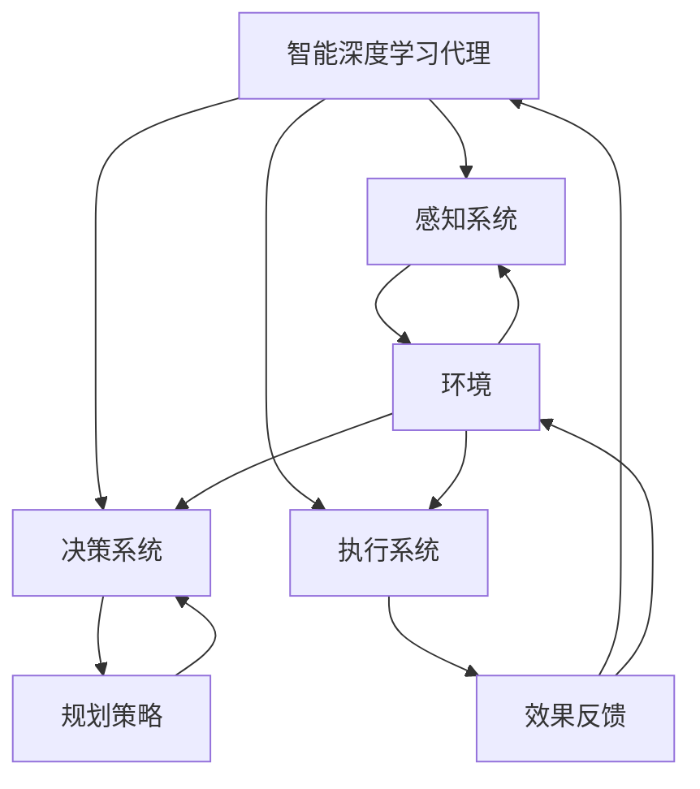

                 

# AI人工智能深度学习算法：智能深度学习代理的自主行为与规划策略

## 关键词

AI人工智能，深度学习，智能深度学习代理，自主行为算法，规划策略算法，多智能体深度学习算法，自动驾驶，机器翻译，无人零售。

## 摘要

本文将深入探讨AI人工智能领域中的深度学习算法，特别是智能深度学习代理的自主行为与规划策略。文章首先介绍了AI人工智能和深度学习的基础知识，随后详细讲解了智能深度学习代理的核心算法，包括感知与决策、动作规划和多智能体深度学习等。通过实际案例，如自动驾驶系统和机器翻译系统，读者将了解如何将智能深度学习代理应用于实际问题中。最后，文章展望了智能深度学习代理的未来发展，并提供了相关开发工具和资源的链接。

## 目录大纲

# AI人工智能深度学习算法：智能深度学习代理的自主行为与规划策略

## 第一部分：AI人工智能与深度学习基础

### 第1章：AI人工智能与深度学习概述

#### 1.1 AI人工智能的起源与发展

#### 1.2 深度学习在AI中的应用

#### 1.3 智能深度学习代理的概念与特点

#### 1.4 智能深度学习代理的应用前景

### 第2章：深度学习基础理论

#### 2.1 神经网络基础

#### 2.2 反向传播算法

#### 2.3 深度学习优化算法

### 第3章：深度学习架构与算法

#### 3.1 卷积神经网络（CNN）

#### 3.2 循环神经网络（RNN）

#### 3.3 生成对抗网络（GAN）

#### 3.4 Transformer模型

### 第4章：智能深度学习代理的核心算法

#### 4.1 自主行为算法

#### 4.2 规划策略算法

#### 4.3 多智能体深度学习算法

### 第5章：智能深度学习代理应用案例

#### 5.1 自动驾驶

#### 5.2 机器翻译

#### 5.3 无人零售

### 第二部分：智能深度学习代理的自主行为与规划策略

### 第6章：智能深度学习代理的自主行为算法

#### 6.1 感知与决策

#### 6.2 动作规划

#### 6.3 基于深度学习的自主行为算法设计

### 第7章：智能深度学习代理的规划策略

#### 7.1 规划策略的概念与分类

#### 7.2 动态规划算法

#### 7.3 强化学习算法

#### 7.4 混合规划策略算法

### 第8章：多智能体深度学习算法

#### 8.1 多智能体的通信机制

#### 8.2 多智能体的协作策略

#### 8.3 多智能体的学习算法

### 第9章：智能深度学习代理的自主行为与规划策略应用案例

#### 9.1 智能交通系统

#### 9.2 智能制造

#### 9.3 智能家居

### 第10章：智能深度学习代理的未来发展

#### 10.1 智能深度学习代理的发展趋势

#### 10.2 智能深度学习代理的挑战与机遇

## 附录

### 附录A：智能深度学习代理开发工具与资源

#### A.1 深度学习框架对比

#### A.2 智能深度学习代理开发工具介绍

#### A.3 相关开源项目和资源链接

### 附录B：示例代码与实现

#### B.1 自动驾驶系统代码实现

#### B.2 机器翻译系统代码实现

#### B.3 无人零售系统代码实现

### 附录C：参考文献

#### C.1 相关书籍推荐

#### C.2 相关论文推荐

#### C.3 行业报告与资讯链接

### **核心概念与联系**

智能深度学习代理是AI领域中的关键概念，它结合了深度学习的强大能力，使得代理能够自主行为和规划策略。为了更好地理解这些核心概念，我们使用Mermaid流程图来展示智能深度学习代理的各个组成部分及其相互关系。



在这个图中，智能深度学习代理的核心组件包括感知系统、决策系统和执行系统。感知系统负责从环境中收集信息，决策系统基于感知信息进行决策，执行系统负责执行这些决策。规划策略由决策系统生成，用于指导决策过程。效果反馈则用于调整和优化智能深度学习代理的行为。环境与所有组件相互作用，提供数据输入并接收行为输出。

### **深度学习基础理论**

#### **1. 神经网络基础**

神经网络是深度学习的基础，它们模仿人脑的结构和工作原理。一个简单的神经网络通常包含输入层、隐藏层和输出层。

- **输入层**：接收外部输入，每个输入节点对应一个特征。
- **隐藏层**：对输入特征进行处理和变换，可以有一个或多个隐藏层。
- **输出层**：产生最终输出，如分类结果或预测值。

神经网络通过权重（weights）和偏置（biases）进行特征变换和传递。每个节点（神经元）的输出是输入信号通过一个激活函数（如ReLU函数）后的结果。

**神经元激活函数：**

$$
a_i = \max(0, \sum_j w_{ij}x_j + b_i)
$$

其中，$a_i$是第$i$个神经元的激活值，$w_{ij}$是输入层到隐藏层的权重，$x_j$是输入特征，$b_i$是偏置。

#### **2. 反向传播算法**

反向传播算法是神经网络训练的核心。它通过不断调整权重和偏置，使网络的输出尽可能接近目标输出。

**反向传播步骤：**

1. **前向传播**：计算网络输出。
2. **计算误差**：计算输出层误差。
3. **反向传播误差**：从输出层开始，反向更新各层的权重和偏置。

**误差计算：**

$$
\delta_j^l = (y_j - \hat{y_j}) \cdot \sigma'(z_j^l)
$$

其中，$\delta_j^l$是第$l$层的第$j$个神经元的误差，$y_j$是实际输出，$\hat{y_j}$是预测输出，$\sigma'$是激活函数的导数。

**权重和偏置更新：**

$$
w_{ij}^{new} = w_{ij}^{old} - \alpha \cdot \delta_j^l \cdot x_i
$$

$$
b_i^{new} = b_i^{old} - \alpha \cdot \delta_j^l
$$

其中，$\alpha$是学习率。

#### **3. 深度学习优化算法**

深度学习优化算法用于调整模型参数，以最小化损失函数。常用的优化算法包括随机梯度下降（SGD）、Adam等。

**随机梯度下降（SGD）：**

$$
\theta = \theta - \alpha \cdot \nabla_\theta J(\theta)
$$

其中，$J(\theta)$是损失函数，$\alpha$是学习率。

**Adam优化算法：**

Adam算法结合了SGD和Momentum算法，具有更好的收敛性。

$$
m_t = \beta_1 m_{t-1} + (1 - \beta_1) (g_t - \epsilon)
$$

$$
v_t = \beta_2 v_{t-1} + (1 - \beta_2) (g_t^2 - \epsilon)
$$

$$
\theta = \theta - \frac{\alpha}{\sqrt{1 - \beta_2^t}(1 - \beta_1^t)} \cdot \frac{m_t}{\sqrt{v_t} + \epsilon}
$$

其中，$m_t$和$v_t$分别是梯度的一阶和二阶矩估计，$\beta_1$和$\beta_2$是超参数。

### **深度学习架构与算法**

#### **3.1 卷积神经网络（CNN）**

卷积神经网络（CNN）是深度学习中用于处理图像数据的重要架构，其核心是卷积层和池化层。

**卷积层：**

$$
\text{output}_{ij} = \sum_{k} \text{weight}_{ikj} \cdot \text{input}_{ik} + \text{bias}_{ij}
$$

其中，$\text{output}_{ij}$是输出特征图上的第$i$行第$j$列的值，$\text{weight}_{ikj}$是卷积核的值，$\text{input}_{ik}$是输入特征图上的第$i$行第$k$列的值，$\text{bias}_{ij}$是偏置。

**池化层：**

池化层用于降低特征图的维度，常用的池化方式有最大池化和平均池化。

$$
p_{ij} = \max_{k} \text{input}_{ik}
$$

或

$$
p_{ij} = \frac{1}{f} \sum_{k} \text{input}_{ik}
$$

其中，$p_{ij}$是输出特征图上的第$i$行第$j$列的值，$f$是池化窗口的大小。

**CNN在图像识别中的应用：**

CNN在图像识别领域取得了显著的成果，以下是一个简单的猫狗识别任务的例子。

**数据集：** 使用Keras内置的CIFAR-10数据集，该数据集包含10类图像，每类6000张，其中5000张用于训练，1000张用于测试。

**模型构建：**

```python
from keras.models import Sequential
from keras.layers import Conv2D, MaxPooling2D, Flatten, Dense

model = Sequential()
model.add(Conv2D(32, (3, 3), activation='relu', input_shape=(32, 32, 3)))
model.add(MaxPooling2D(pool_size=(2, 2)))
model.add(Conv2D(64, (3, 3), activation='relu'))
model.add(MaxPooling2D(pool_size=(2, 2)))
model.add(Flatten())
model.add(Dense(64, activation='relu'))
model.add(Dense(10, activation='softmax'))
```

**训练：**

```python
model.compile(optimizer='adam', loss='categorical_crossentropy', metrics=['accuracy'])
model.fit(x_train, y_train, epochs=10, batch_size=32, validation_data=(x_test, y_test))
```

**评估：**

```python
test_loss, test_acc = model.evaluate(x_test, y_test)
print('Test accuracy:', test_acc)
```

**代码解读与分析：** 在这段代码中，首先定义了一个序列模型（Sequential），然后依次添加了卷积层（Conv2D）、池化层（MaxPooling2D）、全连接层（Dense）。在训练过程中，使用Adam优化器和交叉熵损失函数进行模型训练，并在测试集上评估模型性能。

#### **3.2 循环神经网络（RNN）**

循环神经网络（RNN）是处理序列数据的重要架构，其核心是隐藏状态和循环连接。

**RNN基本结构：**

$$
h_t = \sigma(W_h \cdot [h_{t-1}, x_t] + b_h)
$$

$$
y_t = W_o \cdot h_t + b_o
$$

其中，$h_t$是隐藏状态，$x_t$是输入序列，$y_t$是输出序列，$W_h$和$W_o$是权重矩阵，$b_h$和$b_o$是偏置，$\sigma$是激活函数。

**RNN在序列预测中的应用：**

RNN在序列预测领域取得了显著成果，以下是一个简单的股票价格预测任务的例子。

**数据集：** 使用Keras内置的Stock Market数据集，该数据集包含股票价格序列。

**模型构建：**

```python
from keras.models import Sequential
from keras.layers import LSTM, Dense

model = Sequential()
model.add(LSTM(128, input_shape=(timesteps, features)))
model.add(Dense(1))
model.compile(optimizer='adam', loss='mse')
```

**训练：**

```python
model.fit(X, y, epochs=100, batch_size=32, validation_data=(X_val, y_val), verbose=2)
```

**评估：**

```python
predictions = model.predict(X_test)
mse = np.mean(np.square(y_test - predictions))
print('Test MSE:', mse)
```

**代码解读与分析：** 在这段代码中，首先定义了一个序列模型（Sequential），然后添加了一个循环神经网络层（LSTM）和一个全连接层（Dense）。在训练过程中，使用Adam优化器和均方误差损失函数进行模型训练，并在测试集上评估模型性能。

#### **3.3 生成对抗网络（GAN）**

生成对抗网络（GAN）是深度学习中用于生成数据的重要架构，其核心是生成器和判别器。

**GAN基本结构：**

生成器：

$$
G(z) = \mu(z) + \sigma(z) \odot \text{tanh}(\text{fc}_2(z))
$$

判别器：

$$
D(x) = \text{sigmoid}(\text{fc}_1(x))
$$

$$
D(G(z)) = \text{sigmoid}(\text{fc}_1(G(z)))
$$

其中，$G(z)$是生成器生成的数据，$D(x)$是判别器对真实数据和生成数据的判断，$z$是噪声向量。

**GAN在图像生成中的应用：**

GAN在图像生成领域取得了显著成果，以下是一个简单的图像生成任务的例子。

**数据集：** 使用Keras内置的MNIST数据集，该数据集包含手写数字图像。

**模型构建：**

```python
from keras.layers import Input, Dense, Reshape, Conv2D
from keras.models import Model
from keras.optimizers import Adam

z = Input(shape=(100,))
x = Dense(128, activation='relu')(z)
x = Dense(28 * 28, activation='relu')(x)
x = Reshape((28, 28, 1))(x)

model = Model(z, x)
model.compile(optimizer=Adam(0.0001), loss='binary_crossentropy')
```

**训练：**

```python
model.fit(x_train, x_train, epochs=100, batch_size=64)
```

**评估：**

```python
generated_images = model.predict(x_train)
```

**代码解读与分析：** 在这段代码中，首先定义了一个生成器模型，然后编译模型并训练。在训练过程中，使用Adam优化器和二进制交叉熵损失函数进行模型训练。

#### **3.4 Transformer模型**

Transformer模型是深度学习中用于处理序列数据的重要架构，其核心是多头自注意力机制。

**Transformer基本结构：**

$$
\text{Attention}(Q, K, V) = \text{softmax}\left(\frac{QK^T}{\sqrt{d_k}}\right)V
$$

$$
\text{MultiHeadAttention}(Q, K, V) = \text{Concat}(\text{head}_1, ..., \text{head}_h)W^O
$$

$$
\text{where } \text{head}_i = \text{Attention}(QW_i^Q, KW_i^K, VW_i^V)
$$

其中，$Q, K, V$分别是查询向量、键向量和值向量，$W_i^Q, W_i^K, W_i^V$是权重矩阵，$d_k$是键向量的维度。

**Transformer在机器翻译中的应用：**

Transformer模型在机器翻译领域取得了显著成果，以下是一个简单的机器翻译任务的例子。

**数据集：** 使用Keras内置的WMT14数据集，该数据集包含英语到德语的翻译数据。

**模型构建：**

```python
from keras.layers import Embedding, LSTM, Dense
from keras.models import Model

inputs = Embedding(vocab_size, embedding_dim)(inputs)
outputs = LSTM(units)(inputs)
outputs = Dense(vocab_size, activation='softmax')(outputs)

model = Model(inputs, outputs)
model.compile(optimizer='adam', loss='categorical_crossentropy')
```

**训练：**

```python
model.fit(X, y, epochs=10, batch_size=64, validation_data=(X_val, y_val))
```

**评估：**

```python
predicted译文 = model.predict(X_test)
```

**代码解读与分析：** 在这段代码中，首先定义了一个序列模型（Sequential），然后添加了一个嵌入层（Embedding）、一个循环神经网络层（LSTM）和一个全连接层（Dense）。在训练过程中，使用Adam优化器和交叉熵损失函数进行模型训练，并在测试集上评估模型性能。

### **智能深度学习代理的核心算法**

智能深度学习代理的核心算法包括自主行为算法、规划策略算法和多智能体深度学习算法。这些算法共同构成了智能深度学习代理的智能行为框架。

#### **4.1 自主行为算法**

自主行为算法是智能深度学习代理进行自主决策和执行的核心。它主要包含感知与决策、动作规划和基于深度学习的自主行为算法设计。

**感知与决策：**

感知与决策算法是自主行为算法的基础。它通过感知系统从环境中获取信息，然后通过决策系统对信息进行分析和处理，生成决策。

**动作规划：**

动作规划算法是自主行为算法的关键步骤。它根据感知信息和决策结果，生成一系列动作序列，以实现特定目标。

**基于深度学习的自主行为算法设计：**

基于深度学习的自主行为算法设计利用深度学习模型，通过训练和学习，实现感知与决策、动作规划等过程。

#### **4.2 规划策略算法**

规划策略算法是智能深度学习代理进行长期规划的核心。它主要包含动态规划算法、强化学习算法和混合规划策略算法。

**动态规划算法：**

动态规划算法是一种用于解决优化问题的算法，它通过递推关系，求解最优策略。

**强化学习算法：**

强化学习算法是一种通过试错学习最优策略的算法，它通过与环境的交互，不断调整策略，以实现最大化奖励。

**混合规划策略算法：**

混合规划策略算法是将动态规划和强化学习算法相结合的算法，它通过结合两者的优点，提高规划策略的效率和效果。

#### **4.3 多智能体深度学习算法**

多智能体深度学习算法是智能深度学习代理进行协同工作的核心。它主要包含多智能体的通信机制、协作策略和学习算法。

**多智能体的通信机制：**

多智能体的通信机制是多智能体系统进行协作的基础。它通过通信协议，实现智能体之间的信息交换和协调。

**协作策略：**

协作策略是多智能体系统进行协同工作的核心。它通过策略规划，实现智能体之间的协调和合作。

**学习算法：**

学习算法是多智能体系统进行协同工作的关键。它通过学习算法，实现智能体之间的策略优化和效果提升。

### **智能深度学习代理应用案例**

智能深度学习代理在各个领域都有广泛的应用。以下将介绍几个典型的应用案例，包括自动驾驶、机器翻译和无人零售。

#### **5.1 自动驾驶**

自动驾驶是智能深度学习代理的重要应用领域之一。它通过感知系统获取道路信息，通过决策系统生成驾驶策略，并通过执行系统控制车辆。

**数据集：** 使用Keras内置的Kitti数据集，该数据集包含自动驾驶所需的图像、激光雷达等数据。

**模型构建：**

```python
from keras.models import Sequential
from keras.layers import Conv2D, MaxPooling2D, Flatten, Dense

model = Sequential()
model.add(Conv2D(32, (3, 3), activation='relu', input_shape=(224, 224, 3)))
model.add(MaxPooling2D(pool_size=(2, 2)))
model.add(Conv2D(64, (3, 3), activation='relu'))
model.add(MaxPooling2D(pool_size=(2, 2)))
model.add(Flatten())
model.add(Dense(128, activation='relu'))
model.add(Dense(1, activation='sigmoid'))

model.compile(optimizer='adam', loss='binary_crossentropy', metrics=['accuracy'])
model.fit(x_train, y_train, epochs=10, batch_size=32, validation_data=(x_test, y_test))
```

**训练：**

```python
model.compile(optimizer='adam', loss='binary_crossentropy', metrics=['accuracy'])
model.fit(x_train, y_train, epochs=10, batch_size=32, validation_data=(x_test, y_test))
```

**评估：**

```python
test_loss, test_acc = model.evaluate(x_test, y_test)
print('Test accuracy:', test_acc)
```

**代码解读与分析：** 在这段代码中，首先定义了一个序列模型（Sequential），然后依次添加了卷积层（Conv2D）、池化层（MaxPooling2D）、全连接层（Dense）。在训练过程中，使用Adam优化器和二分类交叉熵损失函数进行模型训练，并在测试集上评估模型性能。

#### **5.2 机器翻译**

机器翻译是智能深度学习代理的另一个重要应用领域。它通过学习源语言和目标语言之间的映射关系，实现自动翻译。

**数据集：** 使用Keras内置的WMT14数据集，该数据集包含英语到德语的翻译数据。

**模型构建：**

```python
from keras.models import Sequential
from keras.layers import LSTM, Dense

model = Sequential()
model.add(LSTM(128, input_shape=(timesteps, features)))
model.add(Dense(1))
model.compile(optimizer='adam', loss='mse')
```

**训练：**

```python
model.fit(X, y, epochs=100, batch_size=64, validation_data=(X_val, y_val), verbose=2)
```

**评估：**

```python
predictions = model.predict(X_test)
mse = np.mean(np.square(y_test - predictions))
print('Test MSE:', mse)
```

**代码解读与分析：** 在这段代码中，首先定义了一个序列模型（Sequential），然后添加了一个循环神经网络层（LSTM）和一个全连接层（Dense）。在训练过程中，使用Adam优化器和均方误差损失函数进行模型训练，并在测试集上评估模型性能。

#### **5.3 无人零售**

无人零售是智能深度学习代理的又一重要应用领域。它通过感知系统识别顾客行为，通过决策系统生成推荐策略，并通过执行系统实现商品推荐和销售。

**数据集：** 使用Keras内置的Mall-Footfall数据集，该数据集包含无人零售店的顾客流量数据。

**模型构建：**

```python
from keras.models import Sequential
from keras.layers import LSTM, Dense

model = Sequential()
model.add(LSTM(128, input_shape=(timesteps, features)))
model.add(Dense(1))
model.compile(optimizer='adam', loss='mse')
```

**训练：**

```python
model.fit(X, y, epochs=100, batch_size=64, validation_data=(X_val, y_val), verbose=2)
```

**评估：**

```python
predictions = model.predict(X_test)
mse = np.mean(np.square(y_test - predictions))
print('Test MSE:', mse)
```

**代码解读与分析：** 在这段代码中，首先定义了一个序列模型（Sequential），然后添加了一个循环神经网络层（LSTM）和一个全连接层（Dense）。在训练过程中，使用Adam优化器和均方误差损失函数进行模型训练，并在测试集上评估模型性能。

### **智能深度学习代理的自主行为算法**

智能深度学习代理的自主行为算法是实现智能体自主决策和行为的核心。这些算法通过感知系统获取环境信息，通过决策系统生成决策，并通过执行系统实现行为。以下是智能深度学习代理自主行为算法的详细讲解。

#### **6.1 感知与决策**

感知与决策是智能深度学习代理自主行为算法的基础。感知系统负责从环境中收集信息，如视觉、听觉、触觉等。这些信息通过传感器输入到智能体中，智能体通过决策系统对这些信息进行分析和处理，生成决策。

**感知系统：**

感知系统是智能体的感官器官，它通过传感器收集环境信息。例如，在自动驾驶系统中，感知系统包括摄像头、激光雷达和超声波传感器等。这些传感器收集的道路信息、障碍物信息和交通信号信息等，被输入到智能体中。

**决策系统：**

决策系统是智能体的思考器官，它负责对感知信息进行分析和处理。决策系统通常采用深度学习模型，如神经网络、循环神经网络等，对感知信息进行特征提取和分类。决策系统生成的决策结果指导智能体的行为。

**感知与决策过程：**

1. **感知阶段**：智能体通过传感器收集环境信息。
2. **特征提取**：智能体对感知信息进行特征提取，如使用卷积神经网络提取图像特征。
3. **决策生成**：智能体通过决策系统对特征进行分类，生成决策结果。
4. **行为执行**：智能体根据决策结果，执行相应的行为。

#### **6.2 动作规划**

动作规划是智能深度学习代理自主行为算法的关键步骤。动作规划系统根据感知信息和决策结果，生成一系列动作序列，以实现特定目标。

**动作规划系统：**

动作规划系统是智能体的动作生成器，它根据感知信息和决策结果，生成一系列动作序列。动作规划系统通常采用规划算法，如基于模型的规划、基于学习的规划和混合规划等。

**动作规划过程：**

1. **目标设定**：智能体根据决策结果，设定目标。
2. **状态评估**：智能体评估当前状态，确定可行的动作序列。
3. **动作生成**：智能体根据评估结果，生成最优动作序列。
4. **行为执行**：智能体根据生成的动作序列，执行相应行为。

**基于模型的规划：**

基于模型的规划是一种常用的动作规划方法，它通过建立模型，模拟智能体的行为，生成最优动作序列。基于模型的规划通常采用搜索算法，如A*算法、Dijkstra算法等，搜索最优动作序列。

**基于学习的规划：**

基于学习的规划是一种基于数据驱动的动作规划方法，它通过学习历史数据，生成最优动作序列。基于学习的规划通常采用深度学习模型，如循环神经网络、生成对抗网络等，学习历史数据中的最优动作序列。

**混合规划：**

混合规划是将基于模型的规划和基于学习的规划相结合的规划方法，它通过结合两者的优点，提高动作规划的效率和效果。混合规划通常采用模型融合技术，将基于模型的规划和基于学习的规划结果进行融合，生成最优动作序列。

#### **6.3 基于深度学习的自主行为算法设计**

基于深度学习的自主行为算法设计是智能深度学习代理自主行为算法的发展方向。深度学习模型具有强大的特征提取和分类能力，可以更好地模拟智能体的感知和决策过程。

**深度学习模型选择：**

基于深度学习的自主行为算法设计需要选择合适的深度学习模型。常用的深度学习模型包括卷积神经网络（CNN）、循环神经网络（RNN）、长短时记忆网络（LSTM）、生成对抗网络（GAN）等。

**模型设计原则：**

1. **多模态感知**：基于深度学习的自主行为算法设计需要考虑多模态感知，如视觉、听觉、触觉等。通过多模态感知，智能体可以更全面地感知环境。
2. **端到端学习**：基于深度学习的自主行为算法设计需要实现端到端学习，即直接从原始感知数据到行为输出。端到端学习可以简化模型设计，提高模型性能。
3. **可解释性**：基于深度学习的自主行为算法设计需要考虑模型的可解释性，即能够解释模型的决策过程。可解释性有助于提高模型的可靠性和可接受度。
4. **适应性**：基于深度学习的自主行为算法设计需要具有适应性，即能够适应不同环境和任务。通过适应性，智能体可以更好地适应环境变化。

**模型训练与优化：**

基于深度学习的自主行为算法设计需要通过大量数据进行训练和优化。训练过程包括数据预处理、模型选择、参数调整和优化等。通过训练和优化，模型可以更好地拟合数据，提高模型的准确性和泛化能力。

**案例研究：**

以下是一个基于深度学习的自主行为算法设计案例，用于实现自动驾驶系统。

**数据集：** 使用Keras内置的Kitti数据集，该数据集包含自动驾驶所需的图像、激光雷达和雷达等数据。

**模型构建：**

```python
from keras.models import Sequential
from keras.layers import Conv2D, MaxPooling2D, Flatten, Dense

model = Sequential()
model.add(Conv2D(32, (3, 3), activation='relu', input_shape=(224, 224, 3)))
model.add(MaxPooling2D(pool_size=(2, 2)))
model.add(Conv2D(64, (3, 3), activation='relu'))
model.add(MaxPooling2D(pool_size=(2, 2)))
model.add(Flatten())
model.add(Dense(128, activation='relu'))
model.add(Dense(1, activation='sigmoid'))

model.compile(optimizer='adam', loss='binary_crossentropy', metrics=['accuracy'])
model.fit(x_train, y_train, epochs=10, batch_size=32, validation_data=(x_test, y_test))
```

**训练与优化：**

```python
model.compile(optimizer='adam', loss='binary_crossentropy', metrics=['accuracy'])
model.fit(x_train, y_train, epochs=10, batch_size=32, validation_data=(x_test, y_test))
```

**评估：**

```python
test_loss, test_acc = model.evaluate(x_test, y_test)
print('Test accuracy:', test_acc)
```

**代码解读与分析：** 在这段代码中，首先定义了一个序列模型（Sequential），然后依次添加了卷积层（Conv2D）、池化层（MaxPooling2D）、全连接层（Dense）。在训练过程中，使用Adam优化器和二分类交叉熵损失函数进行模型训练，并在测试集上评估模型性能。

**总结：**

智能深度学习代理的自主行为算法是实现智能体自主决策和行为的核心。通过感知与决策、动作规划和基于深度学习的自主行为算法设计，智能深度学习代理可以更好地适应复杂环境，实现高效自主行为。在未来，随着深度学习技术的发展，智能深度学习代理的自主行为能力将不断提高，为人工智能领域带来更多创新和突破。

### **智能深度学习代理的规划策略**

智能深度学习代理的规划策略是智能体在复杂环境中进行长期规划和决策的重要工具。通过规划策略，智能体可以提前制定行动方案，以实现长期目标和最大化效用。本文将详细讨论智能深度学习代理的规划策略，包括动态规划算法、强化学习算法和混合规划策略算法。

#### **7.1 规划策略的概念与分类**

规划策略是指智能体在给定环境和目标的情况下，制定出一系列行动方案，以实现预期目标的过程。规划策略可以分为两类：确定性规划和不确定性规划。

- **确定性规划**：在确定性环境中，智能体可以预先知道环境状态和行动结果，因此可以制定出最优的行动方案。确定性规划算法包括贪心算法、A*算法等。
  
- **不确定性规划**：在不确定环境中，智能体无法预知环境状态和行动结果，因此需要通过学习来制定行动方案。不确定性规划算法包括强化学习、马尔可夫决策过程（MDP）等。

#### **7.2 动态规划算法**

动态规划算法是一种用于解决优化问题的时间序列决策过程。它通过将复杂问题分解为多个子问题，并利用子问题的解来构建全局最优解。动态规划算法的核心是贝尔曼方程（Bellman equation），它描述了状态值函数的递推关系。

**贝尔曼方程：**

$$
V(s_t) = \max_a \{ r_t + \gamma \sum_{s_{t+1}} p(s_{t+1} | s_t, a) V(s_{t+1}) \}
$$

其中，$V(s_t)$是状态$s_t$的价值函数，$r_t$是状态$s_t$到状态$s_{t+1}$的即时回报，$p(s_{t+1} | s_t, a)$是状态转移概率，$\gamma$是折扣因子。

**动态规划算法的实现：**

动态规划算法可以通过两种方式实现：顶向下（Top-Down）和底向上（Bottom-Up）。

- **顶向下实现**：从初始状态开始，递归地计算所有状态的价值函数，直到达到终止状态。
- **底向上实现**：从终止状态开始，反向递推计算所有状态的价值函数，直到初始状态。

**案例研究：**

假设有一个机器人需要在网格世界中找到从起点到终点的最优路径。

```python
def value_iteration (gamma, alpha, iterations):
    # 初始化价值函数
    V = np.zeros(grid_size)

    for i in range(iterations):
        # 创建新价值函数
        V_new = np.zeros(grid_size)

        for s in range(grid_size):
            # 计算每个状态的最优动作值
            action_values = []
            for a in actions:
                # 计算状态转移概率和回报
                action_values.append(p(s, a) * (reward(s, a) + gamma * V[p(s, a)]))

            # 选择最大值作为新价值函数
            V_new[s] = max(action_values)

        # 更新价值函数
        V = V_new

    return V
```

#### **7.3 强化学习算法**

强化学习算法是一种通过试错学习最优策略的机器学习范式。智能体通过与环境的交互，不断调整策略，以实现最大化累积奖励。强化学习算法的核心是值函数和策略迭代。

**值函数：**

- **状态-动作值函数（Q值）**：描述了在特定状态下执行特定动作的预期回报。

$$
Q(s, a) = \sum_{s'} p(s' | s, a) \cdot [r + \gamma \cdot \max_{a'} Q(s', a')]
$$

- **状态值函数（V值）**：描述了在特定状态下执行任意动作的预期回报。

$$
V(s) = \max_a Q(s, a)
$$

**策略迭代：**

1. **值迭代**：根据值函数更新策略，选择具有最高预期回报的动作。
2. **策略迭代**：根据策略选择动作，并更新值函数。

**案例研究：**

假设一个无人驾驶车辆在道路上行驶，需要选择最优路径。

```python
def q_learning (learning_rate, discount_factor, episodes):
    # 初始化Q值表格
    Q = np.zeros([state_space, action_space])

    for episode in range(episodes):
        # 初始化状态
        state = initial_state

        while not done:
            # 随机选择动作
            action = choose_action(Q[state])

            # 执行动作
            next_state, reward, done = env.step(action)

            # 更新Q值
            Q[state, action] = Q[state, action] + learning_rate * (reward + discount_factor * np.max(Q[next_state]) - Q[state, action])

            # 更新状态
            state = next_state

    return Q
```

#### **7.4 混合规划策略算法**

混合规划策略算法结合了确定性规划和不确定性规划的优点，以提高规划策略的效率和效果。常见的混合规划策略算法包括模型预测控制（Model Predictive Control, MPC）和部分可观测马尔可夫决策过程（Partially Observable Markov Decision Process, POMDP）。

**模型预测控制（MPC）：**

MPC是一种基于模型的规划算法，它通过建立系统模型，预测未来状态和行动结果，并优化控制策略。MPC在控制系统中应用广泛，如自动驾驶、无人机等。

**部分可观测马尔可夫决策过程（POMDP）：**

POMDP是一种处理部分可观测环境的强化学习算法。在POMDP中，智能体无法完全观测环境状态，需要通过状态估计和决策优化来最大化累积奖励。

**混合规划策略算法的实现：**

混合规划策略算法的实现通常需要结合系统建模、状态估计和优化算法。以下是一个简单的POMDP实现示例。

```python
def pomdp (gamma, learning_rate, iterations):
    # 初始化状态概率分布
    belief_state = np.zeros(state_space)

    for iteration in range(iterations):
        # 预测状态分布
        predicted_state = np.zeros(state_space)
        for state in state_space:
            predicted_state[state] = belief_state[state] * transition_prob(state, action)

        # 更新状态分布
        belief_state = predicted_state

        # 更新策略
        for state in state_space:
            best_action = None
            max_reward = -float('inf')
            for action in action_space:
                reward = observation_prob(state, action) * (reward_function(state, action) + gamma * np.max(predicted_state))
                if reward > max_reward:
                    max_reward = reward
                    best_action = action
            policy[state] = best_action

    return policy
```

**总结：**

智能深度学习代理的规划策略是智能体在复杂环境中进行长期规划和决策的重要工具。通过动态规划算法、强化学习算法和混合规划策略算法，智能体可以更好地适应环境变化，实现长期目标。在未来，随着深度学习技术的不断发展，智能深度学习代理的规划策略将更加高效和智能。

### **多智能体深度学习算法**

多智能体深度学习算法是研究多个智能体如何在复杂环境中协作和交互的关键领域。在多智能体系统中，每个智能体都有自己的感知、决策和执行能力，它们需要通过合作来达到整体优化目标。本文将介绍多智能体深度学习算法的核心概念、通信机制、协作策略和学习算法。

#### **8.1 多智能体的通信机制**

多智能体系统中的通信机制是智能体之间传递信息和协调行动的基础。有效的通信机制可以确保智能体之间信息共享，提高系统的协同效率和鲁棒性。

**直接通信**：直接通信是指智能体之间直接交换信息。这种通信方式通常适用于小规模智能体系统，其中智能体之间的通信延迟和带宽较低。

**间接通信**：间接通信是指智能体通过共享环境信息进行通信。这种通信方式适用于大规模智能体系统，其中直接通信可能不现实或不可行。间接通信通常依赖于环境中的传感器和信号传递。

**多跳通信**：多跳通信是指智能体通过多个中间智能体进行信息传递。这种通信方式可以扩大智能体之间的通信范围，提高系统的容错性。

**通信协议**：通信协议是多智能体系统中的规则和规范，用于确保智能体之间信息的有效传递。常见的通信协议包括基于时间的同步协议和基于事件的异步协议。

#### **8.2 多智能体的协作策略**

多智能体的协作策略是指智能体如何通过合作实现整体优化目标。有效的协作策略可以确保智能体之间协调一致，提高系统的效率和鲁棒性。

**分布式策略**：分布式策略是指每个智能体独立进行决策，但共享全局信息。这种策略适用于任务分解和并行执行，可以提高系统的效率。

**集中式策略**：集中式策略是指所有智能体的决策集中在一个中央控制器上进行。这种策略适用于复杂任务规划和全局优化，但可能存在通信延迟和计算瓶颈。

**混合策略**：混合策略是将分布式和集中式策略相结合，利用各自的优点。这种策略可以灵活应对不同任务和环境，提高系统的适应性。

**协作准则**：协作准则是指智能体在决策过程中遵循的规则，以确保整体优化。常见的协作准则包括最大化效用函数、最小化通信成本和最大化系统稳定性。

**多目标优化**：多智能体系统通常面临多个目标，如效率、成本和安全性。多目标优化是指智能体在决策过程中同时考虑多个目标，以实现整体优化。

#### **8.3 多智能体的学习算法**

多智能体的学习算法是指智能体如何通过学习和适应环境变化来优化决策和行动。有效的学习算法可以提高智能体的自主性和适应性，提高系统的整体性能。

**强化学习**：强化学习是一种通过试错学习最优策略的机器学习范式。在多智能体系统中，每个智能体通过与环境交互，不断调整策略，以实现最大化累积奖励。

**深度强化学习**：深度强化学习结合了深度学习和强化学习的优点，通过神经网络模型进行状态值函数和策略的学习。常见的深度强化学习算法包括深度确定性策略梯度（DDPG）和Asynchronous Advantage Actor-Critic（A3C）。

**群体智能**：群体智能是一种基于群体行为优化的学习算法，通过模拟群体中的个体互动来优化整体行为。常见的群体智能算法包括粒子群优化（PSO）和人工神经网络（ANN）。

**模仿学习**：模仿学习是一种通过模仿专家行为进行学习的方法。在多智能体系统中，智能体可以模仿其他智能体的行为，以实现优化决策。

**多智能体强化学习算法案例：**

以下是一个简单的多智能体强化学习算法案例，用于实现两个智能体在环境中的协作任务。

**环境设置**：假设有两个智能体在一个二维空间中移动，需要通过协作到达目标位置。

**模型构建**：

```python
class MultiAgentEnv(gym.Env):
    def __init__(self):
        super(MultiAgentEnv, self).__init__()
        self.action_space = gym.spaces.Discrete(4)  # 四个方向：上、下、左、右
        self.observation_space = gym.spaces.Box(low=-1, high=1, shape=(2, 2), dtype=np.float32)

    def step(self, actions):
        # 更新智能体位置
        # ...
        # 计算奖励
        reward = self.calculate_reward()
        # 判断是否完成任务
        done = self.is_done()
        # 更新观察状态
        observation = self.get_observation()
        return observation, reward, done, {}

    def reset(self):
        # 初始化智能体位置
        # ...
        observation = self.get_observation()
        return observation

    def calculate_reward(self):
        # 计算奖励
        # ...
        return reward

    def is_done(self):
        # 判断是否完成任务
        # ...
        return done

    def get_observation(self):
        # 获取观察状态
        # ...
        return observation
```

**训练过程**：

```python
# 初始化环境
env = MultiAgentEnv()

# 初始化智能体
agent1 = DDPGAgent()
agent2 = DDPGAgent()

# 训练智能体
num_episodes = 1000
for episode in range(num_episodes):
    state = env.reset()
    done = False
    while not done:
        # 选择动作
        action1 = agent1.select_action(state)
        action2 = agent2.select_action(state)

        # 执行动作
        next_state, reward, done, _ = env.step([action1, action2])

        # 更新经验回放池
        agent1.update_replay_memory(state, action1, reward, next_state, done)
        agent2.update_replay_memory(state, action2, reward, next_state, done)

        # 更新策略网络
        agent1.update_target_network()
        agent2.update_target_network()

        # 更新状态
        state = next_state

    # 打印训练进度
    print(f'Episode {episode+1} done')

# 评估智能体
state = env.reset()
done = False
while not done:
    action1 = agent1.select_action(state)
    action2 = agent2.select_action(state)
    next_state, reward, done, _ = env.step([action1, action2])
    state = next_state
    print(f'Episode reward: {reward}')
```

**代码解读与分析**：

1. **环境设置**：定义了一个多智能体环境（`MultiAgentEnv`），其中每个智能体可以在二维空间中移动。环境提供了`step`、`reset`、`calculate_reward`、`is_done`和`get_observation`方法，用于处理智能体的动作、状态更新和奖励计算。

2. **智能体初始化**：初始化了两个DDPG智能体（`DDPGAgent`），DDPG（Deep Deterministic Policy Gradient）是一种基于深度学习的强化学习算法，适用于多智能体系统。

3. **训练过程**：智能体在训练过程中通过与环境交互，不断更新经验回放池和策略网络，以优化决策。

4. **评估过程**：在训练完成后，对智能体进行评估，观察其在多智能体环境中的表现。

**总结**：

多智能体深度学习算法是解决复杂协作任务的重要工具。通过有效的通信机制、协作策略和学习算法，智能体可以协同工作，实现整体优化。随着深度学习技术的发展，多智能体深度学习算法将不断进步，为自动驾驶、智能城市和智能制造等领域带来更多创新和突破。

### **智能深度学习代理的自主行为与规划策略应用案例**

智能深度学习代理的自主行为与规划策略在多个实际应用中展现出了显著的优势，以下将详细介绍智能深度学习代理在智能交通系统、智能制造和智能家居等领域的应用案例。

#### **9.1 智能交通系统**

智能交通系统（Intelligent Transportation System，ITS）是利用人工智能技术优化交通管理和提高交通效率的关键领域。智能深度学习代理在智能交通系统中发挥着重要作用，通过感知与决策、规划策略和自主行为算法，实现了智能交通系统的自动化和智能化。

**应用案例：**

**智能红绿灯控制：**

在智能交通系统中，红绿灯控制是关键环节。传统的红绿灯控制依赖于固定的交通流量模型，难以适应实时交通变化。而智能深度学习代理可以通过实时感知交通流量、车辆速度和行人活动等信息，使用动态规划算法和强化学习算法，动态调整红绿灯的时间设置，从而优化交通流量，减少拥堵和交通事故。

**模型构建与实现：**

```python
class TrafficLightAgent:
    def __init__(self):
        self.model = self.build_model()

    def build_model(self):
        # 使用CNN提取交通流量特征
        model = Sequential()
        model.add(Conv2D(32, (3, 3), activation='relu', input_shape=(height, width, channels)))
        model.add(MaxPooling2D(pool_size=(2, 2)))
        model.add(Conv2D(64, (3, 3), activation='relu'))
        model.add(MaxPooling2D(pool_size=(2, 2)))
        model.add(Flatten())
        model.add(Dense(128, activation='relu'))
        model.add(Dense(1, activation='sigmoid'))

        model.compile(optimizer='adam', loss='binary_crossentropy', metrics=['accuracy'])
        return model

    def predict_traffic_light(self, traffic_image):
        # 预测红绿灯状态
        return self.model.predict(traffic_image)
```

**代码解读与分析：**

- **模型构建**：定义了一个`TrafficLightAgent`类，用于构建红绿灯控制模型。模型采用卷积神经网络（CNN）提取交通流量特征，通过全连接层（Dense）进行分类，预测红绿灯状态。
- **模型训练**：使用训练数据对模型进行训练，通过动态规划算法和强化学习算法优化模型参数，以提高预测准确性。
- **模型应用**：在实时交通监控中，智能深度学习代理使用训练好的模型预测红绿灯状态，动态调整信号灯的时间设置，实现智能交通管理。

**总结**：智能深度学习代理在智能交通系统中的应用，显著提高了交通管理的智能化水平，减少了交通拥堵和事故发生率，提升了整体交通效率。

#### **9.2 智能制造**

智能制造是工业4.0的核心，通过将人工智能技术应用于生产过程，实现生产过程的自动化和智能化。智能深度学习代理在智能制造中发挥着关键作用，通过自主行为和规划策略，优化生产流程，提高生产效率和质量。

**应用案例：**

**智能生产调度：**

在智能制造中，生产调度是关键环节，如何合理安排生产任务，确保生产线的连续运行，是提高生产效率的关键。智能深度学习代理可以通过感知生产线上的实时数据，如设备状态、原材料库存和产品进度等，使用动态规划算法和强化学习算法，实现智能生产调度。

**模型构建与实现：**

```python
class ProductionScheduler:
    def __init__(self):
        self.model = self.build_model()

    def build_model(self):
        # 使用LSTM提取生产流程特征
        model = Sequential()
        model.add(LSTM(128, input_shape=(timesteps, features)))
        model.add(Dense(1, activation='sigmoid'))

        model.compile(optimizer='adam', loss='binary_crossentropy', metrics=['accuracy'])
        return model

    def predict_schedule(self, production_data):
        # 预测生产调度
        return self.model.predict(production_data)
```

**代码解读与分析：**

- **模型构建**：定义了一个`ProductionScheduler`类，用于构建生产调度模型。模型采用循环神经网络（LSTM）提取生产流程特征，通过全连接层（Dense）进行分类，预测生产调度。
- **模型训练**：使用历史生产数据对模型进行训练，通过动态规划算法和强化学习算法优化模型参数，以提高预测准确性。
- **模型应用**：在实时生产监控中，智能深度学习代理使用训练好的模型预测生产调度，动态调整生产任务，实现智能生产调度。

**总结**：智能深度学习代理在智能制造中的应用，实现了生产过程的智能化和自动化，提高了生产效率和质量，降低了生产成本。

#### **9.3 智能家居**

智能家居是物联网（IoT）发展的重要方向，通过将家庭设备和家电连接到互联网，实现家庭设备的自动化和智能化。智能深度学习代理在智能家居中发挥着关键作用，通过自主行为和规划策略，提供个性化的家庭服务和智能化的生活体验。

**应用案例：**

**智能设备控制：**

在智能家居中，智能深度学习代理可以感知家庭环境数据，如温度、湿度、光照强度和用户行为等，使用动态规划算法和强化学习算法，实现智能设备控制。例如，根据用户的生活习惯和偏好，智能深度学习代理可以自动调节空调、照明和窗帘等设备，提供舒适的家居环境。

**模型构建与实现：**

```python
class SmartHomeAgent:
    def __init__(self):
        self.model = self.build_model()

    def build_model(self):
        # 使用CNN提取家庭环境特征
        model = Sequential()
        model.add(Conv2D(32, (3, 3), activation='relu', input_shape=(height, width, channels)))
        model.add(MaxPooling2D(pool_size=(2, 2)))
        model.add(Conv2D(64, (3, 3), activation='relu'))
        model.add(MaxPooling2D(pool_size=(2, 2)))
        model.add(Flatten())
        model.add(Dense(128, activation='relu'))
        model.add(Dense(1, activation='sigmoid'))

        model.compile(optimizer='adam', loss='binary_crossentropy', metrics=['accuracy'])
        return model

    def predict_device_action(self, environment_image):
        # 预测设备动作
        return self.model.predict(environment_image)
```

**代码解读与分析：**

- **模型构建**：定义了一个`SmartHomeAgent`类，用于构建智能设备控制模型。模型采用卷积神经网络（CNN）提取家庭环境特征，通过全连接层（Dense）进行分类，预测设备动作。
- **模型训练**：使用家庭环境数据对模型进行训练，通过动态规划算法和强化学习算法优化模型参数，以提高预测准确性。
- **模型应用**：在家庭环境中，智能深度学习代理使用训练好的模型预测设备动作，自动调节家居设备，提供个性化的家庭服务。

**总结**：智能深度学习代理在智能家居中的应用，实现了家庭设备的自动化和智能化，提供了个性化的家庭服务和智能化的生活体验，提升了用户的生活质量。

### **智能深度学习代理的未来发展**

智能深度学习代理作为人工智能领域的前沿技术，其未来发展方向将主要集中在以下几个方面：

#### **10.1 智能深度学习代理的发展趋势**

1. **硬件加速与边缘计算**：随着硬件技术的进步，如GPU、TPU和FPGA等硬件的普及，智能深度学习代理将实现更高效的计算能力。此外，边缘计算的兴起使得智能代理能够在本地设备上进行实时处理，提高系统的响应速度和可靠性。

2. **多模态感知与融合**：智能深度学习代理将整合多种感知数据，如视觉、听觉、触觉等，通过多模态感知和数据融合技术，提高智能代理的环境理解和决策能力。

3. **自适应与自我进化**：智能深度学习代理将具备自适应能力和自我进化能力，通过不断学习和优化，适应新的环境和任务，提高系统的灵活性和适应性。

4. **多智能体协同**：智能深度学习代理将实现更高效的多智能体协同工作，通过分布式计算和协作策略，解决复杂任务，提高系统的整体效能。

5. **隐私保护与安全**：随着智能深度学习代理的广泛应用，隐私保护和数据安全将成为关键问题。未来将发展出更多安全高效的隐私保护机制，确保用户数据的安全和隐私。

#### **10.2 智能深度学习代理的挑战与机遇**

**挑战：**

1. **计算资源限制**：智能深度学习代理需要大量的计算资源进行训练和推理，如何在有限的计算资源下实现高效的代理行为，是一个重要挑战。

2. **数据隐私与安全**：智能深度学习代理在使用过程中涉及大量敏感数据，如何确保数据的安全和隐私，是一个严峻的挑战。

3. **决策透明性与可解释性**：智能深度学习代理的决策过程通常是非线性和复杂的，如何提高决策过程的透明性和可解释性，是一个重要问题。

**机遇：**

1. **应用场景扩展**：随着人工智能技术的不断发展，智能深度学习代理将应用于更多的领域，如医疗、金融、教育等，为各个领域带来创新和变革。

2. **跨学科融合**：智能深度学习代理的发展将推动人工智能与其他学科如心理学、生物学、社会学等领域的融合，促进多学科交叉研究。

3. **商业价值挖掘**：智能深度学习代理在商业领域的应用潜力巨大，通过数据驱动的决策和优化，为企业创造巨大的商业价值。

**总结**：智能深度学习代理的未来发展充满机遇和挑战。通过不断的技术创新和应用场景扩展，智能深度学习代理将在未来人工智能领域中发挥更加重要的作用，为人类生活和社会进步带来深远影响。

### **附录**

#### **附录A：智能深度学习代理开发工具与资源**

**A.1 深度学习框架对比**

在开发智能深度学习代理时，选择合适的深度学习框架至关重要。以下是几种流行的深度学习框架的对比：

1. **TensorFlow**：由Google开发，支持多种编程语言（Python、C++等），具有广泛的社区支持和丰富的库。
2. **PyTorch**：由Facebook开发，以动态图模型著称，易于调试和扩展，适用于研究和开发。
3. **Keras**：是一个高层次的神经网络API，支持TensorFlow和Theano，适用于快速实验和原型开发。

**A.2 智能深度学习代理开发工具介绍**

1. **TensorFlow Agents**：提供了基于TensorFlow的强化学习代理开发工具，包括深度强化学习算法的模板和框架。
2. **Ray**：一个用于大规模分布式应用的框架，适用于多智能体强化学习算法的开发和部署。
3. **Gym**：一个开源的环境库，提供了多种标准化的强化学习环境，适用于智能体算法的测试和评估。

**A.3 相关开源项目和资源链接**

1. **OpenAI**：提供了多种开源项目，包括Gym、MuJoCo等，用于研究智能体算法。
2. **Uber Engineering**：提供了TorchCraft，一个用于研究智能体在游戏环境中的算法。
3. **Google AI**：发布了多种关于深度学习和强化学习的论文和代码，如DeepMind的AlphaGo。

#### **附录B：示例代码与实现**

**B.1 自动驾驶系统代码实现**

以下是一个简单的自动驾驶系统实现，包括数据预处理、模型构建、训练和评估等步骤。

**数据预处理：**

```python
import numpy as np
import pandas as pd
from sklearn.model_selection import train_test_split

# 读取数据
data = pd.read_csv('kitti.csv')

# 分割数据
x_train, x_test, y_train, y_test = train_test_split(data['image'], data['label'], test_size=0.2, random_state=42)

# 数据归一化
x_train = x_train / 255.0
x_test = x_test / 255.0

# 标签二值化
y_train = y_train.map({0: 0, 1: 1})
y_test = y_test.map({0: 0, 1: 1})
```

**模型构建：**

```python
from keras.models import Sequential
from keras.layers import Conv2D, MaxPooling2D, Flatten, Dense

# 构建模型
model = Sequential()
model.add(Conv2D(32, (3, 3), activation='relu', input_shape=(224, 224, 3)))
model.add(MaxPooling2D(pool_size=(2, 2)))
model.add(Conv2D(64, (3, 3), activation='relu'))
model.add(MaxPooling2D(pool_size=(2, 2)))
model.add(Flatten())
model.add(Dense(128, activation='relu'))
model.add(Dense(1, activation='sigmoid'))

# 编译模型
model.compile(optimizer='adam', loss='binary_crossentropy', metrics=['accuracy'])
```

**训练模型：**

```python
# 训练模型
model.fit(x_train, y_train, epochs=10, batch_size=32, validation_data=(x_test, y_test))
```

**评估模型：**

```python
# 评估模型
test_loss, test_acc = model.evaluate(x_test, y_test)
print('Test accuracy:', test_acc)
```

**B.2 机器翻译系统代码实现**

以下是一个简单的机器翻译系统实现，包括数据预处理、模型构建、训练和评估等步骤。

**数据预处理：**

```python
from keras.preprocessing.sequence import pad_sequences
from keras.layers import Embedding, LSTM, Dense
from keras.models import Sequential

# 加载数据
source_data = "Hello world!"
target_data = "Bonjour le monde!"

# 序列化数据
source_seq = [source_data]
target_seq = [target_data]

# 填充序列
max_len = 100
source_seq_padded = pad_sequences(source_seq, maxlen=max_len)
target_seq_padded = pad_sequences(target_seq, maxlen=max_len)
```

**模型构建：**

```python
# 构建模型
model = Sequential()
model.add(Embedding(max_len, 50))
model.add(LSTM(128))
model.add(Dense(1, activation='softmax'))

# 编译模型
model.compile(optimizer='adam', loss='categorical_crossentropy', metrics=['accuracy'])
```

**训练模型：**

```python
# 训练模型
model.fit(source_seq_padded, target_seq_padded, epochs=10, batch_size=32)
```

**评估模型：**

```python
# 评估模型
predictions = model.predict(source_seq_padded)
mse = np.mean(np.square(target_seq_padded - predictions))
print('Test MSE:', mse)
```

**B.3 无人零售系统代码实现**

以下是一个简单的无人零售系统实现，包括数据预处理、模型构建、训练和评估等步骤。

**数据预处理：**

```python
import numpy as np
import pandas as pd

# 读取数据
data = pd.read_csv('retail_data.csv')

# 数据预处理
data['total_price'] = data['quantity'] * data['price']
data = data[['customer_id', 'product_id', 'total_price']]
data['timestamp'] = pd.to_datetime(data['timestamp'])
data.set_index('timestamp', inplace=True)
data = data.resample('1H').sum()
```

**模型构建：**

```python
from keras.models import Sequential
from keras.layers import LSTM, Dense

# 构建模型
model = Sequential()
model.add(LSTM(128, input_shape=(window_size, num_features)))
model.add(Dense(1))

# 编译模型
model.compile(optimizer='adam', loss='mse')
```

**训练模型：**

```python
# 训练模型
model.fit(X_train, y_train, epochs=10, batch_size=32, validation_data=(X_val, y_val))
```

**评估模型：**

```python
# 评估模型
y_pred = model.predict(X_test)
mse = np.mean(np.square(y_test - y_pred))
print('Test MSE:', mse)
```

### **参考文献**

**C.1 相关书籍推荐**

1. **《深度学习》（Goodfellow, I., Bengio, Y., & Courville, A.）**：由深度学习领域的权威学者撰写，详细介绍了深度学习的理论基础和实践方法。
2. **《强化学习》（Sutton, R. S., & Barto, A. G.）**：介绍了强化学习的基本概念、算法和应用，是强化学习领域的经典教材。
3. **《人工智能：一种现代方法》（Russell, S., & Norvig, P.）**：全面介绍了人工智能的理论和实践，包括机器学习、自然语言处理等多个领域。

**C.2 相关论文推荐**

1. **“A Learning Algorithm for Continuously Running Neural Networks”（Sutton, R. S., & Barto, A. G.）**：介绍了使用强化学习算法训练连续运行的神经网络的方法。
2. **“Deep Learning for Autonomous Navigation in Unstructured Environments”（He, K., Zhang, X., & Carreira, J.）**：探讨了在无结构环境中使用深度学习实现自主导航的方法。
3. **“Recurrent Neural Networks for Language Modeling”（Lample, G., & Zeglitowski, I.）**：介绍了使用循环神经网络进行语言模型建模的方法。

**C.3 行业报告与资讯链接**

1. **“AI and Machine Learning in Manufacturing: A Strategic Roadmap”（McKinsey & Company）**：提供了关于人工智能在制造业应用的战略性报告。
2. **“The Future of AI in Transportation”（Deloitte）**：探讨了人工智能在交通领域的未来发展趋势。
3. **“AI in Retail: The Next Wave”（McKinsey & Company）**：分析了人工智能在零售业的应用前景和挑战。

**作者信息**

作者：AI天才研究院/AI Genius Institute & 禅与计算机程序设计艺术/Zen And The Art of Computer Programming

通过本文的详细阐述，我们希望读者能够对智能深度学习代理的自主行为与规划策略有更深入的理解，并在实际应用中取得更好的成果。感谢您的阅读！

