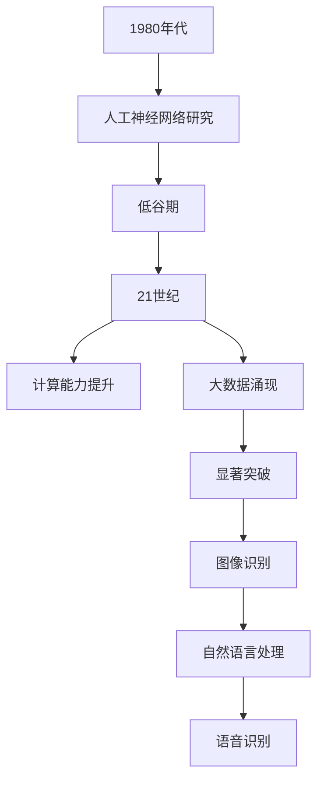
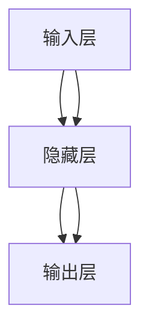
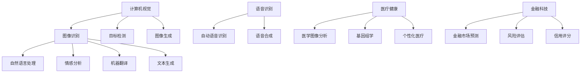
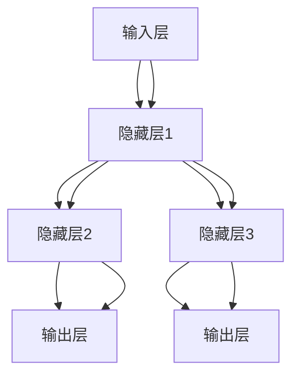
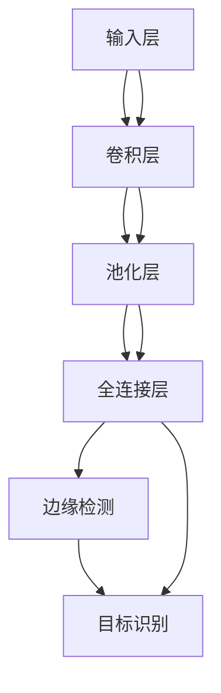
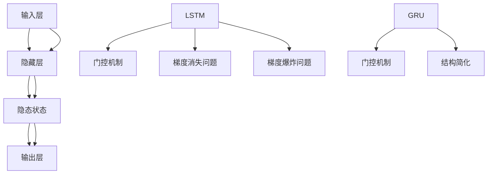

                 

## 文章标题

《AI人工智能深度学习算法：深度学习的挑战与前景》

### 关键词
- 深度学习
- 神经网络
- 计算机视觉
- 自然语言处理
- 强化学习
- 边缘计算

### 摘要
本文从深度学习的基本概念、核心算法、应用领域以及面临的挑战和未来前景四个方面，系统性地探讨了深度学习的发展与应用。通过对神经网络、卷积神经网络、循环神经网络、强化学习等核心算法的深入剖析，结合实际应用案例，展示了深度学习在计算机视觉、自然语言处理、医疗健康、工业自动化和金融领域的重要作用。同时，本文也对深度学习面临的技术挑战和未来发展进行了展望，为读者提供了全面而深入的深度学习知识体系。

## 第一部分：深度学习基础

### 第1章：深度学习简介

#### 1.1 深度学习的发展历程

深度学习（Deep Learning）作为人工智能（AI）的一个重要分支，起源于1980年代。当时，人工神经网络（Artificial Neural Networks,ANN）的研究逐渐受到关注，但由于计算资源限制和算法的局限性，深度学习的发展一度陷入低谷。进入21世纪，随着计算能力的提升和大数据的涌现，深度学习重新焕发生机，并在图像识别、自然语言处理、语音识别等领域取得了显著的突破。

**关键概念与联系图**：



#### 1.2 深度学习的基本概念

深度学习是一种机器学习（Machine Learning,ML）方法，通过多层神经网络模型，模拟人脑神经元结构和工作方式，对数据进行学习、推理和决策。深度学习模型通常包含输入层、隐藏层和输出层，通过前向传播和反向传播算法，实现数据的输入与输出。

**核心概念与联系图**：



#### 1.3 深度学习的应用领域

深度学习在多个领域取得了显著的进展，包括：

1. **计算机视觉**：深度学习在图像识别、目标检测、图像生成等方面表现出色。
2. **自然语言处理**：深度学习在情感分析、机器翻译、文本生成等领域具有广泛的应用。
3. **语音识别**：深度学习通过自动语音识别（ASR）和语音合成（TTS）技术，实现了人机交互的智能化。
4. **医疗健康**：深度学习在医学图像分析、基因组学、个性化医疗等领域发挥了重要作用。
5. **金融科技**：深度学习在金融市场预测、风险评估、信用评分等方面有着广泛的应用。

**应用领域图**：



### 第2章：深度学习基础算法

#### 2.1 神经网络基础

神经网络是深度学习的基础，其核心单元是神经元。神经元通过输入层接收数据，通过隐藏层进行信息处理，最终在输出层产生结果。

**神经元与神经网络图**：



**前向传播与反向传播算法**：

- **前向传播**：数据从输入层流向输出层，每个神经元将输入数据通过激活函数进行处理，最终得到输出结果。
- **反向传播**：计算输出结果与实际结果之间的误差，将误差反向传播到输入层，通过调整权重和偏置，优化模型参数。

**伪代码**：

```python
# 前向传播
for each layer in network:
    z = weighted_input + bias
    a = activation_function(z)

# 反向传播
for each layer in reverse order:
    delta = (expected_output - actual_output) * activation_derivative(a)
    weight_update = learning_rate * delta * input
    bias_update = learning_rate * delta
```

#### 2.2 深度学习优化算法

深度学习优化算法用于调整模型参数，以降低损失函数的值。常用的优化算法包括随机梯度下降（SGD）、Adam优化器等。

**随机梯度下降（SGD）**：

- SGD通过随机选择一部分样本，计算梯度并进行参数更新，以加速模型收敛。

**Adam优化器**：

- Adam结合了SGD和动量法的优点，通过自适应学习率，提高模型训练效率。

**核心公式**：

$$
\text{m} = \beta_1 \text{m} + (1 - \beta_1) \Delta \theta \\
\text{v} = \beta_2 \text{v} + (1 - \beta_2) \Delta \theta^2 \\
\theta_{\text{new}} = \theta - \alpha \frac{\text{m}}{\sqrt{\text{v}} + \epsilon}
$$

### 第3章：卷积神经网络（CNN）

卷积神经网络（Convolutional Neural Network,CNN）是深度学习在计算机视觉领域的重要应用，特别适用于图像处理任务。

**CNN的基本结构**：

- **卷积层**：通过卷积操作提取图像特征。
- **池化层**：对卷积层输出的特征进行降采样，减少参数量。
- **全连接层**：将特征映射到分类结果。

**CNN在图像处理中的应用**：

- **边缘检测**：卷积层通过特定卷积核提取图像边缘信息。
- **目标识别**：通过多层卷积和池化操作，提取目标特征并进行分类。

**核心概念与联系图**：



### 第4章：循环神经网络（RNN）

循环神经网络（Recurrent Neural Network,RNN）是一种能够处理序列数据的神经网络，特别适用于自然语言处理和时间序列分析。

**RNN的基本结构**：

- **隐态状态与隐藏层**：RNN通过隐藏层和隐态状态来维持序列信息。
- **梯度消失和梯度爆炸问题**：RNN在训练过程中容易出现梯度消失和梯度爆炸问题，影响训练效果。

**LSTM和GRU**：

- **LSTM（Long Short-Term Memory）**：LSTM通过引入门控机制，解决了RNN的梯度消失和梯度爆炸问题。
- **GRU（Gated Recurrent Unit）**：GRU简化了LSTM的结构，同时保持了良好的性能。

**核心概念与联系图**：



### 第5章：强化学习

强化学习（Reinforcement Learning,RL）是一种通过试错策略进行决策优化的机器学习方法，广泛应用于自动驾驶、游戏AI等领域。

**强化学习的基本概念**：

- **监督学习、无监督学习和强化学习的区别**：监督学习有明确的目标和标签，无监督学习没有标签，强化学习通过试错进行决策。
- **强化学习的核心要素**：状态、动作、奖励和策略。

**Q-Learning**：

- **Q-Learning**：Q-Learning是一种基于值函数的强化学习算法，通过不断更新Q值，实现策略优化。

**核心公式**：

$$
Q(s, a) = Q(s, a) + \alpha [r + \gamma \max_{a'} Q(s', a') - Q(s, a)]
$$

### 第6章：深度学习的挑战与前景

#### 6.1 深度学习的挑战

- **计算资源消耗**：深度学习模型通常需要大量的计算资源和存储空间，对硬件设施要求较高。
- **数据集的质量和数量**：高质量、大规模的数据集对于深度学习模型的训练至关重要。

#### 6.2 深度学习的未来发展

- **自动机器学习（AutoML）**：AutoML通过自动化模型选择、超参数调优等，降低深度学习模型的开发难度。
- **深度学习在边缘计算中的应用**：边缘计算将深度学习模型部署在靠近数据源的边缘设备上，提高实时处理能力。

### 第二部分：深度学习应用案例

### 第7章：计算机视觉应用案例

#### 7.1 人脸识别系统

人脸识别系统是深度学习在计算机视觉领域的典型应用，通过图像处理和深度学习算法，实现人脸检测和人脸识别。

**人脸检测算法**：

- 人脸检测算法通过图像预处理、特征提取和分类器模型，实现人脸位置的检测。

**人脸识别算法**：

- 人脸识别算法通过特征提取、特征比对和分类器模型，实现人脸身份的识别。

#### 7.2 无人驾驶汽车

无人驾驶汽车通过深度学习算法，实现车辆的感知、规划和控制。

**感知系统**：

- 感知系统通过摄像头、雷达和激光雷达等传感器，实现环境的感知和识别。

**控制系统**：

- 控制系统通过深度学习算法，实现车辆的路径规划和控制，实现自动驾驶功能。

### 第8章：自然语言处理应用案例

#### 8.1 情感分析系统

情感分析系统通过深度学习算法，实现文本的情感分类和情感倾向分析。

**文本预处理**：

- 文本预处理包括分词、词性标注、停用词过滤等步骤，为情感分析提供干净的文本数据。

**情感分类算法**：

- 情感分类算法通过深度学习模型，对文本进行情感分类，实现情感分析。

#### 8.2 聊天机器人

聊天机器人通过深度学习算法，实现自然语言理解、对话生成和用户交互。

**对话系统设计**：

- 对话系统设计包括对话管理、语言模型、对话生成等模块，实现用户的对话交互。

**语言模型与对话生成**：

- 语言模型通过深度学习模型，对用户输入进行理解，生成合适的回复。

### 第9章：医疗健康应用案例

#### 9.1 医学图像分析

医学图像分析通过深度学习算法，实现医学图像的处理、分析和诊断。

**医学图像处理技术**：

- 医学图像处理技术包括图像预处理、图像增强、图像分割等步骤，提高图像质量。

**肿瘤检测与分割**：

- 肿瘤检测与分割通过深度学习模型，实现肿瘤的检测、定位和分割。

#### 9.2 个性化医疗

个性化医疗通过深度学习算法，实现基因组数据分析、医疗决策支持等。

**基因组数据分析**：

- 基因组数据分析通过深度学习模型，对基因组数据进行分析，发现疾病相关的基因变异。

**医疗决策支持系统**：

- 医疗决策支持系统通过深度学习模型，提供个性化的医疗建议和治疗方案。

### 第10章：工业自动化应用案例

#### 10.1 质量检测与故障预测

质量检测与故障预测通过深度学习算法，实现产品质量的检测和故障的预测。

**数据采集与预处理**：

- 数据采集与预处理包括传感器数据采集、数据清洗和特征提取等步骤，为质量检测和故障预测提供数据支持。

**故障检测算法**：

- 故障检测算法通过深度学习模型，实现故障的检测和诊断。

#### 10.2 自动化生产线优化

自动化生产线优化通过深度学习算法，实现生产流程的优化和调度算法的优化。

**生产流程优化**：

- 生产流程优化通过深度学习模型，分析生产数据，优化生产流程，提高生产效率。

**基于深度学习的调度算法**：

- 基于深度学习的调度算法通过深度学习模型，实现生产任务的调度和优化，提高生产计划的合理性。

### 第11章：深度学习在金融领域的应用

#### 11.1 金融市场预测

金融市场预测通过深度学习算法，实现股票价格、外汇汇率等金融市场的预测。

**时间序列预测模型**：

- 时间序列预测模型通过深度学习模型，对金融市场的历史数据进行预测，分析市场趋势。

**股票价格预测案例分析**：

- 股票价格预测案例分析通过深度学习模型，对特定股票的价格进行预测，分析预测结果。

#### 11.2 风险管理与控制

风险管理与控制通过深度学习算法，实现金融风险的管理和控制。

**风险评估模型**：

- 风险评估模型通过深度学习模型，分析金融市场的风险，提供风险评估报告。

**信用评分系统**：

- 信用评分系统通过深度学习模型，对客户的信用状况进行评分，为金融机构提供信用评估依据。

### 附录

#### 附录A：深度学习常用库与工具

- **TensorFlow**：Google推出的开源深度学习框架，支持多种深度学习模型的搭建和训练。
- **PyTorch**：Facebook推出的开源深度学习框架，提供灵活的动态计算图支持。
- **Keras**：基于TensorFlow和PyTorch的开源深度学习库，简化深度学习模型的搭建和训练。

#### 附录B：深度学习数学基础

- **线性代数基础**：矩阵运算、向量空间、特征值和特征向量等基础概念。
- **微积分基础**：极限、导数、积分等基础概念。
- **概率论与统计基础**：随机变量、概率分布、统计估计等基础概念。

## 作者

作者：AI天才研究院/AI Genius Institute & 禅与计算机程序设计艺术 /Zen And The Art of Computer Programming

